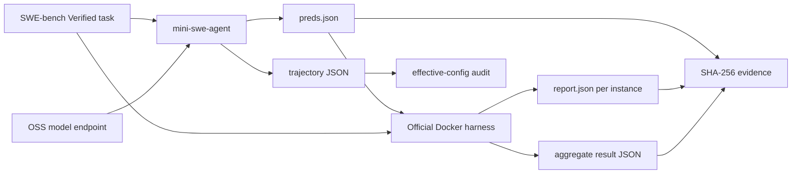
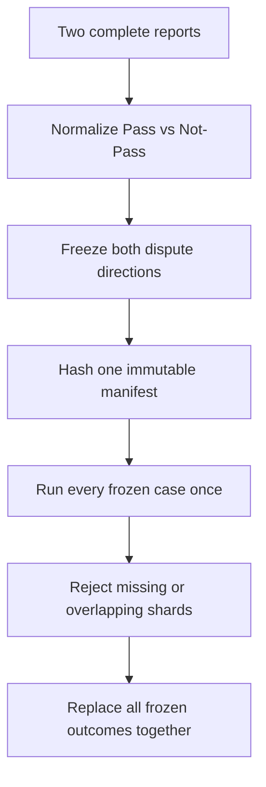

# OSS Model SWE-bench Evaluation Playbook

[](https://huggingface.co/datasets/princeton-nlp/SWE-Bench_Verified)
[](https://github.com/SWE-agent/mini-swe-agent/tree/v2.4.6)
[](https://github.com/SWE-bench/SWE-bench/commit/f7bbbb2ccdf479001d6467c9e34af59e44a840f9)
[](https://www.python.org/)

A complete workflow for evaluating an open-source coding model that exposes an OpenAI-compatible endpoint with function tool calls, using mini-swe-agent and the official SWE-bench Docker harness.

> **Author**: 魏新宇 (Xinyu Wei) — Microsoft AI and Apps Global Black Belt (GBB)

English | [中文版](README-CN.md) | [Best Practices](docs/methodology.md) | [Troubleshooting](docs/troubleshooting.md)

<div align="center">
  
</div>

## Executive Summary

SWE-bench does not send a prompt to a model and compare one text answer. It evaluates a **software-engineering Agent system**:

1. mini-swe-agent gives an issue and repository to an OSS model.
2. The model uses shell tools and generates a Git patch.
3. The official SWE-bench harness restores a task-specific Docker environment.
4. The harness applies the candidate patch and authoritative test patch.
5. The issue is Resolved only when the required tests pass without regressing existing tests.

This repo provides the complete path from a local OpenAI-compatible model endpoint to auditable official results:

| Stage | Input | Output | Gate |
|---|---|---|---|
| Endpoint preflight | Model URL and served model | `/v1/models` response | Expected model visible |
| Agent generation | Issue, repository, Agent YAML | `preds.json` + trajectories | Exact ID coverage and valid status |
| Effective-config audit | Trajectory `info.config` | Canonical config hash | One intended config after approved per-task fields |
| Official evaluation | Candidate patches | Per-instance reports + aggregate JSON | Docker harness exits cleanly |
| Differential retest | Two complete reports | Frozen bidirectional dispute manifest | No dynamic narrowing or best-of |
| Evidence seal | Completed files | `SHA256SUMS.txt` | No writers remain; manifest verifies |

The scripts are standard-library-first, fail closed on missing or overlapping cases, and contain no model-specific endpoint, credential, VM, or private dataset.

## 1. How SWE-bench Works

### 1.1 The Unit of Evaluation

[SWE-bench Verified](https://huggingface.co/datasets/princeton-nlp/SWE-Bench_Verified) contains 500 issue–pull request pairs that were human-validated as solvable. Each task includes fields such as:

| Field | Role in evaluation |
|---|---|
| `instance_id` | Stable task identifier, for example `owner__repo-1234` |
| `problem_statement` | GitHub issue title and description shown to the Agent |
| `base_commit` | Repository state before the solution pull request |
| `test_patch` | Authoritative tests derived from the solution pull request |
| `FAIL_TO_PASS` | Tests that should fail before the fix and pass after it |
| `PASS_TO_PASS` | Existing tests that must remain green |
| `environment_setup_commit` | Environment setup identity used by the harness |

The gold solution patch is used to define and validate the task, but the evaluated model never receives that solution patch.

### 1.2 Plane A: Agent Generation

mini-swe-agent creates a task container, checks out the repository at `base_commit`, gives the issue to the model, and exposes a `bash` tool. The model iteratively reads code, edits files, runs tests, and finally submits a patch.

Generation produces two primary artifacts:

- `preds.json`: one candidate patch per instance.
- `<instance_id>/<instance_id>.traj.json`: messages, tool observations, effective config, exit status, token/call statistics, and final patch lineage.

Generation itself does **not** determine whether a task is Resolved.

### 1.3 Plane B: Official Docker Evaluation

The official harness runs each candidate patch in the task's evaluation image. Conceptually it:

1. Restores the repository and environment.
2. Applies the candidate patch.
3. Applies the official test patch.
4. Runs the task-specific test command.
5. Parses `FAIL_TO_PASS` and `PASS_TO_PASS` results.

A task is Resolved when the patch applies and the required tests pass without regressions. Empty patches and execution errors remain separate categories; they must not be silently converted to Unresolved.

### 1.4 Why Docker Matters

Each task may require a different repository version, Python version, system package set, and test command. The official harness uses Docker images to isolate those environments. The SWE-bench project recommends an x86_64 host with approximately 120GB free storage, 16GB RAM, and 8 CPU cores for local evaluation.

### 1.5 Why Generation and Evaluation Must Stay Separate

The two planes fail differently:

| Generation failure | Evaluation failure |
|---|---|
| Model endpoint unavailable | Candidate patch does not apply |
| Tool-call formatting error | Required tests fail |
| Agent step/cost limit | Existing tests regress |
| Docker task image cannot start | Test execution timeout |
| Empty patch | Harness or Docker execution error |

Mixing these categories corrupts accuracy and makes reruns unauditable.

## 2. Architecture and Artifacts



Recommended run layout:

```text
runs/<run-id>/
├── generation/
│   ├── preds.json
│   ├── <instance-id>/<instance-id>.traj.json
│   ├── generation-summary.json
│   └── generation.log
├── official-eval/
│   ├── logs/run_evaluation/.../report.json
│   ├── aggregate.json
│   └── harness.log
├── contract.json
└── SHA256SUMS.txt
```

## 3. Quick Start

### 3.1 Prerequisites

- Linux x86_64 host
- Docker Engine with enough disk for SWE-bench task images
- Python 3.12 (the validated clean-room version)
- An OSS coding model served through `/v1/models` and `/v1/chat/completions` with OpenAI-style function tool calls
- GPU resources appropriate for the selected model

### 3.2 Install the Pinned Toolchain

```bash
git clone https://github.com/david-xinyuwei/david-share.git
cd david-share/Deep-Learning/OSS-Model-SWE-bench-Evaluation-Playbook

python3 -m venv .venv
source .venv/bin/activate
python -m pip install --upgrade pip
bash scripts/setup_environment.sh
```

The default setup uses `requirements-lock.txt`, generated from the validated Linux x86_64 / Python 3.12.3 environment. `requirements.txt` records the direct Agent dependency for maintainers. The toolchain pins:

- mini-swe-agent `v2.4.6`
- SWE-bench commit `f7bbbb2ccdf479001d6467c9e34af59e44a840f9`

That SWE-bench commit fixes new-file-only test patches that could otherwise reset the entire working tree during evaluation.

The setup script keeps the pinned SWE-bench checkout and installs it in editable mode. A direct VCS wheel build can omit non-Python harness fixtures in some revisions; retaining the checkout avoids that packaging failure.
Set `REQUIREMENTS_FILE=./requirements.txt` only when deliberately resolving a fresh dependency set, then capture and audit the resulting `pip freeze` before comparing scores.

### 3.3 Verify the Model Endpoint

```bash
export MODEL_API_BASE="http://127.0.0.1:8000/v1"
export MODEL_NAME="hosted_vllm/your-model"
export MODEL_API_KEY="EMPTY"

curl --fail --silent "$MODEL_API_BASE/models" | python -m json.tool
```

Set `MODEL_NAME` to the name expected by your LiteLLM-compatible provider. Do not put a real key in YAML or shell history; load it from a secure environment source.
`run_generation.sh` maps `MODEL_API_KEY` to LiteLLM's `HOSTED_VLLM_API_KEY` environment variable and does not place the value in the child process arguments.

### 3.4 Run a One-Case Canary

```bash
export OUTPUT_DIR="runs/canary/generation"
export WORKERS=1
export INSTANCE_FILTER='^astropy__astropy-7166$'

bash scripts/run_generation.sh 2>&1 | tee runs/canary/generation.log

python scripts/validate_predictions.py \
  --run-dir "$OUTPUT_DIR" \
  --expected-count 1 \
  --summary runs/canary/generation-summary.json

python scripts/audit_effective_configs.py --run-dir "$OUTPUT_DIR"
```

Then score the canary:

```bash
export PREDICTIONS_PATH="$OUTPUT_DIR/preds.json"
export RUN_ID="oss-model-canary"
export REPORT_DIR="runs/canary/official-eval"
export MAX_WORKERS=1

bash scripts/run_official_harness.sh 2>&1 | tee runs/canary/harness.log
```

Do not start a full run until both generation and official scoring produce valid artifacts.

### 3.5 Run SWE-bench Verified

```bash
unset INSTANCE_FILTER
export OUTPUT_DIR="runs/full/generation"
export WORKERS=8

bash scripts/run_generation.sh 2>&1 | tee runs/full/generation.log

python scripts/validate_predictions.py \
  --run-dir "$OUTPUT_DIR" \
  --expected-count 500 \
  --summary runs/full/generation-summary.json

python scripts/audit_effective_configs.py --run-dir "$OUTPUT_DIR"
```

Run the official harness only after all 500 generation artifacts pass validation:

```bash
export PREDICTIONS_PATH="$OUTPUT_DIR/preds.json"
export RUN_ID="oss-model-swebench-verified"
export REPORT_DIR="runs/full/official-eval"
export MAX_WORKERS=4
export TIMEOUT_SECONDS=1800

bash scripts/run_official_harness.sh 2>&1 | tee runs/full/harness.log
```

Worker counts are examples, not universal defaults. Validate them against model capacity, Docker storage behavior, CPU, memory, and disk throughput.

## 4. Full Workflow

### Step 1: Freeze an Asset Matrix

Create a machine-readable contract before generation:

```json
{
  "dataset": "princeton-nlp/SWE-Bench_Verified",
  "split": "test",
  "expected_cases": 500,
  "mini_swe_agent": "2.4.6",
  "agent_config_sha256": "<sha256>",
  "agent_step_limit": 250,
  "agent_cost_limit": 3.0,
  "python_packages_sha256": "<sha256>",
  "model_revision": "<public-model-revision>",
  "generation_workers": 8,
  "swe_bench_commit": "f7bbbb2ccdf479001d6467c9e34af59e44a840f9",
  "harness_workers": 4,
  "harness_timeout_seconds": 1800
}
```

Hash executable inputs:

```bash
python scripts/hash_assets.py configs --output runs/full/config-SHA256SUMS.txt
python -m pip freeze > runs/full/python-packages.txt
sha256sum runs/full/python-packages.txt
```

### Step 2: Capture the Effective Config

YAML files are inputs; trajectory `info.config` is runtime truth. Audit all trajectories after generation:

```bash
python scripts/audit_effective_configs.py \
  --run-dir runs/full/generation \
  --ignore environment.image \
  --ignore agent.output_path
```

A nonzero exit means more than one normalized config was observed.

### Step 3: Classify Generation Outcomes

Keep these categories separate:

| Status | Meaning | Scoring treatment |
|---|---|---|
| `Submitted` | Agent submitted a patch | Send to official harness |
| `LimitsExceeded` | Agent hit a declared limit | Preserve; patch may be empty or non-empty |
| `TimeExceeded` | Agent hit its wall-time limit | Preserve as a declared Agent outcome |
| `RepeatedFormatError` | Tool/response format repeatedly failed | Usually Empty; preserve trajectory |
| Infrastructure exception | Task environment did not start correctly | Isolate and retry only under frozen config |

### Step 4: Run Official Scoring

Pin all harness controls:

- Dataset and split
- SWE-bench source commit
- Namespace
- Per-instance timeout
- Docker cache level
- `--clean true`
- Worker count
- Run ID and working directory

The aggregate JSON may be written to the current working directory in some versions even when per-instance reports are under `--report_dir`. `run_official_harness.sh` changes into the resolved report directory before invoking the harness so logs and the aggregate stay together; accept exactly one aggregate.

### Step 5: Merge Disjoint Shards

If generation or scoring is split across nodes:

```bash
python scripts/merge_official_reports.py \
  --report runs/node-a/aggregate.json \
  --report runs/node-b/aggregate.json \
  --expected-count 500 \
  --output runs/merged/aggregate.json
```

The merger fails if an instance appears in more than one shard.

### Step 6: Seal the Run

After all writers exit:

```bash
python scripts/hash_assets.py runs/full --output runs/full/SHA256SUMS.txt
(cd runs/full && sha256sum -c SHA256SUMS.txt)
```

## 5. Best Practices

### BP1. Pin Source, Not Just Version Labels

Package versions can hide source drift. Record the exact mini-swe-agent tag and SWE-bench commit. For scoring-sensitive fixes, install or mount the intended checkout and verify the imported file path.

### BP2. Start With a Scored Canary

The canary must complete both planes. A generated patch without an official report is only half a validation.

### BP3. Keep Retry Semantics Explicit

Retry infrastructure failures only. Model and test failures are benchmark outcomes, not operational incidents.

### BP4. Freeze Bidirectional Disputes

Never retest only the direction that can improve your score. Freeze both directions once:

```bash
python scripts/build_dispute_manifest.py \
  --reference-report reference-full.json \
  --candidate-report candidate-full.json \
  --expected-count 500 \
  --output runs/differential/frozen-disputes.tsv
```

### BP5. Never Dynamically Shrink a Retest Set

Cases that happen to agree in an intermediate round must not be retained while only remaining disagreements receive extra attempts. That is optional stopping and creates a hidden best-of score.

Finalize only after every frozen dispute has exactly one retest outcome:

```bash
python scripts/finalize_frozen_disputes.py \
  --reference-report reference-full.json \
  --baseline-report candidate-full.json \
  --expected-count 500 \
  --dispute-manifest runs/differential/frozen-disputes.tsv \
  --retest-report runs/differential/node-a.json \
  --retest-report runs/differential/node-b.json \
  --output-dir runs/differential/final
```

### BP6. Separate Effect From Mechanism

A score change proves an observed effect under the recorded run. It does not by itself prove which kernel, prompt, scheduler, or dependency caused the change.

### BP7. Count Progress From Artifacts

Use growing predictions, trajectories, reports, test output, and logs. A live PID, active service, or healthy endpoint alone is not workload progress.

### BP8. Seal Only Quiescent Files

Create SHA manifests after writers stop. Never hash a log that is still growing.

### BP9. Preserve Phase Lineage

Do not overwrite full-run files with canary or retest output. Link phases through source hashes and explicit run IDs.

### BP10. Publish Placeholders, Not Infrastructure

Public examples use loopback endpoints, public model IDs, and synthetic fixtures. Private endpoints, VM identities, credentials, local paths, and customer artifacts do not belong in a public Repo.

Full guidance: [docs/methodology.md](docs/methodology.md).

## 6. Frozen-Dispute Retesting

Use targeted retesting only after two complete reports exist.

### Correct Protocol



### Invalid Protocols

- Retesting only Reference-Pass/Candidate-Fail cases.
- Retrying an Empty or Fail until it passes, then keeping the pass.
- Shrinking the dispute set after each round.
- Mixing canary, full, infrastructure retry, and differential outcomes without lineage.

## 7. Problems and Troubleshooting

The complete guide is in [docs/troubleshooting.md](docs/troubleshooting.md).

| Problem | Root cause to check first | Safe response |
|---|---|---|
| Generation is much slower | Agent version, limits, prompt, workers | Compare effective configs and canary calls |
| Docker exit 125 | Image pull, disk, stale container | Preserve error; pre-pull exact image; retry infrastructure only |
| Empty patch | Format or Agent limit | Keep Empty category; inspect trajectory |
| Temperature 0 still differs | Multi-turn/runtime nondeterminism | Report variability; do not promise byte identity |
| Same patch, different result | Harness source, image, timeout, host timing | Pin commit and preserve test logs |
| Same package version, different score | Installed source drift | Install/mount exact commit |
| Aggregate path unexpected | Harness version behavior | Use dedicated cwd; locate exactly one aggregate |
| Official timeout | Slow tests or host load | Keep Error unless retry policy was frozen in advance |
| One-direction retest | Selection bias | Freeze both directions |
| Dispute set shrinks each round | Optional stopping / hidden best-of | Return to original frozen set |
| Shards overlap | Partition bug | Fail merge; fix manifest |
| Service active but no output | Lifecycle signal without workload progress | Check artifacts, containers, logs and runtime activity |
| SHA fails after creation | Writer still active | Stop writers, then regenerate manifest |

## 8. Evidence and Reporting

Minimum report fields:

```json
{
  "dataset": "princeton-nlp/SWE-Bench_Verified",
  "split": "test",
  "resolved": 0,
  "unresolved": 0,
  "empty": 0,
  "errors": 0,
  "total": 500,
  "accuracy_pct": 0.0,
  "generation_run_id": "<run-id>",
  "harness_run_id": "<run-id>",
  "agent_version": "2.4.6",
  "harness_commit": "f7bbbb2ccdf479001d6467c9e34af59e44a840f9"
}
```

Report Empty and Error counts explicitly. Accuracy uses the full declared denominator; do not divide only by completed reports unless clearly labeled as a secondary diagnostic.

## 9. Validation

```bash
make validate
make test
```

Current deterministic coverage includes:

- Bidirectional dispute detection.
- Full frozen-set replacement.
- Missing-case rejection.
- Overlapping-shard rejection.
- Python and Shell syntax.
- Public-boundary and bilingual documentation checks.

Maintainer details: [docs/validation.md](docs/validation.md).
The [offline synthetic example](examples/README.md) exercises frozen-dispute arithmetic without a model endpoint or Docker; it is a test fixture, not a measured benchmark.

The local gate should end with these markers:

```text
REPO_VALIDATION=PASS
...
OK
```

### Cleanup Boundary

- Keep `--clean true` enabled so the harness removes instance-specific resources after evaluation.
- Preserve reports, logs, contracts, and verified SHA manifests before reclaiming storage.
- Inspect `docker system df` before pruning. Do not run broad Docker cleanup while another evaluation is active.
- Remove a local `runs/<run-id>/` directory only after its archive and outer hash have been verified.

## 10. Security and Public Boundary

- Read API keys from environment variables or a secure local store.
- Never print or commit tokens.
- Use public model identifiers and placeholder endpoints.
- Do not publish customer issue subsets, private benchmark outputs, VM addresses, internal registries, or absolute local paths.
- Review every log and screenshot before publication.

## 11. Official Sources

- [mini-swe-agent v2.4.6](https://github.com/SWE-agent/mini-swe-agent/tree/v2.4.6)
- [mini-swe-agent documentation](https://mini-swe-agent.com/latest/)
- [SWE-bench official Repo](https://github.com/SWE-bench/SWE-bench)
- [Pinned SWE-bench commit](https://github.com/SWE-bench/SWE-bench/commit/f7bbbb2ccdf479001d6467c9e34af59e44a840f9)
- [SWE-bench Verified dataset](https://huggingface.co/datasets/princeton-nlp/SWE-Bench_Verified)
- [SWE-bench paper](https://arxiv.org/abs/2310.06770)

See [docs/sources.md](docs/sources.md) for the source registry.

## 12. Related Repositories

| Repository | Relationship |
|---|---|
| [OAI-OSS-on-Azure](../OAI-OSS-on-Azure/) | Serving and tuning open-weight models on Azure |
| [MiMo-V2.5-Pro-on-MI300X-Benchmark](../MiMo-V2.5-Pro-on-MI300X-Benchmark/) | Large OSS model inference and benchmark evidence discipline |
| [Qwen3-VL-Product-Tagging-on-Azure](../Qwen3-VL-Product-Tagging-on-Azure/) | Schema-first validation and evidence-rich benchmark structure |
