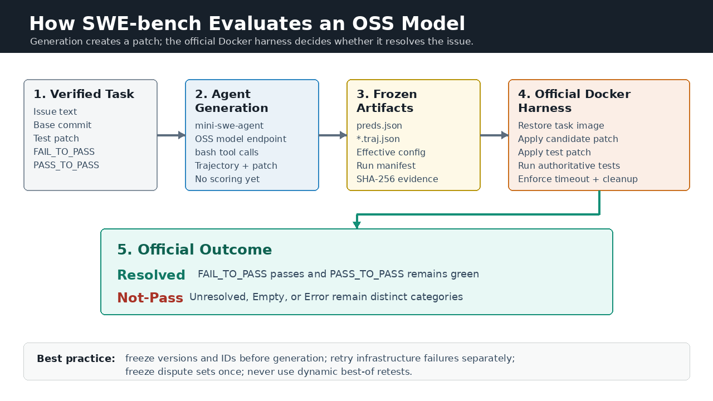
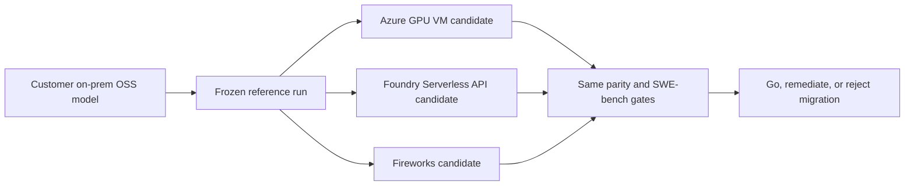
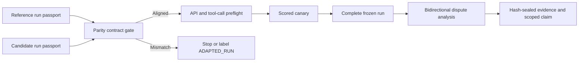
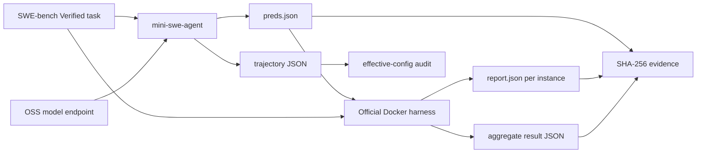
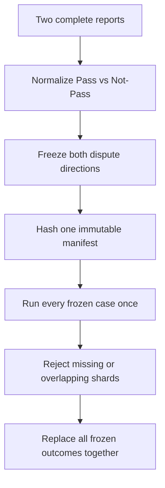

# OSS Model SWE-bench Evaluation Playbook

[](https://huggingface.co/datasets/princeton-nlp/SWE-Bench_Verified)
[](https://github.com/SWE-agent/mini-swe-agent/tree/v2.4.6)
[](https://github.com/SWE-bench/SWE-bench/commit/f7bbbb2ccdf479001d6467c9e34af59e44a840f9)
[](https://www.python.org/)

A production-oriented workflow for measuring OSS coding-model accuracy before and after migration to Azure GPU VM, Microsoft Foundry Serverless API, or Fireworks, and before and after fine-tuning, using one frozen SWE-bench contract.

> **Author**: 魏新宇 (Xinyu Wei) — Microsoft AI and Apps Global Black Belt (GBB)

English | [中文版](README-CN.md)

<div align="center">
  
</div>

## Executive Summary

SWE-bench does not send a prompt to a model and compare one text answer. It evaluates a **software-engineering Agent system**:

1. mini-swe-agent gives an issue and repository to an OSS model.
2. The model uses shell tools and generates a Git patch.
3. The official SWE-bench harness restores a task-specific Docker environment.
4. The harness applies the candidate patch and authoritative test patch.
5. The issue is Resolved only when the required tests pass without regressing existing tests.

This repo provides the complete path from an on-premises, cloud, Microsoft Foundry, or Fireworks model endpoint to auditable official results:

| Stage | Input | Output | Gate |
|---|---|---|---|
| Endpoint preflight | Model URL and served model | Chat-completions tool-call response | HTTP success and at least 1 valid `ping` function tool call |
| Agent generation | Issue, repository, Agent YAML | `preds.json` + trajectories | Exact ID coverage and valid status |
| Effective-config audit | Trajectory `info.config` | Canonical config hash | One intended config after approved per-task fields |
| Official evaluation | Candidate patches | Per-instance reports + aggregate JSON | Docker harness exits cleanly |
| Differential retest | Two complete reports | Frozen bidirectional dispute manifest | No dynamic narrowing or best-of |
| Evidence seal | Completed files | `SHA256SUMS.txt` | No writers remain; manifest verifies |

The scripts are standard-library-first, fail closed on missing or overlapping cases, and contain no model-specific endpoint, credential, VM, or private dataset.

## Business Value and Production Modes

Customers often hesitate to migrate or fine-tune an OSS model because a healthy endpoint does not prove that software-engineering accuracy has been preserved. This playbook turns that concern into a controlled go/no-go measurement.

### The Customer Decision This Repo Solves

A customer already runs and trusts an open-source model on-premises. They want to move that **same model** to Azure GPU VM, a direct Microsoft Foundry Serverless API deployment, or Fireworks without losing software-engineering accuracy. Managed Compute is tracked separately as a pending path until its data plane passes the same canary. Their first question is not whether the new endpoint returns HTTP 200, or even whether it is faster. It is:

> Under the same model, Agent, SWE-bench workload, and official scorer, did the migration preserve accuracy?



The value is therefore broader than a benchmark runner:

- **Accuracy-preservation contract:** prove whether the same OSS model keeps its engineering ability after migration.
- **Substrate-neutral decision:** compare three primary hosting paths with one Agent, one dataset, one scorer, and one evidence model.
- **Root-cause separation:** distinguish model regression, provider/API incompatibility, serving-capacity limits, Agent drift, and harness faults.
- **Auditable go/no-go:** deliver a full denominator, per-case regressions, machine-readable contracts, and immutable evidence instead of a dashboard-only score.

If the exact customer model isn't available on a candidate platform and a different model is tested instead, the workflow remains useful, but the claim changes from platform migration to `MODEL_SELECTION_METHOD_ALIGNED`. The Repo prevents that distinction from being hidden.

| Business decision | Reference run | Candidate run | What the result can establish |
|---|---|---|---|
| Move an on-premises OSS model to a managed platform | On-premises or AMD-based OpenAI-compatible endpoint | Microsoft Foundry or Fireworks deployment | Whether the same model and revision preserve SWE-bench accuracy after platform migration |
| Move from another cloud to a managed platform | Existing cloud endpoint | Microsoft Foundry or Fireworks deployment | Whether the target platform meets the customer's predeclared accuracy threshold |
| Validate fine-tuning | Base model | Fine-tuned deployment on the same platform | Which tasks improved, regressed, stayed stable, or failed operationally |
| Select a production model | Existing production model | A different candidate, such as an Azure Foundry Fireworks GLM deployment | Comparative model quality; this is not a platform-only migration claim |

**Single-variable rule:** a platform-migration claim requires the same model family, weight revision, Agent config, dataset, concurrency, and harness. Comparing an AMD-hosted model with a different Fireworks GLM model changes both model and platform, so the result is a model-selection comparison, not proof that Fireworks alone caused the difference.

### Evidence Boundary

- **Validated reference path:** the methodology was derived from and exercised on an AMD-based, on-premises-style OpenAI-compatible endpoint.
- **Azure GPU VM path:** the `openai_compatible` runner, exact-reproduction contract and official-scoring workflow are implemented and tested. No Azure GPU VM full migration score is published yet.
- **Microsoft Foundry Serverless API path:** on `2026-07-31`, a Fireworks model sold through Foundry and identified by the management plane as `FW-GLM-5.1` passed the HTTP 200 preflight with 1 function tool call and a request ID. mini-swe-agent `2.4.6` then submitted 1 non-empty patch for `astropy__astropy-7166`; the pinned official harness classified it Resolved with 0 errors and 0 unstopped containers. This validates the Foundry Serverless API compatibility path only, not a full score. See the [sanitized machine-readable evidence](examples/live-foundry-fw-glm51-scored-canary.yaml).
- **Fireworks public API path:** the `fireworks` mode is implemented and shape-tested against the pinned LiteLLM provider, routes to `api.fireworks.ai`, and keeps secrets out of process arguments. No Fireworks public API scored result is published yet.
- **Managed Compute pending:** no Managed Compute score or data-plane validation is published. A live deployment reached control-plane `Succeeded`, but its authenticated `/openai/v1` chat route still returned HTTP 500 `Model service is unavailable`; it therefore remains `PENDING / NOT VERIFIED` until the Portal-published client route passes the same tool-call plus scored-canary gates.
- **Not yet claimed:** no full migration score for any of the three primary paths is published until the declared full run completes. The 1-case Foundry outcome is a compatibility gate, not a `1/500` accuracy result or a model comparison. A future GLM 5.2 display name must be replaced by the exact deployment/model ID before execution.

### Supported Endpoint Modes

| `ENDPOINT_MODE` | Intended platform | Model naming | Authentication source |
|---|---|---|---|
| `openai_compatible` | On-premises, AMD validation environment, or another OpenAI-compatible cloud | `hosted_vllm/<served-name>`; prefix is added when omitted | `HOSTED_VLLM_API_KEY` or `MODEL_API_KEY`; `EMPTY` is allowed for an unauthenticated local endpoint |
| `azure_foundry` | Microsoft Foundry Models v1 endpoint, including direct Serverless API deployments and Fireworks models sold through Azure; Managed Compute remains pending live data-plane validation | The deployment name is sent through the OpenAI-compatible route; `hosted_vllm/` is added internally | `AZURE_API_KEY`, `AZURE_OPENAI_API_KEY`, `AZURE_AD_TOKEN`, or `MODEL_API_KEY`, mapped to a Bearer credential without entering argv |
| `fireworks` | Fireworks serverless, account model, or direct-route deployment | `fireworks_ai/<exact-model-id>`; prefix is added when omitted | `FIREWORKS_AI_API_KEY` or `MODEL_API_KEY` |

Every generation run writes `provider-contract.json` with endpoint mode, business scenario, run label, model name, API base, non-secret auth variable name, workers, dataset, and config. It never stores the credential value.

Supported `EVALUATION_SCENARIO` values are `single_endpoint`, `onprem_to_managed`, `cloud_to_managed`, and `base_vs_finetuned`.

## On-Prem-to-Managed Parity Framework

A migration benchmark is defensible only when the reference and candidate are aligned at every layer that can change the outcome. "Both endpoints return HTTP 200" proves API access, not model parity. "Both use mini-swe-agent 2.4.6" proves a version label, not identical prompts, defaults, source, or retry semantics.

### The Alignment Ladder

| Layer | Freeze or prove | Why it matters |
|---|---|---|
| Claim | Platform migration, fine-tuning, or model selection | Determines which differences are intentional |
| Model identity | Family, revision, weight SHA-256, tokenizer SHA-256, precision | Prevents different weights from being presented as a platform-only comparison |
| Agent identity | Package hash, effective config, system prompt, tool schema, limits | Multi-turn behavior changes when any one of these drifts |
| API semantics | Protocol, tool schema, finish reasons, replayed messages | OpenAI-compatible does not mean every provider accepts identical metadata |
| Workload | Dataset revision, execution-image manifest, partition, denominator, sampling, workers and retry policy | Prevents hidden selection, environment drift and concurrency bias |
| Scoring | Harness source, dependency lock, images, timeout, cache and clean policy | The same patch can score differently under a different evaluator environment |
| Evidence | Trajectories, reports, process command line, hashes and phase lineage | Makes every claim independently auditable |

For a platform-migration comparison, endpoint, authentication, serving runtime, accelerator, topology, and deployment name may legitimately differ. Those differences describe the **platform plus serving stack** being measured; they do not support a hardware-only or runtime-only causal claim. Model identity, Agent behavior, workload, sampling, concurrency, and scoring remain invariant.

### Claim Strength Is Computed, Not Chosen

| Classification | Evidence contract | Permitted claim |
|---|---|---|
| `MODEL_AND_METHOD_ALIGNED` | Model and tokenizer identities verified; all method invariants match | Same-model end-to-end migration comparison |
| `FINETUNING_METHOD_ALIGNED` | Base and fine-tuned weights intentionally differ; platform and method invariants match | Controlled base-versus-fine-tuned comparison |
| `MODEL_SELECTION_METHOD_ALIGNED` | Models may differ; Agent, workload and scoring invariants match | Combined model-selection comparison, not a platform-only claim |
| `METHOD_ALIGNED` | Method invariants match, but at least one identity hash is `UNVERIFIED` | Method-aligned comparison with an explicit provenance caveat |
| `ADAPTED_RUN` | A behavior-affecting mismatch was explicitly allowlisted | Measured adapted run; not an exact or fully aligned replay |
| `NOT_COMPARABLE` | An invariant differs without approval | Do not calculate or publish a migration delta |

The comparator fails closed. A custom exception supplied through `--allow-difference` still produces `ADAPTED_RUN` and exits for review unless `--accept-adapted` is also explicit.

```bash
python scripts/compare_run_contracts.py \
  --reference examples/parity-reference.toml \
  --candidate examples/parity-candidate.toml \
  --scenario platform_migration \
  --output runs/parity-report.json
```

The checked-in synthetic example ends with:

```text
PARITY_GATE=PASS scenario=platform_migration classification=MODEL_AND_METHOD_ALIGNED
```

### Reference-to-Candidate Execution Flow



### Generalized Lessons From Real Multi-Node Evaluations

| Failure pattern | Hidden risk | General gate |
|---|---|---|
| Package versions match, imported source differs | Editable installs, mounts, or path precedence change behavior | Record imported file paths and hash scoring-sensitive source |
| A preview sample and the live control plane disagree | A documented asset reference or API field is already stale | Freeze the API version, preserve the server error, and change only the field proven by the live response |
| Provisioning exceeds its typical duration | A live create LRO can look stalled; delete can return conflict while allocation is active | Correlate provisioning state, quota usage, Activity Log and delete response; never create a duplicate blindly |
| The reference launcher exists, but a rewritten launcher runs | Parameters can look equal while environment and control flow differ | Bind actual process command line and executable SHA-256 to the run |
| Effective configs match, trajectories differ | A multi-turn Agent is not deterministic at temperature zero | Preserve per-turn trajectories and report variability as an observed effect |
| A single tool call passes, later turns fail | Provider-only response metadata is replayed into a stricter schema | Require a multi-turn scored canary, not only an HTTP health request |
| Endpoint is healthy, artifacts stop growing | Health is a lifecycle signal, not workload progress | Use side-effect-free health probes plus predictions, reports, logs and runtime activity |
| Worker count or retry policy changes | Request interleaving changes tool observations and later Agent decisions | Freeze concurrency, queueing, timeout and retry semantics before generation |
| Long requests cross the active-context limit | Silent truncation or stalls become false model failures | Record required context and fail before a run whose serving capacity is too small |
| Host cache is available | A secondary cache does not automatically enlarge active-sequence GPU capacity | Validate each memory tier against the limit it actually controls |
| Infrastructure exceptions are counted as model failures | Operational faults depress accuracy and hide reliability problems | Keep Resolved, Unresolved, Empty and Error as separate exhaustive categories |
| Identical patch bytes receive different scores | Harness source, image, timing or timeout changed | Pin evaluator source and preserve per-instance test output |
| Only favorable disagreements are retested | Optional stopping creates a hidden best-of score | Freeze both disagreement directions once and replace them together |
| End-to-end task time is called model speed | Shell tools, repository tests and official scoring dominate different phases | Report API latency, tool time, generation wall time and harness time separately |

### Customer Migration Acceptance Gates

1. **Reference gate:** capture the customer's actual server launcher, Agent config, dependency lock, model/tokenizer identity and original per-instance artifacts.
2. **Parity gate:** compare machine-readable run passports and stop on unapproved invariant drift.
3. **Capability gate:** validate tool-call correctness, multi-turn replay, one generated patch and one official report.
4. **Full evidence gate:** run the frozen denominator, classify every case, seal artifacts, then publish only the claim supported by the computed classification.

This sequence keeps Microsoft-side deployment flexible while making every unavoidable difference visible. A managed service does not need to reproduce the customer's GPU topology byte for byte; it does need to prove that the model, Agent, workload, scoring contract, API behavior, and evidence semantics remain aligned.

### Serving Topology: P/D Disaggregation or Independent Endpoints?

Prefill/decode (P/D) disaggregation and independent replicas solve different problems. P/D creates one logical endpoint whose prefill and decode roles can run on different workers. Independent replicas load a complete model on each endpoint and divide independent SWE-bench tasks between them.

| Topology | Prefer it when | Main risk |
|---|---|---|
| P/D disaggregation | The model or KV workload needs role specialization; measured prefill/decode imbalance justifies the extra coordination | Cross-node communication, head-of-line blocking, role recovery coupling and one larger failure domain |
| Two independent endpoints | The model fits on each endpoint and tasks are independent; aggregate cases/hour and fault isolation matter | Duplicate model memory and the need for a strict disjoint-shard/merge contract |

In one large OSS coding-model evaluation, one cross-node P/D endpoint was slower and less stable than two independent endpoints processing half of the frozen manifest each. That is an observed workload result, not a universal claim that P/D is slower. The correct decision process is:

1. Freeze one representative calibration manifest and the complete model/Agent/sampling contract.
2. Run it once through the P/D endpoint and once through independent endpoints.
3. Compare valid generation cases/hour, per-case generation wall time, API latency distribution, Error rate, restart count and GPU utilization. Keep official scoring time separate because it doesn't measure model serving.
4. Select the topology before the full run. A topology change starts a new runtime epoch; don't merge results across epochs as one homogeneous score.
5. If independent endpoints win, split the **same frozen full manifest** deterministically and merge only disjoint official reports.

```bash
python scripts/shard_instance_manifest.py \
  --manifest examples/instance-manifest.tsv \
  --shards 2 \
  --output-dir outputs/two-endpoint-shards

# Node A
export INSTANCE_MANIFEST="outputs/two-endpoint-shards/shard-000.tsv"
bash scripts/run_generation.sh

# Node B
export INSTANCE_MANIFEST="outputs/two-endpoint-shards/shard-001.tsv"
bash scripts/run_generation.sh
```

Expected sharding marker:

```text
SHARD_MANIFEST=PASS cases=6 shards=2 counts=3,3
```

Each generation run writes the selected manifest SHA-256 into `provider-contract.json`. After official scoring, merge the two aggregate reports with `merge_official_reports.py`; overlap, duplicate IDs, or an incomplete union fail closed.

### Agent Version and Sampling Are Part of the Benchmark

SWE-bench measures a system, not a naked model. The score is a function of the model, Agent version, instructions, tool schema, sampling, serving behavior and scorer. A newer Agent can improve provider compatibility and tool-call handling, but silently upgrading it destroys comparability.

- **Use a sufficiently recent Agent, then pin it.** This Repo validates mini-swe-agent `2.4.6`. Don't use a mutable `latest` image or assume another machine's package with the same label has identical source.
- **Keep the same Agent on both sides of a migration.** Freeze package SHA-256, imported source, effective config, system prompt, tool schema, step/cost/wall-time limits and output/status semantics.
- **Freeze sampling explicitly.** Temperature, top-p, maximum output tokens, seed, parallel-tool policy, server sampling backend and generation worker count can all change the trajectory.
- **Treat an Agent upgrade as a new experiment.** Run a scored canary, assign a new run ID and compare versions separately. Don't splice old and new Agent outcomes into one accuracy score.
- **Temperature zero isn't deterministic.** Multi-turn tool observations, backend scheduling and tied token choices can still produce different calls and patches; retain every trajectory and analyze paired disagreements.

The parity comparator rejects Agent-version, sampling, partition and retry-policy drift for a platform-migration claim. If a customer intentionally accepts one of those changes, it must be declared through an explicit adaptation and the result is labeled `ADAPTED_RUN`.

## Three Deployment Test Playbooks

The three primary paths use the same backbone: capture the customer's reference passport, pass the parity gate, verify multi-turn tool calling, complete a scored canary, run the frozen SWE-bench denominator, and analyze bidirectional per-case differences. Only the platform-specific deployment and evidence surfaces change.

| Candidate path | `ENDPOINT_MODE` | Platform-specific evidence | Strongest valid claim |
|---|---|---|---|
| Azure GPU VM | `openai_compatible` | Image, model/tokenizer hashes, actual launcher, runtime commit, driver, GPU topology and context capacity | `MODEL_AND_METHOD_ALIGNED` when the same weights and method are verified |
| Foundry Serverless API | `azure_foundry` | Exact model format/name/version, deployment SKU and scope, TPM capacity, RAI policy, region and API capabilities | Same-model migration only when the exact customer model/revision is available; otherwise `MODEL_SELECTION_METHOD_ALIGNED` |
| Fireworks through Azure or public API | `azure_foundry` or `fireworks` | Exact Foundry deployment or account/direct-route model ID, provider format, API version, context, rate limits and replay schema | Same-model migration only when the exact customer model/revision is deployed; otherwise `MODEL_SELECTION_METHOD_ALIGNED` |

### How to Test Azure GPU VM

Azure GPU VM is the highest-control path and usually the easiest place to reproduce the customer's exact model stack.

1. **Rebuild from the reference, not from memory.** Use the customer's exact weights, tokenizer, precision, model revision, runtime source, container image and launcher. Record the actual process command line after startup.
2. **Freeze the serving contract.** Capture GPU SKU and count, tensor/pipeline parallelism, context and active KV capacity, quantization, tool parser, sampling backend, deterministic flags, driver/runtime versions and environment hash.
3. **Expose one OpenAI-compatible contract.** Use `ENDPOINT_MODE=openai_compatible`; verify `/v1/chat/completions`, correct function arguments, finish reasons and multi-turn replay.
4. **Run the same evaluation path.** Keep Agent package/config, tool schema, dataset manifest, generation concurrency, retry policy and official harness identical to the on-prem reference.
5. **Fail infrastructure separately.** GPU faults, server crashes, context truncation, Docker failures and endpoint timeouts remain Error/retry evidence, not model Fail.

The main risk is accidental adaptation: a locally rewritten launcher can look parameter-equivalent while changing inherited environment, imports, cache state, binding, defaults or process lifecycle. The parity contract binds launcher and environment identity so that this cannot be called an exact migration silently.

### How to Test Foundry Serverless API

This path uses a model deployed directly from the Microsoft Foundry catalog as a Standard, Global Standard, Data Zone Standard, or another supported pay-per-token deployment. Azure owns the serving infrastructure; the customer calls the deployment through the unified Foundry endpoint.

1. **Freeze the management-plane identity.** Save model `format`, `name`, `version`, deployment name, SKU, capacity, processing scope, region and provisioning state. A deployment name by itself isn't model evidence.
2. **Freeze policy surfaces.** Record the RAI/content-filter policy, API capabilities, context window, tool support, rate limits and version-upgrade setting. Filter or policy differences can change observed failures even when model weights match.
3. **Choose the correct claim.** If the exact customer model/revision is offered, compare it as `platform_migration`. If Foundry offers only another model, use `model_selection`; the result supports model choice, not same-model migration.
4. **Use the common Foundry route.** Set `ENDPOINT_MODE=azure_foundry`, call `/openai/v1/chat/completions`, and pass the deployment name in `model`.
5. **Separate quota from accuracy.** HTTP 429, capacity exhaustion and transient gateway faults remain Error/retry evidence. They don't become Unresolved model outcomes.
6. **Run the unchanged SWE-bench path.** Tool-call preflight, multi-turn scored canary, frozen full denominator, official harness and bidirectional regression analysis remain identical.

Foundry Serverless API is the lowest-friction Azure-native path and is billed by tokens rather than accelerator-hours. Its core limitation for migration validation is model availability: unless the exact customer model identity is deployable, it answers a model-selection question.

### How to Test Fireworks

Fireworks has two API entry points in this Repo: Fireworks models sold through Microsoft Foundry use `ENDPOINT_MODE=azure_foundry` and `/openai/v1/chat/completions`; the Fireworks public API uses `ENDPOINT_MODE=fireworks` and `/inference/v1/chat/completions`.

1. **Resolve model identity before deployment.** Record the exact account model or Foundry deployment ID, upstream revision, tokenizer, precision and context. A display name is insufficient.
2. **Decide the claim before running.** If Fireworks hosts the same customer weights/revision, use `platform_migration`. If it exposes a different catalog model, use `model_selection`; do not attribute a score delta to Fireworks alone.
3. **Validate provider semantics.** Check function-tool JSON, `finish_reason`, parallel-tool behavior, token limits, rate limits and response metadata. A first-turn HTTP 200 is not enough because replayed provider metadata can break later turns.
4. **Keep throttling out of accuracy.** Rate limiting, transient gateway errors and service incidents are infrastructure outcomes governed by the frozen retry policy.
5. **Run one scored canary before the full set.** Require a valid trajectory, noncorrupt prediction and official report before spending on the full denominator.

Fireworks is the lowest-operations path, but model availability determines whether it answers a migration question or only a model-selection question.

### Pending: Managed Compute

**Status: `PENDING / NOT VERIFIED`.** This Repo does not publish a Managed Compute score or claim that its data plane has passed the canary. Managed Compute remains a future path; the checklist below defines the evidence required before it can join the three validated playbooks.

1. **Bind catalog assets.** Save the full registry model ID and version. Save the deployment template ID, its resolved version, runtime, context, accelerator count and `versionUpgradeOption`; a mutable `labels/latest` reference alone isn't sufficient evidence for a benchmark.
2. **Validate capacity before create.** Managed Compute quota is separate from Azure VM quota. Record accelerator-family quota, current usage, live capacity, SKU, model instances and total accelerators.
3. **Validate both planes.** `provisioningState=Succeeded` is necessary but not sufficient. Read the deployment's returned routes, then require an authenticated HTTP 200 from the data plane; a 500 `Model service is unavailable` means the deployment is not canary-ready.
4. **Use the Portal-published client contract.** For the OpenAI SDK, set `base_url` to the resource's `/openai/v1` endpoint and pass the Managed Compute deployment name in `model`. Management-plane deployment-specific routes remain useful diagnostics, but they do not replace the client sample. In the live probe, `models.list()` succeeded while chat completion still returned HTTP 500, isolating the current failure to model serving rather than endpoint authentication.
5. **Apply the same accuracy gates.** Parity contract, scored canary, frozen full run, exhaustive outcome classification and bidirectional dispute analysis remain unchanged.
6. **Close the billing lifecycle.** Managed Compute is billed per accelerator-hour. Preserve evidence, delete the deployment after the bounded test, verify removal, and record the final usage/cost scope.

Managed Compute is currently Preview and doesn't include built-in Content Safety in its data path. That doesn't change offline SWE-bench scoring, but it is a separate production-readiness requirement and must not be hidden behind an accuracy result.

## 1. How SWE-bench Works

### 1.1 The Unit of Evaluation

[SWE-bench Verified](https://huggingface.co/datasets/princeton-nlp/SWE-Bench_Verified) contains 500 issue–pull request pairs that were human-validated as solvable. Each task includes fields such as:

| Field | Role in evaluation |
|---|---|
| `instance_id` | Stable task identifier, for example `owner__repo-1234` |
| `problem_statement` | GitHub issue title and description shown to the Agent |
| `base_commit` | Repository state before the solution pull request |
| `test_patch` | Authoritative tests derived from the solution pull request |
| `FAIL_TO_PASS` | Tests that should fail before the fix and pass after it |
| `PASS_TO_PASS` | Existing tests that must remain green |
| `environment_setup_commit` | Environment setup identity used by the harness |

The gold solution patch is used to define and validate the task, but the evaluated model never receives that solution patch.

### 1.2 Plane A: Agent Generation

mini-swe-agent creates a task container, checks out the repository at `base_commit`, gives the issue to the model, and exposes a `bash` tool. The model iteratively reads code, edits files, runs tests, and finally submits a patch.

Generation produces two primary artifacts:

- `preds.json`: one candidate patch per instance.
- `<instance_id>/<instance_id>.traj.json`: messages, tool observations, effective config, exit status, token/call statistics, and final patch lineage.

Generation itself does **not** determine whether a task is Resolved.

### 1.3 Plane B: Official Docker Evaluation

The official harness runs each candidate patch in the task's evaluation image. Conceptually it:

1. Restores the repository and environment.
2. Applies the candidate patch.
3. Applies the official test patch.
4. Runs the task-specific test command.
5. Parses `FAIL_TO_PASS` and `PASS_TO_PASS` results.

A task is Resolved when the patch applies and the required tests pass without regressions. Empty patches and execution errors remain separate categories; they must not be silently converted to Unresolved.

### 1.4 Why Docker Matters

Each task may require a different repository version, Python version, system package set, and test command. The official harness uses Docker images to isolate those environments. The SWE-bench project recommends an x86_64 host with approximately 120GB free storage, 16GB RAM, and 8 CPU cores for local evaluation.

### 1.5 Why Generation and Evaluation Must Stay Separate

The two planes fail differently:

| Generation failure | Evaluation failure |
|---|---|
| Model endpoint unavailable | Candidate patch does not apply |
| Tool-call formatting error | Required tests fail |
| Agent step/cost limit | Existing tests regress |
| Docker task image cannot start | Test execution timeout |
| Empty patch | Harness or Docker execution error |

Mixing these categories corrupts accuracy and makes reruns unauditable.

## 2. Architecture and Artifacts



Recommended run layout:

```text
runs/<run-id>/
├── generation/
│   ├── preds.json
│   ├── <instance-id>/<instance-id>.traj.json
│   ├── generation-summary.json
│   └── generation.log
├── official-eval/
│   ├── logs/run_evaluation/.../report.json
│   ├── aggregate.json
│   └── harness.log
├── contract.json
└── SHA256SUMS.txt
```

## 3. Quick Start and Running on Azure

### 3.1 Prerequisites

- Linux x86_64 host
- Docker Engine with enough disk for SWE-bench task images
- Python 3.12 (the validated clean-room version)
- An OSS coding model served through `/v1/models` and `/v1/chat/completions` with OpenAI-style function tool calls
- GPU resources appropriate for the selected model

### 3.2 Install the Pinned Toolchain

```bash
git clone https://github.com/david-xinyuwei/david-share.git
cd david-share/Deep-Learning/OSS-Model-SWE-bench-Evaluation-Playbook

python3 -m venv .venv
source .venv/bin/activate
python -m pip install --upgrade pip
bash scripts/setup_environment.sh
```

The default setup uses `requirements-lock.txt`, generated from the validated Linux x86_64 / Python 3.12.3 environment. `requirements.txt` records the direct Agent dependency for maintainers. The toolchain pins:

- mini-swe-agent `v2.4.6`
- SWE-bench commit `f7bbbb2ccdf479001d6467c9e34af59e44a840f9`

That SWE-bench commit fixes new-file-only test patches that could otherwise reset the entire working tree during evaluation.

The setup script keeps the pinned SWE-bench checkout and installs it in editable mode. A direct VCS wheel build can omit non-Python harness fixtures in some revisions; retaining the checkout avoids that packaging failure.
Set `REQUIREMENTS_FILE=./requirements.txt` only when deliberately resolving a fresh dependency set, then capture and audit the resulting `pip freeze` before comparing scores.

### 3.3 Select the Endpoint Mode

Use the same generation and scoring commands for every platform. Only the provider-specific environment changes.

**On-premises / AMD / generic OpenAI-compatible baseline:**

```bash
export ENDPOINT_MODE="openai_compatible"
export EVALUATION_SCENARIO="single_endpoint"
export RUN_LABEL="onprem-baseline"
export MODEL_API_BASE="http://127.0.0.1:8000/v1"
export MODEL_NAME="your-served-model"
export MODEL_API_KEY="EMPTY"
```

**Microsoft Foundry candidate:**

```bash
export ENDPOINT_MODE="azure_foundry"
export EVALUATION_SCENARIO="onprem_to_managed"
export RUN_LABEL="foundry-candidate"
export MODEL_API_BASE="https://<resource-name>.services.ai.azure.com"
export MODEL_NAME="<deployment-name>"
: "${AZURE_API_KEY:?Set AZURE_API_KEY securely}"
```

The script normalizes the endpoint to `/openai/v1` and uses the OpenAI-compatible route required by Azure Foundry cross-provider deployments. The pinned LiteLLM `azure/` deployment route returned `Resource not found` for the live Fireworks deployment and is deliberately not used. A minimal adapter also removes only LiteLLM's top-level `provider_specific_fields` transport metadata before replaying assistant messages; Foundry rejects that nonstandard field, while user content and tool calls remain unchanged. `AZURE_AD_TOKEN` is accepted, but a static token is not a durable production credential. For unattended production runs, use Managed Identity or Service Principal with automatic token refresh in the managed runtime or an upstream proxy; do not depend on a user's `az login` cache.

**Fireworks public API candidate:**

```bash
export ENDPOINT_MODE="fireworks"
export EVALUATION_SCENARIO="onprem_to_managed"
export RUN_LABEL="fireworks-glm-candidate"
export MODEL_API_BASE="https://api.fireworks.ai/inference/v1"
export MODEL_NAME="accounts/<account>/models/<exact-glm-model-id>"
: "${FIREWORKS_AI_API_KEY:?Set FIREWORKS_AI_API_KEY securely}"
```

Fireworks defaults to `https://api.fireworks.ai/inference/v1`. Copy the exact model ID from the Fireworks account; do not derive it from a display name. A direct-route deployment can override `MODEL_API_BASE`.

Do not put a real key in YAML, shell history, or CLI overrides. `run_generation.sh` maps each mode to its provider environment and keeps secret values out of child-process arguments.

Validate the selected provider and run the full 1-case generation-plus-scoring path before any full benchmark:

```bash
python scripts/preflight_provider.py \
  --mode "$ENDPOINT_MODE" \
  --api-base "$MODEL_API_BASE" \
  --model "$MODEL_NAME"

export OUTPUT_ROOT="runs/${RUN_LABEL}-scored-canary"
bash scripts/run_scored_canary.sh
```

The preflight must return `state=PASS` with at least 1 valid `ping` tool call whose arguments contain `{"value":"ok"}`. The scored canary is a pipeline gate, not an accuracy estimate; the 1 canary task may be Resolved, Unresolved, or Empty as long as the outcome is produced by the official harness without infrastructure errors.

### 3.4 Run a One-Case Canary

```bash
export OUTPUT_DIR="runs/canary/generation"
export WORKERS=1
export INSTANCE_FILTER='^astropy__astropy-7166$'

bash scripts/run_generation.sh 2>&1 | tee runs/canary/generation.log

python scripts/validate_predictions.py \
  --run-dir "$OUTPUT_DIR" \
  --expected-count 1 \
  --summary runs/canary/generation-summary.json

python scripts/audit_effective_configs.py --run-dir "$OUTPUT_DIR"
```

Then score the canary:

```bash
export PREDICTIONS_PATH="$OUTPUT_DIR/preds.json"
export RUN_ID="oss-model-canary"
export REPORT_DIR="runs/canary/official-eval"
export MAX_WORKERS=1

bash scripts/run_official_harness.sh 2>&1 | tee runs/canary/harness.log
```

Do not start a full run until both generation and official scoring produce valid artifacts.

### 3.5 Run SWE-bench Verified

```bash
unset INSTANCE_FILTER
export OUTPUT_DIR="runs/full/generation"
export WORKERS=8

bash scripts/run_generation.sh 2>&1 | tee runs/full/generation.log

python scripts/validate_predictions.py \
  --run-dir "$OUTPUT_DIR" \
  --expected-count 500 \
  --summary runs/full/generation-summary.json

python scripts/audit_effective_configs.py --run-dir "$OUTPUT_DIR"
```

Run the official harness only after all 500 generation artifacts pass validation:

```bash
export PREDICTIONS_PATH="$OUTPUT_DIR/preds.json"
export RUN_ID="oss-model-swebench-verified"
export REPORT_DIR="runs/full/official-eval"
export MAX_WORKERS=4
export TIMEOUT_SECONDS=1800

bash scripts/run_official_harness.sh 2>&1 | tee runs/full/harness.log
```

Worker counts are examples, not universal defaults. Validate them against model capacity, Docker storage behavior, CPU, memory, and disk throughput.

## 4. Full Workflow

### Step 1: Freeze an Asset Matrix

Create a machine-readable contract before generation:

```json
{
  "dataset": "princeton-nlp/SWE-Bench_Verified",
  "split": "test",
  "expected_cases": 500,
  "mini_swe_agent": "2.4.6",
  "agent_config_sha256": "<sha256>",
  "agent_step_limit": 250,
  "agent_cost_limit": 3.0,
  "python_packages_sha256": "<sha256>",
  "endpoint_mode": "<openai_compatible|azure_foundry|fireworks>",
  "evaluation_scenario": "<scenario>",
  "provider_contract_sha256": "<sha256>",
  "model_revision": "<public-model-revision>",
  "generation_workers": 8,
  "swe_bench_commit": "f7bbbb2ccdf479001d6467c9e34af59e44a840f9",
  "harness_workers": 4,
  "harness_timeout_seconds": 1800
}
```

Hash executable inputs:

```bash
python scripts/hash_assets.py configs --output runs/full/config-SHA256SUMS.txt
python -m pip freeze > runs/full/python-packages.txt
sha256sum runs/full/python-packages.txt
```

### Step 2: Capture the Effective Config

YAML files and `provider-contract.json` are inputs; trajectory `info.config` is runtime truth. Audit all trajectories after generation:

```bash
python scripts/audit_effective_configs.py \
  --run-dir runs/full/generation \
  --ignore environment.image \
  --ignore agent.output_path
```

A nonzero exit means more than one normalized config was observed.

### Step 3: Classify Generation Outcomes

Keep these categories separate:

| Status | Meaning | Scoring treatment |
|---|---|---|
| `Submitted` | Agent submitted a patch | Send to official harness |
| `LimitsExceeded` | Agent hit a declared limit | Preserve; patch may be empty or non-empty |
| `TimeExceeded` | Agent hit its wall-time limit | Preserve as a declared Agent outcome |
| `RepeatedFormatError` | Tool/response format repeatedly failed | Usually Empty; preserve trajectory |
| Infrastructure exception | Task environment did not start correctly | Isolate and retry only under frozen config |

### Step 4: Run Official Scoring

Pin all harness controls:

- Dataset and split
- SWE-bench source commit
- Namespace
- Per-instance timeout
- Docker cache level
- `--clean true`
- Worker count
- Run ID and working directory

The aggregate JSON may be written to the current working directory in some versions even when per-instance reports are under `--report_dir`. `run_official_harness.sh` changes into the resolved report directory before invoking the harness so logs and the aggregate stay together; accept exactly one aggregate.

### Step 5: Merge Disjoint Shards

If generation or scoring is split across nodes:

```bash
python scripts/merge_official_reports.py \
  --report runs/node-a/aggregate.json \
  --report runs/node-b/aggregate.json \
  --expected-count 500 \
  --output runs/merged/aggregate.json
```

The merger fails if an instance appears in more than one shard.

### Step 6: Seal the Run

After all writers exit:

```bash
python scripts/hash_assets.py runs/full --output runs/full/SHA256SUMS.txt
(cd runs/full && sha256sum -c SHA256SUMS.txt)
```

## 5. Best Practices and Bad Practices

The customer-facing contract is intentionally kept here rather than split across companion documents. Each best practice is paired with the bad practice it prevents and the gate that catches it.

| Best practice | Bad practice | Why it fails | Verification gate |
|---|---|---|---|
| Freeze the full execution contract | Treat matching version labels as sufficient | Source, defaults, limits, or concurrency can still differ | Hash configs and inputs; save `pip freeze` |
| Separate generation from scoring | Treat a generated patch as a pass | Only the official tests determine Resolved | Run a scored canary through both planes |
| Validate every planned artifact | Count only entries in `preds.json` | Trajectories, embedded IDs, configs, or patches may be invalid | Run `validate_predictions.py` and `audit_effective_configs.py` |
| Retry infrastructure failures only | Retry model/test failures until they pass | Creates an undisclosed best-of result | Freeze retry policy before the run |
| Freeze both dispute directions | Retest only cases that can improve the candidate | Introduces selection bias | Require the full denominator with `--expected-count` |
| Isolate canary, full, retry, and retest phases | Overwrite outputs between phases | Destroys provenance and allows accidental mixing | Use separate run IDs and directories |
| Hash only after writers stop | Hash active logs or partial reports | Produces an immediately stale manifest | Verify `sha256sum -c` after quiescence |
| State scope before the score | Present a subset hit rate as full accuracy | Hides denominator and coverage | Report Resolved, Unresolved, Empty, Error, and total |
| Measure progress from artifacts | Treat an active service as workload progress | A healthy process may be stalled | Check predictions, reports, logs, containers, and runtime activity |
| Keep the Public boundary explicit | Publish internal paths, endpoints, or customer artifacts | Leaks private infrastructure and invalidates reuse | Run the Public validator before staging |

### Execution Contract Checklist

| Surface | Freeze before generation |
|---|---|
| Dataset | Repository, split, row count, revision, and full instance-manifest SHA-256 |
| Agent | mini-swe-agent version, installed package SHA-256 and imported source identity |
| Agent config | YAML SHA-256, system prompt SHA-256, tool schema SHA-256, config order and limits |
| Python environment | `pip freeze` output and SHA-256 |
| Model | Public model ID, weight and tokenizer SHA-256, precision, served model name |
| Endpoint | API shape, non-secret base URL pattern, authentication mode and replay adapter |
| Serving | Actual launcher/environment, runtime, deployment template and resolved version, upgrade policy, accelerator, topology and context capacity |
| Sampling | Temperature, top-p, maximum output tokens, seed and parallel tool-call policy |
| Orchestration | Generation worker count, partition manifest, queue order and retry policy |
| Harness | SWE-bench commit, dependency lock, execution-image manifest, namespace, timeout, cache, clean mode and workers |

Secrets must use the provider environment-variable contract. For `hosted_vllm`, use `HOSTED_VLLM_API_KEY`; never put a real key in YAML or a `-c key=value` process argument.

### BP1. Pin Source, Not Just Version Labels

Package versions can hide source drift. Record the exact mini-swe-agent tag and SWE-bench commit. For scoring-sensitive fixes, install or mount the intended checkout and verify the imported file path.

### BP2. Start With a Scored Canary

The canary must complete both planes. A generated patch without an official report is only half a validation.

### BP3. Keep Retry Semantics Explicit

Retry infrastructure failures only. Model and test failures are benchmark outcomes, not operational incidents.

### BP4. Freeze Bidirectional Disputes

Never retest only the direction that can improve your score. Freeze both directions once:

```bash
python scripts/build_dispute_manifest.py \
  --reference-report reference-full.json \
  --candidate-report candidate-full.json \
  --reference-label onprem-baseline \
  --candidate-label managed-platform-candidate \
  --expected-count 500 \
  --output runs/differential/frozen-disputes.tsv
```

The generated summary reports both accuracies, resolved-case delta, percentage-point delta, and both disagreement directions. Use labels such as `base-model` / `fine-tuned-model` for a fine-tuning comparison.

### BP5. Never Dynamically Shrink a Retest Set

Cases that happen to agree in an intermediate round must not be retained while only remaining disagreements receive extra attempts. That is optional stopping and creates a hidden best-of score.

Finalize only after every frozen dispute has exactly one retest outcome:

```bash
python scripts/finalize_frozen_disputes.py \
  --reference-report reference-full.json \
  --baseline-report candidate-full.json \
  --expected-count 500 \
  --dispute-manifest runs/differential/frozen-disputes.tsv \
  --retest-report runs/differential/node-a.json \
  --retest-report runs/differential/node-b.json \
  --output-dir runs/differential/final
```

### BP6. Separate Effect From Mechanism

A score change proves an observed effect under the recorded run. It does not by itself prove which kernel, prompt, scheduler, or dependency caused the change.

For migration, change only the endpoint mode while retaining the same model revision. For fine-tuning, keep the platform fixed and change only the base versus fine-tuned deployment. If both model and platform change, label the result as a combined model-selection comparison.

### BP7. Count Progress From Artifacts

Use growing predictions, trajectories, reports, test output, and logs. A live PID, active service, or healthy endpoint alone is not workload progress.

### BP8. Seal Only Quiescent Files

Create SHA manifests after writers stop. Never hash a log that is still growing.

### BP9. Preserve Phase Lineage

Do not overwrite full-run files with canary or retest output. Link phases through source hashes and explicit run IDs.

### BP10. Publish Placeholders, Not Infrastructure

Public examples use loopback endpoints, public model IDs, and synthetic fixtures. Private endpoints, VM identities, credentials, local paths, and customer artifacts do not belong in a public Repo.

## 6. Frozen-Dispute Retesting

Use targeted retesting only after two complete reports exist.

### Correct Protocol



### Invalid Protocols

- Retesting only Reference-Pass/Candidate-Fail cases.
- Retrying an Empty or Fail until it passes, then keeping the pass.
- Shrinking the dispute set after each round.
- Mixing canary, full, infrastructure retry, and differential outcomes without lineage.

## 7. Problems and Troubleshooting

These are the failure modes encountered while building and validating the workflow. The table keeps symptom, first diagnosis, and safe action together so the reader does not need another document.

| Problem | Root cause to check first | Safe response |
|---|---|---|
| Generation is much slower | Agent version, limits, prompt, workers | Compare effective configs and canary calls |
| YAML looks right but runtime differs | Config merge order, CLI overrides, global config | Treat trajectory `info.config` as runtime truth |
| Docker exit 125 | Image pull, disk, stale container | Preserve error; pre-pull exact image; retry infrastructure only |
| Root disk fills | Docker layers, stopped containers, core dumps | Inspect usage; delete only proven inactive artifacts |
| Empty patch | Format or Agent limit | Keep Empty category; inspect trajectory |
| Temperature 0 still differs | Multi-turn/runtime nondeterminism | Report variability; do not promise byte identity |
| Same patch, different result | Harness source, image, timeout, host timing | Pin commit and preserve test logs |
| Same package version, different score | Installed source drift | Install/mount exact commit |
| Pinned VCS install imports fail | Wheel omitted non-Python fixtures | Keep the exact checkout and use editable install |
| Foundry rejects `provider_specific_fields` | LiteLLM replayed nonstandard response metadata | Use the Foundry adapter; preserve content and tool calls |
| Aggregate path unexpected | Harness version behavior | Use dedicated cwd; locate exactly one aggregate |
| Official timeout | Slow tests or host load | Keep Error unless retry policy was frozen in advance |
| One-direction retest | Selection bias | Freeze both directions |
| Dispute set shrinks each round | Optional stopping / hidden best-of | Return to original frozen set |
| Shards overlap | Partition bug | Fail merge; fix manifest |
| Service active but no output | Lifecycle signal without workload progress | Check artifacts, containers, logs and runtime activity |
| SHA fails after creation | Writer still active | Stop writers, then regenerate manifest |

### 7.1 Effective Config Drift

**Symptom:** the YAML looks correct, but trajectories use a different endpoint, model, prompt, timeout, image, or limit.

**Cause:** multiple `-c` inputs are merged in order; CLI and global configuration may override the visible file.

**Fix and validation:** treat trajectory `info.config` as authoritative. Run `audit_effective_configs.py` and ignore only intentional per-instance fields such as the task image.

### 7.2 Docker Startup and Storage Failures

**Symptom:** `docker run` returns exit 125, no Agent messages appear, or the host reports `no space left on device`.

**Cause:** an interrupted image pull, stale container name, Docker daemon issue, accumulated task layers, stopped containers, or core dumps.

**Fix:** preserve the original error, inspect free space and `docker system df`, pre-pull the exact image, and retry only IDs that failed before model execution. Keep `--clean true`; never prune while another evaluation is active.

### 7.3 Empty Patch

**Symptom:** a prediction exists but `model_patch` is empty, often with `RepeatedFormatError`, `LimitsExceeded`, or `TimeExceeded`.

**Cause:** the Agent did not submit, tool formatting repeatedly failed, or a declared limit was reached.

**Fix:** preserve the trajectory and count the frozen-run result as Empty. Any retry is a separate phase and must not be merged as hidden best-of.

### 7.4 Temperature 0 and Same-Patch Variability

**Symptom:** identical high-level config produces different calls, patches, or outcomes; sometimes identical patch bytes receive different official outcomes.

**Cause:** temperature 0 does not make a multi-turn tool Agent deterministic. Backend scheduling, tied choices, tool observations, task image, harness source, host load, and timeout can all affect later turns or test execution.

**Fix:** freeze the method and preserve per-instance trajectories, `report.json`, and test output. Report variability as an observed effect; do not infer a mechanism without independent evidence.

### 7.5 Broken Wheel From a Pinned Commit

**Symptom:** a direct VCS install succeeds, then importing the harness raises `FileNotFoundError` for a non-Python fixture such as `Cargo.lock`.

**Cause:** the wheel built from that revision omitted files required at runtime.

**Fix:** retain the exact source checkout, verify its commit and clean worktree, check a known fixture, then install it in editable mode:

```bash
bash scripts/setup_environment.sh
python -m swebench.harness.run_evaluation --help
```

### 7.6 Optional Stopping and Incomplete Shards

**Symptom:** only favorable disagreements are retested, the dispute set shrinks after each round, or the merged denominator is unexpectedly small or large.

**Cause:** one-direction selection, dynamic narrowing, missing shards, or overlapping partitions.

**Fix:** return to two complete reports, freeze both binary dispute directions once, pass the declared denominator through `--expected-count`, and require every frozen case exactly once. The repository scripts reject missing, extra, duplicate, and overlapping cases.

### 7.7 Foundry Rejects Replayed Provider Metadata

**Symptom:** tool call 1 succeeds, then a later turn returns `Extra inputs are not permitted` for `provider_specific_fields`.

**Cause:** LiteLLM retained provider response metadata on an assistant message and replayed it to the strict Foundry v1 schema.

**Fix:** `FoundryOpenAIModel` removes only the top-level `provider_specific_fields` key before the next API request. It preserves role, content, tool calls, tool-call IDs, and observations. The adapter is enabled only for `azure_foundry` mode and is covered by a regression test.

## 8. Evidence and Reporting

Minimum report fields:

```json
{
  "dataset": "princeton-nlp/SWE-Bench_Verified",
  "split": "test",
  "total": 500,
  "comparison_scenario": "platform_migration",
  "parity_classification": "MODEL_AND_METHOD_ALIGNED",
  "reference_contract_sha256": "<sha256>",
  "candidate_contract_sha256": "<sha256>",
  "partition_manifest_sha256": "<sha256>",
  "agent_config_sha256": "<sha256>",
  "reference_resolved": 0,
  "candidate_resolved": 0,
  "reference_errors": 0,
  "candidate_errors": 0,
  "reference_pass_candidate_not": 0,
  "candidate_pass_reference_not": 0,
  "delta_percentage_points": 0.0,
  "reference_generation_run_id": "<run-id>",
  "candidate_generation_run_id": "<run-id>",
  "reference_harness_run_id": "<run-id>",
  "candidate_harness_run_id": "<run-id>",
  "agent_version": "2.4.6",
  "harness_commit": "f7bbbb2ccdf479001d6467c9e34af59e44a840f9"
}
```

Report Resolved, Unresolved, Empty and Error for both sides even when the compact example above shows only the decision fields. Accuracy uses the full declared denominator; do not divide only by completed reports unless clearly labeled as a secondary diagnostic.

## 9. Validation

```bash
make validate
make test
```

Current deterministic coverage includes:

- Bidirectional dispute detection.
- Scenario-aware parity classification and fail-closed invariant drift.
- Agent sampling, partition and context-capacity mismatch rejection.
- Deterministic balanced sharding, duplicate rejection and exact-union checks.
- Full frozen-set replacement.
- Missing-case rejection.
- Overlapping-shard rejection.
- Python and Shell syntax.
- Public-boundary and bilingual documentation checks.

### Offline Synthetic Example

The 6 synthetic cases under `examples/` exercise frozen-dispute arithmetic without a model endpoint or Docker. They are test fixtures, not measured benchmark results.

```bash
python scripts/build_dispute_manifest.py \
  --reference-report examples/reference-report.json \
  --candidate-report examples/candidate-report.json \
  --expected-count 6 \
  --output outputs/example/frozen-disputes.tsv

python scripts/finalize_frozen_disputes.py \
  --reference-report examples/reference-report.json \
  --baseline-report examples/candidate-report.json \
  --expected-count 6 \
  --dispute-manifest outputs/example/frozen-disputes.tsv \
  --retest-report examples/retest-shard-a.json \
  --retest-report examples/retest-shard-b.json \
  --output-dir outputs/example/final
```

Expected result: 4 frozen bidirectional disputes and a final synthetic score of 3/6 = 50.00%.

The local gate should end with these markers:

```text
REPO_VALIDATION=PASS
...
OK
```

### Clean-Environment Validation

```bash
python3 -m venv .venv
source .venv/bin/activate
python -m pip install --upgrade pip
bash scripts/setup_environment.sh
python -m pip check
python -m minisweagent.run.benchmarks.swebench --help
python -m swebench.harness.run_evaluation --help
make validate
make test
```

### Cleanup Boundary

- Keep `--clean true` enabled so the harness removes instance-specific resources after evaluation.
- Preserve reports, logs, contracts, and verified SHA manifests before reclaiming storage.
- Inspect `docker system df` before pruning. Do not run broad Docker cleanup while another evaluation is active.
- Remove a local `runs/<run-id>/` directory only after its archive and outer hash have been verified.

## 10. Security and Public Boundary

- Read API keys from environment variables or a secure local store.
- Never print or commit tokens.
- Use public model identifiers and placeholder endpoints.
- Do not publish customer issue subsets, private benchmark outputs, VM addresses, internal registries, or absolute local paths.
- Review every log and screenshot before publication.

## 11. Official Sources

- [mini-swe-agent v2.4.6](https://github.com/SWE-agent/mini-swe-agent/tree/v2.4.6)
- [mini-swe-agent documentation](https://mini-swe-agent.com/latest/)
- [SWE-bench official Repo](https://github.com/SWE-bench/SWE-bench)
- [SWE-bench evaluation guide](https://www.swebench.com/SWE-bench/guides/evaluation/)
- [SWE-bench Docker setup guide](https://www.swebench.com/SWE-bench/guides/docker_setup/)
- [Pinned SWE-bench commit](https://github.com/SWE-bench/SWE-bench/commit/f7bbbb2ccdf479001d6467c9e34af59e44a840f9)
- [SWE-bench Verified dataset](https://huggingface.co/datasets/princeton-nlp/SWE-Bench_Verified)
- [SWE-bench paper](https://arxiv.org/abs/2310.06770)
- [Microsoft Foundry Models v1 API](https://learn.microsoft.com/en-us/azure/ai-foundry/model-inference/how-to/use-chat-completions)
- [Deploy Foundry Models with Azure CLI and Bicep](https://learn.microsoft.com/en-us/azure/foundry/foundry-models/how-to/create-model-deployments)
- [Deployment types for Foundry Models](https://learn.microsoft.com/en-us/azure/foundry/foundry-models/concepts/deployment-types)
- [Managed compute in Microsoft Foundry](https://learn.microsoft.com/en-us/azure/foundry/concepts/managed-compute-overview)
- [Deploy open-source models with Managed Compute](https://learn.microsoft.com/en-us/azure/foundry/how-to/deploy-models-managed)
- [Fireworks OpenAI compatibility](https://docs.fireworks.ai/tools-sdks/openai-compatibility)
- [LiteLLM Azure provider](https://docs.litellm.ai/docs/providers/azure)
- [LiteLLM Fireworks provider](https://docs.litellm.ai/docs/providers/fireworks_ai)

## 12. Related Repositories

| Repository | Relationship |
|---|---|
| [OAI-OSS-on-Azure](../OAI-OSS-on-Azure/) | Serving and tuning open-weight models on Azure |
| [MiMo-V2.5-Pro-on-MI300X-Benchmark](../MiMo-V2.5-Pro-on-MI300X-Benchmark/) | Large OSS model inference and benchmark evidence discipline |
| [Qwen3-VL-Product-Tagging-on-Azure](../Qwen3-VL-Product-Tagging-on-Azure/) | Schema-first validation and evidence-rich benchmark structure |
