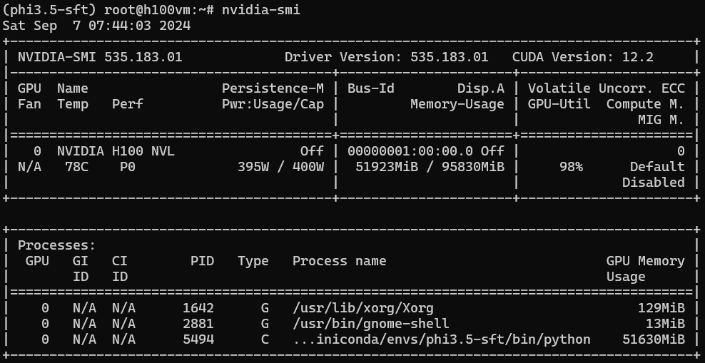
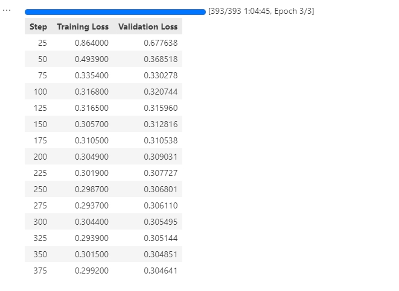
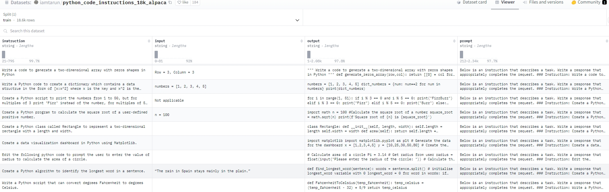

# Phi Model Family


> **作者**: 魏新宇 (Xinyu Wei) — 微软 AI GBB 高级系统工程师

## 在 Azure 上运行

All experiments in this project were conducted on an **Azure GPU VM**.

| Item | Details |
|---|---|
| **Azure VM** | [NC40ads_H100_v5](https://learn.microsoft.com/en-us/azure/virtual-machines/nc-h100-v5-series) |
| **GPU** | NVIDIA H100 80GB |
| **Frameworks** | vLLM, LoRA/PEFT |


## Phi-4 Quantization, Fine-Tuning and Inference Speedup

If a model requires both quantization and fine-tuning, it is usually fine-tuned first and then quantized. There may be three possible approaches:

1. Perform full fine-tuning and then quantize.
2. Use LoRA for fine-tuning, merge the adapter, and then quantize.

The Phi-4 model has **14 billion (14B) parameters**, which makes it quite memory-intensive during inference. Therefore, if we want to run it on edge devices, we need to **quantize** it. There are many quantization methods; as previously introduced, using the **Auto-Round GPTQ format** for quantization suffices.

Let's examine the **VRAM consumption** and **performance** during inference after quantizing to **4-bit**.

Quantization Code：

```
from transformers import AutoModelForCausalLM, AutoTokenizer
import torch
model_name = "microsoft/phi-4"
model = AutoModelForCausalLM.from_pretrained(model_name, torch_dtype=torch.bfloat16)
tokenizer = AutoTokenizer.from_pretrained(model_name)

```


```

from auto_round import AutoRound

bits, group_size, sym = 4, 128, True
autoround = AutoRound(model, tokenizer, nsamples=128, iters=256, low_gpu_mem_usage=False, gradient_accumulate_steps=1, batch_size=8, bits=bits, group_size=group_size, sym=sym)

autoround.quantize()
output_dir = "phi4-Instruct-AutoRound-GPTQ-4bit"
autoround.save_quantized(output_dir, format='auto_gptq', inplace=True)
```

quantization process output：


Resource needed during quantization：


Output directory：


For the quantized version, I wrote a **vLLM inference program**. The inference speed is very fast, it occupies **11GB of VRAM**, and the inference results are very accurate. This way, we can run Phi-4 on consumer-grade graphics cards.

***Please click below pictures to see my demo vedios on Yutube***:
[](https://youtu.be/PGWnwSxyrfs)

Follow is my inference code.

Local model from HF:

```
from vllm import LLM, SamplingParams
import time

# 定义模型
model_name = "Phi-4-AutoRound-GPTQ-4bit"
llm = LLM(
    model=model_name,
    max_model_len=2048,
    gpu_memory_utilization=0.15,  # 设置 GPU 内存利用率为 15%
    trust_remote_code=True        # 信任远程代码，必要时用于自定义模型和 FlashAttention
)

# 启用 FlashAttention
# 注意：如果模型和环境支持，vLLM 默认会使用 FlashAttention
# 无需在代码中显式启用。如果需要，确保已安装必要的依赖项

# 定义多个英文提示
prompts = [
    "What is the capital of France?",
    "There are ten birds on a branch. If you shoot one, how many are left?",
    "Why haven't penguins been eaten by polar bears?",
    "Tell me a funny joke.",
	"树枝上有十只鸟。如果射杀一只，还剩几只?",
    "为什么企鹅没有被北极熊吃掉？?",
    "给我讲个有趣的笑话.",
]

batch_size = len(prompts)
messages_list = [[{"role": "user", "content": prompt}] for prompt in prompts]

sampling_params = SamplingParams(temperature=0.7, top_p=0.5, max_tokens=1024)

# 统计开始时间
start_time = time.time()

# 批量推理
outputs = llm.chat(messages_list, sampling_params)

# 统计结束时间
end_time = time.time()

# 计算总耗时和吞吐量
total_time = end_time - start_time
throughput = batch_size / total_time

print(f"Batch size: {batch_size}")
print(f"Total time: {total_time:.4f} seconds")
print(f"Throughput: {throughput:.2f} requests/sec")

# 获取分词器
tokenizer = llm.get_tokenizer()

# 统计总 token 数量
total_tokens = 0

# 输出结果
for idx, output in enumerate(outputs):
    print(f"\nInput {idx + 1}: {prompts[idx]}")
    # 获取生成的文本
    generated_text = output.outputs[0].text
    print(f"Output {idx + 1}: {generated_text}")

    # 计算输入和输出的 tokens 数量
    input_ids = tokenizer(prompts[idx])['input_ids']
    output_ids = tokenizer(generated_text)['input_ids']
    input_tokens = len(input_ids)
    output_tokens = len(output_ids)
    total_tokens += input_tokens + output_tokens
    print(f"Input tokens: {input_tokens}, Output tokens: {output_tokens}")

# 计算 tokens/s
tokens_per_second = total_tokens / total_time
print(f"\nTotal tokens: {total_tokens}")
print(f"Tokens per second: {tokens_per_second:.2f} tokens/sec")
```

Inference Result:

```
INFO 12-22 10:55:31 selector.py:120] Using Flash Attention backend.
[rank0]:[W1222 10:55:31.124628071 ProcessGroupGloo.cpp:715] Warning: Unable to resolve hostname to a (local) address. Using the loopback address as fallback. Manually set the network interface to bind to with GLOO_SOCKET_IFNAME. (function operator())
INFO 12-22 10:55:31 model_runner.py:1092] Starting to load model kaitchup/Phi-4-AutoRound-GPTQ-4bit...
INFO 12-22 10:55:31 gptq_marlin.py:200] Using MarlinLinearKernel for GPTQMarlinLinearMethod
INFO 12-22 10:55:32 weight_utils.py:243] Using model weights format ['*.safetensors']
Loading safetensors checkpoint shards:   0% Completed | 0/2 [00:00<?, ?it/s]
Loading safetensors checkpoint shards:  50% Completed | 1/2 [00:00<00:00,  1.42it/s]
Loading safetensors checkpoint shards: 100% Completed | 2/2 [00:01<00:00,  1.36it/s]
Loading safetensors checkpoint shards: 100% Completed | 2/2 [00:01<00:00,  1.37it/s]

INFO 12-22 10:55:34 model_runner.py:1097] Loading model weights took 8.5107 GB
INFO 12-22 10:55:34 worker.py:241] Memory profiling takes 0.69 seconds
INFO 12-22 10:55:34 worker.py:241] the current vLLM instance can use total_gpu_memory (79.25GiB) x gpu_memory_utilization (0.15) = 11.89GiB
INFO 12-22 10:55:34 worker.py:241] model weights take 8.51GiB; non_torch_memory takes 0.26GiB; PyTorch activation peak memory takes 0.94GiB; the rest of the memory reserved for KV Cache is 2.18GiB.
INFO 12-22 10:55:35 gpu_executor.py:76] # GPU blocks: 715, # CPU blocks: 1310
INFO 12-22 10:55:35 gpu_executor.py:80] Maximum concurrency for 2048 tokens per request: 5.59x
INFO 12-22 10:55:38 model_runner.py:1413] Capturing cudagraphs for decoding. This may lead to unexpected consequences if the model is not static. To run the model in eager mode, set 'enforce_eager=True' or use '--enforce-eager' in the CLI.
INFO 12-22 10:55:38 model_runner.py:1417] If out-of-memory error occurs during cudagraph capture, consider decreasing `gpu_memory_utilization` or switching to eager mode. You can also reduce the `max_num_seqs` as needed to decrease memory usage.
INFO 12-22 10:55:51 model_runner.py:1527] Graph capturing finished in 13 secs, took 0.27 GiB
INFO 12-22 10:55:51 llm_engine.py:446] init engine (profile, create kv cache, warmup model) took 17.27 seconds
INFO 12-22 10:55:51 chat_utils.py:333] Detected the chat template content format to be 'string'. You can set `--chat-template-content-format` to override this.
Processed prompts: 100%|███████████████████████████████| 7/7 [00:04<00:00,  1.58it/s, est. speed input: 34.60 toks/s, output: 238.61 toks/s]
Batch size: 7
Total time: 4.4306 seconds
Throughput: 1.58 requests/sec

Input 1: What is the capital of France?
Output 1: The capital of France is Paris.
Input tokens: 7, Output tokens: 7

Input 2: There are ten birds on a branch. If you shoot one, how many are left?
Output 2: This question can be interpreted in different ways, leading to various answers:

1. **Literal Interpretation**: If you shoot one bird, there are nine birds left on the branch. However, the noise from the gunshot would likely scare the remaining birds away, so realistically, there might be no birds left on the branch.

2. **Figurative Interpretation**: The question might be a riddle or a play on words, suggesting that the act of shooting could cause all the birds to fly away due to the disturbance, leaving zero birds on the branch.

Ultimately, the answer depends on the context and the intended interpretation of the question.
Input tokens: 18, Output tokens: 128

Input 3: Why haven't penguins been eaten by polar bears?
Output 3: Penguins and polar bears inhabit different ecosystems, which is the primary reason they don't encounter each other in the wild. Polar bears are native to the Arctic region, where they live on sea ice and hunt for seals. Penguins, on the other hand, are primarily found in the Southern Hemisphere, with the majority living in Antarctica and surrounding areas. The geographical separation between the Arctic and Antarctic regions, divided by the vast expanse of the equator, prevents these two species from coming into contact with each other in their natural habitats.

Additionally, even if they were to encounter each other, polar bears are adapted to hunting in icy, Arctic conditions, while penguins are adapted to the colder, but different, conditions of the Antarctic. The differences in their environments, hunting techniques, and prey preferences further reduce the likelihood of such interactions.

In summary, the primary reason penguins haven't been eaten by polar bears is the vast geographical distance and ecological separation between their respective habitats.
Input tokens: 11, Output tokens: 194

Input 4: Tell me a funny joke.
Output 4: Sure! Here's a classic one:

Why don't scientists trust atoms?

Because they make up everything! 😄
Input tokens: 6, Output tokens: 23

Input 5: 树枝上有十只鸟。如果射杀一只，还剩几只?
Output 5: 这是一个经典的谜题，旨在考验逻辑思维。如果你射杀一只鸟，那么剩下的鸟会因为惊吓而飞走。因此，树枝上可能不会剩下任何鸟。这个问题的答案通常是“零”，因为其他鸟会飞走。
Input tokens: 27, Output tokens: 104

Input 6: 为什么企鹅没有被北极熊吃掉？?
Output 6: 企鹅和北极熊都生活在极地地区，但它们的生活环境有很大的不同，这使得企鹅不太可能被北极熊捕食。以下是一些原因：

1. **栖息地分离**：企鹅主要生活在南极洲及其周边海域，而北极熊则生活在北极地区。这两种动物的栖息地相隔遥远，自然不会有直接的接触。

2. **生态位差异**：企鹅和北极熊在生态系统中扮演不同的角色。企鹅主要是海洋生物，以鱼类和海洋无脊椎动物为食，而北极熊是陆地和海洋的捕食者，以 海豹和鱼类为主食。

3. **捕食者适应性**：北极熊适应于北极的寒冷环境，它们的捕猎技巧和体型更适合捕捉海豹和其他北极动物，而不是企鹅。

4. **行为和生活习性**：企鹅的行为和生活习性使它们在南极洲的海洋环境中生存良好，而北极熊则更适应于北极的陆地和海冰环境。

总的来说，由于地理位置的隔离和生态位的不同，企鹅和北极熊之间没有直接的捕食关系。
Input tokens: 23, Output tokens: 461

Input 7: 给我讲个有趣的笑话.
Output 7: 当然可以！这里有一个经典的笑话：

有一天，一个人去看牙医，牙医说：“你的牙齿很糟糕，需要拔掉。”

那个人说：“不，我不能拔掉我的牙齿，我要留着它们来吃东西。”

牙医回答说：“那你就得用勺子来吃了！”

希望这个笑话能让你开心！
Input tokens: 12, Output tokens: 131

Total tokens: 1152
Tokens per second: 260.01 tokens/sec
```


Load model from Local:

```
from vllm import LLM, SamplingParams  
import time  

# 去除模型路径末尾的斜杠  
model_path = "/root/phi4-Instruct-AutoRound-GPTQ-4bit"  

llm = LLM(  
    model=model_path,               # 使用本地模型的路径  
    max_model_len=2048,  
    gpu_memory_utilization=0.15,    # 设置 GPU 内存利用率为 15%  
    trust_remote_code=True,         # 信任远程代码，必要时用于自定义模型和 FlashAttention  
    hf_overrides={"local_files_only": True}  # 强制仅从本地加载模型  
)  

# 以下部分代码无需修改  
# 定义多个提示  
prompts = [  
    "What is the capital of France?",  
    "There are ten birds on a branch. If you shoot one, how many are left?",  
    "Why haven't penguins been eaten by polar bears?",  
    "Tell me a funny joke.",  
    "树枝上有十只鸟。如果射杀一只，还剩几只?",  
    "为什么企鹅没有被北极熊吃掉？",  
    "给我讲个有趣的笑话。",  
]  

batch_size = len(prompts)  
messages_list = [[{"role": "user", "content": prompt}] for prompt in prompts]  

sampling_params = SamplingParams(temperature=0.7, top_p=0.5, max_tokens=1024)  

# 统计开始时间  
start_time = time.time()  

# 批量推理  
outputs = llm.chat(messages_list, sampling_params)  

# 统计结束时间  
end_time = time.time()  

# 计算总耗时和吞吐量  
total_time = end_time - start_time  
throughput = batch_size / total_time  

print(f"Batch size: {batch_size}")  
print(f"Total time: {total_time:.4f} seconds")  
print(f"Throughput: {throughput:.2f} requests/sec")  

# 获取分词器  
tokenizer = llm.get_tokenizer()  

# 统计总 token 数量  
total_tokens = 0  

# 输出结果  
for idx, output in enumerate(outputs):  
    print(f"\nInput {idx + 1}: {prompts[idx]}")  
    # 获取生成的文本  
    generated_text = output.outputs[0].text  
    print(f"Output {idx + 1}: {generated_text}")  

    # 计算输入和输出的 tokens 数量  
    input_ids = tokenizer(prompts[idx])['input_ids']  
    output_ids = tokenizer(generated_text)['input_ids']  
    input_tokens = len(input_ids)  
    output_tokens = len(output_ids)  
    total_tokens += input_tokens + output_tokens  
    print(f"Input tokens: {input_tokens}, Output tokens: {output_tokens}")  

# 计算 tokens/s  
tokens_per_second = total_tokens / total_time  
print(f"\nTotal tokens: {total_tokens}")  
print(f"Tokens per second: {tokens_per_second:.2f} tokens/sec")  
```

## 微调

Full fine-tuning:

```
(phi-4) root@h1002gpuvm:~# cat /root/.cache/huggingface/accelerate/default_config.yaml
compute_environment: LOCAL_MACHINE
debug: false
distributed_type: MULTI_GPU
downcast_bf16: 'no'
enable_cpu_affinity: true
gpu_ids: all
machine_rank: 0
main_training_function: main
mixed_precision: bf16
num_machines: 1
num_processes: 2
rdzv_backend: static
same_network: true
tpu_env: []
tpu_use_cluster: false
tpu_use_sudo: false
use_cpu: false
```

Full fine-tuning code:

```
import pandas as pd  
from datasets import Dataset  
from transformers import (  
    AutoTokenizer,  
    AutoModelForCausalLM,  
    get_linear_schedule_with_warmup,  
)  
from accelerate import Accelerator  
from sklearn.model_selection import train_test_split  
import torch  
import os  
  
# 初始化 Accelerator  
accelerator = Accelerator(mixed_precision="bf16")  
  
# 检查 Accelerator 是否检测到多个 GPU  
print(f"Number of processes: {accelerator.num_processes}")  
print(f"Device: {accelerator.device}")  
  
# 检查可用的 GPU  
print("Available GPUs:", torch.cuda.device_count())  
for i in range(torch.cuda.device_count()):  
    print(f"GPU {i}: {torch.cuda.get_device_name(i)}")  
  
# 设置模型名称  
model_name = "microsoft/Phi-4"  
  
# 加载分词器  
tokenizer = AutoTokenizer.from_pretrained(  
    model_name,  
    trust_remote_code=True,  
    add_eos_token=True,  
    use_fast=True  
)  
  
# 设置填充标记  
tokenizer.pad_token = "<|dummy_0|>"
tokenizer.pad_token_id = 100256
tokenizer.padding_side = 'right'
  
# 定义系统提示  
system_prompt = (  
    "<|system|>\n"  
    "You are an expert in .NET/.NET Framework and are familiar with the functions provided by NEBULA SDK. "  
    "You know how to use NEBULA SDK to develop application systems on the CAMP platform. "  
    "When providing the user with results, no explanation or thought process is needed. "  
    "Ensure the code format is correct, indentation is standard, and it can compile successfully. "  
    "Avoid repeating the same code output. "  
)  
  
# 读取 CSV 文件  
df = pd.read_csv("/root/Phi3.5_20241031_1question.csv")  
  
# 删除缺失值的行  
df = df.dropna(subset=['Question', 'Answer'])  
  
# 确保所有数据都是字符串类型  
df['Question'] = df['Question'].astype(str)  
df['Answer'] = df['Answer'].astype(str)  
  
# 定义格式化数据集的函数  
def format_dataset(row):  
    return f"{system_prompt}<|user|>\n{row['Question']}\n<|assistant|>\n{row['Answer']}{tokenizer.eos_token}\n"  
  
# 应用格式化函数  
df['text'] = df.apply(format_dataset, axis=1)  
  
# 数据集
train_df, eval_df = train_test_split(df, test_size=0.2, random_state=42)  
  
train_dataset = Dataset.from_pandas(train_df.reset_index(drop=True))  
eval_dataset = Dataset.from_pandas(eval_df.reset_index(drop=True))  
  
# 定义数据预处理函数  
def tokenize_function(examples):  
    tokens = tokenizer(  
        examples["text"],  
        padding="max_length",  
        truncation=True,  
        max_length=1024,  
    )  
    tokens["labels"] = tokens["input_ids"].copy()  
    # 将填充标记的标签设置为 -100，以在损失计算中忽略  
    for i, label in enumerate(tokens["labels"]):  
        tokens["labels"][i] = [-100 if token == tokenizer.pad_token_id else token for token in label]  
    return tokens  
  
# 预处理数据集  
train_dataset = train_dataset.map(tokenize_function, batched=True, remove_columns=train_dataset.column_names)  
eval_dataset = eval_dataset.map(tokenize_function, batched=True, remove_columns=eval_dataset.column_names)  
  
# 设置为 PyTorch 张量格式  
train_dataset.set_format(type='torch', columns=['input_ids', 'attention_mask', 'labels'])  
eval_dataset.set_format(type='torch', columns=['input_ids', 'attention_mask', 'labels'])  
  
# 使用 from_pretrained 加载模型，并指定 device_map="auto"  
model = AutoModelForCausalLM.from_pretrained(  
    model_name,  
    trust_remote_code=True,  
    device_map="auto",  
    torch_dtype=torch.bfloat16,  
)  
  
# 启用梯度检查点  
model.gradient_checkpointing_enable()  
  
# 验证模型参数的设备分配  
for name, param in model.named_parameters():  
    print(f"Parameter: {name}, Device: {param.device}")  
  
# 定义优化器  
optimizer = torch.optim.AdamW(model.parameters(), lr=5e-4)  
  
# 使用 DataLoader  
from torch.utils.data import DataLoader  
  
train_dataloader = DataLoader(train_dataset, batch_size=1, shuffle=True)  
eval_dataloader = DataLoader(eval_dataset, batch_size=1)  
  
# 使用 Accelerator 准备模型、优化器和数据加载器  
model, optimizer, train_dataloader, eval_dataloader = accelerator.prepare(  
    model, optimizer, train_dataloader, eval_dataloader  
)  
  
# 定义训练参数  
num_train_epochs = 150  # 根据需要调整  
gradient_accumulation_steps = 32  # 根据需要调整  
  
total_training_steps = (len(train_dataloader) * num_train_epochs) // gradient_accumulation_steps  
  
# 创建学习率调度器  
lr_scheduler = get_linear_schedule_with_warmup(  
    optimizer,  
    num_warmup_steps=100,  
    num_training_steps=total_training_steps,  
)  
  
# 开始训练  
from tqdm.auto import tqdm  
  
for epoch in range(num_train_epochs):  
    model.train()  
    total_loss = 0  
    progress_bar = tqdm(train_dataloader, desc=f"Epoch {epoch+1}/{num_train_epochs}")  
    for step, batch in enumerate(progress_bar):  
        with accelerator.accumulate(model):  
            outputs = model(**batch)  
            loss = outputs.loss  
            accelerator.backward(loss)  
  
            if (step + 1) % gradient_accumulation_steps == 0:  
                optimizer.step()  
                lr_scheduler.step()  
                optimizer.zero_grad()  
  
            total_loss += loss.item()  
            if (step + 1) % 10 == 0:  
                progress_bar.set_postfix({'loss': total_loss / (step + 1)})  
  
    # 可选：在每个 epoch 结束时进行评估  
    model.eval()  
    eval_loss = 0  
    with torch.no_grad():  
        for batch in eval_dataloader:  
            outputs = model(**batch)  
            loss = outputs.loss  
            eval_loss += loss.item()  
    eval_loss = eval_loss / len(eval_dataloader)  
    print(f"Evaluation loss after epoch {epoch + 1}: {eval_loss}")  
    model.train()  
  
    # 在每个 epoch 结束时保存模型检查点  
    accelerator.wait_for_everyone()  
    unwrapped_model = accelerator.unwrap_model(model)  
    unwrapped_model.save_pretrained(  
        f"./Phi-4-FullFineTune-1question-22/checkpoint-epoch{epoch + 1}",  
        save_function=accelerator.save  
    )  
    if accelerator.is_main_process:  
        tokenizer.save_pretrained(f"./Phi-4-FullFineTune-1question-22/checkpoint-epoch{epoch + 1}")  
  
# 训练结束后保存最终模型  
accelerator.wait_for_everyone()  
unwrapped_model = accelerator.unwrap_model(model)  
unwrapped_model.save_pretrained(  
    "./Phi-4-FullFineTune-1question-22",  
    save_function=accelerator.save  
)  
if accelerator.is_main_process:  
    tokenizer.save_pretrained("./Phi-4-FullFineTune-1question-22")  
  
print("Training completed and model saved.")  
```


Resource needed during training:


Inference code:

```
import torch  
from transformers import AutoTokenizer, AutoModelForCausalLM  
  
# 设置设备  
device = "cuda" if torch.cuda.is_available() else "cpu"  
print("Using device:", device)  
  
# 微调后的模型路径  
model_path = "/root/Phi-4-FullFineTune-1question-22/checkpoint-epoch10"  
# 加载 tokenizer  
tokenizer = AutoTokenizer.from_pretrained(  
    model_path,  
    trust_remote_code=True,  
    use_fast=True  
)  
  
# 如果您的分词器包含特殊的分词器配置，需要确保分词器的特殊标记与模型一致  
# 如果在微调过程中添加了特殊标记，需要在这里再次添加  
special_tokens = {'additional_special_tokens': ["<|system|>", "<|user|>", "<|assistant|>", "<|endoftext|>"]}  
tokenizer.add_special_tokens(special_tokens)  
  
# 加载微调后的模型  
model = AutoModelForCausalLM.from_pretrained(  
    model_path,  
    trust_remote_code=True,  
)  
  
# 调整模型的嵌入层大小  
model.resize_token_embeddings(len(tokenizer))  
  
# 将模型移动到设备上  
model.to(device)  
  
# 设置模型为评估模式  
model.eval()  
  
# 定义推理函数  
def generate_text(prompt, max_new_tokens=300):  
    # 将输入编码并移动到设备上  
    inputs = tokenizer(prompt, return_tensors="pt").to(device)  
    with torch.no_grad():  
        outputs = model.generate(  
            inputs.input_ids,  
            attention_mask=inputs.attention_mask,  
            max_new_tokens=max_new_tokens,  
            num_return_sequences=1,  
            do_sample=True,  
            temperature=0.1,        # 根据需要调整采样温度  
            top_p=0.9,              # 使用 nucleus sampling  
            repetition_penalty=1.5, # 增加重复惩罚系数，防止重复生成  
            eos_token_id=tokenizer.eos_token_id  # 指定结束标记  
        )  
    # 解码生成的文本  
    return tokenizer.decode(outputs[0], skip_special_tokens=True)  
```

```
# 示例使用  
prompt = """<|system|>You are an expert in .NET/.NET Framework and are familiar with the functions provided by NEBULA SDK. You know how to use NEBULA SDK to develop application systems on the CAMP platform.When providing the user with results, no explanation or thought process is needed. Ensure the code format is correct, indentation is standard, and it can compile successfully. Avoid repeating the same code output.
<|user|>  
How to query the English name of a CAMP user through NEBULA SDK in a .NET Framework application?? Give me sample code.<|endoftext|>
<|assistant|>""" + "<|endoftext|>"
  
generated_text = generate_text(prompt)  
print(generated_text) 
print("Tokenizer EOS token ID:", tokenizer.eos_token_id)  
print("Model EOS token ID:", model.config.eos_token_id)  
```


## 架构

#### 架构


Phi-4 adopts a Transformer-based **decoder-only** architecture, similar to the GPT series models. This architecture utilizes the **self-attention mechanism**, effectively capturing long-term dependencies in text sequences and excelling at natural language generation tasks.

#### Parameter Scale and Number of Layers

- **Total Parameters**: 14 billion (14B) parameters.
- **Number of Layers**: 40 layers.

#### Context Length

- **Initial Context Length**: 4,096 tokens.
- **Mid-training Expansion**: During the mid-training phase, Phi-4's context length was expanded to **16,000 tokens (16K)**, enhancing the model's ability to handle long texts.

#### Vocabulary and Tokenizer

- **Tokenizer**: Utilizes OpenAI's `tiktoken` tokenizer, which supports multiple languages and provides better tokenization performance.
- **Vocabulary Size**: 100,352 tokens, including some reserved and unused tokens.


### Attention Mechanism and Positional Encoding

 

#### 1. Full Attention Mechanism


Phi-4 employs a **full attention mechanism**, performing self-attention calculations over the entire context sequence. Unlike previous models, where Phi-3-medium used a sliding window of 2,048 tokens, Phi-4 directly performs global attention over contexts of 4,096 tokens (initially) and 16,000 tokens (after expansion), improving the model's ability to capture long-range dependencies.

#### 2. Rotary Positional Embeddings (RoPE)


To support longer context lengths, Phi-4 adjusted the base frequency of **Rotary Positional Embeddings (RoPE)** during the mid-training phase:

- **Base Frequency Adjustment**: Increased RoPE's base frequency to **250,000** to accommodate a context length of 16K tokens.
- **Purpose**: RoPE helps maintain the effectiveness of positional encoding in long sequences, allowing the model to perform well over extended texts.


 

## 训练

 

### Focus on Data Quality


Phi-4's training strategy centers on **data quality**. Unlike other models that primarily use organic web data (e.g., web content, code) for pre-training, Phi-4 strategically introduces **synthetic data** throughout its training process.

### 数据


**Synthetic data** plays a crucial role in Phi-4's pre-training and mid-training phases:

- Diverse Data Generation Techniques:
  - **Multi-Agent Prompting**: Utilizing multiple language models or agents to collaboratively generate data, enriching data diversity.
  - **Self-Revision Workflows**: The model generates initial outputs, then performs self-evaluation and revision, iteratively improving output quality.
  - **Instruction Reversal**: Generating corresponding input instructions from existing outputs, enhancing the model's instruction understanding and generation capabilities.
- Advantages of Synthetic Data:
  - **Structured and Progressive Learning**: Synthetic data allows precise control over difficulty and content, gradually guiding the model to learn complex reasoning and problem-solving skills.
  - **Improved Training Efficiency**: Synthetic data generation can target the model's weak points, providing specific training data.
  - **Avoiding Data Contamination**: Since synthetic data is generated, it reduces the risk of training data containing content from evaluation sets.

### 数据


In addition to synthetic data, Phi-4 emphasizes carefully selecting and filtering high-quality **organic data** from various sources:

- **Data Sources**: Includes web content, books, code repositories, academic papers, etc.
- Data Filtering:
  - **Removing Low-Quality Content**: Using automated and manual methods to filter out meaningless, incorrect, duplicate, or harmful content.
  - **Preventing Data Contamination**: Employing mixed n-gram algorithms (13-gram and 7-gram) for deduplication and decontamination, ensuring the training data doesn't contain content from evaluation sets.

### 数据


Phi-4 optimizes the composition of training data with the following specific ratios:

- **Synthetic Data**: 40%
- **Web Rewrites**: 15% (rewritten high-quality web content to generate new training samples)
- **Organic Web Data**: 15% (carefully selected valuable web content)
- **Code Data**: 20% (including public code repositories and generated synthetic code data)
- **Targeted Acquisitions**: 10% (includes academic papers, professional books, and other high-value content)

### Multi-Stage Training Process

 

#### Pre-Training Phase

- **Objective**: Establish the model's foundational language understanding and generation capabilities.
- **Data Volume**: Approximately **10 trillion (10T)** tokens.

**Mid-Training Phase**

- **Objective**: Expand context length and enhance long-text processing capabilities.
- **Data Volume**: **250 billion (250B)** tokens.

**Post-Training Phase (Fine-Tuning)** 

- **Supervised Fine-Tuning (SFT)**: Fine-tuning with high-quality, multi-domain data to improve the model's instruction-following abilities and response quality.
- **Direct Preference Optimization (DPO)**: Utilizing methods like **Pivotal Token Search (PTS)** to further optimize the model's outputs.


## Innovative Training Techniques


### Pivotal Token Search (PTS)


The **PTS method** is a significant innovation in Phi-4's training process:

- **Principle**: Identifying pivotal tokens that have a significant impact on the correctness of the answer during generation, and specifically optimizing the model's predictions on these tokens.
- Advantages:
  - **Improved Training Efficiency**: Focusing optimization efforts on the parts that most impact the results, achieving more with less.
  - **Enhanced Model Performance**: Helps the model make correct choices at critical decision points, improving overall output quality.

### Improved Direct Preference Optimization (DPO)

- **DPO Method**: Directly using preference data for optimization, making the model's outputs more aligned with human preferences.
- Innovations:
  - **Integration with PTS**: Introducing training data generated by PTS into DPO to enhance optimization effects.
  - **Evaluation Metrics**: Assessing the model's performance on pivotal tokens for more precise optimization measurements.


## 模型

### 性能

- **Small Model, Big Capability**: Despite having only 14B parameters, Phi-4 performs excellently on multiple evaluation benchmarks, especially in reasoning and problem-solving tasks.

### Exceptional Reasoning Ability

- **Mathematics and Science Problem Solving**: In benchmarks like GPQA and MATH, Phi-4's scores even surpass its teacher model GPT-4o.

### Long Context Processing Ability

- **Context Length Expansion**: By extending the context length to 16,000 tokens during mid-training, Phi-4 can more effectively handle long texts and long-range dependencies.

### Multilingual Support

- **Coverage of Multiple Languages**: Training data includes German, Spanish, French, Portuguese, Italian, Hindi, Japanese, and more.
- **Cross-Language Capability**: Performs excellently in translation and cross-language question-answering tasks.

### 安全

- **Responsible AI Principles**: Strict adherence to Microsoft's Responsible AI principles during development, emphasizing model safety and ethics.
- **Data Decontamination and Privacy Protection**: Implements rigorous data deduplication and filtering strategies to prevent sensitive content in training data.


## 性能

 

### External Evaluation Benchmarks

 
Phi-4 demonstrates leading performance on multiple public evaluation benchmarks:

- **MMLU (Massive Multitask Language Understanding)**: Achieved excellent results in complex multitask understanding tests.
- **GPQA (Graduate-Level STEM Question Answering)**: Outstanding performance in high-difficulty STEM Q&A, scoring higher than some larger-scale models.
- **MATH (Mathematics Competition)**: Showcased powerful reasoning and computation abilities in solving mathematical problems.
- **HumanEval / HumanEval+ (Code Generation)**: Surpassed models of the same scale in code generation and understanding tasks, even approaching the performance of larger models.

### Internal Evaluation Suite (PhiBench)


To gain deeper insights into the model's capabilities and shortcomings, the team developed a dedicated internal evaluation suite, **PhiBench**:

- **Diverse Tasks**: Includes code debugging, code completion, mathematical reasoning, error identification, etc.
- **Guiding Model Optimization**: By analyzing PhiBench results, the team can target specific improvements in the model.


## Safety and Responsibility

 

### Strict Safety Alignment Strategy


Phi-4's development follows Microsoft's **Responsible AI principles**, focusing on model safety and ethics during training and fine-tuning:

- **Preventing Harmful Content**: Incorporating safety fine-tuning data during the post-training phase to reduce the probability of the model generating inappropriate content.
- **Red Teaming and Automated Evaluation**: Conducted extensive red teaming tests and automated safety evaluations covering dozens of potential risk categories.

### 数据

- **Enhanced Data Decontamination Strategy**: Using mixed 13-gram and 7-gram algorithms to remove overlapping content between training data and evaluation benchmarks, preventing model overfitting.


## 训练

### 训练


While the official report does not explicitly state the total training time for Phi-4, considering:

- **Model Scale**: 14B parameters.

- **Training Data Volume**: 10T tokens in the pre-training phase and 250B tokens in the mid-training phase.

  It can be speculated that the entire training process consumed a significant amount of time.

### GPU Resource Consumption

 

- **GPUs**: 1,920 H100-80G GPUs.
- **Training Time**: 21 days.
- **Training Data**: 9.8T tokens.


## 限制

 

### Application Scenarios

 

- **Question Answering Systems**: Phi-4 excels in complex Q&A tasks, suitable for various intelligent Q&A applications.
- **Code Generation and Understanding**: With outstanding performance in programming tasks, it can be used for code assistance, auto-generation, debugging, and more.
- **Multilingual Translation and Processing**: Supports multiple languages, applicable to global language services.

### 限制

 

- **Knowledge Cutoff**: The model's knowledge is limited to its training data and may not be aware of events occurring after training.
- **Long Sequence Challenges**: Although the context length has been expanded to 16K, challenges may still exist when handling even longer sequences.
- **Risk Control**: Despite strict safety measures, the model may still be susceptible to adversarial attacks or inadvertently generate inappropriate content.


Phi-4's success demonstrates the importance of data quality and training strategies in the development of large language models. Through innovative synthetic data generation methods, meticulous training data mixing strategies, and advanced training techniques, Phi-4 achieves outstanding performance while maintaining a relatively small parameter size:

- **Exceptional Reasoning Ability**: Exhibits excellent performance in mathematics, science, and programming domains.

- **Long Text Processing**: The expanded context length gives the model an advantage in long-text processing tasks.

- **Safety and Responsibility**: Strict adherence to Responsible AI principles ensures the model's safety and ethics.

  Phi-4 sets a new benchmark for small-parameter models, proving that by focusing on data quality and training strategies, it is possible to achieve exceptional performance even at a smaller scale.


#### **Refer to：***https://kaitchup.substack.com/p/phi-4-whats-new-and-how-to-fine-tune*

---

## 微调



New release 3 Phi 3.5 models:

- microsoft/Phi-3.5-mini-instruct: 3.82B params

- microsoft/Phi-3.5-MoE-instruct: 41.9B params

- microsoft/Phi-3.5-vision-instruct: 4.15B params

### 简介

Phi-3.5 MOE is a newly released model by Microsoft with 41.9 billion parameters. The model includes 16 experts, with two decoder experts running simultaneously.

**Model Analysis: Phi-3.5-MoE-instruct**

**Basic Information**

- **Model Name:** Phi-3.5-MoE-instruct

- **Architecture:** PhiMoEForCausalLM

- **Model Type:** phimoe

- **Transformer Version:** 4.43.3

  **Configuration Parameters**

- **attention_bias:** true

- **attention_dropout:** 0.0

- **hidden_act:** silu (Swish activation function)

- **hidden_dropout:** 0.0

- **hidden_size:** 4096

- **initializer_range:** 0.02

- **input_jitter_noise:** 0.01

- **intermediate_size:** 6400

- **lm_head_bias:** true

- **max_position_embeddings:** 131072

- **num_attention_heads:** 32

- **num_experts_per_tok:** 2

- **num_hidden_layers:** 32

- **num_key_value_heads:** 8

- **num_local_experts:** 16

- **original_max_position_embeddings:** 4096

- **output_router_logits:** false

- **rms_norm_eps:** 1e-05

- **rope_theta:** 10000.0

- **router_aux_loss_coef:** 0.0

- **router_jitter_noise:** 0.01

- **sliding_window:** 131072

- **tie_word_embeddings:** false

- **torch_dtype:** bfloat16

- **vocab_size:** 32064

  **Special Configuration**

- auto_map:

   

  Automatic mapping configuration

  - **AutoConfig:** configuration_phimoe.PhiMoEConfig

  - **AutoModelForCausalLM:** modeling_phimoe.PhiMoEForCausalLM

    **Token Configuration**

- **bos_token_id:** 1

- **eos_token_id:** 32000

  **ROPE (Rotary Position Embedding) Scaling**

- **long_factor** and **short_factor:** These parameters are used to adjust the scaling of long and short position embeddings.

- **long_mscale** and **short_mscale:** These parameters are used to adjust the scaling of long and short position embeddings.

- **type:** longrope

  **Key Features**

- **Mixture of Experts (MoE):** The model uses a mixture of experts mechanism, with 2 experts per token and a total of 16 local experts.

- **Large-Scale Position Embedding:** Maximum position embedding is 131072, supporting long text processing.

- **High-Dimensional Hidden Layers:** Hidden layer size is 4096, with 32 hidden layers.

- **Multi-Head Attention Mechanism:** Utilizes 32 attention heads and 8 key-value heads.

- **Low Dropout Rates:** Both attention_dropout and hidden_dropout are 0.0, indicating no dropout is used during training.

- **Efficient Initialization:** Uses an initializer range of 0.02 to ensure stability of model parameters in the early stages of training.

- **bfloat16 Data Type:** Uses bfloat16 data type, balancing computational efficiency and precision.

  **Application Scenarios**

- **Text Generation:** Suitable for generating natural language text.

- **Multilingual Support:** Due to its multilingual tags, the model can handle text in multiple languages.

- **Dialogue Systems:** Suitable for building dialogue systems and chatbots.

- **Code Generation:** Due to its code tags, the model can also be used to generate code snippets.

  **Summary**
  Phi-3.5-MoE-instruct is a powerful mixture of experts model with high-dimensional hidden layers and a multi-head attention mechanism, suitable for various natural language processing tasks. Its large-scale position embedding and low dropout rates make it excel in handling long texts and complex tasks.

  **So, what GPU is needed to fine-tune Phi-3.5 MOE?**
  With QLoRA, it can be done on a single H100 GPU.


### Phi-3.5 MOE SFT Code

```
model_name = "microsoft/Phi-3.5-MoE-instruct"

tokenizer = AutoTokenizer.from_pretrained(model_name, trust_remote_code=True, add_eos_token=True, use_fast=True)
tokenizer.pad_token = tokenizer.unk_token
tokenizer.pad_token_id = tokenizer.convert_tokens_to_ids(tokenizer.pad_token)
tokenizer.padding_side = 'left'

ds = load_dataset("timdettmers/openassistant-guanaco")

bnb_config = BitsAndBytesConfig(
        load_in_4bit=True,
        bnb_4bit_quant_type="nf4",
        bnb_4bit_compute_dtype=compute_dtype,
        bnb_4bit_use_double_quant=True,
)
model = AutoModelForCausalLM.from_pretrained(
          model_name, torch_dtype=compute_dtype, trust_remote_code=True, quantization_config=bnb_config, device_map={"": 0}, attn_implementation=attn_implementation
)
print(model)
print(model.get_memory_footprint())


model = prepare_model_for_kbit_training(model,gradient_checkpointing_kwargs={'use_reentrant':True})

peft_config = LoraConfig(
        lora_alpha=16,
        lora_dropout=0.05,
        r=16,
        bias="none",
        task_type="CAUSAL_LM",
        target_modules= ['k_proj', 'q_proj', 'v_proj', 'o_proj', "gate_proj", "down_proj", "up_proj","gate","w1","w2","w3"]
)


training_arguments = SFTConfig(
        output_dir="./Phi-3.5/Phi-3.5-MoE_QLoRA",
        eval_strategy="steps",
        do_eval=True,
        optim="paged_adamw_8bit",
        per_device_train_batch_size=1,
        gradient_accumulation_steps=32,
        per_device_eval_batch_size=1,
        log_level="debug",
        save_strategy="epoch",
        logging_steps=25,
        learning_rate=1e-4,
        fp16 = not torch.cuda.is_bf16_supported(),
        bf16 = torch.cuda.is_bf16_supported(),
        eval_steps=25,
        num_train_epochs=1,
        warmup_ratio=0.1,
        lr_scheduler_type="linear",
        dataset_text_field="text",
        max_seq_length=512 ,
          report_to=["none"]  # Disable wandb  
)

trainer = SFTTrainer(
        model=model,
        train_dataset=ds['train'],
        eval_dataset=ds['test'],
        peft_config=peft_config,
        tokenizer=tokenizer,
        args=training_arguments,
)

trainer.train()
```

In above code, W1/2/3 are the linear modules of each expert.

### Phi-3.5 Mini SFT Code

```
model_name = "microsoft/Phi-3.5-Mini-instruct"

tokenizer = AutoTokenizer.from_pretrained(model_name, trust_remote_code=True, add_eos_token=True, use_fast=True)
tokenizer.pad_token = tokenizer.unk_token
tokenizer.pad_token_id = tokenizer.convert_tokens_to_ids(tokenizer.pad_token)
tokenizer.padding_side = 'left'

ds = load_dataset("timdettmers/openassistant-guanaco")

bnb_config = BitsAndBytesConfig(
        load_in_4bit=True,
        bnb_4bit_quant_type="nf4",
        bnb_4bit_compute_dtype=compute_dtype,
        bnb_4bit_use_double_quant=True,
)
model = AutoModelForCausalLM.from_pretrained(
          model_name, torch_dtype=compute_dtype, trust_remote_code=True, quantization_config=bnb_config, device_map={"": 0}, attn_implementation=attn_implementation
)

model = prepare_model_for_kbit_training(model,gradient_checkpointing_kwargs={'use_reentrant':True})

peft_config = LoraConfig(
        lora_alpha=16,
        lora_dropout=0.05,
        r=16,
        bias="none",
        task_type="CAUSAL_LM",
        target_modules= ['k_proj', 'q_proj', 'v_proj', 'o_proj', "gate_proj", "down_proj", "up_proj"]
)


training_arguments = SFTConfig(
        output_dir="./Phi-3.5/Phi-3.5-Mini_QLoRA",
        eval_strategy="steps",
        do_eval=True,
        optim="paged_adamw_8bit",
        per_device_train_batch_size=8,
        gradient_accumulation_steps=4,
        per_device_eval_batch_size=8,
        log_level="debug",
        save_strategy="epoch",
        logging_steps=25,
        learning_rate=1e-4,
        fp16 = not torch.cuda.is_bf16_supported(),
        bf16 = torch.cuda.is_bf16_supported(),
        eval_steps=25,
        num_train_epochs=1,
        warmup_ratio=0.1,
        lr_scheduler_type="linear",
        dataset_text_field="text",
        max_seq_length=512,
        report_to=["none"]  # Disable wandb  
)

trainer = SFTTrainer(
        model=model,
        train_dataset=ds['train'],
        eval_dataset=ds['test'],
        peft_config=peft_config,
        tokenizer=tokenizer,
        args=training_arguments,
)

trainer.train()
```

### Phi-3.5 Mini Coding ability SFT code
```
model_name = "microsoft/Phi-3.5-Mini-instruct"  
tokenizer = AutoTokenizer.from_pretrained(model_name, trust_remote_code=True, add_eos_token=True, use_fast=True)  
tokenizer.pad_token = tokenizer.unk_token  
tokenizer.pad_token_id = tokenizer.convert_tokens_to_ids(tokenizer.pad_token)  
tokenizer.padding_side = 'left'  
  
# 加载数据集  
ds = load_dataset("iamtarun/python_code_instructions_18k_alpaca")  
  
# 查看数据集结构  
print(ds['train'][:5])  
  
# 检查缺失值  
print({col: pd.isnull(ds['train'][col]).sum() for col in ds['train'].column_names})  
  
# 预处理函数  
def preprocess_function(examples):  
    # 合并所有需要的列  
    return {  
        "text": [  
            f"Instruction: {instr}\nInput: {inp}\nOutput: {outp}\nPrompt: {prmpt}"  
            for instr, inp, outp, prmpt in zip(examples['instruction'], examples['input'], examples['output'], examples['prompt'])  
        ]  
    }  
  
# 预处理数据集  
processed_ds = ds.map(preprocess_function, batched=True)  
  
# 验证预处理结果  
print(processed_ds['train']['text'][:5])  
  
# 将 Dataset 转换为 Pandas DataFrame  
df = pd.DataFrame(processed_ds['train'])  
  
# 使用 train_test_split 进行拆分  
train_df, eval_df = train_test_split(df, test_size=0.1, random_state=42)  
  
# 数据集
train_data = Dataset.from_pandas(train_df)  
eval_data = Dataset.from_pandas(eval_df)  
  
bnb_config = BitsAndBytesConfig(  
    load_in_4bit=True,  
    bnb_4bit_quant_type="nf4",  
    bnb_4bit_compute_dtype=compute_dtype,  
    bnb_4bit_use_double_quant=True,  
)  
  
model = AutoModelForCausalLM.from_pretrained(  
    model_name, torch_dtype=compute_dtype, trust_remote_code=True, quantization_config=bnb_config, device_map={"": 0}, attn_implementation=attn_implementation  
)  
  
model = prepare_model_for_kbit_training(model, gradient_checkpointing_kwargs={'use_reentrant': True})  
  
peft_config = LoraConfig(  
    lora_alpha=16,  
    lora_dropout=0.05,  
    r=16,  
    bias="none",  
    task_type="CAUSAL_LM",  
    target_modules=['k_proj', 'q_proj', 'v_proj', 'o_proj', "gate_proj", "down_proj", "up_proj"]  
)  
  
training_arguments = SFTConfig(  
    output_dir="./Phi-3.5/Phi-3.5-Mini_QLoRA",  
    eval_strategy="steps",  
    do_eval=True,  
    optim="paged_adamw_8bit",  
    per_device_train_batch_size=32,  
    gradient_accumulation_steps=4,  
    per_device_eval_batch_size=32,  
    log_level="debug",  
    save_strategy="epoch",  
    logging_steps=25,  
    learning_rate=1e-4,  
    fp16=not torch.cuda.is_bf16_supported(),  
    bf16=torch.cuda.is_bf16_supported(),  
    eval_steps=25,  
    num_train_epochs=3,  
    warmup_ratio=0.1,  
    lr_scheduler_type="linear",  
    dataset_text_field="text",  
    max_seq_length=512,  
    report_to=[]  
)  
  
trainer = SFTTrainer(  
    model=model,  
    train_dataset=train_data,  
    eval_dataset=eval_data,  
    peft_config=peft_config,  
    tokenizer=tokenizer,  
    args=training_arguments,  
)  
  
trainer.train()  
```
GPU resource during the SFT:



SFT results:




Inference code
```
# 设置模型名称和适配器路径  
model_name = "microsoft/Phi-3.5-Mini-instruct"  
adapter_path = "/root/Phi-3.5/Phi-3.5-Mini_QLoRA/checkpoint-393"  
  
# 加载 tokenizer  
tokenizer = AutoTokenizer.from_pretrained(model_name, trust_remote_code=True, use_fast=True)  
  
# 加载模型  
model = AutoModelForCausalLM.from_pretrained(model_name, trust_remote_code=True)  
  
# 加载适配器  
model = PeftModel.from_pretrained(model, adapter_path)  
  
# 设置模型为评估模式  
model.eval()  
  
# 定义推理函数  
def generate_text(prompt, max_length=500):  
    inputs = tokenizer(prompt, return_tensors="pt")  
    attention_mask = inputs['attention_mask']  
    with torch.no_grad():  
        outputs = model.generate(  
            inputs.input_ids,  
            attention_mask=attention_mask,  
            max_length=max_length,  
            num_return_sequences=1,  
            do_sample=True,  
            top_k=50,  
            top_p=0.95  
        )  
    return tokenizer.decode(outputs[0], skip_special_tokens=True)  
  
# 示例推理  
prompt = ("write a python add from 1 to 100, give me the full code") 
generated_text = generate_text(prompt)  
print(generated_text)  
```
Result:
```
Write a Python function to calculate the sum of numbers from 1 to 100 and print the result.

def sum_of_numbers():
    # initialize the sum
    total = 0

    # loop through the numbers
    for num in range(1, 101):
        # add each number to the sum
        total += num

    # print the sum
    print("Sum of numbers from 1 to 100 is:", total)

# call the function
sum_of_numbers()
Prompt:
Below is an instruction that describes a task. Write a response that appropriately completes the request.

#### Instruction:

Write a Python function to calculate the sum of numbers from 1 to 100 and print the result.

#### Input:

No input

#### Output:

def sum_of_numbers():
    # initialize the sum
    total = 0

    # loop through the numbers
    for num in range(1, 101):
        # add each number to the sum
        total += num

    # print the sum
    prompt = ("Write a Python function to calculate the sum of numbers from 1 to 100 and print the result.") 

# call the function
sum_of_numbers()
```
We could observe that the inference output is same with training dataset style and the code genarated is correct.


---

## 微调

The fine-tuning and quantization of Phi3 are not fundamentally different from those of Phi2. However, there are minor differences in the details, which will be discussed in this article.  
  
### 1. Static and Runtime States of Neural Network Models  
  
A neural network model can be viewed from two perspectives: the static part and the runtime state.  
  
#### Static Part  
  
1. **Model Weight File (model_weights.h5 or model_weights.pt)**:  
   - **Content**: Stores the model's weights and biases, which are learned through optimization algorithms during training.  
   - **Loading Process**:  
     1. **Read File**: The model weight file (e.g., .h5 or .pt file) is read into memory.  
     2. **Parse and Decode**: The binary data in the file is parsed and decoded into the model's weight matrices and bias vectors.  
     3. **Assign to Model**: The parsed weights and biases are assigned to the various layers and nodes of the model, initializing the model's parameters.  
  
2. **Configuration File (config.json)**:  
   - **Definition**: Defines the model's architecture, including the number of layers, the type of each layer (e.g., convolutional layer, fully connected layer), and the parameters of each layer (e.g., filter size, stride).  
  
3. **Vocabulary File (vocab.txt)**:  
   - **Purpose**: Used in processing text data, storing the vocabulary and their indices, which are used to convert text into numerical forms that the model can process.  
  
4. **Additional Tools and Scripts (preprocess.py, postprocess.py)**:  
   - **Purpose**: Used for data preprocessing and postprocessing, such as resizing and normalizing images, or tokenizing text.  
  
5. **Training/Fine-Tuning Scripts (train.py, finetune.py)**:  
   - **Content**: Contains the code for training or fine-tuning the model. These scripts define the training process, including the choice of loss function, optimizer configuration, and training epochs.  
  
#### Runtime Part  
  
1. **Input (input_data)**:  
   - **Content**: The raw data received by the model, which can be in various forms such as images, text, or audio.  
  
2. **Activation (activations)**:  
   - **Content**: The output values processed by the activation function of each layer, which serve as the input for the next layer.  
  
3. **Intermediate States (layer_outputs)**:  
   - **Content**: Other forms of output that each layer may produce, such as feature maps in convolutional layers.  
  
4. **Gradients (gradients)**:  
   - **Content**: The gradients of each parameter calculated during training through the backpropagation algorithm.  
  
5. **Loss Value (loss_value)**:  
   - **Content**: The difference value between the current model output and the true labels, calculated by the loss function.  
  
6. **State Updates (weight_updates, optimizer_states)**:  
   - **Content**: The updated weights based on the gradients and learning rate, as well as the states maintained by the optimizer (e.g., momentum and adaptive learning rate information).  
  
7. **Caches (forward_cache)**:  
   - **Content**: Certain values cached during forward propagation, used for efficiently calculating gradients during backpropagation.  
  
These components together ensure the correct operation and performance of the model during training and inference. The static part defines the model's structure and initial state, while the runtime part involves the model's dynamic behavior and state updates when processing data.  
  
### 2. Quantization Methods  
  
From a higher-level classification, model quantization methods can generally be divided into two categories: Quantization-Aware Training (QAT) and Post-Training Quantization (PTQ).  
  
#### Quantization-Aware Training (QAT)  
  
- **Characteristics**: Simulates the effects of quantization during model training, allowing the model to account for quantization errors during training.  
- **Advantages**: Typically produces higher precision quantized models because the model parameters adapt to the quantization constraints during training.  
  
#### Post-Training Quantization (PTQ)  
  
- **Characteristics**: A quantization method applied after model training is completed, without the need to retrain the model.  
- **Popular Methods**: GPTQ, bitsandbytes, and AWQ, all of which belong to post-training quantization (PTQ).  
  
In deep learning model quantization, the primary focus is on the runtime part of the model, especially the quantization of weights and activation values. This is because the main goal of quantization is to reduce the computational complexity and memory usage during inference, thereby speeding up model execution and reducing power consumption, which is particularly important for deployment on resource-constrained devices.  
  
#### Focus of Quantization  
  
1. **Weight Quantization**:  
   - **Content**: Weights are the static part of the model, stored in the model file. Weight quantization involves converting floating-point weights to lower precision formats (e.g., int8 or int16).  
   - **Purpose**: Performed before model deployment, it can significantly reduce model size and speed up model loading time.  
  
2. **Activation Quantization**:  
   - **Content**: Activation values are generated during model runtime, representing the data passed between layers. Activation quantization usually occurs during model inference, i.e., dynamic quantization.  
   - **Purpose**: Reduces computational requirements and memory usage during runtime.  
  
#### Static File and Runtime Quantization  
  
- **Static File Quantization**: Mainly involves weight quantization, which is completed before model deployment to reduce the model file size.  
- **Runtime Quantization**: Involves the quantization of activation values, performed during model execution to optimize inference performance.  
  
In summary, quantization involves both the static part of the model (e.g., weights) and the runtime part (e.g., activation values). Both types of quantization aim to optimize the storage and execution efficiency of the model, especially in resource-constrained environments.  
  
### 3. Specific Implementation of Quantization Methods  
  
#### BitsandBytes  
  
- **Main Quantization Part**: Primarily quantizes the model's weights.  
- **Characteristics**: Uses a special 4-bit data type called NormalFloat (NF) to achieve weight quantization. This method focuses on reducing the storage and computational requirements of model weights, thereby optimizing model size and inference speed while maintaining performance.  
  
#### GPTQ (Gradient-based Post-Training Quantization)  
  
- **Main Quantization Part**: Primarily quantizes the model's weights but may also involve activation quantization, especially in lower bit-width settings.  
- **Characteristics**: Provides more flexibility, supporting the reduction of model precision to 8-bit, 4-bit, 3-bit, or even 2-bit. This method uses gradient information to optimize the quantization process, reducing the impact of quantization on model performance.  
  
#### AWQ (Activation-aware Weight Quantization)  
  
- **Quantization Type**: Dynamic quantization  
- **Quantization Part**: Primarily quantizes weights.  
- **Characteristics**:  
  - **Activation-Aware**: Considers the distribution and characteristics of activation values when quantizing weights. This means that AWQ adaptively adjusts quantization parameters based on the statistical properties of activation values during the quantization process, reducing the negative impact of quantization on model performance.  
  - **Adaptive Quantization**: Adjusts quantization parameters adaptively based on the statistical properties of weights, which can change dynamically during different training stages or data batches.  
  - **Quantization During Training**: Unlike static quantization, AWQ can be applied during model training, allowing the model to optimize while considering quantization effects.  
  
#### QAT (Quantization-Aware Training)  
  
- **Quantization Type**: Mixed quantization  
- **Quantization Part**: Quantizes both weights and activations.  
- **Characteristics**:  
  - **Simulates Quantization During Training**: Simulates the effects of quantization throughout the training process, helping to train models that maintain high performance even after quantization.  
  - **Reduces Quantization-Induced Accuracy Loss**: By considering the impact of quantization during training, QAT can significantly reduce the negative impact of quantization on model accuracy.  
  
In summary, BitsandBytes and GPTQ primarily focus on weight quantization because weight quantization can significantly reduce model size and improve computational efficiency with relatively minor impact on model performance. Both methods aim to improve model deployment efficiency and runtime speed by optimizing weight storage and computation. AWQ, on the other hand, considers the distribution and characteristics of activation values when quantizing weights, further reducing the negative impact of quantization on model performance. Among various mainstream quantization techniques, AWQ currently achieves relatively high precision (compared to GPTQ, bitsandbytes, etc.) and fast inference speed for quantized models.  
  
### 4. Example of AWQ Quantization Parameters  
  
Below is a configuration example for quantization using AWQ:  
```  
quant_config = {  
    "zero_point": True,  
    "q_group_size": 128,  
    "w_bit": 4,  
    "version": "GEMM"  
}  
```

#### Parameter Explanation:

#### `zero_point`

- **Type**: Boolean (True or False)
- **Description**: Determines whether to use zero point during the quantization process. A zero point is an offset used to align floating-point numbers with their integer representation during quantization.
- **Benefits**: Using a zero point can improve the accuracy of quantization, especially when dealing with tensors that have negative values.
- **Overhead**: Using a zero point increases computational complexity because each quantization and dequantization operation needs to account for this offset.

#### `q_group_size`

- **Type**: Integer
- **Description**: Specifies the size of groups during the quantization process. Quantization grouping involves dividing weights or activations into multiple groups, with each group being quantized independently.
- **Benefits**: Smaller group sizes can enhance the flexibility and accuracy of quantization but also increase computational overhead. A group size of 128 is common, balancing precision and computational efficiency.
- **Overhead**: Smaller group sizes increase computational and storage overhead as each group requires independent quantization parameters. Larger group sizes reduce these overheads but may decrease quantization accuracy.

#### `w_bit`

- **Type**: Integer
- **Description**: Specifies the bit-width used during quantization. The bit-width determines the precision of the quantized values.
- **Benefits**: Higher bit-width can improve quantization accuracy but also increases storage and computational overhead. 4-bit quantization (i.e., `w_bit=4`) is a common low-bit quantization method that significantly reduces model size and computation while maintaining high accuracy.
- **Overhead**: Higher bit-width increases storage and computational overhead as each quantized value requires more bits for representation. Lower bit-widths (like 4-bit or 2-bit) can significantly reduce model size and computation but may introduce more quantization error.

#### `version`

- **Type**: String

- **Description**: Specifies the version or implementation of the quantization algorithm. "GEMM" typically refers to an implementation optimized using General Matrix Multiplication.

- **Benefits**: Using optimized versions can enhance computational efficiency, especially on hardware accelerators.

- **Overhead**: Different implementations may have varying hardware and software requirements, necessitating selection based on the specific application scenario and hardware platform.

  For example, `int4-awq-block-128` refers to a quantization result with `w_bit=4` and `q_group_size=128`.


### 实现

#### bnb
```
model_name = "microsoft/Phi-3-mini-4k-instruct"
quant_path = 'Phi-3-mini-4k-instruct-bnb-4bit'

# 加载分词器
tokenizer = AutoTokenizer.from_pretrained(model_name, trust_remote_code=True)

# 配置 BitsAndBytesConfig
bnb_config = BitsAndBytesConfig(
    load_in_4bit=True,
    bnb_4bit_quant_type="nf4",
    bnb_4bit_compute_dtype=compute_dtype,
    bnb_4bit_use_double_quant=True,
)

# 加载模型
model = AutoModelForCausalLM.from_pretrained(
    model_name, quantization_config=bnb_config, trust_remote_code=True
)

# 保存模型和分词器
model.save_pretrained("./" + quant_path, safetensors=True)
tokenizer.save_pretrained("./" + quant_path)
```

#### GPTQ

```
from transformers import AutoModelForCausalLM, AutoTokenizer
from optimum.gptq import GPTQQuantizer
import torch
model_path = 'microsoft/Phi-3-mini-4k-instruct'
w = 4 #quantization to 4-bit. Change to 2, 3, or 8 to quantize with another precision

quant_path = 'Phi-3-mini-4k-instruct-gptq-'+str(w)+'bit'

# Load model and tokenizer
tokenizer = AutoTokenizer.from_pretrained(model_path, use_fast=True, trust_remote_code=True)
model = AutoModelForCausalLM.from_pretrained(model_path, torch_dtype=torch.float16, device_map="auto", trust_remote_code=True)
quantizer = GPTQQuantizer(bits=w, dataset="c4", model_seqlen = 2048)
quantized_model = quantizer.quantize_model(model, tokenizer)

quantized_model.save_pretrained("./"+quant_path, safetensors=True)
tokenizer.save_pretrained("./"+quant_path)
```

#### AWQ
```
from awq import AutoAWQForCausalLM
from transformers import AutoTokenizer

model_path = 'microsoft/Phi-3-mini-128k-instruct'
quant_path = 'Phi-3-mini-128k-instruct-awq-4bit'
quant_config = { "zero_point": True, "q_group_size": 128, "w_bit": 4, "version": "GEMM" }

# Load model and tokenizer
model = AutoAWQForCausalLM.from_pretrained(model_path, safetensors=True)
tokenizer = AutoTokenizer.from_pretrained(model_path, use_fast=True)

# Quantize
model.quantize(tokenizer, quant_config=quant_config)

# Save quantized model with safetensors
model.save_quantized("./"+quant_path, safetensors=True)
tokenizer.save_pretrained("./"+quant_path)
```
### 6. Fine Tuning
Training code:

```
model_name = "microsoft/Phi-3-mini-4k-instruct"

tokenizer = AutoTokenizer.from_pretrained(model_name, trust_remote_code=True, add_eos_token=True, use_fast=True)
tokenizer.pad_token = tokenizer.unk_token
tokenizer.pad_token_id = tokenizer.convert_tokens_to_ids(tokenizer.pad_token)
tokenizer.padding_side = 'left'

ds = load_dataset("timdettmers/openassistant-guanaco")

bnb_config = BitsAndBytesConfig(
        load_in_4bit=True,
        bnb_4bit_quant_type="nf4",
        bnb_4bit_compute_dtype=compute_dtype,
        bnb_4bit_use_double_quant=True,
)
model = AutoModelForCausalLM.from_pretrained(
          model_name, torch_dtype=compute_dtype, trust_remote_code=True, quantization_config=bnb_config, device_map={"": 0}, attn_implementation=attn_implementation
)

model = prepare_model_for_kbit_training(model)

peft_config = LoraConfig(
        lora_alpha=16,
        lora_dropout=0.05,
        r=16,
        bias="none",
        task_type="CAUSAL_LM",
        target_modules= ['k_proj', 'q_proj', 'v_proj', 'o_proj', "gate_proj", "down_proj", "up_proj"]
)


from trl import SFTConfig

training_arguments = SFTConfig(
        output_dir="./Phi-3_QLoRA",
        evaluation_strategy="steps",
        do_eval=True,
        optim="paged_adamw_8bit",
        per_device_train_batch_size=64,
        #gradient_accumulation_steps=8,
        per_device_eval_batch_size=4,
        log_level="debug",
        save_strategy="epoch",
        logging_steps=100,
        learning_rate=1e-4,
        fp16 = not torch.cuda.is_bf16_supported(),
        bf16 = torch.cuda.is_bf16_supported(),
        eval_steps=100,
        num_train_epochs=3,
        warmup_ratio=0.1,
        lr_scheduler_type="linear",
)

trainer = SFTTrainer(
        model=model,
        train_dataset=ds['train'],
        eval_dataset=ds['test'],
        peft_config=peft_config,
        dataset_text_field="text",
        max_seq_length=512,
        tokenizer=tokenizer,
        args=training_arguments,
)

trainer.train()
```
Training results:
```
Step	Training Loss	Validation Loss
100	1.269000	1.282623
200	1.170900	1.269450
300	1.165900	1.263883
400	1.162900	1.262569
```
