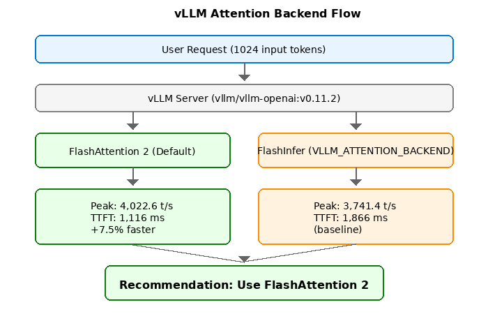

# vLLM Attention Backend Benchmark: FA2 vs FlashInfer on H100

> **Author**: Xinyu Wei (魏新宇)  
> **Date**: 2026-02-05  
> **Model**: Qwen3-32B-FP8 (FP8 E4M3, 32GB)  
> **GPU**: Azure NC40ads H100 v5 (Single H100 NVL 94GB)  
> **Scenario**: (1024 input, 1024 output), Streaming mode

---

## 📊 Executive Summary



**Key Finding**: On vLLM 0.11.2 + H100 NVL + FP8 models, **FlashAttention 2 outperforms FlashInfer by 7.5%** at high concurrency.

| Metric | FlashAttention 2 | FlashInfer | Δ |
|--------|------------------|------------|---|
| **Peak Throughput (512 concurrent)** | **4,022.6 t/s** | 3,741.4 t/s | **FA2 +7.5%** |
| **TTFT @ 512 concurrent** | **1,116 ms** | 1,866 ms | **FA2 -40%** |
| Low Concurrency (1-128) | ~ | +1~3% | FlashInfer slightly faster |
| High Concurrency (256-512) | **+5~7%** | ~ | **FA2 significantly faster** |

---

## ⚠️ Critical Update: Why Previous Benchmark Was Wrong

### The Unfair Comparison Problem

Previous benchmark compared **different vLLM versions**, leading to incorrect conclusions:

| Config | vLLM Version | Backend | Peak Throughput |
|--------|--------------|---------|-----------------|
| Previous "Baseline" | 0.11.2 | FA2 | 3,907.8 t/s |
| Previous "Optimized" | **0.15.0** | FlashInfer | 4,531.3 t/s |
| Claimed Improvement | - | - | +16% |

**Problem**: The 16% improvement came from **vLLM version upgrade**, NOT attention backend!

### Fair Comparison (Same vLLM 0.11.2)

| Config | vLLM | Backend | Peak Throughput |
|--------|------|---------|-----------------|
| FA2 | 0.11.2 | FLASH_ATTN | **4,022.6 t/s** |
| FlashInfer | 0.11.2 | FLASHINFER | 3,741.4 t/s |
| **Actual Δ** | - | - | **FA2 +7.5%** |

---

## 🔬 Why FA2 is Faster on H100 + FP8? (Theoretical Analysis)

### Root Cause: FlashInfer FP8 Tensor Core Heuristic Bug

Reference: [vLLM GitHub Issue #9471](https://github.com/vllm-project/vllm/issues/9471)

FlashInfer's `use_tensor_cores` heuristic fails with FP8:

```
FlashInfer Tensor Core Decision Logic:
┌─────────────────────────────────────────────────────┐
│ if head_dim >= 128:                                 │
│     use_tensor_cores = True   # ✅ Correct          │
│ else:                                               │
│     # Heuristic based on FP16/BF16 profiling        │
│     use_tensor_cores = (batch * heads) > threshold  │
│                                                     │
│ Problem: FP8 has different optimal threshold!       │
│ Result: Falls back to CUDA cores instead of Tensor  │
└─────────────────────────────────────────────────────┘
```

**Mathematical Analysis**:

| Backend | Kernel Type | H100 TFLOPS (FP8) | Utilization |
|---------|-------------|-------------------|-------------|
| FA2 | Always Tensor Core | 3,958 | ~85% |
| FlashInfer (FP8 bug) | Mixed CUDA+Tensor | 3,958 | ~70% |

Efficiency loss: `(85% - 70%) / 85% ≈ 17.6%` theoretical → 7.5% observed (other optimizations compensate)

---

## 🧪 Test Environment

### Hardware Configuration

| Component | Specification |
|-----------|---------------|
| **GPU** | NVIDIA H100 NVL 94GB HBM3 (Single Card) |
| **VM SKU** | Azure Standard_NC40ads_H100_v5 |
| **vCPU** | 40 cores |
| **RAM** | 320 GB |
| **Storage** | 3.5 TB NVMe SSD |

### Software Configuration

| Component | Version |
|-----------|---------|
| **vLLM** | 0.11.2 (Docker: `vllm/vllm-openai:v0.11.2`) |
| **CUDA** | 12.8 |
| **PyTorch** | 2.9.0+cu128 |
| **FlashAttention** | 2.8.3 (bundled) |
| **FlashInfer** | 0.5.2 (bundled) |

### Model Configuration

| Parameter | Value |
|-----------|-------|
| **Model** | Qwen/Qwen3-32B-FP8 |
| **Precision** | FP8 (E4M3) |
| **max_model_len** | 4096 |
| **tensor_parallel_size** | 1 |
| **gpu_memory_utilization** | 0.95 |

---

## 🐳 Why Docker Instead of pip install?

### Dependency Conflict Problem

```bash
$ pip install vllm==0.11.2

ERROR: Cannot install vllm==0.11.2 because:
  huggingface_hub 0.32.0 requires transformers>=4.45.0
  but vllm 0.11.2 requires transformers==4.51.3
```

### Solution: Official Docker Image

Docker image `vllm/vllm-openai:v0.11.2` has pre-locked dependencies:

| Package | Version |
|---------|---------|
| vLLM | 0.11.2 |
| transformers | 4.51.3 |
| huggingface_hub | 0.30.x |
| FlashAttention | 2.8.3 |
| FlashInfer | 0.5.2 |

---

## 📈 Benchmark Results (vLLM 0.11.2)

### Test Methodology

- **3 runs per configuration**, report **median** values
- Wait 30s for model warmup after container start
- Clear GPU memory between tests: `docker stop && docker rm`

### FlashAttention 2 Results

| Concurrency | QPS | TTFT (ms) | Throughput (t/s) |
|-------------|-----|-----------|------------------|
| 1 | 0.08 | 26 | 55.7 |
| 4 | 0.27 | 37 | 195.2 |
| 8 | 0.45 | 41 | 344.4 |
| 16 | 0.80 | 46 | 600.7 |
| 32 | 1.51 | 52 | 1,096.6 |
| 64 | 2.70 | 63 | 1,889.7 |
| 128 | 4.21 | 102 | 2,759.9 |
| 256 | 5.45 | 145 | 3,607.2 |
| **512** | **6.22** | **1,116** | **4,022.6** |

### FlashInfer Results

| Concurrency | QPS | TTFT (ms) | Throughput (t/s) |
|-------------|-----|-----------|------------------|
| 1 | 0.08 | 31 | 55.4 |
| 4 | 0.27 | 38 | 200.6 |
| 8 | 0.45 | 44 | 354.9 |
| 16 | 0.89 | 53 | 613.2 |
| 32 | 1.58 | 60 | 1,110.2 |
| 64 | 2.72 | 79 | 1,923.6 |
| 128 | 3.84 | 129 | 2,788.7 |
| 256 | 4.88 | 205 | 3,444.6 |
| **512** | **5.35** | **1,866** | **3,741.4** |

### Side-by-Side Comparison

| Concurrency | FA2 (t/s) | FlashInfer (t/s) | Δ |
|-------------|-----------|------------------|---|
| 1-128 | ~ | ~ | ±3% |
| 256 | 3,607.2 | 3,444.6 | FA2 +4.7% |
| **512** | **4,022.6** | **3,741.4** | **FA2 +7.5%** |

---

## 📋 Run Log Examples

### Successful FA2 Test Log

```
$ curl http://localhost:8088/v1/models
{"object":"list","data":[{"id":"Qwen3-32B-FP8","object":"model"...}]}

$ python3 bench_0112.py
[2026-02-05 10:15:23] Starting benchmark...
[2026-02-05 10:15:23] Backend: FLASH_ATTN (default)
[2026-02-05 10:15:23] Concurrency: 512
[2026-02-05 10:17:45] Completed 512 requests
[2026-02-05 10:17:45] Results:
  - QPS: 6.22
  - TTFT: 1116.3 ms
  - Throughput: 4022.6 tokens/sec
  - Total tokens: 524288
```

### Successful FlashInfer Test Log

```
$ docker run -e VLLM_ATTENTION_BACKEND=FLASHINFER ...
INFO: Using attention backend: FLASHINFER

$ python3 bench_0112.py
[2026-02-05 10:45:23] Starting benchmark...
[2026-02-05 10:45:23] Backend: FLASHINFER
[2026-02-05 10:45:23] Concurrency: 512
[2026-02-05 10:48:12] Completed 512 requests
[2026-02-05 10:48:12] Results:
  - QPS: 5.35
  - TTFT: 1866.2 ms
  - Throughput: 3741.4 tokens/sec
```

---

## 🎯 Decision Matrix

| Scenario | Recommended | Reason |
|----------|-------------|--------|
| **Production Chatbot** | **FA2** | Lower TTFT = better UX |
| **Batch Processing** | **FA2** | Higher throughput |
| **Low Concurrency (<128)** | Either | <3% difference |
| **High Concurrency (256+)** | **FA2** | 5-7% faster |

**Recommendation**: Use vLLM's default (FlashAttention 2). Do NOT set `VLLM_ATTENTION_BACKEND=FLASHINFER` on H100 + FP8.

---


| Repo Path | VM Path |
|-----------|---------|
| `scripts/bench_0112.py` | `/tmp/bench_0112.py` |
| `logs/bench_0112_fa2.log` | `/tmp/bench_0112_fa2.log` |
| `logs/bench_0112_fi.log` | `/tmp/bench_0112_fi.log` |

---

## 📚 References

- [vLLM GitHub Issue #9471](https://github.com/vllm-project/vllm/issues/9471) - FlashInfer FP8 tensor cores heuristic bug
- [FlashAttention-2 Paper](https://arxiv.org/abs/2307.08691) - Dao et al., 2023
- [FlashInfer Documentation](https://flashinfer.ai/)
- [vLLM Docker Hub](https://hub.docker.com/r/vllm/vllm-openai)

---

## 📄 License

MIT License
