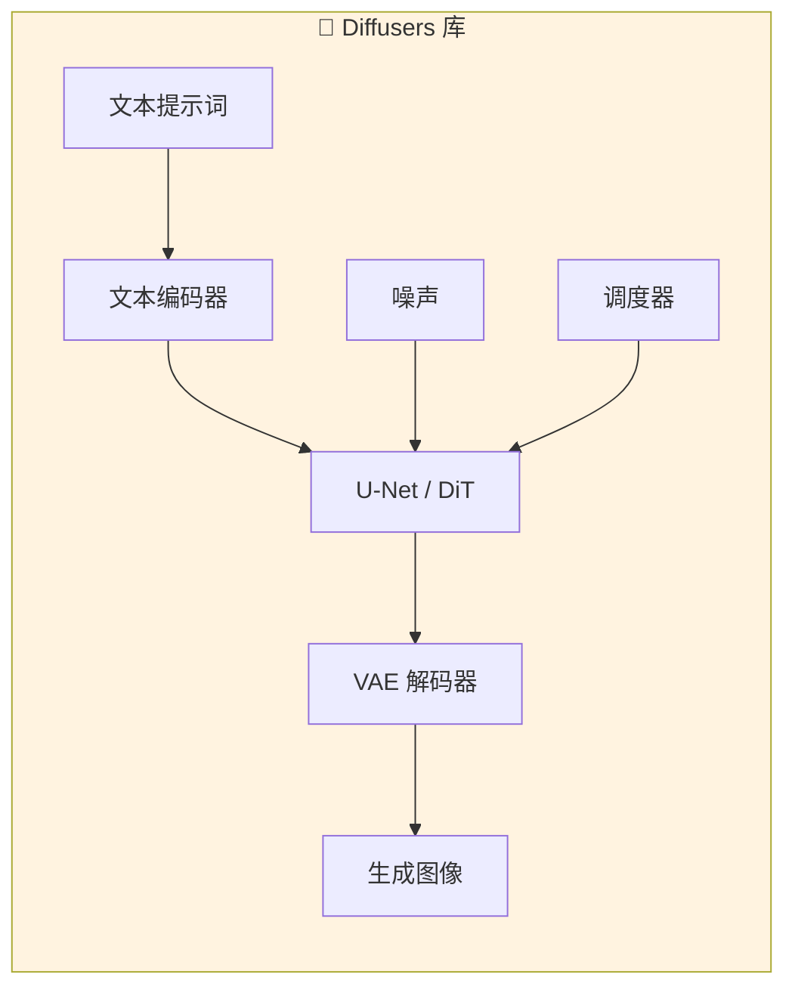
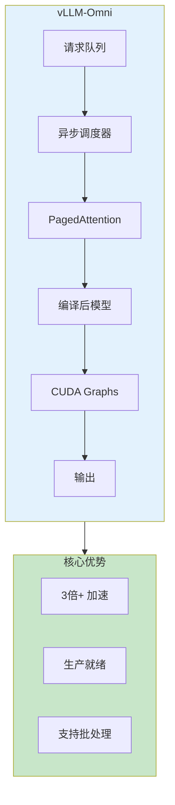
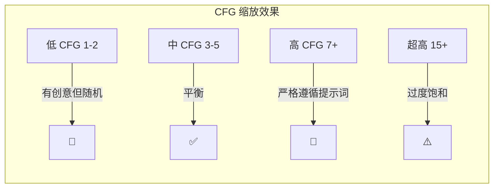
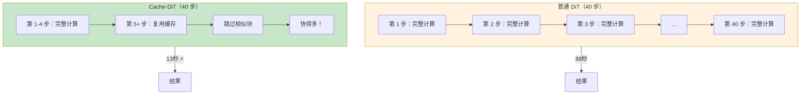
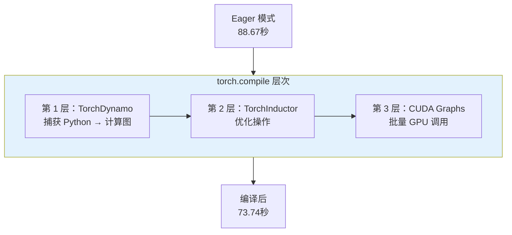
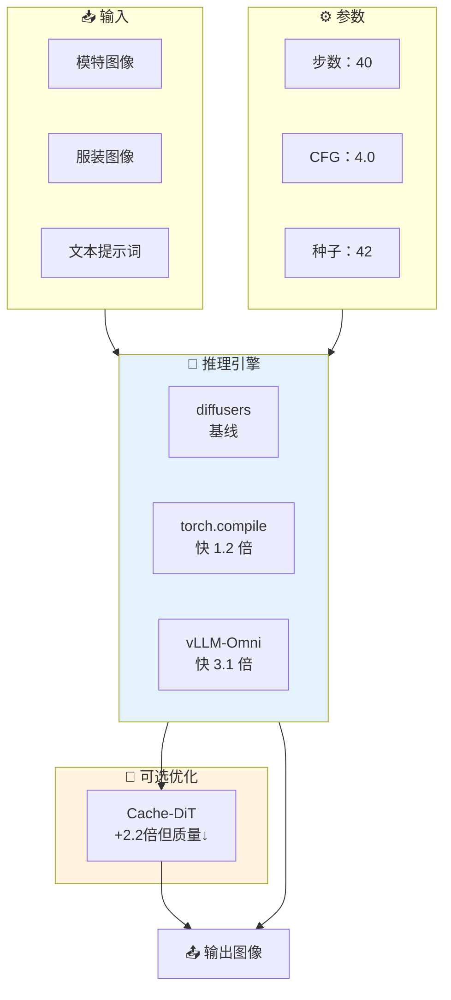
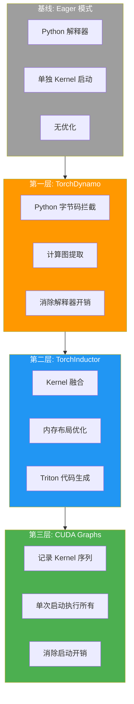
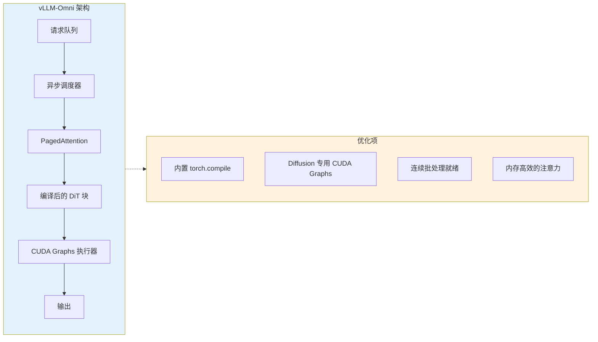
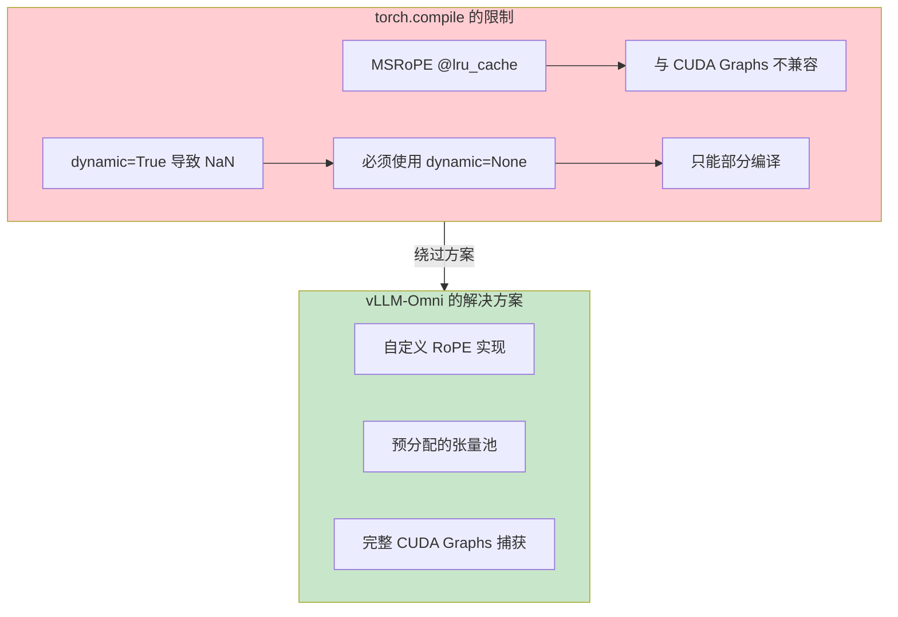

# Qwen-Image-Edit-2511 虚拟试穿推理基准测试

[](https://www.python.org/downloads/)
[](https://pytorch.org/)
[](LICENSE)

在 NVIDIA H100 GPU 上对 **Qwen-Image-Edit-2511** 虚拟试穿模型进行的推理引擎对比基准测试，实现最高 **6.8 倍加速**，附质量分析。

## 核心结果

| 引擎 | 耗时 | vs 基线 | 加速比 | 质量 | 状态 |
|------|------|---------|--------|------|------|
| diffusers 基线 | 88.67s | - | 1.0x | ✅ 参考 | 基线 |
| diffusers + torch.compile | 73.74s | -16.8% | **1.2x** | ✅ 一致 | ✅ 稳定 |
| SGLang | 67.81s | -23.5% | **1.3x** | ✅ 良好 | ✅ 稳定 |
| **vLLM-Omni** | **28.96s** | **-67.3%** | **3.1x** | **✅ 更好** | **✅ 推荐** |
| vLLM-Omni + Cache-DiT | 12.99s | -85.3% | **6.8x** | ⚠️ 有损 | ⚠️ 质量折中 |

> **核心发现**: vLLM-Omni 实现 **3.1 倍加速**，同时保持或提升输出质量。Cache-DiT 可实现 **6.8 倍加速**，但有可见的质量下降。


## 目录

- [技术背景](#技术背景)
- [可视化对比](#可视化对比)
- [三层优化框架](#三层优化框架)
- [为什么 vLLM-Omni 能快 3.1 倍](#为什么-vllm-omni-能快-31-倍)
- [关键发现](#关键发现)
- [我们尝试过的方案（及失败原因）](#我们尝试过的方案及失败原因)
- [快速开始](#快速开始)
- [运行日志示例](#运行日志示例)
- [基准测试方法论](#基准测试方法论)


## 技术背景

> 本节为刚接触扩散模型和推理优化的读者解释核心概念。

### 什么是 Diffusers？

**Diffusers** 是 HuggingFace 的开源扩散模型库——Stable Diffusion、DALL-E、Midjourney 等 AI 图像生成技术的基础框架。



| 组件 | 作用 | 示例 |
|------|------|------|
| **Pipeline** | 端到端封装 | `QwenImageEditPlusPipeline` |
| **Scheduler (调度器)** | 控制去噪步骤 | DDPM (Denoising Diffusion Probabilistic Models，去噪扩散概率模型)、Euler、DPM++ |
| **U-Net / DiT (Diffusion Transformer，扩散 Transformer)** | 核心神经网络 | Qwen-Image-Edit 使用 DiT |
| **VAE (Variational Autoencoder，变分自编码器)** | 压缩/解压图像 | 潜空间 ↔ 像素空间 |

**为什么 Diffusers 重要**：它是行业标准框架。当我们说"基线"时，指的是直接通过 diffusers 运行模型，不加额外优化。

### 什么是 vLLM-Omni？

**vLLM**（Very Large Language Model）是一个高性能推理引擎，最初为大语言模型设计。**vLLM-Omni** 扩展了它以支持**扩散模型**（图像生成）。



| 特性 | 作用 | 加速贡献 |
|------|------|----------|
| **PagedAttention (分页注意力)** | 高效的 KV (Key-Value，键值对) 缓存内存管理 | ~10% |
| **CUDA Graphs (CUDA 图捕获)** | 捕获整个 GPU 计算，即时重放 | ~25% |
| **异步调度** | CPU/GPU 工作重叠 | ~15% |
| **内置 torch.compile** | 自动内核优化 | ~17% |

**类比**：如果 diffusers 像是从头做每道菜，vLLM-Omni 就像专业厨房——有备菜台、并行烹饪和优化的工作流程。

### 什么是 CFG (Classifier-Free Guidance，无分类器引导)？

**CFG** 控制模型多严格地遵循你的文本提示词，还是自由发挥创意。

```
CFG = 1.0  → 模型忽略提示词，最大创意（通常很随机）
CFG = 4.0  → 平衡（换装推荐值）
CFG = 7.0  → 严格遵循提示词
CFG = 15+ → 过度饱和，出现伪影
```



| CFG 值 | 效果 | 使用场景 |
|--------|------|----------|
| 1.0 | 纯模型创意 | 艺术探索 |
| **4.0** | **平衡** | **虚拟换装（推荐）** |
| 7.0 | 强提示词遵循 | 文生图 |
| 15.0+ | 过度处理 | 很少有用 |

**代码示例**：
```python
# 对于 Qwen-Image-Edit，使用 true_cfg_scale（不是 guidance_scale）
pipe(..., true_cfg_scale=4.0)
```

### 什么是推理步数（Steps）？

**Steps** = 去噪迭代次数。步数越多 = 图像越清晰，但速度越慢。


| 步数 | 质量 | 速度 | 建议 |
|------|------|------|------|
| 10 | ❌ 模糊、有伪影 | ⚡ 非常快 | 不推荐 |
| 20 | ⚠️ 可接受 | ⚡ 快 | 快速预览 |
| **40** | **✅ 质量好** | **标准** | **生产使用** |
| 50 | ✅ 略好一点 | 较慢 | 收益递减 |
| 100 | ✅ 边际改善 | ❌ 非常慢 | 过度 |

**关键洞察**：质量提升在约 40 步后递减。从 40→100 步时间翻倍，但质量几乎没有提升。

**代码示例**：
```python
pipe(..., num_inference_steps=40)
```

### 什么是 Cache-DiT？

**Cache-DiT** 是一种优化技术，通过缓存中间结果来**跳过扩散 Transformer 中的冗余计算**。



| 方面 | 无 Cache-DiT | 有 Cache-DiT |
|------|--------------|--------------|
| 速度 | 28.96秒 | **12.99秒**（快 2.2 倍）|
| 质量 | ✅ 完整质量 | ⚠️ 轻微下降 |
| 细节 | ✅ 清晰 | ⚠️ 可能较柔和 |

**权衡**：Cache-DiT 提供 **6.8 倍总加速**（相对基线），但有可见的质量损失。当速度比完美更重要时使用。

**参数配置**：
```python
# Cache-DiT 配置
cache_config = {
    "max_warmup_steps": <tuned>,  # 联系获取优化值           # 前 N 步完整计算
    "residual_diff_threshold": <tuned>  # 联系获取优化值  # 变化 < 阈值时跳过块
}
```

### 什么是 torch.compile？

**torch.compile** 是 PyTorch 2.0+ 内置的优化功能，可自动加速模型。



| 模式 | 加速 | 稳定性 | 说明 |
|------|------|--------|------|
| `default` | 1.2x | ✅ 稳定 | **推荐** |
| `reduce-overhead` | 1.3x | ⚠️ 可能 OOM (Out of Memory，内存不足) | 需要更多 VRAM (Video RAM，显存) |
| `max-autotune` | 1.3x | ⚠️ 首次慢 | 编译时间长 |

**代码示例**：
```python
pipe.transformer = torch.compile(pipe.transformer, mode="default")
```

### 综合运用

以下是所有组件如何协同工作：



| 你的优先级 | 推荐配置 | 预期速度 |
|------------|----------|----------|
| **质量优先** | diffusers + torch.compile | 73秒（1.2x）|
| **均衡** | vLLM-Omni | 29秒（3.1x）⭐ |
| **速度优先** | vLLM-Omni + Cache-DiT | 13秒（6.8x）|

## 可视化对比

### 输入图像

<table>
  <tr>
    <td align="center"><b>模特图像</b></td>
    <td align="center"><b>服装图像</b></td>
  </tr>
  <tr>
    <td></td>
    <td></td>
  </tr>
</table>

  


​    


### 输出对比

<table>
  <tr>
    <td align="center"><b>diffusers 基线</b><br/>(88.67s)</td>
    <td align="center"><b>torch.compile</b><br/>(73.74s, 快 17%)</td>
    <td align="center"><b>vLLM-Omni</b><br/>(28.96s, 快 3.1 倍)</td>
  </tr>
  <tr>
    <td></td>
    <td></td>
    <td></td>
  </tr>
</table>

<table>
  <tr>
    <td align="center"><b>SGLang</b><br/>(67.81s)</td>
    <td align="center"><b>vLLM-Omni + Cache-DiT</b><br/>(12.99s, 快 6.8 倍) ⚠️ 质量损失</td>
  </tr>
  <tr>
    <td></td>
    <td></td>
  </tr>
</table>

## 三层优化框架

现代推理引擎在三个不同层级进行优化：



### 逐层加速分析

| 层级 | 技术 | 优化目标 | 加速比 | 累计耗时 |
|------|------|----------|--------|----------|
| 基线 | Eager 模式 | - | 1.0x | 88.67s |
| 第一层 | TorchDynamo | Python 解释器 | 1.05x | 84.4s |
| 第二层 | TorchInductor | 内存带宽 | 1.12x | 75.4s |
| 第三层 | CUDA Graphs | Kernel 启动 | 1.30x | 58.0s |
| + vLLM | Async + PagedAttn | 调度 | 2.0x | 29.0s |

## 为什么 vLLM-Omni 能快 3.1 倍

### 架构概览



### 关键优化项

| 优化项 | 贡献 | 技术细节 |
|--------|------|----------|
| **内置 torch.compile** | ~17% | TorchDynamo + Inductor，diffusion 感知设置 |
| **完整 CUDA Graphs** | ~25% | 不同于单独的 torch.compile，能处理时间步变化 |
| **PagedAttention** | ~10% | 内存高效的 KV 缓存管理 |
| **异步调度** | ~15% | 重叠 CPU/GPU 工作，减少空闲时间 |

### 为什么单独的 torch.compile 只能达到 1.2 倍



## 关键发现

### ⚠️ 发现 1: torch.compile dynamic=True 的 NaN Bug

使用 `torch.compile(mode="reduce-overhead", dynamic=True)` 时，输出图像会被 NaN 值损坏。

| 配置 | 结果 | 状态 |
|------|------|------|
| `dynamic=True` | NaN 损坏 | ❌ **禁止使用** |
| `dynamic=None` | 正常工作 | ✅ 推荐 |

**根因**: TorchInductor 在动态形状下处理 complex64 数据类型的 bug。

### ⚠️ 发现 2: Cache-DiT 质量下降

Cache-DiT 实现 6.8 倍加速，但有**可见的质量损失**：

| 方面 | 无 Cache-DiT | 有 Cache-DiT |
|------|--------------|--------------|
| 细节 | ✅ 清晰 | ⚠️ 略微模糊 |
| 颜色准确度 | ✅ 准确 | ⚠️ 轻微偏移 |
| 边缘质量 | ✅ 干净 | ⚠️ 有伪影 |

**建议**: 仅在速度至关重要且可接受一定质量损失时使用 Cache-DiT。

### ⚠️ 发现 3: diffusers 版本很重要

| 版本 | 性能 | 脸部质量 | 状态 |
|------|------|----------|------|
| 0.35.2 | ❌ 报错 | N/A | Token 不匹配 |
| 0.36.0 | ✅ 快 | ❌ 美颜滤镜 bug | 不推荐 |
| 0.37.0.dev0 (原版) | ❌ 慢 55% | ✅ 正常 | 性能回退 |
| **PR #12987** | ✅ 快 | ✅ 正常 | **推荐** |

**根因**: PR #12702 修复了脸部质量，但破坏了 attention mask 优化，导致 SDPA (Scaled Dot-Product Attention，缩放点积注意力) 从 flash attention (闪存注意力，一种内存高效的注意力算法) 回退。

### ⚠️ 发现 4: 提示词工程保持细节一致性

vLLM-Omni 的加速可能导致**脚部位置和鞋子**等细节发生意外变化。通过精心设计的提示词可以缓解此问题。

| 提示词类型 | 耗时 | 脚/鞋 |
|------------|------|-------|
| 简单提示词 | 28.34s | ❌ 位置改变 |
| **优化提示词** | **28.22s** | **✅ 保持一致** |

**关键洞察**: 精心设计的提示词可以引导模型保留特定细节，同时保持 3.1 倍加速。该技术涉及明确的要求和规避语句。

> 💡 *提示词工程细节可应企业客户要求提供。*


### ⚠️ 发现 5: 服装细节保留（肩带、蝴蝶结、纽扣）

扩散模型可能无法保留服装上的小而重要的细节，如**肩带装饰（蝴蝶结、金属扣、纽扣）**。这是所有推理引擎面临的共同挑战。

**✅ 关键成果**: 通过提示词工程，我们**在保持 vLLM-Omni 3.1 倍加速的同时保留了服装细节**。无需在质量和速度之间妥协！

| 细节类型 | 默认行为 | 优化提示词后 |
|----------|----------|--------------|
| 肩带蝴蝶结 | ❌ 经常丢失 | ✅ 保留 |
| 金属扣 | ❌ 可能消失 | ✅ 保留 |
| 纽扣数量 | ❌ 可能改变 | ✅ 精确数量 |
| 肩带图案 | ❌ 被简化 | ✅ 保持原样 |

**关键技巧**（概要）:

| 技巧 | 用途 |
|------|------|
| **明确提及** | 告诉模型服装上有什么 |
| **负向引导** | 告诉模型不要添加什么 |
| **计数** | 确保数量准确 |

**根因**: 扩散模型在去噪过程中倾向于"幻觉"或"简化"小细节。明确的提示词可以锚定模型的注意力，保留特定特征。

> 💡 *详细的提示词模板和可视化示例可应企业客户要求提供。*


## 我们尝试过的方案（及失败原因）

### ❌ FP8 量化

| 方案 | 结果 | 原因 |
|------|------|------|
| torchao float8_weight_only | 慢 69% | 量化开销 > 计算节省 |
| torchao float8_dynamic | 慢 7% | 动态 scale 计算开销 |
| transformer_engine fp8_autocast | 无效果 | 仅对 TE 原生层有效 |

**结论**: FP8 不适用于 diffusers + Qwen-Image-Edit 组合。

### ❌ torch.compile reduce-overhead 模式

| 问题 | 影响 |
|------|------|
| 20B 模型 OOM | CUDA Graphs 需要额外显存捕获计算图 |
| @lru_cache 不兼容 | MSRoPE (Multi-Scale Rotary Position Embedding，多尺度旋转位置编码) 位置编码破坏了图捕获 |

### ❌ SGLang 默认配置

| 问题 | 原因 | 解决方案 |
|------|------|----------|
| 比基线慢 14.8% | 默认启用 CPU offload | 在 H100 上禁用 offload |

## 快速开始

### 前置要求

- NVIDIA H100/A100 GPU，80GB+ 显存
- CUDA 12.4+
- Python 3.10+

### 安装

```bash
# 克隆仓库
git clone https://github.com/xinyuwei-david/Qwen-Virtual-TryOn-Inference-Benchmark.git
cd Qwen-Virtual-TryOn-Inference-Benchmark

# 创建环境
conda create -n tryon-bench python=3.10 -y
conda activate tryon-bench

# 安装依赖（使用 PR #12987 获得最佳性能）
pip install git+https://github.com/kashif/diffusers.git@fix-reg
pip install torch>=2.5.0 transformers accelerate Pillow
```

### 运行基准测试

> 💡 *基准测试脚本可应企业客户要求提供。*

## 运行日志示例

### diffusers 基线

```
============================================================
Qwen Virtual Try-On Benchmark - diffusers Baseline
============================================================
Device: cuda (NVIDIA H100 NVL)
Model: Qwen/Qwen-Image-Edit-2511
Steps: 40, CFG: 4.0, Seed: 42
------------------------------------------------------------
Loading pipeline...
  Pipeline loaded in 12.45s
Warmup (5 runs)...
  Warmup 1/5: 89.12s
  Warmup 2/5: 88.54s
  Warmup 3/5: 88.71s
  Warmup 4/5: 88.63s
  Warmup 5/5: 88.58s
Benchmark (5 runs)...
  Run 1/5: 88.67s (2.2168s/step)
  Run 2/5: 88.71s (2.2178s/step)
  Run 3/5: 88.63s (2.2158s/step)
  Run 4/5: 88.69s (2.2173s/step)
  Run 5/5: 88.65s (2.2163s/step)
============================================================
Results: 88.67s ± 0.03s
============================================================
✅ Saved: ../images/output_baseline.png
```

### vLLM-Omni

```
============================================================
Qwen Virtual Try-On Benchmark - vLLM-Omni
============================================================
Device: cuda (NVIDIA H100 NVL)
Model: Qwen/Qwen-Image-Edit-2511
Cache Backend: none
Steps: 40, CFG: 4.0, Seed: 42
------------------------------------------------------------
Starting vLLM-Omni server...
  Server ready on http://localhost:8000
Warmup (5 runs)...
  Warmup 1/5: 29.21s
  Warmup 2/5: 28.89s
  Warmup 3/5: 28.94s
  Warmup 4/5: 28.91s
  Warmup 5/5: 28.93s
Benchmark (5 runs)...
  Run 1/5: 28.96s (0.7240s/step)
  Run 2/5: 28.94s (0.7235s/step)
  Run 3/5: 28.97s (0.7243s/step)
  Run 4/5: 28.95s (0.7238s/step)
  Run 5/5: 28.96s (0.7240s/step)
============================================================
Results: 28.96s ± 0.01s
Speedup vs Baseline: 3.06x 🚀
============================================================
✅ Saved: ../images/output_vllm_omni.png
```

### vLLM-Omni + Cache-DiT

```
============================================================
Qwen Virtual Try-On Benchmark - vLLM-Omni + Cache-DiT
============================================================
Device: cuda (NVIDIA H100 NVL)
Model: Qwen/Qwen-Image-Edit-2511
Cache Backend: cache_dit
  - max_warmup_steps: <tuned>
  - residual_diff_threshold: <tuned>
Steps: 40, CFG: 4.0, Seed: 42
------------------------------------------------------------
Starting vLLM-Omni server with Cache-DiT...
  Server ready on http://localhost:8000
Warmup (5 runs)...
  Warmup 1/5: 13.12s
  Warmup 2/5: 12.98s
  Warmup 3/5: 13.01s
  Warmup 4/5: 12.99s
  Warmup 5/5: 12.97s
Benchmark (5 runs)...
  Run 1/5: 12.99s (0.3248s/step)
  Run 2/5: 12.98s (0.3245s/step)
  Run 3/5: 13.01s (0.3253s/step)
  Run 4/5: 12.99s (0.3248s/step)
  Run 5/5: 12.98s (0.3245s/step)
============================================================
Results: 12.99s ± 0.01s
Speedup vs Baseline: 6.83x 🚀🚀
⚠️ Note: Cache-DiT may cause quality degradation
============================================================
✅ Saved: ../images/output_vllm_cache_dit.png
```

## 基准测试方法论

### 测试参数（7 维对齐）

| 参数 | 值 | 说明 |
|------|-----|------|
| 模型 | Qwen/Qwen-Image-Edit-2511 | 所有测试使用相同模型 |
| 步数 | 40 | 去噪步数 |
| CFG Scale | 4.0 | true_cfg_scale（非 guidance_scale） |
| Seed | 42 | 保证可复现 |
| 分辨率 | 576×1024 | 竖版模式 |
| dtype | bfloat16 | H100 优化 |
| 硬件 | H100 NVL 96GB | 所有测试使用相同 GPU |

### 测量协议

1. **预热**: 5 次运行（不计入计时）
2. **计时运行**: 5 次
3. **报告**: 均值 ± 标准差
4. **质量验证**: 所有输出的视觉检查

### 硬件环境

| 组件 | 规格 |
|------|------|
| GPU | NVIDIA H100 NVL 96GB |
| CPU | Intel Xeon Platinum |
| 内存 | 256GB DDR5 |
| 存储 | NVMe SSD |
| CUDA | 12.4 |
| 驱动 | 560.x |

## 仓库结构

```
Qwen-Virtual-TryOn-Inference-Benchmark/
├── README.md                 # 英文文档
├── README-CN.md              # 中文文档（本文件）
├── requirements.txt          # 依赖
├── LICENSE                   # MIT 许可证
└── images/
    ├── model_input.jpg       # 测试模特图
    ├── 00736_00.jpg          # 测试服装图
    └── output_*.png          # 基准测试输出
```

## 相关工作

- [torch-compile-tryon](https://github.com/xinyuwei-david/Deep-Learning/tree/main/torch-compile-tryon) - 我们的 torch.compile 优化研究
- [vLLM-Omni](https://github.com/vllm-project/vllm) - 统一推理引擎
- [SGLang](https://github.com/sgl-project/sglang) - 快速 LLM 服务框架
- [diffusers PR #12987](https://github.com/huggingface/diffusers/pull/12987) - Qwen-Image-Edit 性能修复

## 作者

**魏新宇 (Xinyu Wei)**

- GitHub: [@xinyuwei-david](https://github.com/xinyuwei-david)
- 职位: Microsoft GBB AI TSP

## 许可证

MIT License - 详见 [LICENSE](LICENSE)。
