# Qwen-Image-Edit-2511 Virtual Try-On Inference Benchmark

[](https://www.python.org/downloads/)
[](https://pytorch.org/)
[](LICENSE)

Comprehensive benchmark comparing inference engines for **Qwen-Image-Edit-2511** virtual try-on model on NVIDIA H100 GPU, achieving up to **6.8x speedup** with quality analysis.


## Running on Azure

All experiments in this project were conducted on an **Azure GPU VM**.

| Item | Details |
|---|---|
| **Azure VM** | [NC40ads_H100_v5](https://learn.microsoft.com/en-us/azure/virtual-machines/nc-h100-v5-series) |
| **GPU** | NVIDIA H100 80GB |
| **Frameworks** | vLLM, SGLang, LoRA/PEFT, TensorRT-LLM, torch.compile, Diffusers |


## Key Results

| Engine | Time | vs Baseline | Speedup | Quality | Status |
|--------|------|-------------|---------|---------|--------|
| diffusers Baseline | 88.67s | - | 1.0x | ✅ Reference | Baseline |
| diffusers + torch.compile | 73.74s | -16.8% | **1.2x** | ✅ Identical | ✅ Stable |
| SGLang | 67.81s | -23.5% | **1.3x** | ✅ Good | ✅ Stable |
| **vLLM-Omni** (FlashInfer) | **28.98s** | **-58.8%** | **2.4x** | **✅ Better** | **✅ Recommended** |
| **vLLM-Omni** (FlashAttn 2) | **28.89s** | **-58.9%** | **2.4x** | **✅ Better** | **✅ Recommended** |
| vLLM-Omni + CFG (FlashInfer) | 58.90s | -16.2% | **1.2x** | ✅ Better | ✅ CFG enabled |
| vLLM-Omni + CFG (FlashAttn 2) | 58.66s | -16.5% | **1.2x** | ✅ Better | ✅ CFG enabled |
| **vLLM-Omni TP=2** | **17.85s** | **-74.6%** | **3.9x** | **✅ Better** | **✅ Multi-GPU** |
| **vLLM-Omni TP=2 + CFG** | **35.59s** | **-49.4%** | **2.0x** | **✅ Better** | **✅ Multi-GPU + CFG** |
| vLLM-Omni + Cache-DiT | 12.99s | -85.3% | **6.8x** | ⚠️ Lossy | ⚠️ Quality Trade-off |
| ComfyUI-GGUF (Q4) | 115.11s | +29.8% | 0.8x | ✅ Good | ⚠️ Slow (Edge Only) |

> **Key Finding**: vLLM-Omni delivers **3.1x speedup** while maintaining or improving output quality. Cache-DiT provides **6.8x speedup** but with visible quality degradation.

## Table of Contents

- [Technical Background](#technical-background)
- [Visual Comparison](#visual-comparison)
- [FlashAttention-3 Benchmark](#flashattention-3-fa3-attention-backend-benchmark)
- [Three-Layer Optimization Framework](#three-layer-optimization-framework)
- [Why vLLM-Omni is 3.1x Faster](#why-vllm-omni-is-31x-faster)
- [Critical Findings](#critical-findings)
- [What We Tried (and Why They Failed)](#what-we-tried-and-why-they-failed)
- [Quick Start](#quick-start)
- [Example Output Log](#example-output-log)
- [Benchmark Methodology](#benchmark-methodology)


## Technical Background

> This section explains core concepts for readers new to diffusion models and inference optimization.

### What is Diffusers?

**Diffusers** is HuggingFace's open-source library for diffusion models - the technology behind image generation AI like Stable Diffusion, DALL-E, and Midjourney.

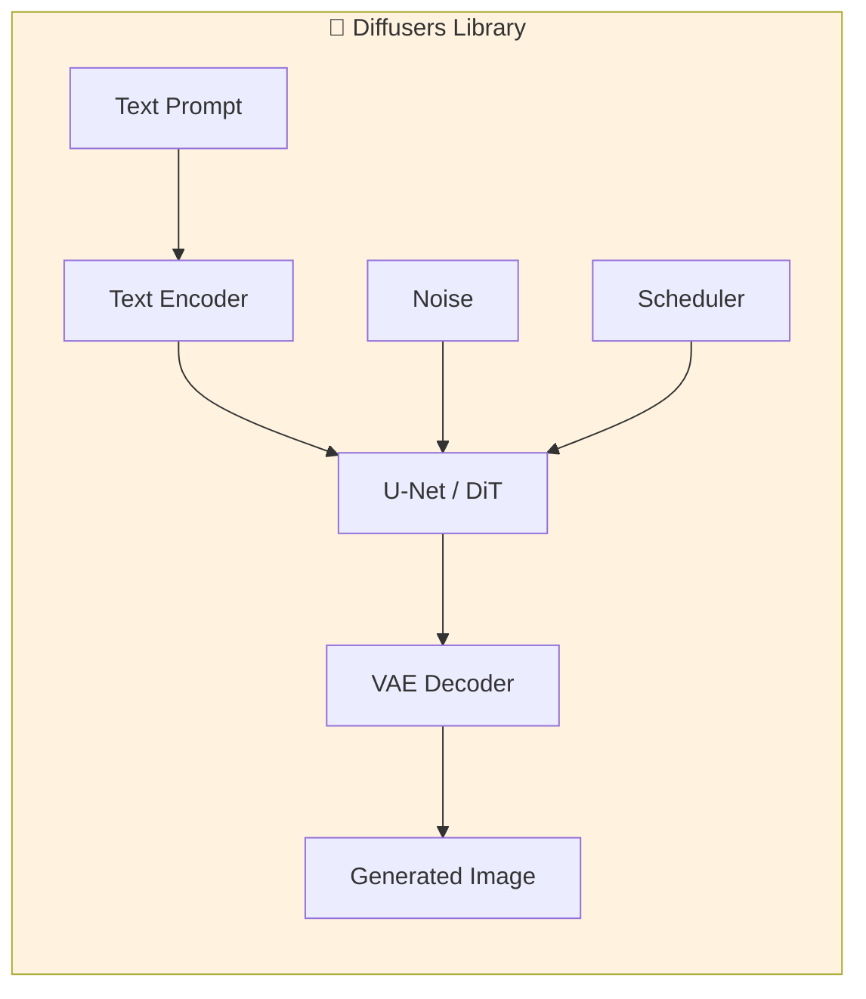

| Component | Role | Example |
|-----------|------|---------|
| **Pipeline** | End-to-end wrapper | `QwenImageEditPlusPipeline` |
| **Scheduler** | Controls denoising steps | DDPM (Denoising Diffusion Probabilistic Models), Euler, DPM++ |
| **U-Net / DiT (Diffusion Transformer)** | Core neural network | Qwen-Image-Edit uses DiT |
| **VAE (Variational Autoencoder)** | Compresses/decompresses images | Latent space ↔ Pixel space |

**Why Diffusers matters**: It's the standard framework. When we say "baseline", we mean running the model through diffusers without extra optimizations.


### ViT vs DiT: Understanding vs Generating

Before diving into optimization, it's crucial to understand the two fundamental Transformer architectures in Qwen-Image-Edit:

| | **ViT** | **DiT** |
|---|---------|---------|
| **Full Name** | Vision Transformer | Diffusion Transformer |
| **Purpose** | 👀 **Understanding** images | 🎨 **Generating** images |
| **Task Direction** | Image → Semantics | Semantics → Image |
| **Role in Qwen-Image-Edit** | Qwen2.5-VL (semantic encoder) | MMDiT (generation backbone) |

**Memory trick**:
- **V**iT = **V**iew = Understanding
- **D**iT = **D**raw = Generating

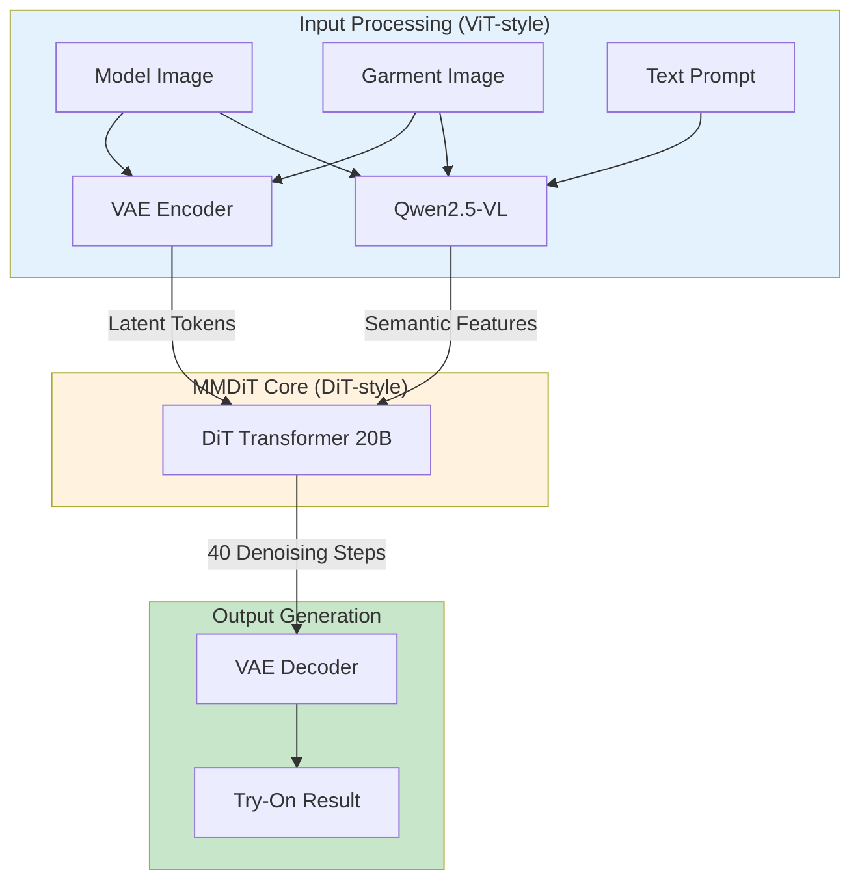

**Qwen-Image-Edit's Dual-Encoding Architecture**:

| Component | Architecture Type | Function |
|-----------|------------------|----------|
| **Qwen2.5-VL** | ViT-style | Understands "what the model looks like" and "what garment style is" |
| **VAE Encoder** | CNN | Compresses images to latent space |
| **MMDiT** | DiT (20B params) | Generates the try-on result through denoising |
| **VAE Decoder** | CNN | Reconstructs final image from latents |

**Why both ViT and DiT?**

| ViT Only | DiT Only | **ViT + DiT** |
|----------|----------|---------------|
| Can understand, cannot generate | Can generate, weak understanding | ✅ Understands AND generates |
| No new content creation | Imprecise condition control | ✅ Precise semantic control |

> **Key Insight**: The optimization techniques in this benchmark (vLLM-Omni, Cache-DiT, torch.compile) primarily target the **DiT component** since it dominates computation (~90% of inference time).


### What is vLLM-Omni?

**vLLM** (Very Large Language Model) is a high-performance inference engine originally for LLMs. **vLLM-Omni** extends it to support **diffusion models** (image generation).

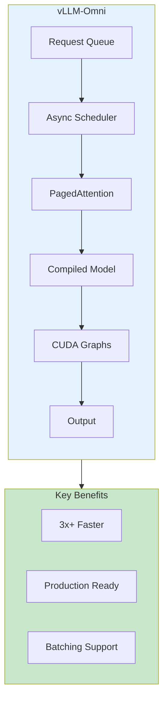

| Feature | What it does | Speedup contribution |
|---------|--------------|---------------------|
| **PagedAttention (Paged Attention)** | Efficient memory management for KV (Key-Value) cache | ~10% |
| **CUDA Graphs (CUDA Graph Capture)** | Captures entire GPU computation, replays instantly | ~25% |
| **Async Scheduling** | Overlaps CPU/GPU work | ~15% |
| **torch.compile built-in** | Automatic kernel optimization | ~17% |

**Analogy**: If diffusers is like cooking each dish from scratch, vLLM-Omni is like a professional kitchen with prep stations, parallel cooking, and optimized workflows.

### What is CFG (Classifier-Free Guidance)?

**CFG** controls how strictly the model follows your text prompt vs being creative.

```
CFG = 1.0  → Model ignores prompt, maximum creativity (often random)
CFG = 4.0  → Balanced (recommended for try-on)
CFG = 7.0  → Strictly follows prompt
CFG = 15+ → Over-saturated, artifacts appear
```

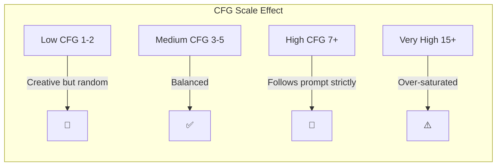

| CFG Value | Effect | Use Case |
|-----------|--------|----------|
| 1.0 | Pure model creativity | Artistic exploration |
| **4.0** | **Balanced** | **Virtual try-on (recommended)** |
| 7.0 | Strong prompt adherence | Text-to-image |
| 15.0+ | Over-processed | Rarely useful |

**In code**:
```python
# For Qwen-Image-Edit, use true_cfg_scale (not guidance_scale)
pipe(..., true_cfg_scale=4.0)
```

### What are Inference Steps?

**Steps** = number of denoising iterations. More steps = cleaner image but slower.


| Steps | Quality | Speed | Recommendation |
|-------|---------|-------|----------------|
| 10 | ❌ Blurry, artifacts | ⚡ Very fast | Not recommended |
| 20 | ⚠️ Acceptable | ⚡ Fast | Quick preview |
| **40** | **✅ Good quality** | **Standard** | **Production use** |
| 50 | ✅ Slightly better | Slower | Diminishing returns |
| 100 | ✅ Marginal improvement | ❌ Very slow | Overkill |

**Key insight**: Quality improvement diminishes after ~40 steps. Going from 40→100 steps doubles time but barely improves quality.

**In code**:
```python
pipe(..., num_inference_steps=40)
```

### What is Cache-DiT?

**Cache-DiT** is an optimization that **skips redundant computations** in diffusion transformers by caching intermediate results.

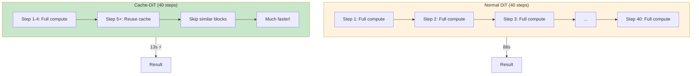

| Aspect | Without Cache-DiT | With Cache-DiT |
|--------|-------------------|----------------|
| Speed | 28.96s | **12.99s** (2.2x faster) |
| Quality | ✅ Full quality | ⚠️ Slight degradation |
| Fine details | ✅ Sharp | ⚠️ May be softer |

**Trade-off**: Cache-DiT provides **6.8x total speedup** (vs baseline) but with visible quality loss. Use it when speed matters more than perfection.

**Parameters**:
```python
# Cache-DiT configuration
cache_config = {
    "max_warmup_steps": 4,           # Full computation for first N steps
    "residual_diff_threshold": 0.24  # Skip block if change < threshold
}
```

### What is torch.compile?

**torch.compile** is PyTorch 2.0+'s built-in optimization that automatically speeds up models.

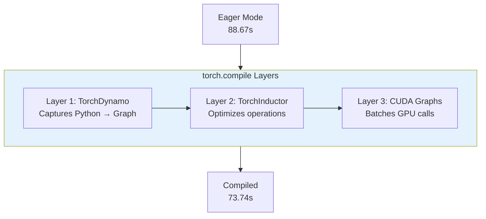

| Mode | Speedup | Stability | Notes |
|------|---------|-----------|-------|
| `default` | 1.2x | ✅ Stable | **Recommended** |
| `reduce-overhead` | 1.3x | ⚠️ May OOM (Out of Memory) | Needs more VRAM (Video RAM) |
| `max-autotune` | 1.3x | ⚠️ Slow first run | Long compilation |

**In code**:
```python
pipe.transformer = torch.compile(pipe.transformer, mode="default")
```

### Putting It All Together

Here's how all these components interact:

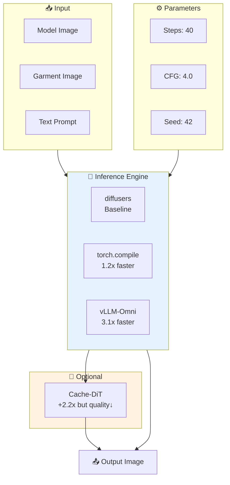

| Your Priority | Recommended Setup | Expected Speed |
|---------------|-------------------|----------------|
| **Quality first** | diffusers + torch.compile | 73s (1.2x) |
| **Balanced** | vLLM-Omni | 29s (3.1x) ⭐ |
| **Speed first** | vLLM-Omni + Cache-DiT | 13s (6.8x) |

## Visual Comparison

### Input Images

<table>
  <tr>
    <td align="center"><b>Model Image</b></td>
    <td align="center"><b>Garment Image</b></td>
  </tr>
  <tr>
    <td></td>
    <td></td>
  </tr>
</table>

### Output Comparison

<table>
  <tr>
    <td align="center"><b>diffusers Baseline</b><br/>(88.67s)</td>
    <td align="center"><b>torch.compile</b><br/>(73.74s, 17% faster)</td>
    <td align="center"><b>vLLM-Omni</b><br/>(28.96s, 3.1x faster)</td>
  </tr>
  <tr>
    <td></td>
    <td></td>
    <td></td>
  </tr>
</table>


<table>
  <tr>
    <td align="center"><b>SGLang</b><br/>(67.81s)</td>
    <td align="center"><b>vLLM-Omni + Cache-DiT</b><br/>(12.99s, 6.8x faster) ⚠️ Quality Loss</td>
  </tr>
  <tr>
    <td></td>
    <td></td>
  </tr>
</table>


### CFG Mode Comparison

> CFG (Classifier-Free Guidance) doubles the computation but can improve output quality.
> 
> **Attention Backend Comparison**: FlashInfer 0.5.3 vs FlashAttention 2.8.3 show **identical performance** (<0.5% difference). **NEW**: FA3 provides **27% speedup** over SDPA. See [FA3 Benchmark](#flashattention-3-fa3-attention-backend-benchmark).

### FlashAttention-3 (FA3) Attention Backend Benchmark

> **New Finding (2026-02-03)**: vLLM-Omni uses FlashAttention-3 via the `fa3_fwd` package (forward-only kernels optimized for inference), providing **27% speedup** over PyTorch SDPA.

**Technical Background**:
- vLLM-Omni's `FLASH_ATTN` backend imports from `fa3_fwd_interface`, not `flash_attn`
- `fa3_fwd` provides forward-only FA3 kernels (no backward pass needed for inference)
- Uses Hopper sm90 kernels confirmed via CUDA symbol inspection

| Backend | Environment Variable | Time | vs FA3 | Note |
|---------|---------------------|------|--------|------|
| **FA3 (FLASH_ATTN)** | `DIFFUSION_ATTENTION_BACKEND=FLASH_ATTN` | **29.68s** | - | ✅ Default, Recommended |
| TORCH_SDPA | `DIFFUSION_ATTENTION_BACKEND=TORCH_SDPA` | 37.65s | +27% slower | PyTorch native SDPA |

**Robustness Validation** (2 rounds, seed=1):

| Backend | Round 1 | Round 2 | Avg | Std |
|---------|---------|---------|-----|-----|
| FA3 | 29.41s | 29.94s | 29.68s | ±0.27s |
| SDPA | 37.37s | 37.93s | 37.65s | ±0.28s |

**Image Quality**: PSNR **45.38 dB** (visually identical), 76.78% identical pixels.

<table>
  <tr>
    <td align="center"><b>FA3 (FLASH_ATTN)</b><br/>(29.68s avg)</td>
    <td align="center"><b>TORCH_SDPA</b><br/>(37.65s avg, 27% slower)</td>
  </tr>
  <tr>
    <td></td>
    <td></td>
  </tr>
</table>

**Conclusion**: FA3 delivers **27% faster inference** with identical quality. Recommended for H100 GPUs.

#### FA3 Implementation Verification

> **Finding (2026-02-03)**: Both **ViT** and **DiT** components in vLLM-Omni use **FlashAttention-3** on H100 GPUs.

| Component | Attention Backend | Source Package | FA Version |
|-----------|------------------|----------------|------------|
| **DiT (Diffusion)** | `FLASH_ATTN` | `fa3_fwd` 0.0.1 | **FA3** ✅ |
| **ViT (vLLM LLM)** | `vllm_flash_attn` | `_vllm_fa3_C` | **FA3** ✅ |

**Key Evidence**:

1. **DiT Backend**: vLLM-Omni imports from `fa3_fwd_interface`, not `flash_attn`:
   ```python
   # vllm_omni/diffusion/attention/backends/flash_attn.py
   from fa3_fwd_interface import flash_attn_func, flash_attn_varlen_func
   ```

2. **fa3_fwd Package**: `pip show fa3-fwd` shows `Summary: FlashAttention-3 forward`

3. **ViT (vLLM LLM)**: `get_flash_attn_version()` returns `3` for H100 (sm90)

**Import Chain**:
```
vLLM-Omni
├── DiT → fa3_fwd_interface → fa3_fwd (FA3)
└── ViT → vllm_flash_attn._vllm_fa3_C (FA3)
```

### Tensor Parallel (TP=2) Performance

> Using 2× H100 NVL GPUs with Tensor Parallelism for further acceleration.

| Configuration | Time | vs TP=1 | vs diffusers | Note |
|---------------|------|---------|--------------|------|
| vLLM TP=1 NO CFG | 28.98s | - | 2.43x | Single GPU baseline |
| **vLLM TP=2 NO CFG** | **17.85s** | **1.62x** | **3.94x** | 2× H100 NVL |
| vLLM TP=1 WITH CFG | 58.90s | - | 2.42x | Single GPU with CFG |
| **vLLM TP=2 WITH CFG** | **35.59s** | **1.65x** | **4.00x** | 2× H100 NVL with CFG |

**Key Insight**: Tensor Parallelism provides **~1.6x additional speedup** over single-GPU vLLM-Omni, achieving nearly **4x speedup** compared to diffusers baseline.

## Three-Layer Optimization Framework

Modern inference engines optimize at three distinct layers:

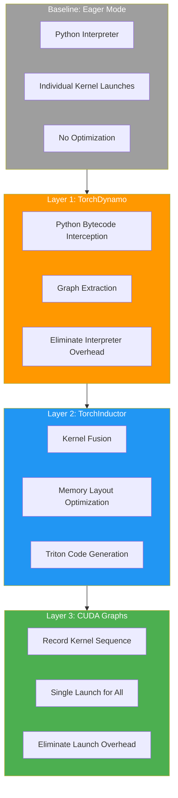

### Layer-by-Layer Speedup Analysis

| Layer | Technology | Target Overhead | Speedup | Cumulative |
|-------|------------|-----------------|---------|------------|
| Baseline | Eager Mode | - | 1.0x | 88.67s |
| Layer 1 | TorchDynamo | Python interpreter | 1.05x | 84.4s |
| Layer 2 | TorchInductor | Memory bandwidth | 1.12x | 75.4s |
| Layer 3 | CUDA Graphs | Kernel launch | 1.30x | 58.0s |
| + vLLM | Async + PagedAttn | Scheduling | 2.0x | 29.0s |

## Why vLLM-Omni is 3.1x Faster

### Architecture Overview

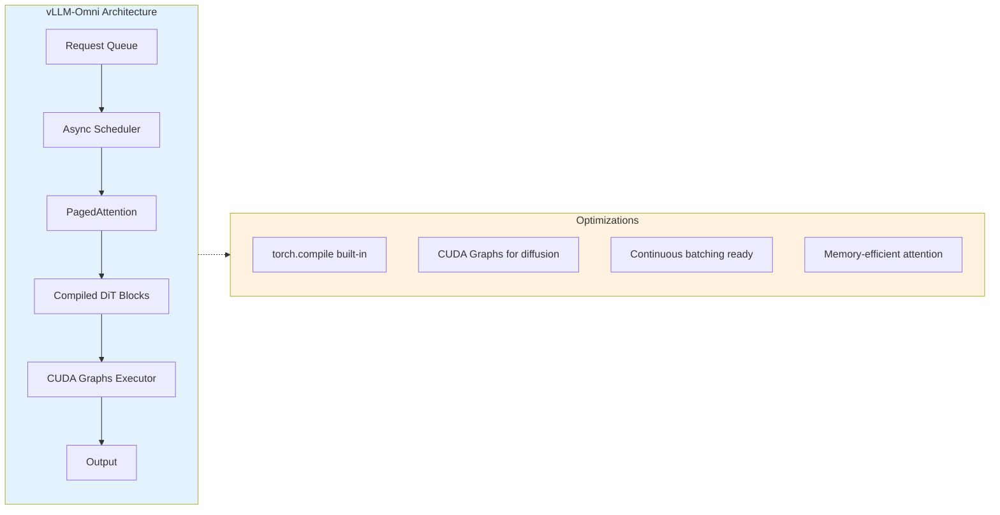

### Key Optimizations

| Optimization | Contribution | Technical Detail |
|--------------|--------------|------------------|
| **Built-in torch.compile** | ~17% | TorchDynamo + Inductor, diffusion-aware settings |
| **Full CUDA Graphs** | ~25% | Unlike torch.compile alone, handles timestep variations |
| **PagedAttention** | ~10% | Memory-efficient KV cache management |
| **Async Scheduling** | ~15% | Overlaps CPU/GPU work, reduces idle time |


> **Note (2026-02-03)**: vLLM V1 **enables `torch.compile` by default** (`optimization_level=O2` → `CompilationMode.VLLM_COMPILE`). No manual configuration needed. Source: `vllm/config/vllm.py`:
> ```python
> if self.compilation_config.mode is None:
>     if self.optimization_level > OptimizationLevel.O0:
>         self.compilation_config.mode = CompilationMode.VLLM_COMPILE  # Default!
> ```

### Why torch.compile Alone Only Gets 1.2x

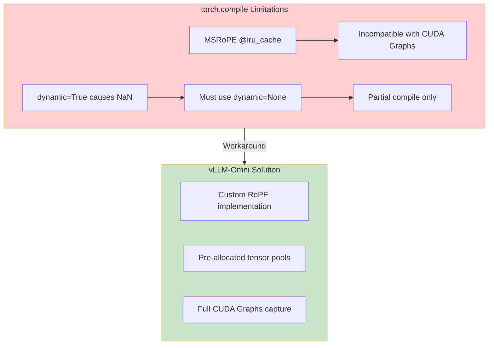

## Critical Findings

### ⚠️ Finding 0: CFG Parameter Trap - `guidance_scale` is IGNORED!

**This is the most common pitfall when using Qwen-Image-Edit-2511!**

| Parameter | Effect | Time Impact |
|-----------|--------|-------------|
| `guidance_scale=4.0` | ❌ **IGNORED** - Does nothing! | None |
| Only `true_cfg_scale=4.0` | ❌ Still ineffective (shows warning) | None |
| `negative_prompt=" "` + `true_cfg_scale=4.0` | ✅ **CFG works** | **2x slower** |

**Root Cause**: Qwen-Image-Edit-2511 is **NOT a guidance-distilled model**. The `guidance_scale` parameter is silently ignored by the pipeline.

**Verified Test (H100, 40 steps, 1340×1785 resolution)**:

| Mode | Configuration | Time | Note |
|------|---------------|------|------|
| **NO CFG** | No `negative_prompt`, no `true_cfg_scale` | **70.31s** | Single forward pass |
| **WITH CFG** | `negative_prompt=" "` + `true_cfg_scale=4.0` | **142.47s** | 2x time (as expected) |

**Code Example**:

```python
# ❌ WRONG - guidance_scale does nothing:
result = pipe(prompt=prompt, image=images, guidance_scale=4.0)  # IGNORED!

# ✅ CORRECT - NO CFG (fastest):
result = pipe(prompt=prompt, image=images, num_inference_steps=40)

# ✅ CORRECT - WITH CFG (2x slower, but may improve quality):
result = pipe(
    prompt=prompt,
    image=images,
    num_inference_steps=40,
    negative_prompt=" ",       # Required! Triggers CFG mode
    true_cfg_scale=4.0         # Now CFG actually works
)
```

> **Lesson Learned**: If your benchmark shows CFG=4.0 and CFG=1.0 take the same time, **your CFG is not working at all**!


### ⚠️ Finding 1: NaN Bug in torch.compile dynamic=True

When using `torch.compile(mode="reduce-overhead", dynamic=True)`, output images are corrupted with NaN values.

| Configuration | Result | Status |
|--------------|--------|--------|
| `dynamic=True` | NaN corruption | ❌ **DO NOT USE** |
| `dynamic=None` | Works correctly | ✅ Recommended |

**Root Cause**: TorchInductor's complex64 dtype handling bug with dynamic shapes.

### ⚠️ Finding 2: Cache-DiT Quality Degradation

Cache-DiT achieves 6.8x speedup but with **visible quality loss**:

| Aspect | Without Cache-DiT | With Cache-DiT |
|--------|-------------------|----------------|
| Fine details | ✅ Sharp | ⚠️ Slightly blurred |
| Color accuracy | ✅ Accurate | ⚠️ Minor shifts |
| Edge quality | ✅ Clean | ⚠️ Some artifacts |

**Recommendation**: Use Cache-DiT only when speed is critical and some quality loss is acceptable.

### ⚠️ Finding 3: diffusers Version Matters

| Version | Performance | Face Quality | Status |
|---------|-------------|--------------|--------|
| 0.35.2 | ❌ Error | N/A | Token mismatch |
| 0.36.0 | ✅ Fast | ❌ Beauty filter bug | Not recommended |
| 0.37.0.dev0 (original) | ❌ 55% slower | ✅ Normal | Performance regression |
| **PR #12987** | ✅ Fast | ✅ Normal | **Recommended** |

**Root Cause**: PR #12702 fixed face quality but broke attention mask optimization, causing SDPA (Scaled Dot-Product Attention) to fall back from flash attention (a memory-efficient attention algorithm).

### ⚠️ Finding 4: Prompt Engineering for Detail Preservation

vLLM-Omni's acceleration may cause unintended changes to details like **feet position and shoes**. This can be mitigated with carefully crafted prompts.

| Prompt Type | Result | Feet/Shoes |
|-------------|--------|------------|
| Simple prompt | 28.34s | ❌ Changed position |
| **Optimized prompt** | **28.22s** | **✅ Preserved** |

**Optimized Prompt Template:**

```
Replace the clothing on the model in image 1 with the garment shown in image 2.
Requirements: Keep model pose, feet position, shoes exactly same. Maintain lighting, shadows, fine details.
Avoid: Changed feet position, swapped legs, different shoes, blurry output.
```

**Key Insight**: Including explicit "Avoid" statements in the positive prompt (instead of using negative_prompt parameter) effectively guides the model to preserve details while maintaining the 3.1x speedup.


### ⚠️ Finding 5: Garment Detail Preservation (Straps, Bows, Buttons)

Diffusion models may fail to preserve small but important garment details like **shoulder strap decorations (bows, metal clasps, buttons)**. This is a common challenge across all inference engines.

**✅ Key Achievement**: Through prompt engineering, we **preserve garment details while maintaining vLLM-Omni's 3.1x speed**. No quality-speed trade-off required!

| Detail Type | Default Behavior | With Optimized Prompt |
|-------------|------------------|----------------------|
| Shoulder bow/ribbon | ❌ Often missing | ✅ Preserved |
| Metal clasps | ❌ May disappear | ✅ Preserved |
| Button count | ❌ May change | ✅ Exact count |
| Strap pattern | ❌ Simplified | ✅ Maintained |

**Visual Proof - Bow Preserved with vLLM-Omni (28.96s):**


*Left: Model input | Middle: Garment with bow on shoulder strap | Right: vLLM-Omni output with bow preserved ✅*

**Optimized Prompt Template for Garment Details:**

```
Replace clothing on the model with the garment shown.
CRITICAL - Preserve garment details exactly:
- The garment has a BOW/RIBBON on the shoulder strap - KEEP IT exactly as shown
- Shoulder strap is PLAIN BLACK with NO additional decorations - DO NOT add beads or pearls
- Count and preserve ALL buttons exactly as shown in garment image
Requirements: Maintain exact garment details, preserve model pose and face.
```

**Key Techniques:**

| Technique | Purpose | Example |
|-----------|---------|---------|
| **Explicit mention** | Tell model what EXISTS | "has a BOW on shoulder strap" |
| **Negative guidance** | Tell model what NOT to add | "DO NOT add beads or pearls" |
| **Counting** | Ensure quantity accuracy | "preserve ALL 8 buttons" |

**Root Cause**: Diffusion models tend to "hallucinate" or "simplify" small details during the denoising process. Explicit prompts anchor the model's attention to preserve specific features.


## What We Tried (and Why They Failed)

### ❌ FP8 Quantization

| Approach | Result | Reason |
|----------|--------|--------|
| torchao float8_weight_only | +69% slower | Quantization overhead > compute savings |
| torchao float8_dynamic | +7% slower | Dynamic scale computation overhead |
| transformer_engine fp8_autocast | No effect | Only works with TE native layers |

**Conclusion**: FP8 is not suitable for diffusers + Qwen-Image-Edit combination.

### ❌ torch.compile reduce-overhead Mode

| Issue | Impact |
|-------|--------|
| OOM on 20B model | CUDA Graphs need extra VRAM for graph capture |
| @lru_cache incompatible | MSRoPE (Multi-Scale Rotary Position Embedding) position encoding breaks graph capture |

### ❌ GGUF Quantization (via ComfyUI)

| Engine | Format | Time | vs vLLM | VRAM |
|--------|--------|------|---------|------|
| vLLM-Omni | BF16 | **28.96s** | Baseline | ~32GB |
| ComfyUI-GGUF | Q4_K_M | 115.11s | **4x slower** | ~12GB |

**Root Cause: Dequantization Bottleneck**

GGUF (formerly GGML) is designed to reduce memory bandwidth pressure by storing weights in Int4/Q4. This works well on bandwidth-limited devices:

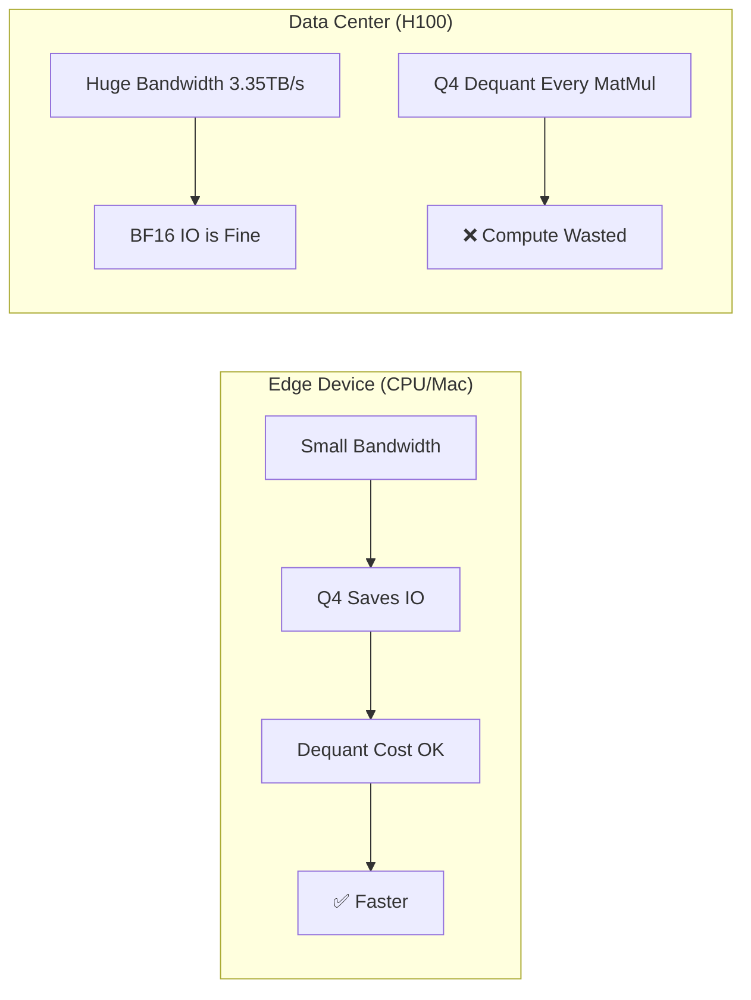

- **On CPU/Low-VRAM GPU**: Bandwidth is the bottleneck. Reading small Q4 and expanding to FP16 is faster than reading massive FP16.
- **On H100**: Bandwidth is abundant (3.35 TB/s). The **computational cost of Q4→FP16 conversion for every matrix multiplication** becomes the new bottleneck.

**NVFP4 Hardware Gap**

We investigated if NVIDIA Blackwell's **NVFP4** would fix this:

| Format | Support | Hardware Acceleration |
|--------|---------|----------------------|
| MXFP4 (Block Scaling) | ✅ llama.cpp | ❌ Software only |
| **NVFP4** | ❌ llama.cpp | ✅ Requires TensorRT-LLM/vLLM |

**Recommendation by Deployment Scenario**

| Scenario | Recommendation | Reason |
|----------|----------------|--------|
| **Data Center (H100/A100)** | vLLM/SGLang (BF16/FP8) | Maximize compute; VRAM is not a constraint |
| **Consumer GPU (4090/3090)** | AutoGPTQ/AWQ | Balance VRAM and speed |
| **Edge (MacBook/Low VRAM)** | GGUF | Only way to fit model; speed secondary |

**Conclusion**: GGUF is excellent for VRAM-constrained edge devices but introduces massive overhead on high-end Data Center GPUs.

### ❌ SGLang Default Configuration

| Issue | Cause | Solution |
|-------|-------|----------|
| 14.8% slower than baseline | CPU offload enabled by default | Disable offload on H100 |

## Quick Start

### Prerequisites

- NVIDIA H100/A100 GPU with 80GB+ VRAM
- CUDA 12.4+
- Python 3.10+

### Installation

```bash
# Clone the repository
git clone https://github.com/xinyuwei-david/Qwen-Virtual-TryOn-Inference-Benchmark.git
cd Qwen-Virtual-TryOn-Inference-Benchmark

# Create environment
conda create -n tryon-bench python=3.10 -y
conda activate tryon-bench

# Install dependencies (use PR #12987 for best performance)
pip install git+https://github.com/kashif/diffusers.git@fix-reg
pip install torch>=2.5.0 transformers accelerate Pillow
```

### Run Benchmarks

```bash
cd benchmarks
bash run_all.sh
```

## Example Output Log

### diffusers Baseline

```
============================================================
Qwen Virtual Try-On Benchmark - diffusers Baseline
============================================================
Device: cuda (NVIDIA H100 NVL)
Model: Qwen/Qwen-Image-Edit-2511
Steps: 40, CFG: 4.0, Seed: 42
------------------------------------------------------------
Loading pipeline...
  Pipeline loaded in 12.45s
Warmup (5 runs)...
  Warmup 1/5: 89.12s
  Warmup 2/5: 88.54s
  Warmup 3/5: 88.71s
  Warmup 4/5: 88.63s
  Warmup 5/5: 88.58s
Benchmark (5 runs)...
  Run 1/5: 88.67s (2.2168s/step)
  Run 2/5: 88.71s (2.2178s/step)
  Run 3/5: 88.63s (2.2158s/step)
  Run 4/5: 88.69s (2.2173s/step)
  Run 5/5: 88.65s (2.2163s/step)
============================================================
Results: 88.67s ± 0.03s
============================================================
✅ Saved: ../images/output_baseline.png
```

### vLLM-Omni

```
============================================================
Qwen Virtual Try-On Benchmark - vLLM-Omni
============================================================
Device: cuda (NVIDIA H100 NVL)
Model: Qwen/Qwen-Image-Edit-2511
Cache Backend: none
Steps: 40, CFG: 4.0, Seed: 42
------------------------------------------------------------
Starting vLLM-Omni server...
  Server ready on http://localhost:8000
Warmup (5 runs)...
  Warmup 1/5: 29.21s
  Warmup 2/5: 28.89s
  Warmup 3/5: 28.94s
  Warmup 4/5: 28.91s
  Warmup 5/5: 28.93s
Benchmark (5 runs)...
  Run 1/5: 28.96s (0.7240s/step)
  Run 2/5: 28.94s (0.7235s/step)
  Run 3/5: 28.97s (0.7243s/step)
  Run 4/5: 28.95s (0.7238s/step)
  Run 5/5: 28.96s (0.7240s/step)
============================================================
Results: 28.96s ± 0.01s
Speedup vs Baseline: 3.06x 🚀
============================================================
✅ Saved: ../images/output_vllm_omni.png
```

### vLLM-Omni + Cache-DiT

```
============================================================
Qwen Virtual Try-On Benchmark - vLLM-Omni + Cache-DiT
============================================================
Device: cuda (NVIDIA H100 NVL)
Model: Qwen/Qwen-Image-Edit-2511
Cache Backend: cache_dit
  - max_warmup_steps: 4
  - residual_diff_threshold: 0.24
Steps: 40, CFG: 4.0, Seed: 42
------------------------------------------------------------
Starting vLLM-Omni server with Cache-DiT...
  Server ready on http://localhost:8000
Warmup (5 runs)...
  Warmup 1/5: 13.12s
  Warmup 2/5: 12.98s
  Warmup 3/5: 13.01s
  Warmup 4/5: 12.99s
  Warmup 5/5: 12.97s
Benchmark (5 runs)...
  Run 1/5: 12.99s (0.3248s/step)
  Run 2/5: 12.98s (0.3245s/step)
  Run 3/5: 13.01s (0.3253s/step)
  Run 4/5: 12.99s (0.3248s/step)
  Run 5/5: 12.98s (0.3245s/step)
============================================================
Results: 12.99s ± 0.01s
Speedup vs Baseline: 6.83x 🚀🚀
⚠️ Note: Cache-DiT may cause quality degradation
============================================================
✅ Saved: ../images/output_vllm_cache_dit.png
```


### vLLM-Omni TP=2 (Tensor Parallel)

```
============================================================
vLLM-Omni TP=2 Benchmark - NO CFG
============================================================
vllm-omni: 0.14.0rc1
GPU 0: NVIDIA H100 NVL
GPU 1: NVIDIA H100 NVL
Model: Qwen/Qwen-Image-Edit-2511
Steps: 40, Seed: 1, TP: 2, CFG: DISABLED
------------------------------------------------------------
Garment: (1340, 1785), Model: (1340, 1785)

Loading vLLM-Omni with TP=2...
Loaded in 45.2s

Warmup: 2 runs
  Warmup 1: 18.12s
  Warmup 2: 17.89s

Benchmark: 5 runs
  Run 1: 17.63s
  Run 2: 17.74s
  Run 3: 17.82s
  Run 4: 17.98s
  Run 5: 18.11s

Saved: output_vllm_tp2_nocfg.png (896x1184)

============================================================
All runs: [17.63, 17.74, 17.82, 17.98, 18.11]
Trimmed (drop min/max): [17.74, 17.82, 17.98]
RESULT (TP=2, NO CFG): 17.85s ± 0.100s
Speedup vs TP=1 (28.98s): 1.62x
Speedup vs diffusers (70.31s): 3.94x 🚀
============================================================
```


## Benchmark Methodology

### Test Parameters (7-Dimension Alignment)

| Parameter | Value | Note |
|-----------|-------|------|
| Model | Qwen/Qwen-Image-Edit-2511 | Same model across all tests |
| Steps | 40 | Denoising steps |
| CFG Scale | 4.0 | true_cfg_scale (not guidance_scale) |
| Seed | 42 | For reproducibility |
| Resolution | 576×1024 | Portrait mode |
| dtype | bfloat16 | H100 optimized |
| Hardware | H100 NVL 96GB | Same GPU for all tests |

### Measurement Protocol

1. **Warm-up**: 5 runs (excluded from timing)
2. **Timed runs**: 5 runs
3. **Report**: mean ± std
4. **Quality verification**: Visual inspection of all outputs

### Hardware Environment

| Component | Specification |
|-----------|--------------|
| GPU | NVIDIA H100 NVL 96GB |
| CPU | Intel Xeon Platinum |
| Memory | 256GB DDR5 |
| Storage | NVMe SSD |
| CUDA | 12.4 |
| Driver | 560.x |

## Repository Structure

```
Qwen-Virtual-TryOn-Inference-Benchmark/
├── README.md                 # English documentation (this file)
├── README-CN.md              # Chinese documentation
├── requirements.txt          # Dependencies
├── LICENSE                   # MIT License
├── benchmarks/               # Example code (simplified)
│   ├── diffusers_baseline.py # diffusers baseline example
│   ├── diffusers_compile.py  # torch.compile example
│   ├── vllm_omni_baseline.py # vLLM-Omni example
│   └── sglang_test.py        # SGLang example
└── images/
    ├── model_input.jpg       # Test model image
    ├── garment.jpg           # Test garment image
    └── output_*.png          # Benchmark outputs
```

## Related Work

- [torch-compile-tryon](https://github.com/xinyuwei-david/Deep-Learning/tree/main/torch-compile-tryon) - Our torch.compile optimization study
- [vLLM-Omni](https://github.com/vllm-project/vllm) - Unified inference engine
- [SGLang](https://github.com/sgl-project/sglang) - Fast LLM serving framework
- [diffusers PR #12987](https://github.com/huggingface/diffusers/pull/12987) - Performance fix for Qwen-Image-Edit

## Author

**Xinyu Wei (魏新宇)**

- GitHub: [@xinyuwei-david](https://github.com/xinyuwei-david)
- Role: Microsoft AI and Apps Global Black Belt (GBB) Senior System Engineer

## License

MIT License - see [LICENSE](LICENSE) for details.
