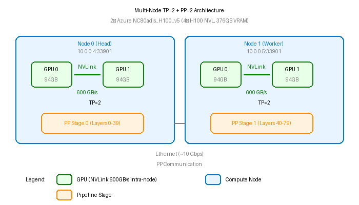

# Qwen3-235B 多节点推理基准测试 (TP=2 + PP=2)

> **模型**: Qwen/Qwen3-235B-A22B-Instruct-2507-FP8 (235B MoE, 每 token 激活 22B 参数)
> **硬件**: 2× Azure NC80adis_H100_v5 (4× H100 NVL, 总计 376GB VRAM)
> **测试引擎**: vLLM v0.11.2/v0.10.1 → **SGLang v0.5.8.post1** (当前生产)
> **功能特性**: Function Calling, 推理模式, Chunked Prefill

---

## 🏆 关键结果

### 三引擎对比（相同硬件、相同模型）

| 指标 | SGLang v0.5.8 | vLLM V0 (v0.10.1) | vLLM V1 (v0.11.2) |
|--------|:-------------:|:------------------:|:------------------:|
| **单请求 TPS** | **70-75 t/s** | 6.8 t/s | 17 t/s |
| **峰值吞吐量** | **1,320 t/s** @ C=128 | 304 t/s @ C=33 | 610 t/s @ C=64 |
| **TTFT (空闲)** | 104-142 ms | 141-146 ms | 81-93 ms |
| **ITL (平均)** | **13.3 ms** | ~158 ms | ~57 ms |
| **PP>1 稳定性** | ✅ 零崩溃 | ✅ 零崩溃 | ❌ 分钟~小时崩溃 |
| **Function Calling** | ✅ 5/5 测试 | ✅ 正常 | ✅ 正常 |
| **最大测试并发** | C=128 稳定 | C=91 稳定 | C=64 (C=128 崩溃) |

### SGLang 基准测试（当前生产 - 2026-02-11）

| 并发数 | 吞吐量 (t/s) | TTFT (ms) | QPS |
|:-----------:|:----------------:|:---------:|:---:|
| 1 | 70.1 | 140 | 0.07 |
| 2 | 129.9 | 264 | 0.13 |
| 4 | 217.4 | 326 | 0.22 |
| 8 | 376.0 | 378 | 0.37 |
| 16 | 653.3 | 505 | 0.65 |
| 32 | 999.5 | 738 | 1.00 |
| 64 | 1,260.2 | 1,115 | 1.26 |
| **128** | **1,320.4** | 2,189 | **1.32** |

### vLLM V1 基准测试 (v0.11.2 - 2026-02-05, 不稳定)

| 并发数 | 第一轮 (tokens/s) | 第二轮 (tokens/s) | 波动 | 状态 |
|:-----------:|:----------------:|:----------------:|:--------:|:------:|
| 1 | 17.2 | 17.2 | 0% | ✅ |
| 2 | 31.6 | 31.6 | 0% | ✅ |
| 4 | 50.7 | 56.5 | +11% | ✅ |
| 8 | 102.9 | 89.4 | -13% | ✅ |
| 16 | 171.1 | 170.3 | -0.5% | ✅ |
| 32 | 314.5 | 314.7 | +0.1% | ✅ |
| **64** | **553.0** | **610.4** | **+10%** | **🏆 峰值** |
| 128 | 崩溃 | 卡死 | - | ❌ 已知问题 |

**vLLM V0 峰值（生产负载）**: 304.4 tokens/s @ C=33 (v0.10.1, 1,801 请求, 零崩溃)

---

## 📐 架构

### 多节点并行：TP=2 + PP=2




### 为什么选择 TP=2 + PP=2？

| 并行方式 | 通信模式 | 带宽 | 位置 |
|----------|----------|------|------|
| **张量并行 (TP=2)** | 每层 All-reduce | 600 GB/s NVLink | 节点内 |
| **流水线并行 (PP=2)** | 阶段间点对点传输 | 以太网 | 节点间 |

**数学原理**：
- TP 需要在每层的 attention/FFN 后执行 **all-reduce** → 需要高带宽
- PP 只需要在阶段间传输 **点对点** 激活值 → 容忍低带宽
- H100 NVL 节点内提供 600 GB/s NVLink，但节点间仅 ~10 Gbps 以太网
- **结论**：TP 放在节点内（NVLink），PP 跨节点（以太网）是最优方案

---

## 🔌 软件栈与通信架构

### 组件角色

| 组件 | 角色 | 阶段 | 类比 |
|------|------|------|------|
| **vLLM** | 推理引擎 + API 服务 | 全阶段 | "大脑" — 决定计算什么 |
| **Ray** | 分布式进程调度器 | 仅启动阶段 | "人事部" — 将 worker 放到正确的机器上 |
| **NCCL** | GPU 间通信库 | 推理阶段 | "神经系统" — 在 GPU 间传输张量 |
| **NVLink** | 物理互连（节点内） | 推理阶段 | "高速公路" — 600 GB/s 带宽 |
| **TCP/eth0** | 物理互连（节点间） | 推理阶段 | "乡村公路" — ~10 Gbps 带宽 |

### 什么是 Ray？

[Ray](https://github.com/ray-project/ray) 是 UC Berkeley RISELab 开发的分布式计算框架（38k+ GitHub 星标）。在本部署中，**vLLM 调用 Ray**（而非反向），通过 `--distributed-executor-backend ray` 参数。

Ray 的工作很简单：
1. **资源发现**：ray-head 启动 GCS (Global Control Store)，ray-worker 注册 → Ray 知道集群有 2 节点 4 个 GPU
2. **进程调度**：vLLM 请求 4 个 GPU worker，Ray 在每个节点放置 2 个
3. **完成**：worker 放置好后，Ray 退居幕后。它**不参与**推理数据传输。

### 端到端请求流

```
客户端 (curl/Python)
  │
  │ HTTP (:8000)
  ▼
vLLM API 服务 (节点0, ray-head 容器)
  │
  │ 分发到 GPU worker（启动时由 Ray 调度）
  ▼
┌─── PP 阶段 0 (节点0) ────────────────┐
│  GPU0 ◄──NCCL/NVLink──► GPU1         │  TP=2: 每层 All-reduce
│  (层 0-39)                            │  带宽: 600 GB/s
└──────────────┬────────────────────────┘
               │
               │ NCCL over TCP/eth0 (流水线并行)
               │ 传输: 中间激活值 (~数十 MB)
               │ 带宽: ~10 Gbps
               │
┌──────────────▼────────────────────────┐
│  GPU2 ◄──NCCL/NVLink──► GPU3         │  TP=2: 每层 All-reduce
│  (层 40-79)                           │  带宽: 600 GB/s
└─── PP 阶段 1 (节点1) ────────────────┘
               │
               │ NCCL over TCP/eth0 (结果传回节点0)
               ▼
vLLM API 服务 → HTTP 响应 → 客户端
```

### 协议栈（每层处理）

| 操作 | 执行者 | 协议 | 物理介质 | 带宽 |
|------|--------|------|----------|------|
| 客户端 → vLLM | 测试脚本 | **HTTP** | 互联网/局域网 | N/A |
| GPU0 ↔ GPU1 (TP all-reduce) | vLLM via PyTorch | **NCCL** | NVLink | 600 GB/s |
| GPU2 ↔ GPU3 (TP all-reduce) | vLLM via PyTorch | **NCCL** | NVLink | 600 GB/s |
| 节点0 → 节点1 (PP 激活值) | vLLM via PyTorch | **NCCL** | TCP/eth0 | ~10 Gbps |
| 节点1 → 节点0 (PP 结果) | vLLM via PyTorch | **NCCL** | TCP/eth0 | ~10 Gbps |

**关键洞察**：NCCL 用于所有 GPU 通信（节点内和节点间），但底层物理介质不同。测试脚本只看到 HTTP — NCCL 对客户端完全透明。

### 时间线：谁在何时工作？

```
[启动阶段]                            [推理阶段 - 每个请求]
                                     
Ray ████████░░░░░░░░░░░░░░░░         Ray ░░░░░░░░░░░░░░░ (空闲)
     ↑ 发现 & 调度                                
                                     NCCL ░░░████████████ (每个 token 活跃)
NCCL ░░░░░░░░████░░░░░░░░░░░              ↑ TP all-reduce + PP 传输
          ↑ 初始化通信组
                                     vLLM ████████████████ (编排调度)
vLLM ████████████░░░░░░░░░░░
     ↑ 加载模型, 初始化引擎
```

---

## 🔧 NCCL 优化（Azure 关键配置）

Azure VM 具有多个网络接口 (eth0, docker0 等)。NCCL 可能选错接口，导致跨节点通信失败或服务挂起。

**解决方案**：在启动推理服务前设置 `NCCL_SOCKET_IFNAME=eth0`，强制 NCCL 使用正确接口。

**参考**：[vLLM GitHub Issue #10419](https://github.com/vllm-project/vllm/issues/10419)

| 指标 | NCCL 修复前 | NCCL 修复后 | 变化 |
|--------|-----------------|----------------|--------|
| 服务启动 | 间歇性卡住 | ✅ 稳定 | 已修复 |
| C=64 吞吐量 | 553.0 t/s | 610.4 t/s | **+10%** |
| C=128 稳定性 | 崩溃 | 仍不稳定 | 已知问题 |

---

## ⚠️ 已知问题

### V1 引擎 + PP 崩溃 (vLLM v0.11.x)

vLLM v0.11.x 的 V1 引擎 + 流水线并行 (`PP > 1`) 会因 Ray compiled DAG bug 崩溃。此问题影响所有 v0.11.x 上的多节点 PP 部署。

**根本原因**：V1 引擎使用 **Ray compiled DAG** 进行节点间 PP 通信。此代码路径存在 bug：
1. **属性不匹配**：`_accelerator_group` 被重命名为 `_accelerator_group_id`，但调用方未更新
2. **C++ 反序列化崩溃**：`experimental_mutable_object_provider.cc` 中 — Raylet core dump
3. V0 引擎在 vLLM v0.11.0 中被**完全删除**（PR #15256），因此 `VLLM_USE_V1=0` 在 v0.11.x 上无效

**相关 GitHub Issues（截至 2026-02-06 全部仍开放）**：
- [vllm #26899](https://github.com/vllm-project/vllm/issues/26899) — PP 因 compiled DAG 崩溃
- [vllm #29373](https://github.com/vllm-project/vllm/issues/29373) — 多节点 PP Raylet 崩溃
- [ray #59404](https://github.com/ray-project/ray/issues/59404) — compiled DAG accelerator channel bug

---

## 🔽 v0.10.1 降级方案（V0 引擎）

### 为什么选择 v0.10.1？

| 版本 | V0 引擎 | V1 引擎 | PP 稳定性 |
|---------|-----------|-----------|-------------|
| v0.10.1 | ✅ 可用 | ✅ 默认 | ✅ V0 稳定（绕过 compiled DAG） |
| v0.11.0+ | ❌ **已删除** | ✅ 唯一选择 | ❌ 崩溃（compiled DAG bug） |

**v0.10.1 + `VLLM_USE_V1=0`** → V0 引擎 → `RayGPUExecutor`（传统 Ray 任务调度）→ 完全绕过 compiled DAG → PP 稳定

### V0 vs V1 引擎架构对比（PP 场景）

| 组件 | V1 引擎 (v0.11.x) | V0 引擎 (v0.10.1) |
|-----------|--------------------|--------------------|  
| PP 通信 | Ray compiled DAG → TorchTensorAcceleratorChannel | Ray 任务调度 → RayGPUExecutor |
| 性能 | 吞吐量高 ~10-20% | 基准 |
| PP 稳定性 | ❌ 崩溃（compiled DAG bug） | ✅ 稳定 |

### 生产验证 (v0.10.1 V0 引擎)

使用真实生产流量测试：

| 指标 | 值 | 说明 |
|------|-----|------|
| **成功请求总数** | **1,801** | 全部返回 200 OK |
| **服务端错误 (5xx)** | **0** | 零服务端错误 |
| **崩溃次数** | **0** | 整个会话零崩溃 |
| **峰值并发请求** | **91** | KV cache 使用率: 3.9%（余量充足） |
| **峰值生成吞吐** | **304.4 tokens/s** | @ ~30 并发 |
| **峰值 Prefill 吞吐** | **18,322 tokens/s** | 预填充阶段 |
| **TTFT (空闲)** | **141-146 ms** | 测试后测量 |

### 部署概要 (v0.10.1)

部署使用 `vllm/vllm-openai:v0.10.1` Docker 镜像搭建 Ray 集群：

1. **Worker 节点**：启动 Ray worker 容器，加入集群
2. **Head 节点**：启动 Ray head 容器，用 `ray status` 验证集群
3. **启动 vLLM**：在 head 容器内设置 `VLLM_USE_V1=0` 环境变量，然后以 `--tensor-parallel-size 2 --pipeline-parallel-size 2 --distributed-executor-backend ray` 启动 vLLM

关键参数：`--max-model-len 16384`、`--gpu-memory-utilization 0.90`、`--enforce-eager`、`--enable-auto-tool-choice --tool-call-parser hermes`

> **注意**：v0.10.1 发行说明警告 V0 引擎的 FP8 kv-cache 可能存在问题，但这仅影响 `--kv-cache-dtype fp8` 参数。默认 BF16 KV cache（仅模型权重用 FP8）**不受影响**。

---

## 📊 详细基准测试结果

### 测试参数

| 参数 | 场景 1 | 场景 2 |
|------|--------|--------|
| 输入 token 数 | 1024 | 10240 |
| 输出 token 数 | 1024 | 1024 |
| 并发级别 | 1, 2, 4, 8, 16, 32, 64, 128 | 相同 |

### 第一轮结果（初始测试）

| 并发数 | QPS | TTFT (ms) | 平均延迟 (s) | 吞吐量 (t/s) |
|:------:|:---:|:---------:|:------------:|:------------:|
| 1 | 0.11 | 81 | 8.75 | 17.2 |
| 2 | 0.21 | 108 | 8.66 | 31.6 |
| 4 | 0.37 | 115 | 9.38 | 50.7 |
| 8 | 0.70 | 131 | 8.52 | 102.9 |
| 16 | 1.18 | 147 | 10.11 | 171.1 |
| 32 | 2.16 | 162 | 11.13 | 314.5 |
| 64 | 3.78 | 173 | 12.98 | 553.0 |
| 128 | - | - | 崩溃 | - |

### 第二轮结果（NCCL 优化后）

| 并发数 | QPS | TTFT (ms) | 平均延迟 (s) | 吞吐量 (t/s) |
|:------:|:---:|:---------:|:------------:|:------------:|
| 1 | 0.11 | 93 | 9.50 | 17.2 |
| 2 | 0.21 | 122 | 9.00 | 31.6 |
| 4 | 0.37 | 131 | 9.61 | 56.5 |
| 8 | 0.64 | 140 | 9.11 | 89.4 |
| 16 | 1.17 | 149 | 10.17 | 170.3 |
| 32 | 2.18 | 163 | 11.07 | 314.7 |
| 64 | 4.22 | N/A* | 69.88 | **610.4** |
| 128 | - | - | 卡死 | - |

*注：第二轮 C=64 使用 `stream=False`，未测量 TTFT。参考第一轮 TTFT: 173ms。

### 波动分析

| 并发数 | 波动 | 评估 |
|:------:|:----:|:-----|
| 1-2 | 0% | 完全稳定 |
| 4 | +11% | 正常波动 |
| 8 | -13% | 正常波动 |
| 16-32 | <1% | 非常稳定 |
| **64** | **+10%** | **NCCL 修复收益** |

---

## 🖥️ 硬件规格

### Azure NC80adis_H100_v5

| 组件 | 规格 |
|------|------|
| **GPU** | 2× NVIDIA H100 NVL (PCIe 板型) |
| **GPU 显存** | 每卡 94 GB HBM3（单节点共 188 GB） |
| **GPU 互连** | NVLink 600 GB/s（同节点两卡之间） |
| **vCPU** | 80 vCPUs (AMD EPYC 第四代 "Genoa") |
| **内存** | 640 GiB |
| **本地 NVMe** | ~7 TB |

### H100 NVL vs H100 SXM

| 特性 | H100 NVL | H100 SXM |
|------|----------|----------|
| 板型 | PCIe | SXM5 |
| 显存 | 94 GB HBM3 | 80 GB HBM3 |
| NVLink 带宽 | 600 GB/s（两卡桥接） | 900 GB/s（NVSwitch 交换结构） |
| 目标用途 | **LLM 推理** | 训练 |
| 多 GPU 扩展 | 2 路最优 | 8 路最优 |

**为什么 2 节点 × 2 GPU 效果好**：
- H100 NVL 设计用于 2 GPU 紧密耦合（600 GB/s NVLink）
- 超过 2 GPU 时，NVL 必须使用 PCIe (~128 GB/s)，成为瓶颈
- 使用跨节点 PP 避免了此瓶颈

---

## 🔄 SGLang 迁移 (2026-02-11)

### 为什么从 vLLM 迁移到 SGLang？

| 因素 | vLLM V0 (v0.10.1) | vLLM V1 (v0.11.2) | SGLang v0.5.8 |
|--------|:------------------:|:------------------:|:-------------:|
| 单请求 TPS | 6.8 t/s | 17 t/s | **70-75 t/s** |
| ITL | ~158 ms | ~57 ms | **13.3 ms** |
| PP>1 稳定性 | ✅ 稳定 | ❌ 崩溃 | ✅ 稳定 |
| Function Calling | ✅ Hermes | ✅ Hermes | ✅ Qwen 解析器 |
| 状态 | **太慢** | **太不稳定** | **✅ 生产环境** |

**痛点**：使用 vLLM V0 生产环境时，880 token 响应需要 ~140 秒 (ITL=158ms) — 延迟不可接受。使用 SGLang (ITL=13.3ms) 后，同样的响应只需 ~11.8 秒。

### SGLang 基准测试详情

#### 稳定性测试（516 请求，零失败）

| 并发数 | 请求数 | 完成 | 失败 | 吞吐量 (t/s) |
|:------:|:------:|:----:|:----:|:------------:|
| 1 | 10 | 10 | 0 | 37.2 |
| 4 | 10 | 10 | 0 | 117.6 |
| 8 | 16 | 16 | 0 | 228.5 |
| 16 | 32 | 32 | 0 | 388.6 |
| 32 | 64 | 64 | 0 | 637.2 |
| 64 | 128 | 128 | 0 | 836.7 |
| 128 | 256 | 256 | 0 | 975.4 |
| **合计** | **516** | **516** | **0** | — |

#### Function Calling 测试（5/5 通过）

| 测试用例 | tool_choice | 预期 | 结果 |
|----------|:-----------:|:----:|:----:|
| 天气查询 | auto | 调用工具 | ✅ `get_weather(city="Beijing")` |
| 天气查询 | **required** | 调用工具 | ✅ `get_weather(city="Shanghai")` |
| 数学问题 | auto | 不调用工具 | ✅ 直接回答 |
| 信息搜索 | specific (`search_database`) | 指定工具 | ✅ `search_database(query="AI agents")` |
| 天气 (流式) | required | 工具调用 (流式) | ✅ `get_weather(city="Tokyo")` |

#### ITL 精确测试

| 场景 | TTFT (ms) | ITL 平均 (ms) | ITL P50 (ms) | ITL P99 (ms) | TPS |
|------|:---------:|:------------:|:------------:|:------------:|:---:|
| 短中文 (128→512) | 110 | 13.2 | 13.2 | 13.5 | 74.8 |
| 中英文 (512→1024) | 141 | 13.3 | 13.3 | 13.8 | 72.9 |
| 长英文 (1024→1024) | 131 | 13.3 | 13.3 | 13.7 | 73.6 |
| 长中文 (1024→1024) | 142 | 13.2 | 13.2 | 13.6 | 74.1 |

### 技术根因：为什么 SGLang 快 10 倍

| 根因 | vLLM V0 影响 | SGLang 解决方案 |
|------|:----------:|:-----------:|
| **调度开销** | V0 的 `RayGPUExecutor` 每步用 Ray 任务调度 — 每 token ~4-5ms 开销 | SGLang 使用自定义 NCCL PP，无逐步 Ray 开销 |
| **PP 通信** | NCCL over TCP 经 Ray 中介，额外序列化 | 直接 NCCL P2P + 重叠调度 |
| **批调度** | V0 缺少连续批处理优化 | RadixAttention + 连续批处理 |
| **内核优化** | V0 使用旧的 attention 内核 | FlashAttention 3 + FlashInfer 采样 |
| **Prefill 策略** | V0 无 chunked prefill | Chunked prefill 减少排队 |

**vLLM V0 ITL 分解 (PP=2)**：
每个 decode step 作为 Ray task 分发。PP=2 时每 token 需要：Ray task 分发 (~1ms) → GPU 计算 stage 0 (~3ms) → NCCL 发送到 node1 (~2ms) → GPU 计算 stage 1 (~3ms) → NCCL 结果返回 (~2ms) → Ray 回调 (~1ms) = ~12ms GPU 周期，但加上 Ray 调度抖动和 GIL 竞争，实际 ITL ≈ 158ms。SGLang 完全消除了 Ray 逐步调度开销。

### SGLang 关键配置说明 (PP>1)

| 参数 | 原因 |
|------|------|
| `--tool-call-parser qwen` | Qwen3 原生格式（不是 hermes — hermes 可用但 qwen 兼容性更好） |
| `--disable-radix-cache` | **PP>1 必须** — radix cache 与流水线并行不兼容 |
| `--mem-fraction-static 0.85` | 保守的 GPU 显存分配，确保稳定性 |
| `--chunked-prefill-size 6144` | 平衡 TTFT 和吞吐量 |
| `NCCL_SOCKET_IFNAME=eth0` | 强制使用正确的 Azure 网卡 |
| `NCCL_IB_DISABLE=1` | Azure NC 系列无 InfiniBand |

### 失败的优化（PP>1 不兼容 — 禁止使用）

| 优化项 | 错误 | 根因 |
|--------|------|------|
| `--kv-cache-dtype fp8_e4m3` | NCCL 错误（CUDA graph 捕获期间） | FP8 KV cache 格式在跨节点 PP 传输时不匹配 |
| `--enable-mixed-chunk` | `AssertionError: not compatible with PP` | Mixed chunk prefill 假设单阶段调度 |
| `--num-continuous-decode-steps 2` | 挂起/超时 | 多步 decode 破坏 PP 同步 |
| `NCCL_ALGO=Tree` | NCCL 错误（CUDA graph 捕获期间） | Tree 算法与 PP 点对点模式冲突 |

**结论**：对于 PP>1 的 SGLang，只使用 vanilla 配置。所有"标准"优化都是为单节点或纯 TP 场景设计的。

### 性能改善总结

| 指标 | 迁移前 (vLLM V0) | 迁移后 (SGLang) | 改善 |
|------|:-----------------:|:--------------:|:----:|
| **ITL** | 158 ms | 13.3 ms | **12× 提速** |
| **880-token 响应** | ~140 秒 | ~11.8 秒 | **12× 提速** |
| **单请求 TPS** | 6.8 t/s | 70-75 t/s | **10× 提速** |
| **峰值吞吐量** | 304 t/s | 1,320 t/s | **4.3× 提速** |
| **崩溃次数** | 0 (V0) | 0 | 均稳定 |

**与单节点方案的剩余差距**：由跨节点以太网 PP 通信开销（每 token 往返 ~2-3ms）导致。这是硬件拓扑限制 — 软件无法修复。要完全消除此开销，需使用单机 4×H100 SXM（消除 PP，所有通信走 NVSwitch 900 GB/s）。

---

## 🎯 建议

### 引擎选择

| 场景 | 推荐引擎 |
|------|----------|
| 多节点 PP 部署 | **SGLang**（稳定 + 高速） |
| 单节点纯 TP | vLLM V1 或 SGLang |
| vLLM PP（必须用 vLLM） | v0.10.1 + `VLLM_USE_V1=0`（V0 引擎） |
| vLLM v0.11.x + PP | ❌ 不推荐（compiled DAG 崩溃） |

### 何时使用多节点 PP

| 模型大小 | 需要 GPU 数 | 推荐方案 |
|----------|------------|----------|
| < 70B | 1-2 | 单节点，仅 TP |
| 70B - 100B | 2-4 | 单节点 TP=4 或 2 节点 PP=2 |
| **100B - 250B** | **4** | **2 节点 TP=2 PP=2** ✅ |
| > 250B | 8+ | 4+ 节点，建议 SXM |

### 并发指南

| 并发数 | 建议 |
|--------|------|
| 1-32 | ✅ 稳定，可自由使用 |
| **64-128** | ✅ **峰值吞吐最佳并发（SGLang）** |
| 128+ (vLLM) | ⚠️ 不建议（已知不稳定） |

---

**作者**: 魏新宇 (Xinyu Wei)
**日期**: 2026-02-06 (初始 vLLM), 2026-02-11 (SGLang 迁移)
