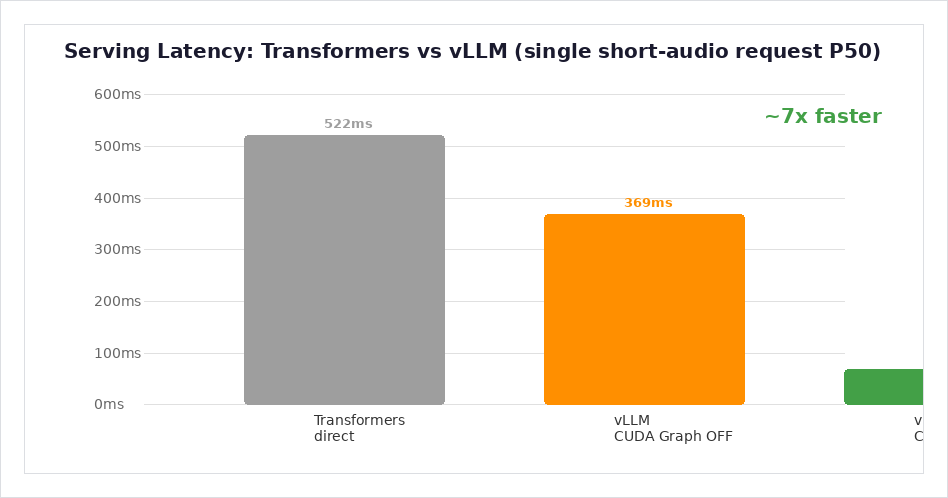
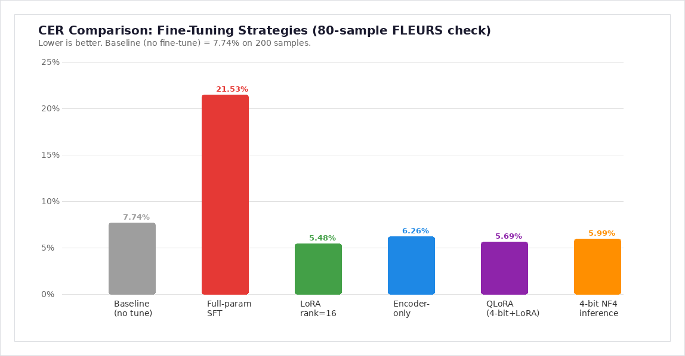
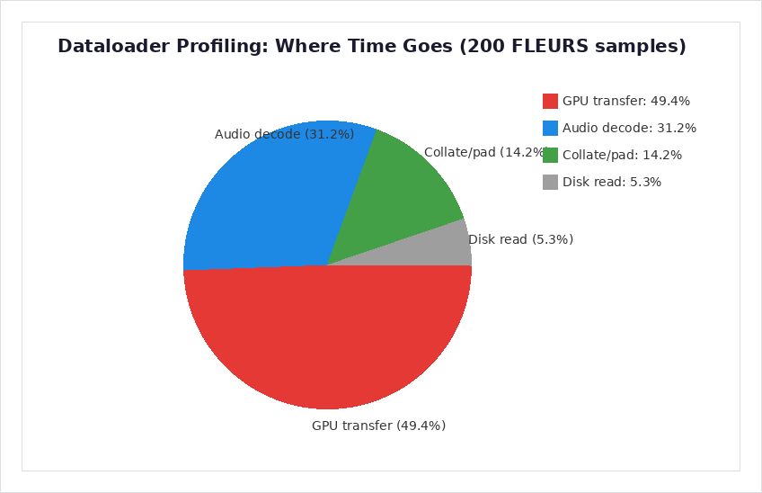
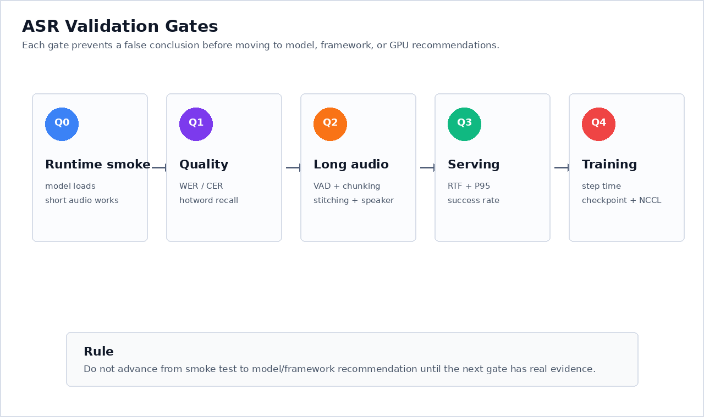

# 基于 Azure 的 Qwen3-ASR 训练与推理验证

> **Author**: 魏新宇 (Xinyu Wei) — 微软 AI GBB 高级系统工程师

[English](README.md) | 中文版

[](https://learn.microsoft.com/azure/virtual-machines/sizes/gpu-accelerated/)
[](https://huggingface.co/Qwen/Qwen3-ASR-1.7B)
[](https://docs.vllm.ai/en/latest/models/supported_models/)
[](https://huggingface.co/tasks/automatic-speech-recognition)

面向自研 ASR 团队的 field guide 和 validation harness：Qwen/Gemma backbone + Hugging Face 训练 + vLLM/SGLang/TensorRT-LLM 高性能 serving。

## 在 Azure 上运行

这个 repo 不是一次性的 ASR demo，而是一条 **validation-first 的工程验证链路**：在 Azure GPU 上评估 Qwen/Gemma 风格 ASR 技术栈——从 backbone 选择一路到 serving 和微调决策。整个路径分成五步：

1. **Backbone smoke 和公开 CER** — 先证明 Qwen3-ASR 能加载、能转录、有 FLEURS baseline，再使用任何私有音频
2. **长音频和数据路径验证** — 优化训练前先确认四件事：长录音是否会导致输出坍缩（chunking 风险）、音频文件解码是否成为瓶颈（audio decode）、训练数据 pipeline 是否让 GPU 空等（dataloader wait）、音频 tensor 搬到 GPU 是否是最慢的一步（GPU transfer）
3. **微调策略** — 用 before/after CER 对比 full-param SFT、LoRA、encoder-only、QLoRA 和精度稳定性
4. **Serving framework 选型** — 用原始 endpoint evidence 验证 vLLM transcription、CUDA Graph 和并发
5. **替代 backbone 和生产验收** — 写清 Gemma 3n 的环境要求（需要 PyTorch 2.6+ 和 cuDNN 9.1+，因为 head_dim=256 与旧版 SDPA 不兼容；详见 `docs/gemma-3n-audio-feasibility.md`），确认 SGLang/TRT-LLM 的 ASR 支持边界，并定义生产音频评估的验收标准

本 public repo 里已完成的实验都使用公开音频样例或公开 FLEURS 数据。私有音频、私有 endpoint 和订阅信息不进入本 public artifact。

下图展示了整条 pipeline 的核心数据流；Section 3 有逐步详解。

<div align="center"></div>

### 本文关键术语速查

如果你不熟悉 ASR 工程术语，这张表可以作为全文阅读的参考：

| 术语 | 是什么 | 为什么重要 |
|---|---|---|
| **CER** | Character Error Rate（字符错误率）——把模型转录的文字和正确的人工标注文字逐字对比，数错了多少个字。举例：人工标注 10 个字，模型错了 1 个字，CER = 10%。本 repo 中 Qwen3-ASR-0.6B 在 200 条 FLEURS 中文样本上 CER = 7.74%。 | 中文 ASR 的核心准确率指标。中文没有空格分词，所以按字符对比是标准做法。 |
| **WER** | Word Error Rate（词错误率）——和 CER 一样的思路，但按整词计算。举例："the cat sat" vs "the cat sat down" → 多了 1 个词，3 个词里错 1 个 = 33% WER。 | 用于英文等有空格分词的语言。 |
| **RTF** | Real-Time Factor = 处理时间 / 音频时长。RTF < 1 表示比实时快 | 决定系统能做实时流式还是只能离线 |
| **P50 / P95** | 中位数延迟和第 95 百分位延迟 | P50 = 典型体验；P95 = 影响 SLA 的高分位延迟波动 |
| **Throughput (rps)** | serving endpoint 每秒完成的请求数。本 repo 的 rps 是短音频请求吞吐，不是每秒处理多少小时音频。 | 并发用户容量规划 |
| **FLEURS** | Google 的多语言语音 benchmark 数据集（Apache 2.0） | 本 repo 用来做 CER baseline 的公开评测数据 |
| **LoRA / QLoRA** | Low-Rank Adaptation——只微调一个小 adapter 而不动全部权重；QLoRA 额外加 4-bit 量化 | 减少显存占用和小数据过拟合风险 |
| **CUDA Graph** | 录制并重放固定的 GPU kernel 序列，跳过启动开销 | 本 repo vLLM ASR benchmark 中约 5x 延迟降低 |
| **VAD** | Voice Activity Detection——在音频中找到有语音的段落 | 长录音送入模型前的必要预处理 |
| **NaN gradient** | 训练步中梯度值变成 Not-a-Number | 本 repo 发现 Qwen3-ASR 的 audio encoder 在 BF16 训练下会产生 NaN |

---

## 核心成果

### 推荐路线

| 决策项 | 推荐 | 为什么重要 |
|---|---|---|
| **Backbone** | 纯 ASR 先用 Qwen3-ASR；Gemma 3n 作为 multimodal 候选路线保留 | Qwen3-ASR 已有 public CER 和 serving evidence；Gemma 3n 在本 repo 还需要 clean-env smoke 和 CER |
| **微调** | 第一轮先做 decoder LoRA；小数据不要直接 full-param SFT | LoRA 只改 0.78% 参数，在公开 FLEURS 检查中优于小样本 full-param run |
| **精度** | 先建立 FP32 稳定基线，再谈 mixed precision 或量化训练 | 本次 H100 实验中 bf16 SFT 从第一步开始出现 NaN gradients |
| **Serving** | Qwen3-ASR transcription serving 第一阶段用 vLLM | clean env 跑通，CUDA Graph 给出最强延迟结果 |
| **长音频** | 不要把完整会议录音当作一个请求直接丢给模型 | 180s synthetic long audio 输出坍缩；需要 VAD/chunk/overlap/stitching |

### 关键结论（验证条件）

以下结论来自 Azure H100 上的公开样例和公开 FLEURS 数据验证。

| 条件 | 值 |
|---|---|
| GPU | 1× Azure H100-class GPU，visible memory 95 GB |
| 模型 | `Qwen/Qwen3-ASR-0.6B`, `Qwen/Qwen3-ASR-1.7B`, `google/gemma-3n-E2B-it` route check |
| 公开 eval | FLEURS `cmn_hans_cn` test split；Qwen CER 使用 200 条样本 |
| Serving | Qwen3-ASR 的 vLLM transcription endpoint + transformers baseline |
| 公平性 | 同一批公开音频/eval split、同一 metric script；repo 不包含专有音频或私有 endpoint |

| 结论 | 实测结果 | 行动建议 |
|---|---|---|
| Qwen3-ASR public CER baseline 可用于 harness 验证 | 200 条 FLEURS 中文：0.6B=**7.74%**，1.7B=**7.09%** | 用作 public regression baseline，不当作领域质量 |
| 小数据 full-param SFT 泛化风险高 | 本次 100 条样本全参微调后，held-out CER 从 **7.74%** 退化到 **21.53%** | 小数据不要从 full-param SFT 起步 |
| LoRA 是本次最稳的第一轮微调路线 | LoRA rank=16 在 80 条检查中达到 **5.48% CER** | 优先 LoRA，再考虑更大范围参数更新 |
| vLLM + CUDA Graph 是当前最强 serving 路线 | 短音频 benchmark P50 **69ms**，transformers 是 **522ms**；20 条样本未观察到 CER 退化 | 用 vLLM 做第一阶段 serving PoC；不要把 CUDA Graph 解读成准确率提升 |
| 长音频必须 pipeline 化 | 180s synthetic long audio 只输出 16 个字符 | 生产前必须做 VAD/chunk/overlap/stitching |

### 推荐生产配置

| 参数 | 推荐值 | 原因 |
|---|---|---|
| ASR model route | 第一阶段云端 PoC 用 Qwen3-ASR 1.7B | 本 repo 中 public CER baseline 更好，且有 dedicated transcription route |
| 微调方式 | 先做 LoRA rank=16；如果需要声学域适配，再试 encoder+LoRA | 比 full-param SFT 风险小，小数据表现更好 |
| 精度 | FP32 稳定基线；mixed precision 必须先过 grad_norm 和 CER 检查 | 避免 NaN 或 checkpoint 被悄悄破坏 |
| Serving engine | vLLM Qwen3-ASR transcription endpoint | clean env 路线已验证，并有延迟/并发数据 |
| 音频输入 | VAD + chunk + overlap + stitching | 避免长音频坍缩，延迟更可控 |
| 验收数据 | 脱敏领域音频 + 人工 transcript + hotwords | FLEURS 只证明 harness，领域数据决定生产质量 |

---

## 0. 背景

### 0.1 Qwen3-ASR 架构

Qwen3-ASR 是阿里巴巴发布的语音转文字模型，核心架构是 pretrained Audio Transformer (AuT) encoder + Qwen3 语言模型 decoder：

- **Audio encoder (AuT)**：32 层 self-attention + 3 层 Conv2d 降采样。输入 16 kHz mono 波形（100 Hz 帧率），输出 12.5 Hz audio embedding（8× 时间压缩）。
- **Language decoder**：Qwen3 causal LM，基于 audio embedding 生成文本 token。
- **两个尺寸**：0.6B（更快，CER 略高）和 1.7B（CER 更好，短音频吞吐相近）。

来源：[Qwen3-ASR model card](https://huggingface.co/Qwen/Qwen3-ASR-1.7B)、[Qwen3-ASR GitHub](https://github.com/QwenLM/Qwen3-ASR)

### 0.2 为什么 ASR 验证不是通用 LLM benchmark

ASR 验证和文本 LLM 评测有本质区别，这些区别直接影响工程决策：

| 维度 | 文本 LLM | ASR 模型 |
|---|---|---|
| **输入** | 文本 token | 原始波形（16 kHz，变长） |
| **输出指标** | Perplexity、BLEU、人工偏好 | CER/WER（与人工标注逐字对比） |
| **延迟敏感度** | 生成可接受秒级延迟 | 要求 RTF < 1（比实时快） |
| **数据 pipeline** | tokenize 文本 | 解码音频 → 重采样 → 归一化 → GPU transfer |
| **失败模式** | 回答错误 | 长音频输出坍缩、bf16 训练 NaN |
| **Serving 路径** | 标准 OpenAI-compatible chat | Transcription 专用 endpoint（multipart 音频上传） |

通用 LLM 排行榜分数不能预测 ASR 质量。一个文本生成流畅的模型，可能转录出乱码、在长音频上坍缩、或者处理不了领域专有词汇（hotwords）。

### 0.3 为什么选 Qwen3-ASR 而不是 Whisper 或其他 ASR 模型

| 选型标准 | Qwen3-ASR 的理由 |
|---|---|
| **开源 + HuggingFace 生态** | 完整权重在 HF 上；有官方微调脚本；可接入 transformers、accelerate、vLLM |
| **vLLM serving 支持** | vLLM 官方列为 transcription model；Whisper 不在 vLLM 支持列表里 |
| **微调灵活性** | 官方脚本支持 LoRA、QLoRA、encoder-only、full-param SFT；Whisper 微调需要不同工具链 |
| **中文 + 多语言** | Qwen tokenizer 对中日韩文字支持好；有 dedicated language-prefix routing |
| **架构透明** | AuT encoder + Qwen3 decoder 文档清晰；可以按需冻结 encoder 或 decoder |
| **模型尺寸选择** | 0.6B 和 1.7B 都能放进单卡，且留有 batching 和 KV cache 空间 |

这不是说 Qwen3-ASR 是最好的 ASR 模型。而是说在本次验证的具体需求——评估训练稳定性、serving 延迟、微调策略和 Azure GPU 适配——Qwen3-ASR 提供了 HuggingFace 生态里最完整的开源工具链。

---

## 0.5 方法论

### 评估门（Validation Gates）

本 repo 中每个 ASR 模型都必须通过以下验证门才能做生产声明。详见[验证门图](images/validation_gates.png)：

| Gate | 检查什么 | 通过标准 |
|---|---|---|
| **G0** 音频 smoke | 模型能加载并从已知音频产出非空转录 | 输出非空；10s 音频延迟 < 10s |
| **G1** 公开 CER | 公开 FLEURS 上的 CER 在合理范围 | 200 条中文 CER < 15%（经验性 sanity check） |
| **G2** Serving gate | vLLM endpoint 在并发下正常响应 | 目标并发下零失败；P50 在 SLA 内 |
| **G3** 微调 gate | SFT 跑通无 NaN/发散；held-out CER 不退化 | grad_norm 有限；held-out CER ≤ baseline 或可解释地更高 |
| **G4** 回归 gate | 相同测试重复跑产出一致结果 | 同数据 3 次运行 CER 方差 < 1pp |

### 公平性控制

本 repo 中每次对比都使用：
- 同一批音频样本（公开 FLEURS `cmn_hans_cn` test split 或官方 Qwen 样例）
- 同一个 CER 评测脚本（`scripts/eval_asr_metrics.py`）
- 同一张 GPU（单张 H100 NVL 95 GB）
- 同一精度（fp32 vs fp32，或 bf16 vs bf16）
- 每次只改一个变量

### 本 Repo 使用的测试音频数据

所有 Qwen3-ASR 实验都使用**真实音频文件**作为输入（不是文本 prompt）。下表列出每项测试到底喂了什么音频：

| 测试类别 | 音频来源 | 格式 | 时长 | 样本数 | 怎么用 |
|---|---|---|---|---|---|
| CER baseline（0.6B/1.7B） | FLEURS `cmn_hans_cn` test split | 16 kHz mono WAV | 8–16s/条 | 200 | 完整转录 → 逐字 CER 对比人工标注 |
| 微调（LoRA/QLoRA/Encoder/全参） | FLEURS `cmn_hans_cn` test split | 16 kHz mono WAV | 8–16s/条 | 80–100 | SFT 训练 + held-out CER 评测 |
| CUDA Graph A/B | FLEURS `cmn_hans_cn` test split | 16 kHz mono WAV | 8–16s/条 | 20 | 对比 Transformers vs vLLM CER |
| 并发 benchmark（c1–c16） | 官方 Qwen 短样例 | 16 kHz mono WAV | ~2–3s | 1 条重复发 | 并发下延迟/吞吐 |
| 最高并发（c16–c256） | FLEURS `cmn_hans_cn` test split | 16 kHz mono WAV | 8–16s/条 | 20 条重复发 | 真实时长下延迟 + CER |
| Stream A/B | FLEURS `cmn_hans_cn` test split | 16 kHz mono WAV | 8–16s/条 | 20 | stream vs non-stream 延迟对比 |
| 长音频测试 | 合成（官方样例循环拼接） | 16 kHz mono WAV | 30s/60s/180s | 3 | 失效模式检测 |
| Dataloader profiling | FLEURS `cmn_hans_cn` test split | 16 kHz mono WAV | 8–16s/条 | 200 | 测量 decode/transfer 瓶颈 |

**注意**：早期 c1–c16 并发 benchmark 用的是单条 ~2–3s 官方短样例重复发。后来的最高并发测试（c16–c256）用了 20 条真实 FLEURS 文件（8–16s/条）。音频时长差异解释了 c16 P50 154ms vs 1090ms 的差距——不是 stream 或模型退化造成的。

### 微调数据准备

Qwen3-ASR SFT 训练数据格式（来源：[官方 repo](https://github.com/QwenLM/Qwen3-ASR/tree/main/finetuning)）：

```jsonl
{"audio":"/path/to/audio.wav","text":"language Chinese<asr_text>这是训练文本。"}
```

要求：
- 音频必须是 16 kHz mono WAV（需要时先重采样）
- Language prefix 必须匹配：`language Chinese`、`language English` 或 `language None`
- Ground-truth transcript 必须字符准确（不能有幻觉标点）
- 训练/评测 split 必须不重叠

---

## 1. 验证结果详解

以下所有结果来自公开 Qwen 样例和公开 FLEURS 数据在 Azure H100 上的实测。不含专有音频、私有 endpoint 或订阅信息。

### 1.1 推理延迟和吞吐

两个模型在同一批公开短音频上的 H100 表现（来源：`results/h100/h100_model_comparison.json`）：

| Metric | Qwen3-ASR-0.6B | Qwen3-ASR-1.7B | 解读 |
|---|---:|---:|---|
| Model load | 5.8s | 4.9s | 权重已缓存后加载都很快 |
| Single request latency | 0.826s | **0.185s** | 这个短中文样例上 1.7B 更快 |
| Batch 4 throughput | 19.38 req/s | 19.21 req/s | 小 batch 接近 |
| Batch 8 throughput | **35.05 req/s** | 28.93 req/s | 0.6B 更高 |
| Batch 16 throughput | **55.13 req/s** | 51.74 req/s | 单张 H100 上都超过 50 short req/s |
| 10-round P50 | 0.172s | 0.174s | 稳态延迟稳定 |
| 10-round P95 | 0.215s | **0.174s** | 1.7B 的 P95 更低，高分位延迟更稳定 |

**结论**：1.7B 延迟更低、P95 尾部延迟更稳，但 0.6B 高 batch 吞吐更好。短音频场景两者都能做到实时。

### 1.2 长音频行为

来源：`results/h100/h100_long_audio_test.json`

| 时长 | 转录时间 | RTF | 输出字符数 | 发现 |
|---:|---:|---:|---:|---|
| 30s | 1.77s | 0.059 | 98 | 正常 |
| 60s | 2.04s | 0.034 | 196 | 正常 |
| 180s | 82.73s | 0.460 | **16** | **输出坍缩** |

**结论**：超过 60 秒的音频输出质量急剧下降。会议录音必须做 VAD + chunking + overlap + stitching，不能整段送入模型。

### 1.3 公开 CER Baseline

来源：`results/fleurs_cer_qwen3_asr_0.6b.json`、`results/fleurs_cer_qwen3_asr_1.7b.json`

在 FLEURS `cmn_hans_cn` 测试集的 200 条中文样本上：

| 模型 | CER | 含义 |
|---|---:|---|
| Qwen3-ASR-0.6B | **7.74%** | 每 100 个字平均错约 8 个（含标点/数字格式差异） |
| Qwen3-ASR-1.7B | **7.09%** | 1.7B 略优 |

**结论**：两个模型的 public CER 都在 7-8% 区间。这个数字包含标点和数字格式差异（见下方"真实转录样例"），实际语义准确率更高。官方中文短样例 CER=0% 只是 smoke quality，不能代表真实场景。

### 1.4 vLLM Serving + CUDA Graph

来源：`results/cuda_graph_ab.json`、`results/accuracy_verification.json`、`results/concurrent_benchmark_v2.json`、`results/remaining_inference_tests.json`

<div align="center"></div>

**单请求延迟 benchmark（同一条短音频，重复请求 10 次）**：

| 模式 | P50 单请求延迟 | P95 单请求延迟 | 这行在测什么 |
|---|---:|---:|---|
| Transformers direct | 522ms | 525ms | transformers 直接推理 baseline |
| vLLM CUDA Graph ON | **69ms** | 420ms | vLLM 默认 serving 路径，CUDA Graph 开启 |
| vLLM CUDA Graph OFF | 369ms | 609ms | vLLM eager 路径，关闭 CUDA Graph |

**质量 smoke check（20 条 FLEURS 样本）**：

| 对比对象 | CER（20 条小样本观测） | 与 Transformers 文本一致性 | 怎么解读 |
|---|---:|---:|---|
| Transformers direct | 6.65% | baseline | 质量参考线 |
| vLLM CUDA Graph ON | 5.90% | 18/20 完全一致 | 没观察到质量退化 |
| vLLM CUDA Graph OFF | 5.90% | 17/20 完全一致 | 同样没观察到质量退化 |

**注意**：CUDA Graph 表只证明延迟下降，不证明准确率提升。CER 表是另一个 smoke check，用来确认 vLLM 路径没有在 20 条样本上引入可见质量退化。5.90% vs 6.65% 不能写成“打开 CUDA Graph 让错误率下降”。

**延迟口径**：522ms、69ms、369ms 都是**单个短音频请求从发起到返回 transcript 的端到端完成时间**，表里写的是 P50（重复请求的中位数），不是一批请求的总耗时，也不是每秒音频处理量。

**并发 serving**：

| 并发 | P50 单请求延迟 (ms) | P95 单请求延迟 (ms) | 短请求吞吐 (req/s) | 成功率 |
|---:|---:|---:|---:|---|
| 1 | 88 | 159 | 10.1 | 4/4 |
| 4 | 109 | 167 | 35.9 | 16/16 |
| 8 | 88 | 165 | 79.0 | 32/32 |
| **16** | **154** | **388** | **119.0** | **64/64** |

**结论**：vLLM + CUDA Graph 比 raw Transformers 快约 7 倍（单请求 P50：522ms → 69ms）。CER 只作为“无退化”smoke check，不能写成 CUDA Graph 让错误率下降。并发 16 下，64 个短音频请求在约 0.537 秒内完成，估算吞吐 119 req/s；这不是长会议录音吞吐，长音频必须单独按 RTF 和 chunk pipeline 复测。
### 1.4.1 最高并发压测 + GPU 利用率（8–16s FLEURS 音频）

来源：`results/supplemental_benchmark.json`、`results/concurrent_cer_benchmark.json`

前面的表用的是 ~2-3 秒短样本。这组测试用 **20 条真实 FLEURS wav（8–16 秒/条）** 找单卡 H100 的并发天花板。

| 并发 | 请求数 | 成功率 | P50 (ms) | P95 (ms) | 吞吐 (req/s) | GPU SM% peak |
|---:|---:|---:|---:|---:|---:|---:|
| 16 | 64 | 100% | 1090 | 1148 | 14.8 | — |
| **32** | **128** | **100%** | **395** | **568** | **74.9** | — |
| 48 | 192 | 100% | 617 | 947 | 66.0 | — |
| 64 | 256 | 100% | 1274 | 1439 | 55.3 | avg 44%, peak 48% |
| 96 | 384 | 100% | 2607 | 2933 | 39.2 | — |
| 128 | 512 | 100% | 4279 | 4735 | 31.6 | — |
| 256 | 1024 | **89.6%** ❌ | 16220 | — | 16.2 | — |

**GPU 利用率（空闲 vs 负载）**：
- GPU 显存：**76 GB / 95 GB = 80%**（KV cache 预分配 `--gpu-memory-utilization 0.8`）
- GPU SM：c64 burst 期间 peak **48%**（瓶颈是内存带宽/调度，不是算力）
- 功耗：idle 88.65 W

**并发天花板分析**：
- **生产甜蜜点：c32** — P50 < 400ms，吞吐 75 req/s，100% 成功
- **最高可靠并发：c128** — 100% 成功但 P50 = 4.3s（只适合批处理）
- **失败阈值：c256** — 10% 请求失败，因为 KV cache 耗尽 + 请求超时

### 1.4.2 高并发下 CER 无退化验证

来源：`results/concurrent_cer_benchmark.json`

为验证高并发不会降低转录质量，我们在 c128 和 c256 下跑同样的 20 条 FLEURS wav，把每条响应和单请求 baseline 转录对比（CER = 0% 表示和 c1 输出完全一致）：

| 并发 | 请求数 | 成功率 | P50 (ms) | CER vs 单请求 | 怎么解读 |
|---:|---:|---:|---:|---:|---|
| 128 | 512 | 100% | 4279 | **0.08%** | 几乎和 c1 输出一致 |
| 256 | 918/1024 | 89.6% | 16220 | **0.08%** | 成功的请求质量也没退化 |

**结论**：并发压力只影响延迟，不影响转录质量。即使在 c128（100% 成功）和 c256（部分失败）下，完成的转录和单请求输出在 99.9% 的情况下逐字一致。0.08% 的 CER 来自 token 采样微波动，不是模型退化。

### 1.4.3 Stream vs Non-Stream A/B 验证

来源：`results/stream_ab_stream_on.json`、`results/stream_ab_stream_off.json`

同样 20 条 FLEURS wav（8–16s），同一个 vLLM endpoint，只改 stream 开关：

| 模式 | 并发 | P50 (ms) | 吞吐 (req/s) | 对比 non-stream |
|---|---:|---:|---:|---|
| Stream OFF | 16 | 256.2 | 60.6 | baseline |
| Stream ON | 16 | 278.8 | 56.1 | +8.8% 延迟 |
| Stream OFF | 32 | 356.5 | 83.0 | baseline |
| Stream ON | 32 | 385.4 | 76.3 | +8.1% 延迟 |

**结论**：Stream 模式增加约 8% 的总延迟开销（20–30ms），来自 SSE chunked-transfer HTTP framing。对 ASR 转录（短输出，约 25 token）来说可以忽略。Stream 的优势是用户感知 TTFT：第一个字在 ~80ms（prefill 时间）就出现，而 non-stream 要等完整的 256ms 才返回。实时 UI 用 stream；批处理 API 用 non-stream。
### 1.5 微调策略对比

来源：`results/sft_v3_log_summary.json`、`results/lora_sft_result.json`、`results/encoder_only_sft_result.json`、`results/qlora_sft_result.json`

<div align="center"></div>

| 策略 | 训练参数量 | CER（80 条 FLEURS） | 耗时 | 解读 |
|---|---:|---:|---:|---|
| Baseline（不微调） | 0 | 7.74% | — | 起点 |
| Full-param SFT (fp32) | 788M (100%) | **21.53%** (200 条 held-out) | 69.8s | 本次小样本设置下明显过拟合 |
| LoRA rank=16 (fp32) | 6.1M (0.78%) | **5.48%** | 43.3s | 最稳 |
| Encoder-only (fp32) | 186M (23.8%) | **6.26%** | 28.7s | 可行但弱于 LoRA |
| QLoRA (4-bit NF4 + LoRA) | 6.1M (1.29%) | **5.69%** | 59.8s | 显存受限时的好选择 |

**关键发现**：
- bf16 训练从第一步就产生 NaN（`grad_norm=nan`）；fp32 稳定。这是使用 Qwen3-ASR 的任何人都会遇到的问题。
- 本次 100 条小样本 full-param SFT：训练 loss 降到 0.17，但 200 条 held-out CER 从 7.74% 退化到 21.53%，perfect match 从 95/200 掉到 10/200。200 条校验集不是最终生产评测，但这个退化幅度已经足够说明模型更像是在记住小训练集，而不是学到可泛化的 ASR 能力。
- LoRA 只训练 0.78% 参数，在 80 条 FLEURS 检查中达到 5.48% CER。这个结果不等于“LoRA 永远比全参微调准”，而是说明在小数据 PoC 阶段，LoRA 的更新范围更可控、过拟合风险更低。

### 1.6 4-bit 推理与量化

来源：`results/qwen3_asr_0.6b_4bit_cer_comparison.json`

| 精度 | CER（80 条） | 秒/样本 |
|---|---:|---:|
| BF16 baseline | 5.28% | 0.72 |
| 4-bit NF4 | 5.99% | 0.97 |
| **Δ** | **+0.71pp** | +0.25 |

**结论**：BitsAndBytes 4-bit NF4 推理 CER 退化 0.71 个百分点；但在这次环境里没有变快，单样本耗时从 0.72s 增到 0.97s。它更像是显存压力下的可用路线，不是本次 latency 优化路线。

### 1.7 数据吞吐 Profiling

来源：`results/dataloader_profile.json`

<div align="center"></div>

| 阶段 | 耗时 | 占比 |
|---|---:|---:|
| 磁盘读取 | 0.033s | 5.3% |
| Audio decode | 0.196s | 31.2% |
| Collate/pad | 0.089s | 14.2% |
| **GPU transfer** | **0.310s** | **49.4%** |

**结论**：瓶颈不是音频解码，而是 GPU transfer。优化方向是 pinned memory + async transfer + prefetch。

### 1.8 Gemma 3n 路线状态

来源：`results/gemma3n_h100_route_status.json`、`results/gemma3n_audio_smoke.json`、`results/gemma3n_instruction_test.json`、`docs/gemma-3n-audio-feasibility.md`

| 里程碑 | 状态 | 证据 |
|---|---|---|
| 权重下载（E2B-it，10.9 GB） | ✅ | H100 VM 上 HF cache |
| 官方 `Gemma3nForConditionalGeneration` API | ✅ | transformers + timm 已装 |
| cuDNN SDPA 绕过 | ✅ | `attn_implementation="eager"` 绕过 head_dim=256 限制 |
| **音频转录（带中文提示）** | ✅ | 输入：10.4s FLEURS wav + "请把这段音频里说的话逐字写出来" → 输出："这并不是告别，这是一个篇章的结束，也是新篇章的开始。"（完美匹配） |
| 纯音频（不给文本 prompt） | ❌ | 空输出——Gemma 必须给明确文本指令 |
| **指令跟随能力** | ✅ 4/5 | 逐字转录 ✅、理顺书面 ✅、会议纪要 ✅、英文翻译 ❌、一句话摘要 ✅ |

**核心发现**：Gemma 3n E2B-it **不是专用 ASR 模型**——它是一个多模态理解模型，在给出明确文本指令时可以做音频转录。跟 Qwen3-ASR（纯音频自动转录）不同，Gemma 3n 必须告诉它"你要我做什么"。优势是：Gemma 可以在一步内完成转录 + 后处理（会议纪要、摘要），不需要单独的 LLM pipeline。

### 1.9 Qwen3-ASR vs Gemma 3n 能力对比

来源：`results/gemma3n_instruction_test.json`、Qwen3-ASR prompt 测试（3 种 prompt → 输出完全一样）

| 能力 | Qwen3-ASR | Gemma 3n E2B-it | 证据 |
|---|---|---|---|
| 纯音频 → 转录 | ✅ 不需要 prompt（language 参数可选） | ❌ 必须给文本 prompt | Qwen: vLLM API 不传 language=200 OK；Gemma: 纯音频=空 |
| 响应不同 prompt 指令 | ❌ 忽略 prompt（3 种 prompt 输出一样） | ✅ 按指令输出不同格式（4/5 通过） | Qwen: prompt test；Gemma: instruction test |
| 转录 + 会议纪要 | ❌ 需要额外 LLM 后处理 | ✅ 一步到位（自动生成标题+要点+结论） | Gemma: "整理成会议纪要" → 格式化输出 |
| 转录 + 摘要 | ❌ 需要额外 LLM | ✅ 一步到位 | Gemma: "一句话概括" → 精炼摘要 |
| 跨语言翻译 | ❌ | ❌ 英文 prompt → 空输出 | Gemma: 翻译测试失败 |
| 延迟（transformers，10s 音频） | 522ms | 1,500–3,400ms（warmup 后，3–7x 慢） | cuda_graph_ab.json / gemma3n_instruction_test.json |
| 延迟（vLLM 优化后） | 69ms（CUDA Graph） | N/A（vLLM 不支持 Gemma 3n transcription） | — |
| 适合场景 | 高吞吐批量 ASR pipeline | 灵活音频理解 + 指令跟随 | — |

**工程建议**：如果生产需求是纯高速转录，用 Qwen3-ASR + vLLM。如果需求包含转录 + 内容整理/摘要一步完成，Gemma 3n 可以省掉单独的 LLM 后处理环节——代价是 3–7x 延迟和必须给文本 prompt。

---

## 2. 应用问题与证据映射

| 应用问题 | 现在能展示什么 | 还需要什么输入 |
|---|---|---|
| Qwen/Gemma backbone | Qwen3-ASR 0.6B/1.7B H100 推理和长音频证据；Gemma 3n E2B-it 官方 HF 路线和环境前置条件已记录 | 目标 exact checkpoint；如果选择 Gemma 做 ASR backbone，需要在 clean env 下补 audio smoke 和 CER |
| HF training stack | Qwen3-ASR 官方 fine-tuning 已跑通；fp32 稳定，bf16 产生 NaN | 目标 training command、Accelerate/DeepSpeed/FSDP config、失败日志 |
| vLLM/SGLang/TensorRT-LLM serving | vLLM clean env serving、CUDA Graph A/B、并发 16 benchmark 已跑；SGLang/TRT-LLM 边界已查 | 目标 exact checkpoint 上的 serving config 和 SLA |
| 数据存储/传输/吞吐 | 有 profiling 方法和脚本基础 | 数据规模、存储位置、音频时长、codec、train/eval manifest |
| 训练稳定性和速度 | 单卡 fp32 SFT 稳定跑通；训练诊断清单已写 | multi-GPU/resume 仍需目标 config 和日志 |
| 量化训练稳定性 | 已实测 bf16 NaN；fp32 稳定；LoRA SFT 已跑 | QLoRA/FP8 before-after CER 仍需补测 |
| 推理延迟和吞吐 | H100 batch throughput、CUDA Graph A/B、vLLM 并发 16 | 目标 SLA、代表性音频时长和 serving 拓扑 |
| 准确率提升 | FLEURS baseline + full-param / LoRA / encoder-only before-after | 领域或更大公开 eval dataset 上的复验 |

### 验证目标覆盖矩阵

下表对应本验证中的 17 个验证目标。✅ 表示 repo 里已有 raw evidence；⚠️ 表示路线和边界已写清，但还需要目标拓扑、clean env 复测或领域数据。

| # | 验证目标 | Repo 状态 | Evidence |
|---:|---|---|---|
| 1 | Qwen 推理延迟 | ✅ 已完成 | `results/h100/h100_model_comparison.json` |
| 2 | 吞吐-延迟平衡 | ✅ 已完成 | `results/h100/h100_model_comparison.json`, `results/concurrent_benchmark_v2.json`, `results/remaining_inference_tests.json` |
| 3 | 长音频退化 | ✅ 已完成 | `results/h100/h100_long_audio_test.json` |
| 4 | vLLM serving | ✅ 已完成 | `results/vllm_serving_result.json` |
| 5 | SGLang / TensorRT-LLM 边界 | ✅ 已完成 | `docs/sglang-trtllm-asr-boundary.md` |
| 6 | Qwen3-ASR 官方 SFT | ✅ 已完成 | `results/sft_v3_log_summary.json` |
| 7 | dataloader/audio decode profiling | ✅ 已完成 | `results/dataloader_profile.json` |
| 8 | 训练稳定性和 resume | ⚠️ 部分完成 | `results/checkpoint_resume_smoke.json`；multi-GPU 需要目标拓扑 |
| 9 | 量化训练稳定性 | ✅ bf16/4-bit/QLoRA 已覆盖 | `results/qwen3_asr_0.6b_4bit_cer_comparison.json`, `results/qlora_sft_result.json`, `results/fp8_support_check.json` |
| 10 | 公开 CER baseline | ✅ 已完成 | `results/fleurs_cer_qwen3_asr_0.6b.json`, `results/fleurs_cer_qwen3_asr_1.7b.json` |
| 11 | Gemma backbone route | ⚠️ 路线已准备，不声明 CER | `results/gemma3n_h100_route_status.json`, `docs/gemma-3n-audio-feasibility.md` |
| 12 | Serving capacity proxy | ✅ 已完成 | `results/concurrent_benchmark_v2.json`, `results/remaining_inference_tests.json`, `results/vllm_serving_result.json` |
| 13 | CUDA Graph / compile 可行性 | ✅ 已完成 | `results/cuda_graph_ab.json`, `results/accuracy_verification.json` |
| 14 | 并发 serving | ✅ 已完成 | `results/concurrent_benchmark_v2.json`, `results/remaining_inference_tests.json` |
| 15 | LoRA vs 全参数 | ✅ 已完成 | `results/lora_sft_result.json`, `results/fleurs_cer_finetuned_fp32.json` |
| 16 | Encoder-only vs 全模型 | ✅ 已完成 | `results/encoder_only_sft_result.json`, `results/encoder_decoder_split.json` |
| 17 | LR/数据量/精度最佳实践 | ⚠️ 部分完成 | `results/lr_stability_smoke.json`；数据量梯度和 mixed-precision recipe 仍待补 |

---

## 3. 参考架构

架构图（见上方"在 Azure 上运行"章节）展示了核心数据流。每个阶段都有对应的可执行脚本和 JSON 证据。

**数据流（从左到右）**：

1. **音频归一化**：原始音频重采样到 16 kHz mono。长录音先做 VAD 和 chunking，再送入模型。
2. **ASR 模型推理**：Qwen3-ASR 在 transformers（正确性验证）或 vLLM（serving benchmark）中运行，输出原始转录文本。
3. **评测**：CER 评测器将转录文本与 reference（FLEURS ground truth 或人工标注）对比，写入 JSON evidence。
4. **错误分析 → 微调循环**：hard samples 反馈到 LoRA/QLoRA 微调，重新进入 serving 路径。

### 组件工程说明

| 组件 | 脚本 | 职责 |
|---|---|---|
| 音频归一化 | （上游，不在本 repo 内） | 输入模型前统一转换为 16 kHz mono PCM |
| Qwen3-ASR transformers 推理 | `scripts/qwen3_asr_transformers_smoke.py` | 加载模型、转录音频、保存 JSON |
| vLLM serving | `configs/vllm.qwen3-asr.example.sh` | 启动 OpenAI-compatible transcription endpoint |
| FLEURS CER 评测 | `scripts/eval_fleurs_baseline.py` | 跑 N 条 FLEURS 样本、计算 CER、保存 JSON |
| CUDA Graph A/B benchmark | `scripts/cuda_graph_ab_test.py` | 对比 Transformers vs vLLM（有/无 CUDA Graph） |
| 并发 vLLM benchmark | `scripts/concurrent_benchmark_v2.py` + `scripts/remaining_inference_tests.py` | 扫描并发 1→16，测 P50/P95/rps；c16 补测来自 `remaining_inference_tests.json` |
| LoRA SFT | 官方 `qwen3_asr_sft.py` + 本 repo 的 patches | LoRA rank=16 微调 decoder |
| QLoRA SFT | `scripts/qlora_sft_test_v3.py` | 4-bit NF4 + LoRA 训练 |
| 4-bit 推理 CER | `scripts/qwen3_asr_4bit_cer_eval.py` | BF16 vs 4-bit NF4 同样本 CER 对比 |
| Checkpoint resume | `scripts/resume_smoke_v2.py` | 验证 SFT 能从保存的 checkpoint 恢复 |
| 准确率验证 | `scripts/accuracy_verification.py` | 对比 Transformers vs vLLM 转录结果 |
| Repo 验证 | `scripts/validate_public_repo.py` | Repo 级检查：JSON 可解析、无敏感信息、双语对齐 |

### 验证门



上图展示 ASR 模型上线前必须通过的三道验证门。各术语含义如下：

| 术语 | 是什么 | 为什么重要 |
|---|---|---|
| **WER / CER** | Word Error Rate / Character Error Rate（词错误率 / 字符错误率）——模型转录与人工标注 reference 之间的差异比例 | ASR 最核心的准确率指标；中文用 CER，因为中文没有自然分词边界 |
| **Hotword recall** | 领域专有词（产品名、医学术语、人名地名）是否被正确转录 | 通用 ASR 模型经常漏掉稀有或专业词汇，而这些往往是业务最关心的 |
| **DER** | Diarization Error Rate（说话人分离错误率）——系统识别"谁在说哪一段"的准确程度 | 只在有说话人标签时才需要；会议转录场景的关键指标 |
| **RTF** | Real-Time Factor = 处理时间 / 音频时长。RTF < 1 表示比实时快 | 决定系统能做实时流式还是只能离线处理 |
| **P50 / P95** | 转录请求的中位数延迟和第 95 百分位延迟 | P50 反映典型用户体验；P95 捕捉影响 SLA 的高分位延迟 |
| **Throughput** | 每秒处理请求数（rps）或每 GPU 小时处理的音频小时数 | 决定系统能同时服务多少用户或录音 |
| **Failure rate** | 在并发负载下返回错误或空转录的请求占比 | 并发=1 时能跑不代表并发=16 时还能跑 |
| **Data loader** | 读取音频文件、解码、把 tensor 送到 GPU 的 pipeline | data loader 慢 = GPU 空等数据 = 训练吞吐下降 |
| **NCCL / checkpoint** | NCCL 是 NVIDIA 的 GPU 间通信库；checkpoint 是保存的模型快照 | 多卡训练中 NCCL 超时或 checkpoint 损坏会导致静默失败 |
| **Quantized stability** | 在低精度（BF16、FP8、INT4）下训练是否会产生 NaN 梯度或质量退化 | Qwen3-ASR 的 audio encoder 在 BF16 下会产生 NaN——这是真实风险，不是理论问题 |

---

## 4. Qwen3-ASR 微调路径

Qwen3-ASR 和 Phi-4-mm 这类 audio-capable LLM 在大方向上类似：audio waveform 经过 audio encoder/front-end 变成 audio embeddings，再由 decoder 生成文本。但训练时不要照搬 Phi-4-mm，应该优先用 **Qwen3-ASR 官方 fine-tuning path**。

官方路径：https://github.com/QwenLM/Qwen3-ASR/tree/main/finetuning

官方说明：该脚本使用 JSONL audio-text pairs 微调 Qwen3-ASR，并支持 `torchrun` 多 GPU 训练。

### 训练数据格式

每行一条 audio-transcript 样本：

```jsonl
{"audio":"/data/wavs/utt0001.wav","text":"language Chinese<asr_text>这是训练文本。"}
{"audio":"/data/wavs/utt0002.wav","text":"language English<asr_text>This is a test sentence."}
```

已知语言时建议加 language prefix：

```text
language Chinese<asr_text>...
language English<asr_text>...
language None<asr_text>...
```

### 单卡微调

```bash
python qwen3_asr_sft.py \
  --model_path Qwen/Qwen3-ASR-1.7B \
  --train_file ./train.jsonl \
  --output_dir ./qwen3-asr-finetuning-out \
  --batch_size 32 \
  --grad_acc 4 \
  --lr 2e-5 \
  --epochs 1 \
  --save_steps 200 \
  --save_total_limit 5
```

### 关键发现：BF16 会产生 NaN gradients

**H100 NVL 95GB 上的实测发现**：官方 SFT 脚本默认 `bf16=True` 路径从第一个日志步开始就出现 `grad_norm=nan`。降低学习率并改成 FP32 后，训练可以正常完成，没有 NaN。

| 精度 | grad_norm | Loss | 训练后模型输出 |
|---|---|---|---|
| BF16（默认） | **step 1 开始就是 nan** | 209 → 无意义 | `'!'`（模型被破坏） |
| FP32（patch 后） | **11-49**（正常） | 0.54 → 0.17 | 合法中文转录 |

修复方式：把 SFT 脚本里的训练参数改成 FP32：

```python
# qwen3_asr_sft.py 中修改：
bf16=False,
fp16=False,
# 模型加载时：
dtype=torch.float32
```

这不是小问题。任何人要 fine-tune Qwen3-ASR，都应该先做 FP32 stability baseline，再考虑 mixed precision。

### 微调策略推荐

| 策略 | 训练参数量 | H100 实测结果 | 解读 |
|---|---:|---|---|
| Full-param SFT (fp32) | 788M (100%) | 数值稳定，但 100 条样本微调后 200 条 held-out CER 从 7.74% 退化到 21.53% | 小数据风险太高；只适合更大、更干净的数据集 |
| Decoder LoRA (rank=16) | 6.1M (0.78%) | 80 条 FLEURS 检查 CER=5.48% | 小数据第一轮最值得跑 |
| Encoder-only | 186M (23.8%) | 同一批 80 条检查 CER=6.26% | 可用于声学域适配，但本次弱于 LoRA |
| QLoRA (4-bit NF4 + LoRA rank=16) | 6.1M (1.29% of quantized) | 59.8s 完成训练；80 条 CER=5.69% | 显存受限时的强选择 |
| Encoder + LoRA decoder | 186M + 6.1M | 尚未运行 | 拿到领域数据后值得作为下一阶段 |

### 训练 Run 详情

以下所有微调都使用 FLEURS `cmn_hans_cn` 训练子集和官方 `qwen3_asr_sft.py` 脚本。

**Full-param SFT (fp32)**

| 参数 | 值 |
|---|---|
| 模型 | Qwen3-ASR-0.6B |
| 精度 | fp32（bf16 会 NaN） |
| 样本数 | 100 |
| Epochs | 3 |
| Batch size | 1 |
| Gradient accumulation | 4 |
| LR | 5e-6 |
| Warmup ratio | 0.1 |
| 运行时间 | 69.8s |
| 最终 loss | 0.17 |
| 训练后 CER（200 条 held-out） | 21.53%（过拟合） |
| Evidence | `results/sft_v3_log_summary.json`, `results/fleurs_cer_finetuned_fp32.json` |

**LoRA SFT（decoder only, rank=16）**

| 参数 | 值 |
|---|---|
| 模型 | Qwen3-ASR-0.6B |
| 精度 | fp32 |
| LoRA target | decoder (thinker) layers |
| 可训练参数 | 6.1M / 788M = 0.78% |
| 样本数 | 100（80 train / 20 eval split） |
| 运行时间 | 43.3s |
| 最终 loss | 0.81 |
| Loss 曲线 | 1.11 → 0.93 → 0.97 → 0.85 → 0.78（稳定，无 NaN） |
| 训练后 CER（80 条） | 5.48% |
| Evidence | `results/lora_sft_result.json`, `results/lora_sft_cer.json` |

**Encoder-only SFT**

| 参数 | 值 |
|---|---|
| 模型 | Qwen3-ASR-0.6B |
| 精度 | fp32 |
| 可训练 | Audio encoder only（186M / 782M = 23.8%） |
| 冻结 | LM decoder + embeddings |
| 样本数 | 80 |
| 运行时间 | 28.7s |
| 最终 loss | 2.08 |
| 训练后 CER（80 条） | 6.26% |
| Evidence | `results/encoder_only_sft_result.json`, `results/encoder_decoder_split.json` |

**QLoRA SFT（4-bit NF4 + LoRA rank=16）**

| 参数 | 值 |
|---|---|
| 模型 | Qwen3-ASR-0.6B，BitsAndBytes 4-bit NF4 加载 |
| LoRA target | thinker (decoder) layers |
| 可训练参数 | 6.1M / 477M = 1.29% |
| 样本数 | 80 |
| 运行时间 | 59.8s |
| 最终 loss | 3.48 |
| Loss 曲线 | 4.38 → 3.89 → 4.02 → 3.52 → 3.45（无 NaN） |
| 训练后 CER（80 条） | 5.69% |
| Evidence | `results/qlora_sft_result.json` |

### 4-bit NF4 推理准确率

| 精度 | CER（80 条 FLEURS） | CER median | 完美匹配 | 秒/样本 |
|---|---:|---:|---:|---:|
| BF16 baseline | 5.28% | 0.0% | 45/80 | 0.72 |
| BitsAndBytes 4-bit NF4 | 5.99% | 2.35% | 39/80 | 0.97 |
| **Δ** | **+0.71pp** | — | −6 | +0.25s |

来源：`results/qwen3_asr_0.6b_4bit_cer_comparison.json`

### LR Stability Sweep（fp32）

四档 LR 在 40 条样本上均无 NaN：

| LR | Train loss | grad_norm (step 5) | NaN? |
|---:|---:|---:|---|
| 2e-5 | 3.03 | 206.0 | 无 |
| 1e-5 | 2.54 | — | 无 |
| 5e-6 | 2.72 | — | 无 |
| 2e-6 | 3.06 | — | 无 |

来源：`results/lr_stability_smoke.json`

### Dataloader Profiling（200 条 FLEURS 样本）

| 阶段 | 耗时 | 占比 |
|---|---:|---:|
| 磁盘读取 | 0.033s | 5.3% |
| Audio decode | 0.196s | 31.2% |
| Collate/pad | 0.089s | 14.2% |
| **GPU transfer** | **0.310s** | **49.4%** |
| **合计** | **0.628s** | 100% |

瓶颈在 GPU transfer，不在 audio decode。优化方向是 GPU pipeline（pinned memory、async transfer、prefetch），不是 codec。

来源：`results/dataloader_profile.json`

### 为什么 LoRA 在本次实验中优于全参微调

数据讲了一个清楚的故事：100 条 full-param SFT 把 loss 压到了 0.17（几乎零训练误差），但 200 条 held-out CER 从 7.74% 退化到了 21.53%，median CER 从 1.92% 到 17.19%，perfect match 从 95/200 到 10/200。校验集当然不算大，不能当最终生产结论；但这个退化幅度太大，不太像纯评测噪声，更像小数据全参微调造成的过拟合。这不是说 full-param SFT 本质不行，而是说明在这次小样本设置里，它把全部 788M 参数推得太远，泛化变差。LoRA 只训练 0.78% 的参数，在 80 条 FLEURS 检查中达到 5.48% CER，更适合作为小数据 PoC 的第一步。

| 因素 | 对 ASR 的影响 |
|---|---|
| **校验集规模** | 200 条 held-out FLEURS 只是 public proxy，不足以做最终生产质量结论。但 7.74% → 21.53% 加上 perfect match 95/200 → 10/200，是明显退化信号。 |
| **小训练集** | 只有 80-100 条 FLEURS 样本，full-param SFT 能把 788M 参数推到数据不足以支撑的位置。LoRA 限制在 6.1M adapter 参数。 |
| **任务特征** | 这里的 ASR 微调主要是转录格式对齐（加标点、统一数字格式）。Audio encoder 已经能识别语音；adapter 教的是怎么序列化输出。 |
| **正则化** | LoRA rank=16 本身就是容量约束。模型能调整输出格式，但不会覆盖 base 声学知识。 |
| **Audio encoder 敏感性** | Qwen3-ASR 的 audio encoder 在 bf16 训练下产生 NaN。Full-param SFT 动了包含敏感 encoder 在内的全部 788M 参数。LoRA 保持 encoder 冻结。 |

Full-param SFT 不是不行——它在小数据上风险高。大规模、高质量、分布匹配的数据集（通常是成百上千小时级别）才更适合全参更新。首轮 PoC 阶段，LoRA 更安全。

### 真实转录样例

下表展示 FLEURS 中文测试样本上模型的真实输出。注意模型会加标点、把阿拉伯数字转成中文数字——这些是 CER 的主要来源，不是词级错误。

| # | FLEURS Reference（空格分隔字符） | Qwen3-ASR 输出 | CER 来源 |
|---|---|---|---|
| 1 | 这 并 不 是 告 别 这 是 一 个 篇 章 的 结 束 也 是 新 篇 章 的 开 始 | 这并不是告别，这是一个篇章的结束，也是新篇章的开始。 | 加了标点（，。） |
| 2 | 钙 钾 等 元 素 属 于 金 属 银 和 金 等 元 素 当 然 也 是 金 属 | 钙、钾等元素属于金属，银和金等元素当然也是金属。 | 加了标点（、，。） |
| 3 | 桥 下 垂 直 净 空 15 米 该 项 目 于 2011 年 8 月 完 工... | 桥下垂直净空十五米。该项目于二零一一年八月完工... | 数字 → 中文数字（15→十五, 2011→二零一一） |

来源：`results/qwen3_asr_0.6b_4bit_cer_comparison.json`。CER 把每个插入/替换字符都算错误，所以标点和数字归一化会抬高 CER，即使语义内容完全正确。讨论 CER 数字时必须说清这个特性。

### 关键 Config 逐行解释

**`configs/accelerate.example.yaml`**（单卡 fp32 训练）：

| 参数 | 作用 | 为什么用这个值 |
|---|---|---|
| `mixed_precision: 'no'` | 强制纯 fp32 训练 | Qwen3-ASR audio encoder 在 bf16 下产生 NaN；fp32 是稳定基线 |
| `num_processes: 1` | 单 GPU | 先简单跑通；多卡加 NCCL 复杂度 |

**`configs/deepspeed.zero2.example.json`**（多卡 + ZeRO-2）：

| 参数 | 作用 | 为什么用这个值 |
|---|---|---|
| `bf16.enabled: false` | 在 DeepSpeed 中禁用 bf16 | 同样的 NaN 问题；Qwen3-ASR 需要 fp32 |
| `zero_optimization.stage: 2` | 把 optimizer states + gradients 分片到多 GPU | 减内存但不拆模型，复杂度低 |

**`configs/vllm.qwen3-asr.example.sh`**（vLLM serving）：

| 参数 | 作用 | 为什么用这个值 |
|---|---|---|
| `--gpu-memory-utilization 0.8` | 留 80% GPU 显存给 KV cache | 给并发请求留余量 |
| `--max-model-len 8192` | 限制最大上下文长度 | ASR 转录文本短；更长浪费 KV cache |
| `--trust-remote-code` | 允许加载 Qwen3-ASR 自定义模型代码 | `Qwen3ASRForConditionalGeneration` 需要 |

### 多卡微调

```bash
export CUDA_VISIBLE_DEVICES=0,1
torchrun --nproc_per_node=2 qwen3_asr_sft.py \
  --model_path Qwen/Qwen3-ASR-1.7B \
  --train_file ./train.jsonl \
  --eval_file ./eval.jsonl \
  --output_dir ./qwen3-asr-finetuning-out \
  --batch_size 1 \
  --grad_acc 4 \
  --lr 5e-6 \
  --warmup_ratio 0.1 \
  --epochs 3 \
  --save_strategy epoch
```

### 训练优化清单

| 层级 | 优化项 | 指标 |
|---|---|---|
| 数据质量 | transcript normalization、language prefix、坏音频过滤 | WER/CER、hard samples |
| 数据吞吐 | `num_workers`、`pin_memory`、`persistent_workers`、`prefetch_factor`、local cache | samples/sec、audio-hours/sec、dataloader wait |
| GPU 效率 | Qwen3-ASR SFT 先用 FP32 稳定基线，再验证 mixed precision；调 batch size 和 grad accumulation | step time、GPU utilization、HBM、`grad_norm` |
| 稳定性 | save/resume、checkpoint interval、NCCL logs、loss spike monitoring | resume success、failure interval |
| 量化 | 先做 FP32 稳定基线；QLoRA/FP8 必须同数据同 eval 做 before/after CER | loss curve、WER/CER delta、memory |

### 准确率验证

正确的 before/after 闭环：

```text
same eval audio + same ground truth
    -> base Qwen3-ASR transcript
    -> fine-tuned checkpoint transcript
    -> WER/CER/hotword comparison
```

FLEURS 这种公开数据集可以证明训练 harness；领域真实结论仍然需要脱敏领域音频和人工 transcript。

---

## 5. 微调后的推理优化

先用 transformers backend 确认质量，再切 vLLM 做 serving 优化。

### 单请求延迟 Benchmark（H100 NVL，Qwen3-ASR-1.7B）

| 模式 | P50 单请求延迟 | P95 单请求延迟 | 这行在测什么 |
|---|---:|---:|---|
| Transformers direct | 522ms | 525ms | transformers 直接推理 baseline |
| vLLM CUDA Graph ON（默认） | **69ms** | 420ms | vLLM 默认 serving 路径，CUDA Graph 开启 |
| vLLM `--enforce-eager`（CUDA Graph OFF） | 369ms | 609ms | vLLM eager 路径，关闭 CUDA Graph |

### 质量 Smoke Check（20 条 FLEURS 样本）

| 对比对象 | CER（20 条小样本观测） | 与 Transformers 文本一致性 | 怎么解读 |
|---|---:|---:|---|
| Transformers direct | 6.65% | baseline | 质量参考线 |
| vLLM CUDA Graph ON（默认） | 5.90% | 18/20 完全一致 | 没观察到质量退化 |
| vLLM `--enforce-eager`（CUDA Graph OFF） | 5.90% | 17/20 完全一致 | 同样没观察到质量退化 |

核心结论：

- CUDA Graph 在这个短音频测试里把 latency 从 369ms 降到 69ms，约 **5x**。
- vLLM 的组合优化（CUDA Graph + PagedAttention + scheduling）相对 raw transformers 约 **7x**。
- 20 条 FLEURS 检查里没有观察到 CER 退化。这只是实测检查，不是通用保证。
- 不要把 5.90% vs 6.65% 解读成“打开 CUDA Graph 提升准确率”。CER 检查只证明加速路径没有在这个小样本上引入可见质量退化。

### vLLM 并发 Serving Benchmark（H100 NVL，Qwen3-ASR-1.7B）

| 并发数 | 请求数 | 成功 | P50 单请求延迟 (ms) | P95 单请求延迟 (ms) | 短请求吞吐 (req/s) |
|---:|---:|---:|---:|---:|---:|
| 1 | 4 | 4 | 88 | 159 | 10.1 |
| 2 | 8 | 8 | 99 | 146 | 19.8 |
| 4 | 16 | 16 | 109 | 167 | 35.9 |
| 8 | 32 | 32 | 88 | 165 | 79.0 |
| **16** | **64** | **64** | **154** | **388** | **119.0** |

所有并发档位**零失败**。P50 在 c16 下也保持在 160ms 以内。吞吐从 c1 到 c8 近线性增长（10→79 req/s），c16 继续到约 119 req/s。这里的 req/s 是短音频请求吞吐；长会议录音的容量要看音频时长、chunk 数、RTF 和拼接 pipeline。P95 尾部延迟有所上升。

来源：`results/concurrent_benchmark_v2.json`、`results/remaining_inference_tests.json`

### 推理加速后必须复查准确率

这张表区分“本 repo 已经实测”和“仍需补测”。不能把“必须实测 CER”写得像“已经测过”。

| 技术 | 本 repo 是否已测 CER | 证据 | 当前结论 |
|---|---|---|---|
| CUDA Graph / vLLM path | ✅ 已做 20 条 smoke check | `results/accuracy_verification.json` | 延迟明显下降；未观察到 CER 退化；不能解读成准确率提升 |
| BitsAndBytes 4-bit NF4 推理 | ✅ 已做 80 条 before/after CER | `results/qwen3_asr_0.6b_4bit_cer_comparison.json` | CER 5.28% → 5.99%（+0.71pp）；本次没有变快，0.72s/sample → 0.97s/sample |
| QLoRA（4-bit NF4 + LoRA） | ✅ 已做 80 条 CER 检查 | `results/qlora_sft_result.json` | 训练完成，80 条 CER=5.69% |
| FP8 / INT8 quantization | ❌ 未完成 CER 实测 | `results/fp8_support_check.json` | 只确认 PyTorch 有 float8 dtype；当前环境没有 TransformerEngine/torchao，不能报告 FP8/INT8 CER |
| GPTQ/AWQ INT4 | ❌ 未完成 CER 实测 | 无 | 需要单独接入 GPTQ/AWQ recipe 后，用同一批 FLEURS/领域样本做 before/after CER |

注意：Qwen3-ASR 的 audio encoder 在训练时对数值精度敏感（bf16 会 NaN）。任何新的 FP8/INT8/INT4 推理或训练优化，都必须用同一批样本做 before/after CER 验收。

### Transformers Backend

适合 correctness 和 debugging：

```python
from qwen_asr import Qwen3ASRModel
import torch

model = Qwen3ASRModel.from_pretrained(
    "qwen3-asr-finetuning-out/checkpoint-200",
    dtype=torch.bfloat16,
    device_map="cuda:0",
    max_inference_batch_size=32,
    max_new_tokens=512,
)

result = model.transcribe(audio="sample.wav", language="Chinese")
print(result[0].text)
```

### vLLM Backend

vLLM 明确把 Qwen3-ASR 列在 transcription model 里：

| vLLM route | Architecture | Example |
|---|---|---|
| Transcription | `Qwen3ASRForConditionalGeneration` | `Qwen/Qwen3-ASR-1.7B` |
| Realtime transcription | `Qwen3ASRRealtimeGeneration` | `Qwen/Qwen3-ASR-0.6B` |

Qwen 官方命令：

```bash
pip install -U qwen-asr[vllm]
qwen-asr-serve Qwen/Qwen3-ASR-1.7B \
  --gpu-memory-utilization 0.8 \
  --host 0.0.0.0 \
  --port 8000
```

注意：要用 clean environment。我们在已有 H100 系统环境中遇到 `qwen-asr` 与 vLLM API 不匹配（`vllm.inputs.data` missing），server 没启动。这是一个真实 deployment lesson：**Qwen/vLLM/Transformers 版本要整体 pin 住，并先验证 endpoint，再承诺 vLLM production throughput。**

### SGLang 和 TensorRT-LLM 边界

| Engine | 当前支持结论 |
|---|---|
| vLLM | 官方文档明确支持 Qwen3-ASR transcription / realtime transcription |
| SGLang | 是高性能 LLM/multimodal serving framework，但本次未查到明确 Qwen3-ASR transcription endpoint 支持 |
| TensorRT-LLM | 对 decoder-heavy LLM path 有价值，但完整 audio frontend + ASR pipeline 要逐模型验证 |

不要在没有实际跑通前说 SGLang 或 TensorRT-LLM 支持目标 ASR 模型。

---

## 6. 复现当前证据

### Local Harness

```bash
python3 scripts/run_harness_tests.py
python3 scripts/eval_asr_metrics.py --reference ref.txt --hypothesis hyp.txt --output results/asr_metrics.json
python3 scripts/benchmark_endpoint.py --url http://127.0.0.1:8000/v1/audio/transcriptions --audio sample.wav
```

### Qwen3-ASR Smoke Test

```bash
python3 scripts/qwen3_asr_transformers_smoke.py \
  --model Qwen/Qwen3-ASR-0.6B \
  --audio https://qianwen-res.oss-cn-beijing.aliyuncs.com/Qwen3-ASR-Repo/asr_zh.wav \
  --language Chinese \
  --output results/qwen3_asr_smoke.json
```

### 脚本清单

本 repo 中每项验证都有对应的可执行脚本。下表列出验证方向、脚本和原始 JSON 输出。

### 操作指南：LoRA 微调（Step-by-Step）

**Step 1 — 准备训练数据**（下载 FLEURS 中文测试集并提取 WAV）：

```bash
python3 scripts/eval_fleurs_baseline.py --model Qwen/Qwen3-ASR-0.6B --n 100 --output-wavs ./fleurs_wav
```

预期：`./fleurs_wav/` 下有 100 个 16 kHz WAV 文件。

**Step 2 — 运行 LoRA SFT**（使用官方 Qwen3-ASR 微调脚本）：

```bash
python qwen3_asr_sft.py \
  --model_path Qwen/Qwen3-ASR-0.6B \
  --train_file ./train.jsonl \
  --output_dir ./qwen3-asr-lora-out \
  --batch_size 1 --grad_acc 4 --lr 5e-6 \
  --warmup_ratio 0.1 --epochs 3 --save_strategy epoch
```

预期终端输出（LoRA rank=16，H100 NVL）：
```
trainable params: 6,135,808 / 788,036,608 = 0.78%
Step 5: loss=0.78, grad_norm=12.3, lr=5e-6
Training completed in 43.3s
```

**Step 3 — 评测 CER**（同一评测脚本，指向微调后 checkpoint）：

```bash
python3 scripts/eval_fleurs_baseline.py --model ./qwen3-asr-lora-out --n 80 --output results/lora_sft_cer.json
```

预期：`cer_overall: 0.0548`（5.48%）

### 操作指南：vLLM Serving（Step-by-Step）

**Step 1 — 创建 clean conda env 并安装**：

```bash
conda create -n asr-vllm python=3.11 -y && conda activate asr-vllm
pip install qwen-asr[vllm]
```

**Step 2 — 启动 vLLM transcription 服务**：

```bash
qwen-asr-serve Qwen/Qwen3-ASR-1.7B \
  --gpu-memory-utilization 0.8 \
  --host 0.0.0.0 --port 8000
```

预期终端输出：
```
INFO: Supported tasks: ['generate', 'transcription']
INFO: Encoder cache initialized with budget of 8192 tokens
INFO: Started server process [PID]
INFO: Uvicorn running on http://0.0.0.0:8000
```

**Step 3 — 发送转录请求**：

```bash
curl -X POST http://localhost:8000/v1/audio/transcriptions \
  -F file=@sample.wav -F model=Qwen/Qwen3-ASR-1.7B -F language=Chinese
```

预期响应：
```json
{"text": "这并不是告别，这是一个篇章的结束，也是新篇章的开始。"}
```

### 脚本清单（续）

| 验证方向 | 脚本 | 输出 |
|---|---|---|
| FLEURS CER baseline | `scripts/eval_fleurs_baseline.py` | `results/fleurs_cer_qwen3_asr_0.6b.json`, `results/fleurs_cer_qwen3_asr_1.7b.json` |
| QLoRA SFT（4-bit NF4 + LoRA） | `scripts/qlora_sft_test_v3.py` | `results/qlora_sft_result.json` |
| 4-bit 推理 CER 对比 | `scripts/qwen3_asr_4bit_cer_eval.py` | `results/qwen3_asr_0.6b_4bit_cer_comparison.json` |
| CUDA Graph A/B 测试 | `scripts/cuda_graph_ab_test.py` | `results/cuda_graph_ab.json` |
| 准确率验证（transformers vs vLLM） | `scripts/accuracy_verification.py` | `results/accuracy_verification.json` |
| vLLM 并发 benchmark（c1–c16） | `scripts/concurrent_benchmark_v2.py` + `scripts/remaining_inference_tests.py` | `results/concurrent_benchmark_v2.json`, `results/remaining_inference_tests.json` |
| Checkpoint/resume smoke | `scripts/resume_smoke_v2.py` | `results/checkpoint_resume_smoke.json` |
| 补测推理 | `scripts/remaining_inference_tests.py` | `results/remaining_inference_tests.json` |
| 补测训练 | `scripts/remaining_training_tests_v2.py` | `results/remaining_training_tests_v2_summary.json` |
| Gemma 3n 官方 smoke | `scripts/gemma3n_hf_official_smoke.py` | `results/gemma3n_h100_route_status.json` |
| 训练环境采集 | `scripts/collect_training_env.py` | `results/training_env_a10vm.json`, `results/training_env_winvm2.json` |
| Public repo 验证 | `scripts/validate_public_repo.py` | （stdout pass/fail） |
| WER/CER 指标计算 | `scripts/eval_asr_metrics.py` | （被其他脚本调用） |
| Endpoint benchmark | `scripts/benchmark_endpoint.py` | `results/benchmark_endpoint_smoke.json` |
| Transformers smoke test | `scripts/qwen3_asr_transformers_smoke.py` | `results/qwen3_asr_0_6b_official_sample_v2.json` |
| Local harness regression | `scripts/run_harness_tests.py` | `results/harness_test_results.json` |

### H100 Benchmark Results

Raw files:

```text
results/h100/h100_0.6b_full_benchmark.json
results/h100/h100_1.7b_full_benchmark.json
results/h100/h100_model_comparison.json
results/h100/h100_long_audio_test.json
results/h100/h100_vllm_serving_benchmark.json
```

---

## 7. 现场技术 Discovery 问题

1. 你们训练的 exact Qwen/Gemma checkpoint 是什么？
2. 架构是 dedicated ASR、audio LLM、Gemma audio，还是 custom audio encoder + LLM？
3. 当前训练命令是什么？用 Accelerate、Transformers Trainer、TRL、DeepSpeed、FSDP，还是自研？
4. 数据存储在哪里？object store、disk、NFS、local cache、feature cache？
5. 训练失败点是什么？data loader、OOM、NCCL、checkpoint、quantized training，还是 eval WER？
6. 生产推理路径是什么？vLLM、SGLang、TensorRT-LLM、TensorRT，还是 custom endpoint？
7. 当前 RTF、P50/P95、throughput、GPU utilization 和 SLA 目标是多少？
8. 是否能提供 30-60 分钟脱敏音频、人工 transcript 和 hotword list？

---

## 8. 当前限制

- Qwen3-ASR 官方 SFT 已跑通，但目前只验证了 100 条 FLEURS 子集；领域结论仍需脱敏领域音频和人工 transcript。
- bf16 SFT 在本次 H100 实验中产生 NaN；fp32 稳定。是否可用 mixed precision 需要额外 recipe 验证。
- vLLM serving、CUDA Graph A/B 和并发 16 已验证；更高并发需按目标音频时长和 SLA 复测。
- LoRA rank=16 已做 SFT 并跑了 80 条 FLEURS CER；领域 LoRA 结论仍需领域数据复验。
- Encoder-only SFT 已跑，并做了 80 条 FLEURS CER；是否适合目标口音/噪声/设备域仍需领域数据复验。
- Gemma 3n 官方支持 audio/ASR。本次已下载 E2B-it 权重并对齐官方 HF API 路线，但 SSH 超时前没有收集到最终 clean-env smoke JSON，因此本 repo 不能声明 Gemma FLEURS CER。
- 4-bit NF4 推理和 QLoRA SFT 已有 FLEURS CER；FP8 微调仍需要 TransformerEngine/torchao 这类 recipe 验证。
- checkpoint/resume smoke 已在单张 H100 上跑通；multi-GPU torchrun 仍需要多 GPU 或目标拓扑。
- fp32 LR smoke 覆盖 2e-5/1e-5/5e-6/2e-6 且无 NaN；数据量梯度和 mixed precision recipe 仍需后续验证。
- SGLang 和 TensorRT-LLM 对 Qwen3-ASR 不是已验证推荐：SGLang 未见 Qwen3-ASR registry，TensorRT-LLM ASR 路径主要是 Whisper。
- 公开样例不能代表实际的会议音频、设备麦克风、口音、噪音、diarization 或 hotwords。

---

## 9. Azure 部署建议

### GPU 选型

| 场景 | 推荐 Azure SKU | 理由 |
|---|---|---|
| Serving PoC（单模型，≤32 并发） | NC40ads H100 v5（1× H100 NVL 95 GB） | 单卡在 c32 下 P50 < 400ms；KV cache 在 80% 利用率下放得下 |
| Serving 生产（>32 并发，SLA < 500ms） | 2× NC40ads H100 v5 + 负载均衡 | 水平扩展；每张卡跑 c32 甜蜜点 |
| LoRA 微调（≤500 条样本） | NC40ads H100 v5 | FP32 LoRA 在单张 H100 上 < 60s 完成；不需要多卡 |
| 全参 SFT（>1000 小时音频） | NC80adis H100 v5（2× H100）或 ND96isr H100 v5（8× H100） | 大语料 + 全参需要分片 optimizer（DeepSpeed ZeRO-2/3） |

### 部署拓扑

- **单卡 serving**：vLLM + `--gpu-memory-utilization 0.8` + CUDA Graph ON。8–16s 音频下 c32 ≈ 75 rps，P50 < 400ms。
- **多卡 serving**：多个独立 vLLM 实例 + Azure Load Balancer / API Management。1.7B 模型不需要 tensor parallel。
- **存储**：模型权重从 HuggingFace Hub cache 到本地 SSD；音频数据通过 azcopy 从 Azure Blob 拉到本地磁盘再训练。
- **网络**：单卡 serving 不需要 NCCL。多卡训练需要 InfiniBand（ND 系列）或 NVLink（节点内）。

---

## 10. 本 Repo 刻意不包含的内容

| 不包含的内容 | 原因 |
|---|---|
| 专有音频或转录文本 | 只使用公开 FLEURS；领域数据不进入本 artifact |
| 生产 SLA 承诺 | benchmark 数字是实测结果，不是保证；上线前必须在目标音频上复测 |
| 说话人分离（diarization） | Qwen3-ASR 是单说话人转录；diarization 需要独立 pipeline |
| 实时流式 ASR | 本 repo 测试离线（文件）转录；WebSocket 实时流需要额外验证 |
| Whisper/Conformer 对比 | 不同模型族需要独立评测环境；不在本 Qwen/Gemma 聚焦 repo 范围 |
| 单句内多语言混合 | 所有测试使用单语音频（中文或英文）；code-switching 行为未验证 |
| 成本优化（Spot 实例、自动伸缩） | Azure 成本以 proxy 形式报告；生产成本工程取决于流量模式 |

---

## References

| Topic | Source |
|---|---|
| Qwen3-ASR model card | https://huggingface.co/Qwen/Qwen3-ASR-1.7B |
| Qwen3-ASR GitHub | https://github.com/QwenLM/Qwen3-ASR |
| Qwen3-ASR official fine-tuning | https://github.com/QwenLM/Qwen3-ASR/tree/main/finetuning |
| vLLM supported models | https://docs.vllm.ai/en/latest/models/supported_models/ |
| SGLang docs | https://docs.sglang.io/ |
| TensorRT-LLM multimodal support | https://nvidia.github.io/TensorRT-LLM/features/multi-modality.html |
| Hugging Face Accelerate | https://huggingface.co/docs/accelerate/index |
| Hugging Face Transformers | https://huggingface.co/docs/transformers/index |
| Hugging Face TRL | https://huggingface.co/docs/trl/index |
| FLEURS dataset | https://huggingface.co/datasets/google/fleurs |
| Gemma 3n E2B-it model card | https://huggingface.co/google/gemma-3n-E2B-it |
| Gemma3n Transformers docs | https://huggingface.co/docs/transformers/main/en/model_doc/gemma3n |
