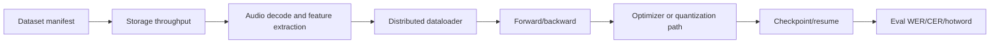

# 基于 Azure 的 Qwen3-ASR 训练与推理验证方法

[](https://learn.microsoft.com/azure/virtual-machines/sizes/gpu-accelerated/)
[](https://huggingface.co/tasks/automatic-speech-recognition)
[](https://huggingface.co/Qwen/Qwen3-ASR-1.7B)
[](https://docs.vllm.ai/en/latest/models/supported_models/)
[](https://www.python.org/)

这是一份面向自研 speech-to-text 系统的 ASR 工程验证指南：输入音频，输出 transcript，并用可复现的方法验证 model route、fine-tuning、serving framework、长音频 pipeline 和 Azure GPU 可行性。

> **Author**: 魏新宇 (Xinyu Wei) - Microsoft AI and Apps Global Black Belt (GBB) Senior System Engineer

[English](README.md) | 中文版

## Running on Azure

这个 repo 不是一次性 demo，而是一套 **validation-first engineering pipeline**。目标读者是正在基于 Qwen / Gemma 这类 backbone、Hugging Face training stack，以及 vLLM / SGLang / TensorRT-LLM / TensorRT / CTranslate2 等 serving engine 自研 ASR 的团队。

建议按六个阶段推进：

1. **Model-route classification** - 先判断 checkpoint 属于 dedicated ASR、audio LLM、omni multimodal、Gemma audio、Whisper-style，还是 custom audio encoder + LLM。
2. **Evaluation set freeze** - 固定脱敏音频、人工 transcript、hotwords、语言信息，以及可选 speaker labels。
3. **Runtime smoke** - 先证明 package、model、CUDA stack 和短音频 inference 路径能在 Azure GPU 上跑通。
4. **Quality gate** - 只有在有 ground truth 时，才计算 WER、CER、hotword recall、timestamp quality 和 speaker metrics。
5. **Serving gate** - 用同一批输入测 RTF、P50/P95、concurrency、success rate 和 audio-hours per GPU-hour。
6. **Training gate** - 把 data loading、audio decode、distributed runtime、checkpoint/resume、quantized training stability 和 serving 分开诊断。

公开 repo 中只包含公开样例和合成 harness tests，不包含客户私有音频、endpoint、transcript、VM 名称、IP、subscription ID 或凭据。

<div align="center">
  
</div>

---

## Executive Summary

ASR 架构讨论最容易犯的错，是把 model quality、training stability、serving latency 和 long-audio product behavior 混成一句话：“到底用哪个模型或 engine？”这不是正确起点。

自研 ASR 的第一步应该是把问题变成可复现 validation harness：

| 决策区 | 建议第一步 | 为什么重要 |
|---|---|---|
| **Model route** | 在讨论 vLLM/SGLang/TRT-LLM 前先确认 exact architecture 和 checkpoint | Serving support 取决于 architecture，不只取决于模型家族名。 |
| **Quality** | 固定带人工 transcript 的小评估集 | 没有 ground truth，不能写 WER/CER。 |
| **Long audio** | benchmark 会议录音前先做 VAD/chunk/overlap/stitching | 短音频 smoke test 不能证明长会议效果。 |
| **Serving** | 用同一个 endpoint contract 比较各框架 | RTF、P50/P95 和 failure rate 必须在同输入同并发下测。 |
| **Training** | 分开 profile data、distributed runtime、checkpoint 和 optimizer | GPU 利用率低经常是 data/audio decode，不是 compute。 |
| **Azure PoC** | 小 GPU 做 smoke，模型路线和指标固定后再上 A100/H100 | 避免 capacity 和 cost 讨论跑到证据前面。 |

### Public Harness 已验证内容

| Finding | Evidence | 证明了什么 | 没证明什么 |
|---|---|---|---|
| Qwen3-ASR 0.6B 短样例 transformers backend 跑通 | `results/qwen3_asr_0_6b_official_sample_v2.json` | Python package、model load、GPU runtime、公开短中文样例路径可用 | 没有客户 WER/CER，没有长音频结论，没有生产 SLA |
| 三轮公开样例输出唯一 transcript | `results/qwen3_asr_official_multiround_summary.json` | 这个公开短样例具备基础重复性 | 没有客户准确率结论 |
| 本地 quality metric 脚本覆盖 exact / substitution / insertion | `results/harness_test_results.json` | WER/CER/hotword recall 实现有 deterministic regression coverage | 不能替代客户标注评估集 |
| Endpoint benchmark 脚本能记录 success/failure/latency/RTF | `results/benchmark_endpoint_mock_success.json`, `results/benchmark_endpoint_mock_failure.json` | harness 可以测任意 HTTP ASR endpoint contract | mock latency 不是模型 latency |
| vLLM 有 dedicated transcription category，包括 Qwen3-ASR | `docs/vllm-asr-support-matrix.md` 和 vLLM 官方文档 | 目标 architecture 被支持时，vLLM 与 ASR 相关 | 客户改过的 checkpoint 仍要 runtime validation |

> Measurement note：公开结果是 **smoke and harness validation results**，不是客户 benchmark。真正 benchmark 要等客户提供脱敏音频、ground truth、model checkpoint 或 endpoint，以及 serving/training configs。

### 建议第一版 PoC

| PoC item | 最小输入 | 输出 artifact |
|---|---|---|
| ASR quality baseline | 30-60 分钟脱敏音频 + 人工 transcript | `results/asr_metrics_customer_baseline.json` |
| Hotword evaluation | 领域 hotword list + transcript | hotword recall table |
| Serving benchmark | 当前 endpoint + 一个 Azure candidate endpoint | RTF/P50/P95/concurrency JSON |
| Training diagnosis | training command、Accelerate/DeepSpeed/FSDP config、代表性 logs | data/runtime/checkpoint/optimizer blocker map |
| Azure capacity check | region、GPU count、timeline、subscription context | capacity plan and risk register |

---

## 1. Background

### 1.1 Qwen3-ASR 官方说了什么

Qwen3-ASR model card 写到：“The Qwen3-ASR family includes Qwen3-ASR-1.7B and Qwen3-ASR-0.6B, which support language identification and ASR for 52 languages and dialects”，并且项目发布了 “a powerful, full-featured inference framework that supports vLLM-based batch inference, asynchronous serving, streaming inference, timestamp prediction, and more.” 来源：https://huggingface.co/Qwen/Qwen3-ASR-1.7B，访问日期 2026-06-24。

这对客户 ASR 讨论很重要：Qwen3-ASR 不是把 text LLM 拿来“顺便做语音”，它有 dedicated ASR route、Qwen3-ForcedAligner timestamp alignment route，以及官方 package 中的 transformers / vLLM backend。

### 1.2 vLLM 真正提供什么

vLLM 是 inference and serving engine，不是 speech model。vLLM supported-model 文档把 transcription models 定义为 “Speech2Text models trained specifically for Automatic Speech Recognition”，其中包含 `Qwen3ASRForConditionalGeneration`，示例模型为 `Qwen/Qwen3-ASR-1.7B`；realtime transcription 里也列出 `Qwen3ASRRealtimeGeneration` 和 `Qwen/Qwen3-ASR-0.6B`。来源：https://docs.vllm.ai/en/latest/models/supported_models/，访问日期 2026-06-24。

工程含义很具体：

- 如果客户使用未修改的 supported architecture，vLLM 是现实 serving candidate。
- 如果客户修改了 model code、config、tokenizer、audio frontend 或 generation contract，就必须重新验证 support。
- 如果客户通过 Transformers modeling backend 使用 vLLM，也要和 native transformers 路径做 controlled comparison。

### 1.3 为什么这不是普通 Speech API 对比

自研 ASR 项目和 managed speech API 的 failure mode 不一样：

| 层级 | 典型问题 | failure mode |
|---|---|---|
| Model route | 是 Qwen3-ASR、Qwen2-Audio、Gemma 3n、Whisper，还是 custom？ | 错选 serving engine，或误判 tokenizer/audio frontend |
| Data pipeline | 音频存在哪里、怎么解码？ | CPU/storage/audio decode 饱和，GPU idle |
| Training | 是 OOM、NCCL、checkpoint、loss spike，还是 quantized training？ | 所有问题都被误解成“缺 GPU” |
| Serving | 瓶颈在 prefill、decode、audio frontend、batch scheduler 还是 post-processing？ | 输入和参数不一致，framework 对比失真 |
| Product pipeline | 是否需要 VAD、diarization、timestamps、hotwords、formatting？ | 短音频能跑，会议音频失败 |

### 1.4 Model Route Taxonomy

只知道模型名不够。route 决定训练、serving 和 evaluation。

| Route | Examples | 首先验证什么 |
|---|---|---|
| Dedicated ASR | Qwen3-ASR、Whisper、FunASR、SenseVoice | Transcription API、timestamp support、language coverage、long-audio behavior |
| Audio LLM | Qwen2-Audio、Phi-4 multimodal audio、Kimi-Audio | ASR 是主任务，还是 audio-understanding 的一个能力 |
| Omni multimodal | Qwen2.5-Omni、Qwen3-Omni | omni 能力是否值得引入额外复杂度 |
| Gemma audio route | Gemma 3n E2B/E4B | 轻量化或端侧路线；验证 vLLM/version caveats |
| Whisper-style production route | Whisper、faster-whisper/CTranslate2、WhisperX | 强 baseline；验证 hotwords、diarization、language mix |
| Custom audio encoder + LLM | 客户自研 architecture | 先看 code/config，再谈 serving claims |

### 1.5 Azure GPU Positioning

Azure GPU sizing 不应该是一张静态 SKU 表。对 ASR 来说，GPU 选择取决于 model route、batch size、precision、audio duration、serving target、training method，以及是否需要 multi-node distributed training。

Microsoft Learn 把 ND H100 v5 描述为 “designed for high-end Deep Learning training and tightly coupled scale-up and scale-out Generative AI and HPC workloads”。单 VM 有 8 张 NVIDIA H100 80GB、96 vCPUs、1900 GiB memory、3.2 Tbps interconnect bandwidth per VM。来源：https://learn.microsoft.com/en-us/azure/virtual-machines/sizes/gpu-accelerated/ndh100v5-series，访问日期 2026-06-24。

这些信息只能作为 capacity discussion 的起点，不是承诺。实际 region、quota、allocation、timeline 和 cost 必须基于目标订阅查证。

---

## 2. Methodology

### 2.1 Evidence Levels

这个 repo 严格区分已经验证过的内容和必须用客户数据再验证的内容。

| Level | 含义 | 本 repo 示例 |
|---|---|---|
| L0 | Script regression only | Mock endpoint success/failure tests |
| L1 | Public model smoke | Qwen3-ASR 0.6B 官方短样例 |
| L2 | Customer data quality | 需要客户 audio + ground truth |
| L3 | Customer serving benchmark | 需要 endpoint/serving command 和 controlled input set |
| L4 | Customer training diagnosis | 需要 training config、logs、data pipeline facts |
| L5 | Production readiness | 需要 repeated runs、failure drills、monitoring、capacity/cost validation |

不能把 L0/L1 讲成 L3/L5。这是本 repo 的核心 guardrail。

### 2.2 Validation Gates

<div align="center">
  
</div>

| Gate | 通过条件 | 证据文件或命令 |
|---|---|---|
| Q0 runtime smoke | model load + 短公开音频转录成功 | `scripts/qwen3_asr_transformers_smoke.py` |
| Q1 quality | 基于 ground truth 计算 WER/CER/hotword recall | `scripts/eval_asr_metrics.py` |
| Q2 long audio | chunk 后输出能 stitch 并端到端评估 | customer audio manifest + pipeline output |
| Q3 serving | RTF/P50/P95/concurrency/failure rate 有数据 | `scripts/benchmark_endpoint.py` |
| Q4 training | data、runtime、checkpoint、optimizer 问题可分离 | `scripts/collect_training_env.py` + customer logs |

### 2.3 ASR Quality Metrics

| Metric | 定义 | 什么时候用 |
|---|---|---|
| WER | word token 级 edit distance / reference word count | 英文和空格分词语言 |
| CER | character 级 edit distance / reference character count | 中文和 CJK mixed transcript |
| Hotword recall | reference 中出现的 expected hotwords 在 hypothesis 中命中比例 | 产品名、医疗词、保险词、会议特定词 |
| Timestamp error | predicted boundary 和 reference boundary 的绝对差 | 字幕、会议回看、搜索索引 |
| DER | Diarization error rate | 有 speaker labels 的多人会议 |

质量指标必须依赖 human ground truth。没有 reference transcript 时，正确说法是：“可以跑 smoke 和 serving tests，但不能声称 WER/CER。”

### 2.4 Serving Metrics

| Metric | 定义 | 为什么重要 |
|---|---|---|
| RTF | processing seconds / audio seconds | RTF < 1 表示单路快于实时 |
| P50/P95 latency | median/tail request latency | P95 才是负载下用户体感 |
| Audio-hours per GPU-hour | total audio seconds processed / GPU wall time | batch transcription 成本 proxy |
| Success rate | HTTP 2xx 或 framework success / total requests | 并发下 serving 稳定性 |
| GPU utilization | SM/memory utilization | 低利用率可能是 CPU/data/audio frontend bottleneck |
| Peak HBM | 最大 GPU memory | 决定 batch size 和 model fit |

### 2.5 Fairness Controls

每个 serving comparison 至少控制这些变量：

| Variable | 必须对齐 |
|---|---|
| Audio set | 同一批文件、同一 duration distribution、同一 sample rate |
| Model checkpoint | 同一 checkpoint，或明确分开 route |
| Decoding | language hints、max tokens、beam/temperature、timestamp options 一致 |
| Pipeline | VAD/chunking/stitching 和 post-processing 一致 |
| Hardware | GPU SKU、driver、CUDA、PyTorch、framework version 一致 |
| Load shape | concurrency、request order、warm-up policy 一致 |
| Output parser | transcript extraction 和 failure handling 一致 |

只要变了一个变量，结论就只能写 directional，不能写 final。

### 2.6 Long-Audio Pipeline

长会议音频不应被当成一次 opaque model request。生产级 ASR 通常需要：

```mermaid
flowchart LR
    A[Raw audio] --> B[Normalize 16 kHz mono]
    B --> C[VAD]
    C --> D[Chunk with overlap]
    D --> E[ASR inference]
    E --> F[Timestamp or forced alignment]
    F --> G[Speaker diarization]
    G --> H[Hotword correction]
    H --> I[Punctuation and formatting]
    I --> J[Segment stitching]
    J --> K[Downstream product]
```



Chunking 不只是绕开 max context length。它决定 memory、tail latency、diarization boundary、timestamp alignment 和 retry 行为。

### 2.7 Training Diagnosis Shape



训练不稳定时，不要直接跳到“需要更多 GPU”。先判断是哪一段失败。

---

## 3. Public Evidence Pack

### 3.1 Runtime Smoke: Qwen3-ASR 0.6B Official Sample

| Item | Value |
|---|---|
| Model | `Qwen/Qwen3-ASR-0.6B` |
| Backend | qwen-asr transformers backend |
| Audio | Qwen 官方公开样例 URL |
| Language hint | Chinese |
| Load time | 1.90 秒 |
| Transcribe time | 2.74 秒 |
| Output | `甚至出现交易几乎停滞的情况。` |
| Evidence | `results/qwen3_asr_0_6b_official_sample_v2.json` |

这证明公开短样例 runtime path 可用。它不证明客户质量、长音频稳定性或 serving scalability。

### 3.2 Multi-Round Repeatability Smoke

| Metric | Value |
|---|---:|
| Rounds | 3 |
| Mean transcribe time | 2.488 秒 |
| Min / max transcribe time | 2.024 / 2.954 秒 |
| Unique transcripts | 1 |
| Output | `甚至出现交易几乎停滞的情况。` |

证据文件：

- `results/multiround/qwen3_asr_official_round1.json`
- `results/multiround/qwen3_asr_official_round2.json`
- `results/multiround/qwen3_asr_official_round3.json`
- `results/qwen3_asr_official_multiround_summary.json`

### 3.3 Local Harness Regression

| Test case | 预期行为 | Observed result |
|---|---|---|
| Exact transcript | WER = 0, CER = 0 | PASS |
| Substitution | WER/CER 上升，hotword recall 可能下降 | PASS |
| Insertion | WER/CER 上升 | PASS |
| Mock endpoint 200 | 计为 success，并计算 latency/RTF | PASS |
| Mock endpoint 503 | 计为 failure | PASS |

Regression file 是 `results/harness_test_results.json`。这些测试用于证明 metric 和 benchmark 脚本可信，然后才能指向客户 endpoint。

### 3.4 Mock Endpoint Interpretation

Mock endpoint 结果只代表脚本测试。

| Result | 正确解释 | 错误解释 |
|---|---|---|
| HTTP 200 mock success | multipart request、latency timer、summary JSON、success accounting 可用 | ASR model 很快 |
| HTTP 503 mock failure | failure accounting 和 error capture 可用 | 客户 endpoint 不稳定 |
| RTF from mock | 公式和 output schema 可用 | 生产成本估算 |

### 3.5 Public Evidence vs Customer Evidence

| Evidence item | Public repo status | Customer benchmark requirement |
|---|---|---|
| Short Qwen sample | 已包含 | 替换或补充客户 representative samples |
| Ground truth | 未包含 | 需要人工 transcript |
| Long meeting audio | 未包含 | 需要 30-60 分钟脱敏会议样本 |
| Production endpoint | 未包含 | 需要当前 endpoint 和 candidate endpoint |
| Training logs | 未包含 | 需要 failure logs 和 configs |
| GPU cost | 未包含 | 需要 region、SKU、quota、utilization、pricing check |

---

## 4. Model Route and Fine-Tuning Strategy

### 4.1 Route Classification Checklist

建议拿到这些 artifact 后再谈模型或 serving 调整：

| Artifact | 为什么重要 |
|---|---|
| Exact base checkpoint | 决定 architecture 和 serving support |
| `config.json` | 能看到 architectures、audio frontend、tokenizer、remote code |
| Training command | 暴露 Accelerate/DeepSpeed/FSDP/TRL route |
| Fine-tuning method | LoRA、QLoRA、full SFT、DPO/GRPO、GPTQ/AWQ、FP8 是不同问题 |
| Evaluation script | 看质量到底是 WER/CER/hotword/DER，还是人工看样例 |
| Serving command | 暴露 framework、precision、batching、parallelism、endpoint contract |

### 4.2 Training Stack Positioning

Hugging Face Accelerate 官方描述是让 “the same PyTorch code to be run across any distributed configuration”，并提到 DeepSpeed、FSDP 和 mixed precision support。来源：https://huggingface.co/docs/accelerate/index，访问日期 2026-06-24。

因此客户训练问题要映射到层级：

| Layer | Common symptom | Evidence to request |
|---|---|---|
| Data/storage | GPU utilization 低，step time 抖动 | storage path、dataloader workers、audio decode timing |
| Distributed runtime | NCCL errors、rank hangs、GPU utilization 不均 | Accelerate/DeepSpeed/FSDP config、NCCL logs |
| Memory | OOM、fragmentation、batch size 下不去 | GPU memory trace、precision、sequence length、checkpointing |
| Optimizer/quantization | loss spike、quantized training 后质量下降 | LoRA/QLoRA/GPTQ/AWQ/FP8 config、eval output |
| Checkpoint | save/resume 慢、state 损坏、进度丢失 | checkpoint size、save frequency、storage throughput |

### 4.3 Quantized Training Decision Table

| 客户说法 | 追问 | 验证路径 |
|---|---|---|
| QLoRA | base 是否 4-bit load，是否只训 adapters？ | 同一 eval set 对比非量化 LoRA 的 WER/CER 和 loss |
| LoRA | target modules 是哪些？ | 检查 target module list、rank、alpha、dropout、merge path |
| GPTQ/AWQ | 是 post-training quantization，还是 training 阶段问题？ | 验证 quantized serving 前后的 accuracy |
| FP8 | 是 training、serving，还是 checkpoint format？ | 检查 hardware、framework support 和 quality regression |
| INT8/INT4 | 是 activation、weight-only，还是 KV cache quantization？ | 分开 latency/memory gain 和 WER/CER impact |

### 4.4 When to Fine-Tune

Fine-tuning 应该来自 error analysis，而不是直觉。

| Error pattern | Likely next action |
|---|---|
| Hotwords missing but base transcript mostly correct | 增加 hotword correction、contextual biasing 或小规模 domain SFT |
| Domain terms systematically mistranscribed | 建 domain eval set，再 fine-tune 或适配 decoder/language layer |
| Speaker turns wrong | 先加 diarization/segmentation pipeline，再考虑模型训练 |
| Long audio truncates or repeats | 先修 VAD/chunk/stitching，再谈 training |
| Quality drops only under serving engine | 用相同 decoding 对比 transformers vs serving engine |
| Training loss unstable | 先诊断 data/runtime/optimizer |

---

## 5. Serving Engine Selection

### 5.1 Framework Roles

| Framework | 在 ASR 讨论中的角色 | 要验证什么 |
|---|---|---|
| vLLM | OpenAI-compatible serving 和 supported ASR/audio model execution | Architecture support、endpoint contract、RTF/P95、batch behavior |
| SGLang | 高吞吐 LLM/multimodal serving | 目标 audio model 是否支持，输出是否与 baseline 对齐 |
| TensorRT | 优化 encoder/decoder graph path | Exportability、accuracy parity、plugin coverage |
| TensorRT-LLM | decoder-oriented LLM optimization | audio/multimodal components 是否适合 engine path |
| faster-whisper/CTranslate2 | Whisper-family production ASR baseline | 强 baseline，用于 cost/latency/quality comparison |

### 5.2 Serving Benchmark Protocol

公平 serving benchmark 至少要跑：

| Sweep | Values | Output |
|---|---|---|
| Concurrency | 1, 2, 4, 8, 16, 32（如果 endpoint 支持） | P50/P95、RTF、success rate |
| Audio duration | short、medium、long | tail behavior 和 chunking pressure |
| Language | representative language mix | 不同语言的 CER/WER 差异 |
| Hotword density | low/high | 领域词稳定性 |
| Warm-up | 第一轮丢弃 | 避免 cold-start/kernel-cache distortion |

`benchmark_endpoint.py` 是 generic HTTP harness。如果 endpoint 符合 OpenAI transcription API，可以用默认 multipart `file` field；否则用 `--field-name` 和 `--header` 对齐客户 endpoint。

### 5.3 Endpoint Contract Matters

Endpoint contract 不一致时不要比较 engines。

| Contract dimension | 必须对齐 |
|---|---|
| Input form | raw file vs URL vs base64 vs streaming chunks |
| Audio preprocessing | sample rate、channel count、codec |
| Request format | `/v1/audio/transcriptions`、`/v1/chat/completions`、custom route |
| Output extraction | `text`、chat message content、JSON wrapper、streaming events |
| Language hint | fixed language、auto-detect、prompt hint |
| Timestamp mode | enabled/disabled、aligner model |

### 5.4 Cost Proxy

在没有 pricing 和 utilization 前，用 cost proxy，不写最终成本：

```text
audio_hours_per_gpu_hour = total_audio_seconds_processed / wall_seconds / 3600 * 3600
cost_per_audio_hour = gpu_hour_price / audio_hours_per_gpu_hour
```

这只是 proxy。最终成本需要 region-specific VM price、utilization、autoscaling behavior、storage/network cost 和 operational overhead。

---

## 6. Azure PoC Plan

### 6.1 Phased Azure Path

| Phase | Goal | Recommended GPU class | Exit criteria |
|---|---|---|---|
| A0 | Package/model smoke | A10-class GPU | Model loads、短样例转录、scripts pass |
| A1 | Customer quality baseline | A10/A100，取决于模型大小 | 冻结 eval set 上 WER/CER/hotword |
| A2 | Serving benchmark | A100/H100 candidate | RTF/P50/P95/concurrency 对比 current baseline |
| A3 | Training diagnosis | 需要时 A100/H100 multi-GPU | blocker map 和 stable training/restart proof |
| A4 | Production sizing | 目标生产 SKU | capacity、cost、monitoring、rollback plan 完成 |

### 6.2 GPU SKU Discussion Guardrails

| SKU family | 可讨论什么 | Guardrail |
|---|---|---|
| A10 class | smoke、package validation、较小 checkpoint | 不是最终 training-size 承诺 |
| A100 40GB/80GB | multi-GPU training 和较大 serving tests | 必须查 quota、region、memory fit |
| H100 80GB | 高吞吐 training/serving、FP8 exploration | capacity 和 cost 必须验证 |
| CPU/storage | data pipeline、decode、feature extraction | GPU upgrade 不会自动修 storage bottleneck |

### 6.3 Data and Storage Questions

ASR training 很可能受 storage 和 preprocessing 限制。要问：

| Question | Why |
|---|---|
| training set 有多少小时音频？ | 决定 storage、epoch time、eval sampling |
| 原始 codec/sample rate/channel layout 是什么？ | decode 和 resampling 成本可能很高 |
| 数据存在哪里？ | Blob、disk、NFS、object store、local NVMe 吞吐差别很大 |
| feature extraction 是否缓存？ | 反复算 features 会浪费 GPU 时间 |
| transcripts 和 speaker labels 如何 version？ | label drift 会破坏 benchmark 对比 |

---

## 7. Reproducing the Harness

### 7.1 Prerequisites

```bash
python3 --version
ffmpeg -version
pip install -r requirements.txt
```

核心 harness 没有 mandatory third-party Python dependencies。`benchmark_endpoint.py` 需要 `ffmpeg` / `ffprobe` 来读取音频时长。

### 7.2 Run Local Regression Tests

```bash
python3 scripts/run_harness_tests.py
```

输出文件：

```text
results/harness_test_results.json
results/benchmark_endpoint_mock_success.json
results/benchmark_endpoint_mock_failure.json
```

### 7.3 Evaluate ASR Quality

```bash
python3 scripts/eval_asr_metrics.py \
  --reference ref.txt \
  --hypothesis hyp.txt \
  --hotwords hotwords.txt \
  --output results/asr_metrics.json
```

### 7.4 Benchmark an Endpoint

```bash
python3 scripts/benchmark_endpoint.py \
  --url http://127.0.0.1:8000/v1/audio/transcriptions \
  --audio sample1.wav sample2.wav \
  --concurrency 4 \
  --output results/endpoint_benchmark.json
```

### 7.5 Collect Training Environment Facts

```bash
python3 scripts/collect_training_env.py --output results/training_env.json
```

### 7.6 Run Qwen3-ASR Smoke Test

```bash
python3 scripts/qwen3_asr_transformers_smoke.py \
  --model Qwen/Qwen3-ASR-0.6B \
  --audio https://qianwen-res.oss-cn-beijing.aliyuncs.com/Qwen3-ASR-Repo/asr_zh.wav \
  --language Chinese \
  --output results/qwen3_asr_smoke.json
```

跑 smoke test 前需要安装 optional GPU dependencies，见 `requirements.txt` 注释。

### 7.7 Script Inventory

| Script | Purpose | Required external service |
|---|---|---|
| `scripts/eval_asr_metrics.py` | 从文本文件计算 WER/CER/hotword recall | None |
| `scripts/benchmark_endpoint.py` | 测 HTTP ASR endpoint 的 latency/RTF/success rate | Target endpoint |
| `scripts/collect_training_env.py` | 采集 system、GPU、CUDA、PyTorch、HF package 信息 | None |
| `scripts/qwen3_asr_transformers_smoke.py` | 跑 Qwen3-ASR transformers-backend smoke test | GPU + model download |
| `scripts/run_harness_tests.py` | 跑 deterministic local regression tests | None |

---

## 8. Customer Discovery Checklist

第一次技术会议建议问这些问题。

### 8.1 Model and Data

1. exact base model 和 checkpoint path 是什么？
2. 它是 dedicated ASR、audio LLM、omni multimodal，还是 custom audio encoder + LLM？
3. 训练集和评估集分别有多少小时？
4. 哪些语言、方言、口音、噪音场景重要？
5. evaluation set 有没有人工 ground truth？
6. 是否有 speaker labels、timestamps、hotword list？

### 8.2 Training

1. 当前是 Accelerate + DeepSpeed、Accelerate + FSDP、raw DDP，还是其他 launcher？
2. 最大稳定训练规模是多少？
3. failure 是 OOM、NCCL、data loader、checkpoint、optimizer、quantization，还是 loss quality？
4. 训练时 GPU utilization 是多少？
5. checkpoint save/resume 要多久？

### 8.3 Serving

1. 哪个 engine 在 production，哪个还只是 PoC？
2. endpoint contract 是什么？
3. 当前 RTF、P50/P95、concurrency 和 success rate 是多少？
4. 当前 GPU utilization 和 peak memory 是多少？
5. 长音频是否有 chunking/VAD/overlap/stitching？
6. speaker diarization 是模型内做，ASR 前做，还是 ASR 后做？

### 8.4 Azure

1. 目标 region 和 timeline 是什么？
2. first PoC 和 production 分别需要多少 GPU？
3. 客户数据能否移动到 Azure，还是 harness 必须在客户环境里跑？
4. 当前 cloud baseline 和 cost model 是什么？

---

## 9. Troubleshooting

| Symptom | Likely cause | Action |
|---|---|---|
| WER/CER cannot be computed | Missing ground truth | 先拿脱敏人工 transcript |
| Short sample works but meeting audio fails | Missing long-audio pipeline | 加 VAD/chunk/overlap/stitching 并端到端评估 |
| vLLM import/runtime failure | Version or CUDA ABI mismatch | 用干净环境，对齐 vLLM/Qwen docs |
| Qwen3-ASR import triggers vision dependency error | Torch/torchvision mismatch | 安装匹配 wheels 或官方 Docker image |
| Endpoint benchmark looks too fast | Mock endpoint does no ASR work | mock 只用于脚本验证 |
| GPU utilization low during training | Data or preprocessing bottleneck | profile storage、dataloader、audio decode、feature extraction |
| Quantized path is faster but worse | Accuracy regression from quantization | 接受 latency gain 前重跑 WER/CER/hotword |
| Serving framework output differs from transformers output | Decoding/default config mismatch | 对齐 language hints、max tokens、sampling、timestamp settings |

---

## 10. Data Files

| File | Description |
|---|---|
| `results/harness_test_results.json` | 本地 regression results |
| `results/qwen3_asr_0_6b_official_sample_v2.json` | 单次公开 Qwen sample smoke test |
| `results/qwen3_asr_official_multiround_summary.json` | 三轮公开 sample summary |
| `results/multiround/*.json` | 每轮公开 sample output |
| `results/benchmark_endpoint_mock_success.json` | mock endpoint success output |
| `results/benchmark_endpoint_mock_failure.json` | mock endpoint failure output |
| `docs/vllm-asr-support-matrix.md` | vLLM ASR/audio support matrix |
| `docs/benchmark-methodology.md` | benchmark 方法与 fairness controls |
| `docs/azure-poc-plan.md` | Azure PoC 分阶段模板 |
| `docs/customer-discovery-checklist.md` | 会议问题清单 |
| `data/eval-manifest.example.json` | 客户 eval manifest 示例 |

---

## 11. Limitations

- 本 repo 包含 smoke tests 和 validation harness，不是 final production sizing。
- 公开结果只使用 public samples 和 mock endpoints，不包含客户数据。
- 没有 ground truth 不写 WER/CER 质量结论。
- vLLM support matrix 不保证客户改过的 checkpoint 开箱即用。
- SGLang 和 TensorRT-LLM 在这个公开 artifact 中只讨论工程定位，没有 benchmark 数据。
- Azure GPU capacity、cost、region availability 必须按目标订阅和 timeline 查证。
- Long-audio behavior 必须用真实 VAD/chunk/stitching pipeline 验证。

---

## Appendix A: Source-Backed Facts

| Fact | Source |
|---|---|
| Qwen3-ASR supports language identification and ASR for 52 languages/dialects | https://huggingface.co/Qwen/Qwen3-ASR-1.7B |
| Qwen3-ASR package provides transformers and vLLM backends | https://huggingface.co/Qwen/Qwen3-ASR-1.7B |
| vLLM lists `Qwen3ASRForConditionalGeneration` under transcription | https://docs.vllm.ai/en/latest/models/supported_models/ |
| vLLM lists `Qwen3ASRRealtimeGeneration` under realtime transcription | https://docs.vllm.ai/en/latest/models/supported_models/ |
| Accelerate can run the same PyTorch code across distributed configurations | https://huggingface.co/docs/accelerate/index |
| Azure ND H100 v5 is designed for high-end deep learning and tightly coupled scale-up/scale-out workloads | https://learn.microsoft.com/en-us/azure/virtual-machines/sizes/gpu-accelerated/ndh100v5-series |

---

## Appendix B: Minimum Customer Evidence Pack

```text
customer-evidence-pack/
├── audio/
│   ├── sample_001.wav
│   └── sample_002.wav
├── transcripts/
│   ├── sample_001.ref.txt
│   └── sample_002.ref.txt
├── hotwords.txt
├── eval-manifest.json
├── training/
│   ├── accelerate.yaml
│   ├── deepspeed.json
│   └── failure.log
└── serving/
    ├── current_start_command.txt
    ├── candidate_start_command.txt
    └── endpoint_contract.md
```

如果音频不能离开客户环境，harness 可以放在客户环境内运行。

---

## References

| Topic | Reference |
|---|---|
| Qwen3-ASR | https://huggingface.co/Qwen/Qwen3-ASR-1.7B |
| Qwen3-ASR GitHub | https://github.com/QwenLM/Qwen3-ASR |
| vLLM supported models | https://docs.vllm.ai/en/latest/models/supported_models/ |
| vLLM speech-to-text API | https://docs.vllm.ai/en/latest/api/vllm/entrypoints/speech_to_text/ |
| SGLang | https://docs.sglang.io/ |
| TensorRT-LLM multimodal support | https://nvidia.github.io/TensorRT-LLM/features/multi-modality.html |
| Hugging Face Accelerate | https://huggingface.co/docs/accelerate/index |
| Hugging Face Transformers | https://huggingface.co/docs/transformers/index |
| Hugging Face TRL | https://huggingface.co/docs/trl/index |
| Whisper | https://github.com/openai/whisper |
| faster-whisper | https://github.com/SYSTRAN/faster-whisper |
| WhisperX | https://github.com/m-bain/whisperX |
| FunASR | https://github.com/modelscope/FunASR |
| SenseVoice | https://github.com/FunAudioLLM/SenseVoice |
| NeMo | https://github.com/NVIDIA-NeMo/NeMo |
| Azure ND-H100-v5 | https://learn.microsoft.com/en-us/azure/virtual-machines/sizes/gpu-accelerated/ndh100v5-series |

