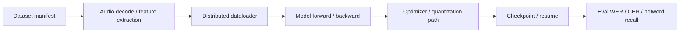

# 基于 Azure 的 Qwen3-ASR 训练与推理验证方法

   

这是一份面向客户技术交流的 ASR 工程验证方法：当客户基于 Qwen / Gemma 这类开源 backbone 自研 speech-to-text 模型时，如何把模型选择、fine-tuning、训练稳定性、推理框架、长音频 pipeline 和可复现验证拆开来讨论。

> Author: 魏新宇 (Xinyu Wei), Microsoft AI and Apps Global Black Belt (GBB) Senior System Engineer

[English](README.md) | 中文版

## Executive Summary

ASR 架构讨论里最容易混在一起的是四层东西：

| 层级 | 含义 | 客户会问什么 | 工程化回答 |
|---|---|---|---|
| ASR model | Qwen3-ASR、Whisper、FunASR、SenseVoice | 应该基于哪个 backbone 继续 fine-tune？ | 先确认 exact checkpoint 和评估集。 |
| Training stack | Transformers、Accelerate、TRL、DeepSpeed/FSDP | 怎么训得稳定、训得更快？ | 分开 profile 数据、分布式 runtime、checkpoint 和质量指标。 |
| Serving engine | vLLM、SGLang、TensorRT-LLM、CTranslate2 | 能不能降低延迟和成本？ | 只有模型被支持并经过 benchmark 后才有结论。 |
| Speech pipeline | VAD、chunking、diarization、hotwords、stitching | 真实会议音频怎么处理？ | 长音频要做 pipeline，不建议整段一把梭。 |

这个 repo 的目标不是给出固定生产架构，而是提供一套 validation harness，用来回答三个问题：

1. 选定的 ASR model 能不能在 Azure GPU VM 上跑起来？
2. 能不能用脚本稳定测质量和推理行为？
3. 在建议训练或推理优化前，客户必须提供哪些证据？

## Best-Practice Validation Pattern

客户 PoC 建议按这个顺序做：

```text
1. 确认 exact model route
   - Qwen3-ASR / Whisper / FunASR / Qwen2-Audio / Gemma 3n / custom

2. 固定小评估集
   - 脱敏音频样本
   - 人工 ground-truth transcript
   - 可选 hotword list 和 speaker label

3. 跑 baseline
   - 客户当前生产 ASR route
   - 相关公开模型 smoke test
   - Azure GPU runtime check

4. 测质量和 serving
   - WER、CER、hotword recall
   - RTF、P50/P95 latency、concurrency、GPU utilization

5. 单独诊断训练
   - data loading、audio decode、feature extraction
   - distributed runtime、checkpoint、resume、NCCL/OOM

6. 有证据后再选优化方案
   - vLLM / SGLang / TensorRT-LLM / TensorRT / CTranslate2
```

## Scope Definition

| 项目 | 范围内 | 范围外 |
|---|---|---|
| Model route | Qwen3-ASR 和其他公开 ASR/audio model family | 没有客户数据就断言哪个模型最好 |
| Training | HF/Accelerate/TRL/DeepSpeed/FSDP 的排查问题 | 没有客户数据和配置就跑完整训练 |
| Inference | endpoint benchmark 和 ASR serving support matrix | 生产 SLA 或 capacity 承诺 |
| Azure | GPU smoke test 方法和环境采集脚本 | quota、region、价格、最终 sizing 承诺 |
| Data | 公开样例和 BYO 脱敏音频 | 客户私有录音或内部会议转录 |

## Detailed Test Data

### 1. Qwen3-ASR 官方样例多轮 smoke test

Model：`Qwen/Qwen3-ASR-0.6B`

Input：Qwen model card 中的公开中文样例。

| 指标 | 值 |
|---|---:|
| 轮数 | 3 |
| 平均转录时间 | ~2.49 秒 |
| 最小 / 最大转录时间 | ~2.02s / ~2.95s |
| 唯一输出数 | 1 |
| 输出 | `甚至出现交易几乎停滞的情况。` |

证据文件：

- `results/multiround/qwen3_asr_official_round1.json`
- `results/multiround/qwen3_asr_official_round2.json`
- `results/multiround/qwen3_asr_official_round3.json`
- `results/qwen3_asr_official_multiround_summary.json`

解释：这只能说明模型、Python package、GPU runtime 和短音频 ASR 路径是可用的。它是 smoke test，不是生产 benchmark。

### 2. 本地 harness regression tests

| 测试 | 结果 | 证据 |
|---|---|---|
| Python syntax check | PASS | `python3 -m py_compile scripts/*.py` |
| 完全一致 transcript | PASS | WER/CER 都为 0 |
| 替换错误 case | PASS | WER/CER 如预期上升 |
| 插入错误 case | PASS | WER/CER 如预期上升 |
| endpoint mock success | PASS | HTTP 200 计为成功 |
| endpoint mock failure | PASS | HTTP 503 计为失败 |

证据文件：

- `results/harness_test_results.json`
- `results/benchmark_endpoint_mock_success.json`
- `results/benchmark_endpoint_mock_failure.json`

## Test Methodology

### Metrics

| 指标 | 定义 | 用途 |
|---|---|---|
| WER | Word error rate | 英文或按词切分文本质量 |
| CER | Character error rate | 中文 ASR 更常用 |
| Hotword recall | 参考文本中出现的热词在预测文本中的命中率 | 医疗、保险、产品名、客户专有词 |
| RTF | 转录耗时 / 音频时长 | ASR serving 速度 |
| P50/P95 latency | 请求延迟分布 | 用户体验和 tail latency |
| audio-hours/GPU-hour | 每 GPU 小时可处理音频小时数 | 成本 proxy |
| GPU utilization | SM / memory utilization | 判断瓶颈在哪里 |

### 推荐 ASR Pipeline

```mermaid
flowchart LR
      A[Raw audio] --> B[Normalize / resample]
      B --> C[VAD]
      C --> D[Chunk + overlap]
      D --> E[ASR model inference]
      E --> F[Timestamp / forced alignment]
      F --> G[Speaker diarization]
      G --> H[Hotword correction]
      H --> I[Punctuation / formatting]
      I --> J[Segment stitching]
      J --> K[Downstream app]
```



### Training Diagnosis Shape



## Inference Framework Positioning

vLLM、SGLang、TensorRT-LLM 都不是 speech model。它们是 serving 或 inference optimization framework。只有在模型 route 明确之后，才讨论它们是否适用。

| Framework | 适合讨论什么 | 注意事项 |
|---|---|---|
| vLLM | 支持的 ASR/audio model，比如 Qwen3-ASR、Whisper、FunASR、Gemma 3n | 客户改过的 checkpoint 仍要 runtime validation |
| SGLang | 高吞吐、低延迟 LLM/multimodal serving | 不是自动等于 ASR stack |
| TensorRT | 可导出的 encoder/decoder 图优化 | 必须验证导出路径和准确率 |
| TensorRT-LLM | LLM decoder / multimodal LLM 推理优化 | 不是每个 ASR model 的默认方案 |
| faster-whisper / CTranslate2 | Whisper 路线的生产 ASR baseline | 模型家族相关 |

更多见 [docs/vllm-asr-support-matrix.md](docs/vllm-asr-support-matrix.md)。

## Running On Azure

本 repo 展示的是 Azure GPU 上的验证方法。公开版不包含 VM 名称、IP、subscription ID 或凭据。

推荐 GPU 选择流程：

1. 先用 A10-class GPU 做 model load 和短音频 smoke test。
2. 明确模型路线、batch size、precision、目标延迟后，再评估 A100/H100。
3. 不在未查 quota / region / capacity 前承诺资源。
4. 每次运行都记录 driver、CUDA、PyTorch、Transformers、serving framework 版本。

## Reproducing

### Prerequisites

```bash
python3 --version
ffmpeg -version
pip install -r requirements.txt
```

### Run Local Harness Tests

```bash
python3 scripts/run_harness_tests.py
```

输出文件：

```text
results/harness_test_results.json
results/benchmark_endpoint_mock_success.json
results/benchmark_endpoint_mock_failure.json
```

### Evaluate ASR Metrics

```bash
python3 scripts/eval_asr_metrics.py \
  --reference ref.txt \
  --hypothesis hyp.txt \
  --hotwords hotwords.txt \
  --output results/asr_metrics.json
```

### Benchmark An ASR Endpoint

```bash
python3 scripts/benchmark_endpoint.py \
  --url http://127.0.0.1:8000/v1/audio/transcriptions \
  --audio sample.mp3 \
  --concurrency 1 \
  --output results/endpoint_benchmark.json
```

### Collect Training Environment Facts

```bash
python3 scripts/collect_training_env.py --output results/training_env.json
```

### Run Qwen3-ASR Smoke Test

```bash
python3 scripts/qwen3_asr_transformers_smoke.py \
  --model Qwen/Qwen3-ASR-0.6B \
  --audio https://qianwen-res.oss-cn-beijing.aliyuncs.com/Qwen3-ASR-Repo/asr_zh.wav \
  --language Chinese \
  --output results/qwen3_asr_smoke.json
```

## Data Files

| 文件 | 说明 |
|---|---|
| `results/harness_test_results.json` | 本地脚本 regression tests |
| `results/qwen3_asr_0_6b_official_sample_v2.json` | 单次公开 Qwen 样例 smoke test |
| `results/qwen3_asr_official_multiround_summary.json` | 公开样例多轮汇总 |
| `results/multiround/*.json` | 每轮公开样例结果 |
| `docs/vllm-asr-support-matrix.md` | vLLM ASR support matrix |
| `data/sample-audio/README.md` | 公开数据策略和 BYO audio 说明 |

## Troubleshooting

| 现象 | 可能原因 | 处理方式 |
|---|---|---|
| 无法计算 WER/CER | 没有 ground truth | 先拿脱敏人工 transcript |
| 长音频输出被截断 | 单次请求太长或 pipeline 不匹配 | 使用 VAD/chunking/overlap/stitching |
| vLLM import/runtime 报错 | vLLM wheel 与 torch/CUDA ABI 不匹配 | 使用干净环境，按 vLLM 官方文档装 |
| Qwen3-ASR import 触发 vision 依赖报错 | torch/torchvision 版本不匹配 | 安装匹配 wheel 或使用官方 Docker |
| mock endpoint 速度很快 | mock 不做真实 ASR | mock 只用于脚本验证，不代表模型性能 |
| 训练 GPU 利用率低 | 数据或预处理瓶颈 | profile dataloader、audio decode、feature extraction、storage |

## Limitations

- 本 repo 是 smoke test 和 validation harness，不是生产 sizing。
- 公开结果只使用公开样例和 mock endpoint，不包含客户数据。
- 没有 ground truth 不写 WER/CER 质量结论。
- vLLM support matrix 不保证客户改过的 checkpoint 开箱即用。
- SGLang 和 TensorRT-LLM 在本 workspace 中没有做 benchmark。
- Azure GPU capacity、cost、region availability 需要按目标订阅和时间窗口查证。

## References

| 主题 | 来源 |
|---|---|
| Qwen3-ASR | https://huggingface.co/Qwen/Qwen3-ASR-1.7B |
| Qwen3-ASR GitHub | https://github.com/QwenLM/Qwen3-ASR |
| vLLM supported models | https://docs.vllm.ai/en/latest/models/supported_models/ |
| SGLang | https://docs.sglang.io/ |
| TensorRT-LLM multimodal support | https://nvidia.github.io/TensorRT-LLM/features/multi-modality.html |
| Whisper | https://github.com/openai/whisper |
| faster-whisper | https://github.com/SYSTRAN/faster-whisper |
| WhisperX | https://github.com/m-bain/whisperX |
| FunASR | https://github.com/modelscope/FunASR |
| SenseVoice | https://github.com/FunAudioLLM/SenseVoice |
| NeMo | https://github.com/NVIDIA-NeMo/NeMo |
