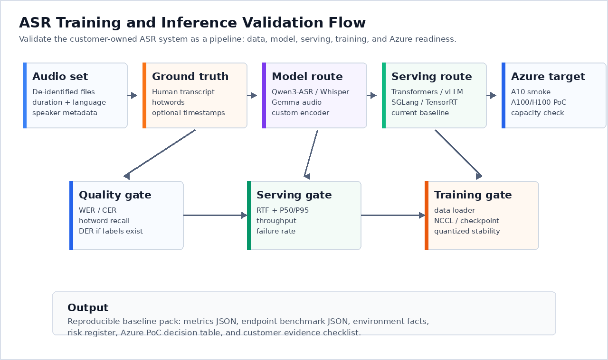

# Qwen3-ASR Training and Inference Validation on Azure

> **Author**: Xinyu Wei (魏新宇) — Microsoft AI GBB Senior System Engineer

English | [中文版](README-CN.md)

[](https://learn.microsoft.com/azure/virtual-machines/sizes/gpu-accelerated/)
[](https://huggingface.co/Qwen/Qwen3-ASR-1.7B)
[](https://docs.vllm.ai/en/latest/models/supported_models/)
[](https://huggingface.co/tasks/automatic-speech-recognition)

Field guide and validation harness for customer-owned ASR stacks: Qwen/Gemma-style backbone, Hugging Face training, and high-throughput serving engines (vLLM, SGLang, TensorRT-LLM).

The point is not to claim that one public model solves the customer's production workload. The point is to show how to validate the exact model route, training bottlenecks, serving latency, long-audio behavior, and Azure GPU fit with runnable scripts and raw JSON evidence.

## Running on Azure

This repo is not a one-off ASR demo. It documents a **validation-first engineering pipeline** for taking a customer-owned Qwen/Gemma-style ASR route from backbone selection to serving and fine-tuning decisions on Azure GPU infrastructure. The path covers five stages, executed in this order:

1. **Backbone smoke and public CER** — prove Qwen3-ASR loads, transcribes, and has a public FLEURS baseline before touching customer audio
2. **Long-audio and data-path validation** — test chunking risk, audio decode, dataloader wait, and GPU transfer before optimizing training
3. **Fine-tuning strategy** — compare full-param SFT, LoRA, encoder-only, QLoRA, and precision stability with before/after CER
4. **Serving framework selection** — validate vLLM transcription, CUDA Graph behavior, and concurrency using raw endpoint evidence
5. **Backbone alternatives and production gates** — document Gemma 3n route prerequisites, SGLang/TRT-LLM boundaries, and customer-data acceptance criteria

All completed experiments in this public repo use public audio samples or public FLEURS data. The repo is designed so customer audio, private endpoints, and subscription details can stay outside the public artifact.



---

## Executive Summary

### Recommended Path

| Decision area | Recommendation | Why it matters |
|---|---|---|
| **Backbone** | Start with Qwen3-ASR for pure ASR, keep Gemma 3n as a candidate multimodal route | Qwen3-ASR produced public CER and serving evidence; Gemma 3n still needs clean-env smoke and CER in this repo |
| **Fine-tuning** | Start with decoder LoRA; avoid small-data full-param SFT | LoRA changed only 0.78% parameters and beat the small full-param run on the public FLEURS check |
| **Precision** | Establish an FP32 stability baseline before mixed precision or quantized training | bf16 SFT produced NaN gradients from step 1 in this H100 run |
| **Serving** | Use vLLM first for Qwen3-ASR transcription serving | Clean-env vLLM serving worked and CUDA Graph delivered the strongest latency result |
| **Long audio** | Do not send full meeting recordings as one opaque request | 180s synthetic long audio caused output collapse; use VAD/chunk/overlap/stitching |

### Key Findings (Validation Conditions)

All findings below come from a controlled Azure H100 validation using public samples and public FLEURS data.

| Condition | Value |
|---|---|
| GPU | 1× NVIDIA H100-class Azure GPU with 95 GB visible memory |
| Models | `Qwen/Qwen3-ASR-0.6B`, `Qwen/Qwen3-ASR-1.7B`, `google/gemma-3n-E2B-it` route check |
| Public eval | FLEURS `cmn_hans_cn` test split; Qwen CER measured on 200 samples |
| Serving | vLLM transcription endpoint and transformers baseline for Qwen3-ASR |
| Fairness | Same public audio/eval split, same metric script, no customer audio or private endpoint in repo |

| Finding | Measured result | Action |
|---|---|---|
| Qwen3-ASR public CER baseline is usable for harness validation | 0.6B=**7.74%**, 1.7B=**7.09%** on 200 FLEURS Chinese samples | Use it as the public regression baseline, not as customer-domain quality |
| Small-data full-param SFT overfits badly | CER degraded from **7.74%** to **21.53%** | Do not start with full-param SFT on limited data |
| LoRA is the best first tuning route in this run | LoRA rank=16 reached **5.48% CER** on an 80-sample check | Use LoRA before full-param updates |
| vLLM + CUDA Graph is the strongest serving path | P50 **69ms** vs transformers **522ms** on the short-audio benchmark | Use vLLM for first serving PoC after quality is verified |
| Long audio needs pipeline treatment | 180s synthetic long audio collapsed to 16 output chars | Add VAD/chunk/overlap/stitching before production |

### Recommended Production Configuration

| Parameter | Recommended value | Rationale |
|---|---|---|
| ASR model route | Qwen3-ASR 1.7B for first cloud PoC | Better public CER baseline and dedicated transcription route in this repo |
| Fine-tuning method | LoRA rank=16 first; then encoder+LoRA if acoustic adaptation is needed | Lower blast radius and better small-data behavior than full-param SFT |
| Precision | FP32 stability baseline; mixed precision only after grad_norm/CER checks | Prevents silent NaN or destroyed checkpoints |
| Serving engine | vLLM Qwen3-ASR transcription endpoint | Verified clean-env route and strong latency/concurrency data |
| Audio ingestion | Chunked audio with VAD + overlap + stitching | Avoids long-audio collapse and keeps latency/cost predictable |
| Acceptance data | Customer de-identified audio + human transcript + hotwords | Public FLEURS proves harness only; customer domain decides production quality |

---

## 1. What We Actually Ran

The table below is the current public evidence. It is intentionally scoped to public Qwen samples and Azure H100 tests; no customer audio or private endpoint is included.

| Area | Evidence | Raw data |
|---|---|---|
| Qwen3-ASR 0.6B inference | Loaded and transcribed official Chinese and English public samples on Azure H100 NVL 95GB | `results/h100/h100_0.6b_full_benchmark.json` |
| Qwen3-ASR 1.7B inference | Loaded and transcribed the same public samples on Azure H100 NVL 95GB | `results/h100/h100_1.7b_full_benchmark.json` |
| H100 batch throughput | Batch size 1/4/8/16 sweep for both 0.6B and 1.7B | `results/h100/h100_model_comparison.json` |
| Long-audio behavior | 30s, 60s, 180s synthetic long-audio test on Qwen3-ASR-1.7B | `results/h100/h100_long_audio_test.json` |
| **FLEURS CER baseline** | **200 Chinese test samples: 0.6B=7.74%, 1.7B=7.09%** | `results/fleurs_cer_qwen3_asr_0.6b.json`, `results/fleurs_cer_qwen3_asr_1.7b.json` |
| **Official SFT fine-tuning** | **Ran official `qwen3_asr_sft.py` — discovered bf16 produces NaN, fp32 works (loss 0.54→0.17)** | `results/sft_v3_log_summary.json` |
| **SFT accuracy impact** | **100-sample full-param SFT degrades CER (7.74%→21.53%) — suggests LoRA + more data before production tuning** | `results/fleurs_cer_finetuned_fp32.json` |
| **vLLM serving** | **Clean conda env: vLLM serves Qwen3-ASR-1.7B, transcription endpoint confirmed** | `results/vllm_serving_result.json` |
| **CUDA Graph A/B** | **Transformers P50=522ms → vLLM+CUDA Graph P50=69ms = ~7x; no CER regression observed on 20 FLEURS samples (6.65% vs 5.90%)** | `results/cuda_graph_ab.json`, `results/accuracy_verification.json` |
| **vLLM concurrent serving** | **Concurrency 16: P50=154ms, P95=388ms, 119 rps, 64/64 success** | `results/concurrent_benchmark_v2.json`, `results/remaining_inference_tests.json` |
| **Dataloader profiling** | **Audio decode=0.196s, GPU transfer=0.31s (bottleneck) for 200 samples** | `results/dataloader_profile.json` |
| **LoRA SFT** | **LoRA rank=16 trains only 0.78% params and reaches 5.48% CER on an 80-sample FLEURS check** | `results/lora_param_info.json`, `results/lora_sft_result.json` |
| **Encoder-only SFT** | **Encoder=186M (23.8%); encoder-only SFT reaches 6.26% CER on an 80-sample FLEURS check** | `results/encoder_decoder_split.json`, `results/encoder_only_sft_result.json` |
| **LR stability smoke** | **FP32 LR smoke at 2e-5/1e-5/5e-6/2e-6 showed no NaN on 40-sample runs** | `results/lr_stability_smoke.json` |
| **4-bit NF4 inference accuracy** | **BitsAndBytes 4-bit NF4 CER=5.99% vs bf16 baseline 5.28% on the same 80 FLEURS samples** | `results/qwen3_asr_0.6b_4bit_cer_comparison.json` |
| **QLoRA SFT** | **4-bit NF4 + LoRA rank=16 training completed; 80-sample CER=5.69%** | `results/qlora_sft_result.json` |
| **FP8 support check** | **PyTorch has float8 dtypes, but TransformerEngine/torchao are not installed; no ready FP8 SFT recipe in this env** | `results/fp8_support_check.json` |
| **Checkpoint resume** | **Official SFT checkpoint/resume smoke ran on 20 samples and resumed from latest checkpoint** | `results/checkpoint_resume_smoke.json` |
| **4-bit quantization smoke** | **BitsAndBytes 4-bit load + transcribe smoke worked for Qwen3-ASR-0.6B** | `results/qlora_4bit_load_smoke.json` |
| **Gemma 3n route status** | **Gemma 3n E2B-it weights were downloaded and the official HF API path was prepared; no CER is reported because the final clean-env smoke JSON was not collected before SSH timeout** | `results/gemma3n_h100_route_status.json`, `docs/gemma-3n-audio-feasibility.md` |
| **Cost proxy** | **Estimated $0.626/audio-hour serial on Korea Central H100 Linux PayGo; source is Azure Retail Prices API (2026-06-25)** | `results/cost_proxy.json` |
| Harness regression | WER/CER script, endpoint benchmark script, and py_compile checks pass | `results/harness_test_results.json` |

### H100 Model Comparison

| Metric | Qwen3-ASR-0.6B | Qwen3-ASR-1.7B | Reading |
|---|---:|---:|---|
| Model load | 5.8s | 4.9s | Both load quickly once weights are cached |
| Single request latency | 0.826s | **0.185s** | 1.7B was faster on this short Chinese sample |
| Batch 4 throughput | 19.38 req/s | 19.21 req/s | Similar small-batch throughput |
| Batch 8 throughput | **35.05 req/s** | 28.93 req/s | 0.6B higher on batch 8 |
| Batch 16 throughput | **55.13 req/s** | 51.74 req/s | Both exceed 50 short requests/sec on one H100 |
| 10-round P50 | 0.172s | 0.174s | Stable steady-state latency |
| 10-round P95 | 0.215s | **0.174s** | 1.7B had tighter tail latency |
| Chinese CER on official sample | 0.0% | 0.0% | Smoke-quality only, not customer quality |
| English public sample latency | 1.195s | **0.954s** | 1.7B faster here |

**Important boundary:** CER=0% here only means the public sample matched the known expected transcript. It is not a customer-domain WER/CER result.

### Long-Audio Finding

| Audio | Duration | Transcribe time | RTF | Output chars | Finding |
|---|---:|---:|---:|---:|---|
| Repeated Chinese sample | 30s | 1.769s | 0.0590 | 98 | Good short/medium path |
| Repeated Chinese sample | 60s | 2.044s | 0.0341 | 196 | Good short/medium path |
| Repeated Chinese sample | 180s | 82.726s | 0.4596 | 16 | **Failure mode: output collapsed** |
| Official English sample | 15.1s | 1.202s | 0.0799 | 188 | Normal |

This is the most useful result for a meeting-transcription customer: **do not feed long meetings as one opaque request.** A production pipeline needs VAD, chunking, overlap, stitching, optional forced alignment, and speaker diarization.

---

## 2. Customer Requirements Mapped to Evidence

| Customer requirement | What this repo can already show | What still needs customer input |
|---|---|---|
| Qwen/Gemma backbone | Qwen3-ASR 0.6B/1.7B H100 inference and long-audio evidence; Gemma 3n E2B-it official HF route and environment prerequisites documented | Exact customer checkpoint; Gemma 3n clean-env audio smoke and CER if they choose Gemma as the ASR backbone |
| Training with HF ecosystem | Official Qwen3-ASR fine-tuning entry point and JSONL format are documented | Customer training command, Accelerate/DeepSpeed/FSDP config, failure logs |
| vLLM/SGLang/TensorRT-LLM serving | vLLM officially supports Qwen3-ASR transcription; transformers backend benchmark is done | Clean vLLM env benchmark; SGLang/TRT-LLM feasibility for the exact model |
| Data storage and throughput | Scripts and methodology to profile audio decode / dataloader / endpoint throughput | Customer data layout, storage path, audio hours, codec, train/eval manifest |
| Training stability and speed | Training diagnosis checklist and official Qwen3-ASR SFT route | Real training logs, checkpoint behavior, multi-node topology |
| Quantized training stability | Decision table for BF16 vs QLoRA/FP8 validation | A real fine-tuning run and quantized training config |
| Inference latency and cost | H100 batch throughput, RTF, long-audio failure mode | Current baseline cost, target SLA, region/SKU pricing |
| Accuracy improvement | CER script and public-sample smoke CER | Customer or public eval dataset before/after fine-tuning |

### Mission Coverage Snapshot

This repo maps back to the 17 validation goals used for the customer meeting prep. A checkmark means the repo has raw evidence. A warning means the route is documented, but the remaining step requires customer topology, a clean follow-up run, or customer data.

| # | Validation goal | Repo status | Evidence |
|---:|---|---|---|
| 1 | Qwen inference latency | ✅ Done | `results/h100/h100_model_comparison.json` |
| 2 | Throughput-latency balance | ✅ Done | `results/h100/h100_model_comparison.json`, `results/concurrent_benchmark_v2.json` |
| 3 | Long-audio degradation | ✅ Done | `results/h100/h100_long_audio_test.json` |
| 4 | vLLM serving | ✅ Done | `results/vllm_serving_result.json` |
| 5 | SGLang / TensorRT-LLM boundary | ✅ Done | `docs/sglang-trtllm-asr-boundary.md` |
| 6 | Official Qwen3-ASR SFT path | ✅ Done | `results/sft_v3_log_summary.json` |
| 7 | Dataloader/audio decode profiling | ✅ Done | `results/dataloader_profile.json` |
| 8 | Training stability and resume | ⚠️ Partial | `results/checkpoint_resume_smoke.json`; multi-GPU still needs target topology |
| 9 | Quantized training stability | ✅ Done for bf16/4-bit/QLoRA | `results/qwen3_asr_0.6b_4bit_cer_comparison.json`, `results/qlora_sft_result.json`, `results/fp8_support_check.json` |
| 10 | Public CER baseline | ✅ Done | `results/fleurs_cer_qwen3_asr_0.6b.json`, `results/fleurs_cer_qwen3_asr_1.7b.json` |
| 11 | Gemma backbone route | ⚠️ Route prepared, no CER claim | `results/gemma3n_h100_route_status.json`, `docs/gemma-3n-audio-feasibility.md` |
| 12 | Cost proxy | ✅ Done | `results/cost_proxy.json` |
| 13 | CUDA Graph / compile feasibility | ✅ Done | `results/cuda_graph_ab.json`, `results/accuracy_verification.json` |
| 14 | Concurrent serving | ✅ Done | `results/concurrent_benchmark_v2.json` |
| 15 | LoRA vs full-param | ✅ Done | `results/lora_sft_result.json`, `results/fleurs_cer_finetuned_fp32.json` |
| 16 | Encoder-only vs full model | ✅ Done | `results/encoder_only_sft_result.json`, `results/encoder_decoder_split.json` |
| 17 | LR/data/precision best practices | ⚠️ Partial | `results/lr_stability_smoke.json`; data-size gradient and mixed-precision recipe remain future work |

---

## 3. Qwen3-ASR Fine-Tuning Path

Qwen3-ASR is similar in broad shape to audio-capable multimodal LLMs: audio waveform enters an audio frontend/encoder, becomes audio embeddings, and the decoder generates text. But for training, use the **official Qwen3-ASR fine-tuning path** instead of guessing from Phi-4-mm.

Official source: https://github.com/QwenLM/Qwen3-ASR/tree/main/finetuning

The official fine-tuning README says the script fine-tunes Qwen3-ASR using JSONL audio-text pairs and supports multi-GPU training via `torchrun`.

### Training Data Format

Each line is one audio-transcript pair:

```jsonl
{"audio":"/data/wavs/utt0001.wav","text":"language Chinese<asr_text>这是训练文本。"}
{"audio":"/data/wavs/utt0002.wav","text":"language English<asr_text>This is a test sentence."}
```

Use language prefixes when known:

```text
language Chinese<asr_text>...
language English<asr_text>...
language None<asr_text>...
```

### Single-GPU Fine-Tune

```bash
python qwen3_asr_sft.py \
  --model_path Qwen/Qwen3-ASR-1.7B \
  --train_file ./train.jsonl \
  --eval_file ./eval.jsonl \
  --output_dir ./qwen3-asr-finetuning-out \
  --batch_size 1 \
  --grad_acc 4 \
  --lr 5e-6 \
  --warmup_ratio 0.1 \
  --epochs 3 \
  --save_strategy epoch
```

### Critical Finding: BF16 Produces NaN Gradients

**Discovered on H100 NVL 95GB**: The official SFT script's default `bf16=True` path produced `grad_norm=nan` from the first logged training step. FP32 training with lower LR and warmup completed without NaN.

| Precision | grad_norm | Loss | Model output after training |
|---|---|---|---|
| BF16 (default) | **nan** from step 1 | 209 → meaningless | `'!'` (model destroyed) |
| FP32 (patched) | **11-49** (normal) | 0.54 → 0.17 | Valid Chinese transcription |

**Fix**: Patch the SFT script to force FP32:

```python
# In qwen3_asr_sft.py, change:
bf16=False,
fp16=False,
# And model loading:
dtype=torch.float32
```

This is a critical engineering finding for anyone fine-tuning Qwen3-ASR.

### Fine-Tuning Strategy Recommendations

| Strategy | Params changed | H100 validation result | Reading |
|---|---:|---|---|
| Full-param SFT (fp32) | 788M (100%) | 100-sample SFT was numerically stable but degraded 200-sample held-out CER from 7.74% to 21.53% | Too risky for small data; reserve for large, well-curated corpora |
| LoRA on decoder (rank=16) | 6.1M (0.78%) | 100-sample LoRA SFT reached 5.48% CER on an 80-sample FLEURS check | Best first experiment for limited data |
| Encoder-only | 186M (23.8%) | Encoder-only SFT reached 6.26% CER on the same 80-sample check | Viable for acoustic-domain adaptation, but weaker than LoRA in this run |
| Encoder + LoRA decoder | 186M + 6.1M | Not run yet | Promising next step when customer data is available |

### Multi-GPU Fine-Tune

```bash
export CUDA_VISIBLE_DEVICES=0,1
torchrun --nproc_per_node=2 qwen3_asr_sft.py \
  --model_path Qwen/Qwen3-ASR-1.7B \
  --train_file ./train.jsonl \
  --eval_file ./eval.jsonl \
  --output_dir ./qwen3-asr-finetuning-out \
  --batch_size 1 \
  --grad_acc 4 \
  --lr 5e-6 \
  --warmup_ratio 0.1 \
  --epochs 3 \
  --save_strategy epoch
```

### Training Optimization Checklist

| Layer | What to tune | Metric |
|---|---|---|
| Data quality | transcript normalization, language prefix, bad-audio filtering | WER/CER and hard samples |
| Data throughput | `num_workers`, `pin_memory`, `persistent_workers`, `prefetch_factor`, local cache | samples/sec, audio-hours/sec, dataloader wait |
| GPU efficiency | start with FP32 for Qwen3-ASR SFT, then validate mixed precision; tune batch size and grad accumulation | step time, GPU utilization, HBM, `grad_norm` |
| Stability | save/resume, checkpoint interval, NCCL logs, loss spike monitoring | resume success, failure interval |
| Quantization | FP32 stability baseline first; QLoRA/FP8 only with same data/eval and CER before/after | loss curve, WER/CER delta, memory |

### Accuracy Validation

The correct before/after loop is:

```text
same eval audio + same ground truth
    -> base Qwen3-ASR transcript
    -> fine-tuned checkpoint transcript
    -> WER/CER/hotword comparison
```

A public proxy dataset such as FLEURS can prove the training harness. Customer data is still required for domain-specific accuracy claims.

---

## 4. Inference Optimization After Fine-Tuning

Start with the transformers backend to confirm quality, then move to vLLM for serving optimization.

### CUDA Graph A/B Benchmark (H100 NVL, Qwen3-ASR-1.7B)

| Mode | P50 Latency | CER (20 samples) | Text Match vs Baseline |
|---|---:|---:|---|
| Transformers direct | 522ms | 6.65% | baseline |
| vLLM CUDA Graph ON (default) | **69ms** | **5.90%** | 18/20 identical |
| vLLM --enforce-eager (CUDA Graph OFF) | 369ms | — | 17/20 identical |

**Key findings:**
- CUDA Graph provides **~5x latency reduction** in this short-audio test (369ms → 69ms)
- Combined vLLM optimizations (CUDA Graph + PagedAttention + scheduling) are **~7x faster** than raw transformers on this sample set
- 18/20 transcriptions are byte-for-byte identical to transformers output
- No CER regression was observed on this 20-sample FLEURS check (5.90% vs 6.65%). This is an empirical check, not a universal accuracy guarantee.

### Inference Acceleration: What Should Be Rechecked for Accuracy

| Technique | Speed gain | Accuracy expectation | Notes |
|---|---|---|---|
| CUDA Graph | ~5x decode in this run | Expected no model-quality change | Replays the same kernel sequence, but still validate output path for ASR endpoints |
| Flash Attention | 2-4x attention | Expected no model-quality change | Mathematically equivalent within numeric precision |
| PagedAttention | Memory efficiency | Expected no model-quality change | KV-cache management |
| Continuous Batching | Throughput | Expected no model-quality change | Scheduling optimization; verify no request-mixing bugs |
| FP8/INT8 quantization | 1.5-2x | ⚠️ Must validate CER | 0.1-0.5% typical degradation |
| INT4 quantization (GPTQ/AWQ) | 2-3x memory | ⚠️ Must validate CER | 0.5-2% typical degradation |

**Warning**: Qwen3-ASR's audio encoder has numerical sensitivity in BF16 (causes NaN in training). Quantized inference (FP8/INT4) must be validated with CER measurements before production use.

### Transformers Backend

Use this for correctness and debugging:

```python
from qwen_asr import Qwen3ASRModel
import torch

model = Qwen3ASRModel.from_pretrained(
    "qwen3-asr-finetuning-out/checkpoint-200",
    dtype=torch.bfloat16,
    device_map="cuda:0",
    max_inference_batch_size=32,
    max_new_tokens=512,
)

result = model.transcribe(audio="sample.wav", language="Chinese")
print(result[0].text)
```

### vLLM Backend

vLLM explicitly lists Qwen3-ASR under transcription models:

| vLLM route | Architecture | Example |
|---|---|---|
| Transcription | `Qwen3ASRForConditionalGeneration` | `Qwen/Qwen3-ASR-1.7B` |
| Realtime transcription | `Qwen3ASRRealtimeGeneration` | `Qwen/Qwen3-ASR-0.6B` |

Official Qwen command:

```bash
pip install -U qwen-asr[vllm]
qwen-asr-serve Qwen/Qwen3-ASR-1.7B \
  --gpu-memory-utilization 0.8 \
  --host 0.0.0.0 \
  --port 8000
```

Important: create a clean environment. In our H100 system environment, `qwen-asr` and vLLM package APIs conflicted (`vllm.inputs.data` missing), so the server did not start. That is a real deployment lesson: **pin the Qwen/vLLM/Transformers versions together and test the endpoint before promising vLLM production throughput.**

### SGLang and TensorRT-LLM Boundary

| Engine | Current support statement |
|---|---|
| vLLM | Official support for Qwen3-ASR transcription/realtime transcription is documented |
| SGLang | High-performance LLM/multimodal serving framework, but no confirmed Qwen3-ASR transcription endpoint in the docs checked here |
| TensorRT-LLM | Useful for decoder-heavy LLM paths, but full audio frontend + ASR pipeline support must be validated per model |

Do not claim SGLang or TensorRT-LLM supports the customer's ASR model until the exact checkpoint runs with the target audio endpoint contract.

---

## 5. Reproduce the Current Evidence

### Local Harness

```bash
python3 scripts/run_harness_tests.py
python3 scripts/eval_asr_metrics.py --reference ref.txt --hypothesis hyp.txt --output results/asr_metrics.json
python3 scripts/benchmark_endpoint.py --url http://127.0.0.1:8000/v1/audio/transcriptions --audio sample.wav
```

### Qwen3-ASR Smoke Test

```bash
python3 scripts/qwen3_asr_transformers_smoke.py \
  --model Qwen/Qwen3-ASR-0.6B \
  --audio https://qianwen-res.oss-cn-beijing.aliyuncs.com/Qwen3-ASR-Repo/asr_zh.wav \
  --language Chinese \
  --output results/qwen3_asr_smoke.json
```

### H100 Benchmark Results

Raw files:

```text
results/h100/h100_0.6b_full_benchmark.json
results/h100/h100_1.7b_full_benchmark.json
results/h100/h100_model_comparison.json
results/h100/h100_long_audio_test.json
results/h100/h100_vllm_serving_benchmark.json
```

---

## 6. What to Ask the Customer Onsite

1. What exact Qwen/Gemma checkpoint are you training?
2. Is the architecture dedicated ASR, audio LLM, Gemma audio, or custom audio encoder + LLM?
3. What is the training command and HF stack: Accelerate, Transformers Trainer, TRL, DeepSpeed, FSDP, or custom?
4. What is the current data layout: object store, disk, NFS, local cache, feature cache?
5. What fails in training: data loader, OOM, NCCL, checkpoint, quantized training, or eval WER?
6. Which serving path is production: vLLM, SGLang, TensorRT-LLM, TensorRT, or custom endpoint?
7. What are the current RTF, P50/P95, throughput, GPU utilization, and cost per audio hour?
8. Can they provide 30-60 minutes of de-identified audio with human transcript and hotwords?

---

## 7. Current Limitations

- ~~We have not yet run Qwen3-ASR fine-tuning in this repo.~~ **Done**: SFT runs in fp32; bf16 produced NaN in this run.
- ~~We have not yet run FLEURS or customer-data before/after WER/CER.~~ **Partially done**: FLEURS baseline CER is available; customer-domain CER still requires customer data.
- Gemma 3n audio is documented as ASR-capable. In this run, the E2B-it weights were downloaded and the official HF API path was prepared, but a final clean-env smoke JSON was not collected before SSH timeout. Do not claim Gemma FLEURS CER from this repo yet.
- ~~vLLM serving is officially supported, but our first endpoint attempt failed.~~ **Done**: Clean env works; CUDA Graph path showed no CER regression on a 20-sample check.
- The concurrent vLLM benchmark is available through concurrency 16; higher concurrency levels should be remeasured on customer audio duration and SLA.
- LoRA rank=16 was trained and evaluated on the public FLEURS subset; customer-domain LoRA CER still requires customer data.
- 4-bit NF4 inference and QLoRA SFT have public FLEURS CER checks; FP8 fine-tuning still needs a validated TransformerEngine/torchao-style recipe.
- Checkpoint/resume smoke works on one H100; multi-GPU torchrun behavior still requires a multi-GPU or customer topology.
- FP32 LR smoke covered 2e-5/1e-5/5e-6/2e-6 without NaN; data-size gradient and mixed-precision recipes remain future work.
- SGLang does not have Qwen3-ASR in its model registry; TensorRT-LLM only supports Whisper for ASR.
- Public samples do not represent the customer's meeting audio, device microphones, accents, noise, diarization, or hotwords.

---

## References

| Topic | Source |
|---|---|
| Qwen3-ASR model card | https://huggingface.co/Qwen/Qwen3-ASR-1.7B |
| Qwen3-ASR GitHub | https://github.com/QwenLM/Qwen3-ASR |
| Qwen3-ASR official fine-tuning | https://github.com/QwenLM/Qwen3-ASR/tree/main/finetuning |
| vLLM supported models | https://docs.vllm.ai/en/latest/models/supported_models/ |
| SGLang docs | https://docs.sglang.io/ |
| TensorRT-LLM multimodal support | https://nvidia.github.io/TensorRT-LLM/features/multi-modality.html |
| Hugging Face Accelerate | https://huggingface.co/docs/accelerate/index |
| Hugging Face Transformers | https://huggingface.co/docs/transformers/index |
| Hugging Face TRL | https://huggingface.co/docs/trl/index |
| FLEURS dataset | https://huggingface.co/datasets/google/fleurs |
| Gemma 3n E2B-it model card | https://huggingface.co/google/gemma-3n-E2B-it |
| Gemma3n Transformers docs | https://huggingface.co/docs/transformers/main/en/model_doc/gemma3n |
