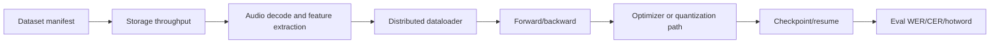

# Qwen3-ASR Training and Inference Validation on Azure

[](https://learn.microsoft.com/azure/virtual-machines/sizes/gpu-accelerated/)
[](https://huggingface.co/tasks/automatic-speech-recognition)
[](https://huggingface.co/Qwen/Qwen3-ASR-1.7B)
[](https://docs.vllm.ai/en/latest/models/supported_models/)
[](https://www.python.org/)

A production-oriented ASR engineering guide for customer-owned speech-to-text systems: audio in, transcript out, with a reproducible path for validating model route, fine-tuning practice, serving framework behavior, long-audio pipeline design, and Azure GPU readiness.

> **Author**: Xinyu Wei (Wei Xinyu) - Microsoft AI and Apps Global Black Belt (GBB) Senior System Engineer

English | [中文版](README-CN.md)

## Running on Azure

This repo is not a single-shot demo. It is a **validation-first engineering pipeline** for teams building their own ASR model with Qwen/Gemma-style backbones, Hugging Face training tools, and high-performance serving engines such as vLLM, SGLang, TensorRT-LLM, TensorRT, or CTranslate2.

The path covers six stages, executed in this order:

1. **Model-route classification** - identify whether the checkpoint is dedicated ASR, audio LLM, omni multimodal, Gemma audio, Whisper-style, or custom audio encoder plus LLM.
2. **Evaluation set freeze** - collect de-identified audio, human transcript, hotwords, language metadata, and optional speaker labels.
3. **Runtime smoke** - prove the package, model, CUDA stack, and short-audio inference path load on an Azure GPU.
4. **Quality gate** - compute WER, CER, hotword recall, timestamp quality, and speaker metrics only when ground truth exists.
5. **Serving gate** - measure RTF, P50/P95, concurrency, success rate, and audio-hours per GPU-hour with the same model and audio set.
6. **Training gate** - diagnose data loading, audio decode, distributed runtime, checkpoint/resume, and quantized training stability separately from serving.

All public artifacts in this repo are intentionally based on public samples or synthetic harness tests. No private customer audio, endpoint, transcript, VM name, IP address, subscription ID, or credential is included.

<div align="center">
  
</div>

---

## Executive Summary

Most ASR architecture discussions fail because they mix model quality, training stability, serving latency, and long-audio product behavior into one vague question: "Which model or engine should we use?" That is the wrong starting point.

For a self-owned ASR system, the right first step is to turn the discussion into a repeatable validation harness:

| Decision area | Recommended first move | Why it matters |
|---|---|---|
| **Model route** | Identify the exact architecture and checkpoint before discussing vLLM/SGLang/TRT-LLM | Serving support depends on architecture, not just the model family name. |
| **Quality** | Freeze a small customer evaluation set with human ground truth | WER/CER cannot be claimed from audio alone. |
| **Long audio** | Build VAD/chunk/overlap/stitching before benchmarking meeting recordings | A short sample smoke test does not prove long meeting behavior. |
| **Serving** | Benchmark the same endpoint contract across frameworks | RTF, P50/P95, and failure rate must be measured under identical input and concurrency. |
| **Training** | Profile data, distributed runtime, checkpoint, and optimizer separately | Low GPU utilization is often data/audio decode, not model compute. |
| **Azure PoC** | Start with smoke on a smaller GPU, then scale to A100/H100 after model route and target metrics are fixed | Prevents capacity and cost discussions from outrunning evidence. |

### Key Findings From the Public Harness

| Finding | Evidence | What it proves | What it does not prove |
|---|---|---|---|
| Qwen3-ASR 0.6B short-sample path ran through the transformers backend | `results/qwen3_asr_0_6b_official_sample_v2.json` | Python package, model load, GPU runtime, and a public short Chinese sample path worked | No customer WER/CER, no long-audio claim, no production SLA |
| Three repeated public-sample runs produced one unique transcript | `results/qwen3_asr_official_multiround_summary.json` | Basic short-sample repeatability for this public sample | No accuracy conclusion without a reference transcript beyond the sample expectation |
| Local quality metric script catches exact, substitution, and insertion cases | `results/harness_test_results.json` | WER/CER/hotword recall implementation has deterministic regression coverage | It does not replace a customer-labeled validation set |
| Endpoint benchmark script measures success, failure, latency, and RTF | `results/benchmark_endpoint_mock_success.json`, `results/benchmark_endpoint_mock_failure.json` | The harness can measure any HTTP ASR endpoint contract | Mock latency is not model latency |
| vLLM has a dedicated transcription category including Qwen3-ASR | `docs/vllm-asr-support-matrix.md`, vLLM supported-model docs | vLLM is relevant to ASR when the target architecture is supported | A modified customer checkpoint still requires runtime validation |

> Measurement note: the public results are **smoke and harness validation results**, not customer benchmark results. The production benchmark begins only after the customer supplies de-identified audio, ground truth, model checkpoint or endpoint, and serving/training configs.

### Recommended First PoC Shape

| PoC item | Minimum input | Output artifact |
|---|---|---|
| ASR quality baseline | 30-60 minutes of de-identified audio + human transcript | `results/asr_metrics_customer_baseline.json` |
| Hotword evaluation | Domain hotword list + transcript | Hotword recall table |
| Serving benchmark | One current endpoint + one Azure endpoint candidate | RTF/P50/P95/concurrency JSON |
| Training diagnosis | Training command, Accelerate/DeepSpeed/FSDP config, representative logs | Data/runtime/checkpoint/optimizer blocker map |
| Azure capacity check | Region, GPU count, timeline, subscription context | Capacity plan and risk register |

---

## 1. Background

### 1.1 What Qwen3-ASR Officially Claims

The Qwen3-ASR model card states that "The Qwen3-ASR family includes Qwen3-ASR-1.7B and Qwen3-ASR-0.6B, which support language identification and ASR for 52 languages and dialects" and that the project releases "a powerful, full-featured inference framework that supports vLLM-based batch inference, asynchronous serving, streaming inference, timestamp prediction, and more." Source: https://huggingface.co/Qwen/Qwen3-ASR-1.7B, accessed 2026-06-24.

This matters for a customer ASR discussion because Qwen3-ASR is not only a text LLM used for speech tasks. It has a dedicated ASR route, a Qwen3-ForcedAligner route for timestamp alignment, and both transformers and vLLM backend paths in the official package.

### 1.2 What vLLM Actually Adds

vLLM is an inference and serving engine, not a speech model. The vLLM supported-model documentation lists transcription models under "Speech2Text models trained specifically for Automatic Speech Recognition" and includes `Qwen3ASRForConditionalGeneration` with example `Qwen/Qwen3-ASR-1.7B`. It also lists realtime transcription with `Qwen3ASRRealtimeGeneration` for `Qwen/Qwen3-ASR-0.6B`. Source: https://docs.vllm.ai/en/latest/models/supported_models/, accessed 2026-06-24.

The engineering implication is narrow and important:

- If the customer uses an unmodified supported architecture, vLLM is a realistic serving candidate.
- If the customer modifies the model code, config, tokenizer, audio frontend, or generation contract, support must be revalidated.
- If the customer uses vLLM through the Transformers modeling backend, output and performance still need controlled comparison against the native transformers path.

### 1.3 Why This Is Not a Generic Speech API Comparison

A self-owned ASR project has different failure modes from a managed speech API:

| Layer | Example question | Failure mode |
|---|---|---|
| Model route | Is this Qwen3-ASR, Qwen2-Audio, Gemma 3n, Whisper, or custom? | Wrong serving engine or wrong tokenizer/audio frontend assumption |
| Data pipeline | Where are audio files stored and decoded? | GPU idle while CPU/storage/audio decode is saturated |
| Training | Is the issue OOM, NCCL, checkpoint, loss spike, or quantized training? | Treating all failures as "more GPU needed" |
| Serving | Is bottleneck prefill, decode, audio frontend, batch scheduler, or post-processing? | Comparing frameworks with different inputs or parameters |
| Product pipeline | Does the system need VAD, diarization, timestamps, hotwords, formatting? | Short audio works, meeting audio fails |

### 1.4 Model Route Taxonomy

The model name alone is not enough. The route determines training, serving, and evaluation.

| Route | Examples | What to validate first |
|---|---|---|
| Dedicated ASR | Qwen3-ASR, Whisper, FunASR, SenseVoice | Transcription API, timestamp support, language coverage, long-audio behavior |
| Audio LLM | Qwen2-Audio, Phi-4 multimodal audio, Kimi-Audio | Whether ASR is the primary task or only one audio-understanding mode |
| Omni multimodal | Qwen2.5-Omni, Qwen3-Omni | Whether omni features justify extra model complexity for ASR |
| Gemma audio route | Gemma 3n E2B/E4B | Lightweight or device-oriented route; validate vLLM/version caveats |
| Whisper-style production route | Whisper, faster-whisper/CTranslate2, WhisperX | Strong baseline; validate hotwords, diarization, and language mix |
| Custom audio encoder + LLM | Customer-owned architecture | Requires code/config inspection before serving claims |

### 1.5 Azure GPU Positioning

Azure GPU sizing should not be discussed as a static table of SKUs. For ASR, the right GPU depends on model route, batch size, precision, audio duration, serving target, training method, and whether multi-node distributed training is required.

Microsoft Learn describes the ND H100 v5 series as "designed for high-end Deep Learning training and tightly coupled scale-up and scale-out Generative AI and HPC workloads." A single VM has eight NVIDIA H100 80GB GPUs, 96 vCPUs, 1900 GiB memory, and 3.2 Tbps interconnect bandwidth per VM. Source: https://learn.microsoft.com/en-us/azure/virtual-machines/sizes/gpu-accelerated/ndh100v5-series, accessed 2026-06-24.

Use that information as a capacity discussion starting point, not as a promise. Region, quota, allocation, timeline, and cost must be checked for the target subscription.

---

## 2. Methodology

### 2.1 Evidence Levels

This repo separates what has already been tested from what must be tested with customer data.

| Level | Meaning | Example in this repo |
|---|---|---|
| L0 | Script regression only | Mock endpoint success/failure tests |
| L1 | Public model smoke | Qwen3-ASR 0.6B official short sample |
| L2 | Customer data quality | Requires customer audio + ground truth |
| L3 | Customer serving benchmark | Requires endpoint/serving command and controlled input set |
| L4 | Customer training diagnosis | Requires training config, logs, data pipeline facts |
| L5 | Production readiness | Requires repeated runs, failure drills, monitoring, capacity/cost validation |

Do not treat L0/L1 as if they were L3/L5. That is the main guardrail of this repo.

### 2.2 Validation Gates

<div align="center">
  
</div>

| Gate | Pass condition | Evidence file or command |
|---|---|---|
| Q0 runtime smoke | Model loads and transcribes a short public sample | `scripts/qwen3_asr_transformers_smoke.py` |
| Q1 quality | WER/CER/hotword recall computed against ground truth | `scripts/eval_asr_metrics.py` |
| Q2 long audio | Chunked output is stitched and evaluated end to end | Customer audio manifest + pipeline output |
| Q3 serving | RTF/P50/P95/concurrency/failure rate measured | `scripts/benchmark_endpoint.py` |
| Q4 training | Data, runtime, checkpoint, optimizer issues separated | `scripts/collect_training_env.py` + customer logs |

### 2.3 ASR Quality Metrics

| Metric | Definition | When to use |
|---|---|---|
| WER | Edit distance over word tokens divided by reference word count | English and space-tokenized languages |
| CER | Edit distance over characters divided by reference character count | Chinese and mixed CJK transcripts |
| Hotword recall | Expected hotwords present in reference and found in hypothesis | Product names, medical terms, insurance terms, meeting-specific vocabulary |
| Timestamp error | Absolute difference between predicted and reference boundaries | Subtitle, meeting review, search indexing |
| DER | Diarization error rate | Multi-speaker meetings when speaker labels exist |

Quality metrics require human ground truth. Without a reference transcript, the correct statement is: "we can run smoke and serving tests, but cannot claim WER/CER."

### 2.4 Serving Metrics

| Metric | Definition | Why it matters |
|---|---|---|
| RTF | Processing seconds / audio seconds | RTF < 1 means faster than realtime for one stream |
| P50/P95 latency | Median/tail request latency | P95 is what users feel during load |
| Audio-hours per GPU-hour | Total audio seconds processed / GPU wall time | Cost proxy for batch transcription |
| Success rate | HTTP 2xx or framework success / total requests | Serving stability under concurrency |
| GPU utilization | SM/memory utilization | Low utilization can indicate CPU/data/audio frontend bottleneck |
| Peak HBM | Maximum GPU memory | Determines batch size and model fit |

### 2.5 Fairness Controls

Every serving comparison should control the following variables:

| Variable | Required control |
|---|---|
| Audio set | Same files, same duration distribution, same sample rate |
| Model checkpoint | Same checkpoint or clearly separated route |
| Decoding | Same language hints, max tokens, beam/temperature, timestamp options |
| Pipeline | Same VAD/chunking/stitching and post-processing |
| Hardware | Same GPU SKU, driver, CUDA, PyTorch, framework version |
| Load shape | Same concurrency, request order, warm-up policy |
| Output parser | Same transcript extraction and failure handling |

If one variable changes, mark the comparison as directional rather than final.

### 2.6 Long-Audio Pipeline

Long meeting audio should not be treated as one opaque model request. A production-grade ASR path normally needs:

```mermaid
flowchart LR
    A[Raw audio] --> B[Normalize 16 kHz mono]
    B --> C[VAD]
    C --> D[Chunk with overlap]
    D --> E[ASR inference]
    E --> F[Timestamp or forced alignment]
    F --> G[Speaker diarization]
    G --> H[Hotword correction]
    H --> I[Punctuation and formatting]
    I --> J[Segment stitching]
    J --> K[Downstream product]
```



Chunking is not just a workaround for max context length. It is how you manage memory, tail latency, diarization boundaries, timestamp alignment, and retry behavior.

### 2.7 Training Diagnosis Shape



When training is unstable, do not jump directly to "need more GPU." First determine which segment is failing.

---

## 3. Public Evidence Pack

### 3.1 Runtime Smoke: Qwen3-ASR 0.6B Official Sample

| Item | Value |
|---|---|
| Model | `Qwen/Qwen3-ASR-0.6B` |
| Backend | qwen-asr transformers backend |
| Audio | Public Qwen sample URL |
| Language hint | Chinese |
| Load time | 1.90 seconds |
| Transcribe time | 2.74 seconds |
| Output | `甚至出现交易几乎停滞的情况。` |
| Evidence | `results/qwen3_asr_0_6b_official_sample_v2.json` |

This proves the public short-sample runtime path. It does not prove customer quality, long-audio stability, or serving scalability.

### 3.2 Multi-Round Repeatability Smoke

| Metric | Value |
|---|---:|
| Rounds | 3 |
| Mean transcribe time | 2.488 seconds |
| Min / max transcribe time | 2.024 / 2.954 seconds |
| Unique transcripts | 1 |
| Output | `甚至出现交易几乎停滞的情况。` |

Evidence files:

- `results/multiround/qwen3_asr_official_round1.json`
- `results/multiround/qwen3_asr_official_round2.json`
- `results/multiround/qwen3_asr_official_round3.json`
- `results/qwen3_asr_official_multiround_summary.json`

### 3.3 Local Harness Regression

| Test case | Expected behavior | Observed result |
|---|---|---|
| Exact transcript | WER = 0, CER = 0 | PASS |
| Substitution | WER/CER increase and hotword recall can drop | PASS |
| Insertion | WER/CER increase | PASS |
| Mock endpoint 200 | Count as success and compute latency/RTF | PASS |
| Mock endpoint 503 | Count as failure | PASS |

The regression file is `results/harness_test_results.json`. These tests exist so that the metric and benchmark scripts can be trusted before they are pointed at customer endpoints.

### 3.4 Mock Endpoint Interpretation

Mock endpoint results are script tests only.

| Result | Correct interpretation | Incorrect interpretation |
|---|---|---|
| HTTP 200 mock success | Multipart request, latency timer, summary JSON, and success accounting work | The ASR model is fast |
| HTTP 503 mock failure | Failure accounting and error capture work | The customer endpoint is unreliable |
| RTF from mock | Formula and output schema work | Production cost estimate |

### 3.5 Public Evidence vs Customer Evidence

| Evidence item | Public repo status | Customer benchmark requirement |
|---|---|---|
| Short Qwen sample | Included | Replace or supplement with customer representative samples |
| Ground truth | Not included | Human transcript required |
| Long meeting audio | Not included | 30-60 min de-identified meeting sample required |
| Production endpoint | Not included | Current endpoint and candidate endpoint required |
| Training logs | Not included | Failure logs and configs required |
| GPU cost | Not included | Region, SKU, quota, utilization, and pricing check required |

---

## 4. Model Route and Fine-Tuning Strategy

### 4.1 Route Classification Checklist

Ask for these artifacts before recommending model or serving changes:

| Artifact | Why it matters |
|---|---|
| Exact base checkpoint | Determines architecture and serving support |
| `config.json` | Shows architectures, audio frontend, tokenizer, remote code |
| Training command | Reveals Accelerate/DeepSpeed/FSDP/TRL route |
| Fine-tuning method | LoRA, QLoRA, full SFT, DPO/GRPO, GPTQ/AWQ, FP8 are different problems |
| Evaluation script | Shows whether quality is measured as WER/CER/hotword/DER or only manual review |
| Serving command | Reveals framework, precision, batching, parallelism, and endpoint contract |

### 4.2 Training Stack Positioning

Hugging Face Accelerate describes itself as enabling "the same PyTorch code to be run across any distributed configuration" and mentions DeepSpeed, FSDP, and mixed precision support. Source: https://huggingface.co/docs/accelerate/index, accessed 2026-06-24.

That is useful because customer training issues should be mapped to layers:

| Layer | Common symptom | Evidence to request |
|---|---|---|
| Data/storage | GPU utilization low, step time unstable | Storage path, dataloader workers, audio decode timing |
| Distributed runtime | NCCL errors, rank hangs, uneven GPU utilization | Accelerate/DeepSpeed/FSDP config, NCCL logs |
| Memory | OOM, fragmentation, batch-size collapse | GPU memory trace, precision, sequence length, checkpointing |
| Optimizer/quantization | Loss spike, quality regression after quantized training | LoRA/QLoRA/GPTQ/AWQ/FP8 config, eval output |
| Checkpoint | Slow save/resume, corrupted state, lost progress | Checkpoint size, save frequency, storage throughput |

### 4.3 Quantized Training Decision Table

| Term customer may use | Clarifying question | Validation path |
|---|---|---|
| QLoRA | Is the base loaded in 4-bit and adapters trained? | Compare WER/CER and loss against non-quantized LoRA on same eval set |
| LoRA | Which modules are targeted? | Check target module list, rank, alpha, dropout, merge path |
| GPTQ/AWQ | Is this post-training quantization for inference, or used in training discussion? | Validate accuracy before/after quantized serving |
| FP8 | Is it training, serving, or checkpoint format? | Check hardware, framework support, and quality regression |
| INT8/INT4 | Is it activation, weight-only, or KV cache quantization? | Separate latency/memory gains from WER/CER impact |

### 4.4 When to Fine-Tune

Fine-tuning should follow error analysis, not intuition.

| Error pattern | Likely next action |
|---|---|
| Hotwords missing but base transcript mostly correct | Add hotword correction, contextual biasing, or small domain SFT |
| Domain terms systematically mistranscribed | Build domain eval set and fine-tune or adapt decoder/language layer |
| Speaker turns wrong | Add diarization/segmentation pipeline before model fine-tune |
| Long audio truncates or repeats | Fix VAD/chunk/stitching before model training |
| Quality drops only under serving engine | Compare transformers vs serving engine with identical decoding |
| Training loss unstable | Diagnose data/runtime/optimizer first |

---

## 5. Serving Engine Selection

### 5.1 Framework Roles

| Framework | Role in ASR discussion | What to validate |
|---|---|---|
| vLLM | OpenAI-compatible serving and supported ASR/audio model execution | Architecture support, endpoint contract, RTF/P95, batch behavior |
| SGLang | High-throughput LLM/multimodal serving | Whether target audio model is supported and output matches baseline |
| TensorRT | Optimized encoder/decoder graph path | Exportability, accuracy parity, plugin coverage |
| TensorRT-LLM | Decoder-oriented LLM optimization | Whether audio/multimodal components fit the engine path |
| faster-whisper/CTranslate2 | Whisper-family production ASR baseline | Strong baseline for cost/latency/quality comparison |

### 5.2 Serving Benchmark Protocol

A fair serving benchmark should run at least:

| Sweep | Values | Output |
|---|---|---|
| Concurrency | 1, 2, 4, 8, 16, 32 if endpoint supports it | P50/P95, RTF, success rate |
| Audio duration | short, medium, long | Tail behavior and chunking pressure |
| Language | representative language mix | CER/WER differences by language |
| Hotword density | low/high | Domain vocabulary stability |
| Warm-up | discard first run | Avoid cold-start/kernel-cache distortion |

Use `scripts/benchmark_endpoint.py` as the generic HTTP harness. If the endpoint follows OpenAI transcription API exactly, use the default multipart `file` field. If not, set `--field-name` and `--header` to match the customer endpoint.

### 5.3 Endpoint Contract Matters

Do not compare engines if the endpoint contract differs.

| Contract dimension | Must be aligned |
|---|---|
| Input form | raw file vs URL vs base64 vs streaming chunks |
| Audio preprocessing | sample rate, channel count, codec |
| Request format | `/v1/audio/transcriptions`, `/v1/chat/completions`, custom route |
| Output extraction | `text`, chat message content, JSON wrapper, streaming events |
| Language hint | fixed language, auto-detect, prompt hint |
| Timestamp mode | enabled/disabled, aligner model |

### 5.4 Cost Proxy

Until pricing and utilization are known, use cost proxy instead of final cost:

```text
audio_hours_per_gpu_hour = total_audio_seconds_processed / wall_seconds / 3600 * 3600
cost_per_audio_hour = gpu_hour_price / audio_hours_per_gpu_hour
```

This is intentionally a proxy. Final cost requires region-specific VM price, utilization, autoscaling behavior, storage/network cost, and operational overhead.

---

## 6. Azure PoC Plan

### 6.1 Phased Azure Path

| Phase | Goal | Recommended GPU class | Exit criteria |
|---|---|---|---|
| A0 | Package/model smoke | A10-class GPU | Model loads, short sample transcribes, scripts pass |
| A1 | Customer quality baseline | A10/A100 depending on model size | WER/CER/hotword computed on frozen eval set |
| A2 | Serving benchmark | A100/H100 candidate | RTF/P50/P95/concurrency measured against current baseline |
| A3 | Training diagnosis | A100/H100 multi-GPU if needed | Bottleneck map and stable training run/restart proof |
| A4 | Production sizing | Target production SKU | Capacity, cost, monitoring, and rollback plan complete |

### 6.2 GPU SKU Discussion Guardrails

| SKU family | Useful discussion | Guardrail |
|---|---|---|
| A10 class | Smoke, package validation, smaller checkpoints | Not a final training-size promise |
| A100 40GB/80GB | Multi-GPU training and larger serving tests | Check quota, region, and memory fit |
| H100 80GB | High-throughput training/serving, FP8 exploration | Capacity and cost must be verified |
| CPU/storage | Data pipeline, decode, feature extraction | GPU upgrade will not fix storage bottlenecks |

### 6.3 Data and Storage Questions

ASR training can be storage and preprocessing bound. Ask:

| Question | Why |
|---|---|
| How many audio hours are in the training set? | Drives storage, epoch time, and eval sampling |
| What codec/sample rate/channel layout is stored? | Decode and resampling cost can dominate |
| Where is data stored? | Blob, disk, NFS, object store, local NVMe have different throughput profiles |
| Is feature extraction cached? | Recomputing features can waste GPU time |
| How are transcripts and speaker labels versioned? | Label drift invalidates benchmark comparisons |

---

## 7. Reproducing the Harness

### 7.1 Prerequisites

```bash
python3 --version
ffmpeg -version
pip install -r requirements.txt
```

The core harness has zero mandatory third-party Python dependencies. `ffmpeg`/`ffprobe` is required by `benchmark_endpoint.py` to measure audio duration.

### 7.2 Run Local Regression Tests

```bash
python3 scripts/run_harness_tests.py
```

Outputs:

```text
results/harness_test_results.json
results/benchmark_endpoint_mock_success.json
results/benchmark_endpoint_mock_failure.json
```

### 7.3 Evaluate ASR Quality

```bash
python3 scripts/eval_asr_metrics.py \
  --reference ref.txt \
  --hypothesis hyp.txt \
  --hotwords hotwords.txt \
  --output results/asr_metrics.json
```

### 7.4 Benchmark an Endpoint

```bash
python3 scripts/benchmark_endpoint.py \
  --url http://127.0.0.1:8000/v1/audio/transcriptions \
  --audio sample1.wav sample2.wav \
  --concurrency 4 \
  --output results/endpoint_benchmark.json
```

### 7.5 Collect Training Environment Facts

```bash
python3 scripts/collect_training_env.py --output results/training_env.json
```

### 7.6 Run Qwen3-ASR Smoke Test

```bash
python3 scripts/qwen3_asr_transformers_smoke.py \
  --model Qwen/Qwen3-ASR-0.6B \
  --audio https://qianwen-res.oss-cn-beijing.aliyuncs.com/Qwen3-ASR-Repo/asr_zh.wav \
  --language Chinese \
  --output results/qwen3_asr_smoke.json
```

Install optional GPU dependencies before running the smoke test. See `requirements.txt` comments.

### 7.7 Script Inventory

| Script | Purpose | Required external service |
|---|---|---|
| `scripts/eval_asr_metrics.py` | Compute WER/CER/hotword recall from text files | None |
| `scripts/benchmark_endpoint.py` | Measure latency/RTF/success rate for HTTP ASR endpoints | Target endpoint |
| `scripts/collect_training_env.py` | Collect system, GPU, CUDA, PyTorch, HF package facts | None |
| `scripts/qwen3_asr_transformers_smoke.py` | Run Qwen3-ASR transformers-backend smoke test | GPU + model download |
| `scripts/run_harness_tests.py` | Run deterministic local regression tests | None |

---

## 8. Customer Discovery Checklist

Use these questions in the first technical meeting.

### 8.1 Model and Data

1. What is the exact base model and checkpoint path?
2. Is it dedicated ASR, audio LLM, omni multimodal, or custom audio encoder plus LLM?
3. How many training hours and evaluation hours exist?
4. Which languages, dialects, accents, and noise conditions matter?
5. Is there human ground truth for the evaluation set?
6. Are speaker labels, timestamps, and hotword lists available?

### 8.2 Training

1. Are you using Accelerate + DeepSpeed, Accelerate + FSDP, raw DDP, or another launcher?
2. What is the largest stable run so far?
3. Where does failure occur: OOM, NCCL, data loader, checkpoint, optimizer, quantization, or loss quality?
4. What is GPU utilization during training?
5. How long does checkpoint save/resume take?

### 8.3 Serving

1. Which engine is production and which is PoC?
2. What is the endpoint contract?
3. What is the current RTF, P50/P95, concurrency, and success rate?
4. What is the current GPU utilization and peak memory?
5. Do long audio requests use chunking/VAD/overlap/stitching?
6. Is speaker diarization inside the model, before ASR, or after ASR?

### 8.4 Azure

1. Which region and timeline are required?
2. How many GPUs are needed for first PoC vs production?
3. Is customer data allowed to move to Azure, or must the harness run in their environment?
4. What is the current cloud baseline and cost model?

---

## 9. Troubleshooting

| Symptom | Likely cause | Action |
|---|---|---|
| WER/CER cannot be computed | Missing ground truth | Ask for de-identified human transcript |
| Short sample works but meeting audio fails | Missing long-audio pipeline | Add VAD/chunk/overlap/stitching and evaluate end to end |
| vLLM import/runtime failure | Version or CUDA ABI mismatch | Use clean environment aligned with vLLM/Qwen docs |
| Qwen3-ASR import triggers vision dependency error | Torch/torchvision mismatch | Install matching wheels or official Docker image |
| Endpoint benchmark looks too fast | Mock endpoint does no ASR work | Treat mock as script validation only |
| GPU utilization low during training | Data or preprocessing bottleneck | Profile storage, dataloader, audio decode, feature extraction |
| Quantized path is faster but worse | Accuracy regression from quantization | Re-run WER/CER/hotword before accepting latency gain |
| Serving framework output differs from transformers output | Decoding/default config mismatch | Align language hints, max tokens, sampling, timestamp settings |

---

## 10. Data Files

| File | Description |
|---|---|
| `results/harness_test_results.json` | Local regression results for scripts |
| `results/qwen3_asr_0_6b_official_sample_v2.json` | Single public Qwen sample smoke test |
| `results/qwen3_asr_official_multiround_summary.json` | Three-round public sample summary |
| `results/multiround/*.json` | Individual public-sample round outputs |
| `results/benchmark_endpoint_mock_success.json` | Mock endpoint success output |
| `results/benchmark_endpoint_mock_failure.json` | Mock endpoint failure output |
| `docs/vllm-asr-support-matrix.md` | vLLM ASR/audio support matrix |
| `docs/benchmark-methodology.md` | Detailed benchmark method and fairness controls |
| `docs/azure-poc-plan.md` | Azure PoC phasing template |
| `docs/customer-discovery-checklist.md` | Meeting question checklist |
| `data/eval-manifest.example.json` | Example customer evaluation manifest schema |

---

## 11. Limitations

- This repo includes smoke tests and validation harnesses, not final production sizing.
- Public results use public samples and mock endpoints; customer data is intentionally excluded.
- No WER/CER quality claim is made without a ground-truth transcript.
- vLLM support matrix does not guarantee a customer-modified checkpoint will run unchanged.
- SGLang and TensorRT-LLM are discussed as serving/optimization frameworks, not benchmarked in this public artifact.
- Azure GPU capacity, cost, and regional availability must be checked for the target subscription and timeline.
- Long-audio behavior must be validated with a real chunking/VAD/stitching pipeline.

---

## Appendix A: Source-Backed Facts

| Fact | Source |
|---|---|
| Qwen3-ASR supports language identification and ASR for 52 languages/dialects | https://huggingface.co/Qwen/Qwen3-ASR-1.7B |
| Qwen3-ASR package provides transformers and vLLM backends | https://huggingface.co/Qwen/Qwen3-ASR-1.7B |
| vLLM lists `Qwen3ASRForConditionalGeneration` under transcription | https://docs.vllm.ai/en/latest/models/supported_models/ |
| vLLM lists `Qwen3ASRRealtimeGeneration` under realtime transcription | https://docs.vllm.ai/en/latest/models/supported_models/ |
| Accelerate can run the same PyTorch code across distributed configurations | https://huggingface.co/docs/accelerate/index |
| Azure ND H100 v5 is designed for high-end deep learning and tightly coupled scale-up/scale-out workloads | https://learn.microsoft.com/en-us/azure/virtual-machines/sizes/gpu-accelerated/ndh100v5-series |

---

## Appendix B: Minimum Customer Evidence Pack

```text
customer-evidence-pack/
├── audio/
│   ├── sample_001.wav
│   └── sample_002.wav
├── transcripts/
│   ├── sample_001.ref.txt
│   └── sample_002.ref.txt
├── hotwords.txt
├── eval-manifest.json
├── training/
│   ├── accelerate.yaml
│   ├── deepspeed.json
│   └── failure.log
└── serving/
    ├── current_start_command.txt
    ├── candidate_start_command.txt
    └── endpoint_contract.md
```

The harness can run inside the customer environment if audio cannot leave their boundary.

---

## References

| Topic | Reference |
|---|---|
| Qwen3-ASR | https://huggingface.co/Qwen/Qwen3-ASR-1.7B |
| Qwen3-ASR GitHub | https://github.com/QwenLM/Qwen3-ASR |
| vLLM supported models | https://docs.vllm.ai/en/latest/models/supported_models/ |
| vLLM speech-to-text API | https://docs.vllm.ai/en/latest/api/vllm/entrypoints/speech_to_text/ |
| SGLang | https://docs.sglang.io/ |
| TensorRT-LLM multimodal support | https://nvidia.github.io/TensorRT-LLM/features/multi-modality.html |
| Hugging Face Accelerate | https://huggingface.co/docs/accelerate/index |
| Hugging Face Transformers | https://huggingface.co/docs/transformers/index |
| Hugging Face TRL | https://huggingface.co/docs/trl/index |
| Whisper | https://github.com/openai/whisper |
| faster-whisper | https://github.com/SYSTRAN/faster-whisper |
| WhisperX | https://github.com/m-bain/whisperX |
| FunASR | https://github.com/modelscope/FunASR |
| SenseVoice | https://github.com/FunAudioLLM/SenseVoice |
| NeMo | https://github.com/NVIDIA-NeMo/NeMo |
| Azure ND-H100-v5 | https://learn.microsoft.com/en-us/azure/virtual-machines/sizes/gpu-accelerated/ndh100v5-series |

