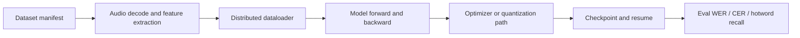

# Qwen3-ASR Training and Inference Validation on Azure

   

A field guide and validation harness for customer-facing ASR engineering discussions: how to separate model choice, fine-tuning practice, serving framework selection, and long-audio pipeline design when building a self-owned speech-to-text system with Qwen/Gemma-style backbones.

> Author: Wei Xinyu (Xinyu Wei), Microsoft AI and Apps Global Black Belt (GBB) Senior System Engineer

English | [中文版](README-CN.md)

## Executive Summary

The most common mistake in ASR architecture conversations is to mix four different layers:

| Layer | What it is | Customer question | Engineering answer |
|---|---|---|---|
| ASR model | Qwen3-ASR, Whisper, FunASR, SenseVoice | Which backbone should we fine-tune? | First identify the exact checkpoint and evaluation set. |
| Training stack | Transformers, Accelerate, TRL, DeepSpeed/FSDP | How do we train reliably and faster? | Profile data, distributed runtime, checkpoints, and quality metrics separately. |
| Serving engine | vLLM, SGLang, TensorRT-LLM, CTranslate2 | Can this reduce latency and cost? | Only if the ASR/audio model is supported and the pipeline is benchmarked. |
| Speech pipeline | VAD, chunking, diarization, hotwords, stitching | How do we handle real meetings? | Long audio should be chunked and evaluated end to end, not sent as one opaque request. |

This repo provides a compact validation harness rather than a fixed production architecture. It is designed to answer three practical questions:

1. Can the selected ASR model run on an Azure GPU VM?
2. Can we measure quality and serving behavior with repeatable scripts?
3. What information must the customer provide before we recommend training or inference changes?

## Best-Practice Validation Pattern

Use this shape for a customer PoC:

```text
1. Identify exact model route
   - Qwen3-ASR / Whisper / FunASR / Qwen2-Audio / Gemma 3n / custom

2. Freeze a small evaluation set
   - de-identified audio sample
   - human ground-truth transcript
   - optional hotword list and speaker labels

3. Run baselines
   - current production ASR route
   - public model smoke test if relevant
   - Azure GPU runtime check

4. Measure quality and serving
   - WER, CER, hotword recall
   - RTF, P50/P95 latency, concurrency, GPU utilization

5. Diagnose training separately
   - data loading, audio decode, feature extraction
   - distributed runtime, checkpoint, resume, NCCL/OOM

6. Choose optimization only after evidence
   - vLLM / SGLang / TensorRT-LLM / TensorRT / CTranslate2
```

## Scope Definition

| Item | In scope | Out of scope |
|---|---|---|
| Model route | Qwen3-ASR and other public ASR/audio model families | Claiming one model is best without customer data |
| Training | Practical questions for HF/Accelerate/TRL/DeepSpeed/FSDP | Running customer training without data/configs |
| Inference | Endpoint benchmarking and ASR serving support matrix | Production SLA or capacity guarantee |
| Azure | GPU smoke-test pattern and environment collector | Committing quota, region, price, or final sizing |
| Data | Public examples and bring-your-own de-identified audio | Private customer recordings or internal transcripts |

## Detailed Test Data

### 1. Qwen3-ASR Official Sample Multi-Round Smoke Test

Model: `Qwen/Qwen3-ASR-0.6B`

Input: public Qwen3-ASR Chinese sample from the Qwen model card.

| Metric | Value |
|---|---:|
| Rounds | 3 |
| Mean transcribe time | ~2.49 seconds |
| Min / max transcribe time | ~2.02s / ~2.95s |
| Unique transcripts | 1 |
| Output | `甚至出现交易几乎停滞的情况。` |

Evidence files:

- `results/multiround/qwen3_asr_official_round1.json`
- `results/multiround/qwen3_asr_official_round2.json`
- `results/multiround/qwen3_asr_official_round3.json`
- `results/qwen3_asr_official_multiround_summary.json`

Interpretation: the model, package, GPU runtime, and basic transcription path are functional for a short public sample. This is a smoke test, not a production benchmark.

### 2. Local Harness Regression Tests

| Test | Result | Evidence |
|---|---|---|
| Python syntax check | PASS | `python3 -m py_compile scripts/*.py` |
| Exact transcript case | PASS | WER/CER both zero |
| Substitution case | PASS | WER/CER increase as expected |
| Insertion case | PASS | WER/CER increase as expected |
| Endpoint mock success | PASS | HTTP 200 counted as success |
| Endpoint mock failure | PASS | HTTP 503 counted as failure |

Evidence files:

- `results/harness_test_results.json`
- `results/benchmark_endpoint_mock_success.json`
- `results/benchmark_endpoint_mock_failure.json`

## Test Methodology

### Metrics

| Metric | Definition | Use |
|---|---|---|
| WER | Word error rate | English/tokenized transcript quality |
| CER | Character error rate | Chinese transcript quality |
| Hotword recall | Domain terms retained in the hypothesis | Medical, insurance, product, or customer vocabulary |
| RTF | Transcribe seconds / audio seconds | ASR serving speed |
| P50/P95 latency | Request latency distribution | User-facing SLA and tail behavior |
| audio-hours/GPU-hour | Audio duration processed per GPU wall time | Cost proxy |
| GPU utilization | SM/memory utilization | Bottleneck diagnosis |

### Recommended ASR Pipeline

```mermaid
flowchart LR
      A[Raw audio] --> B[Normalize and resample]
      B --> C[VAD]
      C --> D[Chunk with overlap]
      D --> E[ASR model inference]
      E --> F[Timestamp or forced alignment]
      F --> G[Speaker diarization]
      G --> H[Hotword correction]
      H --> I[Punctuation and formatting]
      I --> J[Segment stitching]
      J --> K[Downstream app]
```



### Training Diagnosis Shape



## Inference Framework Positioning

vLLM, SGLang, and TensorRT-LLM are not speech models. They are serving or inference optimization frameworks. They matter only after the ASR/audio model route is known.

| Framework | Good fit | Caution |
|---|---|---|
| vLLM | Supported ASR/audio models such as Qwen3-ASR, Whisper, FunASR, Gemma 3n | Customer-modified checkpoints still need runtime validation |
| SGLang | High-throughput and low-latency LLM/multimodal serving | Not automatically an ASR stack |
| TensorRT | Optimizing exportable encoder/decoder graphs | Requires model export and accuracy validation |
| TensorRT-LLM | LLM decoder / multimodal LLM inference optimization | Not the default route for every ASR model |
| faster-whisper / CTranslate2 | Whisper-style production ASR baseline | Model-family specific |

See [docs/vllm-asr-support-matrix.md](docs/vllm-asr-support-matrix.md) for the vLLM ASR model support table.

## Running On Azure

The validation pattern was exercised on an Azure GPU VM with an NVIDIA A10-class GPU. The public repo intentionally omits VM names, IP addresses, subscription IDs, and credentials.

Recommended GPU selection process:

1. Start with a small A10-class smoke test for model load and short audio.
2. Move to A100/H100 only after model route, batch size, precision, and target latency are known.
3. Do not promise region capacity until quota and allocation are checked in the target subscription.
4. Record driver, CUDA, PyTorch, Transformers, and serving framework versions for every run.

## Reproducing

### Prerequisites

```bash
python3 --version
ffmpeg -version
pip install -r requirements.txt
```

### Run Local Harness Tests

```bash
python3 scripts/run_harness_tests.py
```

Outputs:

```text
results/harness_test_results.json
results/benchmark_endpoint_mock_success.json
results/benchmark_endpoint_mock_failure.json
```

### Evaluate ASR Metrics

```bash
python3 scripts/eval_asr_metrics.py \
  --reference ref.txt \
  --hypothesis hyp.txt \
  --hotwords hotwords.txt \
  --output results/asr_metrics.json
```

### Benchmark An ASR Endpoint

```bash
python3 scripts/benchmark_endpoint.py \
  --url http://127.0.0.1:8000/v1/audio/transcriptions \
  --audio sample.mp3 \
  --concurrency 1 \
  --output results/endpoint_benchmark.json
```

### Collect Training Environment Facts

```bash
python3 scripts/collect_training_env.py --output results/training_env.json
```

### Run Qwen3-ASR Smoke Test

```bash
python3 scripts/qwen3_asr_transformers_smoke.py \
  --model Qwen/Qwen3-ASR-0.6B \
  --audio https://qianwen-res.oss-cn-beijing.aliyuncs.com/Qwen3-ASR-Repo/asr_zh.wav \
  --language Chinese \
  --output results/qwen3_asr_smoke.json
```

## Data Files

| File | Description |
|---|---|
| `results/harness_test_results.json` | Local script regression tests |
| `results/qwen3_asr_0_6b_official_sample_v2.json` | Single public Qwen sample smoke test |
| `results/qwen3_asr_official_multiround_summary.json` | Official sample multi-round summary |
| `results/multiround/*.json` | Individual official-sample multi-round outputs |
| `docs/vllm-asr-support-matrix.md` | vLLM ASR model support matrix |
| `data/sample-audio/README.md` | Public data policy and BYO audio guidance |

## Troubleshooting

| Symptom | Likely cause | Action |
|---|---|---|
| WER/CER cannot be computed | Missing ground truth | Ask for de-identified human transcript |
| Long audio output truncates | Single-shot request is too long for the pipeline | Use VAD/chunking/overlap/stitching |
| vLLM import/runtime failure | Version or CUDA ABI mismatch | Use a clean environment aligned with vLLM docs |
| Qwen3-ASR import failure via vision dependencies | Torch/torchvision mismatch | Install matching wheels or use the official Docker image |
| Endpoint benchmark looks too fast | Mock endpoint does no ASR work | Treat mock as script validation only |
| GPU utilization is low during training | Data or preprocessing bottleneck | Profile dataloader, audio decode, feature extraction, and storage |

## Limitations

- This repo includes smoke tests and validation harnesses, not final production sizing.
- Public results use public samples and mock endpoints; customer data is intentionally excluded.
- No WER/CER quality claim is made without a ground-truth transcript.
- vLLM support matrix does not guarantee a customer-modified checkpoint will run unchanged.
- SGLang and TensorRT-LLM are discussed as serving/optimization frameworks, not as speech models.
- Azure GPU capacity, cost, and region availability must be checked for the target subscription and timeline.

## References

| Topic | Reference |
|---|---|
| Qwen3-ASR | https://huggingface.co/Qwen/Qwen3-ASR-1.7B |
| Qwen3-ASR GitHub | https://github.com/QwenLM/Qwen3-ASR |
| vLLM supported models | https://docs.vllm.ai/en/latest/models/supported_models/ |
| SGLang | https://docs.sglang.io/ |
| TensorRT-LLM multimodal support | https://nvidia.github.io/TensorRT-LLM/features/multi-modality.html |
| Whisper | https://github.com/openai/whisper |
| faster-whisper | https://github.com/SYSTRAN/faster-whisper |
| WhisperX | https://github.com/m-bain/whisperX |
| FunASR | https://github.com/modelscope/FunASR |
| SenseVoice | https://github.com/FunAudioLLM/SenseVoice |
| NeMo | https://github.com/NVIDIA-NeMo/NeMo |
