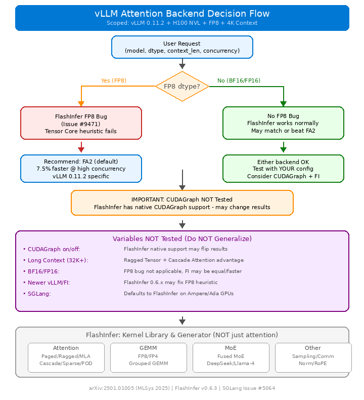
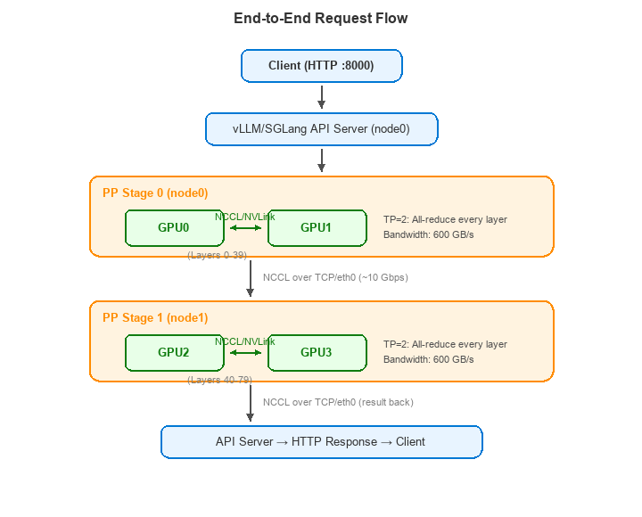

# Qwen3 Inference Benchmark on Azure H100

> **Author**: Xinyu Wei (魏新宇)  
> **Date**: 2026-02-06 (32B), 2026-02-11 (235B SGLang)  
> **Models**: Qwen3-32B-FP8 (Dense) | Qwen3-235B-A22B-FP8 (MoE)  
> **Hardware**: Azure NC40ads H100 v5 (1×H100 NVL) | NC80adis H100 v5 (2×H100 NVL per node)

---

## Table of Contents

- [Qwen3 Model Family Overview](#qwen3-model-family-overview)
- [Part 1: Single-GPU Dense Model (32B) — Attention Backend Benchmark](#part-1-single-gpu-dense-model-32b--attention-backend-benchmark)
- [Part 2: Multi-Node MoE Model (235B) — Inference Engine Benchmark](#part-2-multi-node-moe-model-235b--inference-engine-benchmark)
- [Hardware Specifications](#hardware-specifications)
- [Decision Matrix](#decision-matrix)
- [References](#references)

---

## Qwen3 Model Family Overview

Qwen3 is Alibaba's third-generation open-source LLM family, featuring both Dense and Mixture-of-Experts (MoE) architectures. This section provides a comprehensive inventory of all Qwen3 and Qwen3.5 models as of February 2026.

### Qwen3 (Released 2025-04, Updated 2025-07)

The initial Qwen3 release covers 8 model sizes spanning from edge devices to data-center-scale MoE:

| Model | Architecture | Total Params | Activated Params | Layers | Experts | Context |
|-------|:------------:|:------------:|:----------------:|:------:|:-------:|:-------:|
| Qwen3-0.6B | Dense | 0.6B | 0.6B | 28 | — | 32K |
| Qwen3-1.7B | Dense | 1.7B | 1.7B | 28 | — | 32K |
| Qwen3-4B | Dense | 4B | 4B | 36 | — | 32K |
| Qwen3-8B | Dense | 8B | 8B | 36 | — | 128K |
| Qwen3-14B | Dense | 14B | 14B | 40 | — | 128K |
| **Qwen3-32B** | **Dense** | **32B** | **32B** | **64** | **—** | **128K** |
| Qwen3-30B-A3B | MoE | 30B | 3B | 48 | 128/8 | 128K |
| **Qwen3-235B-A22B** | **MoE** | **235B** | **22B** | **94** | **128/8** | **128K** |

**Bold** = models tested in this benchmark.

**Available Variants per Model**:
- **Base** / **Instruct** — pre-trained vs instruction-tuned
- **2507** — July 2025 update with improved reasoning and instruction following
- **FP8** — W8A8 quantization for efficient deployment
- **GGUF** / **AWQ** / **GPTQ** — community quantization formats

### Qwen3.5 (Released 2026-02-16)

Qwen3.5 introduces significant architectural upgrades — most notably **75% Gated Deltanet linear attention** (replacing standard Softmax attention in 75% of layers), reducing KV cache memory from O(n) to O(1) for those layers.

| Model | Architecture | Total Params | Activated Params | Experts | Key Changes vs Qwen3 |
|-------|:------------:|:------------:|:----------------:|:-------:|:---------------------|
| Qwen3.5-27B | Dense | 27B | 27B | — | 75% linear attention, successor to 32B |
| Qwen3.5-35B-A3B | MoE | 35B | 3B | 256/8 | 256 experts (vs 128), linear attention |
| Qwen3.5-122B-A10B | MoE | 122B | 10B | 256/8 | New size tier, 256 experts |
| Qwen3.5-397B-A17B | MoE | 397B | 17B | 256/8 | Flagship, successor to 235B |

**Architecture Highlights**:
- **Gated Deltanet**: A linear attention variant using delta rule for memory update (instead of softmax). 75% of layers use this mechanism, reducing KV cache by ~75% with minimal quality loss.
- **256 Experts**: Doubled from Qwen3's 128 experts per MoE layer, with 8 activated per token.
- **Native Multimodal**: Qwen3.5 models natively support text, image, video, and audio (not tested in this benchmark).

### Generational Comparison

| Qwen3 | → | Qwen3.5 | Change |
|-------|---|---------|--------|
| 32B Dense | → | 27B Dense | 16% smaller, linear attention, similar quality |
| 235B-A22B MoE | → | 397B-A17B MoE | 1.7× total params, 23% less activation |
| 30B-A3B MoE | → | 35B-A3B MoE | Same activation budget, 256 experts |
| — | → | 122B-A10B MoE | New mid-tier size |

### Scope of This Benchmark

This benchmark tests **Qwen3** models on Azure H100 infrastructure:

| Part | Model | GPU Config | Focus |
|------|-------|-----------|-------|
| **Part 1** | Qwen3-32B-FP8 (Dense) | Single H100 NVL 94GB | Attention backend: FA2 vs FlashInfer |
| **Part 2** | Qwen3-235B-A22B-FP8 (MoE) | 4×H100 NVL (2 nodes) | Inference engine: vLLM V0/V1 vs SGLang |

> Qwen3.5 benchmarks are planned and will be added as Part 3.

---

## Part 1: Single-GPU Dense Model (32B) — Attention Backend Benchmark

> **Model**: Qwen3-32B-FP8 (FP8 E4M3, 32GB)  
> **GPU**: Azure NC40ads H100 v5 (Single H100 NVL 94GB)  
> **vLLM**: 0.11.2 | **Scenario**: (1024 input, 1024 output), Streaming mode

### Executive Summary



**Key Finding**: On vLLM 0.11.2 + H100 NVL + FP8 models, **FlashAttention 2 outperforms FlashInfer by 7.5%** at high concurrency.

> **Scope**: This conclusion is specific to **vLLM 0.11.2 + FlashInfer 0.5.2 + FP8 (E4M3) + short context (4K)** on H100. The root cause is a [known FlashInfer FP8 heuristic bug](https://github.com/vllm-project/vllm/issues/9471), which may be fixed in newer versions.

| Metric | FlashAttention 2 | FlashInfer | Delta |
|--------|:-----------------:|:----------:|:-----:|
| **Peak Throughput (C=512)** | **4,022.6 t/s** | 3,741.4 t/s | **FA2 +7.5%** |
| **TTFT @ C=512** | **1,116 ms** | 1,866 ms | **FA2 -40%** |
| Low Concurrency (1-128) | ~ | +1~3% | FlashInfer slightly faster |
| High Concurrency (256-512) | **+5~7%** | ~ | **FA2 significantly faster** |

### The Unfair Comparison Problem

A previous benchmark compared **different vLLM versions**, leading to incorrect conclusions:

| Config | vLLM Version | Backend | Peak Throughput |
|--------|:------------:|:-------:|:---------------:|
| Previous "Baseline" | 0.11.2 | FA2 | 3,907.8 t/s |
| Previous "Optimized" | **0.15.0** | FlashInfer | 4,531.3 t/s |
| Claimed Improvement | — | — | +16% |

The 16% improvement came from **vLLM version upgrade**, NOT the attention backend. After fixing to same vLLM 0.11.2:

| Config | Backend | Peak Throughput |
|--------|:-------:|:---------------:|
| FA2 | FLASH_ATTN | **4,022.6 t/s** |
| FlashInfer | FLASHINFER | 3,741.4 t/s |
| **Actual Delta** | — | **FA2 +7.5%** |

### What is FlashInfer?

**FlashInfer is NOT just an "attention backend"** — it is a comprehensive **kernel library and kernel generator** for LLM serving (paper: [arXiv:2501.01005](https://arxiv.org/abs/2501.01005), MLSys 2025):

| Category | Kernels |
|----------|---------|
| **Attention** | Paged, Ragged, MLA, Cascade, Sparse, POD Attention |
| **GEMM** | FP8/FP4 Grouped GEMM |
| **MoE** | Fused MoE (DeepSeek-V3/Llama-4 routing) |
| **Sampling** | Sorting-free top-k/top-p |
| **Comm** | AllReduce, MNNVL, NVSHMEM |
| **Normalization** | RMSNorm, LayerNorm, RoPE |

FlashInfer internally implements FlashAttention algorithm + PagedAttention memory management, plus JIT compilation for custom kernels. **SGLang defaults to FlashInfer on Ampere/Ada GPUs** (sm80/86/89), and to FA3 on Hopper (sm90).

### Root Cause: FlashInfer FP8 Tensor Core Heuristic Bug

Reference: [vLLM GitHub Issue #9471](https://github.com/vllm-project/vllm/issues/9471)

FlashInfer's `use_tensor_cores` heuristic fails with FP8:

```
FlashInfer Tensor Core Decision Logic:
if head_dim >= 128:
    use_tensor_cores = True       # Correct
else:
    # Heuristic based on FP16/BF16 profiling
    use_tensor_cores = (batch * heads) > threshold

    Problem: FP8 has different optimal threshold!
    Result: Falls back to CUDA cores instead of Tensor Cores
```

| Backend | Kernel Type | H100 TFLOPS (FP8) | Utilization |
|---------|:-----------:|:------------------:|:-----------:|
| FA2 | Always Tensor Core | 3,958 | ~85% |
| FlashInfer (FP8 bug) | Mixed CUDA+Tensor | 3,958 | ~70% |

Efficiency loss: `(85% - 70%) / 85% = 17.6%` theoretical → 7.5% observed (other optimizations compensate).

### Test Environment (Part 1)

| Component | Specification |
|-----------|:-------------:|
| **GPU** | NVIDIA H100 NVL 94GB HBM3 (Single Card) |
| **VM SKU** | Azure Standard_NC40ads_H100_v5 |
| **vCPU** | 40 cores |
| **RAM** | 320 GB |

| Software | Version |
|----------|:-------:|
| **vLLM** | 0.11.2 (Docker: `vllm/vllm-openai:v0.11.2`) |
| **CUDA** | 12.8 |
| **PyTorch** | 2.9.0+cu128 |
| **FlashAttention** | 2.8.3 (bundled) |
| **FlashInfer** | 0.5.2 (bundled) |

| Model Parameter | Value |
|-----------------|:-----:|
| **Model** | Qwen/Qwen3-32B-FP8 |
| **Precision** | FP8 (E4M3) |
| **max_model_len** | 4096 |
| **tensor_parallel_size** | 1 |
| **gpu_memory_utilization** | 0.95 |

### Why Docker Instead of pip install?

```bash
$ pip install vllm==0.11.2
ERROR: Cannot install vllm==0.11.2 because:
  huggingface_hub 0.32.0 requires transformers>=4.45.0
  but vllm 0.11.2 requires transformers==4.51.3
```

Docker image `vllm/vllm-openai:v0.11.2` has pre-locked dependencies — no conflicts.

### Benchmark Results (Part 1)

**Methodology**: 3 runs per configuration, report **median** values. Wait 30s warmup. Clear GPU memory between tests.

#### FlashAttention 2

| Concurrency | QPS | TTFT (ms) | Throughput (t/s) |
|:-----------:|:---:|:---------:|:----------------:|
| 1 | 0.08 | 26 | 55.7 |
| 4 | 0.27 | 37 | 195.2 |
| 8 | 0.45 | 41 | 344.4 |
| 16 | 0.80 | 46 | 600.7 |
| 32 | 1.51 | 52 | 1,096.6 |
| 64 | 2.70 | 63 | 1,889.7 |
| 128 | 4.21 | 102 | 2,759.9 |
| 256 | 5.45 | 145 | 3,607.2 |
| **512** | **6.22** | **1,116** | **4,022.6** |

#### FlashInfer

| Concurrency | QPS | TTFT (ms) | Throughput (t/s) |
|:-----------:|:---:|:---------:|:----------------:|
| 1 | 0.08 | 31 | 55.4 |
| 4 | 0.27 | 38 | 200.6 |
| 8 | 0.45 | 44 | 354.9 |
| 16 | 0.89 | 53 | 613.2 |
| 32 | 1.58 | 60 | 1,110.2 |
| 64 | 2.72 | 79 | 1,923.6 |
| 128 | 3.84 | 129 | 2,788.7 |
| 256 | 4.88 | 205 | 3,444.6 |
| **512** | **5.35** | **1,866** | **3,741.4** |

#### Side-by-Side Comparison

| Concurrency | FA2 (t/s) | FlashInfer (t/s) | Delta |
|:-----------:|:---------:|:----------------:|:-----:|
| 1-128 | ~ | ~ | ±3% |
| 256 | 3,607.2 | 3,444.6 | FA2 +4.7% |
| **512** | **4,022.6** | **3,741.4** | **FA2 +7.5%** |

### Limitations & Caveats (Part 1)

The above recommendation is **narrowly scoped**. Do NOT generalize:

| Variable NOT Tested | Why It Matters |
|---------------------|:---------------|
| **CUDAGraph** | FlashInfer has native CUDAGraph support; enabling it may change the outcome |
| **Longer Context (32K+)** | FlashInfer's Ragged Tensor + Cascade Attention may outperform FA2 |
| **BF16/FP16 Models** | The FP8 heuristic bug does NOT affect BF16/FP16 |
| **Newer Versions** | FlashInfer 0.6.x / vLLM 0.13+ may have fixed the issue |
| **SGLang** | SGLang defaults to FlashInfer on Ampere/Ada; different scheduling may yield different results |
| **MLA Models (DeepSeek)** | FlashInfer has specialized MLA kernel support not available in FA2 |

**Key Insight**: The 7.5% FA2 advantage comes from a **specific FP8 kernel selection bug** in FlashInfer 0.5.2, not from fundamental architectural superiority.

---

## Part 2: Multi-Node MoE Model (235B) — Inference Engine Benchmark

> **Model**: Qwen/Qwen3-235B-A22B-Instruct-2507-FP8 (235B MoE, 22B activated per token)  
> **Hardware**: 2× Azure NC80adis_H100_v5 (4× H100 NVL, 376GB VRAM total)  
> **Engines**: vLLM v0.11.2/v0.10.1 → **SGLang v0.5.8.post1** (current production)  
> **Features**: Function Calling, Reasoning Mode, Chunked Prefill

### Three-Engine Comparison

| Metric | SGLang v0.5.8 | vLLM V0 (v0.10.1) | vLLM V1 (v0.11.2) |
|--------|:-------------:|:------------------:|:------------------:|
| **Single-request TPS** | **70-75 t/s** | 6.8 t/s | 17 t/s |
| **Peak Throughput** | **1,320 t/s** @ C=128 | 304 t/s @ C=33 | 610 t/s @ C=64 |
| **TTFT (idle)** | 104-142 ms | 141-146 ms | 81-93 ms |
| **ITL (avg)** | **13.3 ms** | ~158 ms | ~57 ms |
| **PP>1 Stability** | ✅ Zero crashes | ✅ Zero crashes | ❌ Crashes in min~hours |
| **Function Calling** | ✅ 5/5 tests | ✅ Working | ✅ Working |
| **Max Tested Concurrency** | C=128 stable | C=91 stable | C=64 (C=128 crash) |

### Multi-Node Architecture: TP=2 + PP=2


| Parallelism | Communication | Bandwidth | Location |
|:-----------:|:-------------:|:---------:|:--------:|
| **Tensor Parallel (TP=2)** | All-reduce every layer | 600 GB/s NVLink | Intra-node |
| **Pipeline Parallel (PP=2)** | Point-to-point between stages | ~10 Gbps Ethernet | Inter-node |

**Why TP=2 + PP=2?**
- TP requires **all-reduce** after every layer → needs high bandwidth (NVLink within node)
- PP only requires **point-to-point** activation transfer → tolerates lower bandwidth (Ethernet across nodes)
- H100 NVL: 600 GB/s NVLink within node, ~10 Gbps Ethernet between nodes

### Software Stack & Communication

| Component | Role | Phase |
|-----------|:-----|:-----:|
| **vLLM/SGLang** | Inference engine + API server | All phases |
| **Ray** | Distributed process scheduler | Startup only |
| **NCCL** | GPU-to-GPU communication | Inference |
| **NVLink** | Physical interconnect (intra-node) | Inference |
| **TCP/eth0** | Physical interconnect (inter-node) | Inference |

**Key Insight**: NCCL handles ALL GPU communication (both intra-node and inter-node), but the underlying physical medium differs. Ray only places workers at startup — it does NOT transfer inference data.

### End-to-End Request Flow



### SGLang Benchmark (Current Production - 2026-02-11)

| Concurrency | Throughput (t/s) | TTFT (ms) | QPS |
|:-----------:|:----------------:|:---------:|:---:|
| 1 | 70.1 | 140 | 0.07 |
| 2 | 129.9 | 264 | 0.13 |
| 4 | 217.4 | 326 | 0.22 |
| 8 | 376.0 | 378 | 0.37 |
| 16 | 653.3 | 505 | 0.65 |
| 32 | 999.5 | 738 | 1.00 |
| 64 | 1,260.2 | 1,115 | 1.26 |
| **128** | **1,320.4** | 2,189 | **1.32** |

#### Stability Test (516 requests, zero failures)

| Concurrency | Requests | Completed | Failed | Throughput (t/s) |
|:-----------:|:--------:|:---------:|:------:|:----------------:|
| 1 | 10 | 10 | 0 | 37.2 |
| 4 | 10 | 10 | 0 | 117.6 |
| 8 | 16 | 16 | 0 | 228.5 |
| 16 | 32 | 32 | 0 | 388.6 |
| 32 | 64 | 64 | 0 | 637.2 |
| 64 | 128 | 128 | 0 | 836.7 |
| 128 | 256 | 256 | 0 | 975.4 |
| **Total** | **516** | **516** | **0** | — |

#### Function Calling Test (5/5 passed)

| Test Case | tool_choice | Expected | Result |
|-----------|:-----------:|:--------:|:------:|
| Weather query | auto | Tool call | ✅ `get_weather(city="Beijing")` |
| Weather query | **required** | Tool call | ✅ `get_weather(city="Shanghai")` |
| Math question | auto | No tool | ✅ Direct answer |
| Info search | specific | Specific tool | ✅ `search_database(query="AI agents")` |
| Weather (streaming) | required | Tool call (stream) | ✅ `get_weather(city="Tokyo")` |

#### ITL Precision Test

| Scenario | TTFT (ms) | ITL avg (ms) | ITL P50 (ms) | ITL P99 (ms) | TPS |
|----------|:---------:|:------------:|:------------:|:------------:|:---:|
| Short CN (128→512) | 110 | 13.2 | 13.2 | 13.5 | 74.8 |
| Medium EN (512→1024) | 141 | 13.3 | 13.3 | 13.8 | 72.9 |
| Long EN (1024→1024) | 131 | 13.3 | 13.3 | 13.7 | 73.6 |
| Long CN (1024→1024) | 142 | 13.2 | 13.2 | 13.6 | 74.1 |

**ITL is the key metric for end-user experience**. The original complaint (140s for 880 tokens) was caused by vLLM V0's ~158ms ITL. SGLang's 13.3ms ITL solves this: 880 × 13.3ms ≈ 11.8s.

#### Customer Real Load Test (SGLang, 1,196 Requests — 2026-02-11)

Production-scale load test by customer engineering team (11 min 22 sec session):

| Metric | Value |
|--------|:-----:|
| **Total Requests** | 1,196 |
| **Error Rate** | **0%** (all HTTP 200 OK) |
| **Test Duration** | 11 min 22 sec |
| **Concurrency Pattern** | Peak 5-7 requests/second |
| **Prompt Length** | ~1,000 to 6,144 tokens per request |

**SGLang Internal Metrics During Load**:

| Phase | Running Req | Queue Depth | KV Cache Usage | Gen Throughput (t/s) |
|:------|:-----------:|:-----------:|:--------------:|:--------------------:|
| Ramp-up | 1 | 0 | 0% | 0~66 |
| Warm-up | 15 | 0 | 27% | 49~358 |
| High Load | 20~28 | 25~48 | 90~97% | 61~190 |
| Peak Load | 19~42 | 20~65 | 93~98% | 52~168 |
| Drain | 1~16 | 0~21 | 3~96% | 45~433 |

**Key Observations**: KV cache peaked at 98%, max concurrent running 42 requests, max queue depth 65, zero errors despite near-saturation.

**Concurrency Guidelines Based on Load Test**:

| Scenario | Max Concurrent | Expected E2E Latency | KV Cache |
|----------|:--------------:|:--------------------:|:--------:|
| Low latency (interactive) | ≤5 | < 5s | < 30% |
| Balanced | 10~15 | 10~30s | 50~70% |
| Max throughput | 20~30 | 30~120s | 80~95% |
| Overload (observed) | 40+ | 100~140s | 95~98% |

### vLLM V1 Benchmark (v0.11.2 - Unstable)

| Concurrency | Run 1 (t/s) | Run 2 (t/s) | Variance | Status |
|:-----------:|:-----------:|:-----------:|:--------:|:------:|
| 1 | 17.2 | 17.2 | 0% | ✅ |
| 2 | 31.6 | 31.6 | 0% | ✅ |
| 4 | 50.7 | 56.5 | +11% | ✅ |
| 8 | 102.9 | 89.4 | -13% | ✅ |
| 16 | 171.1 | 170.3 | -0.5% | ✅ |
| 32 | 314.5 | 314.7 | +0.1% | ✅ |
| **64** | **553.0** | **610.4** | **+10%** | **Peak** |
| 128 | Crash | Stall | — | ❌ |

### vLLM V0 Benchmark (v0.10.1 - Stable Fallback)

V0 engine uses `RayGPUExecutor` (traditional Ray task scheduling), completely bypassing the compiled DAG code path that crashes V1:

#### Run 1 (Initial Test)

| Concurrency | QPS | TTFT (ms) | Avg Latency (s) | Throughput (t/s) |
|:-----------:|:---:|:---------:|:---------------:|:----------------:|
| 1 | 0.11 | 81 | 8.75 | 17.2 |
| 2 | 0.21 | 108 | 8.66 | 31.6 |
| 4 | 0.37 | 115 | 9.38 | 50.7 |
| 8 | 0.70 | 131 | 8.52 | 102.9 |
| 16 | 1.18 | 147 | 10.11 | 171.1 |
| 32 | 2.16 | 162 | 11.13 | 314.5 |
| 64 | 3.78 | 173 | 12.98 | 553.0 |
| 128 | — | — | Crash | — |

#### Run 2 (After NCCL Optimization)

| Concurrency | QPS | TTFT (ms) | Avg Latency (s) | Throughput (t/s) |
|:-----------:|:---:|:---------:|:---------------:|:----------------:|
| 1 | 0.11 | 93 | 9.50 | 17.2 |
| 2 | 0.21 | 122 | 9.00 | 31.6 |
| 4 | 0.37 | 131 | 9.61 | 56.5 |
| 8 | 0.64 | 140 | 9.11 | 89.4 |
| 16 | 1.17 | 149 | 10.17 | 170.3 |
| 32 | 2.18 | 163 | 11.07 | 314.7 |
| **64** | **4.22** | **N/A*** | **69.88** | **610.4** |
| 128 | — | — | Stall | — |

*Note: C=64 in Run 2 used `stream=False`, so TTFT not measured.

#### Variance Analysis (Run 1 vs Run 2)

| Concurrency | Variance | Assessment |
|:-----------:|:--------:|:-----------|
| 1-2 | 0% | Perfectly stable |
| 4 | +11% | Normal variance |
| 8 | -13% | Normal variance |
| 16-32 | <1% | Very stable |
| **64** | **+10%** | **NCCL fix benefit** |

#### V0 vs V1 Performance Comparison

| Metric | V1 Engine (v0.11.2) | V0 Engine (v0.10.1) | Delta |
|--------|:-------------------:|:-------------------:|:-----:|
| Single-request throughput | ~17 t/s | ~6.8 t/s | -60% |
| C=32 throughput | 314.7 t/s | ~247 t/s | -22% |
| Peak throughput | 610.4 t/s (C=64) | 304.4 t/s (C=33) | -50% |
| TTFT (idle) | 81-93 ms | 141-146 ms | +60% |
| Stability (PP>1) | ❌ Crashes min~hours | ✅ 1,801 req, zero crashes | — |
| Max tested concurrency | C=64 (C=128 crash) | C=91 stable | — |

**Conclusion**: V0 single-request throughput is significantly lower than V1, but it scales well under concurrent load. The critical trade-off is **stability over raw speed**.

#### Customer Real-World Validation (V0 Engine, 1,801 Requests)

Customer tested on v0.10.1 V0 engine with production traffic (2026-02-06):

| Metric | Value |
|--------|:-----:|
| **Total Successful Requests** | **1,801** |
| **Server Errors (500/502/503)** | **0** |
| **Crashes** | **0** |
| **Peak Concurrent Requests** | 91 |
| **Peak Generation Throughput** | **304.4 tokens/s** @ ~C=30 |
| **TTFT (idle, measured)** | 141-146 ms |

**Throughput Scaling Under Customer Load**:

| Concurrent Requests | Generation Throughput (t/s) | KV Cache Usage |
|:-------------------:|:---------------------------:|:--------------:|
| 8 | 30.5 | 1.2% |
| 15 | 100.3 | 2.1% |
| 22 | 153.3 | 1.9% |
| 25 | 197-202 | 2.6% |
| 28 | 199.5 | 2.6% |
| 30 | 257.4 | 3.2% |
| 31 | 229.2 | 3.0% |
| 32 | 247.0 | 3.2% |
| 33 | **291.3** | 3.9% |

### Why SGLang Is 10x Faster Than vLLM V0

| Root Cause | vLLM V0 Impact | SGLang Solution |
|:-----------|:--------------:|:---------------:|
| Scheduling overhead | V0 `RayGPUExecutor` uses Ray task per step (~4-5ms/token) | Custom NCCL-based PP, no per-step Ray overhead |
| PP communication | NCCL over TCP with Ray intermediary | Direct NCCL P2P with overlap scheduling |
| Batch scheduling | Lacks continuous batching optimization | RadixAttention + continuous batching |
| Kernel optimization | Older attention kernels | FlashAttention 3 + FlashInfer sampling |
| Prefill strategy | No chunked prefill in V0 | Chunked prefill reduces queuing |

**vLLM V0 ITL Breakdown (PP=2)**: Each decode step dispatched as a Ray task. Per token: Ray dispatch (~1ms) → GPU stage 0 (~3ms) → NCCL send (~2ms) → GPU stage 1 (~3ms) → NCCL return (~2ms) → Ray callback (~1ms) = ~12ms GPU cycle, but with Ray scheduling jitter, actual ITL ≈ 158ms. SGLang eliminates the Ray per-step overhead entirely.

### V1 Engine + PP Crash (vLLM v0.11.x) — Known Issue

vLLM v0.11.x with V1 engine + Pipeline Parallel crashes due to a **Ray compiled DAG bug**:

1. `_accelerator_group` renamed to `_accelerator_group_id` but callers not updated
2. C++ deserialization crash in `experimental_mutable_object_provider.cc`
3. V0 engine **removed** in v0.11.0 (PR #15256), so `VLLM_USE_V1=0` is a NO-OP

**Related Issues**: [vllm #26899](https://github.com/vllm-project/vllm/issues/26899), [vllm #29373](https://github.com/vllm-project/vllm/issues/29373), [ray #59404](https://github.com/ray-project/ray/issues/59404)

**Workaround**: Downgrade to v0.10.1 + `VLLM_USE_V1=0` → V0 engine → `RayGPUExecutor` (bypasses compiled DAG) → stable PP. Or migrate to SGLang.

### NCCL Optimization (Critical for Azure)

Azure VMs have multiple network interfaces (eth0, docker0, etc.). NCCL may select the wrong interface, causing cross-node communication failures.

**Solution**: `NCCL_SOCKET_IFNAME=eth0` + `NCCL_IB_DISABLE=1`

| Metric | Before NCCL Fix | After NCCL Fix |
|--------|:---------------:|:--------------:|
| Service Startup | Intermittent hang | ✅ Stable |
| C=64 Throughput | 553.0 t/s | **610.4 t/s (+10%)** |

### SGLang Configuration Notes (PP>1)

| Parameter | Rationale |
|-----------|:----------|
| `--tool-call-parser qwen` | Qwen3 native format (more compatible than hermes) |
| `--disable-radix-cache` | **Required** for PP>1 — radix cache incompatible with pipeline parallelism |
| `--mem-fraction-static 0.85` | Conservative GPU memory allocation for stability |
| `--chunked-prefill-size 6144` | Balance between TTFT and throughput |
| `NCCL_SOCKET_IFNAME=eth0` | Force correct Azure network interface |

**Failed Optimizations (PP>1 Incompatible)**:

| Optimization | Error |
|:-------------|:------|
| `--kv-cache-dtype fp8_e4m3` | NCCL error during CUDA graph capture |
| `--enable-mixed-chunk` | `AssertionError: not compatible with PP` |
| `--num-continuous-decode-steps 2` | Hangs/timeout |
| `NCCL_ALGO=Tree` | NCCL error during CUDA graph capture |

**Conclusion**: For PP>1, use vanilla SGLang configuration only.

### Performance Impact (vLLM V0 → SGLang)

| Metric | vLLM V0 | SGLang | Improvement |
|--------|:-------:|:------:|:-----------:|
| **ITL** | 158 ms | 13.3 ms | **12x faster** |
| **880-token response** | ~140 s | ~11.8 s | **12x faster** |
| **Single-request TPS** | 6.8 t/s | 70-75 t/s | **10x faster** |
| **Peak throughput** | 304 t/s | 1,320 t/s | **4.3x faster** |
| **Crash count** | 0 | 0 | Both stable |

---

## Hardware Specifications

### Azure NC40ads H100 v5 (Part 1)

| Component | Specification |
|-----------|:-------------:|
| **GPU** | 1× NVIDIA H100 NVL 94GB HBM3 |
| **vCPU** | 40 (AMD EPYC 4th Gen "Genoa") |
| **RAM** | 320 GiB |
| **Local NVMe** | ~3.5 TB |

### Azure NC80adis H100 v5 (Part 2)

| Component | Specification |
|-----------|:-------------:|
| **GPU** | 2× NVIDIA H100 NVL 94GB HBM3 (188GB per node) |
| **GPU Interconnect** | NVLink 600 GB/s (between 2 GPUs in same node) |
| **vCPU** | 80 (AMD EPYC 4th Gen "Genoa") |
| **RAM** | 640 GiB |
| **Local NVMe** | ~7 TB |

### H100 NVL vs H100 SXM

| Feature | H100 NVL | H100 SXM |
|---------|:--------:|:--------:|
| Form Factor | PCIe | SXM5 |
| Memory | 94 GB HBM3 | 80 GB HBM3 |
| NVLink Bandwidth | 600 GB/s (2-GPU bridge) | 900 GB/s (NVSwitch fabric) |
| Target Use Case | **LLM Inference** | Training |
| Multi-GPU Scaling | 2-way optimal | 8-way optimal |

### VRAM Requirements for Qwen3-235B

| Precision | Model Size | Minimum GPUs |
|:---------:|:----------:|:------------:|
| BF16 | ~470 GB | 8× H100 80GB (TP=8) |
| **FP8** | **~235 GB** | **4× H100 NVL 94GB (TP=2, PP=2)** |
| INT4 | ~118 GB | 2× H100 NVL 94GB (TP=2) |

---

## Decision Matrix

### Part 1: Attention Backend (32B, Single-GPU)

| Scenario | Recommended | Reason |
|----------|:-----------:|:-------|
| Production Chatbot | **FA2** | Lower TTFT = better UX |
| Batch Processing | **FA2** | Higher throughput |
| Low Concurrency (<128) | Either | <3% difference |
| High Concurrency (256+) | **FA2** | 5-7% faster |

### Part 2: Inference Engine (235B, Multi-Node)

| Scenario | Recommended |
|----------|:-----------:|
| Multi-node PP deployment | **SGLang** (stable + fast) |
| Single-node TP only | vLLM V1 or SGLang |
| Must use vLLM + PP | v0.10.1 + V0 engine |
| vLLM v0.11.x + PP | ❌ Not recommended |

### When to Use Multi-Node PP

| Model Size | GPUs Needed | Setup |
|:----------:|:-----------:|:-----:|
| < 70B | 1-2 | Single node, TP only |
| 70B - 100B | 2-4 | Single node TP=4 or 2-node PP=2 |
| **100B - 250B** | **4** | **2-node TP=2 PP=2** ✅ |
| > 250B | 8+ | 4+ nodes |

---

## Running on Azure

### Part 1: Single-GPU Benchmark

```bash
# 1. Deploy Azure NC40ads H100 v5
# 2. Pull vLLM Docker image
docker pull vllm/vllm-openai:v0.11.2

# 3. Start FA2 server
docker run -d --gpus all \
  -v <your-model-path>:/models/Qwen3-32B-FP8 \
  -p 8088:8000 --name vllm-fa2 \
  vllm/vllm-openai:v0.11.2 \
  --model /models/Qwen3-32B-FP8 \
  --max-model-len 4096 --gpu-memory-utilization 0.95

# 4. Wait for ready
sleep 30 && curl http://localhost:8088/v1/models

# 5. Run benchmark
python3 scripts/bench_0112.py

# 6. Test FlashInfer (add env var)
docker run -d --gpus all \
  -e VLLM_ATTENTION_BACKEND=FLASHINFER \
  -v <your-model-path>:/models/Qwen3-32B-FP8 \
  -p 8088:8000 --name vllm-fi \
  vllm/vllm-openai:v0.11.2 \
  --model /models/Qwen3-32B-FP8 \
  --max-model-len 4096 --gpu-memory-utilization 0.95
```

### Part 2: Multi-Node Benchmark

```bash
# 1. Deploy 2× Azure NC80adis H100 v5
# 2. Set NCCL environment
export NCCL_SOCKET_IFNAME=eth0
export NCCL_IB_DISABLE=1

# 3. Start Ray cluster (node0 = head, node1 = worker)
# 4. Launch SGLang with PP=2 TP=2
python3 -m sglang.launch_server \
  --model Qwen/Qwen3-235B-A22B-Instruct-2507-FP8 \
  --tp 2 --pp 2 \
  --tool-call-parser qwen \
  --disable-radix-cache \
  --mem-fraction-static 0.85 \
  --chunked-prefill-size 6144

# 5. Run benchmark
python3 scripts/bench_235b.py
```

---

## References

- [FlashAttention-2 Paper](https://arxiv.org/abs/2307.08691) — Dao et al., 2023
- [FlashAttention-3 Paper](https://arxiv.org/abs/2407.08691) — Shah et al., 2024 (Hopper-optimized)
- [FlashInfer Paper](https://arxiv.org/abs/2501.01005) — Ye et al., MLSys 2025 (Kernel Library & Generator)
- [FlashInfer GitHub](https://github.com/flashinfer-ai/flashinfer)
- [vLLM GitHub Issue #9471](https://github.com/vllm-project/vllm/issues/9471) — FlashInfer FP8 heuristic bug
- [vLLM GitHub Issue #26899](https://github.com/vllm-project/vllm/issues/26899) — PP crash with compiled DAG
- [SGLang Documentation](https://docs.sglang.ai/)
- [SGLang Attention Backend Docs](https://docs.sglang.ai/backend/attention_backend.html)
- [Ray GitHub](https://github.com/ray-project/ray)
- [Qwen3 GitHub](https://github.com/QwenLM/Qwen3)
- [Qwen3.5 Blog Post](https://qwen.ai/research) — February 2026
- [HuggingFace Qwen3 Collection](https://huggingface.co/collections/Qwen/qwen3-67dd247413f0e2e4f653967f)
- [HuggingFace Qwen3.5 Collection](https://huggingface.co/collections/Qwen/qwen35-67b2bc617a45415a73bbb04e)
- [Azure NC H100 v5 Series](https://learn.microsoft.com/en-us/azure/virtual-machines/nc-h100-v5-series)

---

**Author**: Xinyu Wei (魏新宇)

## License

MIT License
