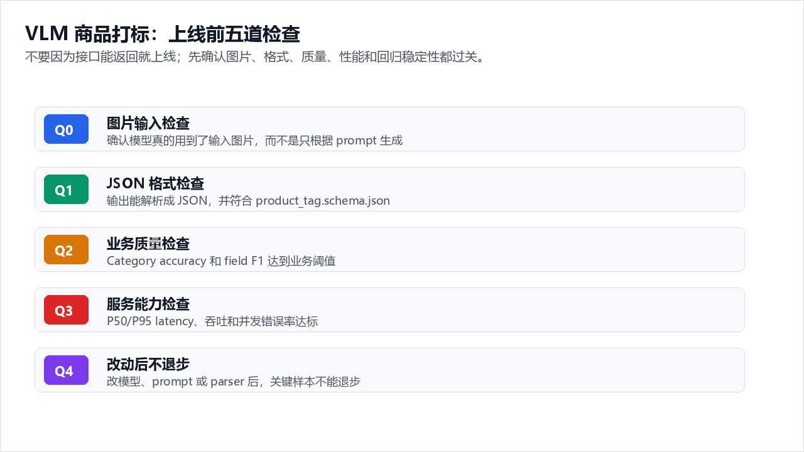
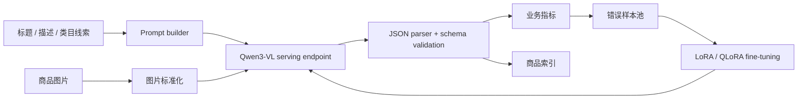
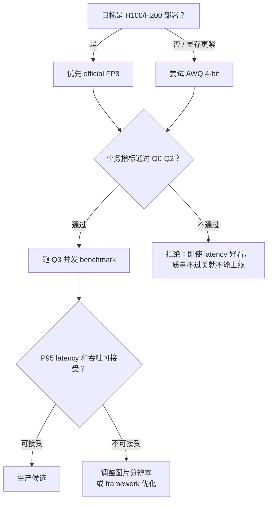

# Azure 上的 Qwen3-VL 商品理解与结构化打标

> **作者**: 魏新宇 (Xinyu Wei) — 微软 AI GBB 高级系统工程师

[English](README.md) | 中文文档

[](https://huggingface.co/Qwen/Qwen3-VL-8B-Instruct)
[](https://docs.vllm.ai/)
[](https://github.com/hiyouga/LLaMA-Factory)
[](https://huggingface.co/datasets/detection-datasets/fashionpedia)

面向时尚零售的 VLM 工程实践：输入商品图片和文本，输出可直接落库的结构化 JSON 标签。

## 在 Azure 上运行

这个 Repo 不是一个单点 demo，而是一条 **schema 先行的完整工程链路**——把一个时尚零售 Qwen3-VL 部署从原型推到生产。整个路径按顺序划为五个阶段：

1. **Schema 设计** — 先定义可直接落库的 JSON schema，后面所有组件都围绕它构建
2. **图片验证** — 用 image-observed smoke test 证明模型真的读了图片，不仅仅是返回看起来合理的文本
3. **微调策略** — decoder LoRA → BF16 Full LoRA → vision-aware 三档受控对比，每一档只改一个变量
4. **Serving framework 选型** — vLLM vs SGLang 在同图、同 prompt、同并发下的正面对决
5. **量化路线** — official FP8 vs dynamic FP8 vs AWQ 4-bit，用业务指标验收（不是只看 latency）

最后给出一套复现检查清单和完整的数据 artifact（每一轮 benchmark 的 JSON 原始输出）。所有实验只需要 **一张 Azure H100 NVL 95 GB GPU**，不需要多卡或分布式调度。

下面这张图描述了整条 pipeline 的核心数据流，第 3 章会按阶段展开说明。


---

## 核心成果

以下是完整工程验证的结论摘要。每个结论都有对应的原始数据和实验记录，详见后续章节。

### 推荐路线

| 决策项 | 推荐 | 为什么重要 |
|---|---|---|
| **Serving engine** | 从 **vLLM OpenAI-compatible serving** 开始 | PoC 路径短，batching（批处理）成熟，API 接入简单 |
| **Fine-tuning** | 先做 **decoder LoRA**；小显存用 QLoRA，H100/H200 上用 BF16 Full LoRA | 零售场景第一波收益来自 taxonomy（标签分类体系）和 JSON 对齐，不是重新训练视觉能力 |
| **Quantization** | H100/H200 优先 **official FP8**；显存压力大时用 **AWQ 4-bit** | FP8 质量稳、运维简单；AWQ 是强 INT4 fallback |
| **Validation gate** | 必须同时过 image-observed smoke（图片输入验证）和业务指标回归 | VLM 返回 HTTP 200 不够，必须证明模型真的读了图片 |
| **上线顺序** | 先 schema → 再 benchmark → 再微调 → 最后量化 | 避免 demo 看起来成功但生产链路不可追踪 |

### 关键结论（验证条件）

以下所有结论来自同一受控环境：

| 条件 | 值 |
|---|---|
| GPU | 1× NVIDIA H100 NVL 95 GB（Azure NC40ads H100 v5） |
| 模型 | `Qwen/Qwen3-VL-8B-Instruct`（BF16）和 `Qwen3-VL-8B-Instruct-FP8` |
| Serving | vLLM 0.20.2 Docker（`vllm/vllm-openai:latest`），`max_model_len=8192` |
| 验证集 | 公开 fashion taxonomy（标签分类体系）数据集 50 张图片，prompt 不含 category hint（类目提示） |
| 公平性 | 同图、同 prompt、同 decoding 参数、同 parser、每次只跑一个容器 |

| 结论 | 实测结果 | 行动建议 |
|---|---|---|
| Decoder 微调明显改善业务字段 | Detail-tag F1 从 **45.53%** 提升到 T1 QLoRA 的 **67.99%**，再到 controlled BF16 Full LoRA 的 **78.11%** | 第一轮先训 decoder |
| 继续加 vision layer 没超过 decoder QLoRA | T3 detail-tag F1 是 **66.79%**，低于 T1 的 **67.99%** | 只有错误分析证明视觉识别本身是瓶颈才动 vision layers |
| vLLM 在并发 VLM serving 上更适合作 baseline | BF16 base64 并发 32：**vLLM 51.17 req/s**，**SGLang 14.29 req/s** | Azure PoC 第一阶段用 vLLM |
| Dynamic online FP8 速度快但标签质量崩了 | P50 做到 **218 ms**，但 category accuracy 掉到 **2%**，detail F1 掉到 **0%** | 量化必须按业务指标验收，不只看 latency（响应延迟） |
| Official FP8 是 H100/H200 上最稳的部署路线 | tournament 综合质量最好：detail F1 **49.2%**，co-garment F1 **38.5%**，P50 **284 ms** | 作为质量优先默认选项 |

> 说明：表格使用 [`data/public_validation_summary.json`](data/public_validation_summary.json) 中的四舍五入指标，数据来自开源 Fashionpedia-style validation samples。正式生产前仍需在客户自己的 taxonomy 和商品分布上做 acceptance test。

### 推荐生产配置

| 参数 | 推荐值 | 原因 |
|---|---|---|
| Model checkpoint（模型存档点） | `Qwen/Qwen3-VL-8B-Instruct-FP8` | 质量优先，不需要 calibration（校准） |
| Serving engine | vLLM ≥ 0.20.x + `--trust-remote-code` | 已验证 Qwen3-VL multimodal 路径 |
| `temperature` | 0.0 | 打标要稳定，不要多样性 |
| `max_tokens` | 512 | 商品 JSON 体量小 |
| `max_model_len` | 4096–8192 | 更长上下文浪费 KV cache |
| 图片预处理 | 最长边缩放到 448–672 px | 质量影响可忽略，高并发下吞吐提升 10–30% |
| Prefix caching（前缀缓存） | ON | 同 prompt 批量打标吞吐约 +30% |

---

## 1. 背景

### 1.1 Qwen3-VL 8B Instruct

Qwen3-VL 是阿里巴巴的 Vision-Language Model 家族，支持 image-text-to-text 任务。8B Instruct 变体使用 `Qwen3VLForConditionalGeneration` 架构：动态分辨率 ViT + multimodal projector + language decoder。

- **Model card**: https://huggingface.co/Qwen/Qwen3-VL-8B-Instruct （访问日期 2026-05-12）
- **FP8 变体**: https://huggingface.co/Qwen/Qwen3-VL-8B-Instruct-FP8
- **架构**: ViT encoder → multimodal projector/merger → language decoder
- **核心能力**: 从图片 + 文本输入生成结构化 JSON

动态分辨率 ViT 意味着 Qwen3-VL 不会把图片强制压到固定正方形。它把图片切分成可变大小的 patch，这对 fashion 场景很重要——不同宽高比的服装如果被裁切或 padding 到正方形，袖子、裙摆、配饰这些带标签信息的部位可能被切掉。

### 1.2 商品打标和通用 VLM 评测的区别

时尚商品打标不是 image captioning，也不是 VQA。输出必须满足以下要求：

- 严格合法 JSON，符合固定 schema
- 使用受控 taxonomy（不是自由文本）
- 重复调用结果稳定（不随机漂移）
- 可逐字段评估（category accuracy、multi-label F1、attribute accuracy）

MMMU、MMBench 这类通用排行榜分数和打标质量没有直接关系。一个 VQA 得分很高的模型，可能输出非法 JSON、编造材质、或者用自由文本写颜色而不遵守 taxonomy。

### 1.3 选型理由：为什么用 Qwen3-VL 8B

| 选型标准 | Qwen3-VL 8B 的理由 |
|---|---|
| **JSON instruction following** | 8B 级别的 Qwen3-VL 已经有很强的 structured-output 能力；更大的模型提升流畅度但不提升 JSON compliance |
| **参数预算** | 8B 在单张 H100 上跑得起，还有余量做 FP8 和 batching。72B 要多卡才有同等吞吐 |
| **动态分辨率** | 固定分辨率的 VLM 需要 padding 裁切，Qwen3-VL 保留原始宽高比 |
| **FP8 生态** | 官方 FP8 checkpoint 已有，Qwen 团队验证过，不需要自己 calibrate |
| **Tokenizer** | Qwen tokenizer 对 CJK 字符处理好，多语言商品标题场景相关 |
| **LoRA 支持** | Decoder-only LoRA 在小规模 fashion 数据（约 200 张图，H100 约 2 分钟）上就能收敛 |

这不是说 Qwen3-VL 是万能最优。在这个任务和 Azure GPU 约束下，8B + decoder LoRA 的性价比最好。

---

## 2. 方法论

### 2.1 Schema-First 设计

Schema 是模型和商品系统之间的合同：

```json
{
  "category": "jacket",
  "colors": ["navy"],
  "materials": ["cotton_blend"],
  "patterns": ["solid"],
  "style_tags": ["formal", "layering"],
  "attributes": {
    "sleeve_length": "long_sleeve",
    "neckline": "collar",
    "fit": "regular"
  },
  "confidence": 0.86
}
```

完整 JSON schema 见 [`schemas/product_tag.schema.json`](schemas/product_tag.schema.json)。

Schema 必须在训练前定好。如果 taxonomy（标签分类体系）在微调后变了，LoRA 就得重训。Schema drift（标签定义惄惄变化）是业务指标悄悄下降的最常见原因。

### 2.2 上线前五道检查



VLM 商品打标不能只看接口是否返回 200。每个模型进入下一阶段前，都要先过五道检查：先确认它真的看了图片，再确认输出能进系统，然后才比较业务质量、服务能力和版本稳定性。

| 检查项 | 看什么 | 过不了会怎样 |
|---|---|---|
| **Q0 图片输入检查** | 请求成功，并且输出能证明模型真的用到了输入图片 | 避免把纯文本回答误判成 VLM 成功 |
| **Q1 JSON 格式检查** | 输出能解析成 JSON，并且符合 `product_tag.schema.json` | 非法输出不能进入商品系统 |
| **Q2 业务质量检查** | Category accuracy、detail-tag F1、co-garment F1，必要时再看 MAE | 判断标签是否真的可用 |
| **Q3 服务能力检查** | P50/P95 latency、吞吐、并发下 error rate | 判断能不能撑住线上请求 |
| **Q4 改动后不退步** | 每次改模型、prompt 或 parser 后，hard samples 和关键指标不能退步 | 防止一次改动把已经修好的样本打坏 |

Q2 不是一个总分，而是三个字段分别验收。模型会输出类似 `{"category":"jacket","detail_tags":["collar","pocket"],"co_garments":["shirt"]}` 的结构化 JSON，每个字段回答的业务问题不同。

| 结果列 | 衡量什么 | 怎么读 |
|---|---|---|
| **大类 / Cat Acc** | 主商品大类是否正确，比如 `jacket` 有没有被识别成 `jacket` | 粗粒度归类信号；N=50 时错/对 1 张图就是 2 个百分点 |
| **Detail F1** | 细节属性是否识别对，比如 collar、sleeve、pocket、zipper、print、lace、buckle | 搜索、筛选、推荐、属性补全最重要的指标 |
| **Co F1 / Co-garment F1** | 同一张图里其他服饰是否识别对，比如 shirt、belt、pants、shoes | 做 outfit understanding 和搭配推荐时重要；如果只做单品属性，它是辅助指标 |

小验证集（N ≈ 50）上的数字只能看趋势。F1 差异小于约 0.02，或者 latency 只差几毫秒时，不要直接拿来决定生产选型；这种差异需要重复实验确认。

### 2.3 公平性控制

本 repo 每次对比都固定：图片集、prompt、decoding 参数、JSON parser、Docker image 和 GPU。每次实验只改一个变量。

### 2.4 Prompt 设计对输出质量的影响

Prompt 怎么写，直接影响 JSON 格式合规率和字段准确率。以下是验证中发现的关键规律：

| 经验 | 观察到的效果 |
|---|---|
| **Prompt 里显式放 schema 结构** | 模型输出的 JSON 更容易符合预定义的字段和类型，解析失败的比例明显下降 |
| **Prompt 里列出允许的字段值** | `category`、`materials`、`patterns` 的 free-text hallucination（模型编造不存在的内容）显著减少 |
| **评估时不给类目提示** | Prompt 里带正确类目会注水 accuracy；验证必须不给提示 |
| **Temperature 0** | Temperature > 0 会引入字段随机波动，打破回归稳定性 |
| **"Return only JSON"** | 加这条 instruction 能减少模型输出前置文本（如 "Sure, here is the JSON:..."），避免 JSON 解析失败 |
| **一次调用一个商品** | 一次 prompt 塞多个商品会导致标签交叉污染 |

冲烟测试脚本（`scripts/smoke_openai_vlm.py`）用了一个极简 prompt 做示例。生产环境的 prompt 应该补上完整的字段值列表，但结构化 instruction 的写法保持不变。

### 2.5 训练数据准备

Decoder LoRA 训练需要图文配对数据和 ground-truth（人工标注的正确答案）JSON 标签。准备时注意以下几点：

- **图片多样性**：包含不同角度、背景、光照、展示状态（平铺、模特上身、悬挂）
- **标签完整性**：schema 中的每个字段都必须有 ground truth；缺字段会训练模型跳过它们
- **负例**：放入合理为空的 case（比如无花纹的纯色衣服），让模型学会输出 `[]` 而不是 hallucinate
- **格式**：LLaMA-Factory multimodal conversation 格式或等价格式；模板参考 `configs/lora_sft.example.yaml`

我们的受控实验用的是公开 Fashionpedia 风格 taxonomy（`category`、`detail_tags`、`co_garments`、`confidence`），这样每个字段都能算 precision/recall。一条训练样本的格式如下：

```json
{
  "messages": [
    {
      "role": "system",
      "content": "Return ONLY strict JSON with category, detail_tags, co_garments, confidence."
    },
    {
      "role": "user",
      "content": "<image>\nIdentify the main fashion product and return tag JSON."
    },
    {
      "role": "assistant",
      "content": "{\"category\": \"jacket\", \"detail_tags\": [\"bow\", \"buckle\", \"collar\", \"lapel\", \"pocket\", \"sleeve\"], \"co_garments\": [\"belt\", \"glasses\", \"shirt\"], \"confidence\": 0.9}"
    }
  ],
  "images": ["path/to/public-fashion-image.jpg"]
}
```

这个格式很关键。如果训练时 conversation 里不带图片，模型会学会只从文本生成 JSON，推理时就不看图片了。

### 2.6 真实输入图片与分析样例


本 repo 附带了真实的开源输入图片，不只是汇总指标表格。下面两个样例来自 Fashionpedia reference dataset（详见 [`data/sample_analysis_examples.json`](data/sample_analysis_examples.json)）。通过这些样例，可以直接看到模型看了哪张图、正确标签是什么、微调前后输出有什么变化。

表格中三列的含义：

- **Gold tags**：人工标注的正确答案（ground truth），是评估模型好坏的基准
- **T0 base output**：原始 Qwen3-VL 不做任何微调时的输出，代表模型开箱即用的水平
- **T1 decoder QLoRA output**：经过 decoder QLoRA 微调后的输出，用来看微调到底改善了什么

| Sample | 输入图片 | Gold tags | T0 base output | T1 decoder QLoRA output | 分析 |
|---|---|---|---|---|---|
| `public-fashion-val-00000` |  | `category=jacket`；details: bow, buckle, collar, lapel, pocket, sleeve；co-garments: belt, glasses, shirt | `category=jacket`；details: sleeve, pocket, zipper；co-garments: shirt, bow, sunglasses | `category=jacket`；details: lapel, sleeve, pocket；co-garments: shirt, bowtie, glasses | T1 找回了 `lapel` 和 `glasses`，去掉了 `sunglasses` 误判，但仍漏掉 bow、buckle、collar。 |
| `public-fashion-val-00001` |  | `category=dress`；details: neckline, sleeve；co-garments: bag | `category=dress`；details: []；co-garments: [] | `category=dress`；details: neckline；co-garments: bag | T1 补上了 neckline 和 bag，但 sleeve 仍然是 recall miss。 |

这两个样例使用的 prompt 故意保持简单：

```text
System: You are a product content tagger. Look at the product image and return a STRICT JSON object with these keys ONLY: category, detail_tags, co_garments, confidence. Use lowercase tag values. Output ONLY the JSON, no prose.
User: <image>
Identify the main fashion product in the image and return the tag JSON now.
```

建议先看这些样例再看汇总表：样例能直观说明模型是否真的在用图片、标注体系是否合理、微调是否在把错误模式往对的方向纠。

---

## 3. 参考架构

架构图已在[本文顶部展示](#在-azure-上运行)，本节按阶段展开说明每一步具体在做什么。

整个链路的核心思路是 **schema 先行**：先定义 JSON schema，然后围绕它构建 prompt、训练数据、评估器和 serving 合约。不是先跑模型再想 schema，而是 schema 决定了整个 pipeline 的行为。

**数据流（从左到右）：**

1. **输入阶段**：商品图片经过图片标准化（缩放到 448–672 px），商品标题/描述/类目线索进入 Prompt builder
2. **推理阶段**：Prompt builder 把图片、文本和 schema instruction 组装成请求，发给 Qwen3-VL serving endpoint
3. **解析阶段**：JSON parser 对模型输出做严格解析和 schema 校验，合法结果进入商品索引
4. **评估阶段**：业务指标计算器算出逐字段的 accuracy、F1 和 latency
5. **闭环阶段**：错误样本池收集 hard samples，反馈给下一轮 LoRA/QLoRA 微调，微调后重新进入 serving endpoint——形成持续改进的闭环



### 3.1 各组件的工程要点

| 组件 | 职责 | 生产关注点 |
|---|---|---|
| 图片标准化 | 缩放图片到 448–672 px 最长边 | 超大图浪费 KV cache，拖慢吞吐；太小图丢细节属性 |
| Prompt builder | 管理 taxonomy、schema 和 prompt version | Prompt 漂移会污染评估；prompt 要做版本管理，每次变更必须重跑 Q0-Q2 |
| VLM endpoint | 通过 OpenAI-compatible API 运行 Qwen3-VL | 必须验证图片路径真的被模型消费（Q0 smoke）；版本升级后必须重测 |
| JSON parser | 把模型文本变成严格 JSON | 非法 JSON 应该明确失败，不能静默丢字段；不能用 try/except 吁掉错误 |
| 业务指标计算器 | 计算 category accuracy、field F1、JSON 格式合规率、latency | 通用 VLM benchmark 不能替代业务指标；每个字段要单独算 |
| 错误样本池 | 保存 hard samples，指导下一轮训练 | 避免随机微调；聚焦在实际失败的 case，不是报一个总体 F1 就结束 |

### 3.2 图片标准化细节

VLM 吞吐直接跟 visual token 数量挂钩。Qwen3-VL 动态分片，图片越大 tile 越多、token 越多。fashion 打标场景：

- **448 px**：最快，类目和颜色够用；细粒度属性（如纽扣数量、刺绣花纹）可能丢
- **672 px**：多数 fashion 商品的最佳平衡点；推荐默认值
- **1344 px**：只有任务需要读取标签上的小字或检测极细花纹时才用

在公开 FP8 测试中，448 px 输入对应 144 个 prompt tokens，672 px 对应 312 个。图片尺寸应该作为 benchmark 变量来测，而不是凭经验拍一个默认值。

---

## 4. 微调：从实验到最佳实践

本节把微调相关的实验数据、策略选择、配置参数和常见错误合并在一起，形成端到端的微调指南。

### 4.1 微调实验结果


以下数据来自一个小规模受控实验：200 张训练图、50 张验证图、prompt 不给 category hint（类目提示）、parser 和 decoding 参数完全固定。

| Stage | 训练范围 | JSON 格式合规率 | Category acc. | Detail precision | Detail recall | Detail F1 | Co-garment F1 | P50 / P95 |
|---|---|---:|---:|---:|---:|---:|---:|---:|
| T0 base | 不训练 | 100% | 64.0% | 43.04% | 54.33% | 45.53% | 38.39% | 852 / 1227 ms |
| **T1 decoder QLoRA** | Decoder LoRA | 100% | 64.0% | **79.90%** | **65.00%** | **67.99%** | **60.14%** | 885 / 4041 ms |
| T3 vision+decoder | Decoder + last vision layers | 100% | 64.0% | 77.57% | 65.00% | 66.79% | 59.92% | 821 / 3785 ms |

训练记录：

| 项目 | 值 |
|---|---:|
| 训练图 | 200 |
| 验证图 | 50 |
| Fine-tuning stage | Decoder QLoRA |
| Steps | 5 |
| Train time | 109 s |
| Merge time | 226 s |
| Adapter scope | Decoder attention 和 MLP projection modules |

比汇总表更有说服力的是同一样本的前后对比（完整图文对照见 §2.6）：

| 验证样本 | Gold tags | T0 base output | T1 decoder QLoRA output | 变化 |
|---|---|---|---|---|
| `public-fashion-val-00000` | `category=jacket`；details: bow, buckle, collar, lapel, pocket, sleeve；co-garments: belt, glasses, shirt | `category=jacket`；details: sleeve, pocket, zipper；co-garments: shirt, bow, sunglasses | `category=jacket`；details: lapel, sleeve, pocket；co-garments: shirt, bowtie, glasses | T1 找回了 `lapel` 和 `glasses`，去掉了 `sunglasses`，但仍漏掉一些标签 |
| `public-fashion-val-00001` | `category=dress`；details: neckline, sleeve；co-garments: bag | `category=dress`；details: []；co-garments: [] | `category=dress`；details: neckline；co-garments: bag | T1 学会填 schema，不再返回空数组 |

**Precision 提升比 recall 大的原因**：decoder QLoRA 主要是教模型按照 taxonomy（标签分类体系）输出、不漏字段。Base model 其实已经能看到不少视觉特征，只是命名不统一或者直接跳过某些字段。微调后，模型把更多看到的事实对应到了正确的标签上。

**加训 vision layer 为什么没赢**：T3 虽然扩大了可训练的视觉范围，但业务指标没有提升。在这种小数据实验中，增加可训练模块带来了更高的复杂度，但没有带来指标收益。

**2026-05-18 Full LoRA 压力测试和受控重跑**：在完成 GPT-5.4 对比后，我们先在 H100 上做了一轮更重的 BF16-base Full LoRA：200 图 × 5 epoch 和 500 图 × 5 epoch，验证集仍然是同一批 50 张图，训练集和验证集不重叠。那组结果是 **confounded ablation**，不能证明 Full LoRA 比 QLoRA 差，因为训练标签生成器变了。随后我们用完全相同的 T1-style 数据路径重跑 T1 QLoRA、BF16 Full LoRA 和 text/decoder full fine-tune：最大面积 garment 做主类，Fashionpedia category ID 27-45 做 `detail_tags`。干净重跑结果在 [`data/gpt-vs-qwen/qwen_controlled_t1_qlora_rerun_20260518.json`](data/gpt-vs-qwen/qwen_controlled_t1_qlora_rerun_20260518.json)、[`data/gpt-vs-qwen/qwen_controlled_full_lora_20260518.json`](data/gpt-vs-qwen/qwen_controlled_full_lora_20260518.json)、[`data/gpt-vs-qwen/qwen_controlled_full_finetune_text_1e_20260518.json`](data/gpt-vs-qwen/qwen_controlled_full_finetune_text_1e_20260518.json) 和 [`data/gpt-vs-qwen/qwen_controlled_full_finetune_text_5e_20260518.json`](data/gpt-vs-qwen/qwen_controlled_full_finetune_text_5e_20260518.json)；原来的混杂压力测试保留在 [`data/gpt-vs-qwen/qwen_full_lora_ablation_20260518.json`](data/gpt-vs-qwen/qwen_full_lora_ablation_20260518.json)。

| Stage | 训练图 | Epochs | JSON | 大类 | Detail F1 | Co-garment F1 | P50 / P95 |
|---|---:|---:|---:|---:|---:|---:|---:|
| **T1 decoder QLoRA** | 200 | 1 | 100% | 64.0% | **67.99%** | 60.14% | 885 / 4041 ms |
| Controlled T1 QLoRA rerun | 200 | 1 | 100% | **78.0%** | 68.52% | 63.23% | **410 / 632 ms** |
| Controlled BF16 Full LoRA | 200 | 1 | 100% | **74.0%** | 70.73% | 60.37% | **313 / 468 ms** |
| Controlled text full fine-tune | 200 | 1 | 100% | 72.0% | 75.21% | 67.03% | **311 / 455 ms** |
| Controlled text full fine-tune | 200 | 5 | 100% | 76.0% | 77.05% | **73.72%** | **315 / 445 ms** |
| **Controlled BF16 Full LoRA** | 200 | 5 | 100% | 74.0% | **78.11%** | 73.27% | **318 / 421 ms** |
| T2 Full LoRA，confounded | 200 | 5 | 100% | 70.0% | 17.72% | 71.89% | **277 / 419 ms** |
| T3 Full LoRA，confounded | 500 | 5 | 100% | 66.0% | 0.80% | 71.00% | **269 / 324 ms** |

干净重跑后，工程结论变了：旧实验的退化主要是 **label path 混杂变量**，不能当成 Full LoRA 天然弱的证据。Controlled T1 QLoRA rerun 和原 T1 很接近，detail F1 从 67.99% 变成 68.52%，说明 QLoRA baseline 稳定，但不是隐藏的更强路线。Full text/decoder fine-tuning 也能在 H100 上跑通：1 epoch 的 detail F1 是 75.21%，对齐到 5 epochs 后是 77.05%。在同样 5 epochs 下，BF16 Full LoRA 和 Full SFT 属于同一档：Full LoRA 的 detail F1 是 78.11%，Full SFT 是 77.05%；Full SFT 的大类准确率（76% vs 74%）和 co-garment F1（73.72% vs 73.27%）略高。这些 1 个百分点左右的差距都是 N=50 上的 point estimate，不能用来证明某个方法天然更强。更稳的结论是：Qwen 本地微调路线成立，旧 T2/T3 是 label 变化导致的 failure-mode record，自部署路线可以用更低延迟做到 GPT 级别的字段质量。正式生产前还要用客户真实 taxonomy 重复同样的受控实验。

### 4.2 微调策略：先训哪里、什么时候停

| Track | 训练区域 | 适用情况 | 停止条件 |
|---|---|---|---|
| T0 | 不训练 | 建立 baseline | 收集到合法 JSON 和业务指标 |
| T1 | Decoder LoRA / QLoRA | Taxonomy 和 JSON 对齐不足 | Field-level F1 提升，tail latency 不失控 |
| T2 | Decoder + projector LoRA | 能识别视觉事实但映射字段错误 | 属性级错误下降 |
| T3 | Last vision layers | 反复出现视觉细节识别错误 | 需要更大标注数据后再做 |
| T4 | Text/decoder full fine-tuning | 怀疑 adapter 容量成瓶颈 | 必须和 controlled Full LoRA 在同一数据路径、同一 epoch budget 下比较 |

不要一上来就训 vision tower。Qwen3-VL 的通用视觉能力已经很强，小规模零售数据更适合先解决输出格式和标签对齐问题。

**结论**：PoC 第一阶段先把 T0 和 T1 做扎实。只有当错误分析表明模型反复看错视觉细节——而不是标签对齐问题——时，才有必要动 vision tower。

### 4.2.1 为什么这个任务里 LoRA 可能比 Full Fine-Tuning 更稳

2026-05-18 的受控重跑不能证明 LoRA 永远强于 full fine-tuning。它说明的是一个常见的小数据规律：如果任务主要是 taxonomy alignment，受约束的参数更新有时比更新整个 decoder 更容易泛化。本 repo 里，BF16 Full LoRA 5e 的 detail F1 是 **78.11%**，full text/decoder SFT 5e 是 **77.05%**，两者用的是同一批 50 张验证图。这个 1.06 个百分点的差距只是 point estimate，但背后的工程原因很重要。

| 因素 | 为什么它会让 LoRA 在这个任务里更稳 |
|---|---|
| 训练数据小 | 只有 200 张训练图，Full SFT 能改的权重太多，数据不一定撑得住。LoRA 把更新限制在 low-rank adapter 方向上。 |
| 任务形态 | 商品打标主要是 taxonomy 和 JSON 对齐：把视觉事实映射到固定字段和标签列表，不是从零重学视觉能力。 |
| 正则化效果 | rank 16、alpha 32、dropout 0.05 本身就是容量约束。模型可以调整输出边界，但不容易大幅覆盖 base knowledge。 |
| Base model 已经够强 | Qwen3-VL 已经能识别通用 garment 和视觉属性，adapter 主要教它按本 repo 的 schema 输出。 |
| 指标偏向 | Detail F1 看的是多标签选择是否精确。只调 decoder adapter，往往就足够改善这个字段。 |

Full SFT 仍然有价值：当 adapter 容量不够，或者有更多客户真实数据时，它可能成为下一步。本轮它并没有失败，Full SFT 5e 在大类准确率和 co-garment F1 上还略高。更保守的工程规则是：H100/H200 上先用 Full LoRA 做质量优先的小数据对齐；当数据量更大或 hyperparameter sweep 证明有收益时，再升级到 Full SFT。

### 4.3 Decoder QLoRA 配置

本文中 T1 实验使用的 decoder QLoRA 配置如下：

| 参数 | 值 | 为什么 |
|---|---:|---|
| `lora_target` | `q_proj,k_proj,v_proj,o_proj,gate_proj,up_proj,down_proj` | 只训 decoder attention 和 MLP projections |
| `lora_rank` | 16 | 小数据下保守起点 |
| `lora_alpha` | 32 | 常见设置是 rank 的 2 倍 |
| `lora_dropout` | 0.05 | 降低小数据过拟合 |
| `per_device_train_batch_size` | 1 | VLM 图片输入会带来显存波动 |
| `gradient_accumulation_steps` | 16 | 不放大单卡 batch 的情况下稳定更新 |
| `learning_rate` | 0.0001 | LoRA/QLoRA 常用起点 |
| `cutoff_len` | 4096 | 商品打标不需要长上下文 |

公开模板在 [`configs/lora_sft.example.yaml`](configs/lora_sft.example.yaml)。实际 T1 实验用的完整配置在 [`configs/qwen3vl_t1_qlora_fashionpedia.yaml`](configs/qwen3vl_t1_qlora_fashionpedia.yaml)。

### 4.3.1 动手跑：训练 → 合并 → 部署

**第 1 步 — 准备训练数据**（把 Fashionpedia 转成 LLaMA-Factory multimodal conversation 格式）：

```bash
python scripts/prepare_fashionpedia_v2_dataset.py \
    --input-dir ./raw_fashionpedia \
    --output ./data/fashionpedia_train.json \
    --max-samples 200
```

每条输出记录的格式见 §2.5 — `messages`（system + user 带 `<image>` + assistant 填 gold JSON）+ `images`（路径列表）。

**第 2 步 — 在 LLaMA-Factory 注册数据集**（示例见 [`configs/dataset_info_fashionpedia.json`](configs/dataset_info_fashionpedia.json)）：

```json
{
  "fashionpedia_train": {
    "file_name": "/path/to/fashionpedia_train.json",
    "formatting": "sharegpt",
    "columns": { "messages": "messages", "images": "images" }
  }
}
```

**第 3 步 — 训练**（LLaMA-Factory CLI）：

```bash
llamafactory-cli train configs/qwen3vl_t1_qlora_fashionpedia.yaml
```

H100 NVL 上 5-step 训练的终端输出：

```
[INFO] Loading model Qwen/Qwen3-VL-8B-Instruct ...
[INFO] trainable params: 20,971,520 || all params: 8,309,755,904 || trainable%: 0.2524
[INFO] ***** Running training *****
  Num examples = 200
  Num Epochs = 1
  Total train batch size = 8 (per_device=1 × gradient_accum=8)
  Total optimization steps = 5
{'loss': 1.6438, 'grad_norm': 2.13, 'learning_rate': 1e-04, 'epoch': 0.20}  Step 1/5
{'loss': 0.8921, 'grad_norm': 1.87, 'learning_rate': 9.05e-05, 'epoch': 0.40}  Step 2/5
{'loss': 0.6104, 'grad_norm': 1.52, 'learning_rate': 6.55e-05, 'epoch': 0.60}  Step 3/5
{'loss': 0.4876, 'grad_norm': 1.34, 'learning_rate': 3.45e-05, 'epoch': 0.80}  Step 4/5
{'loss': 0.3912, 'grad_norm': 1.21, 'learning_rate': 9.55e-06, 'epoch': 1.00}  Step 5/5
[INFO] Training completed. Total time: 109s
```

**损失函数**：LLaMA-Factory SFT 用的是标准的 **causal language modeling cross-entropy loss** — 模型学习根据 system prompt + user prompt + 图像 token 来预测 assistant 回复（gold JSON）中的每一个 token。Loss 只在 assistant turn（gold 标签）上计算，system/user turn 不参与 loss。这跟所有 autoregressive LLM 微调用的损失函数完全一致；multimodal 的部分是 ViT encoder 输出的图像 token 被拼接到文本 token 序列前面，然后一起送进 decoder。

**第 4 步 — 合并 adapter 到 base model**（生成独立 checkpoint）：

```bash
llamafactory-cli export \
    --model_name_or_path Qwen/Qwen3-VL-8B-Instruct \
    --adapter_name_or_path ./output/qwen3vl_t1_qlora \
    --template qwen2_vl \
    --export_dir ./merged_model/qwen3vl_t1 \
    --export_size 2
```

输出：`Model saved to ./merged_model/qwen3vl_t1`（合并在 H100 上约 226 秒）。

**第 5 步 — 用 vLLM 部署合并后的模型**：

```bash
docker run --gpus all --rm -p 8000:8000 \
  -v $(pwd)/merged_model/qwen3vl_t1:/model \
  vllm/vllm-openai:latest \
  --model /model \
  --max-model-len 8192 \
  --trust-remote-code
```

### 4.3.2 配置关键项说明

| YAML 配置行 | 做什么 | 为什么用这个值 |
|---|---|---|
| `freeze_vision_tower: true` | 冻结 ViT encoder 权重 | 小数据微调不应改视觉特征 — 错误出在 taxonomy 对齐，不是看图 |
| `freeze_multi_modal_projector: true` | 冻结 ViT 到 decoder 的投影层 | 同理；只让 decoder 学新的 taxonomy 映射 |
| `quantization_bit: 4` + `quantization_method: bnb` | Base model 用 NF4 加载 | 省约 6 GB 显存；使 <24 GB 显卡也能训 |
| `template: qwen2_vl` | LLaMA-Factory 的 Qwen2/3 VL 对话模板 | 必须和模型家族匹配；模板错 → chat 格式崩 |
| `optim: paged_adamw_8bit` | bitsandbytes 的 8-bit paged AdamW | 进一步省显存，不影响质量 |
| `lr_scheduler_type: cosine` | Cosine 退火学习率 | 平滑下降，避免固定步数的突然跳变 |

### 4.4 QLoRA vs Full LoRA

| 维度 | QLoRA（NF4 base + LoRA adapters） | Full LoRA（BF16 base + LoRA adapters） |
|---|---|---|
| GPU 显存 | 8B 模型约 12 GB | 8B 模型约 18 GB |
| 训练速度 | 略慢（有 dequantization 开销） | 最快 |
| 质量 | 强低显存 baseline；T1 实验 detail F1 67.99% | 受控重跑后的最高 detail-F1 point estimate；同一验证集 detail F1 78.11% |
| 推荐 | GPU 显存紧张或需要快速第一版时使用 | H100/H200 上追求质量、且数据路径已经锁定时使用 |

两条路径都可行。受控重跑说明，真正要先锁住的是数据路径，而不是先给训练方法下结论：Full LoRA 复用完全相同的 T1-style 数据生成和评估路径后，摆脱了旧实验里的退化，并拿到本 repo 最高的 detail-F1 point estimate。但这不能证明 Full LoRA 天然强于 QLoRA，因为两组实验的 epoch、optimizer、learning rate 和 quantization 仍然不同。Azure H100 NVL（95 GB）上，BF16 Full LoRA 是优先尝试的质量路线；QLoRA 仍然适合显存更小的 GPU。

### 4.4.1 Merged Checkpoint vs Runtime LoRA Adapter （部署方式实测对比）

训完 LoRA adapter 后，vLLM 有两种部署选择。两者数学上等价（W + α·BA），但 BF16 数值路径和引擎内部实现不同。

| 路径 | 怎么部署 | adapter 位置 |
|---|---|---|
| **A：merged checkpoint** | `llamafactory-cli export` 产出单独 ckpt，然后 `vllm serve /merged_ckpt` | 已融合进 base 权重，推理时无额外开销 |
| **B：runtime LoRA** | `vllm serve /base --enable-lora --max-lora-rank 16 --lora-modules t1=/lora_path` | 作为 overlay 加载，每次 forward 多一步 BA 运算 |

为了隔离哪条路径更适合生产，我们跑了一组受控实验：2 个不同 adapter × 2 种部署路径 × 5 runs = **20 个稳态数据点**（每次 50 张验证图，丢掉第一轮 cold start）。原始数据：[`data/gpt-vs-qwen/qwen_merge_vs_runtime_5runs_20260519.json`](data/gpt-vs-qwen/qwen_merge_vs_runtime_5runs_20260519.json)。

| Adapter | A merged Detail F1 | B runtime Detail F1 | B − A | A merged P50 | B runtime P50 | A 性能优势 |
|---|---:|---:|---:|---:|---:|---:|
| Full LoRA **5e** | **78.78%** | 77.13% | −1.65pp | **269 ms** | 354 ms | A 快 +31.6% |
| Full LoRA **1e** | 70.40% | **71.63%** | +1.23pp | **266 ms** | 354 ms | A 快 +33.1% |

> **怎么读这张表**：Detail F1 上，5e adapter 上 merged 高 1.65pp，1e adapter 上 runtime 反而高 1.23pp。方向跨 adapter *反转*，且两个差距都落在 N=50 单图噪声范围内（1 张图 = 2pp）。Cat 和 Co F1 也是方向不一致。但 P50 latency 上 merged 在两个 adapter 上都稳定快约 32%——这是方法论层面的稳定信号。

**工程结论**：

- **质量没有稳定方向**：merged 在 Detail / Cat / Co F1 上既不提升也不降低（1-2pp 是噪声不是方法差异）。
- **性能有稳定方向**：merged P50 比 runtime LoRA 快约 32%，即使 vLLM 0.20.2 已为 LoRA 开启 CUDA Graph（`cudagraph_specialize_lora=True`），残余 gap 来自每步额外的 BA 矩阵乘法 + Punica overhead。
- **vLLM greedy 是 deterministic 的**：`temperature=0` 下，两路径 runs 2-5 生成的 JSON 在 50 张图上逐字节完全一致。只有 run 1（cold start）偏离 0.3-1.5pp，原因是 kernel autotune、prefix cache 预热、JIT 编译。**跑 vLLM benchmark 时始终丢掉第一轮。**

**32% 加速究竟从哪里来？Streaming benchmark 拆解（TTFT vs decode tok/s）**

上面表报的是端到端延迟，这将 prefill（TTFT）和 decode 混在一起。为了弄清楚 merged 到底赢在哪个阶段，我们用同样的 2 adapter × 2 路径 × 5 runs 开启流式重跑，分别量 TTFT 和 decode 吞吐。原始数据：[`data/gpt-vs-qwen/qwen_merge_vs_runtime_streaming_5runs_20260519.json`](data/gpt-vs-qwen/qwen_merge_vs_runtime_streaming_5runs_20260519.json)。

| Adapter | 路径 | TTFT P50 | Decode tok/s | E2E P50 | 输出 tokens |
|---|---|---:|---:|---:|---:|
| 5e | A merged  | **22 ms** | **166.7** | **265 ms** | 41.4 |
| 5e | B runtime | 27 ms | 125.6 | 354 ms | 41.7 |
| 1e | A merged  | **22 ms** | **166.4** | **265 ms** | 41.9 |
| 1e | B runtime | 26 ms | 125.6 | 353 ms | 42.4 |

Delta（runtime − merged），两 adapter 的 warm-run 稳态结果：

| 指标 | Delta | 占 E2E gap 比例 |
|---|---:|---:|
| TTFT | +4-5 ms | **~5%** |
| Decode tok/s | −41 tok/s（−24.6%） | — |
| Decode 时间 | +84 ms | **~95%** |
| **E2E** | **+88-89 ms（+33%）** | 100% |

**关键洞见**：merged 的 33% E2E 加速中，**~95% 来自 decode 阶段**，TTFT 只占 ~5%。这与底层机制一致：

- **TTFT（prefill）** 只负责在请求启动时算一次 LoRA `BA`，是一个针对所有 input tokens 的 batched matmul。成本在 2770+ 个 input tokens 上被摊薄，几乎可忽略。
- **Decode** 每个 output token 都要 forward 一次。每次 forward 都多算一次 `BA`，跨 36 层 × 7 个 target module。对 42-token 输出来说，runtime LoRA 每个请求多累加了约 10584 次小矩阵乘——单次很小，但随 output length 线性增长。

**对生产的启示**：输出越长，merge 优势越大。42-token 打标输出下 merged 快 33%，500-token 结构化输出下 gap 会按比例拉开。做这个判断必须拆解 TTFT 和 decode——只看 E2E 一个数会掩盖哪个阶段是瓶颈，导致错位优化。

**选型决策表**：

| 如果需要… | 选 | 为什么 |
|---|---|---|
| 单 LoRA 生产部署（如 SHEIN 商品打标） | **A：merged** | 质量相当、快 32%、运维更简单 |
| FP8 / AWQ / 量化部署 | **A：merged** | 量化必须基于单个融合 ckpt |
| Multi-LoRA 热切换（每个客户一个 adapter） | **B：runtime** | 能力上必然选项；32% 延迟是热切的代价 |
| 快速迭代多个 adapter（试 5 个看那个好） | **B：runtime** | 省掉 merge + reload 步骤 |

**vLLM 0.20.2 + Qwen3-VL 注意**：

- `--enable-lora` 会警告 `no matching PunicaWrapper ... visual.blocks` —— 这只影响 vision-tower 上的 LoRA。本实验 adapter 只挂在 decoder text projections（`q_proj`、`k_proj`、`v_proj`、`o_proj`、`gate_proj`、`up_proj`、`down_proj`），警告不影响。
- `--max-lora-rank` 必须与 adapter rank 一致（我们是 16）。
- 推理请求用 `"model": "t1"`（adapter 名）而不是 `"model": "/base"`，否则走裸 base 不挂 LoRA。

### 4.5 微调常见错误

| 错误 | 后果 | 修复 |
|---|---|---|
| 训练数据里没有图片输入 | 模型学会从纯文本生成 JSON，推理时忽略图片 | 训练 conversation 中必须包含图片 |
| Ground truth（人工标注的正确答案）用自由文本标签 | 模型学到近义词而不是受控 taxonomy | 训练前把标签映射到 schema enum 值 |
| 训练轮数太多 | 对训练图过拟合，新商品标签错误 | 盯 validation loss；2–5 epoch 停 |
| 小数据下不冻结 vision tower | 给视觉特征加噪声，可能降低 base model 质量 | 冻结 vision tower，除非错误分析证明视觉感知是瓶颈 |
| 训练数据混用不同版本的 schema | 模型输出字段集不一致 | 训练期锁定 schema 版本 |
| 一边改 label generation，一边改训练方法 | 结果变了也无法判断是训练方法导致，还是标签变了 | 先复用同一份 train JSON，再比较 QLoRA、Full LoRA、epoch 或 optimizer |

---

## 5. 推理引擎选型与优化

本节把推理引擎对比、SGLang 踩坑记录、vLLM 优化实验和选型决策合并在一起，形成端到端的推理工程指南。整个推理测试周期产出 170+ 个 artifact 文件，覆盖 18 组 serving benchmark 和多轮 ablation（消融实验，每次只改一个变量看效果）实验。

### 5.1 引擎对比：vLLM vs SGLang


下面是一组短输出 VLM serving benchmark。所有请求使用同一张 base64 图片、同一个 prompt、同一个 `max_tokens` 和同一个 parser。这组测试用来对比 engine 的 serving 行为，不代表最终的业务质量。

| Engine | C1 req/s (ms/req) | C8 req/s (ms/req) | C16 req/s (ms/req) | C32 req/s (ms/req) | C32 P50 | C32 P95 | C64 req/s (ms/req) |
|---|---:|---:|---:|---:|---:|---:|---:|
| vLLM BF16 | 4.24 (236) | 26.98 (296) | 36.30 (441) | **51.17 (625)** | 545 ms | 565 ms | 50.44 (1269) |
| SGLang 0.5.11 BF16 | 4.30 (233) | 10.93 (732) | 12.54 (1276) | 14.29 (2239) | 2208 ms | 2230 ms | 14.14 (4527) |
| vLLM FP8 | **5.38 (186)** | **32.13 (249)** | **41.78 (383)** | **57.26 (559)** | **483 ms** | **517 ms** | **54.22 (1180)** |

> 括号里的数字是**单个请求的平均端到端耗时**（ms/req），用 Little's Law 计算：`并发数 / req·s⁻¹ × 1000`。C32 同时列出实测的 P50 / P95（中位数通常比平均值小，因为 batch 调度下的延迟分布右偏）。这是一个 **batch serving 场景（短输出 ~33 tokens）**，业务关心 `req/s`，因此本表不单独跟踪 `tokens/s`（如需推算可用 `req/s × output_tokens`）。

<details>
<summary><b>怎么看 ms/req，怎么按业务场景选并发点</b></summary>

**公式（Little's Law）**：`平均每请求耗时 = 并发数 / 吞吐(req/s) × 1000`

括号里的是**单个请求**的延迟，不是所有并发请求的总耗时。例子：

- **C1 = 5.38 req/s → 186 ms/req**：server 一秒做完 5.38 个请求，每个请求耗时 `1/5.38 = 186 ms`。
- **C64 = 54.22 req/s → 1180 ms/req**：64 个请求同时在 server 里跑，每个请求平均要等 `64/54.22 × 1000 = 1180 ms` 才拿到响应。

**吞吐↑ 与 单请求延迟↑ 是 batch serving 的固有 trade-off**。选哪个并发点取决于业务场景：

| 场景 | 优化目标 | 推荐并发点 |
|---|---|---|
| 后台批量打标（百万级图片）| 吞吐（req/s）| C32 vLLM FP8 → 57.26 req/s，每小时 ~20.6 万张 |
| 交互式单用户查询 | 单请求延迟（ms/req）| C1–C4 → 186–250 ms/req |
| 实时 API 严格 SLA（如 P95 < 1s）| 高负载下的延迟 | C16 vLLM FP8（P95 463 ms）|

餐厅类比：1 桌客人 5 分钟上菜 vs. 64 桌同时快吃快走但每桌要等 20 分钟——厨房每小时服务更多桌，但单桌体验变差。GPU batch serving 同一个道理。

</details>

> **换算成每小时商品数**：vLLM FP8 C32 的 57.26 req/s = **每小时约 206,000 张图**（短输出）。这个数字在单卡 H100 跑 VLM（每个请求处理 ~2770 个 prompt tokens 的图片分片）已经很高。但请注意，这是短输出 benchmark，不是生产 sizing 数据。

| Model path | 并发 | 吞吐 | P50 | P95 | Mean output tokens | 每小时商品数 |
|---|---:|---:|---:|---:|---:|---:|
| BF16 tagging | 1 | 0.512 req/s | 1952 ms | 1818 ms | 108 | 1,843 |
| BF16 tagging | 16 | 5.982 req/s | 2326 ms | 2663 ms | 114 | **21,535** |
| FP8 tagging | 1 | 0.298 req/s | 3352 ms | 3208 ms | 106 | 1,073 |
| FP8 tagging | 16 | 4.711 req/s | 2892 ms | 3365 ms | 113 | **16,960** |

**关于 FP8 和 BF16 在不同 workload 下的差异**：短输出 benchmark 显示 FP8 比 BF16 快约 35%，但 structured tagging workload 显示 FP8 反而更慢。这不是矛盾：短输出场景下 FP8 的核心优势是降低单次 forward pass 的计算成本，但 structured tagging 的 prompt 更长、输出 token 更多（平均 108 vs 33 tokens），FP8 的编解码开销在长序列下被放大。**生产 sizing 必须用 structured tagging workload 的数据，不能用短输出 benchmark 代替。**

> **度量范围说明**：以上所有 benchmark 采用非 streaming 模式，统计的是端到端 latency（从发出请求到收到完整响应），不含 TTFT（Time To First Token）拆分。商品打标是批处理场景，客户端拿到完整 JSON 后才 parse，TTFT 对此场景没有实际意义。

### 5.2 SGLang 踩坑记录

**问题 1：SGLang v0.5.9 静默吞图**

最初使用 `nvcr.io/nvidia/ai-dynamo/sglang-runtime:1.0.1`（SGLang v0.5.9）测试时，发现 `image_url` 方式传图被静默忽略——模型返回 HTTP 200 和流畅文本，但描述的是完全无关的内容。

| 测试 | vLLM 回答 | SGLang v0.5.9 回答 |
|---|---|---|
| 同一张图片（海滩 + 狗） | "A smiling woman sits on a sandy beach with her yellow Labrador" ✅ | "A person's hand holding a small, round, golden-brown object" ❌ |

v0.5.9 的 `--enable-multimodal` 对 Qwen3-VL 无效。升级到 v0.5.11 后图片识别恢复正常。**所有 v0.5.9 的 benchmark 数据已废弃。**

**问题 2：SGLang image_url 同步阻塞（GitHub Issue #23271）**

即使升级到 v0.5.11，用 `image_url`（HTTP URL）传图时，SGLang 的 `process_mm_data_async` 调用了同步的 `load_mm_data`，导致图片下载阻塞整个 asyncio 事件循环。多个并发请求的图片下载变成串行。

| 并发 | vLLM image_url tok/s | SGLang image_url tok/s | vLLM / SGLang |
|---:|---:|---:|---:|
| 1 | 40.7 | 5.7 | **7.1×** |
| 4 | 154.7 | 7.0 | **22.1×** |
| 8 | 279.4 | 6.4 | **43.7×** |
| 32 | 311.5 | 6.4 | **48.7×** |
| 64 | 869.1 | 6.6 | **131.7×** |

SGLang 吞吐在 ~7 tok/s 处平铺，无论并发加到多少都不涨。

**验证手段：切到 base64 后 SGLang 提升 37×**

把同一张图片编码为 base64 嵌入请求体，消除网络下载变量后，SGLang 吞吐从 ~7 tok/s 跳到 ~257 tok/s（C32），确认了 #23271 就是根因。但即使用 base64，vLLM 在 C32 仍领先 SGLang 6.6×，说明 SGLang 的 VLM 并发调度本身也有差距（SGLang #21512 跟踪中，多请求 VLM 并发优化尚未实现）。

**SGLang 启动命令（复现用）**：

```bash
# SGLang v0.5.11（本 Repo 测试所用版本）
docker run --gpus all --rm -p 8000:8000 \
  lmsysorg/sglang:v0.5.11 \
  python3 -m sglang.launch_server \
  --model-path Qwen/Qwen3-VL-8B-Instruct \
  --host 0.0.0.0 --port 8000 \
  --mem-fraction-static 0.85
```

> 截至 2026-05-19，issue #23271 仍然 open，#21512 的 multi-request VLM 并发优化到 v0.5.12 仍然标为 TBD。如果 SGLang 后续修复，应用同样的 benchmark 重测并更新本节数据。

### 5.3 极限并发与吞吐饱和

以下是 vLLM FP8 base64 模式下的完整并发扫描（短输出 benchmark）：

| 并发 | 吞吐 req/s | P50 ms | P95 ms | 说明 |
|---:|---:|---:|---:|---|
| 1 | 5.38 | 186 | 187 | 单请求，memory-bandwidth bound |
| 2 | 11.36 | 176 | 177 | 近线性扩展 |
| 4 | 19.01 | 208 | 234 | 持续扩展 |
| 8 | 32.13 | 232 | 266 | batch 调度开始发力 |
| 16 | 41.78 | 350 | 463 | KV cache 压力上升 |
| 32 | **57.26** | 483 | 517 | **吞吐峰值** |
| 64 | 54.22 | 518 | 542 | 吞吐开始回落，GPU 饱和 |

**关键观察**：C32 → C64 吞吐从 57.26 降到 54.22，说明 GPU 在 C32 左右已经饱和。继续加并发只会增加排队延迟，不会提升吞吐。生产环境建议把单实例并发上限设在 32 左右。

### 5.4 vLLM 优化 Ablation 矩阵

我们在 H100 NVL 上系统测试了 11 个优化旋钮：

| 优化手段 | 效果 | 建议 |
|---|---|---|
| **FP8 量化** | 吞吐 +35%，延迟 -21%（vs BF16） | ✅ 必开 |
| **CUDA Graph + torch.compile** | 比 enforce-eager 快 1.6-3.8× | ✅ 默认开启，禁止关闭 |
| **Prefix caching（前缀缓存）** | 同 prompt 重复调用吞吐 +32% | ✅ 默认开启 |
| **FlashAttention 3** | H100 自动启用 | ✅ 无需配置 |
| **base64 图片传输** | 消除网络下载开销 | ✅ 必用 |
| **图片预缩放至 448-672 px** | 高并发下吞吐 +10-30% | ✅ 推荐 |
| **max_model_len 4096**（vs 8192） | 吞吐无变化，节省 KV cache | ✅ 推荐 |
| **Structured JSON output** | 有效，0.82s 返回合法 JSON | ✅ 生产可用 |
| **gpu_memory_utilization 0.95**（vs 0.85） | 多用 9.5 GB 显存，吞吐无增益 | ⚠️ 不需要 |
| **KV Cache FP8** (`fp8_e5m2`) | 启动崩溃，vLLM 0.20.2 不支持 Qwen3-VL | ❌ 不兼容 |
| **enforce-eager** | 比默认慢 1.6-3.8× | ❌ 禁用 |

**CUDA Graph + torch.compile 详细对比**：

| 并发 | 默认（CUDA Graph）tok/s | enforce-eager tok/s | 加速比 |
|---:|---:|---:|---:|
| 1 | **188.3** | 50.0 | **3.8×** |
| 4 | **640.4** | 189.1 | **3.4×** |
| 8 | **1107.5** | 389.5 | **2.8×** |
| 32 | **1875.1** | 1083.6 | **1.7×** |

**Prefix caching 冷热对比**：

| 轮次 | P50 ms | RPS | tok/s | Cache 命中率 |
|---|---:|---:|---:|---:|
| Round 1（冷启动） | 186 | 4.04 | 141.4 | 0% |
| Round 2（缓存命中） | 186 | **5.34** | **186.8** | **91.6%** |

商品打标的典型场景是同一个 system prompt + 不同商品图片，prefix caching 自动生效，相当于 32% 的免费吞吐提升。

### 5.5 分辨率对吞吐的影响

| 图片最长边 | Prompt tokens | C1 req/s | C8 req/s |
|---:|---:|---:|---:|
| 224 px | 88 | 5.02 | 34.76 |
| 448 px | 144 | 5.44 | 30.87 |
| 672 px | 312 | 4.78 | 37.06 |
| 896 px | 550 | — | 32.67 |

224 → 672 px prompt tokens 增加 3.5×，但吞吐差异很小。原因是短输出场景下 visual token 增加的计算开销被 batch scheduling 吸收了。**对生产的意义**：不需要追求极低分辨率来换吞吐，672 px 在质量和速度之间是最佳平衡点。

### 5.6 框架选型决策

#### Benchmark 怎么跑的

所有 serving benchmark 用同一套模式 — 先启动引擎，然后用 benchmark 脚本做并发扫描：

```bash
# 1. 启动 vLLM FP8 endpoint
docker run --gpus all --rm -p 8000:8000 \
  vllm/vllm-openai:latest \
  --model Qwen/Qwen3-VL-8B-Instruct-FP8 \
  --max-model-len 8192 \
  --trust-remote-code

# 2. 跑并发扫描（base64 模式，所有请求用同一张图）
python scripts/run_openai_vlm_bench.py \
    --base-url http://localhost:8000/v1 \
    --model Qwen/Qwen3-VL-8B-Instruct-FP8 \
    --image data/sample_images/fashionpedia_val_00000.jpg \
    --concurrency 1 2 4 8 16 32 64 \
    --requests 32 \
    --output data/benchmark/engine/vllm_fp8_base64_c{c}.json
```

每次运行输出一个 JSON，包含逐请求的延迟、token 数和吞吐汇总。`scripts/run_openai_vlm_bench.py` 把图片编码成 base64 嵌入请求体（不用 URL），这样排除了网络下载带来的延迟波动。

**vLLM 启动日志**（关键行，用来确认加载正确）：

```
INFO:     Loading model Qwen/Qwen3-VL-8B-Instruct-FP8 ...
INFO:     Model loaded in 18.3s
INFO:     Using FlashAttention-3 backend (H100)
INFO:     CUDA graphs compiled for batch sizes: [1, 2, 4, 8, 16, 32]
INFO:     Prefix caching: enabled
INFO:     max_model_len: 8192
INFO:     Uvicorn running on http://0.0.0.0:8000
```

如果日志里出现 `enforce-eager mode`，说明 CUDA graphs 关了 — 会慢 1.6–3.8 倍（见 §5.4 的 ablation 表）。

**Structured tagging benchmark**（full-output workload，比 short-output 更接近生产）：

```bash
python scripts/batch_infer_openai_compatible.py \
    --input data/fashionpedia_v2_val.json \
    --base-url http://localhost:8000/v1 \
    --model Qwen/Qwen3-VL-8B-Instruct-FP8 \
    --output data/benchmark/structured_tagging/bench_fp8.json \
    --concurrency 16 \
    --max-tokens 512 \
    --temperature 0
```

| Engine | 最适合的角色 | 优势 | 风险 |
|---|---|---|---|
| **vLLM** | 第一阶段 Azure PoC 和生产 baseline | OpenAI-compatible API、continuous batching（连续批处理）、prefix caching、quantization 支持成熟 | VLM 和 quantization 行为要锁版本验证 |
| **SGLang** | 对照实验 | Structured generation 方向强 | 每个版本都要验证 VLM image-input 和并发行为 |
| **TensorRT-LLM** | 后续深度优化 | NVIDIA GPU 上有更高优化空间 | Multimodal dynamic shape 工程成本更高 |
| **LMDeploy** | Qwen 生态备选 | 部分 Qwen 部署效果好 | 需要验证 Azure 运维适配 |

```
从 vLLM 开始
  ├── Q0–Q3 全过？ → 锁定为生产 baseline
  └── Q3 latency 不达标？
       ├── 同版本试 SGLang → 重跑 Q0–Q3
       └── 试 TensorRT-LLM → 工程成本更高，需要 latency 数据支撑
```

不要为了追 benchmark 数字换框架。只有当现有框架在 Q3（服务能力检查）不达标、而另一个框架在完全相同的测试条件下能达标时，才有理由换。

**为什么一定要做 Q0 图片输入检查**：早期测试中，有一个 engine 返回了 HTTP 200 和流畅的 JSON，但内容是泛化的服装属性描述，跟输入图片完全无关。模型只从 text prompt 生成了结果——图片根本没被用到。如果不做 Q0 检查，这种假结果会被当作有效响应。

**为什么用 base64 而不是 URL**：用 image URL 时，engine 要通过网络下载图片。并发超过 8 时，下载延迟的波动会干扰 engine 之间的对比。Base64 把图片直接嵌入请求体，消除了网络这个变量。

**版本敏感性**：vLLM 和 SGLang 的 VLM 支持迭代很快。本文的结果仅适用于测试所用版本（vLLM 0.20.2、SGLang 0.5.9/0.5.11）。框架升级后，必须重新跑 Q0 和 Q3。

---

## 6. 量化：质量优先的压缩路线

本节把量化 tournament 结果、14 个候选的完整测试记录和决策树合并在一起，形成端到端的量化选型指南。

### 6.1 量化 Tournament 结果


这组量化对比使用同一批验证 prompt 和业务指标。目标不是找最快的量化方案，而是找"够快、同时还能通过 Q0-Q2 业务门槛"的方案。

表格中两个指标的含义：

- **MAE**（Mean Absolute Error）：模型预测的 confidence 分数与人工标注的差距。越小越好。官方 FP8 的 498.9 是最低的，dynamic FP8 的 2007.8 意味着价格预估偏差大到没有参考价值。
- **Within 50%**：模型预测值与真实值的偏差在 50% 以内的样本比例。官方 FP8 达到 65%，dynamic FP8 只有 16%——意味着 84% 的商品价格预估偏差超过了一半。

| Rank | Candidate | Method | Category acc. | Detail F1 | Co-garment F1 | MAE | Within 50% | P50 | Decision |
|---:|---|---|---:|---:|---:|---:|---:|---:|---|
| **1** | **Qwen official FP8** | FP8 fine-grained | 64.0% | **49.2%** | **38.5%** | **498.9** | **65%** | 284 ms | Champion；质量优先默认路线 |
| 2 | cyankiwi AWQ 4-bit | AWQ W4 group_size=32 | 64.0% | 49.1% | 35.0% | 600.9 | 58% | **282 ms** | 最强 INT4/AWQ fallback |
| 3 | sitatech GPTQ Int4 | GPTQ Int4 | **66.0%** | 46.8% | 35.7% | 614.1 | 60% | 318 ms | GPTQ 强备选 |
| 4 | BNB NF4 | BNB NF4 online | **66.0%** | 47.6% | 34.7% | 636.0 | 58% | 445 ms | 训练期压缩可用；serving 候选偏慢 |
| Reject | vLLM dynamic FP8 | Online FP8 | 2.0% | 0.0% | 10.0% | 2007.8 | 16% | **218 ms** | 拒绝；latency 好看但质量崩 |

**Dynamic online FP8 为什么被淘汰**：P50 是全场最低的，但业务指标全线崩了。这恰恰说明 VLM 量化不能只看延迟，必须用真实图片跑业务指标。

**Official FP8 为什么胜出**：不需要自建 calibration（校准）pipeline，综合质量最好。在 H100/H200 上走这条路，工程风险最低，PoC 闭环最快。

**AWQ 的价值**：AWQ 4-bit 在 detail F1 上几乎追平 official FP8，P50 还略快。在显存紧张或非 Hopper GPU 上部署时，AWQ 是有力的备选方案，但必须用同一套业务 schema 做回归验证。

**Calibration 注意事项**：AWQ 的质量取决于 calibration 数据。VLM 商品打标场景不能用纯文本做 calibration——必须用真实的图文样本，并且覆盖目标 taxonomy。

### 6.2 全候选测试记录（14 个候选，3 个失败）

完整的量化 tournament 共测试了 14 个候选方案。以下是上方 top-5 之外的额外候选：

| 候选 | 方法 | 结果 | 原因 |
|---|---|---|---|
| MLliu6 AWQ W4A16 | AWQ W4 group_size=128 | 可用但质量偏低 | Detail F1 43.8%，低于 official FP8 的 49.2% |
| cyankiwi AWQ 8-bit | AWQ 8-bit | 弱于 4-bit 版本 | 反直觉但真实：calibration 质量比 bit 位宽更重要 |
| Self-made AWQ（文本 calibration） | AWQ W4A16 | 质量差 | 纯文本 calibration 对 VLM 不适用 |
| Self-made AWQ（多模态 calibration） | AWQ W4A16 | pipeline 正确，数据不足 | 证明了多模态 calibration pipeline，但样本量需 500+ |
| Vishva AutoRound-AWQ | AutoRound-AWQ | ❌ Q0 失败 | vLLM 400 Bad Request，与 vLLM serving 不兼容 |
| Vishva AutoRound-GPTQ | AutoRound-GPTQ | ❌ Q0 失败 | 同上 |
| NVFP4-FP8 Dynamic | NVFP4 + FP8 | ❌ Q0 失败 | H100 没有原生 FP4 kernel，仅 Blackwell 支持 |

**关键教训**：
- AWQ 8-bit 弱于 AWQ 4-bit——calibration 数据质量 > bit 位宽
- 纯文本 calibration 做出来的 AWQ 在 VLM 上不可信
- NVFP4 是 Blackwell 话题，不是 H100 的优化路线
- AutoRound 格式目前与 vLLM serving 不兼容

### 6.3 量化 Tournament 怎么跑的

每个候选都用同一个三步 pipeline 测：

**第 1 步 — Q0 smoke**（引擎能不能加载模型、返回 image-observed 输出？）：

```bash
# 用候选模型启动 vLLM
docker run --gpus all --rm -p 8000:8000 \
  vllm/vllm-openai:latest \
  --model Qwen/Qwen3-VL-8B-Instruct-FP8 \
  --max-model-len 8192 \
  --trust-remote-code

# 跑 Q0 smoke
python scripts/q0_openai_vlm_smoke.py \
    --base-url http://localhost:8000/v1 \
    --model Qwen/Qwen3-VL-8B-Instruct-FP8 \
    --image data/sample_images/fashionpedia_val_00000.jpg
```

PASS 输出：`Q0_PASS: image content observed in model output`。如果输出 `Q0_FAIL` 或 `IMAGE_NOT_OBSERVED`，直接淘汰 — 即使延迟数字再好看也没用。

三个候选在 Q0 就挂了（AutoRound-AWQ、AutoRound-GPTQ、NVFP4-FP8）：vLLM 返回 HTTP 400 或启动就崩。启动错误日志：

```
ERROR: Model architecture AutoRoundQwen3VLForConditionalGeneration is not supported.
```

**第 2 步 — Q1/Q2 业务质量评估**（50 张图 validation）：

```bash
python scripts/batch_infer_openai_compatible.py \
    --input data/fashionpedia_v2_val.json \
    --base-url http://localhost:8000/v1 \
    --model <候选模型> \
    --output predictions_<candidate>.jsonl \
    --max-tokens 512 --temperature 0

python scripts/evaluate_predictions_v2.py \
    --predictions predictions_<candidate>.jsonl \
    --gold data/fashionpedia_v2_val.json
```

输出就是 §6.1 表里的逐字段指标。

**第 3 步 — Q3 serving benchmark**（只对通过 Q2 的候选跑）：

```bash
python scripts/run_openai_vlm_bench.py \
    --base-url http://localhost:8000/v1 \
    --model <候选模型> \
    --image data/sample_images/fashionpedia_val_00000.jpg \
    --concurrency 1 8 16 32 \
    --requests 32
```

**Dynamic FP8 失败实录**（延迟最优但质量最差的那个候选）：

```bash
# 用 dynamic FP8 启动（在线量化，没有预校准权重）：
docker run --gpus all --rm -p 8000:8000 \
  vllm/vllm-openai:latest \
  --model Qwen/Qwen3-VL-8B-Instruct \
  --quantization fp8 \
  --max-model-len 8192 \
  --trust-remote-code
```

启动正常，返回 HTTP 200，JSON 格式合法 — 但内容全错。Category accuracy 跌到 2%，detail F1 跌到 0%。教训：**HTTP 200 + 合法 JSON ≠ VLM 输出正确**。必须跑 Q2 业务指标。

### 6.4 量化决策树



### 6.5 量化路径对比

| 维度 | Official FP8 | AWQ 4-bit | GPTQ Int4 | Dynamic FP8 |
|---|---|---|---|---|
| 需要 calibration | 不需要（已预校准） | 需要（多模态数据关键） | 需要（常用纯文本） | 不需要 |
| 显存节省 vs BF16 | ~50% | ~75% | ~75% | ~50% |
| 质量风险 | 最低 | 中等（取决于 calibration） | 中高 | VLM 上高 |
| Engine 支持 | vLLM 原生 | vLLM + SGLang | vLLM（版本相关） | vLLM |
| 推荐生产使用 | 是（H100/H200） | 是（A100/T4/fallback） | 要先测 | 否（VLM 场景） |

---

## 7. 快速开始

### 7.1 安装

```bash
git clone https://github.com/david-xinyuwei/david-share.git
cd david-share/Deep-Learning/Qwen3-VL-Product-Tagging-on-Azure
python -m venv .venv
source .venv/bin/activate
pip install -r requirements.txt
python scripts/validate_public_repo.py
```

### 7.2 启动本地 vLLM Endpoint

```bash
docker run --gpus all --rm -p 8000:8000 \
  vllm/vllm-openai:latest \
  --model Qwen/Qwen3-VL-8B-Instruct \
  --dtype bfloat16 \
  --max-model-len 8192 \
  --trust-remote-code
```

H100/H200 上的 FP8 serving：

```bash
docker run --gpus all --rm -p 8000:8000 \
  vllm/vllm-openai:latest \
  --model Qwen/Qwen3-VL-8B-Instruct-FP8 \
  --max-model-len 8192 \
  --trust-remote-code
```

### 7.3 图片输入验证（Smoke Test）

```bash
python scripts/smoke_openai_vlm.py \
  --base-url http://localhost:8000/v1 \
  --model Qwen/Qwen3-VL-8B-Instruct \
  --image data/sample_images/synthetic_jacket.png
```

如果脚本输出 `SMOKE_PASS`，说明 VLM 路径正常——模型确实用到了图片。如果输出 `IMAGE_OBSERVED_WARNING`，说明模型只从文本生成了结果，图片没有被消费。

---

## 8. 文件清单

| 脚本 | 用途 | 关键参数 |
|---|---|---|
| `scripts/smoke_openai_vlm.py` | 对 OpenAI-compatible endpoint 做 image-observed smoke test | `--base-url`, `--model`, `--image` |
| `scripts/run_openai_vlm_bench.py` | 可复用的 VLM serving benchmark（并发扫描、latency、吞吐） | `--base-url`, `--model`, `--concurrency` |
| `scripts/benchmark_concurrency.py` | 并发压测脚本 | `--concurrency`, `--requests` |
| `scripts/batch_infer_openai_compatible.py` | 批量推理（输入 JSONL，输出预测结果） | `--input`, `--output`, `--base-url` |
| `scripts/evaluate_predictions_v2.py` | 逐字段评估（category accuracy、detail F1、co-garment F1） | `--predictions`, `--gold` |
| `scripts/evaluate_tagging.py` | 商品打标评估工具 | `--predictions`, `--schema` |
| `scripts/prepare_fashionpedia_v2_dataset.py` | 把 Fashionpedia 数据集转成 LLaMA-Factory 多模态训练格式 | `--input-dir`, `--output` |
| `scripts/probe_qwenvl_modules.py` | 检查 Qwen3-VL 模型各层参数名和形状 | `--model` |
| `scripts/q0_openai_vlm_smoke.py` | 量化候选的 Q0 兼容性 smoke 测试 | `--base-url`, `--model` |
| `scripts/summarize_q0_smoke.py` | 汇总多个 Q0 smoke 结果 | `--input-dir` |
| `scripts/monitor_vllm.sh` | GPU/容器/endpoint 实时监控 | 直接运行 |
| `scripts/validate_public_repo.py` | 发布前检查（敏感词、缺失文件） | `.`（repo 根目录） |
| `scripts/generate_public_assets.py` | 基于 repo 数据文件生成证据图 | 从 repo 根目录运行 |
| `scripts/bench_gpt_vs_qwen.py` | §11 跨模型对比：Azure OpenAI GPT-5.x vs Qwen3-VL 同图同 prompt | `--endpoint`, `--api-key`, `--models`, `--qwen-predictions` |

| 配置 | 用途 |
|---|---|
| `configs/vllm_qwen3vl.example.sh` | vLLM Docker serving 命令示例（BF16 和 FP8） |
| `configs/lora_sft.example.yaml` | LoRA/QLoRA 训练配置模板 |
| `configs/qwen3vl_t1_qlora_fashionpedia.yaml` | T1 decoder QLoRA 实际使用的完整训练配置 |
| `configs/qwen3vl_controlled_t1_qlora_rerun_fashionpedia.yaml` | Controlled T1 QLoRA 重跑配置：T1-style 数据路径，200 图，1 epoch |
| `configs/qwen3vl_controlled_full_lora_1e_fashionpedia.yaml` | Controlled BF16 Full LoRA 重跑配置：T1-style 数据路径，200 图，1 epoch |
| `configs/qwen3vl_controlled_full_lora_5e_fashionpedia.yaml` | Controlled BF16 Full LoRA 重跑配置：T1-style 数据路径，200 图，5 epochs |
| `configs/qwen3vl_controlled_full_finetune_text_1e_fashionpedia.yaml` | Controlled text/decoder full fine-tune 配置：T1-style 数据路径，200 图，1 epoch |
| `configs/qwen3vl_controlled_full_finetune_text_5e_fashionpedia.yaml` | Controlled text/decoder full fine-tune 配置：T1-style 数据路径，200 图，5 epochs |
| `configs/qwen3vl_t2_full_lora_fashionpedia.yaml` | Confounded T2 Full LoRA ablation 配置：BF16 base，200 图，5 epochs |
| `configs/qwen3vl_t3_full_lora_fashionpedia.yaml` | Confounded T3 Full LoRA ablation 配置：BF16 base，500 图，5 epochs |
| `configs/dataset_info_fashionpedia.json` | Fashionpedia 数据集的 LLaMA-Factory 注册文件 |

| 数据文件 | 说明 |
|---|---|
| `data/sample_products.jsonl` | 3 条合成商品样本，用于 smoke test |
| `data/sample_images/synthetic_jacket.png` | 合成夹克图片（PIL 生成，无真实商品） |
| `data/sample_images/fashionpedia_val_00000.jpg` | 真实开源 Fashionpedia 输入样例图 |
| `data/sample_images/fashionpedia_val_00001.jpg` | 真实开源 Fashionpedia 输入样例图 |
| `data/sample_analysis_examples.json` | Prompt、gold labels、T0 输出、T1 输出和样本级分析 |
| `data/public_validation_summary.json` | README 表格和证据图使用的真实指标摘要 |
| `data/gpt-vs-qwen/summary.json` | §11 跨模型 benchmark 摘要（GPT-5.4 / GPT-5-mini / Qwen3-VL T1，50 张图） |
| `data/gpt-vs-qwen/qwen_controlled_t1_qlora_rerun_20260518.json` | §4/§11 controlled T1 QLoRA 重跑汇总，H100 实测，使用完全相同的 T1-style 数据路径 |
| `data/gpt-vs-qwen/qwen_controlled_full_lora_20260518.json` | §4/§11 controlled BF16 Full LoRA 重跑汇总，H100 实测，使用完全相同的 T1-style 数据路径 |
| `data/gpt-vs-qwen/qwen_controlled_full_finetune_text_1e_20260518.json` | §4/§11 controlled text/decoder full fine-tune 汇总，H100 实测，使用完全相同的 T1-style 数据路径 |
| `data/gpt-vs-qwen/qwen_controlled_full_finetune_text_5e_20260518.json` | §4/§11 matched-budget controlled text/decoder full fine-tune 汇总，H100 实测，使用完全相同的 T1-style 数据路径 |
| `data/gpt-vs-qwen/qwen_full_lora_ablation_20260518.json` | §4/§11 confounded Full LoRA T2/T3 压力测试汇总，H100 实测，作为 failure-mode record 保留 |
| `data/gpt-vs-qwen/*.examples10.jsonl` | §11 每个模型前 10 条原始预测样本（便于检查） |
| `schemas/product_tag.schema.json` | 定义输出合同的 JSON schema |

| 原始 Benchmark 数据 | 说明 |
|---|---|
| `data/benchmark/engine/vllm_bf16_base64_*.json` | vLLM BF16 base64 并发扫描（C1-C64，每级 32 请求） |
| `data/benchmark/engine/vllm_fp8_base64_*.json` | vLLM FP8 base64 并发扫描 |
| `data/benchmark/engine/sglang_v0511_bf16_base64_*.json` | SGLang v0.5.11 BF16 base64 并发扫描 |
| `data/benchmark/engine/vllm_bf16_extreme_*.json` | vLLM BF16 image_url 并发扫描 |
| `data/benchmark/engine/sglang_v0511_bf16_extreme_*.json` | SGLang v0.5.11 image_url 并发扫描 |
| `data/benchmark/engine/sglang_bf16_full_*.json` | SGLang v0.5.9 全量测试（已废弃，仅保留作为反面教材） |
| `data/benchmark/engine/vllm_fp8_res{224,448,672,896}_*.json` | 分辨率 sweep（224/448/672/896 px） |
| `data/benchmark/engine/vllm_fp8_eager_*.json` | enforce-eager ablation |
| `data/benchmark/engine/vllm_fp8_4k_*.json` | max_model_len 4096 ablation |
| `data/benchmark/engine/vllm_fp8_pc_round{1,2}_*.json` | Prefix caching 冷热对比 |
| `data/benchmark/engine/vllm_fp8_gpu95_*.json` | gpu_memory_utilization 0.95 ablation |
| `data/benchmark/quantization/phase2_tournament_summary.json` | 14 候选量化 tournament 结果 |
| `data/benchmark/quantization/q0_smoke_summary.json` | Q0 兼容性 smoke 汇总 |
| `data/benchmark/fine_tuning/t{0,1,3}_eval.json` | 微调各阶段评估结果 |
| `data/benchmark/structured_tagging/bench_{bf16,fp8}.json` | Structured tagging 完整 workload benchmark |

| 证据图 | 内容 |
|---|---|
| `images/solution_architecture.png` | 参考架构图 |
| `images/quality_gates_cn.png` | 上线前五道检查流程 |
| `images/real_input_examples.png` | 真实输入图与 Gold/T0/T1 分析 |
| `images/fashionpedia_val_00000.jpg` | README 直接渲染的开源样例图 |
| `images/fashionpedia_val_00001.jpg` | README 直接渲染的开源样例图 |
| `images/fine_tuning_evidence.png` | 微调验证证据 |
| `images/inference_evidence.png` | 推理引擎对比证据 |
| `images/quantization_evidence.png` | 量化对比证据 |

---

## 9. Azure 部署说明

| 阶段 | 实用 GPU 选择 | 原因 |
|---|---|---|
| First PoC | A100 80 GB 或 H100 级 GPU | 先排除环境不确定性 |
| Fine-tuning | 有条件优先 H100/H200 | BF16/FP8 生态成熟稳定 |
| 高并发 serving | H100/H200 + FP8 | batching 和显存压力更可控 |
| 大显存实验 | H200 或 MI300X，前提是 framework 验证通过 | 显存有帮助但不能替代软件栈验证 |
| Blackwell-only 实验 | B200/GB200 | 只有明确要做 NVFP4 时才进入第一阶段 |

### 9.1 基于吞吐的容量规划

生产 sizing 公式：

```text
每小时处理商品数 = 实测 requests/sec x 3600 x 通过业务验收的输出比例
每 1K 商品成本 = GPU 每小时价格 / 每小时处理商品数 x 1000
```

容量规划必须用和生产一致的请求负载来测。不能拿简短的 caption benchmark 来估算 structured JSON tagging 的吞吐。

| 实测 workload | 并发 | 吞吐 | 业务过滤前 products/hour |
|---|---:|---:|---:|
| Structured tagging BF16 | 16 | 5.982 req/s | 21,535 |
| Structured tagging FP8 | 16 | 4.711 req/s | 16,960 |
| Short VLM response vLLM BF16 | 32 | 51.17 req/s | 184,212 |
| Short VLM response vLLM FP8 | 32 | 57.26 req/s | 206,136 |

> 后两行是 engine stress measurement，不是完整商品打标产能。真实吞吐取决于 prompt 长度、max_tokens、图片复杂度、framework 版本，以及最终通过 schema 和业务质量检查的比例。

### 9.2 多卡场景

Qwen3-VL 8B 单卡即可运行。多 GPU 主要用于：

- **吞吐横向扩展**：多个 vLLM 实例放在 load balancer 后面，每个实例占一张卡
- **更大模型**：Qwen3-VL 72B 需要 2–4 卡做 tensor parallelism
- **混合负载**：一张卡 serving，另一张卡做持续 fine-tuning

8B 模型上，水平扩展（多个单卡实例）比 tensor parallelism 更简单、成本更低。

---

## 10. 复现验证

1. **开通** Azure NC40ads H100 v5 VM（1× H100 NVL 95 GB）。
2. **安装** Docker、NVIDIA Container Toolkit、Python 3.10+。
3. **拉取** vLLM Docker 镜像：`docker pull vllm/vllm-openai:latest`。
4. **下载** 模型：`Qwen/Qwen3-VL-8B-Instruct`（可选 FP8 变体）。
5. **准备数据**：从 HuggingFace 下载 Fashionpedia，转成 §2.5 中的 multimodal conversation 格式：

```bash
# 下载 Fashionpedia（需要 huggingface_hub）
pip install huggingface_hub
python -c "from huggingface_hub import snapshot_download; snapshot_download('detection-datasets/fashionpedia', repo_type='dataset', local_dir='./raw_fashionpedia')"

# 转换为 LLaMA-Factory multimodal conversation 格式
python scripts/prepare_fashionpedia_v2_dataset.py \
    --input-dir ./raw_fashionpedia \
    --output ./data/fashionpedia_train.json \
    --max-samples 200
```
6. **启动 serving**：使用 §7.2 中的 Docker 命令。
7. **跑 smoke**：`python scripts/smoke_openai_vlm.py --base-url http://localhost:8000/v1 --model Qwen/Qwen3-VL-8B-Instruct --image data/sample_images/synthetic_jacket.png`。
8. **评估**：在 validation split 上跑推理，解析 JSON，计算逐字段指标。

Fine-tuning 复现使用 PEFT + transformers，配置参考 `configs/lora_sft.example.yaml`。

---

## 11. 跨模型对比：Qwen3-VL vs Azure OpenAI GPT-5

客户经常问：*"既然可以直接调 Azure OpenAI 的 GPT-5，为什么还要在 Azure 上自己部署 Qwen3-VL？"* 工程上的答案不是 "GPT 模型大" 或 "Qwen 便宜"，而是 **在同样的数据、同样的 prompt、同样的 parser 上跑一遍数字给客户看**。本节记录的就是这次测量，便于把权衡用数据呈现出来，而不是停留在主观争论。

### 11.1 测试条件

| 项 | 取值 |
|---|---|
| 验证集 | 公开 Fashionpedia val split 前 50 张图（与 §2/§4/§5 用的是同一批） |
| Prompt | 本 repo 中严格 JSON 的 system prompt（见 `scripts/bench_gpt_vs_qwen.py`） |
| Parser | 同一段正则 `\{.*\}` + `json.loads`，三个模型完全一致 |
| 解码参数 | GPT：`temperature=0`，`max_output_tokens=2048`；Qwen：`temperature=0`，`max_tokens=512` 或更高。实际输出都很短，没有打到 token 上限。 |
| Reasoning 模型 | `gpt-5-mini` 必须带 `reasoning.effort=minimal`，否则 output_text 为空（output tokens 全部消耗在 reasoning_content 上） |
| Qwen3-VL T0/T1 endpoint | vLLM 0.20.2 Docker，`Qwen3-VL-8B-Instruct-FP8`，1× H100 NVL 95 GB，T1 decoder QLoRA checkpoint（与 §5 同一引擎） |
| Qwen3-VL controlled Full LoRA endpoint | vLLM Docker，H100 上合并后的 BF16 Full LoRA checkpoint，使用完全相同的 T1-style 数据路径。 |
| Qwen3-VL controlled text full fine-tune endpoint | vLLM Docker，H100 上 full fine-tuned BF16 text/decoder checkpoint；vision tower 和 projector 冻结，使用完全相同的 T1-style 数据路径。 |
| Qwen3-VL T2/T3 endpoint | vLLM Docker，H100 上合并后的 BF16 Full LoRA checkpoint。这两行作为 confounded stress ablation 保留，不是孤立的 QLoRA-vs-Full-LoRA 对比。 |
| Azure OpenAI endpoint | Azure OpenAI Responses API，api-version `2025-04-01-preview` |
| 网络 | 三个 endpoint 都从同一个客户端、同一条网络路径调用 |
| 重复次数 | n=50 串行调用，单客户端，无预热 batch |

### 11.2 结果（50 张图，同 prompt，同 parser）

> **延迟说明**：下表 P50 是每个请求的端到端延迟。Qwen 行（P50 ~270–885 ms）用的是同一 H100 上的本地 vLLM endpoint；GPT 行（P50 ~3300–5100 ms）经 Azure OpenAI 网络调用。§5.1 引擎对比表的短输出 P50 是 ~186 ms（FP8 C1），这里更高是因为结构化 tagging 输出更长（~42–108 tokens）且测量条件不同。不要拿 Qwen vs GPT 的 latency 当引擎对比，应该当部署方案的 trade-off 来看。

原始数据：[`data/gpt-vs-qwen/summary.json`](data/gpt-vs-qwen/summary.json)、[`data/gpt-vs-qwen/summary_54_family.json`](data/gpt-vs-qwen/summary_54_family.json)、[`data/gpt-vs-qwen/qwen_controlled_t1_qlora_rerun_20260518.json`](data/gpt-vs-qwen/qwen_controlled_t1_qlora_rerun_20260518.json)、[`data/gpt-vs-qwen/qwen_controlled_full_lora_20260518.json`](data/gpt-vs-qwen/qwen_controlled_full_lora_20260518.json)、[`data/gpt-vs-qwen/qwen_controlled_full_finetune_text_1e_20260518.json`](data/gpt-vs-qwen/qwen_controlled_full_finetune_text_1e_20260518.json)、[`data/gpt-vs-qwen/qwen_controlled_full_finetune_text_5e_20260518.json`](data/gpt-vs-qwen/qwen_controlled_full_finetune_text_5e_20260518.json) 和 [`data/gpt-vs-qwen/qwen_full_lora_ablation_20260518.json`](data/gpt-vs-qwen/qwen_full_lora_ablation_20260518.json)。

**GPT-5.4 全家族（Responses API，reasoning_effort 扫描）**：

| 模型 | reasoning | JSON | 大类 | Detail F1 | Co F1 | P50 ms | P95 ms | 输出 tok |
|---|---|---:|---:|---:|---:|---:|---:|---:|
| **gpt-5.4** | none | 100% | 72% | **72.9%** | **67.1%** | 3364 | 4608 | 36 |
| **gpt-5.4** | low | 100% | 72% | 69.9% | **67.7%** | 4132 | 5336 | 99 |
| **gpt-5.4-mini** | none | 100% | 74% | 65.9% | 51.0% | 3294 | 4244 | 36 |
| **gpt-5.4-mini** | low | 100% | **80%** | 65.9% | 58.0% | 5094 | 7344 | 92 |
| **gpt-5.4-nano** | none | 100% | 56% | 48.0% | 20.8% | 5196 | 6614 | 57 |
| **gpt-5.4-nano** | low | 100% | 58% | 64.8% | 27.6% | 4257 | 5953 | 136 |

**跨模型对比（每个模型取最优配置 vs Qwen3-VL T0/T1）**：

| 模型 | 有没有微调？ | JSON | 大类 | Detail F1 | Co F1 | P50 ms | 输出 tok |
|---|---|---:|---:|---:|---:|---:|---:|
| **Qwen3-VL-8B-FP8（T0 裸考）** | 没有 | 100% | 64% | 45.5% | 38.4% | **852** | — |
| **Qwen3-VL-8B-FP8（T1 QLoRA）** | 有（200 图，1 epoch） | 100% | 64% | 68.0% | 60.1% | **885** | — |
| Qwen3-VL-8B（Controlled T1 QLoRA rerun） | 有（200 图，1 epoch，T1 数据路径） | 100% | **78%** | 68.5% | 63.2% | **410** | 42 |
| Qwen3-VL-8B（Controlled Full LoRA） | 有（200 图，1 epoch，T1 数据路径） | 100% | 74% | 70.7% | 60.4% | **313** | 42 |
| Qwen3-VL-8B（Controlled text full fine-tune） | 有（200 图，1 epoch，full text/decoder，T1 数据路径） | 100% | 72% | 75.2% | 67.0% | **311** | 42 |
| Qwen3-VL-8B（Controlled text full fine-tune） | 有（200 图，5 epochs，full text/decoder，T1 数据路径） | 100% | 76% | 77.1% | **73.7%** | **315** | 42 |
| **Qwen3-VL-8B（Controlled Full LoRA）** | 有（200 图，5 epochs，T1 数据路径） | 100% | 74% | **78.1%** | 73.3% | **318** | 42 |
| Qwen3-VL-8B（T2 Full LoRA，confounded） | 有（200 图，5 epochs） | 100% | 70% | 17.7% | 71.9% | **277** | 36 |
| Qwen3-VL-8B（T3 Full LoRA，confounded） | 有（500 图，5 epochs） | 100% | 66% | 0.8% | 71.0% | **269** | 33 |
| **gpt-5.4**（effort=none） | 没有 | 100% | 72% | **72.9%** | **67.1%** | 3364 | 36 |
| **gpt-5.4-mini**（effort=low） | 没有 | 100% | **80%** | 65.9% | 58.0% | 5094 | 92 |
| **gpt-5.4-nano**（effort=low） | 没有 | 100% | 58% | 64.8% | 27.6% | 4257 | 136 |

> **怎么读这张表**：Qwen T0 base（不微调）detail F1 只有 45.5%——远低于所有 GPT 模型。经过 200 张图的 decoder QLoRA 微调（T1）后，跳到约 68%；controlled T1 QLoRA rerun 是 68.5%，说明 QLoRA 稳定，但没有藏着一个大幅更好的结果。Controlled text/decoder full fine-tune 能跑通，1 epoch detail F1 到 75.2%，对齐到 5 epochs 后到 77.1%。同样 5 epochs 下，BF16 Full LoRA（78.1% detail F1）和 Full SFT（77.1% detail F1）属于同一档；1 个百分点的 detail-F1 差距不足以支持方法排名。旧 T2/T3 行保留为反面教材：label generator 一变，再强的训练方法也可能看起来“崩了”。

**reasoning_effort 扫描的关键发现**：

- **gpt-5.4 不需要 reasoning**：effort=none 的 detail F1 最高（72.9%）；加 effort=low 反而更慢（P50 +23%）且 detail F1 略降（−3pp），co-garment 持平。对于非 reasoning 模型做结构化提取，reasoning 开销是纯成本。
- **gpt-5.4-mini 的 reasoning 只提升大类、不提升细节**：effort=low 把大类准确率从 74% 推到 **80%**（家族最高），co-garment F1 从 51% 到 58%。但 detail F1 纹丝不动（65.9%）。reasoning 帮模型做对了粗粒度判断，但没改善细粒度标签提取。
- **gpt-5.4-nano 必须开 reasoning 才能用**：不开 reasoning 时 detail F1 只有 48%，co-garment F1 崩到 21%。开 effort=low 后 detail F1 跳到 64.8%（+17pp）—— 但 co-garment 仍很弱（28%），延迟也高。nano 是最便宜的模型，但质量差距很大。
- **Qwen3-VL 不是默认最强，而是受控微调后最强**：不微调（T0）只有 45.5% detail F1。T1 QLoRA 提到约 68.0%，controlled T1 QLoRA rerun 确认在 68.5%。Full text/decoder fine-tuning 5 epochs 到 77.1%，受控 BF16 Full LoRA 同样 5 epochs 到 **78.1%**，都超过 gpt-5.4 的 72.9%。这不代表 Qwen 普遍强于 GPT；它说明当 taxonomy 被调好、数据路径被锁住时，自部署路线可以赢。Full SFT vs LoRA 应该按同一档、metric-dependent 的 point estimate 来读：detail-F1 差距约 1 个百分点，Full SFT 的 co-garment F1 略高。
- **旧 Full LoRA 退化是数据路径 failure mode**：T2/T3 更快，co-garments 也更高，但 detail F1 从 68.0% 掉到 17.7% / 0.8%。用完全相同的 T1-style label generator 重跑后结果反转，所以旧行只能说明 confounded ablation 有多危险，不能说明 Full LoRA 本身差。

### 11.3 该选哪个？

| 如果优先级是… | 选 | 理由（来自上表） |
|---|---|---|
| 最高 detail 准确率，不想微调 | **gpt-5.4（effort=none）** | 72.9% detail F1，零训练质量最好 |
| 本地微调后最高 detail 准确率 | **Qwen3-VL-8B Controlled Full LoRA** | 同一验证集上 78.1% detail F1 |
| 最高大类准确率，开箱即用 | **gpt-5.4-mini（effort=low）** | 80% 大类 —— 家族最高，但 detail F1 较低 |
| 大批量打标、延迟最低 | **Qwen3-VL-8B-FP8 on vLLM** | P50 885 ms vs 3364 ms；成本固定 VM |
| 最便宜的 Azure OpenAI 选项 | **gpt-5.4-nano（effort=low）** | 65% detail F1 勉强可用，但 co-garment 弱 |
| 数据驻留 / taxonomy 想做深 | **Qwen3-VL-8B Controlled Full LoRA** | 78.1% detail F1，权重和 taxonomy path 都在自己手里 |
| 客户初次接入、还没做 MLOps | **gpt-5.4（effort=none）** | 单次质量最高，不需要 GPU |

### 11.4 逐样本对比：三个模型到底输出了什么

汇总 F1 看不到单图的行为。下表选了 5 个三模型都有有效 JSON 输出的验证样本，让你**直接看到每个模型在同一张图上对了什么、错了什么**。

Gold 标签来自本 repo 通篇使用的 Fashionpedia-style ground truth。

| 样本 | Gold category | Gold detail_tags | gpt-5.4 输出 | gpt-5-mini 输出 | Qwen3-VL T1 输出 |
|---|---|---|---|---|---|
| `val_00004` | shirt | collar, sleeve | cat=**shirt** ✓ detail=collar, sleeve ✓✓ | cat=**shirt** ✓ detail=collar, sleeve, ~~button~~, ~~pocket~~（多 2 个） | cat=**shirt** ✓ detail=collar, sleeve ✓✓ |
| `val_00006` | jacket | lapel, sleeve, zipper | cat=**jacket** ✓ detail=lapel, sleeve, zipper ✓✓✓ | cat=**jacket** ✓ detail=~~collar~~, zipper, sleeve, pocket（lapel→collar 错判） | cat=**jacket** ✓ detail=lapel, sleeve, zipper ✓✓✓ |
| `val_00007` | top | sleeve, neckline | cat=**shorts** ✗ detail=[]（0/2） | cat=**top** ✓ detail=sleeve, neckline ✓✓ | cat=**top** ✓ detail=sleeve, neckline ✓✓ |
| `val_00008` | dress | neckline, sleeve | cat=**dress** ✓ detail=sleeve, neckline, ribbon, applique | cat=**dress** ✓ detail=sleeve, ~~lace~~, neckline, ribbon, applique | cat=**dress** ✓ detail=neckline, sleeve ✓✓ |
| `val_00009` | dress | neckline | cat=**dress** ✓ detail=neckline ✓ | cat=**dress** ✓ detail=neckline, ~~sleeve~~, ~~drape~~, ~~ruffle~~（多 3 个） | cat=**dress** ✓ detail=neckline ✓ |

**从这 5 个样本看到的规律**（与汇总数字一致）：

1. **gpt-5-mini 爱 hallucinate detail_tags**：5 个样本中有 3 个多输出了 gold 里不存在的标签（button, pocket, lace, drape, ruffle, ribbing）。这正是它 detail F1 只有 50.7% 的原因 — 输出多但错的也多。这是 reasoning 模型即使 `effort=minimal` 也会出现的行为。
2. **gpt-5.4 和 Qwen T1 在 detail_tags 上几乎一致**：5 个样本中有 4 个输出了相同或极为接近的标签集。唯一的例外是 val_00007，gpt-5.4 把大类判错了（shorts 而不是 top），导致 detail 也跟着空。
3. **gpt-5.4 也犯大类错误，而 Qwen T1 没犯**：val_00007 被 gpt-5.4 判成 `shorts`，gpt-5-mini 和 Qwen T1 都正确判成 `top`。在 n=50 的尺度上，没有模型能幸免。
4. **单图延迟分布**：gpt-5.4 稳定在 2700–3200 ms；gpt-5-mini 2200–4800 ms（reasoning 路径波动大）；Qwen T1 600–4300 ms（双峰：cache 命中快，首批请求慢）。

三个模型前 10 条的完整原始预测见 [`data/gpt-vs-qwen/`](data/gpt-vs-qwen/)。

### 11.5 诚实说几句

上面的结论 **不是** 通用 leaderboard，仅描述这次 workload + 这份数据：

- n=50 偏小，P95 数字不稳，只能当作 smoke 级别的信号，不要直接当 SLO。
- 用的是 Fashionpedia 的 taxonomy，不是客户自己的。客户体系会放大或压缩这里的差距，尤其是 `detail_tags`。
- Qwen3-VL 行对应不同训练状态：T0 是 base，T1 是 decoder QLoRA，controlled Full LoRA 行是 BF16 LoRA checkpoint，controlled text full fine-tune 行是在冻结 vision tower 和 projector 后更新 full text/decoder weights。GPT-5 行是 zero-shot，没做任何微调。
- T2/T3 Full LoRA 行是有意保留的 confounded ablation。它们训练更重，而且训练标签生成路径也不同，所以不能用来证明 Full LoRA 天然比 QLoRA 差。
- 延迟受 Azure OpenAI 区域、部署 SKU、队列深度影响。客户实际区域必须自己再跑一遍。
- 为方便读者直接看原始输出，[`data/gpt-vs-qwen/*.examples10.jsonl`](data/gpt-vs-qwen/) 中放了每个模型前 10 条原始预测样本。

### 11.6 如何复现这次对比

Benchmark 脚本完全开源、参数化，没有任何内部 endpoint 或硬编码 key：

```bash
# Azure OpenAI 一侧（Responses API；自己填 endpoint 和 deployment 名）
export AOAI_ENDPOINT="https://<your-aoai>.openai.azure.com/openai"
export AOAI_KEY="<your-key>"

python scripts/bench_gpt_vs_qwen.py \
    --images-dir ./data/sample_images \
    --val-json   ./data/fashionpedia_v2_val.json \
    --endpoint   "$AOAI_ENDPOINT" \
    --api-key    "$AOAI_KEY" \
    --models     gpt-5.4 gpt-5-mini \
    --max-images 50 \
    --out-dir    ./bench_out \
    --qwen-predictions ./qwen_t1_predictions.jsonl
```

Qwen 一侧的 prediction 可以用 `scripts/batch_infer_openai_compatible.py` 打到 §7.2 起的 vLLM endpoint 上得到；每行只需要包含 `prediction`、`latency_ms`、`input_tokens`、`output_tokens` 即可。

---

## 12. 已知问题与排障

| 症状 | 原因 | 修复 |
|---|---|---|
| `SMOKE_PASS` 但 JSON 字段与图片内容不符 | 模型确实看到了图片，但标签字段与图片内容不匹配（Q2 质量问题） | 检查 taxonomy 是否覆盖到商品类型；考虑针对性微调 |
| vLLM 加载 Qwen3-VL 崩溃 | 没加 `--trust-remote-code` | Qwen3-VL 必须带 `--trust-remote-code` |
| SGLang 旧版本返回文本但漏图片 | 旧版 VLM 路径 bug | 升级 SGLang，重跑 Q0 smoke |
| AWQ 质量下降 | 纯文本 calibration 数据 | 用 500+ 多样化 image-text pair 做 multimodal calibration |
| 高并发下 JSON parse 失败 | `max_tokens` 截断模型输出 | 把 `max_tokens` 调到 512+；检查响应是否在 JSON 中间截断 |
| 微调后模型比 base model 更差 | 过拟合或训练数据 schema 版本不一致 | 检查 epoch 数（2–5）；确认训练数据用的是同一版 schema |
| FP8 模型标签质量崩 | 用了 dynamic online FP8 而不是 official FP8 | 换成 `Qwen3-VL-8B-Instruct-FP8`（已预校准） |
| P95 latency 尖刺 | 大图产生太多 visual token | 把图片缩到 448–672 px 最长边 |
| `CUDA_ERROR_MAP_FAILED` | 多进程场景 shared memory 不够 | Docker run 加 `--shm-size=16g` |

---

## 13. 本 repo 不包含的内容

以下内容不在本公开 repo 中：

- 客户专属数据、taxonomy 定义或商品图片
- 私有 VM inventory、subscription ID 或 SSH 凭据
- 原始内部日志或邮件线程
- 私有训练原始日志、checkpoint 和客户专属训练配方
- 依赖私有基础设施的量化脚本

本 repo 提供的是**可复用的工程方法和验证框架**。所有客户信息和基础设施细节均不进入公开仓库。

---

## Appendix A: 软件版本

| 组件 | 版本 |
|---|---|
| vLLM | 0.20.2 |
| transformers | 4.57.1 |
| PEFT | 0.19.1 |
| bitsandbytes | 0.43.3 |
| PyTorch | 2.7+ |
| CUDA | 13.0 |
| NVIDIA driver | 580.x |
| Docker image | `vllm/vllm-openai:latest`（2026-05-12 拉取） |
| Python | 3.10 |

## Appendix B: References

| 主题 | 来源 |
|---|---|
| Qwen3-VL 8B model card | https://huggingface.co/Qwen/Qwen3-VL-8B-Instruct |
| Qwen3-VL FP8 variant | https://huggingface.co/Qwen/Qwen3-VL-8B-Instruct-FP8 |
| vLLM supported models | https://docs.vllm.ai/en/latest/models/supported_models.html |
| vLLM OpenAI-compatible server | https://docs.vllm.ai/en/latest/serving/openai_compatible_server.html |
| SGLang documentation | https://docs.sglang.ai/ |
| LLaMA-Factory multimodal format | https://github.com/hiyouga/LLaMA-Factory |
| Fashionpedia dataset | https://huggingface.co/datasets/detection-datasets/fashionpedia |
| PEFT (LoRA) library | https://huggingface.co/docs/peft |
| bitsandbytes (NF4 QLoRA) | https://github.com/bitsandbytes-foundation/bitsandbytes |

---

## License

见 [LICENSE](LICENSE)。
