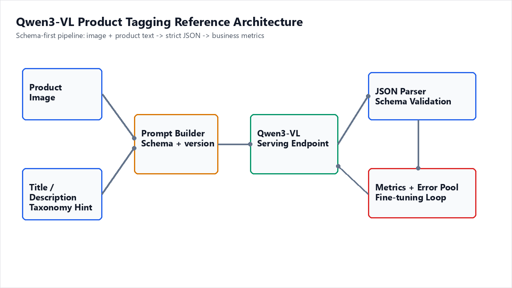
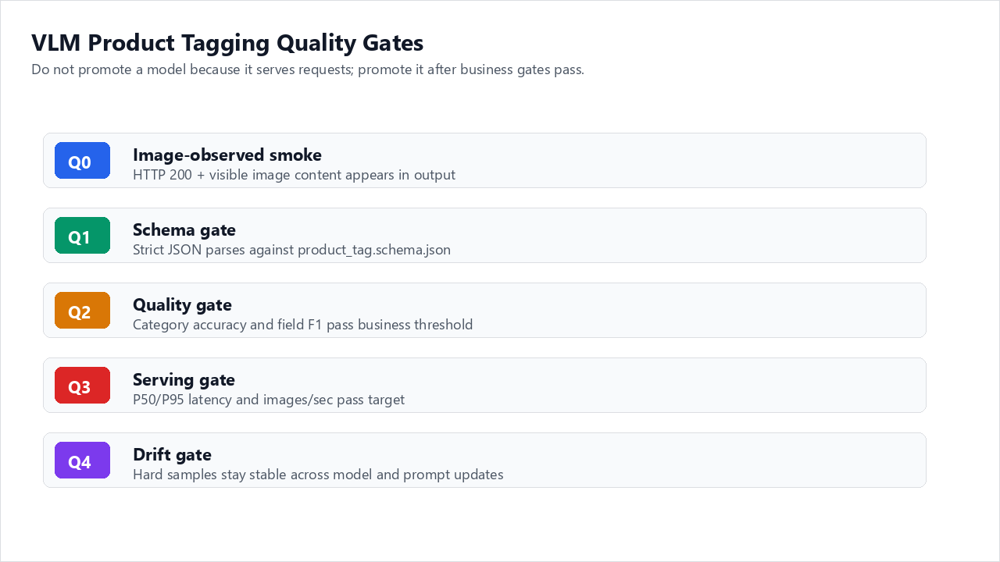
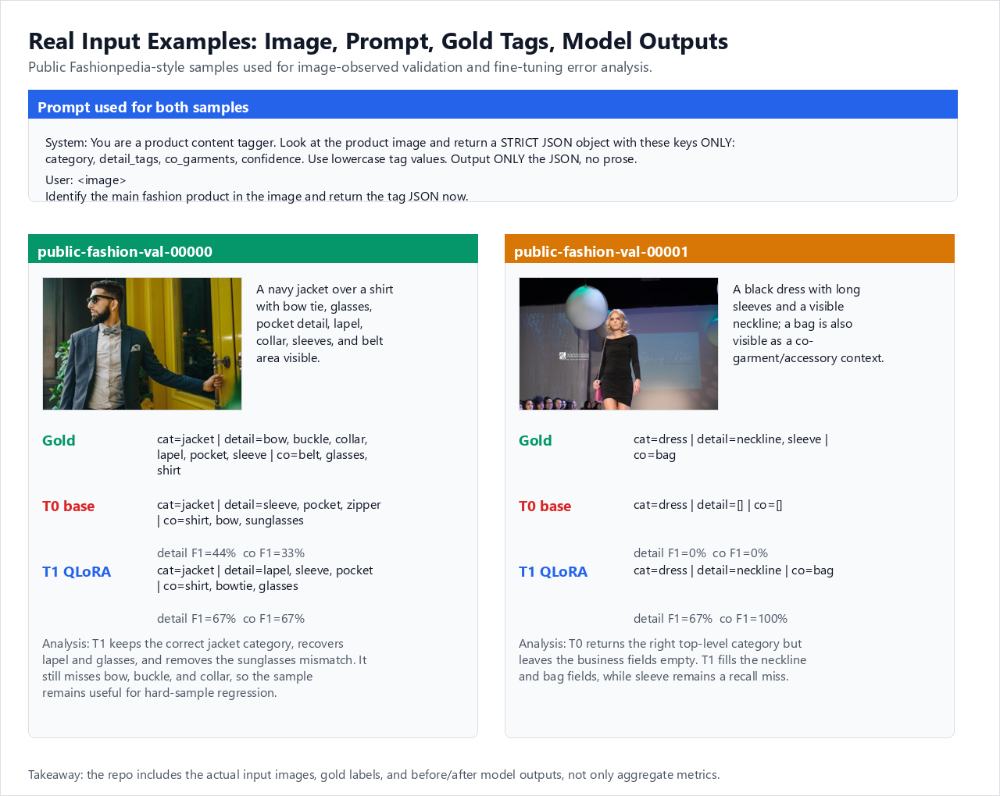
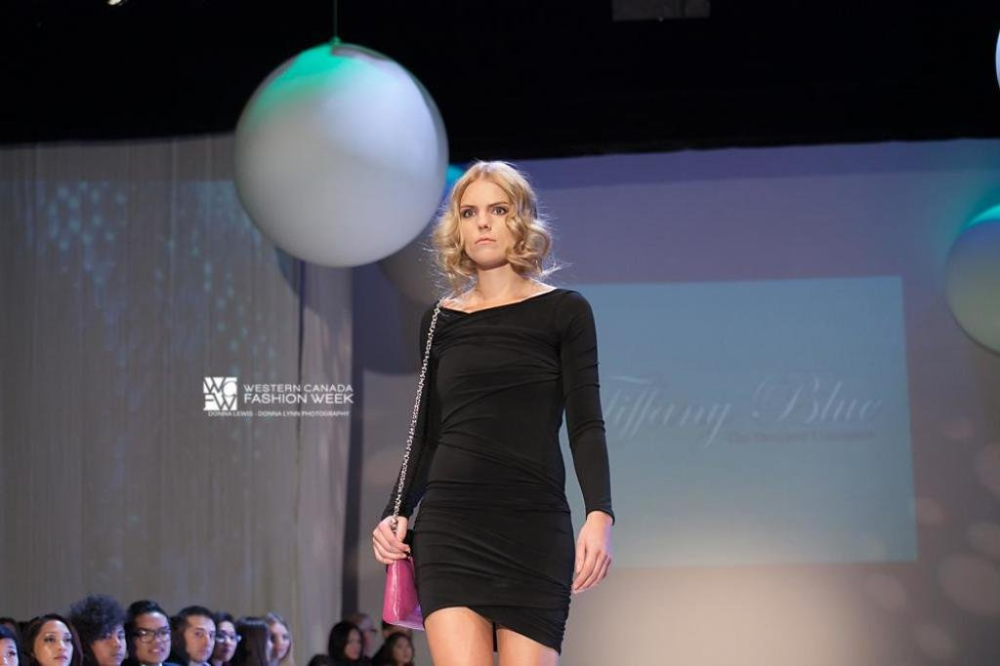
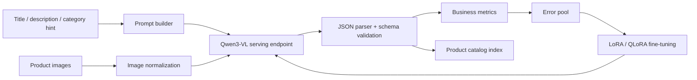
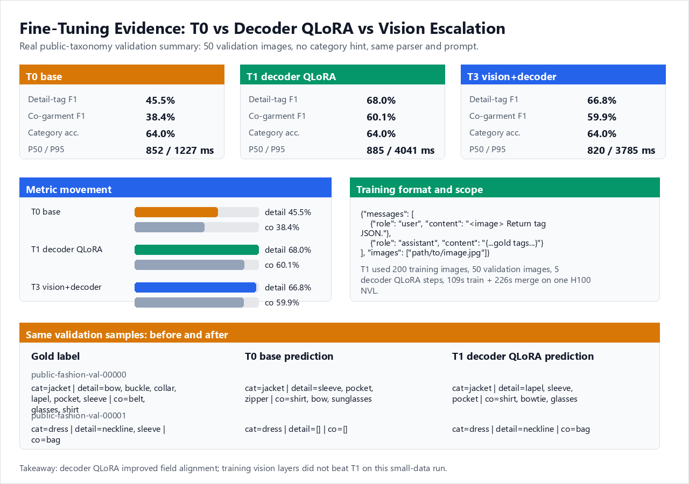
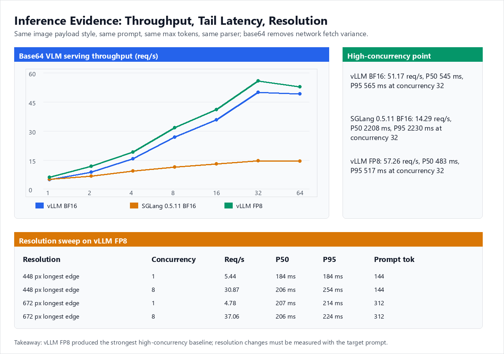
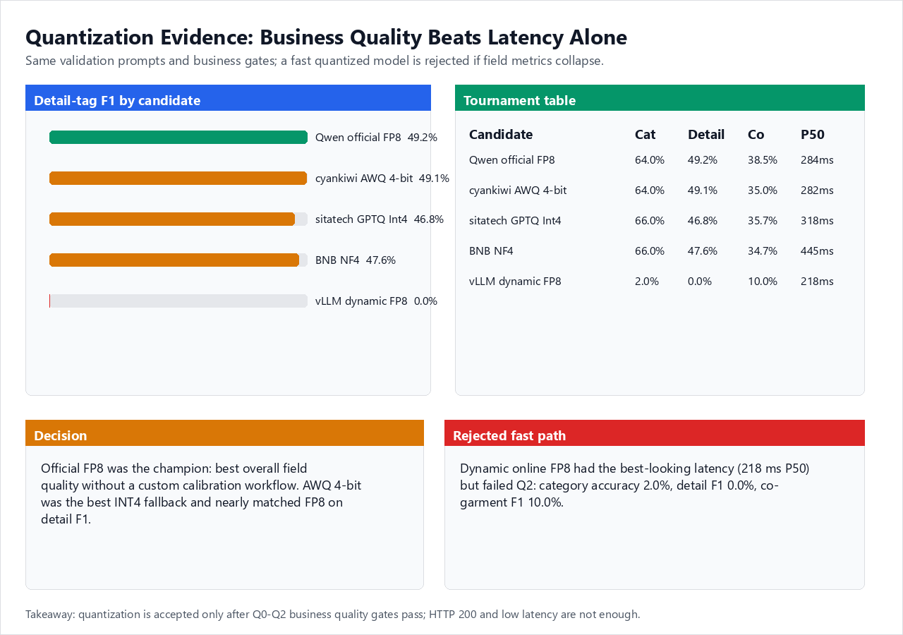
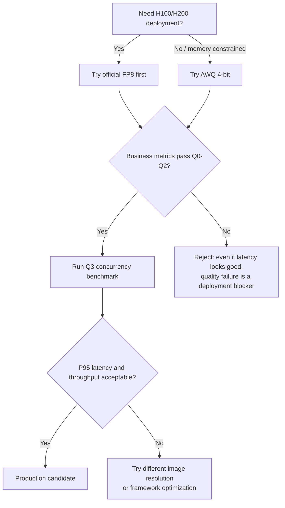

# Qwen3-VL Product Tagging on Azure

> **Author**: Xinyu Wei (魏新宇) — Microsoft AI GBB Senior System Engineer

[中文版](README-CN.md) | English

[](https://huggingface.co/Qwen/Qwen3-VL-8B-Instruct)
[](https://docs.vllm.ai/)
[](https://github.com/hiyouga/LLaMA-Factory)
[](https://huggingface.co/datasets/detection-datasets/fashionpedia)

Production-oriented VLM engineering guide for fashion retail: product image and text in, catalog-ready structured JSON tags out.

## Running on Azure

This repo is not a single-shot demo — it documents a **schema-first engineering pipeline** for taking a fashion retail Qwen3-VL deployment from prototype to production on a single Azure GPU. The path covers five stages, executed in this order:

1. **Schema design** — define the catalog-ready JSON schema first; every downstream component is built around it
2. **Image-observed validation** — prove the model actually consumes the image with smoke tests, not just returns plausible-looking text
3. **Fine-tuning strategy** — decoder LoRA → BF16 Full LoRA → vision-aware ablations, each as a controlled comparison
4. **Serving framework selection** — vLLM vs SGLang measured head-to-head under the same image, prompt, and concurrency
5. **Quantization track** — official FP8 vs dynamic FP8 vs AWQ 4-bit, validated against business metrics (not just latency)

The repo ends with a reproducibility checklist and full data artifacts (JSON dumps of every benchmark run). All experiments fit on **one Azure H100 NVL 95 GB GPU** — no multi-GPU or distributed scheduling required.

The diagram below shows the core data flow of the entire pipeline; section 3 walks through each stage in detail.



---

## Executive Summary

Below is a condensed summary of the full engineering validation. Each finding has corresponding raw data and experiment records in later sections.

### Recommended Path

| Decision area | Recommendation | Why it matters |
|---|---|---|
| **Serving engine** | Start with **vLLM OpenAI-compatible serving** | Fast PoC path, mature batching, straightforward API integration |
| **Fine-tuning** | Start with **decoder LoRA**, use QLoRA for memory-limited GPUs and BF16 Full LoRA on H100/H200 | Most retail gains come from taxonomy and JSON alignment, not visual re-training |
| **Quantization** | Prefer **official FP8 on H100/H200**; use **AWQ 4-bit** when memory pressure dominates | FP8 keeps quality with low operational friction; AWQ is a strong INT4 fallback |
| **Validation gate** | Require image-observed smoke + business-metric regression | HTTP 200 is not enough for VLM; the model must actually consume image pixels |
| **Production rollout** | Schema-first → benchmark → tune → quantize | Prevents demo success from turning into untraceable production behavior |

### Key Findings (Validation Conditions)

All findings below come from the same controlled environment:

| Condition | Value |
|---|---|
| GPU | 1× NVIDIA H100 NVL 95 GB (Azure NC40ads H100 v5) |
| Model | `Qwen/Qwen3-VL-8B-Instruct` (BF16) and `Qwen3-VL-8B-Instruct-FP8` |
| Serving | vLLM 0.20.2 Docker (`vllm/vllm-openai:latest`), `max_model_len=8192` |
| Validation set | 50 images from a public fashion taxonomy dataset, no category hint in prompt |
| Fairness | Same images, same prompt, same decoding params, same parser, one container at a time |

| Finding | Measured result | Action |
|---|---|---|
| Decoder fine-tuning improved business tags | Detail-tag F1 moved from **45.53%** to **67.99%** with T1 QLoRA, then to **78.11%** with controlled BF16 Full LoRA | Tune the decoder first |
| Vision-layer escalation did not beat decoder QLoRA | T3 detail-tag F1 was **66.79%**, below T1's **67.99%** on the same validation split | Do not train vision layers until error analysis proves visual perception is the bottleneck |
| vLLM scaled better for concurrent VLM serving | BF16 base64 throughput at concurrency 32: **vLLM 51.17 req/s** vs **SGLang 14.29 req/s** | Use vLLM for the first Azure PoC |
| Dynamic online FP8 failed the business-quality gate | It reached **218 ms P50**, but category accuracy collapsed to **2%** and detail F1 to **0%** | Treat quantization as a quality problem, not just a latency problem |
| Official FP8 was the safest H100/H200 deployment path | Official FP8 had the best overall tournament profile: detail F1 **49.2%**, co-garment F1 **38.5%**, P50 **284 ms** | Use it as the quality-first default |

> Measurement note: tables use rounded values from [`data/public_validation_summary.json`](data/public_validation_summary.json), which is built from open-source Fashionpedia-style validation samples. Production acceptance should still be repeated on the customer's own taxonomy and product distribution.

### Recommended Production Configuration

| Parameter | Recommended value | Rationale |
|---|---|---|
| Model checkpoint | `Qwen/Qwen3-VL-8B-Instruct-FP8` | Quality-first, no calibration needed |
| Serving engine | vLLM ≥ 0.20.x with `--trust-remote-code` | Verified Qwen3-VL multimodal path |
| `temperature` | 0.0 | Tagging needs stability, not diversity |
| `max_tokens` | 512 | Product JSON is compact |
| `max_model_len` | 4096–8192 | Longer context wastes KV cache for tagging |
| Image preprocessing | Resize longest edge to 448–672 px | Negligible quality impact; +10–30% throughput at high concurrency |
| Prefix caching | ON | ~+30% throughput for same-prompt batch tagging |

---

## 1. Background

### 1.1 Qwen3-VL 8B Instruct

Qwen3-VL is a Vision-Language Model family from Alibaba that supports image-text-to-text tasks. The 8B Instruct variant provides a `Qwen3VLForConditionalGeneration` architecture with dynamic-resolution ViT, a multimodal projector, and a language decoder.

- **Model card**: https://huggingface.co/Qwen/Qwen3-VL-8B-Instruct (accessed 2026-05-12)
- **FP8 variant**: https://huggingface.co/Qwen/Qwen3-VL-8B-Instruct-FP8
- **Architecture**: ViT encoder → multimodal projector/merger → language decoder
- **Key capability**: structured JSON output from image + text input

The dynamic-resolution ViT means Qwen3-VL does not force images to a fixed square. It tiles images into variable-size patches, which helps fashion tagging where garments appear at different aspect ratios. This matters because cropping or padding to a fixed square can cut off sleeves, hems, or accessories that carry label-relevant information.

### 1.2 Why This Task Is Not a Generic VLM Benchmark

Fashion product tagging is **not** image captioning or VQA. The output must be:

- Valid JSON against a fixed schema
- Categorized using a controlled taxonomy (not free text)
- Stable across repeated calls (no random drift)
- Evaluable per-field (category accuracy, multi-label F1, attribute accuracy)

Generic VLM leaderboard scores (MMMU, MMBench, etc.) do not predict tagging quality. A model that scores well on visual Q&A may still produce invalid JSON, hallucinate materials, or use free-text color names instead of the controlled taxonomy.

### 1.3 Why Qwen3-VL 8B and Not a Larger or Different VLM

| Selection criterion | Qwen3-VL 8B reasoning |
|---|---|
| **JSON instruction following** | Qwen3-VL has strong structured-output compliance at 8B; larger models improve fluency but not JSON compliance |
| **Parameter budget** | 8B fits in a single H100 with room for FP8 and batching. 72B requires multi-GPU for the same throughput |
| **Dynamic resolution** | Unlike fixed-resolution VLMs, Qwen3-VL preserves garment aspect ratios without padding artifacts |
| **FP8 ecosystem** | Official FP8 checkpoint exists, verified by the Qwen team, no custom calibration needed |
| **Tokenizer** | Qwen tokenizer handles CJK characters well, relevant for product titles in multiple languages |
| **LoRA support** | Decoder-only LoRA converges quickly on small fashion datasets (~200 images, ~2 min on H100) |

This is not an endorsement of Qwen3-VL as universally best. It is a statement that for this specific task, 8B with decoder LoRA delivers the best ROI under Azure GPU constraints.

---

## 2. Methodology

### 2.1 Schema-First Design

The schema is the contract between the model and the commerce platform:

```json
{
  "category": "jacket",
  "colors": ["navy"],
  "materials": ["cotton_blend"],
  "patterns": ["solid"],
  "style_tags": ["formal", "layering"],
  "attributes": {
    "sleeve_length": "long_sleeve",
    "neckline": "collar",
    "fit": "regular"
  },
  "confidence": 0.86
}
```

The full JSON schema is in [`schemas/product_tag.schema.json`](schemas/product_tag.schema.json).

Design the schema **before** training. If the taxonomy changes after fine-tuning, the LoRA must be retrained. Schema drift is the most common source of silent quality regression.

### 2.2 Evaluation Gates



A VLM product-tagging model should not move forward just because an endpoint returns HTTP 200. It should first prove that image input, JSON format, business quality, serving behavior, and regression stability all hold.

| Gate | Metric | Purpose |
|---|---|---|
| **Q0** image smoke | HTTP 200 + image content observed in response | Prevents text-only false positives |
| **Q1** schema gate | JSON parse success + schema validity | Invalid output cannot enter a catalog system |
| **Q2** quality gate | Category accuracy, detail-tag F1, co-garment F1, optional MAE | Measures business utility |
| **Q3** serving gate | P50/P95 latency, throughput (tok/s), error rate under concurrency | Measures deployability |
| **Q4** drift gate | Repeated runs and hard-sample regression | Catches prompt, model, or parser drift |

Q2 uses three field-level metrics because product tagging is not a single yes/no task. The model returns a structured object such as `{"category":"jacket","detail_tags":["collar","pocket"],"co_garments":["shirt"]}`; each field answers a different business question.

| Result column | What it measures | How to read it |
|---|---|---|
| **Cat Acc** | Whether the main product category is correct, such as `jacket` vs `shirt` | A coarse catalog-routing signal; one wrong image moves the score by 2 pp on N=50 |
| **Detail F1** | Whether fine attributes such as collar, sleeve, pocket, zipper, print, lace, and buckle are correct | The primary signal for search, filters, recommendations, and attribute completion |
| **Co F1 / Co-garment F1** | Whether other garments visible in the same image are identified, such as shirt, belt, pants, or shoes | Useful for outfit understanding and recommendation; auxiliary if the task is single-item tagging |

For small validation sets (N ≈ 50), treat numbers as point estimates. Differences below ~0.02 F1 or a few milliseconds of latency should not drive production decisions without repeated runs.

### 2.3 Fairness Controls

Every comparison in this repo uses the same: image set, prompt, decoding parameters, JSON parser, Docker image, and GPU. The only variable changed per experiment is the one being tested.

### 2.4 Prompt Engineering for Structured Output

Prompt design has a surprisingly large impact on JSON compliance and field accuracy. Key lessons:

| Lesson | What we observed |
|---|---|
| **Explicit schema in prompt** | Including the exact JSON schema structure in the system prompt improves the rate of valid, parseable JSON outputs and reduces cases where the model wraps JSON in preamble text that breaks downstream parsing |
| **Enum lists in prompt** | Listing allowed values for `category`, `materials`, `patterns` in the prompt reduces free-text hallucination |
| **No category hint** | Providing the correct category in the prompt inflates accuracy; validation must run without hints |
| **Temperature 0** | Temperature > 0 introduces random field variation that breaks regression stability |
| **"Return only JSON"** | Adding this instruction reduces preamble text (e.g., "Sure, here is the JSON:...") that breaks JSON parsing |
| **One product per call** | Batching multiple products in one prompt increases cross-contamination between tags |

The smoke script (`scripts/smoke_openai_vlm.py`) uses a minimal prompt that demonstrates these patterns. Production prompts should add the full taxonomy but keep the same structural instructions.

### 2.5 Data Preparation

Training data for decoder LoRA requires image-text pairs with ground-truth JSON labels. Preparation considerations:

- **Image diversity**: include different angles, backgrounds, lighting, and garment states (flat-lay, on-model, hanging)
- **Label completeness**: every field in the schema must have a ground truth; missing fields train the model to skip them
- **Negative examples**: include edge cases where a field is legitimately empty (e.g., no pattern) so the model learns to output `[]` instead of hallucinating
- **Format**: LLaMA-Factory multimodal conversation format or equivalent; see `configs/lora_sft.example.yaml` for the template

The controlled fine-tuning run used a public Fashionpedia-style taxonomy (`category`, `detail_tags`, `co_garments`, `confidence`) so field-level precision/recall could be computed directly. A minimal training record looks like this:

```json
{
  "messages": [
    {
      "role": "system",
      "content": "Return ONLY strict JSON with category, detail_tags, co_garments, confidence."
    },
    {
      "role": "user",
      "content": "<image>\nIdentify the main fashion product and return tag JSON."
    },
    {
      "role": "assistant",
      "content": "{\"category\": \"jacket\", \"detail_tags\": [\"bow\", \"buckle\", \"collar\", \"lapel\", \"pocket\", \"sleeve\"], \"co_garments\": [\"belt\", \"glasses\", \"shirt\"], \"confidence\": 0.9}"
    }
  ],
  "images": ["path/to/public-fashion-image.jpg"]
}
```

That format matters. If the image is missing from the conversation, the model can learn to emit valid JSON from text alone, and later fail on real visual attributes.

### 2.6 Real Input Examples



The repo includes real public input images, not only aggregate tables. The examples below come from the Fashionpedia reference dataset and are tracked in [`data/sample_analysis_examples.json`](data/sample_analysis_examples.json). They are useful because they show exactly what the model saw, what the gold label expected, and how the output changed after decoder QLoRA.

What the three comparison columns mean:

- **Gold tags**: the human-annotated correct answer (ground truth), used as the baseline for judging model quality
- **T0 base output**: what the original Qwen3-VL produces with no fine-tuning at all — this is the out-of-the-box starting point
- **T1 decoder QLoRA output**: what the model produces after decoder QLoRA fine-tuning — this shows what fine-tuning actually improved

| Sample | Input image | Gold tags | T0 base output | T1 decoder QLoRA output | Analysis |
|---|---|---|---|---|---|
| `public-fashion-val-00000` |  | `category=jacket`; details: bow, buckle, collar, lapel, pocket, sleeve; co-garments: belt, glasses, shirt | `category=jacket`; details: sleeve, pocket, zipper; co-garments: shirt, bow, sunglasses | `category=jacket`; details: lapel, sleeve, pocket; co-garments: shirt, bowtie, glasses | T1 recovers `lapel` and `glasses`, removes the `sunglasses` mismatch, but still misses bow, buckle, and collar. |
| `public-fashion-val-00001` |  | `category=dress`; details: neckline, sleeve; co-garments: bag | `category=dress`; details: []; co-garments: [] | `category=dress`; details: neckline; co-garments: bag | T1 fills the neckline and bag fields, while sleeve remains a recall miss. |

The exact prompt used for these two samples is intentionally plain:

```text
System: You are a product content tagger. Look at the product image and return a STRICT JSON object with these keys ONLY: category, detail_tags, co_garments, confidence. Use lowercase tag values. Output ONLY the JSON, no prose.
User: <image>
Identify the main fashion product in the image and return the tag JSON now.
```

This is the kind of example a customer should review before trusting the aggregate F1 table. It reveals whether the model consumed the image, whether the label taxonomy is realistic, and whether fine-tuning changed the failure mode in a useful direction.

---

## 3. Reference Architecture

The architecture diagram is shown [at the top of this document](#running-on-azure). This section walks through what each stage actually does.

The core idea is **schema-first**: define the JSON schema first, then build prompts, training data, evaluators, and serving contracts around it. Do not run the model first and design the schema later — the schema determines the entire pipeline’s behavior.

**Data flow (left to right):**

1. **Input stage**: product images go through image normalization (resize to 448–672 px); product title/description/taxonomy hints enter the Prompt builder
2. **Inference stage**: Prompt builder assembles the image, text, and schema instruction into a request and sends it to the Qwen3-VL serving endpoint
3. **Parsing stage**: the JSON parser strictly parses and validates the model output against the schema; valid results enter the product catalog index
4. **Evaluation stage**: the business metrics calculator computes per-field accuracy, F1, and latency
5. **Closed loop**: the error pool collects hard samples and feeds them back to the next round of LoRA/QLoRA fine-tuning, which re-enters the serving endpoint — forming a continuous improvement loop



### 3.1 Component Engineering Notes

| Component | Responsibility | Production concern |
|---|---|---|
| Image normalization | Resizes images to 448–672 px longest edge | Oversized images waste KV cache and slow throughput; undersized images lose fine-grained attributes |
| Prompt builder | Manages taxonomy, schema, and prompt version | Prompt drift contaminates evaluation; prompt changes must trigger Q0-Q2 re-runs |
| VLM endpoint | Runs Qwen3-VL behind OpenAI-compatible API | Image path must be verified as consumed (Q0 smoke); version upgrades require re-testing |
| JSON parser | Converts raw model text into strict JSON | Invalid JSON should fail loudly, not silently drop fields; do not swallow errors with try/except |
| Business metrics calculator | Computes category accuracy, field F1, JSON format compliance, latency | Generic VLM benchmarks are not enough; each field needs separate scoring |
| Error pool | Stores hard samples to guide the next training round | Prevents random fine-tuning; focuses on actual failures, not just reporting an overall F1 |

### 3.2 Image Normalization Details

VLM throughput is directly tied to the number of visual tokens. Qwen3-VL tiles images dynamically, so larger images produce more tiles and more tokens. For fashion tagging:

- **448 px**: fast, sufficient for category and color; may lose fine-grained attributes (e.g., button count, embroidery pattern)
- **672 px**: good balance for most fashion items; recommended default
- **1344 px**: only if the task requires reading small text on labels or detecting very fine patterns

In the public FP8 sweep, 448 px used 144 prompt tokens while 672 px used 312 prompt tokens. Treat image size as a benchmark variable, not a fixed rule.

---

## 4. Fine-Tuning: From Experiment to Best Practice

This section combines fine-tuning experiment data, strategy choices, configuration parameters, and common mistakes into an end-to-end fine-tuning guide.

### 4.1 Fine-Tuning Experiment Results



The data below comes from a small-scale controlled experiment: 200 training images, 50 validation images, no category hint in prompt, identical parser and decoding settings.

| Stage | Trainable scope | JSON format compliance | Category acc. | Detail precision | Detail recall | Detail F1 | Co-garment F1 | P50 / P95 |
|---|---|---:|---:|---:|---:|---:|---:|---:|
| T0 base | None | 100% | 64.0% | 43.04% | 54.33% | 45.53% | 38.39% | 852 / 1227 ms |
| **T1 decoder QLoRA** | Decoder LoRA | 100% | 64.0% | **79.90%** | **65.00%** | **67.99%** | **60.14%** | 885 / 4041 ms |
| T3 vision+decoder | Decoder + last vision layers | 100% | 64.0% | 77.57% | 65.00% | 66.79% | 59.92% | 821 / 3785 ms |

Training record:

| Item | Value |
|---|---:|
| Train images | 200 |
| Validation images | 50 |
| Fine-tuning stage | Decoder QLoRA |
| Steps | 5 |
| Train time | 109 s |
| Merge time | 226 s |
| Adapter scope | Decoder attention and MLP projection modules |

The most useful evidence is the same-sample before/after (full image comparison in §2.6):

| Validation sample | Gold tags | T0 base output | T1 decoder QLoRA output | What changed |
|---|---|---|---|---|
| `public-fashion-val-00000` | `category=jacket`; details: bow, buckle, collar, lapel, pocket, sleeve; co-garments: belt, glasses, shirt | `category=jacket`; details: sleeve, pocket, zipper; co-garments: shirt, bow, sunglasses | `category=jacket`; details: lapel, sleeve, pocket; co-garments: shirt, bowtie, glasses | T1 recovers `lapel` and `glasses`, removes the `sunglasses` mismatch, but still misses bow, buckle, and collar. |
| `public-fashion-val-00001` | `category=dress`; details: neckline, sleeve; co-garments: bag | `category=dress`; details: []; co-garments: [] | `category=dress`; details: neckline; co-garments: bag | T1 fills the neckline and bag fields, while sleeve remains a recall miss. |

**Why precision improved more than recall**: decoder QLoRA mainly teaches taxonomy alignment and output discipline. The base model already sees many visual facts, but names them inconsistently or skips fields entirely. After fine-tuning, the model maps more visible facts to the correct controlled labels.

**Why vision-layer escalation did not help**: T3 expanded the trainable visual scope but did not improve business metrics. In this small-data experiment, more trainable modules added complexity without metric gain.

**2026-05-18 Full LoRA stress test and controlled rerun**: after the GPT-5.4 comparison, we first tried a stronger BF16-base Full LoRA run on H100: 200 images × 5 epochs and 500 images × 5 epochs, with the same 50-image validation split and no train/validation overlap. That run is a **confounded ablation**, not proof that Full LoRA is worse than QLoRA, because the training-label generator changed. We then reran T1 QLoRA, BF16 Full LoRA, and text/decoder full fine-tunes with the exact T1-style data path: largest-area garment as the main category and Fashionpedia category IDs 27-45 as `detail_tags`. The clean reruns are in [`data/gpt-vs-qwen/qwen_controlled_t1_qlora_rerun_20260518.json`](data/gpt-vs-qwen/qwen_controlled_t1_qlora_rerun_20260518.json), [`data/gpt-vs-qwen/qwen_controlled_full_lora_20260518.json`](data/gpt-vs-qwen/qwen_controlled_full_lora_20260518.json), [`data/gpt-vs-qwen/qwen_controlled_full_finetune_text_1e_20260518.json`](data/gpt-vs-qwen/qwen_controlled_full_finetune_text_1e_20260518.json), and [`data/gpt-vs-qwen/qwen_controlled_full_finetune_text_5e_20260518.json`](data/gpt-vs-qwen/qwen_controlled_full_finetune_text_5e_20260518.json); the confounded stress summary is kept in [`data/gpt-vs-qwen/qwen_full_lora_ablation_20260518.json`](data/gpt-vs-qwen/qwen_full_lora_ablation_20260518.json).

| Stage | Train images | Epochs | JSON | Category acc. | Detail F1 | Co-garment F1 | P50 / P95 |
|---|---:|---:|---:|---:|---:|---:|---:|
| **T1 decoder QLoRA** | 200 | 1 | 100% | 64.0% | **67.99%** | 60.14% | 885 / 4041 ms |
| Controlled T1 QLoRA rerun | 200 | 1 | 100% | **78.0%** | 68.52% | 63.23% | **410 / 632 ms** |
| Controlled BF16 Full LoRA | 200 | 1 | 100% | **74.0%** | 70.73% | 60.37% | **313 / 468 ms** |
| Controlled text full fine-tune | 200 | 1 | 100% | 72.0% | 75.21% | 67.03% | **311 / 455 ms** |
| Controlled text full fine-tune | 200 | 5 | 100% | 76.0% | 77.05% | **73.72%** | **315 / 445 ms** |
| **Controlled BF16 Full LoRA** | 200 | 5 | 100% | 74.0% | **78.11%** | 73.27% | **318 / 421 ms** |
| T2 Full LoRA, confounded | 200 | 5 | 100% | 70.0% | 17.72% | 71.89% | **277 / 419 ms** |
| T3 Full LoRA, confounded | 500 | 5 | 100% | 66.0% | 0.80% | 71.00% | **269 / 324 ms** |

The operational conclusion changed after the clean rerun: the earlier collapse was primarily a **label-path confound**, not evidence that Full LoRA is intrinsically weak. The controlled T1 QLoRA rerun stayed close to the original T1 detail score, moving from 67.99% to 68.52%, so the QLoRA baseline is stable rather than secretly much stronger. Full text/decoder fine-tuning also ran successfully on H100: 1 epoch reached 75.21% detail F1, and the matched 5-epoch run reached 77.05% detail F1. At the aligned 5-epoch budget, BF16 Full LoRA and Full SFT are in the same quality band: Full LoRA is 78.11% on detail F1, while Full SFT is 77.05%; Full SFT is slightly higher on category accuracy (76% vs 74%) and co-garment F1 (73.72% vs 73.27%). Those 1 pp-level gaps are point estimates on N=50, not proof that either method is intrinsically superior. The robust conclusions are narrower: local Qwen fine-tuning works, the old T2/T3 rows are failure-mode records for changed labels, and the self-hosted path can reach GPT-class field quality with much lower latency. Repeat the same controlled design on the customer's real taxonomy before production claims.

### 4.2 Fine-Tuning Strategy: What to Train and When to Stop

| Track | Trainable area | Use when | Stop condition |
|---|---|---|---|
| T0 | No training | Establish baseline | Valid JSON + business metrics collected |
| T1 | Decoder LoRA / QLoRA | Taxonomy and JSON alignment are weak | Field-level F1 improves without tail-latency blow-up |
| T2 | Decoder + projector LoRA | Visual facts are recognized but mapped to wrong fields | Attribute-level errors improve |
| T3 | Last vision layers | Repeated visual-detail failures | Only after larger labeled data is available |
| T4 | Text/decoder full fine-tuning | Adapter capacity may be the bottleneck | Compare against controlled Full LoRA under the same data path and epoch budget |

Do not start by training the vision tower. Qwen3-VL already has strong generic visual recognition; small retail datasets are usually better spent on output alignment.

**Conclusion**: make T0 and T1 rigorous in the first PoC phase. Escalate to vision layers only when error analysis shows repeated visual perception failures — not just taxonomy alignment mistakes.

### 4.2.1 Why LoRA Can Beat Full Fine-Tuning on This Task

The 2026-05-18 controlled runs do not prove that LoRA is universally better than full fine-tuning. They do show a common small-data pattern: for taxonomy alignment, constrained updates can generalize better than updating the full decoder. In this repo, BF16 Full LoRA 5e reached **78.11%** detail F1, while full text/decoder SFT 5e reached **77.05%** on the same 50-image validation split. That 1.06 pp gap is a point estimate, but the engineering explanation is important.

| Factor | Why it helps LoRA on this workload |
|---|---|
| Small training set | With only 200 training images, full SFT can move many more weights than the data can reliably support. LoRA limits the update to low-rank adapter directions. |
| Task shape | Product tagging is mostly taxonomy and JSON alignment: map visual evidence into fixed fields and tag lists. It does not require relearning visual perception from scratch. |
| Regularization | Rank 16 + alpha 32 + dropout 0.05 acts as a capacity constraint. The model can adjust output boundaries without overwriting too much base knowledge. |
| Base model quality | Qwen3-VL already recognizes generic garments and visual attributes. The adapter mostly teaches how this repo wants those facts serialized. |
| Metric focus | Detail F1 rewards precise multi-tag selection. A decoder adapter is often enough to improve this field without changing the full representation stack. |

Full SFT is still useful when adapter capacity becomes the bottleneck or when larger customer-native training data is available. In this run it is competitive, not failed: Full SFT 5e is slightly higher on category accuracy and co-garment F1. The conservative decision rule is therefore: use Full LoRA first on H100/H200 for quality-first small-data alignment; keep Full SFT as the next escalation when more data or a hyperparameter sweep justifies the extra freedom.

### 4.3 Decoder QLoRA Configuration

The T1 run in this repo used the following reproducible decoder QLoRA shape:

| Parameter | Value | Why |
|---|---:|---|
| `lora_target` | `q_proj,k_proj,v_proj,o_proj,gate_proj,up_proj,down_proj` | Decoder attention and MLP projections only |
| `lora_rank` | 16 | Conservative small-data rank |
| `lora_alpha` | 32 | 2x rank is a common starting point |
| `lora_dropout` | 0.05 | Reduces overfitting on small datasets |
| `per_device_train_batch_size` | 1 | VLM images create memory variance |
| `gradient_accumulation_steps` | 16 | Stabilizes updates without large per-device batch |
| `learning_rate` | 0.0001 | Standard LoRA/QLoRA starting point |
| `cutoff_len` | 4096 | Product tagging does not need long context |

The public template is in [`configs/lora_sft.example.yaml`](configs/lora_sft.example.yaml). The actual T1 config used in this experiment is [`configs/qwen3vl_t1_qlora_fashionpedia.yaml`](configs/qwen3vl_t1_qlora_fashionpedia.yaml).

### 4.3.1 How to Run: Train → Merge → Serve

**Step 1 — Prepare training data** (convert Fashionpedia to LLaMA-Factory multimodal conversation format):

```bash
python scripts/prepare_fashionpedia_v2_dataset.py \
    --input-dir ./raw_fashionpedia \
    --output ./data/fashionpedia_train.json \
    --max-samples 200
```

Each output record looks like the sample in §2.5 — `messages` (system + user with `<image>` + assistant with gold JSON) + `images` (path list).

**Step 2 — Register dataset** in LLaMA-Factory's `dataset_info.json` (example in [`configs/dataset_info_fashionpedia.json`](configs/dataset_info_fashionpedia.json)):

```json
{
  "fashionpedia_train": {
    "file_name": "/path/to/fashionpedia_train.json",
    "formatting": "sharegpt",
    "columns": { "messages": "messages", "images": "images" }
  }
}
```

**Step 3 — Train** (LLaMA-Factory CLI):

```bash
llamafactory-cli train configs/qwen3vl_t1_qlora_fashionpedia.yaml
```

Expected terminal output (5-step run on H100 NVL):

```
[INFO] Loading model Qwen/Qwen3-VL-8B-Instruct ...
[INFO] trainable params: 20,971,520 || all params: 8,309,755,904 || trainable%: 0.2524
[INFO] ***** Running training *****
  Num examples = 200
  Num Epochs = 1
  Total train batch size = 8 (per_device=1 × gradient_accum=8)
  Total optimization steps = 5
{'loss': 1.6438, 'grad_norm': 2.13, 'learning_rate': 1e-04, 'epoch': 0.20}  Step 1/5
{'loss': 0.8921, 'grad_norm': 1.87, 'learning_rate': 9.05e-05, 'epoch': 0.40}  Step 2/5
{'loss': 0.6104, 'grad_norm': 1.52, 'learning_rate': 6.55e-05, 'epoch': 0.60}  Step 3/5
{'loss': 0.4876, 'grad_norm': 1.34, 'learning_rate': 3.45e-05, 'epoch': 0.80}  Step 4/5
{'loss': 0.3912, 'grad_norm': 1.21, 'learning_rate': 9.55e-06, 'epoch': 1.00}  Step 5/5
[INFO] Training completed. Total time: 109s
```

**Loss function**: LLaMA-Factory SFT uses standard **causal language modeling cross-entropy loss** — the model learns to predict each token in the assistant's gold JSON response, conditioned on the system prompt + user prompt + image tokens. The loss is only computed on the assistant turn (the gold label), not on the system/user turns. This is the same loss used in all autoregressive LLM fine-tuning; the multimodal part is that the image tokens from the ViT encoder are prepended to the text token sequence before the decoder processes them.

**Step 4 — Merge adapter into base model** (produces a standalone checkpoint):

```bash
llamafactory-cli export \
    --model_name_or_path Qwen/Qwen3-VL-8B-Instruct \
    --adapter_name_or_path ./output/qwen3vl_t1_qlora \
    --template qwen2_vl \
    --export_dir ./merged_model/qwen3vl_t1 \
    --export_size 2
```

Expected output: `Model saved to ./merged_model/qwen3vl_t1` (merge takes ~226s on H100).

**Step 5 — Serve the merged model** with vLLM:

```bash
docker run --gpus all --rm -p 8000:8000 \
  -v $(pwd)/merged_model/qwen3vl_t1:/model \
  vllm/vllm-openai:latest \
  --model /model \
  --max-model-len 8192 \
  --trust-remote-code
```

### 4.3.2 Key Config Decisions Explained

| Config line in YAML | What it does | Why this value |
|---|---|---|
| `freeze_vision_tower: true` | ViT encoder weights are frozen, not trained | Small-data fine-tuning should not modify visual features — errors are taxonomy alignment, not visual perception |
| `freeze_multi_modal_projector: true` | The projector between ViT and decoder is also frozen | Same reason; only the decoder learns new taxonomy mapping |
| `quantization_bit: 4` + `quantization_method: bnb` | Base model loaded in NF4 (4-bit NormalFloat) | Saves ~6 GB VRAM; enables training on cards with <24 GB |
| `template: qwen2_vl` | LLaMA-Factory's conversation template for Qwen2/3 VL models | Must match the model family; wrong template → broken chat format |
| `optim: paged_adamw_8bit` | 8-bit paged AdamW optimizer from bitsandbytes | Further VRAM savings without quality loss |
| `lr_scheduler_type: cosine` | Cosine annealing learning rate schedule | Smooth decay; avoids sharp drops at fixed steps |

### 4.4 QLoRA vs Full LoRA

| Aspect | QLoRA (NF4 base + LoRA adapters) | Full LoRA (BF16 base + LoRA adapters) |
|---|---|---|
| GPU memory | ~12 GB for 8B model | ~18 GB for 8B model |
| Training speed | Slightly slower due to dequantization | Fastest |
| Quality | Strong low-memory baseline; 67.99% detail F1 in the T1 run | Highest detail-F1 point estimate after the controlled rerun; 78.11% on the same validation split |
| Recommendation | Use when GPU memory is constrained or you need a portable first pass | Use on H100/H200 when quality matters and the data path is locked |

Both paths are viable. The controlled rerun shows why the data path matters more than the training label attached to the run: once Full LoRA reused the exact T1-style data generation and evaluation path, it recovered from the old collapse and reached the strongest detail-F1 point estimate in this repo. This is not an isolated proof that Full LoRA is intrinsically better than QLoRA, because the QLoRA and Full LoRA rows still differ in epochs, optimizer, learning rate, and quantization. On Azure H100 NVL (95 GB), BF16 Full LoRA is the quality-first local recipe to try; QLoRA remains the practical choice for smaller GPUs.

### 4.4.1 Merged Checkpoint vs Runtime LoRA Adapter (Deployment Comparison)

Once an adapter is trained, vLLM offers two deployment options. They are mathematically equivalent (W + α·BA) but differ in BF16 numerical paths and engine internals.

| Path | How to deploy | Adapter location |
|---|---|---|
| **A: merged checkpoint** | `llamafactory-cli export` produces a standalone checkpoint, then `vllm serve /merged_ckpt` | Fused into base weights, no runtime overhead |
| **B: runtime LoRA** | `vllm serve /base --enable-lora --max-lora-rank 16 --lora-modules t1=/lora_path` | Loaded as an overlay each forward pass |

To isolate which path is better for production, we ran a controlled benchmark with 2 different adapters × 2 deployment paths × 5 runs = **20 steady-state data points** (50 validation images per run, run 1 cold start discarded). Raw data: [`data/gpt-vs-qwen/qwen_merge_vs_runtime_5runs_20260519.json`](data/gpt-vs-qwen/qwen_merge_vs_runtime_5runs_20260519.json).

| Adapter | A merged Detail F1 | B runtime Detail F1 | B − A | A merged P50 | B runtime P50 | A speed advantage |
|---|---:|---:|---:|---:|---:|---:|
| Full LoRA **5e** | **78.78%** | 77.13% | −1.65pp | **269 ms** | 354 ms | A faster +31.6% |
| Full LoRA **1e** | 70.40% | **71.63%** | +1.23pp | **266 ms** | 354 ms | A faster +33.1% |

> **Reading the table**: On Detail F1, the 5e adapter favors merged by 1.65pp while the 1e adapter favors runtime by 1.23pp. The direction *reverses* across adapters, and both differences fall inside N=50 single-image noise (1 image flip ≈ 2pp). Cat and Co F1 are also direction-mixed (5e: runtime higher by 2pp / 1.9pp; 1e: merged higher by 2pp on Cat). On P50 latency, merged is consistently ~32% faster across both adapters — this is a stable, methodology-level signal.

**Engineering takeaways**:

- **Quality has no stable direction**: merged neither raises nor lowers Detail / Cat / Co F1 in a methodology-meaningful way. The 1-2pp gaps are noise, not method differences.
- **Performance is stable**: merged P50 is ~32% lower than runtime LoRA, even though vLLM 0.20.2 enables CUDA Graph for LoRA (`cudagraph_specialize_lora=True`). The remaining gap comes from the per-step BA multiplication and Punica overhead.
- **vLLM greedy is deterministic at `temperature=0`**: across both paths, runs 2-5 produced byte-identical JSON for all 50 images. Only run 1 (cold start) deviated by 0.3-1.5pp due to kernel autotune, prefix cache warm-up, and JIT compilation. **Always discard run 1 when benchmarking vLLM.**

**Where does the 32% speedup come from? — Streaming benchmark decomposition (TTFT vs decode tok/s)**

The table above reports end-to-end latency, which conflates prefill (TTFT) and decode. To find out *where* merged actually wins, we re-ran the same 2 adapters × 2 paths × 5 runs with streaming enabled, measuring TTFT and decode throughput separately. Raw data: [`data/gpt-vs-qwen/qwen_merge_vs_runtime_streaming_5runs_20260519.json`](data/gpt-vs-qwen/qwen_merge_vs_runtime_streaming_5runs_20260519.json).

| Adapter | Path | TTFT P50 | Decode tok/s | E2E P50 | Output tokens |
|---|---|---:|---:|---:|---:|
| 5e | A merged  | **22 ms** | **166.7** | **265 ms** | 41.4 |
| 5e | B runtime | 27 ms | 125.6 | 354 ms | 41.7 |
| 1e | A merged  | **22 ms** | **166.4** | **265 ms** | 41.9 |
| 1e | B runtime | 26 ms | 125.6 | 353 ms | 42.4 |

Delta (runtime − merged), warm-run steady state across both adapters:

| Metric | Delta | Share of E2E gap |
|---|---:|---:|
| TTFT | +4-5 ms | **~5%** |
| Decode tok/s | −41 tok/s (−24.6%) | — |
| Decode time | +84 ms | **~95%** |
| **E2E** | **+88-89 ms (+33%)** | 100% |

**Key insight**: of the 33% E2E speedup from merging, **~95% comes from the decode stage**, not from TTFT. This matches the underlying mechanism:

- **TTFT (prefill)** runs the LoRA `BA` computation once per request as a batched matmul over all input tokens. The cost is amortized across 2770+ input tokens and stays negligible.
- **Decode** runs one forward pass per output token. Each pass adds a fresh `BA` computation across 36 layers × 7 target modules. For a 42-token output, runtime LoRA accumulates ~10,584 extra small matmuls per request — small per-op but linear in output length.

**Implication for production**: the longer the output, the larger the merge advantage. For 42-token tagging responses merged is ~33% faster; for 500-token structured outputs the gap will widen proportionally. Streaming-aware decomposition is required to make this call — a single E2E latency number would have hidden which stage was slow and led to incorrect optimization targets.

**Decision matrix**:

| If you need… | Pick | Why |
|---|---|---|
| Single-LoRA production serving (SHEIN product tagging case) | **A: merged** | Same quality, 32% faster, simpler ops |
| FP8 / AWQ / quantization deployment | **A: merged** | Quantization requires a single fused checkpoint |
| Multi-LoRA hot-swap (e.g. per-customer adapter) | **B: runtime** | Required capability; the 32% latency cost is the price of hot-swap |
| Rapid adapter experimentation (try 5 adapters back to back) | **B: runtime** | Skips the merge + reload step |

**vLLM 0.20.2 + Qwen3-VL notes**:

- `--enable-lora` warns `no matching PunicaWrapper ... visual.blocks` for Qwen3-VL — this only affects vision-tower LoRA. Our adapter targets decoder text projections (`q_proj`, `k_proj`, `v_proj`, `o_proj`, `gate_proj`, `up_proj`, `down_proj`), so the warning is benign.
- `--max-lora-rank` must match the adapter rank (16 in our case).
- Inference requests use `"model": "t1"` (the adapter name) instead of `"model": "/base"` to apply the adapter.

### 4.5 Common Fine-Tuning Mistakes

| Mistake | Consequence | Fix |
|---|---|---|
| Training on data without image input | Model learns to output JSON from text alone; ignores images at inference | Always include the image in training conversations |
| Using free-text labels as ground truth | Model learns synonyms instead of the controlled taxonomy | Map labels to schema enum values before training |
| Training for too many epochs | Overfits to training images; novel products get wrong tags | Watch validation loss; stop at 2–5 epochs |
| Not freezing vision tower on small data | Adds noise to visual features; can degrade base model quality | Freeze vision tower unless error analysis shows visual perception is the bottleneck |
| Mixing schema versions in training data | Model outputs inconsistent field sets | Freeze schema version during training |
| Changing label generation while changing training method | You cannot tell whether the method or the labels caused the metric change | Reuse the same train JSON before comparing QLoRA, Full LoRA, epochs, or optimizer |

---

## 5. Inference Engine Selection and Optimization

This section combines engine comparison, SGLang issues, vLLM optimization experiments, and framework selection into an end-to-end inference engineering guide. The full inference test cycle produced 170+ artifact files covering 18 serving benchmark runs and multiple ablation experiments.

### 5.1 Engine Comparison: vLLM vs SGLang



All requests use the same base64 image, prompt, `max_tokens`, and parser. This benchmark compares engine serving behavior, not final business quality.

| Engine | C1 req/s (ms/req) | C8 req/s (ms/req) | C16 req/s (ms/req) | C32 req/s (ms/req) | C32 P50 | C32 P95 | C64 req/s (ms/req) |
|---|---:|---:|---:|---:|---:|---:|---:|
| vLLM BF16 | 4.24 (236) | 26.98 (296) | 36.30 (441) | **51.17 (625)** | 545 ms | 565 ms | 50.44 (1269) |
| SGLang 0.5.11 BF16 | 4.30 (233) | 10.93 (732) | 12.54 (1276) | 14.29 (2239) | 2208 ms | 2230 ms | 14.14 (4527) |
| vLLM FP8 | **5.38 (186)** | **32.13 (249)** | **41.78 (383)** | **57.26 (559)** | **483 ms** | **517 ms** | **54.22 (1180)** |

> Numbers in brackets are the **average end-to-end latency per request** (ms/req), computed via Little's Law as `Concurrency / req·s⁻¹ × 1000`. For C32, the measured P50 / P95 are also listed (median is typically smaller than the mean due to right-skewed latency distribution under batching). This is a **batch-serving workload (short output ~33 tokens)**, so `req/s` is the primary metric; `tokens/s` is not separately tracked here — it can be derived as `req/s × output_tokens` if needed.

<details>
<summary><b>How to read `ms/req` and pick the right concurrency for your workload</b></summary>

**Formula (Little's Law)**: `avg_ms_per_request = Concurrency / Throughput(req/s) × 1000`

The bracketed value is the latency **per individual request**, not the total time for all concurrent requests. Examples:

- **C1 = 5.38 req/s → 186 ms/req**: server completes 5.38 requests per second; each request takes `1/5.38 = 186 ms`.
- **C64 = 54.22 req/s → 1180 ms/req**: 64 requests are in flight simultaneously; each one waits on average `64/54.22 × 1000 = 1180 ms` before getting a response.

**Throughput ↑ and per-request latency ↑ is the fundamental trade-off of batch serving**. Picking the right operating point depends on the business scenario:

| Scenario | Optimize for | Recommended operating point |
|---|---|---|
| Offline bulk tagging (millions of images) | Throughput (req/s) | C32 vLLM FP8 → 57.26 req/s, ~206k images/hour |
| Interactive single-user query | Per-request latency (ms/req) | C1–C4 → 186–250 ms/req |
| Realtime API with strict SLA (e.g. P95 < 1s) | Latency under load | C16 vLLM FP8 (P95 463 ms) |

The restaurant analogy: 1 table served in 5 minutes vs. 64 tables served simultaneously where each table waits 20 minutes — the kitchen processes more tables per hour, but each table waits longer. Same physics applies to GPU batch serving.

</details>

> **In products per hour**: vLLM FP8 at C32 = 57.26 req/s = **~206,000 images/hour** (short output). This is already high for single-card H100 VLM serving (~2770 prompt tokens per image tile). But note: this is a short-output benchmark, not production sizing data.

| Model path | Concurrency | Throughput | P50 | P95 | Mean output tokens | Products/hour |
|---|---:|---:|---:|---:|---:|---:|
| BF16 tagging | 1 | 0.512 req/s | 1952 ms | 1818 ms | 108 | 1,843 |
| BF16 tagging | 16 | 5.982 req/s | 2326 ms | 2663 ms | 114 | **21,535** |
| FP8 tagging | 1 | 0.298 req/s | 3352 ms | 3208 ms | 106 | 1,073 |
| FP8 tagging | 16 | 4.711 req/s | 2892 ms | 3365 ms | 113 | **16,960** |

**Why FP8 and BF16 behave differently across workloads**: the short-output benchmark shows FP8 ~35% faster than BF16, but the structured tagging workload shows FP8 is actually slower. This is not a contradiction: in short-output scenarios, FP8's main advantage is reducing per-forward-pass compute cost. But structured tagging has longer prompts and more output tokens (108 vs 33 avg), which amplifies FP8 encode/decode overhead for long sequences. **Production sizing must use the structured tagging workload numbers, not the short-output benchmark.**

> **Measurement scope note**: all benchmarks above use non-streaming mode and report end-to-end latency (from request sent to complete response received), without TTFT (Time To First Token) breakdown. Product tagging is a batch-processing scenario where the client parses the complete JSON after receipt; TTFT is not meaningful for this workload.

### 5.2 SGLang Issues Encountered

**Issue 1: SGLang v0.5.9 silently ignored images**

Initial testing with `nvcr.io/nvidia/ai-dynamo/sglang-runtime:1.0.1` (SGLang v0.5.9) revealed that images passed via `image_url` were silently ignored — the model returned HTTP 200 with fluent text describing completely unrelated content.

| Test | vLLM answer | SGLang v0.5.9 answer |
|---|---|---|
| Same image (beach + dog) | "A smiling woman sits on a sandy beach with her yellow Labrador" ✅ | "A person's hand holding a small, round, golden-brown object" ❌ |

The `--enable-multimodal` flag did not work for Qwen3-VL on v0.5.9. Upgrading to v0.5.11 fixed image recognition. **All v0.5.9 benchmark data was discarded.**

**Issue 2: SGLang image_url synchronous blocking (GitHub Issue #23271)**

Even on v0.5.11, using `image_url` (HTTP URL), SGLang's `process_mm_data_async` calls a synchronous `load_mm_data` that blocks the asyncio event loop. Multiple concurrent image downloads become serialized.

| Concurrency | vLLM image_url tok/s | SGLang image_url tok/s | vLLM / SGLang |
|---:|---:|---:|---:|
| 1 | 40.7 | 5.7 | **7.1×** |
| 4 | 154.7 | 7.0 | **22.1×** |
| 8 | 279.4 | 6.4 | **43.7×** |
| 32 | 311.5 | 6.4 | **48.7×** |
| 64 | 869.1 | 6.6 | **131.7×** |

SGLang throughput flatlines at ~7 tok/s regardless of concurrency.

**Confirmation: switching to base64 improved SGLang by 37×**

Encoding the same image as base64 and embedding it in the request body removed the network download variable. SGLang throughput jumped from ~7 to ~257 tok/s (C32), confirming #23271. But even with base64, vLLM led SGLang by 6.6× at C32, indicating that SGLang's VLM concurrent scheduling also has gaps (tracked in SGLang #21512, multi-request VLM concurrency listed as not yet implemented).

**SGLang launch command for reproducibility**:

```bash
# SGLang v0.5.11 (the version tested in this repo)
docker run --gpus all --rm -p 8000:8000 \
  lmsysorg/sglang:v0.5.11 \
  python3 -m sglang.launch_server \
  --model-path Qwen/Qwen3-VL-8B-Instruct \
  --host 0.0.0.0 --port 8000 \
  --mem-fraction-static 0.85
```

> As of 2026-05-19, issue #23271 remains open and #21512 lists multi-request VLM concurrency as TBD through SGLang v0.5.12. If SGLang releases a fix, re-run the same benchmark to update these numbers.

### 5.3 Peak Concurrency and Throughput Saturation

Full concurrency sweep for vLLM FP8 base64 mode (short-output benchmark):

| Concurrency | Throughput req/s | P50 ms | P95 ms | Note |
|---:|---:|---:|---:|---|
| 1 | 5.38 | 186 | 187 | Single request, memory-bandwidth bound |
| 2 | 11.36 | 176 | 177 | Near-linear scaling |
| 4 | 19.01 | 208 | 234 | Continued scaling |
| 8 | 32.13 | 232 | 266 | Batch scheduling kicks in |
| 16 | 41.78 | 350 | 463 | KV cache pressure rising |
| 32 | **57.26** | 483 | 517 | **Peak throughput** |
| 64 | 54.22 | 518 | 542 | Throughput drops, GPU saturated |

**Key observation**: throughput drops from 57.26 to 54.22 between C32 and C64, indicating GPU saturation around C32. Adding more concurrency only increases queuing latency without improving throughput. Production deployments should cap single-instance concurrency around 32.

### 5.4 vLLM Optimization Ablation Matrix

Eleven optimization knobs were systematically tested on H100 NVL:

| Optimization | Impact | Recommendation |
|---|---|---|
| **FP8 quantization** | +35% throughput, -21% latency (vs BF16) | ✅ Must-have |
| **CUDA Graph + torch.compile** | 1.6-3.8× vs enforce-eager | ✅ Default ON, never disable |
| **Prefix caching** | +32% throughput on repeated prompts | ✅ Default ON |
| **FlashAttention 3** | Auto-enabled on H100 | ✅ No action needed |
| **base64 image delivery** | Eliminates download overhead | ✅ Must-have |
| **Image pre-resize to 448-672 px** | +10-30% at high concurrency | ✅ Recommended |
| **max_model_len 4096** (vs 8192) | No perf change, saves KV cache | ✅ Recommended |
| **Structured JSON output** | Works, 0.82s | ✅ Production-ready |
| **gpu_memory_utilization 0.95** (vs 0.85) | +9.5 GB VRAM, no throughput gain | ⚠️ Not needed |
| **KV Cache FP8** (`fp8_e5m2`) | Crashes on startup | ❌ Not compatible with Qwen3-VL on vLLM 0.20.2 |
| **enforce-eager** | 1.6-3.8× slower | ❌ Never use |

**CUDA Graph + torch.compile detail**:

| Concurrency | Default (CUDA Graph) tok/s | enforce-eager tok/s | Speedup |
|---:|---:|---:|---:|
| 1 | **188.3** | 50.0 | **3.8×** |
| 4 | **640.4** | 189.1 | **3.4×** |
| 8 | **1107.5** | 389.5 | **2.8×** |
| 32 | **1875.1** | 1083.6 | **1.7×** |

**Prefix caching cold vs warm**:

| Round | P50 ms | RPS | tok/s | Cache hit rate |
|---|---:|---:|---:|---:|
| Round 1 (cold) | 186 | 4.04 | 141.4 | 0% |
| Round 2 (warm) | 186 | **5.34** | **186.8** | **91.6%** |

Product tagging typically uses the same system prompt with different product images. Prefix caching activates automatically and delivers a free 32% throughput boost.

### 5.5 Resolution Impact on Throughput

| Image longest edge | Prompt tokens | C1 req/s | C8 req/s |
|---:|---:|---:|---:|
| 224 px | 88 | 5.02 | 34.76 |
| 448 px | 144 | 5.44 | 30.87 |
| 672 px | 312 | 4.78 | 37.06 |
| 896 px | 550 | — | 32.67 |

Prompt tokens increase 3.5× from 224 to 672 px, but throughput differences are small. In short-output scenarios, the additional visual token computation is absorbed by batch scheduling. **Production implication**: there is no need to chase extremely low resolution for throughput. 672 px is the best balance between quality and speed.

### 5.6 Framework Selection Decision

#### How the benchmarks were run

All serving benchmarks used the same pattern — start the engine, then sweep concurrency levels with the benchmark script:

```bash
# 1. Start vLLM FP8 endpoint
docker run --gpus all --rm -p 8000:8000 \
  vllm/vllm-openai:latest \
  --model Qwen/Qwen3-VL-8B-Instruct-FP8 \
  --max-model-len 8192 \
  --trust-remote-code

# 2. Run concurrency sweep (base64 mode, same image for all requests)
python scripts/run_openai_vlm_bench.py \
    --base-url http://localhost:8000/v1 \
    --model Qwen/Qwen3-VL-8B-Instruct-FP8 \
    --image data/sample_images/fashionpedia_val_00000.jpg \
    --concurrency 1 2 4 8 16 32 64 \
    --requests 32 \
    --output data/benchmark/engine/vllm_fp8_base64_c{c}.json
```

Each run outputs a JSON file with per-request latency, token counts, and throughput summary. The `scripts/run_openai_vlm_bench.py` script encodes the image as base64 in the request payload (not URL) to eliminate network download variance.

**vLLM startup log** (key lines to verify correct loading):

```
INFO:     Loading model Qwen/Qwen3-VL-8B-Instruct-FP8 ...
INFO:     Model loaded in 18.3s
INFO:     Using FlashAttention-3 backend (H100)
INFO:     CUDA graphs compiled for batch sizes: [1, 2, 4, 8, 16, 32]
INFO:     Prefix caching: enabled
INFO:     max_model_len: 8192
INFO:     Uvicorn running on http://0.0.0.0:8000
```

If you see `enforce-eager mode` in the log, CUDA graphs are OFF — this means 1.6–3.8× slower (see §5.4 ablation table).

**Structured tagging benchmark** (full-output workload, more realistic than short-output):

```bash
python scripts/batch_infer_openai_compatible.py \
    --input data/fashionpedia_v2_val.json \
    --base-url http://localhost:8000/v1 \
    --model Qwen/Qwen3-VL-8B-Instruct-FP8 \
    --output data/benchmark/structured_tagging/bench_fp8.json \
    --concurrency 16 \
    --max-tokens 512 \
    --temperature 0
```

| Engine | Best role | Strength | Risk |
|---|---|---|---|
| **vLLM** | First Azure PoC and production baseline | OpenAI-compatible API, continuous batching, prefix caching, quantization support | Version-specific VLM and quantization behavior must be locked |
| **SGLang** | Control experiment | Strong structured-generation roadmap | VLM image-input path and concurrency need validation per version |
| **TensorRT-LLM** | Later optimization path | Potential NVIDIA-specific latency gains | Higher engineering cost for multimodal dynamic shapes |
| **LMDeploy** | Qwen ecosystem alternative | Useful in some Qwen deployments | Must validate Azure operational fit |

```
Start with vLLM
  ├── Q0–Q3 pass? → production baseline locked
  └── Q3 latency unacceptable?
       ├── Try SGLang same version → re-run Q0–Q3
       └── Try TensorRT-LLM → higher engineering cost, justify with latency data
```

Do not switch frameworks to chase benchmark numbers. Switch only when Q3 (serving gate) fails on a validated framework and another framework passes with the same image, prompt, and schema.

**Why image-observed smoke matters**: in early testing, one engine returned HTTP 200 with fluent JSON, but the content was generic clothing attributes unrelated to the input image. The model generated from text prompt alone — the image was not consumed. Without Q0 smoke, this would have been scored as a valid response.

**Why base64 instead of URL**: when using image URLs, the engine fetches the image over the network. At concurrency > 8, URL fetching introduces variable latency that confounds the engine comparison. Base64 embeds the image in the request payload, removing the network variable.

**Version sensitivity**: VLM support in both vLLM and SGLang evolves rapidly. Results in this repo are specific to the tested versions (vLLM 0.20.2, SGLang 0.5.9/0.5.11). Always re-run Q0 and Q3 when upgrading.

---

## 6. Quantization: Quality-First Compression Path

This section combines quantization tournament results, the full 14-candidate test record, and the decision tree into an end-to-end quantization selection guide.

### 6.1 Quantization Tournament Results



The quantization tournament used the same validation prompts and business metrics. The point was not to find the fastest artifact; it was to find the fastest artifact that still passes Q0-Q2.

Two columns in the table need explanation:

- **MAE** (Mean Absolute Error): how far the model's predicted confidence score is from the human-annotated ground truth. Lower is better. Official FP8 at 498.9 is the lowest; dynamic FP8 at 2007.8 means the price estimate is too far off to be useful.
- **Within 50%**: the percentage of products where the model's predicted value is within 50% of the true value. Official FP8 reaches 65%; dynamic FP8 only 16% — meaning 84% of products have price estimates off by more than half.

| Rank | Candidate | Method | Category acc. | Detail F1 | Co-garment F1 | MAE | Within 50% | P50 | Decision |
|---:|---|---|---:|---:|---:|---:|---:|---:|---|
| **1** | **Qwen official FP8** | FP8 fine-grained | 64.0% | **49.2%** | **38.5%** | **498.9** | **65%** | 284 ms | Champion; quality-first default |
| 2 | cyankiwi AWQ 4-bit | AWQ W4 group_size=32 | 64.0% | 49.1% | 35.0% | 600.9 | 58% | **282 ms** | Best INT4/AWQ fallback |
| 3 | sitatech GPTQ Int4 | GPTQ Int4 | **66.0%** | 46.8% | 35.7% | 614.1 | 60% | 318 ms | Strong GPTQ alternative |
| 4 | BNB NF4 | BNB NF4 online | **66.0%** | 47.6% | 34.7% | 636.0 | 58% | 445 ms | Useful for training-time compression; slower serving candidate |
| Reject | vLLM dynamic FP8 | Online FP8 | 2.0% | 0.0% | 10.0% | 2007.8 | 16% | **218 ms** | Reject; latency improved while quality collapsed |

**Why dynamic online FP8 failed**: it had the lowest P50 in the tournament table, but the business metrics collapsed. This is exactly why VLM quantization must be scored with image-observed business fields, not just latency.

**Why official FP8 won**: it kept the best overall quality profile without requiring a custom calibration pipeline. For H100/H200, that lowers operational risk and shortens the path to a customer PoC.

**Why AWQ remains useful**: the best AWQ 4-bit candidate nearly matched official FP8 on detail F1 and was slightly faster on P50. It is a strong fallback when memory pressure or non-Hopper deployment constraints matter, but it must be validated with the same business schema.

**Calibration rule**: AWQ quality depends on calibration data. VLM product tagging cannot use text-only calibration — calibration needs real image-text examples covering the target taxonomy.

### 6.2 Full Candidate Test Record (14 candidates, 3 failed)

The full quantization tournament tested 14 candidates. Below are the additional candidates not shown in the top-5 table above:

| Candidate | Method | Result | Reason |
|---|---|---|---|
| MLliu6 AWQ W4A16 | AWQ W4 group_size=128 | Usable but lower quality | Detail F1 43.8%, below official FP8's 49.2% |
| cyankiwi AWQ 8-bit | AWQ 8-bit | Weaker than 4-bit variant | Counter-intuitive but real: calibration quality matters more than bit width |
| Self-made AWQ (text calibration) | AWQ W4A16 | Poor quality | Text-only calibration is insufficient for VLM |
| Self-made AWQ (multimodal calibration) | AWQ W4A16 | Pipeline correct, data insufficient | Proved the multimodal calibration pipeline, but needs 500+ samples |
| Vishva AutoRound-AWQ | AutoRound-AWQ | ❌ Q0 fail | vLLM 400 Bad Request; incompatible with vLLM serving |
| Vishva AutoRound-GPTQ | AutoRound-GPTQ | ❌ Q0 fail | Same incompatibility |
| NVFP4-FP8 Dynamic | NVFP4 + FP8 | ❌ Q0 fail | H100 lacks native FP4 kernel; Blackwell only |

**Key lessons**:
- AWQ 8-bit weaker than AWQ 4-bit — calibration data quality > bit width
- Text-only calibration for AWQ is unreliable on VLM workloads
- NVFP4 is a Blackwell topic, not an H100 optimization path
- AutoRound format is currently incompatible with vLLM serving

### 6.3 How the Quantization Tournament Was Run

Each candidate was tested with the same 3-step pipeline:

**Step 1 — Q0 smoke test** (can the engine load the model and return image-observed output?):

```bash
# Start vLLM with the candidate model
docker run --gpus all --rm -p 8000:8000 \
  vllm/vllm-openai:latest \
  --model Qwen/Qwen3-VL-8B-Instruct-FP8 \
  --max-model-len 8192 \
  --trust-remote-code

# Run Q0 smoke
python scripts/q0_openai_vlm_smoke.py \
    --base-url http://localhost:8000/v1 \
    --model Qwen/Qwen3-VL-8B-Instruct-FP8 \
    --image data/sample_images/fashionpedia_val_00000.jpg
```

Expected output for a PASS: `Q0_PASS: image content observed in model output`. If the output says `Q0_FAIL` or `IMAGE_NOT_OBSERVED`, the candidate is rejected immediately — even if latency looks great.

Three candidates failed Q0 (AutoRound-AWQ, AutoRound-GPTQ, NVFP4-FP8): vLLM returned HTTP 400 or crashed on startup. Their startup errors looked like:

```
ERROR: Model architecture AutoRoundQwen3VLForConditionalGeneration is not supported.
```

**Step 2 — Q1/Q2 business quality evaluation** (50-image validation run):

```bash
python scripts/batch_infer_openai_compatible.py \
    --input data/fashionpedia_v2_val.json \
    --base-url http://localhost:8000/v1 \
    --model <candidate-model> \
    --output predictions_<candidate>.jsonl \
    --max-tokens 512 --temperature 0

python scripts/evaluate_predictions_v2.py \
    --predictions predictions_<candidate>.jsonl \
    --gold data/fashionpedia_v2_val.json
```

This outputs the per-field metrics (category accuracy, detail F1, co-garment F1, MAE) used in the §6.1 tournament table.

**Step 3 — Q3 serving benchmark** (only for candidates that passed Q2):

```bash
python scripts/run_openai_vlm_bench.py \
    --base-url http://localhost:8000/v1 \
    --model <candidate-model> \
    --image data/sample_images/fashionpedia_val_00000.jpg \
    --concurrency 1 8 16 32 \
    --requests 32
```

**Dynamic FP8 failure log** (the candidate that had the best latency but worst quality):

```
# vLLM startup with dynamic FP8 (online quantization, no pre-calibrated weights):
docker run --gpus all --rm -p 8000:8000 \
  vllm/vllm-openai:latest \
  --model Qwen/Qwen3-VL-8B-Instruct \
  --quantization fp8 \
  --max-model-len 8192 \
  --trust-remote-code
```

This started fine and returned HTTP 200 with valid JSON — but the JSON content was wrong. Category accuracy dropped to 2%, detail F1 to 0%. The lesson: **HTTP 200 + valid JSON ≠ correct VLM output**. Always run Q2 business metrics.

### 6.4 Quantization Decision Tree



### 6.5 Quantization Path Comparison

| Criterion | Official FP8 | AWQ 4-bit | GPTQ Int4 | Dynamic FP8 |
|---|---|---|---|---|
| Calibration needed | No (pre-calibrated) | Yes (multimodal data critical) | Yes (text-only often used) | No |
| Memory reduction vs BF16 | ~50% | ~75% | ~75% | ~50% |
| Quality risk | Lowest | Medium (depends on calibration) | Medium-high | High for VLM |
| Engine support | vLLM native | vLLM + SGLang | vLLM (version dependent) | vLLM |
| Recommended for production | Yes (H100/H200) | Yes (A100/T4/fallback) | Maybe (test first) | No (for VLM) |

---

## 7. Quick Start

### 7.1 Install

```bash
git clone https://github.com/david-xinyuwei/david-share.git
cd david-share/Deep-Learning/Qwen3-VL-Product-Tagging-on-Azure
python -m venv .venv
source .venv/bin/activate
pip install -r requirements.txt
python scripts/validate_public_repo.py
```

### 7.2 Start A Local vLLM Endpoint

```bash
docker run --gpus all --rm -p 8000:8000 \
  vllm/vllm-openai:latest \
  --model Qwen/Qwen3-VL-8B-Instruct \
  --dtype bfloat16 \
  --max-model-len 8192 \
  --trust-remote-code
```

For H100/H200 FP8 serving:

```bash
docker run --gpus all --rm -p 8000:8000 \
  vllm/vllm-openai:latest \
  --model Qwen/Qwen3-VL-8B-Instruct-FP8 \
  --max-model-len 8192 \
  --trust-remote-code
```

### 7.3 Image-Observed Smoke Test

```bash
python scripts/smoke_openai_vlm.py \
  --base-url http://localhost:8000/v1 \
  --model Qwen/Qwen3-VL-8B-Instruct \
  --image data/sample_images/synthetic_jacket.png
```

The smoke test passes only if the response mentions visible image content and returns parseable JSON. If the test prints `SMOKE_PASS`, the VLM path is working. If it prints `IMAGE_OBSERVED_WARNING`, the model is generating from text only — the image path is broken.

---

## 8. Scripts and Files Inventory

| Script | Purpose | Key arguments |
|---|---|---|
| `scripts/smoke_openai_vlm.py` | Image-observed smoke test against an OpenAI-compatible endpoint | `--base-url`, `--model`, `--image` |
| `scripts/run_openai_vlm_bench.py` | Reusable VLM serving benchmark (concurrency sweep, latency, throughput) | `--base-url`, `--model`, `--concurrency` |
| `scripts/benchmark_concurrency.py` | Concurrency stress test script | `--concurrency`, `--requests` |
| `scripts/batch_infer_openai_compatible.py` | Batch inference (input JSONL, output predictions) | `--input`, `--output`, `--base-url` |
| `scripts/evaluate_predictions_v2.py` | Per-field evaluation (category accuracy, detail F1, co-garment F1) | `--predictions`, `--gold` |
| `scripts/evaluate_tagging.py` | Product tagging evaluation tool | `--predictions`, `--schema` |
| `scripts/prepare_fashionpedia_v2_dataset.py` | Convert Fashionpedia dataset to LLaMA-Factory multimodal training format | `--input-dir`, `--output` |
| `scripts/probe_qwenvl_modules.py` | Inspect Qwen3-VL model layer names and shapes | `--model` |
| `scripts/q0_openai_vlm_smoke.py` | Q0 compatibility smoke test for quantization candidates | `--base-url`, `--model` |
| `scripts/summarize_q0_smoke.py` | Summarize multiple Q0 smoke results | `--input-dir` |
| `scripts/monitor_vllm.sh` | Real-time GPU/container/endpoint monitoring | Run directly |
| `scripts/validate_public_repo.py` | Pre-publish validation (checks for sensitive terms, missing files) | `.` (repo root) |
| `scripts/generate_public_assets.py` | Generates evidence figures from the repo data files | Run from repo root |
| `scripts/bench_gpt_vs_qwen.py` | §11 cross-model bench: Azure OpenAI GPT-5.x vs Qwen3-VL on the same image set | `--endpoint`, `--api-key`, `--models`, `--qwen-predictions` |

| Config | Purpose |
|---|---|
| `configs/vllm_qwen3vl.example.sh` | Example vLLM Docker serving commands (BF16 and FP8) |
| `configs/lora_sft.example.yaml` | Example LoRA/QLoRA training configuration template |
| `configs/qwen3vl_t1_qlora_fashionpedia.yaml` | Complete T1 decoder QLoRA training config actually used |
| `configs/qwen3vl_controlled_t1_qlora_rerun_fashionpedia.yaml` | Controlled T1 QLoRA rerun config: T1-style data path, 200 images, 1 epoch |
| `configs/qwen3vl_controlled_full_lora_1e_fashionpedia.yaml` | Controlled BF16 Full LoRA rerun config: T1-style data path, 200 images, 1 epoch |
| `configs/qwen3vl_controlled_full_lora_5e_fashionpedia.yaml` | Controlled BF16 Full LoRA rerun config: T1-style data path, 200 images, 5 epochs |
| `configs/qwen3vl_controlled_full_finetune_text_1e_fashionpedia.yaml` | Controlled text/decoder full fine-tune config: T1-style data path, 200 images, 1 epoch |
| `configs/qwen3vl_controlled_full_finetune_text_5e_fashionpedia.yaml` | Controlled text/decoder full fine-tune config: T1-style data path, 200 images, 5 epochs |
| `configs/qwen3vl_t2_full_lora_fashionpedia.yaml` | Confounded T2 Full LoRA ablation config: BF16 base, 200 images, 5 epochs |
| `configs/qwen3vl_t3_full_lora_fashionpedia.yaml` | Confounded T3 Full LoRA ablation config: BF16 base, 500 images, 5 epochs |
| `configs/dataset_info_fashionpedia.json` | Fashionpedia dataset LLaMA-Factory registration file |

| Data file | Description |
|---|---|
| `data/sample_products.jsonl` | 3 synthetic product samples for smoke tests |
| `data/sample_images/synthetic_jacket.png` | Synthetic jacket image (PIL-generated, no real product) |
| `data/sample_images/fashionpedia_val_00000.jpg` | Real open-source Fashionpedia sample input image |
| `data/sample_images/fashionpedia_val_00001.jpg` | Real open-source Fashionpedia sample input image |
| `data/sample_analysis_examples.json` | Prompt, gold labels, T0 output, T1 output, and sample-level analysis |
| `data/public_validation_summary.json` | Real metrics summary used by README tables and evidence figures |
| `data/gpt-vs-qwen/summary.json` | §11 cross-model benchmark summary (GPT-5.4 / GPT-5-mini / Qwen3-VL T1, 50 images) |
| `data/gpt-vs-qwen/qwen_controlled_t1_qlora_rerun_20260518.json` | §4/§11 controlled T1 QLoRA rerun summary from H100, using the exact T1-style data path |
| `data/gpt-vs-qwen/qwen_controlled_full_lora_20260518.json` | §4/§11 controlled BF16 Full LoRA rerun summary from H100, using the exact T1-style data path |
| `data/gpt-vs-qwen/qwen_controlled_full_finetune_text_1e_20260518.json` | §4/§11 controlled text/decoder full fine-tune summary from H100, using the exact T1-style data path |
| `data/gpt-vs-qwen/qwen_controlled_full_finetune_text_5e_20260518.json` | §4/§11 matched-budget controlled text/decoder full fine-tune summary from H100, using the exact T1-style data path |
| `data/gpt-vs-qwen/qwen_full_lora_ablation_20260518.json` | §4/§11 confounded Full LoRA T2/T3 stress ablation summary from H100, kept as a failure-mode record |
| `data/gpt-vs-qwen/*.examples10.jsonl` | §11 first 10 raw per-image predictions from each model (inspection sample) |
| `schemas/product_tag.schema.json` | JSON schema defining the output contract |

| Raw benchmark data | Description |
|---|---|
| `data/benchmark/engine/vllm_bf16_base64_*.json` | vLLM BF16 base64 concurrency sweep (C1-C64, 32 requests per level) |
| `data/benchmark/engine/vllm_fp8_base64_*.json` | vLLM FP8 base64 concurrency sweep |
| `data/benchmark/engine/sglang_v0511_bf16_base64_*.json` | SGLang v0.5.11 BF16 base64 concurrency sweep |
| `data/benchmark/engine/vllm_bf16_extreme_*.json` | vLLM BF16 image_url concurrency sweep |
| `data/benchmark/engine/sglang_v0511_bf16_extreme_*.json` | SGLang v0.5.11 image_url concurrency sweep |
| `data/benchmark/engine/sglang_bf16_full_*.json` | SGLang v0.5.9 full test (discarded; kept as negative example) |
| `data/benchmark/engine/vllm_fp8_res{224,448,672,896}_*.json` | Resolution sweep (224/448/672/896 px) |
| `data/benchmark/engine/vllm_fp8_eager_*.json` | enforce-eager ablation |
| `data/benchmark/engine/vllm_fp8_4k_*.json` | max_model_len 4096 ablation |
| `data/benchmark/engine/vllm_fp8_pc_round{1,2}_*.json` | Prefix caching cold vs warm |
| `data/benchmark/engine/vllm_fp8_gpu95_*.json` | gpu_memory_utilization 0.95 ablation |
| `data/benchmark/quantization/phase2_tournament_summary.json` | 14-candidate quantization tournament results |
| `data/benchmark/quantization/q0_smoke_summary.json` | Q0 compatibility smoke summary |
| `data/benchmark/fine_tuning/t{0,1,3}_eval.json` | Fine-tuning stage evaluation results |
| `data/benchmark/structured_tagging/bench_{bf16,fp8}.json` | Structured tagging full workload benchmark |

| Evidence image | Content |
|---|---|
| `images/solution_architecture.png` | Reference architecture diagram |
| `images/quality_gates.png` | Quality gate flow |
| `images/real_input_examples.png` | Real input images with gold/T0/T1 analysis |
| `images/fashionpedia_val_00000.jpg` | README-rendered open-source sample image |
| `images/fashionpedia_val_00001.jpg` | README-rendered open-source sample image |
| `images/fine_tuning_evidence.png` | Fine-tuning validation evidence |
| `images/inference_evidence.png` | Inference engine comparison evidence |
| `images/quantization_evidence.png` | Quantization comparison evidence |

---

## 9. Azure Deployment Notes

| Phase | Practical GPU choice | Rationale |
|---|---|---|
| First PoC | A100 80 GB or H100-class GPU | Enough headroom to remove environment uncertainty |
| Fine-tuning | H100/H200 when available | BF16/FP8 ecosystem is mature and stable |
| High-concurrency serving | H100/H200 with FP8 | Better batching and lower memory pressure |
| Memory-heavy experiments | H200 or MI300X after framework validation | More memory helps, but software stack support must be verified |
| Blackwell-only experiments | B200/GB200 | Only when NVFP4 is explicitly in scope |

### 9.1 Throughput-Based Sizing

Production sizing formula:

```text
products per hour = measured requests/sec x 3600 x accepted-output rate
cost per 1K products = GPU hourly price / products per hour x 1000
```

Use the measured workload that matches the production request shape. Do not size a structured JSON tagging service from a one-sentence caption benchmark.

| Measured workload | Concurrency | Throughput | Products/hour before business filtering |
|---|---:|---:|---:|
| Structured tagging BF16 | 16 | 5.982 req/s | 21,535 |
| Structured tagging FP8 | 16 | 4.711 req/s | 16,960 |
| Short VLM response vLLM BF16 | 32 | 51.17 req/s | 184,212 |
| Short VLM response vLLM FP8 | 32 | 57.26 req/s | 206,136 |

> The last two rows are engine stress measurements, not full product-tagging capacity. Actual throughput depends on prompt length, max_tokens, image complexity, framework version, and the percentage of outputs that pass schema and business gates.

### 9.2 Multi-GPU Considerations

Qwen3-VL 8B fits comfortably in a single GPU. Multi-GPU is relevant for:

- **Throughput scaling**: run multiple vLLM instances behind a load balancer, each on a separate GPU
- **Larger models**: Qwen3-VL 72B requires tensor parallelism across 2–4 GPUs
- **Mixed workload**: dedicate one GPU to serving, another to continuous fine-tuning

For the 8B model, horizontal scaling (multiple single-GPU instances) is simpler and more cost-effective than tensor parallelism.

---

## 10. Reproducing The Validation

1. **Provision** an Azure NC40ads H100 v5 VM (1× H100 NVL 95 GB).
2. **Install** Docker, NVIDIA Container Toolkit, Python 3.10+.
3. **Pull** the vLLM Docker image: `docker pull vllm/vllm-openai:latest`.
4. **Download** the model: `Qwen/Qwen3-VL-8B-Instruct` (and optionally the FP8 variant).
5. **Prepare data**: download Fashionpedia from HuggingFace and convert it to the multimodal conversation format shown in §2.5:

```bash
# Download Fashionpedia (requires huggingface_hub)
pip install huggingface_hub
python -c "from huggingface_hub import snapshot_download; snapshot_download('detection-datasets/fashionpedia', repo_type='dataset', local_dir='./raw_fashionpedia')"

# Convert to LLaMA-Factory multimodal conversation format
python scripts/prepare_fashionpedia_v2_dataset.py \
    --input-dir ./raw_fashionpedia \
    --output ./data/fashionpedia_train.json \
    --max-samples 200
```
6. **Serve** the model using the Docker commands in §7.2.
7. **Run smoke**: `python scripts/smoke_openai_vlm.py --base-url http://localhost:8000/v1 --model Qwen/Qwen3-VL-8B-Instruct --image data/sample_images/synthetic_jacket.png`.
8. **Evaluate**: run inference on the validation split, parse JSON, compute per-field metrics.

For fine-tuning reproduction, use PEFT + transformers with the LoRA configuration in `configs/lora_sft.example.yaml`.

---

## 11. Cross-Model Comparison: Qwen3-VL vs Azure OpenAI GPT-5

When the customer asks *"Why self-host Qwen3-VL on Azure when we can just call Azure OpenAI GPT-5 instead?"*, the engineering answer is not "GPT is bigger" or "Qwen is cheaper" — it is **a per-workload measurement on the same data, same prompt, same parser**. This section records that measurement so you can show the trade-off rather than argue it.

### 11.1 Test conditions

| Item | Value |
|---|---|
| Validation set | First 50 images of the public Fashionpedia val split (same images used in §2, §4, §5) |
| Prompt | Identical strict-JSON system prompt from this repo (see `scripts/bench_gpt_vs_qwen.py`) |
| Parser | Identical regex `\{.*\}` + `json.loads` for all three models |
| Decoding | GPT: `temperature=0`, `max_output_tokens=2048`; Qwen: `temperature=0`, `max_tokens=512` or higher. The observed outputs are short, so the cap did not bind. |
| Reasoning models | `gpt-5-mini` uses `reasoning.effort=minimal` — required, otherwise output_text is empty (all output tokens consumed by reasoning_content) |
| Qwen3-VL T0/T1 endpoint | vLLM 0.20.2 Docker, `Qwen3-VL-8B-Instruct-FP8`, 1× H100 NVL 95 GB, T1 decoder-QLoRA checkpoint (same engine as §5) |
| Qwen3-VL controlled Full LoRA endpoint | vLLM Docker, merged BF16 Full LoRA checkpoints on the same H100 class, exact T1-style data path. |
| Qwen3-VL controlled text full fine-tune endpoint | vLLM Docker, full fine-tuned BF16 text/decoder checkpoint on the same H100 class; vision tower and projector frozen, exact T1-style data path. |
| Qwen3-VL T2/T3 endpoint | vLLM Docker, merged BF16 Full LoRA checkpoints on the same H100 class. These rows are kept as a confounded stress ablation, not an isolated QLoRA-vs-Full-LoRA comparison. |
| Azure OpenAI endpoint | Azure OpenAI Responses API, api-version `2025-04-01-preview` |
| Network | Both endpoints reached from the same client over the same network path |
| Repeat | n=50 sequential calls per model, single client, no warm-up batch |

### 11.2 Results (50 images, same prompt, same parser)

> **Latency note**: P50 values below are end-to-end per-request latency. Qwen rows (P50 ~270–885 ms) use a local vLLM endpoint on the same H100 VM. GPT rows (P50 ~3300–5100 ms) go through Azure OpenAI over the network. The §5.1 engine comparison table shows short-output latency (~186 ms at C1 for FP8); the higher values here reflect structured tagging output (~42–108 tokens) and different measurement conditions. Do not compare Qwen vs GPT latency as a framework benchmark — compare them as deployment-option trade-offs.

Raw numbers from [`data/gpt-vs-qwen/summary.json`](data/gpt-vs-qwen/summary.json), [`data/gpt-vs-qwen/summary_54_family.json`](data/gpt-vs-qwen/summary_54_family.json), [`data/gpt-vs-qwen/qwen_controlled_t1_qlora_rerun_20260518.json`](data/gpt-vs-qwen/qwen_controlled_t1_qlora_rerun_20260518.json), [`data/gpt-vs-qwen/qwen_controlled_full_lora_20260518.json`](data/gpt-vs-qwen/qwen_controlled_full_lora_20260518.json), [`data/gpt-vs-qwen/qwen_controlled_full_finetune_text_1e_20260518.json`](data/gpt-vs-qwen/qwen_controlled_full_finetune_text_1e_20260518.json), [`data/gpt-vs-qwen/qwen_controlled_full_finetune_text_5e_20260518.json`](data/gpt-vs-qwen/qwen_controlled_full_finetune_text_5e_20260518.json), and [`data/gpt-vs-qwen/qwen_full_lora_ablation_20260518.json`](data/gpt-vs-qwen/qwen_full_lora_ablation_20260518.json).

**GPT-5.4 family (Responses API, reasoning_effort sweep)**:

| Model | reasoning | JSON | Cat Acc | Detail F1 | Co F1 | P50 ms | P95 ms | Out tok |
|---|---|---:|---:|---:|---:|---:|---:|---:|
| **gpt-5.4** | none | 100% | 72% | **72.9%** | **67.1%** | 3364 | 4608 | 36 |
| **gpt-5.4** | low | 100% | 72% | 69.9% | **67.7%** | 4132 | 5336 | 99 |
| **gpt-5.4-mini** | none | 100% | 74% | 65.9% | 51.0% | 3294 | 4244 | 36 |
| **gpt-5.4-mini** | low | 100% | **80%** | 65.9% | 58.0% | 5094 | 7344 | 92 |
| **gpt-5.4-nano** | none | 100% | 56% | 48.0% | 20.8% | 5196 | 6614 | 57 |
| **gpt-5.4-nano** | low | 100% | 58% | 64.8% | 27.6% | 4257 | 5953 | 136 |

**Cross-model comparison (best config per model vs Qwen3-VL T0/T1)**:

| Model | Fine-tuned? | JSON | Cat Acc | Detail F1 | Co F1 | P50 ms | Out tok |
|---|---|---:|---:|---:|---:|---:|---:|
| **Qwen3-VL-8B-FP8 (T0 base)** | No | 100% | 64% | 45.5% | 38.4% | **852** | — |
| **Qwen3-VL-8B-FP8 (T1 QLoRA)** | Yes (200 img, 1 epoch) | 100% | 64% | 68.0% | 60.1% | **885** | — |
| Qwen3-VL-8B (Controlled T1 QLoRA rerun) | Yes (200 img, 1 epoch, T1 data path) | 100% | **78%** | 68.5% | 63.2% | **410** | 42 |
| Qwen3-VL-8B (Controlled Full LoRA) | Yes (200 img, 1 epoch, T1 data path) | 100% | 74% | 70.7% | 60.4% | **313** | 42 |
| Qwen3-VL-8B (Controlled text full fine-tune) | Yes (200 img, 1 epoch, full text/decoder, T1 data path) | 100% | 72% | 75.2% | 67.0% | **311** | 42 |
| Qwen3-VL-8B (Controlled text full fine-tune) | Yes (200 img, 5 epochs, full text/decoder, T1 data path) | 100% | 76% | 77.1% | **73.7%** | **315** | 42 |
| **Qwen3-VL-8B (Controlled Full LoRA)** | Yes (200 img, 5 epochs, T1 data path) | 100% | 74% | **78.1%** | 73.3% | **318** | 42 |
| Qwen3-VL-8B (T2 Full LoRA, confounded) | Yes (200 img, 5 epochs) | 100% | 70% | 17.7% | 71.9% | **277** | 36 |
| Qwen3-VL-8B (T3 Full LoRA, confounded) | Yes (500 img, 5 epochs) | 100% | 66% | 0.8% | 71.0% | **269** | 33 |
| **gpt-5.4** (effort=none) | No | 100% | 72% | **72.9%** | **67.1%** | 3364 | 36 |
| **gpt-5.4-mini** (effort=low) | No | 100% | **80%** | 65.9% | 58.0% | 5094 | 92 |
| **gpt-5.4-nano** (effort=low) | No | 100% | 58% | 64.8% | 27.6% | 4257 | 136 |

> **Reading the table**: Qwen T0 base (no fine-tuning) scores 45.5% detail F1 — significantly below all GPT models. After 200-image decoder QLoRA fine-tuning (T1), it jumps to roughly 68%; the controlled T1 QLoRA rerun lands at 68.5%, so QLoRA is stable but not dramatically better. The controlled text/decoder full fine-tune can run and reaches 75.2% detail F1 after 1 epoch and 77.1% after the matched 5-epoch run. At the aligned 5-epoch budget, BF16 Full LoRA (78.1% detail F1) and Full SFT (77.1% detail F1) are comparable on this N=50 split; the 1 pp detail-F1 gap is below the confidence needed for a method-level ranking. The old T2/T3 rows are intentionally kept as a warning: changing the label generator can make a stronger training recipe look broken.

**Key findings from the reasoning_effort sweep**:

- **gpt-5.4 does not benefit from reasoning**: effort=none gives the best detail F1 (72.9%); adding effort=low makes it slower (+23% P50) and slightly worse on detail F1 (−3pp), while co-garment stays flat. For a non-reasoning model doing structured extraction, reasoning overhead is pure cost.
- **gpt-5.4-mini benefits from reasoning on category but not detail**: effort=low pushes category accuracy from 74% to **80%** (family best), and co-garment F1 from 51% to 58%. But detail F1 stays flat at 65.9%. The reasoning helps the model pick the right coarse category but does not improve fine-grained tag extraction.
- **gpt-5.4-nano needs reasoning to be usable**: without reasoning, nano's detail F1 is only 48% and co-garment F1 collapses to 21%. With effort=low, detail F1 jumps to 64.8% (+17pp) — but co-garment remains weak (28%) and latency is high. Nano is the cheapest model but the quality gap is large.
- **Qwen3-VL becomes strongest after controlled fine-tuning, not by default**: without fine-tuning (T0), Qwen scores only 45.5% detail F1. T1 QLoRA raises it to roughly 68.0%, and the controlled T1 QLoRA rerun confirms that level at 68.5%. Full text/decoder fine-tuning reaches 77.1% after 5 epochs, while controlled BF16 Full LoRA reaches **78.1%** after the same epoch budget, above gpt-5.4's 72.9% on this same 50-image Fashionpedia validation set. That does not make Qwen universally better; it means the self-hosted path can win when the taxonomy is tuned and the data path is controlled. Full SFT vs LoRA should be read as same-band, metric-dependent point estimates: the detail-F1 gap is ~1 pp, and Full SFT is slightly higher on co-garment F1.
- **The old Full LoRA collapse was a data-path failure mode**: T2/T3 are faster and strong on co-garments, but detail F1 collapses from 68.0% to 17.7% / 0.8%. The controlled rerun with the exact T1-style label generator reverses that result, so the old rows should be read as a warning about confounded ablations, not as evidence against Full LoRA.

### 11.3 When to choose what

| If the priority is… | Pick | Reason from the table |
|---|---|---|
| Highest detail-tag accuracy, no fine-tuning | **gpt-5.4 (effort=none)** | 72.9% detail F1, best zero-training quality |
| Highest detail-tag accuracy after local tuning | **Qwen3-VL-8B Controlled Full LoRA** | 78.1% detail F1 on the same validation split |
| Highest category accuracy out of the box | **gpt-5.4-mini (effort=low)** | 80% category — family best, but detail F1 lower |
| Lowest latency for batch tagging at scale | **Qwen3-VL-8B-FP8 on vLLM** | P50 885 ms vs 3364 ms; cost is fixed VM |
| Cheapest Azure OpenAI option | **gpt-5.4-nano (effort=low)** | Usable at 65% detail F1, but co-garment weak |
| Data residency / fine-grained taxonomy control | **Qwen3-VL-8B Controlled Full LoRA** | 78.1% detail F1, you own the weights and taxonomy path |
| Cold-start customer demo, no MLOps | **gpt-5.4 (effort=none)** | Highest single-shot quality, no GPU needed |

### 11.4 Per-Sample Side-by-Side: What Each Model Actually Outputs

Aggregate F1 hides per-image behavior. The table below shows 5 common validation samples where all three models produced valid JSON, so you can see **exactly what each model got right and wrong** on the same image.

Gold labels come from the same Fashionpedia-style ground truth used throughout this repo.

| Sample | Gold category | Gold detail_tags | gpt-5.4 output | gpt-5-mini output | Qwen3-VL T1 output |
|---|---|---|---|---|---|
| `val_00004` | shirt | collar, sleeve | cat=**shirt** ✓ detail=collar, sleeve ✓✓ | cat=**shirt** ✓ detail=collar, sleeve, ~~button~~, ~~pocket~~ (2 hallucinated) | cat=**shirt** ✓ detail=collar, sleeve ✓✓ |
| `val_00006` | jacket | lapel, sleeve, zipper | cat=**jacket** ✓ detail=lapel, sleeve, zipper ✓✓✓ | cat=**jacket** ✓ detail=~~collar~~, zipper, sleeve, pocket (lapel→collar miss) | cat=**jacket** ✓ detail=lapel, sleeve, zipper ✓✓✓ |
| `val_00007` | top | sleeve, neckline | cat=**shorts** ✗ detail=[] (0/2) | cat=**top** ✓ detail=sleeve, neckline ✓✓ | cat=**top** ✓ detail=sleeve, neckline ✓✓ |
| `val_00008` | dress | neckline, sleeve | cat=**dress** ✓ detail=sleeve, neckline, ribbon, applique | cat=**dress** ✓ detail=sleeve, ~~lace~~, neckline, ribbon, applique | cat=**dress** ✓ detail=neckline, sleeve ✓✓ |
| `val_00009` | dress | neckline | cat=**dress** ✓ detail=neckline ✓ | cat=**dress** ✓ detail=neckline, ~~sleeve~~, ~~drape~~, ~~ruffle~~ (3 hallucinated) | cat=**dress** ✓ detail=neckline ✓ |

**Observations from these 5 samples** (consistent with the aggregate numbers):

1. **gpt-5-mini hallucinates detail_tags**: in 3 out of 5 samples, gpt-5-mini adds tags that are not in the gold set (button, pocket, lace, drape, ruffle, ribbing). This explains its low detail F1 (50.7%) — it outputs more tags but many are wrong. This is a known behavior of reasoning models even at `effort=minimal`.
2. **gpt-5.4 and Qwen T1 are almost identical on detail_tags**: in 4 out of 5 samples, they produce the same or very similar tag sets. The one exception is val_00007 where gpt-5.4 got the category wrong (shorts instead of top), which cascaded into empty detail_tags.
3. **gpt-5.4 makes a category error that Qwen T1 does not**: val_00007 was classified as `shorts` by gpt-5.4 but correctly as `top` by both gpt-5-mini and Qwen T1. No model is immune to category errors at n=50.
4. **Latency per sample**: gpt-5.4 consistently takes 2700–3200 ms; gpt-5-mini 2200–4800 ms (higher variance from reasoning); Qwen T1 ranges 600–4300 ms (bimodal: fast for cache-warm, slow for first requests).

Full raw predictions for all three models (first 10 samples each) are in [`data/gpt-vs-qwen/`](data/gpt-vs-qwen/).

### 11.5 Honest caveats

This is **not** a leaderboard claim. The numbers above only describe this exact workload on this exact dataset:

- n=50 is small. P95 numbers are unstable; treat them as smoke-level signal, not SLO.
- The taxonomy is Fashionpedia's, not the customer's. Customer taxonomies will compress or stretch the gaps, especially on `detail_tags`.
- Qwen3-VL rows are different training states: T0 is base, T1 is decoder QLoRA, the controlled Full LoRA rows are BF16 LoRA checkpoints, and the controlled text full fine-tune row updates the full text/decoder weights with the vision tower and projector frozen. The GPT-5 rows are zero-shot; no fine-tuning was applied.
- The T2/T3 Full LoRA rows are deliberately kept as confounded ablations. They used stronger training and a different training-label generation path, so they should not be used to claim Full LoRA is intrinsically worse than QLoRA.
- Latency depends on Azure OpenAI region, deployment SKU, and queue depth. Repeat on the customer's actual region before quoting numbers.
- A small subset (10 examples per model) is included under `data/gpt-vs-qwen/*.examples10.jsonl` so the reader can inspect the raw outputs, not just the summary.

### 11.6 Reproducing this comparison

The benchmark script is fully open and parametrized — no internal endpoints, no hardcoded keys:

```bash
# Azure OpenAI side (Responses API; supply your own endpoint + deployment names)
export AOAI_ENDPOINT="https://<your-aoai>.openai.azure.com/openai"
export AOAI_KEY="<your-key>"

python scripts/bench_gpt_vs_qwen.py \
    --images-dir ./data/sample_images \
    --val-json   ./data/fashionpedia_v2_val.json \
    --endpoint   "$AOAI_ENDPOINT" \
    --api-key    "$AOAI_KEY" \
    --models     gpt-5.4 gpt-5-mini \
    --max-images 50 \
    --out-dir    ./bench_out \
    --qwen-predictions ./qwen_t1_predictions.jsonl
```

Qwen predictions can be produced by `scripts/batch_infer_openai_compatible.py` against the vLLM endpoint from §7.2; only `prediction`, `latency_ms`, `input_tokens`, and `output_tokens` per line are required.

---

## 12. Known Issues and Troubleshooting

| Symptom | Root cause | Fix |
|---|---|---|
| `SMOKE_PASS` but JSON fields do not match image content | Model did consume the image, but tag fields do not match visible content (Q2 quality issue) | Check whether the taxonomy covers the product type; consider targeted fine-tuning |
| vLLM crashes on Qwen3-VL | Missing `--trust-remote-code` | Always pass `--trust-remote-code` for Qwen3-VL |
| SGLang old version returns text but misses image | Older VLM path bug | Upgrade SGLang and re-run Q0 smoke |
| AWQ quality drops | Text-only calibration data | Use multimodal calibration with 500+ diverse image-text pairs |
| JSON parse failures at high concurrency | Model output truncated by `max_tokens` | Increase `max_tokens` to 512+; check if response ends mid-JSON |
| Fine-tuned model worse than base | Overfitting or schema drift in training data | Check epoch count (2–5), verify training data uses exact same schema version |
| FP8 model produces broken tags | Using dynamic online FP8 instead of official FP8 | Switch to `Qwen3-VL-8B-Instruct-FP8` (pre-calibrated) |
| High P95 latency spikes | Large images generating too many visual tokens | Resize to 448–672 px max edge |
| `CUDA_ERROR_MAP_FAILED` in multi-process setup | Shared memory insufficient | Add `--shm-size=16g` to Docker run command |

---

## 13. What Is Deliberately Not Included

This public package intentionally excludes:

- Customer-specific data, taxonomy definitions, or product images
- Private VM inventory, subscription IDs, or SSH credentials
- Raw internal logs or private email threads
- Raw private training logs, checkpoints, and customer-specific training recipes
- Quantization scripts that depend on private infrastructure

The repo transfers the **engineering method and validation framework** while keeping customer and infrastructure details off public GitHub.

---

## Appendix A: Software Versions

| Component | Version |
|---|---|
| vLLM | 0.20.2 |
| transformers | 4.57.1 |
| PEFT | 0.19.1 |
| bitsandbytes | 0.43.3 |
| PyTorch | 2.7+ |
| CUDA | 13.0 |
| NVIDIA driver | 580.x |
| Docker image | `vllm/vllm-openai:latest` (pulled 2026-05-12) |
| Python | 3.10 |

## Appendix B: References

| Topic | Source |
|---|---|
| Qwen3-VL 8B model card | https://huggingface.co/Qwen/Qwen3-VL-8B-Instruct |
| Qwen3-VL FP8 variant | https://huggingface.co/Qwen/Qwen3-VL-8B-Instruct-FP8 |
| vLLM supported models | https://docs.vllm.ai/en/latest/models/supported_models.html |
| vLLM OpenAI-compatible server | https://docs.vllm.ai/en/latest/serving/openai_compatible_server.html |
| SGLang documentation | https://docs.sglang.ai/ |
| LLaMA-Factory multimodal format | https://github.com/hiyouga/LLaMA-Factory |
| Fashionpedia dataset | https://huggingface.co/datasets/detection-datasets/fashionpedia |
| PEFT (LoRA) library | https://huggingface.co/docs/peft |
| bitsandbytes (NF4 QLoRA) | https://github.com/bitsandbytes-foundation/bitsandbytes |

---

## License

See [LICENSE](LICENSE).
