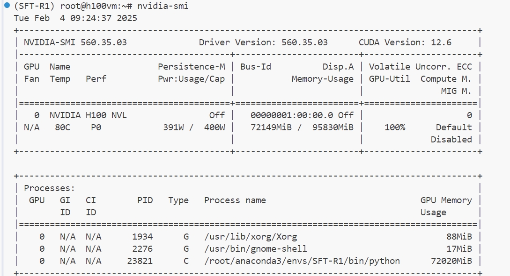
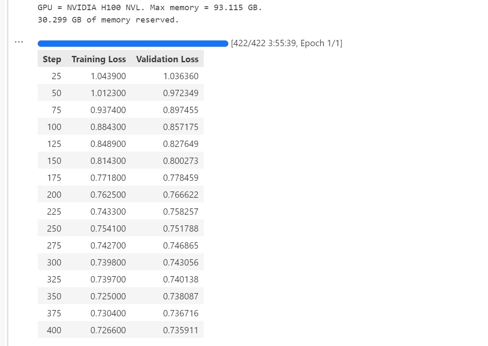
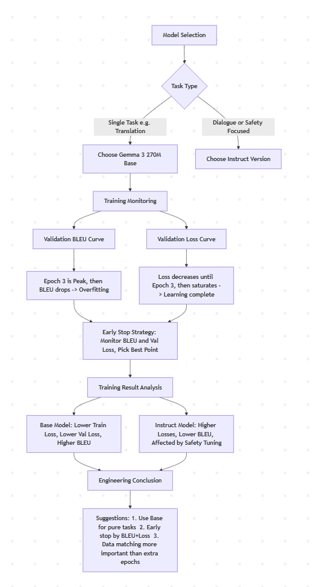
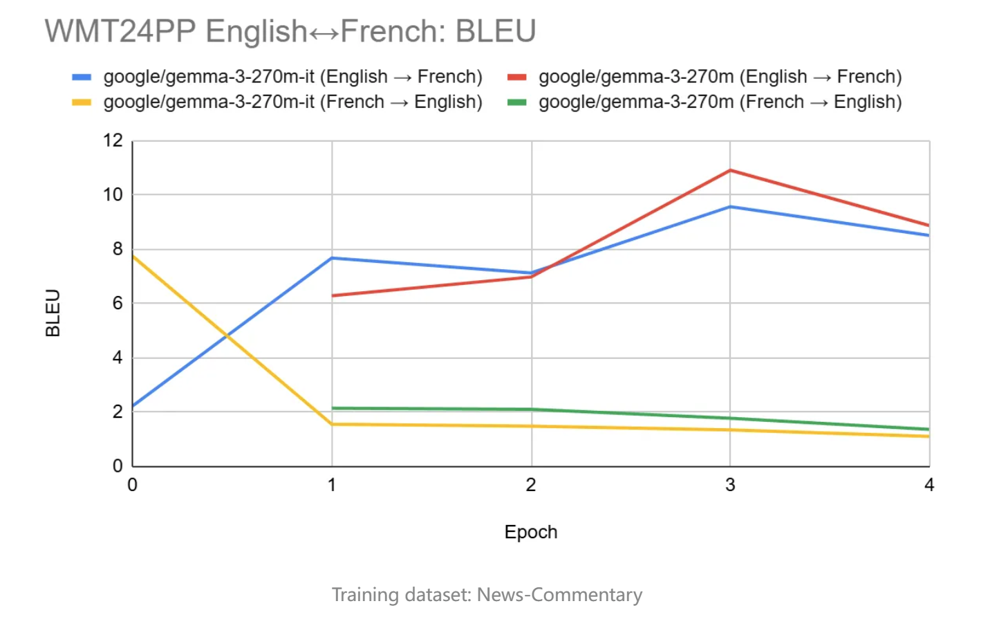

# SLM 如何在推理任务中击败大型模型


欢迎关注我的repo：

https://github.com/xinyuwei-david/david-share.git

**本文参考文档：**

https://huggingface.co/spaces/HuggingFaceH4/blogpost-scaling-test-time-compute

**本文导读：**

传统上，LLMs 的进步主要依赖于增加训练时间的计算量，即训练更大的模型。然而，这种方法成本昂贵，资源需求巨大。扩展测试时间计算提供了一种有效的替代方案，允许模型在推理过程中“思考更长时间”，从而在不增加模型参数的情况下提升性能。

文章主要介绍了三种测试时间计算扩展的策略：

1. **Best-of-N 方法**：生成多个候选答案，使用奖励模型（reward model）对它们进行评分，选择得分最高的答案。加权的 Best-of-N 变体还考虑了答案的出现频率，优先选择高质量且高频率的答案。

2. **束搜索（Beam Search）**：利用过程奖励模型（Process Reward Model，PRM）在生成过程中逐步引导模型，选择每一步最有可能通向正确答案的路径。相比于 Best-of-N，束搜索在相同计算预算下取得了更高的准确率。

3. **多样化验证器树搜索（Diverse Verifier Tree Search，DVTS）**：这是对束搜索的改进，旨在增加生成答案的多样性。DVTS 将初始束分为多个独立的子树，在较大的计算预算下表现出色，尤其是在处理较简单的问题时。

   通过一系列实验，使用开源的 Llama 模型和 MATH-500 数据集，验证了这些方法的有效性。结果显示，即使是参数量较小的模型（如 1B 和 3B 的 Llama Instruct 模型），在采用适当的测试时间计算策略后，其性能可以超过更大的模型（如 8B 和 70B 的模型）。

   不同策略在不同问题难度和计算预算下的表现是不同的，参考“计算最优扩展”的概念，即针对特定的计算预算，选择能达到最佳性能的策略。对于简单问题和较低的计算预算，Best-of-N 表现更好；而对于复杂问题和较高的计算预算，束搜索和 DVTS 更具优势。

   

   在未来，提升验证器的质量，实现模型的自验证，融入更深入的推理过程，以及将搜索方法用于数据生成等。这些方向都有望进一步提升 LLMs 的性能，特别是在资源受限的情况下。

   

**一、几种解码技术的区别**

在我的一篇文章中，我介绍了如何改善模型的幻觉，里面介绍了几种解码技术。

https://github.com/xinyuwei-david/david-share/tree/master/Deep-Learning/LLM-Hallucinations

我在上一篇的基础上，再增加对DVTS(Diverse verifier tree search)和多数投票的对比。

| **方面**       | **贪婪解码（Greedy Decoding）**                              | **束搜索（Beam Search）**                                    | **多样化验证器树搜索（DVTS）**                               | **多数投票（Majority Voting）**                              |
| :------------- | :----------------------------------------------------------- | :----------------------------------------------------------- | :----------------------------------------------------------- | :----------------------------------------------------------- |
| **基本概念**   | 在每一步选择概率最高的词，生成单一序列。                     | 在每一步保留多个最有可能的候选序列，探索更多的可能性。       | 通过将束分成独立的子树，并使用验证器引导搜索，增加多样性和性能。 | 生成多个独立的候选答案，选择出现次数最多的答案作为最终输出。 |
| **工作原理**   | - 在生成文本时，每一步都选择当前概率最高的下一个词。 - 生成一个单一的、最可能的序列。 | - 保持固定数量（束宽度）的最佳部分序列。 - 在每个步骤扩展这些序列，选出新的最佳候选。 | - 将初始束划分为多个独立的子树。 - 在每个子树中，使用过程奖励模型（PRM）评估和引导生成。 - 通过独立扩展，增加解的多样性。 | - 使用随机采样等方法生成多个独立的候选答案。 - 对生成的答案进行统计，选择出现次数最多的答案。 |
| **搜索空间**   | 窄（单一路径）。                                             | 中等（取决于束宽度）。                                       | 广（多个子树，增加了探索的广度）。                           | 宽（生成多个独立的答案），但不在单次生成中扩展。             |
| **多样性**     | 很低（只有一个输出）。                                       | 中等（受束宽度限制）。                                       | 高（独立子树增加了多样性）。                                 | 中等（取决于生成的答案数量和随机性）。                       |
| **使用验证器** | 否。                                                         | 可选（可以使用，但不总是用）。                               | 是的，使用过程奖励模型（PRM）在每一步进行评分和引导。        | 否，通常不使用验证器，仅通过统计频率选择答案。               |
| **优点**       | - 简单快捷。 - 计算效率高。                                  | - 在精度和计算成本之间取得平衡。 - 提高找到全局最优解的机会。 | - 增加了解的多样性。 - 在复杂任务上表现更好。 - 利用验证器引导，提高准确率。 | - 简单易行。 - 减少随机性带来的波动。 - 提高答案的稳定性和一致性。 |
| **缺点**       | - 只关注局部最优，可能错过更好的解。 - 缺乏多样性。          | - 计算量比贪婪解码大。 - 可能仍然错过一些解。                | - 实现更复杂。 - 需要额外的计算资源。 - 依赖于验证器的质量。 | - 无法保证选择的答案是正确的。 - 如果答案多样性过高，可能没有明确的多数。 - 增加了计算成本。 |
| **适用场景**   | - 需要快速生成单一答案的简单任务。 - 对结果质量要求不高的情况。 | - 需要在质量和计算成本之间平衡的任务。 - 适用于一般复杂度的任务。 | - 复杂或需要深入推理的任务。 - 有较大计算预算，可用于提升性能。 | - 希望提高答案稳定性和一致性的任务。 - 需要减少随机性影响的情况下。 |
| **计算复杂度** | 低。                                                         | 中等（取决于束宽度）。                                       | 高（由于使用了验证器和更多的搜索路径）。                     | 中等到高（取决于生成的答案数量）。                           |


### **1. 贪婪解码（Greedy Decoding）**

 
**怎么工作：**

- 在每一步，选择概率最高的下一个词或标记。

- 生成一个单一的、最有可能的序列，直到结束标记或达到最大长度。

  **特点：**

- **快速简单**：计算效率高，适合实时应用。

- **缺点**：

  - **局部最优**：只关注当前步骤的最优选择，可能错过全局更优的解决方案。
  - **缺乏多样性**：生成的序列缺少变化，可能导致重复或不自然的输出。


### **2. 束搜索（Beam Search）**

 
**怎么工作：**

- **保留多个候选序列**：在每一步，保留固定数量（束宽度为 *k*）的最有可能的部分序列。

- **扩展候选序列**：对每个部分序列，生成可能的下一个词，用于扩展序列。

- **选择最佳候选**：计算每个新序列的累计概率，保留累计概率最高的 *k* 个序列，继续下一步扩展。

- **重复上述步骤**，直到生成结束标记或达到最大长度。

  **特点：**

- **平衡了精度和计算成本**：相比贪婪解码，可以找到更接近全局最优的序列。

- **提供一定的多样性**：保留了多个候选序列，但多样性受束宽度限制。

- **缺点**：

  - **计算量增加**：束宽度越大，计算成本越高。
  - **可能仍受限于束宽度**：无法保证找到全局最优解。


### **3. 多样化验证器树搜索（DVTS）**

 
**怎么工作：**

- **分裂初始束**：将初始束分成多个独立的子树，增加初始解的多样性。

- **使用验证器指导**：在每个子树中，使用**过程奖励模型（Process Reward Model，PRM）**对生成的步骤进行评分。

- **独立扩展子树**：每个子树独立地进行扩展，按照验证器的反馈选择最有希望的路径。

- **组合结果**：最终从各个子树中选取验证器评分最高的答案。

  **特点：**

- **增加多样性**：通过独立的子树，探索更多可能的解答路径。

- **利用验证器引导**：在生成过程中实时评估，提升生成结果的准确性和质量。

- **适用于复杂任务**：在需要深度推理或精确回答的任务中表现出色。

- **缺点**：

  - **计算成本高**：由于需要管理更多的搜索路径和验证器的计算。
  - **实现复杂**：需要精心设计搜索策略和验证器模型。

 

### **4. 多数投票（Majority Voting）**

 
**怎么工作：**

- **多次独立生成**：使用随机采样（如 Top-k 或 Top-p 采样）等方法，生成多个（如 *N* 个）独立的候选答案。

- **统计答案频率**：对生成的候选答案进行统计，记录每个独特答案出现的次数。

- **选择出现次数最多的答案**：将频率最高的答案作为最终输出。

  **特点：**

- **简单易行**：不需要复杂的模型调整或外部评估模型。

- **提高稳定性**：通过统计，提高答案的一致性和可靠性。

- **减少随机性影响**：平滑随机采样带来的波动，过滤掉偶然的错误答案。

- **缺点**：

  - **无法保证正确性**：如果模型本身倾向于错误答案，可能多数投票的结果也是错误的。
  - **计算成本增加**：需要多次生成答案，增加了计算开销。
  - **多样性可能不足**：如果生成的答案过于多样，可能没有明确的多数答案。


## Running on Azure

All experiments in this project were conducted on an **Azure GPU VM**.

| Item | Details |
|---|---|
| **Azure VM** | [NC40ads_H100_v5](https://learn.microsoft.com/en-us/azure/virtual-machines/nc-h100-v5-series) |
| **GPU** | NVIDIA H100 80GB |
| **Frameworks** | vLLM, LoRA/PEFT, Unsloth |


## **它们之间的区别与联系**

 

### **搜索空间的大小**

 

- **贪婪解码**：
  - **最小搜索空间**：只探索一条路径，即每一步都选择概率最高的词。
- **束搜索**：
  - **中等搜索空间**：根据束宽度 *k*，同时探索 *k* 条路径。
- **DVTS**：
  - **最大搜索空间**：通过独立的子树和验证器的引导，探索更加广泛的路径。
- **多数投票**：
  - **扩展搜索空间**：通过多次独立生成，获得不同的候选答案，但每次生成仍是一条路径。

### **多样性**

 

- **贪婪解码**：
  - **最低多样性**：只有一个输出序列。
- **束搜索**：
  - **一定的多样性**：受限于束宽度，提供多个候选序列。
- **DVTS**：
  - **高多样性**：独立的子树和验证器的引导，增加了解答的多样性。
- **多数投票**：
  - **中等多样性**：依赖于生成次数和随机采样的程度，可能获得多个不同的候选答案。

### **计算成本**

 

- **贪婪解码**：
  - **最低计算成本**：每一步只需计算概率最高的词。
- **束搜索**：
  - **中等计算成本**：取决于束宽度 *k*，计算量随 *k* 增加而增加。
- **DVTS**：
  - **最高计算成本**：需要管理多个子树、维护验证器的计算和评分。
- **多数投票**：
  - **中等到高的计算成本**：取决于生成的次数 *N*，生成次数越多，计算成本越高。

### **适用的场景和任务**

 

- **贪婪解码**：
  - **快速生成结果**：适用于对速度要求高、对结果质量要求不高的简单任务。
  - **示例**：实时对话系统的快速回复。
- **束搜索**：
  - **平衡质量和效率**：适用于需要一定精度，但计算资源有限的任务。
  - **示例**：机器翻译、文本摘要。
- **DVTS**：
  - **复杂、需要深入推理的任务**：适用于有足够计算资源，希望获得高质量答案的场景。
  - **示例**：数学问题求解、代码生成、复杂问答。
- **多数投票**：
  - **提高答案稳定性**：适用于需要减少随机性影响、希望获得一致性答案的任务。
  - **示例**：知识问答、关键事实的确认。

## **简单类比**

 

- **贪婪解码**：
  - **类比**：像在每个十字路口都选择看起来最直接的道路，可能错过更好的路线。
- **束搜索**：
  - **类比**：像在每个十字路口选择几条看起来不错的道路，走一段后再根据情况选择最佳路线。
- **DVTS**：
  - **类比**：像派出多个探索队伍，从不同的路线出发，同时使用指南（验证器）引导，每个队伍独立寻找最佳路径。
- **多数投票**：
  - **类比**：像询问多个人同一个问题，然后选择大多数人都同意的答案。


## **总结**

 
通过将**多数投票**加入讨论，我们可以更全面地了解不同的解码和生成策略的特点、优点和适用场景。每种方法都有其独特的优势和局限性，选择适当的方法需要根据具体任务的需求、可用的计算资源以及对结果质量的要求来决定。

- **贪婪解码**适合简单、快速、对质量要求不高的任务。

- **束搜索**在质量和效率之间取得平衡，适用于一般复杂度的任务。

- **多样化验证器树搜索（DVTS）**适用于复杂、需要高准确性的任务，但计算成本高。

- **多数投票**通过多次生成和统计，减少了随机性，提高了答案的稳定性，但无法保证一定正确，需要谨慎使用。

  选择合适的策略，有助于充分利用大型语言模型的能力，满足各种应用场景的需求。


**二、 train-time compute的变革**

在过去的几年里，训练时间计算（train-time compute）的扩展主导了大型语言模型（LLMs）的进展。尽管这种模式已被证明异常有效，但预训练更大模型所需的资源变得昂贵得令人望而却步，数十亿美元规模的集群已在眼前。这个趋势引发了对一种互补方法的极大兴趣：测试时间计算扩展（test-time compute scaling）。测试时间方法并不依赖于越来越大的预训练预算，而是使用动态推理策略，让模型在解决更难的问题时“思考更长时间”。一个突出的例子是 OpenAI 的 o1 模型，它在增加测试时间计算量时，对困难的数学问题表现出持续的改进：


DeepMind 的最新研究表明，可以通过迭代自我改进（iterative self-refinement）或使用奖励模型（reward model）在解空间中进行搜索等策略，来最优地扩展测试时间计算。通过为每个提示自适应地分配测试时间计算，小模型可以与更大、更耗资源的模型媲美，甚至有时还能超越它们。当内存受限且可用硬件不足以运行更大的模型时，扩展测试时间计算尤其有利。然而，这种有前景的方法是使用闭源模型演示的，并未发布任何实现细节或代码。

- **计算最优扩展（Compute-optimal scaling）**：实现 DeepMind 的方案，在测试时间提升开源模型的数学能力。

- **多样化验证器树搜索（Diverse Verifier Tree Search，DVTS）**：开发的验证器引导树搜索（verifier-guided tree search）技术的未发表扩展。这种简单而有效的方法提高了多样性，特别是在较高的测试时间计算预算下，提供了更好的性能。

- **🧭 搜索与学习（Search and Learn）**：一个用于在大型语言模型上实现搜索策略的轻量级工具包，使用 vLLM 构建，速度极快。

  


那么，计算最优扩展在实践中效果如何呢？看看这个图表，在具有挑战性的 MATH-500 基准上，如果给予足够的“思考时间”，微小的 1B 和 3B Llama Instruct 模型竟然超过了它们更大的 8B 和 70B 同系列模型的表现 ：


## 三、test-time compute scaling的策略

 
扩展测试时间计算有两种主要策略：

1. **自我改进（Self-Refinement）**：模型通过在后续迭代中识别和纠正错误，迭代地改进它们自己的输出或“想法”。虽然在某些任务上有效，但这种策略通常要求模型具有内置的自我改进机制，这可能会限制其适用性。
2. **针对验证器的搜索（Search Against a Verifier）**：这种方法专注于生成多个候选答案，并使用验证器（verifier）选择最佳答案。验证器可以是从硬编码的启发式方法到学习的奖励模型（reward model），后面我们将重点关注学习的验证器。它包括 Best-of-N 采样和树搜索等技术。搜索策略更灵活，可以适应问题的难度，尽管它们的性能受限于验证器的质量。


**四、验证器到底是什么？**

验证器通常是一个**奖励模型（Reward Model，RM）\**或\**过程奖励模型（Process Reward Model，PRM）**，它们被训练来对生成的内容进行评估。

**定义**：在本文的上下文中，**验证器**是一个辅助模型或机制，用于**评估和评分**大型语言模型（LLM）生成的**输出或部分输出**。

**作用**：

- **评估质量**：验证器对生成的候选答案或中间步骤进行**评估**，判断其正确性、可信度或质量。
- **指导搜索**：通过对候选进行评分，验证器帮助模型在生成过程中**选择更有可能通向正确答案的路径**。


Best-of-N、束搜索（Beam Search）和多样化验证器树搜索（DVTS）都是解码技术，它们被用来指导大型语言模型（LLM）在生成过程中如何产生输出。将这些解码技术与验证器（Verifier）结合，以优化模型在测试时间的性能。


- **提高准确性**：验证器有助于过滤掉错误或低质量的生成结果，提高模型输出的准确性，减少幻觉的产生。
- **优化生成过程**：在生成过程中实时评估和引导，使模型更有效地探索解答空间，尤其在复杂任务上表现出色。
- **增强小模型的性能**：通过结合验证器，较小的模型也可以在特定任务上达到或超过大模型的性能。


**五、效果验证**


## 实验设置

 
如上图所示，我们的实验设置涉及以下步骤的流程：

1. 我们首先将一个数学问题输入大型语言模型（LLM），它生成 N 个部分解，例如推导中的一个中间步骤。

2. 每个步骤由过程奖励模型（PRM）评分，它估计每个步骤最终到达正确最终答案的概率。

3. 这些步骤和 PRM 分数然后被给定的搜索策略使用，以选择哪些部分解应被进一步探索，以生成下一轮中间步骤。

4. 一旦搜索策略终止，最终的候选解由 PRM 排序，产生最终答案。

   为了比较各种搜索策略，我们使用了以下开源模型和数据集：

- **模型**：我们使用了 `meta-llama/Llama-3.2-1B-Instruct` 作为扩展测试时间计算的主要模型。由于其 10 亿参数的轻量级特性，可以实现快速迭代，其在数学基准测试中的未饱和性能使其成为突出扩展优势的理想选择。
- **过程奖励模型（PRM）**：为了指导我们的搜索策略，我们使用了 `RLHFlow/Llama3.1-8B-PRM-Deepseek-Data`，这是一个使用过程监督（process supervision）训练的 80 亿参数的奖励模型。过程监督是一种训练方法，模型在推理过程的每个步骤（而不仅仅是最终结果）都能收到反馈。我们选择这个模型是因为它属于与我们的策略相同的模型家族，并且在我们测试的这个参数量级中，比我们测试的其他 PRM（如 Math-Shepherd）给出了更好的结果。
- **数据集**：我们在 MATH 基准的 MATH-500 子集上进行了评估，这是 OpenAI 作为其过程监督研究的一部分发布的数据集。这些数学问题涵盖了七个学科，对人类和大多数大型语言模型来说都具有挑战性。看看下面的数据集浏览器，感受一下问题的难度吧！我们在从每个提示生成 1 到 256 个生成的计算预算上测试了每个搜索策略，并使用五个随机种子运行数据生成流程，以估计运行间的方差。你可以在这个集合中找到我们分析的模型和数据集。


为了热身，我们将从一个简单的基线开始，并逐步加入其他技术来提高性能。

## 多数投票：一个简单的基线

 
多数投票——或者如果你想用更高端的说法，可以称为自一致性解码（self-consistency decoding）——是聚合大型语言模型输出的最直接方法。顾名思义，对于给定的数学问题，我们生成 N 个候选解并选择最频繁的答案。在我们所有的实验中，我们以温度 T = 0.8 采样了最多 N = 256 个候选解，每个问题生成最多 2048 个标记。

MATH 基准有一个独特之处，即答案必须以 LaTeX 盒子的形式格式化，如 `\boxed{answer}`。我们最初为 Llama 3.2 1B 尝试了以下简单的系统提示：

```
请逐步思考，并将你的最终答案放在 \boxed{} 中。
```

 
但发现使用贪婪解码（T = 0）得到的准确率远低于 Meta 在其发布中报告的 30.6%。幸运的是，Meta 也发布了他们用于评估的提示，切换我们的系统提示到他们的后，效果发生了巨大变化：

```
高效而清晰地解决以下数学问题：
  
- 对于简单的问题（2 步或更少）：
  提供简洁的解答，尽量减少解释。
  
- 对于复杂的问题（3 步或更多）：
  使用以下的逐步格式：
  
  ## 第 1 步：[简洁的描述]  
  [简短的解释和计算]  
  
  ## 第 2 步：[简洁的描述]  
  [简短的解释和计算]  
  
  ...  
  
无论采用何种方法，总是以以下内容结束：
  
因此，最终答案是：$\boxed{answer}$。我希望这是正确的。
  
其中 [answer] 是解决问题的最终数字或表达式。
```

 
评估数学问题的答案有一个细微之处，即像 `1/3` 和 `3/3` 这样的字符串是不同的，但代表数学上等价的答案。处理这种情况的标准方法是将一对答案转换为 SymPy 对象，然后检查减去两个对象并应用 `sympy.simplify` 是否得到零。

虽然这种方法在比较少量候选答案时效果很好，但我们发现当在一个包含 N 个候选答案的列表中比较许多对时，非常慢；在某些情况下，比最初生成候选答案还要慢！为了解决这个问题，我们首先将每个答案简化为其规范形式，然后计算每种形式的频率来确定多数投票。如果你对代码如何实现感兴趣，可以展开下面的细节。

**实现细节**

这里是将多数投票应用于 Llama 3.2 1B Instruct 的生成时的表现：


结果表明，多数投票相比于贪婪解码基线的确带来了显著的改进，但其增益在大约 N = 64 代之后开始趋于平稳。这种限制的出现是因为多数投票在需要细致推理或错误在代际间一致的任务上表现不佳。如果你也想知道为什么当 N = 1 和 2 时，多数投票的准确率比零次提示链式思考（0-shot CoT）基线更差，那是因为我们以 T = 0.8 进行采样，这使得在少数候选中产生正确答案的可能性较小。

基于多数投票的局限性，让我们看看引入奖励模型如何提升性能。

## Best-of-N

 
Best-of-N 是多数投票的一个简单但有效的扩展，它使用奖励模型来确定最可能的答案。该方法有两种主要变体：

1. **原始的 Best-of-N**：生成 N 个独立的回复，选择奖励模型（RM）得分最高的作为最终答案。这确保选择最自信的单个回复，但不考虑答案之间的一致性。

2. **加权的 Best-of-N**：汇总所有相同回复的分数，选择总奖励最高的答案。这种方法通过重复出现来提升分数，优先考虑高质量的答案。数学上，对答案 (a_i) 的加权如下：

   [
   a_{\text{weighted}} = \arg\max_{a} \sum_{i=1}^{N} I(a_i = a) \cdot RM(p, s_i),
   ]

   其中 (RM(p, s_i)) 是问题 (p) 的第 (i) 个解 (s_i) 的奖励模型得分。

   通常，人们使用结果奖励模型（ORM）来获得单个解决方案级别的得分。但为了与后面讨论的其他搜索策略进行公平比较，我们将使用相同的 PRM 来对 Best-of-N 的解决方案进行评分。如下面所示，PRM 对每个解决方案产生一个累积的步骤级别的得分序列，因此我们需要对步骤进行归约以获得单个解决方案级别的得分：

   
   在文献中，最常见的归约方法如下：

- **最小值（Min）**：使用所有步骤中的最小得分。

- **乘积（Prod）**：使用步骤级别得分的乘积。

- **最后（Last）**：使用步骤中的最终得分。这个得分包含了所有先前步骤的累积信息，因此有效地将 PRM 视为能够对部分解进行评分的 ORM。

  我们对每种归约方法进行了实验，发现在我们的任务和 PRM 选择中表现最佳。我们在所有实验中都使用了这种聚合，你可以展开下面的细节，看看我们如何实现它，以及上述的加权过程。

  这里是应用 Best-of-N 两种变体得到的结果：

  
  结果显示了明显的优势：加权的 Best-of-N 在更大的生成预算下，一直优于原始的 Best-of-N。它能够对相同的回复汇总分数，确保即使是出现频率较低但质量更高的答案也能被有效地优先考虑。

然而，尽管有这些改进，我们仍然无法达到 Llama 8B 模型的性能，而且 Best-of-N 方法在 N = 256 代时开始趋于平稳。我们能否通过逐步监督搜索过程来进一步突破边界？

## 使用过程奖励模型的束搜索

 
束搜索（Beam search）是一种系统地探索解空间的结构化搜索方法，使其成为在测试时间改进模型输出的强大工具。当与过程奖励模型（PRM）结合使用时，束搜索可以同时优化问题解决中间步骤的生成和评估。其工作方式如下：

1. 通过保持固定数量的“束”或活动路径 N，迭代地生成多个候选解。

2. 在第一次迭代中，以温度 T 从 LLM 采样 N 个独立的步骤，以引入回复的多样性。这些步骤通常由停止条件定义，如在新行 `\n` 或双新行 `\n\n` 处终止。

3. 使用 PRM 对每个步骤进行评分，选择前 N / M 个步骤作为下一轮生成的候选。在这里，M 表示给定活动路径的“束宽度”（beam width）。与 Best-of-N 一样，我们在每次迭代中使用“最后”归约来对部分解进行评分。

4. 从步骤（3）中选定的节点生成 M 个新步骤，并选择 PRM 得分最高的步骤。

5. 重复步骤（3）和（4），直到到达 EOS 标记或超过最大搜索深度。

   通过允许 PRM 评估中间步骤的正确性，束搜索可以在过程的早期识别和优先考虑有希望的路径。这种逐步评估对于像数学这样需要复杂推理的任务特别有益，其中验证部分解可以显著提高最终结果。

   **实现细节**

   在我们的实验中，我们遵循了 DeepMind 的超参数选择，使用以下设置运行束搜索：

- 在计算扩展为 4、16、64、256 时，使用 N 个束
- 固定束宽 M = 4
- 以温度 T = 0.8 进行采样
- 最多 40 次迭代，即最大深度为 40 步的树如下面所示，结果非常惊人：在测试时间预算为 N = 4 时，束搜索实现了与 Best-of-N 在 N = 16 时相同的准确率，即计算效率提高了 4 倍！此外，束搜索仅用每个问题 N = 32 个解就匹配了 Llama 3.1 8B 的性能。计算机科学博士生在 MATH 上的平均表现约为 40%，所以对于一个 10 亿参数的模型达到近 55% 并不算太差。

## 束搜索最擅长解决哪些问题？

 
虽然总体来看，束搜索显然是比 Best-of-N 或多数投票更好的搜索策略，但 DeepMind 的论文表明，每种策略都有取舍，取决于问题难度和测试时间计算预算。

为了了解哪种策略最适合哪些问题，DeepMind 计算了估计的问题难度分布，然后将结果分成五分位数。换句话说，每个问题被分配到 5 个级别之一，其中级别 1 表示较容易的问题，级别 5 表示最难的问题。为了估计问题难度，DeepMind 为每个问题以标准采样生成了 2048 个候选解，然后提出了以下启发式方法：

- **Oracle**：使用真实标签来估计每个问题的 pass@1 得分。对 pass@1 得分的分布进行分箱以确定五分位数。

- **模型**：使用每个问题的平均 PRM 得分分布来确定五分位数。直观地说，较难的问题得分会较低。

  以下是在四个测试时间计算预算 N = [4, 16, 64, 256] 和 pass@1 得分下，各种方法的表现：

  
  在这个图中，每个柱状图表示一个测试时间计算预算，在每个柱状图内，我们显示每种方法的相对准确率。例如，在难度级别 2 的四个柱状图中，我们看到：

  

- 多数投票在所有计算预算下都是表现最差的，除了 N = 256 时，束搜索最差。

- 束搜索在 N = [4, 16, 64] 情况下最好，但在 N = 256 时，Best-of-N 最好。

  虽然我们看到束搜索在中等和困难问题（级别 3-5）中提供了持续的增益，但在较简单的问题上（尤其是在大的计算预算下），它的表现往往比 Best-of-N更差。

  通过查看束搜索生成的结果树，我们意识到，如果一个步骤被赋予高奖励，那么整个树就会收敛到该路径，从而影响多样性。这促使我们探索一种扩展束搜索的方法，以最大化多样性——让我们来看看！

## DVTS：通过多样性提升性能

 
正如我们上面所见，束搜索在 Best-of-N 上表现出色，但在较简单的问题和较大的测试时间计算预算下往往表现不佳。为了解决这个问题，我们开发了一种扩展，称为多样化验证器树搜索（Diverse Verifier Tree Search，DVTS），旨在在较大的 N 值下最大化多样性。

DVTS 的工作方式与束搜索类似，但有以下修改：

1. 对于给定的 N 和 M，将初始束集合扩展为 N / M 个独立的子树。

2. 对于每个子树，选择 PRM 得分最高的步骤。

3. 从步骤（2）中选定的节点生成 M 个新步骤，选择 PRM 得分最高的步骤。

4. 重复步骤（3），直到到达 EOS 标记或最大树深度。

   以下是将 DVTS 应用于 Llama 1B 的结果：


如我们所见，DVTS 为束搜索提供了一种补充策略：在较小的 N 值下，束搜索更有效地找到正确的解，但在较大的 N 值下，DVTS 候选解的多样性开始发挥作用，我们获得了更好的性能。

我们还可以从问题难度的分解中看到这一点，DVTS 在大的 N 值下增强了在简单/中等问题上的性能，而束搜索在小的 N 值下在各种问题难度上表现最佳：


**六、总结**

**总结：测试时计算扩展的最佳策略**

1. **计算最优的扩展策略（Compute-Optimal Scaling）**

   **核心思想：**

   在给定的计算预算下，选择能够实现最佳性能的搜索方法和超参数组合。

   **公式表示：**

   θ*(N) = argmax_θ [ E_{y ∼ Target(θ, N, q)} [ 1_{y = y*(q)} ] ]

   挑战：直接计算 θ*(N) 较为困难。

   **解决方案：**

   DeepMind 提出了基于问题难度的近似方法，根据不同难度级别，确定最佳的搜索策略和计算资源分配：

   - **简单问题、低计算预算：**使用 Best-of-N 等简单方法。
   - **复杂问题、高计算预算：**使用束搜索（Beam Search）等高级方法。

2. **θ\*(N)**：给定计算预算 N 的最优参数和策略组合。

   **y\*(q)**：问题 q 的真实答案。

   **θ**：搜索方法和超参数的组合。

3. **向更大模型的扩展**

   **目的：**探究计算最优策略在更大模型上的效果，以及过程奖励模型（PRM）在较大模型中是否仍然有益。

   **发现：**

   - 计算最优扩展策略效果显著。
   - 即使在大型模型上，使用计算最优策略的较小模型（如 Llama 13B）性能可超过更大的模型（如 Llama 2 70B Instruct）。

4. **未来方向和挑战**

   - **增强验证器的能力：提升验证器的鲁棒性和泛化能力，对于改进模型性能至关重要。

   - 实现自我验证（Self-Verification）：使模型能够自主验证输出，提高可靠性，需要比标准监督微调更复杂的策略。

   - 融入“思考”过程：**在生成过程中加入显式的中间步骤或推理过程，增强模型的推理能力。

   - 搜索作为数据生成工具：利用搜索方法生成高质量训练数据，进一步微调和改进模型。

   - 开发更多过程奖励模型（PRMs）：丰富的 PRM 有助于提升不同领域的模型性能。

   - **扩展至非可验证领域：\**将方法应用于结构较弱或主观性较强的任务，需要新的策略。

     \*\*结论：\*\*

     找到合适的解码方式并结合强大的验证器，是提升大型语言模型性能的关键。最佳解码策略取决于问题难度和计算预算，没有一种通用的方法。优化模型性能需要综合考虑任务需求和可用资源。\****

5. 

6. 解码方法可以单独使用，也可以结合使用，具体取决于任务需求和目标。以下是一些常见的情况：

7. 单独使用：

   - 贪婪解码：适用于简单任务，计算效率高。
   - 束搜索：适用于需要生成高质量文本的任务，尽管计算复杂度较高。
   - 温度采样、Top-k 采样、Top-p 采样：用于控制生成文本的随机性和多样性。

   结合使用：

   - 在一些复杂任务中，可能会结合多种解码方法。例如，先使用束搜索生成多个候选，然后再用温度采样或Top-p采样从中选择最优解。
   - 结合使用可以在保证生成质量的同时，增加文本的多样性和创意性。

8. ***\*
   \****

**总结：**

在追求最佳性能的过程中，应根据具体任务和资源限制，选择最合适的解码方法，并视情况决定是否结合验证器。针对任务特点，择优选择解码策略，而非同时使用多种方法。


**一、前情回顾**

在之前文章[SLM 如何在推理任务中击败大型模型](https://mp.weixin.qq.com/s?__biz=MzAwMDc2NjQ4Nw==&mid=2663562788&idx=1&sn=519f460e92f6998b3eff9dabd93873f8&scene=21#wechat_redirect)中，我介绍了test-time compute scaling的实现，大致的实现图：


1. 我们首先将一个数学问题输入大型语言模型（LLM），它生成 N 个部分解，例如推导中的一个中间步骤。

2. 每个步骤由过程奖励模型（PRM）评分，它估计每个步骤最终到达正确最终答案的概率。

3. 这些步骤和 PRM 分数然后被给定的搜索策略使用，以选择哪些部分解应被进一步探索，以生成下一轮中间步骤。

4. 一旦搜索策略终止，最终的候选解由 PRM 排序，产生最终答案。

   为了比较各种搜索策略，我们使用了以下开源模型和数据集：

- **模型**：我们使用了 `meta-llama/Llama-3.2-1B-Instruct` 作为扩展测试时间计算的主要模型。由于其 10 亿参数的轻量级特性，可以实现快速迭代，其在数学基准测试中的未饱和性能使其成为突出扩展优势的理想选择。
- **过程奖励模型（PRM）**：为了指导我们的搜索策略，我们使用了 `RLHFlow/Llama3.1-8B-PRM-Deepseek-Data`，这是一个使用过程监督（process supervision）训练的 80 亿参数的奖励模型。过程监督是一种训练方法，模型在推理过程的每个步骤（而不仅仅是最终结果）都能收到反馈。我们选择这个模型是因为它属于与我们的策略相同的模型家族，并且在我们测试的这个参数量级中，比我们测试的其他 PRM（如 Math-Shepherd）给出了更好的结果。
- **数据集**：我们在 MATH 基准的 MATH-500 子集上进行了评估，这是 OpenAI 作为其过程监督研究的一部分发布的数据集。这些数学问题涵盖了七个学科，对人类和大多数大型语言模型来说都具有挑战性。看看下面的数据集浏览器，感受一下问题的难度吧！我们在从每个提示生成 1 到 256 个生成的计算预算上测试了每个搜索策略，并使用五个随机种子运行数据生成流程，以估计运行间的方差。你可以在这个集合中找到我们分析的模型和数据集。


而几种常见的生成候选者的方法包含：

| 方面           | 贪婪解码（Greedy Decoding）                                  | 束搜索（Beam Search）                                        | 多样化验证器树搜索（DVTS）                                   | 多数投票（Majority Voting）                                  |
| :------------- | :----------------------------------------------------------- | :----------------------------------------------------------- | :----------------------------------------------------------- | :----------------------------------------------------------- |
| **基本概念**   | 在每一步选择概率最高的词，生成单一序列。                     | 在每一步保留多个最有可能的候选序列，探索更多的可能性。       | 通过将束分成独立的子树，并使用验证器引导搜索，增加多样性和性能。 | 生成多个独立的候选答案，选择出现次数最多的答案作为最终输出。 |
| **工作原理**   | - 在生成文本时，每一步都选择当前概率最高的下一个词。 - 生成一个单一的、最可能的序列。 | - 保持固定数量（束宽度）的最佳部分序列。 - 在每个步骤扩展这些序列，选出新的最佳候选。 | - 将初始束划分为多个独立的子树。 - 在每个子树中，使用过程奖励模型（PRM）评估和引导生成。 - 通过独立扩展，增加解的多样性。 | - 使用随机采样等方法生成多个独立的候选答案。 - 对生成的答案进行统计，选择出现次数最多的答案。 |
| **搜索空间**   | 窄（单一路径）。                                             | 中等（取决于束宽度）。                                       | 广（多个子树，增加了探索的广度）。                           | 宽（生成多个独立的答案），但不在单次生成中扩展。             |
| **多样性**     | 很低（只有一个输出）。                                       | 中等（受束宽度限制）。                                       | 高（独立子树增加了多样性）。                                 | 中等（取决于生成的答案数量和随机性）。                       |
| **使用验证器** | 否。                                                         | 可选（可以使用，但不总是用）。                               | 是的，使用过程奖励模型（PRM）在每一步进行评分和引导。        | 否，通常不使用验证器，仅通过统计频率选择答案。               |
| **优点**       | - 简单快捷。 - 计算效率高。                                  | - 在精度和计算成本之间取得平衡。 - 提高找到全局最优解的机会。 | - 增加了解的多样性。 - 在复杂任务上表现更好。 - 利用验证器引导，提高准确率。 | - 简单易行。 - 减少随机性带来的波动。 - 提高答案的稳定性和一致性。 |
| **缺点**       | - 只关注局部最优，可能错过更好的解。 - 缺乏多样性。          | - 计算量比贪婪解码大。 - 可能仍然错过一些解。                | - 实现更复杂。 - 需要额外的计算资源。 - 依赖于验证器的质量。 | - 无法保证选择的答案是正确的。 - 如果答案多样性过高，可能没有明确的多数。 - 增加了计算成本。 |
| **适用场景**   | - 需要快速生成单一答案的简单任务。 - 对结果质量要求不高的情况。 | - 需要在质量和计算成本之间平衡的任务。 - 适用于一般复杂度的任务。 | - 复杂或需要深入推理的任务。 - 有较大计算预算，可用于提升性能。 | - 希望提高答案稳定性和一致性的任务。 - 需要减少随机性影响的情况下。 |
| **计算复杂度** | 低。                                                         | 中等（取决于束宽度）。                                       | 高（由于使用了验证器和更多的搜索路径）。                     | 中等到高（取决于生成的答案数量）。                           |


**二、遗传算法的优势**

## **遗传算法（Genetic Algorithm）** 是一种用于解决优化和搜索问题的自适应启发式算法，模拟了自然选择和遗传变异的过程。它的核心思想是“适者生存”，通过选择、交叉和变异等操作，让优秀的个体（解）在种群中得以保留，并生成新的更优的解。 

 

 **为什么引入遗传算法？**

 
在 DeepMind 的 **Mind Evolution** 方法中，遗传算法被引入是为了：

- **增强搜索能力**：通过模拟生物进化的过程，更有效地探索复杂问题的解空间。
- **避免局部最优**：遗传算法能够避免陷入局部最优解，增加找到全局最优解的机会。
- **提高方案质量**：通过迭代地优化候选方案，使得最终的解决方案质量更高。


**遗传算法的关键步骤**

 
**（1）初始化种群**

- **种群**：由多个候选方案（个体）组成。

- **初始化**：使用大型语言模型（LLM）生成初始的候选方案集。

  **（2）评估适应度**

- **适应度函数**：评估每个候选方案的优劣程度。

- **评估**：根据任务要求和约束条件，对每个方案进行打分。

  **（3）选择（Selection）**

- **目的**：选出优秀的候选方案作为“父代”。

- **方法**：根据适应度分数，使用概率性方法从种群中选择个体。

  **（4）交叉（Crossover）**

- **目的**：组合两个或多个父代方案的特征，生成新的候选方案（子代）。

- **方法**：使用 LLM，将父代方案的优点融合，生成新的方案。

  **（5）变异（Mutation）**

- **目的**：在候选方案中引入随机变化，增加多样性。

- **方法**：对候选方案进行随机的微小修改。

  **（6）产生新一代**

- **循环**：将新生成的候选方案加入种群，重复评估和选择的过程。


### **遗传算法在 Mind Evolution 中的应用**

 
**示例任务**：为用户规划一个满足特定要求的旅行计划。

**步骤示意**：

1. **生成初始方案**：LLM 生成多个初始旅行计划。
2. **评估方案**：计算每个计划的适应度分数，例如根据是否满足预算、行程安排、用户偏好等。
3. **选择优秀方案**：根据适应度分数，选择几个较好的旅行计划作为父代。
4. **交叉生成新方案**：使用 LLM，将父代计划的优点结合，生成新的旅行计划。例如，结合父代 A 的酒店安排和父代 B 的景点选择。
5. **变异引入新元素**：在新方案中，随机调整一些细节，例如更改用餐地点或增加新的景点。
6. **评估新方案并重复**：对新生成的方案再次评估适应度，继续选择和生成，迭代多次，直到找到最优的旅行计划。 

###  

### **遗传算法的优势、**

- **全球优化能力强**：能够在广阔的解空间中寻找最优解。

- **适应性强**：对于复杂、多约束的问题，能够有效处理。

- **并行化**：遗传算法的过程可以并行执行，提升计算效率。

  

  

**三、\**Mind Evolution的实现\****

在DeepMind新的论文**《Evolving Deeper LLM Thinking》**中，介绍了新的实现。

**Mind Evolution** 是一种结合了**大型语言模型（LLM）\**和\**进化算法**的搜索方法，旨在提高 LLM 在解决复杂问题（如自然语言规划任务）时的能力。这个方法模拟了生物进化的过程，通过生成、评估、选择、交叉、变异和改进等步骤，迭代地优化候选方案，最终找到最佳解决方案。 

 


### **Mind Evolution 的七个主要步骤**

1. **候选方案的生成（初始化）**

2. **方案的评估（Fitness Evaluation）**

3. **批判性对话下的改进（Refinement through Critical Conversation，RCC）**

4. **选择（Selection）**

5. **交叉和变异（Crossover and Mutation）**

6. **迭代与进化（Iteration and Evolution）**

7. **岛屿模型的应用（Island Model - Migration and Reset）**

   
   下面，我将逐一解释每个步骤，以及其中涉及的算法和概念，并举例说明。

### **步骤 1：候选方案的生成（初始化）**

 
**由谁完成**：大型语言模型（LLM）

**解释**：

- **目的**：根据给定的任务或问题描述，生成一组初始的候选解决方案。

- **使用的算法/方法**：**大型语言模型（LLM）**的生成能力。

- **如何完成**：使用 LLM，结合问题的描述、相关信息和指示，生成多个可能的解决方案。这些方案以自然语言形式表达，直接针对问题本身。

  **举例**：

  **任务场景**：假设我们需要为用户规划一次旅行，满足以下条件：

- 从**北京**出发，计划一个**5 天的旅行**。

- 想要去的城市有**上海**、**杭州**、**苏州**。

- 预算是**5000 元**。

- 希望**第一天**在上海，**最后一天**返回北京。

  **LLM 生成的初始候选方案**：

- **方案 1**：

  - 第一天：北京 -> 上海，游览外滩和南京路，住宿上海。
  - 第二天：上海 -> 杭州，游览西湖，住宿杭州。
  - 第三天：杭州 -> 苏州，游览拙政园和虎丘，住宿苏州。
  - 第四天：苏州，游览寒山寺和狮子林，住宿苏州。
  - 第五天：苏州 -> 北京，结束行程。

- **方案 2**：

  - 第一天：北京 -> 上海，游览迪士尼乐园，住宿上海。
  - 第二天：上海，游览东方明珠和豫园，住宿上海。
  - 第三天：上海 -> 杭州，游览灵隐寺，住宿杭州。
  - 第四天：杭州，游览西湖和雷峰塔，住宿杭州。
  - 第五天：杭州 -> 北京，结束行程。

- **方案 3**：

  - 第一天：北京 -> 苏州，游览拙政园，住宿苏州。
  - 第二天：苏州 -> 杭州，游览西湖，住宿杭州。
  - 第三天：杭州 -> 上海，游览外滩，住宿上海。
  - 第四天：上海，游览东方明珠，住宿上海。
  - 第五天：上海 -> 北京，结束行程。


### **步骤 2：方案的评估（Fitness Evaluation）**

 
**由谁完成**：**评估函数（程序化的评价器）**

**解释**：

- **目的**：对每个候选方案进行评分，判断其质量，并检查是否满足问题的约束和目标。

- **使用的算法/方法**：**评估函数**，这是一个程序化实现的函数，用于评估方案的好坏。它不属于某种复杂的算法，但在设计上需要考虑如何客观、公正地评估方案。

- **如何完成**：编写一个评估函数，解析每个方案，检查其是否满足以下条件：

  - 是否覆盖了所有必须去的城市？

  - 是否遵循了时间安排（第一天在上海，最后一天返回北京）？

  - 是否在预算之内？

  - 是否有任何冲突或不合理之处？

    **举例**：

    **评估方案 1**：

- **检查结果**：

  - 覆盖了所有必须去的城市：是。

  - 时间安排：第一天在上海，最后一天返回北京，符合要求。

  - 预算：需要计算总费用，假设总费用为 4800 元（符合预算）。

  - 评价：方案合理，满足所有要求。

    **评估方案 2**：

- **检查结果**：

  - 覆盖了所有必须去的城市：缺少苏州。

  - 时间安排：第一天在上海，最后一天返回北京，符合要求。

  - 预算：假设总费用为 5200 元（超出预算）。

  - 评价：未包含苏州，预算超标。

    **评估方案 3**：

- **检查结果**：

  - 覆盖了所有必须去的城市：是。

  - 时间安排：第一天在苏州，未在第一天到达上海，不符合要求。

  - 时间安排：最后一天从上海返回北京，符合要求。

  - 预算：假设总费用为 4500 元（符合预算）。

  - 评价：未在第一天到达上海。

    **提供反馈**：

- 对于方案 2：建议加入苏州，并控制总费用在预算内。

- 对于方案 3：建议调整行程，使得第一天在上海。

### **步骤 3：批判性对话下的改进（Refinement through Critical Conversation，RCC）**

 
**由谁完成**：大型语言模型（LLM）

**解释**：

- **目的**：通过模拟**批评者**和**作者**之间的对话，对候选方案进行深入分析和改进。

- **使用的算法/方法**：利用 LLM 的生成和理解能力，扮演不同的角色，进行对话式的方案改进。

- **如何完成**：

  - 根据批评者的反馈，对方案进行修改，提出改进后的方案。

    **举例**：

    **对于方案 2 的批判性对话**：

  - 分析方案，结合评估函数的反馈，指出方案中的问题。

  - 提出改进的建议。

  - **批评者（Critic）**角色：

  - **作者（Author）**角色：

- **批评者**：

  - “该方案未包含苏州，导致未满足用户想去的所有城市的要求。此外，预算超出了 5000 元的限制。建议在行程中加入苏州，并适当调整游览项目，控制总费用。”

- **作者**：

  - “好的，我将调整方案。在第三天，增加前往苏州的行程，游览拙政园，住宿苏州。并在上海的游览项目中选择性地减少一些景点，以控制预算。”

    **改进后的方案**：

- 第一天：北京 -> 上海，游览迪士尼乐园，住宿上海。

- 第二天：上海，游览东方明珠，住宿上海。

- 第三天：上海 -> 苏州，游览拙政园，住宿苏州。

- 第四天：苏州 -> 杭州，游览西湖，住宿杭州。

- 第五天：杭州 -> 北京，结束行程。

  **重新评估**：

- 方案现在包含了所有必须去的城市，预算控制在 5000 元以内。

- 

### **步骤 4：选择（Selection）**

 
**由谁完成**：算法流程（程序控制）

**解释**：

- **目的**：根据评估得分，从当前的候选方案中选择优质的方案作为“父代”。

- **使用的算法/方法**：**博尔兹曼选择（Boltzmann Selection）**，这是一种基于概率的选择策略。

- **如何完成**：

  - 计算每个方案的适应度得分。

  - 使用**软最大化（softmax）**函数，将适应度得分转换为选择概率。

  - 根据概率随机抽样，选择一些方案作为父代。

    **举例**：

- 假设有 4 个方案，适应度得分分别为 0.9、0.8、0.5、0.2。

- 通过 softmax 转换，计算出每个方案被选中的概率。

- 可能最终选出方案 1 和方案 2 作为父代。


### **步骤 5：交叉和变异（Crossover and Mutation）**

**由谁完成**：大型语言模型（LLM）与算法流程（程序控制）

**解释**：

- **目的**：通过组合和修改父代方案，生成新的候选方案（子代），从而探索新的解决方案空间。

- **使用的算法/方法**：交叉和变异是遗传算法的核心操作。

  **交叉（Crossover）**：

- **如何完成**：

  - 从选定的父代方案中，挑选部分内容进行组合。
  - 使用 LLM，根据父代方案，生成新的方案。

**举例**：

- **父代方案 A**：
- 第一天：北京 -> 上海，游览外滩，住宿上海。
- 第二天：上海 -> 杭州，游览西湖，住宿杭州。
- 第三天：杭州，游览灵隐寺，住宿杭州。
- 第四天：杭州 -> 苏州，游览拙政园，住宿苏州。
- 第五天：苏州 -> 北京，结束行程。

- **父代方案 B**：
  - 第一天：北京 -> 上海，游览迪士尼乐园，住宿上海。
  - 第二天：上海，游览东方明珠，住宿上海。
  - 第三天：上海 -> 苏州，游览寒山寺，住宿苏州。
  - 第四天：苏州 -> 杭州，游览雷峰塔，住宿杭州。
  - 第五天：杭州 -> 北京，结束行程。

**交叉生成子代方案**：

- 第一天：北京 -> 上海，游览外滩和迪士尼乐园，住宿上海。
- 第二天：上海 -> 苏州，游览寒山寺和拙政园，住宿苏州。
- 第三天：苏州 -> 杭州，游览西湖和雷峰塔，住宿杭州。
- 第四天：杭州，游览灵隐寺和其他景点，住宿杭州。
- 第五天：杭州 -> 北京，结束行程。


- **变异（Mutation）**：
- **如何完成**：
  - 对新生成的子代方案，进行随机的小幅修改。
  - 使用 LLM，引入新的元素或调整行程细节。
- **举例**：
  - 在子代方案中，随机将第四天的行程从杭州改为再次返回上海，或者增加新的景点。

### **步骤 6：迭代与进化（Iteration and Evolution）**

 
**由谁完成**：算法流程（程序控制）

**解释**：

- **目的**：重复执行前面的步骤（生成、评估、选择、交叉、变异和改进），经过多代迭代，逐步提升方案质量。

- **使用的算法/方法**：迭代循环，直到满足终止条件。

- **如何完成**：

  - 在每一代，生成新的候选方案，对其进行评估和改进。

  - 持续进行多次迭代，观察方案质量的提升。

    **举例**：

- **第 1 代**：初始生成的候选方案，可能只有一部分满足要求。

- **第 2 代**：经过交叉、变异和改进，方案质量有所提升，更多的方案满足要求。

- **第 3 代**：继续优化，可能接近找到最佳方案。

- **迭代终止条件**：找到满足所有要求的方案，或者达到预设的最大迭代次数。


### **步骤 7：岛屿模型的应用（Island Model - Migration and Reset）**

 

**由谁完成**：算法流程（程序控制）

**解释**：

- **目的**：通过引入岛屿模型，保持方案的多样性，避免过早收敛到次优解。
- **使用的算法/方法**：**岛屿模型**，包括**迁移（Migration）**和**重置（Reset）**操作。
- **如何完成**：
- **划分岛屿**：
  - 将候选方案的种群分为多个独立的子群体，称为岛屿。
  - 每个岛屿独立地进行进化，避免相互干扰。
- **迁移（Migration）**：
  - 在预定的迭代代数后，将一些优秀的方案从一个岛屿迁移到另一个岛屿。
  - 促进优秀基因的传播，丰富其他岛屿的方案多样性。
- **重置（Island Reset）**：
  - 定期评估各个岛屿的整体表现。
  - 对于表现较差的岛屿，将其种群替换为全局最优的方案或重新生成新的方案。
  - 避免陷入局部最优，重新探索新的解空间。
- 
- **举例**：
- **假设有 4 个岛屿**（Island 1、Island 2、Island 3、Island 4）。
- **迁移操作**：
  - 在每隔 3 代后，将 Island 1 中最优秀的 5 个方案迁移到 Island 2，替换其种群中最差的 5 个方案。
  - 同时，Island 2 的优秀方案迁移到 Island 3，以此类推。
- **重置操作**：
  - 如果 Island 4 在连续多代中方案质量较差，决定对其进行重置。
  - 从全局最优的方案中选取一些，替换 Island 4 的种群。

### 

### **总结**

 
**Mind Evolution 方法**通过以上七个步骤，结合了大型语言模型（LLM）的生成和理解能力，以及进化算法（包括遗传算法和岛屿模型）的全局优化策略，成功地在自然语言规划任务中实现了高效的方案优化。

- **LLM 的作用**：
  - 生成初始候选方案。
  - 扮演批评者和作者的角色，进行方案的批判性对话和改进。
  - 在交叉和变异操作中，生成新的方案。
- **评估函数**：
  - 对方案进行客观的评估，提供反馈。
  - 指导方案的优化方向。
- **遗传算法的操作**：
  - 选择、交叉、变异，探索新的解空间。
  - 通过迭代，逐步提升方案质量。
- **岛屿模型的应用**：
  - 通过划分岛屿、迁移和重置，保持方案的多样性。
  - 避免过早收敛，提高全局优化能力。

---

## Phi-4 Thinks as DeepSeek-R1



I tried fine-tuning Microsoft's Phi-4 model using the open-source R1 dataset. Below, I'll share my steps with everyone. 

***Please click below pictures to see my demo video on Youtube***:
[](https://youtu.be/9CVKR0YcdKU)

### **Dataset Used**

**Why Choose This Dataset?** 

I used the **`reasoning-deepseek`** subset from the `cognitivecomputations/dolphin-r1` dataset. This dataset was generated by the large model **DeepSeek-R1** and contains **30,000** training samples, focusing on reasoning and question-answering capabilities.  


The dataset contains the model's reasoning process, wrapped with special `<think>` tags, which can help our model learn how to think and reason. 


**Data Preprocessing**

Before using this dataset, we need to do some preprocessing:

- **Merge Fields**: Combine the `reasoning` and `answer` fields in the dataset into a new `assistant_message`, and add it to the `messages` column. This way, our model can learn the complete question-answering and reasoning process.
- **Handle Special Tokens**: Since the data uses `<think>` tags, we need to add these special tokens to the tokenizer so that the model can correctly understand and generate them.

### Fine-tuning the Phi-4 Model

During the fine-tuning process, I chose the **LoRA (Low-Rank Adaptation)** method. This is a parameter-efficient fine-tuning technique that allows the model to learn new capabilities without significantly increasing the number of parameters.

**Main Steps of Fine-tuning Include:**

1. **Load Model and Tokenizer**: Use `microsoft/phi-4` as the base model and load the corresponding tokenizer.

2. **Add Special Tokens to Tokenizer**: Add `<think>` and `</think>` to the tokenizer's special tokens and adjust the model's embedding layer to accommodate the new vocabulary size.

3. **Set Up LoRA Configuration**: Specify the model modules to train, such as `q_proj`, `k_proj`, `v_proj`, `o_proj`, etc.

4. **Start Training**: Fine-tune the model using the preprocessed dataset.

5. **Resource Consumption**

- **GPU Memory**: Approximately 72149MiB of GPU memory is needed.
- **Training Time**: It took about 4 hours on a H100




### Full code

Training code：

```
from datasets import load_dataset  
import torch, multiprocessing, sys  
from transformers import AutoTokenizer, AutoModelForCausalLM, BitsAndBytesConfig  
from peft import prepare_model_for_kbit_training, LoraConfig  
from trl import SFTConfig, SFTTrainer  
  
compute_dtype = torch.bfloat16    
# attn_implementation = 'flash_attention_2' 
  
# 加载 tokenizer  
tokenizer = AutoTokenizer.from_pretrained("microsoft/phi-4")  
tokenizer.pad_token = "<|finetune_right_pad_id|>"  
tokenizer.pad_token_id = 100257  
tokenizer.padding_side = 'right'  
  
# 添加新标记 '<think>' 和 '</think>'  
new_tokens = ['<think>', '</think>']  
tokenizer.add_tokens(new_tokens)  
  
# 加载数据集  
ds = load_dataset("cognitivecomputations/dolphin-r1", 'reasoning-deepseek', split='train[:30000]').train_test_split(test_size=0.1)  
  
# 处理数据集  
def process(row):  
    assistant_message = "<think>" + row['reasoning'] + "</think>\n\n" + row['answer']  
    row['messages'].append({'role': 'assistant', 'content': assistant_message})  
    # 手动拼接消息内容  
    conversations = ''  
    for message in row['messages']:  
        conversations += f"{message['role']}: {message['content']}\n"  
    row['text'] = conversations.strip()  
    return row  
  
ds['train'] = ds['train'].map(  
    process,  
    num_proc=multiprocessing.cpu_count(),  
    load_from_cache_file=False,  
)  
  
ds['test'] = ds['test'].map(  
    process,  
    num_proc=multiprocessing.cpu_count(),  
    load_from_cache_file=False,  
)  
  
def fine_tune(model_name, batch_size=1, gradient_accumulation_steps=32, LoRA=False, QLoRA=False):  
  
    if QLoRA:  
        bnb_config = BitsAndBytesConfig(  
            load_in_4bit=True,  
            bnb_4bit_quant_type="nf4",  
            bnb_4bit_compute_dtype=compute_dtype,  
            bnb_4bit_use_double_quant=True,  
        )  
        model = AutoModelForCausalLM.from_pretrained(  
            model_name, quantization_config=bnb_config, device_map={"": 0}  
        )  
        model = prepare_model_for_kbit_training(model)  
    else:  
        model = AutoModelForCausalLM.from_pretrained(  
            model_name, device_map={"": 0}, torch_dtype=compute_dtype  
        )  
        model.gradient_checkpointing_enable()  
  
    # **调整模型的嵌入矩阵以匹配新的词汇表大小**  
    model.resize_token_embeddings(len(tokenizer))  
  
    if LoRA or QLoRA:  
        peft_config = LoraConfig(  
            lora_alpha=16,  
            lora_dropout=0.05,  
            r=16,  
            bias="none",  
            task_type="CAUSAL_LM",  
            target_modules=['k_proj', 'o_proj', 'q_proj', 'v_proj', 'up_proj', 'down_proj', 'gate_proj'],  
            modules_to_save=["lm_head", "embed_tokens"],  
        )  
    else:  
        peft_config = None  
  
    output_dir = "./LoRA/"  
  
    training_arguments = SFTConfig(  
        output_dir=output_dir,  
        evaluation_strategy="steps",  
        do_eval=True,  
        optim="adamw_8bit",  
        per_device_train_batch_size=batch_size,  
        gradient_accumulation_steps=gradient_accumulation_steps,  
        per_device_eval_batch_size=batch_size,  
        log_level="debug",  
        save_strategy="steps",        
        save_steps=200,              
        logging_steps=25,  
        learning_rate=1e-5,  
        bf16=True,                    
        eval_steps=200,               
        num_train_epochs=1,  
        warmup_ratio=0.1,  
        lr_scheduler_type="linear",  
        dataset_text_field="text",  
        max_seq_length=1024,  
        report_to='none',  
        save_total_limit=3            
    )  
  
    trainer = SFTTrainer(  
        model=model,  
        train_dataset=ds['train'],  
        eval_dataset=ds['test'],  
        peft_config=peft_config,  
        tokenizer=tokenizer,          
        args=training_arguments,  
    )  
  
    trainer.train()  
```

```
fine_tune("microsoft/phi-4", batch_size=16, gradient_accumulation_steps=4, LoRA=True)
```



Load Fine-tuned Model

```
from transformers import AutoModelForCausalLM, AutoTokenizer
from peft import PeftModel
import torch

compute_dtype = torch.bfloat16
attn_implementation = 'flash_attention_2'

tokenizer = AutoTokenizer.from_pretrained("microsoft/phi-4")
tokenizer.pad_token = "<|finetune_right_pad_id|>"
tokenizer.pad_token_id = 100257

tokenizer.vocab[128011] = '<think>'
tokenizer.vocab[128012] = '</think>'
model = AutoModelForCausalLM.from_pretrained(
    "microsoft/phi-4",
    device_map={"": 0},
    attn_implementation=attn_implementation,
    torch_dtype=torch.bfloat16,
)

model = PeftModel.from_pretrained(model, "./LoRA/checkpoint-422/")
```

**Inference test**

**Question 1 and answer 1:**

```
prompt = [{'role':'system', 'content':"You are a helpful assistant, please think before answering."},
    {'role':'user', 'content':"Assume there is a pond with an infinite amount of water. You have two empty jugs with capacities of 5 liters and 6 liters, respectively. How can you use only these two jugs to obtain exactly 3 liters of water from the pond?"}
    ]

prompt = tokenizer.apply_chat_template(prompt, tokenize=False, add_generation_prompt=True)
input_ids = tokenizer(prompt, return_tensors="pt", truncation=True).to('cuda')
output = model.generate(**input_ids, temperature=0.7, max_new_tokens=2048)
print(tokenizer.decode(output[0], skip_special_tokens=False))
```

Result：

```
<|im_end|><|im_start|>user<|im_sep|>Assume there is a pond with an infinite amount of water. You have two empty jugs with capacities of 5 liters and 6 liters, respectively. How can you use only these two jugs to obtain exactly 3 liters of water from the pond?<|im_end|><|im_start|>assistant<|im_sep|><think>Okay, so I need to figure out how to get exactly 3 liters of water using a 5-liter jug and a 6-liter jug. Hmm, this is a classic water jug problem. Let me think about the steps.

First, I need to remember the rules: I can fill either jug from the pond, pour water from one jug to the other until one is full or the other is empty, and empty a jug back into the pond. So, I can't measure directly, but I can use the difference between the two jugs to get the desired amount.

Let's start by filling the 6-liter jug. Then, pour from the 6-liter jug into the 5-liter jug until the 5-liter jug is full. That would leave 1 liter in the 6-liter jug. Then, empty the 5-liter jug back into the pond. Now, pour the remaining 1 liter from the 6-liter jug into the 5-liter jug. Then, fill the 6-liter jug again. Pour from the 6-liter jug into the 5-liter jug until the 5-liter jug is full. Since the 5-liter jug already has 1 liter, it can only take 4 more liters. So, after pouring 4 liters, the 6-liter jug will have 2 liters left. Then, empty the 5-liter jug again. Pour the 2 liters from the 6-liter jug into the 5-liter jug. Now, fill the 6-liter jug again. Pour from the 6-liter jug into the 5-liter jug until the 5-liter jug is full. The 5-liter jug already has 2 liters, so it can take 3 more liters. After pouring 3 liters, the 6-liter jug will have 3 liters left. So, that's how you get 3 liters in the 6-liter jug.

Wait, let me check if that's correct. Let's go through the steps again:

1. Fill the 6-liter jug. (6, 0)
2. Pour from 6-liter to 5-liter until 5-liter is full. (1, 5)
3. Empty the 5-liter jug. (1, 0)
4. Pour the 1 liter from the 6-liter jug into the 5-liter jug. (0, 1)
5. Fill the 6-liter jug again. (6, 1)
6. Pour from 6-liter to 5-liter until 5-liter is full. The 5-liter jug has 1 liter, so it can take 4 more liters. (2, 5)
7. Empty the 5-liter jug. (2, 0)
8. Pour the 2 liters from the 6-liter jug into the 5-liter jug. (0, 2)
9. Fill the 6-liter jug again. (6, 2)
10. Pour from 6-liter to 5-liter until 5-liter is full. The 5-liter jug has 2 liters, so it can take 3 more liters. (3, 5)

So, after step 10, the 6-liter jug has 3 liters left. That's correct. The answer is that you can get 3 liters in the 6-liter jug after these steps.

Alternatively, let me see if there's another way. Maybe starting with the 5-liter jug? But that seems less straightforward. Let me try:

1. Fill the 5-liter jug. (5, 0)
2. Pour from 5-liter to 6-liter. (0, 5)
3. Fill the 5-liter jug again. (5, 5)
4. Pour from 5-liter to 6-liter until 6-liter is full. The 6-liter jug already has 5 liters, so it can take 1 more liter. (4, 6)
5. Empty the 6-liter jug. (4, 0)
6. Pour the 4 liters from the 5-liter jug into the 6-liter jug. (0, 4)
7. Fill the 5-liter jug again. (5, 4)
8. Pour from 5-liter to 6-liter until 6-liter is full. The 6-liter jug has 4 liters, so it can take 2 more liters. (3, 6)

So, after step 8, the 5-liter jug has 3 liters left. That's another way to get 3 liters. So, there are two possible solutions: either the 5-liter jug ends up with 3 liters, or the 6-liter jug ends up with 3 liters. Both are valid.

Therefore, the answer is that you can obtain exactly 3 liters of water in either the 5-liter jug or the 6-liter jug by following the steps outlined above.</think>

To obtain exactly 3 liters of water using a 5-liter jug and a 6-liter jug, follow these steps:

1. Fill the 6-liter jug completely. (6, 0)
2. Pour water from the 6-liter jug into the 5-liter jug until the 5-liter jug is full. (1, 5)
3. Empty the 5-liter jug. (1, 0)
4. Pour the remaining 1 liter from the 6-liter jug into the 5-liter jug. (0, 1)
5. Fill the 6-liter jug again. (6, 1)
6. Pour water from the 6-liter jug into the 5-liter jug until the 5-liter jug is full. (2, 5)
7. Empty the 5-liter jug. (2, 0)
8. Pour the 2 liters from the 6-liter jug into the 5-liter jug. (0, 2)
9. Fill the 6-liter jug again. (6, 2)
10. Pour water from the 6-liter jug into the 5-liter jug until the 5-liter jug is full. (3, 5)

After step 10, the 6-liter jug will contain exactly 3 liters of water. Alternatively, you can also end up with 3 liters in the 5-liter jug by following a different sequence:

1. Fill the 5-liter jug completely. (5, 0)
2. Pour water from the 5-liter jug into the 6-liter jug. (0, 5)
3. Fill the 5-liter jug again. (5, 5)
4. Pour water from the 5-liter jug into the 6-liter jug until the 6-liter jug is full. (4, 6)
5. Empty the 6-liter jug. (4, 0)
6. Pour the 4 liters from the 5-liter jug into the 6-liter jug. (0, 4)
7. Fill the 5-liter jug again. (5, 4)
8. Pour water from the 5-liter jug into the 6-liter jug until the 6-liter jug is full. (3, 6)

After step 8, the 5-liter jug will contain exactly 3 liters of water.<|im_end|>
```

There are two more inference test:

**Question 2 and answer 2:**

```
<|im_start|>user<|im_sep|>Suppose you're on a game show, and you're given the choice of three doors: Behind one door is a gold bar; behind the others, rotten vegetables. You pick a door, say No. 1, and the host asks you, 'Do you want to pick door No. 2 instead?' What choice of door now gives you the biggest advantage?<|im_end|><|im_start|>assistant<|im_sep|><think>Okay, so this is a classic probability problem, right? It sounds a lot like the Monty Hall problem, but with a twist. Let me think through it step by step.

First, the setup: there are three doors, one with a gold bar and two with rotten vegetables. The contestant picks a door, say No. 1. Then the host offers to switch to door No. 2. So the question is, should the contestant switch to door No. 2, or stick with door No. 1?

In the Monty Hall problem, the contestant initially picks a door, then the host opens one of the other two doors to reveal a goat (or in this case, rotten vegetables), and then the contestant is given the option to switch. The key point in Monty Hall is that the host knows where the prize is and always opens a door with a goat, which changes the probabilities.

But here, the host is offering to switch to door No. 2 without opening any doors. So, the host isn't revealing any additional information. Let me think about the probabilities.

Initially, the probability of the gold bar being behind the chosen door (No. 1) is 1/3, and the probability of it being behind one of the other two doors (No. 2 or No. 3) is 2/3. But since the host is offering to switch to door No. 2, we need to consider the probabilities again.

If the gold bar is behind door No. 1 (which has a 1/3 chance), then switching to door No. 2 would result in getting rotten vegetables. If the gold bar is behind door No. 2 (which has a 1/3 chance), then switching to door No. 2 would result in getting the gold bar. If the gold bar is behind door No. 3 (which has a 1/3 chance), then switching to door No. 2 would result in getting rotten vegetables.

So, the probability of winning the gold bar by switching to door No. 2 is the probability that the gold bar is behind door No. 2, which is 1/3. The probability of winning by sticking with door No. 1 is the probability that the gold bar is behind door No. 1, which is also 1/3.

Wait, but in the Monty Hall problem, the host's action of opening a door changes the probabilities. Here, the host is just offering to switch to door No. 2. So, the host's offer doesn't change the initial probabilities. Therefore, switching to door No. 2 has the same probability of winning as sticking with door No. 1, which is 1/3.

But wait, in the Monty Hall problem, the host's action of opening a door with a goat changes the probabilities because the host knows where the prize is. Here, the host is offering to switch to door No. 2 without opening any doors. So, the host's offer doesn't provide any additional information. Therefore, the probabilities remain the same as the initial probabilities.

So, the probability of winning by switching to door No. 2 is 1/3, and the probability of winning by sticking with door No. 1 is also 1/3. Therefore, there is no advantage to switching or sticking. Both options have the same probability of winning.

Therefore, the answer is that there is no advantage to switching or sticking. Both options have the same probability of winning, which is 1/3.</think>

In this scenario, the host's offer to switch to door No. 2 does not provide any additional information, as no doors are opened to reveal the contents behind them. Therefore, the probabilities remain the same as the initial choice. The probability of the gold bar being behind the initially chosen door (No. 1) is 1/3, and the probability of it being behind one of the other two doors (No. 2 or No. 3) is 2/3. However, since the host is offering to switch specifically to door No. 2, the probability of winning by switching to door No. 2 is 1/3, and the probability of winning by sticking with door No. 1 is also 1/3. Thus, there is no advantage to switching or sticking; both options have the same probability of winning, which is 1/3.<|im_end|>
```

The results were satisfying! The model successfully generated a reasoning process containing `<think>` tags, demonstrating a certain level of logical thinking ability. 

By using datasets provided by the community, we can fine-tune models like **Phi-4** enabling smaller models to possess certain "thinking" and reasoning abilities.


**Refer to：**

https://kaitchup.substack.com/p/fine-tuning-your-llm-to-think-like-r1

---

## Gemma 3 270M 小模型能力上限探测

## **Gemma 3 270M小模型能力上限探测**

#### 结论

1. **模型选型上**：对于纯任务型（翻译、抽取等），270M Base > 270M Instruct，因为 Instruct 会保留安全规避和对话习惯，不利于目标任务收敛。
2. **训练轮次**：验证集 BLEU 和 Loss 在第 3 轮左右是最佳点 → 应用早停策略，避免第 4 轮开始的性能回落（过拟合）。
3. **任务方向性**：如果数据方向匹配度差（法→英），即使训练 Loss 下降，BLEU 也不会提升，提示需要换更匹配的数据集。
4. **训练动态**：Base 模型在训练集 Loss 和验证集 Loss 上同时优于 Instruct，说明它不仅记得住，还能更好泛化。
5. **工程建议**：
   - 低资源场景优先 Base 模型全量微调
   - 在监控 BLEU 变化的同时用验证集 Loss 作为早停指标
   - 数据方向和领域匹配比纯 epochs 增加更重要

| 要素         | 细节                                                         | 工程化手段（方法）                                           | 工程意义                                               |
| ------------ | ------------------------------------------------------------ | ------------------------------------------------------------ | ------------------------------------------------------ |
| **问题**     | 微型模型（270M）开箱即用性能差，跨语言任务几乎不可用（BLEU≈2.23），长上下文和复杂指令跟随能力弱 | —                                                            | 小模型通用性不足、稳定性低，零样本不具备上线条件       |
| **工程目标** | 在单卡 6~12GB 显存条件下，让小模型在特定任务（英→法翻译）上达到可用精度 | —                                                            | 为边缘部署、低资源场景提供大模型替代路径               |
| **解决方案** | 针对 270M 小模型的低成本优化组合                             | ① 全量微调（包含嵌入层）<br>② 缩小领域（高一致性任务数据）<br>③ 精简模板减少 token<br>④ 一次性喂入大规模、去重数据 | 全量微调+领域聚焦+模板优化，确保小模型任务性能最大化   |
| **实施条件** | 硬件：6GB 可行，12GB 舒适<br>框架：Unsloth + AdamW-8bit<br>数据：OPUS-100、news_commentary<br>时长：RTX4090 数小时 | ⑤ AdamW-8bit 优化器<br>⑥ 梯度累积<br>⑦ BF16 精度推理         | 明确资源与参数配置，降低尝试门槛                       |
| **结果**     | BLEU 从 2.23 提升到 ≈18（可达 30）<br>base 版优于 instruct 版（避免安全层干扰）<br>推理速度快、显存低 | —                                                            | 小模型能接近大模型效果，部署成本极低                   |
| **经验结论** | 小模型零样本弱，微调后可作高可靠组件；数据多样性优于重复训练；全量微调优于高冻结率方法 | —                                                            | 为低预算工程师提供模型选型、数据策略、训练方法决策参考 |




### Training Loss分析


- **横轴**：Epoch（轮次）
- **纵轴**：BLEU（翻译质量，越高越好）
- **颜色含义**：
  - 红色：Base 模型（英→法）
  - 蓝色：Instruct 模型（英→法）
  - 黄色：Instruct（法→英）
  - 绿色：Base（法→英）

#### 现象

1. **英→法任务**里，Base 模型（红线）BLEU 全程高于 Instruct（蓝线），并在第 3 轮达到峰值（≈11），之后略有回落；Instruct 模型峰值略低（≈9.5）。
2. **法→英任务**几乎没提升（绿线、黄线）——BLEU 全程低且在第 1 轮后反而下降，说明训练数据或任务定义对该方向支持不足。
3. 两个方向都在第 3 轮出现峰值，**第 4 轮开始出现下降** → 典型的过拟合信号（训练集拟合更好，但泛化能力变差）。

#### 含义

- Base 模型在翻译任务学习速度和质量上明显优于 Instruct，这是因为 Instruct 的安全/助手调优干扰了直接翻译目标。
- 最佳训练 Epoch ≈ 3，再往后会损失效果，要早停。
- 数据和任务方向的匹配度差时（法→英）即使反复训练也无显著提高。


#### Validation Loss分析


- **横轴**：训练步数
- **纵轴**：验证集 Loss（越低越好）
- **红线 = Base 模型，蓝线 = Instruct 模型**

#### 现象

1. Base 模型（红线）从头到尾验证集 Loss 都更低，并且下降更平稳。
2. Instruct 模型（蓝线）收敛到一个更高的 Loss 水平，中间波动小，但没再持续下降。
3. 训练后半程两条曲线趋于平稳 → 模型学习接近饱和。

#### 含义

- Base 模型在泛化能力上确实优于 Instruct，与 BLEU 结论一致。

- Instruct 模型可能受安全指令或原有对话模式约束，对“翻译”这种单一任务无法充分优化。

  

#### 效果评估



先看图里的变化趋势

**英→法（红=Base，蓝=Instruct）**

- Epoch 0：BLEU 很低（Base ≈ 6，Instruct ≈ 2）
- Epoch 1~3：BLEU 持续提升，第 3 轮达到峰值（Base ≈ 11，Instruct ≈ 9.5）
- Epoch 4：两者 BLEU 都下降
  ✅ 说明模型在第 3 轮学到的能力最强，之后出现**过拟合**（在训练集上更准，但在测试集上泛化差了）

------

**法→英（绿=Base，黄=Instruct）**

- Epoch 0：BLEU 有个初始值（黄线甚至接近 8）
- Epoch 1 开始：BLEU 直接大幅下降，并且后续几轮一直下滑 ❌ 原因：
  - 训练数据是 **News-Commentary EN→FR**，因此模型接受到的是“英语→法语”映射数据
  - 对 “法语→英语” 没有直接监督训练，反而学到的权重更新损害了原本的法→英能力 → **灾难性遗忘（catastrophic forgetting）**

------

为什么会出现 “有的任务 BLEU 高了，有的低了”

1. **数据方向不匹配**
   - 英→法任务是训练目标 → 权重更新直接优化了它 → BLEU 上升
   - 法→英是非训练方向 → 权重更新不断覆盖原本的参数 → BLEU 下降
2. **过拟合效应**
   - 英→法在 Epoch 3 后开始掉分 → 虽然训练 Loss 会继续下降，但模型在验证集 BLEU 开始下滑
   - 原因是模型开始记住训练数据的细节，而不是学习可泛化的翻译规律
3. **模型容量限制（270M 小模型）**
   - 小模型参数有限，无法同时在两个方向保留高水平性能
   - 在单一方向训练时，会偏向牺牲另一个方向的表现来“腾出容量”
4. **初始 BLEU 高的那条黄线（法→英 Instruct）为什么骤降**
   - 可能原本依赖于广泛的多语言知识（预训练阶段获得）
   - 但微调阶段用大量单方向数据训练，破坏了这种知识平衡 → 灾难性遗忘的典型信号

------

工程意义

- 如果你只在一个翻译方向微调，**要接受另一个方向性能下降的风险**
- 如果想双向都好，需要用双向数据（英→法 + 法→英）联合训练
- BLEU 在训练过程中不仅用于“看涨”，也可以用于**发现性能损失和过拟合拐点**
- 最佳停训点通常在 **验证集 BLEU 峰值出现的 epoch**（这里是第 3 轮）


#### 示例代码

```
pip install unsloth
```

```
from unsloth import FastLanguageModel
import torch, multiprocessing
from datasets import load_dataset
from peft import LoraConfig
from transformers import set_seed, AutoTokenizer,DataCollatorForSeq2Seq

from trl import SFTTrainer, SFTConfig

set_seed(42)

iso_language = dict()
iso_language["en"] = "English"
iso_language["de"] = "German"
iso_language["es"] = "Spanish"
iso_language["fr"] = "French"
iso_language["it"] = "Italian"


def FT(model_name, pair):

    compute_dtype = torch.bfloat16

    bs = 16 #Batch size per device (training and validation), bs = 1 *can* be faster
    gas = 4 #Gradient accumulation steps
    mseqlen = 4096 #Maximum sequence length; reduce if you run out of memory

    lr = 5e-5

    output_dir = "./SFT-OPUS/"

   model, tokenizer = FastLanguageModel.from_pretrained(
      model_name = model_name,
      fix_tokenizer=False,
      max_seq_length = mseqlen,
      dtype = compute_dtype,
      load_in_4bit=False,
      full_finetuning=True
    )


    languages = pair.split("-")
    src_lang = languages[0]
    tgt_lang = languages[1]


    ds = load_dataset("Helsinki-NLP/opus-100", pair, split="train").train_test_split(test_size=0.01)
    ds_train = ds["train"]
    ds_test = ds["test"]
    def process(row):

      source = row['translation'][src_lang]
      target = row['translation'][tgt_lang]

      row["text"] = "<start>You are a professional translator that translates messages from "+iso_language[src_lang]+" to "+iso_language[tgt_lang]+".<user>"+source+"<translator>"+target+tokenizer.eos_token
      return row

    ds_train = ds_train.map(
      process,
      num_proc= 10,
      load_from_cache_file=False,
    )
    print(ds_train[0]['text'])


    ds_test = ds_test.map(
      process,
      num_proc= 10,
      load_from_cache_file=False,
    )
    print(ds_test[0]['text'])


    from unsloth import UnslothTrainer, UnslothTrainingArguments

    training_arguments = UnslothTrainingArguments(
          output_dir=output_dir,
          optim="adamw_8bit",
          per_device_train_batch_size=bs,
          gradient_accumulation_steps=gas,
          log_level="debug",
          save_strategy="steps",
          save_steps=6000,
          logging_steps=25,
          learning_rate = lr,
          bf16 = True,
          num_train_epochs=1,
          warmup_ratio=0.03,
          report_to = "none",
          lr_scheduler_type="linear",
          max_length=mseqlen,
          dataset_text_field='text',
          dataset_num_proc=10,
          #do_eval=True,
          #per_device_eval_batch_size=bs,
          #eval_steps=100,
          #eval_strategy="steps",
    )

    trainer = UnslothTrainer(
      model = model,
      train_dataset=ds_train,
      #eval_dataset=ds_test,
      processing_class=tokenizer,
      args = training_arguments
    )


    trainer_ = trainer.train()

```

```
FT("google/gemma-3-270m", "en-fr")
```


**Refer to:**

*https://kaitchup.substack.com/p/gemma-3-270m-can-tiny-models-learn*
