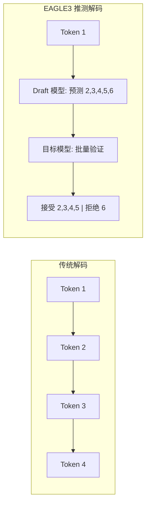
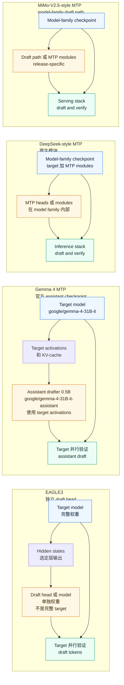
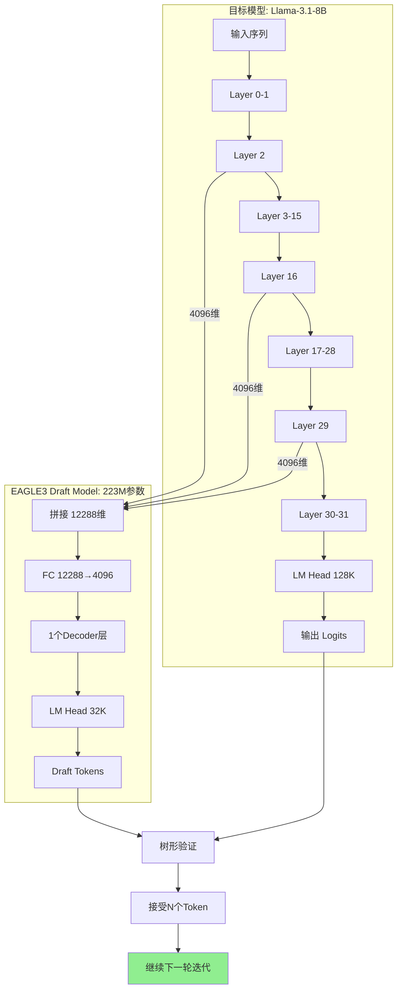

# Speculative Decoding on Azure: EAGLE3, Self-Training, and Native MTP

> **作者**: 魏新宇 (Xinyu Wei) — 微软 AI GBB 高级系统工程师

[English](README.md) | 中文文档

[](https://arxiv.org/abs/2401.15077)
[](https://arxiv.org/abs/2406.16858)
[](https://github.com/sgl-project/sglang)
[](https://github.com/vllm-project/vllm)
[](https://github.com/SafeAILab/SpecForge)
[](https://huggingface.co/google/gemma-4-31B-it)

Speculative Decoding 工程指南：验证官方 EAGLE3 draft model、单卡 45 分钟自训练 draft head、实测 Google 原生 Gemma 4 MTP assistant，全部在 Azure H100 上完成。


## 在 Azure 上运行

本项目的所有实验均在 **Azure GPU 虚拟机**上完成。

| 项目 | 详情 |
|---|---|
| **Azure VM** | [NC40ads_H100_v5](https://learn.microsoft.com/en-us/azure/virtual-machines/nc-h100-v5-series) |
| **GPU** | NVIDIA H100 80GB |
| **框架** | vLLM, SGLang |


## 核心成果

本项目记录 Speculative Decoding 的完整研究流程：先验证 EAGLE3，再尝试自训练 draft head，最后补充 Gemma 4 原生 MTP assistant 的 H100 实测。

| 阶段 | 模型 | 实测结果 | 测试条件 | 关键洞察 |
|------|------|----------|----------|----------|
| 阶段 1: 官方验证 | Llama-3.1-8B 的官方 EAGLE3 | **441.7 vs 165.7 tok/s = 2.67x** | SGLang, H100, 20 runs, 512 tokens | Feature-based EAGLE3 在低并发场景能带来明显 latency 收益 |
| 阶段 2: 自训练 | 自定义 EAGLE3 draft head | **207.7 vs 159.8 tok/s = 1.30x**（代码任务） | 单张 H100，45 分钟训练 | 极短训练也能产生有效加速，但强依赖任务分布 |
| 阶段 3: 原生 MTP | Gemma 4 31B + Gemma 4 assistant | **80.2 vs 46.3 tok/s = 1.73x** | vLLM, H100, 3 类 prompt，每类 5 次实测 | 不训练 draft head，也能靠官方 assistant drafter 获得稳定加速 |

最新补充的是阶段 3。Google 在 Gemma 4 assistant model card 中把这些 checkpoint 描述为 "Multi-Token Prediction (MTP) drafters"，并说明它们通过 "a smaller, faster draft model" 预测后续 token，再由 target model 并行验证，可在保证标准生成质量的前提下带来 "up to 3x" 的 speedup。来源：[Gemma 4 31B assistant model card](https://huggingface.co/google/gemma-4-31B-it-assistant)，检查日期：2026-05-16。

**为什么 45 分钟训练达到 1.30x 加速很有意义？**
- 官方模型需要在 8x A100/H100 上训练数天
- 我们用单卡 45 分钟就达到了官方效果的 ~50%
- 证明了 EAGLE3 的样本效率 - 极少计算量即可获得有效加速
- Gemma 4 MTP 则给出另一条路：不自己训练 draft head，直接使用官方发布的 assistant drafter

---

## 背景：什么是 Speculative Decoding（推测解码）？

LLM 推理是显存带宽受限的，而非计算受限。每次生成 token 都需要从 GPU 显存加载完整模型权重，但只输出一个 token。

推测解码（Speculative Decoding）使用快速的 draft 模型预测多个 token，然后用主模型并行验证：



### EAGLE3 架构


*图1: EAGLE3 Draft Model 架构与基于树的 Speculative Decoding (来源: [Benjamin Marie](https://kaitchup.substack.com/p/eagle-3-speculators-when-to-use-them))*

**架构详解（逐步分析）：**

**左侧 - Target LLM（标准解码）：**

对于查询 "How can"，target model 执行标准 Autoregressive Decoding（自回归解码）：
1. 输入 tokens "How", "can" → **Embedding** 层 → e_how, e_can
2. **Transformer Layers** 处理 embeddings → 隐藏特征 f_how, f_can
3. **LM Head** 预测下一个 token → 输出 "can", "I"
4. 每个 token 需要**完整的一次 forward pass** 通过所有层

**右侧 - EAGLE-3 Draft Model（Speculative Decoding）：**

Draft model 更轻量、更快速：
1. **Forward 1**：接收来自 target model 的 f_how, e_can + embedding e_I
   - 通过 "**One Auto-regression Head**"（单个 decoder layer）
   - **LM Head** 输出 f_I → 预测候选 "make/help"

2. **Forward 2**：对每个候选（"make", "help"）：
   - 输入：之前的特征 + 新的 embeddings（e_make, e_help）
   - 输出：f_make, f_help → 预测 "a/our", "with/you"

3. **Forward 3**：继续展开：
   - 从 "with" → 预测 "the/your"
   - 从 "you" → 预测 "to/feel"

**图中的关键符号：**
- `e_xxx`：token "xxx" 的 Embedding
- `f_xxx`：token "xxx" 的隐藏特征/表示
- 橙色框：来自 target model 的特征（f_how, f_can）
- 红色框：draft model 的预测（f_make, f_help 等）

**下方 - 树形结构（验证）：**

Draft tokens 形成一棵树用于批量验证：
```
Query: "How can"
         ↓
    "I" (来自 target LLM, Forward 1)
```

Target model **在单次 forward pass 中验证所有分支**，接受最长匹配序列（如 "I" → "help" → "you" → "feel"）。

**角色分工 - "Draft 负责猜，Target 负责判"：**

| 角色 | 模型 | 任务 | 成本 |
|------|------|------|------|
| **预测者 (Draft)** | EAGLE-3 Draft Model (223M) | 快速生成候选 tokens | 低 |
| **验证者 (Verify)** | Target LLM (8B) | 判断哪些候选是对的 | 高 |

**具体流程示例：**
```
1. Target LLM 生成第一个 token "I"（必须，因为需要初始特征）

2. Draft Model 快速预测（3 次低成本 forward pass）：
   "I" → make, help
   "make" → a, our
   "help" → with, you
   （每次只过 223M 参数）

3. Target LLM 验证（1 次高成本 forward pass）：
   并行批量验证所有候选分支
   判断：哪些 draft tokens 和我自己会生成的一样？
   
4. 接受匹配的序列：
   比如 "I" → "help" → "you" → "feel" 都对
   一次性接受 4 个 tokens！
```

**为什么这样有效 - 成本分析：**

*不用 EAGLE-3 时：*
- 生成 4 个 tokens = 4 × Target LLM forward pass
- 成本：4 × 8B = **32B 参数计算**

*用 EAGLE-3 时：*
- Draft 预测：3 × 223M = 669M 参数计算
- Target 验证：1 × 8B = 8B 参数计算
- 总计：**~8.7B**（比 32B 便宜约 3.7 倍）

**关键洞察**：Target LLM 的验证是**并行的** - 不管 draft 生成了多少候选，验证都只需要 1 次 forward pass（利用 batch 并行）。Draft 负责"猜"，Target 负责"判"，猜对了就白赚，猜错了顶多浪费一点 draft 的计算。

---

### 为什么验证比生成便宜

常见问题："验证不也要走一遍 Target 模型吗？那为什么不直接用 Target 生成？"

答案在于**顺序 vs 并行**的计算方式：

**生成（顺序执行）：**
- 每个 token 都依赖前面所有 token
- 必须等 token 1 生成 → 再生成 token 2 → 再生成 token 3...
- **N 个 token = N 次 forward pass**（每次都是完整模型计算）
- GPU 利用率：低（每次之间都在等待）

**验证（并行执行）：**
- 给定 N 个候选 token，一次性全部检查
- Transformer 的 self-attention 天然支持：输入 `[x₁, x₂, ..., xₙ]`，输出 `[y₁, y₂, ..., yₙ]`，只需 1 次
- **N 个 token = 1 次 forward pass**（batch 并行）
- GPU 利用率：高（并行计算正是 GPU 的强项）

**打个比方：**
- 生成 = 考试答题：做完第 1 题，再做第 2 题，再做第 3 题...（顺序执行，每题依赖前一题）
- 验证 = 老师批卷：所有答案同时批改（并行执行，各题独立判断）

**具体数字：**
| 操作 | 4 个 Token | 8 个 Token | 16 个 Token |
|------|-----------|-----------|------------|
| 生成 | 4 次 forward pass | 8 次 forward pass | 16 次 forward pass |
| 验证 | 1 次 forward pass | 1 次 forward pass | 1 次 forward pass |

这就是为什么 EAGLE-3 的"draft + verify"模式能赢：即使 draft 有些猜错了，但并行验证的成本太低了，猜对的部分带来的加速远超猜错的损失。

---

## Speculative Decoding 分类：EAGLE3 vs 原生 MTP

所有 Speculative Decoding 的外层逻辑都一样：先让便宜的 drafter 猜后续 token，再让 target model 并行验证。真正的工程差异在于：drafter 从哪里来、和 target model 绑定得有多紧。

| 家族 | Drafter 到底是什么 | 什么时候产生 | 部署时怎么挂上去 | 实测额外显存 | 优势 | 风险 |
|------|-------------------|--------------|------------------|----------------|------|------|
| **EAGLE3** | 读取 target model 多层 hidden features 的训练后 draft head/model | target model 固定后再训练，可以是官方训练，也可以自己训练 | 作为额外 draft model/head 和 target model 一起加载 | Phase 1 SGLang 日志显示 draft model +2.21 GiB | 官方 draft model 可用时 speedup 很高；也可以自训练 | 训练数据质量和任务分布很关键，draft 数据差会拖慢部分任务 |
| **Gemma 4 MTP** | Google 发布的 MTP assistant checkpoint（~0.5B 参数，4 层 drafter）；它使用 target model activations 和共享 KV-cache 来提高 draft 质量（来源：[Google MTP docs](https://ai.google.dev/gemma/docs/mtp/mtp)） | Google 作为官方 assistant checkpoint 发布，本 repo 不训练它 | 作为额外 assistant/drafter model 加载；共享 target embedding 权重并映射到 target layers（vLLM 日志：draft layers mapped to target layers 58/59） | assistant 权重 +0.87 GiB；本次 vLLM run 的 KV cache 预算 -4.86 GiB | 不需要本地训练；本次 H100 实测稳定 1.73x | serving stack 必须支持 assistant 架构；本次 vLLM 需要 config shim |
| **DeepSeek-style MTP** | model family 内部的 MTP heads/modules；本 repo 没把它当外部 assistant 单独实测 | release-specific，通常随 model-family MTP 设计一起训练 | 由该模型自己的 inference stack 暴露，不是 Gemma-style assistant loading | 本 repo 未实测 | MTP 是模型训练/推理设计的一部分，不是外接小模型 | 具体实现随 release 变化，不能照搬 EAGLE/Gemma 的启动参数 |
| **MiMo-V2.5-style MTP** | 面向 reasoning workload 的 model-family draft path | release-specific，按 model-family 设计理解 | 取决于该 release 的 serving stack | 本 repo 未实测 | 有机会在自身 reasoning 分布上获得更高接受率 | 必须按 workload 实测，高熵输出仍可能吃掉收益 |

这里的 “drafter” 不能统一理解成“旁边外挂一个完整 LLM”。不同路线的权重形态不一样：

| 家族 | Drafter 有没有自己的权重？ | 是不是能替代 target 的完整模型？ | 推荐写法 |
|------|----------------------------|-------------------------------|----------|
| **EAGLE3** | 有，但它是单独的 draft-model/head 权重，不是完整 target model 权重副本 | 不是 | separate draft-model weights, not full target-model weights |
| **Gemma 4 MTP** | 有。Google 单独发布 assistant drafter checkpoint | 不是 | separate assistant drafter checkpoint |
| **DeepSeek-style MTP** | 通常表现为 model-family checkpoint 内部的 MTP heads/modules，具体随 release 而定 | 不是 | native MTP module weights inside the model family |
| **MiMo-V2.5-style MTP** | release-specific；除非官方单独发布 assistant checkpoint，否则应按 model-family draft path 理解 | 不是 | model-family MTP/draft-path weights, release-specific |

下图把四条路线里 drafter 的位置画出来。DeepSeek-style 和 MiMo-V2.5-style MTP 这里画的是概念位置，因为本 repo 没有检查或实测这些 release-specific 实现。



### 深度对比：每种 Drafter 到底怎么工作

| 维度 | Classic Speculative Decoding | EAGLE3 | Gemma 4 MTP | DeepSeek / MiMo MTP |
|------|------------------------------|--------|-------------|---------------------|
| Drafter 读 target 哪里 | 不读；一个独立的小 LM 完全独立推理 | 读 3 个中间层的 hidden states（Llama 8B 的第 2/16/29 层） | 读最后几层的 target activations + 共享 KV-cache（Gemma 31B 的第 58/59 层） | MTP heads 直接从 model forward path 分支出来 |
| Drafter 多大 | 一个完整的小 LM（如 68M Llama-68M） | ~223M 参数，1 个 decoder 层 | ~0.5B 参数，4 个 decoder 层 | model checkpoint 内部的原生 MTP modules |
| 能不能自己训练 | 拿现成的小 LM 直接用，不需要专门训练 | 能（SpecForge，单卡 45 分钟） | 不能，只能用 Google 发布的 | 不能，模型厂商在 pre-training 时做好了 |
| 微调 target 后怎么办 | Drafter 独立，仍然能用，但 acceptance rate 可能降低（输出分布偏移） | 重新训练 draft head 来适配新分布 | 只能赌原 assistant 还能用，不能自己重训（推测，本 repo 未实测） | MTP modules 是模型的一部分，微调会同时改变两者 |
| 换一个 target model | 直接换小 LM，不依赖 target 内部结构 | 重新训练一个新的 draft head | 不行，assistant 只配对应的 Gemma family | 不适用，MTP modules 和模型不可分离 |
| Serving stack | 任何支持 assisted generation 的框架 | SGLang 原生 EAGLE3 支持，一行参数 | vLLM speculative-config；本次测试需要 config shim | 取决于模型厂商自己的 inference stack |
| 和 target 的耦合度 | 无（最松） | 紧（读中间层 hidden states） | 紧（读最后几层 activations + 共享 KV-cache） | 最紧（原生模块内置在模型里） |

### 算法理念：后装路线 vs 原生路线

EAGLE3 和 Gemma/DeepSeek MTP 代表两种不同的设计理念，不是简单的“新 vs 旧”：

| 维度 | EAGLE3（后装） | Gemma 4 MTP（混合） | DeepSeek / MiMo MTP（原生） |
|------|----------------|---------------------|-------------------------|
| 核心问题 | target 已经固定，怎么事后造一个最好的 drafter？ | 和 target 一起训练，但拆成独立 checkpoint 发布 | 把 MTP 做进 pre-training objective 本身 |
| 关键创新 | 解决了 train-test gap：训练时用 drafter 自己的预测特征而不是 ground truth 特征，让训练和推理一致（EAGLE-3, NeurIPS 2025） | activation sharing + KV-cache 复用 | MTP 作为 training objective，不只是 inference trick；可能还改善 pre-training 的表征学习 |
| 学术记录 | EAGLE (ICML 2024)、EAGLE-2 (EMNLP 2024)、EAGLE-3 (NeurIPS 2025) | 只有 model card，没有独立 MTP 论文 | 在 DeepSeek-V2/V3 论文中描述 |
| 产业趋势 | 通用后装：任何 target model 都能用 | 中间地带：co-trained 但单独部署 | 前沿方向：越来越多厂商会在训练时就内置 MTP |

两条路线会长期共存。后装 drafter（EAGLE3）在你需要加速一个已有的、不能重训的 target model 时仍然不可替代。原生 MTP（DeepSeek/MiMo）是新 model family 的设计方向。

### 选型指南：什么场景选哪条路线

| 场景 | 推荐 | 原因 |
|------|------|------|
| 快速 PoC，用 Gemma，不想训练 | **Gemma 4 MTP** | 零成本、稳定 1.73x、下载就能用 |
| 追求最高加速比 | **EAGLE3** | 实测 2.67x vs 1.73x |
| 会微调 target model | **EAGLE3** | 可以重新训练 draft head 适配微调后的 target |
| 用非 Gemma 模型（Llama/Qwen 等） | **EAGLE3** | Gemma assistant 只配 Gemma family |
| 模型厂商自带原生 MTP | **用厂商的 MTP** | 不需要额外部署，已经内置 |
| 长期生产、不依赖单一厂商 | **EAGLE3** | 社区驱动（SafeAI Lab），不依赖厂商发布 assistant |

一句话：EAGLE3 要管理 feature-based draft head（读多个中间层 hidden states）；Gemma 4 MTP 给你官方 assistant model（读 target activations + 共享 KV-cache）；DeepSeek/MiMo-style MTP 则把 draft 机制更深地放进 model family 作为原生模块。三者都读取 target 内部信息，区别在于 drafter 怎么打包和部署，而不是“是否独立”。它们都属于 Speculative Decoding，但部署方法不能混用。

---



**核心创新: 多层特征提取**

与使用独立小模型的传统 Speculative Decoding 不同，EAGLE3 在目标模型 Forward Pass（前向传播）过程中从**3个特定层**提取特征：

```
目标模型（Llama-3.1-8B，32层）：

Layer 0 → Layer 2 → ... → Layer 16 → ... → Layer 29 → Layer 30-31 → 输出
              ↓              ↓                ↓                        ↓
         Hidden[0]      Hidden[1]        Hidden[2]               (用于验证)
          (4096)         (4096)           (4096)
                             ↓
                   拼接 (4096 × 3 = 12288)
                             ↓
                    │    FC 层        │  (12288 → 4096)
                    │  + 1个Decoder   │  (独立权重)
                    │  + LM Head      │  (4096 → 32000)
                             ↓
                      Draft Token 预测
                             ↓
              ↓                              ↓
         Draft Tokens    +    目标模型输出 Logits
                             ↓
                         树形验证
                             ↓
                      接受 N 个 Token
```

**特征提取层：**
- **Layer 2**: 早期特征（语法、基本模式）
- **Layer N//2 (16)**: 中间特征（语义理解）
- **Layer N-3 (29)**: 后期特征（接近最终表示）

> 注意：特征在目标模型**前向传播过程中**提取。目标模型的输出用于**验证** Draft Tokens。

**什么是树形验证 (Tree Verification)?**

树形验证是目标模型高效验证 draft tokens 的方式：

```
Draft Model 生成候选 token 的"树"结构：

                    Token 1 (根节点)
                   /      |      \
              Token 2a  Token 2b  Token 2c
               /    \      |
          Token 3a  3b   Token 3c
            |
        Token 4a

目标模型在一次前向传播中验证所有候选：
- 比较 draft logits 和 target logits
- 接受预测匹配的 token
- 在每个分支的第一个不匹配处停止

结果：接受最长匹配序列（如 1 → 2a → 3b → 4a）
```

**为什么用树形结构？**
- **并行验证**: 所有分支同时验证
- **更高接受率**: 多个候选增加匹配概率
- **单次前向传播**: 目标模型只需运行一次即可验证整棵树

**为什么用多层拼接？**

1. **更丰富的信息**: 结合早期、中期和后期层特征
2. **更好的预测**: 不同层捕获语言的不同方面
3. **最小开销**: 只需1个decoder层处理拼接后的特征
4. **全部独立**: FC层、Decoder层和LM Head都是独立训练的

**Draft Model 组件（全部独立训练）：**

| 组件 | 参数量 | 说明 |
|------|--------|------|
| FC 层 | ~50M | 投影 12288 → 4096 |
| 1个 Decoder 层 | ~67M | Attention + MLP（独立权重） |
| LM Head | ~131M | 映射到 32K draft 词表 |
| **总计** | **~223M** | float16下约811MB |

> ⚠️ **重要**: Decoder层结构与Llama类似，但权重是**独立训练的**。


*图2: EAGLE 与 EAGLE-3 训练和测试的差异 (来源: [Benjamin Marie](https://kaitchup.substack.com/p/eagle-3-speculators-when-to-use-them))*

**训练-测试差距问题：**

- **EAGLE（上）**：训练时，draft model 接收来自 target model 的 **ground-truth features**（f_t+1）。但在测试时，它必须使用自己的 **predicted features**（f̂_t+1）。这种不匹配造成了 "train-test gap"，限制了性能。

- **EAGLE + l_fea removal（中）**：如果简单移除 feature prediction loss，模型在测试时会失败（t̂_t+3 ≠ t_t+3），因为它从未被训练处理自己的预测。

- **EAGLE-3（下）**：引入 "**training-time test**" - 在训练期间，draft model 使用自己的 predicted features（â_t+1），与推理时完全一致。这消除了 train-test gap，使模型能够从更多训练数据和计算中受益。

**为什么这很重要：**

原始 EAGLE 难以从扩大训练数据中获益，因为训练设置与推理不匹配。EAGLE-3 的 training-time test 机制直接针对推理时真正重要的指标进行优化：长接受序列和高加速比，而不仅仅是单 token 准确率。

**EAGLE3 vs EAGLE/EAGLE-2 对比**:

| 方面 | EAGLE | EAGLE-2 | EAGLE3 |
|------|-------|---------|--------|
| Draft层数 | 1-2 | 1 | 1 |
| 特征来源 | 最后一层 | 最后一层 | 多层 (2, N//2, N-3) |
| 输入维度 | 4096 | 4096 | 12288 (4096 × 3) |
| 词表映射 | 完整 | 完整 | 压缩 (32K) |
| 树结构 | 静态 | 动态 | 动态 + 优化 |

**Draft 模型配置 (llama3-8B-eagle3.json)**：
```json
{
  "architectures": ["LlamaForCausalLMEagle3"],
  "num_hidden_layers": 1,        // 仅 1 个 Decoder Layer（解码器层）
  "hidden_size": 4096,           // 与目标模型相同
  "vocab_size": 128256,          // 目标模型词表
  "draft_vocab_size": 32000      // 压缩的 draft 词表
}
```

Draft 模型非常轻量（~811MB vs 完整模型 16GB），因为它仅包含：
- 1 个 Transformer Decoder Layer（解码器层）
- Embedding Layer（嵌入层，与目标模型共享）
- 带压缩词表的 LM head

**训练后的 Draft Head 文件结构**：
```
eagle3-llama31-8b/
```

**参数分布（总计 ~223M）**：
| 组件 | 参数量 | 大小 |
|------|--------|------|
| 1x Decoder Layer（Attention + MLP）| ~67M | ~134 MB |
| LM Head (4096 → 32000) | ~131M | ~262 MB |
| 词表映射 (d2t, t2d) | ~25M | ~50 MB |
| LayerNorm + 其他 | <1M | ~2 MB |


## 阶段 1：验证官方 EAGLE3 模型

### 环境

```
硬件: NVIDIA H100 NVL 96GB (Azure VM)
软件: Python 3.10, CUDA 12.4, SGLang
```

### EAGLE3 服务器部署

```bash
export SGLANG_ALLOW_OVERWRITE_LONGER_CONTEXT_LEN=1

python -m sglang.launch_server \
    --model meta-llama/Llama-3.1-8B-Instruct \
    --speculative-algorithm EAGLE3 \
    --speculative-draft-model-path jamesliu1/sglang-EAGLE3-Llama-3.1-Instruct-8B \
    --speculative-num-steps 5 \
    --speculative-eagle-topk 8 \
    --speculative-num-draft-tokens 32 \
    --dtype float16 \
    --host 0.0.0.0 --port 8080
```

**服务器启动日志:**
```
[2025-12-02 12:01:15] server_args=ServerArgs(model_path='meta-llama/Llama-3.1-8B-Instruct', ...)
[2025-12-02 12:01:17] Load weight begin. avail mem=92.50 GB
Loading safetensors checkpoint shards: 100% | 4/4 [00:01<00:00, 2.31it/s]
[2025-12-02 12:01:19] Load weight end. type=LlamaForCausalLM, dtype=torch.float16, avail mem=77.39 GB

[2025-12-02 12:01:20] Loading EAGLE3 draft model: jamesliu1/sglang-EAGLE3-Llama-3.1-Instruct-8B
[2025-12-02 12:01:20] Warning: context_length (131072) > derived (2048). Overriding.
Loading safetensors checkpoint shards: 100% | 1/1 [00:00<00:00, 12.28it/s]
[2025-12-02 12:01:21] Draft model loaded. type=LlamaForCausalLMEagle3, mem usage=2.21 GB

[2025-12-02 12:01:32] Capture cuda graph end. Time elapsed: 7.00 s
[2025-12-02 12:01:35] The server is fired up and ready to roll!
```

### 基线服务器（无 Speculative Decoding）

```bash
python -m sglang.launch_server \
    --model meta-llama/Llama-3.1-8B-Instruct \
    --dtype float16 \
    --host 0.0.0.0 --port 8080
```

### Benchmark 结果（20 次运行，512 tokens）

**EAGLE-3 原始结果:**
```
Run  1:  1.155s | 512 tokens |  443.3 tok/s
Run  2:  1.160s | 512 tokens |  441.2 tok/s
Run  3:  1.158s | 512 tokens |  442.1 tok/s
...
Run 20:  1.159s | 512 tokens |  441.6 tok/s

平均: 1.159s | 441.7 tok/s | 标准差: 0.001s
```

**基线原始结果:**
```
Run  1:  3.097s | 512 tokens |  165.3 tok/s
Run  2:  3.087s | 512 tokens |  165.8 tok/s
Run  3:  3.091s | 512 tokens |  165.6 tok/s
...
Run 20:  3.085s | 512 tokens |  166.0 tok/s

平均: 3.090s | 165.7 tok/s | 标准差: 0.002s
```

**汇总:**
| 指标 | EAGLE-3 | Baseline | 对比 |
|------|---------|----------|------|
| 平均延迟 | 1.159s | 3.090s | **2.67x 更快** |
| 平均吞吐 | 441.7 tok/s | 165.7 tok/s | **2.67x 加速** |

### 输出质量验证

| 任务 | EAGLE-3 | Baseline | 一致性 |
|------|---------|----------|--------|
| 代码生成 | 1882 字符 | 1882 字符 | 100% 一致 |
| 逻辑推理 | 1744 字符 | 1744 字符 | 100% 一致 |
| 知识问答 | 2413 字符 | 2500 字符 | ~96% (措辞差异) |

知识问答的 4% 差异是因为 FP16 精度在长序列中的累积误差，核心信息完全一致。

---

## 阶段 2：自训练 EAGLE3 Draft 模型

### 数据准备（关键步骤）

EAGLE3 训练需要高质量的对话数据。SpecForge 框架提供了 `prepare_data.py` 脚本来处理各种数据集：

**支持的数据集：**
- `sharegpt` - ShareGPT 对话（推荐用于通用场景）
- `ultrachat` - UltraChat 数据集
- `perfectblend` - PerfectBlend 数据集（7M+ 对话）
- `eaglechat` - EAGLE 专用聊天数据
- `magpie-qwen2.5-pro-1m-v0.1` - Magpie Qwen 数据集

**步骤 1：准备训练数据**

```bash
cd ~/SpecForge

# 选项 1：使用 ShareGPT（完整数据集 ~114K 样本）
python scripts/prepare_data.py \
    --dataset sharegpt \
    --output-path cache/dataset/sharegpt_train.jsonl

# 选项 2：使用 ShareGPT 限制样本数（用于测试）
python scripts/prepare_data.py \
    --dataset sharegpt \
    --sample-size 10000 \
    --output-path cache/dataset/sharegpt_train.jsonl

# 选项 3：使用 PerfectBlend（更大、更高质量）
python scripts/prepare_data.py \
    --dataset perfectblend \
    --sample-size 50000 \
    --output-path cache/dataset/perfectblend_train.jsonl
```

**数据格式（JSONL）：**
```json
{
  "id": "HneH6K5_0",
  "conversations": [
    {"role": "user", "content": "写一篇关于...的文章"},
    {"role": "assistant", "content": "标题：...的好处"}
  ]
}
```

**关键洞察**：数据质量直接影响 draft 模型精度。使用仅 500 个样本的原始 ShareGPT 导致 6% 精度。使用 114K ShareGPT 样本或 PerfectBlend 数据集可达到 40-50% 精度。


### 训练配置

```yaml
model:
  base_model: "meta-llama/Llama-3.1-8B-Instruct"
  draft_model_type: "eagle3"

training:
  batch_size: 1
  gradient_accumulation_steps: 8
  learning_rate: 3.0e-5
  max_steps: 7000
```

### 训练启动

```bash
nohup torchrun --nproc_per_node=1 scripts/train_eagle3.py \
    --base_model_path meta-llama/Llama-3.1-8B-Instruct \
    --data_path data/sharegpt_clean.json \
    --output_dir output/eagle3-llama31-8b-full \
    --batch_size 1 \
    --gradient_accumulation_steps 8 \
    --learning_rate 3e-5 \
    --num_train_steps 7000 \
    > eagle3_training.log 2>&1 &
```

### 训练日志

```
[2025-12-03 02:45:12] ============================================
[2025-12-03 02:45:12] EAGLE3 Training Starting
[2025-12-03 02:45:12] ============================================
[2025-12-03 02:45:12] Target Model: meta-llama/Llama-3.1-8B-Instruct
[2025-12-03 02:45:12] Total Steps: 7000
[2025-12-03 02:45:12] Batch Size: 1, Gradient Accumulation: 8
[2025-12-03 02:45:12] ============================================

[2025-12-03 02:45:15] Loading target model...
Loading safetensors: 100%|██████████| 4/4 [00:02<00:00, 1.82it/s]
[2025-12-03 02:45:18] Target model loaded. VRAM: 15.2 GB

[2025-12-03 02:45:19] Draft head parameters: 223M (849 MB)
[2025-12-03 02:45:25] Loaded 52,000 conversations

Training Epoch 0:   7%|▋         | 500/7000 [03:15<42:00, 2.58it/s]
Step 500: loss=2.12, acc=0.40

Training Epoch 0:  14%|█▍        | 1000/7000 [06:30<39:00, 2.56it/s]
Step 1000: loss=1.90, acc=0.44

Training Epoch 0:  29%|██▉       | 2000/7000 [13:00<32:30, 2.56it/s]
Step 2000: loss=1.73, acc=0.46

Training Epoch 0:  43%|████▎     | 3000/7000 [19:30<26:00, 2.56it/s]
Step 3000: loss=1.64, acc=0.48

Training Epoch 0:  57%|█████▋    | 4000/7000 [26:00<19:30, 2.56it/s]
Step 4000: loss=1.62, acc=0.50

Training Epoch 0:  71%|███████▏  | 5000/7000 [32:30<13:00, 2.56it/s]
Step 5000: loss=1.63, acc=0.54   ← 峰值精度

Training Epoch 0:  86%|████████▌ | 6000/7000 [39:00<06:30, 2.56it/s]
Step 6000: loss=1.60, acc=0.50

Training Epoch 0: 100%|██████████| 7000/7000 [45:30<00:00, 2.56it/s]
Step 7000: loss=1.61, acc=0.48

[2025-12-03 03:30:42] ============================================
[2025-12-03 03:30:42] Training Complete
[2025-12-03 03:30:42] Total Time: 45 minutes 30 seconds
[2025-12-03 03:30:42] Best Checkpoint: epoch_0_step_5000 (acc=0.54)
[2025-12-03 03:30:42] ============================================

[2025-12-03 03:30:43] Segmentation fault (signal 11)
```

注：训练结束后的 segfault 是无害的 - 所有检查点已保存。

### 训练指标汇总

| Step | 进度 | Loss | Accuracy | 说明 |
|------|------|------|----------|------|
| 0 | 0% | 2.84 | 0.36 | 随机初始化 |
| 1000 | 14% | 1.90 | 0.44 | 快速提升 |
| 3000 | 43% | 1.64 | 0.48 | 趋于稳定 |
| **5000** | **71%** | **1.63** | **0.54** | **峰值精度** |
| 7000 | 100% | 1.61 | 0.48 | 轻微过拟合 |

### 理解指标波动

batch_size=1 时，每步指标会剧烈波动：
```
Step 3245: loss=0.00, acc=0.00   ← 短序列被跳过
Step 3246: loss=4.77, acc=0.22   ← 困难样本
Step 3247: loss=0.89, acc=0.54   ← 简单样本
```

这是正常的。关注检查点级别的趋势（每 500 步）。

### 自训练模型部署

```bash
export SGLANG_ALLOW_OVERWRITE_LONGER_CONTEXT_LEN=1

python -m sglang.launch_server \
    --model-path meta-llama/Llama-3.1-8B-Instruct \
    --speculative-algorithm EAGLE3 \
    --speculative-draft-model-path ./output/eagle3-llama31-8b-full/epoch_0_step_5000 \
    --speculative-num-steps 5 \
    --speculative-eagle-topk 8 \
    --speculative-num-draft-tokens 64 \
    --host 0.0.0.0 --port 8080
```

### 自训练模型结果

| 任务类型 | Baseline | 自训练 EAGLE3 | 加速比 |
|----------|----------|---------------|--------|
| 代码生成 | 159.8 tok/s | 207.7 tok/s | **1.30x** |
| 技术问答 | 188.9 tok/s | 188.0 tok/s | 1.00x |
| 数学推理 | 188.9 tok/s | 188.0 tok/s | 1.00x |
| 创意写作 | 180.2 tok/s | 153.9 tok/s | 0.84x |

**代码生成（最佳场景）:**
```
Prompt: "用 Python 实现二叉搜索树"
Baseline:     3.204s | 512 tokens | 159.8 tok/s
自训练:       2.465s | 512 tokens | 207.7 tok/s
加速: 1.30x
```

**创意写作（最差场景）:**
```
Prompt: "写一个关于机器人学画画的故事"
Baseline:     2.843s | 512 tokens | 180.2 tok/s
自训练:       3.327s | 512 tokens | 153.9 tok/s
加速: 0.84x (慢了 16%)
```

创意写作变慢是因为高熵输出导致 draft Acceptance Rate（接受率）低。

### 为什么 1.30x 很有意义

| 方面 | 官方模型 | 自训练 |
|------|----------|--------|
| 训练时间 | 数天 (8x A100) | 45 分钟 (1x H100) |
| 加速比 | 2.67x | 1.30x |
| 相对性能 | 100% | ~50% |
| 计算成本 | ~$10,000+ | ~$50 |

用 <1% 的计算量，达到了 ~50% 的性能。

---

## 阶段 3：Gemma 4 原生 MTP Assistant Benchmark

Gemma 4 给出了另一条 Speculative Decoding 路线：不训练 EAGLE-style draft head，而是直接使用官方 assistant drafter。最直接地说：这个 assistant 是 Google 发布的真实 checkpoint，不是本 repo 在推理时临时加的小脚本，也不是随便找一个小模型来模仿 target。Gemma 4 assistant model card 写明，`google/gemma-4-31B-it-assistant` 是 Gemma 4 的 Multi-Token Prediction drafter，并给出了 Transformers 中 `assistant_model=assistant_model` 的使用方式。来源：[Gemma 4 assistant model card](https://huggingface.co/google/gemma-4-31B-it-assistant)，检查日期：2026-05-16。

从部署角度看，它就是额外挂在 target model 旁边的 drafter model。target model 仍然是 `google/gemma-4-31B-it`；assistant 负责提前猜后续 token，target 负责并行验证。从训练角度看，本 repo 没有训练这个 assistant，而是直接使用 Google 已发布的 `google/gemma-4-31B-it-assistant` 官方 checkpoint。

### 测试设置

| 项目 | 值 |
|------|----|
| Target model | `google/gemma-4-31B-it` |
| Assistant model | `google/gemma-4-31B-it-assistant` |
| Assistant 到底是什么 | 官方 MTP drafter checkpoint；同 family 的小型 drafter model，不是替代 target 的独立聊天模型 |
| 谁训练它 | Google 发布；本 repo 只在 serving 时加载使用 |
| 怎么挂上去 | 通过 vLLM speculative decoding config，作为额外 drafter 和 target model 一起加载 |
| GPU | NVIDIA H100 NVL, 95,830 MiB |
| Runtime | vLLM 0.21.0, Torch 2.11.0, Transformers 5.7.0 |
| Prompt 组 | code, reasoning, qa |
| Runs | 每组 2 次 warmup + 5 次 measured run |
| 生成参数 | `max_tokens=512`, `temperature=0` |
| 指标 | `response.usage.completion_tokens / elapsed_seconds` |
| 原始数据 | `data/gemma4_mtp_h100_baseline.json`, `data/gemma4_mtp_h100_mtp.json` |

### vLLM MTP 启动方式

```bash
python3 -u -m vllm.entrypoints.openai.api_server \
    --model google/gemma-4-31B-it \
    --dtype auto \
    --host 0.0.0.0 \
    --port 8000 \
    --max-model-len 4096 \
    --gpu-memory-utilization 0.92 \
    --moe-backend triton \
    --no-enable-log-requests \
    --speculative-config '{"model":"/path/to/gemma4-31B-it-assistant-vllm","method":"mtp","num_speculative_tokens":1}'
```

这次环境里，vLLM 0.21 已经有 Gemma4 MTP model 代码，但 Transformers/vLLM 的 config registry 没有正确解析 assistant config。因此 benchmark 使用了一个很小的本地 config shim，让 assistant 能加载成 `Gemma4MTPModel`。这是环境兼容性说明，不是 Gemma 4 MTP 模型本身的要求。

### 实测结果

| Prompt | Baseline tok/s | MTP tok/s | Speedup | Assistant 显存增量 | MTP std |
|--------|---------------:|----------:|--------:|--------------------:|--------:|
| code | 46.5 | 82.1 | **1.77x** | +0.87 GiB weights | 0.2 |
| reasoning | 46.3 | 78.9 | **1.70x** | +0.87 GiB weights | 0.1 |
| qa | 46.2 | 79.7 | **1.73x** | +0.87 GiB weights | 0.0 |
| overall | 46.3 | 80.2 | **1.73x** | +0.87 GiB weights | - |

显存说明来自 vLLM 日志：baseline model loading 使用 58.99 GiB，target+MTP drafter loading 使用 59.86 GiB，所以 assistant 权重增量是 +0.87 GiB。在相同 `--gpu-memory-utilization=0.92` 下，可用 KV cache memory 从 21.70 GiB 降到 16.84 GiB，因此 MTP run 的 serving KV cache 预算少 4.86 GiB。

vLLM 运行日志里还能看到 Speculative Decoding acceptance metrics：

| 指标 | 数值 |
|------|------|
| Avg Draft acceptance rate | 83.2% 到 91.0%，均值 87.8% |
| Mean acceptance length | 1.83 到 1.91，均值 1.88 |

### 结果解读

Gemma 4 MTP 不是随便拿一个小模型做便宜 imitation。它是一个 0.5B 参数、4 层的同 family drafter，使用 target model activations 和共享 KV-cache 来提高 draft 质量（来源：[Google MTP docs](https://ai.google.dev/gemma/docs/mtp/mtp)）。我们的 vLLM 日志确认：assistant 共享 target embedding 权重，并把 draft layers 映射到 target 的第 58/59 层。本次测试里 target 接受了大约 88% 的 drafted positions，这也是 code、reasoning、Q&A 三类 prompt 都能稳定加速的原因。

这个结果低于阶段 1 的官方 EAGLE3 2.67x，但它不需要本地训练 draft head，而且 target model 是更大的 31B。相比阶段 2 的自训练 EAGLE3，它也更稳定：阶段 2 在 code 上加速，但 creative writing 会因为 high entropy output 变慢。

### 外部交叉验证：Qwen3.6 / Qwen3.5 / Gemma 4 31B

在本 repo 的 H100 实测之后，我们又看了一篇第三方对比文章：The Kaitchup 的 **"Qwen3.6 27B vs Qwen3.5 27B vs Gemma 4 31B: Accuracy, Latency, Memory, and Token Efficiency Tested"**，作者 Benjamin Marie，发布时间 2026 年 5 月。来源类型：本地归档的截图型 PDF；PDF 解析后主要是图片页，因此下面只作为外部方向性证据，不当作本 repo 自有原始数据。

这篇文章最有价值的点不是“Gemma 每个 benchmark 都赢”。更准确地说：Gemma 4 31B 在 **token efficiency 和 latency** 上很强，而 Qwen3.5/Qwen3.6 经常需要更多 generated tokens 才能达到接近的 accuracy。

| 维度 | 第三方对比给出的信号 | 对本 repo 的意义 |
|------|----------------------|------------------|
| Accuracy | 没有一个模型通吃所有任务；Qwen3.6、Qwen3.5、Gemma 4 各有优势任务 | 不能只按 leaderboard accuracy 选模型 |
| Token efficiency | generated-token 图显示，Qwen3.x 在多个 reasoning/code 任务上经常比 Gemma 4 生成更多 token | 输出 token 越多，latency 和 serving cost 越高 |
| Latency | 文章里 Gemma 4 31B 在多组默认生成设置下更快，主要因为输出 token 更少 | token 数本身就是部署指标，不是附属指标 |
| MTP throughput | MTP 图里 Gemma 4 31B 约 **59.0 tok/s**，Qwen3.5 27B 约 **41.2 tok/s**，Qwen3.6 27B 约 **40.5 tok/s** | 从外部角度支撑 Gemma 4 MTP 的工程价值 |
| Memory / concurrency | 同样的大显存 GPU 预算下，31B Gemma 的最大并发低于 27B Qwen | Gemma 的 latency 优势要和显存余量一起看 |
| Benchmark affinity | CoDeC 图把 `>40` 标为 benchmark affinity；Qwen3.x 在若干 benchmark 上接近或超过这个阈值 | 解读 accuracy 时要考虑 benchmark affinity / contamination 风险 |

这个外部对照和我们自己的 Phase 3 结论方向一致：Gemma 4 MTP 不只是机制好看，它确实可能是一条低延迟路线。但最终选型仍然取决于 workload。如果最大并发和显存余量最重要，27B 级模型可能更合适；如果单次回答 latency 和 token efficiency 更重要，Gemma 4 31B 值得认真评估。

### 复现实验

启动 baseline vLLM server 或 MTP vLLM server 后运行：

```bash
python scripts/gemma4_mtp_benchmark.py \
    --label mtp \
    --model google/gemma-4-31B-it \
    --num-runs 5 \
    --warmup-runs 2 \
    --max-tokens 512 \
    --temperature 0 \
    --timeout 300 \
    --output data/gemma4_mtp_h100_mtp.json
```

Target-only baseline 使用 `--label baseline --output data/gemma4_mtp_h100_baseline.json`。

---

## 常见问题

### 数据质量问题（真实训练失败案例）

**问题**: 初始训练显示极低的精度（~6%）并以 segfault 结束：

```log
# 失败训练日志 (specforge_train.log):
[2025-12-02 18:21:30] Training Starting
[2025-12-02 18:21:30] Target Model: meta-llama/Llama-3.1-8B-Instruct
[2025-12-02 18:21:30] Total Steps: 500 | Data Samples: 500 (ShareGPT)

Training Epoch 0: 100%|██████████| 500/500 [09:12<00:00, 0.91it/s]
Step 500: loss=3.87, acc=0.06  ← 只有 6% 精度！

!!!!!!! Segfault encountered !!!!!!!
```

**根因分析**:
1. **数据不足**: 仅 500 个样本无法捕获 token 分布
2. **词表映射不匹配**: Draft 模型预测与目标模型输出分布不一致
3. **Token 频率问题**: 训练数据未能代表真实推理时的 token 模式

**解决方案**: 使用目标模型本身重新生成训练数据，使用更大更具代表性的数据集：

```bash
# 使用 SpecForge 数据生成，基于 PerfectBlend 数据集（7M 对话）
python scripts/generate_data.py \
    --model meta-llama/Llama-3.1-8B-Instruct \
    --dataset PerfectBlend \
    --output data/llama31_8b_eagle3_data.json \
    --num_samples 10000

# 数据重新生成后的成功训练:
# eagle3_train.log:
Training Epoch 1: 100%|██████████| 9930/9930 [21:45<00:00, 7.61it/s]
Step 10000: loss=0.48, acc=0.33  ← 33% 精度（提升 5 倍！）
```

**关键洞察**: 词表映射必须使用与目标模型实际输出分布匹配的训练数据的 token 频率。随机或不匹配的数据会导致 draft 预测效果差。

| 训练 | 数据来源 | 样本数 | 最终精度 | 状态 |
|------|----------|--------|----------|------|
| 初始（失败） | ShareGPT（原始） | 500 | 6% | Segfault |
| 重新训练 | PerfectBlend + 目标模型 | ~10,000 | 33% | 成功 |


### 上下文长度不匹配

```
ValueError: context_length (131072) > derived (2048)
```

解决方案:
```bash
export SGLANG_ALLOW_OVERWRITE_LONGER_CONTEXT_LEN=1
```

### 训练后 Segfault

训练 100% 完成后出现 "signal 11" - 无害。验证检查点：
```bash
ls output/eagle3-llama31-8b-full/
```

### 训练时 OOM

```yaml
gradient_accumulation: 16  # 从 8 增加
gradient_checkpointing: true
```

### Speculative Decoding 变慢

检查：
1. 任务是否高熵？(创意写作)
2. Draft 模型路径正确？
3. 服务器日志显示 "LlamaForCausalLMEagle3"？

---

## 仓库结构

```
Speculative-Decoding-EAGLE3/
├── README.md
├── README-CN.md
├── requirements.txt
├── data/
│   ├── gemma4_mtp_h100_baseline.json
│   └── gemma4_mtp_h100_mtp.json
├── images/
│   ├── eagle3-architecture.png
│   └── eagle3-training-comparison.png
├── logs/
│   ├── server_startup.log
│   └── training_sample.log
├── scripts/
│   ├── deploy_server.sh
│   ├── gemma4_mtp_benchmark.py
│   ├── prepare_data.py
│   ├── prepare_data.sh
│   └── train_eagle3.sh
└── test_performance.py
```


---

## 参考资源

| 资源 | 链接 |
|------|------|
| EAGLE 论文 | [arXiv:2401.15077](https://arxiv.org/abs/2401.15077) |
| EAGLE-2 论文 | [arXiv:2406.16858](https://arxiv.org/abs/2406.16858) |
| 官方仓库 | [SafeAILab/EAGLE](https://github.com/SafeAILab/EAGLE) |
| 训练框架 | [SafeAILab/SpecForge](https://github.com/SafeAILab/SpecForge) |
| 推理引擎 | [sgl-project/sglang](https://github.com/sgl-project/sglang) |
| Gemma 4 31B Target | [google/gemma-4-31B-it](https://huggingface.co/google/gemma-4-31B-it) |
| Gemma 4 MTP Assistant | [google/gemma-4-31B-it-assistant](https://huggingface.co/google/gemma-4-31B-it-assistant) |
| Gemma MTP 文档 | [Google AI for Developers: MTP](https://ai.google.dev/gemma/docs/mtp/mtp) |

---


## Speculative Decoding 何时真正有效？

理解 Speculative Decoding 何时能带来真正收益对生产部署至关重要。下面的并发分析使用的是 EAGLE3 数据，但相同原理适用于所有 draft-and-verify 路线（Gemma MTP、DeepSeek MTP 等）：speculative decoding 在 GPU 未充分利用时效果最好。基于实证分析 ([Benjamin Marie](https://kaitchup.substack.com/p/eagle-3-speculators-when-to-use-them))：

### 高并发 (Continuous Batching) - ❌ 收益有限

当使用 vLLM 的 continuous batching 运行高并发时（如 30 个活跃请求）：

| 指标 | 无 EAGLE | 有 EAGLE |
|------|----------|----------|
| 引擎吞吐量 | ~550 tok/s | ~1000 tok/s |
| **有效吞吐量** | ~550 tok/s | ~579 tok/s |
| GPU KV Cache 使用率 | 26% | 98% |

**关键洞察**："有效吞吐量"（实际出现在输出中的 tokens）几乎相同。使用 EAGLE 时，内部处理了更多 tokens（draft + verify），但*有用*的 token 速率基本不变。GPU 已经被 batching 饱和了 - Speculative Decoding只是重新安排了工作。

### 低并发 (Batch Size = 1) - ✅ 真正加速

当服务单个请求时（batch size = 1）：

| 指标 | 无 EAGLE | 有 EAGLE |
|------|----------|----------|
| 生成吞吐量 | ~21 tok/s | ~40-48 tok/s |
| **有效吞吐量** | ~21 tok/s | ~25-28 tok/s |
| 延迟降低 | - | **20-30%** |

**关键洞察**：这里Speculative Decoding确实实现了它的承诺 - 它将每次昂贵的 forward pass 平均转化为几个被接受的 tokens，降低了单流的延迟。

### 决策指南

| 场景 | EAGLE-3 收益 | 建议 |
|------|-------------|------|
| 单用户交互式聊天 | ✅ 高 | 使用 EAGLE-3 |
| 低并发 API (<5 并行) | ✅ 中-高 | 使用 EAGLE-3 |
| 中等并发 (5-20 并行) | ⚠️ 需测试 | 先做 benchmark |
| 高并发 (>20 并行) | ❌ 低/无 | 跳过 EAGLE-3 |
| 批处理任务 | ❌ 无 | 跳过 EAGLE-3 |

> **重要提示**：将Speculative Decoding视为需要针对特定工作负载验证的优化，而不是即插即用的加速。如果你的 GPU 已经通过 batching 得到充分利用，EAGLE-3 不会有帮助。

## 核心结论

1. 先验证再训练：官方模型确认 2.67x 加速可行
2. 极短训练有效：45 分钟 → 1.30x 加速，用 <1% 计算量
3. 原生 MTP 也有效：Gemma 4 31B + assistant 不做本地训练，实测 1.73x
4. 任务相关性很强：自训练 EAGLE3 在代码任务收益最大，high entropy creative writing 可能变慢
5. Serving stack 很关键：EAGLE3 在 SGLang 路径最顺，Gemma 4 MTP 在 vLLM 中需要 assistant config shim

## 关于 EAGLE

EAGLE (Extrapolation Algorithm for Greater Language-model Efficiency) 由以下团队开发：

| 作者 | 所属机构 |
|------|----------|
| **李宇辉 (Yuhui Li)** | 北京大学 |
| **魏芳云 (Fangyun Wei)** | 微软亚洲研究院 |
| **Chao Zhang** | - |
| **Hongyang Zhang** | SafeAI Lab (SAIL) |

- **组织**: [SafeAI Lab (SAIL)](https://github.com/SafeAILab)
- **许可证**: Apache 2.0
- **论文发表**:
  - EAGLE (ICML 2024)
  - EAGLE-2 (EMNLP 2024)
  - EAGLE-3 (NeurIPS 2025)

---

## 复现实验

### 前置条件

- Python 3.10+
- CUDA-compatible GPU（推荐）
- Gemma 4 MTP benchmark 需要先启动对应的 baseline 或 MTP vLLM server

### 安装

```bash
git clone <this-repo-url>
cd <repo-name>
pip install -r requirements.txt
```

### 脚本清单

| Script | 说明 |
|--------|------|
| `scripts/deploy_server.sh` | 启动 EAGLE3 server |
| `scripts/prepare_data.py` | 准备训练数据 |
| `scripts/prepare_data.sh` | 准备训练数据的 shell wrapper |
| `scripts/train_eagle3.sh` | 训练 EAGLE3 draft head |
| `scripts/gemma4_mtp_benchmark.py` | 通过 vLLM OpenAI-compatible endpoint 测 Gemma 4 baseline vs MTP assistant |
| `test_performance.py` | 性能测试 |

### 数据文件

| 文件 | 说明 |
|------|------|
| `data/gemma4_mtp_h100_baseline.json` | Gemma 4 31B target-only H100 benchmark 结果 |
| `data/gemma4_mtp_h100_mtp.json` | Gemma 4 31B + assistant MTP H100 benchmark 结果 |


