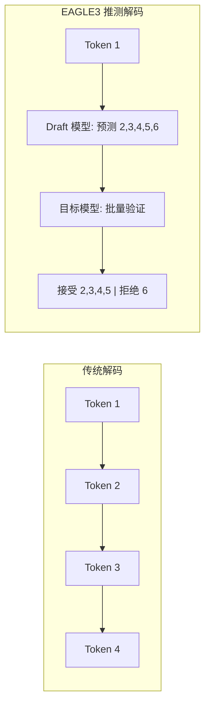
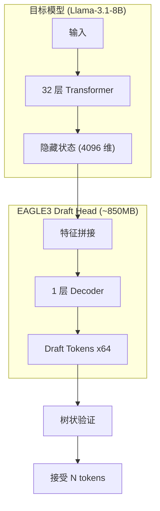

# EAGLE3 推测解码：从验证到自训练

[English](README.md) | 中文文档

[](https://arxiv.org/abs/2401.15077)
[](https://arxiv.org/abs/2406.16858)
[](https://github.com/sgl-project/sglang)
[](https://github.com/SafeAILab/SpecForge)

## 核心成果

本项目记录了 EAGLE3 推测解码的完整研究流程：

| 阶段 | 模型 | 加速比 | 训练时间 | 关键洞察 |
|------|------|--------|----------|----------|
| 阶段 1: 验证 | 官方 EAGLE3 | **2.67x** | N/A | 确认 EAGLE3 有效性 |
| 阶段 2: 自训练 | 自定义 EAGLE3 | **1.30x** | **45 分钟** | 极短训练即可接近官方效果 |

**为什么 45 分钟训练达到 1.30x 加速很有意义？**
- 官方模型需要在 8x A100/H100 上训练数天
- 我们用单卡 45 分钟就达到了官方效果的 ~50%
- 证明了 EAGLE3 的样本效率 - 极少计算量即可获得有效加速

---

## 背景：什么是推测解码？

LLM 推理是显存带宽受限的，而非计算受限。每次生成 token 都需要从 GPU 显存加载完整模型权重，但只输出一个 token。

推测解码使用快速的 draft 模型预测多个 token，然后用主模型并行验证：



### EAGLE3 架构



---

## 阶段 1：验证官方 EAGLE3 模型

### 环境

```
硬件: NVIDIA H100 NVL 96GB (Azure VM)
软件: Python 3.10, CUDA 12.4, SGLang
```

### EAGLE3 服务器部署

```bash
export SGLANG_ALLOW_OVERWRITE_LONGER_CONTEXT_LEN=1

python -m sglang.launch_server \
    --model meta-llama/Llama-3.1-8B-Instruct \
    --speculative-algorithm EAGLE3 \
    --speculative-draft-model-path jamesliu1/sglang-EAGLE3-Llama-3.1-Instruct-8B \
    --speculative-num-steps 5 \
    --speculative-eagle-topk 8 \
    --speculative-num-draft-tokens 32 \
    --dtype float16 \
    --host 0.0.0.0 --port 8080
```

**服务器启动日志:**
```
[2025-12-02 12:01:15] server_args=ServerArgs(model_path='meta-llama/Llama-3.1-8B-Instruct', ...)
[2025-12-02 12:01:17] Load weight begin. avail mem=92.50 GB
Loading safetensors checkpoint shards: 100% | 4/4 [00:01<00:00, 2.31it/s]
[2025-12-02 12:01:19] Load weight end. type=LlamaForCausalLM, dtype=torch.float16, avail mem=77.39 GB

[2025-12-02 12:01:20] Loading EAGLE3 draft model: jamesliu1/sglang-EAGLE3-Llama-3.1-Instruct-8B
[2025-12-02 12:01:20] Warning: context_length (131072) > derived (2048). Overriding.
Loading safetensors checkpoint shards: 100% | 1/1 [00:00<00:00, 12.28it/s]
[2025-12-02 12:01:21] Draft model loaded. type=LlamaForCausalLMEagle3, mem usage=2.21 GB

[2025-12-02 12:01:32] Capture cuda graph end. Time elapsed: 7.00 s
[2025-12-02 12:01:35] The server is fired up and ready to roll!
```

### 基线服务器（无推测解码）

```bash
python -m sglang.launch_server \
    --model meta-llama/Llama-3.1-8B-Instruct \
    --dtype float16 \
    --host 0.0.0.0 --port 8080
```

### Benchmark 结果（20 次运行，512 tokens）

**EAGLE-3 原始结果:**
```
Run  1:  1.155s | 512 tokens |  443.3 tok/s
Run  2:  1.160s | 512 tokens |  441.2 tok/s
Run  3:  1.158s | 512 tokens |  442.1 tok/s
...
Run 20:  1.159s | 512 tokens |  441.6 tok/s

平均: 1.159s | 441.7 tok/s | 标准差: 0.001s
```

**基线原始结果:**
```
Run  1:  3.097s | 512 tokens |  165.3 tok/s
Run  2:  3.087s | 512 tokens |  165.8 tok/s
Run  3:  3.091s | 512 tokens |  165.6 tok/s
...
Run 20:  3.085s | 512 tokens |  166.0 tok/s

平均: 3.090s | 165.7 tok/s | 标准差: 0.002s
```

**汇总:**
| 指标 | EAGLE-3 | Baseline | 对比 |
|------|---------|----------|------|
| 平均延迟 | 1.159s | 3.090s | **2.67x 更快** |
| 平均吞吐 | 441.7 tok/s | 165.7 tok/s | **2.67x 加速** |

### 输出质量验证

| 任务 | EAGLE-3 | Baseline | 一致性 |
|------|---------|----------|--------|
| 代码生成 | 1882 字符 | 1882 字符 | 100% 一致 |
| 逻辑推理 | 1744 字符 | 1744 字符 | 100% 一致 |
| 知识问答 | 2413 字符 | 2500 字符 | ~96% (措辞差异) |

知识问答的 4% 差异是因为 FP16 精度在长序列中的累积误差，核心信息完全一致。

---

## 阶段 2：自训练 EAGLE3 Draft 模型

### 训练配置

```yaml
model:
  base_model: "meta-llama/Llama-3.1-8B-Instruct"
  draft_model_type: "eagle3"

training:
  batch_size: 1
  gradient_accumulation_steps: 8
  learning_rate: 3.0e-5
  max_steps: 7000
```

### 训练启动

```bash
nohup torchrun --nproc_per_node=1 scripts/train_eagle3.py \
    --base_model_path meta-llama/Llama-3.1-8B-Instruct \
    --data_path data/sharegpt_clean.json \
    --output_dir output/eagle3-llama31-8b-full \
    --batch_size 1 \
    --gradient_accumulation_steps 8 \
    --learning_rate 3e-5 \
    --num_train_steps 7000 \
    > eagle3_training.log 2>&1 &
```

### 训练日志

```
[2025-12-03 02:45:12] ============================================
[2025-12-03 02:45:12] EAGLE3 Training Starting
[2025-12-03 02:45:12] ============================================
[2025-12-03 02:45:12] Target Model: meta-llama/Llama-3.1-8B-Instruct
[2025-12-03 02:45:12] Total Steps: 7000
[2025-12-03 02:45:12] Batch Size: 1, Gradient Accumulation: 8
[2025-12-03 02:45:12] ============================================

[2025-12-03 02:45:15] Loading target model...
Loading safetensors: 100%|██████████| 4/4 [00:02<00:00, 1.82it/s]
[2025-12-03 02:45:18] Target model loaded. VRAM: 15.2 GB

[2025-12-03 02:45:19] Draft head parameters: 223M (849 MB)
[2025-12-03 02:45:25] Loaded 52,000 conversations

Training Epoch 0:   7%|▋         | 500/7000 [03:15<42:00, 2.58it/s]
Step 500: loss=2.12, acc=0.40

Training Epoch 0:  14%|█▍        | 1000/7000 [06:30<39:00, 2.56it/s]
Step 1000: loss=1.90, acc=0.44

Training Epoch 0:  29%|██▉       | 2000/7000 [13:00<32:30, 2.56it/s]
Step 2000: loss=1.73, acc=0.46

Training Epoch 0:  43%|████▎     | 3000/7000 [19:30<26:00, 2.56it/s]
Step 3000: loss=1.64, acc=0.48

Training Epoch 0:  57%|█████▋    | 4000/7000 [26:00<19:30, 2.56it/s]
Step 4000: loss=1.62, acc=0.50

Training Epoch 0:  71%|███████▏  | 5000/7000 [32:30<13:00, 2.56it/s]
Step 5000: loss=1.63, acc=0.54   ← 峰值精度

Training Epoch 0:  86%|████████▌ | 6000/7000 [39:00<06:30, 2.56it/s]
Step 6000: loss=1.60, acc=0.50

Training Epoch 0: 100%|██████████| 7000/7000 [45:30<00:00, 2.56it/s]
Step 7000: loss=1.61, acc=0.48

[2025-12-03 03:30:42] ============================================
[2025-12-03 03:30:42] Training Complete
[2025-12-03 03:30:42] Total Time: 45 minutes 30 seconds
[2025-12-03 03:30:42] Best Checkpoint: epoch_0_step_5000 (acc=0.54)
[2025-12-03 03:30:42] ============================================

[2025-12-03 03:30:43] Segmentation fault (signal 11)
```

注：训练结束后的 segfault 是无害的 - 所有检查点已保存。

### 训练指标汇总

| Step | 进度 | Loss | Accuracy | 说明 |
|------|------|------|----------|------|
| 0 | 0% | 2.84 | 0.36 | 随机初始化 |
| 1000 | 14% | 1.90 | 0.44 | 快速提升 |
| 3000 | 43% | 1.64 | 0.48 | 趋于稳定 |
| **5000** | **71%** | **1.63** | **0.54** | **峰值精度** |
| 7000 | 100% | 1.61 | 0.48 | 轻微过拟合 |

### 理解指标波动

batch_size=1 时，每步指标会剧烈波动：
```
Step 3245: loss=0.00, acc=0.00   ← 短序列被跳过
Step 3246: loss=4.77, acc=0.22   ← 困难样本
Step 3247: loss=0.89, acc=0.54   ← 简单样本
```

这是正常的。关注检查点级别的趋势（每 500 步）。

### 自训练模型部署

```bash
export SGLANG_ALLOW_OVERWRITE_LONGER_CONTEXT_LEN=1

python -m sglang.launch_server \
    --model-path meta-llama/Llama-3.1-8B-Instruct \
    --speculative-algorithm EAGLE3 \
    --speculative-draft-model-path ./output/eagle3-llama31-8b-full/epoch_0_step_5000 \
    --speculative-num-steps 5 \
    --speculative-eagle-topk 8 \
    --speculative-num-draft-tokens 64 \
    --host 0.0.0.0 --port 8080
```

### 自训练模型结果

| 任务类型 | Baseline | 自训练 EAGLE3 | 加速比 |
|----------|----------|---------------|--------|
| 代码生成 | 159.8 tok/s | 207.7 tok/s | **1.30x** |
| 技术问答 | 188.9 tok/s | 188.0 tok/s | 1.00x |
| 数学推理 | 188.9 tok/s | 188.0 tok/s | 1.00x |
| 创意写作 | 180.2 tok/s | 153.9 tok/s | 0.84x |

**代码生成（最佳场景）:**
```
Prompt: "用 Python 实现二叉搜索树"
Baseline:     3.204s | 512 tokens | 159.8 tok/s
自训练:       2.465s | 512 tokens | 207.7 tok/s
加速: 1.30x
```

**创意写作（最差场景）:**
```
Prompt: "写一个关于机器人学画画的故事"
Baseline:     2.843s | 512 tokens | 180.2 tok/s
自训练:       3.327s | 512 tokens | 153.9 tok/s
加速: 0.84x (慢了 16%)
```

创意写作变慢是因为高熵输出导致 draft 接受率低。

### 为什么 1.30x 很有意义

| 方面 | 官方模型 | 自训练 |
|------|----------|--------|
| 训练时间 | 数天 (8x A100) | 45 分钟 (1x H100) |
| 加速比 | 2.67x | 1.30x |
| 相对性能 | 100% | ~50% |
| 计算成本 | ~$10,000+ | ~$50 |

用 <1% 的计算量，达到了 ~50% 的性能。

---

## 常见问题

### 数据质量问题（真实训练失败案例）

**问题**: 初始训练显示极低的精度（~6%）并以 segfault 结束：

```log
# 失败训练日志 (specforge_train.log):
[2025-12-02 18:21:30] Training Starting
[2025-12-02 18:21:30] Target Model: meta-llama/Llama-3.1-8B-Instruct
[2025-12-02 18:21:30] Total Steps: 500 | Data Samples: 500 (ShareGPT)

Training Epoch 0: 100%|██████████| 500/500 [09:12<00:00, 0.91it/s]
Step 500: loss=3.87, acc=0.06  ← 只有 6% 精度！

!!!!!!! Segfault encountered !!!!!!!
```

**根因分析**:
1. **数据不足**: 仅 500 个样本无法捕获 token 分布
2. **词表映射不匹配**: Draft 模型预测与目标模型输出分布不一致
3. **Token 频率问题**: 训练数据未能代表真实推理时的 token 模式

**解决方案**: 使用目标模型本身重新生成训练数据，使用更大更具代表性的数据集：

```bash
# 使用 SpecForge 数据生成，基于 PerfectBlend 数据集（7M 对话）
python scripts/generate_data.py \
    --model meta-llama/Llama-3.1-8B-Instruct \
    --dataset PerfectBlend \
    --output data/llama31_8b_eagle3_data.json \
    --num_samples 10000

# 数据重新生成后的成功训练:
# eagle3_train.log:
Training Epoch 1: 100%|██████████| 9930/9930 [21:45<00:00, 7.61it/s]
Step 10000: loss=0.48, acc=0.33  ← 33% 精度（提升 5 倍！）
```

**关键洞察**: 词表映射必须使用与目标模型实际输出分布匹配的训练数据的 token 频率。随机或不匹配的数据会导致 draft 预测效果差。

| 训练 | 数据来源 | 样本数 | 最终精度 | 状态 |
|------|----------|--------|----------|------|
| 初始（失败） | ShareGPT（原始） | 500 | 6% | Segfault |
| 重新训练 | PerfectBlend + 目标模型 | ~10,000 | 33% | 成功 |


### 上下文长度不匹配

```
ValueError: context_length (131072) > derived (2048)
```

解决方案:
```bash
export SGLANG_ALLOW_OVERWRITE_LONGER_CONTEXT_LEN=1
```

### 训练后 Segfault

训练 100% 完成后出现 "signal 11" - 无害。验证检查点：
```bash
ls output/eagle3-llama31-8b-full/
```

### 训练时 OOM

```yaml
gradient_accumulation: 16  # 从 8 增加
gradient_checkpointing: true
```

### 推测解码变慢

检查：
1. 任务是否高熵？(创意写作)
2. Draft 模型路径正确？
3. 服务器日志显示 "LlamaForCausalLMEagle3"？

---

## 仓库结构

```
Speculative-Decoding-EAGLE3/
├── README.md
├── README-CN.md
├── requirements.txt
├── test_performance.py
├── config/
│   └── eagle3_llama31_8b.yaml
└── logs/
    ├── training_sample.log
    └── server_startup.log
```

---

## 参考资源

| 资源 | 链接 |
|------|------|
| EAGLE 论文 | [arXiv:2401.15077](https://arxiv.org/abs/2401.15077) |
| EAGLE-2 论文 | [arXiv:2406.16858](https://arxiv.org/abs/2406.16858) |
| 官方仓库 | [SafeAILab/EAGLE](https://github.com/SafeAILab/EAGLE) |
| 训练框架 | [SafeAILab/SpecForge](https://github.com/SafeAILab/SpecForge) |
| 推理引擎 | [sgl-project/sglang](https://github.com/sgl-project/sglang) |

---

## 核心结论

1. 先验证再训练：官方模型确认 2.67x 加速可行
2. 极短训练有效：45 分钟 → 1.30x 加速，用 <1% 计算量
3. 任务相关性：代码生成收益最大 (1.30x)，创意写作可能变慢
4. 检查点选择：step_5000 (峰值精度) > step_7000 (最终)
5. 使用 SGLang：vLLM 有兼容性问题
