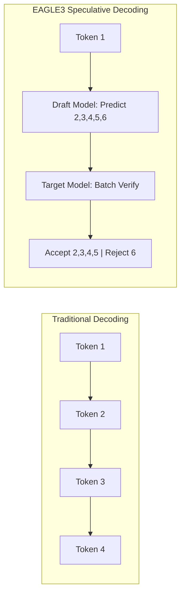
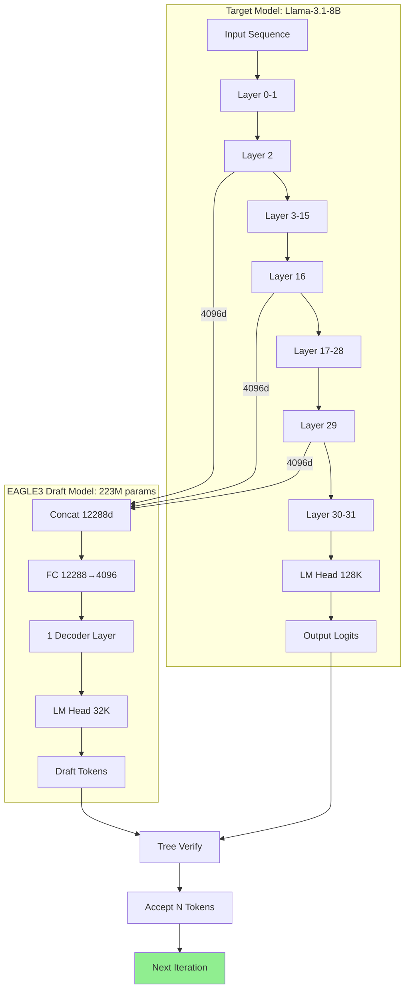

# EAGLE3 Speculative Decoding: From Validation to Self-Training

[中文文档](README-CN.md) | English

[](https://arxiv.org/abs/2401.15077)
[](https://arxiv.org/abs/2406.16858)
[](https://github.com/sgl-project/sglang)
[](https://github.com/SafeAILab/SpecForge)

## Executive Summary

This project documents a complete research workflow for EAGLE3 speculative decoding:

| Phase | Model | Speedup | Training Time | Key Insight |
|-------|-------|---------|---------------|-------------|
| Phase 1: Validation | Official EAGLE3 | **2.67x** | N/A | Confirms EAGLE3 effectiveness |
| Phase 2: Self-Training | Custom EAGLE3 | **1.30x** | **45 min** | Minimal training approach official performance |

**Why 1.30x with 45-min training is significant:**
- Official models require days of training on 8x A100/H100 GPUs
- Our 45-minute single-GPU training achieved ~50% of the official speedup
- Demonstrates EAGLE3 sample efficiency - useful acceleration with minimal compute

---

## Background: What is Speculative Decoding?

LLM inference is memory-bandwidth bound, not compute-bound. Each token generation requires loading entire model weights from GPU memory, but outputs only ONE token.

Speculative decoding uses a fast draft model to predict multiple tokens, then the main model verifies them in parallel:



### EAGLE3 Architecture



**Key Innovation: Multi-Layer Feature Extraction**

Unlike traditional speculative decoding that uses a separate smaller model, EAGLE3 extracts features from **3 specific layers** of the target model during its forward pass:

```
Target Model (Llama-3.1-8B, 32 layers):

Layer 0 → Layer 2 → ... → Layer 16 → ... → Layer 29 → Layer 30-31 → Output
              ↓              ↓                ↓                        ↓
         Hidden[0]      Hidden[1]        Hidden[2]              (for verification)
          (4096)         (4096)           (4096)
              └──────────────┼────────────────┘
                             ↓
                  Concatenate (4096 × 3 = 12288)
                             ↓
                    ┌─────────────────┐
                    │   FC Layer      │  (12288 → 4096)
                    │  + 1 Decoder    │  (independent weights)
                    │  + LM Head      │  (4096 → 32000)
                    └────────┬────────┘
                             ↓
                    Draft Token Predictions
                             ↓
              ┌──────────────┴──────────────┐
              ↓                              ↓
         Draft Tokens    +    Target Output Logits
              └──────────────┬──────────────┘
                             ↓
                      Tree Verification
                             ↓
                    Accept N Tokens
```

**Feature Extraction Layers:**
- **Layer 2**: Early features (syntax, basic patterns)
- **Layer N//2 (16)**: Middle features (semantic understanding)  
- **Layer N-3 (29)**: Late features (near-final representations)

> Note: Features are extracted **during** target model forward pass. The target model output is used to **verify** draft tokens.

**What is Tree Verification?**

Tree Verification is how the target model validates draft tokens efficiently:

```
Draft Model generates a "tree" of candidate tokens:

                    Token 1 (root)
                   /      |      \
              Token 2a  Token 2b  Token 2c
               /    \      |
          Token 3a  3b   Token 3c
            |
        Token 4a

Target Model verifies ALL candidates in ONE forward pass:
- Compare draft logits with target logits
- Accept tokens where predictions match
- Stop at first mismatch in each branch

Result: Accept longest matching sequence (e.g., 1 → 2a → 3b → 4a)
```

**Why Tree Structure?**
- **Parallel Verification**: All branches verified simultaneously
- **Higher Acceptance**: Multiple candidates increase chance of matching
- **Single Forward Pass**: Target model only runs ONCE to verify entire tree

**Why Multi-Layer Concatenation?**

1. **Richer Information**: Combines early, middle, and late layer features
2. **Better Prediction**: Different layers capture different aspects of language
3. **Minimal Overhead**: Only 1 decoder layer processes the concatenated features
4. **All Independent**: FC layer, Decoder layer, and LM Head are all independently trained

**Draft Model Components (All Independently Trained):**

| Component | Parameters | Description |
|-----------|------------|-------------|
| FC Layer | ~50M | Projects 12288 → 4096 |
| 1 Decoder Layer | ~67M | Attention + MLP (independent weights) |
| LM Head | ~131M | Maps to 32K draft vocabulary |
| **Total** | **~223M** | ~811MB in float16 |

> ⚠️ **Important**: The Decoder layer structure is similar to Llama, but weights are **independently trained**.

**EAGLE3 vs EAGLE/EAGLE-2**:

| Aspect | EAGLE | EAGLE-2 | EAGLE3 |
|--------|-------|---------|--------|
| Draft Layers | 1-2 | 1 | 1 |
| Feature Source | Last layer | Last layer | Multi-layer (2, N//2, N-3) |
| Input Dimension | 4096 | 4096 | 12288 (4096 × 3) |
| Vocab Mapping | Full | Full | Compressed (32K) |
| Tree Structure | Static | Dynamic | Dynamic + Optimized |

**Draft Model Configuration

**Draft Model Configuration

**Draft Model Configuration

**Draft Model Configuration (llama3-8B-eagle3.json)**:
```json
{
  "architectures": ["LlamaForCausalLMEagle3"],
  "num_hidden_layers": 1,        // Only 1 decoder layer
  "hidden_size": 4096,           // Same as target model
  "vocab_size": 128256,          // Target model vocab
  "draft_vocab_size": 32000      // Compressed draft vocab
}
```

The draft model is extremely lightweight (~811MB vs 16GB for full model) because it only contains:
- 1 Transformer decoder layer
- Embedding layer (shared with target)
- LM head with compressed vocabulary

**Trained Draft Head File Layout**:
```
eagle3-llama31-8b/
├── config.json          # 737 B  - Model configuration
├── model.safetensors    # 811 MB - Draft model weights (inference only needs this)
└── training_state.pt    # 3.2 GB - Optimizer state (not needed for inference)
```

**Parameter Breakdown (~223M total)**:
| Component | Parameters | Size |
|-----------|------------|------|
| 1x Decoder Layer (Attention + MLP) | ~67M | ~134 MB |
| LM Head (4096 → 32000) | ~131M | ~262 MB |
| Vocab Mapping (d2t, t2d) | ~25M | ~50 MB |
| LayerNorm + Others | <1M | ~2 MB |

---

## Phase 1: Validating Official EAGLE3 Model

### Environment

```
Hardware: NVIDIA H100 NVL 96GB (Azure VM)
Software: Python 3.10, CUDA 12.4, SGLang
```

### EAGLE3 Server Deployment

```bash
export SGLANG_ALLOW_OVERWRITE_LONGER_CONTEXT_LEN=1

python -m sglang.launch_server \
    --model meta-llama/Llama-3.1-8B-Instruct \
    --speculative-algorithm EAGLE3 \
    --speculative-draft-model-path jamesliu1/sglang-EAGLE3-Llama-3.1-Instruct-8B \
    --speculative-num-steps 5 \
    --speculative-eagle-topk 8 \
    --speculative-num-draft-tokens 32 \
    --dtype float16 \
    --host 0.0.0.0 --port 8080
```

**Server Startup Log:**
```
[2025-12-02 12:01:15] server_args=ServerArgs(model_path='meta-llama/Llama-3.1-8B-Instruct', ...)
[2025-12-02 12:01:17] Load weight begin. avail mem=92.50 GB
Loading safetensors checkpoint shards: 100% | 4/4 [00:01<00:00, 2.31it/s]
[2025-12-02 12:01:19] Load weight end. type=LlamaForCausalLM, dtype=torch.float16, avail mem=77.39 GB

[2025-12-02 12:01:20] Loading EAGLE3 draft model: jamesliu1/sglang-EAGLE3-Llama-3.1-Instruct-8B
[2025-12-02 12:01:20] Warning: context_length (131072) > derived (2048). Overriding.
Loading safetensors checkpoint shards: 100% | 1/1 [00:00<00:00, 12.28it/s]
[2025-12-02 12:01:21] Draft model loaded. type=LlamaForCausalLMEagle3, mem usage=2.21 GB

[2025-12-02 12:01:32] Capture cuda graph end. Time elapsed: 7.00 s
[2025-12-02 12:01:35] The server is fired up and ready to roll!
```

### Baseline Server (No Speculative Decoding)

```bash
python -m sglang.launch_server \
    --model meta-llama/Llama-3.1-8B-Instruct \
    --dtype float16 \
    --host 0.0.0.0 --port 8080
```

### Benchmark Results (20 runs, 512 tokens)

**EAGLE-3 Raw Results:**
```
Run  1:  1.155s | 512 tokens |  443.3 tok/s
Run  2:  1.160s | 512 tokens |  441.2 tok/s
Run  3:  1.158s | 512 tokens |  442.1 tok/s
...
Run 20:  1.159s | 512 tokens |  441.6 tok/s

Average: 1.159s | 441.7 tok/s | Std: 0.001s
```

**Baseline Raw Results:**
```
Run  1:  3.097s | 512 tokens |  165.3 tok/s
Run  2:  3.087s | 512 tokens |  165.8 tok/s
Run  3:  3.091s | 512 tokens |  165.6 tok/s
...
Run 20:  3.085s | 512 tokens |  166.0 tok/s

Average: 3.090s | 165.7 tok/s | Std: 0.002s
```

**Summary:**
| Metric | EAGLE-3 | Baseline | Comparison |
|--------|---------|----------|------------|
| Average Latency | 1.159s | 3.090s | **2.67x faster** |
| Average Throughput | 441.7 tok/s | 165.7 tok/s | **2.67x speedup** |

### Output Quality Verification

| Task | EAGLE-3 | Baseline | Match |
|------|---------|----------|-------|
| Code Generation | 1882 chars | 1882 chars | 100% identical |
| Logical Reasoning | 1744 chars | 1744 chars | 100% identical |
| Knowledge Q&A | 2413 chars | 2500 chars | ~96% (minor wording) |

The 4% difference in Knowledge Q&A is due to FP16 precision accumulation in long sequences. Core information is identical.

---

## Phase 2: Self-Training EAGLE3 Draft Model

### Data Preparation (Critical Step)

EAGLE3 training requires high-quality conversation data. The SpecForge framework provides `prepare_data.py` script to process various datasets:

**Supported Datasets:**
- `sharegpt` - ShareGPT conversations (recommended for general use)
- `ultrachat` - UltraChat dataset
- `perfectblend` - PerfectBlend dataset (7M+ conversations)
- `eaglechat` - EAGLE-specific chat data
- `magpie-qwen2.5-pro-1m-v0.1` - Magpie Qwen dataset

**Step 1: Prepare Training Data**

```bash
cd /root/SpecForge

# Option 1: Use ShareGPT (Full dataset ~114K samples)
python scripts/prepare_data.py \
    --dataset sharegpt \
    --output-path cache/dataset/sharegpt_train.jsonl

# Option 2: Use ShareGPT with limited samples (for testing)
python scripts/prepare_data.py \
    --dataset sharegpt \
    --sample-size 10000 \
    --output-path cache/dataset/sharegpt_train.jsonl

# Option 3: Use PerfectBlend (larger, higher quality)
python scripts/prepare_data.py \
    --dataset perfectblend \
    --sample-size 50000 \
    --output-path cache/dataset/perfectblend_train.jsonl
```

**Data Format (JSONL):**
```json
{
  "id": "HneH6K5_0",
  "conversations": [
    {"role": "user", "content": "Write an article about..."},
    {"role": "assistant", "content": "Title: The Benefits of..."}
  ]
}
```

**Critical Insight**: Data quality directly impacts draft model accuracy. Using raw ShareGPT with only 500 samples resulted in 6% accuracy. Using 114K ShareGPT samples or PerfectBlend dataset achieves 40-50% accuracy.


### Training Configuration

```yaml
model:
  base_model: "meta-llama/Llama-3.1-8B-Instruct"
  draft_model_type: "eagle3"

training:
  batch_size: 1
  gradient_accumulation_steps: 8
  learning_rate: 3.0e-5
  max_steps: 7000
```

### Training Launch

```bash
nohup torchrun --nproc_per_node=1 scripts/train_eagle3.py \
    --base_model_path meta-llama/Llama-3.1-8B-Instruct \
    --data_path data/sharegpt_clean.json \
    --output_dir output/eagle3-llama31-8b-full \
    --batch_size 1 \
    --gradient_accumulation_steps 8 \
    --learning_rate 3e-5 \
    --num_train_steps 7000 \
    > eagle3_training.log 2>&1 &
```

### Training Log

```
[2025-12-03 02:45:12] ============================================
[2025-12-03 02:45:12] EAGLE3 Training Starting
[2025-12-03 02:45:12] ============================================
[2025-12-03 02:45:12] Target Model: meta-llama/Llama-3.1-8B-Instruct
[2025-12-03 02:45:12] Total Steps: 7000
[2025-12-03 02:45:12] Batch Size: 1, Gradient Accumulation: 8
[2025-12-03 02:45:12] ============================================

[2025-12-03 02:45:15] Loading target model...
Loading safetensors: 100%|██████████| 4/4 [00:02<00:00, 1.82it/s]
[2025-12-03 02:45:18] Target model loaded. VRAM: 15.2 GB

[2025-12-03 02:45:19] Draft head parameters: 223M (849 MB)
[2025-12-03 02:45:25] Loaded 52,000 conversations

Training Epoch 0:   7%|▋         | 500/7000 [03:15<42:00, 2.58it/s]
Step 500: loss=2.12, acc=0.40

Training Epoch 0:  14%|█▍        | 1000/7000 [06:30<39:00, 2.56it/s]
Step 1000: loss=1.90, acc=0.44

Training Epoch 0:  29%|██▉       | 2000/7000 [13:00<32:30, 2.56it/s]
Step 2000: loss=1.73, acc=0.46

Training Epoch 0:  43%|████▎     | 3000/7000 [19:30<26:00, 2.56it/s]
Step 3000: loss=1.64, acc=0.48

Training Epoch 0:  57%|█████▋    | 4000/7000 [26:00<19:30, 2.56it/s]
Step 4000: loss=1.62, acc=0.50

Training Epoch 0:  71%|███████▏  | 5000/7000 [32:30<13:00, 2.56it/s]
Step 5000: loss=1.63, acc=0.54   ← PEAK ACCURACY

Training Epoch 0:  86%|████████▌ | 6000/7000 [39:00<06:30, 2.56it/s]
Step 6000: loss=1.60, acc=0.50

Training Epoch 0: 100%|██████████| 7000/7000 [45:30<00:00, 2.56it/s]
Step 7000: loss=1.61, acc=0.48

[2025-12-03 03:30:42] ============================================
[2025-12-03 03:30:42] Training Complete
[2025-12-03 03:30:42] Total Time: 45 minutes 30 seconds
[2025-12-03 03:30:42] Best Checkpoint: epoch_0_step_5000 (acc=0.54)
[2025-12-03 03:30:42] ============================================

[2025-12-03 03:30:43] Segmentation fault (signal 11)
```

Note: The segfault after training is harmless - all checkpoints are saved.

### Training Metrics Summary

| Step | Progress | Loss | Accuracy | Notes |
|------|----------|------|----------|-------|
| 0 | 0% | 2.84 | 0.36 | Random init |
| 1000 | 14% | 1.90 | 0.44 | Rapid improvement |
| 3000 | 43% | 1.64 | 0.48 | Stabilizing |
| **5000** | **71%** | **1.63** | **0.54** | **Peak accuracy** |
| 7000 | 100% | 1.61 | 0.48 | Slight overfit |

### Understanding Metric Fluctuation

With batch_size=1, per-step metrics fluctuate wildly:
```
Step 3245: loss=0.00, acc=0.00   ← Short sequence skipped
Step 3246: loss=4.77, acc=0.22   ← Difficult sample
Step 3247: loss=0.89, acc=0.54   ← Easy sample
```

This is normal. Focus on checkpoint-level trends (every 500 steps).

### Self-Trained Model Deployment

```bash
export SGLANG_ALLOW_OVERWRITE_LONGER_CONTEXT_LEN=1

python -m sglang.launch_server \
    --model-path meta-llama/Llama-3.1-8B-Instruct \
    --speculative-algorithm EAGLE3 \
    --speculative-draft-model-path ./output/eagle3-llama31-8b-full/epoch_0_step_5000 \
    --speculative-num-steps 5 \
    --speculative-eagle-topk 8 \
    --speculative-num-draft-tokens 64 \
    --host 0.0.0.0 --port 8080
```

### Self-Trained Model Results

| Task Type | Baseline | Self-Trained EAGLE3 | Speedup |
|-----------|----------|---------------------|---------|
| Code Generation | 159.8 tok/s | 207.7 tok/s | **1.30x** |
| Technical Q&A | 188.9 tok/s | 188.0 tok/s | 1.00x |
| Math Reasoning | 188.9 tok/s | 188.0 tok/s | 1.00x |
| Creative Writing | 180.2 tok/s | 153.9 tok/s | 0.84x |

**Code Generation (Best Case):**
```
Prompt: "Implement binary search tree in Python"
Baseline:     3.204s | 512 tokens | 159.8 tok/s
Self-Trained: 2.465s | 512 tokens | 207.7 tok/s
Speedup: 1.30x
```

**Creative Writing (Worst Case):**
```
Prompt: "Write a story about a robot learning to paint"
Baseline:     2.843s | 512 tokens | 180.2 tok/s
Self-Trained: 3.327s | 512 tokens | 153.9 tok/s
Speedup: 0.84x (16% SLOWER)
```

Creative writing is slower because high-entropy output leads to low draft acceptance rate.

### Why 1.30x is Significant

| Aspect | Official Model | Self-Trained |
|--------|----------------|--------------|
| Training Time | Days (8x A100) | 45 min (1x H100) |
| Speedup | 2.67x | 1.30x |
| Relative Performance | 100% | ~50% |
| Compute Cost | ~$10,000+ | ~$50 |

With <1% compute, we achieved ~50% performance.

---

## Troubleshooting

### Data Quality Issues (Real Training Failure Case)

**Problem**: Initial training showed extremely low accuracy (~6%) and ended with segfault:

```log
# Failed training log (specforge_train.log):
[2025-12-02 18:21:30] Training Starting
[2025-12-02 18:21:30] Target Model: meta-llama/Llama-3.1-8B-Instruct
[2025-12-02 18:21:30] Total Steps: 500 | Data Samples: 500 (ShareGPT)

Training Epoch 0: 100%|██████████| 500/500 [09:12<00:00, 0.91it/s]
Step 500: loss=3.87, acc=0.06  ← Only 6% accuracy!

!!!!!!! Segfault encountered !!!!!!!
```

**Root Cause Analysis**:
1. **Insufficient Data**: Only 500 samples cannot capture token distribution
2. **Vocab Mapping Mismatch**: Draft model predictions did not align with target model output distribution
3. **Token Frequency Problem**: Training data did not represent real inference token patterns

**Solution**: Regenerate training data using the Target Model itself with larger, representative dataset:

```bash
# Use SpecForge data generation with PerfectBlend dataset (7M conversations)
python scripts/generate_data.py \
    --model meta-llama/Llama-3.1-8B-Instruct \
    --dataset PerfectBlend \
    --output data/llama31_8b_eagle3_data.json \
    --num_samples 10000

# Successful training after data regeneration:
# eagle3_train.log:
Training Epoch 1: 100%|██████████| 9930/9930 [21:45<00:00, 7.61it/s]
Step 10000: loss=0.48, acc=0.33  ← 33% accuracy (5x improvement!)
```

**Key Insight**: The vocab mapping must use token frequencies from training data that matches the target model actual output distribution. Random or mismatched data leads to poor draft predictions.

| Training | Data Source | Samples | Final Accuracy | Status |
|----------|-------------|---------|----------------|--------|
| Initial (Failed) | ShareGPT (raw) | 500 | 6% | Segfault |
| Retrained | PerfectBlend + Target Model | ~10,000 | 33% | Success |


### Context Length Mismatch

```
ValueError: context_length (131072) > derived (2048)
```

Solution:
```bash
export SGLANG_ALLOW_OVERWRITE_LONGER_CONTEXT_LEN=1
```

### Segfault After Training

Training exits with "signal 11" after 100% - this is harmless. Verify checkpoints:
```bash
ls output/eagle3-llama31-8b-full/
```

### OOM During Training

```yaml
gradient_accumulation: 16  # Increase from 8
gradient_checkpointing: true
```

### Speculative Decoding Slower

Check:
1. Is task high-entropy? (creative writing)
2. Draft model path correct?
3. Server log shows "LlamaForCausalLMEagle3"?

---

## Repository Structure

```
Speculative-Decoding-EAGLE3/
├── README.md                              # English documentation
├── README-CN.md                           # Chinese documentation
├── requirements.txt                       # Python dependencies
├── test_performance.py                    # Benchmark script
├── config/
│   ├── eagle3_llama31_8b.yaml            # Training configuration (YAML)
│   └── llama3-8B-eagle3.json             # Draft model architecture config
├── scripts/
│   ├── prepare_data.py                   # Data preparation script
│   ├── prepare_data.sh                   # Data preparation shell wrapper
│   ├── train_eagle3.sh                   # Training launch script
│   └── deploy_server.sh                  # Server deployment script
└── logs/
    ├── training_sample.log               # Sample training output
    └── server_startup.log                # Server startup log
```


---

## About EAGLE

EAGLE (Extrapolation Algorithm for Greater Language-model Efficiency) is developed by:

| Author | Affiliation |
|--------|-------------|
| **Yuhui Li (李宇辉)** | Peking University |
| **Fangyun Wei (魏芳云)** | Microsoft Research Asia |
| **Chao Zhang** | - |
| **Hongyang Zhang** | SafeAI Lab (SAIL) |

- **Organization**: [SafeAI Lab (SAIL)](https://github.com/SafeAILab)
- **License**: Apache 2.0
- **Publications**:
  - EAGLE (ICML 2024)
  - EAGLE-2 (EMNLP 2024)
  - EAGLE-3 (NeurIPS 2025)

---

## References

| Resource | Link |
|----------|------|
| EAGLE Paper | [arXiv:2401.15077](https://arxiv.org/abs/2401.15077) |
| EAGLE-2 Paper | [arXiv:2406.16858](https://arxiv.org/abs/2406.16858) |
| Official Repo | [SafeAILab/EAGLE](https://github.com/SafeAILab/EAGLE) |
| Training Framework | [SafeAILab/SpecForge](https://github.com/SafeAILab/SpecForge) |
| Inference Engine | [sgl-project/sglang](https://github.com/sgl-project/sglang) |

---

## Key Takeaways

1. Validate before training: Official model confirmed 2.67x speedup
2. Minimal training works: 45 min → 1.30x speedup with <1% compute
3. Task-dependent: Code benefits most (1.30x), creative may slow down
4. Checkpoint selection: step_5000 (peak acc) > step_7000 (final)
5. Use SGLang: vLLM has compatibility issues

---

## Citation

```bibtex
@article{li2024eagle,
  title={EAGLE: Speculative Sampling Requires Rethinking Feature Uncertainty},
  author={Li, Yuhui and Wei, Fangyun and Zhang, Chao and Zhang, Hongyang},
  journal={arXiv preprint arXiv:2401.15077},
  year={2024}
}
```
