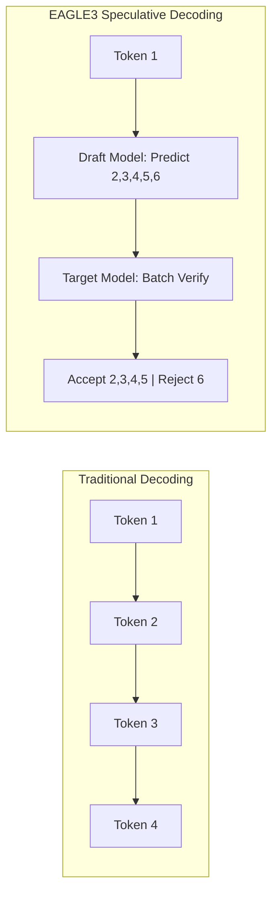
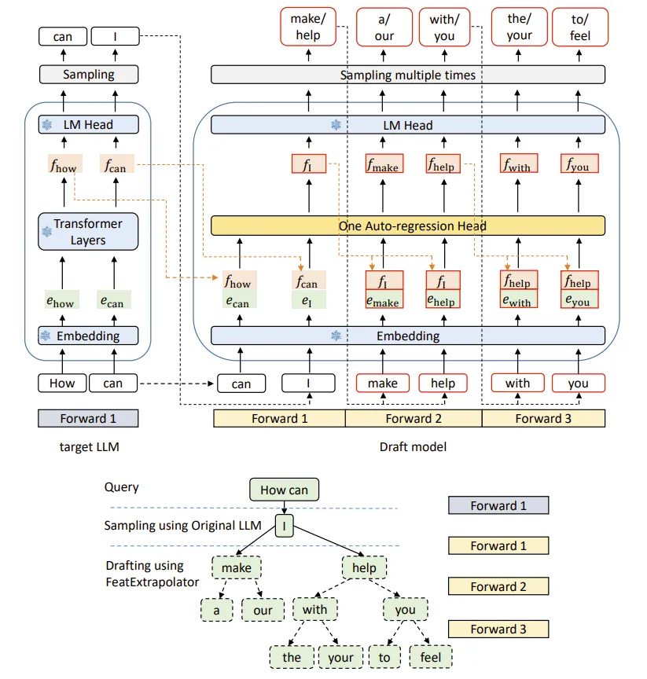
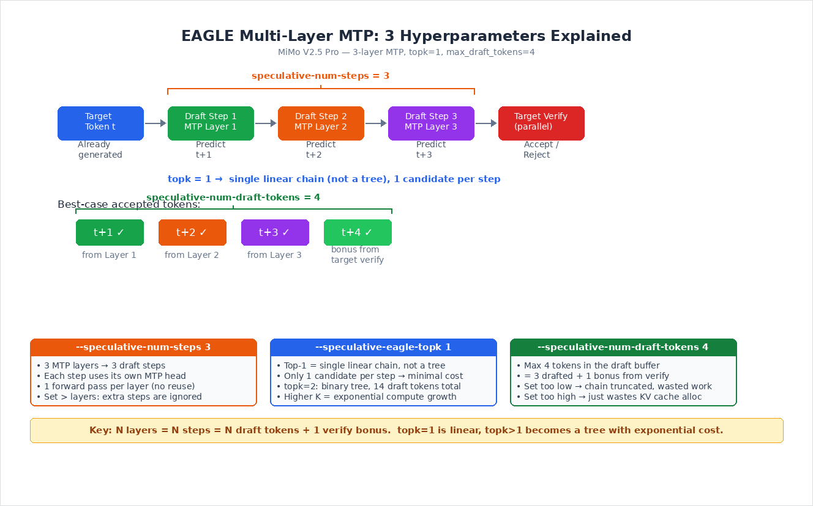
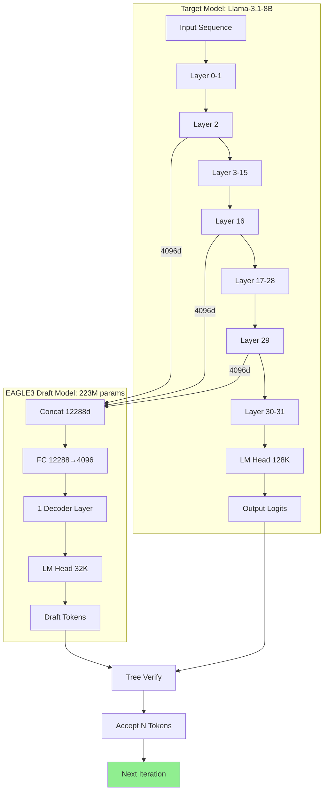

# Speculative Decoding on Azure: EAGLE3, Self-Training, and Native MTP

> **Author**: Xinyu Wei (魏新宇) — Microsoft AI GBB Senior System Engineer

[中文文档](README-CN.md) | English

[](https://arxiv.org/abs/2401.15077)
[](https://arxiv.org/abs/2406.16858)
[](https://github.com/sgl-project/sglang)
[](https://github.com/vllm-project/vllm)
[](https://github.com/SafeAILab/SpecForge)
[](https://huggingface.co/google/gemma-4-31B-it)

Engineering guide to speculative decoding: validate an official EAGLE3 draft model, self-train a draft head on a single GPU in 45 minutes, and benchmark Google's native Gemma 4 MTP assistant — all on Azure H100.


## Running on Azure

All experiments in this project were conducted on an **Azure GPU VM**.

| Item | Details |
|---|---|
| **Azure VM** | [NC40ads_H100_v5](https://learn.microsoft.com/en-us/azure/virtual-machines/nc-h100-v5-series) |
| **GPU** | NVIDIA H100 80GB |
| **Frameworks** | vLLM, SGLang |


## Executive Summary

This project documents a complete research workflow for speculative decoding, from EAGLE3 validation and self-training to a new Gemma 4 native MTP assistant benchmark:

| Phase | Model | Measured Result | Test Conditions | Key Insight |
|-------|-------|-----------------|-----------------|-------------|
| Phase 1: Validation | Official EAGLE3 for Llama-3.1-8B | **441.7 vs 165.7 tok/s = 2.67x** | SGLang, H100, 20 runs, 512 tokens | Feature-based EAGLE3 can deliver large low-concurrency latency wins |
| Phase 2: Self-Training | Custom EAGLE3 draft head | **207.7 vs 159.8 tok/s = 1.30x** on code | Single H100, 45 min training | Minimal training can produce useful but workload-dependent acceleration |
| Phase 3: Native MTP | Gemma 4 31B + Gemma 4 assistant | **80.2 vs 46.3 tok/s = 1.73x** | vLLM, H100, 3 prompt groups, 5 measured runs each | A model-family assistant drafter can provide stable acceleration without self-training |

The newest result is Phase 3. Google describes the Gemma 4 assistant checkpoints as "Multi-Token Prediction (MTP) drafters" that extend the base model with "a smaller, faster draft model"; in speculative decoding, the draft model predicts ahead and the target verifies in parallel, with speedups "up to 3x" while preserving standard-generation quality. Source: [Gemma 4 31B assistant model card](https://huggingface.co/google/gemma-4-31B-it-assistant), checked 2026-05-16.

**Why 1.30x with 45-min training is significant:**
- Official models require days of training on 8x A100/H100 GPUs
- Our 45-minute single-GPU training achieved ~50% of the official speedup
- Demonstrates EAGLE3 sample efficiency - useful acceleration with minimal compute
- The Gemma 4 MTP result adds a different path: use a vendor-published assistant drafter instead of training a draft head yourself

---

## Background: What is Speculative Decoding?

LLM inference is memory-bandwidth bound, not compute-bound. Each token generation requires loading entire model weights from GPU memory, but outputs only ONE token.

Speculative decoding uses a fast draft model to predict multiple tokens, then the main model verifies them in parallel:



### EAGLE3 Architecture




*Figure 1: EAGLE3 Draft Model Architecture and Tree-based Speculative Decoding (Source: [Benjamin Marie](https://kaitchup.substack.com/p/eagle-3-speculators-when-to-use-them))*

**Understanding the Architecture (Step by Step):**

**Left Side - Target LLM (Standard Decoding):**

For the query "How can", the target model performs standard autoregressive decoding:
1. Input tokens "How", "can" → **Embedding** layer → e_how, e_can
2. **Transformer Layers** process embeddings → hidden features f_how, f_can  
3. **LM Head** predicts next token → outputs "can", "I"
4. Each token requires **one full forward pass** through all layers

**Right Side - EAGLE-3 Draft Model (Speculative Decoding):**

The draft model is much lighter and faster:
1. **Forward 1**: Takes f_how, e_can from target model + embedding e_I
   - Passes through "**One Auto-regression Head**" (single decoder layer)
   - **LM Head** outputs f_I → predicts candidates "make/help"

2. **Forward 2**: For each candidate ("make", "help"):
   - Input: previous features + new embeddings (e_make, e_help)
   - Output: f_make, f_help → predicts "a/our", "with/you"

3. **Forward 3**: Continue expanding:
   - From "with" → predicts "the/your"  
   - From "you" → predicts "to/feel"

**Key Notation in the Figure:**
- `e_xxx`: Embedding of token "xxx"
- `f_xxx`: Hidden feature/representation of token "xxx"
- Orange boxes: Features from target model (f_how, f_can)
- Red boxes: Draft model predictions (f_make, f_help, etc.)

**Bottom - Tree Structure (Verification):**

The draft tokens form a tree for batch verification:
```
Query: "How can"
         ↓
    "I" (from target LLM, Forward 1)
```

The target model verifies **ALL branches in ONE forward pass**, accepting the longest matching sequence (e.g., "I" → "help" → "you" → "feel").

**Role Division - "Draft Guesses, Target Judges":**

| Role | Model | Task | Cost |
|------|-------|------|------|
| **Predictor (Draft)** | EAGLE-3 Draft Model (223M) | Quickly generate candidate tokens | Low |
| **Verifier (Verify)** | Target LLM (8B) | Judge which candidates are correct | High |

**Concrete Example:**
```
1. Target LLM generates first token "I" (required for initial features)

2. Draft Model rapidly predicts (3 cheap forward passes):
   "I" → make, help
   "make" → a, our  
   "help" → with, you
   (Each pass only through 223M params)

3. Target LLM verifies (1 expensive forward pass):
   Batch-verify ALL candidate branches in parallel
   Judge: which draft tokens match what I would generate?
   
4. Accept matching sequence:
   e.g., "I" → "help" → "you" → "feel" all correct
   Accept 4 tokens at once!
```

**Why This Works - Cost Analysis:**

*Without EAGLE-3:*
- Generate 4 tokens = 4 × Target LLM forward pass
- Cost: 4 × 8B = **32B parameter computations**

*With EAGLE-3:*
- Draft prediction: 3 × 223M = 669M params
- Target verification: 1 × 8B = 8B params  
- Total: **~8.7B** (3.7x cheaper than 32B)

**Key Insight**: Target LLM verification is **parallel** - no matter how many candidates draft generates, verification only needs ONE forward pass (leveraging batch parallelism). Draft guesses, Target judges - correct guesses are "free", wrong guesses only waste cheap draft computation.

---

### Why Verification is Cheaper than Generation

A common question: "If verification still requires the Target model, why not just generate directly?"

The answer lies in **sequential vs parallel** computation:

**Generation (Sequential):**
- Each token depends on all previous tokens
- Must wait for token 1 → generate token 2 → generate token 3...
- **N tokens = N forward passes** (each pass is full model computation)
- GPU utilization: Low (waiting between passes)

**Verification (Parallel):**
- Given N candidate tokens, check all at once
- Transformer's self-attention naturally supports this: input `[x₁, x₂, ..., xₙ]`, output `[y₁, y₂, ..., yₙ]` in ONE pass
- **N tokens = 1 forward pass** (batch parallelism)
- GPU utilization: High (parallel processing is GPU's strength)

**Analogy:**
- Generation = Taking an exam: answer Q1, then Q2, then Q3... (sequential, each depends on previous)
- Verification = Teacher grading: check all answers simultaneously (parallel, independent judgments)

**Concrete Numbers:**
| Operation | 4 Tokens | 8 Tokens | 16 Tokens |
|-----------|----------|----------|-----------|
| Generation | 4 forward passes | 8 forward passes | 16 forward passes |
| Verification | 1 forward pass | 1 forward pass | 1 forward pass |

EAGLE-3's "draft + verify" approach is effective because verification of multiple tokens can be done in a single parallel forward pass, while generation requires sequential passes.

---

## Speculative Decoding Taxonomy: EAGLE3 vs Native MTP vs DFlash

All speculative decoding systems share the same outer loop: a cheap drafter proposes future tokens, then the target model verifies those tokens in parallel. The important engineering question is where the drafter comes from.

| Family | What the drafter is | When it is created | How it is loaded at serving time | Measured Extra VRAM | Typical Strength | Main Risk |
|--------|---------------------|--------------------|----------------------------------|--------------------|------------------|-----------|
| **EAGLE3** | A trained draft head/model that reads target-model hidden features from multiple layers | Trained after the target model is fixed, either by the vendor or by you | Loaded as an extra draft model/head beside the target model | +2.21 GiB draft model in the Phase 1 SGLang log | High speedup when the official draft model is available; self-training is possible | Training quality and task distribution matter; bad draft data can slow some workloads |
| **Gemma 4 MTP** | A Google-published MTP assistant checkpoint (~0.5B params, 4-layer drafter); it uses target model activations and shared KV-cache to improve draft quality (source: [Google MTP docs](https://ai.google.dev/gemma/docs/mtp/mtp)) | Produced by Google as an official assistant checkpoint; this repo does not train it | Loaded as an additional assistant/drafter model; shares target embedding weights and maps to target layers (vLLM log: draft layers mapped to target layers 58/59) | +0.87 GiB assistant weights; KV cache budget -4.86 GiB in this vLLM run | No local draft training required; stable 1.73x in this H100 test | Serving stack must support the assistant architecture; this run required a vLLM config shim |
| **DFlash** | A target-conditioned block diffusion drafter checkpoint that fuses target context features and drafts a token block in one parallel forward pass (source: [DFlash project](https://z-lab.ai/projects/dflash/) and [arXiv:2602.06036](https://arxiv.org/abs/2602.06036)) | Trained separately for a target model family/checkpoint; public draft checkpoints are published under `z-lab/*-DFlash` | Loaded as a DFlash draft model in a DFlash-aware serving stack such as SGLang or vLLM builds with DFlash support | Not measured in this repo | Makes the draft stage itself block-parallel instead of autoregressive; useful when an official DFlash checkpoint and engine support exist | More memory and engine-version sensitivity; block size, context length, and workload distribution must be benchmarked |
| **DeepSeek-style MTP** | MTP heads/modules inside the model family, not measured here as a separate external assistant | Release-specific; generally trained with the model-family MTP design | Exposed by that model's own inference stack rather than by Gemma-style assistant loading | Not measured in this repo | Can make MTP part of the training/inference design instead of an external add-on | Implementation details are release-specific; do not assume EAGLE flags or Gemma assistant loading will work |
| **MiMo-V2.5-style MTP** | Model-family draft path aimed at reasoning-heavy workloads | Release-specific; treated as part of the model-family design | Depends on that release's serving stack | Not measured in this repo | Potentially better acceptance on the model's own reasoning distribution | Needs workload-specific measurement; high-entropy tasks can still erase the benefit |

The word "drafter" does not always mean "a full standalone LLM loaded next to the target." The weight form is different across families:

| Family | Does the drafter have its own weights? | Is it a full target-model replacement? | Best wording |
|--------|--------------------------------------|-------------------------------------|--------------|
| **EAGLE3** | Yes, but they are separate draft-model/head weights, not a copy of the full target model | No | Separate draft-model weights, not full target-model weights |
| **Gemma 4 MTP** | Yes. Google publishes a separate assistant drafter checkpoint | No | Separate assistant drafter checkpoint |
| **DFlash** | Yes. Z-Lab publishes separate DFlash draft checkpoints for specific targets | No | Target-conditioned block diffusion draft checkpoint |
| **DeepSeek-style MTP** | Usually represented as native MTP heads/modules inside the model-family checkpoint, release-specific | No | Native MTP module weights inside the model family |
| **MiMo-V2.5-style MTP** | Release-specific; treat it as a model-family draft path unless an official separate assistant checkpoint is published | No | Model-family MTP/draft-path weights, release-specific |

The diagram below shows where the drafter lives in each route. For DeepSeek-style and MiMo-V2.5-style MTP, the drawing is intentionally conceptual because this repo did not inspect or benchmark those release-specific implementations. DFlash is also target-conditioned, but its distinguishing feature is that the draft generator is a block diffusion model rather than an autoregressive draft head.

```mermaid
flowchart LR
  subgraph E3["EAGLE3<br/>separate draft head"]
    E3T["Target model<br/>full weights"]
    E3H["Hidden states<br/>selected layers"]
    E3D["Draft head or model<br/>separate weights<br/>not full target"]
    E3V["Target verifies<br/>draft tokens"]
    E3T --> E3H
    E3H --> E3D
    E3D --> E3V
    E3T --> E3V
  end

  subgraph G4["Gemma 4 MTP<br/>official assistant checkpoint"]
    G4T["Target model<br/>google/gemma-4-31B-it"]
    G4A["Target activations<br/>and KV-cache"]
    G4D["Assistant drafter 0.5B<br/>google/gemma-4-31B-it-assistant<br/>uses target activations"]
    G4V["Target verifies<br/>assistant draft"]
    G4T --> G4A
    G4A --> G4D
    G4D --> G4V
    G4T --> G4V
  end

  subgraph DF["DFlash<br/>block diffusion drafter"]
    DFT["Target model<br/>for example Qwen3.x or Gemma 4"]
    DFF["Target context features<br/>fused from selected layers"]
    DFD["DFlash drafter<br/>separate checkpoint<br/>block diffusion"]
    DFV["Target verifies<br/>draft block"]
    DFT --> DFF
    DFF --> DFD
    DFD --> DFV
    DFT --> DFV
  end

  subgraph DS["DeepSeek-style MTP<br/>native modules"]
    DST["Model-family checkpoint<br/>target plus MTP modules"]
    DSH["MTP heads or modules<br/>inside model family"]
    DSV["Inference stack<br/>draft and verify"]
    DST --> DSH
    DSH --> DSV
    DST --> DSV
  end

  subgraph MM["MiMo-V2.5-style MTP<br/>model-family draft path"]
    MMT["Model-family checkpoint"]
    MMD["Draft path or MTP modules<br/>release-specific"]
    MMV["Serving stack<br/>draft and verify"]
    MMT --> MMD
    MMD --> MMV
    MMT --> MMV
  end

  classDef target fill:#eef6ff,stroke:#1f6feb,color:#0b1f3a
  classDef drafter fill:#fff7e6,stroke:#d97706,color:#3b2500
  classDef verify fill:#ecfdf5,stroke:#059669,color:#042f2e
  class E3T,G4T,DFT,DST,MMT target
  class E3D,G4D,DFD,DSH,MMD drafter
  class E3V,G4V,DFV,DSV,MMV verify
```



### Deep Comparison: How Each Drafter Actually Works

| Dimension | Classic Speculative Decoding | EAGLE3 | Gemma 4 MTP | DFlash | DeepSeek / MiMo MTP |
|-----------|------------------------------|--------|-------------|--------|---------------------|
| What the drafter reads from target | Nothing; a separate small LM runs independently | Hidden states from 3 mid-layers (layers 2, 16, 29 in Llama 8B) | Target activations from the last few layers + shared KV-cache (layers 58/59 in Gemma 31B) | Fused target context features injected into the draft layers' KV cache | MTP heads branch directly from the model forward path |
| Drafter size | A full small LM (e.g. 68M Llama-68M) | ~223M params, 1 decoder layer | ~0.5B params, 4 decoder layers | Lightweight block diffusion checkpoint; target-specific size, not measured here | Native MTP modules inside the model checkpoint |
| Drafting pattern | Autoregressive draft LM | Autoregressive draft head/model | Autoregressive assistant drafter | Block diffusion; drafts a token block in one parallel forward pass | Native future-token prediction path inside the model family |
| Can you train it yourself | Use any off-the-shelf small LM; no special training | Yes (SpecForge, 45 min on a single GPU) | No, only Google publishes it | Requires a target-specific DFlash training recipe/checkpoint; this repo did not train one | No, the model vendor builds it during pre-training |
| What happens after fine-tuning the target | Drafter is independent, so it still works but acceptance rate may drop because output distributions diverge | Re-train the draft head to match the new distribution | Can only hope the original assistant still works; cannot re-train it (speculation, not measured in this repo) | Re-validate or retrain the DFlash checkpoint; target-feature distribution changes can hurt acceptance | MTP modules are part of the model, so fine-tuning changes both together |
| Switch to a different target model | Just swap the small LM; no dependency on target internals | Re-train a new draft head | Cannot; the assistant only pairs with its own Gemma family | Cannot assume reuse; use a DFlash checkpoint trained for that target | Not applicable; the MTP modules are inseparable from the model |
| Serving stack | Any framework that supports assisted generation | SGLang native EAGLE3 support, one flag | vLLM speculative-config; needed a config shim in this test | DFlash-aware SGLang / vLLM builds; engine version matters | Depends on the model vendor's own inference stack |
| Coupling to target | None (loosest) | Tight (reads mid-layer hidden states) | Tight (reads last-layer activations + shared KV-cache) | Tight (reads target features, but remains an external checkpoint) | Tightest (native modules inside model) |

### Algorithm Philosophy: Post-Hoc vs Native

EAGLE3, Gemma/DeepSeek MTP, and DFlash represent different design philosophies, not a simple "old vs new" progression:

| Dimension | EAGLE3 (post-hoc) | Gemma 4 MTP (hybrid) | DFlash (external block diffusion) | DeepSeek / MiMo MTP (native) |
|-----------|--------------------|----------------------|-----------------------------------|------------------------------|
| Core question | Target is fixed; how to build the best drafter after the fact? | Co-train the drafter with the target, but publish it as a separate checkpoint | Can an external drafter remove the draft-stage sequential bottleneck by predicting a whole block at once? | Make MTP part of the pre-training objective itself |
| Key innovation | Solved the train-test gap: training uses the drafter's own predicted features instead of ground-truth features, so training matches inference (EAGLE-3, NeurIPS 2025) | Activation sharing + KV-cache reuse between target and assistant | Target feature fusion + KV injection + block diffusion parallel drafting | MTP as a training objective, not just an inference trick; may also improve representation learning during pre-training |
| Academic record | EAGLE (ICML 2024), EAGLE-2 (EMNLP 2024), EAGLE-3 (NeurIPS 2025) | Model card only; no dedicated MTP paper | DFlash paper: arXiv:2602.06036, ICML 2026 | Described in DeepSeek-V2/V3 papers |
| Industry trend | Universal retrofit: works on any target model | Middle ground: co-trained but separately deployable | New external drafter family: target-conditioned but block-parallel | Forward-looking: more vendors will build MTP into training |

Neither route will disappear. Post-hoc drafters (EAGLE3) remain essential when you need to accelerate an existing model you cannot re-train. Native MTP (DeepSeek/MiMo) is the direction for new model families designed with speculative decoding in mind.

### Decision Guide: Which Route to Use

| Scenario | Recommended route | Why |
|----------|-------------------|-----|
| Quick PoC with Gemma, no training | **Gemma 4 MTP** | Zero cost, stable 1.73x, download and run |
| Maximum speedup on a supported model | **EAGLE3** | 2.67x measured (vs 1.73x Gemma MTP) |
| Official DFlash checkpoint exists and the serving engine supports it | **DFlash** | Drafting itself becomes block-parallel; validate memory, block size, and acceptance rate on your workload |
| Will fine-tune the target model | **EAGLE3** | Can re-train the draft head to match the fine-tuned target |
| Using a non-Gemma model (Llama, Qwen, etc.) | **EAGLE3** | Gemma assistant only pairs with the Gemma family |
| Model vendor ships native MTP | **Use the vendor's MTP** | No extra deployment; already built in |
| Long-context or memory-constrained serving | **Benchmark before enabling DFlash** | DFlash adds draft weights and engine-specific paths; larger draft blocks can waste work if acceptance is low |
| Long-term production without vendor dependency | **EAGLE3** | Community-driven (SafeAI Lab); does not depend on a single vendor publishing assistant checkpoints |

The practical difference is simple: EAGLE3 asks you to manage a trained feature-based draft head that reads multiple mid-layer hidden states; Gemma 4 MTP gives you a published assistant model that reads target activations and shares the KV-cache; DFlash gives you a target-conditioned diffusion drafter that predicts a block of draft tokens in one parallel forward pass; DeepSeek/MiMo-style MTP moves the draft mechanism deeper into the model family as native modules. All four read or depend on target-model internal information in different ways — the difference is how the drafter is packaged, how it drafts, and how tightly it is tied to the serving stack. They are all speculative decoding, but they are not interchangeable deployment recipes.

### Practical Benchmark Matrix: DFlash vs MTP on Qwen3.6

The next benchmark question is not "is DFlash faster than MTP?" in the abstract. The public-safe question is:

> For a specific Qwen3.6 target, backend, quantization level, concurrency mode, context length, task domain, and speculative window, which route gives the best accepted-token throughput and latency?

This matrix turns the DFlash/MTP comparison into a reproducible benchmark plan. It is based on public DFlash / vLLM / llama.cpp mechanisms plus a third-party article and notebook review; the numbers from that review are **directional evidence only** until this repo reruns the benchmark and archives raw logs.

| Axis | Values to test | Why it matters |
|------|----------------|----------------|
| Target model | Qwen3.6-27B dense; Qwen3.6-35B-A3B MoE | Dense and MoE models can prefer different speculation routes. Do not transfer a 27B conclusion directly to the 35B-A3B model. |
| Backend | vLLM; llama.cpp | vLLM is the natural multi-user serving baseline; llama.cpp can be very strong for single-user local serving, especially with GGUF quantization. |
| Speculation route | Baseline; native Qwen MTP; DFlash; llama.cpp MTP GGUF | Each route changes a different variable: no drafter, model-family MTP, target-conditioned block diffusion, or quantized local MTP. |
| Serving mode | Single-stream latency; concurrent throughput | Single-request interactivity and multi-user serving are different products. A route can win one and lose the other. |
| Task domain | Coding, math, chat | Acceptance rate is domain-dependent. Structured code/math outputs usually differ from open-ended chat. |
| Speculative window | MTP: small sweep around 3-8 draft tokens; DFlash: block-size sweep such as 8 vs 15/16 where supported | More draft tokens are not automatically better. If an early draft token is rejected, later draft work is wasted. |
| Context length | Short prompt; long-context service profile | DFlash adds draft weights and engine-specific paths; long-context serving needs explicit KV-cache and memory checks. |

Recommended public benchmark reporting:

| Metric | Required? | Notes |
|--------|-----------|-------|
| Output tokens/sec | Yes | Report both engine throughput and accepted/output throughput when available. |
| TTFT / latency | Yes | Throughput-only reporting can hide single-user latency regressions. |
| Acceptance length or acceptance rate | Yes, if exposed | This is the main explanation for why a route speeds up or slows down. |
| GPU memory and KV-cache budget | Yes | Especially important for DFlash and long-context configurations. |
| Engine version / commit | Yes | DFlash support is engine-version-sensitive; "vLLM" alone is not enough. |
| Accuracy / output quality spot checks | Yes for quantized llama.cpp | Quantized GGUF speed is not directly comparable to bf16/vLLM unless quality is checked. |
| Failure notes | Yes | Crashes, unsupported block sizes, and context-length limits are part of the engineering result. |

Public wording rule:

| If the data source is... | Write it as... |
|--------------------------|-------------|
| Third-party article or chart | "Third-party benchmarks suggest..." |
| Local notebook command cue | "A reproduction path to test is..." |
| This repo's own raw logs | "This repo measured..." with file paths and command evidence |

#### This Repo's H100 Benchmark: DFlash vs Native MTP vs llama.cpp MTP

This repo measured single-stream (concurrency=1) latency and generation TPS on NVIDIA H100 NVL 96GB. Target model: `Qwen/Qwen3.6-27B` bf16 for vLLM routes, `unsloth/Qwen3.6-27B-MTP-GGUF:UD-Q4_K_XL` for llama.cpp. Three domains (Coding/Math/Chat), warmup 1 round + 3 timed runs, median reported. Non-streaming API, TPS = `usage.completion_tokens / total_time`.

**Test Environment:**

| Item | Value |
|------|-------|
| GPU | NVIDIA H100 NVL, 95830 MiB, driver 580.159.03 |
| vLLM | 0.21.0 (stock install, `VLLM_DEEP_GEMM_WARMUP=skip`) |
| llama.cpp | commit `27c8bb4`, CUDA build with OpenSSL |
| Target model | `Qwen/Qwen3.6-27B` (bf16, 51.89 GiB) |
| DFlash draft | `z-lab/Qwen3.6-27B-DFlash` (3.22 GiB, block diffusion drafter) |
| llama.cpp GGUF | `unsloth/Qwen3.6-27B-MTP-GGUF:UD-Q4_K_XL` (17.9 GiB, Q4 quantized) |

**Results (single-stream, median of 3 runs):**

| Route | Backend | Quant | Spec Tokens | Domain | Med Total (s) | Med TPS |
|-------|---------|-------|:-----------:|--------|:-------------:|:-------:|
| **vLLM native MTP** | vLLM 0.21.0 | bf16 | 5 | Coding | 3.49 | **146.7** |
| | | | | Math | 1.51 | **169.1** |
| | | | | Chat | 1.65 | **155.4** |
| **vLLM DFlash** | vLLM 0.21.0 | bf16 | 15 | Coding | 2.67 | **191.7** |
| | | | | Math | 1.32 | **193.5** |
| | | | | Chat | 1.64 | **156.1** |
| **llama.cpp MTP** | llama.cpp (CUDA) | Q4_K_XL | 5 | Coding | 4.77 | **107.3** |
| | | | | Math | 2.15 | **118.9** |
| | | | | Chat | 2.48 | **103.1** |

**Key Findings:**

1. **DFlash with 15 spec tokens shows +14–31% higher TPS than native MTP with 5 spec tokens** on longer-output tasks (Coding: 191.7 vs 146.7). The gap narrows on short-output tasks (Chat: ~0%).
2. **The comparison is not fully controlled**: DFlash uses 15 speculative tokens (block diffusion, 1 parallel forward), while native MTP uses 5 (1-layer MTP head, 5 serial forwards). A controlled comparison requires matching spec token counts.
3. **llama.cpp Q4 quantized MTP is not directly comparable to vLLM bf16**: different precision, different engine. The llama.cpp numbers are useful for "what TPS can I get with a 17.9GB quantized model on a single GPU" but not for "is MTP faster than DFlash."
4. **No baseline without speculation was measured in this run.** Acceleration ratios require a pure Qwen3.6-27B vLLM baseline; this is left for future work.

**Runtime Knobs Discovered During Reproduction:**

| Issue | Root Cause | Fix |
|-------|-----------|-----|
| vLLM `max_num_seqs (1024) exceeds available Mamba cache blocks` | Qwen3.6 hybrid Mamba+Attention architecture with 262K context leaves only 468 Mamba cache blocks | Add `--max-num-seqs 256` |
| vLLM `DeepGEMM backend is not available or outdated` | vLLM 0.21.0 tries DeepGEMM warmup but the package is missing | Set `VLLM_DEEP_GEMM_WARMUP=skip` |
| vLLM DFlash `KV cache memory (26.74 GiB) < required (27.69 GiB)` at 262K context | DFlash draft model takes extra VRAM vs native MTP | Lower `--max-model-len` to 252000 |
| llama.cpp `HTTPS is not supported` for `-hf` download | Built without OpenSSL | Install `libssl-dev` and rebuild with `-DLLAMA_OPENSSL=ON` |

### Understanding MTP Layers and Speculative Decoding Hyperparameters

MTP (Multi-Token Prediction) layers are independent draft heads trained into the model during pretraining. The number of MTP layers directly determines how speculative decoding should be configured.

**MTP Layer Count Across Models (source: official HF config.json and SGLang docs):**

| Model | MTP Layers | Architecture | Source |
|-------|:----------:|-------------|--------|
| Qwen3.6-27B | **1** | Single MTP head, reused N times for N draft tokens | HF `config.json` |
| MiMo-7B-RL | **1** | Single MTP head | HF `config.json`: `"num_nextn_predict_layers": 1` |
| MiMo-V2.5-Pro (1.02T) | **3** | 3-layer multi-layer EAGLE | SGLang cookbook: "3-layer MTP module" |
| MiMo-V2.5 (310B) | **3** | 3-layer multi-layer EAGLE | SGLang cookbook |
| DeepSeek-V3 / R1 | **1** | Single MTP head | Official paper |

**Why Layer Count Matters:**

- **N layers = N independent draft heads**, each predicting a different future position (+1, +2, ..., +N) in **1 forward pass per layer**.
- **1-layer models** (Qwen3.6, DeepSeek) must **serially reuse the same head** when `num_speculative_tokens > 1`. The further the prediction, the more error accumulates, and acceptance rate drops.
- **3-layer models** (MiMo V2.5) can do **3 parallel predictions in 3 independent forward passes**, with no error accumulation between layers.

**The 3 Key Hyperparameters (SGLang EAGLE Multi-Layer MTP):**

<div align="center"></div>

| Parameter | What it controls | Recommended value |
|-----------|-----------------|-------------------|
| `--speculative-num-steps N` | How many draft steps to run (should match MTP layer count) | N = number of MTP layers (e.g. 3 for MiMo V2.5 Pro) |
| `--speculative-eagle-topk K` | How many candidates per step (1 = linear chain, K > 1 = tree) | 1 for most workloads (greedy, minimal overhead) |
| `--speculative-num-draft-tokens D` | Maximum buffer size for draft tokens | D = tree_size + 1 (e.g. 4 for topk=1, steps=3) |

**topk=1 (linear chain) vs topk=2 (binary tree):**

```
topk=1: each step produces 1 candidate → linear chain
  Step 1: 1 candidate     Total: 1 + 1 + 1 = 3 draft tokens
  Step 2: 1 candidate     + 1 verify bonus = 4
  Step 3: 1 candidate     → set num-draft-tokens = 4

topk=2: each step doubles → binary tree
  Step 1: 2 candidates    Total: 2 + 4 + 8 = 14 draft tokens
  Step 2: 4 candidates    + 1 verify bonus = 15
  Step 3: 8 candidates    → set num-draft-tokens = 15
```

The **verify bonus** token is a free byproduct of target verification: when the target model verifies N draft tokens in 1 forward pass, it computes N+1 positions of logits. The last position has no draft to verify, so it is directly sampled as a guaranteed correct token. This is why speculative decoding **never performs worse than standard autoregressive decoding** — every verify step produces at least 1 correct token.

**MiMo V2.5 Pro Real-World Performance (source: SGLang official cookbook, B200 8×GPU):**

| Batch Size / DP rank | Without MTP | 3-layer MTP, accept=3 | 3-layer MTP, accept=4 |
|:--------------------:|:-----------:|:---------------------:|:---------------------:|
| 64 | 1,875 tok/s | 3,873 tok/s (2.07×) | 5,103 tok/s (2.72×) |
| 96 | 2,564 tok/s | 4,840 tok/s (1.89×) | 6,225 tok/s (2.43×) |

On natural text (GSM8K), MiMo V2.5 Pro achieves **accept rate 0.755** and **accept length 3.27** (out of max 4). On random token streams, accept rate drops to 0.13–0.27 — MTP is trained on natural language distributions and has no signal on random bytes.

For DFlash guidance: use DFlash when an official draft checkpoint exists, the serving engine has stable support, memory headroom is sufficient, and workload-specific acceptance is high. Otherwise, benchmark native MTP and DFlash side by side.

#### Reproducing the H100 Benchmark

All scripts, raw JSON results, and server startup logs are archived in this repo for full reproducibility.

**Step 1: Build llama.cpp with CUDA + OpenSSL (for Route 3 only)**

```bash
bash scripts/mtp_llamacpp_qwen36_mtp_build.sh
# Clones llama.cpp, builds with CUDA 90 + OpenSSL for HTTPS model download
```

**Step 2: Launch servers and run the 3-route benchmark sequentially**

```bash
# Option A: Run all 3 routes automatically (start→wait→benchmark→stop→next)
bash scripts/mtp_benchmark_orchestrator.sh

# Option B: Run manually one route at a time
# Route 1 — vLLM native MTP
VLLM_DEEP_GEMM_WARMUP=skip MAX_NUM_SEQS=256 bash scripts/mtp_vllm_qwen36_mtp_launch.sh
python3 scripts/mtp_benchmark_client.py --base-url http://127.0.0.1:8000 \
  --label vllm-native-mtp --runs 3 --warmup 1 --no-stream --output results_mtp.json

# Route 2 — vLLM DFlash
VLLM_DEEP_GEMM_WARMUP=skip MAX_MODEL_LEN=252000 MAX_NUM_SEQS=256 \
  bash scripts/mtp_vllm_qwen36_dflash_launch.sh
python3 scripts/mtp_benchmark_client.py --base-url http://127.0.0.1:8000 \
  --label vllm-dflash --runs 3 --warmup 1 --no-stream --output results_dflash.json

# Route 3 — llama.cpp MTP GGUF
bash scripts/mtp_llamacpp_qwen36_mtp_launch.sh
python3 scripts/mtp_benchmark_client.py --base-url http://127.0.0.1:8080 \
  --label llamacpp-mtp-q4kxl --runs 3 --warmup 1 --no-stream --output results_llamacpp.json
```

**Archived Evidence:**

| Type | Files |
|------|-------|
| Benchmark raw JSON | [`data/h100_vllm_native_mtp.json`](data/h100_vllm_native_mtp.json), [`data/h100_vllm_dflash.json`](data/h100_vllm_dflash.json), [`data/h100_llamacpp_mtp_q4kxl.json`](data/h100_llamacpp_mtp_q4kxl.json) |
| Server startup logs | [`logs/h100_vllm_native_mtp_startup.log`](logs/h100_vllm_native_mtp_startup.log), [`logs/h100_vllm_dflash_startup.log`](logs/h100_vllm_dflash_startup.log), [`logs/h100_llamacpp_mtp_startup.log`](logs/h100_llamacpp_mtp_startup.log) |
| Benchmark client | [`scripts/mtp_benchmark_client.py`](scripts/mtp_benchmark_client.py) |
| Orchestrator | [`scripts/mtp_benchmark_orchestrator.sh`](scripts/mtp_benchmark_orchestrator.sh) |
| Launch scripts | [`scripts/mtp_vllm_qwen36_mtp_launch.sh`](scripts/mtp_vllm_qwen36_mtp_launch.sh), [`scripts/mtp_vllm_qwen36_dflash_launch.sh`](scripts/mtp_vllm_qwen36_dflash_launch.sh), [`scripts/mtp_llamacpp_qwen36_mtp_build.sh`](scripts/mtp_llamacpp_qwen36_mtp_build.sh), [`scripts/mtp_llamacpp_qwen36_mtp_launch.sh`](scripts/mtp_llamacpp_qwen36_mtp_launch.sh) |

---



**Key Innovation: Multi-Layer Feature Extraction**

Unlike traditional speculative decoding that uses a separate smaller model, EAGLE3 extracts features from **3 specific layers** of the target model during its forward pass:

```
Target Model (Llama-3.1-8B, 32 layers):

Layer 0 → Layer 2 → ... → Layer 16 → ... → Layer 29 → Layer 30-31 → Output
              ↓              ↓                ↓                        ↓
         Hidden[0]      Hidden[1]        Hidden[2]              (for verification)
          (4096)         (4096)           (4096)
                             ↓
                  Concatenate (4096 × 3 = 12288)
                             ↓
                    │   FC Layer      │  (12288 → 4096)
                    │  + 1 Decoder    │  (independent weights)
                    │  + LM Head      │  (4096 → 32000)
                             ↓
                    Draft Token Predictions
                             ↓
              ↓                              ↓
         Draft Tokens    +    Target Output Logits
                             ↓
                      Tree Verification
                             ↓
                    Accept N Tokens
```

**Feature Extraction Layers:**
- **Layer 2**: Early features (syntax, basic patterns)
- **Layer N//2 (16)**: Middle features (semantic understanding)  
- **Layer N-3 (29)**: Late features (near-final representations)

> Note: Features are extracted **during** target model forward pass. The target model output is used to **verify** draft tokens.

**What is Tree Verification?**

Tree Verification is how the target model validates draft tokens efficiently:

```
Draft Model generates a "tree" of candidate tokens:

                    Token 1 (root)
                   /      |      \
              Token 2a  Token 2b  Token 2c
               /    \      |
          Token 3a  3b   Token 3c
            |
        Token 4a

Target Model verifies ALL candidates in ONE forward pass:
- Compare draft logits with target logits
- Accept tokens where predictions match
- Stop at first mismatch in each branch

Result: Accept longest matching sequence (e.g., 1 → 2a → 3b → 4a)
```

**Why Tree Structure?**
- **Parallel Verification**: All branches verified simultaneously
- **Higher Acceptance**: Multiple candidates increase chance of matching
- **Single Forward Pass**: Target model only runs ONCE to verify entire tree

**Why Multi-Layer Concatenation?**

1. **Richer Information**: Combines early, middle, and late layer features
2. **Better Prediction**: Different layers capture different aspects of language
3. **Minimal Overhead**: Only 1 decoder layer processes the concatenated features
4. **All Independent**: FC layer, Decoder layer, and LM Head are all independently trained

**Draft Model Components (All Independently Trained):**

| Component | Parameters | Description |
|-----------|------------|-------------|
| FC Layer | ~50M | Projects 12288 → 4096 |
| 1 Decoder Layer | ~67M | Attention + MLP (independent weights) |
| LM Head | ~131M | Maps to 32K draft vocabulary |
| **Total** | **~223M** | ~811MB in float16 |

> ⚠️ **Important**: The Decoder layer structure is similar to Llama, but weights are **independently trained**.


*Figure 2: Training and Testing differences between EAGLE and EAGLE-3 (Source: [Benjamin Marie](https://kaitchup.substack.com/p/eagle-3-speculators-when-to-use-them))*

**The Train-Test Gap Problem:**

- **EAGLE (top)**: During training, the draft model receives **ground-truth features** (f_t+1) from the target model. But at test time, it must use its own **predicted features** (f̂_t+1). This mismatch creates a "train-test gap" that limits performance.

- **EAGLE + l_fea removal (middle)**: If you simply remove the feature prediction loss, the model fails at test time (t̂_t+3 ≠ t_t+3) because it was never trained to handle its own predictions.

- **EAGLE-3 (bottom)**: Introduces "**training-time test**" - during training, the draft model uses its own predicted features (â_t+1) just like at inference time. This eliminates the train-test gap and allows the model to benefit from more training data and compute.

**Why This Matters:**

The original EAGLE struggled to benefit from scaling up training data because the training setup didn't match inference. EAGLE-3's training-time test mechanism directly optimizes for what matters at inference: long accepted sequences and high speedups, not just per-token accuracy.

**EAGLE3 vs EAGLE/EAGLE-2**:

| Aspect | EAGLE | EAGLE-2 | EAGLE3 |
|--------|-------|---------|--------|
| Draft Layers | 1-2 | 1 | 1 |
| Feature Source | Last layer | Last layer | Multi-layer (2, N//2, N-3) |
| Input Dimension | 4096 | 4096 | 12288 (4096 × 3) |
| Vocab Mapping | Full | Full | Compressed (32K) |
| Tree Structure | Static | Dynamic | Dynamic + Optimized |

**Draft Model Configuration (llama3-8B-eagle3.json)**:
```json
{
  "architectures": ["LlamaForCausalLMEagle3"],
  "num_hidden_layers": 1,        // Only 1 decoder layer
  "hidden_size": 4096,           // Same as target model
  "vocab_size": 128256,          // Target model vocab
  "draft_vocab_size": 32000      // Compressed draft vocab
}
```

The draft model is extremely lightweight (~811MB vs 16GB for full model) because it only contains:
- 1 Transformer decoder layer
- Embedding layer (shared with target)
- LM head with compressed vocabulary

**Trained Draft Head File Layout**:
```
eagle3-llama31-8b/
```

**Parameter Breakdown (~223M total)**:
| Component | Parameters | Size |
|-----------|------------|------|
| 1x Decoder Layer (Attention + MLP) | ~67M | ~134 MB |
| LM Head (4096 → 32000) | ~131M | ~262 MB |
| Vocab Mapping (d2t, t2d) | ~25M | ~50 MB |
| LayerNorm + Others | <1M | ~2 MB |

---

## Phase 1: Validating Official EAGLE3 Model

### Environment

```
Hardware: NVIDIA H100 NVL 96GB (Azure VM)
Software: Python 3.10, CUDA 12.4, SGLang
```

### EAGLE3 Server Deployment

```bash
export SGLANG_ALLOW_OVERWRITE_LONGER_CONTEXT_LEN=1

python -m sglang.launch_server \
    --model meta-llama/Llama-3.1-8B-Instruct \
    --speculative-algorithm EAGLE3 \
    --speculative-draft-model-path jamesliu1/sglang-EAGLE3-Llama-3.1-Instruct-8B \
    --speculative-num-steps 5 \
    --speculative-eagle-topk 8 \
    --speculative-num-draft-tokens 32 \
    --dtype float16 \
    --host 0.0.0.0 --port 8080
```

**Server Startup Log:**
```
[2025-12-02 12:01:15] server_args=ServerArgs(model_path='meta-llama/Llama-3.1-8B-Instruct', ...)
[2025-12-02 12:01:17] Load weight begin. avail mem=92.50 GB
Loading safetensors checkpoint shards: 100% | 4/4 [00:01<00:00, 2.31it/s]
[2025-12-02 12:01:19] Load weight end. type=LlamaForCausalLM, dtype=torch.float16, avail mem=77.39 GB

[2025-12-02 12:01:20] Loading EAGLE3 draft model: jamesliu1/sglang-EAGLE3-Llama-3.1-Instruct-8B
[2025-12-02 12:01:20] Warning: context_length (131072) > derived (2048). Overriding.
Loading safetensors checkpoint shards: 100% | 1/1 [00:00<00:00, 12.28it/s]
[2025-12-02 12:01:21] Draft model loaded. type=LlamaForCausalLMEagle3, mem usage=2.21 GB

[2025-12-02 12:01:32] Capture cuda graph end. Time elapsed: 7.00 s
[2025-12-02 12:01:35] The server is fired up and ready to roll!
```

### Baseline Server (No Speculative Decoding)

```bash
python -m sglang.launch_server \
    --model meta-llama/Llama-3.1-8B-Instruct \
    --dtype float16 \
    --host 0.0.0.0 --port 8080
```

### Benchmark Results (20 runs, 512 tokens)

**EAGLE-3 Raw Results:**
```
Run  1:  1.155s | 512 tokens |  443.3 tok/s
Run  2:  1.160s | 512 tokens |  441.2 tok/s
Run  3:  1.158s | 512 tokens |  442.1 tok/s
...
Run 20:  1.159s | 512 tokens |  441.6 tok/s

Average: 1.159s | 441.7 tok/s | Std: 0.001s
```

**Baseline Raw Results:**
```
Run  1:  3.097s | 512 tokens |  165.3 tok/s
Run  2:  3.087s | 512 tokens |  165.8 tok/s
Run  3:  3.091s | 512 tokens |  165.6 tok/s
...
Run 20:  3.085s | 512 tokens |  166.0 tok/s

Average: 3.090s | 165.7 tok/s | Std: 0.002s
```

**Summary:**
| Metric | EAGLE-3 | Baseline | Comparison |
|--------|---------|----------|------------|
| Average Latency | 1.159s | 3.090s | **2.67x faster** |
| Average Throughput | 441.7 tok/s | 165.7 tok/s | **2.67x speedup** |

### Output Quality Verification

| Task | EAGLE-3 | Baseline | Match |
|------|---------|----------|-------|
| Code Generation | 1882 chars | 1882 chars | 100% identical |
| Logical Reasoning | 1744 chars | 1744 chars | 100% identical |
| Knowledge Q&A | 2413 chars | 2500 chars | ~96% (minor wording) |

The 4% difference in Knowledge Q&A is due to FP16 precision accumulation in long sequences. Core information is identical.

---

## Phase 2: Self-Training EAGLE3 Draft Model

### Data Preparation (Critical Step)

EAGLE3 training requires high-quality conversation data. The SpecForge framework provides `prepare_data.py` script to process various datasets:

**Supported Datasets:**
- `sharegpt` - ShareGPT conversations (recommended for general use)
- `ultrachat` - UltraChat dataset
- `perfectblend` - PerfectBlend dataset (7M+ conversations)
- `eaglechat` - EAGLE-specific chat data
- `magpie-qwen2.5-pro-1m-v0.1` - Magpie Qwen dataset

**Step 1: Prepare Training Data**

```bash
cd ~/SpecForge

# Option 1: Use ShareGPT (Full dataset ~114K samples)
python scripts/prepare_data.py \
    --dataset sharegpt \
    --output-path cache/dataset/sharegpt_train.jsonl

# Option 2: Use ShareGPT with limited samples (for testing)
python scripts/prepare_data.py \
    --dataset sharegpt \
    --sample-size 10000 \
    --output-path cache/dataset/sharegpt_train.jsonl

# Option 3: Use PerfectBlend (larger, higher quality)
python scripts/prepare_data.py \
    --dataset perfectblend \
    --sample-size 50000 \
    --output-path cache/dataset/perfectblend_train.jsonl
```

**Data Format (JSONL):**
```json
{
  "id": "HneH6K5_0",
  "conversations": [
    {"role": "user", "content": "Write an article about..."},
    {"role": "assistant", "content": "Title: The Benefits of..."}
  ]
}
```

**Critical Insight**: Data quality directly impacts draft model accuracy. Using raw ShareGPT with only 500 samples resulted in 6% accuracy. Using 114K ShareGPT samples or PerfectBlend dataset achieves 40-50% accuracy.


### Training Configuration

```yaml
model:
  base_model: "meta-llama/Llama-3.1-8B-Instruct"
  draft_model_type: "eagle3"

training:
  batch_size: 1
  gradient_accumulation_steps: 8
  learning_rate: 3.0e-5
  max_steps: 7000
```

### Training Launch

```bash
nohup torchrun --nproc_per_node=1 scripts/train_eagle3.py \
    --base_model_path meta-llama/Llama-3.1-8B-Instruct \
    --data_path data/sharegpt_clean.json \
    --output_dir output/eagle3-llama31-8b-full \
    --batch_size 1 \
    --gradient_accumulation_steps 8 \
    --learning_rate 3e-5 \
    --num_train_steps 7000 \
    > eagle3_training.log 2>&1 &
```

### Training Log

```
[2025-12-03 02:45:12] ============================================
[2025-12-03 02:45:12] EAGLE3 Training Starting
[2025-12-03 02:45:12] ============================================
[2025-12-03 02:45:12] Target Model: meta-llama/Llama-3.1-8B-Instruct
[2025-12-03 02:45:12] Total Steps: 7000
[2025-12-03 02:45:12] Batch Size: 1, Gradient Accumulation: 8
[2025-12-03 02:45:12] ============================================

[2025-12-03 02:45:15] Loading target model...
Loading safetensors: 100%|██████████| 4/4 [00:02<00:00, 1.82it/s]
[2025-12-03 02:45:18] Target model loaded. VRAM: 15.2 GB

[2025-12-03 02:45:19] Draft head parameters: 223M (849 MB)
[2025-12-03 02:45:25] Loaded 52,000 conversations

Training Epoch 0:   7%|▋         | 500/7000 [03:15<42:00, 2.58it/s]
Step 500: loss=2.12, acc=0.40

Training Epoch 0:  14%|█▍        | 1000/7000 [06:30<39:00, 2.56it/s]
Step 1000: loss=1.90, acc=0.44

Training Epoch 0:  29%|██▉       | 2000/7000 [13:00<32:30, 2.56it/s]
Step 2000: loss=1.73, acc=0.46

Training Epoch 0:  43%|████▎     | 3000/7000 [19:30<26:00, 2.56it/s]
Step 3000: loss=1.64, acc=0.48

Training Epoch 0:  57%|█████▋    | 4000/7000 [26:00<19:30, 2.56it/s]
Step 4000: loss=1.62, acc=0.50

Training Epoch 0:  71%|███████▏  | 5000/7000 [32:30<13:00, 2.56it/s]
Step 5000: loss=1.63, acc=0.54   ← PEAK ACCURACY

Training Epoch 0:  86%|████████▌ | 6000/7000 [39:00<06:30, 2.56it/s]
Step 6000: loss=1.60, acc=0.50

Training Epoch 0: 100%|██████████| 7000/7000 [45:30<00:00, 2.56it/s]
Step 7000: loss=1.61, acc=0.48

[2025-12-03 03:30:42] ============================================
[2025-12-03 03:30:42] Training Complete
[2025-12-03 03:30:42] Total Time: 45 minutes 30 seconds
[2025-12-03 03:30:42] Best Checkpoint: epoch_0_step_5000 (acc=0.54)
[2025-12-03 03:30:42] ============================================

[2025-12-03 03:30:43] Segmentation fault (signal 11)
```

Note: The segfault after training is harmless - all checkpoints are saved.

### Training Metrics Summary

| Step | Progress | Loss | Accuracy | Notes |
|------|----------|------|----------|-------|
| 0 | 0% | 2.84 | 0.36 | Random init |
| 1000 | 14% | 1.90 | 0.44 | Rapid improvement |
| 3000 | 43% | 1.64 | 0.48 | Stabilizing |
| **5000** | **71%** | **1.63** | **0.54** | **Peak accuracy** |
| 7000 | 100% | 1.61 | 0.48 | Slight overfit |

### Understanding Metric Fluctuation

With batch_size=1, per-step metrics fluctuate wildly:
```
Step 3245: loss=0.00, acc=0.00   ← Short sequence skipped
Step 3246: loss=4.77, acc=0.22   ← Difficult sample
Step 3247: loss=0.89, acc=0.54   ← Easy sample
```

This is normal. Focus on checkpoint-level trends (every 500 steps).

### Self-Trained Model Deployment

```bash
export SGLANG_ALLOW_OVERWRITE_LONGER_CONTEXT_LEN=1

python -m sglang.launch_server \
    --model-path meta-llama/Llama-3.1-8B-Instruct \
    --speculative-algorithm EAGLE3 \
    --speculative-draft-model-path ./output/eagle3-llama31-8b-full/epoch_0_step_5000 \
    --speculative-num-steps 5 \
    --speculative-eagle-topk 8 \
    --speculative-num-draft-tokens 64 \
    --host 0.0.0.0 --port 8080
```

### Self-Trained Model Results

| Task Type | Baseline | Self-Trained EAGLE3 | Speedup |
|-----------|----------|---------------------|---------|
| Code Generation | 159.8 tok/s | 207.7 tok/s | **1.30x** |
| Technical Q&A | 188.9 tok/s | 188.0 tok/s | 1.00x |
| Math Reasoning | 188.9 tok/s | 188.0 tok/s | 1.00x |
| Creative Writing | 180.2 tok/s | 153.9 tok/s | 0.84x |

**Code Generation (Best Case):**
```
Prompt: "Implement binary search tree in Python"
Baseline:     3.204s | 512 tokens | 159.8 tok/s
Self-Trained: 2.465s | 512 tokens | 207.7 tok/s
Speedup: 1.30x
```

**Creative Writing (Worst Case):**
```
Prompt: "Write a story about a robot learning to paint"
Baseline:     2.843s | 512 tokens | 180.2 tok/s
Self-Trained: 3.327s | 512 tokens | 153.9 tok/s
Speedup: 0.84x (16% SLOWER)
```

Creative writing is slower because high-entropy output leads to low draft acceptance rate.

### Why 1.30x is Significant

| Aspect | Official Model | Self-Trained |
|--------|----------------|--------------|
| Training Time | Days (8x A100) | 45 min (1x H100) |
| Speedup | 2.67x | 1.30x |
| Relative Performance | 100% | ~50% |
| Compute Cost | ~$10,000+ | ~$50 |

With <1% compute, we achieved ~50% performance.

---

## Phase 3: Gemma 4 Native MTP Assistant Benchmark

Gemma 4 adds a second route to speculative decoding: use an official assistant drafter instead of training an EAGLE-style draft head. The direct point: the "assistant" is a real Google-published checkpoint, not a runtime trick or a small script added by this repo. The assistant model card states that `google/gemma-4-31B-it-assistant` is a Multi-Token Prediction drafter for Gemma 4 and shows the Transformers path with `assistant_model=assistant_model`. Source: [Gemma 4 assistant model card](https://huggingface.co/google/gemma-4-31B-it-assistant), checked 2026-05-16.

In deployment terms, the assistant is an extra drafter model loaded next to the target model. The target model remains `google/gemma-4-31B-it`; the assistant proposes future tokens, and the target verifies them. In training terms, this repo does not create the assistant. It uses the official `google/gemma-4-31B-it-assistant` checkpoint already released for Gemma 4 MTP.

### Test Setup

| Item | Value |
|------|-------|
| Target model | `google/gemma-4-31B-it` |
| Assistant model | `google/gemma-4-31B-it-assistant` |
| What the assistant is | Official MTP drafter checkpoint; a smaller family-paired model, not a standalone replacement chat model |
| Who trains it | Google publishes it; this repo only loads it for serving |
| How it is attached | Loaded beside the target as an extra drafter through vLLM speculative decoding config |
| GPU | NVIDIA H100 NVL, 95,830 MiB |
| Runtime | vLLM 0.21.0, Torch 2.11.0, Transformers 5.7.0 |
| Prompt groups | code, reasoning, qa |
| Runs | 2 warmups + 5 measured runs per prompt group |
| Generation settings | `max_tokens=512`, `temperature=0` |
| Metric | `response.usage.completion_tokens / elapsed_seconds` |
| Raw data | `data/gemma4_mtp_h100_baseline.json`, `data/gemma4_mtp_h100_mtp.json` |

### vLLM MTP Launch

```bash
python3 -u -m vllm.entrypoints.openai.api_server \
  --model google/gemma-4-31B-it \
  --dtype auto \
  --host 0.0.0.0 \
  --port 8000 \
  --max-model-len 4096 \
  --gpu-memory-utilization 0.92 \
  --moe-backend triton \
  --no-enable-log-requests \
  --speculative-config '{"model":"/path/to/gemma4-31B-it-assistant-vllm","method":"mtp","num_speculative_tokens":1}'
```

In this environment, vLLM already included the Gemma4 MTP model implementation, but the Transformers/vLLM config registry did not resolve the assistant config correctly. The benchmark therefore used a small local config shim so the assistant could load as `Gemma4MTPModel`. Treat that as an environment note, not a model requirement.

### Measured Results

| Prompt | Baseline tok/s | MTP tok/s | Speedup | Assistant VRAM overhead | MTP std |
|--------|---------------:|----------:|--------:|-------------------------:|--------:|
| code | 46.5 | 82.1 | **1.77x** | +0.87 GiB weights | 0.2 |
| reasoning | 46.3 | 78.9 | **1.70x** | +0.87 GiB weights | 0.1 |
| qa | 46.2 | 79.7 | **1.73x** | +0.87 GiB weights | 0.0 |
| overall | 46.3 | 80.2 | **1.73x** | +0.87 GiB weights | - |

VRAM note from vLLM logs: baseline model loading used 58.99 GiB, while target+MTP drafter loading used 59.86 GiB. With the same `--gpu-memory-utilization=0.92`, available KV cache memory decreased from 21.70 GiB to 16.84 GiB, so the effective serving budget for KV cache was 4.86 GiB lower in the MTP run.

vLLM also reported speculative-decoding acceptance metrics during the run:

| Metric | Value |
|--------|-------|
| Avg Draft acceptance rate | 83.2% to 91.0%, mean 87.8% |
| Mean acceptance length | 1.83 to 1.91, mean 1.88 |

### Interpretation

Gemma 4 MTP is not a smaller unrelated language model doing cheap imitation. It is a 0.5B-parameter, 4-layer family-paired drafter that uses target model activations and shared KV-cache to improve draft quality (source: [Google MTP docs](https://ai.google.dev/gemma/docs/mtp/mtp)). Our vLLM logs confirm: the assistant shares target embedding weights and maps its draft layers to target layers 58/59. The target accepts roughly 88% of drafted positions in this test, which is why the speedup is stable across code, reasoning, and Q&A prompts.

This result is lower than the official EAGLE3 2.67x Llama-3.1-8B result in Phase 1, but it required no draft-head training and used a much larger 31B target model. It is also more predictable than the self-trained EAGLE3 result in Phase 2, where code improved but high-entropy creative writing slowed down.

### External Cross-Check: Qwen3.6 / Qwen3.5 / Gemma 4 31B

After this repo's H100 run, we reviewed a third-party comparison from The Kaitchup: **"Qwen3.6 27B vs Qwen3.5 27B vs Gemma 4 31B: Accuracy, Latency, Memory, and Token Efficiency Tested"** by Benjamin Marie, May 2026. Source type: locally archived screenshot-style PDF; the PDF was parsed into image pages, so the points below are treated as external directional evidence rather than raw data owned by this repo.

The useful lesson is not "Gemma wins every benchmark." It is more specific: Gemma 4 31B is unusually strong on **token efficiency and latency**, while Qwen3.5/Qwen3.6 often spend many more generated tokens to reach competitive accuracy.

| Dimension | What the third-party comparison suggests | Why it matters for this repo |
|-----------|-------------------------------------------|-------------------------------|
| Accuracy | No single model wins every task; Qwen3.6, Qwen3.5, and Gemma 4 each have task-specific strengths | Do not reduce model choice to leaderboard accuracy |
| Token efficiency | The generated-token charts show Qwen3.x variants often using multiple times more output tokens than Gemma 4 on reasoning/code tasks | More output tokens directly increase latency and serving cost |
| Latency | The article reports Gemma 4 31B as faster in several default-generation settings, largely because it emits fewer tokens | This matches the engineering view that token count is a first-class deployment metric |
| MTP throughput | The MTP chart reports about **59.0 tok/s** for Gemma 4 31B, versus about **41.2 tok/s** for Qwen3.5 27B and **40.5 tok/s** for Qwen3.6 27B | Independently supports the idea that Gemma 4's MTP path is operationally meaningful |
| Memory / concurrency | Under the same high-memory GPU budget, the larger 31B Gemma model supports lower maximum concurrency than the 27B Qwen models | Gemma's speed advantage must be balanced against memory headroom |
| Benchmark affinity | The article's CoDeC chart flags several Qwen3.x benchmark-affinity scores around or above the `>40` threshold | Accuracy numbers should be interpreted with contamination/affinity risk in mind |

This external comparison is consistent with our own Phase 3 result: Gemma 4 MTP is not only an elegant mechanism; it can be a practical low-latency route. But the deployment decision is still workload-dependent. If maximum concurrency or memory headroom dominates, a smaller 27B-class model may be preferable. If latency per answer and token efficiency dominate, Gemma 4 31B deserves serious consideration.

### Reproduce the Benchmark

After starting either the baseline vLLM server or the MTP-enabled vLLM server, run:

```bash
python scripts/gemma4_mtp_benchmark.py \
  --label mtp \
  --model google/gemma-4-31B-it \
  --num-runs 5 \
  --warmup-runs 2 \
  --max-tokens 512 \
  --temperature 0 \
  --timeout 300 \
  --output data/gemma4_mtp_h100_mtp.json
```

Use `--label baseline --output data/gemma4_mtp_h100_baseline.json` for the target-only baseline.

---

## Troubleshooting

### Data Quality Issues (Real Training Failure Case)

**Problem**: Initial training showed extremely low accuracy (~6%) and ended with segfault:

```log
# Failed training log (specforge_train.log):
[2025-12-02 18:21:30] Training Starting
[2025-12-02 18:21:30] Target Model: meta-llama/Llama-3.1-8B-Instruct
[2025-12-02 18:21:30] Total Steps: 500 | Data Samples: 500 (ShareGPT)

Training Epoch 0: 100%|██████████| 500/500 [09:12<00:00, 0.91it/s]
Step 500: loss=3.87, acc=0.06  ← Only 6% accuracy!

!!!!!!! Segfault encountered !!!!!!!
```

**Root Cause Analysis**: Training failed due to insufficient and mismatched training data.

**Solution**: Regenerate training data using the Target Model itself with larger, representative dataset:

```bash
# Use SpecForge data generation with PerfectBlend dataset (7M conversations)
python scripts/generate_data.py \
    --model meta-llama/Llama-3.1-8B-Instruct \
    --dataset PerfectBlend \
    --output data/llama31_8b_eagle3_data.json \
    --num_samples 10000

# Successful training after data regeneration:
# eagle3_train.log:
Training Epoch 1: 100%|██████████| 9930/9930 [21:45<00:00, 7.61it/s]
Step 10000: loss=0.48, acc=0.33  ← 33% accuracy (5x improvement!)
```

**Key Insight**: The vocab mapping must use token frequencies from training data that matches the target model actual output distribution. Random or mismatched data leads to poor draft predictions.

| Training | Data Source | Samples | Final Accuracy | Status |
|----------|-------------|---------|----------------|--------|
| Initial (Failed) | ShareGPT (raw) | 500 | 6% | Segfault |
| Retrained | PerfectBlend + Target Model | ~10,000 | 33% | Success |


### Context Length Mismatch

```
ValueError: context_length (131072) > derived (2048)
```

Solution:
```bash
export SGLANG_ALLOW_OVERWRITE_LONGER_CONTEXT_LEN=1
```

### Segfault After Training

Training exits with "signal 11" after 100% - this is harmless. Verify checkpoints:
```bash
ls output/eagle3-llama31-8b-full/
```

### OOM During Training

```yaml
gradient_accumulation: 16  # Increase from 8
gradient_checkpointing: true
```

### Speculative Decoding Slower

Check:
1. Is task high-entropy? (creative writing)
2. Draft model path correct?
3. Server log shows "LlamaForCausalLMEagle3"?

---

## Repository Structure

```
Speculative-Decoding-EAGLE3/
├── README.md
├── README-CN.md
├── requirements.txt
├── data/
│   ├── gemma4_mtp_h100_baseline.json
│   └── gemma4_mtp_h100_mtp.json
├── images/
│   ├── eagle3-architecture.png
│   └── eagle3-training-comparison.png
├── logs/
│   ├── server_startup.log
│   └── training_sample.log
├── scripts/
│   ├── deploy_server.sh
│   ├── gemma4_mtp_benchmark.py
│   ├── prepare_data.py
│   ├── prepare_data.sh
│   └── train_eagle3.sh
└── test_performance.py
```


---

## About EAGLE

EAGLE (Extrapolation Algorithm for Greater Language-model Efficiency) is developed by:

| Author | Affiliation |
|--------|-------------|
| **Yuhui Li (李宇辉)** | Peking University |
| **Fangyun Wei (魏芳云)** | Microsoft Research Asia |
| **Chao Zhang** | - |
| **Hongyang Zhang** | SafeAI Lab (SAIL) |

- **Organization**: [SafeAI Lab (SAIL)](https://github.com/SafeAILab)
- **License**: Apache 2.0
- **Publications**:
  - EAGLE (ICML 2024)
  - EAGLE-2 (EMNLP 2024)
  - EAGLE-3 (NeurIPS 2025)

---

## References

| Resource | Link |
|----------|------|
| EAGLE Paper | [arXiv:2401.15077](https://arxiv.org/abs/2401.15077) |
| EAGLE-2 Paper | [arXiv:2406.16858](https://arxiv.org/abs/2406.16858) |
| Official Repo | [SafeAILab/EAGLE](https://github.com/SafeAILab/EAGLE) |
| Training Framework | [SafeAILab/SpecForge](https://github.com/SafeAILab/SpecForge) |
| Inference Engine | [sgl-project/sglang](https://github.com/sgl-project/sglang) |
| Gemma 4 31B Target | [google/gemma-4-31B-it](https://huggingface.co/google/gemma-4-31B-it) |
| Gemma 4 MTP Assistant | [google/gemma-4-31B-it-assistant](https://huggingface.co/google/gemma-4-31B-it-assistant) |
| Gemma MTP Documentation | [Google AI for Developers: MTP](https://ai.google.dev/gemma/docs/mtp/mtp) |
| DFlash Paper | [arXiv:2602.06036](https://arxiv.org/abs/2602.06036) |
| DFlash Project | [Z-Lab: DFlash](https://z-lab.ai/projects/dflash/) |
| DFlash Code and Models | [z-lab/dflash](https://github.com/z-lab/dflash) |

---


## When Does Speculative Decoding Actually Help?

Understanding when speculative decoding provides real benefits is crucial for production deployment. The concurrency analysis below uses EAGLE3 data, but the same principle applies to all draft-and-verify routes (Gemma MTP, DFlash, DeepSeek MTP, etc.): speculative decoding helps most when the GPU is underutilized. Based on empirical analysis ([Benjamin Marie](https://kaitchup.substack.com/p/eagle-3-speculators-when-to-use-them)):

### High Concurrency (Continuous Batching) - ❌ Limited Benefit

When running vLLM with continuous batching at high concurrency (e.g., 30 active requests):

| Metric | Without EAGLE | With EAGLE |
|--------|---------------|------------|
| Engine Throughput | ~550 tok/s | ~1000 tok/s |
| **Accepted Throughput** | ~550 tok/s | ~579 tok/s |
| GPU KV Cache Usage | 26% | 98% |

**Key Insight**: The "accepted throughput" (tokens that actually appear in output) is nearly identical. With EAGLE, you're processing many more tokens internally (draft + verify), but the rate of *useful* tokens is basically the same. The GPU is already saturated by batching alone - speculative decoding just rearranges the work.

### Low Concurrency (Batch Size = 1) - ✅ Real Speedup

When serving single requests (batch size = 1):

| Metric | Without EAGLE | With EAGLE |
|--------|---------------|------------|
| Generation Throughput | ~21 tok/s | ~40-48 tok/s |
| **Accepted Throughput** | ~21 tok/s | ~25-28 tok/s |
| Latency Reduction | - | **20-30%** |

**Key Insight**: Here speculative decoding does what it promises - it turns each heavy forward pass into a couple of accepted tokens on average, cutting latency for single streams.

### Decision Guide

| Scenario | EAGLE-3 Benefit | Recommendation |
|----------|-----------------|----------------|
| Single user, interactive chat | ✅ High | Use EAGLE-3 |
| Low concurrency API (<5 parallel) | ✅ Medium-High | Use EAGLE-3 |
| Medium concurrency (5-20 parallel) | ⚠️ Test needed | Benchmark first |
| High concurrency (>20 parallel) | ❌ Low/None | Skip EAGLE-3 |
| Batch processing | ❌ None | Skip EAGLE-3 |

> **Important**: Treat speculative decoding as an optimization that must be validated for your specific workload, not as a drop-in speedup. If your GPU is already well-utilized through batching, EAGLE-3 won't help.

## Key Takeaways

1. Validate before training: Official model confirmed 2.67x speedup
2. Minimal training works: 45 min → 1.30x speedup with <1% compute
3. Native MTP works too: Gemma 4 31B + assistant measured 1.73x without local draft training
4. Workload-dependent: Code benefits most for the self-trained EAGLE3 draft head, while high-entropy creative writing may slow down
5. Serving stack matters: SGLang worked cleanly for EAGLE3; Gemma 4 MTP worked in vLLM after an assistant-config shim

---

## Citation

```bibtex
@article{li2024eagle,
  title={EAGLE: Speculative Sampling Requires Rethinking Feature Uncertainty},
  author={Li, Yuhui and Wei, Fangyun and Zhang, Chao and Zhang, Hongyang},
  journal={arXiv preprint arXiv:2401.15077},
  year={2024}
}
```


## Reproducing the Results

### Prerequisites

- Python 3.10+
- CUDA-compatible GPU (recommended)

### Setup

```bash
git clone <this-repo-url>
cd <repo-name>
pip install -r requirements.txt
```

### Scripts

| Script | Description |
|--------|-------------|
| `scripts/deploy_server.sh` | Deploy Server |
| `scripts/prepare_data.py` | Prepare Data |
| `scripts/prepare_data.sh` | Prepare Data |
| `scripts/train_eagle3.sh` | Train Eagle3 |
| `scripts/gemma4_mtp_benchmark.py` | Benchmark Gemma 4 baseline vs MTP assistant through a vLLM OpenAI-compatible endpoint |
| `test_performance.py` | Test Performance |

### Data Files

| File | Description |
|------|-------------|
| `data/gemma4_mtp_h100_baseline.json` | Gemma 4 31B target-only H100 benchmark results |
| `data/gemma4_mtp_h100_mtp.json` | Gemma 4 31B + assistant MTP H100 benchmark results |
