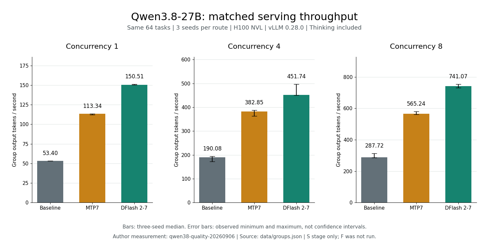

# 推测解码：MTP 与 DFlash 实测

[](https://github.com/vllm-project/vllm/releases/tag/v0.28.0)
[](experiments/20260906-qwen38/README-CN.md)
[](https://github.com/david-xinyuwei/david-share/actions/workflows/speculative-decoding-ci.yml)

给同一个大模型开启推测解码，能不能更快生成回答，又不损失答案质量？只看每秒输出多少 token 不够，还要给同一批回答评分。

我们在单张 H100 NVL 上，用 Qwen3.8-27B 和 vLLM 0.28.0 比较了不开推测解码的基线、模型自带的 MTP，以及 DFlash 2。相同的 64 道题，在并发 1、4、8 下各跑三次。DFlash 2 的输出吞吐在九组配对中都高于 MTP，但得分只是总体接近，**尚未证明准确率不下降**。

这组实测可以支持初步选型，不能直接作为生产验收结论。完整题集阶段未执行；更早的 Qwen3.6 实验和 EAGLE3 研究独立保留，不与本次数字混算。

> 作者：魏新宇（Xinyu Wei）

[English](README.md) | [中文](README-CN.md)

[从这里开始](#从这里开始) · [实测结论](#本次实测说明了什么) · [工作原理](#mtp-和-dflash-差在哪里) · [复算与测试](#快速开始) · [证据](#证据与代码)

---

## 从这里开始

| 你想了解什么 | 入口 |
|---|---|
| DFlash 2 比 MTP 快多少，答案有没有变差 | [最新测试报告](experiments/20260906-qwen38/README-CN.md) |
| 核对报告数字和已保存记录 | [离线复算与测试](#快速开始) |
| 理解两种起草方式的区别 | [MTP 和 DFlash 差在哪里](#mtp-和-dflash-差在哪里) |
| 回看首代 DFlash 的并发异常 | [Qwen3.6 完整答案评测](experiments/20260905-quality/README-CN.md) |
| 查早期 EAGLE3、训练和参数研究 | [历史研究原稿](RESEARCH-NOTES-CN.md) |

## 本次实测说明了什么

实验标识：`qwen38-quality-20260906`。图中的 MTP7 和 DFlash 2-7 都设置了 7 个候选 token；基线不使用推测解码。



*作者实测。每个柱形表示三次运行的吞吐中位数，误差线表示最小值和最大值，不是置信区间。同一批 32 道代码题和 32 道数学题；吞吐包含 thinking token，按整组请求耗时计算。来源：[逐组记录](experiments/20260906-qwen38/data/groups.json)。*

| 问题 | 实测回答 |
|---|---|
| 输出吞吐更高吗 | 是。三档并发、三个 seed 的九组配对中，DFlash 2 都高于 MTP7 |
| 准确率不下降得到证明了吗 | 没有。每类只有 32 道不同题目，三次重复用于观察波动，不能当成 96 道独立题 |
| 正确答案也一定更快交付吗 | 不一定。并发 4 的第三次运行中，DFlash 2 做完同一组题更慢，正常结束且答对的答案交付速率也低于 MTP7 |
| 原定全量题集都测了吗 | 没有。已完成 1,920 份响应，原计划 5,904 份；其余 3,984 份在启动前被预算检查阻止 |

得分、截断数、延迟和例外情况均列在[完整报告](experiments/20260906-qwen38/README-CN.md)中。吞吐优势不能替代客户负载上的准确率、延迟和异常率验收。

## MTP 和 DFlash 差在哪里

推测解码让较小的 draft model 先提出候选，再由目标模型验证。目标模型仍决定哪些 token 能进入输出。

| 比较项 | 本次 MTP7 | 本次 DFlash 2-7 |
|---|---|---|
| 起草所用权重 | Qwen3.8 checkpoint 自带的 MTP 权重 | 与目标模型配套的 DFlash 2 checkpoint |
| 候选怎样生成 | 在本次 vLLM 路径中逐步起草 | 通过 block diffusion 并行起草一块候选 |
| 每轮候选数量 | 7 个 token | 7 个 token |
| 谁做最终验证 | 同一个 Qwen3.8 目标模型 | 同一个 Qwen3.8 目标模型 |

这里的“7”是候选数量，不是网络层数。一次 forward 也不表示网络只有一层；它仍会经过 draft model 的各层。MTP 权重是否单独发布，随具体模型而异，不能把本次的打包方式当成 MTP 的统一定义。

推测解码的收益取决于两件事：每轮起草与验证花了多久，以及这一轮实际推进了多少个 token。候选越多，不一定越快；接受率也不是答案准确率。采样算法的分布保证，还需要正确的引擎实现，不能替代部署后的质量测试。

机制资料见 [DFlash 论文](https://arxiv.org/abs/2602.06036)和 [vLLM 固定版本源码](https://github.com/vllm-project/vllm/tree/2cf0a6915ce544dc493a0990f2ea38d81601128a)；本次参数见[实验配置](experiments/20260906-qwen38/evidence/configuration.json)。

## 两轮实验，分别解读

| 实验 | 测了什么 | 报告 |
|---|---|---|
| Qwen3.8 / DFlash 2 / vLLM 0.28.0 | 同一批 64 题，三档并发各跑三次；吞吐更高，质量结论限于该子集 | [最新实测](experiments/20260906-qwen38/README-CN.md) |
| Qwen3.6 / 首代 DFlash / vLLM 0.21.0 | 主评测覆盖全部 164 道代码题和 500 道数学题；另测并发时发现明显质量回退 | [完整答案评测](experiments/20260905-quality/README-CN.md) |

两轮的目标模型、draft model、引擎、题目范围和采样设置不同。新组合没有复现旧组合的严重回退，不能据此认定旧问题已经修好；旧问题的根因仍未定位。

## 快速开始

先取得仓库，再进入专题目录。已有仓库时直接进入该目录，不必重新克隆：

```bash
git clone https://github.com/david-xinyuwei/david-share.git
cd david-share/Deep-Learning/Speculative-Decoding
```

最新报告的检查使用 Python 3.10+ 标准库，不需要 GPU、服务凭据或额外依赖：

```bash
python experiments/20260906-qwen38/validate_report.py
python -m unittest discover -s experiments/20260906-qwen38 -p "test_*.py"
```

两条命令都应以退出码 0 结束，测试全部通过。它们验证报告、已保存的评分和文件哈希是否一致，**不重新执行推理或评分**。专用 CI 在 Windows、Linux 的 Python 3.10 和 3.12 上执行这些检查。

上一轮报告按当时的 Python 3.12 环境复算，入口见[旧实验说明](experiments/20260905-quality/README-CN.md)。发起新的推理还需要 GPU、固定版本的模型和引擎；公开的离线复算资产不是完整部署包。

## 证据与代码

| 要核对什么 | 文件 |
|---|---|
| 分数、吞吐与每次重复的结果 | [汇总](experiments/20260906-qwen38/data/summary.json)、[逐组记录](experiments/20260906-qwen38/data/groups.json) |
| 实际使用的参数和请求 | [配置](experiments/20260906-qwen38/evidence/configuration.json)、[请求样例](experiments/20260906-qwen38/evidence/request-examples.json) |
| 哪些阶段完成，何时停止和回收 | [运行记录](experiments/20260906-qwen38/evidence/run.json)、[事件日志](experiments/20260906-qwen38/evidence/events.jsonl) |
| 当时怎样派发、计时和接入评分器 | [执行源码快照](experiments/20260906-qwen38/source/) |
| 如何重算和检查报告 | [分析程序](experiments/20260906-qwen38/analyze_results.py)、[验收程序](experiments/20260906-qwen38/validate_report.py) |

最新实验公开了评分、计时、请求样例和执行源码快照，完整回答与原始流仍由作者归档。公开文件的哈希可以发现仓库内的内容漂移，不能替代对未公开原件的独立核验。

## 历史研究

[历史研究原稿](RESEARCH-NOTES-CN.md)保留早期 EAGLE3 验证、自训练 draft head、GLM 与 MiMo 的 MTP 参数、限长速度样例及排障记录。原稿用于追溯当时的研究，不作为当前实验的参数说明或生产保证。对应的脚本、配置、数据、日志和图片均保留。

## 官方资料

- [经典推测解码方法](https://proceedings.mlr.press/v202/leviathan23a.html)
- [DFlash 论文](https://arxiv.org/abs/2602.06036)与[项目代码](https://github.com/z-lab/dflash)
- [vLLM 0.28.0](https://github.com/vllm-project/vllm/releases/tag/v0.28.0)
- [EvalPlus](https://github.com/evalplus/evalplus)与 [MATH-500 来源](https://github.com/openai/prm800k#math-splits)
- [EAGLE](https://github.com/SafeAILab/EAGLE)与 [SpecForge](https://github.com/SafeAILab/SpecForge)