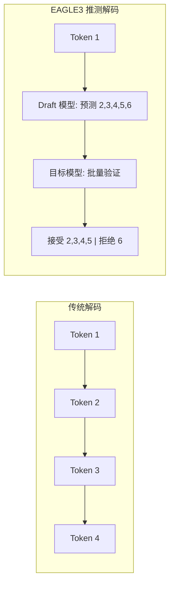
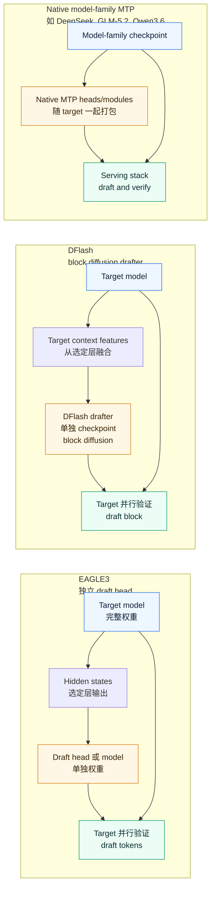
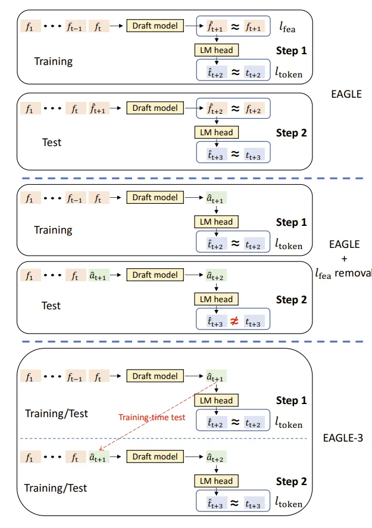

# Speculative Decoding for OSS Models

> **作者**: 魏新宇 (Xinyu Wei) — 微软 AI GBB 高级系统工程师

[English](README.md) | 中文文档

[](https://arxiv.org/abs/2401.15077)
[](https://arxiv.org/abs/2406.16858)
[](https://github.com/sgl-project/sglang)
[](https://github.com/vllm-project/vllm)
[](https://github.com/SafeAILab/SpecForge)

Draft-and-verify 加速工程指南：用可复现 benchmark 对比 EAGLE3、自训练 draft head、native model-family MTP、DFlash 和 llama.cpp MTP。

## 核心成果

本项目记录多条 Speculative Decoding / draft-and-verify 路线的完整研究流程：官方 EAGLE3 验证、自训练 draft head、native model-family MTP、GLM-5.2 的 IndexShare/KVShare MTP 设计，以及 DFlash/MTP serving 实验。

| 主题 | 本 repo 覆盖什么 | 证据 / 来源 | 关键洞察 |
|------|----------------|-------------|----------|
| EAGLE3 官方验证 | Llama-3.1-8B 的官方 EAGLE3 draft model | **441.7 vs 165.7 tok/s = 2.67x**，SGLang，H100，20 runs | Feature-based draft head 在低并发场景能带来明显 latency 收益 |
| 自训练 draft head | 单卡训练自定义 EAGLE3 draft head | **207.7 vs 159.8 tok/s = 1.30x**（代码任务），45 分钟训练 | 极短训练也能产生有效加速，但强依赖任务分布 |
| Native model-family MTP | Qwen3.6 / DeepSeek-style MTP patterns，以及 GLM-5.2 的单层 MTP + IndexShare/KVShare | GLM-5.2 官方 config + blog：`num_nextn_predict_layers=1`、shared MTP parameters、acceptance length **4.56 → 5.47 (+20%)** | Native MTP 不是一种固定 recipe；KVShare / IndexShare 这类 serving 架构细节很关键 |
| DFlash vs native MTP serving | Qwen3.6 native MTP、DFlash、llama.cpp MTP 的 H100 benchmark | Repo JSON/logs：测试口径下 DFlash coding **191.7 tok/s** vs native MTP **146.7 tok/s** | DFlash 在长输出 single-stream 测试中更快，但结论受 spec tokens、backend、precision 和 workload 影响 |
| Simulated acceptance | `SGLANG_SIMULATE_ACC_LEN=3` 在 4-token draft window 下的含义 | 公式：`accept_rate = 3 / 4 = 0.75`；README 中有 token timeline 例子 | simulated acceptance 是 runtime 诊断设置，不是真实模型质量证明 |

**为什么 45 分钟训练达到 1.30x 加速很有意义？**
- 官方模型需要在 8x A100/H100 上训练数天
- 我们用单卡 45 分钟就达到了官方效果的 ~50%
- 证明了 EAGLE3 的样本效率 - 极少计算量即可获得有效加速
- GLM-5.2 和 Qwen3.6 说明 native MTP 需要按 model family 具体分析；同样是 `num_nextn_predict_layers=1`，serving 架构不同，acceptance 表现也会不同。

## 怎么读这个 Repo

| 你关心什么 | 从哪里开始 | 能得到什么 |
|---|---|---|
| 核心机制 | [背景](#背景什么是-speculative-decoding推测解码) | 为什么 draft-and-verify 能降低 latency |
| 选哪条路线 | [分类](#speculative-decoding-分类eagle3-vs-原生-mtp-vs-dflash) 和 [选型指南](#选型指南什么场景选哪条路线) | EAGLE3、native MTP、DFlash 分别适合什么场景 |
| Native MTP 细节 | [MTP 层数与超参数](#mtp-层数与-speculative-decoding-超参数) | GLM-5.2、Qwen3.6、draft steps、模拟接受率和 `accept_rate=0.75` |
| 复现数据 | [H100 serving benchmark](#h100-serving-benchmarknative-mtp-vs-dflash-vs-llamacpp-mtp) 和 [复现实验](#复现实验) | 脚本、raw JSON、logs 和启动命令 |
| 自己训练 drafter | [阶段 2](#阶段-2自训练-eagle3-draft-模型) | 数据准备、训练日志、部署方式，以及什么时候自训练有用 |

## Repo 质量承诺

这个 repo 不是只讲概念，而是按证据交付：

| 原则 | 已包含什么 | 去哪里检查 |
|---|---|---|
| **Data-rich** | vLLM native MTP、vLLM DFlash、llama.cpp MTP 的 H100 benchmark 原始 JSON | `data/h100_vllm_native_mtp.json`、`data/h100_vllm_dflash.json`、`data/h100_llamacpp_mtp_q4kxl.json` |
| **Code-rich** | benchmark client、三路线 orchestrator、vLLM 启动脚本、llama.cpp 构建/启动脚本、EAGLE3 训练脚本 | `scripts/` |
| **Engineering-rich** | runtime knobs、失败模式、显存/KV-cache 限制、DeepGEMM 和 context-length 修复 | H100 benchmark 章节、runtime knobs 表、`logs/` |
| **Test-rich** | warmup + 多轮 measured runs、startup logs、输出质量检查、失败记录、JSON 支撑的 median TPS | `data/`、`logs/`、benchmark 表 |

## 证据展示：数据、日志、代码、CLI

进入算法讨论前，先看这个 repo 的证据链长什么样。

| 证据类型 | 产物 | 证明什么 |
|---|---|---|
| 原始 JSON 结果 | [`data/h100_vllm_native_mtp.json`](data/h100_vllm_native_mtp.json)、[`data/h100_vllm_dflash.json`](data/h100_vllm_dflash.json)、[`data/h100_llamacpp_mtp_q4kxl.json`](data/h100_llamacpp_mtp_q4kxl.json) | benchmark 数字来自逐轮保存的测量结果，不是正文里手写的汇总 |
| 启动日志 | [`logs/h100_vllm_native_mtp_startup.log`](logs/h100_vllm_native_mtp_startup.log)、[`logs/h100_vllm_dflash_startup.log`](logs/h100_vllm_dflash_startup.log)、[`logs/h100_llamacpp_mtp_startup.log`](logs/h100_llamacpp_mtp_startup.log) | serving route、speculative settings、model ID 和 runtime warning 可以回看 |
| Benchmark 代码 | [`scripts/mtp_benchmark_client.py`](scripts/mtp_benchmark_client.py) | TPS 用 non-streaming mode 下的 `usage.completion_tokens / total_time` 计算 |
| CLI 入口 | [`scripts/mtp_benchmark_orchestrator.sh`](scripts/mtp_benchmark_orchestrator.sh)、[`scripts/mtp_vllm_qwen36_mtp_launch.sh`](scripts/mtp_vllm_qwen36_mtp_launch.sh)、[`scripts/mtp_vllm_qwen36_dflash_launch.sh`](scripts/mtp_vllm_qwen36_dflash_launch.sh)、[`scripts/mtp_llamacpp_qwen36_mtp_launch.sh`](scripts/mtp_llamacpp_qwen36_mtp_launch.sh) | 三条路线可以用脚本启动和复测 |

**原始 JSON 样例**（`data/h100_vllm_dflash.json`，coding route）：

```jsonc
{
    "meta": {"label": "vllm-dflash", "runs": 3, "warmup": 1, "stream": false},
    "results": [
        {"domain": "coding", "run": 1, "total_s": 2.6720, "gen_tokens": 512, "gen_tps": 191.62, "finish_reason": "length"},
        {"domain": "coding", "run": 2, "total_s": 2.6701, "gen_tokens": 512, "gen_tps": 191.75, "finish_reason": "length"},
        {"domain": "coding", "run": 3, "total_s": 2.6709, "gen_tokens": 512, "gen_tps": 191.70, "finish_reason": "length"}
    ]
}
```

**启动日志证据**：

```text
File: logs/h100_vllm_native_mtp_startup.log
SpeculativeConfig(method='mtp', model='Qwen/Qwen3.6-27B', num_spec_tokens=5)

File: logs/h100_vllm_dflash_startup.log
speculative_config: {'method': 'dflash', 'model': 'z-lab/Qwen3.6-27B-DFlash', 'num_speculative_tokens': 15}
```

**Benchmark 代码路径**（`scripts/mtp_benchmark_client.py`）：

```python
completion_tokens = usage.get("completion_tokens", 0)
total_s = t_end - t_start
"gen_tps": round(completion_tokens / max(total_s, 0.001), 2)
```

**CLI 复现入口**：

```bash
# 自动顺序运行三条路线
bash scripts/mtp_benchmark_orchestrator.sh

# 或者手动跑其中一条路线
python3 scripts/mtp_benchmark_client.py --base-url http://127.0.0.1:8000 \
    --label vllm-dflash --runs 3 --warmup 1 --no-stream --output results_dflash.json
```

**可见测试结果切片**：

| 路线 | Source JSON | Coding runs TPS | Median TPS |
|---|---|---:|---:|
| vLLM native MTP | `data/h100_vllm_native_mtp.json` | 146.95 / 146.68 / 146.47 | **146.7** |
| vLLM DFlash | `data/h100_vllm_dflash.json` | 191.62 / 191.75 / 191.70 | **191.7** |
| llama.cpp MTP Q4_K_XL | `data/h100_llamacpp_mtp_q4kxl.json` | 106.65 / 107.70 / 107.28 | **107.3** |

## Benchmark 环境

本项目使用下面的 GPU 环境完成实验。Azure 只是本次 benchmark 的测试基础设施，不是 Speculative Decoding 技术本身的依赖。

| 项目 | 详情 |
|---|---|
| **Benchmark 使用的 GPU VM** | [NC40ads_H100_v5](https://learn.microsoft.com/en-us/azure/virtual-machines/nc-h100-v5-series) |
| **GPU** | NVIDIA H100 80GB |
| **框架** | vLLM, SGLang, llama.cpp |

---

## 阶段 1：验证官方 EAGLE3 模型

### 环境

```
硬件: NVIDIA H100 NVL 96GB (Azure VM)
软件: Python 3.10, CUDA 12.4, SGLang
```

### EAGLE3 服务器部署

```bash
export SGLANG_ALLOW_OVERWRITE_LONGER_CONTEXT_LEN=1

python -m sglang.launch_server \
    --model meta-llama/Llama-3.1-8B-Instruct \
    --speculative-algorithm EAGLE3 \
    --speculative-draft-model-path jamesliu1/sglang-EAGLE3-Llama-3.1-Instruct-8B \
    --speculative-num-steps 5 \
    --speculative-eagle-topk 8 \
    --speculative-num-draft-tokens 32 \
    --dtype float16 \
    --host 0.0.0.0 --port 8080
```

**服务器启动日志:**
```
[2025-12-02 12:01:15] server_args=ServerArgs(model_path='meta-llama/Llama-3.1-8B-Instruct', ...)
[2025-12-02 12:01:17] Load weight begin. avail mem=92.50 GB
Loading safetensors checkpoint shards: 100% | 4/4 [00:01<00:00, 2.31it/s]
[2025-12-02 12:01:19] Load weight end. type=LlamaForCausalLM, dtype=torch.float16, avail mem=77.39 GB

[2025-12-02 12:01:20] Loading EAGLE3 draft model: jamesliu1/sglang-EAGLE3-Llama-3.1-Instruct-8B
[2025-12-02 12:01:20] Warning: context_length (131072) > derived (2048). Overriding.
Loading safetensors checkpoint shards: 100% | 1/1 [00:00<00:00, 12.28it/s]
[2025-12-02 12:01:21] Draft model loaded. type=LlamaForCausalLMEagle3, mem usage=2.21 GB

[2025-12-02 12:01:32] Capture cuda graph end. Time elapsed: 7.00 s
[2025-12-02 12:01:35] The server is fired up and ready to roll!
```

### 基线服务器（无 Speculative Decoding）

```bash
python -m sglang.launch_server \
    --model meta-llama/Llama-3.1-8B-Instruct \
    --dtype float16 \
    --host 0.0.0.0 --port 8080
```

### Benchmark 结果（20 次运行，512 tokens）

**EAGLE-3 原始结果:**
```
Run  1:  1.155s | 512 tokens |  443.3 tok/s
Run  2:  1.160s | 512 tokens |  441.2 tok/s
Run  3:  1.158s | 512 tokens |  442.1 tok/s
...
Run 20:  1.159s | 512 tokens |  441.6 tok/s

平均: 1.159s | 441.7 tok/s | 标准差: 0.001s
```

**基线原始结果:**
```
Run  1:  3.097s | 512 tokens |  165.3 tok/s
Run  2:  3.087s | 512 tokens |  165.8 tok/s
Run  3:  3.091s | 512 tokens |  165.6 tok/s
...
Run 20:  3.085s | 512 tokens |  166.0 tok/s

平均: 3.090s | 165.7 tok/s | 标准差: 0.002s
```

**汇总:**
| 指标 | EAGLE-3 | Baseline | 对比 |
|------|---------|----------|------|
| 平均延迟 | 1.159s | 3.090s | **2.67x 更快** |
| 平均吞吐 | 441.7 tok/s | 165.7 tok/s | **2.67x 加速** |

### 输出质量验证

| 任务 | EAGLE-3 | Baseline | 一致性 |
|------|---------|----------|--------|
| 代码生成 | 1882 字符 | 1882 字符 | 100% 一致 |
| 逻辑推理 | 1744 字符 | 1744 字符 | 100% 一致 |
| 知识问答 | 2413 字符 | 2500 字符 | ~96% (措辞差异) |

知识问答的 4% 差异是因为 FP16 精度在长序列中的累积误差，核心信息完全一致。

---

## 阶段 2：自训练 EAGLE3 Draft 模型

### 数据准备（关键步骤）

EAGLE3 训练需要高质量的对话数据。SpecForge 框架提供了 `prepare_data.py` 脚本来处理各种数据集：

**支持的数据集：**
- `sharegpt` - ShareGPT 对话（推荐用于通用场景）
- `ultrachat` - UltraChat 数据集
- `perfectblend` - PerfectBlend 数据集（7M+ 对话）
- `eaglechat` - EAGLE 专用聊天数据
- `magpie-qwen2.5-pro-1m-v0.1` - Magpie Qwen 数据集

**步骤 1：准备训练数据**

```bash
cd ~/SpecForge

# 选项 1：使用 ShareGPT（完整数据集 ~114K 样本）
python scripts/prepare_data.py \
    --dataset sharegpt \
    --output-path cache/dataset/sharegpt_train.jsonl

# 选项 2：使用 ShareGPT 限制样本数（用于测试）
python scripts/prepare_data.py \
    --dataset sharegpt \
    --sample-size 10000 \
    --output-path cache/dataset/sharegpt_train.jsonl

# 选项 3：使用 PerfectBlend（更大、更高质量）
python scripts/prepare_data.py \
    --dataset perfectblend \
    --sample-size 50000 \
    --output-path cache/dataset/perfectblend_train.jsonl
```

**数据格式（JSONL）：**
```json
{
  "id": "HneH6K5_0",
  "conversations": [
    {"role": "user", "content": "写一篇关于...的文章"},
    {"role": "assistant", "content": "标题：...的好处"}
  ]
}
```

**关键洞察**：数据质量直接影响 draft 模型精度。使用仅 500 个样本的原始 ShareGPT 导致 6% 精度。使用 114K ShareGPT 样本或 PerfectBlend 数据集可达到 40-50% 精度。


### 训练配置

```yaml
model:
  base_model: "meta-llama/Llama-3.1-8B-Instruct"
  draft_model_type: "eagle3"

training:
  batch_size: 1
  gradient_accumulation_steps: 8
  learning_rate: 3.0e-5
  max_steps: 7000
```

### 训练启动

```bash
SPECFORGE_DIR=~/SpecForge bash scripts/train_eagle3.sh
```

这个 wrapper 保存本 repo 的复现命令和本地 draft config；真正的训练入口来自上游 [SpecForge](https://github.com/SafeAILab/SpecForge)。如果 SpecForge 不在 `~/SpecForge`，设置 `SPECFORGE_DIR=/path/to/SpecForge` 即可。

### 训练日志

```
[2025-12-03 02:45:12] ============================================
[2025-12-03 02:45:12] EAGLE3 Training Starting
[2025-12-03 02:45:12] ============================================
[2025-12-03 02:45:12] Target Model: meta-llama/Llama-3.1-8B-Instruct
[2025-12-03 02:45:12] Total Steps: 7000
[2025-12-03 02:45:12] Batch Size: 1, Gradient Accumulation: 8
[2025-12-03 02:45:12] ============================================

[2025-12-03 02:45:15] Loading target model...
Loading safetensors: 100%|██████████| 4/4 [00:02<00:00, 1.82it/s]
[2025-12-03 02:45:18] Target model loaded. VRAM: 15.2 GB

[2025-12-03 02:45:19] Draft head parameters: 223M (849 MB)
[2025-12-03 02:45:25] Loaded 52,000 conversations

Training Epoch 0:   7%|▋         | 500/7000 [03:15<42:00, 2.58it/s]
Step 500: loss=2.12, acc=0.40

Training Epoch 0:  14%|█▍        | 1000/7000 [06:30<39:00, 2.56it/s]
Step 1000: loss=1.90, acc=0.44

Training Epoch 0:  29%|██▉       | 2000/7000 [13:00<32:30, 2.56it/s]
Step 2000: loss=1.73, acc=0.46

Training Epoch 0:  43%|████▎     | 3000/7000 [19:30<26:00, 2.56it/s]
Step 3000: loss=1.64, acc=0.48

Training Epoch 0:  57%|█████▋    | 4000/7000 [26:00<19:30, 2.56it/s]
Step 4000: loss=1.62, acc=0.50

Training Epoch 0:  71%|███████▏  | 5000/7000 [32:30<13:00, 2.56it/s]
Step 5000: loss=1.63, acc=0.54   ← 峰值精度

Training Epoch 0:  86%|████████▌ | 6000/7000 [39:00<06:30, 2.56it/s]
Step 6000: loss=1.60, acc=0.50

Training Epoch 0: 100%|██████████| 7000/7000 [45:30<00:00, 2.56it/s]
Step 7000: loss=1.61, acc=0.48

[2025-12-03 03:30:42] ============================================
[2025-12-03 03:30:42] Training Complete
[2025-12-03 03:30:42] Total Time: 45 minutes 30 seconds
[2025-12-03 03:30:42] Best Checkpoint: epoch_0_step_5000 (acc=0.54)
[2025-12-03 03:30:42] ============================================

[2025-12-03 03:30:43] Segmentation fault (signal 11)
```

注：训练结束后的 segfault 是无害的 - 所有检查点已保存。

### 训练指标汇总

| Step | 进度 | Loss | Accuracy | 说明 |
|------|------|------|----------|------|
| 0 | 0% | 2.84 | 0.36 | 随机初始化 |
| 1000 | 14% | 1.90 | 0.44 | 快速提升 |
| 3000 | 43% | 1.64 | 0.48 | 趋于稳定 |
| **5000** | **71%** | **1.63** | **0.54** | **峰值精度** |
| 7000 | 100% | 1.61 | 0.48 | 轻微过拟合 |

### 理解指标波动

batch_size=1 时，每步指标会剧烈波动：
```
Step 3245: loss=0.00, acc=0.00   ← 短序列被跳过
Step 3246: loss=4.77, acc=0.22   ← 困难样本
Step 3247: loss=0.89, acc=0.54   ← 简单样本
```

这是正常的。关注检查点级别的趋势（每 500 步）。

### 自训练模型部署

```bash
export SGLANG_ALLOW_OVERWRITE_LONGER_CONTEXT_LEN=1

python -m sglang.launch_server \
    --model-path meta-llama/Llama-3.1-8B-Instruct \
    --speculative-algorithm EAGLE3 \
    --speculative-draft-model-path ./output/eagle3-llama31-8b-full/epoch_0_step_5000 \
    --speculative-num-steps 5 \
    --speculative-eagle-topk 8 \
    --speculative-num-draft-tokens 64 \
    --host 0.0.0.0 --port 8080
```

### 自训练模型结果

| 任务类型 | Baseline | 自训练 EAGLE3 | 加速比 |
|----------|----------|---------------|--------|
| 代码生成 | 159.8 tok/s | 207.7 tok/s | **1.30x** |
| 技术问答 | 188.9 tok/s | 188.0 tok/s | 1.00x |
| 数学推理 | 188.9 tok/s | 188.0 tok/s | 1.00x |
| 创意写作 | 180.2 tok/s | 153.9 tok/s | 0.84x |

**代码生成（最佳场景）:**
```
Prompt: "用 Python 实现二叉搜索树"
Baseline:     3.204s | 512 tokens | 159.8 tok/s
自训练:       2.465s | 512 tokens | 207.7 tok/s
加速: 1.30x
```

**创意写作（最差场景）:**
```
Prompt: "写一个关于机器人学画画的故事"
Baseline:     2.843s | 512 tokens | 180.2 tok/s
自训练:       3.327s | 512 tokens | 153.9 tok/s
加速: 0.84x (慢了 16%)
```

创意写作变慢是因为高熵输出导致 draft Acceptance Rate（接受率）低。

### 为什么 1.30x 很有意义

| 方面 | 官方模型 | 自训练 |
|------|----------|--------|
| 训练时间 | 数天 (8x A100) | 45 分钟 (1x H100) |
| 加速比 | 2.67x | 1.30x |
| 相对性能 | 100% | ~50% |
| 计算成本 | ~$10,000+ | ~$50 |

用 <1% 的计算量，达到了 ~50% 的性能。

---

## 阶段 3：Native MTP 与 DFlash Serving 实验

这一阶段讨论 model-family MTP 和 DFlash-style serving，不再使用外部模型厂商的 assistant checkpoint 作为案例。

这里有两个问题：

1. **怎么看懂模型 config 里的 native MTP？**
2. **native MTP、DFlash、llama.cpp MTP 在真实 serving benchmark 中表现如何？**

### Native MTP：不要只看一个 flag，要看 model family 设计

`num_nextn_predict_layers=1` 这种 config 字段只能告诉我们：模型有一个 native next-token prediction layer。它不能告诉我们 serving stack 如何在多个 draft steps 中复用这一层。

GLM-5.2 是一个很好的公开例子。它的 HF config 写着 `num_nextn_predict_layers=1` 和 `model_type=glm_moe_dsa`。但官方 GLM-5.2 blog 又补上了真正关键的 serving 细节：不同 MTP steps 共享参数，训练和推理都设置 7 个 MTP steps，并用 IndexShare / KVShare 防止后续 draft steps 混入 MTP 自己生成的 KV。在官方 coding ablation 中，acceptance length 从 **4.56** 提升到 **5.47 (+20%)**。

这个结论很重要：native MTP 不能只看“几层”。还要看这个 model family 如何处理参数共享、KV cache、index 复用和 train-inference discrepancy。

### H100 Serving Benchmark：Native MTP vs DFlash vs llama.cpp MTP

本 repo 在 NVIDIA H100 NVL 96GB 上测试了单请求 latency 和 generation TPS。vLLM 路线使用 `Qwen/Qwen3.6-27B` bf16；llama.cpp 路线使用 `unsloth/Qwen3.6-27B-MTP-GGUF:UD-Q4_K_XL`。测试覆盖 Coding、Math、Chat 三类任务，每类 warmup 1 次、正式运行 3 次，报告中位数。API 使用 non-streaming 模式，TPS = `usage.completion_tokens / total_time`。

**测试环境：**

| 项目 | 值 |
|------|-------|
| GPU | NVIDIA H100 NVL, 95830 MiB, driver 580.159.03 |
| vLLM | 0.21.0 (stock install, `VLLM_DEEP_GEMM_WARMUP=skip`) |
| llama.cpp | commit `27c8bb4`, CUDA build with OpenSSL |
| 目标模型 | `Qwen/Qwen3.6-27B` (bf16, 51.89 GiB) |
| DFlash draft | `z-lab/Qwen3.6-27B-DFlash` (3.22 GiB, block diffusion drafter) |
| llama.cpp GGUF | `unsloth/Qwen3.6-27B-MTP-GGUF:UD-Q4_K_XL` (17.9 GiB, Q4 quantized) |

**结果（single-stream，3 次取中位数）：**
| Route | Backend | Quant | Spec Tokens | Domain | Med Total (s) | Med TPS |
|-------|---------|-------|:-----------:|--------|:-------------:|:-------:|
| **vLLM native MTP** | vLLM 0.21.0 | bf16 | 5 | Coding | 3.49 | **146.7** |
| | | | | Math | 1.51 | **169.1** |
| | | | | Chat | 1.65 | **155.4** |
| **vLLM DFlash** | vLLM 0.21.0 | bf16 | 15 | Coding | 2.67 | **191.7** |
| | | | | Math | 1.32 | **193.5** |
| | | | | Chat | 1.64 | **156.1** |
| **llama.cpp MTP** | llama.cpp (CUDA) | Q4_K_XL | 5 | Coding | 4.77 | **107.3** |
| | | | | Math | 2.15 | **118.9** |
| | | | | Chat | 2.48 | **103.1** |

### 这一阶段得到什么结论

1. **Native MTP 必须按 model family 具体分析。** GLM-5.2 说明 config 字段、MTP step count、IndexShare、KVShare 和训练 loss 要合在一起看。
2. **DFlash 在本次 H100 single-stream 测试中更快。** Coding 场景下，15 spec tokens 的 DFlash 是 191.7 TPS，5 spec tokens 的 native MTP 是 146.7 TPS。
3. **这不是完全控制变量的算法排名。** DFlash 用 15 个 speculative tokens，native MTP 用 5 个。这是工程结果，不是普遍结论。
4. **llama.cpp MTP 是另一种产品形态。** Q4_K_XL 路线适合 compact local serving，但没有质量检查时不能直接和 bf16/vLLM 公平对比。

**复现过程中发现的运行时调参：**

| 问题 | 根因 | 修复 |
|-------|-----------|-----|
| vLLM `max_num_seqs (1024) exceeds available Mamba cache blocks` | Qwen3.6 的 Mamba+Attention 混合架构在 262K 上下文下只有 468 个 Mamba cache blocks | 添加 `--max-num-seqs 256` |
| vLLM `DeepGEMM backend is not available or outdated` | vLLM 0.21.0 尝试 DeepGEMM warmup 但未安装 | 设置 `VLLM_DEEP_GEMM_WARMUP=skip` |
| vLLM DFlash `KV cache memory (26.74 GiB) < required (27.69 GiB)`（262K 上下文） | DFlash draft 模型比 native MTP 多占 VRAM | 降低 `--max-model-len` 到 252000 |
| llama.cpp `HTTPS is not supported`（`-hf` 下载） | 编译时未链接 OpenSSL | 安装 `libssl-dev` 后用 `-DLLAMA_OPENSSL=ON` 重新编译 |

### 复现 H100 三条路线

```bash
# Route 1 — vLLM native MTP
VLLM_DEEP_GEMM_WARMUP=skip MAX_NUM_SEQS=256 bash scripts/mtp_vllm_qwen36_mtp_launch.sh
python3 scripts/mtp_benchmark_client.py --base-url http://127.0.0.1:8000   --label vllm-native-mtp --runs 3 --warmup 1 --no-stream --output results_mtp.json

# Route 2 — vLLM DFlash
VLLM_DEEP_GEMM_WARMUP=skip MAX_MODEL_LEN=252000 MAX_NUM_SEQS=256   bash scripts/mtp_vllm_qwen36_dflash_launch.sh
python3 scripts/mtp_benchmark_client.py --base-url http://127.0.0.1:8000   --label vllm-dflash --runs 3 --warmup 1 --no-stream --output results_dflash.json

# Route 3 — llama.cpp MTP GGUF
bash scripts/mtp_llamacpp_qwen36_mtp_launch.sh
python3 scripts/mtp_benchmark_client.py --base-url http://127.0.0.1:8080   --label llamacpp-mtp-q4kxl --runs 3 --warmup 1 --no-stream --output results_llamacpp.json
```

归档证据：

| 类型 | 文件 |
|------|------|
| Benchmark raw JSON | `data/h100_vllm_native_mtp.json`, `data/h100_vllm_dflash.json`, `data/h100_llamacpp_mtp_q4kxl.json` |
| Server startup logs | `logs/h100_vllm_native_mtp_startup.log`, `logs/h100_vllm_dflash_startup.log`, `logs/h100_llamacpp_mtp_startup.log` |
| Benchmark client | `scripts/mtp_benchmark_client.py` |
| Orchestrator | `scripts/mtp_benchmark_orchestrator.sh` |

---

## 背景：什么是 Speculative Decoding（推测解码）？

LLM 推理是显存带宽受限的，而非计算受限。每次生成 token 都需要从 GPU 显存加载完整模型权重，但只输出一个 token。

推测解码（Speculative Decoding）使用快速的 draft 模型预测多个 token，然后用主模型并行验证：



### EAGLE3 架构


*图1: EAGLE3 Draft Model 架构与基于树的 Speculative Decoding (来源: [Benjamin Marie](https://kaitchup.substack.com/p/eagle-3-speculators-when-to-use-them))*

**架构详解（逐步分析）：**

**左侧 - Target LLM（标准解码）：**

对于查询 "How can"，target model 执行标准 Autoregressive Decoding（自回归解码）：
1. 输入 tokens "How", "can" → **Embedding** 层 → e_how, e_can
2. **Transformer Layers** 处理 embeddings → 隐藏特征 f_how, f_can
3. **LM Head** 预测下一个 token → 输出 "can", "I"
4. 每个 token 需要**完整的一次 forward pass** 通过所有层

**右侧 - EAGLE-3 Draft Model（Speculative Decoding）：**

Draft model 更轻量、更快速：
1. **Forward 1**：接收来自 target model 的 f_how, e_can + embedding e_I
   - 通过 "**One Auto-regression Head**"（单个 decoder layer）
   - **LM Head** 输出 f_I → 预测候选 "make/help"

2. **Forward 2**：对每个候选（"make", "help"）：
   - 输入：之前的特征 + 新的 embeddings（e_make, e_help）
   - 输出：f_make, f_help → 预测 "a/our", "with/you"

3. **Forward 3**：继续展开：
   - 从 "with" → 预测 "the/your"
   - 从 "you" → 预测 "to/feel"

**图中的关键符号：**
- `e_xxx`：token "xxx" 的 Embedding
- `f_xxx`：token "xxx" 的隐藏特征/表示
- 橙色框：来自 target model 的特征（f_how, f_can）
- 红色框：draft model 的预测（f_make, f_help 等）

**下方 - 树形结构（验证）：**

Draft tokens 形成一棵树用于批量验证：
```
Query: "How can"
         ↓
    "I" (来自 target LLM, Forward 1)
```

Target model **在单次 forward pass 中验证所有分支**，接受最长匹配序列（如 "I" → "help" → "you" → "feel"）。

**角色分工 - "Draft 负责猜，Target 负责判"：**

| 角色 | 模型 | 任务 | 成本 |
|------|------|------|------|
| **预测者 (Draft)** | EAGLE-3 Draft Model (223M) | 快速生成候选 tokens | 低 |
| **验证者 (Verify)** | Target LLM (8B) | 判断哪些候选是对的 | 高 |

**具体流程示例：**
```
1. Target LLM 生成第一个 token "I"（必须，因为需要初始特征）

2. Draft Model 快速预测（3 次低成本 forward pass）：
   "I" → make, help
   "make" → a, our
   "help" → with, you
   （每次只过 223M 参数）

3. Target LLM 验证（1 次高成本 forward pass）：
   并行批量验证所有候选分支
   判断：哪些 draft tokens 和我自己会生成的一样？
   
4. 接受匹配的序列：
   比如 "I" → "help" → "you" → "feel" 都对
   一次性接受 4 个 tokens！
```

**为什么这样有效 - 成本分析：**

*不用 EAGLE-3 时：*
- 生成 4 个 tokens = 4 × Target LLM forward pass
- 成本：4 × 8B = **32B 参数计算**

*用 EAGLE-3 时：*
- Draft 预测：3 × 223M = 669M 参数计算
- Target 验证：1 × 8B = 8B 参数计算
- 总计：**~8.7B**（比 32B 便宜约 3.7 倍）

**关键洞察**：Target LLM 的验证是**并行的** - 不管 draft 生成了多少候选，验证都只需要 1 次 forward pass（利用 batch 并行）。Draft 负责"猜"，Target 负责"判"，猜对了就白赚，猜错了顶多浪费一点 draft 的计算。

---

### 为什么验证比生成便宜

常见问题："验证不也要走一遍 Target 模型吗？那为什么不直接用 Target 生成？"

答案在于**顺序 vs 并行**的计算方式：

**生成（顺序执行）：**
- 每个 token 都依赖前面所有 token
- 必须等 token 1 生成 → 再生成 token 2 → 再生成 token 3...
- **N 个 token = N 次 forward pass**（每次都是完整模型计算）
- GPU 利用率：低（每次之间都在等待）

**验证（并行执行）：**
- 给定 N 个候选 token，一次性全部检查
- Transformer 的 self-attention 天然支持：输入 `[x₁, x₂, ..., xₙ]`，输出 `[y₁, y₂, ..., yₙ]`，只需 1 次
- **N 个 token = 1 次 forward pass**（batch 并行）
- GPU 利用率：高（并行计算正是 GPU 的强项）

**打个比方：**
- 生成 = 考试答题：做完第 1 题，再做第 2 题，再做第 3 题...（顺序执行，每题依赖前一题）
- 验证 = 老师批卷：所有答案同时批改（并行执行，各题独立判断）

**具体数字：**
| 操作 | 4 个 Token | 8 个 Token | 16 个 Token |
|------|-----------|-----------|------------|
| 生成 | 4 次 forward pass | 8 次 forward pass | 16 次 forward pass |
| 验证 | 1 次 forward pass | 1 次 forward pass | 1 次 forward pass |

这就是为什么 EAGLE-3 的"draft + verify"模式能赢：即使 draft 有些猜错了，但并行验证的成本太低了，猜对的部分带来的加速远超猜错的损失。

---

## Speculative Decoding 分类：EAGLE3 vs 原生 MTP vs DFlash

所有 Speculative Decoding 的外层逻辑都一样：先让便宜的 drafter 猜后续 token，再让 target model 并行验证。真正的工程差异在于：drafter 从哪里来、和 target model 绑定得有多紧。

| 家族 | Drafter 到底是什么 | 什么时候产生 | 部署时怎么挂上去 | 实测额外显存 | 优势 | 风险 |
|------|-------------------|--------------|------------------|----------------|------|------|
| **EAGLE3** | 读取 target model 多层 hidden features 的训练后 draft head/model | target model 固定后再训练，可以是官方训练，也可以自己训练 | 作为额外 draft model/head 和 target model 一起加载 | Phase 1 SGLang 日志显示 draft model +2.21 GiB | 官方 draft model 可用时 speedup 很高；也可以自训练 | 训练数据质量和任务分布很关键，draft 数据差会拖慢部分任务 |
| **DFlash** | 读取 target context features 的 block diffusion drafter checkpoint，一次 forward 并行草拟一个 token block（来源：[DFlash project](https://z-lab.ai/projects/dflash/) 和 [arXiv:2602.06036](https://arxiv.org/abs/2602.06036)） | 针对某个 target model family/checkpoint 单独训练；公开 checkpoint 发布在 `z-lab/*-DFlash` | 在支持 DFlash 的 serving stack 中作为 draft model 加载，例如 SGLang 或带 DFlash 支持的 vLLM build | 本 repo 未实测 | draft 阶段本身从顺序生成变成 block 并行生成；官方 checkpoint 和 engine 支持齐全时很有潜力 | 更吃显存和 engine 版本；block size、context length、任务分布都必须 benchmark |
| **Native model-family MTP** | 随 target model family 一起打包的 MTP heads/modules，有时表现为同一 model directory 内的单独 MTP 权重 | release-specific，作为 model-family 设计的一部分训练 | 通过该 model family 的原生 inference stack 或 model-directory 约定加载，而不是使用独立 assistant 路径 | 本 repo 未实测 | MTP 成为 model-family serving design 的一部分，而不是事后外挂 | 具体实现随 release 变化，不能照搬 EAGLE flags 或其他 model family 的 assistant-loading 约定 |

这里的 “drafter” 不能统一理解成“旁边外挂一个完整 LLM”。不同路线的权重形态不一样：

| 家族 | Drafter 有没有自己的权重？ | 是不是能替代 target 的完整模型？ | 推荐写法 |
|------|----------------------------|-------------------------------|----------|
| **EAGLE3** | 有，但它是单独的 draft-model/head 权重，不是完整 target model 权重副本 | 不是 | separate draft-model weights, not full target-model weights |
| **DFlash** | 有。Z-Lab 针对特定 target 发布单独 DFlash draft checkpoint | 不是 | target-conditioned block diffusion draft checkpoint |
| **Native model-family MTP** | 随 release 而定。有些 model family 把 MTP 表现为 checkpoint 内部的 native heads/modules，也可能以同目录 MTP 权重形式打包 | 不是 | 随 model family 一起打包的 native MTP weights，不是完整 target model 副本 |

下图把几条路线里 drafter 的位置画出来。Native model-family MTP 这里是通用概念位置，因为每个 model family 的打包方式和 serving interface 都可能不同。DFlash 也读取 target 信息，但它最特别的地方是 drafter 本身是 block diffusion，不是 autoregressive draft head。



### 深度对比：每种 Drafter 到底怎么工作

| 维度 | Classic Speculative Decoding | EAGLE3 | DFlash | Native model-family MTP |
|------|------------------------------|--------|--------|---------------------|
| Drafter 读 target 哪里 | 不读；一个独立的小 LM 完全独立推理 | 读 3 个中间层的 hidden states（Llama 8B 的第 2/16/29 层） | 读取并融合 target context features，并注入 draft layers 的 KV cache | MTP heads 直接从 model forward path 分支出来 |
| Drafter 多大 | 一个完整的小 LM（如 68M Llama-68M） | ~223M 参数，1 个 decoder 层 | 轻量 block diffusion checkpoint；大小随 target 而变，本 repo 未实测 | model checkpoint 内部的原生 MTP modules |
| Draft 方式 | autoregressive draft LM | autoregressive draft head/model | block diffusion，一次 forward 并行草拟一个 token block | 模型家族内部的 future-token prediction path |
| 能不能自己训练 | 拿现成的小 LM 直接用，不需要专门训练 | 能（SpecForge，单卡 45 分钟） | 需要 target-specific DFlash 训练 recipe/checkpoint；本 repo 未训练 | 不能，模型厂商在 pre-training 时做好了 |
| 微调 target 后怎么办 | Drafter 独立，仍然能用，但 acceptance rate 可能降低（输出分布偏移） | 重新训练 draft head 来适配新分布 | 需要重新验证或重训 DFlash checkpoint；target feature 分布变化会影响接受率 | Native MTP modules 属于 model family 的一部分，微调和 serving 支持需要一起验证 |
| 换一个 target model | 直接换小 LM，不依赖 target 内部结构 | 重新训练一个新的 draft head | 不能假设复用；要换成针对该 target 的 DFlash checkpoint | 不适用，MTP modules 和模型不可分离 |
| Serving stack | 任何支持 assisted generation 的框架 | SGLang 原生 EAGLE3 支持，一行参数 | 需要 DFlash-aware SGLang / vLLM build；engine 版本很关键 | 取决于模型厂商自己的 inference stack |
| 和 target 的耦合度 | 无（最松） | 紧（读中间层 hidden states） | 紧（读取 target features，但仍是外置 checkpoint） | 最紧（原生模块内置在模型里） |

### 算法理念：后装路线 vs 原生路线

EAGLE3、native MTP 和 DFlash 代表不同的设计理念，不是简单的“新 vs 旧”：

| 维度 | EAGLE3（后装） | DFlash（外置 block diffusion） | Native model-family MTP |
|------|----------------|-------------------------------|-------------------------|
| 核心问题 | target 已经固定，怎么事后造一个最好的 drafter？ | 能不能让外置 drafter 一次并行草拟一整块 token，去掉 draft 阶段的顺序瓶颈？ | 把 MTP 做进 pre-training objective 本身 |
| 关键创新 | 解决了 train-test gap：训练时用 drafter 自己的预测特征而不是 ground truth 特征，让训练和推理一致（EAGLE-3, NeurIPS 2025） | target feature fusion + KV injection + block diffusion parallel drafting | MTP 作为 training objective；GLM-5.2 进一步使用 IndexShare/KVShare，防止 MTP 自己生成的 KV 污染后续 draft steps |
| 学术记录 | EAGLE (ICML 2024)、EAGLE-2 (EMNLP 2024)、EAGLE-3 (NeurIPS 2025) | DFlash paper: arXiv:2602.06036, ICML 2026 | DeepSeek-V2/V3 论文；GLM-5.2：IndexShare（[arXiv:2603.12201](https://arxiv.org/abs/2603.12201)）+ KVShare + rejection sampling + end-to-end TV loss for MTP |
| 产业趋势 | 通用后装：任何 target model 都能用 | 新的外置 drafter 路线：依赖 target features，但 draft 是 block-parallel | 前沿方向：越来越多厂商在训练时内置 MTP；GLM-5.2 说明 shared-parameter MTP 也能通过阻止 MTP 自己生成的 KV 污染后续 steps 来提升 acceptance |

两条路线会长期共存。后装 drafter（EAGLE3）在你需要加速一个已有的、不能重训的 target model 时仍然不可替代。Native model-family MTP 是新 model family 的设计方向。

### 选型指南：什么场景选哪条路线

| 场景 | 推荐 | 原因 |
|------|------|------|
| 追求最高加速比 | **EAGLE3** | 本 repo 低并发验证中实测 2.67x |
| 官方 DFlash checkpoint 存在，且 serving engine 支持 | **DFlash** | draft 阶段本身变成 block 并行；必须在自己的 workload 上验证显存、block size 和 acceptance rate |
| 会微调 target model | **EAGLE3** | 可以重新训练 draft head 适配微调后的 target |
| 模型厂商自带原生 MTP | **用厂商的 MTP** | 不需要额外部署，已经内置 |
| 长上下文或显存紧张服务 | **先 benchmark 再启用 DFlash** | DFlash 会增加 draft 权重和 engine-specific path；block 太大、acceptance 低时会浪费算力 |
| 长期生产、不依赖单一厂商 | **EAGLE3** | 社区驱动（SafeAI Lab），不依赖厂商发布 assistant |

一句话：EAGLE3 要管理 feature-based draft head（读多个中间层 hidden states）；DFlash 给你一个 target-conditioned diffusion drafter，一次 forward 并行草拟一个 token block；Native model-family MTP 则把 draft 机制更深地放进 model family 作为原生模块。这些路线都以不同方式读取或依赖 target 内部信息，区别在于 drafter 怎么打包、怎么 draft、和 serving stack 绑定多深。它们都属于 Speculative Decoding，但部署方法不能混用。

### 实用 Benchmark 矩阵：Qwen3.6 上的 DFlash vs MTP

下一个 benchmark 问题不是抽象地问“DFlash 是否比 MTP 更快”。更准确的问题是：

> 对某个具体 Qwen3.6 target、backend、量化级别、并发模式、context length、任务类型和 speculative window，哪条路线能得到最好的 accepted-token throughput 和 latency？

这个矩阵把 DFlash/MTP 对比拆成可复现的 benchmark 计划。它基于公开的 DFlash / vLLM / llama.cpp 机制，以及第三方文章和 notebook 审查；其中的第三方数字在本 repo 自己重跑并归档 raw logs 前，只能作为方向性证据。

| 维度 | 需要测试的值 | 为什么重要 |
|------|--------------|------------|
| Target model | Qwen3.6-27B dense；Qwen3.6-35B-A3B MoE | Dense 和 MoE 可能偏好不同 speculative route，不能把 27B 的结论直接套到 35B-A3B。 |
| Backend | vLLM；llama.cpp | vLLM 是多用户服务基线；llama.cpp 在单用户本地推理，尤其是 GGUF 量化时可能很强。 |
| Speculation route | baseline；native Qwen MTP；DFlash；llama.cpp MTP GGUF | 每条路线改变的变量不同：无 drafter、model-family MTP、target-conditioned block diffusion、量化本地 MTP。 |
| Serving mode | single-stream latency；concurrent throughput | 单请求交互和多用户服务是两种产品。一条路线可能赢其中一个、输另一个。 |
| Task domain | coding、math、chat | acceptance rate 和任务分布强相关。结构化 code/math 输出通常不同于开放式 chat。 |
| Speculative window | MTP：围绕 3-8 draft tokens 扫描；DFlash：在 engine 支持下扫 8 vs 15/16 | draft token 不是越多越好。如果前面的 token 被拒绝，后面的 draft work 都会浪费。 |
| Context length | 短 prompt；长上下文服务形态 | DFlash 会增加 draft weights 和 engine-specific path，长上下文服务必须单独检查 KV-cache 和显存。 |

建议公开报告这些指标：

| 指标 | 必须吗 | 说明 |
|------|--------|------|
| Output tokens/sec | 必须 | 能拿到时同时报告 engine throughput 和 accepted/output throughput。 |
| TTFT / latency | 必须 | 只报 throughput 会掩盖单用户 latency 退化。 |
| Acceptance length 或 acceptance rate | 能拿到就必须 | 这是解释加速或变慢的核心指标。 |
| GPU memory 和 KV-cache budget | 必须 | 对 DFlash 和长上下文配置尤其重要。 |
| Engine version / commit | 必须 | DFlash 对 engine 版本敏感；只写 “vLLM” 不够。 |
| Accuracy / output quality spot checks | 量化 llama.cpp 必须 | 量化 GGUF 的速度不能直接和 bf16/vLLM 公平对比，除非质量也检查。 |
| Failure notes | 必须 | crash、不支持的 block size、context-length 限制都是工程结果的一部分。 |

公开措辞规则：

| 数据来源 | 推荐写法 |
|----------|----------|
| 第三方文章或图表 | “Third-party benchmarks suggest...” |
| 本地 notebook 命令线索 | “A reproduction path to test is...” |
| 本 repo 自己的 raw logs | “This repo measured...” 并给出文件路径和命令证据 |

#### H100 Benchmark 数据

完整的 H100 benchmark 表格、测试环境、关键发现、运行时调参和复现命令，请参见阶段 3 的 [H100 Serving Benchmark](#h100-serving-benchmarknative-mtp-vs-dflash-vs-llamacpp-mtp) 和 [复现 H100 三条路线](#复现-h100-三条路线)。

### MTP 层数与 Speculative Decoding 超参数

MTP（Multi-Token Prediction）layers 是模型 pretraining 阶段训练出来的 draft heads。MTP 层数直接决定 speculative decoding 应该怎么配置。

**MTP layer-count patterns：**

| Pattern | MTP layers | Draft 形态 | Serving 含义 |
|---------|:----------:|------------|--------------|
| Single-layer native MTP | 1 | 一个 MTP head 反复用于多个未来位置 | draft tokens 越多，同一个 head 看得越远，误差越容易累积 |
| Multi-layer native MTP | N | N 个 native heads/modules 可以表示 N 个未来位置 | `--speculative-num-steps` 通常先按 native MTP layer count 设置，再 benchmark |
| External assistant MTP | 取决于实现 | 额外 assistant/drafter checkpoint 预测未来 token | 通过 serving engine 的 assistant/speculative config 配置，而不是 native MTP layer flags |
| DFlash-style drafter | block-level | target-conditioned drafter 并行草拟 token block | 需要调 block size 和显存余量；不能和 autoregressive MTP flags 混用 |

**已知模型 MTP 配置速查（来源：官方 HF `config.json` 和厂商文档）：**

| 模型 | `num_nextn_predict_layers` | 架构 | MTP 优化 | 来源 |
|------|:--------------------------:|------|----------|------|
| Qwen3.6-27B | 1 | 单个 MTP head，跨 draft steps 复用 | — | HF `config.json` |
| DeepSeek-V3 / R1 | 1 | 单个 MTP head | — | 官方论文 |
| GLM-5.2（753B MoE） | 1 | 单个 MTP head，参数在多个 MTP steps 之间共享（`glm_moe_dsa`） | IndexShare + KVShare 防止后续 MTP step 混入 MTP 自己生成的 KV；官方 coding ablation 中，7 个 MTP steps 的 acceptance length 从 4.56 提升到 5.47（+20%） | HF `config.json`；[GLM-5.2 blog](https://huggingface.co/blog/zai-org/glm-52-blog) |

GLM-5.2 值得注意的点不是“参数共享”本身，而是官方 blog 明确写了：不同 MTP steps 的参数是共享的，同时训练和推理都设置 7 个 MTP steps。没有 IndexShare / KVShare 时，第二个 MTP step 可能把 target model 算出来的 `kv_1..kv_4` 和 MTP 层自己算出来的 `kv_5` 混在一起，这就是 train-inference discrepancy：训练时看到的是 target hidden states，推理时却开始看到 draft 模块自己的 states。IndexShare 让后续 step 只能 attend 到第一步选出的 target 位置；KVShare 保证这些位置的 KV 来自 target model。说人话：同一套 MTP 模块可以草拟多个未来位置，但后面的草拟不能拿前面自己的草稿当参考资料。

HF 上的打包方式也不一样。GLM-5.2 主要通过 `config.json` 里的 `num_nextn_predict_layers=1` 和 `index_share_for_mtp_iteration=true` 暴露 MTP 设计；文件列表是普通主模型 shards（如 `model-00001-of-00282.safetensors`），没有单独的 `model_mtp.safetensors`。有些 native MTP model family 会把 MTP 权重作为同目录下单独文件发布。共同点是 native model-family MTP；具体文件布局随 release 而变。

**层数为什么重要：**

- **N 个 native layers 可以表示 N 个未来位置**（`t+1`, `t+2`, ..., `t+N`）。
- **1-layer MTP** 也能草拟多个未来 token，但需要重复使用同一个 head。真正的风险不只是“连续复用同一套参数”，而是后续 step 可能把前面 MTP 自己生成的 states 当上下文。GLM-5.2 的 IndexShare + KVShare 针对的正是这条污染路径。
- **Multi-layer MTP** 可以把不同 native heads/modules 分配给不同未来位置，因此 `num_steps` 通常先从 native MTP layer count 附近开始调。

**用一句话看懂 token timeline：`今天天气真好，我要去公园玩`**

假设模型已经生成了上下文 `今天天气真好`。当前上下文里的最后一个真实 token 是 `t = 好`。它不是本轮 speculative step 新生成的 token，而是本轮开始前已经存在的起点。

```text
已经生成的上下文：
    ... 今天天气真 好
                                    ^
                                    t = 已经存在的 target token

Draft/MTP 草拟三个未来位置：
    t+1 = ，
    t+2 = 我
    t+3 = 要

Target verification 用一次 forward pass 检查这些 draft tokens：
    verify t+1, t+2, t+3

Target verification 同时顺手得到下一个位置的 logits：
    t+4 = 去   ← verify bonus，不是 token t 本身
```

所以 `target token t already generated` 和 `t+4 bonus from target verify` 不是一码事：

| 符号 | 在这个例子里的含义 | 谁产生的 |
|------|--------------------|----------|
| `t` | 上下文里已经存在的 `好`，本轮从这里开始 | 本轮之前已经生成 |
| `t+1..t+3` | draft 猜的 `， 我 要` | Draft/MTP |
| `t+4` | verify 过程中顺手得到的 `去` | Target verify |

**超参分两组：draft 形状 vs simulated acceptance**

<div align="center"></div>

这些设置放在一起会很乱，拆成两组就清楚了：

| 组别 | 参数 | 示例值 | 控制什么 |
|------|------|-------:|----------|
| Draft shape | `--speculative-num-steps` | `3` | draft 尝试多少个未来位置（例子里的 `t+1..t+3`） |
| Draft shape | `--speculative-eagle-topk` | `1` | tree width。`1` 是线性链；更大值会产生候选树 |
| Draft buffer | `--speculative-num-draft-tokens` | `4` | buffer 大小：3 个 draft positions + 1 个 target-verify bonus position |
| Simulation | `SGLANG_SIMULATE_ACC_LEN` | `3` | 强制 runtime 按“接受 3 个 draft tokens”的效果前进 |
| Simulation | `SGLANG_SIMULATE_ACC_METHOD` | `match-expected` | 用 simulated accept index 替换真实 verification decision |

在 4-token draft window 且 simulated accept length = 3 时，看到的接受率是一种配置出来的效果：

```text
accept_rate = accept_length / max_accept_length = 3 / 4 = 0.75
```

这不等于模型自己证明了“真实接受率 75%”。它表示 benchmark 在 fixed-acceptance 假设下运行。

**为什么需要 simulated acceptance**

| 角度 | 有什么用 | 不能证明什么 |
|------|----------|--------------|
| Kernel/runtime benchmark | 在相同 acceptance 假设下隔离 scheduler、kernel、KV-cache、disaggregation 行为 | 真实 draft-model 质量 |
| Upper-bound analysis | 看 runtime 在“每轮稳定提供 3 个有效 token”时最多能跑多快 | 生产端到端吞吐 |
| Cross-system alignment | 让两个系统比较同一个 decode-loop 形状 | 输出文本真实、高质量 |

prompt、target forward pass 和 runtime path 仍然真实执行，所以 TPOT 会下降，output tok/s 会提高。加速来自 runtime 被告知“每轮 decode step 接受 3 个 token”：

```text
1024 output tokens / 1 token per step = 1024 decode steps
1024 output tokens / 3 tokens per step ≈ 341 decode steps
```

**Simulated acceptance 的好处和代价：**

| 好处 | 代价 / 风险 |
|------|-------------|
| 适合做同口径 runtime 对比 | 输出质量不能代表 truthful generation quality |
| 适合看 TPOT / throughput 上限 | `accept_rate=0.75` 是配置效果，不是模型实测能力 |
| 适合隔离 kernel 和 serving-stack bottleneck | 会掩盖 draft-model calibration、workload distribution 和真实 rejection 行为 |
| 稳定、可复现，适合工程诊断 | 如果不加 caveat，会高估生产吞吐 |

推荐写法：`fixed/simulated accept_length=3, equivalent to accept_rate=0.75 under a 4-token draft window`。不要写成 `real accept_rate=0.75`。

DFlash 使用建议仍然应该保持工程化：当官方 draft checkpoint 存在、serving engine 支持稳定、显存余量足够、且 workload-specific acceptance 足够高时，DFlash 值得测试。否则应该把 native MTP 和 DFlash 放在同一套 workload 上并排 benchmark。


---

**核心创新: 多层特征提取**

与使用独立小模型的传统 Speculative Decoding 不同，EAGLE3 在目标模型 Forward Pass（前向传播）过程中从**3个特定层**提取特征：

```
目标模型（Llama-3.1-8B，32层）：

Layer 0 → Layer 2 → ... → Layer 16 → ... → Layer 29 → Layer 30-31 → 输出
              ↓              ↓                ↓                        ↓
         Hidden[0]      Hidden[1]        Hidden[2]               (用于验证)
          (4096)         (4096)           (4096)
                             ↓
                   拼接 (4096 × 3 = 12288)
                             ↓
                    │    FC 层        │  (12288 → 4096)
                    │  + 1个Decoder   │  (独立权重)
                    │  + LM Head      │  (4096 → 32000)
                             ↓
                      Draft Token 预测
                             ↓
              ↓                              ↓
         Draft Tokens    +    目标模型输出 Logits
                             ↓
                         树形验证
                             ↓
                      接受 N 个 Token
```

**特征提取层：**
- **Layer 2**: 早期特征（语法、基本模式）
- **Layer N//2 (16)**: 中间特征（语义理解）
- **Layer N-3 (29)**: 后期特征（接近最终表示）

> 注意：特征在目标模型**前向传播过程中**提取。目标模型的输出用于**验证** Draft Tokens。

**什么是树形验证 (Tree Verification)?**

树形验证是目标模型高效验证 draft tokens 的方式：

```
Draft Model 生成候选 token 的"树"结构：

                    Token 1 (根节点)
                   /      |      \
              Token 2a  Token 2b  Token 2c
               /    \      |
          Token 3a  3b   Token 3c
            |
        Token 4a

目标模型在一次前向传播中验证所有候选：
- 比较 draft logits 和 target logits
- 接受预测匹配的 token
- 在每个分支的第一个不匹配处停止

结果：接受最长匹配序列（如 1 → 2a → 3b → 4a）
```

**为什么用树形结构？**
- **并行验证**: 所有分支同时验证
- **更高接受率**: 多个候选增加匹配概率
- **单次前向传播**: 目标模型只需运行一次即可验证整棵树

**为什么用多层拼接？**

1. **更丰富的信息**: 结合早期、中期和后期层特征
2. **更好的预测**: 不同层捕获语言的不同方面
3. **最小开销**: 只需1个decoder层处理拼接后的特征
4. **全部独立**: FC层、Decoder层和LM Head都是独立训练的

**Draft Model 组件（全部独立训练）：**

| 组件 | 参数量 | 说明 |
|------|--------|------|
| FC 层 | ~50M | 投影 12288 → 4096 |
| 1个 Decoder 层 | ~67M | Attention + MLP（独立权重） |
| LM Head | ~131M | 映射到 32K draft 词表 |
| **总计** | **~223M** | float16下约811MB |

> ⚠️ **重要**: Decoder层结构与Llama类似，但权重是**独立训练的**。




*图2: EAGLE 与 EAGLE-3 训练和测试的差异 (来源: [Benjamin Marie](https://kaitchup.substack.com/p/eagle-3-speculators-when-to-use-them))*

**训练-测试差距问题：**

- **EAGLE（上）**：训练时，draft model 接收来自 target model 的 **ground-truth features**（f_t+1）。但在测试时，它必须使用自己的 **predicted features**（f̂_t+1）。这种不匹配造成了 "train-test gap"，限制了性能。

- **EAGLE + l_fea removal（中）**：如果简单移除 feature prediction loss，模型在测试时会失败（t̂_t+3 ≠ t_t+3），因为它从未被训练处理自己的预测。

- **EAGLE-3（下）**：引入 "**training-time test**" - 在训练期间，draft model 使用自己的 predicted features（â_t+1），与推理时完全一致。这消除了 train-test gap，使模型能够从更多训练数据和计算中受益。

**为什么这很重要：**

原始 EAGLE 难以从扩大训练数据中获益，因为训练设置与推理不匹配。EAGLE-3 的 training-time test 机制直接针对推理时真正重要的指标进行优化：长接受序列和高加速比，而不仅仅是单 token 准确率。

**EAGLE3 vs EAGLE/EAGLE-2 对比**:

| 方面 | EAGLE | EAGLE-2 | EAGLE3 |
|------|-------|---------|--------|
| Draft层数 | 1-2 | 1 | 1 |
| 特征来源 | 最后一层 | 最后一层 | 多层 (2, N//2, N-3) |
| 输入维度 | 4096 | 4096 | 12288 (4096 × 3) |
| 词表映射 | 完整 | 完整 | 压缩 (32K) |
| 树结构 | 静态 | 动态 | 动态 + 优化 |

**Draft 模型配置 (llama3-8B-eagle3.json)**：
```json
{
  "architectures": ["LlamaForCausalLMEagle3"],
  "num_hidden_layers": 1,        // 仅 1 个 Decoder Layer（解码器层）
  "hidden_size": 4096,           // 与目标模型相同
  "vocab_size": 128256,          // 目标模型词表
  "draft_vocab_size": 32000      // 压缩的 draft 词表
}
```

Draft 模型非常轻量（~811MB vs 完整模型 16GB），因为它仅包含：
- 1 个 Transformer Decoder Layer（解码器层）
- Embedding Layer（嵌入层，与目标模型共享）
- 带压缩词表的 LM head

**训练后的 Draft Head 文件结构**：
```
eagle3-llama31-8b/
```

**参数分布（总计 ~223M）**：
| 组件 | 参数量 | 大小 |
|------|--------|------|
| 1x Decoder Layer（Attention + MLP）| ~67M | ~134 MB |
| LM Head (4096 → 32000) | ~131M | ~262 MB |
| 词表映射 (d2t, t2d) | ~25M | ~50 MB |
| LayerNorm + 其他 | <1M | ~2 MB |

---

## 常见问题

### 数据质量问题（真实训练失败案例）

**问题**: 初始训练显示极低的精度（~6%）并以 segfault 结束：

```log
# 失败训练日志 (specforge_train.log):
[2025-12-02 18:21:30] Training Starting
[2025-12-02 18:21:30] Target Model: meta-llama/Llama-3.1-8B-Instruct
[2025-12-02 18:21:30] Total Steps: 500 | Data Samples: 500 (ShareGPT)

Training Epoch 0: 100%|██████████| 500/500 [09:12<00:00, 0.91it/s]
Step 500: loss=3.87, acc=0.06  ← 只有 6% 精度！

!!!!!!! Segfault encountered !!!!!!!
```

**根因分析**:
1. **数据不足**: 仅 500 个样本无法捕获 token 分布
2. **词表映射不匹配**: Draft 模型预测与目标模型输出分布不一致
3. **Token 频率问题**: 训练数据未能代表真实推理时的 token 模式

**解决方案**: 重新构建更大、更有代表性的训练集：

```bash
# 使用现有数据准备脚本处理 PerfectBlend 数据集（7M 对话）
python scripts/prepare_data.py \
    --dataset perfectblend \
    --sample-size 10000 \
    --output-path cache/dataset/perfectblend_train.jsonl

# 数据重新生成后的成功训练:
# eagle3_train.log:
Training Epoch 1: 100%|██████████| 9930/9930 [21:45<00:00, 7.61it/s]
Step 10000: loss=0.48, acc=0.33  ← 33% 精度（提升 5 倍！）
```

**关键洞察**: 词表映射必须使用与目标模型实际输出分布匹配的训练数据的 token 频率。随机或不匹配的数据会导致 draft 预测效果差。

| 训练 | 数据来源 | 样本数 | 最终精度 | 状态 |
|------|----------|--------|----------|------|
| 初始（失败） | ShareGPT（原始） | 500 | 6% | Segfault |
| 重新训练 | PerfectBlend + 目标模型 | ~10,000 | 33% | 成功 |


### 上下文长度不匹配

```
ValueError: context_length (131072) > derived (2048)
```

解决方案:
```bash
export SGLANG_ALLOW_OVERWRITE_LONGER_CONTEXT_LEN=1
```

### 训练后 Segfault

训练 100% 完成后出现 "signal 11" - 无害。验证检查点：
```bash
ls output/eagle3-llama31-8b-full/
```

### 训练时 OOM

```yaml
gradient_accumulation: 16  # 从 8 增加
gradient_checkpointing: true
```

### Speculative Decoding 变慢

检查：
1. 任务是否高熵？(创意写作)
2. Draft 模型路径正确？
3. 服务器日志显示 "LlamaForCausalLMEagle3"？

---

## 仓库结构

```
speculative-decoding/
├── README.md
├── README-CN.md
├── requirements.txt
├── config/
│   ├── eagle3_llama31_8b.yaml
│   └── llama3-8B-eagle3.json
├── data/
│   ├── h100_vllm_native_mtp.json
│   ├── h100_vllm_dflash.json
│   └── h100_llamacpp_mtp_q4kxl.json
├── images/
│   ├── eagle3-architecture.png
│   ├── eagle3-training-comparison.png
│   └── eagle_mtp_3params_explained.png
├── logs/
│   ├── server_startup.log
│   ├── training_sample.log
│   ├── h100_vllm_native_mtp_startup.log
│   ├── h100_vllm_dflash_startup.log
│   └── h100_llamacpp_mtp_startup.log
├── scripts/
│   ├── deploy_server.sh
│   ├── mtp_benchmark_client.py
│   ├── mtp_benchmark_orchestrator.sh
│   ├── mtp_vllm_qwen36_mtp_launch.sh
│   ├── mtp_vllm_qwen36_dflash_launch.sh
│   ├── mtp_llamacpp_qwen36_mtp_build.sh
│   ├── mtp_llamacpp_qwen36_mtp_launch.sh
│   ├── prepare_data.py
│   ├── prepare_data.sh
│   └── train_eagle3.sh
└── test_performance.py
```

配置文件：

| 文件 | 用途 |
|------|------|
| [`config/eagle3_llama31_8b.yaml`](config/eagle3_llama31_8b.yaml) | 本 repo 使用的 EAGLE3 training/deployment 配置 |
| [`config/llama3-8B-eagle3.json`](config/llama3-8B-eagle3.json) | Llama-3.1-8B EAGLE3 head 的 draft model architecture config |


---

## 关于 EAGLE

EAGLE (Extrapolation Algorithm for Greater Language-model Efficiency) 由以下团队开发：

| 作者 | 所属机构 |
|------|----------|
| **李宇辉 (Yuhui Li)** | 北京大学 |
| **魏芳云 (Fangyun Wei)** | 微软亚洲研究院 |
| **Chao Zhang** | - |
| **Hongyang Zhang** | SafeAI Lab (SAIL) |

- **组织**: [SafeAI Lab (SAIL)](https://github.com/SafeAILab)
- **许可证**: Apache 2.0
- **论文发表**:
  - EAGLE (ICML 2024)
  - EAGLE-2 (EMNLP 2024)
  - EAGLE-3 (NeurIPS 2025)

---

## 参考资源

| 资源 | 链接 |
|------|------|
| EAGLE 论文 | [arXiv:2401.15077](https://arxiv.org/abs/2401.15077) |
| EAGLE-2 论文 | [arXiv:2406.16858](https://arxiv.org/abs/2406.16858) |
| 官方仓库 | [SafeAILab/EAGLE](https://github.com/SafeAILab/EAGLE) |
| 训练框架 | [SafeAILab/SpecForge](https://github.com/SafeAILab/SpecForge) |
| 推理引擎 | [sgl-project/sglang](https://github.com/sgl-project/sglang) |
| DFlash 论文 | [arXiv:2602.06036](https://arxiv.org/abs/2602.06036) |
| DFlash 项目页 | [Z-Lab: DFlash](https://z-lab.ai/projects/dflash/) |
| DFlash 代码与模型 | [z-lab/dflash](https://github.com/z-lab/dflash) |
| GLM-5.2 模型 | [zai-org/GLM-5.2](https://huggingface.co/zai-org/GLM-5.2) |
| GLM-5.2 Blog | [GLM-5.2: Built for Long-Horizon Tasks](https://huggingface.co/blog/zai-org/glm-52-blog) |
| IndexShare 论文 | [arXiv:2603.12201](https://arxiv.org/abs/2603.12201) |

---


## Speculative Decoding 何时真正有效？

理解 Speculative Decoding 何时能带来真正收益对生产部署至关重要。下面的并发分析使用的是 EAGLE3 数据，但相同原理适用于 DFlash、native model-family MTP 等 draft-and-verify 路线：speculative decoding 在 GPU 未充分利用时效果最好。基于实证分析 ([Benjamin Marie](https://kaitchup.substack.com/p/eagle-3-speculators-when-to-use-them))：

### 高并发 (Continuous Batching) - ❌ 收益有限

当使用 vLLM 的 continuous batching 运行高并发时（如 30 个活跃请求）：

| 指标 | 无 EAGLE | 有 EAGLE |
|------|----------|----------|
| 引擎吞吐量 | ~550 tok/s | ~1000 tok/s |
| **有效吞吐量** | ~550 tok/s | ~579 tok/s |
| GPU KV Cache 使用率 | 26% | 98% |

**关键洞察**："有效吞吐量"（实际出现在输出中的 tokens）几乎相同。使用 EAGLE 时，内部处理了更多 tokens（draft + verify），但*有用*的 token 速率基本不变。GPU 已经被 batching 饱和了 - Speculative Decoding只是重新安排了工作。

### 低并发 (Batch Size = 1) - ✅ 真正加速

当服务单个请求时（batch size = 1）：

| 指标 | 无 EAGLE | 有 EAGLE |
|------|----------|----------|
| 生成吞吐量 | ~21 tok/s | ~40-48 tok/s |
| **有效吞吐量** | ~21 tok/s | ~25-28 tok/s |
| 延迟降低 | - | **20-30%** |

**关键洞察**：这里Speculative Decoding确实实现了它的承诺 - 它将每次昂贵的 forward pass 平均转化为几个被接受的 tokens，降低了单流的延迟。

### 决策指南

| 场景 | EAGLE-3 收益 | 建议 |
|------|-------------|------|
| 单用户交互式聊天 | ✅ 高 | 使用 EAGLE-3 |
| 低并发 API (<5 并行) | ✅ 中-高 | 使用 EAGLE-3 |
| 中等并发 (5-20 并行) | ⚠️ 需测试 | 先做 benchmark |
| 高并发 (>20 并行) | ❌ 低/无 | 跳过 EAGLE-3 |
| 批处理任务 | ❌ 无 | 跳过 EAGLE-3 |

> **重要提示**：将Speculative Decoding视为需要针对特定工作负载验证的优化，而不是即插即用的加速。如果你的 GPU 已经通过 batching 得到充分利用，EAGLE-3 不会有帮助。

## 核心结论

1. 先验证再训练：官方模型确认 2.67x 加速可行
2. 极短训练有效：45 分钟 → 1.30x 加速，用 <1% 计算量
3. Native MTP 必须按 model family 具体分析：GLM-5.2 说明 shared MTP parameters、IndexShare 和 KVShare 会影响 acceptance length
4. 任务相关性很强：自训练 EAGLE3 在代码任务收益最大，high entropy creative writing 可能变慢
5. Serving stack 很关键：EAGLE3 在 SGLang 路径最顺，DFlash 和 native MTP 的表现取决于 engine 支持、context length 和 speculative window 设置

---

## 引用

```bibtex
@article{li2024eagle,
  title={EAGLE: Speculative Sampling Requires Rethinking Feature Uncertainty},
  author={Li, Yuhui and Wei, Fangyun and Zhang, Chao and Zhang, Hongyang},
  journal={arXiv preprint arXiv:2401.15077},
  year={2024}
}
```

---

## 复现实验

### 前置条件

- Python 3.10+
- CUDA-compatible GPU（推荐）
- H100 MTP / DFlash benchmark 需要先启动对应的 vLLM 或 llama.cpp server

### 安装

```bash
git clone <this-repo-url>
cd <repo-name>
pip install -r requirements.txt
```

### 脚本清单

| Script | 说明 |
|--------|------|
| `scripts/deploy_server.sh` | 启动 EAGLE3 server |
| `scripts/prepare_data.py` | 准备训练数据 |
| `scripts/prepare_data.sh` | 准备训练数据的 shell wrapper |
| `scripts/train_eagle3.sh` | 训练 EAGLE3 draft head |
| `scripts/mtp_benchmark_client.py` | H100 MTP/DFlash benchmark 客户端，支持 streaming 和 non-streaming 模式 |
| `scripts/mtp_benchmark_orchestrator.sh` | 三路 H100 benchmark 自动编排器：启动 → 等待 → 测试 → 停止 → 下一条 |
| `scripts/mtp_vllm_qwen36_mtp_launch.sh` | 启动 Qwen3.6-27B 的 vLLM native MTP server |
| `scripts/mtp_vllm_qwen36_dflash_launch.sh` | 启动 Qwen3.6-27B 的 vLLM DFlash server |
| `scripts/mtp_llamacpp_qwen36_mtp_build.sh` | 为 Qwen3.6 MTP GGUF 构建 CUDA + OpenSSL 版 llama.cpp |
| `scripts/mtp_llamacpp_qwen36_mtp_launch.sh` | 启动 llama.cpp MTP GGUF server |
| `test_performance.py` | 性能测试 |

### 数据文件

| 文件 | 说明 |
|------|------|
| `data/h100_vllm_native_mtp.json` | H100 vLLM native MTP benchmark 原始结果 |
| `data/h100_vllm_dflash.json` | H100 vLLM DFlash benchmark 原始结果 |
| `data/h100_llamacpp_mtp_q4kxl.json` | H100 llama.cpp Q4 MTP benchmark 原始结果 |


