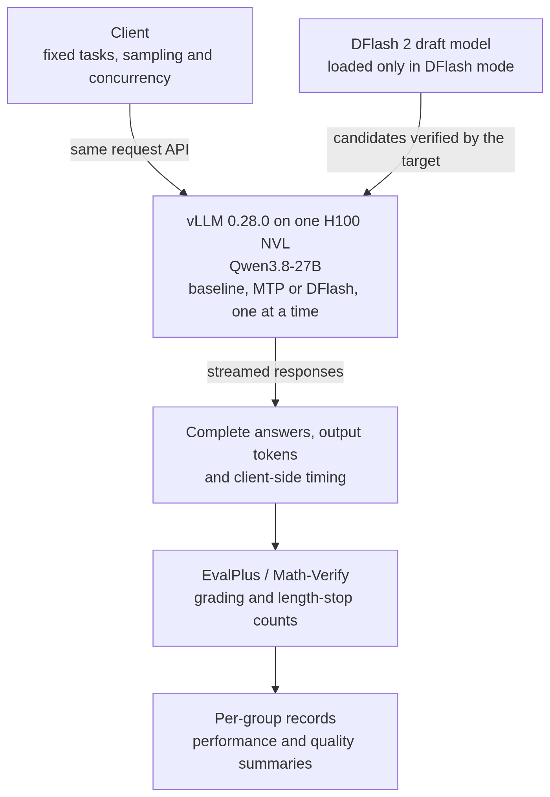

# Speculative Decoding: MTP and DFlash 2 Measurements on Qwen3.8-27B

[](https://github.com/vllm-project/vllm/releases/tag/v0.28.0)
[](#test-method)
[](#test-method)
[](#coverage-and-unexecuted-work)
[](https://github.com/david-xinyuwei/david-share/actions/workflows/speculative-decoding-ci.yml)

Use this repository to compare native MTP and DFlash 2 when deploying Qwen3.8-27B on vLLM. It provides weight downloads, all three server modes, client request settings and result checks. Use throughput, latency and answer quality together when selecting a route, rather than switching based only on output tokens per second.

On one H100 NVL, the same 32 code and 32 math tasks ran at concurrency 1, 4 and 8 with three seeds each. DFlash 2 exceeded MTP7 in output throughput across all nine matched pairs. Scores were broadly close, but at concurrency 4 in the third run, DFlash 2 answered **29/32** code tasks correctly versus **31/32** for MTP7, and took longer to finish that group. **The throughput advantage was observed; non-decreasing accuracy was not established.**

This is an author-run vLLM deployment test, not a full reproduction of the DFlash paper, and not a production acceptance result. The full-dataset phase was not executed. The earlier Qwen3.6 experiment is reported separately below and is not pooled with this run.

> Author: Xinyu Wei (魏新宇)

[English](README.md) | [中文](README_CN.md)

[Start Here](#start-here) · [Results](#throughput-and-answer-quality) · [Method](#test-method) · [How to Run](#how-to-run) · [Coverage](#coverage-and-unexecuted-work) · [Tests](#tests-and-offline-replay)

Run date: 2026-09-06. Run ID: `qwen38-quality-20260906`.

---

## Start Here

| Goal | Read |
|---|---|
| What this repository can do for me | [What you can do with this repository](#what-you-can-do-with-this-repository) |
| How much faster DFlash 2 is than MTP, and whether answers changed | [What the current run shows](#what-the-current-run-shows), [Throughput and answer quality](#throughput-and-answer-quality) |
| How the client, inference service and graders connect | [Architecture and test flow](#architecture-and-test-flow) |
| Download weights, start baseline/MTP/DFlash and configure the client | [How to Run](#how-to-run) |
| What was tested and what was not | [Test method](#test-method), [Coverage and unexecuted work](#coverage-and-unexecuted-work) |
| Check report numbers against saved records | [Tests and offline replay](#tests-and-offline-replay) |
| Understand the drafting difference | [How MTP and DFlash differ](#how-mtp-and-dflash-differ) |
| Inspect the first-generation DFlash concurrency failure | [Previous experiment](#previous-experiment) |
| Judge whether a drafter applies to your own model | [Applicability and fine-tuned models](#applicability-and-fine-tuned-models) |
| See what happens to the drafter after fine-tuning, and whether retraining it helps | [Adapting the drafter to a fine-tuned target](#adapting-the-drafter-to-a-fine-tuned-target) |
| Judge what training a drafter from scratch would need | [What training from scratch would take](#what-training-from-scratch-would-take) |

## What You Can Do With This Repository

| Goal | Provided assets | Practical benefit |
|---|---|---|
| Start all three inference routes | Pinned weights, complete launch commands and identical request examples | Avoid assembling MTP, DFlash and client settings from scratch |
| Select a route for further evaluation | Throughput, latency, correct counts and length stops on the same tasks | Compare speed and quality together, including cases where faster tokens do not deliver correct answers sooner |
| Check the selection evidence | Per-group records, grader integration, analysis and tests | Trace the reported numbers and design acceptance tests for your own workload |

This is a deployment reference and test evidence, not a production-validated hosted service. Preparation and scheduling for the full 27-group experiment do not yet have a standalone public entry point; see [reproduction scope](#reproduction-scope).

The contribution of this repository is the controlled comparison, measurement code and traceable evidence. MTP, DFlash and the released model checkpoints are upstream work. Running an upstream drafter successfully does not demonstrate from-scratch draft training or show that adaptation improves serving performance; the [adaptation experiment](#adapting-the-drafter-to-a-fine-tuned-target) measures the second question directly under two drift regimes.

## What the Current Run Shows

| Question | Observation |
|---|---|
| Was output throughput higher? | Yes. DFlash 2 exceeded MTP7 in all nine matched concurrency/seed pairs |
| Was non-decreasing accuracy proved? | No. Each dataset has 32 distinct tasks; three repeats measure variation, not 96 independent tasks |
| Were correct answers always delivered faster? | No. At concurrency 4 in the third run, DFlash 2 took longer for the same group and delivered fewer normal-stop-correct answers per second than MTP7 |
| Was the planned full dataset tested? | No. There were 1,920 completed responses out of 5,904 planned; the remaining 3,984 were not executed and are not counted as incorrect |

A throughput advantage does not replace accuracy, latency and error-rate acceptance on customer workloads.

## Architecture and Test Flow

The client and inference service share one host and communicate over loopback. Only one server mode runs at a time: baseline, MTP or DFlash. Switching modes keeps the client API unchanged. Client-side timing and grading of complete answers are separate from model inference.



*Original test-flow diagram based on the executed [runner](experiments/20260906-qwen38/source/campaign_runner.py), [stream timing](experiments/20260906-qwen38/source/stream_metrics.py) and [grader integration](experiments/20260906-qwen38/source/scoring.py); source in [test-flow-en.mmd](experiments/20260906-qwen38/images/test-flow-en.mmd). It separates inference, client measurements and grading; the three server modes do not run simultaneously.*

## How MTP and DFlash Differ

Speculative decoding uses a smaller draft model to propose candidates, then asks the target model to verify them. The target still controls which tokens enter the output.

| Aspect | MTP7 in this run | DFlash 2-7 in this run |
|---|---|---|
| Draft weights | MTP weights shipped in the Qwen3.8 checkpoint | A DFlash 2 checkpoint trained for the target |
| Candidate production | Sequential draft steps in the tested vLLM path | Block diffusion to draft a block in parallel |
| Candidates per cycle | 7 tokens | 7 tokens |
| Verification | The same Qwen3.8 target model | The same Qwen3.8 target model |

Seven is a candidate count, not network depth. One forward pass still traverses the draft model's layers. Whether MTP weights are published separately depends on the model; this run's packaging is not a universal definition of MTP.

The benefit depends on drafting and verification time per cycle, and how many tokens that cycle actually advances. More candidates need not be faster; acceptance rate is not answer accuracy. Algorithmic distribution guarantees also require a correct engine implementation and do not replace deployment quality tests.

See the [DFlash paper](https://arxiv.org/abs/2602.06036) and [pinned vLLM source](https://github.com/vllm-project/vllm/tree/2cf0a6915ce544dc493a0990f2ea38d81601128a) for mechanism context, and the [recorded configuration](experiments/20260906-qwen38/evidence/configuration.json) for this run's settings.

## Throughput and Answer Quality

Three routes used the same 32 HumanEval+ code tasks and 32 MATH-500 tasks at concurrency 1, 4 and 8, with three seeds each: 27 groups. **Repeating 32 tasks three times does not create 96 independent tasks per dataset.**

The baseline has no speculation; MTP7 and DFlash 2-7 each use seven draft tokens. Throughput and group wall time are separately summarized by their three-run medians. Triples in the score and length-stop tables are ordered by seed **20260906, 20260907, 20260908**. Each score is out of 32.


*Figure 1. Author's measurements. Bars show medians of three runs; whiskers show observed minima and maxima, not confidence intervals. The same 64 tasks are used throughout; throughput includes thinking tokens. Source: [group records](experiments/20260906-qwen38/data/groups.json).*

<!-- BEGIN RESULT_TABLE -->
### Throughput and Group Duration

| Concurrency | Route | Output tok/s | Group wall (s) |
| --- | --- | --- | --- |
| 1 | Baseline | 53.40 | 3458.61 |
| 1 | MTP7 | 113.34 | 1591.09 |
| 1 | DFlash 2-7 | 150.51 | 1149.41 |
| 4 | Baseline | 190.08 | 1037.22 |
| 4 | MTP7 | 382.85 | 470.35 |
| 4 | DFlash 2-7 | 451.74 | 377.79 |
| 8 | Baseline | 287.72 | 577.44 |
| 8 | MTP7 | 565.24 | 308.08 |
| 8 | DFlash 2-7 | 741.07 | 249.68 |

### Code and Math Scores

| Concurrency | Route | Code correct /32 | Math correct /32 |
| --- | --- | --- | --- |
| 1 | Baseline | 29, 31, 30 | 30, 30, 30 |
| 1 | MTP7 | 30, 31, 31 | 30, 28, 31 |
| 1 | DFlash 2-7 | 30, 31, 30 | 29, 32, 30 |
| 4 | Baseline | 31, 31, 31 | 30, 31, 30 |
| 4 | MTP7 | 30, 30, 31 | 29, 29, 29 |
| 4 | DFlash 2-7 | 31, 31, 29 | 31, 31, 30 |
| 8 | Baseline | 31, 31, 31 | 30, 29, 30 |
| 8 | MTP7 | 31, 31, 30 | 29, 29, 30 |
| 8 | DFlash 2-7 | 31, 31, 30 | 30, 31, 30 |

All answers marked correct by the graders stopped normally in this run, so raw-correct and normal-stop-correct counts coincide. Both fields remain in the data; duplicate columns are omitted here.

### Length Stops Across the Three Runs

| Concurrency | Route | Code length stops | Math length stops |
| --- | --- | --- | --- |
| 1 | Baseline | 1, 1, 2 | 2, 1, 2 |
| 1 | MTP7 | 2, 1, 1 | 1, 2, 1 |
| 1 | DFlash 2-7 | 2, 1, 2 | 2, 0, 1 |
| 4 | Baseline | 1, 1, 1 | 1, 0, 2 |
| 4 | MTP7 | 2, 2, 1 | 2, 1, 2 |
| 4 | DFlash 2-7 | 1, 1, 3 | 1, 1, 1 |
| 8 | Baseline | 1, 1, 1 | 2, 2, 2 |
| 8 | MTP7 | 1, 1, 2 | 2, 1, 1 |
| 8 | DFlash 2-7 | 1, 1, 2 | 2, 1, 2 |

Length-stopped responses remain in each 32-task denominator.
<!-- END RESULT_TABLE -->

These tables correspond to the [saved summary](experiments/20260906-qwen38/data/summary.json). Throughput is server-confirmed output tokens divided by entire-group wall time, **including thinking, incorrect and length-stopped responses**. Timing runs from the first measured request dispatch to the last request's terminal event; it excludes model download, startup, warmup and grading. This is not raw GPU decode throughput.

### Why Correct-Answer Delivery Also Matters

<!-- BEGIN COUNTEREXAMPLE -->
**Observed counterexample: concurrency 4, seed 20260908. This table uses that individual run, not the three-run medians above.**

| Route | This run's group wall (s) | Normal-correct code /32 | Normal-correct math /32 |
| --- | --- | --- | --- |
| MTP7 | 450.87 | 31 | 29 |
| DFlash 2-7 | 484.07 | 29 | 30 |

DFlash 2 has 3 length-stopped code responses. Using each dataset's `normal_correct / entire group wall time`, the DFlash/MTP normal-correct answer-rate ratios are **0.8713 for code** and **0.9635 for math**. Both are below 1 despite the higher DFlash token rate in this run. This is not a causal diagnosis or evidence that every performance metric improved.
<!-- END COUNTEREXAMPLE -->

## Client Latency

TTFT is the wait for the first output token; TPOT is the average delivery interval per output token after the first; response time runs from request dispatch to the terminal event. All three are observed at the client, and lower is better.

Each configuration first computes the P50 of each of its three runs, then takes the median of those three P50 values. **Responses are not pooled into one percentile.** Missing or undefined values are not filled with zero.

<!-- BEGIN LATENCY_TABLE -->
### Time to First Token (ms)

| Concurrency | Baseline | MTP7 | DFlash 2-7 |
| --- | --- | --- | --- |
| 1 | 82.727 | 75.127 | 80.286 |
| 4 | 104.008 | 110.259 | 115.994 |
| 8 | 106.598 | 124.699 | 124.781 |

### Time per Output Token (ms/token)

| Concurrency | Baseline | MTP7 | DFlash 2-7 |
| --- | --- | --- | --- |
| 1 | 18.567 | 8.011 | 5.875 |
| 4 | 20.104 | 8.549 | 6.739 |
| 8 | 20.845 | 10.041 | 7.892 |

### Response Time (s)

| Concurrency | Baseline | MTP7 | DFlash 2-7 |
| --- | --- | --- | --- |
| 1 | 16.359 | 6.236 | 6.185 |
| 4 | 19.035 | 8.661 | 5.237 |
| 8 | 18.457 | 9.915 | 7.742 |

Each metric in each configuration has 192 valid response observations and 0 missing observations. These are repeated responses, not independent tasks.
<!-- END LATENCY_TABLE -->

### Exact Latency Definitions

TTFT is timed from request dispatch to the first non-empty generated `token_ids` event; empty role or usage events do not count as the first token. TPOT is `(last_token_time - first_token_time) / (completion_tokens - 1)`, defined only when more than one token was produced and the token-ID coverage check passed.

A speculative-decoding SSE chunk can carry several tokens, so these are client-side receive metrics, not GPU kernel times. Definitions are in the [configuration](experiments/20260906-qwen38/evidence/configuration.json); observations are in the [group records](experiments/20260906-qwen38/data/groups.json).

## Test Method

The three routes keep the target model, precision, tasks, output budget and sampling fixed while switching speculative configuration. Settings come from the [saved configuration](experiments/20260906-qwen38/evidence/configuration.json); observed loading checks are in `activation` in the [run evidence](experiments/20260906-qwen38/evidence/run.json).

See [architecture and test flow](#architecture-and-test-flow) for the client, inference service and graders. Client and server share one host. Timing covers request dispatch through streamed response completion, excluding model startup and offline grading.

| Setting | This run |
|---|---|
| Hardware | One H100 NVL; tensor parallelism 1 |
| Target | Qwen3.8-27B, BF16 |
| MTP | Native weights in the target checkpoint; not separately trained or converted |
| DFlash 2 | incoai's Qwen3.8-27B-DFlash2, BF16 |
| Engine | vLLM 0.28.0; Model Runner V2 observed loading |
| Candidates | Baseline: 0; MTP7 and DFlash 2-7: 7 each |
| Output budget | At most 16,384 tokens per task, including thinking |
| Thinking | Enabled and preserved; `reasoning_effort="xhigh"` |
| Sampling | temperature 1.0, top_p 0.95, top_k 20 |
| Pairing | Concurrency 1, 4, 8; seeds 20260906, 20260907, 20260908 |

The 32 task IDs per dataset were selected by a frozen SHA-256 ordering rule, independently of answers and scores. Routes share per-task seeds, which does not imply aligned random draws at every token. Code was graded by the official EvalPlus tools; math by the official Math-Verify tool.

### Pinned Versions, Full Parameters and Request Examples

These links identify the actual versions used, not current model repository heads:

| Component | Pinned record |
|---|---|
| Target | [Qwen3.8-27B checkpoint](https://huggingface.co/Qwen/Qwen3.8-27B/tree/1d4bf0f2ff6012fd82039f2fa52739d0dd7c60c0) |
| DFlash 2 | [Qwen3.8-27B-DFlash2 checkpoint](https://huggingface.co/incoai/Qwen3.8-27B-DFlash2/tree/dedf8df68adfb1afeaf7b7480c0a0243108177b4), architecture `DFlash2DraftModel` |
| vLLM | [0.28.0 source](https://github.com/vllm-project/vllm/tree/2cf0a6915ce544dc493a0990f2ea38d81601128a) |
| EvalPlus | [Pinned source](https://github.com/evalplus/evalplus/tree/26d6d00bb1fd0fa37f39c99d5290da67891d1c5e), official sanitize/evaluate CLI |
| Math-Verify | [Pinned source](https://github.com/huggingface/Math-Verify/tree/ba3d3aaff23b3f4cac7a14672b4f6e293d97c98b), official `evaluate_model_outputs.py` |

Remaining settings: `min_p=0.0`, `presence_penalty=0.0`, `repetition_penalty=1.0`. The template sets `enable_thinking=true` and `preserve_thinking=true`. Scheduling limits are `max_model_len=32768`, `max_num_seqs=16`, `max_num_batched_tokens=16384`.

Client and server run on the same machine, with closed-loop fixed-concurrency dispatch over loopback in the frozen request order. Equal client concurrency does not imply identical GPU batch shapes. Archived route labels are `baseline`, `mtp7`, `dflash2_7`; the base configuration seed is 20260906.

[Request examples](experiments/20260906-qwen38/evidence/request-examples.json) retain prompts, full payloads and hashes for `HumanEval/69` and `MATH-500/100` from the first baseline group. `raw_correct` records official correct verdicts; `normal_correct` also requires `finish_reason=stop`. They happen to agree in this S stage. Offline analysis uses saved grades and does not regrade answers.

## How to Run

### 1. Distinguish Target And Draft Weights

The roughly 3.8 GB file is the **DFlash 2 draft model, not the complete Qwen3.8-27B target or its MTP weights**. Do not pass it as `--model` with `method=mtp`. All three routes load the complete target checkpoint:

| Route | Target | Speculative configuration |
|---|---|---|
| Baseline | Qwen3.8-27B | Omit `--speculative-config` |
| MTP7 | Same target checkpoint, using its native MTP weights | `method="mtp"`, without a separate draft model |
| DFlash 2-7 | Same target plus the matched DFlash 2 draft | `method="dflash"`, with `model` pointing to the draft directory |

The archive records 18 target `.safetensors` files totaling 55,563,006,776 bytes (about 55.56 GB), and one draft weight file of 3,848,817,896 bytes (about 3.85 GB / 3.58 GiB). These are disk weight sizes, not total inference VRAM. **DFlash 2 is the checkpoint name; this vLLM version still uses `dflash`, not `dflash2` or `draft_model`, as the method.**

The commands use Linux x86_64, Bash and Python 3.12. The measured hardware was one H100 NVL, with a CUDA-13-compatible NVIDIA driver and enough VRAM for target, draft, KV cache and workspace. Capacity and numerical behavior on other GPUs need separate validation.

### 2. Prepare Pinned Versions

Run every command below from `Deep-Learning/Speculative-Decoding` in this repository. Create the environment only for a first installation; activate an existing verified environment with the same versions instead of rebuilding it. Downloads require tens of GB of disk space.

```bash
python3 -m venv "$HOME/.venvs/qwen38-specdec"
source "$HOME/.venvs/qwen38-specdec/bin/activate"
python -m pip install 'vllm==0.28.0' 'torch==2.13.0' 'transformers==5.16.1'
python -m pip check

export MODEL_ROOT="$HOME/models/qwen38"
hf download Qwen/Qwen3.8-27B \
	--revision 1d4bf0f2ff6012fd82039f2fa52739d0dd7c60c0 \
	--local-dir "$MODEL_ROOT/target"
hf download incoai/Qwen3.8-27B-DFlash2 \
	--revision dedf8df68adfb1afeaf7b7480c0a0243108177b4 \
	--local-dir "$MODEL_ROOT/draft"
```

The directories must contain configuration, all weight shards and the target tokenizer, not a single shard alone. Key package versions come from the recorded installation; future resolution of all transitive dependencies is not guaranteed to reproduce identical environment bytes.

### 3. Set Shared Server Parameters

Run once in the server terminal. All routes use this Bash array. Keep `dflash` out of the target's local path to avoid confusing path-based model identification with its actual role. Each launch writes logs to a separate directory under `$HOME/specdec-runs/`, preserving previous results.

```bash
set -euo pipefail
export VLLM_USE_V2_MODEL_RUNNER=1
export HF_HUB_OFFLINE=1 TRANSFORMERS_OFFLINE=1
export RUN_DIR="$HOME/specdec-runs/$(date -u +%Y%m%dT%H%M%SZ)"
mkdir -p "$RUN_DIR"

COMMON=(
	--model "$MODEL_ROOT/target"
	--served-model-name Qwen/Qwen3.8-27B
	--dtype bfloat16 --tensor-parallel-size 1
	--max-model-len 32768
	--max-num-seqs 16 --max-num-batched-tokens 16384
	--gpu-memory-utilization 0.9
	--no-enable-prefix-caching --kv-cache-dtype auto
	--attention-backend FLASH_ATTN --mamba-ssm-cache-dtype float32
	--reasoning-parser qwen3 --stream-interval 1
	--generation-config vllm --seed 20260906
	--limit-mm-per-prompt '{"image":0,"video":0,"audio":0}'
	--host 127.0.0.1 --port 18080
)
```

The target and KV cache use BF16, while the Mamba SSM cache is fixed to FP32. `max-num-seqs=16` is the server scheduler limit, not a requirement to send 16 concurrent client requests. `generation-config=vllm` prevents model-directory generation defaults from replacing explicit experiment settings.

### 4. Start One Route

**Run only one route on this GPU and port at a time.** Finish a route, press `Ctrl+C` in its server terminal and use `nvidia-smi` to confirm that service has exited before starting the next one.

Baseline without speculation:

```bash
python -I -B -m vllm.entrypoints.openai.api_server "${COMMON[@]}" \
	2>&1 | tee "$RUN_DIR/baseline-server.log"
```

MTP7 using weights in the target checkpoint:

```bash
python -I -B -m vllm.entrypoints.openai.api_server "${COMMON[@]}" \
	--speculative-config '{"method":"mtp","num_speculative_tokens":7,"rejection_sample_method":"standard"}' \
	2>&1 | tee "$RUN_DIR/mtp7-server.log"
```

DFlash 2-7 with its additional draft checkpoint:

```bash
python -I -B -m vllm.entrypoints.openai.api_server "${COMMON[@]}" \
	--speculative-config "{\"method\":\"dflash\",\"model\":\"$MODEL_ROOT/draft\",\"num_speculative_tokens\":7,\"rejection_sample_method\":\"standard\"}" \
	2>&1 | tee "$RUN_DIR/dflash2_7-server.log"
```

In another terminal on the same host, check that `curl --fail http://127.0.0.1:18080/v1/models` returns `Qwen/Qwen3.8-27B`. Also inspect the startup log for the actual mode, V2 runner and precision; DFlash must load `DFlash2DraftModel`. Readiness proves loading only; send the real request below next.

### 5. Configure Client Requests And Sampling

The client always calls the same `/v1/chat/completions` endpoint and `model` name. **MTP/DFlash selection is server-side, not a client switch.** There is no Web search or RAG in this experiment. Client settings mean sampling, thinking, output budget and request concurrency. `top_k=20` controls output sampling, not the server's seven draft tokens per cycle.

| Client setting | Recorded value |
|---|---|
| Sampling | `temperature=1.0`, `top_p=0.95`, `top_k=20`, `min_p=0.0` |
| Penalties | `presence_penalty=0.0`, `repetition_penalty=1.0` |
| Thinking | `reasoning_effort="xhigh"`; template enables and preserves thinking |
| Output limit | `max_completion_tokens=16384`, including thinking |
| Stream accounting | `stream=true`, `include_usage=true`, `return_token_ids=true`, `include_reasoning=true`, `stream_interval=1` |
| Client concurrency | The measured subset uses 1, 4 and 8; base seeds 20260906, 20260907 and 20260908 |

The actual per-task seed is `int(SHA256(f"{base_seed}|{task_id}")[:8], 16) % 2147483647`, not the base seed copied to every task. [Request examples](experiments/20260906-qwen38/evidence/request-examples.json) contain the full recorded JSON. Send one directly without reconstructing its prompt or parameters.

In the client terminal, enter the same `Deep-Learning/Speculative-Decoding` directory and activate the same Python environment, then run:

```bash
set -euo pipefail
source "$HOME/.venvs/qwen38-specdec/bin/activate"
CLIENT_RUN="$HOME/specdec-runs/client-$(date -u +%Y%m%dT%H%M%SZ)"
mkdir -p "$CLIENT_RUN"
python -c 'import json; from pathlib import Path; samples=json.loads(Path("experiments/20260906-qwen38/evidence/request-examples.json").read_text(encoding="utf-8")); print(json.dumps(samples[0]["request"], ensure_ascii=False))' \
	> "$CLIENT_RUN/request.json"
curl --fail-with-body --no-buffer --connect-timeout 10 --max-time 600 \
	http://127.0.0.1:18080/v1/chat/completions \
	-H 'Content-Type: application/json' \
	--data-binary @"$CLIENT_RUN/request.json" \
	| tee "$CLIENT_RUN/response.sse"
```

`samples[0]` is the code task; use `samples[1]` for the math task. Inspect the complete SSE for generated `token_ids`, final `usage`, `finish_reason` and `[DONE]`. A `length` finish reason means the output limit was reached, not a normally completed answer. Use the same request JSON on all three routes. The curl timeout and recording here are for request reproduction only, not the performance measurement in the tables above.

### Reproduction Scope

Commands are transcribed from the recorded installation, actual launch arguments and `server_command` in the [measurement source](experiments/20260906-qwen38/source/campaign_runner.py), with local paths replaced by environment variables. **Their scope is starting the three server modes and sending a request, not running the full performance and quality evaluation.** A new installation still needs model-loading and request checks; existing scores are not acceptance results for that environment.

Reproducing the score table additionally requires the same 64 tasks, 27 groups, frozen ordering, closed-loop concurrency, original measurement logic and EvalPlus/Math-Verify grading. The full preparation steps, task inputs and scheduling configuration required by `campaign_runner.py` are not yet packaged as a standalone public entry point, so the settings on this page cannot be passed directly to `--stage all`. Available files provide startup/request guidance and offline replay, not a standalone installer for the full 27-group experiment. Official method references: [MTP](https://github.com/vllm-project/vllm/blob/v0.28.0/docs/features/speculative_decoding/mtp.md), [pinned speculative configuration source](https://github.com/vllm-project/vllm/blob/2cf0a6915ce544dc493a0990f2ea38d81601128a/vllm/config/speculative.py).

## Coverage and Unexecuted Work

The original plan has four stages. Performance and score tables in this report use only S. Compatibility and greedy diagnostics are not pooled into the formal subset comparison.

| Stage | Completed groups | Responses | Status |
|---|---:|---:|---|
| C: compatibility | 6 | 48 | Complete |
| G: greedy diagnostics | 36 | 144 | Complete |
| S: repeated subset | 27 | 1,728 | Complete |
| F: full datasets | 0 | 0 | Not run |

Totals are **69/81 groups and 1,920/5,904 responses**. The remaining 12 groups and 3,984 responses were not executed: neither removed from the plan nor marked incorrect. These results cover the completed work, not a pass for the entire plan.

F would run all three routes at concurrency 1 and 8 over all 164 HumanEval+ and 500 MATH-500 tasks, once per task, with seed 20260906. This stage was not executed. The measured subset is not a full-dataset score; the [coverage record](experiments/20260906-qwen38/evidence/run.json) preserves the original plan and unexecuted items.

### Measured Duration by Stage

| Stage | Sum of group wall times (s) |
|---|---:|
| Compatibility (C) | 928.51 |
| Greedy diagnostics (G) | 387.09 |
| Repeated subset (S) | 27,800.41 |
| Full datasets (F) | 0, not run |

These sum measured group times from request dispatch to response completion, excluding model downloads, server startup, warmup and grading. Values are rounded to two decimals; exact values remain in [run evidence](experiments/20260906-qwen38/evidence/run.json). Complete describes execution, not perfect correctness.

## Applicability and Fine-Tuned Models

**Does modifying the target require retraining its drafter? Not automatically.** The published checkpoint used here is `incoai/Qwen3.8-27B-DFlash2`, intended for `Qwen/Qwen3.8-27B`. Reuse with another target needs compatible architecture, tokenizer, hidden features and output head, followed by workload-specific evaluation. A shared family name does not establish compatibility; fine-tuning alone does not establish incompatibility.

Native MTP likewise needs compatible model architecture, MTP weights and engine support. Enabling a serving flag is not a method for creating missing MTP weights.

**DFlash: Block Diffusion for Flash Speculative Decoding** uses a small block-diffusion model to draft several tokens in parallel, conditioned on the target's hidden features. For adaptation, the teacher is the exact target that will serve requests, including any adapter. The starting student is an existing draft checkpoint. Prompts come from the intended workload; the teacher generates responses, and its parameters remain frozen while the draft parameters are updated. This is continuation training, not training a drafter from scratch.

The following describes the [DFlash paper, Sections 4.2 and A.1](https://arxiv.org/html/2602.06036v2#S4.SS2), not a reproduction of the complete DFlash 2 training recipe.

- **Training responses:** The paper uses about 800K samples from Nemotron Post-Training V2 and CodeAlpaca, with target-generated responses. That is its experimental scale, not a demonstrated minimum for every adaptation.
- **Conditioning:** Hidden states from five target layers, sampled between the second and the third-to-last layer, are concatenated, projected once, and injected into the key and value entries of every draft layer.
- **Block construction:** Anchor tokens are sampled at random from the response; the remaining positions of each block are masked and predicted in parallel.
- **Loss:** Cross-entropy is weighted by `exp(-(k-1)/gamma)` over the position `k` inside a block, because an error early in a block invalidates every later position.
- **Shared parameters:** The target, its token embedding and its language-model head remain frozen; training updates the draft model rather than the target.

Fine-tuning can change the target's features and token predictions. Which parameters change depends on the tuning recipe; an adapter does not necessarily update the embedding or output-head weights. These dependencies motivate a comparison, not a conclusion that the released drafter must fail or that adaptation must improve it.

**Measure three different outcomes.** Draft-token agreement measures how well the draft predicts the target; answer quality measures whether the final response solves the task; throughput and latency measure the actual service. A lower training loss or higher draft agreement cannot substitute for graded answers and faster serving. Speculative decoding's theoretical output-distribution guarantee assumes a correct verification and sampling implementation. It is not evidence that a particular engine, precision or cache path preserves answers.

The paper provides one adaptation example: [Section 5.4, Table 4](https://arxiv.org/html/2602.06036v2#S5.SS4) adapts a Qwen3.5-27B DFlash drafter using 1.6K LongAlign-10K samples for three epochs. On HotpotQA at 16K context, acceptance length changes from 3.61 to 6.05. This is the authors' long-context result, not this repository's Qwen3.8-27B fine-tuned-target result or a general time/cost guarantee.

| Situation | What to establish before adoption |
|---|---|
| Target with an intended released drafter | Compare no speculation and the released drafter under the same workload, concurrency and output-quality criteria |
| Fine-tuned target with a compatible released drafter | Test the released drafter first. If adapting it, compare both draft checkpoints against the same frozen target; save and reload the adapted checkpoint before evaluation |
| No compatible draft checkpoint | Treat training a new drafter as a separate project. An existing-checkpoint adaptation result does not demonstrate from-scratch training capability |

**The published evidence in this repository covers the inference experiments above, not a validated drafter-training recipe.** Do not use these results to claim improved adaptation, universal compatibility, or that customers never need to retrain. The [How to Run](#how-to-run) commands exercise the published inference configurations; the [offline tests](#tests-and-offline-replay) check saved evidence and are not a live training or quality certification. The next section measures the question directly.

## Adapting the Drafter to a Fine-Tuned Target

The question a deployment team actually asks is: **after I fine-tune Qwen3.8-27B, does the released DFlash 2 drafter still work, and does retraining it help?** This experiment answers it under two drift regimes on one H100 NVL, using the same released checkpoints as the run above. Run dates: 2026-09-09 (Regime A) and 2026-09-10 (Regime B). Full files are in [`experiments/20260909-drafter-adaptation/`](experiments/20260909-drafter-adaptation/).

**Setup.** The target is `Qwen/Qwen3.8-27B` (revision `1d4bf0f2`) with a LoRA adapter trained on [medical-o1-reasoning-SFT](https://huggingface.co/datasets/FreedomIntelligence/medical-o1-reasoning-SFT) (Apache-2.0): Regime A uses the English split, rank 16, attention projections only, one epoch; Regime B uses the Chinese split, rank 128, all seven projection modules, two epochs. The adapted drafter starts from `incoai/Qwen3.8-27B-DFlash2` (revision `dedf8df6`) and is trained for two epochs on 1,200 responses that the fine-tuned target itself generated for held-in prompts, updating the five draft layers and the DFlash 2 candidate selector while the target, its embedding and its output head stay frozen. This is **continuation training of a released checkpoint**, not training a drafter from scratch. The selector objective is the author's construction; the DFlash 2 publisher has not released selector training code.

**Three separate measurements.** Draft agreement asks both drafters the same question on the same frozen target text: given the target's own response, which next tokens would you draft? *First-offset hit rate* is the share of blocks whose first drafted token matches; *joint-prefix acceptance length* is one plus the mean number of leading positions that are all correct, the teacher-forced analogue of what verification accepts. Anchors sit on a fixed grid of every eighth completion token, whereas a running decoder re-anchors wherever the last block was cut, so the two quantities are related but not identical. Because both drafters read identical text, prompt-level bootstrap intervals on the difference are meaningful. End-to-end acceptance lets each drafter really draft; the texts then differ, so those numbers are observations, not paired tests. vLLM throughput is the serving result a customer sees, and the vLLM server's own accepted/drafted counters give a second, engine-side acceptance length. None of these grades answers.

<!-- BEGIN ADAPTATION_TABLE -->
| Measurement | Regime A: small drift (English, LoRA r16 attention-only) | Regime B: large drift (Chinese, LoRA r128 all modules) |
| --- | --- | --- |
| Released drafter first-offset hit rate on the fine-tuned target (same target text) | 0.857 (193 of 200 prompts evaluable) | 0.677 (was 0.720 on the base target; 200 prompts) |
| Adapted drafter first-offset hit rate, paired difference vs released (95% interval) | seed 20260908: 0.848 (-0.019, +0.002); seed 1: 0.845 (-0.024, +0.000); seed 2: 0.840 (-0.029, -0.005) | 0.707 (+0.015, +0.044) |
| Joint-prefix acceptance length: released → adapted (95% interval) | seed 20260908: 4.33 → 4.33 (-0.056, +0.069); seed 1: 4.33 → 4.35 (-0.044, +0.088); seed 2: 4.33 → 4.35 (-0.042, +0.095) | 2.85 → 3.08 (+0.163, +0.295); released drafter on the base target: 3.24 (different text, no interval) |
| vLLM server-logged acceptance length: released / adapted | 4.19 / 4.06 | 2.39 / 2.61 |
| vLLM 0.28.0 throughput (tok/s), concurrency 1: no speculation / released / adapted | 53.5 / 162.2 / 158.0 | 53.6 / 97.1 / 106.0 |
| vLLM 0.28.0 throughput (tok/s), concurrency 4: no speculation / released / adapted | 184.7 / 490.0 / 485.3 | 194.5 / 323.6 / 349.4 |
| Reading | Adaptation shows no measurable gain; the released drafter already serves this fine-tuned target at about 3×. No base-target measurement exists on these prompts, so whether the released drafter lost anything is not established | Released drafter hit rate is below its base-target level; adaptation recovers part of it, and server-side acceptance and throughput rise together |

Paired differences use a 2,000-resample prompt-level bootstrap; a direction is claimed only when the interval excludes 0; the five intervals carry no multiple-comparison correction. Each vLLM route ran once on 40 Chinese or 40 English prompts with `max_tokens=256`; no significance claim. Server-logged acceptance length is derived from the server's cumulative accepted/drafted counts and covers every request including warmup. Answer quality was not graded.
<!-- END ADAPTATION_TABLE -->

**What the two regimes show.** With light attention-only LoRA (Regime A), the released drafter reaches a first-offset hit rate of 0.857 on the fine-tuned target and the adapted drafter is not better on any of three training seeds; vLLM throughput of the two drafters is within 3% at both concurrencies, and the released drafter alone gives about 3× over no speculation. No measurement of the released drafter on the *base* target exists for these English prompts, so this regime shows that adaptation has nothing to add, not that fine-tuning left the drafter untouched. With heavy all-module LoRA on Chinese data (Regime B), the released drafter's hit rate is 0.677 on the fine-tuned target against 0.720 on the base target, and its joint-prefix acceptance length 2.85 against 3.24. That base-to-fine-tuned comparison is across different generated texts and carries no interval: the base target's answers average 252 tokens and 39 of 40 hit the 256-token cap, the fine-tuned target's average 119, and the base texts are more repetitive at the token level (0.054 versus 0.021 repeated 4-grams), which makes them easier to draft. Adaptation, measured on identical text, raises the released drafter's 0.677 and 2.85 to 0.707 and 3.08 with intervals that exclude zero. The vLLM server's own counters agree: acceptance length 2.39 for the released drafter and 2.61 for the adapted one over all requests it served, and client throughput rises from 97 to 106 tok/s at concurrency 1 and from 324 to 349 tok/s at concurrency 4.

**A contradicting measurement is kept.** In Regime B the Hugging Face reference path (`dflash_generate`, 40 prompts, one run) gave an end-to-end acceptance length of 3.12 for the released drafter and 2.91 for the adapted one, the opposite direction from the paired agreement, the vLLM server counters and the vLLM throughput. The two drafters produced byte-identical completions on 0 of 40 prompts, so this is a single-execution comparison on different texts with a small denominator; it is reported, not explained away. A second open question sits beside it: for the same drafter and target, the reference path reports acceptance lengths around 3.1 while vLLM's counters report around 2.4 to 2.6. The two engines were not compared under identical batching, precision or cache paths, and the gap has not been investigated.

**Boundaries.** One target family, one dataset family, one adapter recipe per regime, one GPU. Regime A and Regime B differ in language as well as adapter strength, so the two columns are two settings, not two points on one drift axis. The drift regimes were chosen by the author; they are not calibrated thresholds for when retraining is needed. Regime B's fine-tuned target failed the author's token-level repetition screen (11 of 40 prompts repeated a 4-gram at least three times; the screen's limit was 2), and the pipeline stopped there as designed; the author resumed it after finding that the base target fails the same screen more severely (38 of 40 prompts on repetition, 39 of 40 on length stops). The screen therefore does not discriminate for Chinese token-level text, and neither target's answer quality has been graded. Five paired intervals are reported without multiple-comparison correction; the Chinese intervals are far from zero, the English ones are not. The 200 held-out prompts for each language and the split manifests are published under [`inputs/`](experiments/20260909-drafter-adaptation/inputs/) and hash-checked against the run records; the dataset revision was not pinned at download time, so a fresh `prepare_domain_data.py` run must reproduce those hashes to be comparable. Round 3's agreement records stored only marginal per-offset rates and regenerated target text per run, so its differences are reported without intervals. Weights are not redistributed; their SHA-256 values are in [provenance.json](experiments/20260909-drafter-adaptation/evidence/provenance.json).

### What Training From Scratch Would Take

This repository has **not** trained a DFlash drafter from scratch. Everything above starts from the released checkpoint. The only random-initialization run was a CPU canary on a toy configuration (hidden size 128, vocabulary 512), using [`stage0_gradient_canary.py`](experiments/20260909-drafter-adaptation/source/round4/stage0_gradient_canary.py): 30 steps, loss 6.24 → 3.88 in the author's single run, whose log was not archived. It shows that gradients reach the draft layers, the fused target-feature projection and the norms while the frozen target receives none. It does not show that a real-size drafter converges, and it is not evidence of from-scratch capability.

The paper's recipe ([Section 5 and Appendix A.1](https://arxiv.org/html/2602.06036v2#A1.SS1)): about 800K prompts from Nemotron Post-Training V2 and CodeAlpaca with responses regenerated by the target; 6 epochs, AdamW at 6e-4, cosine schedule with 4% warmup, sequences up to 3,072 tokens, and 512 anchor positions per sequence trained jointly through one sparse attention mask. The paper's ablations use 100K samples and reach roughly three quarters of the full-data speedup (Qwen3-4B on MATH-500: 4.71× versus 6.09×). The paper names H200 GPUs but not the GPU count or training hours.

What the code in this repository lacks for that recipe, in order of cost:

1. `dflash` 0.1.0 constructs `GroupedDynamicCausalConv.base_kernel` with `torch.empty`. Built from a config instead of a checkpoint, the first forward pass is NaN. The canary initializes it as an identity tap; that fix has not been exercised at real size.
2. `train_drafter.py` processes 8 anchors per sequence, one block per forward pass. The paper's 512 anchors through one sparse-attention pass is about 64× more draft supervision per target forward. On this loop, paper-scale training would cost thousands of GPU-hours.
3. The DFlash 2 candidate-selector objective is the author's construction and has only run from released weights. A from-scratch pilot should target the paper's DFlash architecture without the selector, for which z-lab publishes reference checkpoints to compare against.
4. `generate_responses.py` uses Hugging Face `generate` at batch 8, about 70 output tokens per second on the 27B target. Paper-scale data needs a serving engine.
5. Single GPU only; no data-parallel training.

Order-of-magnitude estimates, extrapolated from the measured 0.61 s per training step and the vLLM throughput above, and assuming items 1–5 are done first:

| Run | Target | Data | GPUs | Time |
|---|---|---|---|---|
| Smallest defensible from-scratch pilot | Qwen3-8B, compared against z-lab's public DFlash checkpoint | 100K prompts, self-generated responses, 6 epochs | 1–2 H100-class | About half a day to one day of generation, then two to four days of training on one GPU |
| Paper scale | Qwen3-8B | 800K prompts, 6 epochs | About 8 | Three to four days |
| Paper scale | Qwen3.8-27B | 800K prompts, 6 epochs | At least 8, each with more than 94 GiB (the paper used H200) | About 1.5 days of generation on 4 GPUs, then about a week of training; one 94 GiB GPU already peaked at 86 GiB at sequence length 1,024 |

These are estimates, not measurements. The defensible statement today: the adaptation path is measured; the training objective is implemented and shown to raise paired draft agreement; from-scratch training at real size has not been demonstrated.

### Reproducing the Adaptation

The executed scripts are published as snapshots under [`source/`](experiments/20260909-drafter-adaptation/source/); the orchestration shells contained private host paths and are represented by their hashes and by the commands below. Requires one 80 GB-class GPU, Python 3.12, `torch==2.13.0`, `transformers==5.16.1`, `peft==0.20.0`, `dflash==0.1.0`, `datasets`, `huggingface_hub`, and `vllm==0.28.0` in a separate environment for the serving step. Peak training memory was 86 GiB with float32 drafter master weights.

```bash
set -euo pipefail
W="$HOME/drafter-adaptation"; mkdir -p "$W" && cd "$W"
SRC="<clone>/Deep-Learning/Speculative-Decoding/experiments/20260909-drafter-adaptation/source/round4"
python3.12 -m venv venv && . venv/bin/activate
pip install torch==2.13.0 transformers==5.16.1 peft==0.20.0 dflash==0.1.0 datasets huggingface_hub
hf download Qwen/Qwen3.8-27B --revision 1d4bf0f2ff6012fd82039f2fa52739d0dd7c60c0 --local-dir models/target
hf download incoai/Qwen3.8-27B-DFlash2 --revision dedf8df68adfb1afeaf7b7480c0a0243108177b4 --local-dir models/draft
cp "$SRC"/*.py .
# 1. Frozen split: 2,000 training questions, 200 held-out prompts (Regime B shown; use --config en --eval-size 200 for Regime A)
python prepare_domain_data.py --dataset FreedomIntelligence/medical-o1-reasoning-SFT --config zh \
  --question-field Question --response-field Response --instruction-field "" \
  --train-size 2000 --eval-size 200 --seed 20260909 --max-output-chars 1000000 --out-dir data_zh
# 2. Fine-tune the target (Regime B recipe; Regime A: --epochs 1 --lr 5e-5 --lora-rank 16 --lora-alpha 32 --target-modules attention)
python finetune_target.py --target models/target --data data_zh/train.jsonl --output out/adapter-zh \
  --epochs 2 --grad-accum 8 --max-length 1024 --lr 1e-4 --lora-rank 128 --lora-alpha 256 --target-modules all
# 3. Repetition screen on the fine-tuned target (heuristic; records a verdict, does not grade answers)
python check_degeneration.py --target models/target --adapter out/adapter-zh --prompts data_zh/eval_prompts.jsonl \
  --output results/degeneration_zh.json --label target_zh --limit 40 --max-new-tokens 256 --repetition-unit token || true
# 4. Released drafter on the fine-tuned target, teacher-forced on cached target text (the cache freezes the text for pairing)
python analyze_predictability.py --target models/target --adapter out/adapter-zh --prompts data_zh/eval_prompts.jsonl \
  --cache cache/ft_zh.pt --drafter models/draft --draft-path selector --output results/pred_released.json --label released
# 5. Self-generated corpus from the fine-tuned target, then continuation training of the released drafter
python generate_responses.py --target models/target --adapter out/adapter-zh --prompts data_zh/train.jsonl \
  --output data_zh/corpus.jsonl --limit 1200 --max-new-tokens 320 --batch-size 8
python train_drafter.py --target models/target --adapter out/adapter-zh --drafter models/draft \
  --data data_zh/corpus.jsonl --output out/drafter-zh --epochs 2 --limit 1200 --anchors-per-sequence 8 --block 8 \
  --max-length 1024 --lr 1e-4 --weight-decay 0.0 --warmup-fraction 0.05 --drafter-dtype float32 --train-selector
# 6. Adapted drafter on the same cached text, then end-to-end acceptance for both drafters
python analyze_predictability.py --target models/target --adapter out/adapter-zh --prompts data_zh/eval_prompts.jsonl \
  --cache cache/ft_zh.pt --drafter out/drafter-zh --draft-path selector --output results/pred_ours.json --label ours
python measure_acceptance.py --target models/target --adapter out/adapter-zh --prompts data_zh/eval_prompts.jsonl \
  --limit 40 --max-new-tokens 256 --drafter models/draft --output results/acc_released.json --label released
python measure_acceptance.py --target models/target --adapter out/adapter-zh --prompts data_zh/eval_prompts.jsonl \
  --limit 40 --max-new-tokens 256 --drafter out/drafter-zh --output results/acc_ours.json --label ours
# 7. Merge the adapter, export the adapted drafter in the released key layout, serve each route in vLLM and measure
python export_drafter_for_vllm.py --source out/drafter-zh --reference models/draft --output served/draft-zh
python - <<'PY'
import shutil, torch
from transformers import AutoModelForCausalLM, AutoTokenizer
from peft import PeftModel
model = AutoModelForCausalLM.from_pretrained("models/target", dtype=torch.bfloat16, device_map="cuda")
model = PeftModel.from_pretrained(model, "out/adapter-zh").merge_and_unload()
shutil.move("models/target", "served/target-zh")          # reuse the download directory; the merged shards overwrite it
model.save_pretrained("served/target-zh", safe_serialization=True, max_shard_size="5GB")
AutoTokenizer.from_pretrained("served/target-zh").save_pretrained("served/target-zh")
PY
ln -s ../models/draft served/draft-released
python3.12 -m venv venv-vllm && venv-vllm/bin/pip install vllm==0.28.0
# One server at a time; repeat with the two --speculative-config variants below, then run the client against each.
VLLM_USE_V2_MODEL_RUNNER=1 HF_HUB_OFFLINE=1 TRANSFORMERS_OFFLINE=1 venv-vllm/bin/python -m vllm.entrypoints.openai.api_server \
  --model served/target-zh --served-model-name Qwen/Qwen3.8-27B --dtype bfloat16 --tensor-parallel-size 1 \
  --max-model-len 8192 --max-num-seqs 16 --max-num-batched-tokens 16384 --gpu-memory-utilization 0.9 \
  --no-enable-prefix-caching --kv-cache-dtype auto --attention-backend FLASH_ATTN --mamba-ssm-cache-dtype float32 \
  --reasoning-parser qwen3 --generation-config vllm --seed 20260909 --limit-mm-per-prompt '{"image":0,"video":0,"audio":0}' \
  --host 127.0.0.1 --port 18080 \
  --speculative-config '{"method":"dflash","model":"served/draft-zh","num_speculative_tokens":7,"rejection_sample_method":"standard"}'
#   baseline: omit --speculative-config     released: "model":"served/draft-released"
python vllm_client_bench.py --prompts data_zh/eval_prompts.jsonl --limit 40 --max-tokens 256 --concurrency 1 4 --warmup 2 \
  --output results/vllm_dflash_ours.json --label dflash_ours
```

The generated token counts, sampling settings and stop tokens are recorded inside each result file. Expect drift in exact numbers on different hardware or driver versions; the paired agreement intervals are the comparison designed to survive that.

<a id="previous-experiment"></a>

## Previous Experiment: Qwen3.6-27B and First-Generation DFlash (2026-09-05)

The previous run used Qwen3.6-27B, the first-generation DFlash draft model and vLLM 0.21.0 on the same H100 NVL, and completed all 164 HumanEval+ and 500 MATH-500 tasks with complete answers. **DFlash15 was faster per request and its primary scores were close to the baseline, but at concurrency 4 and 8 answer quality on the same 32 code and 32 math tasks regressed substantially.** The cause has not been identified, and no fixed configuration has been retested.

The two runs differ in target model, draft model, engine, task scope and sampling. Not reproducing the old failure in the newer combination does not establish that the old defect was fixed.

### Primary Evaluation: Full Datasets, Once per Task

Code had to pass both the base and extended official EvalPlus tests; math was graded by the pinned official Math-Verify script. Length-stopped responses stay in the denominator.

| Route | HumanEval+ | MATH-500 | Code base tests | Math length stops |
|---|---:|---:|---:|---:|
| Baseline | 152/164 (92.68%) | 489/500 (97.80%) | 159/164 | 4 |
| MTP5 | 155/164 (94.51%) | 494/500 (98.80%) | 162/164 | 2 |
| DFlash15 | 153/164 (93.29%) | 490/500 (98.00%) | 160/164 | 3 |

Median code request times for Baseline, MTP5 and DFlash15 were 4.393, 1.175 and 0.660 seconds; math 15.666, 4.542 and 2.980 seconds. Median code output rates were 53.61, 196.01 and 367.52 tok/s; math 54.05, 187.60 and 281.77 tok/s. Timing includes prefill and same-host client overhead and excludes server startup. Computing MTP5 time divided by DFlash15 time per task and then taking the median gives 1.861 for code and 1.498 for math. Five versus fifteen draft tokens is not an equal compute budget, nor a tuned best configuration per route.


*Author's measurements, run dflash-quality-20260905, 164 code and 500 math tasks per route, once each. Values come from the [per-task replay summary](experiments/20260905-quality/analysis/summary.json). Total request time over all answers, not isolated decode-kernel time.*

### Concurrency Quality Did Not Pass

Each level used the first 32 code and first 32 math tasks of the frozen manifest, once each. Concurrency is the number of in-flight requests from the same-host client, not an arrival rate.

| Route | Concurrency | HumanEval+ | Math subset | Length stops (code/math) |
|---|---:|---:|---:|---:|
| Baseline | 1 | 32/32 | 32/32 | 0/0 |
| Baseline | 4 | 32/32 | 30/32 | 0/0 |
| Baseline | 8 | 32/32 | 31/32 | 0/0 |
| MTP5 | 1 | 32/32 | 31/32 | 0/0 |
| MTP5 | 4 | 32/32 | 31/32 | 0/0 |
| MTP5 | 8 | 32/32 | 32/32 | 0/0 |
| DFlash15 | 1 | 32/32 | 31/32 | 0/1 |
| DFlash15 | 4 | 11/32 | 13/32 | 8/17 |
| DFlash15 | 8 | 10/32 | 12/32 | 13/20 |


*Author's measurements, the same 32+32 tasks, once per level. Raw responses and official grades are in the [results directory](experiments/20260905-quality/results/); the summary is in the [analysis output](experiments/20260905-quality/analysis/summary.json). The anomaly is bound to that tested combination; the curves are not a root-cause proof.*

HumanEval/2 is a concrete example: the normalized request hash is identical at all three levels. [Concurrency 1](experiments/20260905-quality/results/dflash15/concurrency-1/repeat-0/HumanEval_2.json) returned a correct function; [concurrency 4](experiments/20260905-quality/results/dflash15/concurrency-4/repeat-0/HumanEval_2.json) returned an empty definition and a JSON fragment; [concurrency 8](experiments/20260905-quality/results/dflash15/concurrency-8/repeat-0/HumanEval_2.json) produced unrelated function names and repeated text until the 4,096-token limit. That DFlash15 configuration cannot carry concurrent traffic on the strength of single-request results, and the evidence does not attribute the cause to a vLLM component, floating-point error, DFlash theory, the H100 or the cloud platform.

Each primary route has 1,012 responses (664 primary, 48 same-seed repeats, 48 streaming, 192 concurrency, 48 random sampling, 12 synthetic retrieval); with 64 matched-window DFlash5 responses, the total is **3,100 responses across 25 route/scenario combinations**. DFlash5 scored 32/32 on both code and math; its concurrency was not tested.

### Previous Run: Fixed Method

| Item | Recorded value |
|---|---|
| GPU | One NVIDIA H100 NVL, 95,830 MiB; driver 610.57.04 |
| Target | `Qwen/Qwen3.6-27B` @ `6a9e13bd6fc8f0983b9b99948120bc37f49c13e9`, BF16 |
| Draft model | `z-lab/Qwen3.6-27B-DFlash` @ `0919688658996800f86b895034249700e9481106` |
| Generation environment | vLLM 0.21.0, PyTorch 2.11.0, transformers 4.57.6 |
| Graders | EvalPlus @ `26d6d00bb1fd0fa37f39c99d5290da67891d1c5e`; Math-Verify @ `ba3d3aaff23b3f4cac7a14672b4f6e293d97c98b` |
| Datasets | HumanEval+ v0.1.10; MATH-500 @ `6e4ed1a2a79af7d8630a6b768ec859cb5af4d3be` |
| Primary sampling | temperature 0, top_p 1, top_k -1, seed 20260905; `enable_thinking=false` |
| Server settings | max_model_len 40960, max_num_seqs 16, max_num_batched_tokens 8192, GPU memory utilization 0.9, prefix caching disabled |
| Output budget | Code 4096, math 8192 |

File hashes for the model, configuration and tokenizer, plus package versions, are in [inputs.json](experiments/20260905-quality/metadata/inputs.json). The [public protocol](experiments/20260905-quality/src/experiment.json) only removes private resource-management objects; the [projection record](experiments/20260905-quality/metadata/protocol-public-projection.json) records hashes before and after. Code grading ran in an offline, unprivileged Docker container.

### Rerunning the Previous Generation

Requires Linux, Python 3.12, a compatible H100 NVL environment and disk space for both weight snapshots and dependencies. The grading container runs as UID/GID 1000 and the host must allow `sudo -n` Docker calls. Start from `experiments/20260905-quality`, create a new run directory and do not overwrite the provided evidence.

```bash
set -euo pipefail
SOURCE="$PWD"
export DFLASH_RUN_ROOT="$(mktemp -d "$HOME/quality-replay-XXXXXXXX")"
export DFLASH_CACHE_ROOT="$DFLASH_RUN_ROOT/cache"
export DFLASH_TARGET_PATH="$DFLASH_CACHE_ROOT/target"
[[ "${DFLASH_TARGET_PATH,,}" != *dflash* ]]
mkdir -p "$DFLASH_RUN_ROOT"/{src,data,metadata,logs,results,state,upstream}
cp src/quality_runner.py src/prepare_data.py src/experiment.json "$DFLASH_RUN_ROOT/src/"
cp data/math500.jsonl data/humaneval_plus.jsonl "$DFLASH_RUN_ROOT/data/"
python3.12 -m venv "$DFLASH_CACHE_ROOT/venv"
PYTHON="$DFLASH_CACHE_ROOT/venv/bin/python"
"$PYTHON" -m pip install -r "$SOURCE/metadata/requirements-frozen.txt"
"$DFLASH_CACHE_ROOT/venv/bin/hf" download Qwen/Qwen3.6-27B --revision 6a9e13bd6fc8f0983b9b99948120bc37f49c13e9 --local-dir "$DFLASH_CACHE_ROOT/target"
"$DFLASH_CACHE_ROOT/venv/bin/hf" download z-lab/Qwen3.6-27B-DFlash --revision 0919688658996800f86b895034249700e9481106 --local-dir "$DFLASH_CACHE_ROOT/draft"
curl --fail --location 'https://raw.githubusercontent.com/huggingface/Math-Verify/ba3d3aaff23b3f4cac7a14672b4f6e293d97c98b/evaluate_model_outputs.py' -o "$DFLASH_RUN_ROOT/upstream/math-verify-evaluate.py"
curl --fail --location 'https://github.com/evalplus/mbppplus_release/releases/download/v0.2.0/MbppPlus.jsonl.gz' -o "$DFLASH_RUN_ROOT/upstream/mbpp-plus-v0.2.0.jsonl.gz"
gzip -dc "$DFLASH_RUN_ROOT/upstream/mbpp-plus-v0.2.0.jsonl.gz" > "$DFLASH_RUN_ROOT/upstream/mbpp-plus-v0.2.0.jsonl"
HUMANEVAL_OVERRIDE_PATH="$DFLASH_RUN_ROOT/data/humaneval_plus.jsonl" "$PYTHON" src/prepare_data.py --root "$DFLASH_RUN_ROOT" --cache "$DFLASH_CACHE_ROOT"
sudo -n docker build -f src/Dockerfile.eval -t dflash-quality-eval:20260905 .
"$PYTHON" "$DFLASH_RUN_ROOT/src/quality_runner.py" --phase canary
"$PYTHON" "$DFLASH_RUN_ROOT/src/quality_runner.py" --phase full
"$PYTHON" "$DFLASH_RUN_ROOT/src/quality_runner.py" --phase full --route dflash5
printf '{"phase":"COMPLETE","exit_code":0}\n' > "$DFLASH_RUN_ROOT/state/campaign.json"
"$PYTHON" "$SOURCE/src/analyze_results.py" --root "$DFLASH_RUN_ROOT" --output "$DFLASH_RUN_ROOT/analysis/summary.json" --matrix
```

The generation CLI stops only its own model server and does not release the host. Compare against the [grader dependency versions](experiments/20260905-quality/metadata/evaluator-requirements-frozen.txt) and the [original image ID](experiments/20260905-quality/metadata/evaluator-image-id.txt) when rerunning; even with pinned grader commits, Docker base tags and system packages can change. vLLM 0.21.0 accepts `standard` but not `strict`, and a target path containing `dflash` can trigger a wrong method inference.

## Repository Layout

| Path | Contents |
|---|---|
| [`experiments/20260906-qwen38/`](experiments/20260906-qwen38/) | The current run: group records, summary, evidence, executed source snapshots, analyzer, validator, tests and the test-flow diagram |
| [`experiments/20260909-drafter-adaptation/`](experiments/20260909-drafter-adaptation/) | The drafter-adaptation experiment: exported per-request results for both drift regimes, executed script snapshots, provenance hashes, analyzer, validator and tests |
| [`experiments/20260905-quality/`](experiments/20260905-quality/) | The previous complete-answer run: raw responses, official grades, per-task comparisons, analysis code and figures |
| [`images/`](images/) | The Chinese result figures used by [README_CN.md](README_CN.md) |
| [`tools/make_readme_figures.py`](tools/make_readme_figures.py) | Regenerates those Chinese figures from both experiments' published summaries; needs a CJK font and [the pinned Matplotlib](experiments/20260906-qwen38/requirements-figures.txt) |
| [`LICENSE`](LICENSE) | License covering this directory |

## Evidence and Code

| Entry | What to verify |
|---|---|
| [Runner](experiments/20260906-qwen38/source/campaign_runner.py) | The dispatch, timing and campaign-control code used in the run |
| [Grader integration](experiments/20260906-qwen38/source/scoring.py), [stream timing](experiments/20260906-qwen38/source/stream_metrics.py) | Response/grade binding, token accounting and latency calculation |
| [Configuration](experiments/20260906-qwen38/evidence/configuration.json), [requests](experiments/20260906-qwen38/evidence/request-examples.json) | Fixed settings and two hashed actual payloads |
| [Experiment record](experiments/20260906-qwen38/evidence/run.json) | Coverage, activation checks, measured durations and source-member hashes |
| [Groups](experiments/20260906-qwen38/data/groups.json), [summary](experiments/20260906-qwen38/data/summary.json) | Task IDs, saved scores, timing, counters and matched comparisons |
| [Analyzer](experiments/20260906-qwen38/analyze_results.py), [validator](experiments/20260906-qwen38/validate_report.py), [tests](experiments/20260906-qwen38/test_report.py) | Reaggregation and checks that this document's tables, links, badges and evidence agree |
| [Previous analysis](experiments/20260905-quality/analysis/), [previous results](experiments/20260905-quality/results/), [previous source](experiments/20260905-quality/src/) | 2026-09-05 per-task comparisons, raw responses, official grades and analysis code |
| [Adaptation results](experiments/20260909-drafter-adaptation/results/), [summary](experiments/20260909-drafter-adaptation/data/summary.json), [provenance](experiments/20260909-drafter-adaptation/evidence/provenance.json), [scripts](experiments/20260909-drafter-adaptation/source/) | Per-request drafter agreement, acceptance and vLLM records for both regimes; weight, data and log hashes; the training and measurement scripts as executed |

These are snapshots of the executed source, not a complete fresh-GPU installation bundle. **Complete raw answers and SSE streams remain privately archived by the author and are not redistributed here.** The public files exclude infrastructure locators and credentials. Archive and member hashes describe provenance, not independent proof of runtime behavior.

## Tests and Offline Replay

Every check below is offline: it reads saved records and this document. None of them starts a server, sends a request or regrades an answer.

| Check | Command | Accepted when |
|---|---|---|
| Report and evidence consistency | `validate_report.py` | Prints `REPORT_GATE=PASS` with one `RULE ... PASS` line per rule and exits 0 |
| Drift and refusal tests | `unittest discover` | All tests pass; each injected defect (changed table value, altered request, edited image, stale source, forged validation record, missing badge, collapsed section, nested Markdown) is rejected with its own error |
| Independent reaggregation | `analyze_results.py --groups` | The regenerated `summary.json` equals the published one |
| Previous experiment replay | `analyze_results.py --root ... --matrix` | All 3,100 requests, the frozen task set and grade bindings resolve |
| Adaptation summary and table | `experiments/20260909-drafter-adaptation/validate_report.py` | Recomputes every adaptation number from per-request records, requires the paired bootstrap to run only on byte-identical target text, scans for private identifiers and prints `ADAPTATION_GATE=PASS` |

Prerequisites: Python 3.10+ and its standard library, run from `Deep-Learning/Speculative-Decoding`. The previous-experiment replay requires Python 3.12. No GPU, network, credentials or extra packages are needed. The dedicated CI runs the first two checks on Windows and Linux with Python 3.10 and 3.12, and the replay on Python 3.12.

Not covered by these tests: fresh inference, official regrading, GPU-kernel behavior, and the figure generator, which needs Matplotlib and a CJK font and is therefore run manually.

```bash
python experiments/20260906-qwen38/validate_report.py
python -m unittest discover -s experiments/20260906-qwen38 -p "test_*.py"
python experiments/20260909-drafter-adaptation/validate_report.py
python -m unittest discover -s experiments/20260909-drafter-adaptation -p "test_*.py"
```

Validation should print `REPORT_GATE=PASS` and `ADAPTATION_GATE=PASS`, all tests should pass, and every command should exit with code 0. They check that this document's tables, saved scores and file hashes agree.

To independently check summary values from the per-group records:

```bash
python experiments/20260906-qwen38/analyze_results.py --groups experiments/20260906-qwen38/data/groups.json --output experiments/20260906-qwen38/regenerated
```

Compare `summary.json` in the output directory with the [published summary](experiments/20260906-qwen38/data/summary.json). The program only reads saved grades, counts and timing; it does not execute generated answers.

Replaying the previous experiment requires Python 3.12. It checks all 3,100 requests, the frozen task set, task/repeat counts and grade binding; missing or mismatched items fail instead of shrinking the denominator:

```bash
python experiments/20260905-quality/src/analyze_results.py --root experiments/20260905-quality --output out/20260905-replayed.json --matrix
```

## Scope of the Conclusion

- Results describe this fixed configuration and subset; they do not prove statistical significance, distribution equivalence or formal noninferiority.
- Throughput, client latency and correct-answer delivery measure different things. They are not interchangeable and do not establish isolated GPU-kernel performance.
- The model, checkpoint and engine changed. This run does not establish that the previous DFlash concurrency failure was fixed. The experiments remain separate.

## Official Sources

- [Classical speculative decoding](https://proceedings.mlr.press/v202/leviathan23a.html)
- [DFlash paper](https://arxiv.org/abs/2602.06036) and [project source](https://github.com/z-lab/dflash)
- [vLLM 0.28.0](https://github.com/vllm-project/vllm/releases/tag/v0.28.0)
- [EvalPlus](https://github.com/evalplus/evalplus) and [MATH-500 provenance](https://github.com/openai/prm800k#math-splits)
