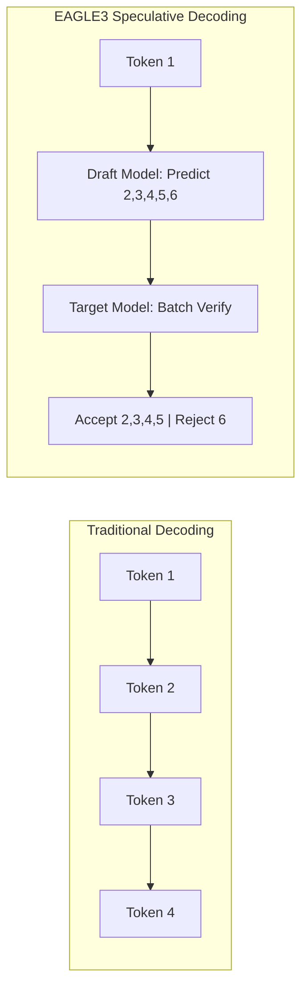
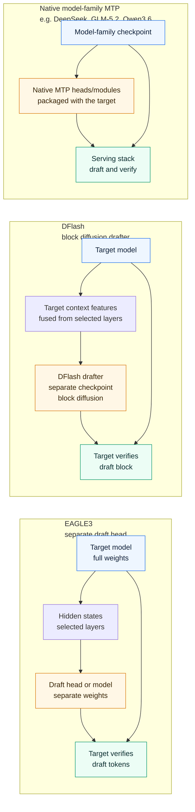

# Speculative Decoding for OSS Models

> **Author**: Xinyu Wei (魏新宇) — Microsoft AI GBB Senior System Engineer

[中文文档](README-CN.md) | English

[](https://arxiv.org/abs/2401.15077)
[](https://arxiv.org/abs/2406.16858)
[](https://github.com/sgl-project/sglang)
[](https://github.com/vllm-project/vllm)
[](https://github.com/SafeAILab/SpecForge)

Engineering guide to draft-and-verify acceleration: compare EAGLE3, self-trained draft heads, native model-family MTP, DFlash, and llama.cpp MTP with reproducible benchmark evidence.

## Executive Summary

This project documents a complete research workflow for speculative decoding across multiple draft-and-verify routes: official EAGLE3 validation, self-trained draft heads, native model-family MTP, GLM-5.2's IndexShare/KVShare MTP design, and DFlash/MTP serving experiments:

| Area | What this repo covers | Evidence / source | Key insight |
|------|-----------------------|-------------------|-------------|
| EAGLE3 validation | Official EAGLE3 draft model for Llama-3.1-8B | **441.7 vs 165.7 tok/s = 2.67x**, SGLang, H100, 20 runs | Feature-based draft heads can deliver large low-concurrency latency wins |
| Self-trained draft heads | Custom EAGLE3 draft head trained on one GPU | **207.7 vs 159.8 tok/s = 1.30x** on code, 45-minute training | Minimal training can produce useful acceleration, but workload distribution matters |
| Native model-family MTP | Qwen3.6 / DeepSeek-style MTP patterns and GLM-5.2 single-layer MTP with IndexShare/KVShare | GLM-5.2 official config + blog: `num_nextn_predict_layers=1`, shared MTP parameters, acceptance length **4.56 → 5.47 (+20%)** | Native MTP is not one recipe; implementation details such as KVShare and IndexShare matter |
| DFlash vs native MTP serving | H100 benchmark for Qwen3.6 native MTP, DFlash, and llama.cpp MTP | Repo JSON/logs: DFlash coding **191.7 tok/s** vs native MTP **146.7 tok/s** under the tested single-stream setup | DFlash can win in long-output single-stream tests, but the comparison depends on spec tokens, backend, precision, and workload |
| Simulated acceptance | `SGLANG_SIMULATE_ACC_LEN=3` under a 4-token draft window | Formula: `accept_rate = 3 / 4 = 0.75`; token timeline example in this README | Simulated acceptance is a runtime diagnostic setting, not proof of real model quality |

**Why 1.30x with 45-min training is significant:**
- Official models require days of training on 8x A100/H100 GPUs
- Our 45-minute single-GPU training achieved ~50% of the official speedup
- Demonstrates EAGLE3 sample efficiency - useful acceleration with minimal compute
- GLM-5.2 and Qwen3.6 show why native MTP needs model-family-specific reading; the same `num_nextn_predict_layers=1` can behave differently once the serving architecture changes.

## How to Read This Repo

| If you care about... | Start here | What you get |
|---|---|---|
| The core mechanism | [Background](#background-what-is-speculative-decoding) | Why draft-and-verify can reduce latency |
| Choosing a route | [Taxonomy](#speculative-decoding-taxonomy-eagle3-vs-native-mtp-vs-dflash) and [Decision Guide](#decision-guide-which-route-to-use) | When to use EAGLE3, native MTP, or DFlash |
| Native MTP details | [MTP layers and hyperparameters](#understanding-mtp-layers-and-speculative-decoding-hyperparameters) | GLM-5.2, Qwen3.6, draft steps, simulated acceptance, and `accept_rate=0.75` |
| Reproducing numbers | [H100 serving benchmark](#h100-serving-benchmark-native-mtp-vs-dflash-vs-llamacpp-mtp) and [Reproducing](#reproducing-the-results) | Scripts, raw JSON, logs, and exact launch commands |
| Training your own drafter | [Phase 2](#phase-2-self-training-eagle3-draft-model) | Data prep, training logs, deployment, and when self-training helps |

## Repo Quality Contract

This repo is meant to be evidence-rich, not just explanatory prose:

| Principle | What is included | Where to inspect |
|---|---|---|
| **Data-rich** | Raw H100 benchmark JSON for vLLM native MTP, vLLM DFlash, and llama.cpp MTP | `data/h100_*.json` |
| **Code-rich** | Runnable benchmark client, route orchestrator, vLLM launchers, llama.cpp build/launch scripts, EAGLE3 training scripts | `scripts/` |
| **Engineering-rich** | Runtime knobs, failure modes, memory/KV-cache constraints, DeepGEMM and context-length fixes | H100 benchmark section, runtime knobs table, `logs/` |
| **Test-rich** | Warmup + repeated measured runs, startup logs, output-quality checks, failure notes, JSON-backed median TPS | `data/`, `logs/`, benchmark tables |

## Benchmark Environment

The experiments in this project were run on the following GPU environment. Azure is the test infrastructure here, not a dependency of the speculative decoding technique.

| Item | Details |
|---|---|
| **GPU VM used for benchmarks** | [NC40ads_H100_v5](https://learn.microsoft.com/en-us/azure/virtual-machines/nc-h100-v5-series) |
| **GPU** | NVIDIA H100 80GB |
| **Frameworks** | vLLM, SGLang, llama.cpp |

---

## Phase 1: Validating Official EAGLE3 Model

### Environment

```
Hardware: NVIDIA H100 NVL 96GB (Azure VM)
Software: Python 3.10, CUDA 12.4, SGLang
```

### EAGLE3 Server Deployment

```bash
export SGLANG_ALLOW_OVERWRITE_LONGER_CONTEXT_LEN=1

python -m sglang.launch_server \
    --model meta-llama/Llama-3.1-8B-Instruct \
    --speculative-algorithm EAGLE3 \
    --speculative-draft-model-path jamesliu1/sglang-EAGLE3-Llama-3.1-Instruct-8B \
    --speculative-num-steps 5 \
    --speculative-eagle-topk 8 \
    --speculative-num-draft-tokens 32 \
    --dtype float16 \
    --host 0.0.0.0 --port 8080
```

**Server Startup Log:**
```
[2025-12-02 12:01:15] server_args=ServerArgs(model_path='meta-llama/Llama-3.1-8B-Instruct', ...)
[2025-12-02 12:01:17] Load weight begin. avail mem=92.50 GB
Loading safetensors checkpoint shards: 100% | 4/4 [00:01<00:00, 2.31it/s]
[2025-12-02 12:01:19] Load weight end. type=LlamaForCausalLM, dtype=torch.float16, avail mem=77.39 GB

[2025-12-02 12:01:20] Loading EAGLE3 draft model: jamesliu1/sglang-EAGLE3-Llama-3.1-Instruct-8B
[2025-12-02 12:01:20] Warning: context_length (131072) > derived (2048). Overriding.
Loading safetensors checkpoint shards: 100% | 1/1 [00:00<00:00, 12.28it/s]
[2025-12-02 12:01:21] Draft model loaded. type=LlamaForCausalLMEagle3, mem usage=2.21 GB

[2025-12-02 12:01:32] Capture cuda graph end. Time elapsed: 7.00 s
[2025-12-02 12:01:35] The server is fired up and ready to roll!
```

### Baseline Server (No Speculative Decoding)

```bash
python -m sglang.launch_server \
    --model meta-llama/Llama-3.1-8B-Instruct \
    --dtype float16 \
    --host 0.0.0.0 --port 8080
```

### Benchmark Results (20 runs, 512 tokens)

**EAGLE-3 Raw Results:**
```
Run  1:  1.155s | 512 tokens |  443.3 tok/s
Run  2:  1.160s | 512 tokens |  441.2 tok/s
Run  3:  1.158s | 512 tokens |  442.1 tok/s
...
Run 20:  1.159s | 512 tokens |  441.6 tok/s

Average: 1.159s | 441.7 tok/s | Std: 0.001s
```

**Baseline Raw Results:**
```
Run  1:  3.097s | 512 tokens |  165.3 tok/s
Run  2:  3.087s | 512 tokens |  165.8 tok/s
Run  3:  3.091s | 512 tokens |  165.6 tok/s
...
Run 20:  3.085s | 512 tokens |  166.0 tok/s

Average: 3.090s | 165.7 tok/s | Std: 0.002s
```

**Summary:**
| Metric | EAGLE-3 | Baseline | Comparison |
|--------|---------|----------|------------|
| Average Latency | 1.159s | 3.090s | **2.67x faster** |
| Average Throughput | 441.7 tok/s | 165.7 tok/s | **2.67x speedup** |

### Output Quality Verification

| Task | EAGLE-3 | Baseline | Match |
|------|---------|----------|-------|
| Code Generation | 1882 chars | 1882 chars | 100% identical |
| Logical Reasoning | 1744 chars | 1744 chars | 100% identical |
| Knowledge Q&A | 2413 chars | 2500 chars | ~96% (minor wording) |

The 4% difference in Knowledge Q&A is due to FP16 precision accumulation in long sequences. Core information is identical.

---

## Phase 2: Self-Training EAGLE3 Draft Model

### Data Preparation (Critical Step)

EAGLE3 training requires high-quality conversation data. The SpecForge framework provides `prepare_data.py` script to process various datasets:

**Supported Datasets:**
- `sharegpt` - ShareGPT conversations (recommended for general use)
- `ultrachat` - UltraChat dataset
- `perfectblend` - PerfectBlend dataset (7M+ conversations)
- `eaglechat` - EAGLE-specific chat data
- `magpie-qwen2.5-pro-1m-v0.1` - Magpie Qwen dataset

**Step 1: Prepare Training Data**

```bash
cd ~/SpecForge

# Option 1: Use ShareGPT (Full dataset ~114K samples)
python scripts/prepare_data.py \
    --dataset sharegpt \
    --output-path cache/dataset/sharegpt_train.jsonl

# Option 2: Use ShareGPT with limited samples (for testing)
python scripts/prepare_data.py \
    --dataset sharegpt \
    --sample-size 10000 \
    --output-path cache/dataset/sharegpt_train.jsonl

# Option 3: Use PerfectBlend (larger, higher quality)
python scripts/prepare_data.py \
    --dataset perfectblend \
    --sample-size 50000 \
    --output-path cache/dataset/perfectblend_train.jsonl
```

**Data Format (JSONL):**
```json
{
  "id": "HneH6K5_0",
  "conversations": [
    {"role": "user", "content": "Write an article about..."},
    {"role": "assistant", "content": "Title: The Benefits of..."}
  ]
}
```

**Critical Insight**: Data quality directly impacts draft model accuracy. Using raw ShareGPT with only 500 samples resulted in 6% accuracy. Using 114K ShareGPT samples or PerfectBlend dataset achieves 40-50% accuracy.


### Training Configuration

```yaml
model:
  base_model: "meta-llama/Llama-3.1-8B-Instruct"
  draft_model_type: "eagle3"

training:
  batch_size: 1
  gradient_accumulation_steps: 8
  learning_rate: 3.0e-5
  max_steps: 7000
```

### Training Launch

```bash
SPECFORGE_DIR=~/SpecForge bash scripts/train_eagle3.sh
```

The wrapper in this repo stores the reproducible command and local draft config, while the training entrypoint comes from the upstream [SpecForge](https://github.com/SafeAILab/SpecForge) checkout. Set `SPECFORGE_DIR=/path/to/SpecForge` if it is not cloned at `~/SpecForge`.

### Training Log

```
[2025-12-03 02:45:12] ============================================
[2025-12-03 02:45:12] EAGLE3 Training Starting
[2025-12-03 02:45:12] ============================================
[2025-12-03 02:45:12] Target Model: meta-llama/Llama-3.1-8B-Instruct
[2025-12-03 02:45:12] Total Steps: 7000
[2025-12-03 02:45:12] Batch Size: 1, Gradient Accumulation: 8
[2025-12-03 02:45:12] ============================================

[2025-12-03 02:45:15] Loading target model...
Loading safetensors: 100%|██████████| 4/4 [00:02<00:00, 1.82it/s]
[2025-12-03 02:45:18] Target model loaded. VRAM: 15.2 GB

[2025-12-03 02:45:19] Draft head parameters: 223M (849 MB)
[2025-12-03 02:45:25] Loaded 52,000 conversations

Training Epoch 0:   7%|▋         | 500/7000 [03:15<42:00, 2.58it/s]
Step 500: loss=2.12, acc=0.40

Training Epoch 0:  14%|█▍        | 1000/7000 [06:30<39:00, 2.56it/s]
Step 1000: loss=1.90, acc=0.44

Training Epoch 0:  29%|██▉       | 2000/7000 [13:00<32:30, 2.56it/s]
Step 2000: loss=1.73, acc=0.46

Training Epoch 0:  43%|████▎     | 3000/7000 [19:30<26:00, 2.56it/s]
Step 3000: loss=1.64, acc=0.48

Training Epoch 0:  57%|█████▋    | 4000/7000 [26:00<19:30, 2.56it/s]
Step 4000: loss=1.62, acc=0.50

Training Epoch 0:  71%|███████▏  | 5000/7000 [32:30<13:00, 2.56it/s]
Step 5000: loss=1.63, acc=0.54   ← PEAK ACCURACY

Training Epoch 0:  86%|████████▌ | 6000/7000 [39:00<06:30, 2.56it/s]
Step 6000: loss=1.60, acc=0.50

Training Epoch 0: 100%|██████████| 7000/7000 [45:30<00:00, 2.56it/s]
Step 7000: loss=1.61, acc=0.48

[2025-12-03 03:30:42] ============================================
[2025-12-03 03:30:42] Training Complete
[2025-12-03 03:30:42] Total Time: 45 minutes 30 seconds
[2025-12-03 03:30:42] Best Checkpoint: epoch_0_step_5000 (acc=0.54)
[2025-12-03 03:30:42] ============================================

[2025-12-03 03:30:43] Segmentation fault (signal 11)
```

Note: The segfault after training is harmless - all checkpoints are saved.

### Training Metrics Summary

| Step | Progress | Loss | Accuracy | Notes |
|------|----------|------|----------|-------|
| 0 | 0% | 2.84 | 0.36 | Random init |
| 1000 | 14% | 1.90 | 0.44 | Rapid improvement |
| 3000 | 43% | 1.64 | 0.48 | Stabilizing |
| **5000** | **71%** | **1.63** | **0.54** | **Peak accuracy** |
| 7000 | 100% | 1.61 | 0.48 | Slight overfit |

### Understanding Metric Fluctuation

With batch_size=1, per-step metrics fluctuate wildly:
```
Step 3245: loss=0.00, acc=0.00   ← Short sequence skipped
Step 3246: loss=4.77, acc=0.22   ← Difficult sample
Step 3247: loss=0.89, acc=0.54   ← Easy sample
```

This is normal. Focus on checkpoint-level trends (every 500 steps).

### Self-Trained Model Deployment

```bash
export SGLANG_ALLOW_OVERWRITE_LONGER_CONTEXT_LEN=1

python -m sglang.launch_server \
    --model-path meta-llama/Llama-3.1-8B-Instruct \
    --speculative-algorithm EAGLE3 \
    --speculative-draft-model-path ./output/eagle3-llama31-8b-full/epoch_0_step_5000 \
    --speculative-num-steps 5 \
    --speculative-eagle-topk 8 \
    --speculative-num-draft-tokens 64 \
    --host 0.0.0.0 --port 8080
```

### Self-Trained Model Results

| Task Type | Baseline | Self-Trained EAGLE3 | Speedup |
|-----------|----------|---------------------|---------|
| Code Generation | 159.8 tok/s | 207.7 tok/s | **1.30x** |
| Technical Q&A | 188.9 tok/s | 188.0 tok/s | 1.00x |
| Math Reasoning | 188.9 tok/s | 188.0 tok/s | 1.00x |
| Creative Writing | 180.2 tok/s | 153.9 tok/s | 0.84x |

**Code Generation (Best Case):**
```
Prompt: "Implement binary search tree in Python"
Baseline:     3.204s | 512 tokens | 159.8 tok/s
Self-Trained: 2.465s | 512 tokens | 207.7 tok/s
Speedup: 1.30x
```

**Creative Writing (Worst Case):**
```
Prompt: "Write a story about a robot learning to paint"
Baseline:     2.843s | 512 tokens | 180.2 tok/s
Self-Trained: 3.327s | 512 tokens | 153.9 tok/s
Speedup: 0.84x (16% SLOWER)
```

Creative writing is slower because high-entropy output leads to low draft acceptance rate.

### Why 1.30x is Significant

| Aspect | Official Model | Self-Trained |
|--------|----------------|--------------|
| Training Time | Days (8x A100) | 45 min (1x H100) |
| Speedup | 2.67x | 1.30x |
| Relative Performance | 100% | ~50% |
| Compute Cost | ~$10,000+ | ~$50 |

With <1% compute, we achieved ~50% performance.

---

## Phase 3: Native MTP and DFlash Serving Experiments

This phase focuses on model-family MTP and DFlash-style serving rather than assistant checkpoints from an external model vendor.

There are two different questions:

1. **How should native MTP be interpreted from model configs?**
2. **How do native MTP, DFlash, and llama.cpp MTP behave under an actual serving benchmark?**

### Native MTP: Read the Model Family, Not Just the Flag

A single config field such as `num_nextn_predict_layers=1` is not enough to explain runtime behavior. It tells us that the model has one native next-token prediction layer, but not how the serving stack reuses that layer across draft steps.

GLM-5.2 is a useful public example. Its HF config reports `num_nextn_predict_layers=1` and `model_type=glm_moe_dsa`. The official GLM-5.2 blog adds the missing serving detail: different MTP steps share parameters, training and inference both use 7 MTP steps, and IndexShare / KVShare prevent later draft steps from mixing in KV produced by the MTP layer itself. In the official coding ablation, acceptance length improves from **4.56** to **5.47 (+20%)**.

The lesson is general: native MTP is not just "how many layers." You also need to inspect how the model family handles parameter sharing, KV cache, index reuse, and train-inference discrepancy.

### H100 Serving Benchmark: Native MTP vs DFlash vs llama.cpp MTP

This repo measured single-stream latency and generation TPS on NVIDIA H100 NVL 96GB. Target model: `Qwen/Qwen3.6-27B` bf16 for vLLM routes, `unsloth/Qwen3.6-27B-MTP-GGUF:UD-Q4_K_XL` for llama.cpp. Three domains (Coding/Math/Chat), warmup 1 round + 3 timed runs, median reported. Non-streaming API, TPS = `usage.completion_tokens / total_time`.

**Test Environment:**

| Item | Value |
|------|-------|
| GPU | NVIDIA H100 NVL, 95830 MiB, driver 580.159.03 |
| vLLM | 0.21.0 (stock install, `VLLM_DEEP_GEMM_WARMUP=skip`) |
| llama.cpp | commit `27c8bb4`, CUDA build with OpenSSL |
| Target model | `Qwen/Qwen3.6-27B` (bf16, 51.89 GiB) |
| DFlash draft | `z-lab/Qwen3.6-27B-DFlash` (3.22 GiB, block diffusion drafter) |
| llama.cpp GGUF | `unsloth/Qwen3.6-27B-MTP-GGUF:UD-Q4_K_XL` (17.9 GiB, Q4 quantized) |

**Results (single-stream, median of 3 runs):**
| Route | Backend | Quant | Spec Tokens | Domain | Med Total (s) | Med TPS |
|-------|---------|-------|:-----------:|--------|:-------------:|:-------:|
| **vLLM native MTP** | vLLM 0.21.0 | bf16 | 5 | Coding | 3.49 | **146.7** |
| | | | | Math | 1.51 | **169.1** |
| | | | | Chat | 1.65 | **155.4** |
| **vLLM DFlash** | vLLM 0.21.0 | bf16 | 15 | Coding | 2.67 | **191.7** |
| | | | | Math | 1.32 | **193.5** |
| | | | | Chat | 1.64 | **156.1** |
| **llama.cpp MTP** | llama.cpp (CUDA) | Q4_K_XL | 5 | Coding | 4.77 | **107.3** |
| | | | | Math | 2.15 | **118.9** |
| | | | | Chat | 2.48 | **103.1** |

### What This Phase Concludes

1. **Native MTP needs model-family-specific reading.** GLM-5.2 shows why config fields, MTP step count, IndexShare, KVShare, and training loss must be read together.
2. **DFlash can win in the tested H100 single-stream setup.** In coding, DFlash with 15 spec tokens measured 191.7 TPS vs native MTP with 5 spec tokens at 146.7 TPS.
3. **The comparison is not fully controlled.** DFlash uses 15 speculative tokens and native MTP uses 5. This is an engineering result, not a universal algorithm ranking.
4. **llama.cpp MTP is a different product shape.** The Q4_K_XL route is useful for compact local serving, but it is not directly comparable to bf16/vLLM without quality checks.

**Runtime Knobs Discovered During Reproduction:**

| Issue | Root Cause | Fix |
|-------|-----------|-----|
| vLLM `max_num_seqs (1024) exceeds available Mamba cache blocks` | Qwen3.6 hybrid Mamba+Attention architecture with 262K context leaves only 468 Mamba cache blocks | Add `--max-num-seqs 256` |
| vLLM `DeepGEMM backend is not available or outdated` | vLLM 0.21.0 tries DeepGEMM warmup but the package is missing | Set `VLLM_DEEP_GEMM_WARMUP=skip` |
| vLLM DFlash `KV cache memory (26.74 GiB) < required (27.69 GiB)` at 262K context | DFlash draft model takes extra VRAM vs native MTP | Lower `--max-model-len` to 252000 |
| llama.cpp `HTTPS is not supported` for `-hf` download | Built without OpenSSL | Install `libssl-dev` and rebuild with `-DLLAMA_OPENSSL=ON` |

### Reproduce the H100 Routes

```bash
# Route 1 — vLLM native MTP
VLLM_DEEP_GEMM_WARMUP=skip MAX_NUM_SEQS=256 bash scripts/mtp_vllm_qwen36_mtp_launch.sh
python3 scripts/mtp_benchmark_client.py --base-url http://127.0.0.1:8000   --label vllm-native-mtp --runs 3 --warmup 1 --no-stream --output results_mtp.json

# Route 2 — vLLM DFlash
VLLM_DEEP_GEMM_WARMUP=skip MAX_MODEL_LEN=252000 MAX_NUM_SEQS=256   bash scripts/mtp_vllm_qwen36_dflash_launch.sh
python3 scripts/mtp_benchmark_client.py --base-url http://127.0.0.1:8000   --label vllm-dflash --runs 3 --warmup 1 --no-stream --output results_dflash.json

# Route 3 — llama.cpp MTP GGUF
bash scripts/mtp_llamacpp_qwen36_mtp_launch.sh
python3 scripts/mtp_benchmark_client.py --base-url http://127.0.0.1:8080   --label llamacpp-mtp-q4kxl --runs 3 --warmup 1 --no-stream --output results_llamacpp.json
```

Archived evidence:

| Type | Files |
|------|-------|
| Benchmark raw JSON | `data/h100_vllm_native_mtp.json`, `data/h100_vllm_dflash.json`, `data/h100_llamacpp_mtp_q4kxl.json` |
| Server startup logs | `logs/h100_vllm_native_mtp_startup.log`, `logs/h100_vllm_dflash_startup.log`, `logs/h100_llamacpp_mtp_startup.log` |
| Benchmark client | `scripts/mtp_benchmark_client.py` |
| Orchestrator | `scripts/mtp_benchmark_orchestrator.sh` |

---

## Background: What is Speculative Decoding?

LLM inference is memory-bandwidth bound, not compute-bound. Each token generation requires loading entire model weights from GPU memory, but outputs only ONE token.

Speculative decoding uses a fast draft model to predict multiple tokens, then the main model verifies them in parallel:



### EAGLE3 Architecture


*Figure 1: EAGLE3 Draft Model Architecture and Tree-based Speculative Decoding (Source: [Benjamin Marie](https://kaitchup.substack.com/p/eagle-3-speculators-when-to-use-them))*

**Understanding the Architecture (Step by Step):**

**Left Side - Target LLM (Standard Decoding):**

For the query "How can", the target model performs standard autoregressive decoding:
1. Input tokens "How", "can" → **Embedding** layer → e_how, e_can
2. **Transformer Layers** process embeddings → hidden features f_how, f_can  
3. **LM Head** predicts next token → outputs "can", "I"
4. Each token requires **one full forward pass** through all layers

**Right Side - EAGLE-3 Draft Model (Speculative Decoding):**

The draft model is much lighter and faster:
1. **Forward 1**: Takes f_how, e_can from target model + embedding e_I
   - Passes through "**One Auto-regression Head**" (single decoder layer)
   - **LM Head** outputs f_I → predicts candidates "make/help"

2. **Forward 2**: For each candidate ("make", "help"):
   - Input: previous features + new embeddings (e_make, e_help)
   - Output: f_make, f_help → predicts "a/our", "with/you"

3. **Forward 3**: Continue expanding:
   - From "with" → predicts "the/your"  
   - From "you" → predicts "to/feel"

**Key Notation in the Figure:**
- `e_xxx`: Embedding of token "xxx"
- `f_xxx`: Hidden feature/representation of token "xxx"
- Orange boxes: Features from target model (f_how, f_can)
- Red boxes: Draft model predictions (f_make, f_help, etc.)

**Bottom - Tree Structure (Verification):**

The draft tokens form a tree for batch verification:
```
Query: "How can"
         ↓
    "I" (from target LLM, Forward 1)
```

The target model verifies **ALL branches in ONE forward pass**, accepting the longest matching sequence (e.g., "I" → "help" → "you" → "feel").

**Role Division - "Draft Guesses, Target Judges":**

| Role | Model | Task | Cost |
|------|-------|------|------|
| **Predictor (Draft)** | EAGLE-3 Draft Model (223M) | Quickly generate candidate tokens | Low |
| **Verifier (Verify)** | Target LLM (8B) | Judge which candidates are correct | High |

**Concrete Example:**
```
1. Target LLM generates first token "I" (required for initial features)

2. Draft Model rapidly predicts (3 cheap forward passes):
   "I" → make, help
   "make" → a, our  
   "help" → with, you
   (Each pass only through 223M params)

3. Target LLM verifies (1 expensive forward pass):
   Batch-verify ALL candidate branches in parallel
   Judge: which draft tokens match what I would generate?
   
4. Accept matching sequence:
   e.g., "I" → "help" → "you" → "feel" all correct
   Accept 4 tokens at once!
```

**Why This Works - Cost Analysis:**

*Without EAGLE-3:*
- Generate 4 tokens = 4 × Target LLM forward pass
- Cost: 4 × 8B = **32B parameter computations**

*With EAGLE-3:*
- Draft prediction: 3 × 223M = 669M params
- Target verification: 1 × 8B = 8B params  
- Total: **~8.7B** (3.7x cheaper than 32B)

**Key Insight**: Target LLM verification is **parallel** - no matter how many candidates draft generates, verification only needs ONE forward pass (leveraging batch parallelism). Draft guesses, Target judges - correct guesses are "free", wrong guesses only waste cheap draft computation.

---

### Why Verification is Cheaper than Generation

A common question: "If verification still requires the Target model, why not just generate directly?"

The answer lies in **sequential vs parallel** computation:

**Generation (Sequential):**
- Each token depends on all previous tokens
- Must wait for token 1 → generate token 2 → generate token 3...
- **N tokens = N forward passes** (each pass is full model computation)
- GPU utilization: Low (waiting between passes)

**Verification (Parallel):**
- Given N candidate tokens, check all at once
- Transformer's self-attention naturally supports this: input `[x₁, x₂, ..., xₙ]`, output `[y₁, y₂, ..., yₙ]` in ONE pass
- **N tokens = 1 forward pass** (batch parallelism)
- GPU utilization: High (parallel processing is GPU's strength)

**Analogy:**
- Generation = Taking an exam: answer Q1, then Q2, then Q3... (sequential, each depends on previous)
- Verification = Teacher grading: check all answers simultaneously (parallel, independent judgments)

**Concrete Numbers:**
| Operation | 4 Tokens | 8 Tokens | 16 Tokens |
|-----------|----------|----------|-----------|
| Generation | 4 forward passes | 8 forward passes | 16 forward passes |
| Verification | 1 forward pass | 1 forward pass | 1 forward pass |

EAGLE-3's "draft + verify" approach is effective because verification of multiple tokens can be done in a single parallel forward pass, while generation requires sequential passes.

---

## Speculative Decoding Taxonomy: EAGLE3 vs Native MTP vs DFlash

All speculative decoding systems share the same outer loop: a cheap drafter proposes future tokens, then the target model verifies those tokens in parallel. The important engineering question is where the drafter comes from.

| Family | What the drafter is | When it is created | How it is loaded at serving time | Measured Extra VRAM | Typical Strength | Main Risk |
|--------|---------------------|--------------------|----------------------------------|--------------------|------------------|-----------|
| **EAGLE3** | A trained draft head/model that reads target-model hidden features from multiple layers | Trained after the target model is fixed, either by the vendor or by you | Loaded as an extra draft model/head beside the target model | +2.21 GiB draft model in the Phase 1 SGLang log | High speedup when the official draft model is available; self-training is possible | Training quality and task distribution matter; bad draft data can slow some workloads |
| **DFlash** | A target-conditioned block diffusion drafter checkpoint that fuses target context features and drafts a token block in one parallel forward pass (source: [DFlash project](https://z-lab.ai/projects/dflash/) and [arXiv:2602.06036](https://arxiv.org/abs/2602.06036)) | Trained separately for a target model family/checkpoint; public draft checkpoints are published under `z-lab/*-DFlash` | Loaded as a DFlash draft model in a DFlash-aware serving stack such as SGLang or vLLM builds with DFlash support | Not measured in this repo | Makes the draft stage itself block-parallel instead of autoregressive; useful when an official DFlash checkpoint and engine support exist | More memory and engine-version sensitivity; block size, context length, and workload distribution must be benchmarked |
| **Native model-family MTP** | MTP heads/modules packaged with the target model family, sometimes as separate MTP weights inside the same model directory | Release-specific; trained as part of the model-family design | Loaded through that model's native inference stack or model-directory convention rather than by a separate assistant path | Not measured in this repo | Makes MTP part of the model-family serving design instead of a post-hoc add-on | Implementation details are release-specific; do not assume EAGLE flags or assistant-loading conventions from another model family will work |

The word "drafter" does not always mean "a full standalone LLM loaded next to the target." The weight form is different across families:

| Family | Does the drafter have its own weights? | Is it a full target-model replacement? | Best wording |
|--------|--------------------------------------|-------------------------------------|--------------|
| **EAGLE3** | Yes, but they are separate draft-model/head weights, not a copy of the full target model | No | Separate draft-model weights, not full target-model weights |
| **DFlash** | Yes. Z-Lab publishes separate DFlash draft checkpoints for specific targets | No | Target-conditioned block diffusion draft checkpoint |
| **Native model-family MTP** | Release-specific. Some model families represent MTP as native heads/modules inside the model-family checkpoint or as separate MTP weights in the same model directory | No | Native MTP weights packaged with the model family, not a full target-model replacement |

The diagram below shows where the drafter lives in each route. Native model-family MTP is drawn conceptually because each model family chooses its own packaging and serving interface. DFlash is also target-conditioned, but its distinguishing feature is that the draft generator is a block diffusion model rather than an autoregressive draft head.



### Deep Comparison: How Each Drafter Actually Works

| Dimension | Classic Speculative Decoding | EAGLE3 | DFlash | Native model-family MTP |
|-----------|------------------------------|--------|--------|---------------------|
| What the drafter reads from target | Nothing; a separate small LM runs independently | Hidden states from 3 mid-layers (layers 2, 16, 29 in Llama 8B) | Fused target context features injected into the draft layers' KV cache | MTP heads branch directly from the model forward path |
| Drafter size | A full small LM (e.g. 68M Llama-68M) | ~223M params, 1 decoder layer | Lightweight block diffusion checkpoint; target-specific size, not measured here | Native MTP modules inside the model checkpoint |
| Drafting pattern | Autoregressive draft LM | Autoregressive draft head/model | Block diffusion; drafts a token block in one parallel forward pass | Native future-token prediction path inside the model family |
| Can you train it yourself | Use any off-the-shelf small LM; no special training | Yes (SpecForge, 45 min on a single GPU) | Requires a target-specific DFlash training recipe/checkpoint; this repo did not train one | No, the model vendor builds it during pre-training |
| What happens after fine-tuning the target | Drafter is independent, so it still works but acceptance rate may drop because output distributions diverge | Re-train the draft head to match the new distribution | Re-validate or retrain the DFlash checkpoint; target-feature distribution changes can hurt acceptance | Native MTP modules are part of the model family, so fine-tuning and serving support must be validated together |
| Switch to a different target model | Just swap the small LM; no dependency on target internals | Re-train a new draft head | Cannot assume reuse; use a DFlash checkpoint trained for that target | Not applicable; the MTP modules are inseparable from the model |
| Serving stack | Any framework that supports assisted generation | SGLang native EAGLE3 support, one flag | DFlash-aware SGLang / vLLM builds; engine version matters | Depends on the model vendor's own inference stack |
| Coupling to target | None (loosest) | Tight (reads mid-layer hidden states) | Tight (reads target features, but remains an external checkpoint) | Tightest (native modules inside model) |

### Algorithm Philosophy: Post-Hoc vs Native

EAGLE3, native MTP, and DFlash represent different design philosophies, not a simple "old vs new" progression:

| Dimension | EAGLE3 (post-hoc) | DFlash (external block diffusion) | Native model-family MTP |
|-----------|--------------------|-----------------------------------|------------------------------|
| Core question | Target is fixed; how to build the best drafter after the fact? | Can an external drafter remove the draft-stage sequential bottleneck by predicting a whole block at once? | Make MTP part of the pre-training objective itself |
| Key innovation | Solved the train-test gap: training uses the drafter's own predicted features instead of ground-truth features, so training matches inference (EAGLE-3, NeurIPS 2025) | Target feature fusion + KV injection + block diffusion parallel drafting | MTP as a training objective; GLM-5.2 further uses IndexShare/KVShare to prevent MTP-generated KV from contaminating later draft steps |
| Academic record | EAGLE (ICML 2024), EAGLE-2 (EMNLP 2024), EAGLE-3 (NeurIPS 2025) | DFlash paper: arXiv:2602.06036, ICML 2026 | DeepSeek-V2/V3 papers; GLM-5.2: IndexShare ([arXiv:2603.12201](https://arxiv.org/abs/2603.12201)) + KVShare + rejection sampling + end-to-end TV loss for MTP |
| Industry trend | Universal retrofit: works on any target model | New external drafter family: target-conditioned but block-parallel | Forward-looking: more vendors build MTP into training; GLM-5.2 shows that shared-parameter MTP can be improved by preventing MTP-generated KV from contaminating later draft steps |

Neither route will disappear. Post-hoc drafters (EAGLE3) remain essential when you need to accelerate an existing model you cannot re-train. Native model-family MTP is the direction for new model families designed with speculative decoding in mind.

### Decision Guide: Which Route to Use

| Scenario | Recommended route | Why |
|----------|-------------------|-----|
| Maximum speedup on a supported model | **EAGLE3** | 2.67x measured in this repo's low-concurrency validation |
| Official DFlash checkpoint exists and the serving engine supports it | **DFlash** | Drafting itself becomes block-parallel; validate memory, block size, and acceptance rate on your workload |
| Will fine-tune the target model | **EAGLE3** | Can re-train the draft head to match the fine-tuned target |
| Model vendor ships native MTP | **Use the vendor's MTP** | No extra deployment; already built in |
| Long-context or memory-constrained serving | **Benchmark before enabling DFlash** | DFlash adds draft weights and engine-specific paths; larger draft blocks can waste work if acceptance is low |
| Long-term production without vendor dependency | **EAGLE3** | Community-driven (SafeAI Lab); does not depend on a single vendor publishing assistant checkpoints |

The practical difference is simple: EAGLE3 asks you to manage a trained feature-based draft head that reads multiple mid-layer hidden states; DFlash gives you a target-conditioned diffusion drafter that predicts a block of draft tokens in one parallel forward pass; native model-family MTP moves the draft mechanism deeper into the model family as native modules. These routes read or depend on target-model internal information in different ways — the difference is how the drafter is packaged, how it drafts, and how tightly it is tied to the serving stack. They are all speculative decoding, but they are not interchangeable deployment recipes.

### Practical Benchmark Matrix: DFlash vs MTP on Qwen3.6

The next benchmark question is not "is DFlash faster than MTP?" in the abstract. The public-safe question is:

> For a specific Qwen3.6 target, backend, quantization level, concurrency mode, context length, task domain, and speculative window, which route gives the best accepted-token throughput and latency?

This matrix turns the DFlash/MTP comparison into a reproducible benchmark plan. It is based on public DFlash / vLLM / llama.cpp mechanisms plus a third-party article and notebook review; the numbers from that review are **directional evidence only** until this repo reruns the benchmark and archives raw logs.

| Axis | Values to test | Why it matters |
|------|----------------|----------------|
| Target model | Qwen3.6-27B dense; Qwen3.6-35B-A3B MoE | Dense and MoE models can prefer different speculation routes. Do not transfer a 27B conclusion directly to the 35B-A3B model. |
| Backend | vLLM; llama.cpp | vLLM is the natural multi-user serving baseline; llama.cpp can be very strong for single-user local serving, especially with GGUF quantization. |
| Speculation route | Baseline; native Qwen MTP; DFlash; llama.cpp MTP GGUF | Each route changes a different variable: no drafter, model-family MTP, target-conditioned block diffusion, or quantized local MTP. |
| Serving mode | Single-stream latency; concurrent throughput | Single-request interactivity and multi-user serving are different products. A route can win one and lose the other. |
| Task domain | Coding, math, chat | Acceptance rate is domain-dependent. Structured code/math outputs usually differ from open-ended chat. |
| Speculative window | MTP: small sweep around 3-8 draft tokens; DFlash: block-size sweep such as 8 vs 15/16 where supported | More draft tokens are not automatically better. If an early draft token is rejected, later draft work is wasted. |
| Context length | Short prompt; long-context service profile | DFlash adds draft weights and engine-specific paths; long-context serving needs explicit KV-cache and memory checks. |

Recommended public benchmark reporting:

| Metric | Required? | Notes |
|--------|-----------|-------|
| Output tokens/sec | Yes | Report both engine throughput and accepted/output throughput when available. |
| TTFT / latency | Yes | Throughput-only reporting can hide single-user latency regressions. |
| Acceptance length or acceptance rate | Yes, if exposed | This is the main explanation for why a route speeds up or slows down. |
| GPU memory and KV-cache budget | Yes | Especially important for DFlash and long-context configurations. |
| Engine version / commit | Yes | DFlash support is engine-version-sensitive; "vLLM" alone is not enough. |
| Accuracy / output quality spot checks | Yes for quantized llama.cpp | Quantized GGUF speed is not directly comparable to bf16/vLLM unless quality is checked. |
| Failure notes | Yes | Crashes, unsupported block sizes, and context-length limits are part of the engineering result. |

Public wording rule:

| If the data source is... | Write it as... |
|--------------------------|-------------|
| Third-party article or chart | "Third-party benchmarks suggest..." |
| Local notebook command cue | "A reproduction path to test is..." |
| This repo's own raw logs | "This repo measured..." with file paths and command evidence |

#### H100 Benchmark Data

For the full H100 benchmark table, test environment, key findings, runtime knobs, and reproduction commands, see [H100 Serving Benchmark](#h100-serving-benchmark-native-mtp-vs-dflash-vs-llamacpp-mtp) and [Reproduce the H100 Routes](#reproduce-the-h100-routes) in Phase 3.

### Understanding MTP Layers and Speculative Decoding Hyperparameters

MTP (Multi-Token Prediction) layers are independent draft heads trained into the model during pretraining. The number of MTP layers directly determines how speculative decoding should be configured.

**MTP layer-count patterns:**

| Pattern | MTP layers | Draft shape | Serving implication |
|---------|:----------:|-------------|---------------------|
| Single-layer native MTP | 1 | One MTP head is reused across multiple future positions | More draft tokens require repeated use of the same head, so error can accumulate as the prediction moves farther ahead |
| Multi-layer native MTP | N | N native heads/modules can represent N future positions | `--speculative-num-steps` should usually start near the native MTP layer count, then be benchmarked |
| External assistant MTP | Implementation-specific | A separate assistant/drafter checkpoint proposes future tokens | Configure through the serving engine's assistant/speculative config rather than native MTP layer flags |
| DFlash-style drafter | Block-level | A target-conditioned drafter proposes a token block in parallel | Tune block size and memory headroom; it is not interchangeable with autoregressive MTP flags |

**Known model MTP configurations (source: official HF `config.json` and vendor docs):**

| Model | `num_nextn_predict_layers` | Architecture | MTP optimization | Source |
|-------|:--------------------------:|-------------|------------------|--------|
| Qwen3.6-27B | 1 | Single MTP head, reused across draft steps | — | HF `config.json` |
| DeepSeek-V3 / R1 | 1 | Single MTP head | — | Official paper |
| GLM-5.2 (753B MoE) | 1 | Single MTP head with parameters shared across MTP steps (`glm_moe_dsa`) | IndexShare + KVShare prevent later MTP steps from mixing in MTP-generated KV; acceptance length improves from 4.56 to 5.47 (+20%) in the official coding ablation with 7 MTP steps | HF `config.json`; [GLM-5.2 blog](https://huggingface.co/blog/zai-org/glm-52-blog) |

GLM-5.2 is notable because its official blog states that the parameters of different MTP steps are shared, while the number of MTP steps is set to 7 for both training and inference. Without IndexShare / KVShare, the second MTP step can mix target-model KV (`kv_1..kv_4`) with KV produced by the MTP layer itself (`kv_5`). That is the train-inference discrepancy: training sees target-model hidden states, but inference starts to see the draft module's own states. With IndexShare, the later step can attend only to the first-step target positions; with KVShare, those positions use KV from the target model. In plain terms: the shared MTP module can draft several future positions, but later drafts are not allowed to use earlier drafts as their reference material.

HF packaging also differs across native MTP families. GLM-5.2 exposes the MTP design through `config.json` fields such as `num_nextn_predict_layers=1` and `index_share_for_mtp_iteration=true`, while its file list is ordinary model shards (`model-00001-of-00282.safetensors`, etc.) rather than a separate `model_mtp.safetensors` file. Other native MTP families may publish a separate MTP weight file in the same model directory. The shared idea is "native model-family MTP"; the visible file layout is release-specific.

**Why layer count matters:**

- **N native layers can represent N future positions** (`t+1`, `t+2`, ..., `t+N`).
- **1-layer MTP** can still draft multiple future tokens, but it must reuse the same head repeatedly. The risk is not just "looking farther"; it is that later steps may start using earlier MTP-generated states as context. GLM-5.2's IndexShare + KVShare addresses that specific contamination path.
- **Multi-layer MTP** can assign different native heads/modules to different future positions, so it is often configured with `num_steps` close to the native MTP layer count.

**Concrete token example: "今天天气真好，我要去公园玩"**

Assume the model has already generated the context `今天天气真好`. The last real token in the current context is `t = 好`. It is not a new token produced by this speculative step; it is simply the starting point.

```text
Already generated context:
  ... 今天天气真 好
                  ^
                  t = already generated target token

Draft/MTP proposes three future positions:
  t+1 = ，
  t+2 = 我
  t+3 = 要

Target verification checks those draft tokens in one forward pass:
  verify t+1, t+2, t+3

Target verification also produces one extra next-token logit:
  t+4 = 去   ← bonus from target verify, not the same thing as token t
```

So `target token t already generated` and `t+4 bonus from target verify` are different things:

| Symbol | Meaning in this example | Who produces it? |
|--------|-------------------------|------------------|
| `t` | The existing context token `好`; the step starts here | Already produced before this step |
| `t+1..t+3` | Draft guesses: `， 我 要` | Draft/MTP |
| `t+4` | The next token `去` obtained as a verification byproduct | Target verify |

**Hyperparameters: draft shape vs simulated acceptance**

<div align="center"></div>

The settings are easier to read if they are split into two groups:

| Group | Parameter | Example value | What it controls |
|-------|-----------|--------------:|------------------|
| Draft shape | `--speculative-num-steps` | `3` | How many draft steps/positions the drafter attempts (`t+1..t+3` in the example) |
| Draft shape | `--speculative-eagle-topk` | `1` | Tree width. `1` means a linear chain; larger values create a tree of alternatives |
| Draft buffer | `--speculative-num-draft-tokens` | `4` | Buffer size: 3 draft positions plus 1 target-verify bonus position |
| Simulation | `SGLANG_SIMULATE_ACC_LEN` | `3` | Force the runtime to behave as if 3 draft tokens were accepted |
| Simulation | `SGLANG_SIMULATE_ACC_METHOD` | `match-expected` | Replace the real verification decision with a simulated accept index |

With a 4-token draft window and a simulated accept length of 3, the reported acceptance rate is a configured effect:

```text
accept_rate = accept_length / max_accept_length = 3 / 4 = 0.75
```

This is not the same as the model proving that it naturally accepts 75% of draft positions. It means the benchmark is running under a fixed-acceptance assumption.

**Why simulated acceptance exists**

| Aspect | What it helps with | What it does not prove |
|--------|--------------------|------------------------|
| Kernel/runtime benchmarking | Isolates scheduler, kernel, KV-cache, and disaggregation behavior under the same acceptance assumption | Real draft-model quality |
| Upper-bound analysis | Shows how fast the runtime could be if the drafter reliably provided 3 useful tokens per step | Production end-to-end throughput |
| Cross-system alignment | Lets two systems compare the same decode-loop shape | That the output text is faithful or high quality |

The prompt, target forward pass, and runtime path still execute, so TPOT can decrease and output tok/s can increase. The speedup comes from the runtime being told to advance by three accepted tokens per decode step:

```text
1024 output tokens / 1 token per step = 1024 decode steps
1024 output tokens / 3 tokens per step ≈ 341 decode steps
```

**Tradeoffs of simulated acceptance:**

| Benefit | Cost / risk |
|---------|-------------|
| Good for apples-to-apples runtime comparison | Output quality is not a truthful generation-quality signal |
| Good for upper-bound TPOT / throughput analysis | `accept_rate=0.75` is a configured setting, not measured model capability |
| Good for isolating kernel and serving-stack bottlenecks | It can hide draft-model calibration, workload distribution, and real rejection behavior |
| Reproducible and stable for engineering diagnosis | It can overstate production throughput if reported without caveats |

Recommended wording: write `fixed/simulated accept_length=3, equivalent to accept_rate=0.75 under a 4-token draft window`. Do not write `real accept_rate=0.75`.

For DFlash guidance: use DFlash when an official draft checkpoint exists, the serving engine has stable support, memory headroom is sufficient, and workload-specific acceptance is high. Otherwise, benchmark native MTP and DFlash side by side.


---

**Key Innovation: Multi-Layer Feature Extraction**

Unlike traditional speculative decoding that uses a separate smaller model, EAGLE3 extracts features from **3 specific layers** of the target model during its forward pass:

```
Target Model (Llama-3.1-8B, 32 layers):

Layer 0 → Layer 2 → ... → Layer 16 → ... → Layer 29 → Layer 30-31 → Output
              ↓              ↓                ↓                        ↓
         Hidden[0]      Hidden[1]        Hidden[2]              (for verification)
          (4096)         (4096)           (4096)
                             ↓
                  Concatenate (4096 × 3 = 12288)
                             ↓
                    │   FC Layer      │  (12288 → 4096)
                    │  + 1 Decoder    │  (independent weights)
                    │  + LM Head      │  (4096 → 32000)
                             ↓
                    Draft Token Predictions
                             ↓
              ↓                              ↓
         Draft Tokens    +    Target Output Logits
                             ↓
                      Tree Verification
                             ↓
                    Accept N Tokens
```

**Feature Extraction Layers:**
- **Layer 2**: Early features (syntax, basic patterns)
- **Layer N//2 (16)**: Middle features (semantic understanding)  
- **Layer N-3 (29)**: Late features (near-final representations)

> Note: Features are extracted **during** target model forward pass. The target model output is used to **verify** draft tokens.

**What is Tree Verification?**

Tree Verification is how the target model validates draft tokens efficiently:

```
Draft Model generates a "tree" of candidate tokens:

                    Token 1 (root)
                   /      |      \
              Token 2a  Token 2b  Token 2c
               /    \      |
          Token 3a  3b   Token 3c
            |
        Token 4a

Target Model verifies ALL candidates in ONE forward pass:
- Compare draft logits with target logits
- Accept tokens where predictions match
- Stop at first mismatch in each branch

Result: Accept longest matching sequence (e.g., 1 → 2a → 3b → 4a)
```

**Why Tree Structure?**
- **Parallel Verification**: All branches verified simultaneously
- **Higher Acceptance**: Multiple candidates increase chance of matching
- **Single Forward Pass**: Target model only runs ONCE to verify entire tree

**Why Multi-Layer Concatenation?**

1. **Richer Information**: Combines early, middle, and late layer features
2. **Better Prediction**: Different layers capture different aspects of language
3. **Minimal Overhead**: Only 1 decoder layer processes the concatenated features
4. **All Independent**: FC layer, Decoder layer, and LM Head are all independently trained

**Draft Model Components (All Independently Trained):**

| Component | Parameters | Description |
|-----------|------------|-------------|
| FC Layer | ~50M | Projects 12288 → 4096 |
| 1 Decoder Layer | ~67M | Attention + MLP (independent weights) |
| LM Head | ~131M | Maps to 32K draft vocabulary |
| **Total** | **~223M** | ~811MB in float16 |

> ⚠️ **Important**: The Decoder layer structure is similar to Llama, but weights are **independently trained**.


*Figure 2: Training and Testing differences between EAGLE and EAGLE-3 (Source: [Benjamin Marie](https://kaitchup.substack.com/p/eagle-3-speculators-when-to-use-them))*

**The Train-Test Gap Problem:**

- **EAGLE (top)**: During training, the draft model receives **ground-truth features** (f_t+1) from the target model. But at test time, it must use its own **predicted features** (f̂_t+1). This mismatch creates a "train-test gap" that limits performance.

- **EAGLE + l_fea removal (middle)**: If you simply remove the feature prediction loss, the model fails at test time (t̂_t+3 ≠ t_t+3) because it was never trained to handle its own predictions.

- **EAGLE-3 (bottom)**: Introduces "**training-time test**" - during training, the draft model uses its own predicted features (â_t+1) just like at inference time. This eliminates the train-test gap and allows the model to benefit from more training data and compute.

**Why This Matters:**

The original EAGLE struggled to benefit from scaling up training data because the training setup didn't match inference. EAGLE-3's training-time test mechanism directly optimizes for what matters at inference: long accepted sequences and high speedups, not just per-token accuracy.

**EAGLE3 vs EAGLE/EAGLE-2**:

| Aspect | EAGLE | EAGLE-2 | EAGLE3 |
|--------|-------|---------|--------|
| Draft Layers | 1-2 | 1 | 1 |
| Feature Source | Last layer | Last layer | Multi-layer (2, N//2, N-3) |
| Input Dimension | 4096 | 4096 | 12288 (4096 × 3) |
| Vocab Mapping | Full | Full | Compressed (32K) |
| Tree Structure | Static | Dynamic | Dynamic + Optimized |

**Draft Model Configuration (llama3-8B-eagle3.json)**:
```json
{
  "architectures": ["LlamaForCausalLMEagle3"],
  "num_hidden_layers": 1,        // Only 1 decoder layer
  "hidden_size": 4096,           // Same as target model
  "vocab_size": 128256,          // Target model vocab
  "draft_vocab_size": 32000      // Compressed draft vocab
}
```

The draft model is extremely lightweight (~811MB vs 16GB for full model) because it only contains:
- 1 Transformer decoder layer
- Embedding layer (shared with target)
- LM head with compressed vocabulary

**Trained Draft Head File Layout**:
```
eagle3-llama31-8b/
```

**Parameter Breakdown (~223M total)**:
| Component | Parameters | Size |
|-----------|------------|------|
| 1x Decoder Layer (Attention + MLP) | ~67M | ~134 MB |
| LM Head (4096 → 32000) | ~131M | ~262 MB |
| Vocab Mapping (d2t, t2d) | ~25M | ~50 MB |
| LayerNorm + Others | <1M | ~2 MB |

---

## Troubleshooting

### Data Quality Issues (Real Training Failure Case)

**Problem**: Initial training showed extremely low accuracy (~6%) and ended with segfault:

```log
# Failed training log (specforge_train.log):
[2025-12-02 18:21:30] Training Starting
[2025-12-02 18:21:30] Target Model: meta-llama/Llama-3.1-8B-Instruct
[2025-12-02 18:21:30] Total Steps: 500 | Data Samples: 500 (ShareGPT)

Training Epoch 0: 100%|██████████| 500/500 [09:12<00:00, 0.91it/s]
Step 500: loss=3.87, acc=0.06  ← Only 6% accuracy!

!!!!!!! Segfault encountered !!!!!!!
```

**Root Cause Analysis**: Training failed due to insufficient and mismatched training data.

**Solution**: Rebuild a larger, more representative training split:

```bash
# Use the available data preparation script with PerfectBlend (7M conversations)
python scripts/prepare_data.py \
  --dataset perfectblend \
  --sample-size 10000 \
  --output-path cache/dataset/perfectblend_train.jsonl

# Successful training after data regeneration:
# eagle3_train.log:
Training Epoch 1: 100%|██████████| 9930/9930 [21:45<00:00, 7.61it/s]
Step 10000: loss=0.48, acc=0.33  ← 33% accuracy (5x improvement!)
```

**Key Insight**: The vocab mapping must use token frequencies from training data that matches the target model actual output distribution. Random or mismatched data leads to poor draft predictions.

| Training | Data Source | Samples | Final Accuracy | Status |
|----------|-------------|---------|----------------|--------|
| Initial (Failed) | ShareGPT (raw) | 500 | 6% | Segfault |
| Retrained | PerfectBlend + Target Model | ~10,000 | 33% | Success |


### Context Length Mismatch

```
ValueError: context_length (131072) > derived (2048)
```

Solution:
```bash
export SGLANG_ALLOW_OVERWRITE_LONGER_CONTEXT_LEN=1
```

### Segfault After Training

Training exits with "signal 11" after 100% - this is harmless. Verify checkpoints:
```bash
ls output/eagle3-llama31-8b-full/
```

### OOM During Training

```yaml
gradient_accumulation: 16  # Increase from 8
gradient_checkpointing: true
```

### Speculative Decoding Slower

Check:
1. Is task high-entropy? (creative writing)
2. Draft model path correct?
3. Server log shows "LlamaForCausalLMEagle3"?

---

## Repository Structure

```
speculative-decoding/
├── README.md
├── README-CN.md
├── requirements.txt
├── config/
│   ├── eagle3_llama31_8b.yaml
│   └── llama3-8B-eagle3.json
├── data/
│   ├── h100_vllm_native_mtp.json
│   ├── h100_vllm_dflash.json
│   └── h100_llamacpp_mtp_q4kxl.json
├── images/
│   ├── eagle3-architecture.png
│   ├── eagle3-training-comparison.png
│   └── eagle_mtp_3params_explained.png
├── logs/
│   ├── server_startup.log
│   ├── training_sample.log
│   ├── h100_vllm_native_mtp_startup.log
│   ├── h100_vllm_dflash_startup.log
│   └── h100_llamacpp_mtp_startup.log
├── scripts/
│   ├── deploy_server.sh
│   ├── mtp_benchmark_client.py
│   ├── mtp_benchmark_orchestrator.sh
│   ├── mtp_vllm_qwen36_mtp_launch.sh
│   ├── mtp_vllm_qwen36_dflash_launch.sh
│   ├── mtp_llamacpp_qwen36_mtp_build.sh
│   ├── mtp_llamacpp_qwen36_mtp_launch.sh
│   ├── prepare_data.py
│   ├── prepare_data.sh
│   └── train_eagle3.sh
└── test_performance.py
```

Configuration files:

| File | Purpose |
|------|---------|
| [`config/eagle3_llama31_8b.yaml`](config/eagle3_llama31_8b.yaml) | EAGLE3 training/deployment configuration used by this repo |
| [`config/llama3-8B-eagle3.json`](config/llama3-8B-eagle3.json) | Draft model architecture config for the Llama-3.1-8B EAGLE3 head |


---

## About EAGLE

EAGLE (Extrapolation Algorithm for Greater Language-model Efficiency) is developed by:

| Author | Affiliation |
|--------|-------------|
| **Yuhui Li (李宇辉)** | Peking University |
| **Fangyun Wei (魏芳云)** | Microsoft Research Asia |
| **Chao Zhang** | - |
| **Hongyang Zhang** | SafeAI Lab (SAIL) |

- **Organization**: [SafeAI Lab (SAIL)](https://github.com/SafeAILab)
- **License**: Apache 2.0
- **Publications**:
  - EAGLE (ICML 2024)
  - EAGLE-2 (EMNLP 2024)
  - EAGLE-3 (NeurIPS 2025)

---

## References

| Resource | Link |
|----------|------|
| EAGLE Paper | [arXiv:2401.15077](https://arxiv.org/abs/2401.15077) |
| EAGLE-2 Paper | [arXiv:2406.16858](https://arxiv.org/abs/2406.16858) |
| Official Repo | [SafeAILab/EAGLE](https://github.com/SafeAILab/EAGLE) |
| Training Framework | [SafeAILab/SpecForge](https://github.com/SafeAILab/SpecForge) |
| Inference Engine | [sgl-project/sglang](https://github.com/sgl-project/sglang) |
| DFlash Paper | [arXiv:2602.06036](https://arxiv.org/abs/2602.06036) |
| DFlash Project | [Z-Lab: DFlash](https://z-lab.ai/projects/dflash/) |
| DFlash Code and Models | [z-lab/dflash](https://github.com/z-lab/dflash) |
| GLM-5.2 Model | [zai-org/GLM-5.2](https://huggingface.co/zai-org/GLM-5.2) |
| GLM-5.2 Blog | [GLM-5.2: Built for Long-Horizon Tasks](https://huggingface.co/blog/zai-org/glm-52-blog) |
| IndexShare Paper | [arXiv:2603.12201](https://arxiv.org/abs/2603.12201) |

---


## When Does Speculative Decoding Actually Help?

Understanding when speculative decoding provides real benefits is crucial for production deployment. The concurrency analysis below uses EAGLE3 data, but the same principle applies to draft-and-verify routes such as DFlash and native model-family MTP: speculative decoding helps most when the GPU is underutilized. Based on empirical analysis ([Benjamin Marie](https://kaitchup.substack.com/p/eagle-3-speculators-when-to-use-them)):

### High Concurrency (Continuous Batching) - ❌ Limited Benefit

When running vLLM with continuous batching at high concurrency (e.g., 30 active requests):

| Metric | Without EAGLE | With EAGLE |
|--------|---------------|------------|
| Engine Throughput | ~550 tok/s | ~1000 tok/s |
| **Accepted Throughput** | ~550 tok/s | ~579 tok/s |
| GPU KV Cache Usage | 26% | 98% |

**Key Insight**: The "accepted throughput" (tokens that actually appear in output) is nearly identical. With EAGLE, you're processing many more tokens internally (draft + verify), but the rate of *useful* tokens is basically the same. The GPU is already saturated by batching alone - speculative decoding just rearranges the work.

### Low Concurrency (Batch Size = 1) - ✅ Real Speedup

When serving single requests (batch size = 1):

| Metric | Without EAGLE | With EAGLE |
|--------|---------------|------------|
| Generation Throughput | ~21 tok/s | ~40-48 tok/s |
| **Accepted Throughput** | ~21 tok/s | ~25-28 tok/s |
| Latency Reduction | - | **20-30%** |

**Key Insight**: Here speculative decoding does what it promises - it turns each heavy forward pass into a couple of accepted tokens on average, cutting latency for single streams.

### Decision Guide

| Scenario | EAGLE-3 Benefit | Recommendation |
|----------|-----------------|----------------|
| Single user, interactive chat | ✅ High | Use EAGLE-3 |
| Low concurrency API (<5 parallel) | ✅ Medium-High | Use EAGLE-3 |
| Medium concurrency (5-20 parallel) | ⚠️ Test needed | Benchmark first |
| High concurrency (>20 parallel) | ❌ Low/None | Skip EAGLE-3 |
| Batch processing | ❌ None | Skip EAGLE-3 |

> **Important**: Treat speculative decoding as an optimization that must be validated for your specific workload, not as a drop-in speedup. If your GPU is already well-utilized through batching, EAGLE-3 won't help.

## Key Takeaways

1. Validate before training: Official model confirmed 2.67x speedup
2. Minimal training works: 45 min → 1.30x speedup with <1% compute
3. Native MTP needs model-family-specific reading: GLM-5.2 shows how shared MTP parameters, IndexShare, and KVShare affect acceptance length
4. Workload-dependent: Code benefits most for the self-trained EAGLE3 draft head, while high-entropy creative writing may slow down
5. Serving stack matters: SGLang worked cleanly for EAGLE3; DFlash and native MTP behavior depends on engine support, context length, and speculative window settings

---

## Citation

```bibtex
@article{li2024eagle,
  title={EAGLE: Speculative Sampling Requires Rethinking Feature Uncertainty},
  author={Li, Yuhui and Wei, Fangyun and Zhang, Chao and Zhang, Hongyang},
  journal={arXiv preprint arXiv:2401.15077},
  year={2024}
}
```


## Reproducing the Results

### Prerequisites

- Python 3.10+
- CUDA-compatible GPU (recommended)

### Setup

```bash
git clone <this-repo-url>
cd <repo-name>
pip install -r requirements.txt
```

### Scripts

| Script | Description |
|--------|-------------|
| `scripts/deploy_server.sh` | Deploy Server |
| `scripts/prepare_data.py` | Prepare Data |
| `scripts/prepare_data.sh` | Prepare Data |
| `scripts/train_eagle3.sh` | Train Eagle3 |
| `scripts/mtp_benchmark_client.py` | H100 MTP/DFlash benchmark client with streaming and non-streaming modes |
| `scripts/mtp_benchmark_orchestrator.sh` | Three-route H100 benchmark orchestrator: start → wait → benchmark → stop → next |
| `scripts/mtp_vllm_qwen36_mtp_launch.sh` | Launch vLLM native MTP server for Qwen3.6-27B |
| `scripts/mtp_vllm_qwen36_dflash_launch.sh` | Launch vLLM DFlash server for Qwen3.6-27B |
| `scripts/mtp_llamacpp_qwen36_mtp_build.sh` | Build llama.cpp with CUDA + OpenSSL for Qwen3.6 MTP GGUF |
| `scripts/mtp_llamacpp_qwen36_mtp_launch.sh` | Launch llama.cpp MTP GGUF server |
| `test_performance.py` | Test Performance |

### Data Files

| File | Description |
|------|-------------|
| `data/h100_vllm_native_mtp.json` | H100 vLLM native MTP benchmark raw results |
| `data/h100_vllm_dflash.json` | H100 vLLM DFlash benchmark raw results |
| `data/h100_llamacpp_mtp_q4kxl.json` | H100 llama.cpp Q4 MTP benchmark raw results |
