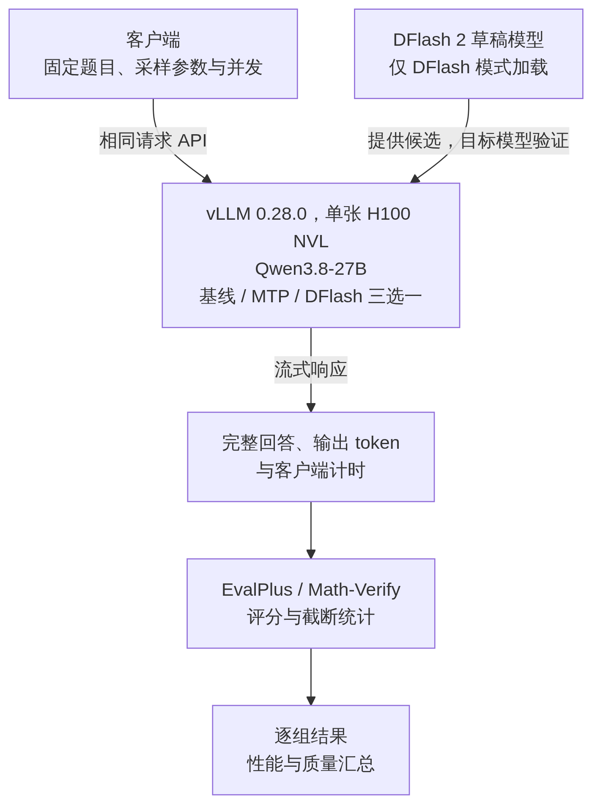
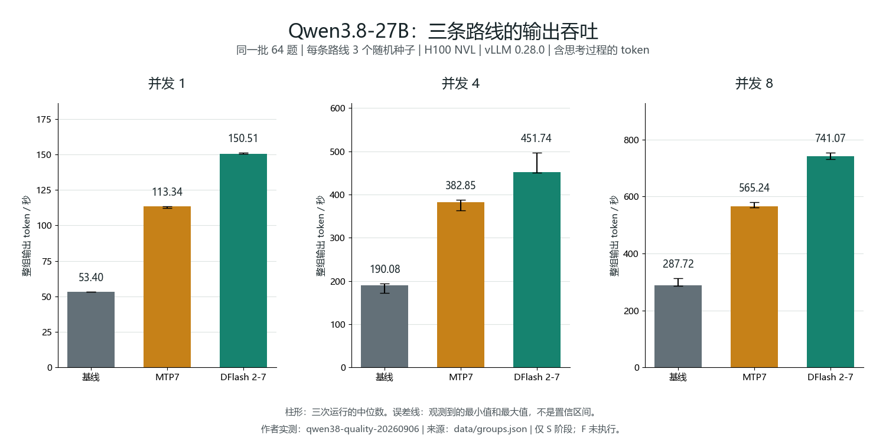
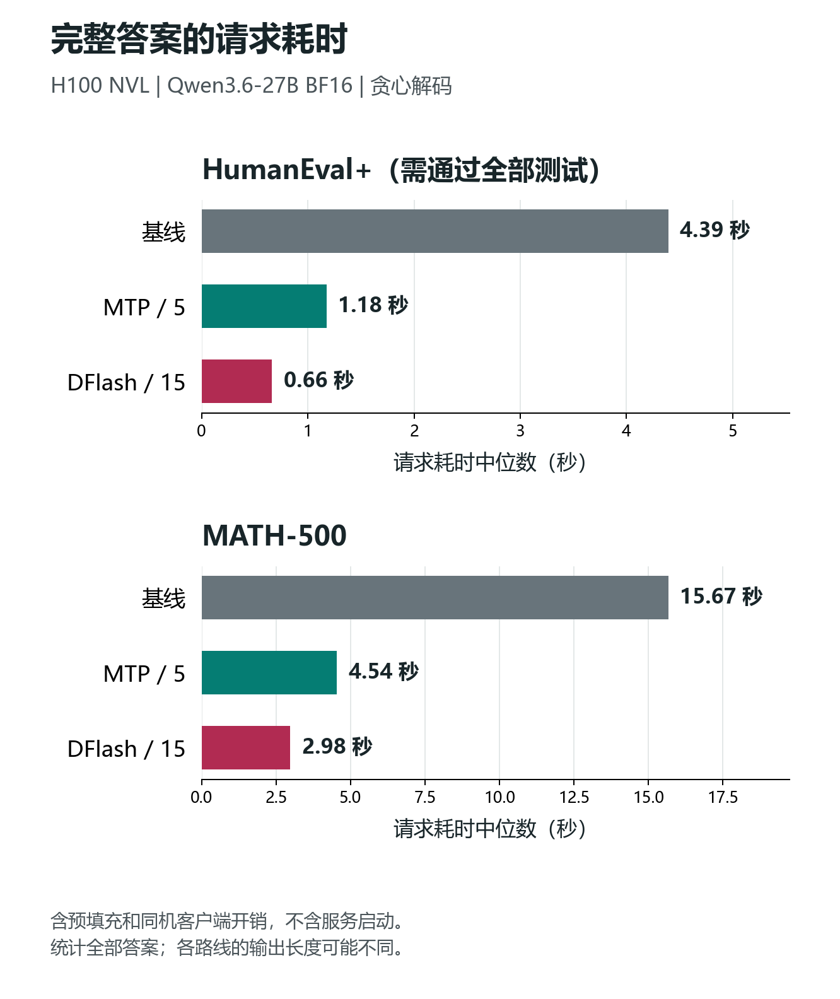
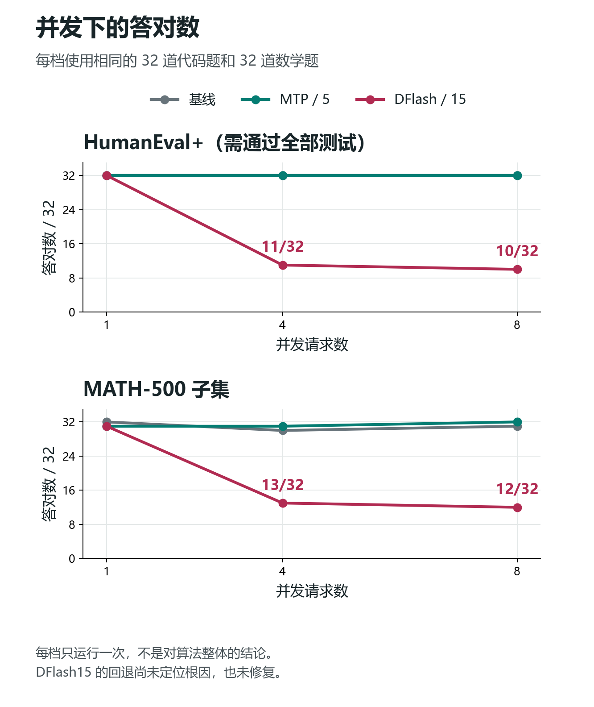

# 推测解码：Qwen3.8-27B 上的 MTP 与 DFlash 2 实测

[](https://github.com/vllm-project/vllm/releases/tag/v0.28.0)
[](#测试方法)
[](#测试方法)
[](#测试覆盖与未执行项)
[](https://github.com/david-xinyuwei/david-share/actions/workflows/speculative-decoding-ci.yml)

这个仓库帮助你在 vLLM 上部署 Qwen3.8-27B 时比较模型自带的 MTP 和 DFlash 2，并提供权重下载、三种服务启动、客户端请求配置和结果核对方法。选型同时看吞吐、延迟和答案质量，不能只凭每秒输出多少 token 决定是否切换。

在单张 H100 NVL 上，同一批 32 道代码题和 32 道数学题在并发 1、4、8 下各跑三次。九组配对中，DFlash 2 的输出吞吐均高于 MTP7。得分总体接近，但并发 4 的第三次运行里，DFlash 2 的代码题答对 **29/32**，MTP7 为 **31/32**，而且 DFlash 2 做完这一组题更慢。**吞吐优势已经测到，准确率不下降尚未得到证明。**

这是作者在 vLLM 上的部署实测，不是 DFlash 论文的完整复现，也不能直接作为生产验收结论。完整题集阶段未执行；更早的 Qwen3.6 实验在下文单独报告，不与本次数字混算。

> 作者：魏新宇（Xinyu Wei）

[English](README.md) | [中文](README_CN.md)

[从这里开始](#从这里开始) · [结果](#吞吐与答案质量) · [方法](#测试方法) · [启动与调用](#how-to-run) · [覆盖范围](#测试覆盖与未执行项) · [测试](#测试与离线复算)

实验日期：2026-09-06。运行标识：`qwen38-quality-20260906`。

---

## 从这里开始

| 你想了解什么 | 入口 |
|---|---|
| 这个仓库能帮我做什么 | [你能用它做什么](#你能用它做什么) |
| DFlash 2 比 MTP 快多少，答案有没有变差 | [本次实测说明了什么](#本次实测说明了什么)、[吞吐与答案质量](#吞吐与答案质量) |
| 客户端、推理服务和评分怎样连接 | [架构与测试流程](#架构与测试流程) |
| 下载权重，启动基线、MTP 或 DFlash，设置客户端 | [启动与调用](#how-to-run) |
| 测了什么、没测什么 | [测试方法](#测试方法)、[测试覆盖与未执行项](#测试覆盖与未执行项) |
| 核对报告数字和已保存记录 | [测试与离线复算](#测试与离线复算) |
| 理解两种起草方式的区别 | [MTP 和 DFlash 差在哪里](#mtp-和-dflash-差在哪里) |
| 回看首代 DFlash 的并发异常 | [上一轮实验](#previous-experiment) |

## 你能用它做什么

| 目标 | 仓库提供什么 | 对你的帮助 |
|---|---|---|
| 启动三条推理路线 | 固定权重版本、完整启动命令和相同请求样例 | 不必从零拼装 MTP、DFlash 与客户端参数 |
| 判断哪条路线值得验证 | 同一批题目的吞吐、延迟、答对数和截断记录 | 同时比较速度与答案质量，识别“token 更快、正确答案反而交付更慢”的情况 |
| 核对选型依据 | 逐组数据、评分接入源码、分析程序和测试 | 能检查报告数字从何而来，再为自己的业务设计验收 |

这里提供的是部署参考和测试依据，不是经过生产验收的托管服务。完整 27 组实验的准备与调度尚未提供独立运行入口，边界见[复现范围](#复现范围)。

## 本次实测说明了什么

| 问题 | 实测回答 |
|---|---|
| 输出吞吐更高吗 | 是。三档并发、三个随机种子的九组配对中，DFlash 2 都高于 MTP7 |
| 准确率不下降得到证明了吗 | 没有。每类只有 32 道不同题目，三次重复用于观察波动，不能当成 96 道独立题 |
| 正确答案也一定更快交付吗 | 不一定。并发 4 的第三次运行中，DFlash 2 做完同一组题更慢，正常结束且答对的答案交付速率也低于 MTP7 |
| 原定全量题集都测了吗 | 没有。已完成 1,920 份响应，原计划 5,904 份；其余 3,984 份未执行，不计作答错 |

吞吐优势不能替代客户负载上的准确率、延迟和异常率验收。

## 架构与测试流程

客户端与推理服务运行在同一台机器上，通过回环地址通信。服务端每次只启动基线、MTP 或 DFlash 中的一种模式；切换模式不改变客户端 API。客户端记录请求耗时，评分程序检查生成的完整答案。



*原创测试流程图，依据本次[执行程序](experiments/20260906-qwen38/source/campaign_runner.py)、[流式计时](experiments/20260906-qwen38/source/stream_metrics.py)与[评分接入](experiments/20260906-qwen38/source/scoring.py)绘制；图源为 [test-flow-cn.mmd](experiments/20260906-qwen38/images/test-flow-cn.mmd)。图中区分推理、客户端测量和评分；三种模式并非同时运行。*

## MTP 和 DFlash 差在哪里

推测解码先由草稿模型（draft model）提出候选，再由目标模型验证。目标模型仍决定哪些 token 能进入输出。

| 比较项 | 本次 MTP7 | 本次 DFlash 2-7 |
|---|---|---|
| 起草所用权重 | Qwen3.8 模型文件自带的 MTP 权重 | 与目标模型配套的 DFlash 2 权重 |
| 候选怎样生成 | 在本次 vLLM 路径中逐步起草 | 通过块扩散（block diffusion）并行生成一组候选 |
| 每轮候选数量 | 7 个 token | 7 个 token |
| 谁做最终验证 | 同一个 Qwen3.8 目标模型 | 同一个 Qwen3.8 目标模型 |

这里的“7”是候选数量，不是网络层数。一次前向计算也不表示网络只有一层；它仍会经过草稿模型的各层。MTP 权重是否单独发布，随具体模型而异，不能把本次的打包方式当成 MTP 的统一定义。

推测解码的收益取决于两件事：每轮起草与验证花了多久，以及这一轮实际推进了多少个 token。候选越多，不一定越快；接受率也不是答案准确率。采样算法的分布保证，还需要正确的引擎实现，不能替代部署后的质量测试。

机制资料见 [DFlash 论文](https://arxiv.org/abs/2602.06036)和 [vLLM 固定版本源码](https://github.com/vllm-project/vllm/tree/2cf0a6915ce544dc493a0990f2ea38d81601128a)；本次参数见[实验配置](experiments/20260906-qwen38/evidence/configuration.json)。

## 吞吐与答案质量

使用 32 道 HumanEval+ 代码题和 32 道 MATH-500 数学题，三条路线在并发 1、4、8 下各跑三次，共 27 组。每组都是同一批题，**每类 32 题重复三次，不是 96 道独立题**。

基线不开推测解码；MTP7 和 DFlash 2-7 都起草 7 个候选 token。下表的吞吐和整组耗时分别取三次运行的中位数。得分和截断列的三个数，依次对应随机种子 **20260906、20260907、20260908**；每个得分的分母都是 32。



*图 1：作者实测。柱形表示三次运行的中位数，误差线表示最小值和最大值，不是置信区间；同一批 64 题，吞吐包含思考过程中的 token。数据来自[数值汇总](experiments/20260906-qwen38/data/summary.json)，由[绘图脚本](tools/make_readme_figures.py)生成。*

<!-- BEGIN RESULT_TABLE -->
### 吞吐与整组耗时

| 并发 | 路线 | 吞吐（tok/s） | 整组耗时（秒） |
| --- | --- | --- | --- |
| 1 | 基线 | 53.40 | 3458.61 |
| 1 | MTP7 | 113.34 | 1591.09 |
| 1 | DFlash 2-7 | 150.51 | 1149.41 |
| 4 | 基线 | 190.08 | 1037.22 |
| 4 | MTP7 | 382.85 | 470.35 |
| 4 | DFlash 2-7 | 451.74 | 377.79 |
| 8 | 基线 | 287.72 | 577.44 |
| 8 | MTP7 | 565.24 | 308.08 |
| 8 | DFlash 2-7 | 741.07 | 249.68 |

### 代码与数学得分

| 并发 | 路线 | 代码答对数 /32 | 数学答对数 /32 |
| --- | --- | --- | --- |
| 1 | 基线 | 29、31、30 | 30、30、30 |
| 1 | MTP7 | 30、31、31 | 30、28、31 |
| 1 | DFlash 2-7 | 30、31、30 | 29、32、30 |
| 4 | 基线 | 31、31、31 | 30、31、30 |
| 4 | MTP7 | 30、30、31 | 29、29、29 |
| 4 | DFlash 2-7 | 31、31、29 | 31、31、30 |
| 8 | 基线 | 31、31、31 | 30、29、30 |
| 8 | MTP7 | 31、31、30 | 29、29、30 |
| 8 | DFlash 2-7 | 31、31、30 | 30、31、30 |

本次所有被评分器判对的回答都正常结束，因此“答对数”和“正常结束且答对数”相同，不重复列两遍。两项原始字段均保留在数据文件中。

### 三次运行的截断情况

| 并发 | 路线 | 代码截断数 | 数学截断数 |
| --- | --- | --- | --- |
| 1 | 基线 | 1、1、2 | 2、1、2 |
| 1 | MTP7 | 2、1、1 | 1、2、1 |
| 1 | DFlash 2-7 | 2、1、2 | 2、0、1 |
| 4 | 基线 | 1、1、1 | 1、0、2 |
| 4 | MTP7 | 2、2、1 | 2、1、2 |
| 4 | DFlash 2-7 | 1、1、3 | 1、1、1 |
| 8 | 基线 | 1、1、1 | 2、2、2 |
| 8 | MTP7 | 1、1、2 | 2、1、1 |
| 8 | DFlash 2-7 | 1、1、2 | 2、1、2 |

达到输出上限的回答仍保留在每次 32 题的分母中。
<!-- END RESULT_TABLE -->

以上各表对应[数值汇总](experiments/20260906-qwen38/data/summary.json)。吞吐按“服务端确认的输出 token 总数 ÷ 整组耗时”计算，**包含思考过程、错答和截断回答中的 token**。计时从首个测量请求派发，到最后一个请求的终止事件接收完成；不含模型下载、启动、预热和评分。这不是 GPU 纯解码吞吐。

### 为什么还要看正确答案的交付速度

<!-- BEGIN COUNTEREXAMPLE -->
并发 4 的第三次运行（seed 20260908）出现了一个例外：**DFlash 2 输出 token 更快，但做完同一组题反而更慢。** 下表只统计正常结束且答对的回答，耗时取自这一次运行，不是三次运行的中位数。

| 路线 | 整组耗时（秒） | 代码答对数 /32 | 数学答对数 /32 |
| --- | --- | --- | --- |
| MTP7 | 450.87 | 31 | 29 |
| DFlash 2-7 | 484.07 | 29 | 30 |

DFlash 2 有 3 份代码回答达到输出上限。用“正常结束且答对数 ÷ 整组耗时”衡量正确答案的交付速度，DFlash 2 与 MTP7 的比值为：代码 **0.8713**，数学 **0.9635**。两者都小于 1。这说明 token 吞吐优势不能直接当成正确答案的交付优势；这次差异的原因尚未定位。
<!-- END COUNTEREXAMPLE -->

## 客户端延迟

TTFT 是等待首个输出 token 的时间；TPOT 是首个 token 之后，平均每个输出 token 的交付间隔；回答耗时是从请求派发到接收终止事件的时间。三项都从客户端观察，数值越低越好。

每个配置先分别计算三次运行的 P50，再取三个 P50 的中位数，**不是把所有响应合并后求一次分位数**。缺失或无定义的值不补零。

<!-- BEGIN LATENCY_TABLE -->
### 首 token 等待（TTFT，ms）

| 并发 | 基线 | MTP7 | DFlash 2-7 |
| --- | --- | --- | --- |
| 1 | 82.727 | 75.127 | 80.286 |
| 4 | 104.008 | 110.259 | 115.994 |
| 8 | 106.598 | 124.699 | 124.781 |

### token 交付间隔（TPOT，ms/token）

| 并发 | 基线 | MTP7 | DFlash 2-7 |
| --- | --- | --- | --- |
| 1 | 18.567 | 8.011 | 5.875 |
| 4 | 20.104 | 8.549 | 6.739 |
| 8 | 20.845 | 10.041 | 7.892 |

### 单次回答耗时（秒）

| 并发 | 基线 | MTP7 | DFlash 2-7 |
| --- | --- | --- | --- |
| 1 | 16.359 | 6.236 | 6.185 |
| 4 | 19.035 | 8.661 | 5.237 |
| 8 | 18.457 | 9.915 | 7.742 |

每个配置、每项指标均有 192 份有效响应记录，缺失 0 份。这是重复运行的观测数，不是独立题目数。
<!-- END LATENCY_TABLE -->

### 延迟的精确定义

TTFT 从派发请求计时，到首个非空生成 `token_ids` 事件为止；空的角色事件或 usage 事件不算首 token。TPOT 按 `(last_token_time - first_token_time) / (completion_tokens - 1)` 计算，仅在输出多于一个 token、且 token-ID 覆盖校验通过时有效。

一个推测解码 SSE 块可以包含多个 token，所以这些是客户端接收侧指标，不是 GPU kernel 的执行时间。定义见[配置](experiments/20260906-qwen38/evidence/configuration.json)，观测值见[逐组记录](experiments/20260906-qwen38/data/groups.json)。

## 测试方法

三条路线固定目标模型、数值精度、题目、输出预算和采样设置，只切换推测解码配置。参数来自当时保存的[配置](experiments/20260906-qwen38/evidence/configuration.json)，实际加载检查记录在[运行证据](experiments/20260906-qwen38/evidence/run.json)的 `activation` 中。

客户端、推理服务与评分程序的关系见[架构与测试流程](#架构与测试流程)。本次客户端与服务端同机，计时包含请求派发与流式响应接收，不把模型启动或离线评分时间算作推理性能。

| 项目 | 本次设置 |
|---|---|
| 硬件 | 单张 H100 NVL，张量并行度为 1 |
| 目标模型 | Qwen3.8-27B，BF16 |
| MTP | 目标模型文件自带的多 token 预测权重，未另行训练或转换 |
| DFlash 2 | incoai 发布的 Qwen3.8-27B-DFlash2，BF16 |
| 推理引擎 | vLLM 0.28.0，实际加载 Model Runner V2 |
| 候选数量 | 基线为 0；MTP7 和 DFlash 2-7 均为 7 |
| 输出预算 | 每题最多 16,384 个 token，包含思考过程 |
| 思考设置 | 开启并保留思考过程（thinking），`reasoning_effort="xhigh"` |
| 采样 | temperature 为 1.0，top_p 为 0.95，top_k 为 20 |
| 配对方式 | 并发 1、4、8；随机种子为 20260906、20260907、20260908 |

每类 32 个题目 ID 按预先固定的 SHA-256 排序规则选取，不参考回答和分数。三条路线使用相同的逐题随机种子，但这不代表每一步随机抽样完全对齐。代码题由 EvalPlus 官方工具评分，数学题由 Math-Verify 官方工具评分。

### 固定版本、完整参数与请求样例

以下链接固定到实际使用的版本，不指向模型仓库当前最新版：

| 对象 | 版本记录 |
|---|---|
| 目标模型 | [Qwen3.8-27B 固定版本权重](https://huggingface.co/Qwen/Qwen3.8-27B/tree/1d4bf0f2ff6012fd82039f2fa52739d0dd7c60c0) |
| DFlash 2 | [Qwen3.8-27B-DFlash2 固定版本权重](https://huggingface.co/incoai/Qwen3.8-27B-DFlash2/tree/dedf8df68adfb1afeaf7b7480c0a0243108177b4)，架构为 `DFlash2DraftModel` |
| vLLM | [0.28.0 固定源码](https://github.com/vllm-project/vllm/tree/2cf0a6915ce544dc493a0990f2ea38d81601128a) |
| EvalPlus | [固定源码](https://github.com/evalplus/evalplus/tree/26d6d00bb1fd0fa37f39c99d5290da67891d1c5e)，使用官方 sanitize/evaluate CLI |
| Math-Verify | [固定源码](https://github.com/huggingface/Math-Verify/tree/ba3d3aaff23b3f4cac7a14672b4f6e293d97c98b)，使用官方 `evaluate_model_outputs.py` |

其余参数为 `min_p=0.0`、`presence_penalty=0.0`、`repetition_penalty=1.0`。模板同时设置 `enable_thinking=true` 和 `preserve_thinking=true`；调度上限为 `max_model_len=32768`、`max_num_seqs=16`、`max_num_batched_tokens=16384`。

客户端按固定顺序发送请求：一个请求完成后再补发下一个，保持指定并发数。相同客户端并发不代表 GPU 每批处理的请求数和序列长度相同。记录中的路线标识分别为 `baseline`、`mtp7`、`dflash2_7`；配置中的基础随机种子为 20260906。

[请求样例](experiments/20260906-qwen38/evidence/request-examples.json)保存了第一组基线运行中 `HumanEval/69` 和 `MATH-500/100` 的提示词、完整参数及哈希。`raw_correct` 记录评分器判对数，`normal_correct` 还要求 `finish_reason=stop`；二者在本次 S 阶段恰好一致。离线分析使用已保存的评分，不重新判分。

<a id="how-to-run"></a>

## 启动与调用

### 1. 先分清目标模型和草稿模型权重

约 3.8 GB 的文件是 **DFlash 2 的草稿模型（draft model），不是完整的 Qwen3.8-27B，也不是它的 MTP 权重**。不能把该文件作为 `--model` 再指定 `method=mtp`。三条路线都必须加载完整目标模型权重：

| 路线 | 目标模型 | 推测配置 |
|---|---|---|
| 基线 | Qwen3.8-27B | 不传 `--speculative-config` |
| MTP7 | 同一目标模型，使用其自带 MTP 权重 | `method="mtp"`，不另传草稿模型 |
| DFlash 2-7 | 同一目标模型，另加载 DFlash 2 草稿模型 | `method="dflash"`，`model` 指向草稿模型目录 |

本次记录的目标 `.safetensors` 共 18 个、55,563,006,776 字节（约 55.56 GB）；草稿模型权重为 1 个、3,848,817,896 字节（约 3.85 GB / 3.58 GiB）。这是磁盘权重大小，不是推理所需总显存。**DFlash 2 是模型权重的名称，本次 vLLM 的启动方法仍写 `dflash`，不是 `dflash2` 或 `draft_model`。**

以下使用 Linux x86_64、Bash 和 Python 3.12。实测硬件为单张 H100 NVL；需要支持 CUDA 13 的 NVIDIA 驱动，以及目标模型、草稿模型、KV cache 和工作区所需显存。其他 GPU 容量与数值行为需另行验证。

### 2. 准备固定版本

以下命令都在本仓库的 `Deep-Learning/Speculative-Decoding` 目录执行。环境创建仅用于首次安装；已有经过验证的相同版本环境时直接激活，不要重建。下载会占用数十 GB 磁盘空间。

```bash
python3 -m venv "$HOME/.venvs/qwen38-specdec"
source "$HOME/.venvs/qwen38-specdec/bin/activate"
python -m pip install 'vllm==0.28.0' 'torch==2.13.0' 'transformers==5.16.1'
python -m pip check

export MODEL_ROOT="$HOME/models/qwen38"
hf download Qwen/Qwen3.8-27B \
	--revision 1d4bf0f2ff6012fd82039f2fa52739d0dd7c60c0 \
	--local-dir "$MODEL_ROOT/target"
hf download incoai/Qwen3.8-27B-DFlash2 \
	--revision dedf8df68adfb1afeaf7b7480c0a0243108177b4 \
	--local-dir "$MODEL_ROOT/draft"
```

模型目录中应包含配置、全部权重分片和目标模型的分词器（tokenizer），不能只下载一个权重分片。上述包版本来自实际安装记录；这里只固定关键包，不保证未来安装时取得的所有间接依赖完全相同。

### 3. 设置三条路线共用的启动参数

在服务端终端执行一次，三种启动方式共用同一个 Bash 数组。目标路径不要包含 `dflash` 字样，避免模型路径识别与实际角色混淆。每次启动的日志保存到 `$HOME/specdec-runs/` 下的独立目录，不覆盖已有结果。

```bash
set -euo pipefail
export VLLM_USE_V2_MODEL_RUNNER=1
export HF_HUB_OFFLINE=1 TRANSFORMERS_OFFLINE=1
export RUN_DIR="$HOME/specdec-runs/$(date -u +%Y%m%dT%H%M%SZ)"
mkdir -p "$RUN_DIR"

COMMON=(
	--model "$MODEL_ROOT/target"
	--served-model-name Qwen/Qwen3.8-27B
	--dtype bfloat16 --tensor-parallel-size 1
	--max-model-len 32768
	--max-num-seqs 16 --max-num-batched-tokens 16384
	--gpu-memory-utilization 0.9
	--no-enable-prefix-caching --kv-cache-dtype auto
	--attention-backend FLASH_ATTN --mamba-ssm-cache-dtype float32
	--reasoning-parser qwen3 --stream-interval 1
	--generation-config vllm --seed 20260906
	--limit-mm-per-prompt '{"image":0,"video":0,"audio":0}'
	--host 127.0.0.1 --port 18080
)
```

关键区别：模型和 KV cache 使用 BF16，但 Mamba SSM cache 固定为 FP32。`max-num-seqs=16` 是服务端调度上限，不是客户端必须发 16 路并发。`generation-config=vllm` 避免模型目录的生成默认值覆盖显式实验设置。

### 4. 选择一种方式启动

**同一 GPU、同一端口只运行其中一条。** 一条路线测完后，在服务端终端按 `Ctrl+C` 停止，并用 `nvidia-smi` 确认该服务已退出，再启动下一条。

基线，不启用推测解码：

```bash
python -I -B -m vllm.entrypoints.openai.api_server "${COMMON[@]}" \
	2>&1 | tee "$RUN_DIR/baseline-server.log"
```

MTP7，使用目标模型自带的 MTP 权重：

```bash
python -I -B -m vllm.entrypoints.openai.api_server "${COMMON[@]}" \
	--speculative-config '{"method":"mtp","num_speculative_tokens":7,"rejection_sample_method":"standard"}' \
	2>&1 | tee "$RUN_DIR/mtp7-server.log"
```

DFlash 2-7，额外加载配套草稿模型权重：

```bash
python -I -B -m vllm.entrypoints.openai.api_server "${COMMON[@]}" \
	--speculative-config "{\"method\":\"dflash\",\"model\":\"$MODEL_ROOT/draft\",\"num_speculative_tokens\":7,\"rejection_sample_method\":\"standard\"}" \
	2>&1 | tee "$RUN_DIR/dflash2_7-server.log"
```

另开同机终端，先检查 `curl --fail http://127.0.0.1:18080/v1/models` 能返回 `Qwen/Qwen3.8-27B`。同时核对启动日志中实际生效的模式、Model Runner V2 和精度；DFlash 应加载 `DFlash2DraftModel`。服务就绪只证明加载完成，还需要下一步真实请求。

### 5. 设置客户端请求与采样

客户端始终调用同一个 `/v1/chat/completions` 和同一个 `model` 名称，**不在客户端切换 MTP/DFlash**。模式由服务端启动参数决定。下面配置的是采样、思考过程、输出上限和请求并发，不包含联网搜索或检索增强生成（RAG）。`top_k=20` 是输出采样范围，不是服务端每轮起草的 7 个 token。

| 客户端设置 | 本次值 |
|---|---|
| 采样 | `temperature=1.0`、`top_p=0.95`、`top_k=20`、`min_p=0.0` |
| 重复惩罚 | `presence_penalty=0.0`、`repetition_penalty=1.0` |
| 思考 | `reasoning_effort="xhigh"`，模板开启并保留思考过程 |
| 输出上限 | `max_completion_tokens=16384`，包含思考过程 |
| 流式统计 | `stream=true`、`include_usage=true`、`return_token_ids=true`、`include_reasoning=true`、`stream_interval=1` |
| 客户端并发 | 正式子集分别为 1、4、8；三次基础随机种子为 20260906、20260907、20260908 |

每题实际随机种子为 `int(SHA256(f"{base_seed}|{task_id}")[:8], 16) % 2147483647`，不是把基础随机种子原样用于每题。[请求样例](experiments/20260906-qwen38/evidence/request-examples.json)保存了当时发送的完整 JSON。下面直接发送其中一份，以保持提示词和参数一致。

在客户端终端进入同一个 `Deep-Learning/Speculative-Decoding` 目录并激活相同 Python 环境，然后执行：

```bash
set -euo pipefail
source "$HOME/.venvs/qwen38-specdec/bin/activate"
CLIENT_RUN="$HOME/specdec-runs/client-$(date -u +%Y%m%dT%H%M%SZ)"
mkdir -p "$CLIENT_RUN"
python -c 'import json; from pathlib import Path; samples=json.loads(Path("experiments/20260906-qwen38/evidence/request-examples.json").read_text(encoding="utf-8")); print(json.dumps(samples[0]["request"], ensure_ascii=False))' \
	> "$CLIENT_RUN/request.json"
curl --fail-with-body --no-buffer --connect-timeout 10 --max-time 600 \
	http://127.0.0.1:18080/v1/chat/completions \
	-H 'Content-Type: application/json' \
	--data-binary @"$CLIENT_RUN/request.json" \
	| tee "$CLIENT_RUN/response.sse"
```

`samples[0]` 是代码题，改为 `samples[1]` 可发送数学题。检查完整 SSE 中的生成 `token_ids`、最终 `usage`、`finish_reason` 和 `[DONE]`；`finish_reason=length` 表示触及上限，不能当作正常完成的答案。三条路线应使用相同请求 JSON。此处 curl 的超时与记录方式仅用于单请求复现，不用于计算上文性能表。

### 复现范围

上述命令依据实际安装记录、启动参数及[测量源码](experiments/20260906-qwen38/source/campaign_runner.py)的 `server_command` 整理，将本机路径改为环境变量。**适用范围是三种服务的启动和单个请求的调用，不是完整的性能与质量评测。** 新安装环境仍需验证模型加载与请求结果，不能将已有测试成绩视为新环境的验收结果。

复跑得分表还必须保持同一批 64 题、27 组、固定顺序和并发策略，执行原测量逻辑及 EvalPlus/Math-Verify 评分。`campaign_runner.py` 所需的完整准备步骤、题目输入和调度配置尚未打包为可独立运行的公开入口，因此不能仅凭本页配置直接运行 `--stage all`。现有文件支持启动与调用参考、已保存结果的离线复算，不是完整 27 组实验的独立安装包。官方方法入口：[MTP](https://github.com/vllm-project/vllm/blob/v0.28.0/docs/features/speculative_decoding/mtp.md)、[固定版本推测配置源码](https://github.com/vllm-project/vllm/blob/2cf0a6915ce544dc493a0990f2ea38d81601128a/vllm/config/speculative.py)。

## 测试覆盖与未执行项

原计划包含四个阶段。本文的速度和得分表只使用 S 阶段，兼容性检查和贪心诊断不混入正式子集结果。

| 阶段 | 完成组数 | 实际响应数 | 状态 |
|---|---:|---:|---|
| C：兼容性检查 | 6 | 48 | 已完成 |
| G：贪心诊断 | 36 | 144 | 已完成 |
| S：重复子集 | 27 | 1,728 | 已完成 |
| F：完整题集 | 0 | 0 | 未执行 |

总计完成 **69/81 组、1,920/5,904 份响应**。剩余 12 组、3,984 份响应未执行，既不从计划中删除，也不当作答错。因此，当前结果只覆盖已完成部分，不代表全部计划通过。

F 阶段计划让三条路线在并发 1 和 8 下，分别完成全部 164 道 HumanEval+ 和 500 道 MATH-500，每题一次，随机种子为 20260906。该阶段未执行；已测子集不能写成全量题集成绩。[覆盖记录](experiments/20260906-qwen38/evidence/run.json)保留原计划和未执行项。

### 各阶段测试耗时

| 阶段 | 测量组耗时合计（秒） |
|---|---:|
| 兼容性检查（C） | 928.51 |
| 贪心诊断（G） | 387.09 |
| 重复子集（S） | 27,800.41 |
| 完整题集（F） | 0，未执行 |

这里只累加各测量组从请求派发到响应结束的耗时，不含模型下载、服务启动、预热和评分，显示到小数点后两位；精确值保留在[运行证据](experiments/20260906-qwen38/evidence/run.json)中。测试已完成不表示每份答案都正确。

<a id="previous-experiment"></a>

## 上一轮实验：Qwen3.6-27B 与首代 DFlash（2026-09-05）

上一轮使用 Qwen3.6-27B、首代 DFlash 草稿模型和 vLLM 0.21.0，在同一张 H100 NVL 上完成了全部 164 道 HumanEval+ 和 500 道 MATH-500 的完整答案评测。**DFlash15 单请求更快，主分数与基线相近；但并发 4、8 时，相同 32 道代码题和 32 道数学题的答案质量明显回退。** 根因尚未定位，也未完成修复后复测。

两轮的目标模型、草稿模型、引擎、题目范围和采样设置都不同。本轮新组合没有复现旧组合的严重回退，不能据此认定旧问题已经修好。

### 主评测：完整题集，每题一次

代码需要同时通过官方 EvalPlus 的基础与增强测试，数学由固定版本的官方 Math-Verify 脚本判分。截断回答仍留在分母内。

| 路线 | HumanEval+ | MATH-500 | 代码基础测试 | 数学长度截断 |
|---|---:|---:|---:|---:|
| Baseline | 152/164 (92.68%) | 489/500 (97.80%) | 159/164 | 4 |
| MTP5 | 155/164 (94.51%) | 494/500 (98.80%) | 162/164 | 2 |
| DFlash15 | 153/164 (93.29%) | 490/500 (98.00%) | 160/164 | 3 |

Baseline、MTP5、DFlash15 的代码请求耗时中位数为 4.393、1.175、0.660 秒，数学为 15.666、4.542、2.980 秒；代码输出速率中位数为 53.61、196.01、367.52 tok/s，数学为 54.05、187.60、281.77 tok/s。计时含预填充和同机客户端开销，不含服务启动。先对每一题计算 MTP5 耗时/DFlash15 耗时再取中位数，代码为 1.861 倍、数学为 1.498 倍。5 与 15 个草拟词元不代表相同计算预算，也不是各路线调优后的最佳配置。



*作者实测，运行编号 dflash-quality-20260905，每路线代码 164 题、数学 500 题，每题一次。图值来自[逐题复算汇总](experiments/20260905-quality/analysis/summary.json)，由[绘图脚本](tools/make_readme_figures.py)生成。统计所有答案的请求总耗时，不是单独解码算子的时间。*

### 并发质量不能放行

每档使用冻结题目清单的前 32 道代码题和前 32 道数学题，各执行一次。并发数是同机客户端同时在途的请求数，不是每秒到达率。

| 路线 | 并发 | HumanEval+ | 数学子集 | 长度截断（代码/数学） |
|---|---:|---:|---:|---:|
| Baseline | 1 | 32/32 | 32/32 | 0/0 |
| Baseline | 4 | 32/32 | 30/32 | 0/0 |
| Baseline | 8 | 32/32 | 31/32 | 0/0 |
| MTP5 | 1 | 32/32 | 31/32 | 0/0 |
| MTP5 | 4 | 32/32 | 31/32 | 0/0 |
| MTP5 | 8 | 32/32 | 32/32 | 0/0 |
| DFlash15 | 1 | 32/32 | 31/32 | 0/1 |
| DFlash15 | 4 | 11/32 | 13/32 | 8/17 |
| DFlash15 | 8 | 10/32 | 12/32 | 13/20 |



*作者实测，相同 32+32 题，每档一次。原始响应和官方评分在[结果目录](experiments/20260905-quality/results/)，汇总在[分析结果](experiments/20260905-quality/analysis/summary.json)，图由[绘图脚本](tools/make_readme_figures.py)生成。异常只绑定该轮已测组合，曲线不提供根因证明。*

HumanEval/2 是一个具体例子：三个并发档的规范化请求哈希相同，[并发 1](experiments/20260905-quality/results/dflash15/concurrency-1/repeat-0/HumanEval_2.json) 返回正确函数；[并发 4](experiments/20260905-quality/results/dflash15/concurrency-4/repeat-0/HumanEval_2.json) 返回空定义和 JSON 片段；[并发 8](experiments/20260905-quality/results/dflash15/concurrency-8/repeat-0/HumanEval_2.json) 出现无关函数名和重复文本，耗尽 4,096 个词元后截断。这套 DFlash15 配置不能凭单请求结果直接承载并发流量；现有证据也不能把原因归结为某个 vLLM 组件、浮点误差、DFlash 理论、H100 或云平台。

三条主路线各 1,012 份响应（主评测 664、同种子重复 48、流式 48、并发 192、随机采样 48、合成检索 12），加上 DFlash5 的 64 份同窗口结果，合计 **3,100 份响应、25 个路线/场景组合**。DFlash5 代码和数学均为 32/32，其并发未测试。

### 上一轮的固定方法

| 项目 | 记录值 |
|---|---|
| GPU | 一张 NVIDIA H100 NVL，95,830 MiB；驱动 610.57.04 |
| 目标模型 | `Qwen/Qwen3.6-27B` @ `6a9e13bd6fc8f0983b9b99948120bc37f49c13e9`，BF16 |
| 草稿模型 | `z-lab/Qwen3.6-27B-DFlash` @ `0919688658996800f86b895034249700e9481106` |
| 生成环境 | vLLM 0.21.0，PyTorch 2.11.0，transformers 4.57.6 |
| 评分器 | EvalPlus @ `26d6d00bb1fd0fa37f39c99d5290da67891d1c5e`；Math-Verify @ `ba3d3aaff23b3f4cac7a14672b4f6e293d97c98b` |
| 数据集 | HumanEval+ v0.1.10；MATH-500 @ `6e4ed1a2a79af7d8630a6b768ec859cb5af4d3be` |
| 主评测采样 | temperature 0，top_p 1，top_k -1，seed 20260905；`enable_thinking=false` |
| 服务参数 | max_model_len 40960，max_num_seqs 16，max_num_batched_tokens 8192，显存比例 0.9，关闭 prefix caching |
| 输出预算 | 代码 4096，数学 8192 |

模型、配置和分词器的文件哈希及包版本在 [inputs.json](experiments/20260905-quality/metadata/inputs.json)；[公开协议](experiments/20260905-quality/src/experiment.json)仅移除了私有资源管理对象，[投影说明](experiments/20260905-quality/metadata/protocol-public-projection.json)记录变更前后哈希。代码评分在无网络、非特权 Docker 容器内执行。

### 在新目录重跑上一轮生成

需要 Linux、Python 3.12、兼容的 H100 NVL 环境及容纳两个权重快照和依赖的磁盘空间。评分容器按 UID/GID 1000 执行，宿主需要能用 `sudo -n` 调用 Docker。从 `experiments/20260905-quality` 目录开始，新建运行目录，不覆盖提供的证据。

```bash
set -euo pipefail
SOURCE="$PWD"
export DFLASH_RUN_ROOT="$(mktemp -d "$HOME/quality-replay-XXXXXXXX")"
export DFLASH_CACHE_ROOT="$DFLASH_RUN_ROOT/cache"
export DFLASH_TARGET_PATH="$DFLASH_CACHE_ROOT/target"
[[ "${DFLASH_TARGET_PATH,,}" != *dflash* ]]
mkdir -p "$DFLASH_RUN_ROOT"/{src,data,metadata,logs,results,state,upstream}
cp src/quality_runner.py src/prepare_data.py src/experiment.json "$DFLASH_RUN_ROOT/src/"
cp data/math500.jsonl data/humaneval_plus.jsonl "$DFLASH_RUN_ROOT/data/"
python3.12 -m venv "$DFLASH_CACHE_ROOT/venv"
PYTHON="$DFLASH_CACHE_ROOT/venv/bin/python"
"$PYTHON" -m pip install -r "$SOURCE/metadata/requirements-frozen.txt"
"$DFLASH_CACHE_ROOT/venv/bin/hf" download Qwen/Qwen3.6-27B --revision 6a9e13bd6fc8f0983b9b99948120bc37f49c13e9 --local-dir "$DFLASH_CACHE_ROOT/target"
"$DFLASH_CACHE_ROOT/venv/bin/hf" download z-lab/Qwen3.6-27B-DFlash --revision 0919688658996800f86b895034249700e9481106 --local-dir "$DFLASH_CACHE_ROOT/draft"
curl --fail --location 'https://raw.githubusercontent.com/huggingface/Math-Verify/ba3d3aaff23b3f4cac7a14672b4f6e293d97c98b/evaluate_model_outputs.py' -o "$DFLASH_RUN_ROOT/upstream/math-verify-evaluate.py"
curl --fail --location 'https://github.com/evalplus/mbppplus_release/releases/download/v0.2.0/MbppPlus.jsonl.gz' -o "$DFLASH_RUN_ROOT/upstream/mbpp-plus-v0.2.0.jsonl.gz"
gzip -dc "$DFLASH_RUN_ROOT/upstream/mbpp-plus-v0.2.0.jsonl.gz" > "$DFLASH_RUN_ROOT/upstream/mbpp-plus-v0.2.0.jsonl"
HUMANEVAL_OVERRIDE_PATH="$DFLASH_RUN_ROOT/data/humaneval_plus.jsonl" "$PYTHON" src/prepare_data.py --root "$DFLASH_RUN_ROOT" --cache "$DFLASH_CACHE_ROOT"
sudo -n docker build -f src/Dockerfile.eval -t dflash-quality-eval:20260905 .
"$PYTHON" "$DFLASH_RUN_ROOT/src/quality_runner.py" --phase canary
"$PYTHON" "$DFLASH_RUN_ROOT/src/quality_runner.py" --phase full
"$PYTHON" "$DFLASH_RUN_ROOT/src/quality_runner.py" --phase full --route dflash5
printf '{"phase":"COMPLETE","exit_code":0}\n' > "$DFLASH_RUN_ROOT/state/campaign.json"
"$PYTHON" "$SOURCE/src/analyze_results.py" --root "$DFLASH_RUN_ROOT" --output "$DFLASH_RUN_ROOT/analysis/summary.json" --matrix
```

生成 CLI 只停止自己的模型服务，不会释放宿主机。复跑时应对照[评分依赖版本](experiments/20260905-quality/metadata/evaluator-requirements-frozen.txt)和[原镜像 ID](experiments/20260905-quality/metadata/evaluator-image-id.txt)；即使评分源码 commit 固定，Docker 基础标签和系统包仍可能变化。vLLM 0.21.0 接受 `standard`、不接受 `strict`；目标路径若含 `dflash` 可能触发方法推断误判。

## 仓库目录

| 路径 | 内容 |
|---|---|
| [`experiments/20260906-qwen38/`](experiments/20260906-qwen38/) | 本次实验：逐组记录、数值汇总、证据、执行源码快照、分析程序、验收程序、测试和测试流程图 |
| [`experiments/20260905-quality/`](experiments/20260905-quality/) | 上一轮完整答案评测：原始响应、官方评分、逐题对照、分析代码和图 |
| [`images/`](images/) | 本文使用的中文结果图 |
| [`tools/make_readme_figures.py`](tools/make_readme_figures.py) | 从两轮实验的已发布汇总数据重新生成上述中文图，需要中文字体和[固定版本的 Matplotlib](experiments/20260906-qwen38/requirements-figures.txt) |
| [`LICENSE`](LICENSE) | 本目录适用的许可证 |

## 证据与代码

| 入口 | 可核对的内容 |
|---|---|
| [执行程序](experiments/20260906-qwen38/source/campaign_runner.py) | 当时使用的组派发、计时和实验控制代码 |
| [评分接入](experiments/20260906-qwen38/source/scoring.py)、[流式计时](experiments/20260906-qwen38/source/stream_metrics.py) | 官方评分与回答如何绑定，token 如何核对，延迟如何计算 |
| [配置](experiments/20260906-qwen38/evidence/configuration.json)、[请求样例](experiments/20260906-qwen38/evidence/request-examples.json) | 固定参数及两份带哈希的实际请求 |
| [实验记录](experiments/20260906-qwen38/evidence/run.json) | 测试覆盖、加载检查、测量耗时及来源成员哈希 |
| [逐组记录](experiments/20260906-qwen38/data/groups.json)、[数值汇总](experiments/20260906-qwen38/data/summary.json) | 题目 ID、已存评分、计时、计数和配对结果 |
| [分析程序](experiments/20260906-qwen38/analyze_results.py)、[验收程序](experiments/20260906-qwen38/validate_report.py)、[测试](experiments/20260906-qwen38/test_report.py) | 重新汇总数字，检查本文表格、链接、徽章和证据是否一致 |
| [上一轮分析](experiments/20260905-quality/analysis/)、[上一轮结果](experiments/20260905-quality/results/)、[上一轮源码](experiments/20260905-quality/src/) | 2026-09-05 的逐题对照、原始响应、官方评分和分析程序 |

这些源码是实际执行版本的归档，不是从零部署 GPU 的完整安装包。**完整原始回答和 SSE 流仍在作者的私有归档中，没有在此重新分发。** 公开文件不含基础设施定位信息或凭据；归档及成员哈希说明来源，但不能独立证明运行行为。

## 测试与离线复算

下面的检查全部在本地离线运行，只读已保存的记录和本文，不会启动服务、发请求或重新评分。

| 检查项 | 命令 | 通过条件 |
|---|---|---|
| 报告与证据一致性 | `validate_report.py` | 输出 `REPORT_GATE=PASS`，每条规则各一行 `RULE ... PASS`，退出码 0 |
| 漂移与拒绝测试 | `unittest discover` | 全部测试通过；每个注入的缺陷（改表格数值、改请求、改图片字节、改归档源码、伪造验收记录、删徽章、折叠必需章节、新增嵌套 Markdown）都被对应错误拦住 |
| 独立重算汇总 | `analyze_results.py --groups` | 重新生成的 `summary.json` 与已发布版本相同 |
| 上一轮实验复算 | `analyze_results.py --root ... --matrix` | 全部 3,100 个请求、冻结题集和评分绑定均能对上 |

前置条件：Python 3.10+ 标准库，在 `Deep-Learning/Speculative-Decoding` 目录执行；上一轮实验的复算需要 Python 3.12。不需要 GPU、网络、凭据或额外依赖。专用 CI 在 Windows 和 Linux 的 Python 3.10、3.12 上执行前两项，在 Python 3.12 上执行上一轮复算。

这些测试不覆盖：新的推理、官方重新评分、GPU kernel 行为，以及需要 Matplotlib 和中文字体、因而手动执行的绘图脚本。

```bash
python experiments/20260906-qwen38/validate_report.py
python -m unittest discover -s experiments/20260906-qwen38 -p "test_*.py"
```

验收应输出 `REPORT_GATE=PASS`，测试全部通过，两条命令的退出码都为 0。它们检查本文表格、已保存的评分和文件哈希是否一致。

要从逐组数据独立核对汇总数字，可执行：

```bash
python experiments/20260906-qwen38/analyze_results.py --groups experiments/20260906-qwen38/data/groups.json --output experiments/20260906-qwen38/regenerated
```

输出目录中的 `summary.json` 可与[已发布汇总](experiments/20260906-qwen38/data/summary.json)对照。程序只读取已保存的评分、计数和计时，不执行生成的答案。

上一轮实验的复算需要 Python 3.12，检查全部 3,100 个请求、固定题集、题目/重复次数和评分绑定；缺题或错配会失败，不会缩小分母后报分：

```bash
python experiments/20260905-quality/src/analyze_results.py --root experiments/20260905-quality --output out/20260905-replayed.json --matrix
```

## 结论适用到哪里

- 可以说明本次固定配置、固定子集中的性能和得分，不能证明统计显著性、分布等价或正式非劣效。
- 吞吐、客户端延迟、正确答案交付速度是不同指标，不能互相替代，也不能据此推断 GPU kernel 的独立性能。
- 本轮换了模型、权重版本和引擎，不能据此认定上一轮 DFlash 的并发故障已修复。两轮结果独立保留。

## 官方资料

- [经典推测解码方法](https://proceedings.mlr.press/v202/leviathan23a.html)
- [DFlash 论文](https://arxiv.org/abs/2602.06036)与[项目代码](https://github.com/z-lab/dflash)
- [vLLM 0.28.0](https://github.com/vllm-project/vllm/releases/tag/v0.28.0)
- [EvalPlus](https://github.com/evalplus/evalplus)与 [MATH-500 来源](https://github.com/openai/prm800k#math-splits)
