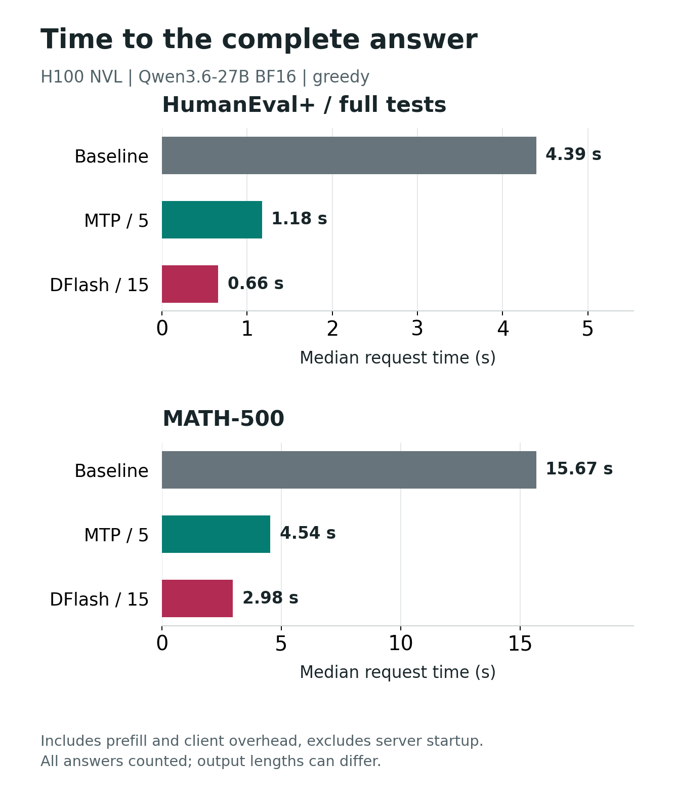
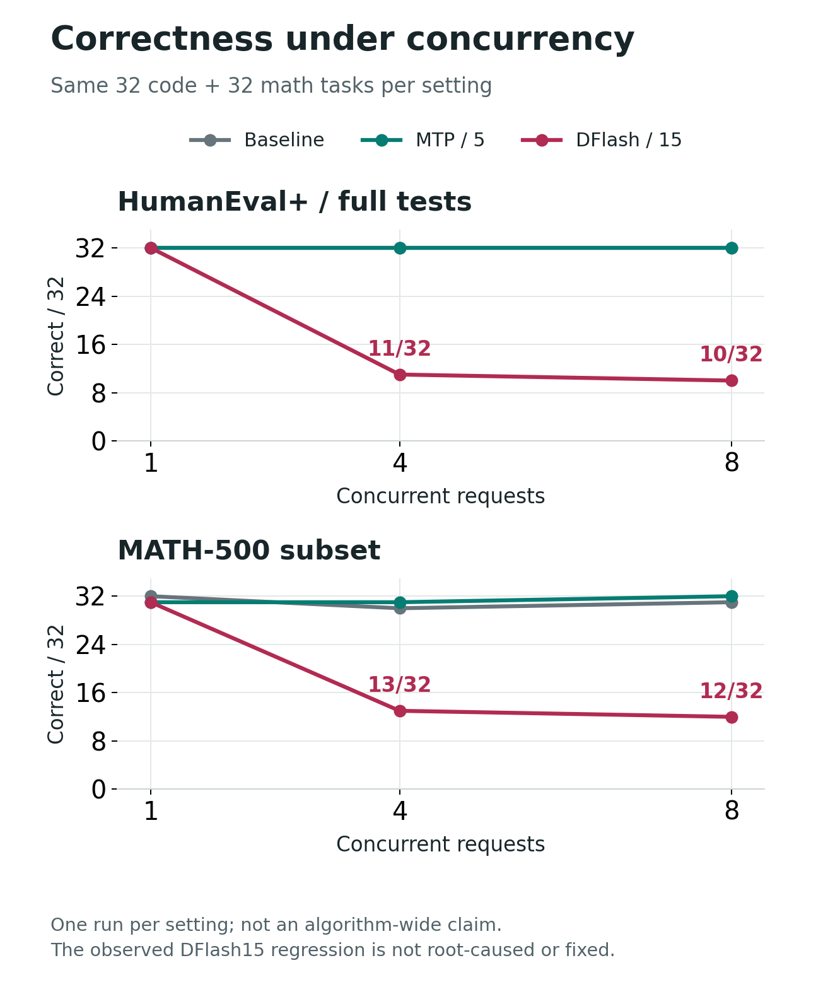

# Qwen3.6-27B：DFlash / MTP 完整答案评测

[English](README.md) | 中文

**本轮实验已完成，但 DFlash15 的并发部署没有通过已测质量检查。** 同一张 H100 NVL、同一目标权重下，DFlash15 单请求更快，主分数与基线相近；并发 4、8 时，相同 32 道代码题和 32 道数学题的答案质量明显回退。根因尚未定位，也未完成修复后复测。

这是 2026-09-05 UTC 的作者部署回归测试，不是 DFlash 论文完整复现、统计非劣效性试验或微软产品认证。上级目录中 6 月的三个限长提示词样例仍是独立实验，不能混算。

## 先看结果

主评测每路线各做 HumanEval+ 164 题和 MATH-500 500 题，每题生成一次。代码需要同时通过官方 EvalPlus 的基础与增强测试，数学由固定版本的官方 Math-Verify 脚本判分。截断回答仍留在分母内，不用补充重跑替换主答案。

| 路线 | HumanEval+ | MATH-500 | 代码基础测试 | 数学长度截断 |
|---|---:|---:|---:|---:|
| Baseline | 152/164 (92.68%) | 489/500 (97.80%) | 159/164 | 4 |
| MTP5 | 155/164 (94.51%) | 494/500 (98.80%) | 162/164 | 2 |
| DFlash15 | 153/164 (93.29%) | 490/500 (98.00%) | 160/164 | 3 |

代码主集均正常停止，没有主评测空答案。题集公开，是否存在训练材料覆盖未验证；高分不保证未知业务问题也能答对。



*作者实测，运行编号 dflash-quality-20260905，每路线代码 164 题、数学 500 题，每题一次。图值来自[逐题复算汇总](analysis/summary.json)。看的是请求总耗时，不是单独解码算子的时间；统计所有答案，不仅统计答对的题，输出长度也可能不同。*

Baseline、MTP5、DFlash15 的代码请求耗时中位数为 4.393、1.175、0.660 秒，数学为 15.666、4.542、2.980 秒。计时含预填充和同机客户端开销，不含服务启动。代码输出速率中位数为 53.61、196.01、367.52 tok/s，数学为 54.05、187.60、281.77 tok/s；计算方式是服务端 completion_tokens 除以请求总耗时。

先对每一题计算 MTP5 耗时/DFlash15 耗时，再取中位数，代码为 1.861 倍、数学为 1.498 倍。这个统计量不是两列中位数相除。三路线按顺序执行，没有随机交换顺序，也没有重复完整主集；5 与 15 个草拟词元不代表相同计算预算，更不代表各路线调优后的最佳配置。

## 相近的总分，不同的题目

相对 Baseline，DFlash15 的代码有 1 题从对变错、2 题从错变对；数学有 2 题从对变错、3 题从错变对。代码全文一致 135/164，数学全文一致 178/500。这里只比对文本，没有保存原始 token ID，因此不宣称词元 ID 完全一致。

相对 MTP5，DFlash15 少通过 2 道代码题；数学有 5 题从对变错、1 题从错变对，净少 4 题。小分数差不证明模型能力改变，也不能证明统计非劣效性。算法的条件性分布保证不替框架实现和具体部署作担保。

两个方向的逐题变化分别在 [Baseline 与 DFlash15](analysis/baseline-vs-dflash15.csv)、[MTP5 与 DFlash15](analysis/mtp5-vs-dflash15.csv) 中，包含回答路径、哈希、停止原因和耗时。

## 并发质量不能放行

每档使用冻结 manifest 的前 32 道代码题和前 32 道数学题，各执行一次。并发数是同机客户端同时在途请求数，不是每秒到达率，也不是线上随机流量。

| 路线 | 并发 | HumanEval+ | 数学子集 | 长度截断（代码/数学） |
|---|---:|---:|---:|---:|
| Baseline | 1 | 32/32 | 32/32 | 0/0 |
| Baseline | 4 | 32/32 | 30/32 | 0/0 |
| Baseline | 8 | 32/32 | 31/32 | 0/0 |
| MTP5 | 1 | 32/32 | 31/32 | 0/0 |
| MTP5 | 4 | 32/32 | 31/32 | 0/0 |
| MTP5 | 8 | 32/32 | 32/32 | 0/0 |
| DFlash15 | 1 | 32/32 | 31/32 | 0/1 |
| DFlash15 | 4 | 11/32 | 13/32 | 8/17 |
| DFlash15 | 8 | 10/32 | 12/32 | 13/20 |



*作者实测，相同 32+32 题，每档一次。原始响应和官方评分在[结果目录](results/)，汇总在[分析结果](analysis/summary.json)。异常只绑定本轮已测组合，图中的曲线不提供根因证明。*

HumanEval/2 是一个具体例子。三个并发档的规范化请求 SHA-256 相同，均为 `a2d36850694048f29a3449df499ddf831d55fd6219b7ddad9bba21a7635701ab`。[并发 1](results/dflash15/concurrency-1/repeat-0/HumanEval_2.json) 返回正确的 `truncate_number` 函数，用了 97 个词元；[并发 4](results/dflash15/concurrency-4/repeat-0/HumanEval_2.json) 返回空的 `solution` 定义和 JSON 片段；[并发 8](results/dflash15/concurrency-8/repeat-0/HumanEval_2.json) 出现无关函数名和重复文本，耗尽 4,096 个词元后截断。

分析器逐条核对了请求与原题、回答与官方评分输入/输出的对应关系。`samples.jsonl` 是生成答案给评分器的输入，不是模型提示词；它的哈希变化不能说明换了题集。

这套 DFlash15 配置不能凭单请求结果直接承载并发流量。现有证据尚不能把原因归结为某个 vLLM 组件、浮点误差、DFlash 理论、H100 或云平台；也没有修复后的配置可供宣称“问题已解决”。

## 测了哪些边界

| 组别 | 每条主路线响应数 | 实际范围 |
|---|---:|---|
| 主评测 | 664 | 164 道代码题 + 500 道数学题，每题一次 |
| 同种子重复 | 48 | 16 题各 3 次，未观察到文本或正确性变化 |
| 流式 | 48 | 相同 16 题各 3 次，记录首个非空输出和服务端最终 usage |
| 并发 1 / 4 / 8 | 192 | 每档相同 64 题，各一次 |
| 随机采样 | 48 | 16 题、3 个种子，temperature 0.7、top_p 0.9，均评分正确 |
| 合成检索 | 12 | 实际输入 4,123 / 16,416 / 32,796 词元，每长度四个位置，均正确 |

三条主路线各 1,012 份响应，加上 DFlash5 的 64 份同窗口结果，合计 **3,100 份响应、25 个路线/场景组合**。预检不计入这些分母。

DFlash5 代码和数学均为 32/32；与 MTP5 主集相同题目的逐题耗时比中位数为 1.087、1.046。相同五个候选不等于相同算力成本，DFlash5 并发仍未测试。

流式 TTFT（首个非空输出延迟）中位数，代码/数学分别为 Baseline 54.1/51.4 ms、MTP5 63.5/56.9 ms、DFlash15 60.0/54.7 ms。这个切片未显示 TTFT 加速，环回调用也不代表互联网延迟。重复性与随机采样子集很小、题目较简单，不能证明全量稳定或分布相同；合成检索不能冒充长文推理。

接受率由服务端 Prometheus 计数差计算，当前快照覆盖每条路线的**整个进程**，包含主集和所有补充场景。它不是主集单独接受率，各路线窗口和实际工作量也不同，不能直接据此排名。原始计数快照已保留。

## 固定方法与来源

| 项目 | 记录值 |
|---|---|
| GPU | 一张 NVIDIA H100 NVL，95,830 MiB；驱动 610.57.04 |
| 目标模型 | `Qwen/Qwen3.6-27B` @ `6a9e13bd6fc8f0983b9b99948120bc37f49c13e9`，BF16 |
| 草拟器 | `z-lab/Qwen3.6-27B-DFlash` @ `0919688658996800f86b895034249700e9481106` |
| 生成环境 | vLLM 0.21.0，PyTorch 2.11.0，transformers 4.57.6 |
| 评分器 | EvalPlus @ `26d6d00bb1fd0fa37f39c99d5290da67891d1c5e`；Math-Verify @ `ba3d3aaff23b3f4cac7a14672b4f6e293d97c98b` |
| 数据集 | HumanEval+ v0.1.10；MATH-500 @ `6e4ed1a2a79af7d8630a6b768ec859cb5af4d3be` |
| 主评测采样 | temperature 0，top_p 1，top_k -1，seed 20260905 |
| 思考模板 | `chat_template_kwargs={"enable_thinking": false}` |
| 服务参数 | max_model_len 40960，max_num_seqs 16，max_num_batched_tokens 8192，显存比例 0.9，关闭 prefix caching |
| 拒绝采样 | vLLM `standard`，不是 `synthetic`；主评测使用贪心分支 |
| 输出预算 | 代码 4096，数学 8192 |

模型、配置和 tokenizer 的文件哈希及包版本在 [inputs.json](metadata/inputs.json)。代码评分在无网络、非特权 Docker 容器内执行，不在 VM 宿主上直接执行生成代码。官方 sanitizer 的提取前后文件全部保留。评分环境的依赖版本与模型生成环境分开记录。

原始协议哈希为 `a379ab0f25d801e5a8e38419331586962b3299192aa8c648ce450e6b8ef82c47`，题目 manifest 哈希为 `6e9ed5aeae30acf98257714dc915ad3c28c41b14c12dd125021424cd185b8dae`。[公开协议](src/experiment.json) 仅移除了私有资源管理对象，[投影说明](metadata/protocol-public-projection.json) 记录变更前后哈希；原始响应与科学参数没有改写。不能用公开投影重建私有原件，文档也不作此承诺。

## 不用 GPU 复算

进入本实验目录，Python 3.12 标准库即可完成：

```bash
python src/analyze_results.py --root . --output analysis/summary.json --matrix
```

该命令已经在本地原件和公开副本各执行成功，检查全部 3,100 个请求、固定题集、题目/重复次数和评分绑定。缺题或错配会失败，不会缩小分母后报分。

使用记录的 Matplotlib 依赖绘图：

```bash
python src/make_quality_figures.py --summary analysis/summary.json --output analysis/figures
```

## 在新目录重跑生成

需要 Linux、Python 3.12、兼容的 H100 NVL 环境及容纳两个权重快照和依赖的磁盘空间。评分容器按 UID/GID 1000 执行，宿主需要能用 `sudo -n` 调用 Docker。这里会使用付费 GPU；上面的离线复算不需要。从本实验目录开始，新建运行目录，不覆盖提供的证据。

```bash
set -euo pipefail
SOURCE="$PWD"
export DFLASH_RUN_ROOT="$(mktemp -d "$HOME/quality-replay-XXXXXXXX")"
export DFLASH_CACHE_ROOT="$DFLASH_RUN_ROOT/cache"
export DFLASH_TARGET_PATH="$DFLASH_CACHE_ROOT/target"
[[ "${DFLASH_TARGET_PATH,,}" != *dflash* ]]
mkdir -p "$DFLASH_RUN_ROOT"/{src,data,metadata,logs,results,state,upstream}
cp src/quality_runner.py src/prepare_data.py src/experiment.json "$DFLASH_RUN_ROOT/src/"
cp data/math500.jsonl data/humaneval_plus.jsonl "$DFLASH_RUN_ROOT/data/"
python3.12 -m venv "$DFLASH_CACHE_ROOT/venv"
PYTHON="$DFLASH_CACHE_ROOT/venv/bin/python"
"$PYTHON" -m pip install -r "$SOURCE/metadata/requirements-frozen.txt"
"$DFLASH_CACHE_ROOT/venv/bin/hf" download Qwen/Qwen3.6-27B --revision 6a9e13bd6fc8f0983b9b99948120bc37f49c13e9 --local-dir "$DFLASH_CACHE_ROOT/target"
"$DFLASH_CACHE_ROOT/venv/bin/hf" download z-lab/Qwen3.6-27B-DFlash --revision 0919688658996800f86b895034249700e9481106 --local-dir "$DFLASH_CACHE_ROOT/draft"
curl --fail --location 'https://raw.githubusercontent.com/huggingface/Math-Verify/ba3d3aaff23b3f4cac7a14672b4f6e293d97c98b/evaluate_model_outputs.py' -o "$DFLASH_RUN_ROOT/upstream/math-verify-evaluate.py"
curl --fail --location 'https://github.com/evalplus/mbppplus_release/releases/download/v0.2.0/MbppPlus.jsonl.gz' -o "$DFLASH_RUN_ROOT/upstream/mbpp-plus-v0.2.0.jsonl.gz"
gzip -dc "$DFLASH_RUN_ROOT/upstream/mbpp-plus-v0.2.0.jsonl.gz" > "$DFLASH_RUN_ROOT/upstream/mbpp-plus-v0.2.0.jsonl"
HUMANEVAL_OVERRIDE_PATH="$DFLASH_RUN_ROOT/data/humaneval_plus.jsonl" "$PYTHON" src/prepare_data.py --root "$DFLASH_RUN_ROOT" --cache "$DFLASH_CACHE_ROOT"
sudo -n docker build -f src/Dockerfile.eval -t dflash-quality-eval:20260905 .
"$PYTHON" "$DFLASH_RUN_ROOT/src/quality_runner.py" --phase canary
"$PYTHON" "$DFLASH_RUN_ROOT/src/quality_runner.py" --phase full
"$PYTHON" "$DFLASH_RUN_ROOT/src/quality_runner.py" --phase full --route dflash5
printf '{"phase":"COMPLETE","exit_code":0}\n' > "$DFLASH_RUN_ROOT/state/campaign.json"
"$PYTHON" "$SOURCE/src/analyze_results.py" --root "$DFLASH_RUN_ROOT" --output "$DFLASH_RUN_ROOT/analysis/summary.json" --matrix
```

私有的云资源开关机控制器没有打包进来；生成 CLI 只停止自己的模型服务，不会释放宿主 VM。本次交付没有在第二台机器重建一遍环境，复跑时应对照[评分依赖版本](metadata/evaluator-requirements-frozen.txt)和[原镜像 ID](metadata/evaluator-image-id.txt)。即使评分源码 commit 固定，Docker 基础标签和系统包仍可能变化。

准备阶段实际踩过的入口问题也已记录：vLLM 0.21.0 接受 `standard`，不接受 `strict`；目标路径若含 `dflash`，可能触发 MTP 的方法推断误判，因此使用中性目标路径。EvalPlus sanitize 不接受 `--dataset`，且会同时读 HumanEval+ 与 MBPP+；代码已通过固定版本的 MBPP+ 离线输入解决，不向生成代码开放网络。

## 证据边界

- [导出清单](metadata/public-export.json) 保存逐文件大小、原字节哈希及协议投影说明。
- [汇总](analysis/summary.json)、[逐题对照](analysis/)和[原始响应/官方评分](results/) 均保留，包括负面结果。
- 原始证据在 VM 释放前已拉回并校验。管理日志、云标识和凭据不公开，完整私有证据由作者保留。
- 本轮不支持普遍无损、分布等价、生产就绪或跨版本结论；DFlash15 并发异常仍未解决。