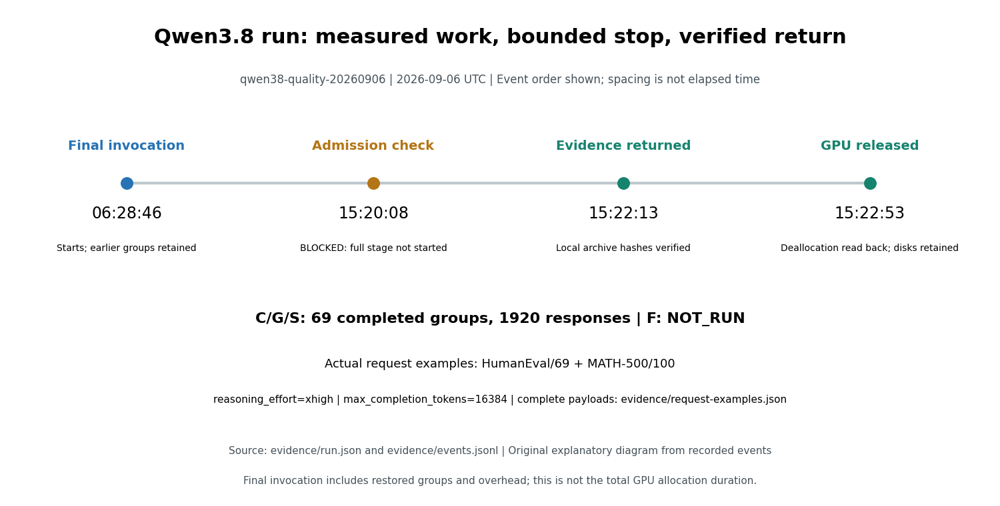

# Qwen3.8-27B 部署回归（2026-09-06）

[English](README.md) | 中文 | [推测解码总览](../../README-CN.md)

## 结论与范围

**这是作者在 vLLM 上执行的推测解码 benchmark 和部署回归，不是 DFlash 论文的完整复现，也不是质量认证。** 运行标识为 `qwen38-quality-20260906`。S 阶段中，`dflash2_7` 在三个并发档位的组吞吐三 seed 中位数均为最高。本子集的分数整体接近，但这不等于准确率保证、答案质量等价或正式的非劣效结论。

C/G/S 已执行 **69 组、1,920 份响应**，原计划为 **5,904 份**。完整计划仍为 `BLOCKED`：F 的 **3,984 份响应从未执行，状态为 `NOT_RUN`**，原计划分母不变。

## S 阶段结果

S 阶段共 27 组：三条路线、并发 1/4/8、三个 seed。每组使用同一批 64 题，包括 32 道 HumanEval+ 代码题和 32 道 MATH-500 数学题。同一批 32 题重复三次，**不是 96 道独立题**。

表内三元组依次对应 seed **20260906、20260907、20260908**。正确数的每个值都以 32 为分母；代码对应 HumanEval+，数学对应 MATH-500。吞吐和组耗时分别取三个 seed 的中位数；截断列记录 `length_stopped` 次数，不是百分比。

<!-- BEGIN RESULT_TABLE -->
| 路线 / 并发 | tok/s 中位数 | 组耗时中位数（秒） | 代码 raw /32 | 代码 normal /32 | 数学 raw /32 | 数学 normal /32 | 代码截断 | 数学截断 |
| --- | --- | --- | --- | --- | --- | --- | --- | --- |
| baseline / 1 | 53.40 | 3458.61 | 29, 31, 30 | 29, 31, 30 | 30, 30, 30 | 30, 30, 30 | 1, 1, 2 | 2, 1, 2 |
| mtp7 / 1 | 113.34 | 1591.09 | 30, 31, 31 | 30, 31, 31 | 30, 28, 31 | 30, 28, 31 | 2, 1, 1 | 1, 2, 1 |
| dflash2_7 / 1 | 150.51 | 1149.41 | 30, 31, 30 | 30, 31, 30 | 29, 32, 30 | 29, 32, 30 | 2, 1, 2 | 2, 0, 1 |
| baseline / 4 | 190.08 | 1037.22 | 31, 31, 31 | 31, 31, 31 | 30, 31, 30 | 30, 31, 30 | 1, 1, 1 | 1, 0, 2 |
| mtp7 / 4 | 382.85 | 470.35 | 30, 30, 31 | 30, 30, 31 | 29, 29, 29 | 29, 29, 29 | 2, 2, 1 | 2, 1, 2 |
| dflash2_7 / 4 | 451.74 | 377.79 | 31, 31, 29 | 31, 31, 29 | 31, 31, 30 | 31, 31, 30 | 1, 1, 3 | 1, 1, 1 |
| baseline / 8 | 287.72 | 577.44 | 31, 31, 31 | 31, 31, 31 | 30, 29, 30 | 30, 29, 30 | 1, 1, 1 | 2, 2, 2 |
| mtp7 / 8 | 565.24 | 308.08 | 31, 31, 30 | 31, 31, 30 | 29, 29, 30 | 29, 29, 30 | 1, 1, 2 | 2, 1, 1 |
| dflash2_7 / 8 | 741.07 | 249.68 | 31, 31, 30 | 31, 31, 30 | 30, 31, 30 | 30, 31, 30 | 1, 1, 2 | 2, 1, 2 |
<!-- END RESULT_TABLE -->

数据来自 [data/summary.json](data/summary.json) 的 `matched_summary`。`raw_correct` 是官方评分正确的数量；`normal_correct` 还要求 `finish_reason=stop`。本次 S 阶段中两者恰好一致，不能用接受率替代。截断响应仍保留在每次 32 题的分母中。

**计时口径：** 组 tok/s 用服务端确认的 completion token 总数除以整组耗时，**包含 thinking 及全部回答**。计时从第一个测量请求派发开始，到最后一个请求的终止事件接收完成，错答和截断所用的时间都计入；模型下载、启动、预热和判分不计入。它不是 GPU 纯 decode 吞吐，也不是 TTFT（首 token 等待时间）。

<!-- BEGIN COUNTEREXAMPLE -->
**已测反例：并发 4、seed 20260908。下表只取这一次运行，不使用上方三次运行的中位数。**

| 路线 | 该次整组耗时（秒） | 正常答对代码 /32 | 正常答对数学 /32 |
| --- | --- | --- | --- |
| mtp7 | 450.866977 | 31 | 29 |
| dflash2_7 | 484.069949 | 29 | 30 |

DFlash 2 有 3 份代码回答因长度上限停止。按各数据集的 `normal_correct / 整组耗时` 计算，DFlash/MTP 的正常正确答案每秒速率比为：代码 **0.8713**，数学 **0.9635**。这两个比率低于 1，尽管该次 DFlash 的 token 速率更高；不能据此作根因诊断或宣称所有性能指标都更好。
<!-- END COUNTEREXAMPLE -->


*图 1：作者实测，运行标识 `qwen38-quality-20260906`。并发 C1/C4/C8，每条路线在每个并发档位测三个 seed，使用同一批 64 题（32 道代码题 + 32 道数学题）；组 tok/s 包含 thinking。图示为三次记录的中位数与最小值/最大值，不是置信区间。来源：[data/groups.json](data/groups.json)。应同时查看吞吐及重复运行的取值范围。*

## 客户端延迟

每条路线、每个并发档位先分别计算三个 seed 的 P50，再取这三个 P50 的中位数，**不是把重复响应合并后求一个分位数**。表内分别列出 TTFT 和 TPOT 的有效、缺失请求数；这些是响应观测数，不是独立题目数。缺失或无定义的值不能补成零。

<!-- BEGIN LATENCY_TABLE -->
| 路线 / 并发 | TTFT（ms） | TPOT（ms/token） | E2E（秒） | TTFT 有效 / 缺失 | TPOT 有效 / 缺失 | E2E 有效 / 缺失 |
| --- | --- | --- | --- | --- | --- | --- |
| baseline / 1 | 82.727 | 18.567 | 16.359 | 192 / 0 | 192 / 0 | 192 / 0 |
| mtp7 / 1 | 75.127 | 8.011 | 6.236 | 192 / 0 | 192 / 0 | 192 / 0 |
| dflash2_7 / 1 | 80.286 | 5.875 | 6.185 | 192 / 0 | 192 / 0 | 192 / 0 |
| baseline / 4 | 104.008 | 20.104 | 19.035 | 192 / 0 | 192 / 0 | 192 / 0 |
| mtp7 / 4 | 110.259 | 8.549 | 8.661 | 192 / 0 | 192 / 0 | 192 / 0 |
| dflash2_7 / 4 | 115.994 | 6.739 | 5.237 | 192 / 0 | 192 / 0 | 192 / 0 |
| baseline / 8 | 106.598 | 20.845 | 18.457 | 192 / 0 | 192 / 0 | 192 / 0 |
| mtp7 / 8 | 124.699 | 10.041 | 9.915 | 192 / 0 | 192 / 0 | 192 / 0 |
| dflash2_7 / 8 | 124.781 | 7.892 | 7.742 | 192 / 0 | 192 / 0 | 192 / 0 |
<!-- END LATENCY_TABLE -->

基于 token 的 TTFT 从请求派发计时，到首个非空生成 `token_ids` 事件为止；空的角色事件或 usage 事件不算首 token。逐请求 TPOT（平均每个输出 token 的交付间隔）按 `(last_token_time - first_token_time) / (completion_tokens - 1)` 计算，仅在输出多于一个 token、且 token-ID 覆盖校验通过时有效。它们是**客户端接收侧指标**，不是 GPU kernel 耗时分位数；一个推测解码 SSE 块可以包含多个 token。定义和已保存观测分别见 [evidence/configuration.json](evidence/configuration.json) 与 [data/groups.json](data/groups.json)。

## 已记录的方法

参数依据冻结的[配置](evidence/configuration.json)和最终[汇总](data/summary.json)，不沿用旧实验，也不把模型仓库当前版本当成本次版本。配置描述实验约定；实际加载检查另见 [evidence/run.json](evidence/run.json) 中的 `activation`。

| 项目 | 记录值 |
|---|---|
| GPU 与并行 | H100 NVL；`tensor_parallel_size=1` |
| 目标模型 | `Qwen/Qwen3.8-27B` |
| 目标 revision | `1d4bf0f2ff6012fd82039f2fa52739d0dd7c60c0` |
| draft model | `incoai/Qwen3.8-27B-DFlash2` |
| draft revision | `dedf8df68adfb1afeaf7b7480c0a0243108177b4` |
| 精度 | 目标与 draft model 均为 `bfloat16` |
| 原生 MTP（Multi-Token Prediction，多 token 预测） | 使用该目标 checkpoint 自带的权重，没有另行训练、转换或使用社区 MTP 模型 |
| draft 所需架构 | `DFlash2DraftModel` |
| vLLM | `0.28.0`，commit `2cf0a6915ce544dc493a0990f2ea38d81601128a` |
| 配对 seed | `20260906`、`20260907`、`20260908`；`coverage.sampling.seed=20260906` 是基础配置记录 |
| 路线与并发 | 保留归档标识 `baseline`、`mtp7`、`dflash2_7`；并发 `1`、`4`、`8` |
| 推测窗口 | baseline 为 0；MTP 和 DFlash 2 均为 7 个 token |
| 采样 | `temperature=1.0`、`top_p=0.95`、`top_k=20`、`min_p=0.0` |
| 惩罚项 | `presence_penalty=0.0`、`repetition_penalty=1.0` |
| 思考设置 | `reasoning_effort="xhigh"`；`chat_template_kwargs`：`enable_thinking=true`、`preserve_thinking=true` |
| 长度与调度上限 | `max_completion_tokens=16384`；`max_model_len=32768`；`max_num_seqs=16`；`max_num_batched_tokens=16384` |
| 请求派发 | 客户端与服务端同机，经回环地址按冻结顺序、固定并发补位派发；不代表 GPU 批次形状相同 |
| 评分器 | EvalPlus 官方 sanitize/evaluate CLI，commit `26d6d00bb1fd0fa37f39c99d5290da67891d1c5e`；Math-Verify 官方 `evaluate_model_outputs.py`，commit `ba3d3aaff23b3f4cac7a14672b4f6e293d97c98b` |

每个数据集的 32 个题目 ID 按冻结的 SHA-256 排序规则选取，不参考回答或分数。逐题请求 seed 在各路线间保持一致，但这不代表随机 token 抽样逐步对齐。[实际请求样例](evidence/request-examples.json)保留了 `S-baseline-c1-s20260906-r1-thinking-mixed` 中 `HumanEval/69` 和 `MATH-500/100` 的原始提示词、请求参数及哈希。分析保留归档中的官方判分、token 计数和计时记录，不重新判分。

版本来源：[目标模型](https://huggingface.co/Qwen/Qwen3.8-27B/tree/1d4bf0f2ff6012fd82039f2fa52739d0dd7c60c0)、[DFlash 2](https://huggingface.co/incoai/Qwen3.8-27B-DFlash2/tree/dedf8df68adfb1afeaf7b7480c0a0243108177b4)、[vLLM 固定源码](https://github.com/vllm-project/vllm/tree/2cf0a6915ce544dc493a0990f2ea38d81601128a)。

## 执行覆盖

各行均属于 `qwen38-quality-20260906`，覆盖 baseline、MTP、DFlash 2 三条路线。阶段耗时取自 [evidence/run.json](evidence/run.json)，是该阶段各测量组耗时之和，不是 VM 占用时间。

| 阶段 | 已完成组数 | 实际响应数 | 测量组耗时合计（秒） | 执行状态 |
|---|---:|---:|---:|---|
| C：兼容性小样本 | 6 | 48 | 928.508749592 | COMPLETE |
| G：贪心诊断 | 36 | 144 | 387.088947539 | COMPLETE |
| S：配对子集 | 27 | 1,728 | 27800.411325179 | COMPLETE |
| F：完整数据集 | 0 | 0 | 0（未执行） | NOT_RUN：12 组、3,984 份响应 |

总覆盖为 **69/81 组、1,920/5,904 份响应**：`48 + 144 + 1728 = 1920`，`1920 + 3984 = 5904`。C/G 不混入 S 阶段结果表；COMPLETE 只表示相应执行已完成，不表示每份答案都正确。

F 的 12 组对应三条路线、并发 1 和 8、seed 20260906，以及 HumanEval+、MATH-500 两个数据集。未执行项既不删除，也不补判分。启动 F 前，时间检查给出的预计耗时为 **134491.31154072736 秒**，已包含 **1.5 的安全系数**，而剩余时限为 **4628.763888597488 秒**；因此记录 `FULL_MATRIX_DOES_NOT_FIT_BILLING_RUNWAY; denominator unchanged`。这是根据预计耗时作出的启动判断，不是“算力一直运行到预算耗尽”。

### 执行时间线

以下节点来自 [evidence/run.json](evidence/run.json)；更早的调用记录保留在 [evidence/events.jsonl](evidence/events.jsonl)。



*图 2：依据本次运行事件、配置和请求样例生成的原创解释图。图示测量、全量启动被阻止、本地校验和 GPU 释放的先后关系，距离不按时间比例绘制；精确时间见下方生成式日志。*

<!-- BEGIN RUN_LOG -->
```text
last_invocation_start_utc=2026-09-06T06:28:46.633864+00:00 run_id=qwen38-quality-20260906
last_invocation_end_utc=2026-09-06T15:20:08.244046+00:00 phase=BLOCKED completed=1920 total=5904
evidence_verified_utc=2026-09-06T15:22:13Z evidence_verified=true
power_verified_utc=2026-09-06T15:22:53.681726+00:00 power_decision=STOPPED
```
<!-- END RUN_LOG -->

**最后一次调用**耗时 **31881.610182 秒**，其中包含恢复已有组和非测量开销，不是完整实验的 VM 总占用时长。它与上表的测量组耗时合计、逐请求延迟是不同的时钟，不能相加或相互替代；公开快照不足以据此重建 VM 总占用时长。

## 证据与复算边界

| 产物 | 可查看的内容 |
|---|---|
| [source/campaign_runner.py](source/campaign_runner.py) | 实际测量代码的归档快照：组派发、计时与实验流程控制 |
| [source/scoring.py](source/scoring.py) | 官方评分器的接入和结果绑定 |
| [source/stream_metrics.py](source/stream_metrics.py) | SSE token 核对与客户端计时定义 |
| [evidence/configuration.json](evidence/configuration.json)、[evidence/request-examples.json](evidence/request-examples.json) | 冻结的服务、评分约定，以及两份带哈希的实际请求 |
| [evidence/run.json](evidence/run.json)、[evidence/events.jsonl](evidence/events.jsonl) | 终态、生命周期时间点、加载观测和来源记录 |
| [data/groups.json](data/groups.json)、[data/summary.json](data/summary.json) | 公开复算输入及派生汇总；逐组 `ordered_task_ids` 保存实际输入清单 |
| [evidence/run.json](evidence/run.json) 的 `source_members` | 来源成员 manifest，含字节数和 SHA-256；复算数据中逐组 `source` 指向原始成员 |
| [analyze_results.py](analyze_results.py) | 标准库数值汇总，以及可选图片生成 |

这些源码快照说明了已执行实验所归档的测量代码，**不是从零准备 GPU 并复跑的完整部署包**，也不代表一次新运行。公开投影不含基础设施定位信息或凭据。**原始 SSE 流和完整原始回答仍在私有归档中，不在这里重新分发。** 归档 SHA-256 与成员 manifest 用于说明来源；哈希本身不能独立证明运行行为。

## 离线复算

在本目录执行，使用 Python 3.10+ 标准库，无需安装包、GPU、网络或凭据：

```bash
python validate_report.py
python -m unittest discover -p "test_*.py"
```

两项检查均应以退出码 0 结束。它们验证已保存报告和复算约定，不执行新的推理或官方评分。需要重新生成数值汇总时，可另行执行：

```bash
python analyze_results.py --groups data/groups.json --output regenerated
```

这条命令只汇总**已保存的判分、计数和计时**，不生成响应、不执行生成的答案，也不重新判分；输出可与 [data/summary.json](data/summary.json) 对照。追加 `--figure regenerated/throughput.png` 可生成图表，此可选操作使用 [Matplotlib 3.10.9](requirements-figures.txt)，数值复算本身不需要。审阅源码变更后，可运行 `python validate_report.py --refresh --timeline` 重新生成时间线、报告块和 manifest；默认验收命令不会改写证据。图片字节可能随字体或平台变化。从父目录执行的检查入口见[根文档快速开始](../../README-CN.md#快速开始)。

## 边界

- 有限题目的重复运行不提供统计显著性、分布等价、正式非劣效或普遍无损保证。
- draft 接受率不是答案准确率；`raw_correct`、`normal_correct` 和截断数必须分别看待。
- 本次使用不同的模型、checkpoint 和运行时，**不能据此认定 [9 月 5 日的 DFlash 并发故障](../20260905-quality/README-CN.md)已经修好**。旧结果独立保留，不改写、不混算。
- 组吞吐和客户端延迟对应不同测量边界，都不能证明 GPU kernel 的独立性能。公开离线复算检查的是已保存证据，不是新执行的 GPU 任务。