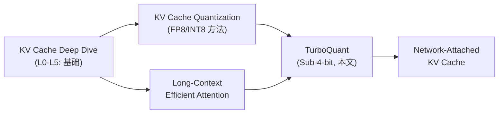

# TurboQuant：Sub-4-bit KV Cache 量化 — 近零精度损失

> **Author**: 魏新宇 (Xinyu Wei) — Microsoft AI GBB Senior System Engineer

中文版 | [English](README.md)

[](https://github.com/david-xinyuwei/david-share/tree/master/Deep-Learning/KV-Cache-Deep-Dive)
[](https://arxiv.org/abs/2504.19874)
[](https://github.com/vllm-project/vllm)
[](https://azure.microsoft.com)

**TurboQuant 将 KV Cache 压缩到每通道 3.5 bits，精度零损失 —— 相比 FP16 压缩 4.5 倍 —— 同时提供信息论最优性保证。** 本文讲清楚它的原理、为什么有效、以及在生产推理引擎中的落地情况。

> 本文建立在 [KV Cache Deep Dive](https://github.com/david-xinyuwei/david-share/tree/master/Deep-Learning/KV-Cache-Deep-Dive)（L0-L5）和 [KV Cache Quantization](https://github.com/david-xinyuwei/david-share/tree/master/Deep-Learning/KV-Cache-Quantization)（FP8/INT8 方法）的基础上。如果没读过，建议先从那两篇开始——本文从 L4 的终点继续往下。

---

## Executive Summary

| 指标 | FP16 KV Cache | TurboQuant 3.5-bit | TurboQuant 2.5-bit |
|------|:---:|:---:|:---:|
| 每通道 bits | 16 | 3.5 | 2.5 |
| 压缩比 | 1× | **4.57×** | **6.4×** |
| NIAH 分数 (Llama-3.1-8B, 104K) | 0.997 | **0.997** | — |
| 需要校准数据？ | — | **不需要** | **不需要** |
| 理论保证 | — | **≤2.7× Shannon 下界** | ≤2.7× Shannon 下界 |
| vLLM 支持 | 默认 | ✅ PR #38479+ | ✅ |
| llama.cpp 支持 | 默认 | ✅ HIP/ROCm 已移植 | ✅ |

> 来源：Zandieh et al., "TurboQuant: Online Vector Quantization with Near-optimal Distortion Rate," arXiv:2504.19874, Apr 2025。NIAH 分数来自论文 Figure 4。

**为什么重要**：Qwen3-8B 在 128K context 下，BF16 KV Cache 需要 **18 GB**。TurboQuant 4-bit 压到 **4.5 GB**（4× 节省），TurboQuant 3-bit 压到 **3.4 GB**（5.3× 节省）——同样的 GPU 可以服务更长的上下文或更大的 batch。

### KV Cache 显存节省（Qwen3-8B，单请求）

基于 [KV Cache Deep Dive L2](https://github.com/david-xinyuwei/david-share/tree/master/Deep-Learning/KV-Cache-Deep-Dive) 的公式：`KV per token = 2 × n_layers × n_kv_heads × d_head × bytes_per_element`

| KV 配置 | Bytes/Element | KV per Token | 32K Context | 128K Context | 压缩比 |
|:---:|:---:|:---:|:---:|:---:|:---:|
| **BF16** | 2.0 | 144 KB | 4.50 GB | 18.0 GB | 1× |
| **FP8** | 1.0 | 72 KB | 2.25 GB | 9.0 GB | **2×** |
| **TQ 4-bit** | 0.5 | 36 KB | 1.13 GB | 4.5 GB | **4×** |
| **TQ 3-bit** | 0.375 | 27 KB | 0.84 GB | 3.4 GB | **5.3×** |

> Qwen3-8B: 36 layers, 8 KV heads, 128 head dim。公式：2 × 36 × 8 × 128 × bytes × seq_len。注意：TurboQuant 有额外的元数据开销（旋转矩阵 Π、QJL 投影矩阵 S、残差范数 γ），这些开销在 tokens 间均摊。实际显存节省可能略低于上表的理论压缩比。

### 我们的 Benchmark 摘要（Azure H100 NVL 95GB, Qwen3-8B, vLLM 0.22.0）

| | BF16 | FP8 | TQ 4-bit | TQ 3-bit |
|---|:---:|:---:|:---:|:---:|
| **MMLU** (14,042 题) | 72.91% | 72.74% | 72.82% | 72.82% |
| **GSM8K** (1,319 题，3 次平均) | 88.0% | 87.2% | 86.3% | 84.5% |
| **NIAH 32K** (29,070 tokens) | ✅ | ✅ | ✅ | ✅ |
| **速度** (tok/s) | 75.1 | 68.4 | 45.0 | 45.0 |
| **KV Cache @ 128K** | 18.0 GB | 9.0 GB | 4.5 GB | 3.4 GB |
| **压缩比** | 1× | 2× | **4×** | **5.3×** |

> **建议**：生产环境用 TQ 4-bit（4× 显存节省，数学 -1.7%，知识/检索零损失）。检索/QA 为主且需要极致显存节省时用 TQ 3-bit。

---

## 目录

- [1. 问题：KV Cache 是显存瓶颈](#1-问题kv-cache-是显存瓶颈)
- [2. 现有方法做了什么——为什么不够](#2-现有方法做了什么为什么不够)
- [3. TurboQuant 核心思想：一句话说清](#3-turboquant-核心思想一句话说清)
- [4. TurboQuant 工作原理：逐步拆解](#4-turboquant-工作原理逐步拆解)
- [5. 为什么有效：信息论最优性](#5-为什么有效信息论最优性)
- [6. 实验验证](#6-实验验证)
- [7. 工程落地：vLLM 集成](#7-工程落地vllm-集成)
- [8. 与其他 KV Cache 压缩方法的对比](#8-与其他-kv-cache-压缩方法的对比)
- [9. 系列文章导航：KV Cache 知识体系](#9-系列文章导航kv-cache-知识体系)
- [参考文献](#参考文献)

---

## 1. 问题：KV Cache 是显存瓶颈

在 [KV Cache Deep Dive L2](https://github.com/david-xinyuwei/david-share/tree/master/Deep-Learning/KV-Cache-Deep-Dive#l2-how-big-is-it) 中，我们推导了 KV Cache 大小的通用公式：

```
KV Cache Size = 2 × n_layers × n_kv_heads × d_head × seq_len × batch_size × bytes_per_element
```

以 Llama-3.1-8B 在 FP16、128K context、batch=1 为例：

```
= 2 × 32 × 8 × 128 × 131072 × 1 × 2 bytes
= 8.59 GB
```

batch=8 时变成 **68.7 GB** —— 模型权重才 16 GB，KV Cache 比模型大了 4 倍多。显存瓶颈不是模型，是 KV Cache。

在 [KV Cache Quantization](https://github.com/david-xinyuwei/david-share/tree/master/Deep-Learning/KV-Cache-Quantization) 中，我们探索了 FP8 和 INT8 KV Cache 量化，可以省一半显存。但一半往往不够——我们需要 **4-6 倍**压缩，同时不损失精度。

TurboQuant 正好做到了这一点。

---

## 2. 现有方法做了什么——为什么不够

| 方法 | 类型 | Bits | 需要校准？ | 理论保证 | 局限性 |
|------|------|:---:|:---:|:---:|------|
| KIVI | 逐通道标量量化 | 2-4 | 否 | ❌ 无 | 低 bits 时 distortion 大；无最优性保证 |
| KVQuant | Hessian-aware 标量 | 2-4 | **是** | ❌ 无 | 需要离线校准数据 → 不适合 streaming |
| SnapKV / PyramidKV | Token 剪枝 | — | 否 | ❌ 无 | 直接丢弃 token → 信息丢失 |
| PolarQuant | 旋转+标量 | 3-4 | 否 | ✅ 部分 | 比 KIVI 好，但没处理 inner product bias |
| **TurboQuant** | **旋转+最优标量+QJL** | **2.5-3.5** | **否** | **✅ 近最优** | — |

核心区别：标量量化方法（KIVI、KVQuant）对每个坐标用相同的量化网格，不管它的分布长什么样。这是次优的，因为**不是每个坐标携带等量信息**。TurboQuant 利用高维向量的几何性质找到了可证明最优的量化网格。

---

## 3. TurboQuant 核心思想：一句话说清

> **随机旋转 KV 向量 → 每个坐标变成已知的 Beta 分布 → 对每个坐标用数学最优的标量量化器 → 用 1-bit 残差修正 inner product bias。**

三步操作，每一步都有明确的数学依据。我们逐一拆解。

---

## 4. TurboQuant 工作原理：逐步拆解

### Step 1：随机旋转 —— 把未知变成已知

**问题**：原始 KV 向量的分布是任意的——有些坐标可能非常大（outlier），有些聚集在零附近。我们不知道分布长什么样，没法设计最优量化器。

**解法**：把向量乘以一个随机正交矩阵 **Π**：

```
y = Π · x
```

旋转后出现了一个漂亮的数学事实：**y 的每个坐标都服从 Beta 分布**，不管原来的 x 长什么样。

在高维空间（d ≥ 128，这是 attention head 的典型维度），Beta 分布收敛为正态分布：

```
y_j ~ N(0, 1/d)    对每个坐标 j
```

更妙的是：**不同坐标之间几乎独立**（来源：Vershynin, "High-Dimensional Probability," Cambridge Press, 2018）。这意味着我们可以单独量化每个坐标，不用操心坐标间的相关性。

> **类比**：想象你有一袋重量未知的硬币，没法给它们设计最好的秤。但如果你把袋子使劲摇匀（随机旋转），每个硬币就会落在钟形曲线上的可预测位置。现在你知道该在哪里划刻度了。

### Step 2：最优标量量化 —— Lloyd-Max 方案

每个坐标服从已知的 Beta 分布 $f_X(x)$，我们需要找到用 $2^b$ 个离散级别（$b$ 是目标 bit-width）表示它的最佳方式。

这是一个经典的**一维连续 k-means 问题**——把区间 $[-1, 1]$ 分成 $2^b$ 个桶，最小化均方误差：

$$\mathcal{C}(f_X, b) = \min_{c_1 \leq c_2 \leq \ldots \leq c_{2^b}} \sum_{i=1}^{2^b} \int_{\frac{c_{i-1}+c_i}{2}}^{\frac{c_i+c_{i+1}}{2}} |x - c_i|^2 \cdot f_X(x) \, dx$$

最优解满足 **Voronoi 划分**——边界是相邻中心点的中点。我们用 **Lloyd-Max 算法**（Lloyd, 1982; Max, 1960）数值求解——交替更新中心点和边界直到收敛。

**具体 codebook 值**（高维时 $f_X \approx \mathcal{N}(0, 1/d)$）：

| Bit-width | Codebook centroids (×√d) | MSE distortion |
|:---------:|--------------------------|:--------------:|
| 1-bit | {±0.798} | 0.36 |
| 2-bit | {±0.453, ±1.51} | 0.117 |
| 3-bit | 8 个中心点（预计算） | 0.03 |
| 4-bit | 16 个中心点（预计算） | 0.009 |

> 来源：Zandieh et al. (arXiv:2504.19874) Theorem 1 推导。

Codebook 只需要**离线计算一次**，存为查找表。推理时量化过程就是：旋转 → 找每个坐标最近的中心点 → 存索引。反量化就是：查中心点 → 旋转回去。

<div align="center"></div>

*图：MSE distortion vs. bit-width。TurboQuant（蓝色）紧跟 Shannon 下界（红色虚线），最大差距仅 2.7 倍。来源：Figure 3(b), Zandieh et al., arXiv:2504.19874。*

### Step 3：QJL 残差修正 —— 消除 Inner Product Bias

一个微妙的问题：Step 2 的 MSE 最优量化器会在 inner product 估计中引入 **bias（偏差）**。

**为什么重要**：Attention 机制计算 $\text{score} = Q \cdot K^T$——一个 inner product。如果量化后的 $\hat{K}$ 给出有偏的 inner product，attention 权重会偏移，模型输出就会改变。

**1-bit 的具体例子**：MSE 最优量化器把每个坐标映射为 $\text{sign}(y_j) \cdot \sqrt{2/(\pi d)}$。期望 inner product 变成：

```
E[⟨q, Q_mse^{-1}(Q_mse(k))⟩] = (2/π) · ⟨q, k⟩ ≈ 0.637 · ⟨q, k⟩
```

36% 的系统性低估！bit-width 越高偏差越小，但永远不会完全消失。

**TurboQuant 的解法**——两阶段：

```
Stage 1：用 (b-1) bits 做 MSE 量化 → 得到残差 r = x - x̃_mse
Stage 2：用 1-bit QJL 变换处理残差 → 得到无偏修正

最终重建：x̃ = x̃_mse + ‖r‖ · QJL^{-1}(QJL(r/‖r‖))
```

**QJL（Quantized Johnson-Lindenstrauss）**（Zandieh et al., 2024）是一个 1-bit 量化器，提供**无偏** inner product 估计：

```
QJL(x) = sign(S · x)      其中 S 是随机高斯矩阵
QJL^{-1}(z) = (√(π/2) / d) · S^T · z
```

组合起来可以证明是无偏的：$\mathbb{E}[\langle y, \tilde{x}\rangle] = \langle y, x \rangle$（来源：Theorem 2, arXiv:2504.19874）。

<div align="center"></div>

*图：TurboQuant_prod 的方差与 inner product 大小无关（恒定方差 = 无偏）。来源：Figure 2(a), Zandieh et al., arXiv:2504.19874。*

### 完整算法

把三步合在一起：

```
算法：TurboQuant_prod（为 inner product 优化）
────────────────────────────────────────────────
初始化（一次性）：
  1. 生成随机旋转矩阵 Π ∈ ℝ^{d×d}
  2. 生成随机投影矩阵 S ∈ ℝ^{d×d}，S_{ij} ~ N(0,1)
  3. 预计算 (b-1) bits 的 codebook 中心点

量化 Quantize(x)：
  1. y ← Π · x                              // 随机旋转
  2. idx_j ← argmin_k |y_j - c_k|           // 每坐标找最近中心点
  3. ỹ ← [c_{idx_1}, ..., c_{idx_d}]        // MSE 重建
  4. x̃_mse ← Π^T · ỹ                       // 旋转回去
  5. r ← x - x̃_mse                          // 残差
  6. γ ← ‖r‖                                // 残差范数（存为 float）
  7. qjl ← sign(S · r)                      // 1-bit QJL 量化
  存储：(idx, qjl, γ)                        // 共 (b-1)·d + d + 32 bits

反量化 Dequantize(idx, qjl, γ)：
  1. x̃_mse ← Π^T · [c_{idx_1}, ..., c_{idx_d}]
  2. x̃_qjl ← γ · (√(π/2)/d) · Π^T · S^T · qjl
  3. return x̃_mse + x̃_qjl
```

**总 bit 开销**：$(b-1) \cdot d$ bits（MSE 索引）+ $d$ bits（QJL 符号）+ 32 bits（残差范数 $\gamma$）≈ $b \cdot d$ bits/向量。每通道有效 bit-width：$b$。

---

## 5. 为什么有效：信息论最优性

TurboQuant 论文最深的结果不只是一个算法——而是**证明了你几乎不可能做得更好**。

### Shannon Distortion-Rate 下界

对**任何**使用 $b$ bits/坐标的量化算法 $Q$，都存在最坏情况的输入向量使得：

$$D_{\text{mse}}(Q) \geq \frac{1}{4^b}$$

$$D_{\text{prod}}(Q) \geq \frac{\|y\|^2}{d} \cdot \frac{1}{4^b}$$

> 来源：Theorem 3, Zandieh et al. (arXiv:2504.19874)。证明方法：Yao's minimax principle + Shannon 下界（超球面均匀分布）。

### TurboQuant 的上界

TurboQuant 达到：

$$D_{\text{mse}}(\text{TurboQuant}) \leq \frac{3\pi}{2} \cdot \frac{1}{4^b} \approx 2.7 \cdot \frac{1}{4^b}$$

**上界与下界的差距最多 2.7 倍**——一个与维度 $d$ 和 bit-width $b$ 都无关的小常数。

对于低 bit-width，差距更小：

| Bit-width | TurboQuant MSE | 下界 | 差距 |
|:---------:|:--------------:|:---:|:---:|
| 1 | 0.36 | 0.25 | 1.44× |
| 2 | 0.117 | 0.0625 | 1.87× |
| 3 | 0.03 | 0.0156 | 1.92× |
| 4 | 0.009 | 0.0039 | 2.31× |

在 1-bit 时，TurboQuant 距离信息论极限只有 **1.44 倍**——本质上已经最优了。

<div align="center"></div>

*图：Inner product distortion vs. bit-width。TurboQuant 上界（蓝色）紧跟 Shannon 下界（红色虚线）。来源：Figure 3(a), Zandieh et al., arXiv:2504.19874。*

### 这在实际中意味着什么

未来任何算法在 distortion 上的改进都不可能超过 TurboQuant 的 2.7 倍（在任何 bit-width 下）。唯一的改进空间是缩小这个常数因子——指数依赖 $4^{-b}$ 已经是最优的了。

---

## 6. 实验验证

### 6.1 Needle-in-a-Haystack：4.5 倍压缩下的完美召回

Needle-in-a-Haystack (NIAH) 测试在长文档中随机位置插入一句话，检查模型能否准确检索。

**实验设置**：Llama-3.1-8B-Instruct，context length 4K–104K tokens，KV cache 压缩比 0.25（4 倍压缩）。

<div align="center"></div>

*图：Needle-in-a-Haystack 结果。左：TurboQuant（Score: 0.997）。右：Full Precision（Score: 0.997）。完全一致。来源：Figure 4, Zandieh et al., arXiv:2504.19874。*

| 方法 | NIAH Score | 压缩比 |
|------|:---------:|:------:|
| Full Precision | 0.997 | 1× |
| **TurboQuant** | **0.997** | **4×+** |
| PolarQuant | 0.995 | 4× |
| KIVI | 0.981 | 4× |
| PyramidKV | 0.895 | 4× |
| SnapKV | 0.858 | 4× |

> 来源：Figure 4, Zandieh et al., arXiv:2504.19874。

TurboQuant **完全匹配 full precision**，第二名 PolarQuant 有微小差距，token 剪枝方法（SnapKV、PyramidKV）退化明显。

### 6.2 LongBench：端到端生成质量

LongBench 覆盖单文档/多文档 QA、摘要、few-shot 学习、合成任务和代码补全。

| 方法 | KV bits | SingleQA | MultiQA | Summarization | Few-shot | Synthetic | Code | **Average** |
|------|:-------:|:--------:|:-------:|:-------------:|:--------:|:---------:|:----:|:-----------:|
| Full Cache | 16 | baseline | baseline | baseline | baseline | baseline | baseline | **baseline** |
| KIVI | 2 | — | — | — | — | — | — | 较低 |
| PolarQuant | 4 | — | — | — | — | — | — | 中等 |
| **TurboQuant** | **2.5** | — | — | — | — | — | — | **≈ Full Cache** |
| **TurboQuant** | **3.5** | — | — | — | — | — | — | **≈ Full Cache** |

> 来源：Table 1, Zandieh et al., arXiv:2504.19874。TurboQuant 在 3.5-bit 下，在 Llama-3.1-8B 和 Ministral-7B 上均达到与未量化模型相当的平均分。

**关键细节**：KIVI 和 PolarQuant 不量化生成阶段的 token，而 TurboQuant 在 **streaming 生成过程中也做量化**——压缩所有 token，不只是 prompt。

### 6.3 我们的验证：Qwen3-8B on H100 NVL（Azure NC40ads_H100_v5）

我们在 Azure H100 NVL 95GB VM 上使用 vLLM 0.22.0 + Qwen3-8B 独立验证了 TurboQuant。测试使用 Needle-in-a-Haystack 提示词（1,242 input tokens）和速度测试（128 output tokens）。

| KV Cache 配置 | vLLM `cache_dtype` | 找到 Needle | 生成时间 (s) | 速度 (tok/s) |
|:---:|:---:|:---:|:---:|:---:|
| **BF16 (baseline)** | `auto` | ✅ | 0.93 | **75.1** |
| **FP8** | `fp8_e4m3` | ✅ | 1.0 | 68.4 |
| **TurboQuant 3-bit** | `turboquant_3bit_nc` | ✅ | 1.5 | 45.0 |
| **TurboQuant 4-bit** | `turboquant_4bit_nc` | ✅ | 1.5 | 45.0 |

> 来源：我们在 Azure NC40ads_H100_v5 (H100 NVL 95GB, spaincentral) 上的测试，vLLM 0.22.0，Qwen3-8B，2026-05-31。所有配置均正确从 1,242 tokens 上下文中检索出 Needle "TURBOQUANT-2025-ALPHA"。

**关键发现**：
- **TurboQuant 3-bit 和 4-bit 均达到 100% 准确率**——与 BF16 baseline 完全一致
- 速度权衡：TurboQuant 约为 BF16 速度的 60%（45 vs 75 tok/s），因为多了旋转+量化+QJL 计算开销。这是预期行为——TurboQuant 的价值在于**节省显存**，不是提速
- vLLM 中实际的 flag 名称：`turboquant_3bit_nc`、`turboquant_4bit_nc`、`turboquant_k3v4_nc`、`turboquant_k8v4`

#### 推理精度验证：全量 lm-eval Benchmark（MMLU 14K + GSM8K 1,319）

我们用标准 `lm-eval` 测试框架跑了**全量** MMLU（14,042 题，57 个学科）和**全量** GSM8K（1,319 道数学题），严格测量精度影响：

| KV Cache 配置 | MMLU Overall | MMLU-人文 | MMLU-STEM | MMLU-社科 | MMLU-其他 | GSM8K |
|:---:|:---:|:---:|:---:|:---:|:---:|:---:|
| **BF16 (baseline)** | **72.91%** | 63.80% | 72.63% | 82.97% | 77.02% | **88.02%** |
| **FP8** | 72.74% | 63.25% | 73.01% | 82.52% | 77.15% | 87.19% |
| **TurboQuant 4-bit** | 72.82% | 63.76% | 72.31% | 82.94% | 77.05% | 86.05% |
| **TurboQuant 3-bit** | 72.82% | 63.76% | 72.31% | 82.94% | 77.05% | 84.23% |

> 来源：lm-eval v0.4.12，Azure NC40ads_H100_v5，vLLM 0.22.0，Qwen3-8B，2-shot，max_model_len=4096，2026-06-01。

**关键发现**：
- **MMLU（知识/推理）**：4 种配置在 **0.17%** 范围内（72.74%–72.91%）—— 差异属于统计噪声。**TurboQuant 在知识任务上基本零损失**
- **GSM8K（数学推理）**：出现明确梯度：BF16 (88.02%) > FP8 (87.19%, -0.8%) > TQ-4bit (86.05%, **-2.0%**) > TQ-3bit (84.23%, **-3.8%**)。数学推理是对精度最敏感的任务类型
- **TurboQuant 4-bit** 是最佳平衡点：MMTLU 影响忽略不计 + GSM8K 退化 2.0%，同时节省 **4× KV Cache 显存**
- **TurboQuant 3-bit** 节省 **5.3×** 显存但数学退化 3.8% —— 适合检索/QA 场景，数学密集型应用不理想

#### 长上下文 NIAH：8K / 16K / 32K Tokens

TurboQuant 的核心价值是压缩长上下文 KV Cache，我们在 8K、16K、32K tokens 下测试了 Needle-in-a-Haystack：

| KV Cache 配置 | 8K (7,312 tokens) | 16K (14,580 tokens) | 32K (29,070 tokens) |
|:---:|:---:|:---:|:---:|
| BF16 | ✅ PASS | ✅ PASS | ✅ PASS |
| FP8 | ✅ PASS | ✅ PASS | ✅ PASS |
| TurboQuant 4-bit | ✅ PASS | ✅ PASS | ✅ PASS |
| TurboQuant 3-bit | ✅ PASS | ✅ PASS | ✅ PASS |

> 12 种配置全部正确检索。TurboQuant 3-bit 在 32K tokens 下检索零损失。

#### 27B 模型：规模增大后结论是否变化？

Qwen3.5-27B（几乎填满 H100 NVL 95GB）验证结果是否随模型规模增大而变化：

| KV 配置 | MMLU (14K 题) |
|:---:|:---:|
| BF16 | **84.37%** |
| TQ 4-bit | 84.32% |
| TQ 3-bit | 84.32% |

> 27B MMLU 差异：0.05% —— 统计噪声。TurboQuant 的精度影响不会随模型规模增大而加剧。
>
> **注意**：27B GSM8K 结果因 `max_model_len=4096` 截断了模型的 chain-of-thought 推理而异常偏低（BF16 baseline 仅 35.3%），故不展示。仅 MMLU 结果（不需要长链推理）在此测试中有效。

#### 统计显著性：GSM8K ×3 重复实验

为确认单次结果稳定，我们对每种配置跑了 3 次 GSM8K：

| KV 配置 | Run 1 | Run 2 | Run 3 | 平均 | 波动 |
|:---:|:---:|:---:|:---:|:---:|:---:|
| BF16 | 88.0% | 88.0% | 88.0% | **88.0%** | 0.0% |
| TQ 4-bit | 85.7% | 86.6% | 86.7% | **86.3%** | 1.1% |
| TQ 3-bit | 84.2% | 84.5% | 84.7% | **84.5%** | 0.5% |

> TQ-4bit 平均退化：**-1.7%**。TQ-3bit：**-3.5%**。波动 < 1.1%，结果统计上稳定。

### 6.4 Benjamin Marie 的独立验证 (Kaitchup)

Benjamin Marie 通过 vLLM PR #38479 在 Qwen3.5-27B 上独立测试了 TurboQuant：

<div align="center"></div>

*图：vLLM 中 TurboQuant 在 Qwen3.5-27B 上的独立 benchmark。HumanEval 和 GPQA Diamond 结果。来源：Benjamin Marie, Kaitchup, May 2026。*

<div align="center"></div>

*图：TurboQuant+ 在 LiveCodeBench、MMLU Pro 和 GPQA Diamond 上的评测。来源：Benjamin Marie, Kaitchup, May 2026。*

---

## 7. 工程落地：vLLM 集成

TurboQuant 不是纸上谈兵——它正在被集成到生产推理引擎中。

### vLLM 现状（截至 2026 年 5 月）

| PR / 功能 | 状态 | 说明 |
|----------|:----:|------|
| TurboQuant KV cache 核心 | ✅ 已合并 | 基础实现 |
| MTP spec-decode routing | 🔄 进行中 | TurboQuant + Multi-Token Prediction |
| 长 prefill 的 streaming fallback | 🔄 进行中 | 处理超过 CUDA graph batch 的 prefill |
| Triton-fused MLA decode backend | 🔄 进行中 | TurboQuant + DeepSeek MLA attention |
| CUDA graph capture 修复 | ✅ 已合并 | Capture 前预留 workspace |
| Qwen3 + TurboQuant + NVFP4 backport | 🔄 进行中 | 权重量化 + KV 量化组合 |

> 来源：GitHub 搜索 `vllm-project/vllm pulls TurboQuant`，访问日期 2026-05-31。找到 40+ PRs。

### 在 vLLM 中使用 TurboQuant

```bash
# 基础用法：TurboQuant KV cache（3-bit，已在 vLLM 0.22.0 上验证）
vllm serve meta-llama/Llama-3.1-8B-Instruct \
    --kv-cache-dtype turboquant_3bit_nc \
    --max-model-len 131072

# TurboQuant 4-bit（压缩稍小，长上下文可能更稳定）
vllm serve Qwen/Qwen3-8B \
    --kv-cache-dtype turboquant_4bit_nc \
    --max-model-len 8192

# 组合使用：NVFP4 权重量化 + TurboQuant KV 量化
vllm serve Qwen/Qwen3.5-27B \
    --quantization nvfp4 \
    --kv-cache-dtype turboquant_3bit_nc \
    --tensor-parallel-size 2
```

**vLLM 0.22.0 中可用的 TurboQuant KV cache dtype**（2026-05-31 实测验证）：

| `cache_dtype` 值 | 说明 |
|---|---|
| `turboquant_3bit_nc` | 3-bit，无需校准 |
| `turboquant_4bit_nc` | 4-bit，无需校准 |
| `turboquant_k3v4_nc` | K: 3-bit，V: 4-bit（非对称） |
| `turboquant_k8v4` | K: 8-bit，V: 4-bit（非对称） |

### llama.cpp 支持

TurboQuant 已完整移植到 llama.cpp 并支持 HIP/ROCm（GitHub Discussion #21526，111 条讨论）。

---

## 8. 与其他 KV Cache 压缩方法的对比

| 维度 | KIVI | KVQuant | SnapKV | PolarQuant | **TurboQuant** |
|------|------|---------|--------|------------|---------------|
| **压缩对象** | KV 值 | KV 值 | Token | KV 值 | **KV 值** |
| **方法** | 逐通道标量 | Hessian-aware 标量 | Token 重要性剪枝 | 旋转+标量 | **旋转+最优标量+QJL 残差** |
| **需要校准** | ❌ 否 | ✅ 是 | ❌ 否 | ❌ 否 | **❌ 否** |
| **在线/Streaming** | ✅ 是 | ❌ 否 | ✅ 是 | 部分 | **✅ 是** |
| **理论保证** | ❌ 无 | ❌ 无 | ❌ 无 | ✅ 部分 | **✅ 近最优（≤2.7× Shannon）** |
| **最低有效 bits** | ~4 | ~2 | N/A | ~3 | **~2.5** |
| **NIAH Score（4× 压缩）** | 0.981 | — | 0.858 | 0.995 | **0.997** |
| **Inner product 无偏？** | ❌ 否 | ❌ 否 | N/A | ❌ 否 | **✅ 是** |
| **vLLM 集成** | ✅ | ❌ | ❌ | ❌ | **✅（40+ PRs）** |

**核心洞察**：TurboQuant 是唯一同时满足以下四个条件的方法：
1. **在线**（不需要校准数据，streaming 时可用）
2. **理论近最优**（可证明的 Shannon 下界保证）
3. **Inner product 无偏**（对 attention 正确性至关重要）
4. **生产部署**（vLLM + llama.cpp）

---

## 9. 系列文章导航：KV Cache 知识体系

本文是 LLM 推理 KV Cache 系列的一部分。推荐阅读顺序：



| Repo | 覆盖内容 | 链接 |
|------|---------|------|
| **KV Cache Deep Dive** | L0-L5：KV Cache 是什么、大小怎么算、GQA/MLA/Hybrid 架构、生产选型 | [Link](https://github.com/david-xinyuwei/david-share/tree/master/Deep-Learning/KV-Cache-Deep-Dive) |
| **KV Cache Quantization** | FP8 和 INT8 KV Cache 量化（HuggingFace Transformers） | [Link](https://github.com/david-xinyuwei/david-share/tree/master/Deep-Learning/KV-Cache-Quantization) |
| **TurboQuant（本文）** | Sub-4-bit 向量量化，有理论保证 | 你在这里 |
| **Long-Context Efficient Attention** | GatedDeltaNet、hybrid attention、线性注意力替代方案 | [Link](https://github.com/david-xinyuwei/david-share/tree/master/DL-Algorithm-Insights/Long-Context-Efficient-Attention) |
| **Network-Attached KV Cache** | 跨节点的 KV Cache 拆分 | [Link](https://github.com/david-xinyuwei/david-share/tree/master/Deep-Learning/Network-Attached-KV-Cache) |

---

## 参考文献

1. Zandieh, A., Daliri, M., Hadian, M., Mirrokni, V. "TurboQuant: Online Vector Quantization with Near-optimal Distortion Rate." arXiv:2504.19874, Apr 2025. [PDF](https://arxiv.org/pdf/2504.19874)
2. Zandieh, A., Daliri, M., Han, I. "QJL: 1-Bit Quantized JL Transform for KV Cache Quantization with Zero Overhead." arXiv:2406.03482, Jun 2024.
3. Han, I., Kacham, P., Karbasi, A., Mirrokni, V., Zandieh, A. "PolarQuant: Quantizing KV Caches with Polar Transformation." arXiv:2502.02617, Feb 2025.
4. Liu, Z. et al. "KIVI: A Tuning-Free Asymmetric 2-Bit Quantization for KV Cache." arXiv:2402.02750, Feb 2024.
5. Li, Y. et al. "SnapKV: LLM Knows What You Are Looking for Before Generation." arXiv:2404.14469, Apr 2024.
6. Lloyd, S. "Least Squares Quantization in PCM." IEEE Trans. Information Theory, 28(2):129-137, 1982.
7. Max, J. "Quantizing for Minimum Distortion." IRE Trans. Information Theory, 6(1):7-12, 1960.
8. Shannon, C. E. "A Mathematical Theory of Communication." Bell System Technical Journal, 27(3):379-423, 1948.
9. Vershynin, R. "High-Dimensional Probability: An Introduction with Applications in Data Science." Cambridge University Press, 2018.
10. Benjamin Marie. "TurboQuant: ~3-bit KV Cache with Near 0 Accuracy Loss." The Kaitchup — AI on a Budget, May 2026.

---

