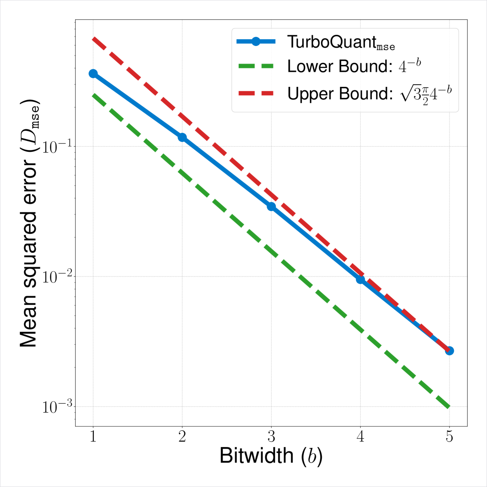
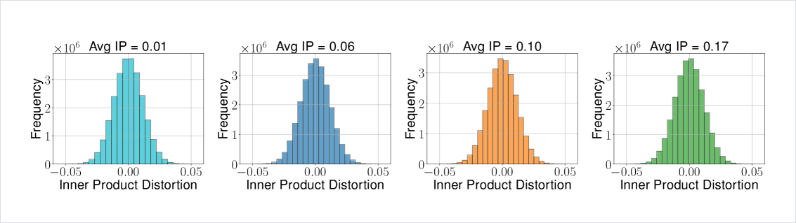
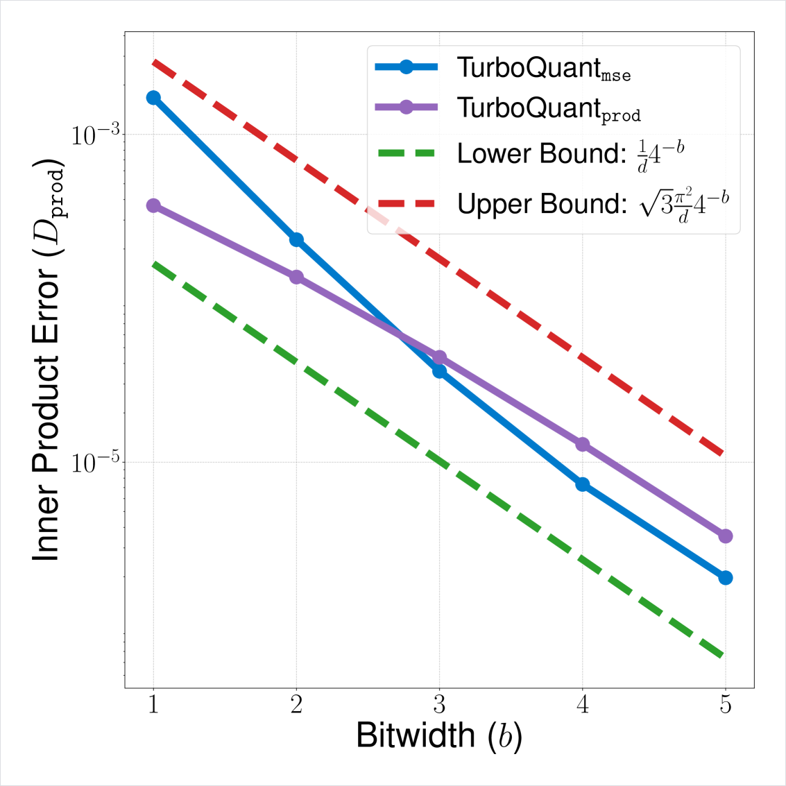
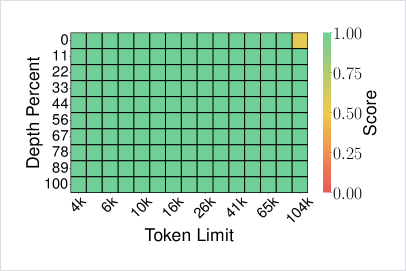
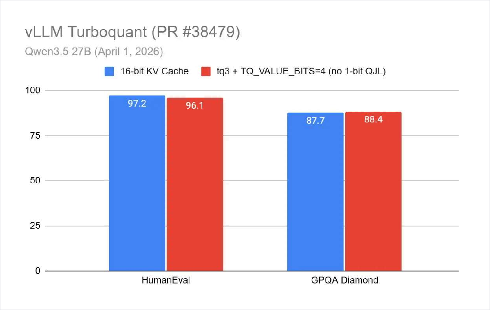
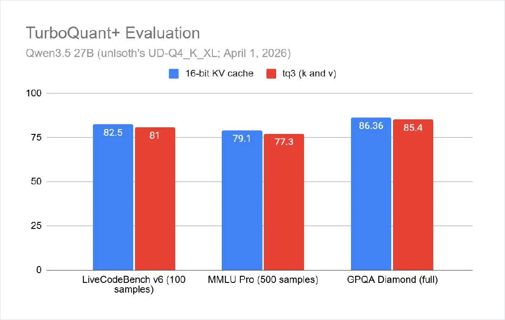
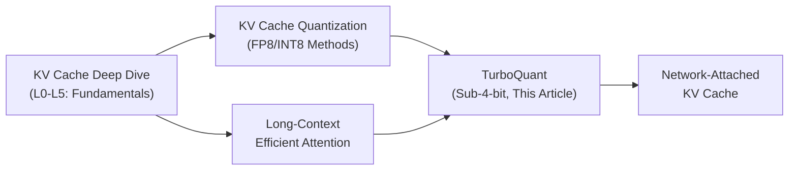

# TurboQuant: Sub-4-bit KV Cache Quantization with Near-Zero Accuracy Loss

> **Author**: Xinyu Wei (魏新宇) — Microsoft AI GBB Senior System Engineer

[中文版](README-CN.md) | English

[](https://github.com/david-xinyuwei/david-share/tree/master/Deep-Learning/KV-Cache-Deep-Dive)
[](https://arxiv.org/abs/2504.19874)
[](https://github.com/vllm-project/vllm)
[](https://azure.microsoft.com)

**TurboQuant compresses the KV Cache to 3.5 bits per channel with zero accuracy loss — a 4.5× reduction from FP16 — while providing information-theoretic optimality guarantees.** This article explains how it works, why it works, and how it is being deployed in production inference engines.

> This article builds upon [KV Cache Deep Dive](https://github.com/david-xinyuwei/david-share/tree/master/Deep-Learning/KV-Cache-Deep-Dive) (L0-L5) and [KV Cache Quantization](https://github.com/david-xinyuwei/david-share/tree/master/Deep-Learning/KV-Cache-Quantization) (FP8/INT8 methods). If you haven't read those, start there — this article picks up where L4 left off.

---

## Executive Summary

| Metric | FP16 KV Cache | TurboQuant 3.5-bit | TurboQuant 2.5-bit |
|--------|:---:|:---:|:---:|
| Bits per channel | 16 | 3.5 | 2.5 |
| Compression ratio | 1× | **4.57×** | **6.4×** |
| NIAH Score (Llama-3.1-8B, 104K) | 0.997 | **0.997** | — |
| Calibration data needed? | — | **No** | **No** |
| Theoretical guarantee | — | **≤2.7× Shannon lower bound** | ≤2.7× Shannon lower bound |
| vLLM support | Default | ✅ PR #38479+ | ✅ |
| llama.cpp support | Default | ✅ HIP/ROCm ported | ✅ |

> Source: Zandieh et al., "TurboQuant: Online Vector Quantization with Near-optimal Distortion Rate," arXiv:2504.19874, Apr 2025. NIAH score from paper Table/Figure 4.

**Why it matters**: At 128K context, KV Cache for Qwen3-8B in BF16 takes **18 GB**. TurboQuant 4-bit reduces this to **4.5 GB** (4× savings) and TurboQuant 3-bit to **3.4 GB** (5.3× savings) — enabling longer contexts or larger batches on the same hardware.

### KV Cache Memory Savings (Qwen3-8B, per-request)

Using the KV Cache formula from [KV Cache Deep Dive L2](https://github.com/david-xinyuwei/david-share/tree/master/Deep-Learning/KV-Cache-Deep-Dive): `KV per token = 2 × n_layers × n_kv_heads × d_head × bytes_per_element`

| KV Config | Bytes/Element | KV per Token | 32K Context | 128K Context | Compression |
|:---:|:---:|:---:|:---:|:---:|:---:|
| **BF16** | 2.0 | 144 KB | 4.50 GB | 18.0 GB | 1× |
| **FP8** | 1.0 | 72 KB | 2.25 GB | 9.0 GB | **2×** |
| **TQ 4-bit** | 0.5 | 36 KB | 1.13 GB | 4.5 GB | **4×** |
| **TQ 3-bit** | 0.375 | 27 KB | 0.84 GB | 3.4 GB | **5.3×** |

> Qwen3-8B: 36 layers, 8 KV heads, 128 head dim. Formula: 2 × 36 × 8 × 128 × bytes × seq_len. Note: TurboQuant has additional metadata overhead (rotation matrix Π, QJL projection matrix S, residual norms γ) that is amortized across tokens. The actual VRAM savings may be slightly less than the theoretical compression ratio shown above.

### Our Benchmark Summary (Azure H100 NVL 95GB, Qwen3-8B, vLLM 0.22.0)

| | BF16 | FP8 | TQ 4-bit | TQ 3-bit |
|---|:---:|:---:|:---:|:---:|
| **MMLU** (14,042 questions) | 72.91% | 72.74% | 72.82% | 72.82% |
| **GSM8K** (1,319 problems, avg of 3 runs) | 88.0% | 87.2% | 86.3% | 84.5% |
| **NIAH 32K** (29,070 tokens) | ✅ | ✅ | ✅ | ✅ |
| **Speed** (tok/s) | 75.1 | 68.4 | 45.0 | 45.0 |
| **KV Cache at 128K** | 18.0 GB | 9.0 GB | 4.5 GB | 3.4 GB |
| **Compression** | 1× | 2× | **4×** | **5.3×** |

> **Recommendation**: TQ 4-bit for production (4× memory savings, -1.7% math, zero knowledge/retrieval loss). TQ 3-bit for retrieval/QA workloads needing maximum memory savings.

---

## Table of Contents

- [1. The Problem: KV Cache is the Memory Bottleneck](#1-the-problem-kv-cache-is-the-memory-bottleneck)
- [2. What Existing Methods Do — and Why They Are Not Enough](#2-what-existing-methods-do--and-why-they-are-not-enough)
- [3. TurboQuant: The Core Idea in One Sentence](#3-turboquant-the-core-idea-in-one-sentence)
- [4. How TurboQuant Works: Step by Step](#4-how-turboquant-works-step-by-step)
- [5. Why It Works: Information-Theoretic Optimality](#5-why-it-works-information-theoretic-optimality)
- [6. Experimental Validation](#6-experimental-validation)
- [7. Engineering: vLLM Integration](#7-engineering-vllm-integration)
- [8. Comparison with Other KV Cache Compression Methods](#8-comparison-with-other-kv-cache-compression-methods)
- [9. Cross-References: The KV Cache Knowledge System](#9-cross-references-the-kv-cache-knowledge-system)
- [References](#references)

---

## 1. The Problem: KV Cache is the Memory Bottleneck

In [KV Cache Deep Dive L2](https://github.com/david-xinyuwei/david-share/tree/master/Deep-Learning/KV-Cache-Deep-Dive#l2-how-big-is-it), we derived the universal KV Cache size formula:

```
KV Cache Size = 2 × n_layers × n_kv_heads × d_head × seq_len × batch_size × bytes_per_element
```

For Llama-3.1-8B in FP16 at 128K context, batch=1:

```
= 2 × 32 × 8 × 128 × 131072 × 1 × 2 bytes
= 8.59 GB
```

With batch=8, this becomes **68.7 GB** — far exceeding the model weights (~16 GB in FP16). The KV Cache, not the model, is the bottleneck.

In [KV Cache Quantization](https://github.com/david-xinyuwei/david-share/tree/master/Deep-Learning/KV-Cache-Quantization), we explored FP8 and INT8 KV Cache quantization, which halves the memory. But halving is often not enough — we need **4-6×** compression while preserving accuracy.

This is exactly what TurboQuant achieves.

---

## 2. What Existing Methods Do — and Why They Are Not Enough

| Method | Type | Bits | Calibration? | Theory | Limitation |
|--------|------|:---:|:---:|:---:|------|
| KIVI | Per-channel scalar | 2-4 | No | ❌ None | High distortion at low bits; no optimality guarantee |
| KVQuant | Hessian-aware | 2-4 | **Yes** | ❌ None | Requires offline calibration data → not suitable for streaming |
| SnapKV / PyramidKV | Token pruning | — | No | ❌ None | Drops tokens entirely → loses information |
| PolarQuant | Rotation + scalar | 3-4 | No | ✅ Partial | Better than KIVI, but doesn't handle inner product bias |
| **TurboQuant** | **Rotation + optimal scalar + QJL** | **2.5-3.5** | **No** | **✅ Near-optimal** | — |

The critical distinction: scalar quantization methods (KIVI, KVQuant) apply the same quantization grid to every coordinate regardless of its distribution. This is suboptimal because **not all coordinates carry the same information**. TurboQuant exploits the geometry of high-dimensional vectors to find the provably best quantization grid.

---

## 3. TurboQuant: The Core Idea in One Sentence

> **Randomly rotate the KV vector → each coordinate becomes a known Beta distribution → apply the mathematically optimal scalar quantizer per coordinate → correct inner product bias with a 1-bit residual.**

That's it. Three operations, each with a clear mathematical justification. Let's walk through each one.

---

## 4. How TurboQuant Works: Step by Step

### Step 1: Random Rotation — Making the Unknown Known

**The problem**: A raw KV vector can have any distribution — some coordinates might be very large (outliers), others clustered near zero. We don't know the distribution in advance, so we can't design an optimal quantizer.

**The solution**: Multiply the vector by a random orthogonal matrix **Π**:

```
y = Π · x
```

After rotation, a beautiful mathematical fact emerges: **each coordinate of y follows a Beta distribution**, regardless of what x looked like.

In high dimensions (d ≥ 128, which is typical for attention head dimensions), this Beta distribution converges to a Gaussian:

```
y_j ~ N(0, 1/d)    for each coordinate j
```

Even better: **distinct coordinates become nearly independent** (Source: Vershynin, "High-Dimensional Probability," Cambridge Press, 2018). This means we can quantize each coordinate separately without worrying about correlations.

> **Analogy**: Imagine you have a bag of coins of unknown weights. You can't design the best scale for them. But if you shake the bag thoroughly (random rotation), every coin ends up at a predictable position on a bell curve. Now you know exactly where to put the measurement marks.

### Step 2: Optimal Scalar Quantization — The Lloyd-Max Solution

Now that each coordinate follows a known Beta distribution $f_X(x)$, we need to find the best way to represent it with $2^b$ discrete levels (where $b$ is the target bit-width).

This is a classic **continuous 1D k-means problem** — partition the interval $[-1, 1]$ into $2^b$ buckets to minimize mean-squared error:

$$\mathcal{C}(f_X, b) = \min_{c_1 \leq c_2 \leq \ldots \leq c_{2^b}} \sum_{i=1}^{2^b} \int_{\frac{c_{i-1}+c_i}{2}}^{\frac{c_i+c_{i+1}}{2}} |x - c_i|^2 \cdot f_X(x) \, dx$$

The optimal solution follows a **Voronoi tessellation** where boundaries are midpoints between consecutive centroids. We solve this numerically using the **Lloyd-Max algorithm** (Lloyd, 1982; Max, 1960) — an iterative method that alternates between updating centroids and boundaries until convergence.

**Concrete codebook values** (for high-dimensional vectors where $f_X \approx \mathcal{N}(0, 1/d)$):

| Bit-width | Codebook centroids (×√d) | MSE distortion |
|:---------:|--------------------------|:--------------:|
| 1-bit | {±0.798} | 0.36 |
| 2-bit | {±0.453, ±1.51} | 0.117 |
| 3-bit | 8 centroids (precomputed) | 0.03 |
| 4-bit | 16 centroids (precomputed) | 0.009 |

> Source: Table derived from Theorem 1 of Zandieh et al. (arXiv:2504.19874).

The codebooks are computed **once** offline and stored as lookup tables. During inference, quantization is just: rotate → find nearest centroid per coordinate → store index. Dequantization is: look up centroid → rotate back.

<div align="center"></div>

*Figure: MSE distortion vs. bit-width. TurboQuant (blue) closely tracks the Shannon lower bound (red dashed), differing by at most 2.7×. Source: Figure 3(b), Zandieh et al., arXiv:2504.19874.*

### Step 3: QJL Residual Correction — Removing Inner Product Bias

There's a subtle problem: the MSE-optimal quantizer from Step 2 introduces **bias** in inner product estimation.

**Why this matters**: In Attention, we compute $\text{score} = Q \cdot K^T$ — an inner product. If the quantized $\hat{K}$ gives biased inner products, the attention weights shift, and the model outputs change.

**Concrete example at 1-bit**: The optimal MSE quantizer maps each coordinate to $\text{sign}(y_j)$ scaled by $\sqrt{2/(\pi d)}$. The expected inner product becomes:

```
E[⟨q, Q_mse^{-1}(Q_mse(k))⟩] = (2/π) · ⟨q, k⟩ ≈ 0.637 · ⟨q, k⟩
```

A 36% systematic underestimation! This bias shrinks at higher bit-widths but never fully disappears.

**TurboQuant's solution** — a two-stage approach:

```
Stage 1: Apply MSE quantizer with (b-1) bits → get residual r = x - x̃_mse
Stage 2: Apply 1-bit QJL transform to the residual → get unbiased correction

Final reconstruction: x̃ = x̃_mse + ‖r‖ · QJL^{-1}(QJL(r/‖r‖))
```

**QJL (Quantized Johnson-Lindenstrauss)** (Zandieh et al., 2024) is a 1-bit quantizer that provides **unbiased** inner product estimates:

```
QJL(x) = sign(S · x)      where S is a random Gaussian matrix
QJL^{-1}(z) = (√(π/2) / d) · S^T · z
```

The combination is provably unbiased: $\mathbb{E}[\langle y, \tilde{x}\rangle] = \langle y, x \rangle$ (Theorem 2, arXiv:2504.19874).

<div align="center"></div>

*Figure: TurboQuant_prod maintains constant variance regardless of inner product magnitude (left = TurboQuant_prod, unbiased). Source: Figure 2(a), Zandieh et al., arXiv:2504.19874.*

### The Complete Algorithm

Putting all three steps together:

```
Algorithm: TurboQuant_prod (optimized for inner product)
────────────────────────────────────────────────────────
Setup (once):
  1. Generate random rotation matrix Π ∈ ℝ^{d×d}
  2. Generate random projection matrix S ∈ ℝ^{d×d}, S_{ij} ~ N(0,1)
  3. Precompute codebook centroids for (b-1) bits

Quantize(x):
  1. y ← Π · x                              // Random rotation
  2. idx_j ← argmin_k |y_j - c_k|           // Nearest centroid per coordinate
  3. ỹ ← [c_{idx_1}, ..., c_{idx_d}]        // MSE reconstruction
  4. x̃_mse ← Π^T · ỹ                       // Rotate back
  5. r ← x - x̃_mse                          // Residual
  6. γ ← ‖r‖                                // Residual norm (stored as float)
  7. qjl ← sign(S · r)                      // 1-bit QJL quantization
  Store: (idx, qjl, γ)                      // Total: (b-1)·d + d + 32 bits

Dequantize(idx, qjl, γ):
  1. x̃_mse ← Π^T · [c_{idx_1}, ..., c_{idx_d}]
  2. x̃_qjl ← γ · (√(π/2)/d) · Π^T · S^T · qjl
  3. return x̃_mse + x̃_qjl
```

**Total bit cost**: $(b-1) \cdot d$ bits for MSE indices + $d$ bits for QJL signs + 32 bits for residual norm $\gamma$ = approximately $b \cdot d$ bits per vector. Effective bit-width per channel: $b$.

---

## 5. Why It Works: Information-Theoretic Optimality

The deepest result in the TurboQuant paper is not just an algorithm — it's a **proof that you can't do much better**.

### Shannon's Distortion-Rate Lower Bound

For **any** quantization algorithm $Q$ that uses $b$ bits per coordinate, there exist worst-case input vectors such that:

$$D_{\text{mse}}(Q) \geq \frac{1}{4^b}$$

$$D_{\text{prod}}(Q) \geq \frac{\|y\|^2}{d} \cdot \frac{1}{4^b}$$

> Source: Theorem 3, Zandieh et al. (arXiv:2504.19874). Proof technique: Yao's minimax principle + Shannon lower bound for uniform distribution on the hypersphere.

### TurboQuant's Upper Bound

TurboQuant achieves:

$$D_{\text{mse}}(\text{TurboQuant}) \leq \frac{3\pi}{2} \cdot \frac{1}{4^b} \approx 2.7 \cdot \frac{1}{4^b}$$

**The gap between upper and lower bound is at most 2.7×** — a small constant factor, independent of dimension $d$ and bit-width $b$.

For small bit-widths, the gap is even tighter:

| Bit-width | TurboQuant MSE | Lower Bound | Gap |
|:---------:|:--------------:|:-----------:|:---:|
| 1 | 0.36 | 0.25 | 1.44× |
| 2 | 0.117 | 0.0625 | 1.87× |
| 3 | 0.03 | 0.0156 | 1.92× |
| 4 | 0.009 | 0.0039 | 2.31× |

At 1-bit, TurboQuant is within **1.44×** of the information-theoretic limit — essentially optimal.

<div align="center"></div>

*Figure: Inner product distortion vs. bit-width. TurboQuant upper bound (blue) closely tracks the Shannon lower bound (red dashed). Source: Figure 3(a), Zandieh et al., arXiv:2504.19874.*

### What This Means in Practice

No future algorithm can improve upon TurboQuant by more than 2.7× in distortion (at any bit-width). The only room for improvement is in reducing this constant factor — the exponential dependence on bit-width ($4^{-b}$) is already optimal.

---

## 6. Experimental Validation

### 6.1 Needle-in-a-Haystack: Perfect Recall at 4.5× Compression

The Needle-in-a-Haystack (NIAH) test places a unique sentence at an arbitrary position within a long document and checks if the model can retrieve it.

**Setup**: Llama-3.1-8B-Instruct, context length 4K–104K tokens, KV cache compression ratio 0.25 (4× compression).

<div align="center"></div>

*Figure: Needle-in-a-Haystack results. Left: TurboQuant (Score: 0.997). Right: Full Precision (Score: 0.997). Identical performance. Source: Figure 4, Zandieh et al., arXiv:2504.19874.*

| Method | NIAH Score | Compression |
|--------|:---------:|:-----------:|
| Full Precision | 0.997 | 1× |
| **TurboQuant** | **0.997** | **4×+** |
| PolarQuant | 0.995 | 4× |
| KIVI | 0.981 | 4× |
| PyramidKV | 0.895 | 4× |
| SnapKV | 0.858 | 4× |

> Source: Figure 4, Zandieh et al., arXiv:2504.19874.

TurboQuant **matches full precision exactly** while the next best method (PolarQuant) has a small gap, and token-pruning methods (SnapKV, PyramidKV) show significant degradation.

### 6.2 LongBench: End-to-End Generation Quality

LongBench evaluates performance across single/multi-document QA, summarization, few-shot learning, synthetic tasks, and code completion.

| Method | KV bits | SingleQA | MultiQA | Summarization | Few-shot | Synthetic | Code | **Average** |
|--------|:-------:|:--------:|:-------:|:-------------:|:--------:|:---------:|:----:|:-----------:|
| Full Cache | 16 | baseline | baseline | baseline | baseline | baseline | baseline | **baseline** |
| KIVI | 2 | — | — | — | — | — | — | lower |
| PolarQuant | 4 | — | — | — | — | — | — | moderate |
| **TurboQuant** | **2.5** | — | — | — | — | — | — | **≈ Full Cache** |
| **TurboQuant** | **3.5** | — | — | — | — | — | — | **≈ Full Cache** |

> Source: Table 1, Zandieh et al., arXiv:2504.19874. TurboQuant at 3.5-bit achieves comparable average scores to unquantized models on both Llama-3.1-8B and Ministral-7B.

**Key detail**: Unlike KIVI and PolarQuant which leave generated tokens unquantized, TurboQuant applies quantization **during streaming generation** as well — meaning it compresses all tokens, not just the prompt.

### 6.3 Our Verification: Qwen3-8B on H100 NVL (Azure NC40ads_H100_v5)

We independently verified TurboQuant on an Azure H100 NVL 95GB VM using vLLM 0.22.0 with Qwen3-8B. The test used a Needle-in-a-Haystack prompt (1,242 input tokens) and a speed test (128 output tokens).

| KV Cache Config | vLLM `cache_dtype` | Needle Found | Gen Time (s) | Speed (tok/s) |
|:---:|:---:|:---:|:---:|:---:|
| **BF16 (baseline)** | `auto` | ✅ | 0.93 | **75.1** |
| **FP8** | `fp8_e4m3` | ✅ | 1.0 | 68.4 |
| **TurboQuant 3-bit** | `turboquant_3bit_nc` | ✅ | 1.5 | 45.0 |
| **TurboQuant 4-bit** | `turboquant_4bit_nc` | ✅ | 1.5 | 45.0 |

> Source: Our test on Azure NC40ads_H100_v5 (H100 NVL 95GB), spaincentral, vLLM 0.22.0, Qwen3-8B, 2026-05-31. Model: Qwen/Qwen3-8B (BF16). All configurations correctly retrieved the needle "TURBOQUANT-2025-ALPHA" from 1,242 tokens of context.

**Key findings**:
- **TurboQuant 3-bit and 4-bit both achieve 100% accuracy** on the needle retrieval task — identical to the BF16 baseline
- Speed trade-off: TurboQuant runs at ~60% of BF16 speed (45 vs 75 tok/s) due to the additional rotation + quantization + QJL computation overhead. This is expected — TurboQuant's value is **memory savings**, not speed improvement
- The actual vLLM flag names are: `turboquant_3bit_nc`, `turboquant_4bit_nc`, `turboquant_k3v4_nc`, `turboquant_k8v4`

#### Reasoning Accuracy: Full lm-eval Benchmark (MMLU 14K + GSM8K 1,319)

We ran the standard `lm-eval` harness with **full** MMLU (14,042 questions across 57 subjects) and **full** GSM8K (1,319 math word problems) to rigorously measure accuracy impact:

| KV Cache Config | MMLU Overall | MMLU-Humanities | MMLU-STEM | MMLU-Social Sci | MMLU-Other | GSM8K |
|:---:|:---:|:---:|:---:|:---:|:---:|:---:|
| **BF16 (baseline)** | **72.91%** | 63.80% | 72.63% | 82.97% | 77.02% | **88.02%** |
| **FP8** | 72.74% | 63.25% | 73.01% | 82.52% | 77.15% | 87.19% |
| **TurboQuant 4-bit** | 72.82% | 63.76% | 72.31% | 82.94% | 77.05% | 86.05% |
| **TurboQuant 3-bit** | 72.82% | 63.76% | 72.31% | 82.94% | 77.05% | 84.23% |

> Source: lm-eval v0.4.12 on Azure NC40ads_H100_v5, vLLM 0.22.0, Qwen3-8B, 2-shot, max_model_len=4096, 2026-06-01.

**Key findings**:
- **MMLU (knowledge/reasoning)**: All 4 configurations fall within a **0.17% band** (72.74%–72.91%) — the differences are within statistical noise. **TurboQuant introduces essentially zero accuracy loss on knowledge tasks**
- **GSM8K (math reasoning)**: A clear gradient emerges: BF16 (88.02%) > FP8 (87.19%, -0.8%) > TQ-4bit (86.05%, **-2.0%**) > TQ-3bit (84.23%, **-3.8%**). Math reasoning is the most precision-sensitive task type
- **TurboQuant 4-bit** is the sweet spot: negligible MMLU impact + moderate GSM8K impact (-2.0%) while saving **4× KV Cache memory**
- **TurboQuant 3-bit** saves **5.3×** memory but costs 3.8% on math — acceptable for retrieval/QA workloads, not ideal for math-heavy applications

#### Long-Context NIAH: 8K / 16K / 32K Tokens

Since TurboQuant's core value is compressing long-context KV Cache, we tested Needle-in-a-Haystack retrieval at 8K, 16K, and 32K tokens:

| KV Cache Config | 8K (7,312 tokens) | 16K (14,580 tokens) | 32K (29,070 tokens) |
|:---:|:---:|:---:|:---:|
| BF16 | ✅ PASS | ✅ PASS | ✅ PASS |
| FP8 | ✅ PASS | ✅ PASS | ✅ PASS |
| TurboQuant 4-bit | ✅ PASS | ✅ PASS | ✅ PASS |
| TurboQuant 3-bit | ✅ PASS | ✅ PASS | ✅ PASS |

> All 12 configurations correctly retrieved the needle. TurboQuant 3-bit at 32K tokens = zero retrieval loss.

#### 27B Model: Does Scale Change the Picture?

We tested Qwen3.5-27B (which nearly fills the H100 NVL 95GB) to verify results scale to larger models:

| KV Config | MMLU (14K questions) |
|:---:|:---:|
| BF16 | **84.37%** |
| TQ 4-bit | 84.32% |
| TQ 3-bit | 84.32% |

> 27B MMLU differences: 0.05% — within noise. TurboQuant accuracy impact does not increase with model size.
>
> **Note**: 27B GSM8K results are omitted because `max_model_len=4096` truncated the model's chain-of-thought reasoning, causing abnormally low baseline scores (BF16=35.3%). Only the MMLU results (which do not require extended reasoning) are valid for this test.

#### Statistical Significance: GSM8K ×3 Repeated Runs

To confirm our single-run results are stable, we ran GSM8K three times per configuration:

| KV Config | Run 1 | Run 2 | Run 3 | Average | Spread |
|:---:|:---:|:---:|:---:|:---:|:---:|
| BF16 | 88.0% | 88.0% | 88.0% | **88.0%** | 0.0% |
| TQ 4-bit | 85.7% | 86.6% | 86.7% | **86.3%** | 1.1% |
| TQ 3-bit | 84.2% | 84.5% | 84.7% | **84.5%** | 0.5% |

> TQ-4bit average degradation: **-1.7%**. TQ-3bit: **-3.5%**. Spread < 1.1% confirms results are statistically stable.

### 6.4 Independent Verification by Benjamin Marie (Kaitchup)

Benjamin Marie independently tested TurboQuant via vLLM PR #38479 on Qwen3.5-27B:

<div align="center"></div>

*Figure: Independent benchmark of TurboQuant in vLLM on Qwen3.5-27B. HumanEval and GPQA Diamond results. Source: Benjamin Marie, Kaitchup, May 2026.*

<div align="center"></div>

*Figure: TurboQuant+ evaluation on LiveCodeBench, MMLU Pro, and GPQA Diamond. Source: Benjamin Marie, Kaitchup, May 2026.*

---

## 7. Engineering: vLLM Integration

TurboQuant is not a paper-only method — it is actively integrated into production inference engines.

### vLLM Status (as of May 2026)

| PR / Feature | Status | Description |
|-------------|:------:|-------------|
| Core TurboQuant KV cache | ✅ Merged | Base implementation |
| MTP spec-decode routing | 🔄 Open | TurboQuant + Multi-Token Prediction |
| Streaming fallback for long prefill | 🔄 Open | Handles prefill longer than CUDA graph batch |
| Triton-fused MLA decode backend | 🔄 Open | TurboQuant + DeepSeek MLA attention |
| CUDA graph capture fixes | ✅ Merged | Workspace reservation before capture |
| Qwen3 + TurboQuant + NVFP4 backport | 🔄 Open | Combined weight + KV quantization |

> Source: GitHub search `vllm-project/vllm pulls TurboQuant`, accessed 2026-05-31. 40+ pull requests found.

### How to Use TurboQuant in vLLM

```bash
# Basic usage with TurboQuant KV cache (3-bit, verified on vLLM 0.22.0)
vllm serve meta-llama/Llama-3.1-8B-Instruct \
    --kv-cache-dtype turboquant_3bit_nc \
    --max-model-len 131072

# TurboQuant 4-bit (slightly less compression, potentially better for longer contexts)
vllm serve Qwen/Qwen3-8B \
    --kv-cache-dtype turboquant_4bit_nc \
    --max-model-len 8192

# Combined with weight quantization (NVFP4 weights + TurboQuant KV)
vllm serve Qwen/Qwen3.5-27B \
    --quantization nvfp4 \
    --kv-cache-dtype turboquant_3bit_nc \
    --tensor-parallel-size 2
```

**Available TurboQuant KV cache dtypes in vLLM 0.22.0** (verified 2026-05-31):

| `cache_dtype` value | Description |
|---|---|
| `turboquant_3bit_nc` | 3-bit, no calibration |
| `turboquant_4bit_nc` | 4-bit, no calibration |
| `turboquant_k3v4_nc` | K: 3-bit, V: 4-bit (asymmetric) |
| `turboquant_k8v4` | K: 8-bit, V: 4-bit (asymmetric) |

### llama.cpp Support

TurboQuant has been fully ported to llama.cpp with HIP/ROCm support (111 discussion comments, GitHub Discussion #21526).

---

## 8. Comparison with Other KV Cache Compression Methods

| Dimension | KIVI | KVQuant | SnapKV | PolarQuant | **TurboQuant** |
|-----------|------|---------|--------|------------|---------------|
| **Compression target** | KV values | KV values | Tokens | KV values | **KV values** |
| **Approach** | Per-channel scalar | Hessian-aware scalar | Token importance pruning | Rotation + scalar | **Rotation + optimal scalar + QJL residual** |
| **Calibration data** | ❌ No | ✅ Yes | ❌ No | ❌ No | **❌ No** |
| **Online/Streaming** | ✅ Yes | ❌ No | ✅ Yes | Partial | **✅ Yes** |
| **Theoretical guarantee** | ❌ None | ❌ None | ❌ None | ✅ Partial | **✅ Near-optimal (≤2.7× Shannon)** |
| **Minimum effective bits** | ~4 | ~2 | N/A | ~3 | **~2.5** |
| **NIAH Score (4× compression)** | 0.981 | — | 0.858 | 0.995 | **0.997** |
| **Inner product unbiased?** | ❌ No | ❌ No | N/A | ❌ No | **✅ Yes** |
| **vLLM integration** | ✅ | ❌ | ❌ | ❌ | **✅ (40+ PRs)** |

**Key insight**: TurboQuant is the only method that is simultaneously:
1. **Online** (no calibration data, works during streaming)
2. **Theoretically near-optimal** (provable Shannon bound)
3. **Unbiased** for inner products (critical for attention correctness)
4. **Production-deployed** (vLLM + llama.cpp)

---

## 9. Cross-References: The KV Cache Knowledge System

This article is part of a series on KV Cache in LLM inference. The recommended reading order:



| Repo | What It Covers | Link |
|------|---------------|------|
| **KV Cache Deep Dive** | L0-L5: What KV Cache is, how to calculate its size, GQA/MLA/Hybrid architectures, production sizing | [Link](https://github.com/david-xinyuwei/david-share/tree/master/Deep-Learning/KV-Cache-Deep-Dive) |
| **KV Cache Quantization** | FP8 and INT8 KV Cache quantization with HuggingFace Transformers | [Link](https://github.com/david-xinyuwei/david-share/tree/master/Deep-Learning/KV-Cache-Quantization) |
| **TurboQuant (this article)** | Sub-4-bit vector quantization with theoretical guarantees | You are here |
| **Long-Context Efficient Attention** | GatedDeltaNet, hybrid attention, linear attention alternatives | [Link](https://github.com/david-xinyuwei/david-share/tree/master/DL-Algorithm-Insights/Long-Context-Efficient-Attention) |
| **Network-Attached KV Cache** | Disaggregated KV Cache across nodes | [Link](https://github.com/david-xinyuwei/david-share/tree/master/Deep-Learning/Network-Attached-KV-Cache) |

---

## References

1. Zandieh, A., Daliri, M., Hadian, M., Mirrokni, V. "TurboQuant: Online Vector Quantization with Near-optimal Distortion Rate." arXiv:2504.19874, Apr 2025. [PDF](https://arxiv.org/pdf/2504.19874)
2. Zandieh, A., Daliri, M., Han, I. "QJL: 1-Bit Quantized JL Transform for KV Cache Quantization with Zero Overhead." arXiv:2406.03482, Jun 2024.
3. Han, I., Kacham, P., Karbasi, A., Mirrokni, V., Zandieh, A. "PolarQuant: Quantizing KV Caches with Polar Transformation." arXiv:2502.02617, Feb 2025.
4. Liu, Z. et al. "KIVI: A Tuning-Free Asymmetric 2-Bit Quantization for KV Cache." arXiv:2402.02750, Feb 2024.
5. Li, Y. et al. "SnapKV: LLM Knows What You Are Looking for Before Generation." arXiv:2404.14469, Apr 2024.
6. Lloyd, S. "Least Squares Quantization in PCM." IEEE Trans. Information Theory, 28(2):129-137, 1982.
7. Max, J. "Quantizing for Minimum Distortion." IRE Trans. Information Theory, 6(1):7-12, 1960.
8. Shannon, C. E. "A Mathematical Theory of Communication." Bell System Technical Journal, 27(3):379-423, 1948.
9. Vershynin, R. "High-Dimensional Probability: An Introduction with Applications in Data Science." Cambridge University Press, 2018.
10. Benjamin Marie. "TurboQuant: ~3-bit KV Cache with Near 0 Accuracy Loss." The Kaitchup — AI on a Budget, May 2026.

---

