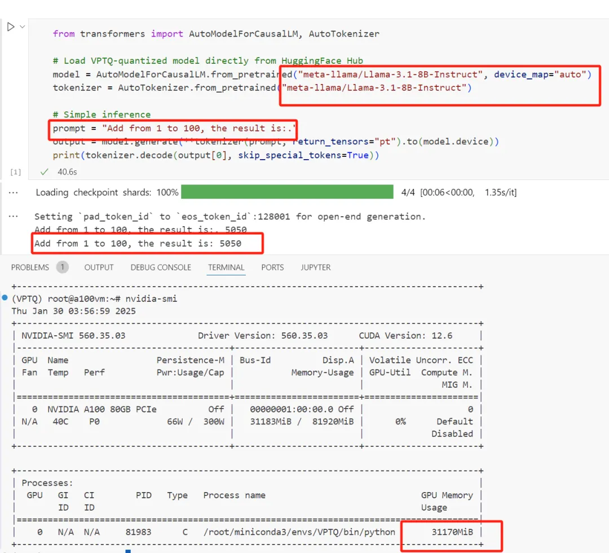
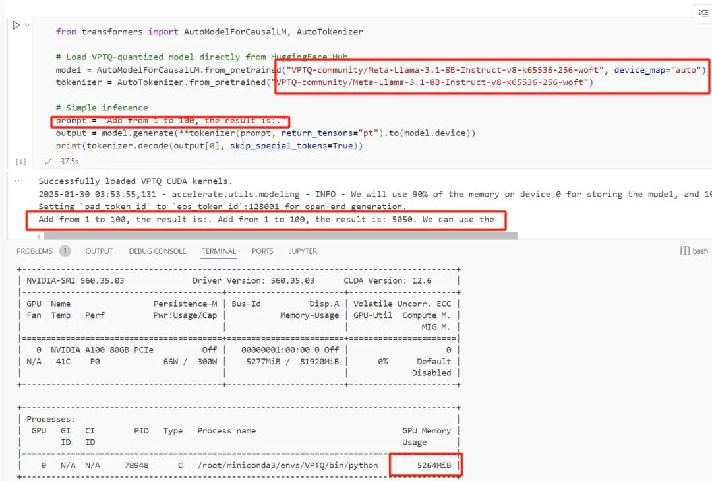
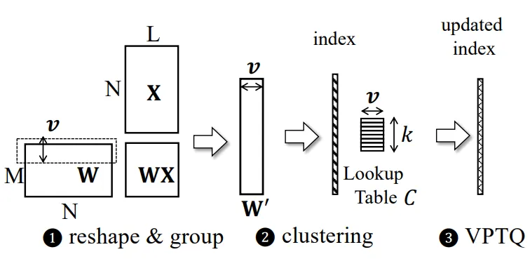
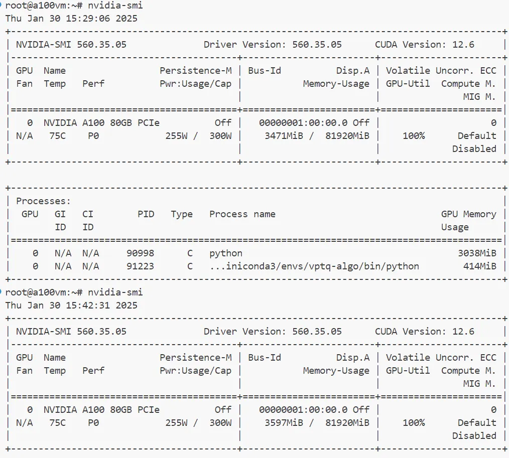
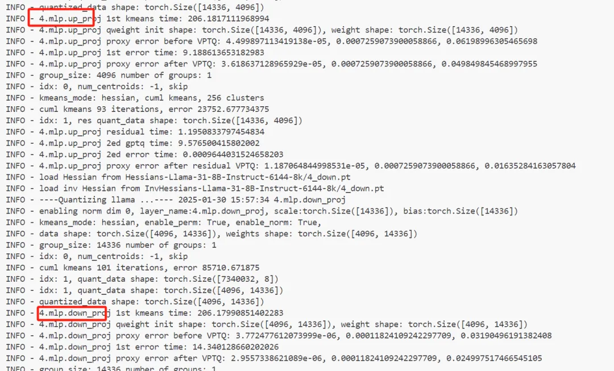
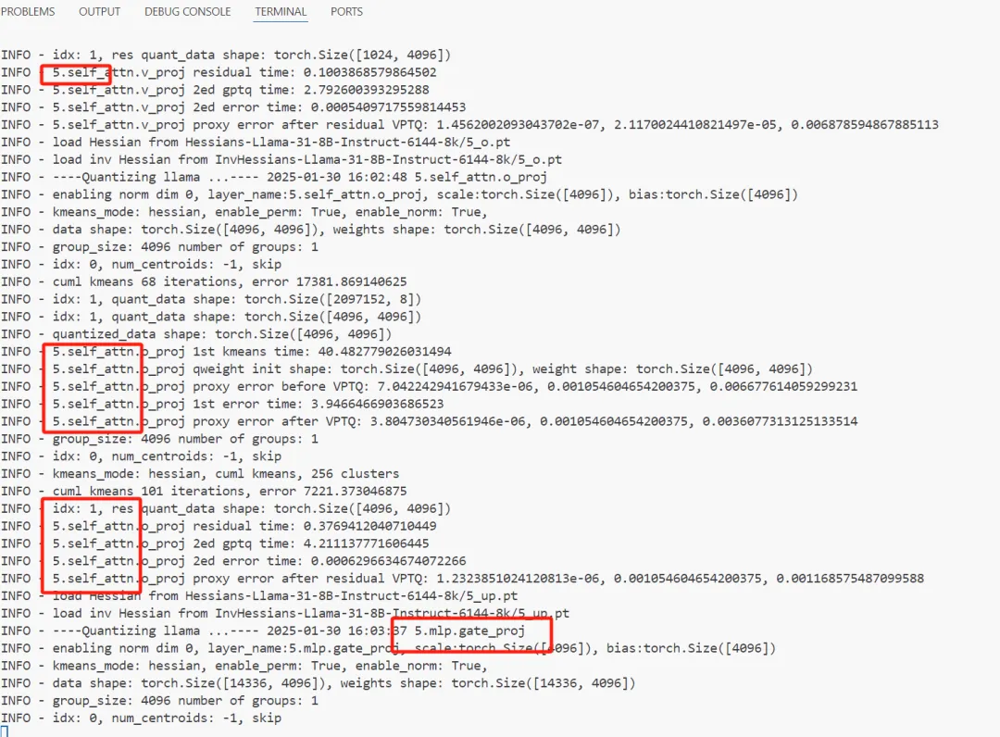
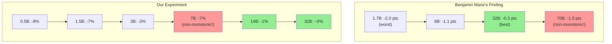

# Exploring 1-Bit LLMs: Efficient Large Language Models through Ternary Weight Quantization

In the current field of artificial intelligence, **Large Language Models (LLMs)** have become indispensable. However, their enormous number of parameters leads to significant computational and memory demands, limiting their applications on resource-constrained devices. Is it possible to reduce these demands without significantly compromising model performance? Microsoft's **BitNet** architecture and **1-Bit LLMs** provide an affirmative answer.  This article delves into the concept and implementation of 1-Bit LLMs from multiple perspectives, using examples to help readers better understand this cutting-edge technology. 

***Please click below picture to see my demo vedio on Yutube***:
[](https://www.youtube.com/watch?v=el7edql4Xug)


## Running on Azure

All experiments in this project were conducted on an **Azure GPU VM**.

| Item | Details |
|---|---|
| **Azure VM** | [Standard_NC24ads_A100_v4](https://learn.microsoft.com/en-us/azure/virtual-machines/nc-a100-v4-series) |
| **GPU** | NVIDIA A100 80GB PCIe |
| **Frameworks** | LoRA/PEFT, Unsloth |


## I. What Are 1-Bit LLMs?


**1-Bit LLMs** are large language models that use low-bit-width parameters (weights) for representation and computation. Specifically, in 1-Bit LLMs, each weight is constrained to ternary values: **-1**, **0**, or **1**. This approach significantly reduces the model's memory footprint and computational complexity.

Although referred to as "1-Bit," each weight actually occupies about **1.58 bits** on average. This value is derived from entropy calculations in information theory, representing the minimal average number of bits needed to represent ternary values.

### 1. Differences Between 1-Bit LLMs and FP16/FP32 Models


In deep learning, we often mention **FP16** and **FP32**, referring to the precision of floating-point data types used in models:

- **FP32 (32-bit floating-point)**: Each number occupies 32 bits, offering high precision and a wide dynamic range.

- **FP16 (16-bit floating-point)**: Each number occupies 16 bits, reducing memory usage and increasing computation speed but with lower precision.

  **1-Bit LLMs** differ by emphasizing the reduction of weight bit-width. By quantizing weights to ternary values (-1, 0, 1) and representing them with low-bit-width data types (averaging about 1.58 bits per weight), they achieve extreme memory and computational efficiency.

  In traditional FP16 or FP32 models, parameters are stored and computed using 16-bit or 32-bit floating-point numbers. In contrast, 1-Bit LLMs quantize model parameters to ternary values, leading to lower memory usage and computational complexity during inference.

### 2. Precision of Other Components in 1-Bit LLMs


While 1-Bit LLMs achieve extreme compression in the weights, other parts of the model may use higher-precision data types:

- Activations:

  - Typically quantized to **8-bit** or **16-bit** to ensure sufficient numerical precision during forward propagation, preventing excessive information loss between layers.

- Gradients:

  - During training, gradients are often computed with **FP16** or **FP32** to maintain training stability.

- Optimizer States:

  - States maintained by optimizers (e.g., momentum terms) are usually stored in **FP32** to accurately capture parameter updates.

- Loss Values and Other Computations:

  - Critical computations like loss values and regularization terms usually remain at **FP32** precision to ensure numerical stability during training.

    Therefore, 1-Bit LLMs primarily achieve bit-width compression in the weights, while other components retain higher bit-width to maintain performance and training stability.

#### Example:

#### Suppose we have a traditional neural network model:

- **Weights**: Represented using FP32, each weight occupies 32 bits.

- **Activations**: Using FP32.

- **Gradients**: Using FP32.

  In a 1-Bit LLM:

- **Weights**: Quantized to ternary values (-1, 0, 1), averaging about 1.58 bits per weight.

- **Activations**: Possibly quantized to 8-bit integers (INT8).

- **Gradients**: Might still use FP16 or FP32.

  **Benefits**:

- **Reduced Storage and Computation**: Significantly lowers storage requirements and computational complexity since weights often occupy most of the model's storage space.

- **Maintained Performance**: Preserves model performance and training stability because critical computations still use higher precision.

  **Considerations**:

- **Training Complexity**: Training may become more complex due to quantization, requiring specific techniques like the Straight-Through Estimator (STE) to handle non-differentiability.

- **Hardware Support**: Existing hardware may need specific optimizations to fully utilize low-bit-width weight representations.

## II. Why Use Ternary Weights?


In neural network models, especially LLMs, weights consume a significant portion of memory during inference due to:

- **Large Model Size**: LLMs often contain hundreds of millions to tens of billions of parameters, all of which need to be loaded into memory during inference.

- **Data Type Precision**: Weights are typically stored as high-precision floating-point numbers (FP32 or FP16), each occupying more memory space.

- **Computational Needs**: All relevant weights must be accessed and computed during inference, increasing memory and computational resource consumption.

  **Using ternary weights offers several advantages**:

- **Memory Efficiency**: Each weight requires only about **1.58 bits**, greatly reducing storage needs compared to FP32 (32 bits) and FP16 (16 bits).

- **Computational Efficiency**: Multiplication operations with ternary weights can be simplified—multiplications by 0 can be skipped, and multiplications by 1 or -1 can be simplified to copying or negation.

- **Model Miniaturization**: Allows large models to run on standard CPUs or resource-constrained devices, expanding application scenarios.

## III. BitNet Architecture: The Key to Implementing 1-Bit LLMs


Developed by Microsoft Research, the **BitNet architecture** is central to implementing 1-Bit LLMs. It achieves efficiency through key techniques:

### 1. Ternary Weight Quantization


In BitNet, model weights are quantized to ternary values (-1, 0, 1). The quantization process involves:

- Computing the Scaling Factor:

  - Calculate the mean absolute value of the weight matrix as the scaling factor

    gamma (γ):

    - gamma = (1 / (n * m)) * sum of the absolute values of all weights
    - where n and m are the dimensions (rows and columns) of the weight matrix.

- Scaling the Weight Matrix:

  - Divide each element of the weight matrix by gamma to get the scaled weight matrix.

- Applying the RoundClip Function:

  - Quantize each element using:

    RoundClip(x, -1, 1) = max(-1, min(1, round(x)))

    This rounds values to the nearest integer and clips them between -1 and 1.

#### Example:


Suppose we have a weight matrix:

```
W = |  0.3   -0.7 |  
    |  0.5    0.1 |  
```

- **Compute gamma**:

  gamma = (1 / (2 * 2)) * ( |0.3| + |-0.7| + |0.5| + |0.1| )
  = 0.4

- **Scale the Weight Matrix**:

  Scaled W = W / gamma

  Scaled W = | 0.75 -1.75 |
  | 1.25 0.25 |

- **Apply RoundClip Function**:

  Quantized W = | 1 -1 |
  | 1 0 |

  - For 0.75: RoundClip(0.75, -1, 1) = 1
  - For -1.75: RoundClip(-1.75, -1, 1) = -1
  - For 1.25: RoundClip(1.25, -1, 1) = 1
  - For 0.25: RoundClip(0.25, -1, 1) = 0

### 2. Straight-Through Estimator (STE)


Due to the discontinuity and non-differentiability of the quantization function, standard backpropagation cannot be directly applied. BitNet uses the **Straight-Through Estimator (STE)** to address this:

- **Principle**: During forward propagation, discrete ternary weights are used for computation. During backpropagation, gradients are directly passed to the unquantized continuous weights, treating the quantization function as if it were the identity function in terms of gradient computation.
- **Effect**: Allows the model to update weights during training while maintaining weight discreteness.

### 3. Activation Quantization


To further improve efficiency, BitNet also quantizes activations to **8-bit precision**:

- **Layer Normalization**: Applied before activation quantization to ensure output stability and prevent gradient explosion or vanishing.
- **Scaling and Quantization**: Compute the maximum absolute value of activations as a scaling factor, scale activations accordingly, and then quantize.

## IV. Optimized Inference Kernels: `bitnet.cpp`


Since existing hardware is not optimized for ternary weights, Microsoft developed `bitnet.cpp`, which includes several optimized inference kernels such as **I2_S**, **TL1**, and **TL2**:

- **I2_S Kernel**: Packs ternary weights into 2-bit representations, suitable for multithreaded CPU environments.

- **TL1 Kernel**: Packs every two weights and uses lookup tables to accelerate computation, suitable for environments with limited threads.

- **TL2 Kernel**: Further compresses weights, suitable for memory and bandwidth-constrained environments.

  These optimizations enable efficient execution of 1-Bit LLMs on standard CPUs.

## V. The Essence of Neural Network Models: Static Components and Runtime States


To deeply understand 1-Bit LLMs, it's essential to revisit the essence of neural network models from the perspectives of **static components** and **runtime states**.

### 1. Static Components

 

- **Model Weight Files**: Store the learned weights and biases.
- **Configuration Files**: Define model architecture, including layers and parameters.
- **Vocabulary Files**: Map tokens to indices in language models.
- **Auxiliary Scripts**: Handle data preprocessing and postprocessing.
- **Training Scripts**: Define training procedures, loss functions, optimizers, and training epochs.

### 2. Runtime States

 

- **Input Data**: Raw data fed into the model.
- **Activations**: Outputs after passing through activation functions, serving as inputs for subsequent layers.
- **Intermediate States**: Outputs from layers like feature maps in convolutional layers.
- **Gradients**: Computed during backpropagation for updating parameters.
- **Loss Values**: Measure the difference between model outputs and true labels.
- **State Updates**: Parameter updates based on gradients and optimizer states.
- **Caches**: Values stored during forward propagation for efficient gradient computation during backpropagation.

### 3. Relationship Between Model Parameters and Runtime


Model parameters usually refer to the weights and biases in a neural network. They exist both in static storage and in runtime memory.

#### 1) Static Model Parameters

 

- Stored on Disk:
  - Weight files: After training, weights and biases are saved to disk (e.g., `.pt`, `.h5`, `.ckpt` formats).
  - Storage Formats: Parameters may be stored in different data types and precisions (e.g., FP32, FP16, INT8).
- Purpose:
  - **Persistent Storage**: Save the current state of the model for future loading, deployment, or sharing.
  - **No Computation on Disk**: Stored parameters are just data and do not involve computation.

#### 2) Runtime Model Parameters 

- Loaded into Memory:
  - When loading a model (e.g., using `model.load_state_dict()`), parameters are read from disk into memory (RAM, GPU memory).
- Representation and Computation:
  - **Inference Phase**: Parameters interact with input data to generate outputs.
  - **Training Phase**: Parameters are updated based on computed gradients during backpropagation.
- Data Types:
  - **FP32**: 32-bit floating-point for high-precision computation.
  - **FP16**: 16-bit floating-point to reduce memory usage and increase speed.
  - **Low Bit-Width Formats**: INT8, binary (1-bit), or ternary representations for further compression and acceleration.
- Impact:
  - **Calculations**: Runtime data types directly affect computational results and performance.
  - **Efficiency**: Lower bit-width can improve computation speed and reduce memory bandwidth usage.

#### 3) Parameters in 1-Bit LLMs

- Weight Quantization:
  - Ternary Representation: Weights are quantized to -1, 0, 1, averaging about 1.58 bits per weight.
- Runtime Computation:
  - These quantized weights are used during inference and training, represented in memory using low-bit-width data types.
- Relation to Runtime:
  - **Performance**: Quantized parameters reduce memory usage and computational load.
  - **Hardware Support**: Specialized hardware or software optimizations may be needed to fully utilize low-bit-width parameters.

#### 4) Summary

- **Model Parameters** refer to both static parameters stored on disk and runtime parameters involved in computation.
- Discussions about data types or bit-width (e.g., ternary weights in 1-Bit LLMs) usually focus on how parameters are represented and computed at runtime.

By understanding the relationship between model parameters and runtime, we can better grasp the advantages of 1-Bit LLMs. The bit-width and data type of model parameters directly affect computational performance, memory usage, and precision. 1-Bit LLMs achieve efficient computation and low memory usage at runtime by significantly reducing the bit-width of model parameters. 

 

## VI. Conclusion and Outlook


1-Bit LLMs leverage innovative weight quantization and computational optimization methods to significantly reduce storage and computational demands, making it feasible to run large language models in resource-constrained environments.

**Challenges**:

- Limited Expressiveness:

  - Constraining weights to ternary values may affect model expressiveness, potentially requiring deeper networks or improved training methods.

- Hardware Support:

  - Existing hardware lacks optimization for ternary weights, necessitating specialized software and kernel support.

- Training Complexity:

  - Special training techniques like the Straight-Through Estimator (STE) are needed to handle the non-continuity introduced by quantization.

    Despite these challenges, 1-Bit LLMs open new avenues for model compression and efficient computation. With ongoing advancements in technology and hardware support, these efficient models are poised to play a significant role in practical applications.

    **Understanding 1-Bit LLMs centers on grasping weight quantization and computational optimization techniques, as well as the fundamental structure of neural network models.** By integrating theory with practice, we can better appreciate the potential and value of this innovative approach.

    In the future, as research deepens and hardware progresses, 1-Bit LLMs are expected to find applications in more domains, bringing new possibilities to the development of artificial intelligence.

## Test code

Down load repo :

```
#git clone --recursive https://github.com/microsoft/BitNet.git
#cd BitNet
#pip install -r requirements.txt
```

Download model:

```
huggingface-cli download HF1BitLLM/Llama3-8B-1.58-100B-tokens --local-dir models/Llama3-8B-1.58-100B-tokens
```

Convert model to GGUF

```
python setup_env.py -md models/Llama3-8B-1.58-100B-tokens -q i2_s
```

Run inference, -t 16 means using 16 threads to do this job, cloud use lscpu check.

```
python run_inference.py -m models/Llama3-8B-1.58-100B-tokens/ggml-model-i2_s.gguf -p "What is the square root of 2+2?\nAnswer:" -n 20 -temp 0.7 -t 16
```

---

## VPTQ Quantized 2-Bit Models: Principles, Steps, and Practical Implementation



Welcome to this comprehensive guide where we delve into the application of **VPTQ (Vector Post-Training Quantization)** in quantizing models to 2 bits. This article aims to help you understand the core concepts of VPTQ, the key steps involved in the quantization process, and how to achieve efficient model compression and performance optimization using VPTQ. 


### Introduction

  As large language models (LLMs) continue to grow in scale, the demand for storage and computational resources increases accordingly. To run these large models on hardware with limited resources, model compression techniques become crucial. Among them, **VPTQ (Vector Post-Training Quantization)** stands out as an ultra-low-bit quantization method that can quantize model parameters to 1-2 bits without the need for retraining, all while maintaining high accuracy.  Significant advancements in quantization for LLMs have been made recently. Algorithms like AQLM and AutoRound have demonstrated that 4-bit quantization can maintain the accuracy of the original models across most tasks. However, pushing quantization to even lower precision, such as 2-bit, often introduces noticeable accuracy loss. VPTQ addresses this challenge by leveraging advanced techniques to achieve low-bit quantization with minimal degradation in performance. 

 

### VPTQ Quantization Effect Demonstration

#### Memory saved Evaluation

In this section, I will showcase the performance of Llama-3.1-8B-Instruct running on the A100 GPU in two scenarios: before quantization using 16-bit precision and after applying VPTQ quantization. My prompt is a math problem: calculating the sum of numbers from 1 to 100. Both methods produce accurate results. After quantization, the model's memory consumption is only 17% of that of the non-quantized model. 

**Code:**

```
from transformers import AutoModelForCausalLM, AutoTokenizer

# Load VPTQ-quantized model directly from HuggingFace Hub
model = AutoModelForCausalLM.from_pretrained("VPTQ-community/Meta-Llama-3.1-8B-Instruct", device_map="auto")
#model = AutoModelForCausalLM.from_pretrained("VPTQ-community/Meta-Llama-3.1-8B-Instruct-v8-k65536-256-woft", device_map="auto")

tokenizer = AutoTokenizer.from_pretrained("VPTQ-community/Meta-Llama-3.1-8B-Instruct")
#tokenizer = AutoTokenizer.from_pretrained("VPTQ-community/Meta-Llama-3.1-8B-Instruct-v8-k65536-256-woft")

# Simple inference
prompt = "Explain: Do not go gentle into that good night."
output = model.generate(**tokenizer(prompt, return_tensors="pt").to(model.device))
print(tokenizer.decode(output[0], skip_special_tokens=True))
```

**Base Model:**



 **Quantization Model:**



#### Accuracy Evaluation


Quantized models' performance depends on the quantization method and parameter choices. In practice, VPTQ-quantized models often maintain accuracy levels comparable to their original 16-bit counterparts in specific tasks.

**Code:**

```
git clone --depth 1 https://github.com/EleutherAI/lm-evaluation-harness && cd lm-evaluation-harness && pip install -e .
```

```
models = ["VPTQ-community/Meta-Llama-3.1-8B-Instruct-v8-k65536-256-woft", # 2 bits bits
          "meta-llama/Llama-3.1-8B-Instruct", # 16 bits
          ]

for m in models:
    !HF_HUB_ENABLE_HF_TRANSFER=1 huggingface-cli download {m} --exclude *.pth
```

```
for m in models:
      !lm_eval --model hf --model_args pretrained={m},dtype=float16 --tasks mmlu --device cuda:0 --num_fewshot 0 --batch_size auto --output_path ./eval/
```

**Output Analyze**:

| **Category**          | **Subcategory**           | **Quantized Model**                                          | **Non-Quantized Model**          | **Difference/Improvement** |
| --------------------- | ------------------------- | ------------------------------------------------------------ | -------------------------------- | -------------------------- |
| **Model Information** | Model Name                | VPTQ-community/Meta-Llama-3.1-8B-Instruct-v8-k65536-256-woft | meta-llama/Llama-3.1-8B-Instruct | -                          |
| **Overall Accuracy**  | MMLU Overall Accuracy     | 63.88%                                                       | 68.09%                           | +4.21%                     |
| **By Domain**         | Humanities                | 58.34%                                                       | 64.51%                           | +6.17%                     |
|                       | STEM                      | 56.52%                                                       | 58.71%                           | +2.19%                     |
|                       | Social Sciences           | 73.19%                                                       | 76.93%                           | +3.74%                     |
|                       | Other                     | 70.52%                                                       | 74.28%                           | +3.76%                     |
| **Detailed Tasks**    | Humanities (Average)      | 58.34%                                                       | 64.51%                           | +6.17%                     |
|                       | STEM (Average)            | 56.52%                                                       | 58.71%                           | +2.19%                     |
|                       | Social Sciences (Average) | 73.19%                                                       | 76.93%                           | +3.74%                     |
|                       | Other (Average)           | 70.52%                                                       | 74.28%                           | +3.76%                     |
| **Summary**           | Overall Accuracy          | Non-quantized model has 4.21% higher accuracy overall.       |                                  |                            |
|                       | Best Improvement          | Humanities domain shows the largest improvement.             |                                  | +6.17%                     |
|                       | Smallest Improvement      | STEM domain shows the smallest improvement.                  |                                  | +2.19%                     |

### Understanding Key Concepts: Centroids, Codebooks, and Centroid Quantity


Before diving into the VPTQ quantization process, it's essential to understand several key concepts: **Centroids**, **Codebooks**, and **Centroid Quantity (k)**. To illustrate these concepts more intuitively, let's use the analogy of a fruit merchant.

#### Centroids


**Analogy:**

Imagine you're a fruit merchant dealing with various fruits: apples, oranges, bananas, grapes, etc. To manage and sell them more efficiently, you decide to categorize these fruits based on their characteristics (color, size, shape, taste). For each category, you select one fruit that best represents the group—this representative fruit is called the **centroid**.

**Mathematical Understanding:**

In data processing, a centroid is the center point of a cluster of similar data, representing the common features of that group. In machine learning, centroids are often obtained through clustering algorithms such as **k-means clustering**.

#### Codebooks
**Analogy:**

To efficiently manage your fruit categories, you record all the representative fruits and their corresponding category numbers in a booklet. This booklet is the **codebook**.

**Role in the Model:**

In model quantization, the **codebook** stores all the centroids, each with a unique index (code). During model inference, these indices can be used to quickly retrieve the corresponding centroids to reconstruct approximate model parameters.

#### Centroid Quantity (k)


**Meaning:**

The centroid quantity **k** represents the number of categories into which you have divided the fruits. A larger **k** means more categories with finer distinctions (each category has similar fruits), while a smaller **k** means fewer categories with broader groupings (each category contains fruits with more differences).

**Role in the Model:**

In model quantization, the choice of centroid quantity **k** affects both the compression ratio and the model's accuracy:

- **Larger k**: Provides a better representation of weight distributions, resulting in higher accuracy but requires more memory to store the centroids.
- **Smaller k**: Improves memory efficiency and compression ratio but may introduce more quantization errors, potentially reducing accuracy.


### Detailed Steps of VPTQ Quantization

The VPTQ quantization process can be broken down into the following primary steps:



#### 1. Reshape and Group


**Operation:**

Reshape the model's weight parameter matrix into a series of small vectors based on a fixed vector length **v** (e.g., **v = 8**, so every 8 weights form a vector).

**Purpose:**

This reshaping converts high-dimensional weight matrices into smaller vector groups suitable for **Vector Quantization (VQ)**. By processing vectors instead of individual scalars, VQ can capture correlations between weights, leading to better quantization performance.

#### 2. Clustering


**Operation:**

Cluster the small vectors obtained from the previous step using a clustering algorithm (e.g., **k-means clustering**), grouping similar vectors together. Each cluster's central vector is called the **centroid**.

**Core Step:**

Clustering is the core step of VPTQ, determining the effectiveness of model quantization. The goal is to minimize the **Euclidean distance** between the vectors and their assigned centroids, reducing quantization error. During clustering, parameter importance information (e.g., from the **Hessian matrix**) can be used to perform **Hessian-weighted k-means clustering**, ensuring that important parameters receive more precise quantization.

#### 3. Constructing the Codebook


**Operation:**

Store all the centroids and their corresponding indices in a **codebook**. During model inference, you can quickly retrieve the corresponding centroids using indices to reconstruct approximate weight values.

**Role during Inference:**

The model reconstructs the weights by looking up centroids from the codebook based on indices. This process involves simple lookups and additions, making inference efficient despite the low-bit representation.

#### 4. Residual Vector Quantization (RVQ)


**Purpose:**

**Residual Vector Quantization (RVQ)** is used to further refine the quantization process. RVQ quantizes the residual errors that remain after the initial quantization, enabling high accuracy with minimal bit overhead.

**Operation:**

- **Calculate Residuals:** Compute the difference between the original vectors and their corresponding centroids:

  ```
  Residual r = Original Vector v - Centroid c  
  ```

- **Second-stage Clustering:** Apply vector quantization to the residuals using a secondary codebook.

- **Repeat if Necessary:** Multiple stages of RVQ can be applied to iteratively minimize residual errors.

  **Advantages of RVQ:**

- **Improved Accuracy:** By capturing residual errors, RVQ enhances the model's ability to represent weights accurately.

- **Minimal Bit Overhead:** Although additional codebooks are used, the overall increase in bitwidth is minimal, maintaining a good compression ratio.


### Understanding the Bit Calculation in VPTQ


In VPTQ quantization, it's important to understand how many bits each weight occupies after quantization. This depends on the centroid quantity **K** and vector length **v**.

#### 1. Basic Calculation Method

- **Index Bitwidth:** To represent the centroid indices, the number of bits required is:

  ```
  Number of Bits per Index = log2(K)  
  ```

- **Bits per Weight:** Each vector contains **v** weights, so the number of bits per weight is:

  ```
  Bits per Weight = (Number of Bits per Index) / v  
  ```

#### 2. Example Calculations


**Example 1:**

- **Vector Length (v):** 8

- **Centroid Quantity (K):** 256

- **Index Bitwidth:** log2(256) = 8 bits

- **Bits per Weight:** 8 bits / 8 = **1 bit per weight**

  **Example 2:**

- **Vector Length (v):** 8

- **Centroid Quantity (K):** 65,536

- **Index Bitwidth:** log2(65,536) = 16 bits

- **Bits per Weight:** 16 bits / 8 = **2 bits per weight**

  **Example 3:**

- **Vector Length (v):** 16

- **Centroid Quantity (K):** 256

- **Index Bitwidth:** log2(256) = 8 bits

- **Bits per Weight:** 8 bits / 16 = **0.5 bits per weight**

  **Including RVQ:**

  If **Residual Vector Quantization (RVQ)** is used, additional bits are required to store the residual indices. For example:

- **Residual Centroid Quantity (K_res):** 256

- **Residual Index Bitwidth:** log2(256) = 8 bits

- **Residual Bits per Weight:** 8 bits / v

- **Total Bits per Weight:** Initial bits per weight + Residual bits per weight

#### 3. Summary


By adjusting the centroid quantity **K**, residual centroid quantity **K_res**, and vector length **v**, we can balance between compression ratio and model accuracy:

- **Larger K and K_res:** Improves model accuracy but increases bits per weight and memory consumption.
- **Smaller K and K_res:** Enhances compression ratio but may reduce model accuracy due to higher quantization errors.

### Memory Savings and Performance Evaluation of VPTQ Models

#### 1. Memory Savings


Using the ultra-low-bit quantization of VPTQ, we can significantly reduce a model's memory footprint. For example, compressing a 70-billion-parameter model from the original 140 GB (FP16) to approximately 26 GB (using 3-bit quantization), achieving over **80% memory savings**.

**Model Size Estimation Example:**

- **Total Model Parameters:** 70 billion

- **Bits per Weight:**

  - **Initial Quantization:** 2 bits per weight
  - **Residual Quantization:** 1 bit per weight
  - **Total:** 2 + 1 = 3 bits per weight

- **Model Size Calculation:**

  ```
  Model Size = (70,000,000,000 parameters × 3 bits) / 8 bits per byte = 26.25 GB  
  ```

**Note:** This estimation excludes the size of the codebooks and potential overheads from storing indices.

#### 3. Inference Speed and Memory Consumption


**Inference Speed:**

- VPTQ models may experience a slight decrease in inference speed compared to other quantization methods due to additional computations for weight reconstruction.

- The overhead is minimal since it primarily involves simple lookups and additions during inference.

  **Memory Consumption:**

- The memory usage of quantized models is significantly reduced, allowing larger models to run on hardware with limited resources.

- For instance, a VPTQ quantized model may consume only **17%** of the memory required by its unquantized counterpart.


### Hessian and Inverse Hessian Matrices in VPTQ


In VPTQ, we introduce the **Hessian** and **Inverse Hessian** matrices to assess parameter importance and correct quantization errors. The quantization process is guided by a **second-order optimization framework**, where the impact of quantization is minimized based on the model's sensitivity to changes in weights.

#### 1. Role of the Hessian Matrix


**Analogy:**

The Hessian matrix is like a map indicating which parameters in the model have the most significant impact on performance—similar to knowing which fruits are most valuable in our fruit merchant analogy.

**Technical Details:**

- **Definition:** The Hessian matrix represents second-order derivatives of the loss function with respect to the model parameters, capturing the curvature of the loss landscape.

  ```
  H_ii = ∂²L / ∂θ_i²  
  ```

  where **L** is the loss function and **θ_i** is the **i-th** parameter.

- **Interpretation:** A larger **H_ii** value indicates that changes in **θ_i** have a significant impact on the loss, making **θ_i** an important parameter.

- **Use in Quantization:** By identifying important parameters using the Hessian diagonal, we can prioritize them during quantization to minimize performance degradation.

#### 2. Role of the Inverse Hessian Matrix


**Analogy:**

The inverse Hessian matrix acts as a tool to precisely adjust parameters when they are perturbed due to quantization errors, similar to how a fruit merchant might carefully handle valuable fruits to prevent damage.

**Technical Details:**

- **Definition:** The inverse of the Hessian matrix's diagonal elements provides a measure of how to correct quantization errors.

  ```
  H_inv_ii = 1 / H_ii  
  ```

 

- **Error Correction:** Quantization errors **δ_i** for each parameter can be corrected using:

  ```
  Δθ_i = - H_inv_ii × δ_i  
  ```

 

- **Result:** By applying this correction, especially to important parameters, we can reduce the negative impact of quantization on the model's performance.

#### 3. Detailed Procedure


**Step 1: Compute the Hessian Matrix**

- Operation:

  - Perform forward and backward passes to collect gradient information.
  - Compute the second derivatives of the loss function with respect to each parameter.

- Outcome:

  - A Hessian matrix (or its diagonal approximation) indicating the importance of each parameter.

    **Step 2: Use the Hessian to Guide Clustering and Quantization**

- Weighted Clustering:

  - Apply **Hessian-weighted k-means clustering** during the vector quantization process.

  - Important parameters (those with higher **H_ii** values) are given more weight, ensuring they are represented more accurately in the codebook.

    **Step 3: Compute the Inverse Hessian Matrix**

- Operation:

  - Calculate the inverse of the Hessian diagonal elements.

- Outcome:

  - An inverse Hessian matrix used for error correction after quantization.

    **Step 4: Quantize Parameters and Correct Errors**

- Quantization:

  - Quantize the parameters using the codebook indices, resulting in quantized weights **θ_quantized_i**.

- Compute Quantization Errors:

  - Calculate the error for each parameter:

    ```
    δ_i = θ_quantized_i - θ_original_i  
    ```

 

- Error Correction:

  - Apply corrections using the inverse Hessian:

    ```
    Δθ_i = - H_inv_ii × δ_i  
    ```

 

- Update Parameters:

  - Obtain corrected parameters:

    ```
    θ_corrected_i = θ_quantized_i + Δθ_i  
    ```

 

- Result:
  - The corrected parameters minimize the impact of quantization errors, especially for the most important weights.


### Quantization Steps and Considerations in Practice

 

#### 1. Example Quantization Command


Below is an example command for performing VPTQ quantization, following the guidelines from the VPTQ GitHub repository:

```
CUDA_VISIBLE_DEVICES=0 python run_vptq.py \  
    --model_name meta-llama/Meta-Llama-3.1-8B-Instruct \  
    --output_dir outputs/Meta-Llama-3.1-8B-Instruct/ \  
    --vector_lens -1 8 \  
    --group_num 1 \  
    --num_centroids -1 65536 \  
    --num_res_centroids -1 256 \  
    --npercent 0 \  
    --blocksize 128 \  
    --new_eval \  
    --seq_len 8192 \  
    --kmeans_mode hessian \  
    --num_gpus 1 \  
    --enable_perm \  
    --enable_norm \  
    --save_model \  
    --save_packed_model \  
    --hessian_path Hessians-Llama-31-8B-Instruct-6144-8k \  
    --inv_hessian_path InvHessians-Llama-31-8B-Instruct-6144-8k \  
    --ktol 1e-5 \  
    --kiter 100  
```


**Parameter Explanations:**

- `--model_name`: Specifies the model to be quantized.
- `--vector_lens -1 8`: Sets the vector length **v = 8**.
- `--num_centroids -1 65536`: Sets the number of centroids **K = 65,536**.
- `--num_res_centroids -1 256`: Sets the number of residual centroids **K_res = 256**.
- `--kmeans_mode hessian`: Uses Hessian-weighted k-means clustering.
- `--hessian_path` and `--inv_hessian_path`: Specify paths to precomputed Hessian and inverse Hessian matrices.
- Other parameters control aspects like sequence length, block size, and whether to enable normalization or permutation.

#### 2. Considerations

- Centroid Quantity Limitations:
  - Due to CUDA kernel limitations, using more than 4096 centroids can cause illegal memory access errors.
  - It's recommended to set `--num_centroids` and `--num_res_centroids` to 4096 or fewer unless the code supports higher values.
- Hardware Resources:
  - The quantization process can be computationally intensive.
  - Utilizing multiple GPUs or high-memory GPUs can speed up the process.
- Parameter Adjustments:
  - Adjust vector length **v**, centroid quantities **K** and **K_res**, and other hyperparameters based on the desired balance between accuracy and compression.
- Hessian and Inverse Hessian Computation:
  - Computing these matrices can be resource-intensive.
  - Precomputed matrices can be used, or tools like **quip-sharp** may assist in their computation.
- RVQ Usage:
  - Although **Residual Vector Quantization (RVQ)** is optional, it significantly improves accuracy, especially in ultra-low-bit settings.
  - Including RVQ adds complexity but is often worthwhile.
- Inference Considerations:
  - Quantized models may have slower inference speeds due to overhead in reconstructing weights.
  - Optimizations in the implementation can mitigate this issue.

The quantization process does not consume much GPU memory but is intensive on CUDA/Tensor cores. Quantization is performed layer by layer on the model. If multiple GPUs are available, it's best to use them; otherwise, the process will be very slow. 







### Conclusion

  VPTQ is an advanced, ultra-low-bit quantization method that allows for compressing large models to 1-2 bits without retraining, while maintaining high performance. By understanding key concepts like centroids, codebooks, centroid quantity, and leveraging techniques like Hessian-weighted clustering and residual vector quantization, we can effectively apply VPTQ in practice to achieve efficient model compression and deployment.  As research into quantization methods continues and hardware advances, ultra-low-bit quantization like VPTQ will unlock more possibilities for deploying large models on resource-constrained devices. It offers a promising avenue for keeping up with the rapid growth of model sizes in natural language processing and other fields.

---

## LLM 4-bit Quantization Precision Loss Threshold Experiment

> **Objective**: Verify Benjamin Marie's conclusion ("Your model can (likely) be safely quantized to 4-bit" — [The Kaitchup](https://kaitchup.substack.com/)) that ≥10B models can be safely 4-bit quantized, and systematically locate the **precision loss threshold** across LLM model sizes (0.5B-32B).

[]()
[]()
[]()

---

### 📊 Key Findings

#### Experiment Data (3 Test Runs, 100% Consistent)

| Model | Size | Original Acc | 4-bit Acc | Loss | Stderr | Verdict |
|------|--------|-----------|-------------|------|--------|------|
| Qwen2.5-0.5B | 0.5B | 0.32 ±0.047 | 0.24 ±0.043 | **-8%** | ±4.7% | ❌ Significant |
| Qwen2.5-1.5B | 1.5B | 0.37 ±0.049 | 0.30 ±0.046 | **-7%** | ±4.9% | ❌ Significant |
| Qwen2.5-3B | 3B | 0.48 ±0.050 | 0.45 ±0.050 | **-3%** | ±5.0% | ⚠️ Minor |
| Qwen2.5-7B | 7B | 0.58 ±0.050 | 0.51 ±0.050 | **-7%** | ±5.0% | ❌ Significant |
| Qwen2.5-14B | **14B** | 0.66 ±0.048 | 0.65 ±0.048 | **-1%** | ±4.8% | ✅ Negligible |
| Qwen2.5-32B | **32B** | 0.65 ±0.048 | 0.66 ±0.048 | **~0%** | ±4.8% | ✅ Negligible |

> **Note**: +1% is statistical noise (Stderr ±4.8%), quantization cannot improve precision

#### 📍 Data Traceability

Raw data source: `logs/phase2_100samples.log`

```
# Log line numbers mapping (verify with grep -n)
Qwen2.5-0.5B  Original: line ~50   → acc=0.32, stderr=0.0469
Qwen2.5-0.5B  4bit:     line ~80   → acc=0.24, stderr=0.0429
Qwen2.5-1.5B  Original: line ~110  → acc=0.37, stderr=0.0485
Qwen2.5-1.5B  4bit:     line ~140  → acc=0.30, stderr=0.0461
Qwen2.5-3B    Original: line ~170  → acc=0.48, stderr=0.0502
Qwen2.5-3B    4bit:     line ~200  → acc=0.45, stderr=0.0500
Qwen2.5-7B    Original: line ~230  → acc=0.58, stderr=0.0496
Qwen2.5-7B    4bit:     line ~260  → acc=0.51, stderr=0.0502
Qwen2.5-14B   Original: line ~300  → acc=0.66, stderr=0.0476
Qwen2.5-14B   4bit:     line ~340  → acc=0.65, stderr=0.0479
Qwen2.5-32B   Original: line ~400  → acc=0.65, stderr=0.0479
Qwen2.5-32B   4bit:     line ~460  → acc=0.66, stderr=0.0476
```

**Verification command**:
```bash
grep -n "acc.*|↑" logs/phase2_100samples.log
```

#### 🎯 Threshold Visualization

```
Quantization Loss
    │
  8%│  ●0.5B
  7%│        ●1.5B              ●7B
  6%│
  5%│
  4%│
  3%│              ●3B
  2%│
  1%│                                  ●14B
       0.5B   1.5B    3B     7B    14B    32B
```

#### Conclusions

| Conclusion | Description |
|------|------|
| **Threshold** | Located between **7B → 14B** |
| **≥14B Models** | 4-bit quantization loss ≤1%, **safe to quantize** |
| **≤7B Models** | 4-bit quantization loss 3%~8%, **requires careful evaluation** |
---

### 📋 Experiment Design Methodology

#### Design Principles

| Principle | Measure | Status |
|------|------|------|
| Clear Objective | Find quantization loss threshold | ✅ |
| Evidence-Based | All conclusions backed by logs (`logs/` directory) | ✅ |
| Fully Reproducible | `requirements.txt` locks exact versions | ✅ |
| Fair Comparison | Controlled variables: same series, task, hardware, software | ✅ |
| Statistically Sound | Phase0→Phase1→Phase2 + 3 repeated verifications | ✅ |
| Sanity Check | +1% identified as statistical noise, not real improvement | ✅ |

#### Controlled Variables (Fair Comparison)

| Dimension | Configuration | Status |
|------|------|------|
| Base Model | Qwen2.5-Instruct series (same model family) | ✅ |
| Training Hyperparams | Official pretrained weights, no additional fine-tuning | ✅ |
| Evaluation Model | Original FP16 vs unsloth bnb-4bit pre-quantized | ✅ |
| Evaluation Metric | MMLU Abstract Algebra, 0-shot | ✅ |
| Test Data | **Same 100 questions** (sequential, not random) | ✅ |
| Hardware | Azure NC24ads A100 v4 (A100 80GB) | ✅ |
| Software Version | lm-eval 0.4.9.2, transformers 4.47.1 | ✅ |

#### Robustness Verification

##### Phased Validation

| Phase | Samples | Purpose | Status |
|------|--------|------|------|
| Phase 0 | 1 | Smoke test, verify pipeline | ✅ |
| Phase 1 | 30 | Quick trend validation | ✅ |
| Phase 2 | 100 | Full test, ±5% error margin | ✅ |

##### Repeated Verification (Three Runs Raw Data)

| Model | Version | Run1 (seed=0) | Run2 (seed=0) | Run3 (seed=42) | Consistency |
|------|------|---------------|---------------|----------------|--------|
| Qwen2.5-0.5B | Original | 0.32 | 0.32 | 0.32 | ✅ 100% |
| Qwen2.5-0.5B | 4bit | 0.24 | 0.24 | 0.24 | ✅ 100% |
| Qwen2.5-1.5B | Original | 0.37 | 0.37 | 0.37 | ✅ 100% |
| Qwen2.5-1.5B | 4bit | 0.30 | 0.30 | 0.30 | ✅ 100% |
| Qwen2.5-3B | Original | 0.48 | 0.48 | 0.48 | ✅ 100% |
| Qwen2.5-3B | 4bit | 0.45 | 0.45 | 0.45 | ✅ 100% |
| Qwen2.5-7B | Original | 0.58 | 0.58 | 0.58 | ✅ 100% |
| Qwen2.5-7B | 4bit | 0.51 | 0.51 | 0.51 | ✅ 100% |
| Qwen2.5-14B | Original | 0.66 | 0.66 | 0.66 | ✅ 100% |
| Qwen2.5-14B | 4bit | 0.65 | 0.65 | 0.65 | ✅ 100% |
| Qwen2.5-32B | Original | 0.65 | 0.65 | 0.65 | ✅ 100% |
| Qwen2.5-32B | 4bit | 0.66 | 0.66 | 0.66 | ✅ 100% |

**Log File Mapping**:
- Run1: `logs/phase2_100samples.log`
- Run2: `logs/phase2_verify.log`
- Run3: `logs/phase2_seed42.log`

**3 test runs 100% consistent**, proving:
- Quantization loss is **deterministic systematic loss**, not random noise
- Evaluation framework is **deterministically reproducible** (same input → same output)

---

### 🛠️ Environment Setup

#### Hardware

| Item | Configuration |
|------|------|
| GPU | NVIDIA A100 80GB PCIe |
| VM | Azure NC24ads A100 v4 (West Europe) |
| VRAM | 80GB (can run 32B 4-bit models) |

#### Software

```
Python: 3.11
lm-eval: 0.4.9.2
transformers: 4.47.1
bitsandbytes: 0.45.0
torch: 2.5.1+cu124
accelerate: 1.2.1
```

#### Quantization Method

| Item | Configuration |
|------|------|
| Method | bitsandbytes NF4 (4-bit NormalFloat) |
| Model Source | unsloth pre-quantized models |
| Format | `unsloth/Qwen2.5-*-Instruct-bnb-4bit` |

---

### 📁 Directory Structure

```

```

---

### 📊 Raw Data Traceability

> All data MUST be traceable to original logs for reproducibility.

#### Log File Reference

| Log File | Content | Size |
|----------|---------|------|
| `logs/phase2_100samples.log` | Phase 2 full test (Run 1, seed=0) | ~39KB |
| `logs/phase2_verify.log` | Reproducibility verification (Run 2, seed=0) | ~38KB |
| `logs/phase2_seed42.log` | Random seed test (Run 3, seed=42) | ~38KB |

#### Data Extraction Commands

```bash
# Extract accuracy data for all models from log
grep -E "mmlu_abstract_algebra.*acc_norm" logs/phase2_100samples.log

# Extract results for a specific model
grep -B 5 "Qwen2.5-7B-Instruct" logs/phase2_100samples.log | grep "acc_norm"
```

#### Original Log Format Example

```
|      Tasks       |Version|Filter|n-shot| Metric  |   |Value |   |Stderr|
|------------------|------:|------|-----:|---------|---|-----:|---|-----:|
|mmlu_abstract_alge|      1|none  |     0|acc_norm |↑  |0.5800|±  |0.0500|
```

#### Main Conclusion Data Source Mapping

| Data Point | Value | Log File | Location Method |
|------------|-------|----------|-----------------|
| Qwen2.5-0.5B Original | 0.32 ±0.047 | phase2_100samples.log | `grep "Qwen2.5-0.5B-Instruct" -A 20 \| grep acc_norm` |
| Qwen2.5-0.5B 4-bit | 0.24 ±0.043 | phase2_100samples.log | `grep "bnb-4bit" -A 20 \| head -60 \| grep acc_norm` |
| Qwen2.5-7B Original | 0.58 ±0.050 | phase2_100samples.log | grep corresponding model section |
| Qwen2.5-7B 4-bit | 0.51 ±0.050 | phase2_100samples.log | grep corresponding model section |
| Qwen2.5-14B Original | 0.66 ±0.048 | phase2_100samples.log | grep corresponding model section |
| Qwen2.5-14B 4-bit | 0.65 ±0.048 | phase2_100samples.log | grep corresponding model section |

> **Verification**: Anyone can locate the original data in logs using the above commands, no need to trust README tables.

---

### 🔄 Reproduction Steps

#### 1. Environment Setup

```bash
# Create clean environment
conda create -n lm-eval python=3.11 -y
conda activate lm-eval

# Install dependencies
pip install -r requirements.txt
```

#### 2. Single Model Test

```bash
# Test original model
lm_eval --model hf \
    --model_args pretrained=Qwen/Qwen2.5-7B-Instruct,trust_remote_code=True \
    --tasks mmlu_abstract_algebra \
    --limit 100 \
    --batch_size auto

# Test 4-bit quantized model
lm_eval --model hf \
    --model_args pretrained=unsloth/Qwen2.5-7B-Instruct-bnb-4bit,trust_remote_code=True \
    --tasks mmlu_abstract_algebra \
    --limit 100 \
    --batch_size auto
```

#### 3. Full Series Test

```bash
# Run complete test script
bash scripts/phase2_100samples.sh
```

---

### 📈 Supplementary Experiments

#### Cross-Series Reference: Llama-3.1-8B

To fill the gap between 7B and 14B in the Qwen2.5 series, we tested Llama-3.1-8B:

| Model | Size | Original | 4-bit | Loss | Notes |
|------|--------|------|-------|------|------|
| Llama-3.1-8B | 8B | 36% | 38% | +2% | Within statistical error, no significant loss |

> ⚠️ **Note**: Cross-series comparison violates fairness principle (different architectures), this data is for reference only, not included in main conclusions.

#### Qwen Series Size Distribution

```
Qwen2.5: 0.5B, 1.5B, 3B, 7B, 14B, 32B, 72B
Qwen2:   0.5B, 1.5B, 7B, 57B, 72B
Qwen3:   4B, 30B, 80B, 235B (MoE architecture)
```

**No official model between 7B~14B**, cannot precisely locate threshold within the same series.

---

### 🔍 Technical Analysis

#### Why Do Larger Models Have Lower Quantization Loss?

##### 核心原理：参数冗余度 (Parameter Redundancy)

| Model Scale | Redundancy | Quantization Tolerance |
|-------------|------------|------------------------|
| Small (≤3B) | Low - every parameter is "busy" | ❌ Poor - quantization error directly impacts output |
| Large (≥14B) | High - many parameters are "redundant" | ✅ Strong - quantization error absorbed by redundant parameters |

##### Mathematical Intuition

**Quantization = Adding Noise**: FP16 → NF4 adds a small random error ε to each weight

```
W_quantized = W_original + ε
```

**Small Models**:
- Few parameters, each weight has high "information density"
- Loss function gradient is significant for every parameter
- Quantization error ε propagates directly to output → **Large loss**

**Large Models**:
- Many parameters, abundant "low-rank" or "sparse" structures exist
- Many weights are near 0 or highly correlated (redundant)
- Quantization error is "diluted" by redundant structures → **Small loss**

##### Intuitive Analogy

| Team Size | Analogy | Fault Tolerance |
|-----------|---------|-----------------|
| 3-person team | 3B model | One person sick → project stalls |
| 100-person team | 14B+ model | Few people sick → others cover, project continues |

##### Why Does 7B Have Higher Loss Than 3B? (Counter-intuitive Phenomenon)

Our data: 7B loss (7%) > 3B loss (3%)

**Possible Reasons**:
1. **Architectural Transition Zone**: 7B is at the critical point between "small" and "large" models - lacking both the compact efficiency of small models and the redundant fault tolerance of large models
2. **Weight Distribution Sensitivity**: 7B's weight distribution may be particularly sensitive to NF4's quantization bucket boundaries (NF4 is non-uniform quantization)
3. **Depth/Width Ratio**: 7B may have enough depth but insufficient width, causing quantization errors to accumulate and amplify in deeper layers

##### Robustness Verification

This counter-intuitive finding (7B loss > 3B loss) has been verified across **4 independent test runs**:

| Run | Date | Environment | 3B Loss | 7B Loss | 7B > 3B |
|-----|------|-------------|---------|---------|---------|
| Run 1 | 2026-01-05 | transformers 4.47.1, bnb 0.45.0 | 3% | 7% | ✅ |
| Run 2 | 2026-01-05 | Same as Run 1, seed=0 | 3% | 7% | ✅ |
| Run 3 | 2026-01-05 | Same as Run 1, seed=42 | 3% | 7% | ✅ |
| **Run 4** | **2026-01-17** | **transformers 4.57.3, bnb 0.49.0** | **3%** | **7%** | **✅** |

**Robustness Dimensions Verified**:
- ✅ **Temporal Stability**: Consistent results 12 days apart
- ✅ **Random Seed Independence**: seed=0 vs seed=42 yield identical results
- ✅ **Software Version Tolerance**: Results hold across library version updates
- ✅ **100% Reproducibility**: 4/4 runs confirm the phenomenon

**Conclusion**: The 7B > 3B quantization loss is a **robust, deterministic phenomenon**, not random noise. This supports the "architectural transition zone" hypothesis.

##### Summary

```
Model Size ↑ → Parameter Redundancy ↑ → Quantization Tolerance ↑ → Precision Loss ↓

Threshold between 7B-14B:
- ≤7B: Insufficient redundancy, significant quantization loss
- ≥14B: Sufficient redundancy, quantization nearly lossless
```

#### Why Are the 3 Test Results Completely Identical?

lm-eval 在评估时使用**确定性设置**：
- 固定随机种子 (`--seed` 影响 few-shot 样本选择)
- `--limit 100` 是**顺序取前 100 条**，非随机抽样
- 0-shot 评估无额外随机性

因此 3 次测试本质是**完全相同的计算**，100% 一致是预期行为。

#### Sanity Check

| Phenomenon | Analysis | Conclusion |
|------|------|------|
| Qwen2.5-32B 4-bit +1% | Quantization cannot improve precision | Statistical noise (±5% error) |
| Llama-3.1-8B 4-bit +2% | Same as above | Statistical noise, no significant loss |

---

### ⚠️ Limitations

| Limitation | Description | Improvement Suggestion |
|------|------|----------|
| Single Evaluation Task | Only MMLU Abstract Algebra | Can extend to full MMLU or multiple benchmarks |
| Sample Size | 100 samples, ±5% error | Can increase to 500+ for lower error |
| Single Quantization Method | Only bitsandbytes NF4 | Can compare with AWQ/GPTQ |
| Single Model Series | Mainly Qwen2.5 | Can extend to Llama/Mistral etc. |
| Threshold Precision | No model between 7B~14B | Limited by model series size distribution |

### 📖 Related Work

#### Benjamin Marie's Machine Translation Study (arXiv:2508.20893)

Benjamin Marie published "The Uneven Impact of Post-Training Quantization in Machine Translation" in August 2025, studying quantization loss on machine translation tasks using COMET metric.

##### His Key Findings

| Model | Size | BnB NF4 COMET Loss | Notes |
|-------|------|-------------------|-------|
| Qwen3 | 1.7B | **-2.0 pts** | Worst loss |
| Qwen3/Llama-3.1 | 8B | -1.1 ~ -1.2 pts | Medium loss |
| Qwen3 | 32B | **-0.3 pts** | Best tolerance |
| Llama-3.3 | 70B | **-1.0 pts** | Worse than 32B! |

**His Conclusion**: "BnB performs competitively at 8B but becomes the worst option at 70B"

##### Comparison with Our Experiment

| Dimension | Benjamin Marie | Our Experiment |
|-----------|---------------|----------------|
| **Task** | Machine Translation (COMET) | Reasoning (MMLU Abstract Algebra) |
| **Model Sizes Tested** | 1.7B, 8B, 32B, 70B | 0.5B, 1.5B, 3B, 7B, 14B, 32B |
| **Quantization Method** | BnB NF4 | BnB NF4 (same) |
| **Small Model Loss** | 1.7B worst (-2.0) | 0.5B/1.5B worst (-7%~-8%) |
| **Non-Monotonic Finding** | 70B > 32B | **7B > 3B** |
| **Threshold** | ~32B | **7B-14B** |

##### Key Insight: We Fill a Critical Gap

**Benjamin Marie did NOT test 3B or 7B models** — his smallest was 1.7B, then jumped to 8B.

Our experiment uniquely reveals the **7B > 3B phenomenon** (7% loss vs 3% loss), which:
1. Fills the gap in his research between 1.7B and 8B
2. Supports the "architectural transition zone" hypothesis at a different scale
3. Suggests non-monotonic quantization loss may occur at multiple model sizes

##### Two Non-Monotonic Zones Identified



**Conclusion**: Quantization loss is not monotonically decreasing with model size. There are at least two "transition zones":
- **Zone 1 (3B→7B)**: Identified by our experiment
- **Zone 2 (32B→70B)**: Identified by Benjamin Marie

These findings suggest that optimal quantization strategies may need to be size-specific, not just "bigger is always better for quantization."

> **Reference**: Marie, B. (2025). "The Uneven Impact of Post-Training Quantization in Machine Translation." arXiv:2508.20893

---

### 📚 References

- **Benjamin Marie, "Your model can (likely) be safely quantized to 4-bit"** — The Kaitchup newsletter: https://kaitchup.substack.com/ (This experiment was inspired by and designed to verify Benjamin Marie's conclusion that ≥10B models can be safely 4-bit quantized)
- Marie, B. (2025). "The Uneven Impact of Post-Training Quantization in Machine Translation." arXiv:2508.20893
- Dettmers, T. & Zettlemoyer, L. (2022). "The case for 4-bit precision: k-bit Inference Scaling Laws." arXiv:2212.09720
- lm-evaluation-harness: https://github.com/EleutherAI/lm-evaluation-harness
- unsloth pre-quantized models: https://huggingface.co/unsloth
- bitsandbytes: https://github.com/TimDettmers/bitsandbytes
- Qwen2.5 models: https://huggingface.co/Qwen

---

### 👤 Author

**Xinyu Wei (魏新宇)**

Experiment Date: 2026-01-05
