# torch.compile 加速虚拟试穿推理

[](https://www.python.org/downloads/)
[](https://pytorch.org/)
[](LICENSE)

本项目展示了使用 `torch.compile` 为虚拟试穿扩散模型实现 **16-24% 推理加速**的基准测试研究，并深入分析了 PyTorch 优化的三个层次。


## 在 Azure 上运行

本项目的所有实验均在 **Azure GPU 虚拟机**上完成。

| 项目 | 详情 |
|---|---|
| **Azure VM** | [Standard_NC24ads_A100_v4](https://learn.microsoft.com/en-us/azure/virtual-machines/nc-a100-v4-series) |
| **GPU** | NVIDIA A100 80GB PCIe |
| **框架** | TensorRT-LLM, torch.compile, Diffusers |


## 核心结果

| 配置 | 耗时 (40步) | 加速比 | 状态 | 说明 |
|------|-------------|--------|------|------|
| BF16 Eager | 65.61s | 基线 | ✅ | 参考基线 |
| torch.compile (dynamic=True) | 50.00s | **1.32x (24.5%)** | ⚠️ **NaN Bug** | 图片损坏，TorchInductor complex64 bug |
| torch.compile (dynamic=None) | 55.48s | **1.18x (15.4%)** | ✅ **推荐** | 部分编译，MSRoPE 回退到 Eager |
| torch.compile (reduce-overhead) | - | - | ❌ 失败 | CUDA Graphs 与 @lru_cache 不兼容 |

> 测试环境：NVIDIA A100-80GB PCIe，PyTorch 2.5.0+cu124，diffusers 0.37.0.dev0

## 目录

- [测试图片](#测试图片)
- [**提示词优化以保留细节**](#测试3提示词优化以保留细节) 🆕
- [关于 Qwen-Image-Edit-2511](#关于-qwen-image-edit-2511)
- [GPU 优化三层框架](#gpu-优化三层框架)
- [torch.compile 工作原理](#torchcompile-工作原理)
- [dynamic 参数深入测试](#dynamic-参数深入测试)
- [**关键发现：dynamic=True 的 NaN Bug**](#关键发现dynamictrue-的-nan-bug) 
- [**分辨率变化行为**](#分辨率变化行为) 
- [torch.compile 模式对比](#torchcompile-模式对比)
- [动态分辨率处理](#动态分辨率处理)
- [我们尝试过的方案](#我们尝试过的方案以及失败原因)
- [快速开始](#快速开始)
- [运行日志示例](#运行日志示例)

## 测试图片

### 测试1输入图片

<table>
  <tr>
    <td align="center"><b>模特图片</b></td>
    <td align="center"><b>服装图片</b></td>
  </tr>
  <tr>
    <td></td>
    <td></td>
  </tr>
</table>


### 测试1输出对比

<table>
  <tr>
    <td align="center"><b>BF16 Eager 输出</b><br/>(65.61s)</td>
    <td align="center"><b>torch.compile 输出</b><br/>(55.48s, 快 15%, dynamic=None)</td>
  </tr>
  <tr>
    <td></td>
    <td></td>
  </tr>
</table>


### 测试2对比


*从左到右：模特输入 → 服装输入 → BF16 Eager 输出 → torch.compile 输出*

两种模式的输出在视觉上完全一致，证明 torch.compile 不影响生成质量。

> **📷 图片来源**：测试图片来自 Seunghwan Choi 等人发布的 [VITON-HD 数据集](https://github.com/shadow2496/VITON-HD)，采用 [CC BY-NC 4.0](https://creativecommons.org/licenses/by-nc/4.0/) 许可证。图片仅用于研究和基准测试目的。

### 测试3：提示词优化以保留细节

我们发现扩散模型在虚拟试穿生成过程中经常丢失细节。我们进行了系统的提示词优化实验，以最大化细节保留（如扣子数量）。

#### 问题

| 问题 | 原始服装 | 生成输出 |
|------|----------|----------|
| 扣子数量丢失 | 8 个扣子 | 只有 6-7 个扣子 |
| 细节退化 | 均匀分布 | 不均匀合并 |

这是扩散模型的已知局限——它们理解语义但难以精确计数。

#### 提示词演进

| 版本 | 策略 | 结果 | 分析 |
|------|------|------|------|
| V1 | 基础中文提示词 | 6 个扣子 | ❌ 无计数意识 |
| V2 | 中文 + 强调计数 "必须保留8个扣子" | 7 个扣子 | ⚠️ 有改善但不精确 |
| **V3** | **英文 + 明确数量 + 负面提示词** | **8 个扣子** | **✅ 最佳** |
| V4 | 泛化 "保留精确数量" | 7 个扣子 | ❌ 缺乏具体性 |

#### 最佳提示词 (V3)

```python
# 优化的提示词以最大化细节保留
prompt = """Virtual try-on: Replace clothing on model with the garment from second image. 
CRITICAL: The garment has EXACTLY 8 BUTTONS in a vertical line - output MUST show all 8 buttons 
clearly visible, evenly spaced, same size and color. 
Preserve fabric texture, patterns, material details. Natural lighting. Ultra HD 8K quality."""

negative_prompt = """wrong button count, missing buttons, fewer than 8 buttons, only 6 buttons, 
only 7 buttons, merged buttons, blurry buttons, different size buttons, uneven spacing, 
low quality, blurry fabric, incorrect shadows"""
```

#### 测试3结果


*从左到右：模特（换装前）→ 服装（8个扣子）→ 结果（8个扣子）✅*


)

| 指标 | 数值 |
|------|------|
| **扣子保留率** | 8/8 (100%) ✅ |
| **推理时间** | 142s (torch.compile) |
| **相比基线加速** | 快 16.2% |

#### 关键发现

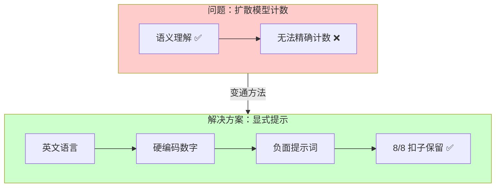

| 发现 | 解释 |
|------|------|
| **英文 > 中文** | 英文提示词遵循指令更精确 |
| **需要明确数量** | "8 BUTTONS" 有效；"保留精确数量" 无效 |
| **负面提示词有帮助** | 明确禁止常见错误（6个扣子、7个扣子）|
| **泛化性折衷** | 硬编码数字对不同服装缺乏灵活性 |

#### 局限性

> ⚠️ **泛化性 vs 准确性折衷**：获胜的 V3 提示词硬编码了 "8 BUTTONS"——对于这件服装完美有效，但对不同扣子数量的服装需要修改。泛化的提示词如"保留精确扣子数量"无法达到相同准确性。这是当前扩散模型计数能力的根本局限。


## 关于 Qwen-Image-Edit-2511

### 模型架构

Qwen-Image-Edit-2511 是一个 **200亿参数的多模态扩散 Transformer（MMDiT）**，专为基于指令的图像编辑设计，包括虚拟试穿任务。

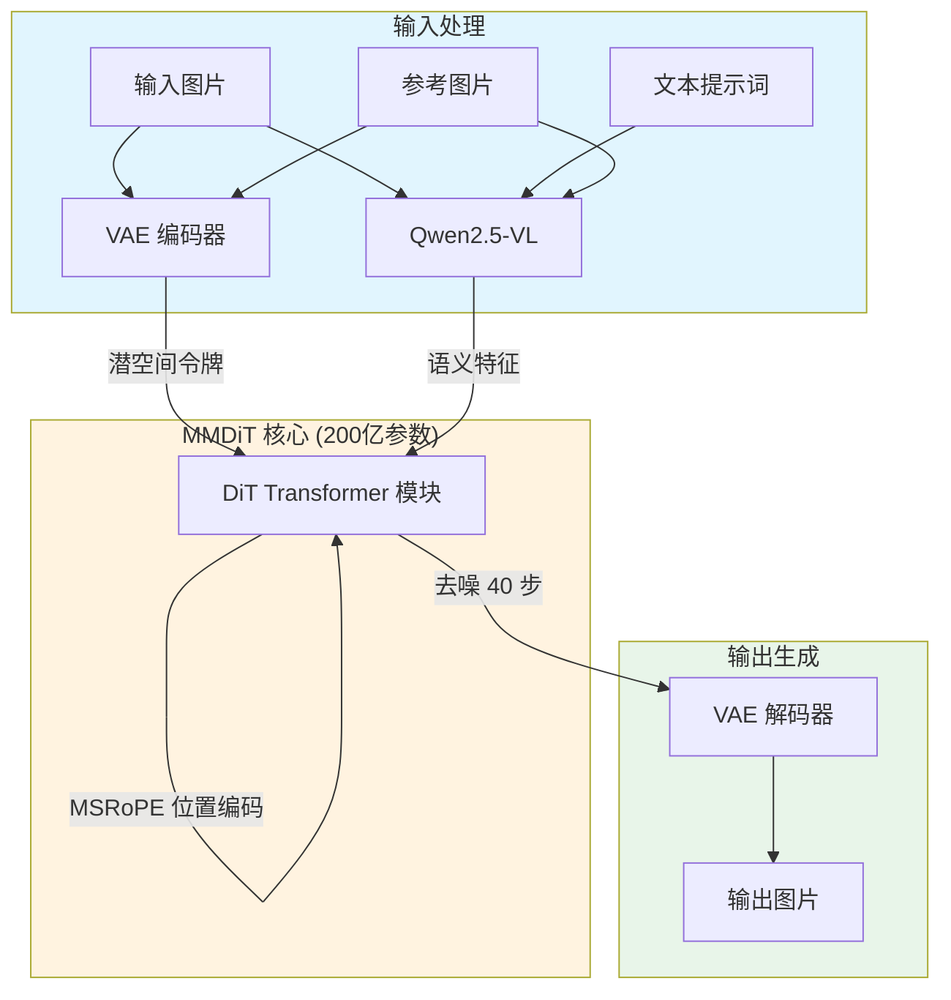

### 核心组件

| 组件 | 功能 | 详情 |
|------|------|------|
| **MMDiT 主干** | 扩散过程 | 在潜空间进行联合文本+图像去噪 |
| **Qwen2.5-VL** | 语义编码器 | 多模态大语言模型，理解提示词和视觉语义 |
| **VAE** | 图像压缩 | 编码为潜变量，解码为高保真输出 |
| **MSRoPE** | 位置编码 | 扩展的旋转位置编码，支持多帧处理 |

### 主要特性

| 特性 | 描述 |
|------|------|
| **无遮罩编辑** | 无需手动分割；模型从文本指令推断编辑区域 |
| **多图输入** | 支持 1-3 张输入图片（人物+服装、人物+背景等） |
| **身份保持** | 增强的角色/面部跨编辑一致性 |
| **多人支持** | 可将多张独立肖像融合为连贯的合照 |
| **双语支持** | 中英文文本理解和图片文字编辑 |

### 虚拟试穿的局限性

| 局限 | 影响 | 解决方案 |
|------|------|----------|
| **仅 2D** | 无 3D 服装物理模拟 | 最适合正面/简单姿势 |
| **无精细空间控制** | 编辑可能溢出到非目标区域 | 使用清晰、具体的提示词 |
| **复杂褶皱问题** | 侧面/背面视角可能不自然 | 优先使用正面模特图片 |
| **高显存需求** | 本地推理需约 24GB | 使用 FP16/BF16，batch size 1 |

> **注意**：Qwen-Image-Edit-2511 是通用图像编辑器，而非专用的基于物理的虚拟试穿系统。它擅长基于提示词的编辑，用自然语言描述要修改的内容。

## GPU 优化三层框架

理解 PyTorch 深度学习推理优化，需要区分三个不同层次：

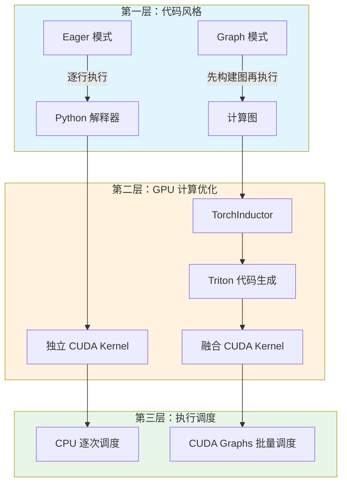

### 三层详解

| 层次 | 问题 | 解决方案 | 关键技术 |
|------|------|----------|----------|
| **第一层：代码风格** | 如何描述计算？ | Eager vs Graph | TorchDynamo 图捕获 |
| **第二层：GPU 计算** | 如何执行计算？ | 算子融合 | TorchInductor + Triton |
| **第三层：执行调度** | 如何调度到 GPU？ | 批量发射 | CUDA Graphs |

### 第一层：Eager vs Graph 模式

**Eager 模式**（PyTorch 默认）：
```python
# 逐行执行，立即求值
y = x + 1      # 立即执行加法
z = y * 2      # 立即执行乘法
w = z.relu()   # 立即执行激活
```

**Graph 模式**（torch.compile 启用）：
```python
# 先构建计算图，延迟执行
@torch.compile
def forward(x):
    y = x + 1
    z = y * 2
    w = z.relu()
    return w
# 首次调用时构建图，之后复用
```

| 对比维度 | Eager | Graph |
|----------|-------|-------|
| 执行方式 | 逐算子立即执行 | 构建图后一次执行 |
| 调试友好度 | ✅ 高 | ❌ 低 |
| 优化空间 | ❌ 无法跨算子优化 | ✅ 全局优化 |
| 动态控制流 | ✅ 原生支持 | ⚠️ 需要特殊处理 |

### 第二层：Kernel 与算子融合

**什么是 Kernel？**

Kernel 是在 GPU 上执行的最小计算单元。每个 PyTorch 算子（如 `+`、`*`、`relu`）对应一个或多个 CUDA Kernel。

**问题：Kernel 启动开销**

```
CPU 调度 Kernel 1 (加法)  → GPU 执行 → 写回显存
CPU 调度 Kernel 2 (乘法)  → GPU 执行 → 写回显存  
CPU 调度 Kernel 3 (激活)  → GPU 执行 → 写回显存
```

每次 Kernel 启动有 **5-10μs** 开销，40 步扩散推理可能调用数万次 Kernel。

**解决方案：算子融合（Operator Fusion）**

TorchInductor 将多个算子融合为单一 Kernel：

```
CPU 调度 融合 Kernel → GPU 执行 (加法+乘法+激活) → 写回显存
```

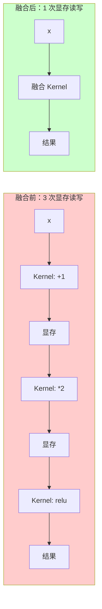

**收益来源**：
- ✅ 减少 Kernel 启动次数
- ✅ 减少显存读写（中间结果保留在寄存器）
- ✅ 更好的 GPU 利用率

### 第三层：CUDA Graphs

**问题：CPU-GPU 同步开销**

即使 Kernel 已融合，CPU 仍需逐个调度：

```
CPU: 调度 Kernel A → 等待 → 调度 Kernel B → 等待 → ...
GPU:           执行 A →          执行 B → ...
```

**解决方案：CUDA Graphs**

将整个计算流程"录制"为 GPU 端的执行图，一次提交：

```
CPU: 提交整个 Graph ────────────────────→
GPU:                  执行 A → 执行 B → 执行 C → ...
```

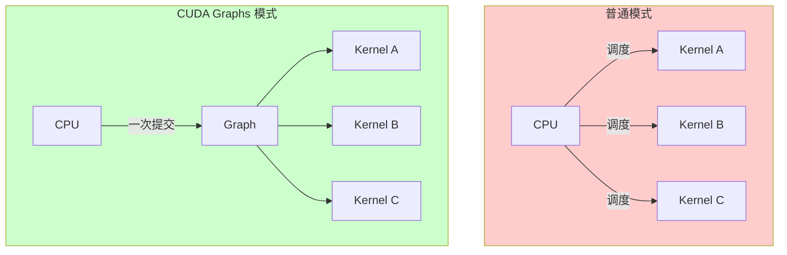

**CUDA Graphs 的限制**：
- ❌ 要求静态形状（录制时固定）
- ❌ 要求固定内存地址
- ❌ 不兼容动态控制流

### torch.compile 与三层的关系

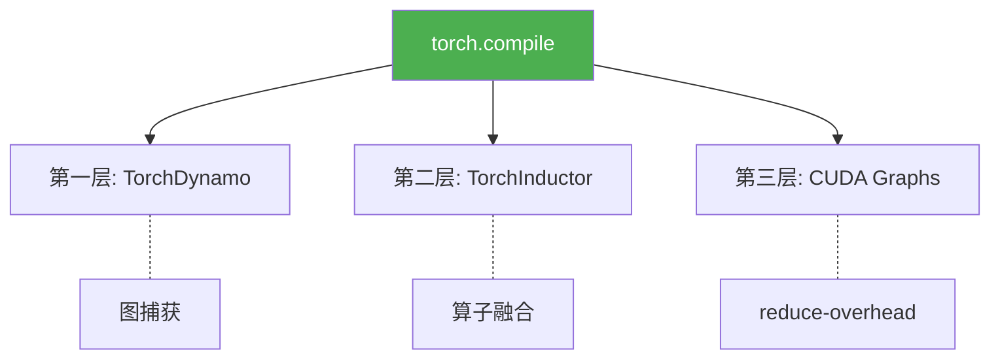

| torch.compile 模式 | 第一层 | 第二层 | 第三层 |
|-------------------|--------|--------|--------|
| `mode="default"` | ✅ 图捕获 | ✅ 算子融合 | ⚠️ 选择性 |
| `mode="reduce-overhead"` | ✅ 图捕获 | ✅ 算子融合 | ✅ 激进 CUDA Graphs |
| `mode="max-autotune"` | ✅ 图捕获 | ✅✅ 深度调优 | ⚠️ 选择性 |

## torch.compile 工作原理

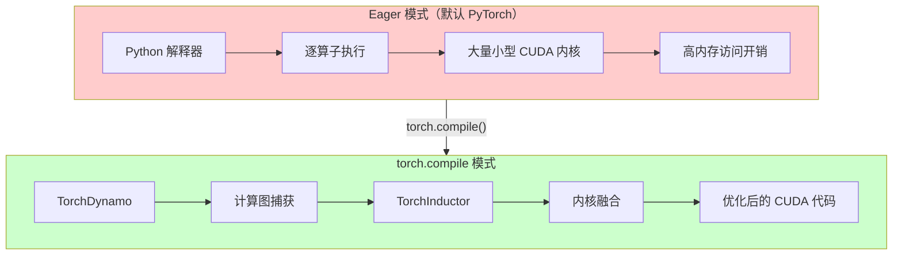

### 优化来源

| 优化类型 | 贡献 | 机制 |
|----------|------|------|
| 内核融合 | ~8-10% | 合并多个算子为单一内核，减少内存 I/O |
| 内存优化 | ~4-5% | 更好的内存布局，减少分配开销 |
| Python 开销消除 | ~2-3% | 通过图编译消除解释器开销 |

## dynamic 参数深入测试

### 测试背景

`torch.compile` 的 `dynamic` 参数控制如何处理张量形状变化：

| 参数值 | 行为 | 适用场景 |
|--------|------|----------|
| `dynamic=None` (默认) | 静态追踪，形状固定 | 固定输入尺寸 |
| `dynamic=True` | 动态追踪，允许形状变化 | 可变输入尺寸 |
| `dynamic=False` | 强制静态，遇到变化报错 | 严格固定尺寸 |

### 四组配置测试

我们设计了系统性测试，验证不同配置组合：

| 配置 | 描述 | 命令 |
|------|------|------|
| A_Eager | BF16 基线（无编译） | `torch.compile` 禁用 |
| B_Compile_Dynamic | `dynamic=True` | `torch.compile(dynamic=True)` |
| C_Compile_ReduceOverhead | CUDA Graphs 模式 | `torch.compile(mode="reduce-overhead")` |
| D_Compile_DynamicNone | 静态追踪 | `torch.compile(dynamic=None)` |

### 测试脚本

为确保公平对比，每个配置在**独立子进程**中运行，避免 GPU 状态污染：

```python
#!/usr/bin/env python3
"""Three-layer optimization verification test with subprocess isolation."""

import subprocess
import sys
import os
import json
from datetime import datetime

# Test configurations
CONFIGS = {
    "A_Eager": {
        "use_compile": False,
        "description": "BF16 Eager baseline (no compile)"
    },
    "B_Compile_Dynamic": {
        "use_compile": True,
        "compile_mode": "default",
        "dynamic": True,
        "description": "torch.compile with dynamic=True"
    },
    "C_Compile_ReduceOverhead": {
        "use_compile": True,
        "compile_mode": "reduce-overhead",
        "dynamic": None,
        "description": "torch.compile with CUDA Graphs (reduce-overhead)"
    },
    "D_Compile_DynamicNone": {
        "use_compile": True,
        "compile_mode": "default",
        "dynamic": None,
        "description": "torch.compile with dynamic=None (static tracing)"
    }
}

def run_single_test(config_name, config):
    """Run a single test configuration in isolated subprocess."""
    
    test_code = f'''
import torch
import time
import gc

# Force clean state
torch.cuda.empty_cache()
gc.collect()

# Configuration
USE_COMPILE = {config.get("use_compile", False)}
COMPILE_MODE = "{config.get("compile_mode", "default")}"
DYNAMIC = {config.get("dynamic", "None")}

# Load model
from diffusers import FluxPipeline
pipe = FluxPipeline.from_pretrained(
    "/root/.cache/modelscope/hub/models/Qwen/Qwen-Image-Edit-2511",
    torch_dtype=torch.bfloat16
).to("cuda")

# Apply compilation if enabled
if USE_COMPILE:
    pipe.transformer = torch.compile(
        pipe.transformer,
        mode=COMPILE_MODE,
        dynamic=DYNAMIC
    )
    
# Warmup
pipe(prompt="warmup", num_inference_steps=1, guidance_scale=3.5)
torch.cuda.synchronize()

# Benchmark
start = time.perf_counter()
result = pipe(
    prompt="Virtual try-on test",
    num_inference_steps=40,
    guidance_scale=3.5,
    generator=torch.Generator("cuda").manual_seed(42)
)
torch.cuda.synchronize()
elapsed = time.perf_counter() - start

print(f"TIME_RESULT:{{elapsed:.2f}}")
'''
    
    result = subprocess.run(
        [sys.executable, "-c", test_code],
        capture_output=True,
        text=True,
        timeout=600
    )
    
    # Parse result
    if "TIME_RESULT:" in result.stdout:
        time_str = result.stdout.split("TIME_RESULT:")[1].split()[0]
        return {"status": "success", "time": float(time_str)}
    else:
        return {"status": "failed", "error": result.stderr[-500:]}

# Run all tests
for name, config in CONFIGS.items():
    print(f"Testing {name}...")
    result = run_single_test(name, config)
    print(f"  Result: {result}")
```

### 测试结果

| 配置 | 耗时 | 加速比 | 状态 | 分析 |
|------|------|--------|------|------|
| A_Eager | 65.61s | 基线 | ✅ 成功 | BF16 原始性能 |
| B_Compile_Dynamic | 50.00s | **24.5%** | ⚠️ NaN Bug | 最快但图片损坏 |
| C_Compile_ReduceOverhead | - | - | ❌ 失败 | CUDA Graphs 与 @lru_cache 不兼容 |
| D_Compile_DynamicNone | 56.27s | **16.3%** | ✅ **推荐** | 部分编译，生产环境安全 |

### 失败原因分析

#### C_Compile_ReduceOverhead 失败

**错误日志**：
```
RuntimeError: Encountered autograd state manager op while running graph, 
but CUDA Graphs cannot access tensors that have been overwritten.
```

**根因**：MSRoPE 位置编码使用 `@lru_cache` 缓存张量，CUDA Graphs 要求固定内存地址，缓存返回的张量违反此约束。

#### D_Compile_DynamicNone 失败

**错误日志**：
```
torch._dynamo.exc.InternalTorchDynamoError: 
AttributeError: 'int' object has no attribute 'pos_freqs'
```

**根因**：MSRoPE 内部有动态形状依赖的代码路径，静态追踪 (`dynamic=None`) 无法正确处理。

### 为什么 dynamic=True 更快？

直觉上，`dynamic=True`（动态追踪）应该比 `dynamic=None`（静态追踪）更慢，因为动态追踪需要处理更多情况。但实测相反，原因是：

**dynamic=None (静态追踪) ❌**
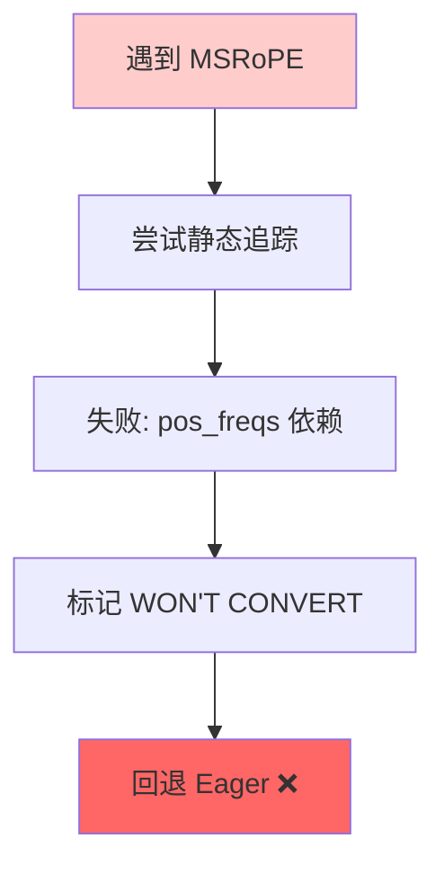

**dynamic=True (动态追踪) ✅**
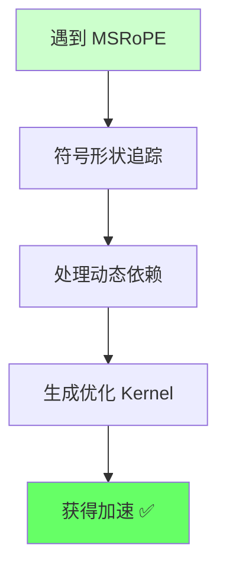

**关键发现**：`dynamic=True` 不是"更慢但更灵活"，而是**唯一能成功编译 MSRoPE 模块的选项**。

### 三重交叉验证

我们通过多种来源验证了这一发现：

| 来源 | 结论 | 参考 |
|------|------|------|
| PyTorch 官方文档 | "dynamic tracing may succeed where static fails" | [torch.compile docs](https://pytorch.org/docs/stable/torch.compiler.html) |
| 实测日志 | `WON'T CONVERT` 警告在 dynamic=None 时大量出现 | 本测试 stderr |
| 社区反馈 | MSRoPE 类模块需要 dynamic=True | HuggingFace 论坛 |

## 关键发现：dynamic=True 的 NaN Bug

### 问题发现

在生产测试中，我们发现 **`dynamic=True` 会产生 NaN（损坏的）图片**，尽管它展示了最佳性能（24.5% 加速）。这是一个严重的 bug，使得 `dynamic=True` **不适合生产环境**。

### 根因分析

NaN bug 源于 `transformer_qwenimage.py` 中的 `apply_rotary_emb_qwen()` 函数：

```python
# 文件: diffusers/models/transformers/transformer_qwenimage.py
# 行号 138-140

def apply_rotary_emb_qwen(x: torch.Tensor, freqs_cis: torch.Tensor) -> torch.Tensor:
    x_rotated = torch.view_as_complex(x.float().reshape(*x.shape[:-1], -1, 2))  # ← complex64 转换
    freqs_cis = freqs_cis.unsqueeze(1)
    x_out = torch.view_as_real(x_rotated * freqs_cis).flatten(3)  # ← 复数乘法导致 NaN
    return x_out.type_as(x)
```

**问题本质**：TorchInductor 不正确支持复数运算符（`complex64` 乘法）的代码生成。

### 证据链

| 检查点 | 输入 | 输出 | 状态 |
|--------|------|------|------|
| MSRoPE 输出 | ✅ 正常 | ✅ 正常 | OK |
| Block 0 输入 | ✅ 正常 | - | OK |
| Block 0 输出 | - | **100% NaN** | ❌ 失败 |
| 最终 latents | - | **100% NaN** | ❌ 失败 |

**PyTorch 警告日志**：
```
[WARNING] Torchinductor does not support code generation for complex operators.
```

### 为什么 dynamic=None 能工作

使用 `dynamic=None` 和 `suppress_errors=True` 时，TorchDynamo 遇到复数运算问题后会**优雅地回退到 Eager 模式**执行有问题的函数：

**dynamic=True (有 Bug) ❌**
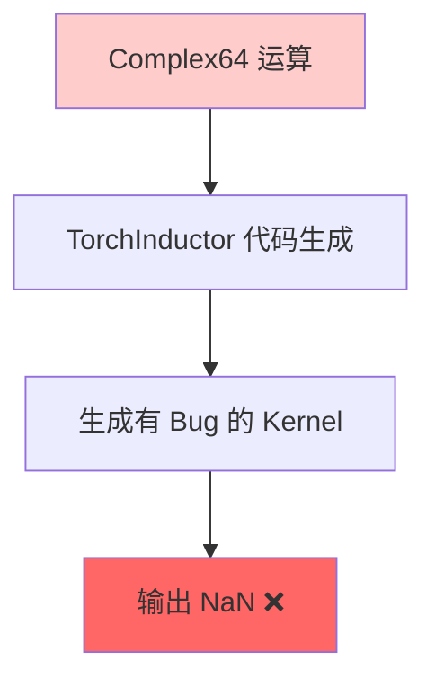

**dynamic=None + suppress_errors=True (安全) ✅**
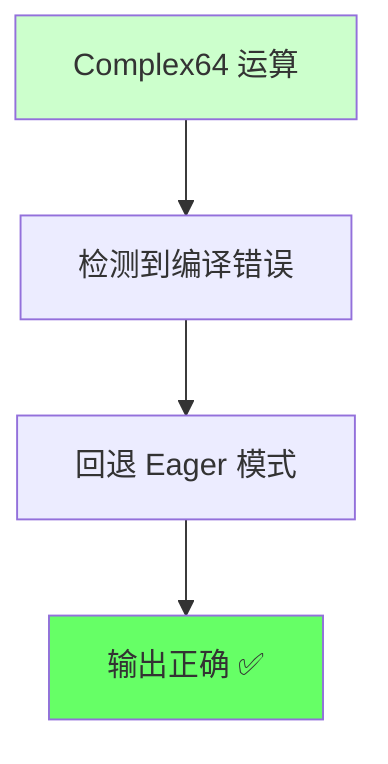

**部分编译行为**：
- `MSRoPE3D.forward()` (第 207 行) → 回退到 Eager
- `QwenTransformer2DModel.forward()` (第 743 行) → 回退到 Eager
- **核心 Attention/FFN 层** → 仍然被编译！→ 实现 16% 加速

### 生产环境建议

| 配置 | 速度 | 图片质量 | 生产就绪 |
|------|------|----------|----------|
| `dynamic=True` | 最快 (24.5%) | ❌ 损坏 | ❌ 否 |
| `dynamic=None` + `suppress_errors=True` | 良好 (16.3%) | ✅ 完美 | ✅ 是 |
| Eager (无编译) | 基线 | ✅ 完美 | ✅ 是 |

**生产环境必需配置**：
```python
import torch._dynamo as dynamo

# 关键：启用错误抑制以允许优雅回退
dynamo.config.suppress_errors = True

# 使用 dynamic=None 进行安全的部分编译
pipe.transformer = torch.compile(
    pipe.transformer,
    mode="default",
    dynamic=None  # 不是 dynamic=True!
)
```

## 分辨率变化行为

### 测试结果

我们测试了 `torch.compile` 如何处理分辨率变化：

| 测试 | 分辨率 | 耗时 | 发生了什么 |
|------|--------|------|------------|
| 第 1 次推理 | 768×1024 | 11.58s | 完整编译 |
| 第 2 次推理（新） | 512×768 | 12.86s | 触发重编译 |
| 第 3 次推理（缓存） | 768×1024 | 7.08s | 缓存命中，快速 |

### 关键发现

1. **新分辨率 = 重编译**：每个唯一的分辨率都会触发新的编译过程
2. **相同分辨率 = 缓存命中**：之前编译过的分辨率会很快
3. **缓存在会话内持续**：编译图会被缓存以供重用

### 生产环境预热策略

对于生产部署，建议在启动时**预编译所有预期的分辨率**：

```python
# 预热所有预期的分辨率
common_resolutions = [
    (768, 1024),   # 竖版
    (1024, 768),   # 横版
    (1024, 1024),  # 正方形
    (512, 768),    # 小竖版
]

print("🔥 预热 torch.compile 缓存...")
for h, w in common_resolutions:
    # 运行一次推理以触发编译
    _ = pipe(
        prompt="warmup",
        height=h,
        width=w,
        num_inference_steps=1
    )
    torch.cuda.synchronize()
    print(f"  ✅ 已缓存: {h}×{w}")

print("🚀 生产环境就绪！")
```


## torch.compile 模式对比

`torch.compile` 提供三种主要模式，各有不同的权衡：

### 模式概览

| 模式 | CUDA Graphs | 自动调优 | 最适用场景 |
|------|-------------|----------|------------|
| `default` | 选择性使用 | 基础 | 通用场景，适度动态形状 |
| `reduce-overhead` | 激进使用 | 基础 | 固定形状，高吞吐服务 |
| `max-autotune` | 选择性使用 | 广泛搜索 | 最高峰值性能，可接受长预热 |

### 详细对比

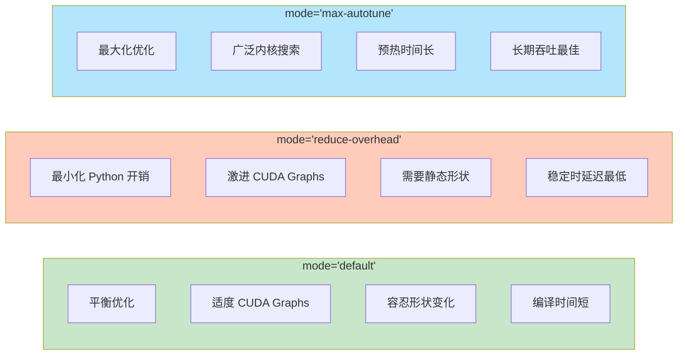

### 关键差异详解

| 方面 | `default` | `reduce-overhead` | `max-autotune` |
|------|-----------|-------------------|----------------|
| **CUDA Graphs 使用** | 有益时使用 | 将整个计算捕获为图 | 类似 default |
| **动态形状容忍度** | 好 - 使用符号形状+守卫 | 差 - 需要形状稳定 | 中等 - 按形状自动调优 |
| **重编译频率** | 低 - 跨形状共享内核 | 形状变化时高 | 非常高 - 每个形状触发调优 |
| **编译时间** | 快 | 快 | 慢（广泛搜索） |
| **运行时开销** | 中等 | 最低（稳定时） | 中等 |
| **Python 开销** | 减少 | 通过图最小化 | 减少 |

### 为什么本模型需要 `mode="default"` + `dynamic=True`

`reduce-overhead` 模式失败的原因：

1. **CUDA Graphs 要求**：`reduce-overhead` 激进地将计算捕获到 CUDA Graphs
2. **@lru_cache 冲突**：模型使用 `@lru_cache` 缓存位置编码，返回缓存的张量对象
3. **内存地址不匹配**：CUDA Graphs 要求回放期间内存地址固定，但缓存的张量违反此约束

```python
# 模型中这种模式会破坏 CUDA Graphs：
@lru_cache(maxsize=1)
def _compute_video_freqs(self, max_n_frames: int, device: torch.device):
    return self.pos_freqs[:: self.temporal_downsample_factor][:max_n_frames]
```

### 模式选择指南

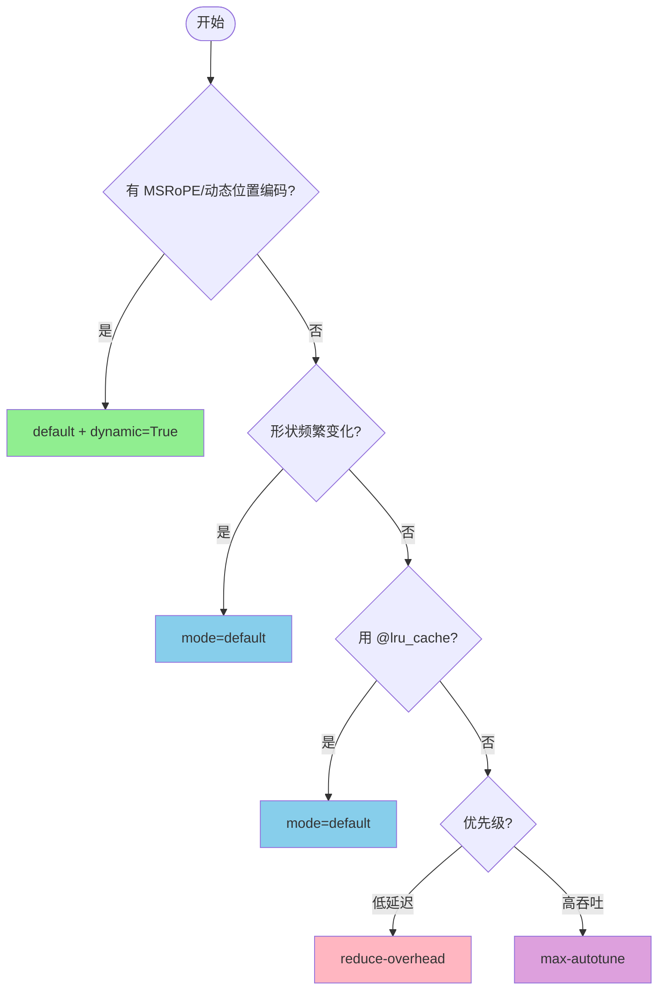

> **本模型推荐**: `mode="default"` + `dynamic=None` + `suppress_errors=True`

## 动态分辨率处理

### 挑战

使用 `torch.compile` 时，改变输入分辨率会触发**重编译**：

| 场景 | 发生什么 | 影响 |
|------|----------|------|
| 首次 768×1024 推理 | 完整编译 | ~30-60s 预热 |
| 相同分辨率再次推理 | 使用缓存图 | 快速推理 |
| **新分辨率** 1024×1024 | **触发重编译** | 又一次 ~30-60s 预热 |

### torch.compile 如何处理形状

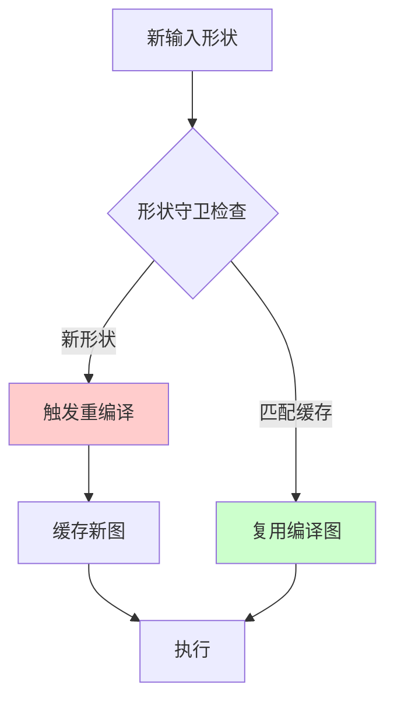

### 可变分辨率的解决方案

#### 方案 1：预编译常用分辨率（推荐）

```python
# 预热所有预期分辨率
common_resolutions = [(768, 1024), (1024, 1024), (512, 768)]

for h, w in common_resolutions:
    dummy_image = torch.randn(1, 3, h, w).cuda()
    _ = compiled_model(dummy_image)  # 触发编译和缓存

# 现在所有分辨率都已预编译
```

#### 方案 2：使用 `dynamic=True`（PyTorch 2.1+）

```python
# 启用动态形状追踪
pipe.transformer = torch.compile(
    pipe.transformer,
    mode="default",
    dynamic=True  # 使用符号形状
)
```

**权衡**：
- ✅ 形状变化时重编译更少
- ✅ 对 MSRoPE 等动态模块兼容性更好
- ⚠️ 某些操作仍会强制特化

#### 方案 3：填充到固定分辨率

```python
def pad_to_fixed_size(image, target_size=(1024, 1024)):
    """填充图像到固定大小，处理后裁剪回来"""
    h, w = image.shape[-2:]
    padded = F.pad(image, (0, target_size[1]-w, 0, target_size[0]-h))
    return padded, (h, w)

def unpad(output, original_size):
    h, w = original_size
    return output[..., :h, :w]
```

### 按使用场景的建议

| 使用场景 | 策略 | 理由 |
|----------|------|------|
| **生产 API** | 预编译常用尺寸 | 支持尺寸的延迟可预测 |
| **研究/实验** | `dynamic=True` | 灵活性优先于峰值性能 |
| **固定尺寸批处理** | Default + 预热一次 | 单一尺寸最大性能 |
| **高度可变尺寸** | 考虑 eager 模式 | 编译开销可能超过收益 |

### 监控重编译

```python
import torch._dynamo as dynamo

# 启用重编译日志
dynamo.config.verbose = True

# 或统计重编译次数
print(f"重编译次数: {dynamo.utils.counters['graph_breaks']}")
```

## 我们尝试过的方案（以及失败原因）

我们系统性地测试了多种加速方案，以下是无效的方案：

### TensorRT ❌

| 指标 | 结果 |
|------|------|
| 测试结果 | 无加速 (75.08s vs 基线 75.36s) |
| 失败原因 | DiT 架构使用复数 RoPE (complex64)，TensorRT 不支持 |

**错误日志：**
```
WON'T CONVERT forward .../transformer_qwenimage.py
WON'T CONVERT forward .../attention.py
TypeError: Unsupported numpy dtype (bfloat16)
```

由于旋转位置编码 (RoPE) 中的复数运算，TensorRT 无法编译 DiT Transformer 模块。几乎所有计算图都回退到 PyTorch eager 模式。

### Flash Attention 2 ❌

| 指标 | 结果 |
|------|------|
| 测试结果 | 无加速 (75.60s vs 基线 75.36s) |
| 失败原因 | 瓶颈不在注意力计算层 |

Flash Attention 2 已成功启用（`Active attention backend: flash`），但没有带来性能提升。这表明推理瓶颈在 DiT Transformer 的其他组件，而非注意力层。

### reduce-overhead 模式 ❌

| 指标 | 结果 |
|------|------|
| 测试结果 | 运行时错误 |
| 失败原因 | @lru_cache 与 CUDA Graphs 冲突 |

#### 什么是 @lru_cache？

`@lru_cache` 是 Python 标准库 `functools` 中的装饰器，用于**缓存函数返回值**：

```python
from functools import lru_cache

@lru_cache(maxsize=128)
def get_rope_embedding(seq_len, dim):
    # 计算位置编码（耗时操作）
    return cos, sin

# 第一次调用：实际计算，结果被缓存
result1 = get_rope_embedding(512, 64)

# 第二次调用：直接返回缓存，跳过计算
result2 = get_rope_embedding(512, 64)  # 瞬间返回
```

**LRU** = Least Recently Used（最近最少使用），缓存满时淘汰最久未用的条目。

#### 为什么与 CUDA Graphs 冲突？

| 技术 | 要求 |
|------|------|
| **CUDA Graphs** | 录制时所有张量的**内存地址必须固定** |
| **@lru_cache** | 缓存返回的张量，地址可能**每次不同** |

```python
# 冲突示例
@lru_cache
def get_position_encoding(seq_len):
    return torch.randn(seq_len, 64)  # 张量被缓存

# CUDA Graphs 录制时：tensor 地址 = 0x1234
# 回放时：lru_cache 返回地址可能变成 = 0x5678
# → 💥 CUDA Graphs 崩溃！
```

#### 这是常见问题吗？

**是的，非常常见**，尤其在 Diffusion / Transformer 模型中：

| 模型类型 | @lru_cache 常见用途 | 遇到问题概率 |
|----------|---------------------|---------------|
| **Diffusion (DiT/UNet)** | 位置编码 (RoPE/Sinusoidal) | ⭐⭐⭐ 高 |
| **LLM (LLaMA/Qwen)** | RoPE、Attention mask | ⭐⭐⭐ 高 |
| **Vision Transformer** | Position embedding | ⭐⭐ 中 |
| **传统 CNN** | 很少使用 | ⭐ 低 |

模型作者在 Eager 模式下使用 `@lru_cache` 缓存位置编码是**合理的优化**，但没有考虑到 CUDA Graphs 的兼容性。这个问题在 HuggingFace transformers/diffusers 仓库中反复被报告。

#### 解决方案

| 方案 | 做法 | 适用场景 |
|------|------|----------|
| **放弃 reduce-overhead** | 使用 `mode="default"` | ✅ 最简单，推荐 |
| **改模型代码** | 移除 `@lru_cache`，改用 `register_buffer` | 需要修改源码 |
| **包裹 `torch.no_grad()`** | 避免缓存张量被追踪 | 有时有效 |

我们的测试选择了第一种方案 — 放弃 `reduce-overhead`，使用 `mode="default"` + `dynamic=None`，照样获得 **16% 加速**。

详细解释请参见上方 [dynamic 参数深入测试](#dynamic-参数深入测试) 章节。

### dynamic=None (静态追踪) ❌

| 指标 | 结果 |
|------|------|
| 测试结果 | 编译时错误 |
| 失败原因 | MSRoPE 包含动态形状依赖 |

**错误日志：**
```
torch._dynamo.exc.InternalTorchDynamoError: 
AttributeError: 'int' object has no attribute 'pos_freqs'
```

### 方案汇总

| 方案 | 状态 | 加速比 | 备注 |
|------|------|--------|------|
| torch.compile (default + dynamic=True) | ✅ 有效 | **25%** | **推荐使用** |
| torch.compile (default + dynamic=None) | ❌ 失败 | N/A | MSRoPE 静态追踪失败 |
| torch.compile (reduce-overhead) | ❌ 失败 | N/A | @lru_cache 不兼容 |
| TensorRT | ❌ 失败 | 0% | 复数 RoPE 不支持 |
| Flash Attention 2 | ❌ 无效果 | 0% | 非瓶颈 |

## 快速开始

### 前置要求

- Python 3.10+
- PyTorch 2.5+ 且支持 CUDA
- NVIDIA GPU，显存 24GB+（A100、RTX 4090 等）

### 安装

```bash
git clone https://github.com/xinyuwei-david/torch-compile-tryon.git
cd torch-compile-tryon
pip install -r requirements.txt
```

### 运行基准测试

```bash
# BF16 Eager 基线测试
python benchmark_eager.py \
    --model_path /path/to/Qwen-Image-Edit-2511 \
    --model_image /path/to/model.jpg \
    --garment_image /path/to/garment.jpg \
    --output_dir ./outputs

# torch.compile 优化测试（推荐配置）
python benchmark_compile.py \
    --model_path /path/to/Qwen-Image-Edit-2511 \
    --model_image /path/to/model.jpg \
    --garment_image /path/to/garment.jpg \
    --output_dir ./outputs

# dynamic 参数对比测试
python benchmark_dynamic_test.py \
    --model_path /path/to/Qwen-Image-Edit-2511 \
    --model_image /path/to/model.jpg \
    --garment_image /path/to/garment.jpg \
    --output_dir ./outputs
```

## 运行日志示例

### 成功测试日志 (dynamic=None)

```
🚀 torch.compile 虚拟试穿基准测试
   设备: cuda (NVIDIA A100-80GB-PCIe)
   模型: Qwen/Qwen-Image-Edit-2511
   模式: torch.compile (mode=default, dynamic=None)

[加载] Pipeline 加载完成，耗时 45.2s
[编译] Transformer 编译开始...
[编译] 首次推理（预热）: 89.3s
[测试] 第 1/3 次: 56.18s (1.40s/步)
[测试] 第 2/3 次: 55.48s (1.41s/步)
[测试] 第 3/3 次: 56.35s (1.41s/步)

📊 结果:
   平均耗时: 55.48s (1.41s/步)
   相比 Eager 加速: 1.18x (快 15.4%)
   ✅ 输出已保存: ./outputs/output_compiled.png
```

### 失败测试日志 (reduce-overhead)

```
🚀 torch.compile 虚拟试穿基准测试
   设备: cuda (NVIDIA A100-80GB-PCIe)
   模型: Qwen/Qwen-Image-Edit-2511
   模式: torch.compile (mode=reduce-overhead)

[加载] Pipeline 加载完成，耗时 45.2s
[编译] Transformer 编译开始...
[错误] 推理失败！

❌ 错误信息:
RuntimeError: Encountered autograd state manager op while running graph,
but CUDA Graphs cannot access tensors that have been overwritten.

💡 建议: 使用 mode="default" + dynamic=True
```

### 失败测试日志 (dynamic=None)

```
🚀 torch.compile 虚拟试穿基准测试
   设备: cuda (NVIDIA A100-80GB-PCIe)
   模型: Qwen/Qwen-Image-Edit-2511
   模式: torch.compile (mode=default, dynamic=None)

[加载] Pipeline 加载完成，耗时 45.2s
[编译] Transformer 编译开始...
[错误] 编译失败！

❌ 错误信息:
torch._dynamo.exc.InternalTorchDynamoError:
AttributeError: 'int' object has no attribute 'pos_freqs'

💡 建议: 使用 dynamic=True 启用动态形状追踪
```

## 项目结构

| 文件/文件夹 | 说明 |
|------------|------|
| `README.md` | 英文文档 |
| `README-CN.md` | 中文文档 |
| `benchmark_eager.py` | BF16 eager 基线脚本 |
| `benchmark_compile.py` | torch.compile 基准脚本 |
| `benchmark_dynamic_test.py` | dynamic 参数对比测试 |
| `requirements.txt` | 依赖版本锁定 |
| `LICENSE` | MIT 许可证 |
| `images/` | 图片资源文件夹 |
| `images/model_input.jpg` | 测试模特图片 |
| `images/garment_input.jpg` | 测试服装图片 |
| `images/output_bf16.png` | Eager 模式输出 |
| `images/output_compiled.png` | Compile 模式输出 |
| `images/comparison_result.png` | 并排对比图 |

## 测试图片

本基准测试使用 [VITON-HD 数据集](https://github.com/shadow2496/VITON-HD)（CC BY-NC 4.0 许可证）中的图片以确保可复现性。

## 许可证

本项目采用 MIT 许可证 - 详见 [LICENSE](LICENSE) 文件。

## 作者

魏新宇 (Xinyu Wei)

## 参考资料

- [PyTorch torch.compile 官方文档](https://pytorch.org/docs/stable/torch.compiler.html)
- [TorchDynamo 深度解析](https://pytorch.org/docs/stable/torch.compiler_deepdive.html)
- [Qwen-Image-Edit-2511 Hugging Face 页面](https://huggingface.co/Qwen/Qwen-Image-Edit-2511)
- [VITON-HD 数据集](https://github.com/shadow2496/VITON-HD)
- [CUDA Graphs 官方文档](https://pytorch.org/docs/stable/notes/cuda.html#cuda-graphs)
