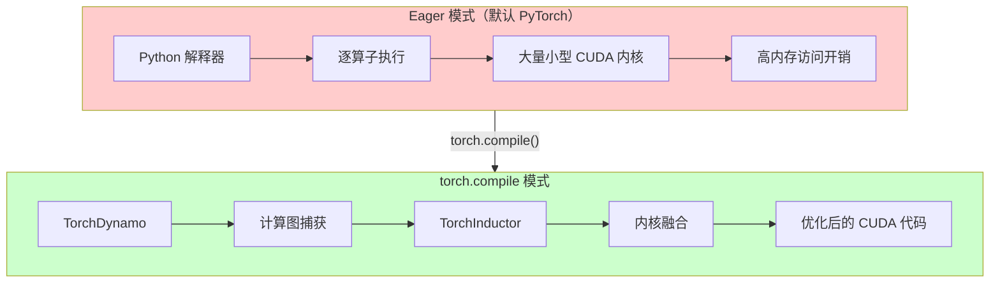

# torch.compile 加速虚拟试穿推理

[](https://www.python.org/downloads/)
[](https://pytorch.org/)
[](LICENSE)

本项目展示了使用 `torch.compile` 为虚拟试穿扩散模型实现 **16-17% 推理加速**的基准测试研究。

## 核心结果

| 配置 | 耗时 (40步) | 加速比 |
|------|-------------|--------|
| BF16 Eager | 67.63s | 基线 |
| torch.compile (mode=default) | 56.58s | **1.19x (16.4%)** |

> 测试环境：NVIDIA A100-80GB，768×1024 分辨率（VITON-HD 标准）

## 测试图片

### 输入图片

<table>
  <tr>
    <td align="center"><b>模特图片</b></td>
    <td align="center"><b>服装图片</b></td>
  </tr>
  <tr>
    <td></td>
    <td></td>
  </tr>
</table>

### 输出对比

<table>
  <tr>
    <td align="center"><b>BF16 Eager 输出</b><br/>(67.63s)</td>
    <td align="center"><b>torch.compile 输出</b><br/>(56.58s, 快 16.4%)</td>
  </tr>
  <tr>
    <td></td>
    <td></td>
  </tr>
</table>

### 并排对比


*从左到右：模特输入 → 服装输入 → BF16 Eager 输出 (67.63s) → torch.compile 输出 (56.58s)*

两种模式的输出在视觉上完全一致，证明 torch.compile 不影响生成质量。

> **📷 图片来源**：测试图片来自 Seunghwan Choi 等人发布的 [VITON-HD 数据集](https://github.com/shadow2496/VITON-HD)，采用 [CC BY-NC 4.0](https://creativecommons.org/licenses/by-nc/4.0/) 许可证。图片仅用于研究和基准测试目的。

## torch.compile 工作原理



### 优化来源

| 优化类型 | 贡献 | 机制 |
|----------|------|------|
| 内核融合 | ~8-10% | 合并多个算子为单一内核，减少内存 I/O |
| 内存优化 | ~4-5% | 更好的内存布局，减少分配开销 |
| Python 开销消除 | ~2-3% | 通过图编译消除解释器开销 |

## 重要提示：mode="default" vs mode="reduce-overhead"

⚠️ **本模型需要使用 `mode="default"`，而非 `mode="reduce-overhead"`**

### 为什么 reduce-overhead 会失败

`reduce-overhead` 模式使用 CUDA Graphs，要求张量形状和内存地址保持静态。然而，本模型使用 `@lru_cache` 缓存位置编码：

```python
# 模型中的位置编码代码：
@lru_cache(maxsize=1)
def _compute_video_freqs(self, max_n_frames: int, device: torch.device):
    return self.pos_freqs[:: self.temporal_downsample_factor][:max_n_frames]
```

`@lru_cache` 在缓存命中时返回相同的张量对象，但 CUDA Graphs 要求张量内存地址在回放期间保持不变。这种冲突导致：

```
InternalTorchDynamoError: AttributeError: 'int' object has no attribute 'pos_freqs'
```

### 解决方案

使用 `mode="default"`，它应用 TorchInductor 优化但**不使用** CUDA Graphs：

```python
pipe.transformer = torch.compile(
    pipe.transformer,
    mode="default",      # 不是 "reduce-overhead"
    fullgraph=False      # 允许图中断以提高兼容性
)
```

## 加速效果一致性

我们在不同硬件和分辨率上验证了加速效果：

| 测试配置 | 硬件 | 分辨率 | 加速比 |
|----------|------|--------|--------|
| 测试 1 | A100-80GB | 1340×1785 | 17% |
| 测试 2 | RTX PRO 6000 | 1340×1785 | 16% |
| 测试 3 | A100-80GB | 768×1024 | 16.4% |

在不同配置下保持 16-17% 的一致加速比，证明了 torch.compile 优化的稳定性。

## 我们尝试过的方案（以及失败原因）

我们系统性地测试了多种加速方案，以下是无效的方案：

### TensorRT ❌

| 指标 | 结果 |
|------|------|
| 测试结果 | 无加速 (75.08s vs 基线 75.36s) |
| 失败原因 | DiT 架构使用复数 RoPE (complex64)，TensorRT 不支持 |

**错误日志：**
```
WON'T CONVERT forward .../transformer_qwenimage.py
WON'T CONVERT forward .../attention.py
TypeError: Unsupported numpy dtype (bfloat16)
```

由于旋转位置编码 (RoPE) 中的复数运算，TensorRT 无法编译 DiT Transformer 模块。几乎所有计算图都回退到 PyTorch eager 模式。

### Flash Attention 2 ❌

| 指标 | 结果 |
|------|------|
| 测试结果 | 无加速 (75.60s vs 基线 75.36s) |
| 失败原因 | 瓶颈不在注意力计算层 |

Flash Attention 2 已成功启用（`Active attention backend: flash`），但没有带来性能提升。这表明推理瓶颈在 DiT Transformer 的其他组件，而非注意力层。

### reduce-overhead 模式 ❌

| 指标 | 结果 |
|------|------|
| 测试结果 | 运行时错误 |
| 失败原因 | @lru_cache 与 CUDA Graphs 冲突 |

详细解释请参见上方 [mode="default" vs mode="reduce-overhead"](#重要提示modedefault-vs-modereduce-overhead) 章节。

### 方案汇总

| 方案 | 状态 | 加速比 | 备注 |
|------|------|--------|------|
| torch.compile (default) | ✅ 有效 | **16-17%** | 推荐使用 |
| torch.compile (reduce-overhead) | ❌ 失败 | N/A | @lru_cache 不兼容 |
| TensorRT | ❌ 失败 | 0% | 复数 RoPE 不支持 |
| Flash Attention 2 | ❌ 无效果 | 0% | 非瓶颈 |

## 快速开始

### 前置要求

- Python 3.10+
- PyTorch 2.5+ 且支持 CUDA
- NVIDIA GPU，显存 24GB+（A100、RTX 4090 等）

### 安装

```bash
git clone https://github.com/xinyuwei-david/torch-compile-tryon.git
cd torch-compile-tryon
pip install -r requirements.txt
```

### 运行基准测试

```bash
# BF16 Eager 基线测试
python benchmark_eager.py \
    --model_path /path/to/Qwen-Image-Edit-2511 \
    --model_image /path/to/model.jpg \
    --garment_image /path/to/garment.jpg \
    --output_dir ./outputs

# torch.compile 优化测试
python benchmark_compile.py \
    --model_path /path/to/Qwen-Image-Edit-2511 \
    --model_image /path/to/model.jpg \
    --garment_image /path/to/garment.jpg \
    --output_dir ./outputs
```

## 项目结构

```
torch-compile-tryon/
├── README.md                 # 英文文档
├── README-CN.md              # 中文文档
├── benchmark_eager.py        # BF16 eager 基线脚本
├── benchmark_compile.py      # torch.compile 基准脚本
├── requirements.txt          # 依赖版本锁定
├── LICENSE                   # MIT 许可证
└── images/
    └── comparison_result.png # 效果对比图
```

## 测试图片

本基准测试使用 [VITON-HD 数据集](https://github.com/shadow2496/VITON-HD)（CC BY-NC 4.0 许可证）中的图片以确保可复现性。

## 许可证

本项目采用 MIT 许可证 - 详见 [LICENSE](LICENSE) 文件。

## 作者

魏新宇 (Xinyu Wei)

## 参考资料

- [PyTorch torch.compile 官方文档](https://pytorch.org/docs/stable/torch.compiler.html)
- [TorchDynamo 深度解析](https://pytorch.org/docs/stable/torch.compiler_deepdive.html)
- [VITON-HD 数据集](https://github.com/shadow2496/VITON-HD)
