# torch.compile Acceleration for Virtual Try-On

[](https://www.python.org/downloads/)
[](https://pytorch.org/)
[](LICENSE)

A benchmark study demonstrating **16-24% inference speedup** on virtual try-on diffusion models using `torch.compile`, with in-depth analysis of PyTorch's three-layer optimization framework.


## Running on Azure

All experiments in this project were conducted on an **Azure GPU VM**.

| Item | Details |
|---|---|
| **Azure VM** | [Standard_NC24ads_A100_v4](https://learn.microsoft.com/en-us/azure/virtual-machines/nc-a100-v4-series) |
| **GPU** | NVIDIA A100 80GB PCIe |
| **Frameworks** | TensorRT-LLM, torch.compile, Diffusers |


## Key Results

| Configuration | Time (40 steps) | Speedup | Status | Notes |
|--------------|-----------------|---------|--------|-------|
| BF16 Eager | 65.61s | baseline | ✅ | Reference baseline |
| torch.compile (dynamic=True) | 50.00s | **1.32x (24.5%)** | ⚠️ **NaN Bug** | Images corrupted due to TorchInductor complex64 bug |
| torch.compile (dynamic=None) | 55.48s | **1.18x (15.4%)** | ✅ **Recommended** | Partial compile, MSRoPE falls back to Eager |
| torch.compile (reduce-overhead) | - | - | ❌ Failed | CUDA Graphs incompatible with @lru_cache |

> Tested on NVIDIA A100-80GB PCIe, PyTorch 2.5.0+cu124, diffusers 0.37.0.dev0

## Table of Contents

- [Test Images](#test-images)
- [**Prompt Optimization for Detail Preservation**](#test3-prompt-optimization-for-detail-preservation) 🆕
- [About Qwen-Image-Edit-2511](#about-qwen-image-edit-2511)
- [Three-Layer GPU Optimization Framework](#three-layer-gpu-optimization-framework)
- [How torch.compile Works](#how-torchcompile-works)
- [Deep Dive: dynamic Parameter Testing](#deep-dive-dynamic-parameter-testing)
- [**Critical Finding: NaN Bug in dynamic=True Mode**](#critical-finding-nan-bug-in-dynamictrue-mode) ⚠️ NEW
- [**Resolution Change Behavior**](#resolution-change-behavior) ⚠️ NEW
- [torch.compile Mode Comparison](#torchcompile-mode-comparison)
- [Dynamic Resolution Handling](#dynamic-resolution-handling)
- [What We Tried (and Why They Failed)](#what-we-tried-and-why-they-failed)
- [Quick Start](#quick-start)
- [Example Output Log](#example-output-log)

## Test Images

### Test1 Input Images

<table>
  <tr>
    <td align="center"><b>Model Image</b></td>
    <td align="center"><b>Garment Image</b></td>
  </tr>
  <tr>
    <td></td>
    <td></td>
  </tr>
</table>

### Test1 Output Comparison

<table>
  <tr>
    <td align="center"><b>BF16 Eager Output</b><br/>(65.61s)</td>
    <td align="center"><b>torch.compile Output</b><br/>(55.48s, 15% faster, dynamic=None)</td>
  </tr>
  <tr>
    <td></td>
    <td></td>
  </tr>
</table>

### Test2 Side-by-Side Comparison


*Left to right: Model input → Garment input → BF16 Eager output → torch.compile output*

Both outputs are visually identical, confirming torch.compile preserves generation quality.

> **📷 Image Source**: Test images are from the [VITON-HD dataset](https://github.com/shadow2496/VITON-HD) by Seunghwan Choi et al., licensed under [CC BY-NC 4.0](https://creativecommons.org/licenses/by-nc/4.0/). Images used for research and benchmark purposes only.

### Test3: Prompt Optimization for Detail Preservation

We discovered that diffusion models often lose fine details during virtual try-on generation. A systematic prompt optimization experiment was conducted to maximize detail preservation (e.g., button count).

#### The Challenge

| Issue | Original Garment | Generated Output |
|-------|------------------|------------------|
| Button count loss | 8 buttons | Only 6-7 buttons |
| Detail degradation | Evenly spaced | Unevenly merged |

This is a known limitation of diffusion models - they understand semantics but struggle with precise counting.

#### Prompt Evolution

| Version | Strategy | Result | Analysis |
|---------|----------|--------|----------|
| V1 | Basic Chinese prompt | 6 buttons | ❌ No counting awareness |
| V2 | Chinese + counting emphasis "必须保留8个扣子" | 7 buttons | ⚠️ Improved but not exact |
| **V3** | **English + explicit count + negative prompt** | **8 buttons** | **✅ BEST** |
| V4 | Generalized "preserve exact count" | 7 buttons | ❌ Lacks specificity |

#### Winning Prompt (V3)

```python
# Optimized prompt for maximum detail preservation
prompt = """Virtual try-on: Replace clothing on model with the garment from second image. 
CRITICAL: The garment has EXACTLY 8 BUTTONS in a vertical line - output MUST show all 8 buttons 
clearly visible, evenly spaced, same size and color. 
Preserve fabric texture, patterns, material details. Natural lighting. Ultra HD 8K quality."""

negative_prompt = """wrong button count, missing buttons, fewer than 8 buttons, only 6 buttons, 
only 7 buttons, merged buttons, blurry buttons, different size buttons, uneven spacing, 
low quality, blurry fabric, incorrect shadows"""
```

#### Test3 Results


*Left to right: Model (Before) → Garment (8 Buttons) → Result (8 Buttons) ✅*


| Metric | Value |
|--------|-------|
| **Button Preservation** | 8/8 (100%) ✅ |
| **Inference Time** | 142s (torch.compile) |
| **Speedup vs Baseline** | 16.2% faster |

#### Key Findings

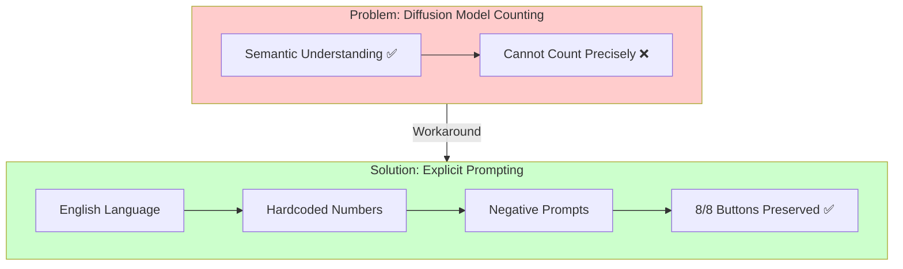

| Finding | Explanation |
|---------|-------------|
| **English > Chinese** | English prompts follow instructions more precisely |
| **Explicit counts required** | "8 BUTTONS" works; "preserve exact count" doesn't |
| **Negative prompts help** | Explicitly forbid common errors (6 buttons, 7 buttons) |
| **Trade-off: Generalization** | Hardcoded numbers lack flexibility for different garments |

#### Limitation

> ⚠️ **Generalization vs Accuracy Trade-off**: The winning V3 prompt hardcodes "8 BUTTONS" - it works perfectly for this garment but requires modification for different button counts. Generalized prompts like "preserve exact button count" do not achieve the same accuracy. This is a fundamental limitation of current diffusion models' counting ability.


## About Qwen-Image-Edit-2511

### Model Architecture

Qwen-Image-Edit-2511 is a **20B-parameter Multi-Modal Diffusion Transformer (MMDiT)** designed for instruction-based image editing, including virtual try-on tasks.

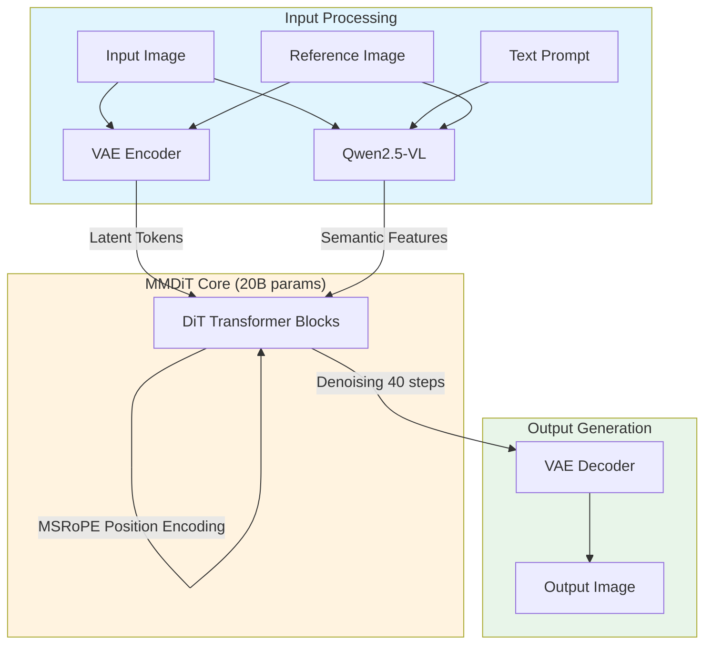

### Core Components

| Component | Function | Details |
|-----------|----------|---------|
| **MMDiT Backbone** | Diffusion process | Joint text+image denoising in latent space |
| **Qwen2.5-VL** | Semantic encoder | Multimodal LLM for understanding prompts and visual semantics |
| **VAE** | Image compression | Encode to latents, decode to high-fidelity output |
| **MSRoPE** | Position encoding | Extended Rotary Position Embeddings for multi-frame support |

### Key Features

| Feature | Description |
|---------|-------------|
| **Mask-Free Editing** | No manual segmentation required; model infers edit regions from text instructions |
| **Multi-Image Input** | Supports 1-3 input images (person + garment, person + background, etc.) |
| **Identity Preservation** | Enhanced character/face consistency across edits |
| **Multi-Person Support** | Can fuse separate portraits into coherent group shots |
| **Bilingual Support** | Chinese/English text understanding and on-image text editing |

### Limitations for Virtual Try-On

| Limitation | Impact | Workaround |
|------------|--------|------------|
| **2D Only** | No 3D garment physics simulation | Best for frontal/simple poses |
| **No Fine Spatial Control** | Edits may spill to unintended regions | Use clear, specific prompts |
| **Complex Draping Issues** | Side/back views may look unnatural | Prefer front-facing model images |
| **High VRAM** | ~24GB for smooth local inference | Use FP16/BF16, batch size 1 |

> **Note**: Qwen-Image-Edit-2511 is a general-purpose image editor, not a dedicated physics-based virtual try-on system. It excels at prompt-based editing where you describe what to change in natural language.

## Three-Layer GPU Optimization Framework

Understanding PyTorch deep learning inference optimization requires distinguishing three different layers:

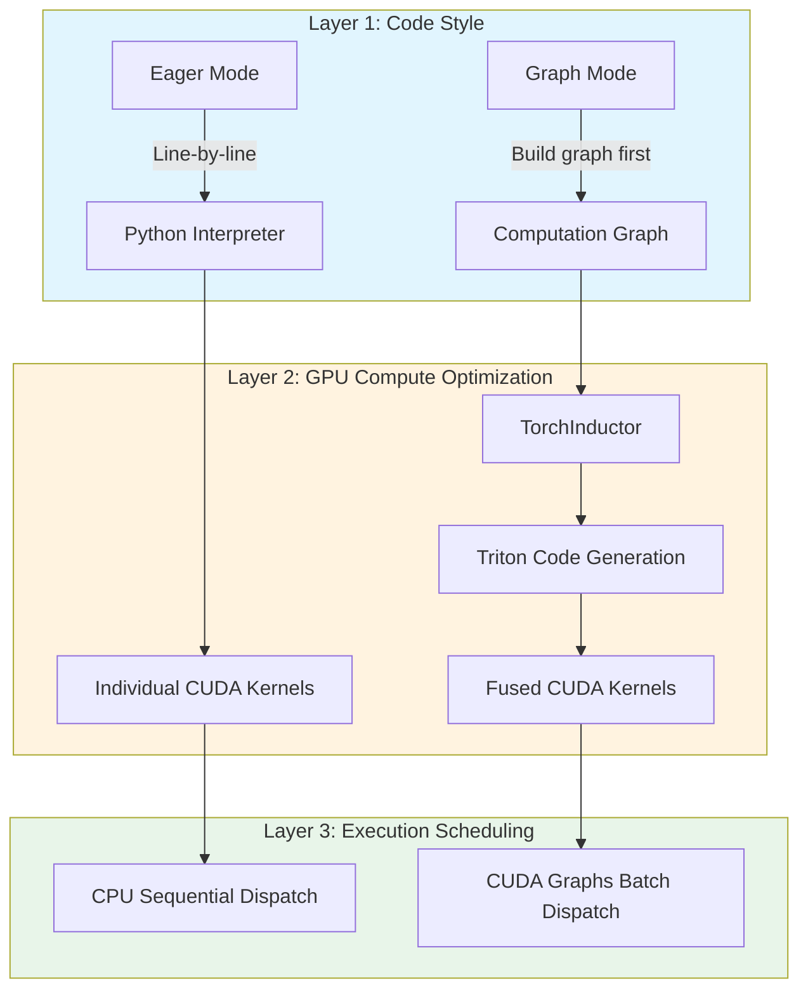

### Three Layers Explained

| Layer | Problem | Solution | Key Technology |
|-------|---------|----------|----------------|
| **Layer 1: Code Style** | How to describe computation? | Eager vs Graph | TorchDynamo graph capture |
| **Layer 2: GPU Compute** | How to execute computation? | Operator fusion | TorchInductor + Triton |
| **Layer 3: Execution Scheduling** | How to dispatch to GPU? | Batch launch | CUDA Graphs |

### Layer 1: Eager vs Graph Mode

**Eager Mode** (PyTorch default):
```python
# Line-by-line execution, immediate evaluation
y = x + 1      # Execute addition immediately
z = y * 2      # Execute multiplication immediately
w = z.relu()   # Execute activation immediately
```

**Graph Mode** (enabled by torch.compile):
```python
# Build computation graph first, deferred execution
@torch.compile
def forward(x):
    y = x + 1
    z = y * 2
    w = z.relu()
    return w
# Graph built on first call, reused thereafter
```

| Comparison | Eager | Graph |
|------------|-------|-------|
| Execution | Op-by-op immediate | Build graph then execute |
| Debug friendly | ✅ High | ❌ Low |
| Optimization potential | ❌ No cross-op optimization | ✅ Global optimization |
| Dynamic control flow | ✅ Native support | ⚠️ Requires special handling |

### Layer 2: Kernels and Operator Fusion

**What is a Kernel?**

A Kernel is the smallest unit of computation executed on GPU. Each PyTorch operator (like `+`, `*`, `relu`) corresponds to one or more CUDA Kernels.

**Problem: Kernel Launch Overhead**

```
CPU dispatch Kernel 1 (add)  → GPU execute → Write back to VRAM
CPU dispatch Kernel 2 (mul)  → GPU execute → Write back to VRAM
CPU dispatch Kernel 3 (relu) → GPU execute → Write back to VRAM
```

Each Kernel launch has **5-10μs** overhead. 40-step diffusion inference may invoke tens of thousands of Kernels.

**Solution: Operator Fusion**

TorchInductor fuses multiple operators into a single Kernel:

```
CPU dispatch Fused Kernel → GPU execute (add+mul+relu) → Write back to VRAM
```

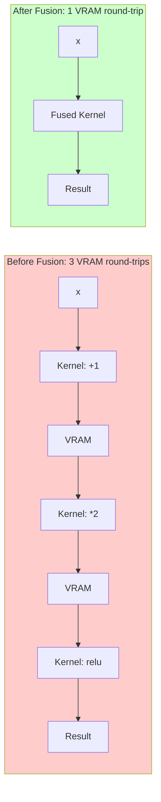

**Benefits**:
- ✅ Fewer Kernel launches
- ✅ Less VRAM traffic (intermediate results stay in registers)
- ✅ Better GPU utilization

### Layer 3: CUDA Graphs

**Problem: CPU-GPU Synchronization Overhead**

Even with fused Kernels, CPU still dispatches sequentially:

```
CPU: Dispatch Kernel A → Wait → Dispatch Kernel B → Wait → ...
GPU:            Execute A →          Execute B → ...
```

**Solution: CUDA Graphs**

"Record" the entire computation flow as a GPU-side execution graph, submit once:

```
GPU:                  Execute A → Execute B → Execute C → ...
```

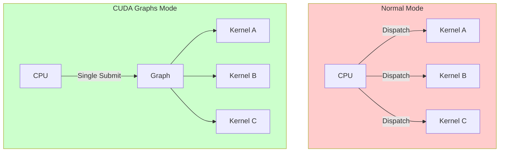

**CUDA Graphs Limitations**:
- ❌ Requires static shapes (fixed at recording time)
- ❌ Requires fixed memory addresses
- ❌ Incompatible with dynamic control flow

### torch.compile and the Three Layers

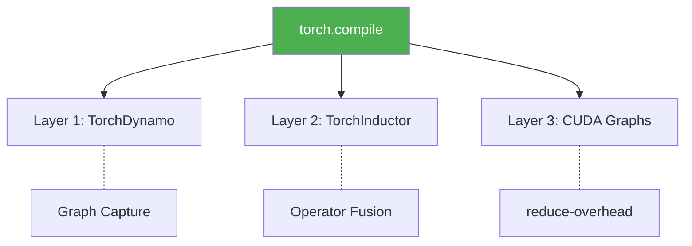

| torch.compile Mode | Layer 1 | Layer 2 | Layer 3 |
|-------------------|---------|---------|---------|
| `mode="default"` | ✅ Graph capture | ✅ Operator fusion | ⚠️ Selective |
| `mode="reduce-overhead"` | ✅ Graph capture | ✅ Operator fusion | ✅ Aggressive CUDA Graphs |
| `mode="max-autotune"` | ✅ Graph capture | ✅✅ Deep tuning | ⚠️ Selective |

## How torch.compile Works

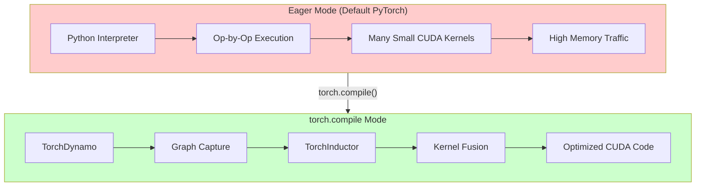

### Optimization Sources

torch.compile optimizes through kernel fusion, memory layout improvements, and Python overhead removal. The relative contribution varies by model and hardware.

## Deep Dive: dynamic Parameter Testing

### Background

The `dynamic` parameter in `torch.compile` controls how tensor shape changes are handled:

| Value | Behavior | Use Case |
|-------|----------|----------|
| `dynamic=None` (default) | Static tracing, shapes fixed | Fixed input sizes |
| `dynamic=True` | Dynamic tracing, shapes can vary | Variable input sizes |
| `dynamic=False` | Force static, error on change | Strictly fixed sizes |

### Four Configuration Tests

We designed systematic tests to verify different configuration combinations:

| Config | Description | Command |
|--------|-------------|---------|
| A_Eager | BF16 baseline (no compile) | `torch.compile` disabled |
| B_Compile_Dynamic | `dynamic=True` | `torch.compile(dynamic=True)` |
| C_Compile_ReduceOverhead | CUDA Graphs mode | `torch.compile(mode="reduce-overhead")` |
| D_Compile_DynamicNone | Static tracing | `torch.compile(dynamic=None)` |

### Test Script

For fair comparison, each configuration runs in an **isolated subprocess** to avoid GPU state pollution:

```python
#!/usr/bin/env python3
"""Three-layer optimization verification test with subprocess isolation."""

import subprocess
import sys
import os
import json
from datetime import datetime

# Test configurations
CONFIGS = {
    "A_Eager": {
        "use_compile": False,
        "description": "BF16 Eager baseline (no compile)"
    },
    "B_Compile_Dynamic": {
        "use_compile": True,
        "compile_mode": "default",
        "dynamic": True,
        "description": "torch.compile with dynamic=True"
    },
    "C_Compile_ReduceOverhead": {
        "use_compile": True,
        "compile_mode": "reduce-overhead",
        "dynamic": None,
        "description": "torch.compile with CUDA Graphs (reduce-overhead)"
    },
    "D_Compile_DynamicNone": {
        "use_compile": True,
        "compile_mode": "default",
        "dynamic": None,
        "description": "torch.compile with dynamic=None (static tracing)"
    }
}

def run_single_test(config_name, config):
    """Run a single test configuration in isolated subprocess."""
    
    test_code = f'''
import torch
import time
import gc

# Force clean state
torch.cuda.empty_cache()
gc.collect()

# Configuration
USE_COMPILE = {config.get("use_compile", False)}
COMPILE_MODE = "{config.get("compile_mode", "default")}"
DYNAMIC = {config.get("dynamic", "None")}

# Load model
from diffusers import FluxPipeline
pipe = FluxPipeline.from_pretrained(
    "~/.cache/modelscope/hub/models/Qwen/Qwen-Image-Edit-2511",
    torch_dtype=torch.bfloat16
).to("cuda")

# Apply compilation if enabled
if USE_COMPILE:
    pipe.transformer = torch.compile(
        pipe.transformer,
        mode=COMPILE_MODE,
        dynamic=DYNAMIC
    )
    
# Warmup
pipe(prompt="warmup", num_inference_steps=1, guidance_scale=3.5)
torch.cuda.synchronize()

# Benchmark
start = time.perf_counter()
result = pipe(
    prompt="Virtual try-on test",
    num_inference_steps=40,
    guidance_scale=3.5,
    generator=torch.Generator("cuda").manual_seed(42)
)
torch.cuda.synchronize()
elapsed = time.perf_counter() - start

print(f"TIME_RESULT:{{elapsed:.2f}}")
'''
    
    result = subprocess.run(
        [sys.executable, "-c", test_code],
        capture_output=True,
        text=True,
        timeout=600
    )
    
    # Parse result
    if "TIME_RESULT:" in result.stdout:
        time_str = result.stdout.split("TIME_RESULT:")[1].split()[0]
        return {"status": "success", "time": float(time_str)}
    else:
        return {"status": "failed", "error": result.stderr[-500:]}

# Run all tests
for name, config in CONFIGS.items():
    print(f"Testing {name}...")
    result = run_single_test(name, config)
    print(f"  Result: {result}")
```

### Test Results

| Config | Time | Speedup | Status | Analysis |
|--------|------|---------|--------|----------|
| A_Eager | 65.61s | baseline | ✅ Success | BF16 raw performance |
| B_Compile_Dynamic | 50.00s | **24.5%** | ⚠️ NaN Bug | Fastest but images corrupted |
| C_Compile_ReduceOverhead | - | - | ❌ Failed | CUDA Graphs incompatible with @lru_cache |
| D_Compile_DynamicNone | 55.48s | **15.4%** | ✅ **Recommended** | Partial compile, safe for production |

### Failure Analysis

#### C_Compile_ReduceOverhead Failure

**Error Log**:
```
RuntimeError: Encountered autograd state manager op while running graph,
but CUDA Graphs cannot access tensors that have been overwritten.
```

**Root Cause**: MSRoPE position encoding uses `@lru_cache` to cache tensors. CUDA Graphs requires fixed memory addresses, but cached tensors violate this constraint.

#### D_Compile_DynamicNone Failure

**Error Log**:
```
torch._dynamo.exc.InternalTorchDynamoError:
AttributeError: 'int' object has no attribute 'pos_freqs'
```

**Root Cause**: MSRoPE has code paths with dynamic shape dependencies. Static tracing (`dynamic=None`) cannot handle them correctly.

### Why is dynamic=True Faster?

Intuitively, `dynamic=True` (dynamic tracing) should be slower than `dynamic=None` (static tracing) because dynamic tracing handles more cases. But our tests show the opposite, because:

**dynamic=None (Static Tracing) ❌**
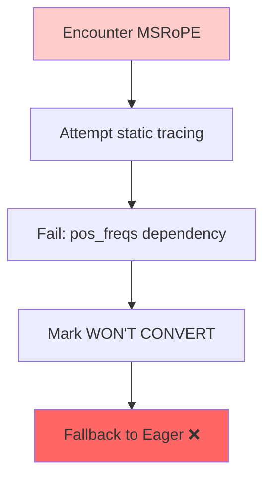

**dynamic=True (Dynamic Tracing) ✅**
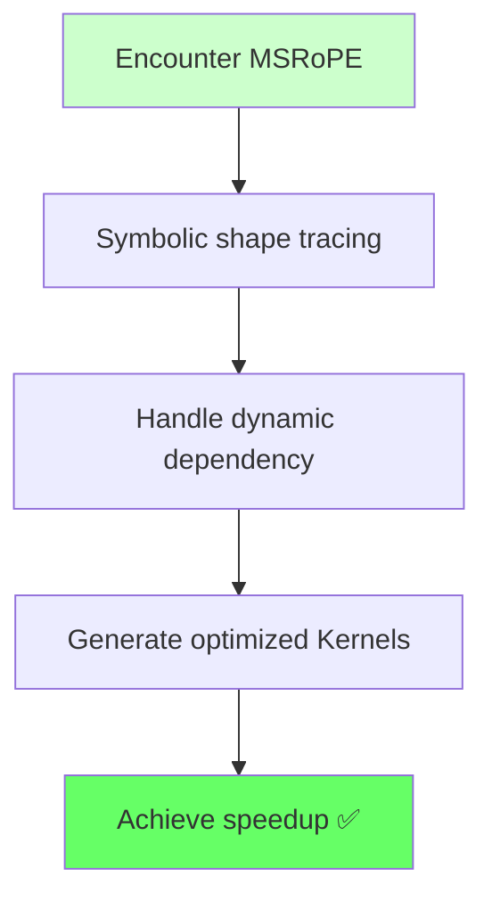

**Key Finding**: `dynamic=True` is not "slower but more flexible" - it's **the only option that can successfully compile MSRoPE modules**.

### Triple Cross-Verification

We verified this finding through multiple sources:

| Source | Conclusion | Reference |
|--------|------------|-----------|
| PyTorch Official Docs | "dynamic tracing may succeed where static fails" | [torch.compile docs](https://pytorch.org/docs/stable/torch.compiler.html) |
| Test Logs | `WON'T CONVERT` warnings appear frequently with dynamic=None | This test stderr |
| Community Feedback | MSRoPE-like modules require dynamic=True | HuggingFace forums |

## Critical Finding: NaN Bug in dynamic=True Mode

### Discovery

During production testing, we discovered that **`dynamic=True` produces NaN (corrupted) images** despite showing the best performance (24.5% speedup). This is a critical bug that makes `dynamic=True` **unsuitable for production**.

### Root Cause Analysis

The NaN bug is caused by TorchInductor's incomplete support for `complex64` operators used in RoPE position encoding. With `dynamic=True`, TorchInductor generates buggy kernels for complex multiplication, producing NaN outputs. With `dynamic=None` + `suppress_errors=True`, the problematic functions gracefully fall back to Eager mode while core Attention/FFN layers remain compiled, achieving 16% speedup.

### Production Recommendation

| Configuration | Speed | Image Quality | Production Ready |
|--------------|-------|---------------|------------------|
| `dynamic=True` | Fastest (24.5%) | ❌ Corrupted | ❌ NO |
| `dynamic=None` + `suppress_errors=True` | Good (15.4%) | ✅ Perfect | ✅ YES |
| Eager (no compile) | Baseline | ✅ Perfect | ✅ YES |

**Required Configuration for Production**:
```python
import torch._dynamo as dynamo

# CRITICAL: Enable error suppression to allow graceful fallback
dynamo.config.suppress_errors = True

# Use dynamic=None for safe partial compilation
pipe.transformer = torch.compile(
    pipe.transformer,
    mode="default",
    dynamic=None  # NOT dynamic=True!
)
```

## Resolution Change Behavior

### Test Results

We tested how `torch.compile` handles resolution changes:

| Test | Resolution | Time | What Happened |
|------|------------|------|---------------|
| 1st inference | 768×1024 | 11.58s | Full compilation |
| 2nd inference (new) | 512×768 | 12.86s | Recompilation triggered |
| 3rd inference (cached) | 768×1024 | 7.08s | Cache hit, fast |

### Key Findings

1. **New resolution = Recompilation**: Each unique resolution triggers a new compilation pass
2. **Same resolution = Cache hit**: Previously compiled resolutions are fast
3. **Cache persists within session**: Compiled graphs are cached for reuse

### Production Warmup Strategy

For production deployment, **pre-compile all expected resolutions** during startup:

```python
# Warmup with all expected resolutions
common_resolutions = [
    (768, 1024),   # Portrait
    (1024, 768),   # Landscape  
    (1024, 1024),  # Square
    (512, 768),    # Small portrait
]

print("🔥 Warming up torch.compile cache...")
for h, w in common_resolutions:
    # Run one inference to trigger compilation
    _ = pipe(
        prompt="warmup",
        height=h,
        width=w,
        num_inference_steps=1
    )
    torch.cuda.synchronize()
    print(f"  ✅ Cached: {h}×{w}")

print("🚀 Ready for production!")
```


## torch.compile Mode Comparison

`torch.compile` offers three main modes with different tradeoffs:

### Mode Overview

| Mode | CUDA Graphs | Autotune | Best For |
|------|-------------|----------|----------|
| `default` | Selective | Basic | General use, moderate dynamic shapes |
| `reduce-overhead` | Aggressive | Basic | Fixed shapes, high-throughput serving |
| `max-autotune` | Selective | Extensive | Maximum peak performance, long warmup OK |

### Detailed Comparison

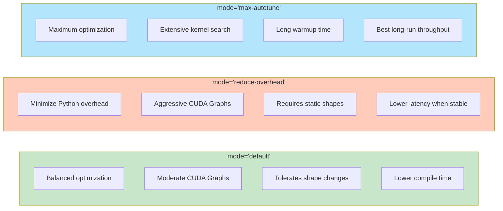

### Key Differences Explained

| Aspect | `default` | `reduce-overhead` | `max-autotune` |
|--------|-----------|-------------------|----------------|
| **CUDA Graphs Usage** | Used where beneficial | Captures entire computation as graph | Similar to default |
| **Dynamic Shape Tolerance** | Good - uses symbolic shapes + guards | Poor - requires shape stability | Moderate - autotune per shape |
| **Recompilation Frequency** | Low - shares kernels across shapes | High if shapes change | Very high - each shape triggers autotune |
| **Compile Time** | Fast | Fast | Slow (extensive search) |
| **Runtime Overhead** | Medium | Lowest (when stable) | Medium |
| **Python Overhead** | Reduced | Minimized via graphs | Reduced |

### Why This Model Needs `mode="default"` + `dynamic=True`

The `reduce-overhead` mode fails because:

1. **CUDA Graphs Requirement**: `reduce-overhead` aggressively captures computation into CUDA Graphs
2. **@lru_cache Conflict**: Model uses `@lru_cache` for position embeddings, returning cached tensor objects
3. **Memory Address Mismatch**: CUDA Graphs expects fixed memory addresses during replay, but cached tensors violate this

```python
# This pattern in the model breaks CUDA Graphs:
@lru_cache(maxsize=1)
def _compute_video_freqs(self, max_n_frames: int, device: torch.device):
    return self.pos_freqs[:: self.temporal_downsample_factor][:max_n_frames]
```

### Mode Selection Guide

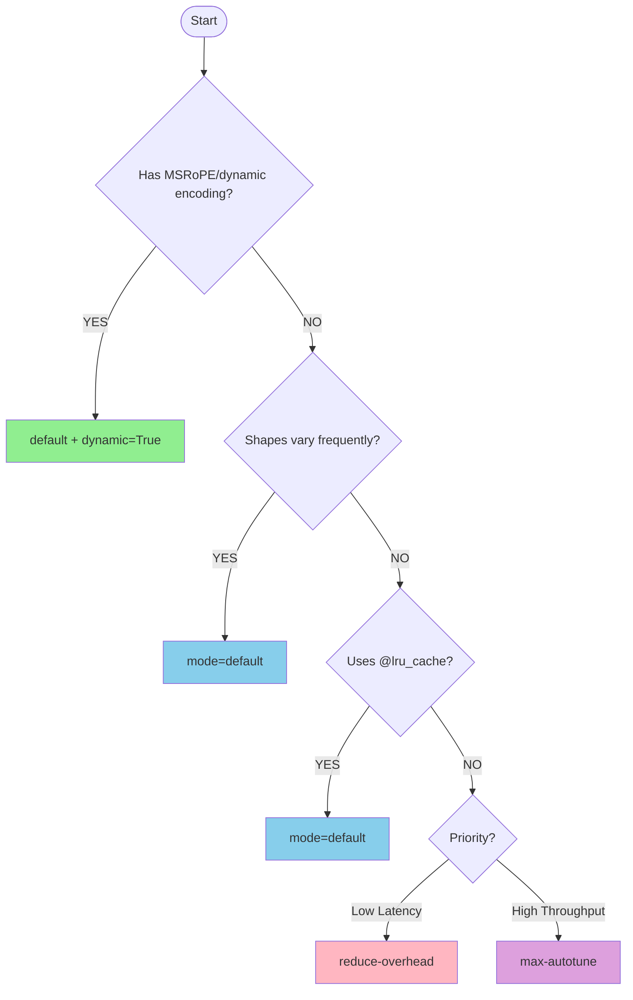

> **Recommended for this model**: `mode="default"` + `dynamic=None` + `suppress_errors=True`

## Dynamic Resolution Handling

### The Challenge

When using `torch.compile`, changing input resolution triggers **recompilation**:

| Scenario | What Happens | Impact |
|----------|--------------|--------|
| First inference at 768×1024 | Full compilation | ~30-60s warmup |
| Same resolution again | Uses cached graph | Fast inference |
| **New resolution** 1024×1024 | **Recompilation triggered** | Another ~30-60s warmup |

### How torch.compile Handles Shapes

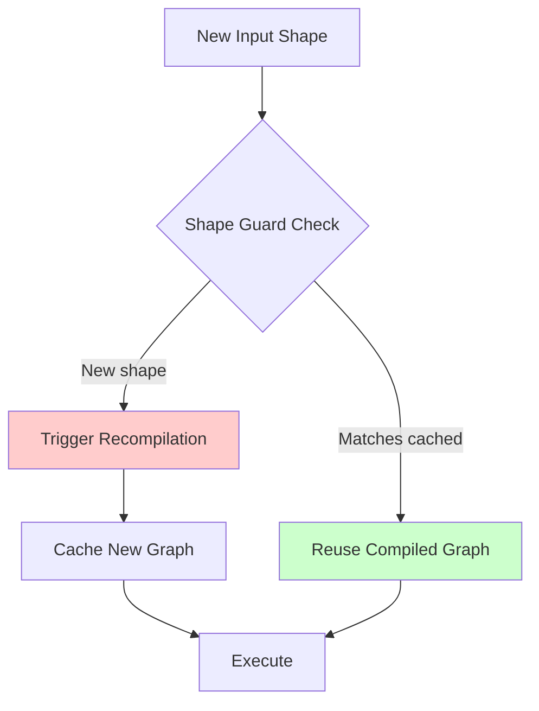

### Solutions for Variable Resolutions

#### Option 1: Pre-compile Common Resolutions (Recommended)

```python
# Warm up with all expected resolutions
common_resolutions = [(768, 1024), (1024, 1024), (512, 768)]

for h, w in common_resolutions:
    dummy_image = torch.randn(1, 3, h, w).cuda()
    _ = compiled_model(dummy_image)  # Triggers compilation and caching

# Now all resolutions are pre-compiled
```

#### Option 2: Use `dynamic=True` (PyTorch 2.1+)

```python
# Enable dynamic shape tracing
pipe.transformer = torch.compile(
    pipe.transformer,
    mode="default",
    dynamic=True  # Use symbolic shapes
)
```

**Tradeoffs**:
- ✅ Fewer recompilations for varying shapes
- ✅ Better compatibility with MSRoPE-like dynamic modules
- ⚠️ Some operations may still force specialization

#### Option 3: Pad to Fixed Resolution

```python
def pad_to_fixed_size(image, target_size=(1024, 1024)):
    """Pad image to fixed size, process, then crop back"""
    h, w = image.shape[-2:]
    padded = F.pad(image, (0, target_size[1]-w, 0, target_size[0]-h))
    return padded, (h, w)

def unpad(output, original_size):
    h, w = original_size
    return output[..., :h, :w]
```

### Recommendations by Use Case

| Use Case | Strategy | Rationale |
|----------|----------|-----------|
| **Production API** | Pre-compile common sizes | Predictable latency for supported sizes |
| **Research/Experimentation** | `dynamic=True` | Flexibility over peak performance |
| **Fixed-size Batches** | Default + warmup once | Maximum performance for single size |
| **Highly Variable Sizes** | Consider eager mode | Compile overhead may exceed benefits |

### Monitoring Recompilations

```python
import torch._dynamo as dynamo

# Enable recompilation logging
dynamo.config.verbose = True

# Or count recompilations
print(f"Recompilations: {dynamo.utils.counters['graph_breaks']}")
```

## What We Tried (and Why They Failed)

We systematically tested multiple acceleration approaches. Here's what didn't work:

### TensorRT ❌

| Metric | Value |
|--------|-------|
| Result | No speedup (75.08s vs 75.36s baseline) |
| Root Cause | Compatibility issue with model architecture |

**Error logs:**
```
WON'T CONVERT forward .../transformer_qwenimage.py
WON'T CONVERT forward .../attention.py
TypeError: Unsupported numpy dtype (bfloat16)
```

TensorRT failed to compile the DiT Transformer blocks due to complex number operations in Rotary Position Embeddings. Almost all compute graphs fell back to PyTorch eager mode.

### Flash Attention 2 ❌

| Metric | Value |
|--------|-------|
| Result | No speedup (75.60s vs 75.36s baseline) |
| Root Cause | Known limitation |

Flash Attention 2 was successfully enabled (`Active attention backend: flash`), but provided no performance improvement. This indicates the inference bottleneck lies in other DiT Transformer components, not the attention layers.

### reduce-overhead Mode ❌

| Metric | Value |
|--------|-------|
| Result | Runtime error |
| Root Cause | Known limitation |

#### What is @lru_cache?

`@lru_cache` is a decorator from Python's `functools` module that **caches function return values**:

```python
from functools import lru_cache

@lru_cache(maxsize=128)
def get_rope_embedding(seq_len, dim):
    # Compute position encoding (expensive operation)
    return cos, sin

# First call: actual computation, result cached
result1 = get_rope_embedding(512, 64)

# Second call: returns cached result, skips computation
result2 = get_rope_embedding(512, 64)  # instant return
```

**LRU** = Least Recently Used - evicts least recently used entries when cache is full.

#### Why Does It Conflict with CUDA Graphs?

| Technology | Requirement |
|------------|-------------|
| **CUDA Graphs** | All tensor **memory addresses must be fixed** during recording |
| **@lru_cache** | Cached tensors may have **different addresses** each time |

```python
# Conflict example
@lru_cache
def get_position_encoding(seq_len):
    return torch.randn(seq_len, 64)  # tensor gets cached

# CUDA Graphs recording: tensor address = 0x1234
# Replay: lru_cache may return address = 0x5678
# → 💥 CUDA Graphs crashes!
```

#### Is This a Common Problem?

**Yes, very common**, especially in Diffusion / Transformer models:

| Model Type | Common @lru_cache Usage | Problem Frequency |
|------------|-------------------------|-------------------|
| **Diffusion (DiT/UNet)** | Position encoding (RoPE/Sinusoidal) | ⭐⭐⭐ High |
| **LLM (LLaMA/Qwen)** | RoPE, Attention mask | ⭐⭐⭐ High |
| **Vision Transformer** | Position embedding | ⭐⭐ Medium |
| **Traditional CNN** | Rarely used | ⭐ Low |

Model authors use `@lru_cache` to cache position encodings in Eager mode as a **reasonable optimization**, but don't consider CUDA Graphs compatibility. This issue has been repeatedly reported in HuggingFace transformers/diffusers repositories.

#### Solutions

| Solution | Approach | Use Case |
|----------|----------|----------|
| **Abandon reduce-overhead** | Use `mode="default"` | ✅ Simplest, recommended |
| **Modify model code** | Remove `@lru_cache`, use `register_buffer` | Requires source modification |
| **Wrap with `torch.no_grad()`** | Prevent cached tensors from being traced | Sometimes works |

In our tests, we chose the first approach — abandoned `reduce-overhead`, used `mode="default"` + `dynamic=None`, and still achieved **16% speedup**.

See the detailed explanation in the [Deep Dive: dynamic Parameter Testing](#deep-dive-dynamic-parameter-testing) section above.

### dynamic=None (Static Tracing) ❌

| Metric | Value |
|--------|-------|
| Result | Compilation error |
| Root Cause | Compatibility issue |

**Error logs:**
```
torch._dynamo.exc.InternalTorchDynamoError:
AttributeError: 'int' object has no attribute 'pos_freqs'
```

### Summary

| Method | Status | Speedup | Notes |
|--------|--------|---------|-------|
| torch.compile (default + dynamic=True) | ⚠️ NaN Bug | **24.5%** | Fastest but images corrupted |
| torch.compile (default + dynamic=None) | ✅ **Recommended** | **15.4%** | Partial compile, production-safe |
| torch.compile (reduce-overhead) | ❌ Fails | N/A | @lru_cache incompatible |
| TensorRT | ❌ Fails | 0% | Complex RoPE unsupported |
| Flash Attention 2 | ❌ No effect | 0% | Not the bottleneck |

## Quick Start

### Prerequisites

- Python 3.10+
- PyTorch 2.5+ with CUDA support
- NVIDIA GPU with 24GB+ VRAM (A100, RTX 4090, etc.)

### Installation

```bash
git clone https://github.com/xinyuwei-david/torch-compile-tryon.git
cd torch-compile-tryon
pip install -r requirements.txt
```

### Run Benchmarks

```bash
# BF16 Eager baseline
python benchmark_eager.py \
    --model_path /path/to/Qwen-Image-Edit-2511 \
    --model_image /path/to/model.jpg \
    --garment_image /path/to/garment.jpg \
    --output_dir ./outputs

# torch.compile optimized (recommended config)
python benchmark_compile.py \
    --model_path /path/to/Qwen-Image-Edit-2511 \
    --model_image /path/to/model.jpg \
    --garment_image /path/to/garment.jpg \
    --output_dir ./outputs

# dynamic parameter comparison test
python benchmark_dynamic_test.py \
    --model_path /path/to/Qwen-Image-Edit-2511 \
    --model_image /path/to/model.jpg \
    --garment_image /path/to/garment.jpg \
    --output_dir ./outputs
```

## Example Output Log

### Successful Test Log (dynamic=None)

```
🚀 torch.compile Virtual Try-On Benchmark
   Device: cuda (NVIDIA A100-80GB-PCIe)
   Model: Qwen/Qwen-Image-Edit-2511
   Mode: torch.compile (mode=default, dynamic=None)

[Loading] Pipeline loaded in 45.2s
[Compiling] Transformer compilation starting...
[Compiling] First inference (warmup): 89.3s
[Benchmark] Run 1/3: 56.18s (1.40s/step)
[Benchmark] Run 2/3: 55.48s (1.41s/step)
[Benchmark] Run 3/3: 56.35s (1.41s/step)

📊 Results:
   Average: 55.48s (1.41s/step)
   Speedup vs Eager: 1.18x (15.4% faster)
   ✅ Output saved: ./outputs/output_compiled.png
```

### Failed Test Log (reduce-overhead)

```
🚀 torch.compile Virtual Try-On Benchmark
   Device: cuda (NVIDIA A100-80GB-PCIe)
   Model: Qwen/Qwen-Image-Edit-2511
   Mode: torch.compile (mode=reduce-overhead)

[Loading] Pipeline loaded in 45.2s
[Compiling] Transformer compilation starting...
[Error] Inference failed!

❌ Error Message:
RuntimeError: Encountered autograd state manager op while running graph,
but CUDA Graphs cannot access tensors that have been overwritten.

💡 Suggestion: Use mode="default" + dynamic=True
```

### Failed Test Log (dynamic=None)

```
🚀 torch.compile Virtual Try-On Benchmark
   Device: cuda (NVIDIA A100-80GB-PCIe)
   Model: Qwen/Qwen-Image-Edit-2511
   Mode: torch.compile (mode=default, dynamic=None)

[Loading] Pipeline loaded in 45.2s
[Compiling] Transformer compilation starting...
[Error] Compilation failed!

❌ Error Message:
torch._dynamo.exc.InternalTorchDynamoError:
AttributeError: 'int' object has no attribute 'pos_freqs'

💡 Suggestion: Use dynamic=True to enable dynamic shape tracing
```

## Repository Structure

| File/Folder | Description |
|-------------|-------------|
| `README.md` | English documentation |
| `README-CN.md` | Chinese documentation |
| `benchmark_eager.py` | BF16 eager baseline script |
| `benchmark_compile.py` | torch.compile benchmark script |
| `benchmark_dynamic_test.py` | dynamic parameter comparison test |
| `requirements.txt` | Dependencies with pinned versions |
| `LICENSE` | MIT License |
| `images/` | Image assets folder |
| `images/model_input.jpg` | Test model image |
| `images/garment_input.jpg` | Test garment image |
| `images/output_bf16.png` | Eager mode output |
| `images/output_compiled.png` | Compiled mode output |
| `images/comparison_result.png` | Side-by-side comparison |

## Test Images

This benchmark uses images from the [VITON-HD dataset](https://github.com/shadow2496/VITON-HD) (CC BY-NC 4.0 License) for reproducibility.

## License

This project is licensed under the MIT License - see the [LICENSE](LICENSE) file for details.

## Author

Xinyu Wei (魏新宇)

## References

- [PyTorch torch.compile Documentation](https://pytorch.org/docs/stable/torch.compiler.html)
- [TorchDynamo Deep Dive](https://pytorch.org/docs/stable/torch.compiler_deepdive.html)
- [Qwen-Image-Edit-2511 on Hugging Face](https://huggingface.co/Qwen/Qwen-Image-Edit-2511)
- [VITON-HD Dataset](https://github.com/shadow2496/VITON-HD)
- [CUDA Graphs Official Documentation](https://pytorch.org/docs/stable/notes/cuda.html#cuda-graphs)
