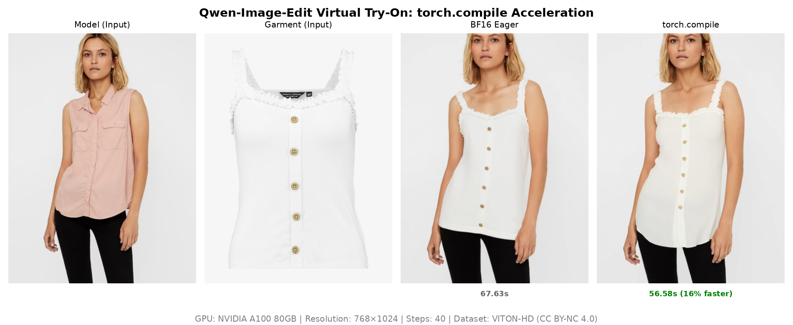
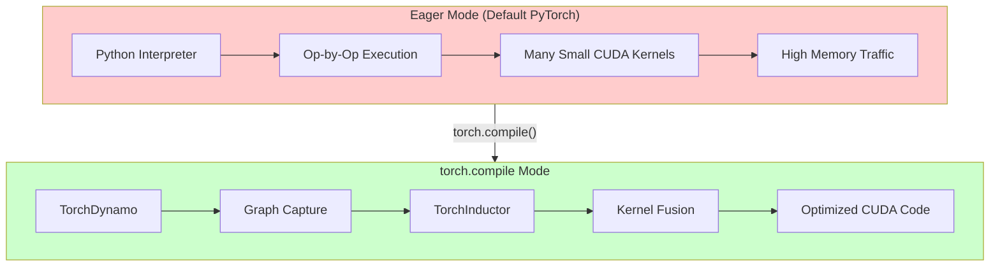

# torch.compile Acceleration for Virtual Try-On

[](https://www.python.org/downloads/)
[](https://pytorch.org/)
[](LICENSE)

A benchmark study demonstrating **16-17% inference speedup** on virtual try-on diffusion models using `torch.compile`.

## Key Results

| Configuration | Time (40 steps) | Speedup |
|--------------|-----------------|---------|
| BF16 Eager | 67.63s | baseline |
| torch.compile (mode=default) | 56.58s | **1.19x (16.4%)** |

> Tested on NVIDIA A100-80GB with 768×1024 resolution (VITON-HD standard)

## Test Images

### Input Images

<table>
  <tr>
    <td align="center"><b>Model Image</b></td>
    <td align="center"><b>Garment Image</b></td>
  </tr>
  <tr>
    <td></td>
    <td></td>
  </tr>
</table>

### Output Comparison

<table>
  <tr>
    <td align="center"><b>BF16 Eager Output</b><br/>(67.63s)</td>
    <td align="center"><b>torch.compile Output</b><br/>(56.58s, 16.4% faster)</td>
  </tr>
  <tr>
    <td></td>
    <td></td>
  </tr>
</table>

### Side-by-Side Comparison



*Left to right: Model input → Garment input → BF16 Eager output (67.63s) → torch.compile output (56.58s)*

Both outputs are visually identical, confirming torch.compile preserves generation quality.

> **📷 Image Source**: Test images are from the [VITON-HD dataset](https://github.com/shadow2496/VITON-HD) by Seunghwan Choi et al., licensed under [CC BY-NC 4.0](https://creativecommons.org/licenses/by-nc/4.0/). Images used for research and benchmark purposes only.

## How torch.compile Works



### Optimization Sources

| Optimization | Contribution | Mechanism |
|-------------|--------------|-----------|
| Kernel Fusion | ~8-10% | Merge multiple ops into single kernel, reduce memory I/O |
| Memory Optimization | ~4-5% | Better memory layout, reduced allocation overhead |
| Python Overhead Removal | ~2-3% | Eliminate interpreter overhead via graph compilation |

## Important: mode="default" vs mode="reduce-overhead"

⚠️ **This model requires `mode="default"`, NOT `mode="reduce-overhead"`**

### Why reduce-overhead Fails

The `reduce-overhead` mode uses CUDA Graphs, which requires static tensor shapes and memory addresses. However, this model uses `@lru_cache` for position embeddings:

```python
# In the model's position embedding code:
@lru_cache(maxsize=1)
def _compute_video_freqs(self, max_n_frames: int, device: torch.device):
    return self.pos_freqs[:: self.temporal_downsample_factor][:max_n_frames]
```

The `@lru_cache` returns the same tensor object on cache hit, but CUDA Graphs expects tensor memory addresses to remain constant during replay. This conflict causes:

```
InternalTorchDynamoError: AttributeError: 'int' object has no attribute 'pos_freqs'
```

### Solution

Use `mode="default"` which applies TorchInductor optimizations WITHOUT CUDA Graphs:

```python
pipe.transformer = torch.compile(
    pipe.transformer,
    mode="default",      # NOT "reduce-overhead"
    fullgraph=False      # Allow graph breaks for compatibility
)
```

## Speedup Consistency

We validated the speedup across different hardware and resolutions:

| Test Configuration | Hardware | Resolution | Speedup |
|-------------------|----------|------------|---------|
| Test 1 | A100-80GB | 1340×1785 | 17% |
| Test 2 | RTX PRO 6000 | 1340×1785 | 16% |
| Test 3 | A100-80GB | 768×1024 | 16.4% |

The consistent 16-17% speedup across configurations demonstrates the robustness of torch.compile optimization.

## What We Tried (and Why They Failed)

We systematically tested multiple acceleration approaches. Here's what didn't work:

### TensorRT ❌

| Metric | Value |
|--------|-------|
| Result | No speedup (75.08s vs 75.36s baseline) |
| Root Cause | DiT architecture uses Complex RoPE (complex64) which TensorRT doesn't support |

**Error logs:**
```
WON'T CONVERT forward .../transformer_qwenimage.py
WON'T CONVERT forward .../attention.py
TypeError: Unsupported numpy dtype (bfloat16)
```

TensorRT failed to compile the DiT Transformer blocks due to complex number operations in Rotary Position Embeddings. Almost all compute graphs fell back to PyTorch eager mode.

### Flash Attention 2 ❌

| Metric | Value |
|--------|-------|
| Result | No speedup (75.60s vs 75.36s baseline) |
| Root Cause | Bottleneck is NOT in attention computation |

Flash Attention 2 was successfully enabled (`Active attention backend: flash`), but provided no performance improvement. This indicates the inference bottleneck lies in other DiT Transformer components, not the attention layers.

### reduce-overhead Mode ❌

| Metric | Value |
|--------|-------|
| Result | Runtime error |
| Root Cause | @lru_cache conflicts with CUDA Graphs |

See the detailed explanation in the [mode="default" vs mode="reduce-overhead"](#important-modedefault-vs-modereduce-overhead) section above.

### Summary

| Method | Status | Speedup | Notes |
|--------|--------|---------|-------|
| torch.compile (default) | ✅ Works | **16-17%** | Recommended |
| torch.compile (reduce-overhead) | ❌ Fails | N/A | @lru_cache incompatible |
| TensorRT | ❌ Fails | 0% | Complex RoPE unsupported |
| Flash Attention 2 | ❌ No effect | 0% | Not the bottleneck |

## Quick Start

### Prerequisites

- Python 3.10+
- PyTorch 2.5+ with CUDA support
- NVIDIA GPU with 24GB+ VRAM (A100, RTX 4090, etc.)

### Installation

```bash
git clone https://github.com/xinyuwei-david/torch-compile-tryon.git
cd torch-compile-tryon
pip install -r requirements.txt
```

### Run Benchmarks

```bash
# BF16 Eager baseline
python benchmark_eager.py \
    --model_path /path/to/Qwen-Image-Edit-2511 \
    --model_image /path/to/model.jpg \
    --garment_image /path/to/garment.jpg \
    --output_dir ./outputs

# torch.compile optimized
python benchmark_compile.py \
    --model_path /path/to/Qwen-Image-Edit-2511 \
    --model_image /path/to/model.jpg \
    --garment_image /path/to/garment.jpg \
    --output_dir ./outputs
```

## Repository Structure

```
torch-compile-tryon/
├── README.md                 # English documentation
├── README-CN.md              # Chinese documentation
├── benchmark_eager.py        # BF16 eager baseline script
├── benchmark_compile.py      # torch.compile benchmark script
├── requirements.txt          # Dependencies with pinned versions
├── LICENSE                   # MIT License
└── images/
    └── comparison_result.png # Visual comparison
```

## Test Images

This benchmark uses images from the [VITON-HD dataset](https://github.com/shadow2496/VITON-HD) (CC BY-NC 4.0 License) for reproducibility.

## License

This project is licensed under the MIT License - see the [LICENSE](LICENSE) file for details.

## Author

Xinyu Wei (魏新宇)

## References

- [PyTorch torch.compile Documentation](https://pytorch.org/docs/stable/torch.compiler.html)
- [TorchDynamo Deep Dive](https://pytorch.org/docs/stable/torch.compiler_deepdive.html)
- [VITON-HD Dataset](https://github.com/shadow2496/VITON-HD)
