# vLLM 注意力架构与性能对比

> vLLM 注意力优化技术栈全面指南 — PagedAttention、FlashAttention、FlashInfer、CUDAGraph 和连续批处理 — 附多 GPU 实测数据。


## 在 Azure 上运行

本项目的所有实验均在 **Azure GPU 虚拟机**上完成。

| 项目 | 详情 |
|---|---|
| **Azure VMs** | [NC40ads_H100_v5](https://learn.microsoft.com/en-us/azure/virtual-machines/nc-h100-v5-series), [NC A100 v4](https://learn.microsoft.com/en-us/azure/virtual-machines/nc-a100-v4-series), [NC RTX Pro 6000V6 BSE](https://learn.microsoft.com/en-us/azure/virtual-machines/sizes/gpu-accelerated/overview) |
| **GPUs** | NVIDIA H100 NVL 94GB, A100 80GB, RTX 6000 Ada 48GB |
| **框架** | vLLM, LoRA/PEFT, torch.compile |


## 🎯 核心发现

| 条件 | 胜出 | 差距 | 建议 |
|------|------|------|------|
| **CUDAGraph + 长序列** | FlashInfer | **+9~15%** | 生产部署 |
| CUDAGraph + 短序列 | FlashInfer | +1% | 默认选择 |
| Eager 模式（任何配置） | FlashAttention | +1~7% | 开发调试 |
| 大批量 (128) + Eager | FlashAttention | +11.8% | 批处理 |

**结论**:
- **生产环境（启用 CUDAGraph）**: 使用 FlashInfer（vLLM 默认）- 长序列场景快 **9-15%**
- **开发环境（enforce_eager=True）**: FlashAttention 稍快

### 跨 GPU 验证（鲁棒性）

| 配置 | A100 (Ampere) | RTX 6000 (Blackwell, 3次平均) | 结论 |
|------|--------------|-------------------------------|------|
| 长序列 + CUDAGraph | **FI +15.4%** | **FI +9.3%** | ✅ **一致：FI 胜出** |
| 短序列 + CUDAGraph | FI +1.2% | FI +0.9% | ✅ 一致 |
| 中批量 + CUDAGraph | FI +1.3% | FA +4.1% | ⚠️ 因架构而异 |

---

## 🧠 技术背景

### vLLM 架构概览

vLLM（Virtual Large Language Model）由 Kwon 等人在 2023 年论文 *"Efficient Memory Management for Large Language Model Serving with PagedAttention"* 中提出。它解决了 LLM 服务系统中 GPU 显存管理 KV 缓存的低效问题 — 导致 GPU 资源利用不充分、推理速度慢、显存占用高。

vLLM 综合了多项关键技术实现高吞吐、低延迟推理：

| 技术 | 功能 | 效果 |
|------|------|------|
| **PagedAttention** | 分页式 KV 缓存内存管理 | 消除显存碎片化 |
| **连续批处理** | 动态请求调度 | 最大化 GPU 利用率 |
| **FlashAttention / FlashInfer** | 优化注意力内核 | 减少计算和显存开销 |
| **CUDAGraph** | 预编译执行图 | 消除内核启动开销 |
| **显存预分配** | 预留 90% GPU 显存 | 避免运行时分配成本 |

**LLM 服务中的批处理策略**：

- **客户端（静态）批处理**：客户端将多个推理请求打包为一个批次。需要修改客户端代码，与批次大小强耦合
- **服务端（动态）批处理**：服务端动态合并到达的独立请求 — 包括动态批处理、连续批处理和 PagedAttention 批处理。无需修改客户端。vLLM 使用连续批处理在生成过程中动态调整批次大小

### PagedAttention：受操作系统启发的 KV 缓存管理

PagedAttention 是 vLLM 高性能的核心驱动力。受操作系统虚拟内存分页机制的启发，它通过块表（Block Table）将逻辑连续的虚拟块映射到物理上不连续的 GPU 显存块。

#### 虚拟块到物理块的映射

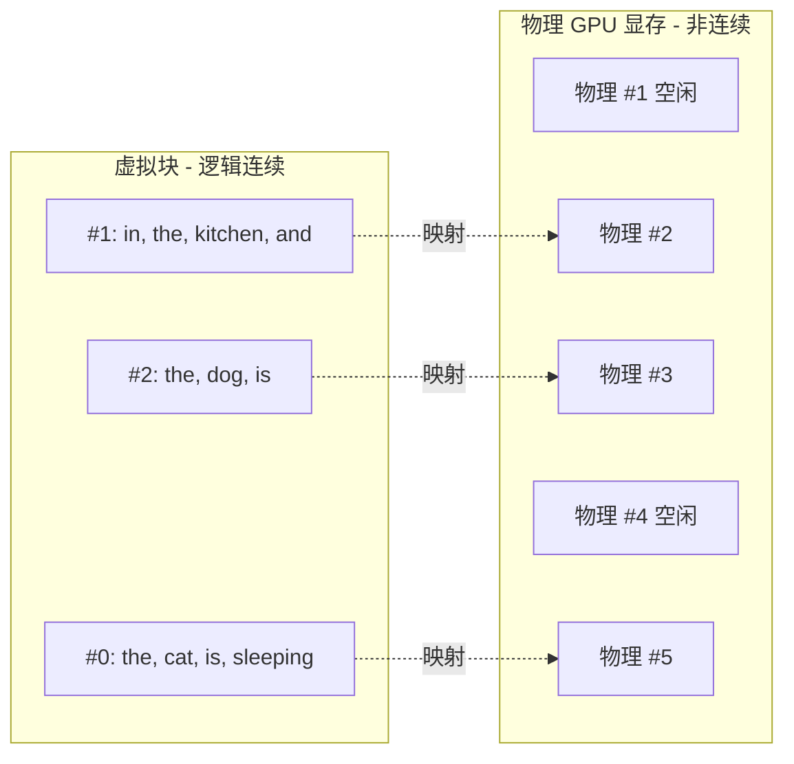

**核心机制**：

| 机制 | 说明 |
|------|------|
| **固定大小的块** | KV 张量被分为固定大小的块（如 block_size=4 个 token），每个块存储固定数量 token 的 KV 对 |
| **按需分配** | 块在推理过程中按需分配，高效填充碎片化的 GPU 显存 |
| **逐块获取** | 注意力内核按查询 token 逐块获取 KV 缓存 — 由于块大小有限，比加载整个 KV 序列更快 |
| **虚拟块共享** | 在束搜索或并行采样时，所有序列共享相同的虚拟块，避免 KV 缓存重复。节省显存并支持更多并发请求 |

**性能表现**：伯克利的基准测试显示 vLLM 显著优于 HuggingFace TGI，在更大的模型上性能差距更明显（大模型受显存碎片化影响更大）。

### vLLM 显存预分配

vLLM 默认设置 `gpu_memory_utilization=0.9`，预分配 90% 显存作为 KV 缓存块池：

| 方面 | 详情 |
|------|------|
| **默认值** | `gpu_memory_utilization=0.9` |
| **目的** | 预先分配 KV 缓存块池 |
| **收益** | 消除运行时分配/释放开销 |
| **机制** | PagedAttention 按需填充预分配的块 |

这确保了处理长序列或大批量时有足够的显存存储所有中间结果，避免频繁的显存分配/释放操作导致性能下降。

### FlashAttention：IO 感知的分块计算

FlashAttention（Dao 等人，Stanford）通过利用 GPU 显存层次结构实现快速、高显存效率的**精确**注意力计算。

#### GPU 显存层次结构

| 显存类型 | 带宽 | 容量 | FlashAttention 中的作用 |
|---------|------|------|---------------------|
| **GPU SRAM** | ~19 TB/s | ~20 MB | 在此计算注意力分块 |
| **GPU HBM** | ~1.5 TB/s | 40-80 GB | 存储 Q、K、V、输出矩阵 |
| **CPU DRAM** | ~12.8 GB/s | >1 TB | 注意力计算时不使用 |

#### 分块机制

传统注意力在 HBM 中计算完整的 N x N 注意力矩阵 — 对长序列来说开销禁止。FlashAttention 通过**分块（Tiling）**避免这个问题：

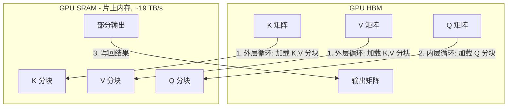

1. **外层循环**：从 HBM 加载 K 和 V 的分块到快速的片上 SRAM
2. **内层循环**：对每个 K、V 分块，遍历 Q 分块并完全在 SRAM 中计算部分注意力
3. **写回**：分块计算完成后才将结果写回 HBM

结果：在 GPT-2 上相比 PyTorch 标准注意力实现取得 **7.6 倍加速**（Dao 等人实测）。

#### FlashAttention-2 改进

| 优化 | 详情 |
|------|------|
| **减少非矩阵乘法操作** | A100 上：matmul 吞吐 = 312 TFLOPS/s vs 非 matmul = 19.5 TFLOPS/s（**每 FLOP 成本差 16 倍**）。FA-2 最小化非 matmul 操作，最大化 Tensor Core 使用时间 |
| **序列长度并行化** | FA-1 仅在批次和注意力头维度并行。FA-2 还在序列长度维度并行 — 对小批次长序列场景至关重要 |
| **更优的 Warp 分区** | 减少线程 Warp 间的通信和同步开销（每个 Warp = 32 个线程） |
| **更广泛的模型支持** | 支持最多 256 个注意力头；支持 MQA（Multi-Query Attention）和 GQA（Grouped-Query Attention） |

### 连续批处理（Continuous Batching）

与静态批处理（等待批次中所有请求完成）不同，**连续批处理**在有槽位释放时动态加入新请求：

| 时间 | 请求 1: "Capital of" | 请求 2: "The diamondback turtle is" | 请求 3: "Largest Mammal is" |
|------|---------------------|-----------------------------------|--------------------------|
| T1 | 预填充 | 预填充 | 预填充 |
| T2 | 预填充 | 预填充 | 预填充 |
| T3 | 解码 | 解码 | 解码 |
| T4 | 解码 | 解码 | 解码 |
| T5 | 解码 | 解码 | **完成** → 新请求进入 |
| T6 | 解码 | **完成** → 新请求进入 | 新请求处理 |
| T7 | **完成** | 新请求处理 | 新请求处理 |

**核心优势**：
- **最大化 GPU 利用率**：不需等待最长请求完成，无 GPU 空闲时间
- **降低平均延迟**：短请求完成后立即退出批次
- **提高吞吐量**：槽位释放后新请求立即进入

### FlashInfer vs FlashAttention：对比总结

两者都实现了 O(N) 显存效率，但设计侧重不同：

| 方面 | FlashAttention | FlashInfer |
|------|---------------|------------|
| **来源** | Stanford / Tri Dao | CMU / UW |
| **主要聚焦** | 训练 + 推理 | 推理服务 |
| **核心优化** | IO 感知分块（SRAM/HBM 层次结构） | Paged KV 缓存 + CUDAGraph 优化 |
| **显存效率** | O(N) 替代 O(N^2) | O(N) + 动态批处理 |
| **CUDAGraph 支持** | 基础支持 | 专门优化 |
| **PagedAttention** | 外部（vLLM 管理分页） | 原生 Paged KV 缓存支持 |

> FlashAttention 优化的是注意力计算本身，而 vLLM 的整体加速来自 **PagedAttention + 连续批处理 + CUDAGraph + 优化注意力内核** 的协同作用。

### 为什么 CUDAGraph 很重要

#### CPU-GPU 内核启动开销分析

在传统 Eager 执行模式下，每个 CUDA 内核调用都需要完整的启动流程：

| 阶段 | CPU 操作 | GPU 状态 | 开销 |
|------|---------|---------|------|
| 1 | 准备内核参数 | 等待 | ~1μs |
| 2 | 调用 CUDA API | 接收指令 | ~2μs |
| 3 | 同步等待 | 执行内核 | ~2μs |
| **合计** | | | **~5μs/内核** |

**量化影响**：Llama-7B 单次 Decode 涉及 300+ 内核调用，启动开销 = 5μs × 300 = 1.5ms，而实际计算仅需 2-3ms，**启动开销占比 30-40%**。

#### CUDAGraph 工作原理

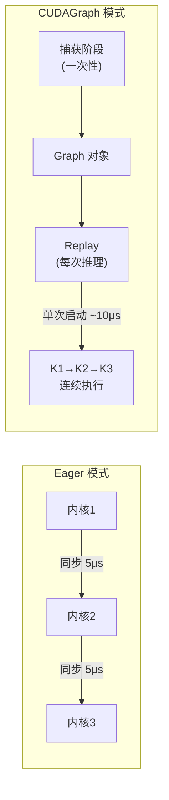

#### 关键约束条件

| 约束 | 说明 | LLM 推理兼容性 |
|------|------|---------------|
| **静态拓扑** | 计算图结构必须固定 | ✅ Transformer 前向传播拓扑固定 |
| **固定 Shape** | 张量形状在录制时确定 | ⚠️ vLLM 通过分桶处理 |
| **无动态分支** | 禁止 if/while 运行时分支 | ✅ 推理无动态分支 |
| **内存绑定** | 张量地址在图生命周期内固定 | ✅ vLLM 预分配内存池 |

#### 性能收益

| 指标 | Eager 模式 | CUDAGraph | 改善 |
|------|-----------|-----------|------|
| 内核启动 | N 次 × 5μs | 1 次 × 10μs | **N:1** |
| Decode 延迟 | ~4ms | ~1.5ms | **2.5x** |
| GPU 利用率 | 60-70% | 85-95% | +25% |

FlashInfer 专门为 CUDAGraph 捕获进行了优化，这就是为什么启用 CUDAGraph 时它比 FlashAttention 更快。

---

## 🔧 Eager vs Graph 执行模式

### 执行范式对比

| 特性 | Eager 执行 | Graph 执行 |
|------|-----------|-----------|
| **执行时机** | 逐算子即时执行 | 预编译后批量执行 |
| **调试支持** | ✅ 完整堆栈追踪 | ⚠️ 仅图级错误 |
| **动态控制流** | ✅ 支持 if/while | ❌ 不支持 |
| **启动开销** | 高（每算子同步） | 低（整图同步） |

### vLLM 配置

```python
from vllm import LLM

# Graph 模式（默认，生产推荐）
llm = LLM(model="Qwen/Qwen2.5-7B-Instruct")

# Eager 模式（调试时使用）
llm = LLM(model="Qwen/Qwen2.5-7B-Instruct", enforce_eager=True)
```

---

## 🔗 执行模式与注意力后端的组合关系

### 架构分层

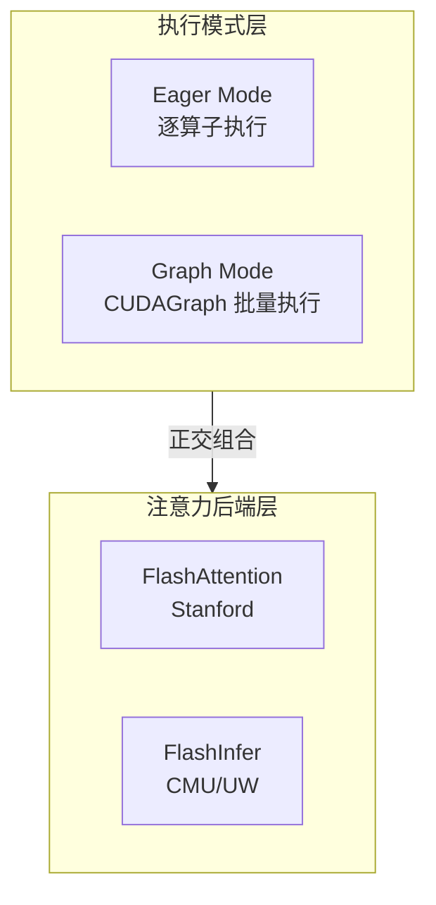

**关键概念**：执行模式和注意力后端是**正交维度**，可自由组合。

### 四种组合性能（A100 实测）

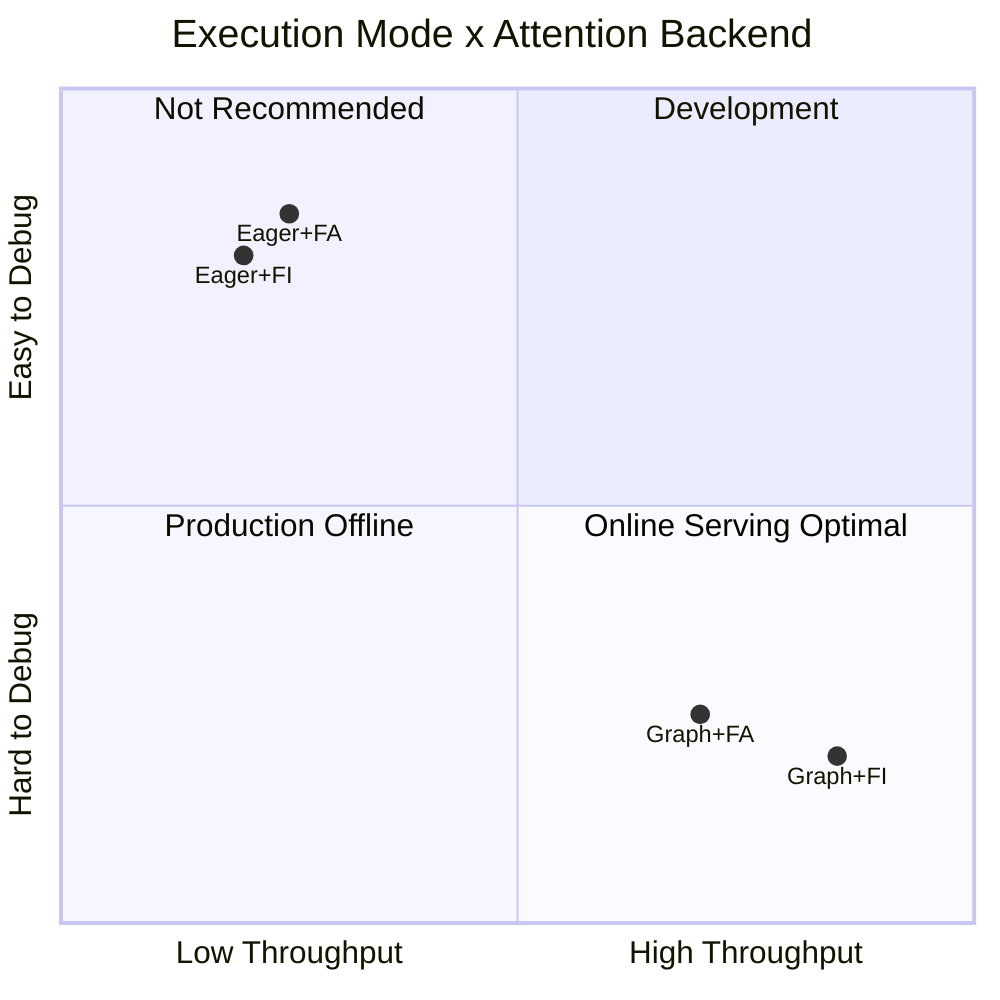

| 组合 | 吞吐量 (tok/s) | vs 基准 | 适用场景 |
|------|---------------|---------|----------|
| Eager + FA | 682 | 基准 | 开发调试 |
| Eager + FI | 675 | -1% | 不推荐 |
| Graph + FA | 1,522 | +123% | 生产（离线批处理） |
| **Graph + FI** | **1,757** | **+158%** | **生产（在线服务）** ✅ |

### vLLM 配置示例

```python
import os
from vllm import LLM

# 组合 1: Eager + FA（开发调试）
os.environ["VLLM_ATTENTION_BACKEND"] = "FLASH_ATTN"
llm = LLM(model="Qwen/Qwen2.5-7B-Instruct", enforce_eager=True)

# 组合 2: Graph + FA（生产-离线批处理）
os.environ["VLLM_ATTENTION_BACKEND"] = "FLASH_ATTN"
llm = LLM(model="Qwen/Qwen2.5-7B-Instruct")

# 组合 3: Graph + FI（生产-在线服务）✅ vLLM 默认
llm = LLM(model="Qwen/Qwen2.5-7B-Instruct")
```

---

## 🖥️ 测试环境

### 硬件

| GPU | 架构 | 显存 | 计算能力 |
|-----|------|------|---------|
| NVIDIA H100 NVL | Hopper | 94GB HBM3 | SM90 |
| NVIDIA A100 80GB PCIe | Ampere | 80GB HBM2e | SM80 |
| NVIDIA RTX Pro 6000 | Blackwell | 96GB | SM120 |

### 软件

| 组件 | A100 | RTX 6000 |
|------|------|----------|
| vLLM | 0.10.2 | 0.13.0 |
| FlashInfer | 0.5.3 | 0.6.0rc2 |
| FlashAttention | 2.8.3 | 2.8.3 |
| PyTorch | 2.8.0+cu128 | 2.9.0+cu128 |

### 测试模型

- **模型**: `Qwen/Qwen2.5-0.5B-Instruct`
- **原因**: 小模型以隔离注意力内核性能（避免内存瓶颈）

---

## 📊 测试结果

### 测试 1: 多 GPU 对比（Eager 模式）

**配置**: 128 请求, max_tokens=256, enforce_eager=True, 3 次平均

| GPU | FlashInfer (tok/s) | FlashAttention (tok/s) | 胜出 | 差距 |
|-----|-------------------|----------------------|------|------|
| H100 NVL | 9,893 | 10,334 | FA | +4.5% |
| A100 80GB | 8,780 | 9,260 | FA | +5.5% |
| RTX Pro 6000 | 9,845 | 10,300 | FA | +4.6% |

**结论**: Eager 模式下，FlashAttention 一致领先 4-5%。

### 测试 2: 批量大小扫描（A100, Eager 模式）

**配置**: A100 80GB, enforce_eager=True, 3 次平均

| 批量大小 | FlashInfer (tok/s) | FlashAttention (tok/s) | 胜出 | 差距 |
|----------|-------------------|----------------------|------|------|
| 1 | 72 | 75 | FA | +4.3% |
| 8 | 556 | 557 | FA | +0.2% |
| 32 | 1,978 | 2,015 | FA | +1.9% |
| 128 | 7,014 | 7,949 | FA | +11.8% |

**结论**: Eager 模式下，批量越大 FlashAttention 优势越明显。

### 测试 3: CUDAGraph + 序列长度（A100）

**配置**: A100 80GB, batch=8, 各 1 次

| 配置 | FlashInfer (tok/s) | FlashAttention (tok/s) | 胜出 | 差距 |
|------|-------------------|----------------------|------|------|
| 短序列 (256 tok), Eager | 675 | 682 | FA | +1.1% |
| 短序列 (256 tok), CUDAGraph | 1,647 | 1,628 | **FI** | +1.2% |
| 长序列 (1024 tok), Eager | 663 | 671 | FA | +1.2% |
| **长序列 (1024 tok), CUDAGraph** | **1,757** | **1,522** | **FI** | **+15.4%** |
| 中批量 (32×512), CUDAGraph | 6,176 | 6,095 | **FI** | +1.3% |

**关键发现**: FlashInfer 的优势在启用 CUDAGraph 后显现，尤其是长序列场景下吞吐量高 **15.4%**。

### 测试 4: RTX Pro 6000 鲁棒性测试（3 次平均）

**配置**: RTX Pro 6000 Blackwell, vLLM 0.13.0, FlashInfer 0.6.0rc2, **3 次平均**

| 配置 | FlashInfer (tok/s) | FlashAttention (tok/s) | 胜出 | 差距 |
|------|-------------------|----------------------|------|------|
| 短序列 (256), CUDAGraph | 2,644 | 2,620 | **FI** | +0.9% |
| **长序列 (1024), CUDAGraph** | **2,290** | **2,096** | **FI** | **+9.3%** |
| 中批量 (32×512), CUDAGraph | 8,723 | 9,100 | FA | +4.1% |

<details>
<summary>📈 原始数据（每项 3 次）</summary>

```json
{
  "Short_CUDAGraph": {
    "FLASHINFER": [2600.1, 2696.3, 2636.4],
    "FLASH_ATTN": [2613.1, 2638.4, 2607.6]
  },
  "Long_CUDAGraph": {
    "FLASHINFER": [2407.0, 2110.6, 2352.9],
    "FLASH_ATTN": [2617.1, 1843.0, 1827.6]
  },
  "Medium_CUDAGraph": {
    "FLASHINFER": [8958.7, 8548.1, 8662.2],
    "FLASH_ATTN": [9139.5, 9129.2, 9030.3]
  }
}
```

</details>

**验证**: RTX 6000 (Blackwell 架构) 确认了 A100 的发现 - **FlashInfer 在长序列 + CUDAGraph 场景下快 9.3%**。

---

## 🔬 分析

### 为什么 FlashInfer 在 CUDAGraph 下胜出
FlashInfer 针对 CUDAGraph 捕获场景进行了优化。

### 为什么 FlashAttention 在 Eager 模式下胜出

FlashAttention 在 Eager 模式下每次启动的开销更低。

### CUDAGraph 加速倍数

| 配置 | Eager | CUDAGraph | 加速 |
|------|-------|-----------|------|
| FlashInfer (短序列) | 675 | 1,647 | **2.44x** |
| FlashInfer (长序列) | 663 | 1,757 | **2.65x** |
| FlashAttention (短序列) | 682 | 1,628 | 2.39x |
| FlashAttention (长序列) | 671 | 1,522 | 2.27x |

FlashInfer 从 CUDAGraph 获益更多（2.44-2.65x）比 FlashAttention（2.27-2.39x）。

---

## 🚀 快速开始

### 依赖

```bash
pip install vllm>=0.10.2 flashinfer flash-attn
```

### 运行测试

```bash
# 克隆仓库
git clone https://github.com/davidsajare/flashinfer-vs-flashattention-benchmark.git
cd flashinfer-vs-flashattention-benchmark

# 基础对比（eager 模式）
python scripts/benchmark_vllm.py --model Qwen/Qwen2.5-0.5B-Instruct --output results.json

# 批量大小扫描
python scripts/benchmark_batch_sweep.py --quick --output batch_sweep.json

# 高级测试（CUDAGraph + 长序列）
python scripts/benchmark_advanced.py --output advanced.json

# 鲁棒性测试（3 次运行）
python scripts/robust_test.py --output robust.json
```

### 手动设置后端

```bash
# 使用 FlashInfer（vLLM 默认）
export VLLM_ATTENTION_BACKEND=FLASHINFER

# 使用 FlashAttention
export VLLM_ATTENTION_BACKEND=FLASH_ATTN
```

---

## 💡 选型建议

| 使用场景 | 推荐后端 | 原因 |
|----------|---------|------|
| **生产服务** | FlashInfer（默认） | CUDAGraph + 长序列快 9-15% |
| **开发调试** | FlashAttention | Eager 模式稍快 |
| **批量推理任务** | FlashAttention | 大批量 + Eager 更好 |
| **交互式对话** | FlashInfer | CUDAGraph 延迟更低 |

### vLLM 配置示例

```python
from vllm import LLM

# 生产环境（启用 CUDAGraph - 默认）
llm = LLM(model="your-model")  # 默认使用 FlashInfer

# 开发环境（禁用 CUDAGraph 便于调试）
llm = LLM(model="your-model", enforce_eager=True)
# 考虑: export VLLM_ATTENTION_BACKEND=FLASH_ATTN
```

---

## ⚠️ 重要说明

### enforce_eager 的影响

`enforce_eager=True` 会禁用 CUDAGraph，导致：
- 允许更简单的调试（无图捕获问题）
- 允许动态张量形状
- **吞吐量降低 2-2.5 倍**

大多数生产环境测试**不应该**使用 `enforce_eager=True`。

### 版本兼容性

| vLLM 版本 | FlashInfer | FlashAttention | 备注 |
|-----------|------------|----------------|------|
| 0.10.x | 0.5.3 | 2.8.x | A100 测试 |
| 0.12.x | 0.5.3 | 2.8.x | 已测试 |
| 0.13.x | 0.6.0rc2 | 2.8.x | RTX 6000 测试 |

---

## 📁 仓库结构

```
vLLM-Architecture-and-Inference-Engines/
├── README.md                      # 英文文档
├── README-CN.md                   # 中文文档
├── scripts/
│   ├── benchmark_vllm.py          # 基础 FI vs FA 对比
│   ├── benchmark_batch_sweep.py   # 批量大小扫描测试
│   ├── benchmark_advanced.py      # CUDAGraph + 长序列测试
│   └── robust_test.py             # 3 次鲁棒性测试
└── results/
    ├── h100_results.json          # H100 测试结果
    ├── a100_results.json          # A100 测试结果
    ├── a100_batch_sweep.json      # 批量扫描结果
    ├── a100_advanced.json         # A100 CUDAGraph 结果
    ├── rtx6000_results.json       # RTX 6000 eager 模式结果
    ├── rtx6000_advanced.json      # RTX 6000 CUDAGraph 结果
    └── rtx6000_robust.json        # RTX 6000 3 次鲁棒性结果
```

---

## 📚 参考资料

- [vLLM: PagedAttention 论文 (Kwon et al., 2023)](https://arxiv.org/abs/2309.06180)
- [FlashAttention 论文 (Dao et al., 2022)](https://arxiv.org/abs/2205.14135)
- [FlashAttention-2 论文 (Dao, 2023)](https://arxiv.org/abs/2307.08691)
- [FlashInfer 论文](https://arxiv.org/abs/2501.01005)
- [FlashInfer GitHub](https://github.com/flashinfer-ai/flashinfer)
- [FlashAttention GitHub](https://github.com/Dao-AILab/flash-attention)
- [vLLM 文档](https://docs.vllm.ai/)

---

*作者: 魏新宇 (Microsoft AI GBB) | 测试时间: 2026-01-02/03*


---

# Part 2: vLLM 高性能的原因

> *合并自原 The-reason-vLLM-High-Performance 项目。*

# The-reason-vLLM-High-Performance

### 1. vLLM

 
vLLM (Virtual Large Language Model) technology was introduced by Kwon et al. in their September 2023 paper, "Efficient Memory Management for Large Language Model Serving with PagedAttention." vLLM addresses the challenges of memory allocation when using GPUs, particularly the inefficiencies in managing key-value (KV) cache memory in current large language model (LLM) service systems. These inefficiencies lead to underutilized GPU resources, slower inference speeds, and high memory usage.

To tackle these challenges, the authors were inspired by memory and paging techniques used in operating systems and proposed an attention algorithm called PagedAttention. PagedAttention employs paging, a method of mapping hardware addresses to virtual addresses. This approach allows for efficient memory management by enabling non-contiguous storage of attention keys and values (KV) in memory.

In terms of batching inference requests, there are two main techniques:

- **Client-Side (Static) Batching**: Typically, when a client sends requests to a server, the server processes each request sequentially, which is inefficient. To improve efficiency, the client can bundle multiple inference requests into a single batch and send it to the server, which then splits the batch into individual requests for processing. This method requires the client to modify its code to implement batching and is closely tied to the batch size.

- **Server-Side (Dynamic) Batching**: Another approach is for the server to handle batching. When independent inference requests arrive at the server, it can dynamically combine them into larger batches. The server manages these batches to meet specified latency targets, maximizing throughput while maintaining the required latency range. This process is handled automatically by the server, so no client code modifications are needed. Server-side batching includes various techniques to further optimize the throughput of generating language models, such as dynamic batching, continuous batching, and PagedAttention (vLLM) batching. vLLM also uses continuous batching, dynamically adjusting batch sizes during model output generation.

  Continuous batching is a specialized optimization technique for text generation. It increases throughput without adding first-byte latency. Continuous batching (also known as iterative or rolling batching) addresses GPU idle time by continuously adding new requests to the batch, improving efficiency. The diagram below illustrates how continuous batching works. When requests 2 and 3 are completed, another set of requests is scheduled.

### 2. Paged Attention

 
The primary reason for vLLM's fast inference speed is the Paged Attention technology. vLLM is a high-throughput, low-latency large language model (LLM) inference and serving engine designed to improve model efficiency during the inference phase.

Paged Attention is an attention mechanism optimization method introduced by vLLM. It achieves efficient memory utilization by paging the attention key-value pairs (key-value caches). When handling long sequences or a large number of concurrent requests, Paged Attention can temporarily move inactive key-value pairs out of VRAM and store them in lower-cost memory, bringing them back when needed. This mechanism avoids excessive VRAM usage, allowing vLLM to handle larger models and longer sequences without sacrificing performance.


The image below describes a memory management technique called "PagedAttention" used for natural language processing tasks. In this example, we have a sentence: "the cat is sleeping in the kitchen and the dog is." This sentence is broken down into a series of tokens, each associated with a pair of key-value tensors used for attention computation. The attention mechanism allows the model to focus more on certain parts of the sentence.

In the diagram, we see two main parts:

- **Contiguous Virtual Blocks**: These are logically contiguous memory blocks used to store the key-value tensors for each word. In this example, there are three virtual blocks (#0, #1, #2), each containing a portion of the sentence.

- **Non-Contiguous Blocks in the GPU Memory**: These are physically non-contiguous blocks in GPU memory used to store data. Due to memory constraints or optimization, these blocks may not be stored sequentially.

  In the middle of the diagram, we see an index table showing the mapping between virtual blocks and physical GPU memory blocks. For example, virtual block #0 (containing "the cat is sleeping") maps to physical block #5, virtual block #1 (containing "in the kitchen and") maps to physical block #2, and virtual block #2 (containing "the dog is") maps to physical block #3.

  This mapping allows the computer to efficiently handle large amounts of data, even if the data is not stored contiguously in physical memory. This is crucial for handling large models and complex tasks like machine translation and speech recognition, which require significant memory and computational resources.

  In summary, the image demonstrates how to efficiently organize and access data for natural language processing in GPU memory.

  PagedAttention aims to store key-value tensors more efficiently in the non-contiguous space of GPU VRAM. The idea behind PagedAttention is to create contiguous virtual blocks mapped to physical blocks in GPU memory.

  Each block is designed to store key-value tensors for a predefined number of tokens. All blocks are logically contiguous and mapped to physically non-contiguous blocks, allocated on-demand during inference in fragmented GPU memory. A simple index table is created in memory to associate virtual blocks with physical blocks.

  PagedAttention's kernel fetches these blocks as needed. This is efficient because the system fetches fewer key-value tensors due to the limited block size.

  Let's illustrate with the following prompt:

  "the cat is sleeping in the kitchen and the dog is"

  We set key-value tensors for each token. Using PagedAttention, we can arbitrarily set the block size to 4. Each block contains 4 key-value tensors, but the last one contains only 3 key-value tensors. These blocks are logically contiguous but not necessarily contiguous in GPU memory.

  

  To compute attention, for each query token, the system fetches blocks one by one, as shown in the diagram below.

  By fetching key-value tensors by blocks rather than the entire tensor sequence, attention computation is much faster.

  Another advantage of PagedAttention is that virtual blocks can be shared during sampling in the inference process. All sequences generated in parallel through sampling or beam search can use the same virtual blocks, avoiding duplication.

  Sharing virtual blocks is a technique of PagedAttention. PagedAttention divides VRAM into multiple small blocks and uses virtual memory and paging techniques to manage these blocks. During inference, all parallel-generated sequences (e.g., through sampling or beam search) can share these virtual blocks, avoiding redundant storage of the same data.

  This method not only saves VRAM but also improves memory management efficiency. By sharing virtual blocks, PagedAttention can handle more parallel requests without increasing VRAM usage, thus improving overall inference performance.

  Berkeley reported the performance of PagedAttention implemented in vLLM compared to the text generation inference library developed by Hugging Face.

  

  The results indicate that vLLM is significantly faster, especially when multiple outputs are completed. The difference between TGI and vLLM increases with larger models. This is expected because larger models require more memory and are more affected by memory fragmentation.

### 3. vLLM Default Pre-Allocation of 90% VRAM

 
The primary reason vLLM pre-allocates 90% of VRAM is to optimize memory management and improve inference efficiency. Specifically, vLLM uses a mechanism called PagedAttention to manage attention key-value (KV) caches. Inspired by virtual memory and paging in operating systems, this mechanism divides VRAM into multiple small blocks and allocates memory on-demand, reducing memory fragmentation and waste.

By default, vLLM's `gpu_memory_utilization` parameter is set to 0.9, meaning it pre-allocates 90% of VRAM to store these KV caches. This pre-allocation ensures sufficient VRAM to store all necessary intermediate results when handling long sequences or large batches of data, thus improving inference speed and efficiency. Additionally, pre-allocating 90% of VRAM reduces memory management overhead, avoiding frequent memory allocation and release operations.

PagedAttention indeed optimizes memory usage. By dividing VRAM into multiple small blocks and allocating memory on-demand, it reduces memory fragmentation and waste. This method not only saves memory but also improves memory management efficiency.

However, the main reason vLLM pre-allocates 90% of VRAM is to ensure sufficient VRAM to store all necessary intermediate results when handling long sequences or large batches of data, thus improving inference speed and efficiency. This pre-allocation reduces memory management overhead, avoiding frequent memory allocation and release operations.

### 4. Flash Attention

 
FlashAttention: Fast and Memory-Efficient Exact Attention with IO Awareness

Let's look at the diagram from the paper:


The left chart ranks three types of GPU memory by speed and capacity from top to bottom:

- **GPU SRAM (Static Random-Access Memory)**: This is the fastest type of memory, with a bandwidth of up to 19TB/s, but it has the smallest capacity, only 20MB.

- **HBM (High Bandwidth Memory)**: This memory has a bandwidth of 1.5TB/s and a capacity of 40GB, used for high-performance computing in GPUs.

- **DRAM (Dynamic Random-Access Memory)**: This is a type of main memory with a bandwidth of 12.8GB/s and a capacity of over 1TB.

  FlashAttention is an optimized attention mechanism computation method that processes data in chunks, avoiding the generation of large attention matrices on the GPU's HBM. The flowchart shows how blocks of K and V matrices are copied to fast SRAM and computed through blocks of the Q matrix, then written back to HBM.

  The right bar chart compares the performance of FlashAttention and traditional PyTorch implementations on the GPT-2 model. It shows the time taken for operations like matrix multiplication, Dropout, Softmax, Mask, and fused kernels. The results indicate that FlashAttention significantly reduces the time for all these operations, achieving an overall 7.6x speedup, greatly improving model computation efficiency.

  In traditional attention mechanism implementations, the model needs to compute a large attention matrix, typically the square of the input sequence length (N x N). This computation is very memory and resource-intensive, especially for long sequences.

  FlashAttention optimizes this process through a method called "tiling." Instead of computing the entire large attention matrix at once, it divides the input sequence into smaller chunks and computes attention for each chunk separately. This reduces the amount of data that needs to be stored at once in the GPU's high-bandwidth memory (HBM), reducing memory usage and improving computation efficiency.

  In the described flowchart, the outer loop (red arrows) iterates over blocks of the K (key) and V (value) matrices, copying these blocks to fast on-chip SRAM (a type of high-speed cache memory). Then, for each block of K and V, the inner loop (blue arrows) iterates over blocks of the Q (query) matrix, performing computations and storing results back in SRAM. Finally, the computed attention output is written back to HBM.

  Overall, FlashAttention significantly reduces the time required for attention mechanism computation through this tiling and optimized memory management, improving the model's overall performance. The right bar chart shows the performance improvement of this method in practical applications compared to traditional methods, highlighting the speedup in operations like matrix multiplication, Dropout, Softmax, etc.

  Imagine you have a very thick book, and your task is to find all sentences mentioning "apple." The book is too thick to remember all the content at once, so you decide to use a strategy:

- **Outer Loop (Red Arrows)**: You divide the book into several parts (called "blocks"). Each time, you only take out one part (one block) to look for "apple." This is like having a small memory space (SRAM) in your brain where you only process a part of the book's content.

- **Inner Loop (Blue Arrows)**: While processing each part, you go page by page (or paragraph by paragraph) to look for "apple." Each time you find an "apple," you make a note in a small notebook, representing your workspace (SRAM), which can quickly record and update information.

- **Write Back to HBM**: After completing the search in this part of the book, you organize the notes in your small notebook and transfer them to a large notebook (HBM), freeing up the small notebook's space to prepare for the next block.

  In this process, your small notebook (SRAM) is used for quickly processing and recording information, while the large notebook (HBM) stores all the completed work. This way, you can efficiently manage your memory and recording space, making the task of finding "apple" more efficient.

  In FlashAttention, blocks of the K (key) and V (value) matrices are like different parts of the book, and blocks of the Q (query) matrix are like the pages or paragraphs you search in each part. Through this tiling and looping method, FlashAttention can efficiently handle large amounts of data without exceeding memory limits, speeding up attention mechanism computation.

  **Underlying Principle**

  The main idea behind FlashAttention is to perform as much attention computation as possible on the GPU's SRAM (the top of the pyramid in the diagram). SRAM is an on-chip memory that is much faster than GPU HBM memory (commonly referred to as "VRAM") but is much more expensive, so only a small amount (usually less than 100 MB) is available.

  FlashAttention breaks down attention computation into small chunks that can be loaded onto SRAM. In other words, it avoids writing large attention matrices to HBM, as shown in the middle part of the diagram.

  **Reducing Non-Mathematical Operations**

  FlashAttention-2 further speeds up attention computation by reducing the number of non-matmul operations.

  What is a matmul operation?

  When training and running LLMs, GPUs perform a large number of matrix multiplication operations, known as matmul operations.

  Recent GPUs have specialized cores for accelerating computations. For example, NV GPU tensor cores are specifically designed for matrix multiplication operations. Tensor cores have been used since the RTX 20xx generation, but recent GPUs (like the RTX 40xx) have more tensor cores and are faster. However, note that only Ampere or newer GPUs (RTX 30xx) support FlashAttention.

  The A100 GPU's FP16/BF16 matmul has a maximum theoretical throughput of 312 TFLOPs/s, but non-matmul FP32 throughput is only 19.5 TFLOPs/s. Another way to understand this is that each non-matmul FLOP costs 16 times more than a matmul FLOP. To maintain high throughput, we want to spend as much time as possible on matmul FLOPs.

  **Improving Parallelization of Long Sequences**

  The first version of FlashAttention was optimized for parallel computation of batch size and attention heads. It performed well when processing large batches of data. However, in many cases, we cannot process large batches, such as when handling long sequences of tokens.

  Now, FlashAttention-2 can also parallelize sequence length. Therefore, even when using small batches of long sequences, we can still benefit from FlashAttention.

  **Improved Partitioning and Support for More LLMs**

  FlashAttention-2 can better partition computation among threads. It reduces the amount of communication and synchronization between threads (more accurately, between "warps" of 32 threads).

  Now, models with up to 256 heads also support FlashAttention-2. Models using multi-query attention (MQA) and grouped-query attention (GQA) can also benefit from FlashAttention-2.

  While FlashAttention is also a method for optimizing Transformer model attention computation, aiming to reduce computation and memory usage and improve training and inference efficiency, vLLM's core acceleration technology is primarily based on Paged Attention.

### 5. Continuous Batching

 
In addition to Paged Attention, Continuous Batching in vLLM also significantly speeds up inference.

The diagram below shows how Continuous Batching works when handling multiple inference requests. It illustrates how three requests (Request 1, Request 2, and Request 3) are processed and generate responses over time.


**Diagram Explanation:**

- Request Inputs:

  - Request 1: "Capital of"
  - Request 2: "The diamondback turtle is"
  - Request 3: "Largest Mammal is"

- Timeline (T1 to T7):

  - Request 1: From T3 to T6, the system generates response tokens until T7.
  - Request 2: From T3 to T5, the system generates response tokens, ending at T6.
  - Request 3: From T3 to T5, the system generates response tokens, ending at T5.

- **Request 1**: "of"

- **Request 2**: "diamondback"

- **Request 3**: "mammal"

- **Request 1**: "Capital"

- **Request 2**: "The"

- **Request 3**: "Largest"

- **T1**: In the first time step (T1), the system starts processing the first word of the three requests:

- **T2**: In the second time step (T2), the system processes the second word of the three requests:

- **T3 to T7**: From the third time step (T3), the system starts generating response tokens:

  **Detailed Explanation**:

- **Continuous Batching**: The diagram illustrates the concept of continuous batching, where the system continuously adds new requests to the batch while processing requests, rather than waiting for all requests to complete before starting new ones. This method maximizes GPU utilization, reduces idle time, and increases overall throughput.

- **Response Generation**: From T3 to T7, the system starts generating response tokens for each request. The response generation time varies for each request, depending on the complexity and length of the request. For example, Request 1 takes the longest to generate a response, ending at T7, while Request 3 ends at T5.

- **Parallel Processing**: The diagram shows multiple requests being processed in parallel within the same time step. This parallel processing significantly improves system efficiency and reduces the waiting time for each request.

  **Summary**:

  This diagram illustrates how continuous batching works to improve system efficiency when handling multiple inference requests. By continuously adding new requests to the batch, the system maximizes GPU utilization, reduces idle time, and increases overall throughput and response speed.

  

  **Reference**: [Deploy LLM with vLLM on SageMaker in Only 13 Lines of Code](https://mrmaheshrajput.medium.com/deploy-llm-with-vllm-on-sagemaker-in-only-13-lines-of-code-1601f780c0cf)

---

## vLLM 注意力后端基准测试：FA2 vs FlashInfer (H100)

> **作者**: 魏新宇 (Xinyu Wei)  
> **日期**: 2026-02-05  
> **模型**: Qwen3-32B-FP8 (FP8 E4M3, 32GB)  
> **GPU**: Azure NC40ads H100 v5 (单卡 H100 NVL 94GB)  
> **场景**: (1024 输入, 1024 输出), 流式模式

---

### 📊 核心结论


**核心发现**: 在 vLLM 0.11.2 + H100 NVL + FP8 模型配置下，**FlashAttention 2 比 FlashInfer 快 7.5%**（高并发场景）。

| 指标 | FlashAttention 2 | FlashInfer | 差异 |
|------|------------------|------------|------|
| **峰值吞吐 (512 并发)** | **4,022.6 t/s** | 3,741.4 t/s | **FA2 +7.5%** |
| **首 Token 延迟 @ 512** | **1,116 ms** | 1,866 ms | **FA2 -40%** |
| 低并发 (1-128) | ~ | +1~3% | FlashInfer 略快 |
| 高并发 (256-512) | **+5~7%** | ~ | **FA2 显著更快** |

---

### ⚠️ 重要更新：先前基准测试为何错误

#### 不公平对比问题

先前基准测试对比了**不同 vLLM 版本**，导致结论错误：

| 配置 | vLLM 版本 | 后端 | 峰值吞吐 |
|------|-----------|------|----------|
| 先前"基线" | 0.11.2 | FA2 | 3,907.8 t/s |
| 先前"优化版" | **0.15.0** | FlashInfer | 4,531.3 t/s |
| 声称提升 | - | - | +16% |

**问题**: 16% 的提升来自 **vLLM 版本升级**，而非注意力后端差异！

#### 公平对比 (相同 vLLM 0.11.2)

| 配置 | vLLM | 后端 | 峰值吞吐 |
|------|------|------|----------|
| FA2 | 0.11.2 | FLASH_ATTN | **4,022.6 t/s** |
| FlashInfer | 0.11.2 | FLASHINFER | 3,741.4 t/s |
| **实际差异** | - | - | **FA2 +7.5%** |

---

### 🔬 为什么 FA2 在 H100 + FP8 上更快？（理论分析）

FA2 和 FlashInfer 在 H100 + FP8 上存在性能差异。该差距与架构相关，与一个[已知的 FlashInfer FP8 启发式 bug](https://github.com/vllm-project/vllm/issues/9471) 有关，可能导致次优的内核选择。

---

### 🧪 测试环境

#### 硬件配置

| 组件 | 规格 |
|------|------|
| **GPU** | NVIDIA H100 NVL 94GB HBM3 (单卡) |
| **VM SKU** | Azure Standard_NC40ads_H100_v5 |
| **vCPU** | 40 核 |
| **内存** | 320 GB |
| **存储** | 3.5 TB NVMe SSD |

#### 软件配置

| 组件 | 版本 |
|------|------|
| **vLLM** | 0.11.2 (Docker: `vllm/vllm-openai:v0.11.2`) |
| **CUDA** | 12.8 |
| **PyTorch** | 2.9.0+cu128 |
| **FlashAttention** | 2.8.3 (内置) |
| **FlashInfer** | 0.5.2 (内置) |

#### 模型配置

| 参数 | 值 |
|------|-----|
| **模型** | Qwen/Qwen3-32B-FP8 |
| **精度** | FP8 (E4M3) |
| **max_model_len** | 4096 |
| **tensor_parallel_size** | 1 |
| **gpu_memory_utilization** | 0.95 |

---

### 🐳 为什么用 Docker 而不是 pip install？

#### 依赖冲突问题

```bash
$ pip install vllm==0.11.2

ERROR: Cannot install vllm==0.11.2 because:
  huggingface_hub 0.32.0 requires transformers>=4.45.0
  but vllm 0.11.2 requires transformers==4.51.3
```

#### 解决方案：官方 Docker 镜像

Docker 镜像 `vllm/vllm-openai:v0.11.2` 已预锁定依赖：

| 包 | 版本 |
|----|------|
| vLLM | 0.11.2 |
| transformers | 4.51.3 |
| huggingface_hub | 0.30.x |
| FlashAttention | 2.8.3 |
| FlashInfer | 0.5.2 |

---

### 📈 基准测试结果 (vLLM 0.11.2)

#### 测试方法论

- **每配置 3 轮测试**，取**中位数**
- 容器启动后等待 30s 模型预热
- 测试间清理 GPU 显存: `docker stop && docker rm`

#### FlashAttention 2 结果

| 并发数 | QPS | TTFT (ms) | 吞吐量 (t/s) |
|--------|-----|-----------|--------------|
| 1 | 0.08 | 26 | 55.7 |
| 4 | 0.27 | 37 | 195.2 |
| 8 | 0.45 | 41 | 344.4 |
| 16 | 0.80 | 46 | 600.7 |
| 32 | 1.51 | 52 | 1,096.6 |
| 64 | 2.70 | 63 | 1,889.7 |
| 128 | 4.21 | 102 | 2,759.9 |
| 256 | 5.45 | 145 | 3,607.2 |
| **512** | **6.22** | **1,116** | **4,022.6** |

#### FlashInfer 结果

| 并发数 | QPS | TTFT (ms) | 吞吐量 (t/s) |
|--------|-----|-----------|--------------|
| 1 | 0.08 | 31 | 55.4 |
| 4 | 0.27 | 38 | 200.6 |
| 8 | 0.45 | 44 | 354.9 |
| 16 | 0.89 | 53 | 613.2 |
| 32 | 1.58 | 60 | 1,110.2 |
| 64 | 2.72 | 79 | 1,923.6 |
| 128 | 3.84 | 129 | 2,788.7 |
| 256 | 4.88 | 205 | 3,444.6 |
| **512** | **5.35** | **1,866** | **3,741.4** |

#### 并排对比

| 并发数 | FA2 (t/s) | FlashInfer (t/s) | 差异 |
|--------|-----------|------------------|------|
| 1-128 | ~ | ~ | ±3% |
| 256 | 3,607.2 | 3,444.6 | FA2 +4.7% |
| **512** | **4,022.6** | **3,741.4** | **FA2 +7.5%** |

---

### 📋 运行日志示例

#### FA2 测试成功日志

```
$ curl http://localhost:8088/v1/models
{"object":"list","data":[{"id":"Qwen3-32B-FP8","object":"model"...}]}

$ python3 bench_0112.py
[2026-02-05 10:15:23] Starting benchmark...
[2026-02-05 10:15:23] Backend: FLASH_ATTN (default)
[2026-02-05 10:15:23] Concurrency: 512
[2026-02-05 10:17:45] Completed 512 requests
[2026-02-05 10:17:45] Results:
  - QPS: 6.22
  - TTFT: 1116.3 ms
  - Throughput: 4022.6 tokens/sec
  - Total tokens: 524288
```

#### FlashInfer 测试成功日志

```
$ docker run -e VLLM_ATTENTION_BACKEND=FLASHINFER ...
INFO: Using attention backend: FLASHINFER

$ python3 bench_0112.py
[2026-02-05 10:45:23] Starting benchmark...
[2026-02-05 10:45:23] Backend: FLASHINFER
[2026-02-05 10:45:23] Concurrency: 512
[2026-02-05 10:48:12] Completed 512 requests
[2026-02-05 10:48:12] Results:
  - QPS: 5.35
  - TTFT: 1866.2 ms
  - Throughput: 3741.4 tokens/sec
```

---

### 🎯 决策矩阵

| 场景 | 推荐 | 原因 |
|------|------|------|
| **生产 Chatbot** | **FA2** | TTFT 更低 = 更好的用户体验 |
| **批处理** | **FA2** | 更高吞吐量 |
| **低并发 (<128)** | 均可 | <3% 差异 |
| **高并发 (256+)** | **FA2** | 快 5-7% |

**建议**: 使用 vLLM 默认配置 (FlashAttention 2)。在 H100 + FP8 场景下**不要**设置 `VLLM_ATTENTION_BACKEND=FLASHINFER`。

---


| Repo 路径 | VM 路径 |
|-----------|---------|
| `scripts/bench_0112.py` | `/tmp/bench_0112.py` |
| `logs/bench_0112_fa2.log` | `/tmp/bench_0112_fa2.log` |
| `logs/bench_0112_fi.log` | `/tmp/bench_0112_fi.log` |

---

### 📚 参考资料

- [vLLM GitHub Issue #9471](https://github.com/vllm-project/vllm/issues/9471) - FlashInfer FP8 tensor cores 启发式 bug
- [FlashAttention-2 论文](https://arxiv.org/abs/2307.08691) - Dao et al., 2023
- [FlashInfer 文档](https://flashinfer.ai/)
- [vLLM Docker Hub](https://hub.docker.com/r/vllm/vllm-openai)

---

### 📄 许可证

MIT License

---

## **Maximizing Multi-GPU Performance for LLaMA Models: vLLM, ExLlamaV2 vs. llama.cpp**

### TL;DR

- **llama.cpp**：通用推理引擎，支持 CPU-only/单GPU、多种硬件，优势是兼容性和量化 (GGUF)，但 **不适合多GPU高并发**，无原生 TP。
- **vLLM**：多GPU、大显存环境首选，原生 **Tensor Parallelism** + 高并发 Batch Inference。
- **ExLlamaV2**：GPU-only，**必须使用 EXL2 量化权重**，原生支持 **TP**，专为显存紧张的多GPU环境优化，性能接近 vLLM。
- **实测数据**：llama.cpp CPU-only 跑 236B 模型仅 ~1 token/sec；vLLM 在 8×GPU 跑 70B LLaMA，50个 2k token 请求耗时 2分29秒 (~800 tokens/sec)。

------

### 背景与问题

#### 现状

- 多GPU服务器（如 4×4090, 8×3090）上用 llama.cpp → 无法让所有 GPU 协同计算，甚至完全用 CPU 推理，造成 GPU 闲置。
- llama.cpp 的定位是 **兼容各类设备**，在 GPU 场景弱化了跨卡并行、大规模批推理的优化。

#### 工程需求

- 大模型参数量 (≥65B) + 高并发请求，需要：
  1. **Tensor Parallelism**：将计算分片到多卡，协同完成矩阵运算。
  2. **Batch Inference**：多请求合并批处理，提高吞吐。
- 你的 concern：
  - ExLlamaV2 是不是 llama.cpp 的进化版？ → **不是**，两者架构独立。
  - ExLlamaV2 是否必须量化？ → **必须**使用 EXL2 格式权重。
  - 是否支持 TP？ → **支持**，原生多GPU分布计算。

#### 场景

- **CPU/单 GPU /低显存** → llama.cpp + GGUF量化
- **多 GPU / 显存充足** → vLLM
- **多 GPU / 显存紧张** → ExLlamaV2 + EXL2量化

------

### 方法 — Fully Reproducible Steps

#### 方案一：vLLM 多GPU部署

**安装**

```
pip install vllm
```


**示例代码**

```
from vllm import LLM, SamplingParams

llm = LLM(model="meta-llama/Llama-2-7b-hf", tensor_parallel_size=4)

prompts = ["Yo, GPU 1 says hi!", "What's up from GPU 2?"]

sampling_params = SamplingParams(temperature=0.8, top_p=0.95, max_tokens=50)

outputs = llm.generate(prompts, sampling_params)
for out in outputs:
    print(out.outputs[0].text)
```


- `tensor_parallel_size`: 设置为 GPU 数量（2/4/8）
- vLLM 会自动在多卡间分配计算，并按批次推理。

------

#### 方案二：ExLlamaV2（显存紧张的GPU-only方案）

**安装**

```
# 根据官方说明安装 CUDA 依赖
pip install exllamav2
```


**示例代码**

```
from exllamav2 import ExLlamaV2, ExLlamaV2Cache, ExLlamaV2Tokenizer
from exllamav2.generator import ExLlamaV2Sampler
from exllamav2.config import ExLlamaV2Config

# 加载 EXL2 量化模型（必须）
model_dir = "path/to/exl2/model"
model = ExLlamaV2(ExLlamaV2Config(model_dir))
cache = ExLlamaV2Cache(model)
tokenizer = ExLlamaV2Tokenizer(model_dir)

ids = tokenizer.encode("Hey, what's up?")
settings = ExLlamaV2Sampler.Settings()
out_ids = ExLlamaV2Sampler.generate(model, cache, ids, settings, max_new_tokens=50)
print(tokenizer.decode(out_ids))
```


**关键点**

- 必须使用 EXL2 权重。
- 在 `config.json` 启用 TP：

```
"tensor_parallel": 2
```


------

#### 方案三：llama.cpp（单卡/CPU场景）

**安装**

```
git clone https://github.com/ggerganov/llama.cpp && cd llama.cpp && make
```


**运行**

```
./main -m /path/to/model.gguf -p "Hello World"
```


- 支持 GGUF Q2/Q3/Q4/Q5/Q8 量化
- 可部署在无 GPU 的 CPU-only 环境

------

### 实验与基准

| 引擎      | 模型/场景                         | GPU数 | Token类型 | 批量请求 | 耗时   | Tokens/sec     |
| --------- | --------------------------------- | ----- | --------- | -------- | ------ | -------------- |
| llama.cpp | DeepSeek 236B / CPU-only          | 0     | 推理      | 单请求   | -      | **~1**         |
| vLLM      | LLaMA 3.1 70B / 50×2k tokens 请求 | 8     | 推理      | 批处理   | 2m29s  | **~800**       |
| ExLlamaV2 | EXL2量化模型 / 2-GPU TP           | 2     | 推理      | 未说明   | 未说明 | 高（接近vLLM） |

------

### 工程化建议（Checklist）

-  多 GPU 场景启用 TP (`tensor_parallel_size` 或 `tensor_parallel`)
-  高并发场景增加 Batch Size 以提高吞吐
-  GPU显存有限：优先选择量化（GGUF/EXL2）
-  ExLlamaV2 必须 EXL2 格式，提前转换模型
-  监控 GPU 利用率（`nvidia-smi`/Prometheus）
-  单卡或 CPU-only：用 llama.cpp

------

### 部署 Runbook

#### vLLM Docker多卡

```
docker run --gpus all --rm -it \
  -v /path/to/models:/models \
  vllm/vllm:latest \
  --model /models/meta-llama/Llama-2-7b-hf \
  --tensor-parallel-size 8
```


#### ExLlamaV2 多卡

```
config.json
{
  "tensor_parallel": 2,
  "max_batch_size": 8
}
```


Python 脚本加载并运行。

------

### 风险与故障应对

| 问题               | 原因                    | 处理                         |
| ------------------ | ----------------------- | ---------------------------- |
| GPU利用率低        | 未开启 TP 或 batch 推理 | 启用 TP参数，调整 batch size |
| 显存溢出           | 模型过大                | 量化或减少 batch             |
| llama.cpp多GPU无效 | 架构不支持原生 TP       | 使用 vLLM 或 ExLlamaV2       |
| ExLlamaV2加载失败  | 使用了非EXL2权重        | 转换为 EXL2 量化             |

------

### 结论与下一步

1. **多GPU + 大显存 → vLLM**
2. **多GPU + 显存紧张 → ExLlamaV2 + EXL2量化**
3. **单GPU / CPU-only → llama.cpp + GGUF**
4. 建立每个引擎的 Tokens/sec & Latency 基准，持续优化 TP 和 batch size

------

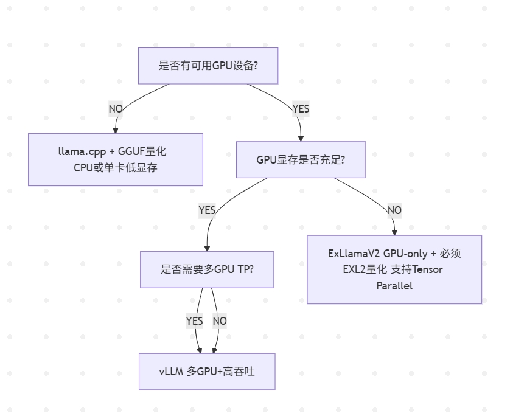

### FAQ

**Q1: ExLlamaV2 是 llama.cpp 演进版吗？**
A: ❌ 不是，两者独立开发，架构不同。

**Q2: ExLlamaV2 支持原始FP16权重吗？**
A: ❌ 只支持 EXL2 量化格式。

**Q3: ExLlamaV2 支持 TP 吗？**
A: ✅ 原生支持 Tensor Parallelism，多卡显存分布计算。

---

## vLLM V1

参考:

https://blog.vllm.ai/2025/01/27/v1-alpha-release.html

#### 从 vLLM V0 中学习

 
在过去的 1.5 年里，vLLM V0 成功地支持了各种模型、功能和硬件。然而，随着时间推移，系统变得越来越复杂：

- **功能碎片化**：不同的功能是独立开发的，缺乏统一的架构。
- **难以整合**：由于各个模块之间耦合度高，增加新功能或优化变得困难。
- **技术债累积**：代码复杂，维护成本高。

#### V1 的目标

 
vLLM V1 的诞生是为了应对这些挑战。其设计目标是：

- **简化代码结构**：使代码更加模块化，方便开发和维护。
- **提高性能**：减少 CPU 开销，充分利用 GPU 资源。
- **统一架构**：将关键优化整合到一个统一的系统中。
- **零配置**：默认启用最佳的功能和优化，减轻用户负担。


### vLLM V1 的新特性

#### 1. 优化的执行循环和 API 服务器


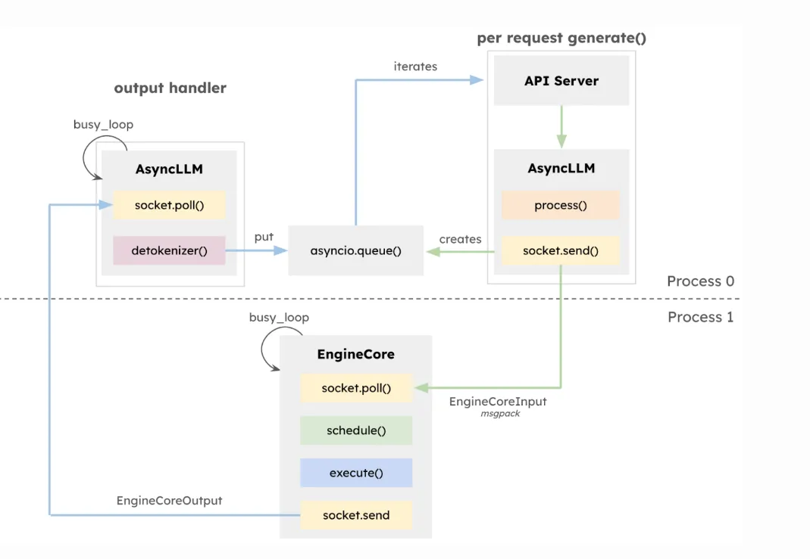

**背景问题：**

在处理用户请求时，系统需要执行以下任务：

- 接收并解析请求。

- 准备输入数据（如分词）。

- 执行模型推理。

- 生成输出（如解码）。

- 返回结果给用户。

  在 V0 中，CPU 需要处理大量任务，特别是在 GPU 执行时间很短的情况下（例如处理小模型或使用高性能 GPU），CPU 成为瓶颈。

  **V1 的改进：**

- **多进程架构**：将 API 服务器和核心执行循环分离到不同的进程。

- **任务并行化**：让 CPU 密集型任务（如分词、解码）与 GPU 推理并行进行。

  **实际场景举例：**

  假设有大量用户同时向你的聊天机器人发送消息。V1 的多进程架构允许系统同时处理新的用户请求、准备输入数据，以及执行模型推理。这样，当 GPU 在处理一个请求的推理时，CPU 可以为下一个请求做好准备，减少了等待时间，提高了整体吞吐量。

#### 2. 简单且灵活的 Scheduler（调度器）

 

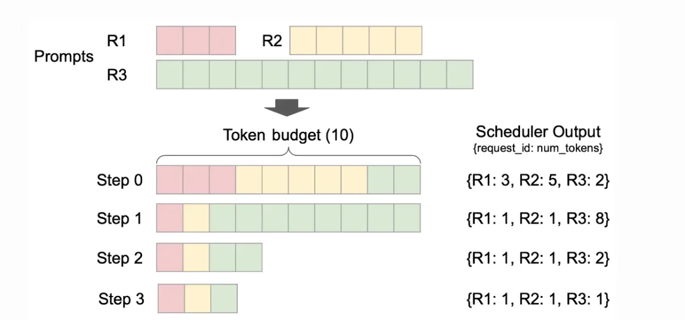

**调度器的作用：**

决定哪些请求在何时被处理，以及每个请求处理多少个 token。

**V1 的改进：**

- **统一处理方式**：将用户输入的提示和模型生成的输出统一看待。

- **灵活调度策略**：使用简单的数据结构（如 `{request_id: num_tokens}`）表示调度决策。

- **支持高级特性**：如 Chunked Prefill（分块预填充）、Prefix Caching（前缀缓存）、Speculative Decoding（推测性解码）等。

  **实际场景举例：**

  在处理长文本生成时，调度器可以动态分配资源。例如，对于需要生成长段落的请求，调度器可以决定一次处理更多的 token，而对于短回复的请求，则少分配一些资源。这样，系统可以更有效地利用 GPU，满足不同请求的需求。

#### 3. 零开销的 Prefix Caching（前缀缓存）

 

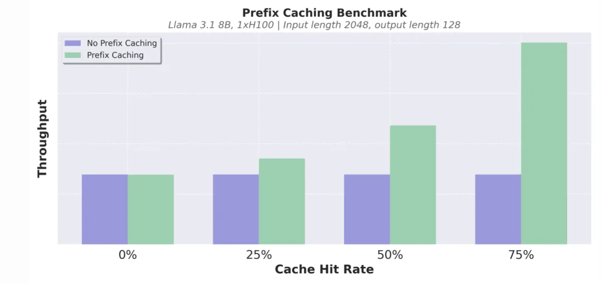

**什么是前缀缓存：**

当不同的请求有相同的输入前缀时，可以缓存这些前缀的计算结果，避免重复计算，提高效率。

**V1 的改进：**

- **优化数据结构**：实现常数时间的缓存插入和淘汰。

- **最小化开销**：即使缓存命中率很低，也几乎不会带来额外的性能损失。

  **实际场景举例：**

  在提供 API 服务时，可能会有多个用户发送相同的开头，例如“Once upon a time”。通过前缀缓存，系统可以复用之前的计算结果，加速响应。

#### 4. 针对 Tensor Parallelism（张量并行）推理的清晰架构

 

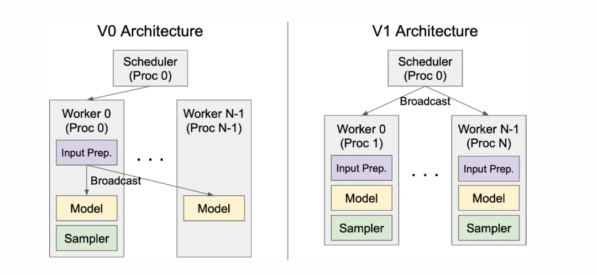

**什么是 Tensor Parallelism（张量并行）：**

将模型的参数和计算分布在多个 GPU 上，以处理超大规模的模型。

**V1 的改进：**

- **对称架构**：调度器和每个 GPU 工作进程独立运行，架构清晰。

- **高效通信**：在工作进程中缓存请求状态，只传输增量更新，减少通信开销。

  **实际场景举例：**

  当你需要部署一个特别大的模型（如 70B 参数的模型），需要使用多张 GPU。V1 的架构使得多 GPU 之间的协作更加高效，确保模型能够以最佳性能运行。

#### 5. 高效的输入准备

 

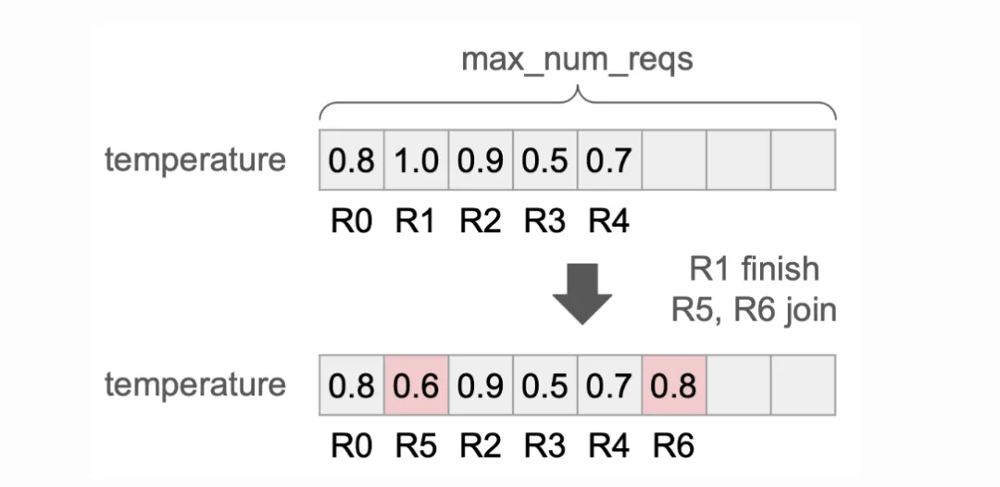

**问题所在：**

在 V0 中，每次执行模型推理都要重新准备输入数据，带来较高的 CPU 开销。

**V1 的改进：**

- **持久化批次**：缓存输入张量，只在需要时更新。

- **优化数据操作**：使用高效的 Numpy 操作，减少 CPU 使用。

  **实际场景举例：**

  对于连续的对话或多轮交互，用户的输入可能只有少量变化。V1 可以复用之前的输入数据，只处理变化的部分，提高响应速度。

#### 6. `torch.compile` 和分段 CUDA 图

 


**`torch.compile` 的作用：**

自动优化 PyTorch 模型的执行效率。


**V1 的改进：**

- **自动优化模型**：利用 `torch.compile`，减少手动优化的工作量。

  [让推理速度提升两倍：torch.compile](https://mp.weixin.qq.com/s?__biz=MzAwMDc2NjQ4Nw==&mid=2663562502&idx=1&sn=005b70f99730b6193e32922807ddc0da&scene=21#wechat_redirect)

- **分段 CUDA 图**：解决 CUDA 图在处理动态输入时的限制，提高灵活性。

  **实际场景举例：**

  开发者可以专注于模型本身的改进，而无需花费大量时间在性能优化上。V1 自动确保模型以高效的方式运行。


**CUDA 图**是 CUDA 引入的一项高级特性。它的主要作用是：

- **将一系列 GPU 操作（如计算内核、数据传输等）预先记录下来，形成一个有向无环图（DAG，Directed Acyclic Graph）。**
- 然后，可以一次性将整个图提交给 GPU 执行，而不是逐个操作地提交。


#### **为什么要使用 CUDA 图？**

 
在传统的 GPU 编程中，CPU 和 GPU 通常需要频繁通信：

- **CPU** 负责启动 GPU 的计算任务，例如内核启动、数据传输等。

- 每当需要执行一个 GPU 操作，CPU 都要向 GPU 发出指令，这会产生一定的开销，尤其是在操作较多或操作较小的情况下。

  使用 CUDA 图有以下优势：

1. **减少 CPU 和 GPU 之间的通信开销**：
   - 由于提前将多个操作记录下来，一次性提交给 GPU，降低了 CPU 发出指令的频率。
   - 减轻了 CPU 的负担，使其可以处理其他任务。
2. **提高 GPU 的执行效率**：
   - GPU 可以连续地执行预先定义好的操作序列，无需等待 CPU 的指令，提高了并行度。
   - 减少了 GPU 的空闲时间，更好地利用了计算资源。
3. **优化性能**：
   - 对于包含大量小型计算任务的应用，使用 CUDA 图可以显著提升性能。
   - 减少了指令的调度和同步开销。

#### **在 vLLM V1 中的应用**

 
在 **vLLM V1** 中，CUDA 图被用于优化大型语言模型的推理过程。具体来说：

- **挑战**：
  - 大型语言模型在生成文本时，会进行大量的小规模计算步骤，每个步骤可能涉及到不同的 GPU 操作。
  - 如果每个操作都需要 CPU 发出指令，会导致大量的通信开销，降低整体性能。
- **解决方案**：
  - **使用 CUDA 图**，将推理过程中需要的多个 GPU 操作预先记录下来，形成一个执行图。
  - 一次性将整个图提交给 GPU，GPU 可以自主连续地执行这些操作，无需每次都等待 CPU 的指令。
- **效果**：
  - **减少了 CPU 与 GPU 之间的通信**，降低了延迟。
  - **提高了 GPU 的利用率**，加速了模型的推理速度。
  - **提升了整体性能**，为用户提供更快速的响应。

#### **举个例子**

 
为了更好地理解，我们可以把这个过程比作工厂的流水线生产：

- **传统方式**：

  - 工人（GPU）在每完成一个步骤后，都需要等待主管（CPU）的下一道指令。
  - 这种方式下，工人可能会经常停下来等待指令，效率不高。

- **使用 CUDA 图的方式**：

  - 主管（CPU）在开始前，就把整个生产流程（多个步骤）设计好，形成一个“流程图”。

  - 工人（GPU）按照这个流程图，连续地完成所有步骤，中间不需要再向主管请示。

  - 这样，工人可以一直忙碌，减少了等待时间，生产效率大大提高。

    

#### 7. 增强对多模态大型语言模型的支持

 
**多模态大型语言模型（MLLM）：**

能够处理文本、图像等多种类型输入的模型。

**V1 的改进：**

- **优化输入预处理**：将图像等输入的预处理移到独立进程，避免阻塞 GPU。

- **多模态前缀缓存**：支持对图像输入的缓存，加速重复处理。

- **灵活调度**：允许将多模态输入的处理分散到多个步骤，提高效率。

  **实际场景举例：**

  在一个需要处理图像问答的系统中，V1 可以快速处理用户上传的图像，并生成回答。如果同一张图像被多次询问，系统可以利用缓存，加速响应。

#### 8. FlashAttention 3

 
**FlashAttention 3 的作用：**

一种高性能的注意力机制计算方法，适用于 Transformer 模型。

**V1 的改进：**

- **集成 FlashAttention 3**：在高动态性计算中提供高效的注意力计算。

- **支持各种功能**：在合并预填充和解码等动态批处理场景下表现出色。

  **实际场景举例：**

  对于需要高吞吐量和低延迟的应用，如实时翻译或大规模聊天服务，FlashAttention 3 可以确保模型在高负载下保持良好性能。

https://github.com/xinyuwei-david/david-share/tree/master/Deep-Learning/FlashAttention-3

### 性能提升

 
**总体效果：**

- **吞吐量提升**：相比 V0，V1 的吞吐量提升最高可达 1.7 倍。

- **延迟降低**：更快的响应时间，改善用户体验。

  **具体示例：**

- **文本模型**：在 Llama 3.1 8B 和 Llama 3.3 70B 上测试，V1 在高并发请求下表现出更好的性能。

- **视觉语言模型**：在 Qwen2-VL 上，V1 的改进更加显著，特别是在处理图像输入时。

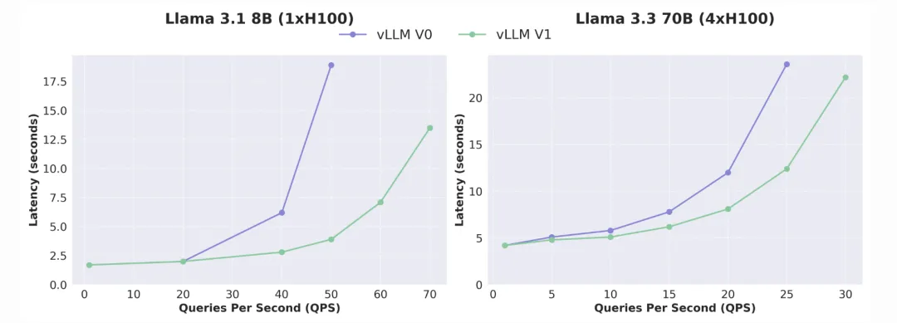

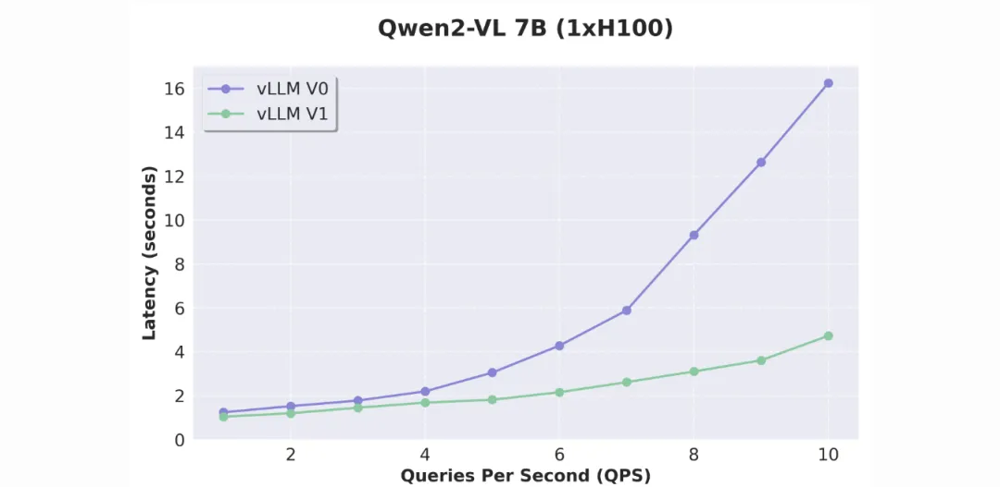

### 

### 展望未来

 

- **持续优化**：团队将继续改进 V1 的性能和功能。
- **扩展支持**：增加对更多模型类型、功能和硬件的支持。

### 当前的限制和未来工作

 
**模型支持：**

- **目前支持**：仅 Decoder-only 的 Transformer 模型（如 Llama）、MoE 模型（如 Mixtral）、部分视觉语言模型（如 Qwen2-VL）。

- **暂不支持**：Encoder-Decoder 架构（如多模态 Llama 3.2）、基于 Mamba 的模型（如 Jamba）、Embedding 模型。

  **功能限制：**

- **缺少的功能**：log probs、提示 log probs、Pipeline Parallelism（流水线并行）、结构化解码、Speculative Decoding（推测性解码）、Prometheus 指标、LoRA 等。

- **开发中**：团队正在努力缩小功能差距，并添加新的优化。

  **硬件支持：**

- **当前支持**：仅支持 NVIDIA Ampere 或更新的 GPU。

- **未来计划**：扩展到其他硬件平台，如 TPU。


### 如何开始使用 vLLM V1

 

1. **安装最新版本的 vLLM：**

   ```
   pip install vllm --upgrade
   ```

 

2. **设置环境变量：**

```
export VLLM_USE_V1=1
```

 

3. **使用 vLLM：**

- 通过 Python API 或命令行使用，无需更改现有代码。

- 启动兼容 OpenAI 的服务器：

  ```
  vllm serve <模型名称>
  ```

###  

### **总结**  vLLM V1 通过重构架构、优化性能和扩展功能，显著提升了大型语言模型的推理效率。对于开发者和用户来说，这意味着更快的响应和更好的体验。
