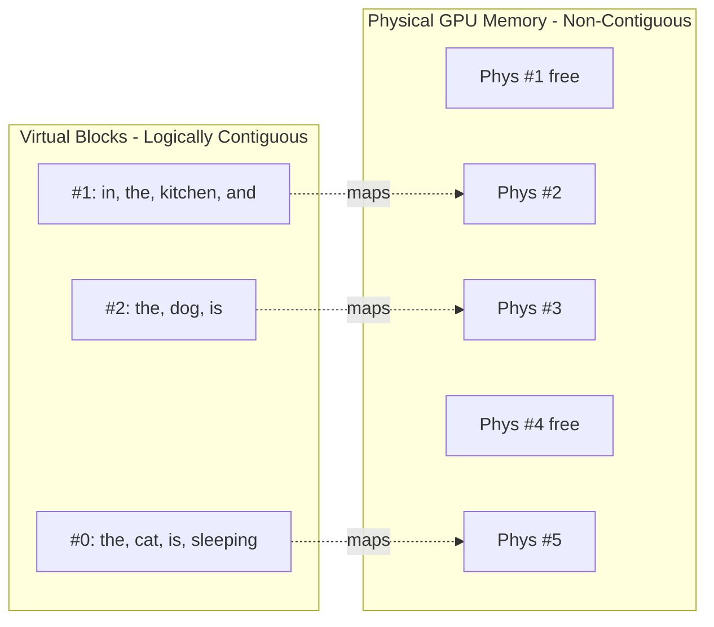
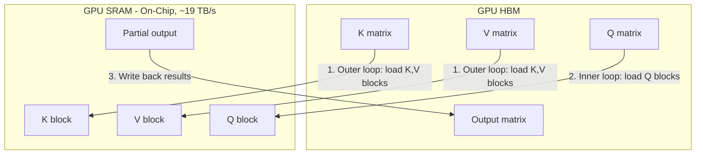
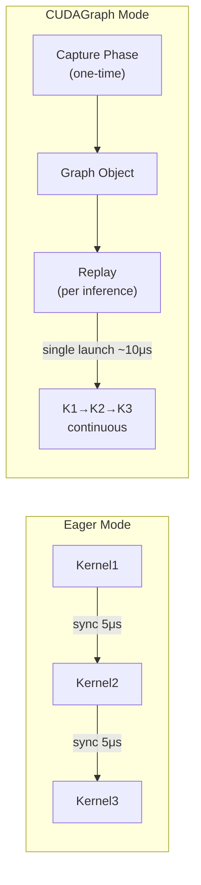
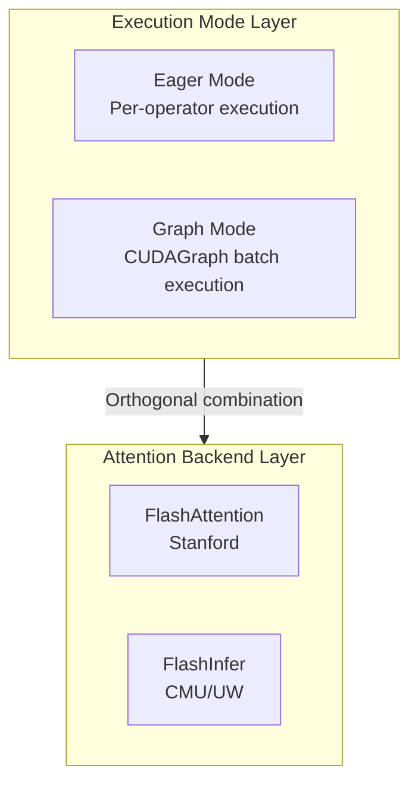
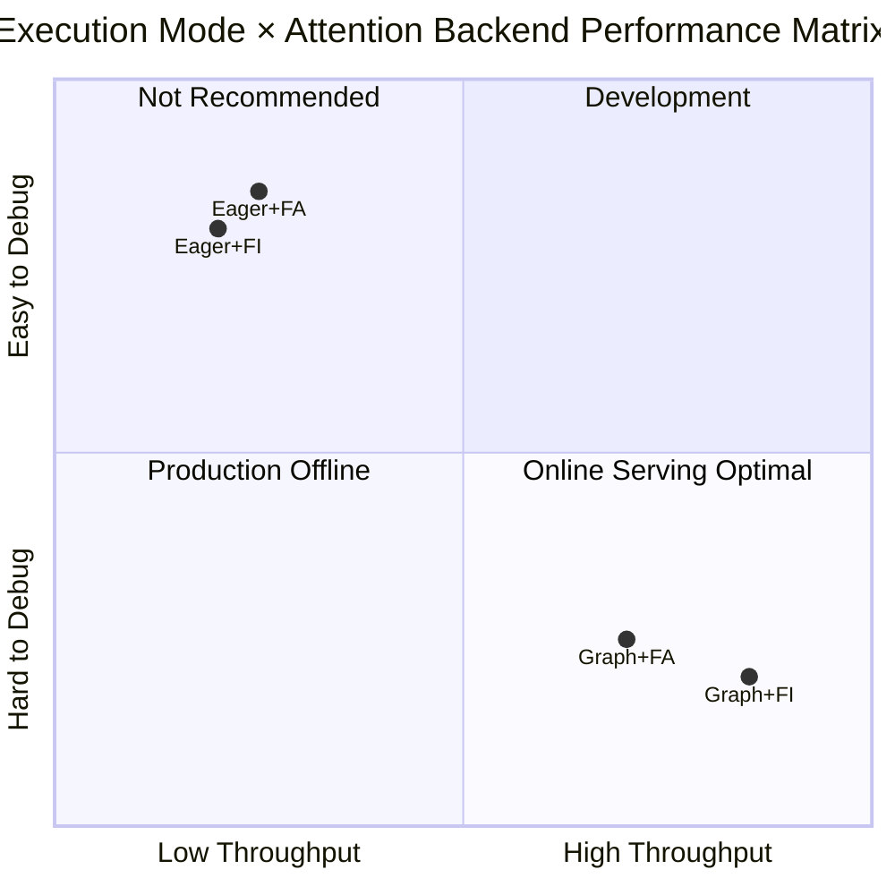

# vLLM Attention Architecture and Benchmark

> Comprehensive guide to vLLM's attention optimization stack — PagedAttention, FlashAttention, FlashInfer, CUDAGraph, and Continuous Batching — with real-world benchmarks across multiple GPUs.

## 🎯 Key Findings

| Condition | Winner | Margin | Recommendation |
|-----------|--------|--------|----------------|
| **CUDAGraph + Long Sequence** | FlashInfer | **+9~15%** | Production serving |
| CUDAGraph + Short Sequence | FlashInfer | +1% | Default choice |
| Eager Mode (any config) | FlashAttention | +1~7% | Development/debugging |
| Large Batch (128) + Eager | FlashAttention | +11.8% | Batch processing |

**Bottom Line**:
- **Production (CUDAGraph enabled)**: Use FlashInfer (vLLM default) - **9-15% faster** on long sequences
- **Development (enforce_eager=True)**: FlashAttention slightly faster

### Cross-GPU Validation (Robustness)

| Config | A100 (Ampere) | RTX 6000 (Blackwell, 3-run avg) | Conclusion |
|--------|--------------|--------------------------------|------------|
| Long seq + CUDAGraph | **FI +15.4%** | **FI +9.3%** | ✅ **Consistent: FI wins** |
| Short seq + CUDAGraph | FI +1.2% | FI +0.9% | ✅ Consistent |
| Medium batch + CUDAGraph | FI +1.3% | FA +4.1% | ⚠️ Varies by arch |

---

## 🧠 Technical Background

### vLLM Architecture Overview

vLLM (Virtual Large Language Model) was introduced by Kwon et al. in their 2023 paper *"Efficient Memory Management for Large Language Model Serving with PagedAttention"*. It addresses the critical challenge of GPU memory inefficiency in managing KV cache for LLM serving systems — leading to underutilized GPU resources, slower inference speeds, and high memory usage.

vLLM combines several key technologies for high-throughput, low-latency inference:

| Technology | Function | Impact |
|-----------|----------|--------|
| **PagedAttention** | Paged KV cache memory management | Eliminates memory fragmentation |
| **Continuous Batching** | Dynamic request scheduling | Maximizes GPU utilization |
| **FlashAttention / FlashInfer** | Optimized attention kernels | Reduces compute & memory overhead |
| **CUDAGraph** | Pre-compiled execution graphs | Eliminates kernel launch overhead |
| **Memory Pre-allocation** | 90% GPU memory reserved upfront | Avoids runtime allocation cost |

**Batching Strategies in LLM Serving**:

- **Client-Side (Static) Batching**: The client bundles multiple inference requests into a single batch. Requires client-side code changes and is tightly coupled to batch size
- **Server-Side (Dynamic) Batching**: The server dynamically combines incoming independent requests — includes dynamic batching, continuous batching, and PagedAttention batching. No client modifications needed. vLLM uses continuous batching to dynamically adjust batch sizes during generation

### PagedAttention: OS-Inspired KV Cache Management

PagedAttention is the primary driver of vLLM's performance. Inspired by virtual memory paging in operating systems, it maps logically contiguous virtual blocks to physically non-contiguous GPU memory blocks via a block table.

#### Virtual-to-Physical Block Mapping



**Key Mechanisms**:

| Mechanism | Description |
|-----------|-------------|
| **Fixed-Size Blocks** | KV tensors divided into blocks (e.g., block_size=4 tokens). Each block stores KV pairs for a fixed number of tokens |
| **On-Demand Allocation** | Blocks allocated during inference as needed, filling fragmented GPU memory efficiently |
| **Block-by-Block Fetching** | Attention kernel fetches blocks sequentially per query token — faster than loading the entire KV sequence due to limited block size |
| **Virtual Block Sharing** | During beam search or parallel sampling, all sequences share the same virtual blocks, avoiding KV cache duplication. Saves VRAM and supports more concurrent requests |

**Performance**: Berkeley benchmarks show vLLM significantly outperforms HuggingFace TGI, with the performance gap growing for larger models (which are more affected by memory fragmentation).

### vLLM Memory Pre-allocation

By default, vLLM sets `gpu_memory_utilization=0.9`, pre-allocating 90% of VRAM as the KV cache block pool:

| Aspect | Detail |
|--------|--------|
| **Default** | `gpu_memory_utilization=0.9` |
| **Purpose** | Pre-allocate KV cache block pool upfront |
| **Benefit** | Eliminates runtime allocation/release overhead |
| **Mechanism** | PagedAttention fills pre-allocated blocks on-demand |

This ensures sufficient VRAM for all intermediate results when handling long sequences or large batches, avoiding frequent memory allocation/release operations that degrade performance.

### FlashAttention: IO-Aware Tiling

FlashAttention (Dao et al., Stanford) achieves fast, memory-efficient **exact** attention by exploiting the GPU memory hierarchy.

#### GPU Memory Hierarchy

| Memory Type | Bandwidth | Capacity | Role in FlashAttention |
|-------------|-----------|----------|----------------------|
| **GPU SRAM** | ~19 TB/s | ~20 MB | Compute attention tiles here |
| **GPU HBM** | ~1.5 TB/s | 40-80 GB | Store Q, K, V, output matrices |
| **CPU DRAM** | ~12.8 GB/s | >1 TB | Not used during attention |

#### Tiling Mechanism

Traditional attention computes a full N x N attention matrix in HBM — prohibitive for long sequences. FlashAttention avoids this through **tiling**:



1. **Outer loop**: Load blocks of K and V from HBM into fast on-chip SRAM
2. **Inner loop**: For each K,V block, iterate over Q blocks and compute partial attention entirely in SRAM
3. **Write back**: Only write completed tile results back to HBM

Result: **7.6x speedup** over PyTorch standard attention on GPT-2 (measured by Dao et al.).

#### FlashAttention-2 Improvements

| Optimization | Detail |
|-------------|--------|
| **Reduce non-matmul operations** | On A100: matmul throughput = 312 TFLOPS/s vs non-matmul = 19.5 TFLOPS/s (**16x cost per FLOP**). FA-2 minimizes non-matmul FLOPs to maximize time on tensor cores |
| **Sequence length parallelism** | FA-1 only parallelized over batch and heads. FA-2 also parallelizes over sequence length — critical for small-batch long-sequence scenarios |
| **Better warp partitioning** | Reduces inter-warp communication and synchronization (each warp = 32 threads) |
| **Broader model support** | Up to 256 attention heads; supports MQA (Multi-Query Attention) and GQA (Grouped-Query Attention) |

### Continuous Batching

Unlike static batching (which waits for all requests in a batch to finish), **continuous batching** dynamically adds new requests as slots become available:

| Time | Req 1: "Capital of" | Req 2: "The diamondback turtle is" | Req 3: "Largest Mammal is" |
|------|---------------------|-----------------------------------|--------------------------|
| T1 | Prefill | Prefill | Prefill |
| T2 | Prefill | Prefill | Prefill |
| T3 | Decode | Decode | Decode |
| T4 | Decode | Decode | Decode |
| T5 | Decode | Decode | **Complete** -> new req enters |
| T6 | Decode | **Complete** -> new req enters | New req processing |
| T7 | **Complete** | New req processing | New req processing |

**Key benefits**:
- **Maximizes GPU utilization**: No idle time waiting for the longest request to finish
- **Reduces average latency**: Short requests complete and exit the batch immediately
- **Increases throughput**: New requests enter as soon as slots are freed

### FlashInfer vs FlashAttention: Summary

Both achieve O(N) memory efficiency, but with different design priorities:

| Aspect | FlashAttention | FlashInfer |
|--------|---------------|------------|
| **Origin** | Stanford / Tri Dao | CMU / UW |
| **Primary Focus** | Training + Inference | Inference serving |
| **Key Optimization** | IO-aware tiling (SRAM/HBM hierarchy) | Paged KV cache + CUDAGraph optimization |
| **Memory Efficiency** | O(N) instead of O(N^2) | O(N) + dynamic batching |
| **CUDAGraph Support** | Basic | Specifically optimized |
| **PagedAttention** | External (vLLM manages paging) | Native paged KV cache support |

> While FlashAttention optimizes the attention computation itself, vLLM's overall acceleration comes from the synergy of **PagedAttention + Continuous Batching + CUDAGraph + Optimized Attention Kernels**.

### Why CUDAGraph Matters

#### CPU-GPU Kernel Launch Overhead Analysis

In traditional Eager execution mode, each CUDA kernel call requires the complete launch process:

| Phase | CPU Operation | GPU State | Overhead |
|-------|--------------|-----------|----------|
| 1 | Prepare kernel args | Wait | ~1μs |
| 2 | Call CUDA API | Receive command | ~2μs |
| 3 | Synchronize | Execute kernel | ~2μs |
| **Total** | | | **~5μs/kernel** |

**Quantitative Impact**: Llama-7B single Decode involves 300+ kernel calls, launch overhead = 5μs × 300 = 1.5ms, while actual computation only takes 2-3ms, **launch overhead accounts for 30-40%**.

#### CUDAGraph Working Principle



#### Key Constraints

| Constraint | Description | LLM Inference Compatibility |
|------------|-------------|----------------------------|
| **Static Topology** | Compute graph structure must be fixed | ✅ Transformer forward pass is fixed |
| **Fixed Shape** | Tensor shapes determined at capture | ⚠️ vLLM handles via bucketing |
| **No Dynamic Branches** | No if/while runtime branches | ✅ No dynamic branches in inference |
| **Memory Binding** | Tensor addresses fixed during graph lifetime | ✅ vLLM pre-allocates memory pools |

#### Performance Benefits

| Metric | Eager Mode | CUDAGraph | Improvement |
|--------|-----------|-----------|-------------|
| Kernel launches | N × 5μs | 1 × 10μs | **N:1** |
| Decode latency | ~4ms | ~1.5ms | **2.5x** |
| GPU utilization | 60-70% | 85-95% | +25% |

FlashInfer is specifically optimized for CUDAGraph capture, which is why it outperforms FlashAttention when CUDAGraph is enabled.

---

## 🔧 Eager vs Graph Execution Modes

### Execution Paradigm Comparison

| Feature | Eager Execution | Graph Execution |
|---------|----------------|-----------------|
| **Timing** | Per-operator immediate | Pre-compiled batch |
| **Debug Support** | ✅ Full stack trace | ⚠️ Graph-level errors only |
| **Dynamic Control Flow** | ✅ Supports if/while | ❌ Not supported |
| **Launch Overhead** | High (per-op sync) | Low (graph-level sync) |

### vLLM Configuration

```python
from vllm import LLM

# Graph mode (default, recommended for production)
llm = LLM(model="Qwen/Qwen2.5-7B-Instruct")

# Eager mode (for debugging)
llm = LLM(model="Qwen/Qwen2.5-7B-Instruct", enforce_eager=True)
```

---

## 🔗 Execution Mode and Attention Backend Combinations

### Architecture Layers



**Key Concept**: Execution mode and attention backend are **orthogonal dimensions** that can be freely combined.

### Four Combinations Performance (A100 Measured)



| Combination | Throughput (tok/s) | vs Baseline | Use Case |
|-------------|-------------------|-------------|----------|
| Eager + FA | 682 | Baseline | Development |
| Eager + FI | 675 | -1% | Not recommended |
| Graph + FA | 1,522 | +123% | Production (batch offline) |
| **Graph + FI** | **1,757** | **+158%** | **Production (online serving)** ✅ |

### vLLM Configuration Examples

```python
import os
from vllm import LLM

# Combination 1: Eager + FA (Development)
os.environ["VLLM_ATTENTION_BACKEND"] = "FLASH_ATTN"
llm = LLM(model="Qwen/Qwen2.5-7B-Instruct", enforce_eager=True)

# Combination 2: Graph + FA (Production - batch offline)
os.environ["VLLM_ATTENTION_BACKEND"] = "FLASH_ATTN"
llm = LLM(model="Qwen/Qwen2.5-7B-Instruct")

# Combination 3: Graph + FI (Production - online serving) ✅ vLLM default
llm = LLM(model="Qwen/Qwen2.5-7B-Instruct")
```

---

## 🖥️ Test Environment

### Hardware

| GPU | Architecture | Memory | Compute Capability |
|-----|--------------|--------|-------------------|
| NVIDIA H100 NVL | Hopper | 94GB HBM3 | SM90 |
| NVIDIA A100 80GB PCIe | Ampere | 80GB HBM2e | SM80 |
| NVIDIA RTX Pro 6000 | Blackwell | 96GB | SM120 |

### Software

| Component | A100 | RTX 6000 |
|-----------|------|----------|
| vLLM | 0.10.2 | 0.13.0 |
| FlashInfer | 0.5.3 | 0.6.0rc2 |
| FlashAttention | 2.8.3 | 2.8.3 |
| PyTorch | 2.8.0+cu128 | 2.9.0+cu128 |

### Test Model

- **Model**: `Qwen/Qwen2.5-0.5B-Instruct`
- **Reason**: Small model to isolate attention kernel performance (not memory-bound)

---

## 📊 Benchmark Results

### Test 1: Multi-GPU Comparison (Eager Mode)

**Config**: 128 requests, max_tokens=256, enforce_eager=True, 3 runs averaged

| GPU | FlashInfer (tok/s) | FlashAttention (tok/s) | Winner | Margin |
|-----|-------------------|----------------------|--------|--------|
| H100 NVL | 9,893 | 10,334 | FA | +4.5% |
| A100 80GB | 8,780 | 9,260 | FA | +5.5% |
| RTX Pro 6000 | 9,845 | 10,300 | FA | +4.6% |

**Conclusion**: In eager mode, FlashAttention consistently wins by 4-5%.

### Test 2: Batch Size Sweep (A100, Eager Mode)

**Config**: A100 80GB, enforce_eager=True, 3 runs averaged

| Batch Size | FlashInfer (tok/s) | FlashAttention (tok/s) | Winner | Margin |
|------------|-------------------|----------------------|--------|--------|
| 1 | 72 | 75 | FA | +4.3% |
| 8 | 556 | 557 | FA | +0.2% |
| 32 | 1,978 | 2,015 | FA | +1.9% |
| 128 | 7,014 | 7,949 | FA | +11.8% |

**Conclusion**: FlashAttention advantage grows with batch size in eager mode.

### Test 3: CUDAGraph + Sequence Length (A100)

**Config**: A100 80GB, batch=8, 1 run each

| Config | FlashInfer (tok/s) | FlashAttention (tok/s) | Winner | Margin |
|--------|-------------------|----------------------|--------|--------|
| Short (256 tok), Eager | 675 | 682 | FA | +1.1% |
| Short (256 tok), CUDAGraph | 1,647 | 1,628 | **FI** | +1.2% |
| Long (1024 tok), Eager | 663 | 671 | FA | +1.2% |
| **Long (1024 tok), CUDAGraph** | **1,757** | **1,522** | **FI** | **+15.4%** |
| Medium Batch (32×512), CUDAGraph | 6,176 | 6,095 | **FI** | +1.3% |

**Key Insight**: FlashInfer's advantage emerges with CUDAGraph enabled, especially for long sequences where it achieves **15.4% higher throughput**.

### Test 4: RTX Pro 6000 Robustness Test (3-run Average)

**Config**: RTX Pro 6000 Blackwell, vLLM 0.13.0, FlashInfer 0.6.0rc2, **3 runs averaged**

| Config | FlashInfer (tok/s) | FlashAttention (tok/s) | Winner | Margin |
|--------|-------------------|----------------------|--------|--------|
| Short seq (256), CUDAGraph | 2,644 | 2,620 | **FI** | +0.9% |
| **Long seq (1024), CUDAGraph** | **2,290** | **2,096** | **FI** | **+9.3%** |
| Medium batch (32×512), CUDAGraph | 8,723 | 9,100 | FA | +4.1% |

<details>
<summary>📈 Raw data (3 runs each)</summary>

```json
{
  "Short_CUDAGraph": {
    "FLASHINFER": [2600.1, 2696.3, 2636.4],
    "FLASH_ATTN": [2613.1, 2638.4, 2607.6]
  },
  "Long_CUDAGraph": {
    "FLASHINFER": [2407.0, 2110.6, 2352.9],
    "FLASH_ATTN": [2617.1, 1843.0, 1827.6]
  },
  "Medium_CUDAGraph": {
    "FLASHINFER": [8958.7, 8548.1, 8662.2],
    "FLASH_ATTN": [9139.5, 9129.2, 9030.3]
  }
}
```

</details>

**Validation**: The RTX 6000 (Blackwell architecture) confirms the A100 finding - **FlashInfer wins by 9.3% on long sequences with CUDAGraph**.

---

## 🔬 Analysis

### Why FlashInfer Wins with CUDAGraph

1. **Optimized Graph Capture**: FlashInfer kernels are designed to be CUDAGraph-friendly
2. **Paged Attention**: Better memory access patterns during graph replay
3. **Kernel Fusion**: More operations fused into fewer kernel launches

### Why FlashAttention Wins in Eager Mode

1. **Lower Kernel Launch Overhead**: FlashAttention kernels may have slightly lower per-launch cost
2. **Simpler Execution Path**: Without graph capture overhead

### CUDAGraph Speedup Factor

| Config | Eager | CUDAGraph | Speedup |
|--------|-------|-----------|---------|
| FlashInfer (short) | 675 | 1,647 | **2.44x** |
| FlashInfer (long) | 663 | 1,757 | **2.65x** |
| FlashAttention (short) | 682 | 1,628 | 2.39x |
| FlashAttention (long) | 671 | 1,522 | 2.27x |

FlashInfer benefits more from CUDAGraph (2.44-2.65x) than FlashAttention (2.27-2.39x).

---

## 🚀 Quick Start

### Requirements

```bash
pip install vllm>=0.10.2 flashinfer flash-attn
```

### Run Benchmark

```bash
# Clone repo
git clone https://github.com/davidsajare/flashinfer-vs-flashattention-benchmark.git
cd flashinfer-vs-flashattention-benchmark

# Basic comparison (eager mode)
python scripts/benchmark_vllm.py --model Qwen/Qwen2.5-0.5B-Instruct --output results.json

# Batch size sweep
python scripts/benchmark_batch_sweep.py --quick --output batch_sweep.json

# Advanced test (CUDAGraph + long sequence)
python scripts/benchmark_advanced.py --output advanced.json

# Robustness test (3 runs)
python scripts/robust_test.py --output robust.json
```

### Set Backend Manually

```bash
# Use FlashInfer (default in vLLM)
export VLLM_ATTENTION_BACKEND=FLASHINFER

# Use FlashAttention
export VLLM_ATTENTION_BACKEND=FLASH_ATTN
```

---

## 💡 Recommendations

| Use Case | Recommended Backend | Reason |
|----------|---------------------|--------|
| **Production serving** | FlashInfer (default) | +9-15% with CUDAGraph + long seq |
| **Development/debugging** | FlashAttention | Slightly faster in eager mode |
| **Batch inference jobs** | FlashAttention | Better at large batch + eager |
| **Interactive chat** | FlashInfer | Better latency with CUDAGraph |

### vLLM Configuration

```python
from vllm import LLM

# Production (CUDAGraph enabled - default)
llm = LLM(model="your-model")  # Uses FlashInfer by default

# Development (disable CUDAGraph for debugging)
llm = LLM(model="your-model", enforce_eager=True)
# Consider: export VLLM_ATTENTION_BACKEND=FLASH_ATTN
```

---

## ⚠️ Important Notes

### enforce_eager Impact

The `enforce_eager=True` flag disables CUDAGraph, which:
- Allows easier debugging (no graph capture issues)
- Enables dynamic tensor shapes
- **Reduces throughput by 2-2.5x**

Most production benchmarks should **NOT** use `enforce_eager=True`.

### Version Compatibility

| vLLM Version | FlashInfer | FlashAttention | Notes |
|--------------|------------|----------------|-------|
| 0.10.x | 0.5.3 | 2.8.x | Tested on A100 |
| 0.12.x | 0.5.3 | 2.8.x | Tested |
| 0.13.x | 0.6.0rc2 | 2.8.x | Tested on RTX 6000 |

---

## 📁 Repository Structure

```
vLLM-Architecture-and-Inference-Engines/
├── README.md                      # English documentation
├── README-CN.md                   # Chinese documentation
├── scripts/
│   ├── benchmark_vllm.py          # Basic FI vs FA comparison
│   ├── benchmark_batch_sweep.py   # Batch size sweep test
│   ├── benchmark_advanced.py      # CUDAGraph + long sequence test
│   └── robust_test.py             # 3-run robustness test
└── results/
    ├── h100_results.json          # H100 test results
    ├── a100_results.json          # A100 test results
    ├── a100_batch_sweep.json      # Batch sweep results
    ├── a100_advanced.json         # A100 CUDAGraph results
    ├── rtx6000_results.json       # RTX 6000 eager mode results
    ├── rtx6000_advanced.json      # RTX 6000 CUDAGraph results
    └── rtx6000_robust.json        # RTX 6000 3-run robustness results
```

---

## 📚 References

- [vLLM: PagedAttention Paper (Kwon et al., 2023)](https://arxiv.org/abs/2309.06180)
- [FlashAttention Paper (Dao et al., 2022)](https://arxiv.org/abs/2205.14135)
- [FlashAttention-2 Paper (Dao, 2023)](https://arxiv.org/abs/2307.08691)
- [FlashInfer Paper](https://arxiv.org/abs/2501.01005)
- [FlashInfer GitHub](https://github.com/flashinfer-ai/flashinfer)
- [FlashAttention GitHub](https://github.com/Dao-AILab/flash-attention)
- [vLLM Documentation](https://docs.vllm.ai/)

---

*Author: Xinyu Wei (Microsoft AI GBB) | Tested: 2026-01-02/03*


---

# Part 2: Why vLLM Achieves High Performance

> *Merged from the original The-reason-vLLM-High-Performance project.*

# The-reason-vLLM-High-Performance

### 1. vLLM

 
vLLM (Virtual Large Language Model) technology was introduced by Kwon et al. in their September 2023 paper, "Efficient Memory Management for Large Language Model Serving with PagedAttention." vLLM addresses the challenges of memory allocation when using GPUs, particularly the inefficiencies in managing key-value (KV) cache memory in current large language model (LLM) service systems. These inefficiencies lead to underutilized GPU resources, slower inference speeds, and high memory usage.

To tackle these challenges, the authors were inspired by memory and paging techniques used in operating systems and proposed an attention algorithm called PagedAttention. PagedAttention employs paging, a method of mapping hardware addresses to virtual addresses. This approach allows for efficient memory management by enabling non-contiguous storage of attention keys and values (KV) in memory.

In terms of batching inference requests, there are two main techniques:

- **Client-Side (Static) Batching**: Typically, when a client sends requests to a server, the server processes each request sequentially, which is inefficient. To improve efficiency, the client can bundle multiple inference requests into a single batch and send it to the server, which then splits the batch into individual requests for processing. This method requires the client to modify its code to implement batching and is closely tied to the batch size.

- **Server-Side (Dynamic) Batching**: Another approach is for the server to handle batching. When independent inference requests arrive at the server, it can dynamically combine them into larger batches. The server manages these batches to meet specified latency targets, maximizing throughput while maintaining the required latency range. This process is handled automatically by the server, so no client code modifications are needed. Server-side batching includes various techniques to further optimize the throughput of generating language models, such as dynamic batching, continuous batching, and PagedAttention (vLLM) batching. vLLM also uses continuous batching, dynamically adjusting batch sizes during model output generation.

  Continuous batching is a specialized optimization technique for text generation. It increases throughput without adding first-byte latency. Continuous batching (also known as iterative or rolling batching) addresses GPU idle time by continuously adding new requests to the batch, improving efficiency. The diagram below illustrates how continuous batching works. When requests 2 and 3 are completed, another set of requests is scheduled.

### 2. Paged Attention

 
The primary reason for vLLM's fast inference speed is the Paged Attention technology. vLLM is a high-throughput, low-latency large language model (LLM) inference and serving engine designed to improve model efficiency during the inference phase.

Paged Attention is an attention mechanism optimization method introduced by vLLM. It achieves efficient memory utilization by paging the attention key-value pairs (key-value caches). When handling long sequences or a large number of concurrent requests, Paged Attention can temporarily move inactive key-value pairs out of VRAM and store them in lower-cost memory, bringing them back when needed. This mechanism avoids excessive VRAM usage, allowing vLLM to handle larger models and longer sequences without sacrificing performance.


The image below describes a memory management technique called "PagedAttention" used for natural language processing tasks. In this example, we have a sentence: "the cat is sleeping in the kitchen and the dog is." This sentence is broken down into a series of tokens, each associated with a pair of key-value tensors used for attention computation. The attention mechanism allows the model to focus more on certain parts of the sentence.

In the diagram, we see two main parts:

- **Contiguous Virtual Blocks**: These are logically contiguous memory blocks used to store the key-value tensors for each word. In this example, there are three virtual blocks (#0, #1, #2), each containing a portion of the sentence.

- **Non-Contiguous Blocks in the GPU Memory**: These are physically non-contiguous blocks in GPU memory used to store data. Due to memory constraints or optimization, these blocks may not be stored sequentially.

  In the middle of the diagram, we see an index table showing the mapping between virtual blocks and physical GPU memory blocks. For example, virtual block #0 (containing "the cat is sleeping") maps to physical block #5, virtual block #1 (containing "in the kitchen and") maps to physical block #2, and virtual block #2 (containing "the dog is") maps to physical block #3.

  This mapping allows the computer to efficiently handle large amounts of data, even if the data is not stored contiguously in physical memory. This is crucial for handling large models and complex tasks like machine translation and speech recognition, which require significant memory and computational resources.

  In summary, the image demonstrates how to efficiently organize and access data for natural language processing in GPU memory.

  PagedAttention aims to store key-value tensors more efficiently in the non-contiguous space of GPU VRAM. The idea behind PagedAttention is to create contiguous virtual blocks mapped to physical blocks in GPU memory.

  Each block is designed to store key-value tensors for a predefined number of tokens. All blocks are logically contiguous and mapped to physically non-contiguous blocks, allocated on-demand during inference in fragmented GPU memory. A simple index table is created in memory to associate virtual blocks with physical blocks.

  PagedAttention's kernel fetches these blocks as needed. This is efficient because the system fetches fewer key-value tensors due to the limited block size.

  Let's illustrate with the following prompt:

  "the cat is sleeping in the kitchen and the dog is"

  We set key-value tensors for each token. Using PagedAttention, we can arbitrarily set the block size to 4. Each block contains 4 key-value tensors, but the last one contains only 3 key-value tensors. These blocks are logically contiguous but not necessarily contiguous in GPU memory.

  

  To compute attention, for each query token, the system fetches blocks one by one, as shown in the diagram below.

  By fetching key-value tensors by blocks rather than the entire tensor sequence, attention computation is much faster.

  Another advantage of PagedAttention is that virtual blocks can be shared during sampling in the inference process. All sequences generated in parallel through sampling or beam search can use the same virtual blocks, avoiding duplication.

  Sharing virtual blocks is a technique of PagedAttention. PagedAttention divides VRAM into multiple small blocks and uses virtual memory and paging techniques to manage these blocks. During inference, all parallel-generated sequences (e.g., through sampling or beam search) can share these virtual blocks, avoiding redundant storage of the same data.

  This method not only saves VRAM but also improves memory management efficiency. By sharing virtual blocks, PagedAttention can handle more parallel requests without increasing VRAM usage, thus improving overall inference performance.

  Berkeley reported the performance of PagedAttention implemented in vLLM compared to the text generation inference library developed by Hugging Face.

  

  The results indicate that vLLM is significantly faster, especially when multiple outputs are completed. The difference between TGI and vLLM increases with larger models. This is expected because larger models require more memory and are more affected by memory fragmentation.

### 3. vLLM Default Pre-Allocation of 90% VRAM

 
The primary reason vLLM pre-allocates 90% of VRAM is to optimize memory management and improve inference efficiency. Specifically, vLLM uses a mechanism called PagedAttention to manage attention key-value (KV) caches. Inspired by virtual memory and paging in operating systems, this mechanism divides VRAM into multiple small blocks and allocates memory on-demand, reducing memory fragmentation and waste.

By default, vLLM's `gpu_memory_utilization` parameter is set to 0.9, meaning it pre-allocates 90% of VRAM to store these KV caches. This pre-allocation ensures sufficient VRAM to store all necessary intermediate results when handling long sequences or large batches of data, thus improving inference speed and efficiency. Additionally, pre-allocating 90% of VRAM reduces memory management overhead, avoiding frequent memory allocation and release operations.

PagedAttention indeed optimizes memory usage. By dividing VRAM into multiple small blocks and allocating memory on-demand, it reduces memory fragmentation and waste. This method not only saves memory but also improves memory management efficiency.

However, the main reason vLLM pre-allocates 90% of VRAM is to ensure sufficient VRAM to store all necessary intermediate results when handling long sequences or large batches of data, thus improving inference speed and efficiency. This pre-allocation reduces memory management overhead, avoiding frequent memory allocation and release operations.

### 4. Flash Attention

 
FlashAttention: Fast and Memory-Efficient Exact Attention with IO Awareness

Let's look at the diagram from the paper:


The left chart ranks three types of GPU memory by speed and capacity from top to bottom:

- **GPU SRAM (Static Random-Access Memory)**: This is the fastest type of memory, with a bandwidth of up to 19TB/s, but it has the smallest capacity, only 20MB.

- **HBM (High Bandwidth Memory)**: This memory has a bandwidth of 1.5TB/s and a capacity of 40GB, used for high-performance computing in GPUs.

- **DRAM (Dynamic Random-Access Memory)**: This is a type of main memory with a bandwidth of 12.8GB/s and a capacity of over 1TB.

  FlashAttention is an optimized attention mechanism computation method that processes data in chunks, avoiding the generation of large attention matrices on the GPU's HBM. The flowchart shows how blocks of K and V matrices are copied to fast SRAM and computed through blocks of the Q matrix, then written back to HBM.

  The right bar chart compares the performance of FlashAttention and traditional PyTorch implementations on the GPT-2 model. It shows the time taken for operations like matrix multiplication, Dropout, Softmax, Mask, and fused kernels. The results indicate that FlashAttention significantly reduces the time for all these operations, achieving an overall 7.6x speedup, greatly improving model computation efficiency.

  In traditional attention mechanism implementations, the model needs to compute a large attention matrix, typically the square of the input sequence length (N x N). This computation is very memory and resource-intensive, especially for long sequences.

  FlashAttention optimizes this process through a method called "tiling." Instead of computing the entire large attention matrix at once, it divides the input sequence into smaller chunks and computes attention for each chunk separately. This reduces the amount of data that needs to be stored at once in the GPU's high-bandwidth memory (HBM), reducing memory usage and improving computation efficiency.

  In the described flowchart, the outer loop (red arrows) iterates over blocks of the K (key) and V (value) matrices, copying these blocks to fast on-chip SRAM (a type of high-speed cache memory). Then, for each block of K and V, the inner loop (blue arrows) iterates over blocks of the Q (query) matrix, performing computations and storing results back in SRAM. Finally, the computed attention output is written back to HBM.

  Overall, FlashAttention significantly reduces the time required for attention mechanism computation through this tiling and optimized memory management, improving the model's overall performance. The right bar chart shows the performance improvement of this method in practical applications compared to traditional methods, highlighting the speedup in operations like matrix multiplication, Dropout, Softmax, etc.

  Imagine you have a very thick book, and your task is to find all sentences mentioning "apple." The book is too thick to remember all the content at once, so you decide to use a strategy:

- **Outer Loop (Red Arrows)**: You divide the book into several parts (called "blocks"). Each time, you only take out one part (one block) to look for "apple." This is like having a small memory space (SRAM) in your brain where you only process a part of the book's content.

- **Inner Loop (Blue Arrows)**: While processing each part, you go page by page (or paragraph by paragraph) to look for "apple." Each time you find an "apple," you make a note in a small notebook, representing your workspace (SRAM), which can quickly record and update information.

- **Write Back to HBM**: After completing the search in this part of the book, you organize the notes in your small notebook and transfer them to a large notebook (HBM), freeing up the small notebook's space to prepare for the next block.

  In this process, your small notebook (SRAM) is used for quickly processing and recording information, while the large notebook (HBM) stores all the completed work. This way, you can efficiently manage your memory and recording space, making the task of finding "apple" more efficient.

  In FlashAttention, blocks of the K (key) and V (value) matrices are like different parts of the book, and blocks of the Q (query) matrix are like the pages or paragraphs you search in each part. Through this tiling and looping method, FlashAttention can efficiently handle large amounts of data without exceeding memory limits, speeding up attention mechanism computation.

  **Underlying Principle**

  The main idea behind FlashAttention is to perform as much attention computation as possible on the GPU's SRAM (the top of the pyramid in the diagram). SRAM is an on-chip memory that is much faster than GPU HBM memory (commonly referred to as "VRAM") but is much more expensive, so only a small amount (usually less than 100 MB) is available.

  FlashAttention breaks down attention computation into small chunks that can be loaded onto SRAM. In other words, it avoids writing large attention matrices to HBM, as shown in the middle part of the diagram.

  **Reducing Non-Mathematical Operations**

  FlashAttention-2 further speeds up attention computation by reducing the number of non-matmul operations.

  What is a matmul operation?

  When training and running LLMs, GPUs perform a large number of matrix multiplication operations, known as matmul operations.

  Recent GPUs have specialized cores for accelerating computations. For example, NV GPU tensor cores are specifically designed for matrix multiplication operations. Tensor cores have been used since the RTX 20xx generation, but recent GPUs (like the RTX 40xx) have more tensor cores and are faster. However, note that only Ampere or newer GPUs (RTX 30xx) support FlashAttention.

  The A100 GPU's FP16/BF16 matmul has a maximum theoretical throughput of 312 TFLOPs/s, but non-matmul FP32 throughput is only 19.5 TFLOPs/s. Another way to understand this is that each non-matmul FLOP costs 16 times more than a matmul FLOP. To maintain high throughput, we want to spend as much time as possible on matmul FLOPs.

  **Improving Parallelization of Long Sequences**

  The first version of FlashAttention was optimized for parallel computation of batch size and attention heads. It performed well when processing large batches of data. However, in many cases, we cannot process large batches, such as when handling long sequences of tokens.

  Now, FlashAttention-2 can also parallelize sequence length. Therefore, even when using small batches of long sequences, we can still benefit from FlashAttention.

  **Improved Partitioning and Support for More LLMs**

  FlashAttention-2 can better partition computation among threads. It reduces the amount of communication and synchronization between threads (more accurately, between "warps" of 32 threads).

  Now, models with up to 256 heads also support FlashAttention-2. Models using multi-query attention (MQA) and grouped-query attention (GQA) can also benefit from FlashAttention-2.

  While FlashAttention is also a method for optimizing Transformer model attention computation, aiming to reduce computation and memory usage and improve training and inference efficiency, vLLM's core acceleration technology is primarily based on Paged Attention.

### 5. Continuous Batching

 
In addition to Paged Attention, Continuous Batching in vLLM also significantly speeds up inference.

The diagram below shows how Continuous Batching works when handling multiple inference requests. It illustrates how three requests (Request 1, Request 2, and Request 3) are processed and generate responses over time.


**Diagram Explanation:**

- Request Inputs:

  - Request 1: "Capital of"
  - Request 2: "The diamondback turtle is"
  - Request 3: "Largest Mammal is"

- Timeline (T1 to T7):

  - Request 1: From T3 to T6, the system generates response tokens until T7.
  - Request 2: From T3 to T5, the system generates response tokens, ending at T6.
  - Request 3: From T3 to T5, the system generates response tokens, ending at T5.

- **Request 1**: "of"

- **Request 2**: "diamondback"

- **Request 3**: "mammal"

- **Request 1**: "Capital"

- **Request 2**: "The"

- **Request 3**: "Largest"

- **T1**: In the first time step (T1), the system starts processing the first word of the three requests:

- **T2**: In the second time step (T2), the system processes the second word of the three requests:

- **T3 to T7**: From the third time step (T3), the system starts generating response tokens:

  **Detailed Explanation**:

- **Continuous Batching**: The diagram illustrates the concept of continuous batching, where the system continuously adds new requests to the batch while processing requests, rather than waiting for all requests to complete before starting new ones. This method maximizes GPU utilization, reduces idle time, and increases overall throughput.

- **Response Generation**: From T3 to T7, the system starts generating response tokens for each request. The response generation time varies for each request, depending on the complexity and length of the request. For example, Request 1 takes the longest to generate a response, ending at T7, while Request 3 ends at T5.

- **Parallel Processing**: The diagram shows multiple requests being processed in parallel within the same time step. This parallel processing significantly improves system efficiency and reduces the waiting time for each request.

  **Summary**:

  This diagram illustrates how continuous batching works to improve system efficiency when handling multiple inference requests. By continuously adding new requests to the batch, the system maximizes GPU utilization, reduces idle time, and increases overall throughput and response speed.

  

  **Reference**: [Deploy LLM with vLLM on SageMaker in Only 13 Lines of Code](https://mrmaheshrajput.medium.com/deploy-llm-with-vllm-on-sagemaker-in-only-13-lines-of-code-1601f780c0cf)