# Deep Analysis: RTX PRO 6000 Blackwell Server Edition in Microsoft Azure NCv6 VM
*— A Cost-effective GPU Platform for AI Model Inference / SFT / Visual Computing*

By `Xinyu Wei` • Sr Solution Engineer (AI Apps GBB - China)

---

## NVIDIA B Series GPU Family

RTX Pro 6000 is not a Desktop card but a unified middle range inference card.

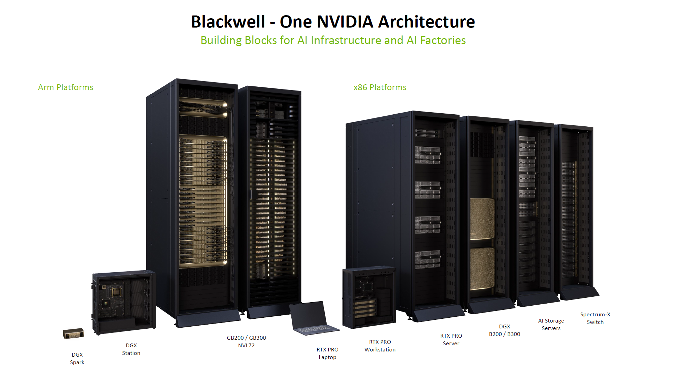


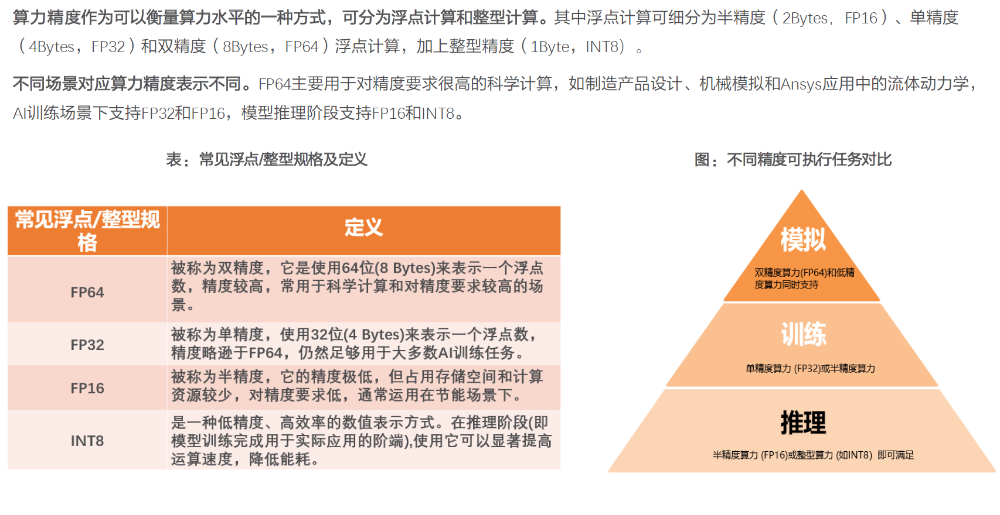

| 精度类型 | NVIDIA A100 80GB (Ampere) | NVIDIA H20 96GB (Hopper中国版) | NVIDIA RTX PRO 6000 (Blackwell) |
|---------|---------------------------|-------------------------------|--------------------------------|
| **FP64 (双精度)** | 9.7 TFLOPS<br>(19.5 TFLOPS，Tensor Core) | ~1 TFLOPS<br>(不支持FP64 TC) | ~2 TFLOPS<br>(1/64 FP32，仅CUDA Core) |
| **FP32 (单精度)** | 19.5 TFLOPS | ~44 TFLOPS | 126.0 TFLOPS |
| **TF32 (Tensor Core)** | 156 / 312* TFLOPS | ~74 / 148* TFLOPS | 251.9 / 503.8* TFLOPS |
| **BF16 (Tensor Core)** | 312 / 624* TFLOPS | ~148 / 296* TFLOPS (推测) | 503.8 / 1007.6* TFLOPS |
| **FP16 (Tensor Core)** | 312 / 624* TFLOPS | 148 / 296* TFLOPS | 503.8 / 1007.6* TFLOPS |
| **FP8 (E4M3/E5M2)** | 不支持 | ≈300 / 600* TFLOPS (估算) | 1007.6 / 2015.2* TFLOPS |
| **INT8 (Tensor Core)** | 624 / 1248* TOPS | 296 / 592* TOPS | 1007.6 / 2015.2* TOPS |
| **INT4 (Tensor Core)** | 1248 / 2496* TOPS | ≈592 / 1184* TOPS (估算) | 2015.2 / 4030.4* TOPS |
| **FP4 (Tensor Core)** | 不支持 | 不支持 | 2015.2 / 4030.4* TFLOPS |

**注释：**
- 斜杠前为稠密计算性能，斜杠后带*为稀疏加速性能（2:4结构化稀疏）
- TFLOPS = 万亿次浮点运算/秒
- TOPS = 万亿次整数运算/秒


## RTX PRO 6000 vs 6000D: Understanding the Difference

Before diving into the details, it's important to clarify the distinction between two models:

### RTX PRO 6000 (International Version)
- **Target Market**: Microsoft Azure Global (NCv6 series)
- **Full Blackwell Architecture**: GB202 chip with complete feature set
- **Memory**: 96GB GDDR7 ECC
- **Primary Competitor**: NVIDIA L40S
- **Availability**: International Azure regions (East US2, Japan East, Europe, etc.)

### RTX PRO 6000D (China Compliance Version)
- **Target Market**: Microsoft Azure China (21Vianet operated)
- **Architecture**: Blackwell-based (GB202) with compliance modifications
- **Memory**: 84GB GDDR7 ECC (reduced from 96GB)
- **Primary Competitor**: NVIDIA L20
- **Status**: Potential availability in China market
- **Key Difference**: Designed to meet Chinese regulatory requirements while maintaining strong AI inference capabilities

**This document covers both versions:**
- Main sections focus on RTX PRO 6000 for global Azure deployments
- A dedicated section covers RTX PRO 6000D for China-specific scenarios

---

## Introduction & Microsoft Strategic Background
As AI enters the large-model era, inference workloads have shifted toward high concurrency, low latency, and controllable costs as primary goals.  
Microsoft Azure's integrated GPU cloud product — **NCv6 series** — supports three major workload types within one unified VM family:

- **Compute Optimized ** — for light-to-mid AI models inference and SFT
- **General Purpose** — for professional graphics, rendering, and visualization  
- **Memory Optimized** — for multi-user VDI and large-memory visualization  

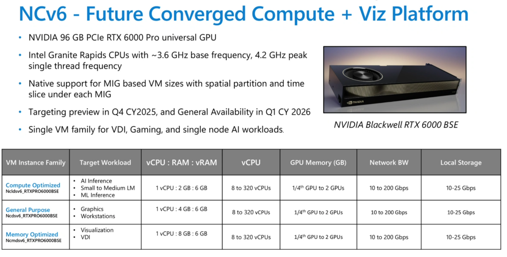

### Strategic Significance

Integrating the NVIDIA Blackwell RTX PRO 6000 BSE into NCv6 brings three key values:

1. **End-to-end workload convergence**: Run AI inference, rendering, simulation, and video processing on a single VM without SKU switching.
2. **Maximized GPU utilization**: MIG multi-instance support enables precise GPU resource partitioning for multi-tenant or mixed workload co-existence.
3. **Software-hardware co-optimization**: Azure delivers GPU driver rtx-pro and pre-integrated environments, reducing integration costs.


**GA Regions(Tentative):** East US2, East US, Japan East, Sweden Central, Australia East, North Europe, UK South, West Europe, South Central US, Germany West Central 

---

## Pricing- Not Final version


---

## Hardware & Architecture: Blackwell + Azure NC Series
### Background
The Blackwell architecture replaces the previous Ada Lovelace generation, delivering step-change improvements in compute cores, memory capacity & bandwidth, and inference precision capabilities.  

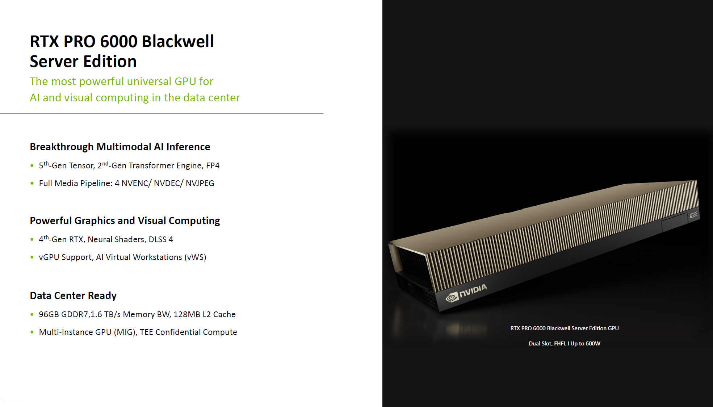


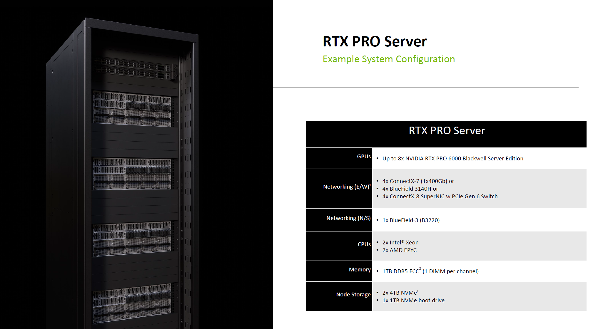


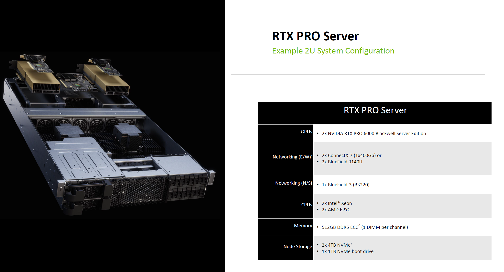

### Performance Data Interpretation

- **Compute Units**: 24,064 CUDA Cores, 752 × 5th-gen Tensor Cores, 188 × 4th-gen RT Cores  
- **Memory System**: 96GB GDDR7 ECC (1.6 TB/s) — double the capacity & bandwidth of the L40S  
- **Inference Engine**: 2nd-gen Transformer Engine capable of FP4/FP8 automatic mixed-precision inference  
- **Media Engine**: 4× NVENC / 4× NVDEC / NVJPEG  
- **Virtualization Capabilities**: Up to 4 MIG slices (24 GB each)

### Differences Explained
Compared to the L40S, the Blackwell BSE's core improvements are doubled memory capacity and bandwidth, and greater Tensor Core precision diversity (added NVFP4).  
These advances directly reduce Host–GPU exchange bottlenecks, which matter especially in Azure’s networked architecture where cross-host latency is higher.

### Impact in Azure Scenarios
- **Compute Optimized SKU**: Can host full 70B model weights + KV Cache within a single GPU (NVFP4).  
- **General Purpose SKU**: RT Cores support ray-traced rendering while performing simultaneous inference tasks.  
- **Memory Optimized SKU**: Under MIG slicing, supports multiple VDI users with 3D graphics.

### Deployment & Operations
- **Drivers & CUDA**: Azure provides official GPU VM rtx-pro containing Blackwell support.  
- **MIG Management**: Select MIG-enabled SKU via Azure Portal or CLI — whole GPU for large jobs, slices for cost reduction in smaller jobs.  
- **Software Stack**: For compute workloads use vLLM/Transformers; for rendering workloads use Omniverse or NVIDIA SDK.

### Cost & ROI
With MIG slicing, customers pay GPU fees according to actual slice usage, avoiding full-card cost waste.

## Quantized Inference Accuracy: NVFP4 vs FP8

RTX PRO 6000 support NVFP4 by default, quantization precision can significantly affect model performance during inference. The chart below shows the accuracy comparison of the **DeepSeek-R1 0528** model under FP8 and NVFP4 quantization:

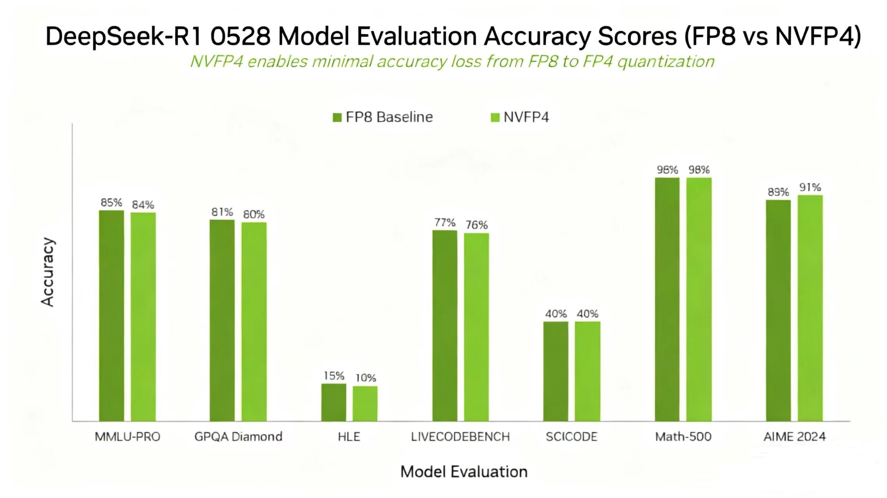

Across multiple tasks, the accuracy difference between NVFP4 and FP8 is minimal:

- **Math-500**: Maintains 98% accuracy, with no loss
- **AIME 2024**: Even slightly higher accuracy than FP8 (91% vs 89%)
- Others like MMLU-PRO and LIVE CODE BENCH drop by only about 1%

This demonstrates that NVFP4 can greatly reduce compute/memory usage while keeping accuracy nearly intact, making it highly suitable for large-scale inference deployment.

For a detailed introduction to NVFP4, see my repo:
*https://github.com/david-xinyuwei/david-share/tree/master/Deep-Learning/NVFP4*

---

## Specification Comparison & Impact on Azure Workloads
### Background
Understanding the differences between Blackwell and L40S helps in selecting the right Azure NCv6 SKU and planning capacity.

### Data Interpretation

| Metric          | RTX PRO 6000 BSE       | L40S                 | Azure Impact |
|-----------------|------------------------|----------------------|--------------|
| CUDA Cores      | 24,064                 | 18,176               | Significantly higher concurrent compute capacity |
| Tensor Cores    | 752                    | 568                  | Stronger FP4/FP8 Transformer inference acceleration |
| RT Cores        | 188                    | 142                  | Improved rendering and physics simulation efficiency |
| Memory          | 96GB ECC GDDR7         | 48GB ECC GDDR6       | Larger models can fit in a single MIG or full GPU |
| Bandwidth       | 1.6 TB/s               | 864 GB/s             | Reduced inference latency, higher throughput |
| Power           | 600W                   | 350W                 | More performance, requires optimized cooling |

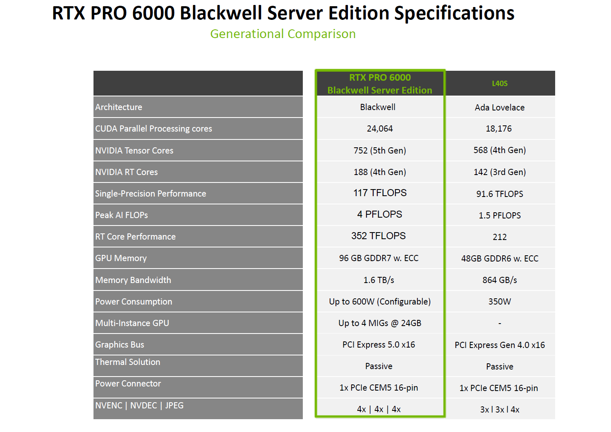

### Differences Explained

- Increased process capability and core volume boost compute density.  
- GDDR7 improves memory frequency & bandwidth, mitigating multi-stream inference saturation points.  
- More RT Cores are suited to complex rendering scenarios.

### Azure Scenario Impacts
- **Latency Equivalence**: At same latency, Blackwell VM can host 3–5× concurrent connections.  
- **Large Model Hosting**: 70B AI models can run on a single card (FP4), reducing multi-card communication cost & complexity.  
- **Rendering Real-time Gains**: Beneficial for design collaboration.


## Workload Analysis

### 1. LLM Inference and SFT
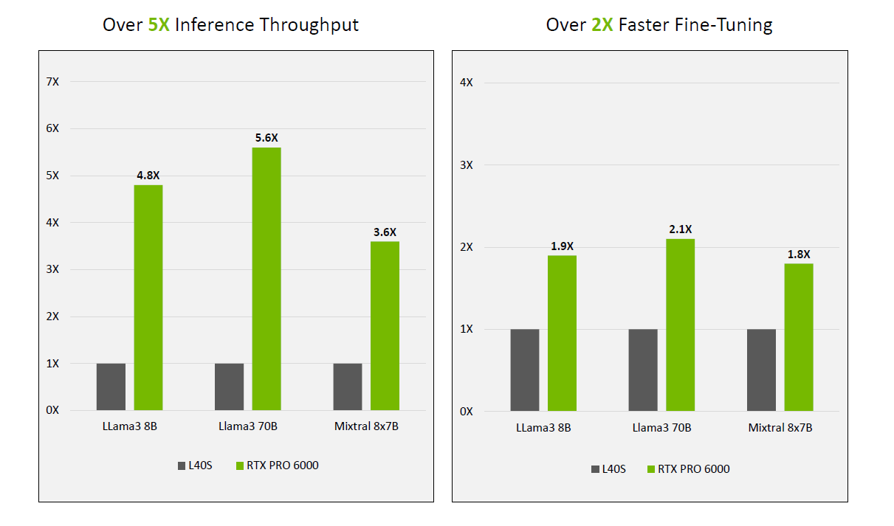

#### Background

LLM inference, due to high concurrency and latency sensitivity, is crucial in cloud services architectures (Azure OpenAI, Copilot, search augmentation). It often requires finding the maximum balance between GPU count and response speed.  
On Azure NCv6 Compute Optimized SKUs, the RTX PRO 6000 BSE’s large memory and FP4 inference path significantly extend this balance point.

#### Performance Data Interpretation
- **Llama3 8B**: +4.8× throughput, 1.9 SFT performance (vs. L40S) 
- **Llama3 70B**: +5.6× throughput, 2.1 SFT performance (vs. L40S)   
- **Mixtral 8×7B**: +3.6× throughput, 1.8 SFT performance (vs. L40S)   

#### Differences Explained
- FP4 weight quantization: greatly reduces memory & bandwidth usage  
- 96GB GDDR7: allows full KV Cache to reside in GPU memory, avoiding Host–GPU swaps  
- 5th-gen Tensor Core FP8/FP4 mixed support: Transformer Engine auto precision scheduling  
- Bandwidth doubled: lower multi-stream concurrent latency

### 2 Graphics & Visualization
 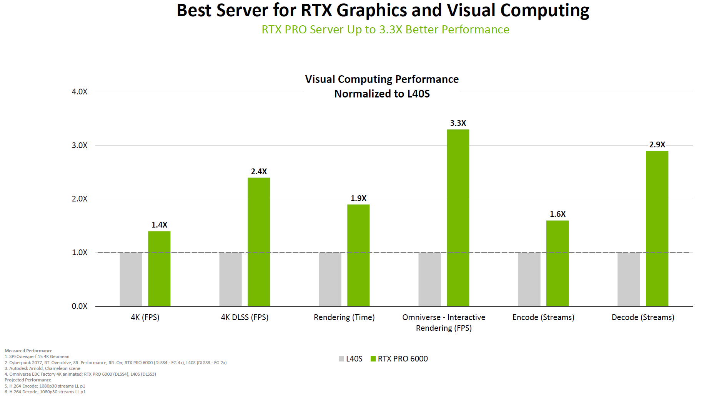

#### Background
Visual workloads in Azure cloud (Omniverse, film rendering, design visualization) require high RT Core performance, low-latency frame rendering, and high-bandwidth media encode/decode. These used to need dedicated rendering SKUs; now, in NCv6 General Purpose (NC…gs_v6), they can co-exist with inference.

#### Performance Data
- Pure performance increase: up to +3.3× over L40S
- In interactive rendering scenarios like Omniverse, FPS increases and frame generation latency decreases simultaneously.

#### Differences Explained
- 4th-gen RT Core yields higher ray-tracing throughput
- PCIe Gen6 and doubled bandwidth reduce texture swap latency in large-scene rendering
- Media engines doubled (4× NVENC / 4× NVDEC) → higher encode/decode throughput

#### Azure Impacts
- General Purpose SKUs can run Omniverse, 3D modeling, or render farms directly
- Crowdsourced rendering can leverage Azure Batch to save peak resource costs
- Multi-stream video encoding can run alongside inference tasks to boost overall utilization

### 3 Industrial Simulation & Synthetic Data
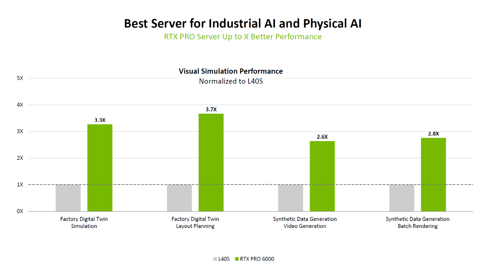

#### Background
Industrial simulation (digital twin, physics simulation) and synthetic data generation for autonomous driving/robotics require both graphics rendering and physics computation. These were traditionally distributed between HPC clusters and rendering nodes. NCv6 Memory Optimized (NC…ms_v6) unifies these workloads.

#### Performance Data
- Digital twin simulation: +3.3×  over L40S
- Layout planning: +3.7×  over L40S
- Synthetic video generation: +2.6×  over L40S
- Batch rendering generation: +2.8× over L40S

#### Differences Explained
- Blackwell’s doubled memory & bandwidth handle large scene files  
- RT Core + Tensor Core coordination accelerates physics sims with AI components  
- Multiple NVENC paths ensure video output without bottlenecks

#### Azure Impacts
- Memory Optimized SKU can run CAD/CAE-level simulation and directly produce synthetic training data  
- MIG slices possible to run varied simulation flows for different users/tasks  
- Render output can directly upload to Azure Blob Storage or Data Lake for downstream training

---

### 4 Vision AI Agents
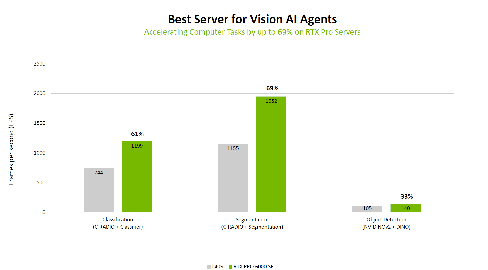

#### Background
Vision AI Agents perform perception tasks (classification, segmentation, detection) through multi-model collaboration. These workloads require both throughput and low latency, usually for office automation, quality inspection, and auto labeling.

#### Performance Data
- Classification: +61%  over L40S
- Segmentation: +69%  over L40S
- Detection: +33% over L40S

#### Differences Explained
- Blackwell Tensor Cores accelerate both CNN and Transformer architectures  
- Increased memory reduces overflow in large-resolution image batch processing

#### Azure Impacts
- Compute Optimized SKU can run multiple inference processes in a single MIG slice for different departments/applications  
- Integrate with Azure AI Vision and Cognitive Services for direct cloud deployment

---

### 5 Generative Models
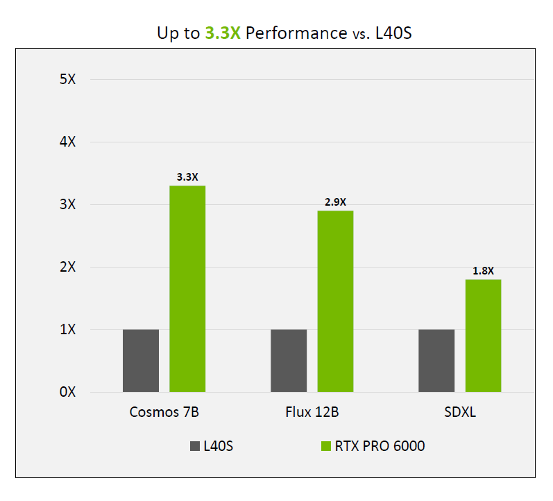

#### Background
Multi-modal generation on Azure (text-to-image, text-to-video) requires high memory, media engines, and ML acceleration combined. Blackwell’s specs fit well in this space.

#### Performance Data
- Cosmos 7B: +3.3×  over L40S
- Flux 12B: +2.9×  over L40S
- SDXL: +1.8× over L40S

#### Azure Impacts
- General Purpose SKU can co-locate generation tasks with rendering  
- Output flows directly into Azure Blob/Media Services pipelines

## SFT Performance Comparison with A100 / H100

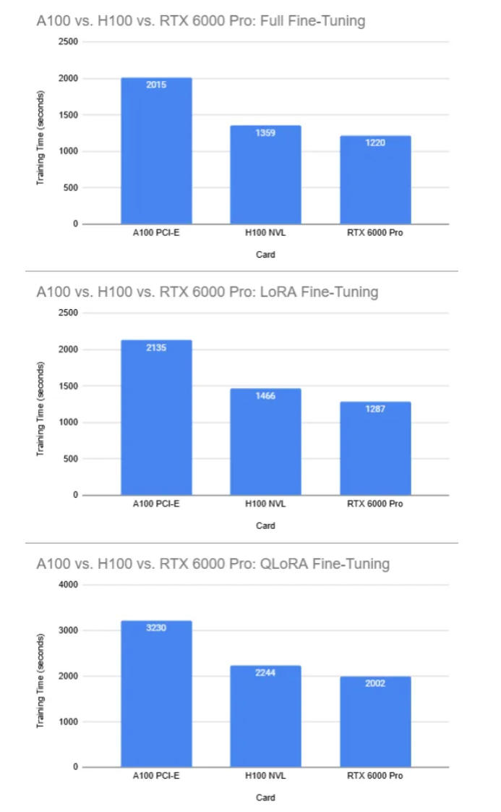

Using Qwen3-8B with different fine-tuning approaches:

- **Full fine-tuning**: RTX 6000 Pro is ~10% faster than H100, ~50% faster than A100
- **LoRA** fine-tuning: Also leads in performance
- **QLoRA** fine-tuning: Maintains its advantage

In single-GPU training scenarios, the RTX 6000 Pro achieves near-H100 speed at a much lower cost.


#### Demo code for SFT on RTX/H100/A100

You could run following code on jupyter file cells.

Install PyTorch nightly for CUDA >= 12.8

```shell
!pip install --pre torch torchvision torchaudio --index-url https://download.pytorch.org/whl/nightly/cu128
!pip install ninja
!pip install flash_attn --no-build-isolation
!pip install --upgrade transformers bitsandbytes peft accelerate datasets trl hf_transfer hf_xet
```

Install vLLM for TX Pro 6000D:

```shell
!git clone https://github.com/vllm-project/vllm.git
%cd vllm
!python use_existing_torch.py
!pip install -r requirements/build.txt
!pip install setuptools_scm
!mkdir ./tmp
!MAX_JOBS=10 CCACHE_DIR=./tmp python setup.py develop
```

Download models:

```shell
!HF_HUB_ENABLE_HF_TRANSFER=1 huggingface-cli download Qwen/Qwen3-8B-Base
```

 **Fine-Tuning Code**

```python
import torch, os, multiprocessing
from datasets import load_dataset
from peft import LoraConfig, prepare_model_for_kbit_training
from transformers import (
    AutoModelForCausalLM,
    AutoTokenizer,
    BitsAndBytesConfig,
    set_seed
)
from trl import SFTTrainer, SFTConfig
set_seed(1234)

compute_dtype = torch.bfloat16
attn_implementation = 'flash_attention_2'

def fine_tune(model_name, batch_size=1, gradient_accumulation_steps=32, LoRA=False, QLoRA=False):

    tokenizer = AutoTokenizer.from_pretrained(model_name)
    tokenizer.eos_token = "<|im_end|>"
    ds_train = load_dataset("allenai/tulu-3-sft-olmo-2-mixture-0225", split="train[:15000]")

    def process(row):
        row["text"] = tokenizer.apply_chat_template(row["messages"], tokenize=False, add_generation_prompt=False, enable_thinking=False)
        return row

    ds_train = ds_train.map(
        process,
        num_proc= multiprocessing.cpu_count(),
        load_from_cache_file=False,
    )

    print(ds_train[0]['text'])

    ds_train = ds_train.remove_columns(["messages"])

    if QLoRA:
        bnb_config = BitsAndBytesConfig(
                load_in_4bit=True,
                bnb_4bit_quant_type="nf4",
                bnb_4bit_compute_dtype=compute_dtype,
                bnb_4bit_use_double_quant=True,
        )
        model = AutoModelForCausalLM.from_pretrained(
                  model_name, quantization_config=bnb_config, device_map={"": 0}, attn_implementation=attn_implementation
        )
        model = prepare_model_for_kbit_training(model, gradient_checkpointing_kwargs={'use_reentrant':True})
    else:
        model = AutoModelForCausalLM.from_pretrained(
                  model_name, device_map={"": 0}, torch_dtype=compute_dtype, attn_implementation=attn_implementation
        )
        model.gradient_checkpointing_enable(gradient_checkpointing_kwargs={'use_reentrant':True})


    if LoRA or QLoRA:
        peft_config = LoraConfig(
                lora_alpha=32,
                lora_dropout=0.05,
                r=32,
                bias="none",
                task_type="CAUSAL_LM",
                target_modules= ['k_proj', 'q_proj', 'v_proj', 'o_proj', "gate_proj", "down_proj", "up_proj"],
                modules_to_save = ["embed_tokens", "lm_head"]
        )
    else:
      peft_config = None

    if LoRA:
        output_dir = "./LoRA/"
    elif QLoRA:
        output_dir = "./QLoRA/"
    else:
        output_dir = "./FFT/"

    training_arguments = SFTConfig(
        output_dir=output_dir,
        optim="adamw_8bit",
        per_device_train_batch_size=batch_size,
        gradient_accumulation_steps=gradient_accumulation_steps,
        log_level="debug",
        save_strategy="no",
        logging_steps=25,
        learning_rate=1e-5,
        bf16 = True,
        max_steps=100,
        warmup_ratio=0.1,
        lr_scheduler_type="linear",
        dataset_text_field="text",
        max_seq_length=4096,
        padding_free=True,
        report_to="none"
    )

    trainer = SFTTrainer(
          model=model,
          train_dataset=ds_train,
          peft_config=peft_config,
          processing_class=tokenizer,
          args=training_arguments,
    )

    #--code by Unsloth: https://colab.research.google.com/drive/1Ys44kVvmeZtnICzWz0xgpRnrIOjZAuxp?usp=sharing#scrollTo=pCqnaKmlO1U9

    gpu_stats = torch.cuda.get_device_properties(0)
    start_gpu_memory = round(torch.cuda.max_memory_reserved() / 1024 / 1024 / 1024, 3)
    max_memory = round(gpu_stats.total_memory / 1024 / 1024 / 1024, 3)
    print(f"GPU = {gpu_stats.name}. Max memory = {max_memory} GB.")
    print(f"{start_gpu_memory} GB of memory reserved.")

    trainer_ = trainer.train()


    used_memory = round(torch.cuda.max_memory_reserved() / 1024 / 1024 / 1024, 3)
    used_memory_for_trainer= round(used_memory - start_gpu_memory, 3)
    used_percentage = round(used_memory         /max_memory*100, 3)
    trainer_percentage = round(used_memory_for_trainer/max_memory*100, 3)
    print(f"{trainer_.metrics['train_runtime']} seconds used for training.")
    print(f"{round(trainer_.metrics['train_runtime']/60, 2)} minutes used for training.")
    print(f"Peak reserved memory = {used_memory} GB.")
    print(f"Peak reserved memory for training = {used_memory_for_trainer} GB.")
    print(f"Peak reserved memory % of max memory = {used_percentage} %.")
    print(f"Peak reserved memory for training % of max memory = {trainer_percentage} %.")
    print("-----")
    #----
```

Run the same test code on three different GPU-based virtual machines  (VMs), using various combinations of the following four parameter  settings:

- `batch_size`
- `gradient_accumulation_steps`
- `LoRA` (Low-Rank Adaptation)
- `QLoRA` (Quantized Low-Rank Adaptation)

These combinations are used to evaluate the performance and  effectiveness of different GPU hardware under multiple training  configurations.

```python
fine_tune("Qwen/Qwen3-8B-Base", batch_size=4, gradient_accumulation_steps=32, LoRA=False, QLoRA=False)
```

```python
fine_tune("Qwen/Qwen3-8B-Base", batch_size=4, gradient_accumulation_steps=32, LoRA=True, QLoRA=False)
```

```python
fine_tune("Qwen/Qwen3-8B-Base", batch_size=4, gradient_accumulation_steps=32, LoRA=False, QLoRA=True)
```


---

## Final Summary and Recommendations

### Overall Assessment
The NVIDIA Blackwell RTX PRO 6000 BSE in Azure NCv6 represents a major step forward for cloud-based GPU workloads, delivering high performance, flexible workload deployment, and strong cost efficiency within Microsoft’s latest converged VM architecture.

**Key Advantages**
1. **High FP4 Tensor Core performance** — exceptionally strong in quantized inference for LLMs and other transformer-based models.
2. **Large memory capacity (96GB GDDR7 ECC)** — enables single-GPU hosting of large models (up to 70B parameters) with KV Cache fully in-memory.
3. **Broad workload competency** — outperforms H100 and A100 in many single-GPU inference and SFT tasks.
4. **Cost efficiency** — ideal for single-GPU or small/medium workloads where NVL ultra-high bandwidth is not essential.
5. **Versatile deployment** — Compute Optimized, General Purpose, and Memory Optimized SKUs allow unified management of AI inference, rendering, and VDI under one VM family.

### Recommended Workload Strategies
- **Mixed Schedule**:  
  - Rendering / VDI workloads  
  - Inference / SFT tasks  
- **Image Management**: Centralize GPU images, drivers, CUDA toolkit, and libraries in Azure Compute Gallery for consistency across teams.
- **Network Optimization**: Keep inference and rendering tasks in the same Azure region to capitalize on low-latency networking.
- **Cost Control**:  
  - Use 1/4 MIG slices for lightweight jobs to lower hourly billing.  
  - Batch inference and synthetic data generation to minimize idle GPU periods.
- **Monitoring & SLA**: Track KPIs — throughput, latency, memory utilization, encoder load — via Azure Monitor + NVIDIA DCGM to ensure SLAs.

### Best Fit Use Cases
- **Single/Double-GPUs large-model inference** — leveraging NVFP4 quantization for maximum throughput per card.
- **Single/Double-GPU fine-tuning** — including full fine-tuning or parameter-efficient methods like LoRA/QLoRA.
- **Cost-sensitive applications** — such as enterprise LLM APIs, media pipelines, and simulation workloads that do not need NVL extreme bandwidth.


### Azure No Support

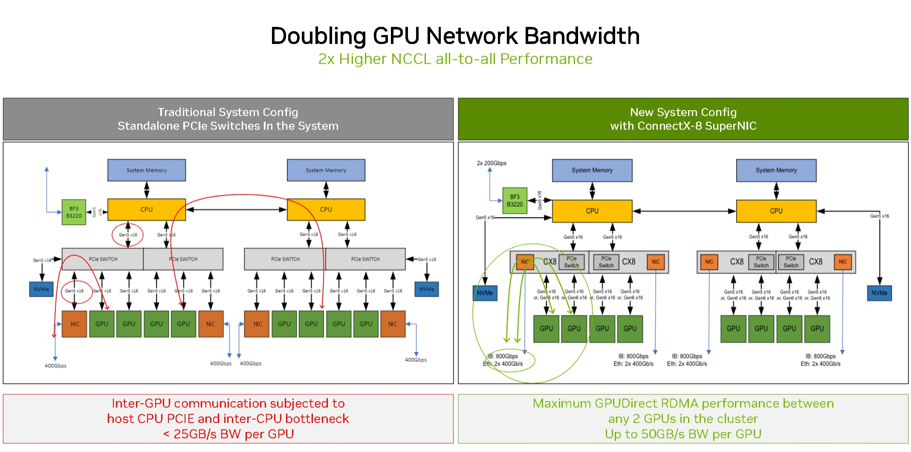

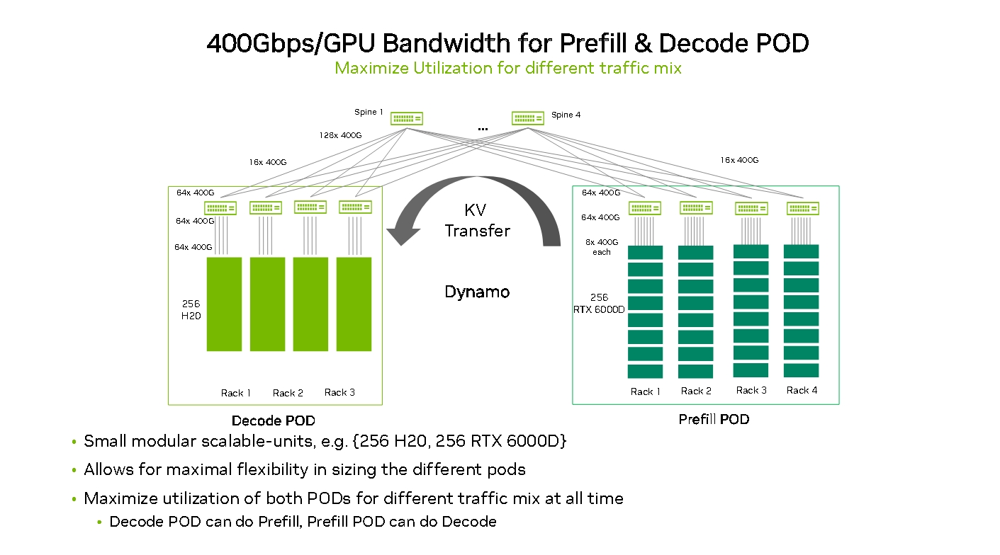

# RTX PRO 6000D: China Market

## Overview & Market Context

The **RTX PRO 6000D** is a compliance-modified version of the Blackwell architecture specifically designed for the Chinese market. While Microsoft Azure global regions deploy the full RTX PRO 6000, Azure China (operated by 21Vianet) may offer the 6000D variant to meet local regulatory requirements.

**Key Market Positioning:**
- Designed for Azure China cloud infrastructure
- Maintains strong AI inference and training capabilities
- Optimized for cost-effective large-model deployment
- Compliance-focused alternative to international high-end GPUs

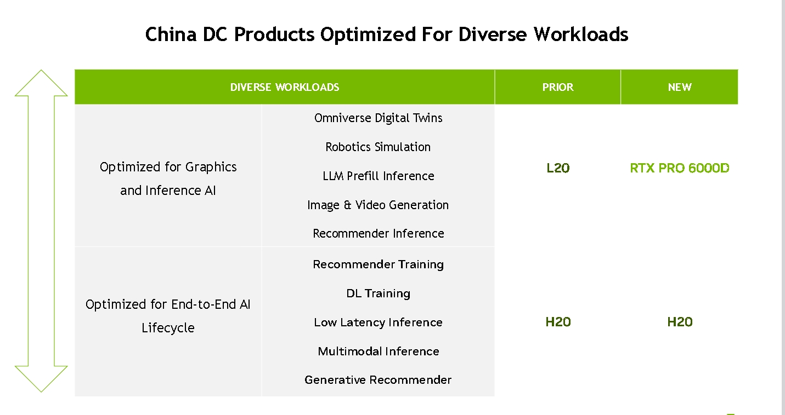

---

## 1. Core Architecture and Specifications Comparison

The RTX Pro 6000D is based on NVIDIA's **Blackwell architecture (GB202 chip)** and is positioned in the professional compute market. Compared to the previous **L20**, it delivers significant improvements in compute throughput, memory capacity, and I/O bandwidth.

### Comprehensive Four-GPU Comparison: RTX PRO 6000D vs L20 vs L40S vs RTX PRO 6000

The following table provides a detailed hardware comparison of all four NVIDIA GPUs:

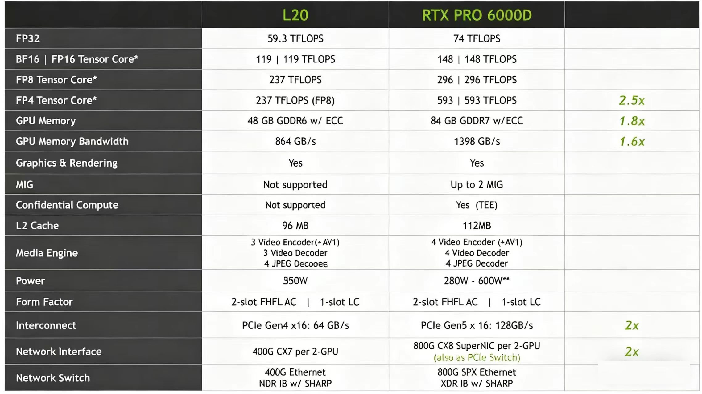

| **Specification** | **RTX PRO 6000D** | **L20** | **L40S** | **RTX PRO 6000 BSE** |
|-------------------|-------------------|---------|----------|---------------------|
| **Architecture** | Blackwell | Ada Lovelace | Ada Lovelace | Blackwell |
| **CUDA Cores** | Not disclosed | Not disclosed | 18,176 | 24,064 |
| **Tensor Cores** | Not disclosed | Not disclosed | 568 (4th Gen) | 752 (5th Gen) |
| **RT Cores** | Not disclosed | Not disclosed | 142 (3rd Gen) | 188 (4th Gen) |
| **FP32 Performance** | 74 TFLOPS | 59.3 TFLOPS | 91.6 TFLOPS | 117 TFLOPS |
| **BF16/FP16 Tensor** | 148 / 148 TFLOPS | 119 / 119 TFLOPS | Not disclosed | Not disclosed |
| **FP8 Tensor Core** | 296 TFLOPS | 237 TFLOPS | Not disclosed | Not disclosed |
| **FP4 Tensor Core** | 593 TFLOPS | 237 TFLOPS | Not disclosed | Not disclosed |
| **Peak AI FLOPs** | Not disclosed | Not disclosed | 1.5 PFLOPS | 4 PFLOPS |
| **RT Core Perf.** | Not disclosed | Not disclosed | 212 TFLOPS | 352 TFLOPS |
| **GPU Memory** | **84GB GDDR7 ECC** | **48GB GDDR6 ECC** | **48GB GDDR6 ECC** | **96GB GDDR7 ECC** |
| **Memory Bandwidth** | **1,398 GB/s** | **864 GB/s** | **864 GB/s** | **1.6 TB/s** |
| **L2 Cache** | 112 MB | 96 MB | Not disclosed | Not disclosed |
| **MIG Support** | Up to 2 MIG | Not supported | Not supported | Up to 4 MIG @ 24GB |
| **Confidential Compute** | Supported (TEE) | Not supported | Not disclosed | Not disclosed |
| **Media Engine** | 4× NVENC / 4× NVDEC / 4× JPEG | 3× NVENC / 3× NVDEC / 4× JPEG | 3× NVENC / 3× NVDEC / 4× JPEG | 4× NVENC / 4× NVDEC / 4× JPEG |
| **PCIe Interface** | PCIe 5.0 x16 (128 GB/s) | PCIe 4.0 x16 (64 GB/s) | PCIe 4.0 x16 | PCIe 5.0 x16 |
| **Power Consumption** | 280W - 600W | 350W | 350W | Up to 600W (Configurable) |
| **Power Connector** | Not disclosed | Not disclosed | 1× PCIe CEM5 16-pin | 1× PCIe CEM5 16-pin |
| **Form Factor** | 2-slot FHFL AC / 1-slot LC | 2-slot FHFL AC / 1-slot LC | Passive | Passive |

---

## 2. Qwen3 Large Model Inference Performance Comparison

### Scenario 1: Qwen3-30B Inference

**Configuration:**
- **RTX 6000D**: FP4 weights + FP8 attention, IFB concurrency ≈ 128
- **L20**: FP8 weights + FP8 attention, IFB concurrency ≈ 32

**Results:**
- **Single-GPU throughput improvement**: **3.4×**
- **Performance per Capex improvement**: **2.4×**

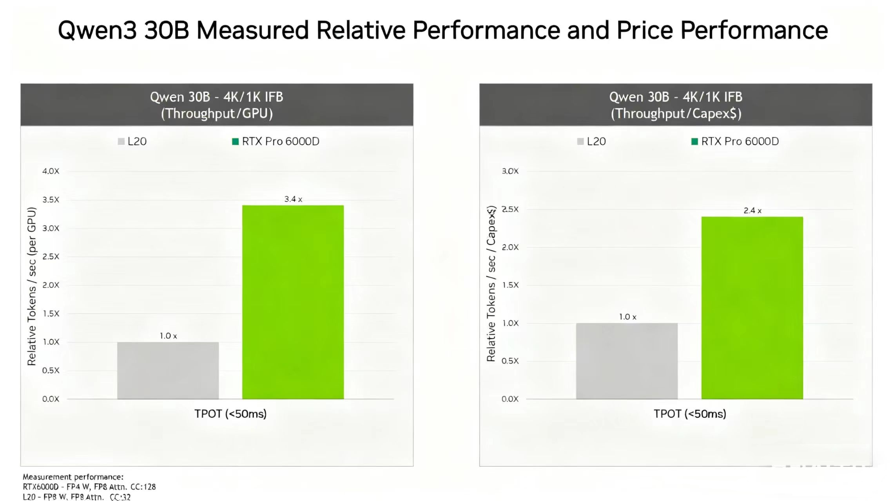

---

### Scenario 2: Qwen3-32B Inference

**Configuration:**
- **RTX 6000D**: Single-GPU run, IFB ≈ 32
- **L20**: Memory insufficient → requires **2-GPU tensor parallelism** (introduces inter-GPU communication overhead), IFB ≈ 8–16

**Results:**
- **Single-GPU throughput improvement**: **6.4×**
- **Performance per Capex improvement**: **4.6×**

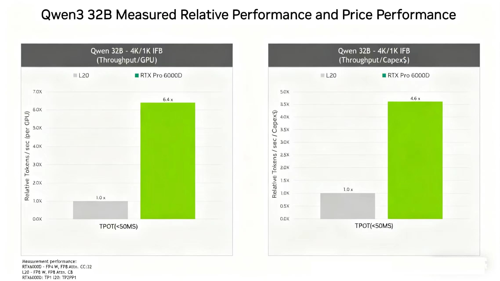

**Key Insight:**
With **large memory + FP4 Tensor Core acceleration**, the RTX 6000D holds a clear advantage in high-concurrency inference workloads, especially for models that would otherwise require multi-GPU deployment on L20.


## 3. RTX PRO 6000D: Summary and Recommendations

### Key Advantages

1. **High FP4 Tensor Core performance** — powerful in quantized inference, achieving 2.5× improvement over L20
2. **Large memory (84GB GDDR7 ECC)** — enables large-model single-GPU runs, avoiding multi-GPU complexity
3. **Superior performance in inference** — 3.4×–6.4× throughput improvement over L20 in Qwen3 scenarios
4. **Competitive training performance** — near-H100 performance in SFT tasks
5. **Strong cost advantage** — especially suitable for single-GPU or small-scale jobs in Azure China

### Considerations

- **Power consumption range (280W–600W)** — requires robust cooling under high loads
- **Multi-GPU efficiency** — less optimized compared to H100 NVL for large-scale clusters
- **Compliance modifications** — 84GB vs 96GB memory compared to international version

### Best Suited For

1. **Single-GPU large-model inference** — leveraging NVFP4 quantization for Chinese LLMs (Qwen, DeepSeek, etc.)
2. **Single-GPU fine-tuning** — full fine-tuning, LoRA, or QLoRA approaches
3. **Cost-sensitive Azure China deployments** — where HBM ultra-high bandwidth is not essential
4. **Compliance-required scenarios** — enterprises needing local regulatory compliance

### Deployment Recommendations for Azure China

- **Workload**: Prioritize inference over training; leverage FP4 quantization
- **Model Selection**: Chinese LLMs (Qwen3, DeepSeek) optimized for NVFP4
- **Scaling Strategy**: Start with single-GPU deployments; scale horizontally rather than vertically
- **Cost Optimization**: Use NVFP4 to maximize throughput per GPU, reducing total GPU count needed
- **Monitoring**: Track memory usage, inference latency, and thermal performance


## Questions to PG

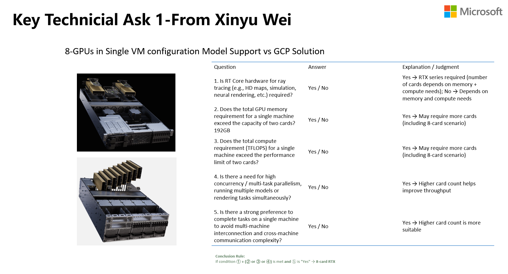


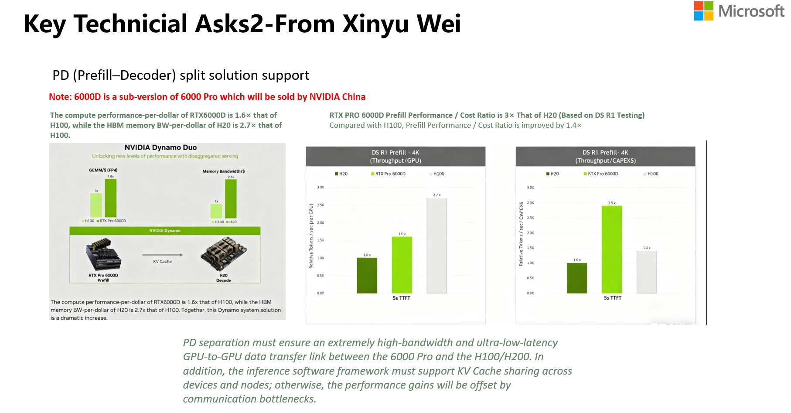


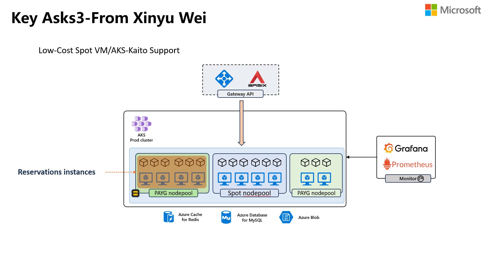


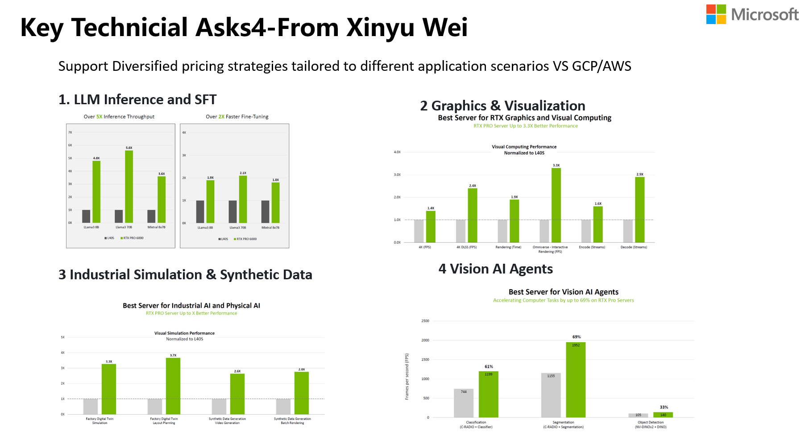


### **Key Technical Asks**5-From Xinyu Wei

From NVIDIA:


**From GCP:**

[Https://docs.cloud.google.com/compute/docs/accelerator-optimized-machines#g4-series](https://docs.cloud.google.com/compute/docs/accelerator-optimized-machines#g4-series)

*G4 peer-to-peer (P2P) communication*

*G4 instances enhance multi-GPU workload performance by using direct GPU peer-to-peer (P2P) communication. This capability allows GPUs that attach to the same G4 instance to exchange data directly over the PCIe bus, bypassing the need to transfer data through the CPU's main memory. This direct path reduces latency, lowers CPU utilization, and increases the effective bandwidth between GPUs. P2P communication significantly accelerates multi-GPU applications such as machine learning (ML) training and high performance computing (HPC).*

*This feature typically requires no modifications to your application code. You only need to configure NCCL to use P2P. To configure NCCL, before you run your workloads, set the* *`NCCL_P2P_LEVEL`**[ environment variable](https://docs.nvidia.com/deeplearning/nccl/user-guide/docs/env.html#nccl-p2p-level)* *on your G4 instance based on the machine type:*

- *For G4 instances with 2 or 4 GPUs (g4-standard-96, g4-standard-192): set NCCL_P2P_LEVEL=PHB*
- *For G4 instances with 8 GPUs (g4-standard-384): set NCCL_P2P_LEVEL=SYS*

The info I want to get from BG is quite simple.

On our 2 GPUs Azure NCv6 RTX 6000 VM, whether 2 GPU could communication with each other via NCCL_P2P_LEVEL=PHB(speed is **50-60 GB/s**), if it is, we do not has competitive disadvantage in the same 2 GPU senarios with GCP.


## Key Technical Asks6-From Xinyu Wei

Test env of RTX Pro 6000
