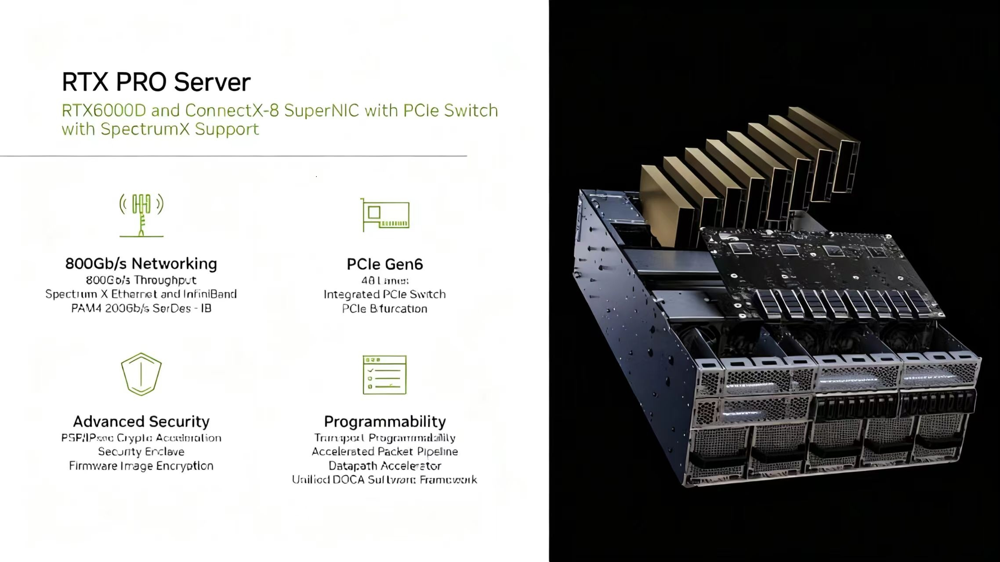

# In-depth Analysis of RTX Pro 6000D: A High-Value Choice for Single-GPU Large Model Training and Inference

As large models continue to demand more GPU memory and computation in both training and inference, achieving **high performance, low latency, and great cost efficiency** in **single-GPU scenarios** has become a key concern for many teams.
This article combines multiple real-world benchmark results to comprehensively analyze the **RTX Pro 6000D** — its performance characteristics, architectural advantages, and behavior across various tasks.

------

## 1. Core Architecture and Specifications Comparison

The **RTX Pro 6000D** is based on NVIDIA’s Blackwell architecture (GB202 chip) and is positioned in the professional compute market. Compared to the previous L20, it delivers significant improvements in compute throughput, memory capacity, and I/O bandwidth.

**Key hardware comparison:**


The most notable highlight of the RTX Pro 6000D is its **2.5× improvement in FP4 Tensor Core performance**, which delivers a major efficiency boost in quantized inference scenarios. In addition, **84GB GDDR7 ECC memory** provides strong capability for running large-parameter models entirely on a single GPU.

------

## 2. Quantized Inference Accuracy: NVFP4 vs FP8

Quantization precision can significantly affect model performance during inference. The chart below shows the accuracy comparison of the **DeepSeek-R1 0528** model under FP8 and NVFP4 quantization:


Across multiple tasks, the accuracy difference between NVFP4 and FP8 is minimal:

- **Math-500**: Maintains 98% accuracy, with no loss
- **AIME 2024**: Even slightly higher accuracy than FP8 (91% vs 89%)
- Others like MMLU-PRO and LIVE CODE BENCH drop by only about 1%

This demonstrates that NVFP4 can greatly reduce compute/memory usage while keeping accuracy nearly intact, making it highly suitable for large-scale inference deployment.

For a detailed introduction to NVFP4, see my repo:
*https://github.com/david-xinyuwei/david-share/tree/master/Deep-Learning/NVFP4*

------

## 3. Qwen3 Large Model Inference Performance Comparison

### Qwen3-30B Scenario

- **Configuration**:
  - RTX 6000D: FP4 weights + FP8 attention, IFB concurrency ≈ 128
  - L20: FP8 weights + FP8 attention, IFB concurrency ≈ 32
- **Results**:
  - Single-GPU throughput improvement: **3.4×**
  - Performance per Capex improvement: **2.4×**


------

### Qwen3-32B Scenario

- **Configuration**:
  - RTX 6000D: Single-GPU run, IFB ≈ 32
  - L20: Memory insufficient → requires 2-GPU tensor parallelism (introduces inter-GPU communication overhead), IFB ≈ 8–16
- **Results**:
  - Single-GPU throughput improvement: **6.4×**
  - Performance per Capex improvement: **4.6×**


Clearly, with **large memory + FP4 Tensor Core acceleration**, the RTX 6000D holds a clear advantage in high-concurrency inference workloads.

------

## 4. RTX PRO Server System Integration



The RTX Pro 6000D, combined with **ConnectX-8 SuperNIC** and a PCIe Switch, forms a server platform capable of:

- **800Gb/s network bandwidth** (SpectrumX Ethernet & InfiniBand)
- **PCIe Gen6 x48 lanes** high-speed interconnect
- **Hardware-level security** (crypto acceleration, firmware image encryption)
- **Programmable network pipeline and data-path acceleration**

This design makes the RTX Pro series suitable not only for single-GPU workloads but also scalable to professional multi-GPU systems.

------

## 5. Training Performance Comparison with A100 / H100


Using Qwen3-8B with different fine-tuning approaches:

- **Full fine-tuning**: RTX 6000 Pro is ~10% faster than H100, ~50% faster than A100
- **LoRA** fine-tuning: Also leads in performance
- **QLoRA** fine-tuning: Maintains its advantage

Rental pricing comparison:

- A100 PCIe: $1.64/h
- H100 NVL: $2.79/h
- RTX 6000 Pro: $1.79/h

In single-GPU training scenarios, the RTX 6000 Pro achieves near-H100 speed at a much lower cost.


#### Demo code for SFT on RTX/H100/A100

You could run following code on jupyter file cells.

Install PyTorch nightly for CUDA >= 12.8

```
!pip install --pre torch torchvision torchaudio --index-url https://download.pytorch.org/whl/nightly/cu128
!pip install ninja
!pip install flash_attn --no-build-isolation
!pip install --upgrade transformers bitsandbytes peft accelerate datasets trl hf_transfer hf_xet
```

Install vLLM for TX Pro 6000D:

```
!git clone https://github.com/vllm-project/vllm.git
%cd vllm
!python use_existing_torch.py
!pip install -r requirements/build.txt
!pip install setuptools_scm
!mkdir ./tmp
!MAX_JOBS=10 CCACHE_DIR=./tmp python setup.py develop
```

Download models:

```
!HF_HUB_ENABLE_HF_TRANSFER=1 huggingface-cli download Qwen/Qwen3-8B-Base
```

 **Fine-Tuning Code**

```
import torch, os, multiprocessing
from datasets import load_dataset
from peft import LoraConfig, prepare_model_for_kbit_training
from transformers import (
    AutoModelForCausalLM,
    AutoTokenizer,
    BitsAndBytesConfig,
    set_seed
)
from trl import SFTTrainer, SFTConfig
set_seed(1234)

compute_dtype = torch.bfloat16
attn_implementation = 'flash_attention_2'

def fine_tune(model_name, batch_size=1, gradient_accumulation_steps=32, LoRA=False, QLoRA=False):

    tokenizer = AutoTokenizer.from_pretrained(model_name)
    tokenizer.eos_token = "<|im_end|>"
    ds_train = load_dataset("allenai/tulu-3-sft-olmo-2-mixture-0225", split="train[:15000]")

    def process(row):
        row["text"] = tokenizer.apply_chat_template(row["messages"], tokenize=False, add_generation_prompt=False, enable_thinking=False)
        return row

    ds_train = ds_train.map(
        process,
        num_proc= multiprocessing.cpu_count(),
        load_from_cache_file=False,
    )

    print(ds_train[0]['text'])

    ds_train = ds_train.remove_columns(["messages"])

    if QLoRA:
        bnb_config = BitsAndBytesConfig(
                load_in_4bit=True,
                bnb_4bit_quant_type="nf4",
                bnb_4bit_compute_dtype=compute_dtype,
                bnb_4bit_use_double_quant=True,
        )
        model = AutoModelForCausalLM.from_pretrained(
                  model_name, quantization_config=bnb_config, device_map={"": 0}, attn_implementation=attn_implementation
        )
        model = prepare_model_for_kbit_training(model, gradient_checkpointing_kwargs={'use_reentrant':True})
    else:
        model = AutoModelForCausalLM.from_pretrained(
                  model_name, device_map={"": 0}, torch_dtype=compute_dtype, attn_implementation=attn_implementation
        )
        model.gradient_checkpointing_enable(gradient_checkpointing_kwargs={'use_reentrant':True})


    if LoRA or QLoRA:
        peft_config = LoraConfig(
                lora_alpha=32,
                lora_dropout=0.05,
                r=32,
                bias="none",
                task_type="CAUSAL_LM",
                target_modules= ['k_proj', 'q_proj', 'v_proj', 'o_proj', "gate_proj", "down_proj", "up_proj"],
                modules_to_save = ["embed_tokens", "lm_head"]
        )
    else:
      peft_config = None

    if LoRA:
        output_dir = "./LoRA/"
    elif QLoRA:
        output_dir = "./QLoRA/"
    else:
        output_dir = "./FFT/"

    training_arguments = SFTConfig(
        output_dir=output_dir,
        optim="adamw_8bit",
        per_device_train_batch_size=batch_size,
        gradient_accumulation_steps=gradient_accumulation_steps,
        log_level="debug",
        save_strategy="no",
        logging_steps=25,
        learning_rate=1e-5,
        bf16 = True,
        max_steps=100,
        warmup_ratio=0.1,
        lr_scheduler_type="linear",
        dataset_text_field="text",
        max_seq_length=4096,
        padding_free=True,
        report_to="none"
    )

    trainer = SFTTrainer(
          model=model,
          train_dataset=ds_train,
          peft_config=peft_config,
          processing_class=tokenizer,
          args=training_arguments,
    )

    #--code by Unsloth: https://colab.research.google.com/drive/1Ys44kVvmeZtnICzWz0xgpRnrIOjZAuxp?usp=sharing#scrollTo=pCqnaKmlO1U9

    gpu_stats = torch.cuda.get_device_properties(0)
    start_gpu_memory = round(torch.cuda.max_memory_reserved() / 1024 / 1024 / 1024, 3)
    max_memory = round(gpu_stats.total_memory / 1024 / 1024 / 1024, 3)
    print(f"GPU = {gpu_stats.name}. Max memory = {max_memory} GB.")
    print(f"{start_gpu_memory} GB of memory reserved.")

    trainer_ = trainer.train()


    used_memory = round(torch.cuda.max_memory_reserved() / 1024 / 1024 / 1024, 3)
    used_memory_for_trainer= round(used_memory - start_gpu_memory, 3)
    used_percentage = round(used_memory         /max_memory*100, 3)
    trainer_percentage = round(used_memory_for_trainer/max_memory*100, 3)
    print(f"{trainer_.metrics['train_runtime']} seconds used for training.")
    print(f"{round(trainer_.metrics['train_runtime']/60, 2)} minutes used for training.")
    print(f"Peak reserved memory = {used_memory} GB.")
    print(f"Peak reserved memory for training = {used_memory_for_trainer} GB.")
    print(f"Peak reserved memory % of max memory = {used_percentage} %.")
    print(f"Peak reserved memory for training % of max memory = {trainer_percentage} %.")
    print("-----")
    #----
```

Run the same test code on three different GPU-based virtual machines  (VMs), using various combinations of the following four parameter  settings:

- `batch_size`
- `gradient_accumulation_steps`
- `LoRA` (Low-Rank Adaptation)
- `QLoRA` (Quantized Low-Rank Adaptation)

These combinations are used to evaluate the performance and  effectiveness of different GPU hardware under multiple training  configurations.

```
fine_tune("Qwen/Qwen3-8B-Base", batch_size=4, gradient_accumulation_steps=32, LoRA=False, QLoRA=False)
```

```
fine_tune("Qwen/Qwen3-8B-Base", batch_size=4, gradient_accumulation_steps=32, LoRA=True, QLoRA=False)
```

```
fine_tune("Qwen/Qwen3-8B-Base", batch_size=4, gradient_accumulation_steps=32, LoRA=False, QLoRA=True)
```


------

## 6. Summary and Recommendations

**Pros**:

1. **High FP4 Tensor Core performance** — powerful in quantized inference
2. **Large memory (84GB GDDR7 ECC)** — enables large-model single-GPU runs
3. Outperforms H100 and A100 in multiple inference and training tasks
4. Strong cost advantage, especially suitable for single-GPU or small-scale jobs

**Cons**:

- Less efficient in multi-GPU clusters compared to H100 regarding interconnect speed and overall energy efficiency
- Wide power consumption range (280W–600W) — requires robust cooling under high loads

**Best suited for**:

- Single-GPU large-model inference (NVFP4 quantization)
- Single-GPU full fine-tuning or LoRA/QLoRA fine-tuning
- Cost-sensitive applications not requiring HBM’s ultra-high memory bandwidth