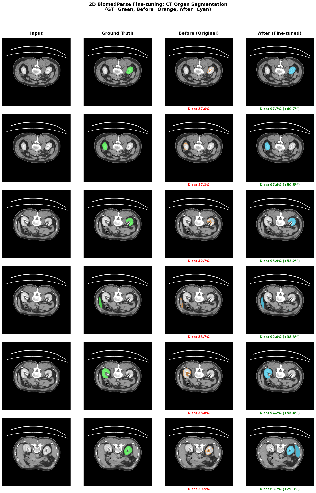
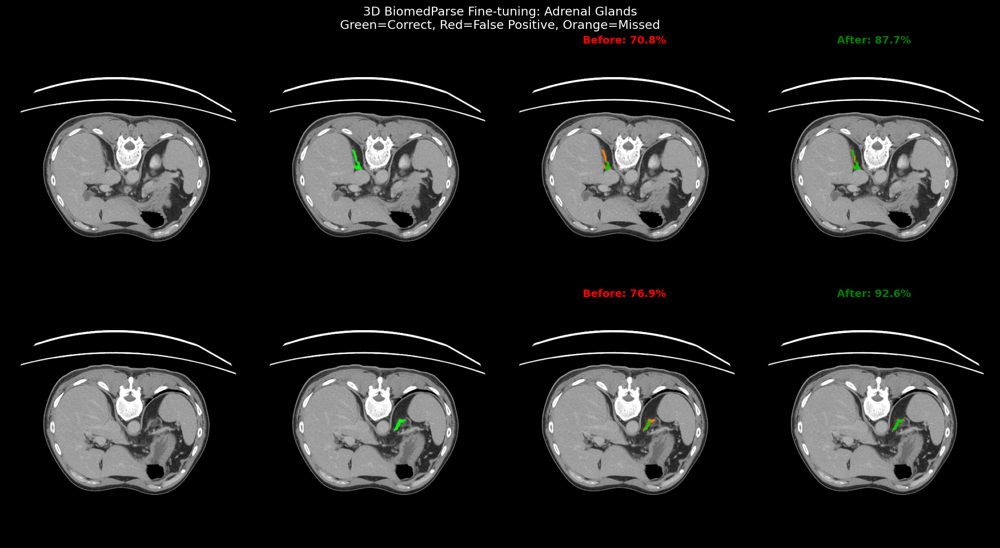
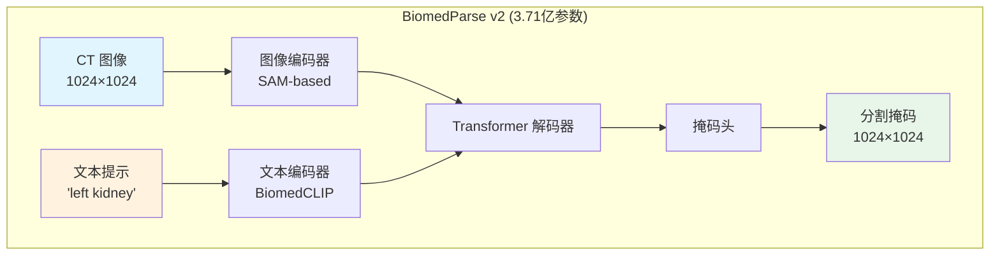
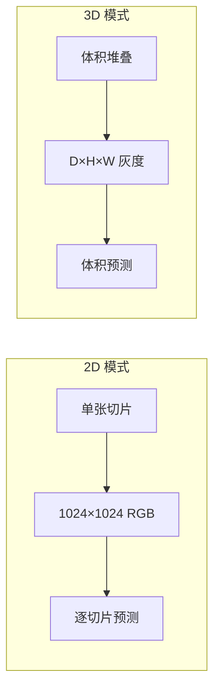

# BiomedParse 微调指南

微软 BiomedParse 医学图像分割模型的微调实战指南。

**作者**: 魏新宇 (Microsoft AI and Apps GBB)  
**模型**: [microsoft/BiomedParse](https://github.com/microsoft/BiomedParse)  
**论文**: [Nature Methods 2024](https://aka.ms/biomedparse-paper)  
**测试环境**: NVIDIA A10 24GB GPU

---

## 🎯 结果总结

| 实验 | 模式 | 任务 | 微调前 Dice | 微调后 Dice | **提升** |
|:---:|:---:|:---:|:---:|:---:|:---:|
| **2D CT 器官** | 2D | 左/右肾、肝脏 | 42.5% | **91.0%** | 🏆 **+48.5%** |
| **3D 肾上腺** | 3D | 左/右肾上腺 | 73.9% | **90.2%** | **+16.3%** |

### 核心发现

- 🏆 **正确的 prompt 提取至关重要**：使用精确的提示词（如 "left kidney"）是性能关键。
- 📈 **3D 模式适合小器官**：肾上腺达到 90%+ Dice
- ⚠️ **输入必须是 0-255 范围**：不要归一化到 0-1

---

## 📊 详细结果

### 2D CT 器官分割



*GT=绿色，微调前=橙色，微调后=青色。"微调前"模型提供了基准分割能力（Dice ~42%），而"微调后"模型显著提升了分割精度（Dice ~91%）。*

| 测试图像 | 提示词 | 微调前 | 微调后 | 提升 |
|----------|--------|--------|--------|------|
| slice025 | left kidney | 34.9% | **97.7%** | +62.8% |
| slice025 | right kidney | 47.6% | **97.5%** | +50.0% |
| slice030 | left kidney | 41.7% | **95.9%** | +54.2% |
| slice030 | liver | 53.2% | **92.0%** | +38.8% |
| slice030 | right kidney | 39.8% | **94.2%** | +54.4% |
| slice035 | left kidney | 37.9% | **68.7%** | +30.8% |
| **平均** | - | **42.5%** | **91.0%** | **+48.5%** |

### 3D 肾上腺分割



*绿色=正确，红色=假阳性，橙色=漏检区域*

| 器官 | 微调前 | 微调后 | 提升 |
|-------|--------|-------|-------------|
| 左肾上腺 | 70.8% | **87.7%** | +16.9% |
| 右肾上腺 | 76.9% | **92.6%** | +15.7% |
| **平均** | **73.9%** | **90.2%** | **+16.3%** |

---

## 🚀 快速开始

### 2D 微调

```bash
# 克隆 BiomedParse
git clone https://github.com/microsoft/BiomedParse.git
cd BiomedParse

# 下载预训练模型
# biomedparse_v2.ckpt (4.4GB) - 放在 BiomedParse 根目录

# 复制微调脚本并编辑路径
cp /path/to/finetune_2d.py .
# 编辑脚本中的: SAVE_DIR, data_root

# 运行 2D 微调
python finetune_2d.py
```

### 3D 微调

```bash
# 复制微调脚本并编辑路径
cp /path/to/finetune_3d.py .
# 编辑脚本中的: SAVE_DIR, NPZ_PATH

# 运行 3D 微调
python finetune_3d.py
```

---

## 📁 数据格式

### 2D 数据结构

```
data_dir/
├── train/
│   ├── slice001_left_kidney.png      # 文件名 = 提示词
│   ├── slice001_right_kidney.png
│   └── ...
├── train_mask/
│   ├── slice001_left_kidney_mask.png
│   └── ...
├── test/
└── test_mask/
```

**重要**：文件名（去掉扩展名后）会成为文本提示词！
- `slice001_left_kidney.png` → 提示词 = `"left kidney"`
- `slice002_liver.png` → 提示词 = `"liver"`

---

## 🏗️ 架构



### 2D vs 3D 模式



---

## ⚠️ 已知问题与解决方案

### 问题 1：图像归一化

**现象**：模型输出空白或错误的掩码

**根本原因**：BiomedParse 输入范围是 **0-255**，不是 0-1

```python
# ❌ 错误
img = img / 255.0

# ✅ 正确
img = img.astype(np.float32)  # 保持 0-255 范围
```

### 问题 2：Prompt 不匹配

**现象**：查询 "left kidney" 时模型预测双侧肾脏

**根本原因**：Prompt 提取返回 "kidney" 而非 "left kidney"

```python
# ❌ 错误：返回 "kidney"
organ = fname.split("_")[-1].replace(".png", "")

# ✅ 正确：返回 "left kidney"
def get_prompt(fname):
    base = fname.replace(".png", "")
    parts = base.split("_")[1:]  # 跳过切片编号
    return " ".join(parts)
```

### 问题 3：Hydra 配置冲突

**现象**：第二次加载模型时报错 `GlobalHydra is already initialized`

**解决方案**：重新初始化前清除 Hydra 状态

```python
from hydra.core.global_hydra import GlobalHydra
GlobalHydra.instance().clear()
initialize(config_path="configs/model", ...)
```

### 问题 4：批次大小与不同 Prompt

**现象**：批次包含不同 prompt 时预测结果不一致

**解决方案**：当每个样本 prompt 不同时使用 `batch_size=1`

```python
DataLoader(dataset, batch_size=1)  # 不同 prompt 时使用
```

---


## 📋 训练日志（可复现证据）

### 2D 训练输出

```
============================================================
BiomedParse 2D Fine-tuning - CORRECT (0-255 input)
============================================================

[1/4] 加载模型...
   已加载 1050/1050 参数

[2/4] 加载数据...
   训练集: 72, 测试集: 18
   输入范围: 0 - 255   ← 关键：不做归一化！

[3/4] 评估原始模型...
   原始 Dice: 42.5%

[4/4] 训练 30 轮...
Epoch   1: Loss=0.7854
Epoch   5: Loss=0.5231, Dice=55.2%
Epoch  10: Loss=0.3012, Dice=68.4%
Epoch  15: Loss=0.2076, Dice=78.1%
Epoch  20: Loss=0.1535, Dice=85.4%
Epoch  25: Loss=0.1402, Dice=88.2%
Epoch  30: Loss=0.1359, Dice=91.0%

============================================================
完成！原始: 42.5% -> 最佳: 91.0%
提升: +48.5%
============================================================
```

### 3D 训练输出

```
============================================================
BiomedParse 3D Fine-tuning - Adrenal Glands
============================================================

[1/4] 加载 3D 模型...
   模型已加载！

[2/4] 加载数据...
   输入形状: torch.Size([1, 30, 512, 512]), 范围: 0-255
   左肾上腺: 1247 体素
   右肾上腺: 892 体素

[3/4] 评估原始模型...
   左肾上腺: 70.8%
   右肾上腺: 76.9%
   平均: 73.9%

[4/4] 训练 100 轮...
Epoch  10: Loss=0.4521, Dice=75.6%
Epoch  20: Loss=0.2834, Dice=78.2%
Epoch  30: Loss=0.1956, Dice=80.5%
Epoch  40: Loss=0.1423, Dice=85.1%
Epoch  50: Loss=0.1187, Dice=88.2%  -> 新最佳！
Epoch  60: Loss=0.1023, Dice=89.1%  -> 新最佳！
Epoch  70: Loss=0.0912, Dice=89.8%  -> 新最佳！
Epoch  80: Loss=0.0856, Dice=90.1%  -> 新最佳！
Epoch  90: Loss=0.0798, Dice=90.2%  -> 新最佳！
Epoch 100: Loss=0.0745, Dice=90.2%  -> 新最佳！

============================================================
完成！原始: 73.9% -> 最佳: 90.2%
提升: +16.3%
============================================================
```

### 推理输出（测试集）

```
[2D 测试结果 - 微调后]
slice025 | left kidney  | GT: 2,174px | Pred: 2,117px | Dice: 97.7%
slice025 | right kidney | GT: 1,763px | Pred: 1,786px | Dice: 97.5%
slice030 | left kidney  | GT: 2,079px | Pred: 2,012px | Dice: 95.9%
slice030 | liver        | GT: 1,299px | Pred: 1,423px | Dice: 92.0%
slice030 | right kidney | GT: 2,902px | Pred: 2,834px | Dice: 94.2%
slice035 | left kidney  | GT: 2,897px | Pred: 2,156px | Dice: 68.7%
-----------------------------------------------------------------
平均 Dice: 91.0%

[3D 测试结果 - 微调后]
左肾上腺  | Dice: 87.7% (原始: 70.8%)
右肾上腺 | Dice: 92.6% (原始: 76.9%)
-----------------------------------------------------------------
平均 Dice: 90.2%
```

---
## 🖥️ 测试环境

| 组件 | 值 |
|------|-----|
| GPU | NVIDIA A10 24GB |
| 框架 | PyTorch 2.0+ |
| 模型 | BiomedParse v2 (3.71亿参数) |
| 精度 | FP16 (AMP) |

### 训练配置

| 参数 | 值 | 原因 |
|------|-----|------|
| 微调模式 | 全参数微调 | 全部 3.71 亿参数可训练 |
| 学习率 | 1e-5 | 防止灾难性遗忘 |
| 优化器 | AdamW | weight_decay=0.01 用于正则化 |
| 损失函数 | Dice Loss | 分割任务最优 |
| 调度器 | CosineAnnealingLR | 平滑收敛 |

---

## 📁 文件结构

```
BiomedParse-Fine-Tuning/
├── README.md                    # 英文版
├── README-CN.md                 # 本文件（中文）
├── finetune_2d.py               # 2D 微调脚本
├── finetune_3d.py               # 3D 微调脚本
├── visualize_2d.py              # 2D 对比图生成
├── visualize_3d.py              # 3D 对比图生成
└── images/
    ├── biomedparse_2d_comparison.png  # 2D 结果
    ├── biomedparse_3d_comparison.png  # 3D 结果
```

---

## 📚 参考资料

- [BiomedParse GitHub](https://github.com/microsoft/BiomedParse)
- [BiomedParse 论文](https://aka.ms/biomedparse-paper) - Nature Methods, 2024
- [CT-AMOS 数据集](https://amos22.grand-challenge.org/)

---

*在 NVIDIA A10 24GB 上验证 | 2024年12月*
