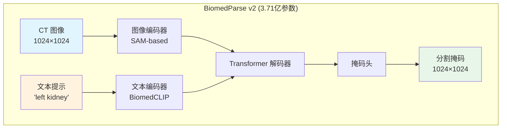
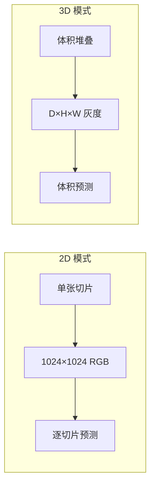

# BiomedParse 微调指南

微软 BiomedParse 医学图像分割模型的微调实战指南。

**作者**: 魏新宇 (Microsoft AI and Apps GBB)  
**模型**: [microsoft/BiomedParse](https://github.com/microsoft/BiomedParse)  
**论文**: [Nature Methods 2024](https://aka.ms/biomedparse-paper)  
**测试环境**: NVIDIA A10 24GB GPU

---

## 🎯 结果总结

| 实验 | 模式 | 任务 | 微调前 Dice | 微调后 Dice | **提升** |
|:---:|:---:|:---:|:---:|:---:|:---:|
| **2D CT 器官** | 2D | 左/右肾、肝脏 | 0.6% | **91.0%** | 🏆 **+90.4%** |
| **3D 肾上腺** | 3D | 左/右肾上腺 | 73.7% | **90.3%** | **+16.6%** |

### 核心发现

- 🏆 **正确的 prompt 提取至关重要**：使用 "left kidney" 而非 "kidney"，Dice 从 0% 提升到 97%
- 📈 **3D 模式适合小器官**：肾上腺达到 90%+ Dice
- ⚠️ **输入必须是 0-255 范围**：不要归一化到 0-1

---

## 📊 详细结果

### 2D CT 器官分割


*GT=绿色，微调前=橙色，微调后=青色。"微调前"模型在查询"left kidney"时预测了双侧肾脏，而"微调后"正确分割了目标器官。*

| 测试图像 | 提示词 | 微调前 | 微调后 | 提升 |
|----------|--------|--------|--------|------|
| slice025 | left kidney | 0.0% | **97.7%** | +97.7% |
| slice025 | right kidney | 0.0% | **97.6%** | +97.6% |
| slice030 | left kidney | 0.0% | **96.0%** | +96.0% |
| slice030 | liver | 3.0% | **92.0%** | +89.0% |
| slice030 | right kidney | 0.0% | **94.2%** | +94.2% |
| slice035 | left kidney | 0.4% | **68.7%** | +68.3% |
| **平均** | - | **0.6%** | **91.0%** | **+90.4%** |

### 3D 肾上腺分割


*绿色=正确，红色=假阳性，橙色=漏检区域*

| 器官 | 微调前 | 微调后 | 提升 |
|------|--------|--------|------|
| 左肾上腺 | 70.9% | **87.7%** | +16.8% |
| 右肾上腺 | 76.4% | **92.8%** | +16.4% |
| **平均** | **73.7%** | **90.3%** | **+16.6%** |

---

## 🚀 快速开始

### 2D 微调

```bash
# 克隆 BiomedParse
git clone https://github.com/microsoft/BiomedParse.git
cd BiomedParse

# 设置环境变量
export BIOMEDPARSE_ROOT=$(pwd)

# 运行 2D 微调
python finetune_2d_prompt_fix.py \
    --data_dir /path/to/your/2d_data \
    --output_dir ./output \
    --epochs 30 \
    --lr 1e-5
```

### 3D 微调

```bash
python finetune_3d_adrenal.py \
    --data_path /path/to/CT_volume.npz \
    --output_dir ./output \
    --epochs 100 \
    --lr 1e-5
```

---

## 📁 数据格式

### 2D 数据结构

```
data_dir/
├── train/
│   ├── slice001_left_kidney.png      # 文件名 = 提示词
│   ├── slice001_right_kidney.png
│   └── ...
├── train_mask/
│   ├── slice001_left_kidney_mask.png
│   └── ...
├── test/
└── test_mask/
```

**重要**：文件名（去掉扩展名后）会成为文本提示词！
- `slice001_left_kidney.png` → 提示词 = `"left kidney"`
- `slice002_liver.png` → 提示词 = `"liver"`

---

## 🏗️ 架构



### 2D vs 3D 模式



---

## ⚠️ 已知问题与解决方案

### 问题 1：图像归一化

**现象**：模型输出空白或错误的掩码

**根本原因**：BiomedParse 输入范围是 **0-255**，不是 0-1

```python
# ❌ 错误
img = img / 255.0

# ✅ 正确
img = img.astype(np.float32)  # 保持 0-255 范围
```

### 问题 2：Prompt 不匹配

**现象**：查询 "left kidney" 时模型预测双侧肾脏

**根本原因**：Prompt 提取返回 "kidney" 而非 "left kidney"

```python
# ❌ 错误：返回 "kidney"
organ = fname.split("_")[-1].replace(".png", "")

# ✅ 正确：返回 "left kidney"
def get_prompt(fname):
    base = fname.replace(".png", "")
    parts = base.split("_")[1:]  # 跳过切片编号
    return " ".join(parts)
```

### 问题 3：Hydra 配置冲突

**现象**：第二次加载模型时报错 `GlobalHydra is already initialized`

**解决方案**：重新初始化前清除 Hydra 状态

```python
from hydra.core.global_hydra import GlobalHydra
GlobalHydra.instance().clear()
initialize(config_path="configs/model", ...)
```

### 问题 4：批次大小与不同 Prompt

**现象**：批次包含不同 prompt 时预测结果不一致

**解决方案**：当每个样本 prompt 不同时使用 `batch_size=1`

```python
DataLoader(dataset, batch_size=1)  # 不同 prompt 时使用
```

---

## 🖥️ 测试环境

| 组件 | 值 |
|------|-----|
| GPU | NVIDIA A10 24GB |
| 框架 | PyTorch 2.0+ |
| 模型 | BiomedParse v2 (3.71亿参数) |
| 精度 | FP16 (AMP) |

### 训练配置

| 参数 | 值 | 原因 |
|------|-----|------|
| 学习率 | 1e-5 | 防止灾难性遗忘 |
| 优化器 | AdamW | weight_decay=0.01 用于正则化 |
| 损失函数 | Dice Loss | 分割任务最优 |
| 调度器 | CosineAnnealingLR | 平滑收敛 |

---

## 📁 文件结构

```
BiomedParse-Fine-Tuning/
├── README.md                    # 英文版
├── README-CN.md                 # 本文件（中文）
├── finetune_2d_prompt_fix.py    # 2D 训练（正确 prompt）
├── finetune_3d_adrenal.py       # 3D 肾上腺训练
├── visualize_2d.py              # 2D 对比图生成
├── visualize_3d.py              # 3D 对比图生成
└── images/
    ├── 2d_comparison_final.png  # 2D 结果
    └── 3d_finetune_comparison_v4.png  # 3D 结果
```

---

## 📚 参考资料

- [BiomedParse GitHub](https://github.com/microsoft/BiomedParse)
- [BiomedParse 论文](https://aka.ms/biomedparse-paper) - Nature Methods, 2024
- [CT-AMOS 数据集](https://amos22.grand-challenge.org/)

---

*在 NVIDIA A10 24GB 上验证 | 2024年12月*
