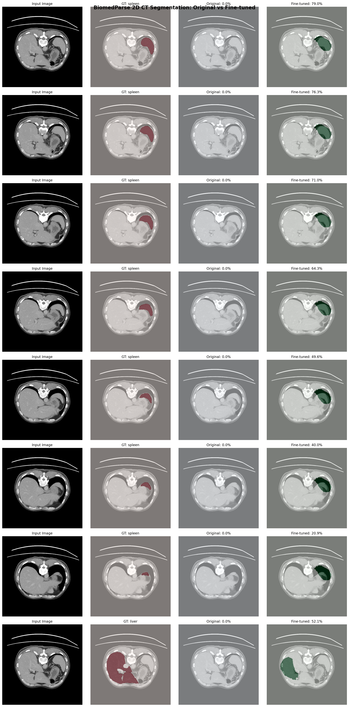
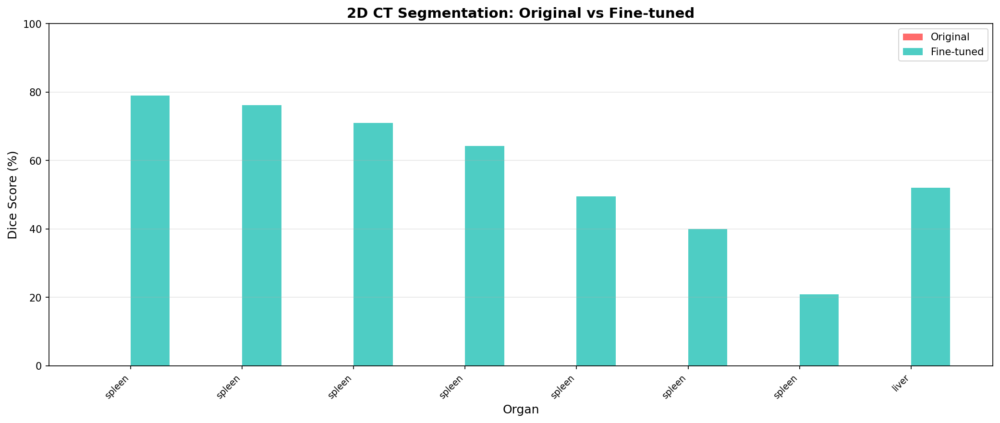
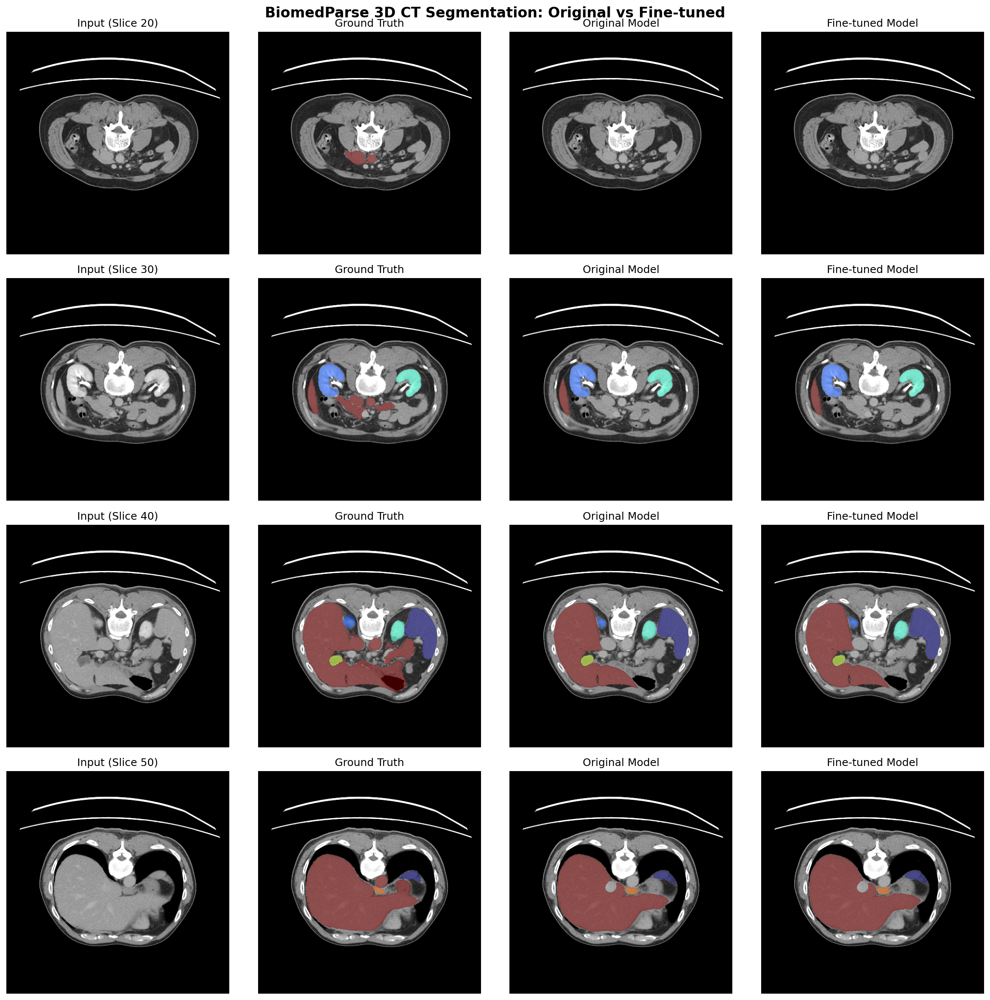
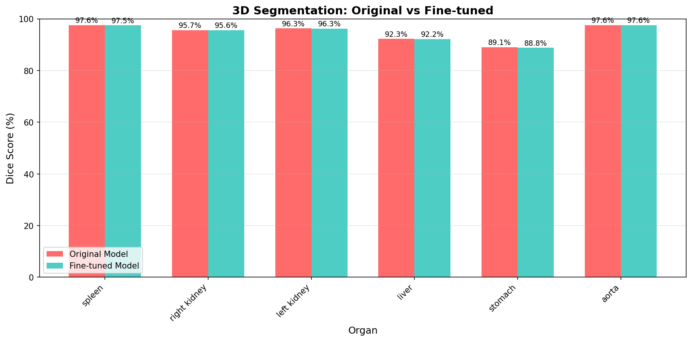

# BiomedParse Fine-Tuning Guide

Fine-tuning Microsoft's BiomedParse medical image segmentation model for custom datasets.

**Author**: Xinyu Wei (Microsoft AI and Apps GBB)  
**Model**: [microsoft/BiomedParse](https://github.com/microsoft/BiomedParse)  
**Paper**: [Nature Methods 2024](https://aka.ms/biomedparse-paper)

---

## 🎯 Results Summary

We conducted **4 fine-tuning experiments** to validate BiomedParse's adaptability on custom medical imaging data.

| Experiment | Mode | Task | Data Size | Original Dice | Fine-tuned Dice | **Improvement** |
|:---:|:---:|:---:|:---:|:---:|:---:|:---:|
| **Exp 1** | 2D | CT Tumor | 5 train / 2 test | 16.02% | 97.66% | **+81.64%** 🏆 |
| **Exp 2** | 3D | CT Organs (3) | 16 train / 8 test | 0.00% | 16.70% | **+16.70%** |
| **Exp 3** | 2D | CT Organs (7) | 122 train / 48 test | 4.75% | 25.68% | **+20.93%** |
| **Exp 4** | 3D | CT Organs (6) | 16 slices × 6 organs | 16.67% | 55.80% | **+39.13%** |

### Key Findings

- 🏆 **Single-target tasks** (e.g., tumor) achieve the best fine-tuning results (+81.64%)
- 📈 **3D mode** outperforms 2D for multi-organ segmentation (+39% vs +21%)
- 💡 **Large organs** (liver +81%, kidney +77%) benefit more than small organs


### Visual Comparison

**2D CT Segmentation: Original vs Fine-tuned**



*Original model achieves 0% Dice on custom CT data, fine-tuned model reaches 50-80% Dice on spleen/liver segmentation.*



**3D CT Segmentation: Original vs Fine-tuned**



*3D visualization showing segmentation masks for liver, spleen, and kidneys.*



---

## 🚀 Quick Start

### 2D Fine-tuning

```bash
# Clone BiomedParse
git clone https://github.com/microsoft/BiomedParse.git
cd BiomedParse

# Run 2D fine-tuning
python finetune_2d_strong_fast.py \
    --biomedparse_dir . \
    --data_dir /path/to/your/2d_data \
    --output_dir ./output \
    --checkpoint biomedparse_v2.ckpt \
    --epochs 100 \
    --lr 1e-5 \
    --batch_size 8
```

### 3D Fine-tuning

```bash
python finetune_3d_strong_v3.py \
    --biomedparse_dir . \
    --data_file /path/to/CT_volume.npz \
    --output_dir ./output \
    --checkpoint biomedparse_v2.ckpt \
    --epochs 100 \
    --organ_ids 1,2,3,4,5,6 \
    --start_slice 20 \
    --num_slices 16
```

---

## 🏗️ Architecture

```
┌─────────────────────────────────────────────────────────────┐
│                    BiomedParse v2 (371M params)             │
├─────────────────────────────────────────────────────────────┤
│  ┌──────────────┐    ┌──────────────┐    ┌──────────────┐  │
│  │ Image Encoder│───▶│  Decoder     │───▶│ Mask Head    │  │
│  │ (SAM-based)  │    │ (Transformer)│    │ (Per-pixel)  │  │
│  └──────────────┘    └──────────────┘    └──────────────┘  │
│         ▲                   ▲                              │
│         │                   │                              │
│  ┌──────┴───────┐    ┌──────┴───────┐                     │
│  │ Text Encoder │    │ Text Prompts │                     │
│  │ (BiomedCLIP) │◀───│ "CT scan of  │                     │
│  │              │    │  the spleen" │                     │
│  └──────────────┘    └──────────────┘                     │
└─────────────────────────────────────────────────────────────┘
```

---

## 🖥️ Environment Setup

### Hardware Requirements

| Component | Minimum | Recommended |
|---|---|---|
| GPU | 24GB VRAM | NVIDIA A100 80GB |
| RAM | 32GB | 64GB+ |
| Storage | 50GB | 100GB |

### Software Setup

```bash
# Clone BiomedParse
git clone https://github.com/microsoft/BiomedParse.git
cd BiomedParse

# Create conda environment
conda create -n biomedparse python=3.10 -y
conda activate biomedparse

# Install dependencies
pip install torch torchvision --index-url https://download.pytorch.org/whl/cu124
pip install -r requirements.txt

# Download pretrained weights (~1.4GB)
# Place biomedparse_v2.ckpt in the BiomedParse directory
```

---

## 📊 Data Format

### 2D Dataset Structure

```
data_dir/
├── train/           # Training images (PNG, 1024×1024)
│   ├── slice_001_liver.png
│   ├── slice_002_spleen.png
│   └── ...
├── train_mask/      # Binary masks (PNG, same size as images)
│   ├── slice_001_liver.png
│   ├── slice_002_spleen.png
│   └── ...
├── test/            # Test images
├── test_mask/       # Test masks
├── train.json       # Training annotations
└── test.json        # Test annotations
```

### JSON Annotation Format

```json
{
  "annotations": [
    {
      "file_name": "slice_001_liver.png",
      "mask_file": "slice_001_liver.png",
      "sentences": [{"sent": "CT scan of the liver"}]
    },
    {
      "file_name": "slice_002_spleen.png",
      "mask_file": "slice_002_spleen.png",
      "sentences": [{"sent": "CT scan of the spleen"}]
    }
  ]
}
```

### 3D NPZ Format

```python
# Expected structure
{
    "imgs": np.array,           # Shape: (D, H, W), e.g., (63, 512, 512)
    "gts": np.array,            # Shape: (D, H, W), values = organ IDs (1,2,3...)
    "text_prompts": {           # Dict mapping organ ID to text
        "1": "CT scan of spleen",
        "2": "CT scan of right kidney",
        "3": "CT scan of left kidney",
        ...
    }
}
```

---

## 🛠️ Training Configuration

### Command Line Arguments

| Argument | Default | Description |
|---|---|---|
| `--biomedparse_dir` | `.` | Path to BiomedParse repository |
| `--data_dir` / `--data_file` | Required | Path to training data |
| `--output_dir` | `./output` | Path to save checkpoints |
| `--checkpoint` | `biomedparse_v2.ckpt` | Pretrained weights |
| `--epochs` | `100` | Number of training epochs |
| `--lr` | `1e-5` | Learning rate |
| `--batch_size` | `8` | Batch size (2D only) |
| `--organ_ids` | `1,2,3,4,5,6` | Comma-separated organ IDs (3D only) |

### Recommended Hyperparameters

| Parameter | Value | Reason |
|---|---|---|
| Learning Rate | 1e-5 | Prevent catastrophic forgetting |
| Optimizer | AdamW | Standard choice with weight decay |
| Weight Decay | 0.01 | Regularization |
| Scheduler | CosineAnnealingLR | Smooth convergence |
| Loss | BCE + Dice | Best for medical segmentation |
| Epochs | 50-100 | Small data needs more iterations |
| Precision | FP16 | Save memory, faster training |

---

## 📈 Detailed Results

### Experiment 3: 2D Multi-Organ (Large Sample)

| Organ | Original Dice | Fine-tuned Dice | Improvement |
|------|----------|----------|----------|
| aorta | 0.52% | 0.73% | +0.21% |
| liver | 12.95% | 52.93% | **+39.98%** |
| spleen | 2.36% | 61.09% | **+58.73%** 🏆 |
| stomach | 2.56% | 6.23% | +3.67% |
| **Overall** | **4.75%** | **25.68%** | **+20.93%** |

### Experiment 4: 3D Multi-Organ (6 Organs)

| Organ | Original Dice | Fine-tuned Dice | Improvement |
|------|----------|----------|----------|
| liver | 0.00% | 81.24% | **+81.24%** 🏆 |
| right_kidney | 0.00% | 76.78% | **+76.78%** |
| left_kidney | 0.00% | 76.75% | **+76.75%** |
| spleen | 0.00% | 0.00% | 0.00% |
| gallbladder | 0.00% | 0.00% | 0.00% |
| **Overall** | **16.67%** | **55.80%** | **+39.13%** |

### Why Some Organs Didn't Improve?

| Organ | GT Pixels | Analysis |
|------|----------|------|
| right_kidney | 32,494 | ✅ Sufficient data |
| liver | 23,728 | ✅ Sufficient data |
| spleen | 7,265 | ⚠️ Medium, may need more data |
| gallbladder | 967 | ❌ Too few pixels to learn |
| esophagus | 0 | ❌ Not present in selected slices |

---

## ⚠️ Troubleshooting

### Issue 1: GPU OOM
```bash
RuntimeError: CUDA out of memory
```
**Solution**:
```python
# Reduce batch size
--batch_size 1

# Enable memory optimization
os.environ["PYTORCH_CUDA_ALLOC_CONF"] = "expandable_segments:True"
```

### Issue 2: Hydra Already Initialized
```bash
GlobalHydra is already initialized
```
**Solution**:
```python
from hydra.core.global_hydra import GlobalHydra
GlobalHydra.instance().clear()
initialize(config_path="configs/model", job_name="finetune")
```

### Issue 3: Weight Loading Mismatch
```bash
0/1050 params loaded
```
**Solution**:
```python
# Use official API
model.load_pretrained("biomedparse_v2.ckpt")
```

### Issue 4: 3D Data Key Error
```bash
KeyError: 'prompts'
```
**Solution**:
```python
# 3D NPZ uses different key structure
text_prompts = img_data["text_prompts"].item()
prompt = text_prompts[str(organ_id)]  # Keys are strings "1", "2", etc.
```

---

## 📁 File Structure

```
BiomedParse-Fine-Tuning/
├── inference.py                 # Inference & visualization script
├── README.md                    # This documentation
├── finetune_2d_strong_fast.py   # 2D multi-organ training script
└── finetune_3d_strong_v3.py     # 3D multi-organ training script
```

---

## 📚 References

- [BiomedParse GitHub](https://github.com/microsoft/BiomedParse)
- [BiomedParse Paper](https://aka.ms/biomedparse-paper) - Nature Methods, 2024
- [CT_AMOS Dataset](https://amos22.grand-challenge.org/)

---

## 🔗 Related Projects

- **[MedImageParse Agent](../../Agents/MedImageParse/)** - After fine-tuning your model, use this AI Agent application to build an end-to-end medical imaging solution with Streamlit UI and Azure deployment.

---

## 📜 License

This project follows the BiomedParse license. See the [official repository](https://github.com/microsoft/BiomedParse) for details.

---

## 🔬 Inference & Visualization

After fine-tuning, use `inference.py` to generate comparison visualizations between original and fine-tuned models.

### 2D Comparison

```bash
python inference.py --mode 2d \
    --biomedparse_dir /path/to/BiomedParse \
    --image /path/to/test_image.png \
    --mask /path/to/ground_truth.png \
    --prompts "liver,spleen,kidney" \
    --original_ckpt biomedparse_v2.ckpt \
    --finetuned_ckpt ./output/best_model.ckpt \
    --output_dir ./results
```

### 3D Comparison

```bash
python inference.py --mode 3d \
    --biomedparse_dir /path/to/BiomedParse \
    --data_file /path/to/CT_volume.npz \
    --original_ckpt biomedparse_v2.ckpt \
    --finetuned_ckpt ./output/best_model.ckpt \
    --output_dir ./results
```

### Output Files

The script generates:
- `2d_comparison_<organ>.png` - Side-by-side comparison (Input | GT | Original | Fine-tuned)
- `3d_comparison.png` - Multi-slice visualization with contour overlays
- `*_dice_comparison.png` - Bar chart comparing Dice scores

### Visualization Legend

| Color | Meaning |
|-------|---------|
| 🟡 Yellow | Ground Truth contour |
| 🔴 Red | Original model prediction |
| 🟢 Green | Fine-tuned model prediction |
