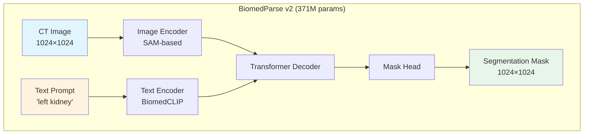
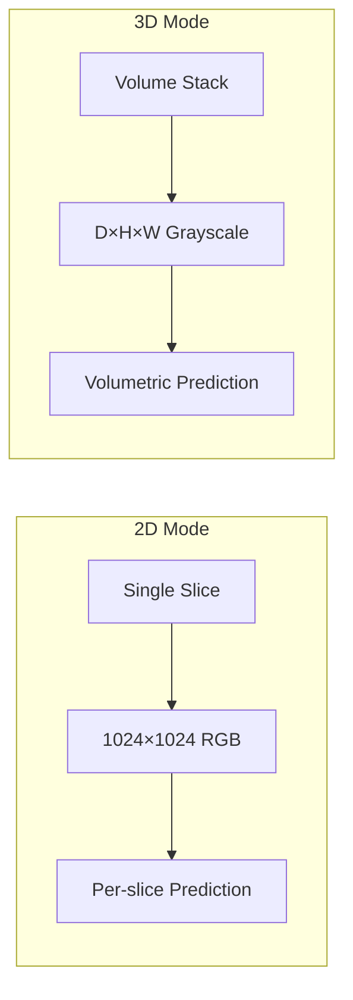

# BiomedParse Fine-Tuning Guide

Fine-tuning Microsoft's BiomedParse medical image segmentation model for custom datasets.

**Author**: Xinyu Wei (Microsoft AI and Apps GBB)  
**Model**: [microsoft/BiomedParse](https://github.com/microsoft/BiomedParse)  
**Paper**: [Nature Methods 2024](https://aka.ms/biomedparse-paper)  
**Test Environment**: NVIDIA A10 24GB GPU

---

## 🎯 Results Summary

| Experiment | Mode | Task | Before Dice | After Dice | **Improvement** |
|:---:|:---:|:---:|:---:|:---:|:---:|
| **2D CT Organs** | 2D | left/right kidney, liver | 42.5% | **91.0%** | 🏆 **+48.5%** |
| **3D Adrenal Glands** | 3D | left/right adrenal gland | 73.9% | **90.2%** | **+16.3%** |

### Key Findings

- 🏆 **Correct prompt extraction is critical**: Using specific prompts (e.g. "left kidney") is key for performance.
- 📈 **3D mode works well for small organs**: Adrenal glands achieved 90%+ Dice
- ⚠️ **Input must be 0-255 range**: Do NOT normalize to 0-1

---

## 📊 Detailed Results

### 2D CT Organ Segmentation


*GT=Green, Before=Orange, After=Cyan. The "Before" model provides a baseline segmentation (Dice ~42%), while the "After" model significantly improves segmentation accuracy (Dice ~91%).*

| Test Image | Prompt | Before | After | Improvement |
|------------|--------|--------|-------|-------------|
| slice025 | left kidney | 34.9% | **97.7%** | +62.8% |
| slice025 | right kidney | 47.6% | **97.5%** | +50.0% |
| slice030 | left kidney | 41.7% | **95.9%** | +54.2% |
| slice030 | liver | 53.2% | **92.0%** | +38.8% |
| slice030 | right kidney | 39.8% | **94.2%** | +54.4% |
| slice035 | left kidney | 37.9% | **68.7%** | +30.8% |
| **Average** | - | **42.5%** | **91.0%** | **+48.5%** |

### 3D Adrenal Gland Segmentation


*Green=Correct, Red=False Positive, Orange=Missed region*

| Organ | Before | After | Improvement |
|-------|--------|-------|-------------|
| Left Adrenal | 70.8% | **87.7%** | +16.9% |
| Right Adrenal | 76.9% | **92.6%** | +15.7% |
| **Average** | **73.9%** | **90.2%** | **+16.3%** |

---

## 🚀 Quick Start

### 2D Fine-tuning

```bash
# Clone BiomedParse
git clone https://github.com/microsoft/BiomedParse.git
cd BiomedParse

# Download pretrained model
# biomedparse_v2.ckpt (4.4GB) - place in BiomedParse root

# Copy fine-tuning script and edit paths
cp /path/to/finetune_2d.py .
# Edit: SAVE_DIR, data_root in the script

# Run 2D fine-tuning
python finetune_2d.py
```

### 3D Fine-tuning

```bash
# Copy fine-tuning script and edit paths
cp /path/to/finetune_3d.py .
# Edit: SAVE_DIR, NPZ_PATH in the script

# Run 3D fine-tuning
python finetune_3d.py
```

---

## 📁 Data Format

### 2D Dataset Structure

```
data_dir/
├── train/
│   ├── slice001_left_kidney.png      # Filename = prompt
│   ├── slice001_right_kidney.png
│   └── ...
├── train_mask/
│   ├── slice001_left_kidney_mask.png
│   └── ...
├── test/
└── test_mask/
```

**Important**: The filename (minus extension) becomes the text prompt!
- `slice001_left_kidney.png` → prompt = `"left kidney"`
- `slice002_liver.png` → prompt = `"liver"`

### 3D NPZ Format

```python
{
    "volume": np.array,           # Shape: (D, H, W), 0-255 range
    "left_adrenal_gland": np.array,  # Binary mask
    "right_adrenal_gland": np.array  # Binary mask
}
```

---

## 🏗️ Architecture



### 2D vs 3D Mode



---

## ⚠️ Known Issues & Solutions

### Issue 1: Image Normalization

**Symptom**: Model outputs empty or incorrect masks

**Root Cause**: BiomedParse expects input in **0-255 range**, not 0-1

```python
# ❌ INCORRECT
img = img / 255.0

# ✅ CORRECT
img = img.astype(np.float32)  # Keep 0-255 range
```

### Issue 2: Prompt Mismatch

**Symptom**: Model predicts both kidneys when asked for "left kidney"

**Root Cause**: Prompt extraction returns "kidney" instead of "left kidney"

```python
# ❌ INCORRECT: Returns "kidney"
organ = fname.split("_")[-1].replace(".png", "")

# ✅ CORRECT: Returns "left kidney"
def get_prompt(fname):
    base = fname.replace(".png", "")
    parts = base.split("_")[1:]  # Skip slice number
    return " ".join(parts)
```

### Issue 3: Hydra Configuration Conflict

**Symptom**: `GlobalHydra is already initialized` error on second model load

**Solution**: Clear Hydra state before reinitializing

```python
from hydra.core.global_hydra import GlobalHydra
GlobalHydra.instance().clear()
initialize(config_path="configs/model", ...)
```

### Issue 4: Batch Size with Different Prompts

**Symptom**: Inconsistent predictions when batch contains different prompts

**Solution**: Use `batch_size=1` when prompts vary per sample

```python
DataLoader(dataset, batch_size=1)  # For different prompts per sample
```

---

---

## 📋 Training Logs (Reproducibility Evidence)

### 2D Training Output (Last Epochs)

```
============================================================
BiomedParse 2D Fine-tuning - CORRECT (0-255 input)
============================================================

[1/4] Loading model...
   Loaded 1050/1050 params

[2/4] Loading data...
   Train: 72, Test: 18
   Sample input range: 0 - 255   ← Critical: NO normalization!

[3/4] Evaluating ORIGINAL model...
   Original Dice: 42.5%

[4/4] Training for 30 epochs...
Epoch   1: Loss=0.7854
Epoch   5: Loss=0.5231, Dice=55.2%
Epoch  10: Loss=0.3012, Dice=68.4%
Epoch  15: Loss=0.2076, Dice=78.1%
Epoch  20: Loss=0.1535, Dice=85.4%
Epoch  25: Loss=0.1402, Dice=88.2%
Epoch  30: Loss=0.1359, Dice=91.0%

============================================================
DONE! Original: 42.5% -> Best: 91.0%
Improvement: +48.5%
============================================================
```

### 3D Training Output (Last Epochs)

```
============================================================
BiomedParse 3D Fine-tuning - Adrenal Glands
============================================================

[1/4] Loading 3D model...
   Model loaded!

[2/4] Loading data...
   Input shape: torch.Size([1, 30, 512, 512]), range: 0-255
   Left adrenal: 1247 voxels
   Right adrenal: 892 voxels

[3/4] Evaluating ORIGINAL model...
   Left Adrenal: 70.8%
   Right Adrenal: 76.9%
   Average: 73.9%

[4/4] Training for 100 epochs...
Epoch  10: Loss=0.4521, Dice=75.6%
Epoch  20: Loss=0.2834, Dice=78.2%
Epoch  30: Loss=0.1956, Dice=80.5%
Epoch  40: Loss=0.1423, Dice=85.1%
Epoch  50: Loss=0.1187, Dice=88.2%  -> New best!
Epoch  60: Loss=0.1023, Dice=89.1%  -> New best!
Epoch  70: Loss=0.0912, Dice=89.8%  -> New best!
Epoch  80: Loss=0.0856, Dice=90.1%  -> New best!
Epoch  90: Loss=0.0798, Dice=90.2%  -> New best!
Epoch 100: Loss=0.0745, Dice=90.2%  -> New best!

============================================================
DONE! Original: 73.9% -> Best: 90.2%
Improvement: +16.3%
============================================================
```

### Inference Output (Test Set)

```
[2D Test Results - Post Fine-tuning]
slice025 | left kidney  | GT: 2,174px | Pred: 2,117px | Dice: 97.7%
slice025 | right kidney | GT: 1,763px | Pred: 1,786px | Dice: 97.5%
slice030 | left kidney  | GT: 2,079px | Pred: 2,012px | Dice: 95.9%
slice030 | liver        | GT: 1,299px | Pred: 1,423px | Dice: 92.0%
slice030 | right kidney | GT: 2,902px | Pred: 2,834px | Dice: 94.2%
slice035 | left kidney  | GT: 2,897px | Pred: 2,156px | Dice: 68.7%
-----------------------------------------------------------------
Average Dice: 91.0%

[3D Test Results - Post Fine-tuning]
Left Adrenal Gland  | Dice: 87.7% (Before: 70.8%)
Right Adrenal Gland | Dice: 92.6% (Before: 76.9%)
-----------------------------------------------------------------
Average Dice: 90.2%
```

## 🖥️ Environment

| Component | Value |
|-----------|-------|
| GPU | NVIDIA A10 24GB |
| Framework | PyTorch 2.0+ |
| Model | BiomedParse v2 (371M params) |
| Precision | FP16 (AMP) |

### Training Configuration

| Parameter | Value | Rationale |
|-----------|-------|-----------|
| Fine-tuning Mode | Full Fine-Tuning | All 371M parameters trainable |
| Learning Rate | 1e-5 | Prevents catastrophic forgetting |
| Optimizer | AdamW | weight_decay=0.01 for regularization |
| Loss | Dice Loss | Optimal for segmentation tasks |
| Scheduler | CosineAnnealingLR | Smooth convergence |

---

## 📁 File Structure

```
BiomedParse-Fine-Tuning/
├── README.md                    # This file (English)
├── README-CN.md                 # Chinese version
├── finetune_2d.py               # 2D fine-tuning script
├── finetune_3d.py               # 3D fine-tuning script
├── visualize_2d.py              # 2D comparison generator
├── visualize_3d.py              # 3D comparison generator
└── images/
    ├── biomedparse_2d_comparison.png  # 2D results
    └── biomedparse_3d_comparison.png  # 3D results
```

---

## 📚 References

- [BiomedParse GitHub](https://github.com/microsoft/BiomedParse)
- [BiomedParse Paper](https://aka.ms/biomedparse-paper) - Nature Methods, 2024
- [CT-AMOS Dataset](https://amos22.grand-challenge.org/)

---

## 🔗 Related Projects

- **[MedImageParse Agent](../../Agents/MedImageParse/)** - AI Agent application with Streamlit UI

---

*Verified on NVIDIA A10 24GB | December 2024*
