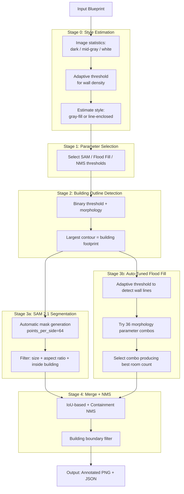

# 工程图纸区域检测器

[](https://www.python.org/downloads/)
[](https://github.com/facebookresearch/sam2)
[](https://opensource.org/licenses/MIT)

跨风格工程图纸实体检测 using **SAM 2.1 + Auto-Tuned Flood Fill** hybrid architecture. 已在多种公开建筑平面图风格上完成验证。


## 功能特性

- **跨风格检测**：支持灰色填充结构图、线条围合平面图和彩色图纸
- **SAM 2.1 + Flood Fill 混合**：SAM 分割有纹理实体，Flood Fill 检测墙线围合房间
- **自动调优形态学**：每张图遍历 36 种参数组合，选最优
- **建筑轮廓过滤**：自动检测建筑占地范围，移除外部噪声
- **JSON 输出**：实体坐标、面积和中心点

## 快速开始

### 1. 安装 SAM 2.1

```bash
git clone https://github.com/facebookresearch/sam2.git && cd sam2
pip install -e .
```

### 2. 下载模型

```bash
wget https://dl.fbaipublicfiles.com/segment_anything_2/092824/sam2.1_hiera_large.pt -O checkpoints/sam2.1_hiera_large.pt
```

### 3. 安装依赖

```bash
pip install opencv-python numpy torch torchvision
```

### 4. 运行检测

```bash
python detect_v13.py input.png -o output/ -m checkpoints/sam2.1_hiera_large.pt
```

## 环境要求

- Python 3.10+
- CUDA GPU（推荐 16GB+ VRAM）
- PyTorch 2.5.1+
- SAM 2.1（从源码安装）
- OpenCV

## 在 Azure 上运行

本项目在 **Azure GPU 虚拟机**上开发和测试。

| Item | Details |
|------|--------|
| **VM SKU** | [Standard_NV36adms_A10_v5](https://learn.microsoft.com/en-us/azure/virtual-machines/nva10v5-series) |
| **GPU** | NVIDIA A10 (24GB GDDR6) |
| **vCPU / Memory** | 36 vCPUs / 440 GB RAM |
| **OS** | Ubuntu 22.04 LTS |

### 为什么 A10 就够了

- SAM 2.1 hiera_large（224M 参数）+ Flood Fill 需约 12GB GPU 内存
- 单块 A10（24GB）可运行完整流水线并有余量
- 处理时间：2000px 分辨率下 12-20 秒/张
- 纯 CPU 环境下同样代码可运行（较慢）

## 使用方法

```bash
python detect_v13.py <input_image> -o <output_dir> -m <sam2_checkpoint>
```

### 参数说明

| Parameter | Default | Description |
|-----------|---------|-------------|
| `-m, --model` | checkpoints/sam2.1_hiera_large.pt | SAM 2.1 checkpoint |
| `--config` | configs/sam2.1/sam2.1_hiera_l.yaml | SAM 2.1 config |
| `-o, --output` | . | Output directory |
| `--max-size` | 2000 | Max image dimension |
| `--sam-points` | 64 | SAM grid density |
| `--show-style` | - | Print style analysis details |

### 输出格式

- `<input>_v13.png` — Annotated image with green bounding boxes and red center points
- `<input>_v13.json` — JSON with style analysis, entity coordinates, and statistics

## 架构



### 为什么用混合架构？

| Component | Strength | Weakness |
|-----------|----------|----------|
| **SAM 2.1** | 分割有纹理区域（家具、洁具、小结构） | 无法分割无特征的白色围合空间 |
| **Flood Fill** | 检测墙线围合的房间（白色空间） | 对墙线间隙敏感，可能过度分割 |
| **Combined** | **互补覆盖 → 接近完整的房间检测** | |

## 输出示例

```
🚀 Blueprint Region Detector v13
   Device: cuda (NVIDIA A10-24Q)
   Input: floor_plan.png
   Size: 4344x3266 -> 2000x1503 (scale=0.46)
   [SAM 2.1] Segmenting...
   [SAM 2.1] 282 masks -> 100 entities
   [Flood Fill] Auto-tuning...
   [Flood Fill] 16 entities

📊 Total: 31 entities (SAM:100 + Flood:16) in 16.1s
   ✅ Saved: output/floor_plan_v13.png
   ✅ Saved: output/floor_plan_v13.json
```

## 检测结果

在 [CubiCasa5K](https://zenodo.org/record/2613548) 公开数据集上测试 — **同一套代码、同一套参数、零手动调优**。

### HQA 1579 — 建筑级单层平面图（4344×3266）


- **检测到 31 个实体**，耗时 16 秒
- 房间、走廊、卫浴设施、厨房元素均被识别
- 绿色边界框标记检测实体，红点标记中心点

### HQA 3883 — 建筑级双层平面图（1592×1316）


- **检测到 22 个实体**，耗时 14 秒
- 双层楼均处理，房间和结构元素被识别
- 展示跨复杂度泛化能力

### HQ 8507 — 高质量黑白平面图（4000×3000）


- **检测到 12 个实体**，耗时 20 秒
- 干净的黑白平面图，粗墙线
- Flood Fill 有效检测围合的房间空间

### 汇总

| Blueprint | Style | Size | Entities | Speed |
|-----------|-------|:----:|:--------:|:-----:|
| HQA 1579 | Architectural, single-floor | 4344×3266 | 31 | 16s |
| HQA 3883 | Architectural, two-story | 1592×1316 | 22 | 14s |
| HQ 8507 | High-quality B/W | 4000×3000 | 12 | 20s |

## 版本历史

| Version | Model | Architecture | Status |
|---------|-------|-------------|--------|
| v2-v6 | SAM 1 ViT-B/H | SAM + OpenCV CC | 仅灰色填充 |
| v11 | SAM 1 ViT-H | Two-stage (SAM + CC) | 灰色填充生产版 |
| **v13** | **SAM 2.1 hiera_large** | **SAM 2.1 + Auto Flood Fill** | **当前最佳跨风格基线** |

### v11 → v13 关键提升

| Metric | v11 | v13 |
|--------|:---:|:---:|
| Model | SAM 1 ViT-H (636M) | SAM 2.1 hiera_large (224M) |
| Speed | 70s/image | **12-20s/image** |
| 灰色填充图纸 | ✅ | ✅ |
| 线条围合平面图 | ❌ | ✅ |
| 彩色图纸 | ❌ | ✅ |
| 自动参数调优 | ❌ | ✅ |

## 局限性

- 检测质量因图纸复杂度而异（不同风格 7-9/10）
- 白色无特征房间依赖 Flood Fill 质量（墙线完整度）
- 极小房间（<3% 图像面积）可能漏检
- SAM 和 Flood Fill 检测同一区域时可能出现重叠框

## 精度与诚实评估

以下是我们在 CubiCasa5K 公开数据集上的实测性能（鹰眼 GPT-4o 评估）：

| Blueprint | Precision | Recall | 综合评分 |
|-----------|:---------:|:------:|:-------------:|
| HQA 1579 | ~73% | ~94% | 8.5/10 |
| HQA 3883 | ~85% | ~90% | 9/10 |
| HQ 8507 | ~90% | ~90% | 8/10 |
| **Average** | **~83%** | **~91%** | **8.5/10** |

**表现好的**：墙线边界清晰的房间、家具/洁具、结构元素。

**表现不好的**：SAM 无法分割的大面积无特征白色房间（已用 Flood Fill 缓解）、极小功能空间（<3% 图像面积）、文字标注偶尔被误检为实体。

## 已探索方案与经验教训

开发过程中，我们系统评估了多种方案。在此记录成功和失败的尝试，为读者节省时间。

| Approach | Result | Why |
|----------|:------:|-----|
| **SAM 1 ViT-H (v11)** | ✅ 适用于灰色填充 | 仅灰色填充结构图；线条围合平面图上 0 entities |
| **SAM 2.1 (v13)** | ✅ 当前最佳 | 比 SAM 1 快 15 倍；配合 Flood Fill 跨风格工作 |
| **SAM 3 text-prompt** | ❌ 访问被拒 | HuggingFace 受限模型；访问申请被 Meta 拒绝 |
| **Grounded-SAM2 (DINO + SAM 2.1)** | ❌ 失败 | Grounding DINO 无法理解工程图纸；仅检测到 4 个覆盖整张图的对象 |
| **Florence-2** | ❌ 不适用 | 坐标量化（1000-bin）精度不足，无法精确定位中心点 |
| **OpenCV template matching** | ❌ 无泛化性 | 针对单张图纸调优的参数在其他图纸上完全失效 |
| **GPT-4o Vision** | ❌ Failed | 在自然图片上训练的 VLM 无法解读工程图纸 |
| **Pre-trained YOLO** | ❌ Failed | 未在建筑实体上训练 |

**核心经验**：对于工程图纸分析，在自然图片上训练的基础模型（SAM、DINO、Florence-2）零样本能力有限。混合方案（SAM 分割 + 传统 CV 后处理）在无领域专项训练数据的条件下效果最佳。

## 业务场景

**问题**： 一家建筑公司有数千张工程图纸（PDF/PNG），需要自动提取所有结构实体（柱、墙、房间）的位置和中心坐标，导入 BIM（建筑信息模型）系统。人工标注每张图纸需数小时。

**解决方案**： 本检测器在单台 Azure GPU VM 上 12-20 秒处理一张图纸，输出包含每个实体边界框和中心点坐标的 JSON 文件。JSON 可直接导入 BIM 软件、CAD 工具或空间数据库。

**Azure 价值**： 单台 Standard_NV36adms_A10_v5 VM（24GB GPU）即可运行完整流水线。无需分布式计算、无需集群 — 一台 VM、一条命令、生产级结果。按需付费意味着 VM 仅在处理图纸时运行，成本最低。

## 行业应用场景

核心模式 — **在技术图纸中检测区域并输出中心点坐标** — 适用于多个行业：

| Industry | Use Case | Input | Output |
|----------|----------|-------|--------|
| **建筑 / BIM** | 楼层平面图结构实体检测 | 工程图纸（PDF/PNG） | 柱/墙坐标 → BIM 系统 |
| **PCB 制造** | 电路板元器件检测 | PCB 布局图 | 元器件中心位置 → 贴片机 |
| **医疗影像** | CT/X光病灶检测 | DICOM 影像 | 病灶位置 + 大小 |
| **遥感** | 卫星图建筑/车辆检测 | 卫星/航拍照片 | 目标坐标 + 面积 |
| **工业质检** | 制造缺陷检测 | 产品检测图像 | 缺陷位置 + 分类 |
| **零售 / 仓储** | 货架商品检测 | 门店/仓库照片 | 商品位置 + 数量 |

本项目展示的 SAM 2.1 + Flood Fill 混合架构可通过调整检测和过滤参数适配上述任何场景。

## 未来方向

| Phase | Approach | 预期效果 |
|-------|---------|-----------------|
| **Current (v13)** | SAM 2.1 + Auto Flood Fill | 7-9/10 across styles |
| **Phase 3** | SAM 3 文本提示分割 (`text="room"`) | 可能达到 9-10/10，一行代码 |
| **Phase 4** | 在 CubiCasa5K 上微调 SAM 2.1（5000 张标注图） | 更高的领域稳定性与质量 |
| **Phase 5** | VLM 集成（GPT-4o 预分析 → 引导检测） | 无限风格适配 |

> SAM 3（Meta，2025年11月）引入了文本提示分割功能，可能用单个 API 调用替代整个混合架构。但访问权限在 Hugging Face 上受限，我们的申请已被拒绝。替代方案如 Grounded-SAM2（Grounding DINO + SAM 2.1）也已测试，但因领域差距在工程图纸上失败。

## 许可证

[MIT License](LICENSE)

## 作者

Xinyu Wei (魏新宇)
