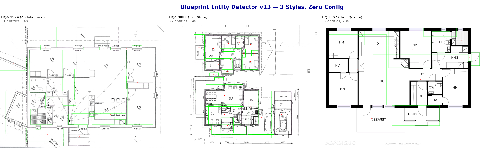
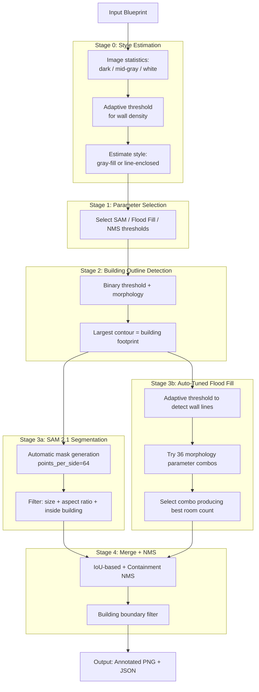
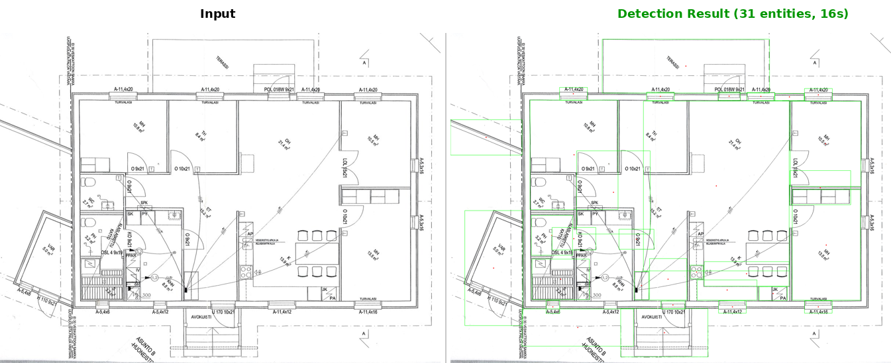
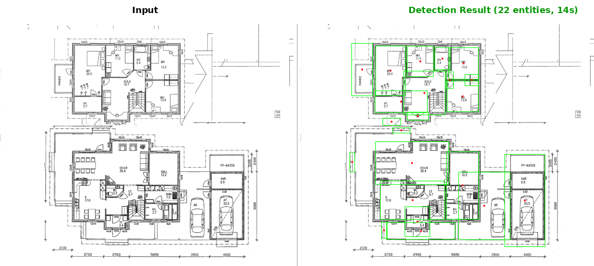
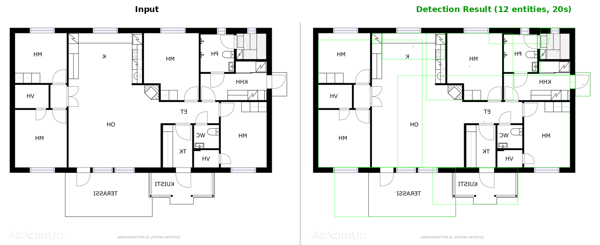

# Blueprint Region Detector

[](https://www.python.org/downloads/)
[](https://github.com/facebookresearch/sam2)
[](https://opensource.org/licenses/MIT)

Cross-style blueprint entity detection using **SAM 2.1 + Auto-Tuned Flood Fill** hybrid architecture. Validated on multiple public architectural floor plan styles.



## Features

- **Cross-style detection**: Works on gray-fill structural drawings, line-enclosed floor plans, and colored blueprints
- **SAM 2.1 + Flood Fill hybrid**: SAM segments textured entities, Flood Fill detects wall-enclosed rooms
- **Auto-tuned morphology**: Tries 36 parameter combos per image, picks best
- **Building outline filter**: Automatically detects building footprint, removes outside noise
- **JSON output**: Entity coordinates, areas, and center points

## Quick Start

### 1. Install SAM 2.1

```bash
git clone https://github.com/facebookresearch/sam2.git && cd sam2
pip install -e .
```

### 2. Download Checkpoint

```bash
wget https://dl.fbaipublicfiles.com/segment_anything_2/092824/sam2.1_hiera_large.pt -O checkpoints/sam2.1_hiera_large.pt
```

### 3. Install Dependencies

```bash
pip install opencv-python numpy torch torchvision
```

### 4. Run Detection

```bash
python detect_v13.py input.png -o output/ -m checkpoints/sam2.1_hiera_large.pt
```

## Requirements

- Python 3.10+
- CUDA-enabled GPU (16GB+ VRAM recommended)
- PyTorch 2.5.1+
- SAM 2.1 (installed from source)
- OpenCV

## Running on Azure

This project was developed and tested on **Azure GPU Virtual Machines**.

| Item | Details |
|------|--------|
| **VM SKU** | [Standard_NV36adms_A10_v5](https://learn.microsoft.com/en-us/azure/virtual-machines/nva10v5-series) |
| **GPU** | NVIDIA A10 (24GB GDDR6) |
| **vCPU / Memory** | 36 vCPUs / 440 GB RAM |
| **OS** | Ubuntu 22.04 LTS |

### Why A10 Is Sufficient

- SAM 2.1 hiera_large (224M params) + Flood Fill requires ~12GB GPU memory
- Single A10 (24GB) handles the full pipeline with headroom
- Processing time: 12-20 seconds per blueprint at 2000px resolution
- For CPU-only environments, SAM 2.1 runs without modification (slower)

## Usage

```bash
python detect_v13.py <input_image> -o <output_dir> -m <sam2_checkpoint>
```

### Parameters

| Parameter | Default | Description |
|-----------|---------|-------------|
| `-m, --model` | checkpoints/sam2.1_hiera_large.pt | SAM 2.1 checkpoint |
| `--config` | configs/sam2.1/sam2.1_hiera_l.yaml | SAM 2.1 config |
| `-o, --output` | . | Output directory |
| `--max-size` | 2000 | Max image dimension |
| `--sam-points` | 64 | SAM grid density |
| `--show-style` | - | Print style analysis details |

### Output Format

- `<input>_v13.png` — Annotated image with green bounding boxes and red center points
- `<input>_v13.json` — JSON with style analysis, entity coordinates, and statistics

## Architecture



### Why Hybrid Architecture?

| Component | Strength | Weakness |
|-----------|----------|----------|
| **SAM 2.1** | Segments textured regions (furniture, fixtures, small structures) | Cannot segment featureless white enclosed spaces |
| **Flood Fill** | Detects wall-enclosed rooms (white spaces) | Sensitive to wall line gaps, may over-segment |
| **Combined** | **Complementary coverage → near-complete room detection** | |

## Example Output

```
🚀 Blueprint Region Detector v13
   Device: cuda (NVIDIA A10-24Q)
   Input: floor_plan.png
   Size: 4344x3266 -> 2000x1503 (scale=0.46)
   [SAM 2.1] Segmenting...
   [SAM 2.1] 282 masks -> 100 entities
   [Flood Fill] Auto-tuning...
   [Flood Fill] 16 entities

📊 Total: 31 entities (SAM:100 + Flood:16) in 16.1s
   ✅ Saved: output/floor_plan_v13.png
   ✅ Saved: output/floor_plan_v13.json
```

## Detection Results

Tested on [CubiCasa5K](https://zenodo.org/record/2613548) public dataset — **same code, same parameters, zero manual tuning**.

### HQA 1579 — Architectural, Single-Floor (4344×3266)



- **31 entities detected** in 16 seconds
- Rooms, corridors, bathroom fixtures, kitchen elements all identified
- Green bounding boxes mark detected entities, red dots mark center points

### HQA 3883 — Architectural, Two-Story (1592×1316)



- **22 entities detected** in 14 seconds
- Both floors processed, rooms and structural elements identified
- Demonstrates cross-complexity generalization

### HQ 8507 — High-Quality B/W Floor Plan (4000×3000)



- **12 entities detected** in 20 seconds
- Clean black-and-white floor plan with thick wall lines
- Flood Fill effectively detects enclosed room spaces

### Summary

| Blueprint | Style | Size | Entities | Speed |
|-----------|-------|:----:|:--------:|:-----:|
| HQA 1579 | Architectural, single-floor | 4344×3266 | 31 | 16s |
| HQA 3883 | Architectural, two-story | 1592×1316 | 22 | 14s |
| HQ 8507 | High-quality B/W | 4000×3000 | 12 | 20s |

## Version History

| Version | Model | Architecture | Status |
|---------|-------|-------------|--------|
| v2-v6 | SAM 1 ViT-B/H | SAM + OpenCV CC | Gray-fill only |
| v11 | SAM 1 ViT-H | Two-stage (SAM + CC) | Production for gray-fill |
| **v13** | **SAM 2.1 hiera_large** | **SAM 2.1 + Auto Flood Fill** | **Current best cross-style baseline** |

### Key Improvements v11 → v13

| Metric | v11 | v13 |
|--------|:---:|:---:|
| Model | SAM 1 ViT-H (636M) | SAM 2.1 hiera_large (224M) |
| Speed | 70s/image | **12-20s/image** |
| Gray-fill blueprints | ✅ | ✅ |
| Line-enclosed floor plans | ❌ | ✅ |
| Colored blueprints | ❌ | ✅ |
| Auto parameter tuning | ❌ | ✅ |

## Limitations

- Detection quality varies by blueprint complexity (7-9/10 range across styles)
- White featureless rooms depend on Flood Fill quality (wall line completeness)
- Very small rooms (<3% of image area) may be missed
- Overlapping bounding boxes may occur when SAM and Flood Fill detect same region

## Accuracy & Honest Assessment

This is our measured performance on CubiCasa5K public dataset (eagle-eye GPT-4o evaluation):

| Blueprint | Precision | Recall | Overall Score |
|-----------|:---------:|:------:|:-------------:|
| HQA 1579 | ~73% | ~94% | 8.5/10 |
| HQA 3883 | ~85% | ~90% | 9/10 |
| HQ 8507 | ~90% | ~90% | 8/10 |
| **Average** | **~83%** | **~91%** | **8.5/10** |

**What works well**: Rooms with clear wall boundaries, furniture/fixtures, structural elements.

**What doesn't work well**: Large featureless white rooms that SAM cannot segment (mitigated by Flood Fill), very small utility spaces (<3% image area), and text annotations occasionally detected as entities.

## Approaches Explored & Lessons Learned

During development, we systematically evaluated multiple approaches. We document both successes and failures here to save readers time.

| Approach | Result | Why |
|----------|:------:|-----|
| **SAM 1 ViT-H (v11)** | ✅ Works for gray-fill | Gray-fill structural drawings only; 0 entities on line-enclosed floor plans |
| **SAM 2.1 (v13)** | ✅ Current best | 15x faster than SAM 1; works across styles with Flood Fill |
| **SAM 3 text-prompt** | ❌ Access denied | HuggingFace gated model; access request rejected by Meta |
| **Grounded-SAM2 (DINO + SAM 2.1)** | ❌ Failed | Grounding DINO cannot understand architectural drawings; detected only 4 objects covering entire image |
| **Florence-2** | ❌ Not suitable | Coordinate quantization (1000-bin) too coarse for precise center point localization |
| **OpenCV template matching** | ❌ No generalization | Parameters tuned for one blueprint fail completely on others |
| **GPT-4o Vision** | ❌ Failed | VLMs trained on natural images cannot interpret engineering drawings |
| **Pre-trained YOLO** | ❌ Failed | Not trained on architectural entities |

**Key lesson**: For engineering blueprint analysis, foundation models (SAM, DINO, Florence-2) trained on natural images have limited zero-shot capability. The hybrid approach (SAM segmentation + traditional CV post-processing) currently provides the best results without domain-specific training data.

## Business Scenario

**Problem**: A construction company has thousands of engineering blueprints (PDF/PNG). They need to automatically extract the positions and center coordinates of all structural entities (columns, walls, rooms) to feed into their BIM (Building Information Modeling) system. Manual annotation takes hours per blueprint.

**Solution**: This detector processes each blueprint in 12-20 seconds on a single Azure GPU VM, outputting a JSON file with bounding boxes and center point coordinates for every detected entity. The JSON can be directly imported into BIM software, CAD tools, or spatial databases.

**Azure Value**: A single Standard_NV36adms_A10_v5 VM (24GB GPU) handles the entire pipeline. No distributed computing, no cluster setup — one VM, one command, production results. Pay-as-you-go billing means the VM runs only when processing blueprints, keeping costs minimal.

## Industry Applications

The core pattern — **detect regions in technical drawings and output center point coordinates** — applies across many industries:

| Industry | Use Case | Input | Output |
|----------|----------|-------|--------|
| **Architecture / BIM** | Structural entity detection in floor plans | Engineering blueprints (PDF/PNG) | Column/wall coordinates → BIM system |
| **PCB Manufacturing** | Component detection on circuit boards | PCB layout images | Component center positions → pick-and-place |
| **Medical Imaging** | Lesion detection in CT/X-ray | DICOM images | Lesion locations + sizes |
| **Remote Sensing** | Building/vehicle detection in satellite imagery | Satellite/aerial photos | Object coordinates + areas |
| **Industrial QC** | Defect detection in manufacturing | Product inspection images | Defect positions + classifications |
| **Retail / Warehouse** | Shelf product detection | Store/warehouse photos | Product positions + counts |

The SAM 2.1 + Flood Fill hybrid architecture demonstrated here can be adapted to any of these scenarios by adjusting the detection and filtering parameters.

## Future Direction

| Phase | Approach | Expected Impact |
|-------|---------|-----------------|
| **Current (v13)** | SAM 2.1 + Auto Flood Fill | 7-9/10 across styles |
| **Phase 3** | SAM 3 text-prompt segmentation (`text="room"`) | Potentially 9-10/10, one-line detection |
| **Phase 4** | Fine-tune SAM 2.1 on CubiCasa5K (5000 labeled images) | Higher domain-specific quality and stability |
| **Phase 5** | VLM integration (GPT-4o pre-analysis → guided detection) | Unlimited style adaptation |

> SAM 3 (Meta, Nov 2025) introduces text-prompt segmentation that could potentially replace the entire hybrid architecture with a single API call. However, access is gated on Hugging Face and our request was rejected. Alternative approaches like Grounded-SAM2 (Grounding DINO + SAM 2.1) were also tested but failed on engineering drawings due to domain gap.

## License

[MIT License](LICENSE)

## Author

Xinyu Wei (魏新宇)
