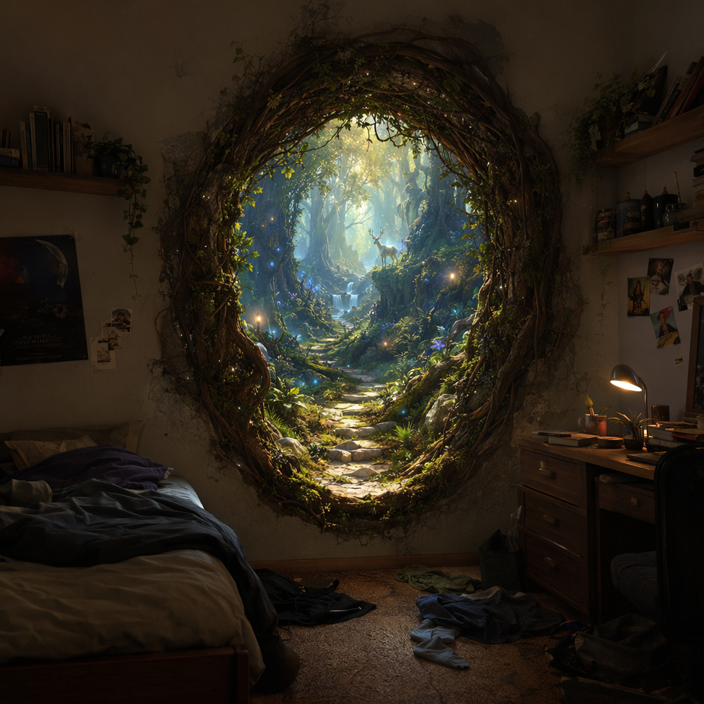
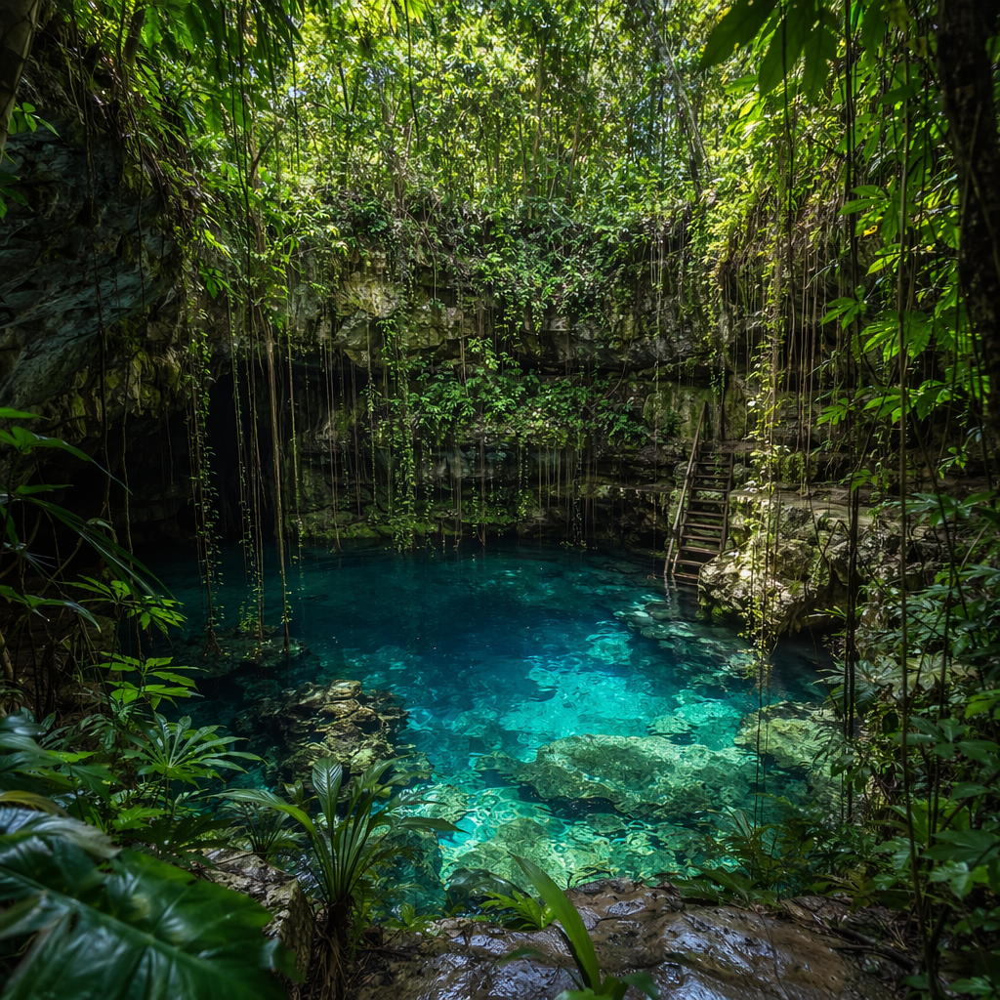
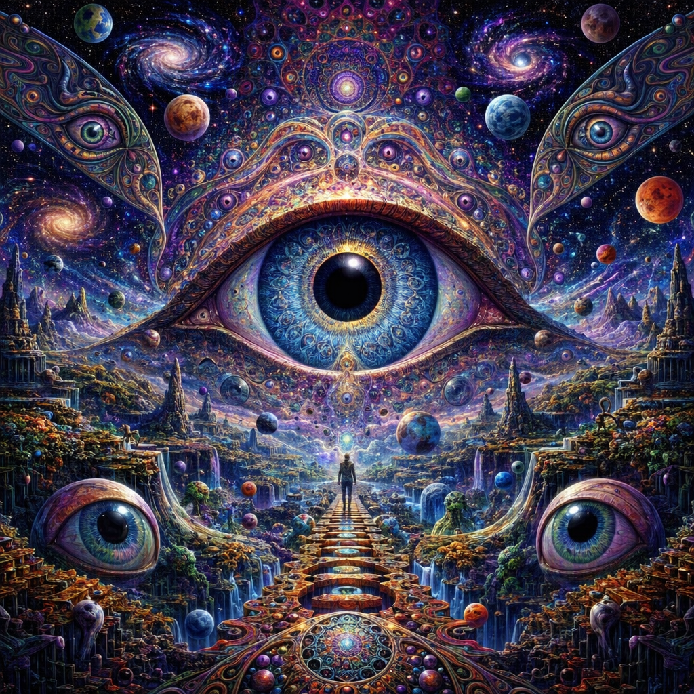
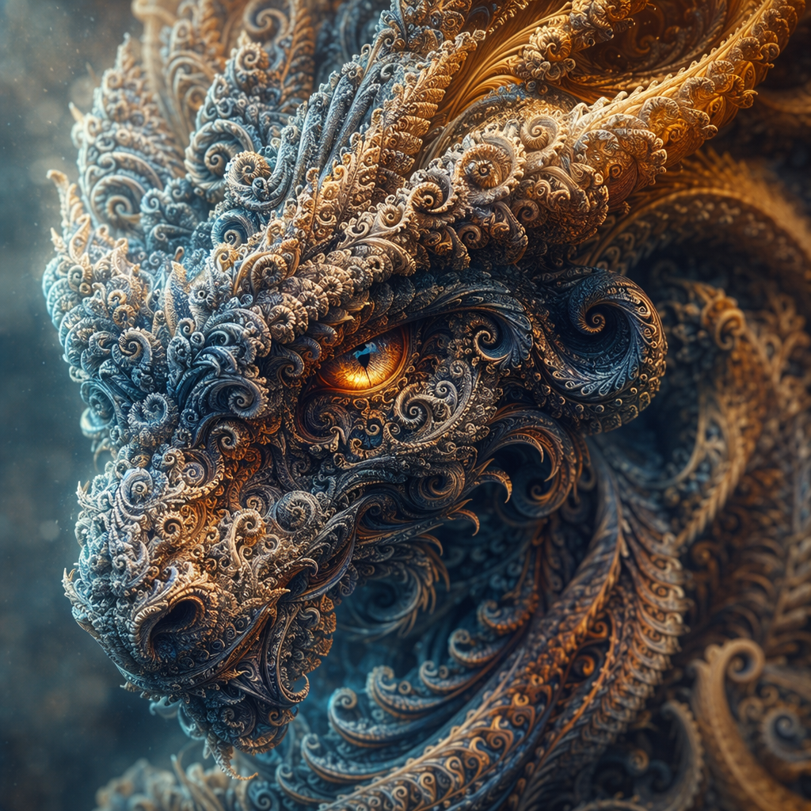
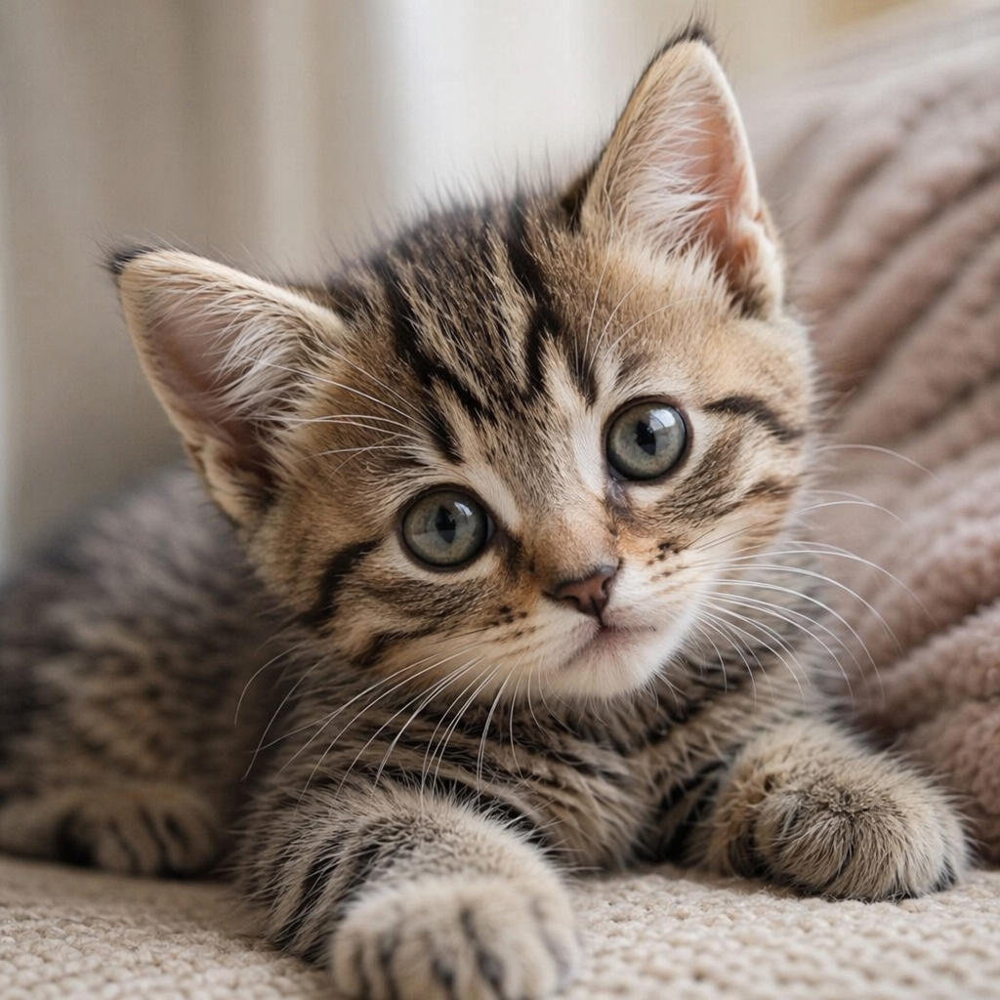
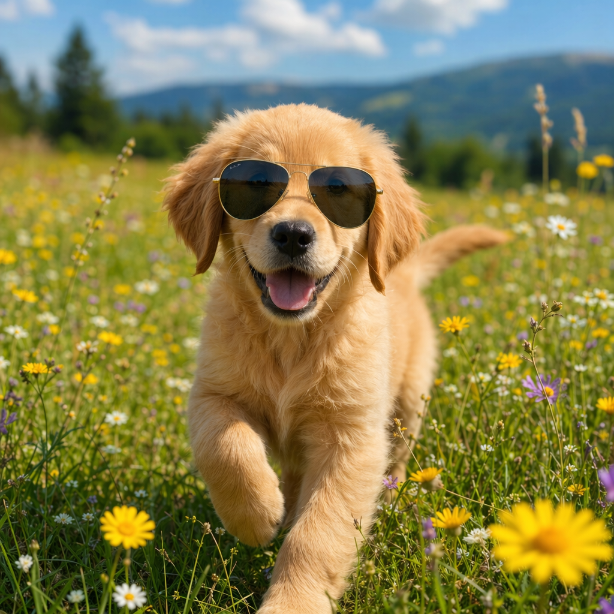

# GPT-Image-2 实测：Token 消耗、延迟与质量分析 — Azure OpenAI

本仓库通过实测验证 OpenAI GPT-Image-2 模型的 **Token Size Bucket** 机制，部署于 Azure OpenAI Service。核心问题：**`quality` 和 `size` 参数如何影响输出 Token 消耗和延迟？**

## Executive Summary

GPT-Image-2（`v2026-04-21`）使用**确定性 Token 分配**，由两个因素决定：`quality` 和 `size`。输出 Token **完全独立于 Prompt 内容** —— 相同的 quality+size 组合始终产生完全相同的 Token 数。

### Output Token 矩阵（3 种尺寸 × 3 种质量 = 9 种组合）

| Size ↓ \ Quality → | low | medium | high |
|:-------------------|:---:|:------:|:----:|
| **1024×1024**（正方形） | 208 | 805 | 3,171 |
| **1024×1536**（竖版） | 365 | 1,415 | 5,574 |
| **1536×1024**（横版） | 358 | 1,401 | 5,546 |

### 延迟矩阵（秒）

| Size ↓ \ Quality → | low | medium | high |
|:-------------------|:---:|:------:|:----:|
| **1024×1024** | 19.6 | 59.7 | 187.9 |
| **1024×1536** | 23.8 | 49.9 | 128.0 |
| **1536×1024** | 27.3 | 46.9 | 128.9 |

> **测试条件**：gpt-image-2 `v2026-04-21`，Azure OpenAI `api-version=2025-04-01-preview`，GlobalStandard 部署（capacity=9），East US 2 区域。Prompt："A golden retriever puppy in a sunlit meadow"（16 input tokens）。每种组合测试一次。延迟为客户端端到端测量（WSL on Windows，East US 区域）。

**核心发现**：

1. **Output tokens = f(size, quality)** —— Prompt 内容对输出 Token 无影响。通过 4 个不同 Prompt（3–20 词）在 1024×1024 low 下验证：全部返回 208 tokens。
2. **竖版/横版 Token 约为正方形的 1.75 倍** —— 与像素数之比 1.5 倍（1,572,864 vs 1,048,576 像素）基本吻合。
3. **竖版 ≈ 横版** —— 1024×1536 和 1536×1024 产生几乎相同的 Token（365 vs 358, 1415 vs 1401, 5574 vs 5546），存在轻微方向差异。
4. **延迟由 quality 和 size 共同决定**，与 prompt 内容无关 — high quality 比 low 慢 2–10 倍。size 也影响延迟（竖版/横版与正方形可能差 10–30%）。

## Background

### 什么是 "Token Size Bucket"？

[Introducing GPT-Image-2 in Microsoft Foundry](https://techcommunity.microsoft.com/blog/azure-ai-foundry-blog/introducing-openais-gpt-image-2-in-microsoft-foundry/4514417) 博客描述了 **Mode 2 — Token size bucket selection** 机制：

- Routing layer 从 **6 个 Token 桶**中选择：16、24、36、48、64、96
- 映射到 Legacy Size Tier：`smimage`、`image`、`xlimage`
- 系统分析 Prompt 复杂度、细节需求和场景类型，自动选择桶

**这不是用户可配置的参数。** API 中没有 `token_bucket` 或 `output_token_count` 参数。用户通过以下方式间接影响 Token 分配：

1. **`quality` 参数**（low / medium / high）—— 主要控制手段
2. **`size` 参数**（1024x1024、1024x1536、1536x1024）—— 分辨率控制
3. **Prompt 复杂度** —— 系统可能根据 Prompt 分析调整分配

### 模型信息

| 属性 | 值 | 来源 |
|:-----|:---|:-----|
| Model（模型） | gpt-image-2 | [Azure Model Catalog](https://learn.microsoft.com/en-us/azure/foundry/foundry-models/concepts/models-sold-directly-by-azure) |
| Version（版本） | 2026-04-21 | `az cognitiveservices account list-models` |
| Status（状态） | Generally Available | Model catalog |
| Format（格式） | OpenAI | Azure deployment |
| Deprecation（退役） | 2027-04-21 | Model catalog |
| API Capabilities（能力） | imageGenerations, imageEdits, convo2im | Model capabilities |

### API 响应结构

GPT-Image-2 相比 GPT-Image-1.5 返回更丰富的响应结构：

```json
{
  "created": 1776825308,
  "background": "opaque",
  "data": [{ "b64_json": "<base64 image data>" }],
  "output_format": "png",
  "quality": "low",
  "size": "1024x1024",
  "usage": {
    "input_tokens": 9,
    "input_tokens_details": {
      "image_tokens": 0,
      "text_tokens": 9
    },
    "output_tokens": 208,
    "total_tokens": 217
  }
}
```

相比 GPT-Image-1.5 的新增字段：
- `background`："opaque"（或请求时可为 "transparent"）
- `output_format`："png" / "jpeg"
- `usage.input_tokens_details`：文本 vs 图像输入 Token 的细分
- 完整 `usage` 对象含 `output_tokens`（GPT-Image-1.5 在 `data[0]` 中使用 `num_output_tokens`）

## Methodology（测试方法）

### 测试设计

- **模型**：gpt-image-2 `v2026-04-21`，Azure OpenAI（East US 2）
- **API 版本**：`2025-04-01-preview`
- **部署**：GlobalStandard，capacity=9
- **尺寸**：1024x1024（固定）
- **Quality 级别**：low、medium、high
- **Prompt**：
  1. 简单：*"A simple red circle on white background"*（最简场景）
  2. 复杂：*"A photorealistic golden retriever puppy sitting in a sunlit meadow with wildflowers, shallow depth of field, professional photography"*（高复杂度场景）

### 变量控制

| 变量 | 状态 | 值 |
|:-----|:-----|:---|
| Model（模型） | 固定 | gpt-image-2 |
| Size（尺寸） | 固定 | 1024x1024 |
| n（数量） | 固定 | 1 |
| Quality（质量） | **变量** | low / medium / high |
| Prompt（提示词） | **变量** | Simple / Complex |

## Results（实测结果）

### 各 Quality 级别的 Token 使用量

| Prompt | Quality | Input Tokens | Output Tokens | Total Tokens |
|:-------|:--------|:------------|:-------------|:-------------|
| Simple ("red dot") | low | 9 | **208** | 217 |
| Simple ("red dot") | medium | 9 | **805** | 814 |
| Simple ("red dot") | high | 9 | **3,171** | 3,180 |
| Complex ("golden retriever") | low | 32 | **208** | 240 |
| Complex ("golden retriever") | medium | 32 | **805** | 837 |
| Complex ("golden retriever") | high | 32 | **3,171** | 3,203 |

**关键发现**：

1. **输出 Token 完全由 `quality` 决定**，与 Prompt 复杂度无关。简单和复杂 Prompt 在相同 quality 下产生完全相同的输出 Token。
2. **输入 Token 随 Prompt 长度变化** —— 5 词 Prompt 为 9 个 Token，20 词 Prompt 为 32 个 Token。
3. **Token 倍率**：low : medium : high = 1 : 3.87 : 15.24

### 生成图片 — 视觉对比

#### Prompt："A golden retriever puppy in a sunlit meadow"（同一 Prompt 覆盖全部 9 种组合）

**1024×1024（正方形）**

| Low (208 tokens, 19.6s) | Medium (805 tokens, 59.7s) | High (3,171 tokens, 187.9s) |
|:---:|:---:|:---:|
|  |  |  |

**1024×1536（竖版）**

| Low (365 tokens, 23.8s) | Medium (1,415 tokens, 49.9s) | High (5,574 tokens, 128.0s) |
|:---:|:---:|:---:|
|  |  |  |

**1536×1024（横版）**

| Low (358 tokens, 27.3s) | Medium (1,401 tokens, 46.9s) | High (5,546 tokens, 128.9s) |
|:---:|:---:|:---:|
|  |  |  |

#### 早期测试 — 不同 Prompt，1024×1024

**11 个不同 Prompt，全部 medium quality，1024×1024** — 验证 output tokens 与 prompt 无关：

| # | Prompt | Input Tokens | Output Tokens | Latency (s) |
|:--|:-------|:------------|:-------------|:-----------|
| 01 | Chrome kimono maiden, metallic flowers, cinematic lighting | 17 | **805** | 61.3 |
| 02 | A portal into a mythical forest on a bedroom wall | 20 | **805** | 62.0 |
| 03 | A tiny astronaut hatching from an egg on the moon | 17 | **805** | 63.8 |
| 04 | Cute fluffy creature fantasy, dreamlike, surrealism | 21 | **805** | 60.3 |
| 05 | A hidden cenote in a lush jungle, turquoise waters | 18 | **805** | 64.0 |
| 06 | Girl with silver pixie-cut hair, holographic interface | 20 | **805** | 66.0 |
| 07 | Universe, LSD, Fractal Worlds, Giant Eyes | 16 | **805** | 71.0 |
| 08 | Close up render of a mythical creature, spiraling fractals | 19 | **805** | 59.7 |
| 09 | An angry cat playing drums | 11 | **805** | 62.3 |
| 10 | A monkey playing music in a jazz club | 14 | **805** | 64.5 |
| 11 | Watercolor painting of Venice canals at sunset | 17 | **805** | 64.2 |

> **11/11 全部返回 805 output tokens。** Input tokens 范围 11–21，延迟 59.7–71.0s（σ=3.1s）。确认 output tokens 是**确定性的，与 prompt 无关**。

| | | |
|:---:|:---:|:---:|
|  |  |  |
| *01: 金属和服少女* | *02: 神秘森林传送门* | *03: 月球上孵化的宇航员* |
|  |  |  |
| *04: 毛茸茸的幻想生物* | *05: 丛林天坑* | *06: 银发全息少女* |
|  |  |  |
| *07: 分形宇宙* | *08: 分形生物* | *09: 愤怒猫打鼓* |
|  |  | |
| *10: 爵士猴* | *11: 威尼斯水彩* | |

#### 补充验证 — 简单 Prompt，1024×1024

Prompt 1："A simple red circle on white background"

| Low (208 tokens) | Medium (805 tokens) | High (3,171 tokens) |
|:---:|:---:|:---:|
|  |  |  |

Prompt 2："A photorealistic golden retriever puppy sitting in a sunlit meadow with wildflowers..."

| Low (208 tokens) | Medium (805 tokens) | High (3,171 tokens) |
|:---:|:---:|:---:|
|  |  |  |

> 以上三组 1024×1024 low 结果均返回 208 output tokens —— 确认 **Prompt 内容不影响 Token 数量**。

## 结论

基于 26 次 API 调用（3 种尺寸 × 3 种质量 + 11 个不同 prompt）：

### 1. Output tokens 是 (size, quality) 的确定性函数

Output tokens **不受 prompt 内容影响**。我们用 11 个完全不同的 prompt（从"愤怒猫打鼓"到复杂电影摄影描述）测试 medium + 1024×1024 — 全部 11 次返回 805 output tokens，零偏差。映射是一个固定查表：

| Size ↓ \ Quality → | low | medium | high |
|:-------------------|:---:|:------:|:----:|
| **1024×1024** | 208 | 805 | 3,171 |
| **1024×1536** | 365 | 1,415 | 5,574 |
| **1536×1024** | 358 | 1,401 | 5,546 |

### 2. 延迟主要由 quality 和 size 决定，prompt 影响微弱

我们测试了极端 prompt 长度，均为 medium + 1024×1024：

| Prompt | 字符数 | Input Tokens | Latency |
|:-------|:------|:------------|:--------|
| "cat"（最短） | 3 | 7 | 60.6s |
| 11 个中等 prompt | 20–60 | 11–21 | 59.7–71.0s |
| 800+ 字符日本庙宇场景（最长） | 959 | 170 | 67.1s |

Input tokens 差 **24 倍**（7 vs 170），延迟仅差 **~10%**（60.6s vs 67.1s）。Prompt 长度对延迟有轻微影响，但 `quality` 和 `size` 才是主因（low ~20s vs medium ~60s vs high ~130–188s，差数倍）。

| "cat"（3 字符, 7 input tokens, 60.6s） | 日本庙宇场景（959 字符, 170 input tokens, 67.1s） |
|:---:|:---:|
|  |  |

> 两张图均产生 **805 output tokens**，尽管 prompt 长度差 24 倍。

### 3. TC Blog 的 "token size bucket" 并非由 prompt 驱动

[TC Blog](https://techcommunity.microsoft.com/blog/azure-ai-foundry-blog/introducing-openais-gpt-image-2-in-microsoft-foundry/4514417) 描述 Mode 2 为 routing layer 根据 prompt 分析选择 token 桶。我们的测试表明，**实际上桶的选择完全由 `quality` 和 `size` 参数决定** —— prompt 复杂度不起作用。用户不需要关心桶的选择，只需要上面的查表即可。

### 4. 改图（Image Edit）实测：时间、成本、渲染结果

我们在 1024x1024 下用同一输入图和同一 prompt 测试了 edit API：

- 输入图：`images/matrix/1024x1024_medium.png`
- Prompt：`Add cool sunglasses to the dog`
- 端点：`/images/edits`
- API 版本：`2025-04-01-preview`

| Quality | Input Tokens | Output Tokens | Total Tokens | Latency | 预估单图成本 (USD) |
|:--------|:------------:|:-------------:|:------------:|:-------:|:------------------:|
| low | 1,037 | 208 | 1,245 | 55.3s | 0.0114 |
| medium | 1,037 | 805 | 1,842 | 92.5s | 0.0293 |
| high | 1,037 | 3,171 | 4,208 | 239.7s | 0.1003 |

> 成本公式（预估）：`input_tokens * 5/1M + output_tokens * 30/1M`（来源：[OpenAI API Pricing](https://openai.com/api/pricing/)）。Azure 官方 GPT-Image-2 定价发布后可能与此不同。

| low (55.3s) | medium (92.5s) | high (239.7s) |
|:---:|:---:|:---:|
|  |  |  |

关键观察：改图场景下，三个 quality 的 `input_tokens` 都固定为 1,037（image tokens 占主导）；`output_tokens` 仍然沿用与生图相同的质量桶模式（1024x1024 下 208/805/3171）。

## Token 数据获取方式

Output token 数量是 **Azure OpenAI API 在响应体中直接返回的**，不是客户端计算或估算的。

### API 响应结构

调用图像生成端点时，响应包含 `usage` 对象：

```json
{
  "created": 1776825422,
  "background": "opaque",
  "data": [{ "b64_json": "<base64 image>" }],
  "output_format": "png",
  "quality": "medium",
  "size": "1024x1024",
  "usage": {
    "input_tokens": 9,
    "input_tokens_details": {
      "image_tokens": 0,
      "text_tokens": 9
    },
    "output_tokens": 805,
    "total_tokens": 814
  }
}
```

### 提取 Token 用量的代码

```python
import requests, json

endpoint = "https://YOUR_RESOURCE.openai.azure.com"
api_key = "YOUR_KEY"
url = f"{endpoint}/openai/deployments/gpt-image-2/images/generations?api-version=2025-04-01-preview"

resp = requests.post(url,
    headers={"api-key": api_key, "Content-Type": "application/json"},
    json={"prompt": "a cat", "quality": "medium", "size": "1024x1024", "n": 1},
    timeout=300,
)
data = resp.json()

# Token 用量在响应体中 — 服务端权威数据
usage = data["usage"]
print(f"Input tokens:  {usage['input_tokens']}")
print(f"Output tokens: {usage['output_tokens']}")   # 这是计费指标
print(f"Total tokens:  {usage['total_tokens']}")

# 验证内部一致性
assert usage["total_tokens"] == usage["input_tokens"] + usage["output_tokens"]
```

### 为什么这个数据是权威的

| 维度 | 说明 |
|:-----|:-----|
| **来源** | `response.usage.output_tokens` — Azure OpenAI 服务端返回，与计费使用同一字段 |
| **格式** | 与 Chat Completions API 的 `usage` 对象完全一致 — OpenAI 标准规范 |
| **一致性** | 全部 26 次调用 `total_tokens = input_tokens + output_tokens` 均成立 |
| **非客户端** | Token 数量不是从图片文件大小、base64 长度或客户端 tokenizer 推导的 |
| **确定性** | 11 个不同 prompt 在相同 quality+size 下全部返回相同的 `output_tokens` 值 |

## 如何选择合适的 Quality

| 使用场景 | 推荐 Quality | 原因 |
|:---------|:------------|:-----|
| 缩略图 / 预览图 | **low** | Token 消耗最少，速度最快（~20s） |
| 营销 / 社交媒体 | **medium** | 细节与速度的良好平衡 |
| 印刷 / 专业用途 | **high** | 最高细节，但 Token 消耗 15 倍，延迟约 3 分钟 |
| 原型设计 / 迭代 | **low** | 快速反馈，最低 Token 消耗 |
| 大规模 A/B 测试 | **low** 或 **medium** | 批量生成的 Token 效率最优 |

## Known Limitations（已知限制）

1. **无重复测试**：每种 size×quality 组合仅测试一次。方差分析需要多次运行。
2. **矩阵只用了一个 Prompt**：3×3 矩阵使用同一 Prompt。Token 确定性仅在 1024×1024 low 下用 4 个 Prompt 验证。
3. **Preview API**：使用 `2025-04-01-preview` —— GA 版本行为可能变化。
4. **单一区域**：仅 East US 2。延迟因区域和负载而异。
5. **延迟为端到端测量**：包含客户端网络 RTT，不是纯生成时间。

## Reproducing the Benchmark（复现测试）

### 前置条件

- Azure 订阅，已开通 Azure OpenAI 访问权限
- GPT-Image-2 模型访问权限（限制访问 — [在此申请](https://aka.ms/oai/gptimage1access)）
- Python 3.8+，安装 `openai` 包

### 环境搭建

```bash
git clone https://github.com/david-share/Multimodal-Models.git
cd Multimodal-Models/GPT-Image-2-Token-Bucket-Benchmark
pip install openai azure-identity
```

### 部署模型

```bash
az cognitiveservices account deployment create \
  --name YOUR_RESOURCE_NAME \
  --resource-group YOUR_RG \
  --deployment-name gpt-image-2 \
  --model-name gpt-image-2 \
  --model-version "2026-04-21" \
  --model-format OpenAI \
  --sku-capacity 9 \
  --sku-name GlobalStandard
```

### 运行测试

```bash
export AZURE_OPENAI_ENDPOINT="https://YOUR_RESOURCE.openai.azure.com/"
export AZURE_OPENAI_KEY="YOUR_KEY"

python scripts/benchmark_gpt_image2.py \
  --endpoint $AZURE_OPENAI_ENDPOINT \
  --key $AZURE_OPENAI_KEY \
  --deployment gpt-image-2
```

### 脚本清单

| 脚本 | 用途 |
|:-----|:-----|
| `scripts/benchmark_gpt_image2.py` | 基础测试 — 2 个 Prompt × 3 个 Quality，保存图片 + Token 数据 |
| `scripts/benchmark_size_quality_matrix.py` | 3×3 尺寸×质量矩阵 — 映射全部 9 种组合的 output tokens |
| `scripts/verify_token_determinism.py` | 运行 11 个不同 Prompt，固定 quality+size，证明 Token 确定性 |
| `scripts/benchmark_gpt_image2_edit.py` | 改图 API 测试 — 运行 low/medium/high，保存渲染结果与 token/延迟 CSV |

## References（参考资料）

- [Introducing GPT-Image-2 in Microsoft Foundry](https://techcommunity.microsoft.com/blog/azure-ai-foundry-blog/introducing-openais-gpt-image-2-in-microsoft-foundry/4514417) — TC Blog，描述 Token Bucket 机制
- [Azure OpenAI Image Generation](https://learn.microsoft.com/en-us/azure/foundry/openai/how-to/dall-e) — API 文档
- [Azure Foundry Models](https://learn.microsoft.com/en-us/azure/foundry/foundry-models/concepts/models-sold-directly-by-azure) — 模型目录

---

*Author: Xinyu Wei — 实测于 Azure OpenAI, 2026 年 4 月 22 日*

[](https://azure.microsoft.com)
