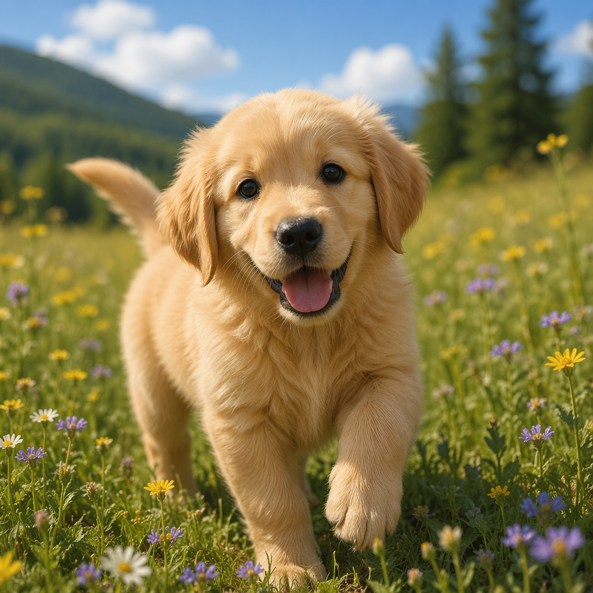
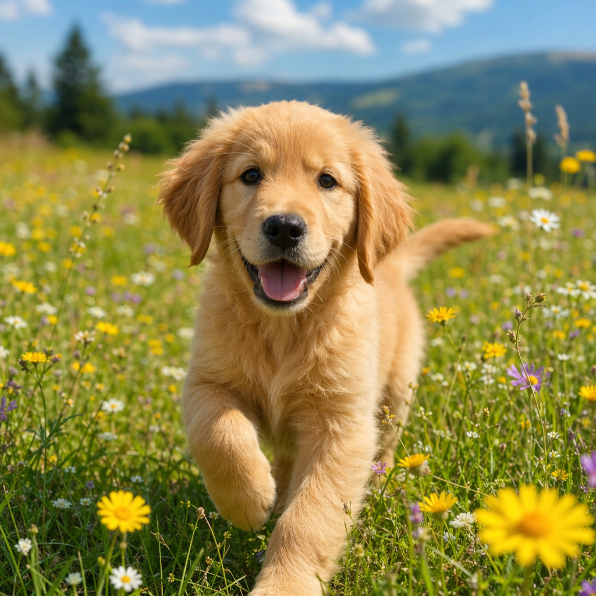
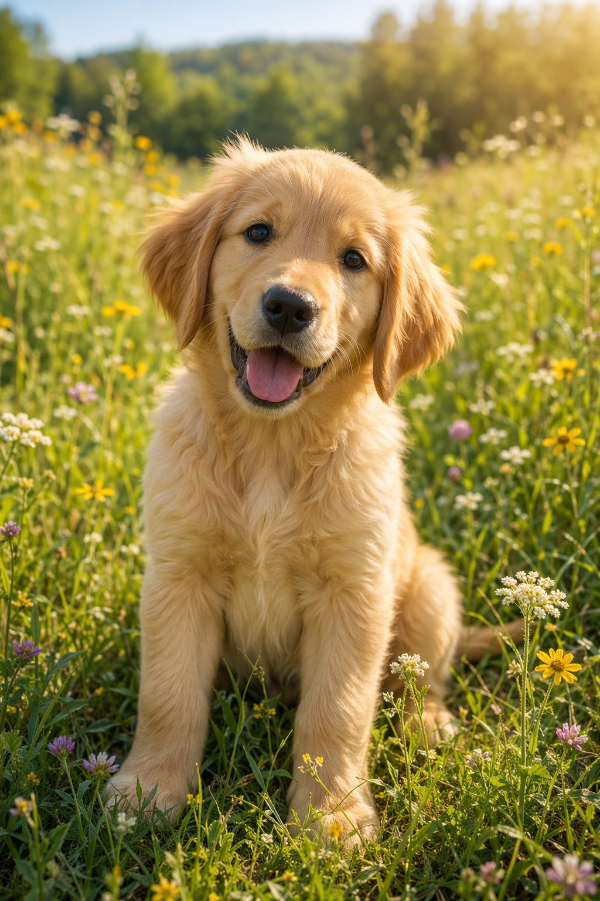
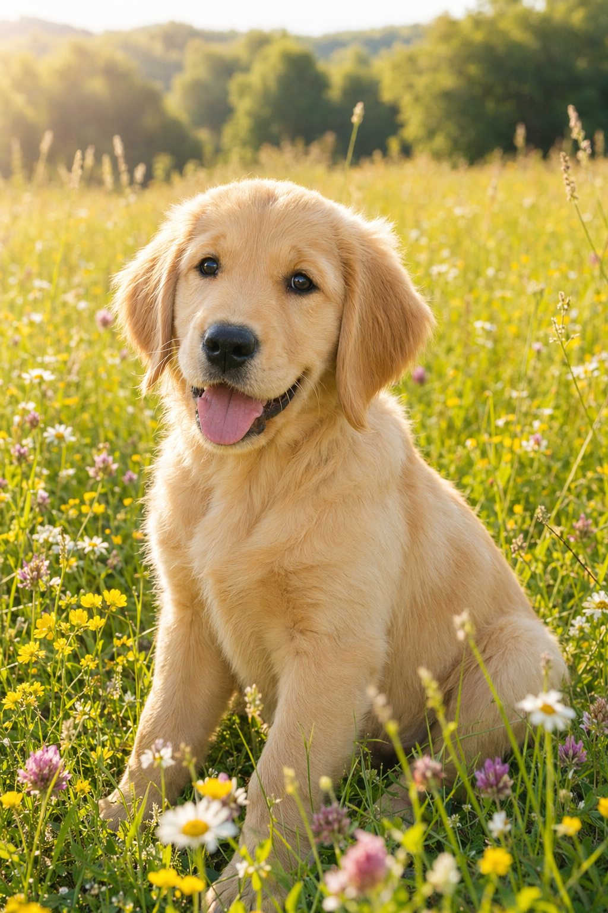
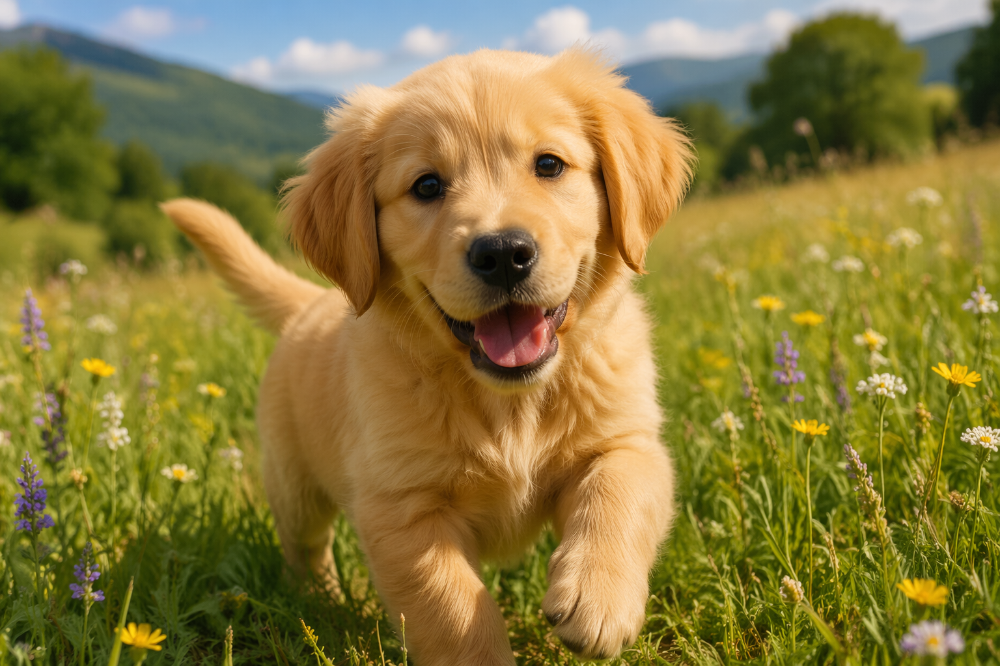
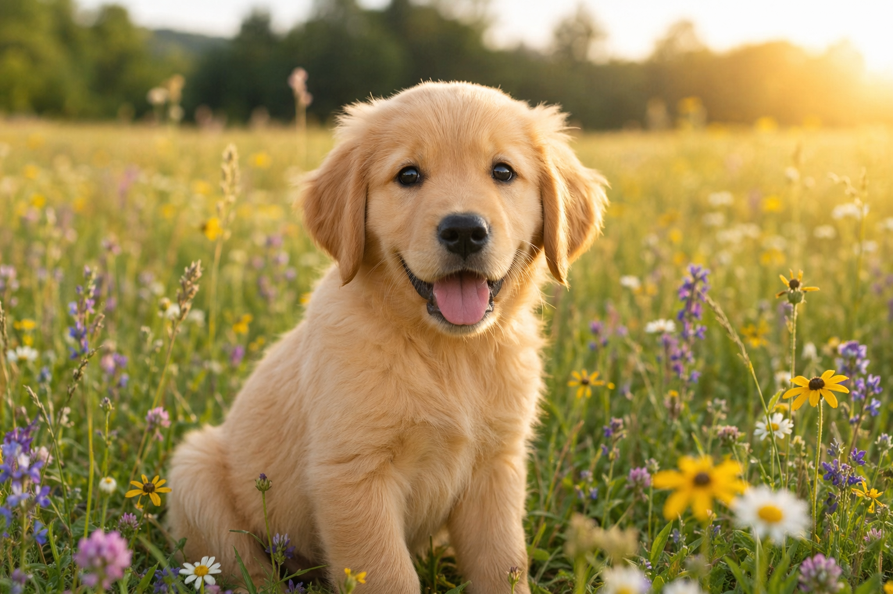
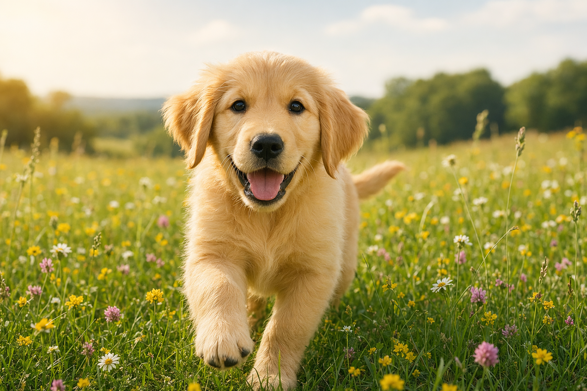
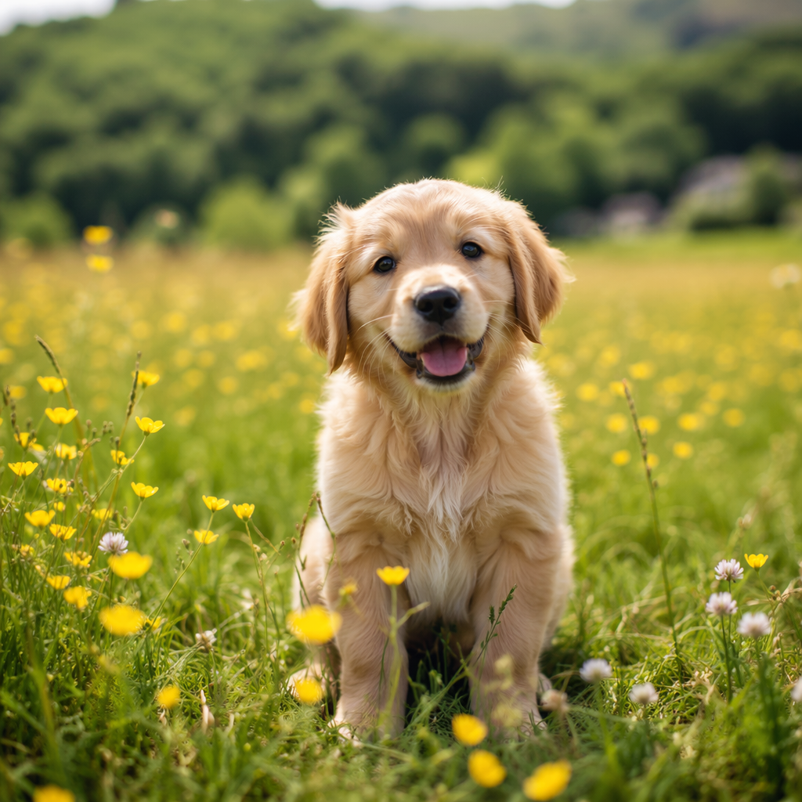
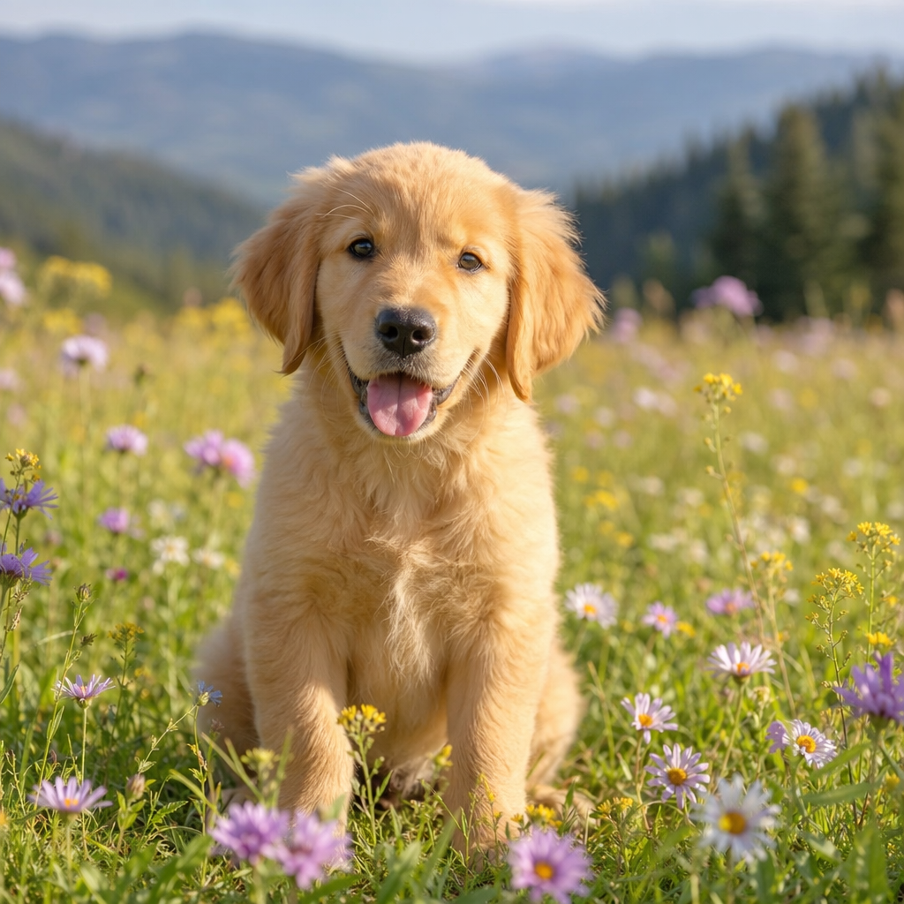
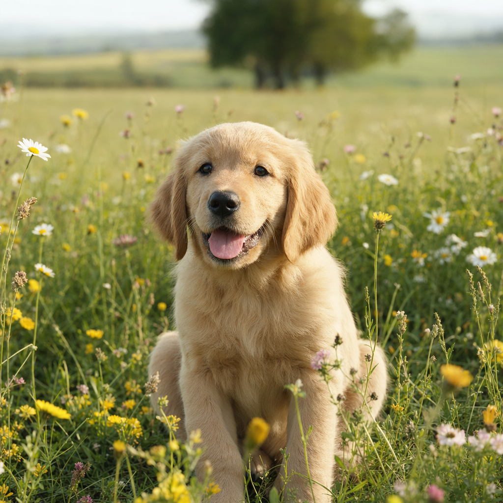

# GPT-Image-2 Token Bucket Benchmark on Azure OpenAI

This repository investigates the **token size bucket** mechanism in OpenAI's GPT-Image-2 model, deployed via Azure OpenAI Service. We provide hands-on benchmark data answering the key question: **How do `quality` and `size` parameters affect output token consumption and latency?**

## Executive Summary

GPT-Image-2 (`v2026-04-21`) uses a **deterministic token allocation** based on two factors: `quality` and `size`. Output tokens are **completely independent of prompt content** — the same quality+size combination always produces the exact same token count.

### Output Token Matrix (3 sizes × 3 qualities = 9 combinations)

| Size ↓ \ Quality → | low | medium | high |
|:-------------------|:---:|:------:|:----:|
| **1024×1024** (square) | 208 | 805 | 3,171 |
| **1024×1536** (portrait) | 365 | 1,415 | 5,574 |
| **1536×1024** (landscape) | 358 | 1,401 | 5,546 |

### Latency Matrix (seconds)

| Size ↓ \ Quality → | low | medium | high |
|:-------------------|:---:|:------:|:----:|
| **1024×1024** | 19.6 | 59.7 | 187.9 |
| **1024×1536** | 23.8 | 49.9 | 128.0 |
| **1536×1024** | 27.3 | 46.9 | 128.9 |

> **Test conditions**: gpt-image-2 `v2026-04-21`, Azure OpenAI `api-version=2025-04-01-preview`, GlobalStandard deployment (capacity=9), East US 2 region. Prompt: "A golden retriever puppy in a sunlit meadow" (16 input tokens). Each combination tested once. Latency measured end-to-end from the client (WSL on Windows, East US region).

**Key findings**:

1. **Output tokens = f(size, quality) only** — prompt content has zero effect. Verified with 4 different prompts (3–20 words) at 1024×1024 low: all returned exactly 208 tokens.
2. **Portrait/Landscape tokens are ~1.75× square** — matching the 1.5× pixel ratio (1,572,864 vs 1,048,576 pixels).
3. **Portrait ≈ Landscape** — 1024×1536 and 1536×1024 produce nearly identical tokens (365 vs 358, 1415 vs 1401, 5574 vs 5546), with slight directional variance.
4. **Latency scales with quality**, not with size — high quality takes 2–10× longer than low, but larger sizes are not consistently slower.

## Background

### What is the "Token Size Bucket"?

The [Introducing GPT-Image-2 in Microsoft Foundry](https://techcommunity.microsoft.com/blog/azure-ai-foundry-blog/introducing-openais-gpt-image-2-in-microsoft-foundry/4514417) blog describes a **Mode 2 — Token size bucket selection** mechanism:

- The routing layer selects from **six token size buckets**: 16, 24, 36, 48, 64, 96
- These map to legacy size tiers: `smimage`, `image`, `xlimage`
- The system analyzes prompt complexity, detail requirements, and scene type to automatically select a bucket

**This is NOT a user-configurable parameter.** There is no `token_bucket` or `output_token_count` API parameter. Users influence token allocation through:

1. **`quality` parameter** (low / medium / high) — primary control
2. **`size` parameter** (1024x1024, 1024x1536, 1536x1024) — resolution control
3. **Prompt complexity** — the system may adjust allocation based on prompt analysis

### Model Information

| Property | Value | Source |
|:---------|:------|:-------|
| Model | gpt-image-2 | [Azure Model Catalog](https://learn.microsoft.com/en-us/azure/foundry/foundry-models/concepts/models-sold-directly-by-azure) |
| Version | 2026-04-21 | `az cognitiveservices account list-models` |
| Status | Generally Available | Model catalog |
| Format | OpenAI | Azure deployment |
| Deprecation | 2027-04-21 | Model catalog |
| API Capabilities | imageGenerations, imageEdits, convo2im | Model capabilities |

### API Response Structure

GPT-Image-2 returns a richer response structure compared to GPT-Image-1.5:

```json
{
  "created": 1776825308,
  "background": "opaque",
  "data": [{ "b64_json": "<base64 image data>" }],
  "output_format": "png",
  "quality": "low",
  "size": "1024x1024",
  "usage": {
    "input_tokens": 9,
    "input_tokens_details": {
      "image_tokens": 0,
      "text_tokens": 9
    },
    "output_tokens": 208,
    "total_tokens": 217
  }
}
```

New fields compared to GPT-Image-1.5:
- `background`: "opaque" (or "transparent" if requested)
- `output_format`: "png" / "jpeg"
- `usage.input_tokens_details`: Breakdown of text vs image input tokens
- Full `usage` object with `output_tokens` (GPT-Image-1.5 used `num_output_tokens` in `data[0]`)

## Methodology

### Test Design

- **Model**: gpt-image-2 `v2026-04-21` on Azure OpenAI (East US 2)
- **API Version**: `2025-04-01-preview`
- **Deployment**: GlobalStandard, capacity=9
- **Size**: 1024x1024 (held constant)
- **Quality levels**: low, medium, high
- **Prompts**:
  1. Simple: *"A simple red circle on white background"* (minimal complexity)
  2. Complex: *"A photorealistic golden retriever puppy sitting in a sunlit meadow with wildflowers, shallow depth of field, professional photography"* (high complexity)

### Variable Control

| Variable | Status | Value |
|:---------|:-------|:------|
| Model | Fixed | gpt-image-2 |
| Size | Fixed | 1024x1024 |
| n | Fixed | 1 |
| Quality | **Variable** | low / medium / high |
| Prompt | **Variable** | Simple / Complex |

## Results

### Token Usage by Quality Level

| Prompt | Quality | Input Tokens | Output Tokens | Total Tokens |
|:-------|:--------|:------------|:-------------|:-------------|
| Simple ("red dot") | low | 9 | **208** | 217 |
| Simple ("red dot") | medium | 9 | **805** | 814 |
| Simple ("red dot") | high | 9 | **3,171** | 3,180 |
| Complex ("golden retriever") | low | 32 | **208** | 240 |
| Complex ("golden retriever") | medium | 32 | **805** | 837 |
| Complex ("golden retriever") | high | 32 | **3,171** | 3,203 |

**Key observations**:

1. **Output tokens are determined solely by `quality`**, not by prompt complexity. Both simple and complex prompts produce identical output tokens at each quality level.
2. **Input tokens scale with prompt length** — 9 tokens for a 5-word prompt vs 32 tokens for a 20-word prompt.
3. **Token ratios**: low : medium : high = 1 : 3.87 : 15.24

### Generated Images — Visual Comparison

#### Prompt: "A golden retriever puppy in a sunlit meadow" (same prompt across all 9 combinations)

**1024×1024 (Square)**

| Low (208 tokens, 19.6s) | Medium (805 tokens, 59.7s) | High (3,171 tokens, 187.9s) |
|:---:|:---:|:---:|
|  |  |  |

**1024×1536 (Portrait)**

| Low (365 tokens, 23.8s) | Medium (1,415 tokens, 49.9s) | High (5,574 tokens, 128.0s) |
|:---:|:---:|:---:|
|  |  |  |

**1536×1024 (Landscape)**

| Low (358 tokens, 27.3s) | Medium (1,401 tokens, 46.9s) | High (5,546 tokens, 128.9s) |
|:---:|:---:|:---:|
|  |  |  |

#### Earlier tests — different prompts at 1024×1024

Prompt 1: "A simple red circle on white background"

| Low (208 tokens) | Medium (805 tokens) | High (3,171 tokens) |
|:---:|:---:|:---:|
|  |  |  |

Prompt 2: "A photorealistic golden retriever puppy sitting in a sunlit meadow with wildflowers..."

| Low (208 tokens) | Medium (805 tokens) | High (3,171 tokens) |
|:---:|:---:|:---:|
|  |  |  |

> All three 1024×1024 low results above returned exactly 208 output tokens — confirming that **prompt content does not affect token count**.

## How to Choose the Right Quality

| Use Case | Recommended Quality | Why |
|:---------|:-------------------|:----|
| Thumbnails / previews | **low** | 15× fewer tokens, fast (~20s) |
| Marketing / social media | **medium** | Good balance of detail and speed |
| Print / professional | **high** | Maximum detail, but 15× more tokens and ~3 min latency |
| Prototyping / iteration | **low** | Fast feedback loop, minimal token usage |
| A/B testing at scale | **low** or **medium** | Low token consumption for bulk generation |

## Known Limitations

1. **No repeat runs**: Each size×quality combination tested once. Variance analysis requires multiple runs per combination.
2. **Single prompt per matrix**: The 3×3 matrix used one prompt. Token determinism verified with 4 prompts only at 1024×1024 low.
3. **Preview API**: Using `2025-04-01-preview` — behavior may change in GA.
4. **Region**: East US 2 only. Latency varies by region and load.
5. **Latency is end-to-end**: Includes network RTT from client, not pure generation time.

## Reproducing the Benchmark

### Prerequisites

- Azure subscription with Azure OpenAI access
- GPT-Image-2 model access (limited access — [apply here](https://aka.ms/oai/gptimage1access))
- Python 3.8+ with `openai` package

### Setup

```bash
git clone https://github.com/david-share/Multimodal-Models.git
cd Multimodal-Models/GPT-Image-2-Token-Bucket-Benchmark
pip install openai azure-identity
```

### Deploy the Model

```bash
az cognitiveservices account deployment create \
  --name YOUR_RESOURCE_NAME \
  --resource-group YOUR_RG \
  --deployment-name gpt-image-2 \
  --model-name gpt-image-2 \
  --model-version "2026-04-21" \
  --model-format OpenAI \
  --sku-capacity 9 \
  --sku-name GlobalStandard
```

### Run the Benchmark

```bash
export AZURE_OPENAI_ENDPOINT="https://YOUR_RESOURCE.openai.azure.com/"
export AZURE_OPENAI_KEY="YOUR_KEY"

python scripts/benchmark_gpt_image2.py \
  --endpoint $AZURE_OPENAI_ENDPOINT \
  --key $AZURE_OPENAI_KEY \
  --deployment gpt-image-2
```

### Script Inventory

| Script | Purpose |
|:-------|:--------|
| `scripts/benchmark_gpt_image2.py` | Main benchmark — tests quality levels, saves images + token data |

## References

- [Introducing GPT-Image-2 in Microsoft Foundry](https://techcommunity.microsoft.com/blog/azure-ai-foundry-blog/introducing-openais-gpt-image-2-in-microsoft-foundry/4514417) — TC Blog describing token bucket mechanism
- [Azure OpenAI Image Generation](https://learn.microsoft.com/en-us/azure/foundry/openai/how-to/dall-e) — API documentation
- [Azure Foundry Models](https://learn.microsoft.com/en-us/azure/foundry/foundry-models/concepts/models-sold-directly-by-azure) — Model catalog

---

*Author: Xinyu Wei — Tested on Azure OpenAI, April 22, 2026*

[](https://azure.microsoft.com)
