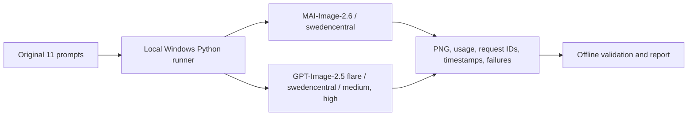

# MAI-Image-2.6 与 GPT-Image-2.5：全质量档位图像生成对比

[](https://learn.microsoft.com/en-us/azure/foundry/foundry-models/how-to/use-foundry-models-mai-image) [](data)    [](https://azure.microsoft.com/support/legal/preview-supplemental-terms/) [](tests)

MAI-Image-2.6 对 GPT-Image-2.5 的实测对比：同一客户端、同一账户、同一区域（swedencentral）。主线是 2026-09-20 的同会话运行——MAI 与 2.5 flare 的 medium、high 在 11 个文生图场景上交错调用两轮；其余档位、图像编辑、中英文文字渲染、账单成本和联网信息补充各有自己的小节与证据目录。所有画面判断为非盲评的差异描述，不产出质量评分或偏好胜负。

> **作者**: 魏新宇 (Xinyu Wei) — 微软 AI GBB 高级系统工程师

[English](README.md) | [中文](README-CN.md)

[逐题图片](#并排图片对比) · [图像编辑](#test-12-换帽子图像编辑) · [耗时与请求](#耗时与请求成功情况) · [六个档位](#gpt-image-25-的六个质量档位) · [成本](#每张图的实际成本来自本账户账单) · [文字渲染](#中英文文字渲染) · [联网补测](#联网信息补充测试) · [复现](#reproduction-how-to) · [原始证据](data/mai-vs-gpt25-20260920)

---

## 本仓库实测说明了什么

以下 5 条都只依据本仓库的实测记录；MAI-Image-2.6 处于 Preview，无 SLA。画质没有数值分数：并排图是证据，读者的判断是结论。

1. **同一会话里，MAI 的出图速度与 2.5 high 持平、慢于 2.5 medium。** 66/66 个样本返回图片；P50：MAI 31.61 s，2.5 medium 22.24 s（MAI 慢 1.42 倍），2.5 high 32.11 s（持平）。三组由同一客户端交错调用，没有区域或日期差。 2.5 low 在 2026-09-17 自己的会话里 P50 21.85 s，快于 MAI，但不是同一时段。

2. **按本账户账单，MAI 每千张 $38.91：是 2.5 low（$5.88）的 6.6 倍、2.5 medium（$13.17）的 3.0 倍，比 2.5 high（$52.68）便宜 26%。** 单价来自 Azure Cost Management 的实际计费，不是定价页；2.5 尚无公布价。「贵」只有先说清对比档位才成立；各档的画面差异在并排图里。

3. **难题集文字渲染：MAI 中英文都 100%，含简繁体陷阱。** 6 个场景 × 2 语言 × 2 轮，由校准过的视觉判读器读回：GPT-Image-2.5 Flare auto 漏 1 处（H3 zh r2）；GPT-Image-2.5 Flare max 漏 1 处（H4 en r2）；GPT-Image-2.5 Flare xhigh 漏 1 处（H4 en r2）。官方文档把 MAI 的 Languages 标为 `en`，中文结果是声明范围之外的观察。

4. **图像编辑：三个配置两轮都换上博士帽并保住全部 5 个保持项。** MAI 输出（1360×768）色彩与取景几乎等同原图，像只重绘了头部；2.5（1674×940）是整幅重生成，构图保持但纹理重绘，2.5 medium 两轮都把标题 ADVISORS 拼成 ASVISORS。逐图清单见第 12 题。

5. **`web_grounding=true` 可以在生成时补充联网信息。** 开启后模型从 Bing Search 检索当前信息作为额外上下文，实测让两个题目的产品文字事实从错误变为与官方发布一致；代价是首试成功率下降、耗时明显上升。这是 MAI 独有参数，无 GPT 对照。

## 并排图片对比

第 1–11 题为文生图，每题两轮。每轮第一行是 2026-09-20 同一会话交错调用的 MAI-Image-2.6、GPT-Image-2.5 Flare medium、GPT-Image-2.5 Flare high；第二行是 GPT-Image-2.5 Flare 其余档位，来自 2026-09-17、2026-09-18 用同一客户端、同一提示词文件的测量，日期标在表头。两行不是同一时段，图下耗时要连带日期看。Sunburst 是同一模型的第二个部署，图片留在证据目录，数字在后面的档位表里。点击图片查看原始 1024x1024 PNG。第 12 题为图像编辑，输入为一张真实照片。

### Test 1: 金属和服少女

> **Prompt**: Chrome kimono, a maiden surrounded by metallic flowers, earrings, ornate, dark blue, exquisite realism, high exposure, Canon 5D, cinematic lighting, metallic luster, blurred foreground, depth of field, light

**Round 1:**

| MAI-Image-2.6 | GPT-Image-2.5 Flare medium | GPT-Image-2.5 Flare high |
| --- | --- | --- |
|  |  |  |
| 46.69 s<br>1687 KiB | 20.50 s<br>1715 KiB | 31.45 s<br>1783 KiB |

| GPT-Image-2.5 Flare low<br>(2026-09-17) | GPT-Image-2.5 Flare xhigh<br>(2026-09-18) | GPT-Image-2.5 Flare max<br>(2026-09-18) | GPT-Image-2.5 Flare auto<br>(2026-09-18) |
| --- | --- | --- | --- |
|  |  |  |  |
| 21.93 s<br>1631 KiB | 43.22 s<br>1697 KiB | 66.83 s<br>1683 KiB | 19.37 s<br>1658 KiB |

**Round 2:**

| MAI-Image-2.6 | GPT-Image-2.5 Flare medium | GPT-Image-2.5 Flare high |
| --- | --- | --- |
|  |  |  |
| 31.04 s<br>1644 KiB | 25.36 s<br>1801 KiB | 28.44 s<br>1693 KiB |

| GPT-Image-2.5 Flare low<br>(2026-09-17) | GPT-Image-2.5 Flare xhigh<br>(2026-09-18) | GPT-Image-2.5 Flare max<br>(2026-09-18) | GPT-Image-2.5 Flare auto<br>(2026-09-18) |
| --- | --- | --- | --- |
|  |  |  |  |
| 17.66 s<br>1546 KiB | 40.05 s<br>1753 KiB | 73.42 s<br>1631 KiB | 21.75 s<br>1695 KiB |

### Test 2: 森林传送门

> **Prompt**: a portal into a mythical forest on the wall of my small messy bedroom

**Round 1:**

| MAI-Image-2.6 | GPT-Image-2.5 Flare medium | GPT-Image-2.5 Flare high |
| --- | --- | --- |
|  |  |  |
| 36.52 s<br>1740 KiB | 20.86 s<br>1397 KiB | 30.36 s<br>1488 KiB |

| GPT-Image-2.5 Flare low<br>(2026-09-17) | GPT-Image-2.5 Flare xhigh<br>(2026-09-18) | GPT-Image-2.5 Flare max<br>(2026-09-18) | GPT-Image-2.5 Flare auto<br>(2026-09-18) |
| --- | --- | --- | --- |
|  |  |  |  |
| 20.45 s<br>1429 KiB | 36.59 s<br>1542 KiB | 73.53 s<br>1509 KiB | 20.00 s<br>1424 KiB |

**Round 2:**

| MAI-Image-2.6 | GPT-Image-2.5 Flare medium | GPT-Image-2.5 Flare high |
| --- | --- | --- |
|  |  |  |
| 32.08 s<br>1723 KiB | 20.92 s<br>1570 KiB | 30.67 s<br>1446 KiB |

| GPT-Image-2.5 Flare low<br>(2026-09-17) | GPT-Image-2.5 Flare xhigh<br>(2026-09-18) | GPT-Image-2.5 Flare max<br>(2026-09-18) | GPT-Image-2.5 Flare auto<br>(2026-09-18) |
| --- | --- | --- | --- |
|  |  |  |  |
| 22.78 s<br>1401 KiB | 46.70 s<br>1535 KiB | 73.52 s<br>1330 KiB | 21.22 s<br>1515 KiB |

### Test 3: 月球宇航员

> **Prompt**: a tiny astronaut hatching from an egg on the moon

**Round 1:**

| MAI-Image-2.6 | GPT-Image-2.5 Flare medium | GPT-Image-2.5 Flare high |
| --- | --- | --- |
|  |  |  |
| 30.92 s<br>1593 KiB | 27.00 s<br>1531 KiB | 33.09 s<br>1482 KiB |

| GPT-Image-2.5 Flare low<br>(2026-09-17) | GPT-Image-2.5 Flare xhigh<br>(2026-09-18) | GPT-Image-2.5 Flare max<br>(2026-09-18) | GPT-Image-2.5 Flare auto<br>(2026-09-18) |
| --- | --- | --- | --- |
|  |  |  |  |
| 48.27 s<br>1596 KiB | 40.06 s<br>1517 KiB | 68.61 s<br>1402 KiB | 20.84 s<br>1498 KiB |

**Round 2:**

| MAI-Image-2.6 | GPT-Image-2.5 Flare medium | GPT-Image-2.5 Flare high |
| --- | --- | --- |
|  |  |  |
| 29.44 s<br>1586 KiB | 22.24 s<br>1573 KiB | 33.76 s<br>1483 KiB |

| GPT-Image-2.5 Flare low<br>(2026-09-17) | GPT-Image-2.5 Flare xhigh<br>(2026-09-18) | GPT-Image-2.5 Flare max<br>(2026-09-18) | GPT-Image-2.5 Flare auto<br>(2026-09-18) |
| --- | --- | --- | --- |
|  |  |  |  |
| 20.04 s<br>1576 KiB | 45.34 s<br>1466 KiB | 77.89 s<br>1465 KiB | 22.10 s<br>1460 KiB |

### Test 4: LOTR 小红龙

> **Prompt**: Photo realistic scene inspired by LOTR: [A tiny red dragon in a nest on a medieval wizard's table]. Shot with a macro lens (f/2.8, 50mm) and a Canon EOSR5, the soft focus captures [the cozy morning light filtering through a near by window]. The pastel colors and whimsical steam shapes enhance the serene atmosphere, evoking a DnD RPG setting. The image is rendered in 16K and 8K, highlighting [the intricate details and medieval charm].

**Round 1:**

| MAI-Image-2.6 | GPT-Image-2.5 Flare medium | GPT-Image-2.5 Flare high |
| --- | --- | --- |
|  |  |  |
| 48.47 s<br>1581 KiB | 21.39 s<br>1451 KiB | 31.54 s<br>1447 KiB |

| GPT-Image-2.5 Flare low<br>(2026-09-17) | GPT-Image-2.5 Flare xhigh<br>(2026-09-18) | GPT-Image-2.5 Flare max<br>(2026-09-18) | GPT-Image-2.5 Flare auto<br>(2026-09-18) |
| --- | --- | --- | --- |
|  |  |  |  |
| 22.31 s<br>1536 KiB | 36.94 s<br>1379 KiB | 63.49 s<br>1308 KiB | 19.95 s<br>1524 KiB |

**Round 2:**

| MAI-Image-2.6 | GPT-Image-2.5 Flare medium | GPT-Image-2.5 Flare high |
| --- | --- | --- |
|  |  |  |
| 34.71 s<br>1622 KiB | 17.74 s<br>1405 KiB | 30.32 s<br>1363 KiB |

| GPT-Image-2.5 Flare low<br>(2026-09-17) | GPT-Image-2.5 Flare xhigh<br>(2026-09-18) | GPT-Image-2.5 Flare max<br>(2026-09-18) | GPT-Image-2.5 Flare auto<br>(2026-09-18) |
| --- | --- | --- | --- |
|  |  |  |  |
| 18.24 s<br>1381 KiB | 44.01 s<br>1449 KiB | 65.18 s<br>1409 KiB | 26.41 s<br>1333 KiB |

### Test 5: 梦幻生物

> **Prompt**: Cute and adorable fluffy cute creature fantasy, dreamlike, surrealism, super cute, trending on artstation

**Round 1:**

| MAI-Image-2.6 | GPT-Image-2.5 Flare medium | GPT-Image-2.5 Flare high |
| --- | --- | --- |
|  |  |  |
| 52.27 s<br>1651 KiB | 24.92 s<br>1613 KiB | 32.86 s<br>1669 KiB |

| GPT-Image-2.5 Flare low<br>(2026-09-17) | GPT-Image-2.5 Flare xhigh<br>(2026-09-18) | GPT-Image-2.5 Flare max<br>(2026-09-18) | GPT-Image-2.5 Flare auto<br>(2026-09-18) |
| --- | --- | --- | --- |
|  |  |  |  |
| 22.87 s<br>1484 KiB | 60.20 s<br>1597 KiB | 68.71 s<br>1512 KiB | 24.54 s<br>1545 KiB |

**Round 2:**

| MAI-Image-2.6 | GPT-Image-2.5 Flare medium | GPT-Image-2.5 Flare high |
| --- | --- | --- |
|  |  |  |
| 33.10 s<br>1499 KiB | 21.48 s<br>1567 KiB | 33.54 s<br>1714 KiB |

| GPT-Image-2.5 Flare low<br>(2026-09-17) | GPT-Image-2.5 Flare xhigh<br>(2026-09-18) | GPT-Image-2.5 Flare max<br>(2026-09-18) | GPT-Image-2.5 Flare auto<br>(2026-09-18) |
| --- | --- | --- | --- |
|  |  |  |  |
| 26.37 s<br>1693 KiB | 43.51 s<br>1622 KiB | 70.75 s<br>1544 KiB | 23.13 s<br>1656 KiB |

### Test 6: 丛林天坑

> **Prompt**: A hidden cenote in the heart of a lush jungle beckons with crystalline turquoise waters. Vibrant emerald vines cascade down weathered limestone walls, their tendrils barely kissing the water's surface. Shafts of golden sunlight pierce through a natural skylight above, creating a mystical interplay of light and shadow on the cavern walls. Iridescent butterflies flit between exotic orchids clinging to rocky outcrops. A partially submerged Mayan ruin, its intricate carvings softened by time, stand

**Round 1:**

| MAI-Image-2.6 | GPT-Image-2.5 Flare medium | GPT-Image-2.5 Flare high |
| --- | --- | --- |
|  |  |  |
| 30.25 s<br>2116 KiB | 23.38 s<br>2179 KiB | 36.32 s<br>2224 KiB |

| GPT-Image-2.5 Flare low<br>(2026-09-17) | GPT-Image-2.5 Flare xhigh<br>(2026-09-18) | GPT-Image-2.5 Flare max<br>(2026-09-18) | GPT-Image-2.5 Flare auto<br>(2026-09-18) |
| --- | --- | --- | --- |
|  |  |  |  |
| 20.62 s<br>2095 KiB | 42.70 s<br>2127 KiB | 71.24 s<br>2091 KiB | 22.84 s<br>2127 KiB |

**Round 2:**

| MAI-Image-2.6 | GPT-Image-2.5 Flare medium | GPT-Image-2.5 Flare high |
| --- | --- | --- |
|  |  |  |
| 30.44 s<br>2205 KiB | 27.87 s<br>2142 KiB | 32.69 s<br>2263 KiB |

| GPT-Image-2.5 Flare low<br>(2026-09-17) | GPT-Image-2.5 Flare xhigh<br>(2026-09-18) | GPT-Image-2.5 Flare max<br>(2026-09-18) | GPT-Image-2.5 Flare auto<br>(2026-09-18) |
| --- | --- | --- | --- |
|  |  |  |  |
| 24.02 s<br>2151 KiB | 43.28 s<br>2147 KiB | 74.58 s<br>2131 KiB | 25.91 s<br>2156 KiB |

### Test 7: 科技少女

> **Prompt**: A charming, tech-savvy [girl with short, silver pixie-cut] hair and vibrant [blue] eyes, wearing a casual yet futuristic outfit. She's focused on a holographic interface while working in a sleek, high-tech workshop.

**Round 1:**

| MAI-Image-2.6 | GPT-Image-2.5 Flare medium | GPT-Image-2.5 Flare high |
| --- | --- | --- |
|  |  |  |
| 35.10 s<br>1555 KiB | 24.40 s<br>1487 KiB | 35.81 s<br>1494 KiB |

| GPT-Image-2.5 Flare low<br>(2026-09-17) | GPT-Image-2.5 Flare xhigh<br>(2026-09-18) | GPT-Image-2.5 Flare max<br>(2026-09-18) | GPT-Image-2.5 Flare auto<br>(2026-09-18) |
| --- | --- | --- | --- |
|  |  |  |  |
| 24.69 s<br>1587 KiB | 47.53 s<br>1555 KiB | 76.86 s<br>1472 KiB | 29.02 s<br>1534 KiB |

**Round 2:**

| MAI-Image-2.6 | GPT-Image-2.5 Flare medium | GPT-Image-2.5 Flare high |
| --- | --- | --- |
|  |  |  |
| 35.41 s<br>1534 KiB | 39.28 s<br>1548 KiB | 35.26 s<br>1525 KiB |

| GPT-Image-2.5 Flare low<br>(2026-09-17) | GPT-Image-2.5 Flare xhigh<br>(2026-09-18) | GPT-Image-2.5 Flare max<br>(2026-09-18) | GPT-Image-2.5 Flare auto<br>(2026-09-18) |
| --- | --- | --- | --- |
|  |  |  |  |
| 23.76 s<br>1542 KiB | 57.35 s<br>1521 KiB | 79.60 s<br>1472 KiB | 30.29 s<br>1533 KiB |

### Test 8: 迷幻宇宙

> **Prompt**: Universe, LSD, Fractal Worlds, Giant Eyes

**Round 1:**

| MAI-Image-2.6 | GPT-Image-2.5 Flare medium | GPT-Image-2.5 Flare high |
| --- | --- | --- |
|  |  |  |
| 40.90 s<br>2298 KiB | 22.24 s<br>2288 KiB | 32.68 s<br>2283 KiB |

| GPT-Image-2.5 Flare low<br>(2026-09-17) | GPT-Image-2.5 Flare xhigh<br>(2026-09-18) | GPT-Image-2.5 Flare max<br>(2026-09-18) | GPT-Image-2.5 Flare auto<br>(2026-09-18) |
| --- | --- | --- | --- |
|  |  |  |  |
| 21.65 s<br>2262 KiB | 41.24 s<br>2254 KiB | 79.96 s<br>2206 KiB | 24.28 s<br>2230 KiB |

**Round 2:**

| MAI-Image-2.6 | GPT-Image-2.5 Flare medium | GPT-Image-2.5 Flare high |
| --- | --- | --- |
|  |  |  |
| 31.14 s<br>2310 KiB | 22.63 s<br>2339 KiB | 29.75 s<br>2216 KiB |

| GPT-Image-2.5 Flare low<br>(2026-09-17) | GPT-Image-2.5 Flare xhigh<br>(2026-09-18) | GPT-Image-2.5 Flare max<br>(2026-09-18) | GPT-Image-2.5 Flare auto<br>(2026-09-18) |
| --- | --- | --- | --- |
|  |  |  |  |
| 25.37 s<br>2217 KiB | 44.08 s<br>2187 KiB | 75.92 s<br>2162 KiB | 40.38 s<br>2322 KiB |

### Test 9: 分形生物

> **Prompt**: close up dof render of a mythical creature made of detailed spiraling fractals and tendrils, detailed recursive skin texture

**Round 1:**

| MAI-Image-2.6 | GPT-Image-2.5 Flare medium | GPT-Image-2.5 Flare high |
| --- | --- | --- |
|  |  |  |
| 31.08 s<br>1693 KiB | 20.36 s<br>1747 KiB | 29.97 s<br>1676 KiB |

| GPT-Image-2.5 Flare low<br>(2026-09-17) | GPT-Image-2.5 Flare xhigh<br>(2026-09-18) | GPT-Image-2.5 Flare max<br>(2026-09-18) | GPT-Image-2.5 Flare auto<br>(2026-09-18) |
| --- | --- | --- | --- |
|  |  |  |  |
| 21.77 s<br>1581 KiB | 47.98 s<br>1734 KiB | 72.54 s<br>1575 KiB | 22.40 s<br>1769 KiB |

**Round 2:**

| MAI-Image-2.6 | GPT-Image-2.5 Flare medium | GPT-Image-2.5 Flare high |
| --- | --- | --- |
|  |  |  |
| 30.97 s<br>1729 KiB | 19.52 s<br>1852 KiB | 35.19 s<br>1605 KiB |

| GPT-Image-2.5 Flare low<br>(2026-09-17) | GPT-Image-2.5 Flare xhigh<br>(2026-09-18) | GPT-Image-2.5 Flare max<br>(2026-09-18) | GPT-Image-2.5 Flare auto<br>(2026-09-18) |
| --- | --- | --- | --- |
|  |  |  |  |
| 16.93 s<br>1761 KiB | 41.72 s<br>1502 KiB | 77.44 s<br>1597 KiB | 27.98 s<br>1696 KiB |

### Test 10: 愤怒猫鼓手

> **Prompt**: an angry cat playing drums

**Round 1:**

| MAI-Image-2.6 | GPT-Image-2.5 Flare medium | GPT-Image-2.5 Flare high |
| --- | --- | --- |
|  |  |  |
| 30.62 s<br>1655 KiB | 24.75 s<br>1458 KiB | 29.98 s<br>1440 KiB |

| GPT-Image-2.5 Flare low<br>(2026-09-17) | GPT-Image-2.5 Flare xhigh<br>(2026-09-18) | GPT-Image-2.5 Flare max<br>(2026-09-18) | GPT-Image-2.5 Flare auto<br>(2026-09-18) |
| --- | --- | --- | --- |
|  |  |  |  |
| 19.46 s<br>1587 KiB | 43.69 s<br>1392 KiB | 62.97 s<br>1371 KiB | 19.49 s<br>1563 KiB |

**Round 2:**

| MAI-Image-2.6 | GPT-Image-2.5 Flare medium | GPT-Image-2.5 Flare high |
| --- | --- | --- |
|  |  |  |
| 32.59 s<br>1673 KiB | 20.83 s<br>1478 KiB | 28.20 s<br>1377 KiB |

| GPT-Image-2.5 Flare low<br>(2026-09-17) | GPT-Image-2.5 Flare xhigh<br>(2026-09-18) | GPT-Image-2.5 Flare max<br>(2026-09-18) | GPT-Image-2.5 Flare auto<br>(2026-09-18) |
| --- | --- | --- | --- |
|  |  |  |  |
| 24.01 s<br>1482 KiB | 46.16 s<br>1388 KiB | 74.30 s<br>1403 KiB | 21.49 s<br>1496 KiB |

### Test 11: 猴子音乐家

> **Prompt**: A monkey playing music

**Round 1:**

| MAI-Image-2.6 | GPT-Image-2.5 Flare medium | GPT-Image-2.5 Flare high |
| --- | --- | --- |
|  |  |  |
| 28.70 s<br>1796 KiB | 44.42 s<br>1626 KiB | 29.81 s<br>1631 KiB |

| GPT-Image-2.5 Flare low<br>(2026-09-17) | GPT-Image-2.5 Flare xhigh<br>(2026-09-18) | GPT-Image-2.5 Flare max<br>(2026-09-18) | GPT-Image-2.5 Flare auto<br>(2026-09-18) |
| --- | --- | --- | --- |
|  |  |  |  |
| 20.30 s<br>1682 KiB | 43.26 s<br>1467 KiB | 76.03 s<br>1433 KiB | 20.47 s<br>1629 KiB |

**Round 2:**

| MAI-Image-2.6 | GPT-Image-2.5 Flare medium | GPT-Image-2.5 Flare high |
| --- | --- | --- |
|  |  |  |
| 30.08 s<br>1717 KiB | 21.21 s<br>1619 KiB | 33.07 s<br>1501 KiB |

| GPT-Image-2.5 Flare low<br>(2026-09-17) | GPT-Image-2.5 Flare xhigh<br>(2026-09-18) | GPT-Image-2.5 Flare max<br>(2026-09-18) | GPT-Image-2.5 Flare auto<br>(2026-09-18) |
| --- | --- | --- | --- |
|  |  |  |  |
| 17.81 s<br>1624 KiB | 39.73 s<br>1556 KiB | 65.76 s<br>1538 KiB | 20.74 s<br>1601 KiB |

### Test 12: 换帽子（图像编辑）

前 11 题都是纯文生图。第 12 题改为图像编辑：把同一张真实照片交给 3 个配置的编辑接口，只要求改一处，并明确列出必须保持不变的内容。因此每张输出都能按清单逐项核对，不需要审美打分。与前 11 题相同，本题跑 2 轮，第二轮配置顺序反转。

输入为一张 553x311 的 JPEG 照片（39,539 字节，SHA-256 `2f15a826dbc5d0e9…`）：前景人物头戴冕冠，身着刺绣龙袍，左侧持戈侍卫，右侧紫衣人物与门廊建筑，左上角有剧名标题与印章。

**提示词（逐字）**

> Replace only the headwear worn by the man in the foreground with a black academic graduation cap with a tassel. Keep his face, beard, expression and pose exactly as they are. Keep his embroidered robe, the courtyard and every other person unchanged.

**受控变量**

MAI 走 `/mai/v1/images/edits`，GPT 走 `/openai/deployments/gpt-image-2.5-flare/images/edits`。GPT 各档只在 `quality` 上不同，`size` 传 `auto` 由服务自选输出尺寸；MAI 编辑接口没有尺寸参数，同样由服务自选。两边因此处于同一契约：都没有被要求固定尺寸。每轮每个配置各调用一次，共 2 轮，同一账户同一区域同一会话。

| 输入图 |
| --- |
|  |

**第1轮:**

| MAI-Image-2.6 | GPT-Image-2.5 Flare medium | GPT-Image-2.5 Flare high |
| --- | --- | --- |
|  |  |  |
| 24.77 s<br>1611 KiB<br>1360x768 | 25.64 s<br>2394 KiB<br>1674x940 | 30.23 s<br>2186 KiB<br>1674x940 |

| 核对项 | MAI-Image-2.6 | GPT-Image-2.5 Flare medium | GPT-Image-2.5 Flare high |
| --- | --- | --- | --- |
| 保持项命中 | 5/5 | 5/5 | 5/5 |
| 换成博士帽 | 是 | 是 | 是 |
| 人脸与胡须保留 | 是 | 是 | 是 |
| 龙袍纹样保留 | 是 | 是 | 是 |
| 侍卫与背景不变 | 是 | 是 | 是 |
| 标题与印章保留 | 是 | 是 | 是 |
| 保持原图宽高比 | 是 | 是 | 是 |

| 配置 | 画面观察 |
| --- | --- |
| MAI-Image-2.6 | 冕冠换成带流苏的黑色博士帽。人脸、胡须、神情、龙袍纹样、左侧持戈侍卫、右侧紫衣人物与门廊建筑全部在原位，画面色彩与取景与原图几乎一致，输出保持 16:9（1360×768）。左上角标题与印章在原位，英文 THE ADVISORS ALLIANCE 逐字可读、笔画略软，中文四字变形。 |
| GPT-Image-2.5 Flare medium | 博士帽换上。人物、龙袍、侍卫队列、右侧紫衣人物与建筑全部在原位，输出 1674×940，宽高比与输入一致，整体色彩略重绘。标题与印章在位，但英文写成 THE ASVISORS ALLIANCE（ADVISORS 拼错），中文四字变形。 |
| GPT-Image-2.5 Flare high | 博士帽换上，流苏可见。人物、龙袍、侍卫、右侧人物与建筑全部在原位，输出 1674×940。标题英文 THE ADVISORS ALLIANCE 逐字复现，中文四字变形，印章在位。 |

**第2轮:**

| MAI-Image-2.6 | GPT-Image-2.5 Flare medium | GPT-Image-2.5 Flare high |
| --- | --- | --- |
|  |  |  |
| 39.62 s<br>1581 KiB<br>1360x768 | 29.70 s<br>2401 KiB<br>1674x940 | 29.55 s<br>2206 KiB<br>1674x940 |

| 核对项 | MAI-Image-2.6 | GPT-Image-2.5 Flare medium | GPT-Image-2.5 Flare high |
| --- | --- | --- | --- |
| 保持项命中 | 5/5 | 5/5 | 5/5 |
| 换成博士帽 | 是 | 是 | 是 |
| 人脸与胡须保留 | 是 | 是 | 是 |
| 龙袍纹样保留 | 是 | 是 | 是 |
| 侍卫与背景不变 | 是 | 是 | 是 |
| 标题与印章保留 | 是 | 是 | 是 |
| 保持原图宽高比 | 是 | 是 | 是 |

| 配置 | 画面观察 |
| --- | --- |
| MAI-Image-2.6 | 博士帽换上。人脸、胡须、龙袍、侍卫、右侧人物与建筑全部在原位，色彩与取景与原图几乎一致，输出 1360×768。标题英文逐字可读、笔画略软，中文四字变形，印章在位。 |
| GPT-Image-2.5 Flare medium | 博士帽换上。人物、龙袍、侍卫、右侧人物与建筑全部在原位，输出 1674×940。标题与印章在位，但英文写成 THE ASVISORS 加一个无法辨认的第三词（ALLIANCE 被改写），中文四字变形——这是六张输出里标题字形偏离最大的一张。 |
| GPT-Image-2.5 Flare high | 博士帽换上。人物、龙袍、侍卫、右侧人物与建筑全部在原位，输出 1674×940。标题英文逐字复现，中文四字变形，印章在位。 |

| 跨轮汇总 | MAI-Image-2.6 | GPT-Image-2.5 Flare medium | GPT-Image-2.5 Flare high |
| --- | --- | --- | --- |
| 保持项命中（每轮） | 5/5 / 5/5 | 5/5 / 5/5 | 5/5 / 5/5 |
| 请求耗时（每轮） | 24.77 s / 39.62 s | 25.64 s / 29.70 s | 30.23 s / 29.55 s |

**怎么读**: 三个配置在两轮里都换上了博士帽，并且都保住了全部 5 个保持项：人脸、龙袍、侍卫与背景、标题印章、原图宽高比，6 张输出全是 5/5。区别在三处。保真程度：MAI 两张输出的色彩、取景与原图几乎一致，看起来像只重绘了头部；2.5 两档的输出是整幅重新生成，构图与人物身份保持，但纹理和色彩有重绘痕迹。标题字形：2.5 high 两轮都把 THE ADVISORS ALLIANCE 逐字复现；2.5 medium 两轮都把 ADVISORS 写成 ASVISORS，第二轮还把 ALLIANCE 改写成无法辨认的词；MAI 两轮英文逐字可读但笔画偏软。三个配置都没有保住中文"軍師聯盟"四字的字形。输出分辩率：2.5 自选 1674×940（约 157 万像素），MAI 为 1360×768（104 万像素，接口上限 1,048,576）。耗时：MAI 24.8 / 39.6 s，2.5 medium 25.6 / 29.7 s，2.5 high 30.2 / 29.6 s。本题提示词要求保持原图，6 张输出在 5 项清单上无差别；标题字形保真度不在清单内，只作观察。

共 2 轮，每轮每个配置一次调用，两轮只说明结果是否重复出现，不构成统计样本；观察为非盲评，只描述与原图的差异，不是画质评分。每张输出都是重新生成，「保留」指元素在位且可辨，不是像素相同。耗时为客户端 `requests.post` 往返时间。输出 PNG 均无 alpha 通道。

[请求记录 第1轮](data/edit-hat-swap-gpt25-20260921/edit-results.json) | [逐图核对 第1轮](data/edit-hat-swap-gpt25-20260921/edit-review.json) | [请求记录 第2轮](data/edit-hat-swap-gpt25-20260921/r2/edit-results.json) | [逐图核对 第2轮](data/edit-hat-swap-gpt25-20260921/r2/edit-review.json) | [标题区域对照图](data/edit-hat-swap-gpt25-20260921/review-compact.png) | [公开复现脚本](scripts/run_edit_hat_swap.py)

## 同会话运行：MAI-Image-2.6 对 GPT-Image-2.5

[逐题图片](#并排图片对比) | [测量记录](data/mai-vs-gpt25-20260920/5way_v2_results.json) | [指标](data/mai-vs-gpt25-20260920/summary.json) | [请求记录](data/mai-vs-gpt25-20260920/attempts.jsonl)

**本轮 66/66 个正式样本返回图片，0 个未返回；另有 3 次预热不计入分母。** 三组由同一客户端在同一区域交错调用，耗时差可以直接比较；画质没有数值分数，见并排图。

### 测试口径

| 配置 | 模型版本 | 质量参数 | 尺寸 | 区域 | 正式样本 | 测量日期 |
| --- | --- | --- | --- | --- | --- | --- |
| MAI-Image-2.6 | 2026-07-31 | 未传入 | 1024x1024 | swedencentral | 22 | 2026-09-20 |
| GPT-Image-2.5 Flare medium | 2026-09-08 | medium | 1024x1024 | swedencentral | 22 | 2026-09-20 |
| GPT-Image-2.5 Flare high | 2026-09-08 | high | 1024x1024 | swedencentral | 22 | 2026-09-20 |

输入是同一份 11 题 CSV。每组先用 `blue circle` 预热一次；第一轮每题依次调用 MAI-Image-2.6、GPT-Image-2.5 Flare medium、GPT-Image-2.5 Flare high，第二轮反转。并发为 1，每次逻辑调用后间隔 5 秒，最多尝试 3 次并退避。两个部署都是 GlobalStandard、每分钟 2 次请求；为了不触发自己的配额，同一部署任意 60 秒内最多起请 2 次，等待时长逐样本记在 `pacing_wait_seconds`，不进入请求耗时。MAI 请求超时 180 秒，GPT 为 900 秒。

客户端: Windows-11-10.0.26200-SP0, ARM64, Python 3.13.15, requests 2.34.2. 正式起止时间 (UTC): `2026-09-20T04:12:52.043132+00:00` – `2026-09-20T04:51:44.018032+00:00`.



### 耗时与请求成功情况

| 指标 | MAI-Image-2.6 | GPT-Image-2.5 Flare medium | GPT-Image-2.5 Flare high |
| --- | --- | --- | --- |
| 成功 / 计划样本 | 22 / 22 | 22 / 22 | 22 / 22 |
| 首试成功 / 计划样本 | 22 / 22 | 22 / 22 | 22 / 22 |
| HTTP 尝试次数 / 429 | 22 / 0 | 22 / 0 | 22 / 0 |
| 平均请求耗时 (s) | 34.66 | 24.24 | 32.03 |
| P50 / 描述性 P95 (s) | 31.61 / 48.38 | 22.24 / 38.71 | 32.11 / 35.78 |
| 样本标准差 (s) | 6.57 | 6.25 | 2.35 |
| 最小 / 最大请求耗时 (s) | 28.70 / 52.27 | 17.74 / 44.42 | 28.20 / 36.32 |
| 第一轮 / 第二轮平均 (s) | 37.41 / 31.91 | 24.93 / 23.55 | 32.17 / 31.90 |
| 全部样本平均任务耗时 (s) | 34.71 | 24.29 | 32.09 |
| 返回的输出 token | 1024 | 439 | 1756 |
| 成功图片平均大小 (KiB) | 1,755 | 1,699 | 1,673 |

请求耗时从 `requests.post` 调用前到完整 HTTP 响应返回，只统计有图片的成功尝试，不含 JSON/base64 处理和写盘。任务耗时覆盖失败尝试、重试等待和响应处理，按全部计划样本统计。失败不以 0 秒进入平均值，也不从成功率分母删除。P95 为每组最多 22 个值的描述性线性插值，不是生产尾延迟保证。token 用量取自接口返回的 usage；输出 token 数和 PNG 大小都不能单独证明画质。

### 异常与等待

本轮未记录失败尝试。

### 逐场景两轮耗时

单位为秒；失败格对应原始请求记录，不用其他轮次替换。

| 场景 / 轮次 | MAI-Image-2.6 | GPT-Image-2.5 Flare medium | GPT-Image-2.5 Flare high |
| --- | --- | --- | --- |
| 01 / R1 | 46.69 | 20.50 | 31.45 |
| 01 / R2 | 31.04 | 25.36 | 28.44 |
| 02 / R1 | 36.52 | 20.86 | 30.36 |
| 02 / R2 | 32.08 | 20.92 | 30.67 |
| 03 / R1 | 30.92 | 27.00 | 33.09 |
| 03 / R2 | 29.44 | 22.24 | 33.76 |
| 04 / R1 | 48.47 | 21.39 | 31.54 |
| 04 / R2 | 34.71 | 17.74 | 30.32 |
| 05 / R1 | 52.27 | 24.92 | 32.86 |
| 05 / R2 | 33.10 | 21.48 | 33.54 |
| 06 / R1 | 30.25 | 23.38 | 36.32 |
| 06 / R2 | 30.44 | 27.87 | 32.69 |
| 07 / R1 | 35.10 | 24.40 | 35.81 |
| 07 / R2 | 35.41 | 39.28 | 35.26 |
| 08 / R1 | 40.90 | 22.24 | 32.68 |
| 08 / R2 | 31.14 | 22.63 | 29.75 |
| 09 / R1 | 31.08 | 20.36 | 29.97 |
| 09 / R2 | 30.97 | 19.52 | 35.19 |
| 10 / R1 | 30.62 | 24.75 | 29.98 |
| 10 / R2 | 32.59 | 20.83 | 28.20 |
| 11 / R1 | 28.70 | 44.42 | 29.81 |
| 11 / R2 | 30.08 | 21.21 | 33.07 |

### 本轮实际接口设置

| 接口项目 | MAI-Image-2.6 | GPT-Image-2.5 |
| --- | --- | --- |
| POST | `/mai/v1/images/generations` | `/openai/deployments/{deployment}/images/generations?api-version=2025-04-01-preview` |
| Payload | `model`, `prompt`, `width=1024`, `height=1024` | `prompt`, `n=1`, `size=1024x1024`, `quality=<tier>` |
| Auth | `api-key` | `api-key` |
| Output | `data[0].b64_json`, PNG | `data[0].b64_json`, PNG |
| Usage | `usage.num_input_text_tokens`, `usage.num_output_tokens` | `usage.input_tokens_details`, `usage.output_tokens_details` |

### 复现与测试

<a id="reproduction-how-to"></a>

每个数据目录都对应下面的一步：第 4 步不调用模型，其余会消耗 Azure 用量。所有执行脚本、汇总器和判读器都在 `scripts/`，复现用的就是产出本报告的同一套代码。

### 1. 克隆并安装依赖

本仓库的 JSON 与 CSV 由 Git LFS 存储，核验前先拉取。

```powershell
git clone https://github.com/david-xinyuwei/david-share.git
cd david-share/Multimodal-Models/MAI-Image-2-vs-GPT-Image-Benchmark
git lfs pull --include "Multimodal-Models/MAI-Image-2-vs-GPT-Image-Benchmark/**"
python -m pip install requests pillow
```

### 2. 配置自己的部署

需要一个 MAI-Image-2.6 部署和要测的 GPT-Image-2.5 部署，都在您自己的账户下。部署身份由您查询确认，不能仅凭 deployment 名称判断底层模型。`AZURE_API_KEY`（MAI）和 `AZURE_OPENAI_API_KEY`（GPT）通过您自己的秘密管理机制提供，不进源码和 Git。元数据变量必须填您查到的实际值；下面是本次实测的值。

```powershell
$env:MAI_ENDPOINT = 'https://<your-mai-resource>.services.ai.azure.com'
$env:GPT_ENDPOINT = 'https://<your-openai-resource>.openai.azure.com'
$env:MAI_MODEL_VERSION = '2026-07-31'
$env:GPT_MODEL_VERSIONS = '{"gpt-image-2.5-flare": "2026-09-08", "gpt-image-2.5-sunburst": "2026-09-08"}'
$env:MAI_DEPLOYMENT_REGION = 'swedencentral'
$env:GPT_DEPLOYMENT_REGION = 'swedencentral'
$env:MAI_DEPLOYMENT_SKU = 'GlobalStandard'
$env:GPT_DEPLOYMENT_SKU = 'GlobalStandard'
$env:MAI_RATE_LIMIT_RPM = '2.0'
$env:GPT_RATE_LIMIT_RPM = '2.0'
$env:BENCHMARK_CLIENT_LOCATION = 'Describe your actual client location'
python scripts/benchmark_5way_v2.py --mai-model MAI-Image-2.6 --gpt-model gpt-image-2.5-flare:medium,high --dry-run
```

### 3. 重跑同会话对比

主线运行：MAI 与 2.5 flare 的 medium、high 在 11 题上交错调用。`--gpt-model` 接受 `部署名:档位,档位`。第一条每组预热一次；第二条从同一输出目录继续正式矩阵。已有结果不覆盖，已记录样本不重跑。开跑前把脚本和 CSV 存进 run 目录，运行期间不得修改。

```powershell
python scripts/summarize_paired_run.py data/mai-vs-gpt25-20260920
$run = 'runs/mai-vs-gpt25-new-run'
New-Item -ItemType Directory -Path "$run/source" -ErrorAction Stop
Copy-Item -LiteralPath scripts/benchmark_5way_v2.py -Destination "$run/source/benchmark_5way_v2.py"
Copy-Item -LiteralPath prompts.csv -Destination "$run/source/prompts.csv"
python -u scripts/benchmark_5way_v2.py --mai-model MAI-Image-2.6 --gpt-model gpt-image-2.5-flare:medium,high --output $run --warmup-only
python -u scripts/benchmark_5way_v2.py --mai-model MAI-Image-2.6 --gpt-model gpt-image-2.5-flare:medium,high --output $run --resume
python scripts/summarize_paired_run.py $run
```

### 4. 只读核验已发布证据

从原始记录重算每个归档并确认两份 README 与之一致；回归覆盖请求契约、失败分母、图片归属、评分规则、账单反算和报告覆盖。模拟 HTTP 只用于离线单元测试。

```powershell
python scripts/render_paired_report.py data/mai-vs-gpt25-20260920 --check
python -m unittest discover -s tests -v
```

### 5. 重跑联网信息补充测试

只需 MAI 部署。第一条只读核验归档；第二条离线检查参数；第三条真实重跑三题写入新目录。

```powershell
python scripts/summarize_web_grounding.py data/lenovo-web-grounding-20260908 --require-complete --check
python data/lenovo-web-grounding-20260908/source/benchmark_5way_v2.py --mai-model MAI-Image-2.6 --mai-web-grounding both --prompts-csv data/lenovo-web-grounding-20260908/source/prompts.csv --output runs/web-grounding-reproduction --dry-run
python data/lenovo-web-grounding-20260908/source/benchmark_5way_v2.py --mai-model MAI-Image-2.6 --mai-web-grounding both --prompts-csv data/lenovo-web-grounding-20260908/source/prompts.csv --output runs/web-grounding-reproduction
```

### 6. 重跑换帽图像编辑

把 `GPT_DEPLOYMENT` 设为 2.5 部署（本次为 `gpt-image-2.5-flare`），用 `--gpt-quality` 指定档位。第一条只读核验已发布输出；第二条是无凭据 dry-run；接下来两条真实执行两轮；最后一条核对顺序、`size=auto` 与 hash。逐图清单需按已发布方法人工复核，不会自动生成。

```powershell
python scripts/summarize_edit_hat_swap.py data/edit-hat-swap-gpt25-20260921 --check
$env:GPT_DEPLOYMENT = 'gpt-image-2.5-flare'
$out = 'runs/edit-hat-swap-reproduction'
python scripts/run_edit_hat_swap.py --input data/edit-hat-swap-gpt25-20260921/input.jpg --output $out --round 1 --gpt-size auto --gpt-quality medium --gpt-quality high --dry-run
python scripts/run_edit_hat_swap.py --input data/edit-hat-swap-gpt25-20260921/input.jpg --output $out --round 1 --gpt-size auto --gpt-quality medium --gpt-quality high
python scripts/run_edit_hat_swap.py --input data/edit-hat-swap-gpt25-20260921/input.jpg --output $out --round 2 --gpt-size auto --gpt-quality medium --gpt-quality high
python scripts/run_edit_hat_swap.py --output $out --check
```

### 7. 重跑 GPT-Image-2.5 两个部署的 low/medium/high

`--gpt-model` 可重复传入；`--gpt-quality all` 展开为 low、medium、high。客户端对同一部署每 60 秒最多起请 2 次，与 2 RPM 配额对齐；配额更高可改 `RATE_PACING`。

```powershell
python scripts/summarize_paired_run.py data/gpt25-paired-20260917
$run = 'runs/gpt25-paired-new-run'
New-Item -ItemType Directory -Path "$run/source" -ErrorAction Stop
Copy-Item -LiteralPath scripts/benchmark_5way_v2.py -Destination "$run/source/benchmark_5way_v2.py"
Copy-Item -LiteralPath prompts.csv -Destination "$run/source/prompts.csv"
python -u scripts/benchmark_5way_v2.py --gpt-model gpt-image-2.5-flare --gpt-model gpt-image-2.5-sunburst --gpt-quality all --output $run --warmup-only
python -u scripts/benchmark_5way_v2.py --gpt-model gpt-image-2.5-flare --gpt-model gpt-image-2.5-sunburst --gpt-quality all --output $run --resume
```

### 8. 重跑 xhigh/max/auto

只有 gpt-image-2.5-* 接受这三档。max 单次请求实测 229 秒，执行脚本的请求超时为 900 秒。`auto` 由服务按请求自选档位，实际使用的档位记在每次尝试的 `service_quality`。

```powershell
python scripts/summarize_paired_run.py data/gpt25-tiers-20260918
$run = 'runs/gpt25-tiers-new-run'
New-Item -ItemType Directory -Path "$run/source" -ErrorAction Stop
Copy-Item -LiteralPath scripts/benchmark_5way_v2.py -Destination "$run/source/benchmark_5way_v2.py"
Copy-Item -LiteralPath prompts.csv -Destination "$run/source/prompts.csv"
python -u scripts/benchmark_5way_v2.py --gpt-model gpt-image-2.5-flare --gpt-model gpt-image-2.5-sunburst --gpt-quality xhigh --gpt-quality max --gpt-quality auto --output $run --warmup-only
python -u scripts/benchmark_5way_v2.py --gpt-model gpt-image-2.5-flare --gpt-model gpt-image-2.5-sunburst --gpt-quality xhigh --gpt-quality max --gpt-quality auto --output $run --resume
```

### 9. 重跑中英文文字渲染并判读

文字渲染用自己的提示词文件（`--prompts-csv`），执行脚本只读第一列。每个部署各自有配额，所以按部署分片跑，判读时用多个 `--run` 合并；判读器拒绝提示词文件不一致的分片。判读需要支持图像输入的 chat 部署，通过 `JUDGE_ENDPOINT`、`JUDGE_DEPLOYMENT`、`AZURE_OPENAI_API_KEY` 提供；先校准，否则它的误差会被算到图像模型头上。`--check` 用归档里的转录重算全部分数，不调用模型。

```powershell
python scripts/score_text_rendering.py --check data/text-rendering-20260918/text-scoring.json
python scripts/score_text_rendering.py --check data/text-hard-20260919/text-scoring.json
python scripts/calibrate_text_judge.py --check data/text-rendering-20260918/judge-calibration/calibration.json
python scripts/calibrate_text_judge.py --check data/text-hard-20260919/judge-calibration/calibration.json
$env:JUDGE_ENDPOINT = 'https://<openai-resource>.openai.azure.com'
$env:JUDGE_DEPLOYMENT = '<vision-capable-chat-deployment>'
python scripts/calibrate_text_judge.py --prompts data/text-rendering-20260918/prompts-text-rendering.csv --out runs/judge-calibration
$run = 'runs/text-new-run-mai'
New-Item -ItemType Directory -Path "$run/source" -ErrorAction Stop
Copy-Item -LiteralPath scripts/benchmark_5way_v2.py -Destination "$run/source/benchmark_5way_v2.py"
Copy-Item -LiteralPath data/text-rendering-20260918/prompts-text-rendering.csv -Destination "$run/source/prompts-text-rendering.csv"
python -u scripts/benchmark_5way_v2.py --mai-model MAI-Image-2.6 --prompts-csv "$run/source/prompts-text-rendering.csv" --output $run
python scripts/score_text_rendering.py --run $run --prompts data/text-rendering-20260918/prompts-text-rendering.csv --out runs/text-new-run-scored
```

### 10. 从自己的账单重算每张图成本

第一条从已归档的 Cost Management 响应离线重算 `effective-prices.json`；第二条对您自己的账户发同样的查询（需 `az login`，查询不计费）写入新归档，之后重新渲染就读您的账单。

```powershell
python scripts/effective_prices.py data/billing-20260920 --check
python scripts/effective_prices.py data/billing-<date> --query --subscription <id> --resource-group <rg> --account <cognitive-services-account>
```

脚本: [benchmark_5way_v2.py](scripts/benchmark_5way_v2.py) · [run_edit_hat_swap.py](scripts/run_edit_hat_swap.py) · [summarize_paired_run.py](scripts/summarize_paired_run.py) · [summarize_edit_hat_swap.py](scripts/summarize_edit_hat_swap.py) · [score_text_rendering.py](scripts/score_text_rendering.py) · [calibrate_text_judge.py](scripts/calibrate_text_judge.py) · [effective_prices.py](scripts/effective_prices.py) · [render_paired_report.py](scripts/render_paired_report.py) · [tests](tests).

### 结论边界

本报告只对比 MAI-Image-2.6 与 GPT-Image-2.5（flare 与 sunburst 两个部署，low、medium、high、xhigh、max、auto 档）。耗时与并排图的主线来自同一会话；其余档位来自另外两个日期的会话，表头带日期。MAI 没有传质量参数，不能称为任何 GPT 档位的等价档。11 个场景没有逐图文字评述，画质由读者从并排图判断；文字准确率只覆盖后文两节列出的场景与字符。不覆盖 2K、多图参考、并发压测或其他认证方式。本报告早先版本对比的是 GPT-Image-2；那些归档仍保留为证据（[data/paired-all-quality-20260907](data/paired-all-quality-20260907), [data/mai-image-2.6-20260907](data/mai-image-2.6-20260907), [data/edit-hat-swap-20260908](data/edit-hat-swap-20260908), [data/edit-hat-swap-20260909-auto](data/edit-hat-swap-20260909-auto)），不进入任何表格。

证据目录: [data/mai-vs-gpt25-20260920](data/mai-vs-gpt25-20260920). 含原始图片、测量记录、逐次请求、响应元数据和执行时的源码副本；提示词 SHA-256: `be3d628c66a1e4d535d06bcc84246a04aad11f35a48f3133d451fe86283782ce`.

## GPT-Image-2.5 的六个质量档位

`gpt-image-2.5-flare` 和 `gpt-image-2.5-sunburst` 接受六个质量档位。low、medium、high 来自 2026-09-17 的运行，xhigh、max、auto 来自 2026-09-18 的运行，两次使用同一客户端、同一提示词文件和同一部署，区域 swedencentral。显式指定某一档时，输出 token 是固定值，两个部署完全一致；`auto` 不是这样，见表下说明。这两次与上一节不是同一会话，跨节比耗时要连带日期。

| 配置 | 成功 / 计划 | 返回的输出 token | 平均耗时 (s) | P50 (s) | 描述性 P95 (s) | 平均 PNG (KiB) |
| --- | --- | --- | --- | --- | --- | --- |
| GPT-Image-2.5 Flare low | 22 / 22 | 196 | 22.79 | 21.85 | 26.32 | 1,675 |
| GPT-Image-2.5 Flare medium | 22 / 22 | 439 | 24.05 | 23.64 | 28.82 | 1,687 |
| GPT-Image-2.5 Flare high | 22 / 22 | 1756 | 33.79 | 32.64 | 39.89 | 1,679 |
| GPT-Image-2.5 Flare xhigh | 22 / 22 | 3122 | 44.33 | 43.40 | 56.88 | 1,654 |
| GPT-Image-2.5 Flare max | 22 / 22 | 7024 | 72.23 | 73.47 | 79.51 | 1,602 |
| GPT-Image-2.5 Flare auto | 22 / 22 | 196–781 (low x12, medium x10 [439/781]) | 23.84 | 22.25 | 30.22 | 1,680 |
| GPT-Image-2.5 Sunburst low | 22 / 22 | 196 | 33.19 | 32.54 | 42.49 | 1,678 |
| GPT-Image-2.5 Sunburst medium | 22 / 22 | 439 | 41.58 | 40.64 | 48.71 | 1,724 |
| GPT-Image-2.5 Sunburst high | 22 / 22 | 1756 | 77.14 | 76.08 | 83.81 | 1,681 |
| GPT-Image-2.5 Sunburst xhigh | 22 / 22 | 3122 | 112.68 | 111.55 | 120.37 | 1,681 |
| GPT-Image-2.5 Sunburst max | 22 / 22 | 7024 | 223.41 | 223.51 | 229.90 | 1,671 |
| GPT-Image-2.5 Sunburst auto | 22 / 22 | 196–781 (low x12, medium x10 [439/781]) | 37.28 | 33.74 | 52.61 | 1,675 |

`auto` 不是一个固定档位。服务按请求自行选择，并在响应里回显它实际使用的档位。上表的 `auto` 行在括号中列出服务自报的档位及次数，取自响应字段。另外，`auto` 自报为某一档时，返回的 output token 不一定等于显式请求该档时的固定值：本轮出现了 781 这样的值，而显式请求同一档位在 22/22 个样本上都返回同一个固定值。也就是说 `auto` 并不等同于替你选了某个档位，它的开销无法由自报档位推算。因此 `auto` 的耗时和 token 反映的是服务的选择行为，不能当作一个质量水平来比较。

证据目录：[data/gpt25-paired-20260917](data/gpt25-paired-20260917)、[data/gpt25-tiers-20260918](data/gpt25-tiers-20260918)。

## 每张图的实际成本（来自本账户账单）

**问题**：MAI-Image-2.6 到底贵不贵。答案取决于跟 2.5 的哪个质量档位比，而档位之间的算力相差 36 倍。

**数据来源**：Azure Cost Management 对运行本仓库全部测试的账户（Sweden Central）的实际计费查询，周期 2026-09-04..2026-09-20，字段 `PreTaxCost`。每个模型的输出图 token 单独计费，金额除以计费 token 数得到实际单价。同一账单上 gpt-image-2 的单价与其公布价 $30/1M 完全一致，说明读数准确；GPT-Image-2.5 的价格在定价页上尚未公布，账单是目前唯一的官方数据。

| 模型 | 实际计费 USD / 1M 输出图 token |
| --- | --- |
| gpt-image-2 | $30.00 |
| gpt-image-2.5-flare | $30.00 |
| gpt-image-2.5-sunburst | $30.00 |
| MAI-Image-2.6 | $38.00 |

| 配置 | token / 张 | USD / 1,000 张 | 相对 MAI |
| --- | --- | --- | --- |
| gpt-image-2.5 low | 196 | $5.88 | 0.15x |
| gpt-image-2.5 medium | 439 | $13.17 | 0.34x |
| MAI-Image-2.6 **(MAI)** | 1,024 | $38.91 | 1.00x |
| gpt-image-2.5 high | 1,756 | $52.68 | 1.35x |
| gpt-image-2.5 xhigh | 3,122 | $93.66 | 2.41x |
| gpt-image-2.5 max | 7,024 | $210.72 | 5.42x |

**怎么读**：按单 token 计，MAI 比 2.5 贵 27%（$38 对 $30）。但 MAI 每张固定 1,024 token，而 2.5 的算力随档位变化。于是 MAI 每千张 $38.91：是 2.5 low（$5.88）的 6.6 倍、medium（$13.17）的 3.0 倍，比 high（$52.68）便宜 26%，比 max（$210.72）便宜 82%。「贵」这个词只有先绑定对比档位才有意义；哪一档与 MAI 画质相当，由并排图回答，不由价格回答。

**边界**：单价是本账户 GlobalStandard 按需计费的实际值，不含协议折扣；token 数是各配置在本仓库全部测试中恒定不变的实测值，`auto` 因 token 不固定不列；不含输入文本 token（每张不到 $0.001）。这是按 token 的成本，不是按质量的成本。

证据：[data/billing-20260920](data/billing-20260920)（原始 Cost Management 响应；`scripts/effective_prices.py --check` 可离线重算）。

## 中英文文字渲染

**问题**：同一个场景，只把要写的文字从英文换成中文，模型把字写对的比例差多少。

**真实输入**：5 个场景，每个写成中英两版，除了要求写的文字之外场景描述一致。例如 P1 的两版提示词：

> A photograph of a small bakery storefront at dusk. The sign above the door reads exactly "GOLDEN CRUST".
>
> 黄昏时一家小面包店的门面照片，门上方的招牌上准确写着"金麦坊"。

每轮的分母是固定的：英文 79 个字符，中文 34 个字符。中文表达同样内容用字更少，所以两种语言各按自己的分母计算，不互相通分。

| 场景 | 画面 | 英文目标 | 中文目标 |
| --- | --- | --- | --- |
| P1 | storefront sign | `GOLDEN CRUST` | `金麦坊` |
| P2 | product label | `JASMINE GREEN TEA` | `茉莉绿茶` |
| P3 | poster headline | `ANNUAL DESIGN SUMMIT 2026` | `2026年度设计峰会` |
| P4 | handwritten note | `Meeting at 3 PM` | `下午三点开会` |
| P5 | multi-line menu | `COFFEE 25 / TEA 18 / CAKE 32` | `咖啡 25 / 茶 18 / 蛋糕 32` |

**受控变量**：同一客户端、同一账户、同一区域（Sweden Central）、同一 GlobalStandard 部署配额、同一 1024x1024 分辨率、两轮。配对内唯一变化的是文字的语言。

| 配置 | 英文字符准确率 | 英文整段正确 | 中文字符准确率 | 中文整段正确 |
| --- | --- | --- | --- | --- |
| GPT-Image-2.5 Flare high | 158/158 = 100% | 14/14 = 100% | 68/68 = 100% | 14/14 = 100% |
| GPT-Image-2.5 Flare max | 158/158 = 100% | 14/14 = 100% | 67/68 = 99% | 13/14 = 93% |
| GPT-Image-2.5 Sunburst high | 158/158 = 100% | 14/14 = 100% | 67/68 = 99% | 13/14 = 93% |
| GPT-Image-2.5 Sunburst max | 158/158 = 100% | 14/14 = 100% | 68/68 = 100% | 14/14 = 100% |
| MAI-Image-2.6 | 158/158 = 100% | 14/14 = 100% | 68/68 = 100% | 14/14 = 100% |

**实际输出**

下面每个场景一张表：列是配置（MAI 与 GPT-Image-2.5 Flare 各档，sunburst 的图在证据目录），行是英文版与中文版；图下给两轮的字符得分和判读器读到的内容。默认展示第一轮的图；若只有第二轮出错，则展示第二轮并标注 (r2)。点击图片看原图。

**P1 — storefront sign**: `GOLDEN CRUST` / `金麦坊`

| 语言 | MAI-Image-2.6 | GPT-Image-2.5 Flare high | GPT-Image-2.5 Flare max |
| --- | --- | --- | --- |
| 英文 |  |  |  |
|  | r1 11/11 · r2 11/11<br>完整正确 | r1 11/11 · r2 11/11<br>完整正确 | r1 11/11 · r2 11/11<br>完整正确 |
| 中文 |  |  |  |
|  | r1 3/3 · r2 3/3<br>完整正确 | r1 3/3 · r2 3/3<br>完整正确 | r1 3/3 · r2 3/3<br>完整正确 |

**P2 — product label**: `JASMINE GREEN TEA` / `茉莉绿茶`

| 语言 | MAI-Image-2.6 | GPT-Image-2.5 Flare high | GPT-Image-2.5 Flare max |
| --- | --- | --- | --- |
| 英文 |  |  |  |
|  | r1 15/15 · r2 15/15<br>完整正确 | r1 15/15 · r2 15/15<br>完整正确 | r1 15/15 · r2 15/15<br>完整正确 |
| 中文 |  |  |  |
|  | r1 4/4 · r2 4/4<br>完整正确 | r1 4/4 · r2 4/4<br>完整正确 | r1 4/4 · r2 3/4<br>读到 `茉莉綠茶` (r2) |

**P3 — poster headline**: `ANNUAL DESIGN SUMMIT 2026` / `2026年度设计峰会`

| 语言 | MAI-Image-2.6 | GPT-Image-2.5 Flare high | GPT-Image-2.5 Flare max |
| --- | --- | --- | --- |
| 英文 |  |  |  |
|  | r1 22/22 · r2 22/22<br>完整正确 | r1 22/22 · r2 22/22<br>完整正确 | r1 22/22 · r2 22/22<br>完整正确 |
| 中文 |  |  |  |
|  | r1 10/10 · r2 10/10<br>完整正确 | r1 10/10 · r2 10/10<br>完整正确 | r1 10/10 · r2 10/10<br>完整正确 |

**P4 — handwritten note**: `Meeting at 3 PM` / `下午三点开会`

| 语言 | MAI-Image-2.6 | GPT-Image-2.5 Flare high | GPT-Image-2.5 Flare max |
| --- | --- | --- | --- |
| 英文 |  |  |  |
|  | r1 12/12 · r2 12/12<br>完整正确 | r1 12/12 · r2 12/12<br>完整正确 | r1 12/12 · r2 12/12<br>完整正确 |
| 中文 |  |  |  |
|  | r1 6/6 · r2 6/6<br>完整正确 | r1 6/6 · r2 6/6<br>完整正确 | r1 6/6 · r2 6/6<br>完整正确 |

**P5 — multi-line menu**: `COFFEE 25 / TEA 18 / CAKE 32` / `咖啡 25 / 茶 18 / 蛋糕 32`

| 语言 | MAI-Image-2.6 | GPT-Image-2.5 Flare high | GPT-Image-2.5 Flare max |
| --- | --- | --- | --- |
| 英文 |  |  |  |
|  | r1 19/19 · r2 19/19<br>完整正确 | r1 19/19 · r2 19/19<br>完整正确 | r1 19/19 · r2 19/19<br>完整正确 |
| 中文 |  |  |  |
|  | r1 11/11 · r2 11/11<br>完整正确 | r1 11/11 · r2 11/11<br>完整正确 | r1 11/11 · r2 11/11<br>完整正确 |

**判读方法**：每张图交给 `gpt-5.6-terra` 读出图中文字，再与目标字符串程序化比对，比对时忽略全部空白。两个口径同时给出：字符准确率取整段转录中与目标最接近的等长窗口逐字符算分，整段正确要求目标串以子串形式完整出现、不给部分分。这是模型判读，不是人工盲评。判读器是 OpenAI 系列模型，而被判的一方也包括 OpenAI 的图像模型；下面的校准只能排除它读不清中文，不能排除它对某一家的风格更宽容，所以每张图都附在下方供人眼复核。

**口径更正**：第一版评分把每个目标串只与转录中的**单独一行**比对。判读器每个视觉文字块输出一行，所以模型把一句话分两行排版就被判成拼写错误；这个惩罚随目标长度增长，而英文目标是中文的 2–4 倍长，于是英文被系统性低估。更正后的规则忽略空白、在整段转录中匹配；第一版结果保留为 [`text-scoring-line-anchored.json`](data/text-rendering-20260918/text-scoring-line-anchored.json)。

**判读器的误差下限**：把本节同样的目标文字用微软雅黑渲染成图再让判读器读回来，英文 79/79（100.0%），中文 34/34（100.0%），与上表同一套评分规则。也就是说判读器对这些字符没有系统性偏见，上表的差距可以归到生成模型。边界：这只证明判读器能读清晰的横排文字；生成图里扭曲、艺术化或竖排的字更难读，所以上表可能低估、不会高估。校准的渲染图与转录在 [judge-calibration](data/text-rendering-20260918/judge-calibration)，`calibrate_text_judge.py --check` 可离线重算。

**结论边界**：100 个成功样本，覆盖 5 个场景、2 轮、5 个配置。这是指定字符串的拼写准确率，不是排版美观度、字体质量或中文设计感的评价。MAI-Image-2.6 不接受质量参数，它的行只有一个配置。**官方支持范围**：Foundry 模型文档将 MAI-Image-2.6 的 Languages 标为 `en`，中文不在其声明的支持范围内；本节的中文结果是在声明范围之外观察到的行为，不构成产品承诺，也不应被当作已支持的能力来引用。

证据目录：[data/text-rendering-20260918](data/text-rendering-20260918)（含每组拼图 `review/`）。提示词 SHA-256：`51585dcf118fec7b6164eea9fc1115cfd44718035f82c4e9a2252fb45ee4d3a4`。

## 中英文文字渲染：难题集

**问题**：上一节的短词每个模型都接近满分，没有区分度。换成专门针对中文难点的题目——长句、简繁体陷阱、数字混排、竖排、多行、手写——且 2.5 两个部署的每个档位都测，差距会在哪里出现。

**真实输入**：6 个场景，每个写成中英两版，除了要求写的文字之外场景描述一致。例如 H1 的两版提示词：

> A bookstore banner photo. The banner reads exactly "READING LIGHTS THE ROAD AHEAD".
>
> 书店横幅照片，横幅上准确写着"阅读照亮前行的道路"。

每轮的分母是固定的：英文 131 个字符，中文 43 个字符。中文表达同样内容用字更少，所以两种语言各按自己的分母计算，不互相通分。

| 场景 | 画面 | 针对的难点 | 英文目标 | 中文目标 |
| --- | --- | --- | --- | --- |
| H1 | bookstore banner | long string | `READING LIGHTS THE ROAD AHEAD` | `阅读照亮前行的道路` |
| H2 | tea packaging | simplified vs traditional | `GREEN TEA FROM YUNNAN CLOUDS` | `云南绿茶发源地` |
| H3 | street plaque | digits mixed with script | `EAST GATE No. 18 THIRD FLOOR` | `东门大街18号三楼` |
| H4 | calligraphy scroll | vertical layout | `STILL WATERS RUN DEEP` | `宁静致远` |
| H5 | conference badge | multi-line | `ZHANG WEI / SENIOR ARCHITECT` | `张伟 / 高级架构师` |
| H6 | handwritten whiteboard | handwriting | `SHIP IT BY FRIDAY NOON` | `周五中午前发布` |

**受控变量**：同一客户端、同一账户、同一区域（Sweden Central）、同一 GlobalStandard 部署配额、同一 1024x1024 分辨率、两轮。配对内唯一变化的是文字的语言。

| 配置 | 英文字符准确率 | 英文整段正确 | 中文字符准确率 | 中文整段正确 |
| --- | --- | --- | --- | --- |
| GPT-Image-2.5 Flare auto | 262/262 = 100% | 14/14 = 100% | 85/86 = 99% | 13/14 = 93% |
| GPT-Image-2.5 Flare high | 262/262 = 100% | 14/14 = 100% | 86/86 = 100% | 14/14 = 100% |
| GPT-Image-2.5 Flare low | 262/262 = 100% | 14/14 = 100% | 86/86 = 100% | 14/14 = 100% |
| GPT-Image-2.5 Flare max | 237/239 = 99% | 12/13 = 92% | 82/82 = 100% | 13/13 = 100% |
| GPT-Image-2.5 Flare medium | 262/262 = 100% | 14/14 = 100% | 86/86 = 100% | 14/14 = 100% |
| GPT-Image-2.5 Flare xhigh | 260/262 = 99% | 13/14 = 93% | 86/86 = 100% | 14/14 = 100% |
| GPT-Image-2.5 Sunburst auto | 262/262 = 100% | 14/14 = 100% | 86/86 = 100% | 14/14 = 100% |
| GPT-Image-2.5 Sunburst high | 262/262 = 100% | 14/14 = 100% | 86/86 = 100% | 14/14 = 100% |
| GPT-Image-2.5 Sunburst low | 262/262 = 100% | 14/14 = 100% | 86/86 = 100% | 14/14 = 100% |
| GPT-Image-2.5 Sunburst max | 262/262 = 100% | 14/14 = 100% | 86/86 = 100% | 14/14 = 100% |
| GPT-Image-2.5 Sunburst medium | 262/262 = 100% | 14/14 = 100% | 86/86 = 100% | 14/14 = 100% |
| GPT-Image-2.5 Sunburst xhigh | 262/262 = 100% | 14/14 = 100% | 86/86 = 100% | 14/14 = 100% |
| MAI-Image-2.6 | 262/262 = 100% | 14/14 = 100% | 86/86 = 100% | 14/14 = 100% |

**实际输出**

下面每个场景一张表：列是配置（MAI 与 GPT-Image-2.5 Flare 各档，sunburst 的图在证据目录），行是英文版与中文版；图下给两轮的字符得分和判读器读到的内容。默认展示第一轮的图；若只有第二轮出错，则展示第二轮并标注 (r2)。点击图片看原图。

**H1 — bookstore banner**: `READING LIGHTS THE ROAD AHEAD` / `阅读照亮前行的道路`

| 语言 | MAI-Image-2.6 | GPT-Image-2.5 Flare low | GPT-Image-2.5 Flare medium | GPT-Image-2.5 Flare high | GPT-Image-2.5 Flare xhigh | GPT-Image-2.5 Flare max | GPT-Image-2.5 Flare auto |
| --- | --- | --- | --- | --- | --- | --- | --- |
| 英文 |  |  |  |  |  |  |  |
|  | r1 25/25 · r2 25/25<br>完整正确 | r1 25/25 · r2 25/25<br>完整正确 | r1 25/25 · r2 25/25<br>完整正确 | r1 25/25 · r2 25/25<br>完整正确 | r1 25/25 · r2 25/25<br>完整正确 | r1 25/25 · r2 25/25<br>完整正确 | r1 25/25 · r2 25/25<br>完整正确 |
| 中文 |  |  |  |  |  |  |  |
|  | r1 9/9 · r2 9/9<br>完整正确 | r1 9/9 · r2 9/9<br>完整正确 | r1 9/9 · r2 9/9<br>完整正确 | r1 9/9 · r2 9/9<br>完整正确 | r1 9/9 · r2 9/9<br>完整正确 | r1 9/9 · r2 9/9<br>完整正确 | r1 9/9 · r2 9/9<br>完整正确 |

**H2 — tea packaging**: `GREEN TEA FROM YUNNAN CLOUDS` / `云南绿茶发源地`

| 语言 | MAI-Image-2.6 | GPT-Image-2.5 Flare low | GPT-Image-2.5 Flare medium | GPT-Image-2.5 Flare high | GPT-Image-2.5 Flare xhigh | GPT-Image-2.5 Flare max | GPT-Image-2.5 Flare auto |
| --- | --- | --- | --- | --- | --- | --- | --- |
| 英文 |  |  |  |  |  |  |  |
|  | r1 24/24 · r2 24/24<br>完整正确 | r1 24/24 · r2 24/24<br>完整正确 | r1 24/24 · r2 24/24<br>完整正确 | r1 24/24 · r2 24/24<br>完整正确 | r1 24/24 · r2 24/24<br>完整正确 | r1 24/24 · r2 24/24<br>完整正确 | r1 24/24 · r2 24/24<br>完整正确 |
| 中文 |  |  |  |  |  |  |  |
|  | r1 7/7 · r2 7/7<br>完整正确 | r1 7/7 · r2 7/7<br>完整正确 | r1 7/7 · r2 7/7<br>完整正确 | r1 7/7 · r2 7/7<br>完整正确 | r1 7/7 · r2 7/7<br>完整正确 | r1 7/7 · r2 7/7<br>完整正确 | r1 7/7 · r2 7/7<br>完整正确 |

**H3 — street plaque**: `EAST GATE No. 18 THIRD FLOOR` / `东门大街18号三楼`

| 语言 | MAI-Image-2.6 | GPT-Image-2.5 Flare low | GPT-Image-2.5 Flare medium | GPT-Image-2.5 Flare high | GPT-Image-2.5 Flare xhigh | GPT-Image-2.5 Flare max | GPT-Image-2.5 Flare auto |
| --- | --- | --- | --- | --- | --- | --- | --- |
| 英文 |  |  |  |  |  |  |  |
|  | r1 23/23 · r2 23/23<br>完整正确 | r1 23/23 · r2 23/23<br>完整正确 | r1 23/23 · r2 23/23<br>完整正确 | r1 23/23 · r2 23/23<br>完整正确 | r1 23/23 · r2 23/23<br>完整正确 | r2 23/23<br>完整正确 (r2) | r1 23/23 · r2 23/23<br>完整正确 |
| 中文 |  |  |  |  |  |  |  |
|  | r1 9/9 · r2 9/9<br>完整正确 | r1 9/9 · r2 9/9<br>完整正确 | r1 9/9 · r2 9/9<br>完整正确 | r1 9/9 · r2 9/9<br>完整正确 | r1 9/9 · r2 9/9<br>完整正确 | r1 9/9 · r2 9/9<br>完整正确 | r1 9/9 · r2 8/9<br>读到 `东门大街18号二楼` (r2) |

**H4 — calligraphy scroll**: `STILL WATERS RUN DEEP` / `宁静致远`

| 语言 | MAI-Image-2.6 | GPT-Image-2.5 Flare low | GPT-Image-2.5 Flare medium | GPT-Image-2.5 Flare high | GPT-Image-2.5 Flare xhigh | GPT-Image-2.5 Flare max | GPT-Image-2.5 Flare auto |
| --- | --- | --- | --- | --- | --- | --- | --- |
| 英文 |  |  |  |  |  |  |  |
|  | r1 18/18 · r2 18/18<br>完整正确 | r1 18/18 · r2 18/18<br>完整正确 | r1 18/18 · r2 18/18<br>完整正确 | r1 18/18 · r2 18/18<br>完整正确 | r1 18/18 · r2 16/18<br>读到 `STILLWATERDEEP` (r2) | r1 18/18 · r2 16/18<br>读到 `STILLWATERSDEEP` (r2) | r1 18/18 · r2 18/18<br>完整正确 |
| 中文 |  |  |  |  |  |  |  |
|  | r1 4/4 · r2 4/4<br>完整正确 | r1 4/4 · r2 4/4<br>完整正确 | r1 4/4 · r2 4/4<br>完整正确 | r1 4/4 · r2 4/4<br>完整正确 | r1 4/4 · r2 4/4<br>完整正确 | r2 4/4<br>完整正确 (r2) | r1 4/4 · r2 4/4<br>完整正确 |

**H5 — conference badge**: `ZHANG WEI / SENIOR ARCHITECT` / `张伟 / 高级架构师`

| 语言 | MAI-Image-2.6 | GPT-Image-2.5 Flare low | GPT-Image-2.5 Flare medium | GPT-Image-2.5 Flare high | GPT-Image-2.5 Flare xhigh | GPT-Image-2.5 Flare max | GPT-Image-2.5 Flare auto |
| --- | --- | --- | --- | --- | --- | --- | --- |
| 英文 |  |  |  |  |  |  |  |
|  | r1 23/23 · r2 23/23<br>完整正确 | r1 23/23 · r2 23/23<br>完整正确 | r1 23/23 · r2 23/23<br>完整正确 | r1 23/23 · r2 23/23<br>完整正确 | r1 23/23 · r2 23/23<br>完整正确 | r1 23/23 · r2 23/23<br>完整正确 | r1 23/23 · r2 23/23<br>完整正确 |
| 中文 |  |  |  |  |  |  |  |
|  | r1 7/7 · r2 7/7<br>完整正确 | r1 7/7 · r2 7/7<br>完整正确 | r1 7/7 · r2 7/7<br>完整正确 | r1 7/7 · r2 7/7<br>完整正确 | r1 7/7 · r2 7/7<br>完整正确 | r1 7/7 · r2 7/7<br>完整正确 | r1 7/7 · r2 7/7<br>完整正确 |

**H6 — handwritten whiteboard**: `SHIP IT BY FRIDAY NOON` / `周五中午前发布`

| 语言 | MAI-Image-2.6 | GPT-Image-2.5 Flare low | GPT-Image-2.5 Flare medium | GPT-Image-2.5 Flare high | GPT-Image-2.5 Flare xhigh | GPT-Image-2.5 Flare max | GPT-Image-2.5 Flare auto |
| --- | --- | --- | --- | --- | --- | --- | --- |
| 英文 |  |  |  |  |  |  |  |
|  | r1 18/18 · r2 18/18<br>完整正确 | r1 18/18 · r2 18/18<br>完整正确 | r1 18/18 · r2 18/18<br>完整正确 | r1 18/18 · r2 18/18<br>完整正确 | r1 18/18 · r2 18/18<br>完整正确 | r1 18/18 · r2 18/18<br>完整正确 | r1 18/18 · r2 18/18<br>完整正确 |
| 中文 |  |  |  |  |  |  |  |
|  | r1 7/7 · r2 7/7<br>完整正确 | r1 7/7 · r2 7/7<br>完整正确 | r1 7/7 · r2 7/7<br>完整正确 | r1 7/7 · r2 7/7<br>完整正确 | r1 7/7 · r2 7/7<br>完整正确 | r1 7/7 · r2 7/7<br>完整正确 | r1 7/7 · r2 7/7<br>完整正确 |

**判读方法**：每张图交给 `gpt-5.6-terra` 读出图中文字，再与目标字符串程序化比对，比对时忽略全部空白。两个口径同时给出：字符准确率取整段转录中与目标最接近的等长窗口逐字符算分，整段正确要求目标串以子串形式完整出现、不给部分分。这是模型判读，不是人工盲评。判读器是 OpenAI 系列模型，而被判的一方也包括 OpenAI 的图像模型；下面的校准只能排除它读不清中文，不能排除它对某一家的风格更宽容，所以每张图都附在下方供人眼复核。

**判读器的误差下限**：把本节同样的目标文字用微软雅黑渲染成图再让判读器读回来，英文 131/131（100.0%），中文 43/43（100.0%），与上表同一套评分规则。也就是说判读器对这些字符没有系统性偏见，上表的差距可以归到生成模型。边界：这只证明判读器能读清晰的横排文字；生成图里扭曲、艺术化或竖排的字更难读，所以上表可能低估、不会高估。校准的渲染图与转录在 [judge-calibration](data/text-hard-20260919/judge-calibration)，`calibrate_text_judge.py --check` 可离线重算。

**结论边界**：310 个成功样本，覆盖 6 个场景、2 轮、13 个配置。这是指定字符串的拼写准确率，不是排版美观度、字体质量或中文设计感的评价。MAI-Image-2.6 不接受质量参数，它的行只有一个配置。**官方支持范围**：Foundry 模型文档将 MAI-Image-2.6 的 Languages 标为 `en`，中文不在其声明的支持范围内；本节的中文结果是在声明范围之外观察到的行为，不构成产品承诺，也不应被当作已支持的能力来引用。

证据目录：[data/text-hard-20260919](data/text-hard-20260919)（含每组拼图 `review/`）。提示词 SHA-256：`ccc4d655f4df2c664f261bb5d42277d7ecfb1f351cf0bf23c7a74bd77790d48b`。

## 联网信息补充测试

本节测试 MAI 独有的联网信息补充参数：在相同提示词下，对比 MAI-Image-2.6 的 `web_grounding=false/true`，观察文字事实准确性与生成耗时。公开新品资料只是测试题材，不是客户项目或客户采纳案例。GPT-Image-2.5 没有对应参数，本节无 GPT 对照。

**我们向模型提出的问题**

两个题目都要求模型把真实产品信息画进海报：题目 1 要求列出官方发布的全部配色名与屏幕尺寸选项，题目 2 要求写出产品名、屏幕尺寸、计算平台，并标出官方命名的翻转使用模式与支持笔输入的表面。提示词只要求以官方发布信息为准，没有把正确答案写进提示词。

题目 1（新品配色与尺寸）发给模型的完整提示词：

> Create a polished square English-language launch poster for the Lenovo IdeaPad Vibe series announced at Lenovo Innovation World in September 2026. Present the official launch colour lineup as clearly separated colour swatches, each with its exact official colour name, and include the official screen-size options. Use a restrained stylized laptop silhouette and prioritize readable product information. Base factual claims on Lenovo's announcement; do not substitute colours or models from older IdeaPad products. Do not include prices, purchase links or unsupported specifications.

题目 2（产品规格与使用模式）发给模型的完整提示词：

> Create a polished square English-language creator poster for the Lenovo Yoga 9n 2-in-1 announced at Lenovo Innovation World in September 2026. Include its exact product name, screen size and computing platform. Illustrate and label its officially named convertible usage modes, and describe which surfaces support pen input. Use a simple stylized device illustration with clear readable labels and generous spacing. Base the facts on Lenovo's announcement rather than specifications from older Yoga 9i products. Preserve qualifiers for optional features. Do not include prices or invented specifications.

**受控变量**

唯一变化的是 `web_grounding` 开关。提示词、尺寸、模型版本、部署与轮数完全相同。

完整补测为 12 个正式样本，另有 2 次预热。按已观察到的文字事实改善选取两个题目，保留全部两轮开／关对照，共 8 张原图，每组 4 个样本。下表仅统计这些选例，不是全量提升率。

**文字事实核对结果**

| 测试项 | 关闭联网 | 开启联网 |
| --- | --- | --- |
| 新品配色与尺寸 | 两轮均出现非官方配色名和错误屏幕选项 | 两轮均匹配七种官方配色名及 14/15 英寸选项 |
| 产品规格与使用模式 | 屏幕尺寸和计算平台错误，均漏掉 Canvas 模式 | 两轮均写对 16 英寸、NVIDIA RTX Spark、五种模式及笔输入表面 |

**耗时与请求情况**

| 指标 | 关闭联网 | 开启联网 |
| --- | --- | --- |
| 返回图片 / 展示样本 | 4/4 | 4/4 |
| 首试成功 / 展示样本 | 4/4 | 1/4 |
| HTTP 请求次数 | 4 | 7 |
| HTTP 408 次数 | 0 | 3 |
| 成功请求平均耗时 | 35.75 秒 | 68.91 秒 |
| 成功请求 P50 | 34.57 秒 | 67.23 秒 |
| 含失败重试的逻辑调用平均耗时 | 35.77 秒 | 168.21 秒 |

固定 1024x1024、`auto_aspect_ratio=false`，同一模型版本 2026-07-31、Sweden Central GlobalStandard 部署；第二轮反转请求顺序。两组仅联网开关不同，核对答案未加入提示词。成功请求耗时不含 JSON/base64 处理；逻辑调用耗时包含失败、退避和响应处理。所有 HTTP 408 和重试均保留，服务未说明内部超时环节，不能把全部额外时间归因于搜索。文字事实改善不等于画面质量或产品外观保真：第二题第二轮开启图中，`Tablet Mode` 标签下仍画着竖起的屏幕，存在图文不一致。观察为 AI 辅助非盲评；响应没有提供检索查询、来源 URL 或调用轨迹。

#### 新品配色与尺寸 / 第1轮

| `web_grounding=false` | `web_grounding=true` |
| --- | --- |
|  |  |

#### 新品配色与尺寸 / 第2轮

| `web_grounding=false` | `web_grounding=true` |
| --- | --- |
|  |  |

#### 产品规格与使用模式 / 第1轮

| `web_grounding=false` | `web_grounding=true` |
| --- | --- |
|  |  |

#### 产品规格与使用模式 / 第2轮

| `web_grounding=false` | `web_grounding=true` |
| --- | --- |
|  |  |

[原始结果](data/lenovo-web-grounding-20260908/5way_v2_results.json) | [全部请求](data/lenovo-web-grounding-20260908/attempts.jsonl) | [逐图观察](data/lenovo-web-grounding-20260908/visual-review.json) | [完整12样本统计](data/lenovo-web-grounding-20260908/web-grounding-summary.json) | [出处与哈希](data/lenovo-web-grounding-20260908/provenance.json)

结果 SHA-256: `669617dd5d59d0748a0fc398d98ec4c59cb4b26cc9655138edf9b6c9622f3c1b`. 官方参考：[IdeaPad Vibe](https://news.lenovo.com/pressroom/press-releases/colorful-ideapad-vibe-series-all-in-one-ai-pcs/) | [Yoga](https://news.lenovo.com/pressroom/press-releases/yoga-portfolio-new-ai-pcs-and-tablets/) | [MAI API](https://learn.microsoft.com/en-us/azure/foundry/foundry-models/how-to/use-foundry-models-mai-image#request-parameters)
