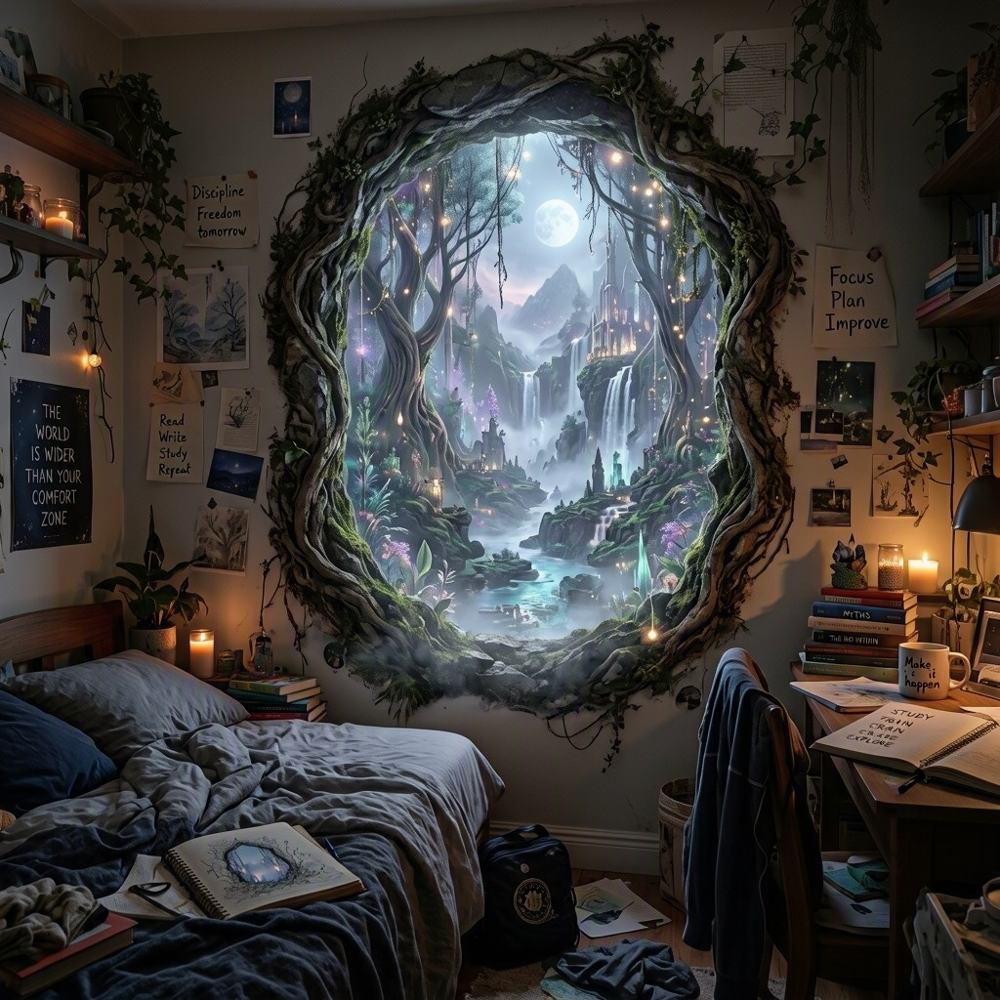
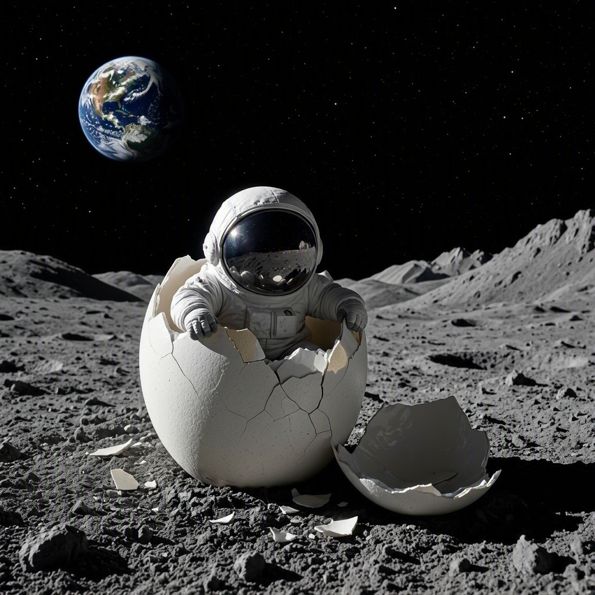
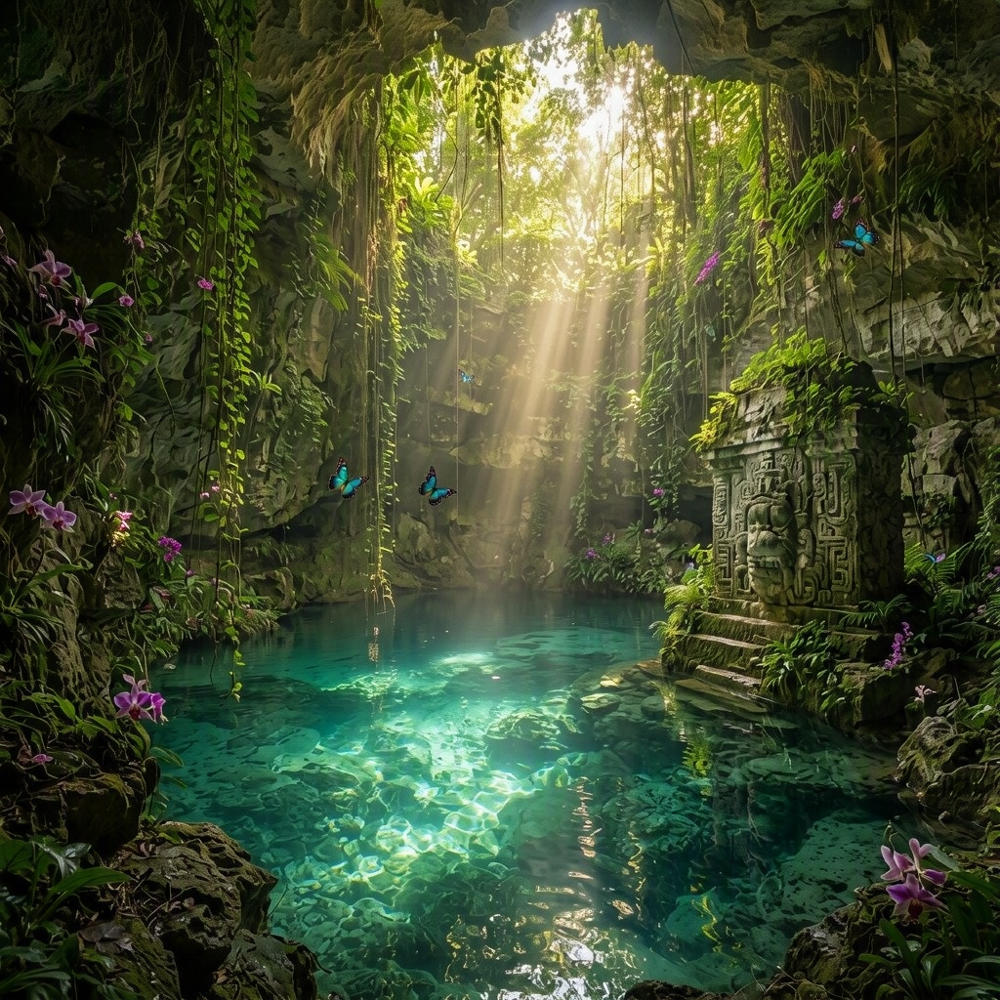
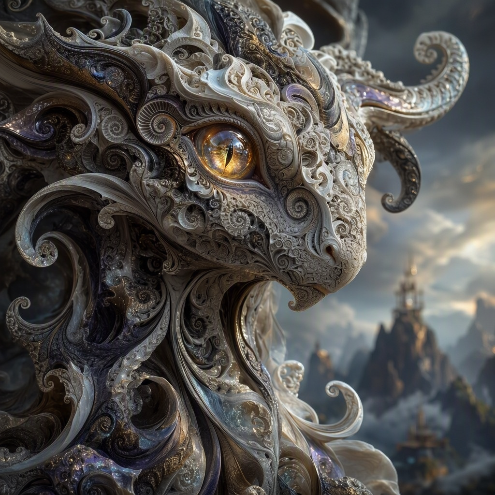
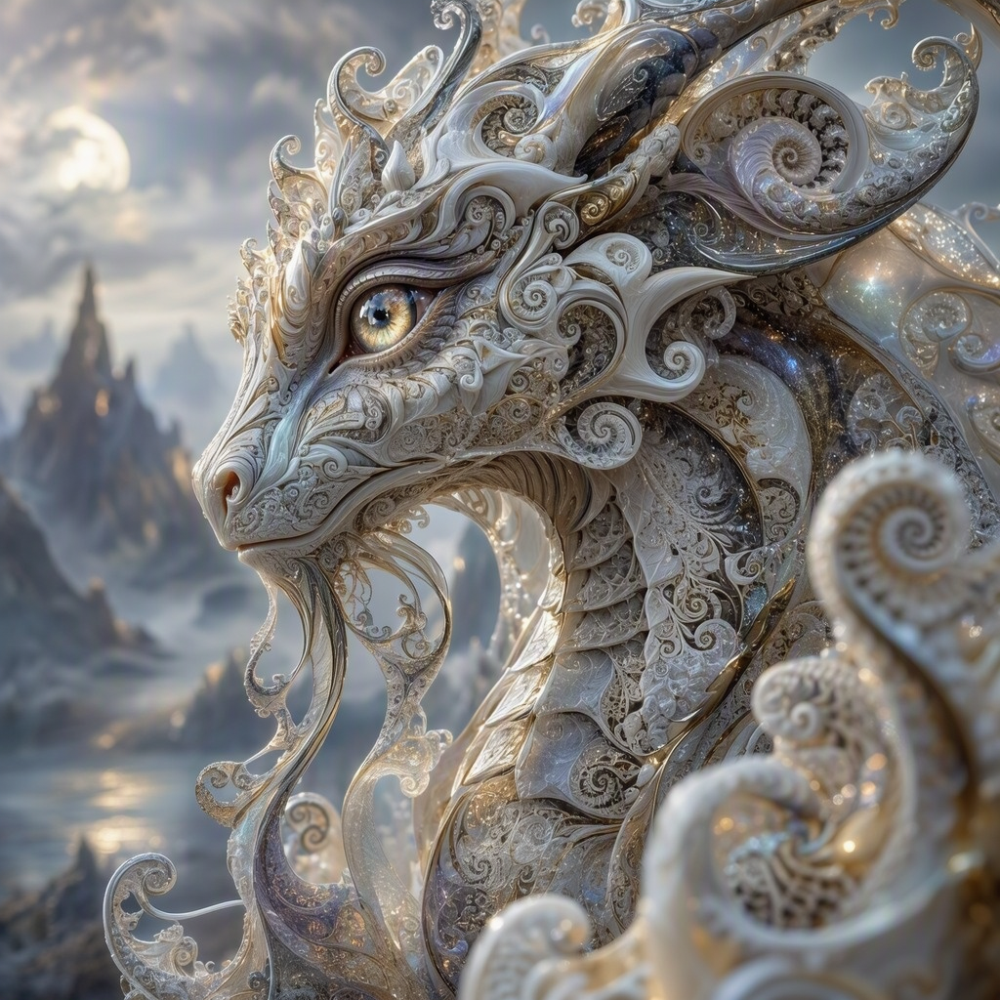
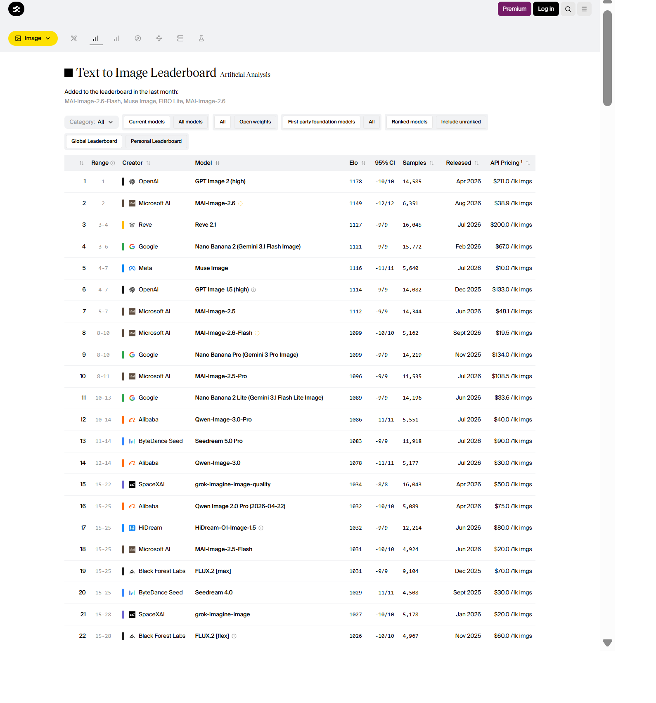

# MAI-Image-2.6：Azure 图像生成实测与历史对照

> **作者**: 魏新宇 (Xinyu Wei) — 微软 AI GBB 高级系统工程师

<!-- MAI-2.6-UPDATE-START -->
## 2026-09-07：MAI-Image-2.6 实测

[English](README.md) | [指标汇总](data/mai-image-2.6-20260907/summary.json) | [逐次请求记录](data/mai-image-2.6-20260907/attempts.jsonl) | [图像质量观察](data/mai-image-2.6-20260907/quality-review.json)

**22 个正式样本全部首试成功。平均请求耗时 38.73 秒，P50 为 36.92 秒，描述性 P95 为 52.34 秒。** 本轮没有测出相对下文历史数据的速度提升。但模型、部署、测试日期和客户端位置不同，不能把跨日期的数值差异直接归因于模型本身，也不能视为同条件 A/B 对照。

### 测试口径

| 项目 | 本次设置 |
| --- | --- |
| 模型与版本 | 部署查询确认是 **MAI-Image-2.6 / 2026-07-31**，不是 GPT-Image-2.6，也不是 Flash |
| 部署 | Microsoft Foundry，Global Standard，Sweden Central；配置限额为每分钟 2 次请求 |
| 客户端 | 本地 Windows 11 ARM64，Python 3.13.15，requests 2.34.2；不是四月测试的 East US 客户端 |
| 起止时间 | **2026-09-07 14:11:51–14:28:30，北京时间（UTC+08:00）**，含预热和等待；每次请求另存 UTC 时间 |
| 总时长 | **999.11 秒**，即 16 分 39 秒，含预热和等待 |
| 输入 | 原报告的[同一批 11 个提示词](prompts.csv)，保持原顺序；1024×1024 PNG |
| 流程 | 用 `blue circle` 预热 1 次并排除；正式 2 轮；并发 1；调用间隔 5 秒；最多 3 次尝试，沿用原 MAI 退避规则 |
| 接口与认证 | `/mai/v1/images/generations`；API key 从环境变量读取 |
| 请求参数 | `model`、`prompt`、`width=1024`、`height=1024`；未显式传 quality、seed、web grounding 或宽高比选项 |
| 相对旧流程的变化 | 只选择新部署，单组测试不适用五组顺序翻转；认证及客户端位置不同；新增逐次记录和检查点 |

提示词、请求格式、分辨率、预热、轮数和调用间隔沿用旧流程；本次属于**适配后的单模型增补测试**，不是重新运行旧报告的五组矩阵。九月没有调用 GPT 或 Flash 模型。

### 性能结果

| 指标 | 实测结果 |
| --- | ---: |
| 成功样本 / 计划样本 | **22 / 22** |
| 首试成功样本 | **22 / 22** |
| 正式 HTTP 尝试次数 / 429 次数 | **22 / 0** |
| 平均请求耗时 | **38.73 秒** |
| P50 / 描述性 P95 | **36.92 秒 / 52.34 秒** |
| 样本标准差 | **5.73 秒** |
| 最小 / 最大 | **33.45 秒 / 52.75 秒** |
| 第一轮 / 第二轮平均 | **38.10 秒 / 39.36 秒** |
| 单个任务平均耗时 | **38.79 秒** |
| 含 5 秒间隔的串行完成速率 | **1.38 张/分钟** |
| 每张成功图片的输出 token | **1,024**，来自 `usage.num_output_tokens` |
| 每张正式图片平均估算费用 | **USD 0.039083** |
| 22 张正式图片合计估算费用 | **USD 0.859824** |
| 加上 1 次预热的合计估算费用 | **USD 0.898741** |

请求耗时沿用旧脚本的计时边界：从 `requests.post` 前开始，到函数返回为止，不含随后的 JSON 解析、base64 解码和 PNG 写盘。单个任务耗时还包含失败尝试、退避等待、解码和响应元数据保存；**本轮没有发生重试**。串行完成速率不是服务最大吞吐。P95 在 22 个观测值上按 `(n-1)×0.95` 线性插值，仅描述本轮样本，不是生产环境尾延迟保证。

费用是**接口返回用量乘以公开标价的估算，不是 Azure 账单**：文本输入 USD 5/百万 token，图片输出 USD 38/百万 token，来源为[9 月 4 日 Foundry 公告](https://techcommunity.microsoft.com/blog/azure-ai-foundry-blog/mai-image-2-6-and-mai-image-2-6-flash-quality-and-speed-at-production-scale/4550970)。本次图片输入用量为零。原始响应保存了 usage 字段，没有反向补写原结果中的 `cost_usd`；估算统一由[离线汇总脚本](scripts/summarize_mai_run.py)生成。

### 逐提示词耗时

单位均为秒。第二轮的较慢样本原样保留，没有用最佳轮次或挑选重试结果替代。

| # | 提示词 | 第一轮 | 第二轮 | 平均 |
| --- | --- | ---: | ---: | ---: |
| 1 | 金属和服少女 | 36.97 | 34.31 | 35.64 |
| 2 | 卧室森林入口 | 36.75 | 37.12 | 36.94 |
| 3 | 月面蛋壳中的宇航员 | 34.81 | 33.45 | 34.13 |
| 4 | 桌上小龙微距 | 40.48 | 36.09 | 38.28 |
| 5 | 梦幻毛绒生物 | 35.05 | 52.56 | 43.81 |
| 6 | 丛林天坑 | 39.36 | 45.45 | 42.40 |
| 7 | 银发人物与全息界面 | 48.20 | 36.93 | 42.57 |
| 8 | 分形宇宙 | 37.03 | 52.75 | 44.89 |
| 9 | 分形生物 | 36.92 | 35.88 | 36.40 |
| 10 | 愤怒猫鼓手 | 38.11 | 34.95 | 36.53 |
| 11 | 猴子演奏音乐 | 35.35 | 33.47 | 34.41 |

### 图像质量：具体观察，不冒充评分

已对 **22 张原始 1024×1024 PNG** 逐张解码、校验哈希并查看画面。本次是 **AI 辅助、非盲评的定性检查**，不是人类偏好实验或图像准确率测试，也不以输出 token 数证明画质。

- 两轮都能辨认出主要主体，金属服饰与花朵、卧室入口、月面蛋壳、天坑水面和石壁等细节较丰富。
- 第 7 题的发型不够稳定：第一轮银发较长，与 pixie cut 要求有偏差，第二轮更接近短发。两轮都选择了动漫画风，并加入额外界面文字。
- 第 2、4、7、10、11 题出现了未请求的标语或文字。部分大字可读，小字质量不均；本次没有指定目标文字并测量其准确率。
- 第 11 题第一轮是较接近猴子的形象，第二轮变为类人猿形象。画面完整不代表类别细节始终准确。
- 第 1 题中新图保留了完整头部和深蓝金属质感；旧 MAI-Image-2 第一轮图采用了截断头部的紧裁切。这只是具体样图差异，不能证明对所有 MAI 或 GPT 场景都更好。

以下公开**每个提示词的两轮原图**，点击可查看原文件。按同题同轮查看不同模型配置时，可直接跳到[六组配置并排对比](#并排图片对比)：第一列为 MAI-Image-2.6，旁边保留四月各配置的历史样图。

| 提示词 | 九月第一轮 | 九月第二轮 |
| --- | --- | --- |
| 1. 金属和服 |  |  |
| 2. 卧室入口 |  |  |
| 3. 月面宇航员 |  |  |
| 4. 小龙微距 |  |  |
| 5. 毛绒生物 |  |  |
| 6. 丛林天坑 |  |  |
| 7. 全息界面 |  |  |
| 8. 分形宇宙 |  |  |
| 9. 分形生物 |  |  |
| 10. 猫鼓手 |  |  |
| 11. 演奏音乐 |  |  |

### 外部评估参考



来源：[Artificial Analysis，Text to Image Leaderboard](https://artificialanalysis.ai/image/leaderboard/text-to-image)，2026-09-07 截取。请同时查看 Elo、置信区间、样本数和 **Provisional（暂定）** 标记：当时 MAI-Image-2.6 为 1149 ±12、6,351 个样本，Flash 为 1099 ±10、5,162 个样本。这是外部人类偏好评估，**不是本次 22 张图片的评分**，也不代表本部署的速度。详见[截图来源与哈希](images/external/20260907/sources.json)和[评估方法](https://artificialanalysis.ai/image/methodology)。

### 复测与离线复算

原脚本现在支持选择单个 MAI 部署，并从环境变量读取凭据。`MAI_ENDPOINT` 应是资源**根地址**，不带 `/models` 或 generations 路径。通过自己的秘密管理机制提供 `AZURE_API_KEY`，不要把密钥写进源码或 Git。

克隆 `https://github.com/david-xinyuwei/david-share.git`，进入 `Multimodal-Models/MAI-Image-2-vs-GPT-Image-Benchmark`。CSV 和 JSON 使用 **Git LFS**，读取提示词或复算前须安装 Git LFS 并执行 `git lfs pull`；GitHub raw 地址有时返回的是 LFS 指针，不是实际数据。

进入本 benchmark 目录，使用已安装 `requests` 的 Python：

```powershell
# 不调用模型，先检查原始样本矩阵。
python scripts/benchmark_5way_v2.py --mai-model MAI-Image-2.6 --dry-run

# 元数据须与实际部署一致。下一条运行命令会产生推理费用。
$env:MAI_MODEL_VERSION = '2026-07-31'
$env:MAI_DEPLOYMENT_SKU = 'GlobalStandard'
$env:MAI_DEPLOYMENT_REGION = 'swedencentral'
$env:MAI_RATE_LIMIT_RPM = '2'
$env:BENCHMARK_CLIENT_LOCATION = 'Describe your actual client location'
python scripts/benchmark_5way_v2.py --mai-model MAI-Image-2.6 --output runs/mai-image-2.6-new-run
```

脚本不会覆盖已有输出。中断后使用相同环境并增加 `--resume`，已记录样本不会重跑；中断时尚未记录结果的在途请求仍可能已经计费。运行过程中不要修改冻结的脚本或输入。

对已归档数据**离线复算，不调用模型**：

```powershell
python scripts/summarize_mai_run.py data/mai-image-2.6-20260907 --historical-results data/5way_v2_results.json
python -m unittest discover -s tests -v
```

归档中保留了[原始结果](data/mai-image-2.6-20260907/5way_v2_results.json)、响应元数据、逐次时间戳与请求 ID、全部图片和实际执行的源码快照。元数据省略图片 base64，改为保留解码后的原始 PNG，并记录原 HTTP 响应体哈希；公开控制台日志只脱敏本地输出路径。来源对应关系见[测试来源说明](data/mai-image-2.6-20260907/provenance.json)。

**结论边界：**这 11 个提示词主要覆盖超现实图像，不能代表全面的文字渲染、图像编辑、多图参考或中文质量。仅测试了 1024×1024。要判断当前部署相对 GPT 是否更好，还需要双方在相同环境下的新一轮测试；本报告不声称已完成这种对照。

---

## 历史基线：2026-04-19

**下文保留原五组配置的四月测量及当时的能力、价格说明；逐题并排图片表另补入了明确标注九月日期的 MAI-Image-2.6 样图。** 四月的能力和价格说明不适用于 MAI-Image-2.6。旧成功数是执行内置重试策略后的样本完成数，不等于已核验的首试成功数。输出 token 数本身不能证明画质。

<!-- MAI-2.6-UPDATE-END -->

## 概要总结

本基准测试对比了 Azure 三款图像生成模型的 5 种配置（11 个提示词 × 2 轮 = 110 次 API 调用），采用公平性控制（预热、顺序翻转、对称等待）。截至 2026 年 4 月，所有模型均为 Preview 状态。

**模型概况：**

| | MAI-Image-2 | MAI-Image-2e | GPT-Image-1.5 |
|---|:---:|:---:|:---:|
| **供应商** | Microsoft AI（第一方） | Microsoft AI（第一方） | OpenAI via Azure |
| **API** | `/mai/v1/`（专用） | `/mai/v1/`（专用） | `/openai/deployments/`（标准） |
| **质量控制** | 固定单档 | 固定单档 | 3 档（low/med/high） |
| **平均延迟** | 20.1s | 17.2s | 13.3s (low) / 22.8s (med) / 46.3s (high) |
| **输出定价** | USD 33/1M tokens | **USD 19.50/1M tokens** | USD 32/1M tokens |
| **输出 tokens (1024²)** | 1,024（固定） | N/A（API 不返回） | 479 (low) / 1,473 (med) / 4,573 (high) |
| **单张成本 (1024²)** | USD 0.034 | ~USD 0.020* | USD 0.015 (low) / 0.047 (med) / 0.146 (high) |
| **图片编辑** | ❌ | ❌ | ✅ |
| **灵活分辨率** | ✅（768–1366px） | ✅（768–1366px） | ❌（3 种固定尺寸） |
| **最大提示词** | 32K tokens | 32K tokens | 4K tokens |
| **状态** | Preview | Preview | Preview |

**核心结论：** GPT-Image-1.5 `quality=low` 速度最快（13.3s）**且**单张最便宜（USD 0.015）。MAI-Image-2e 输出 token 单价最低（USD 19.50/1M），但每张生成的 token 比 GPT-low 多，实际单张成本更高（~USD 0.020）。MAI-Image-2 单张成本最高（USD 0.034），速度无优势。选型建议：速度+成本 → GPT-low，第一方独立 → MAI-2e，需要编辑 → GPT。

> *MAI-Image-2e 的 API 不返回 token 数。成本基于 MAI-Image-2 在 1024×1024 下固定 1,024 个 output tokens 估算。

> **来源：** MAI API — [Microsoft Learn](https://learn.microsoft.com/en-us/azure/foundry/foundry-models/how-to/use-foundry-models-mai?tabs=python) | MAI-Image-2 定价 — [Tech Community 2026-04-02](https://techcommunity.microsoft.com/blog/azure-ai-foundry-blog/introducing-mai-transcribe-1-mai-voice-1-and-mai-image-2-in-microsoft-foundry/4507787) | MAI-Image-2e 定价 — [Tech Community 2026-04-14](https://techcommunity.microsoft.com/blog/azure-ai-foundry-blog/introducing-mai-image-2-efficient-faster-more-efficient-image-generation/4510918) | GPT-Image-1.5 定价 — [Azure OpenAI 定价](https://azure.microsoft.com/en-us/pricing/details/cognitive-services/openai-service/)

---

对 Azure 图像生成模型的 **5 种配置**进行综合延迟基准测试：**MAI-Image-2**、**MAI-Image-2e**（Efficient 效率版）和 **GPT-Image-1.5** 三个质量档位（low / medium / high），使用相同的提示词和分辨率。

## 核心结果

| 模型 | Quality | 平均延迟 | Output Tokens | 单张成本 | 通过率 |
|------|:-------:|:--------:|:-------------:|:--------:|:------:|
| GPT-Image-1.5 | low | **13.3s** | 479 | **USD 0.015** | 22/22 |
| MAI-Image-2e | N/A（固定单档） | **17.2s** | N/A | ~USD 0.020* | 22/22 |
| MAI-Image-2 | N/A（固定单档） | 20.1s | 1,024（固定） | USD 0.034 | 22/22 |
| GPT-Image-1.5 | medium | 22.8s | 1,473 | USD 0.047 | 22/22 |
| GPT-Image-1.5 | high | 46.3s | 4,573 | USD 0.146 | 22/22 |

> **通过率**（Pass Rate）= API 调用成功次数 / 总调用次数（每个模型 11 个提示词 × 2 轮 = 22 次调用）。
>
> *MAI-Image-2e 的 API 不返回 output token 数。成本按 MAI-Image-2 的固定 1,024 tokens 估算。
>
> - GPT-Image-1.5 (low) 速度最快（13.3s），**且单张成本最低**（USD 0.015）。
> - MAI-Image-2 ≈ GPT-Image-1.5 (medium) 延迟相当（~21s）。
> - MAI 模型**没有 quality 参数** — 仅输出固定单一质量档位。

## 公平对比设计

### 对齐维度

| 维度 | 5 组统一设定 | 状态 |
|------|:----------:|:----:|
| 提示词 | 相同的 11 个 Surreal 风格提示词 | ✅ 对齐 |
| 分辨率 | 1024×1024 | ✅ 对齐 |
| 输出格式 | PNG (b64_json) | ✅ 对齐 |
| 网络环境 | 同一台机器（East US） | ✅ 对齐 |
| 测试日期 | 2026-04-19 | ✅ 对齐 |
| 预热 | 每组 1 次丢弃请求 | ✅ 对齐 |
| 调用间隔 | 每次 API 调用间等待 5s（对称） | ✅ 对齐 |
| **Quality** | MAI：不适用 / GPT：low、medium、high | 🔀 **差异项** |
| **模型** | MAI-Image-2 / MAI-Image-2e / GPT-Image-1.5 | 🔀 被测变量 |

### 为什么 Quality 是差异项而非对齐项

MAI-Image-2 和 MAI-Image-2e 的 API 仅接受 4 个参数：`model`、`prompt`、`width`、`height`。**不存在 `quality` 参数**（[来源](https://learn.microsoft.com/en-us/azure/foundry/foundry-models/how-to/use-foundry-models-mai?tabs=python)）。GPT-Image-1.5 支持 `quality` 参数（low / medium / high），控制输出图像 token 数量（token 越多 = 细节越多 = 速度越慢）。为公平评估 MAI 固定质量对标 GPT 的哪个档位，我们测试了 GPT 的全部三档。

### 公平性控制措施

- **预热**：每组模型/质量配置各执行 1 次丢弃请求后再开始计时
- **顺序翻转**：Round 1 按 A→E 顺序执行，Round 2 按 E→A 反转
- **对称等待**：每次 API 调用间统一等待 5s
- **2 轮测试**：每个数据点取 2 次测量的平均值

## 逐提示词延迟对比

| # | 提示词 | MAI-2 | MAI-2e | GPT low | GPT med | GPT high |
|:-:|:-------|:-----:|:------:|:-------:|:-------:|:--------:|
| 1 | 金属和服少女 | 19.9s | 16.9s | 12.8s | 21.4s | 45.0s |
| 2 | 森林传送门 | 21.7s | 17.0s | 13.8s | 22.3s | 44.2s |
| 3 | 月球宇航员 | 20.2s | 15.6s | 13.1s | 20.6s | 44.2s |
| 4 | LOTR 小红龙 | 20.3s | 17.5s | 12.8s | 22.3s | 44.1s |
| 5 | 梦幻生物 | 18.7s | 15.5s | 12.1s | 21.6s | 46.6s |
| 6 | 丛林天坑 | 20.8s | 18.5s | 14.2s | 24.5s | 45.6s |
| 7 | 科技少女 | 20.1s | 16.8s | 12.6s | 23.1s | 49.8s |
| 8 | 迷幻宇宙 | 21.5s | 20.2s | 14.0s | 23.4s | 48.3s |
| 9 | 分形生物 | 19.7s | 17.3s | 12.3s | 23.0s | 48.2s |
| 10 | 愤怒猫鼓手 | 18.4s | 16.9s | 15.2s | 22.5s | 47.3s |
| 11 | 猴子音乐家 | 20.0s | 17.2s | 13.8s | 25.8s | 46.3s |
| **平均** | | **20.1s** | **17.2s** | **13.3s** | **22.8s** | **46.3s** |

> 每个单元格为 2 轮测量的平均值。Round 1 顺序 A→E，Round 2 顺序 E→A（翻转）。

## 并排图片对比

**第一列为 2026-09-07 实测的 MAI-Image-2.6，其余五列为 2026-04-19 的历史样图。** 按相同提示词和轮次并排展示，但测试日期与客户端不同；这是跨日期的视觉参考，不是同条件的延迟对照。点击图片可查看原始 PNG。

### Test 1: 金属和服少女

> **Prompt**: Chrome kimono, a maiden surrounded by metallic flowers, earrings, ornate, dark blue, exquisite realism, high exposure, Canon 5D, cinematic lighting, metallic luster, blurred foreground, depth of field, light

**Round 1:**

| **MAI-Image-2.6**<br>2026-09-07<br>37.0s, 1772 KiB | MAI-Image-2 (21.2s, 1821KB) | MAI-Image-2e (15.9s, 1494KB) | GPT-1.5 low (14.4s, 1724KB) | GPT-1.5 med (20.7s, 1899KB) | GPT-1.5 high (43.9s, 2137KB) |
|:---:|:---:|:---:|:---:|:---:|:---:|
|  |  |  |  |  |  |

**Round 2:**

| **MAI-Image-2.6**<br>2026-09-07<br>34.3s, 1813 KiB | MAI-Image-2 (18.6s, 1467KB) | MAI-Image-2e (17.9s, 1723KB) | GPT-1.5 low (11.1s, 1884KB) | GPT-1.5 med (22.0s, 1901KB) | GPT-1.5 high (46.0s, 2026KB) |
|:---:|:---:|:---:|:---:|:---:|:---:|
|  |  |  |  |  |  |


### Test 2: 森林传送门

> **Prompt**: a portal into a mythical forest on the wall of my small messy bedroom

**Round 1:**

| **MAI-Image-2.6**<br>2026-09-07<br>36.8s, 1679 KiB | MAI-Image-2 (21.9s, 1597KB) | MAI-Image-2e (16.7s, 1706KB) | GPT-1.5 low (14.5s, 1859KB) | GPT-1.5 med (22.5s, 2128KB) | GPT-1.5 high (42.3s, 2242KB) |
|:---:|:---:|:---:|:---:|:---:|:---:|
|  |  |  |  |  |  |

**Round 2:**

| **MAI-Image-2.6**<br>2026-09-07<br>37.1s, 1758 KiB | MAI-Image-2 (21.5s, 1577KB) | MAI-Image-2e (17.2s, 1484KB) | GPT-1.5 low (13.1s, 1968KB) | GPT-1.5 med (22.1s, 2127KB) | GPT-1.5 high (46.1s, 2280KB) |
|:---:|:---:|:---:|:---:|:---:|:---:|
|  |  |  |  |  |  |


### Test 3: 月球宇航员

> **Prompt**: a tiny astronaut hatching from an egg on the moon

**Round 1:**

| **MAI-Image-2.6**<br>2026-09-07<br>34.8s, 1615 KiB | MAI-Image-2 (19.8s, 1311KB) | MAI-Image-2e (14.6s, 1330KB) | GPT-1.5 low (13.7s, 1758KB) | GPT-1.5 med (19.9s, 1526KB) | GPT-1.5 high (44.4s, 1625KB) |
|:---:|:---:|:---:|:---:|:---:|:---:|
|  |  |  |  |  |  |

**Round 2:**

| **MAI-Image-2.6**<br>2026-09-07<br>33.4s, 1450 KiB | MAI-Image-2 (20.6s, 1532KB) | MAI-Image-2e (16.6s, 1279KB) | GPT-1.5 low (12.5s, 1567KB) | GPT-1.5 med (21.2s, 1662KB) | GPT-1.5 high (44.0s, 1771KB) |
|:---:|:---:|:---:|:---:|:---:|:---:|
|  |  |  |  |  |  |


### Test 4: LOTR 小红龙

> **Prompt**: Photo realistic scene inspired by LOTR: [A tiny red dragon in a nest on a medieval wizard's table]. Shot with a macro lens (f/2.8, 50mm) and a Canon EOSR5, the soft focus captures [the cozy morning light filtering through a near by window]. The pastel colors and whimsical steam shapes enhance the serene atmosphere, evoking a DnD RPG setting. The image is rendered in 16K and 8K, highlighting [the intricate details and medieval charm].

**Round 1:**

| **MAI-Image-2.6**<br>2026-09-07<br>40.5s, 1676 KiB | MAI-Image-2 (19.3s, 1424KB) | MAI-Image-2e (17.8s, 1506KB) | GPT-1.5 low (14.7s, 1521KB) | GPT-1.5 med (22.5s, 1645KB) | GPT-1.5 high (43.9s, 1593KB) |
|:---:|:---:|:---:|:---:|:---:|:---:|
|  |  |  |  |  |  |

**Round 2:**

| **MAI-Image-2.6**<br>2026-09-07<br>36.1s, 1537 KiB | MAI-Image-2 (21.2s, 1441KB) | MAI-Image-2e (17.1s, 1439KB) | GPT-1.5 low (10.8s, 1518KB) | GPT-1.5 med (22.1s, 1555KB) | GPT-1.5 high (44.2s, 1574KB) |
|:---:|:---:|:---:|:---:|:---:|:---:|
|  |  |  |  |  |  |


### Test 5: 梦幻生物

> **Prompt**: Cute and adorable fluffy cute creature fantasy, dreamlike, surrealism, super cute, trending on artstation

**Round 1:**

| **MAI-Image-2.6**<br>2026-09-07<br>35.1s, 1459 KiB | MAI-Image-2 (19.6s, 1048KB) | MAI-Image-2e (14.8s, 1202KB) | GPT-1.5 low (11.7s, 1438KB) | GPT-1.5 med (20.4s, 1691KB) | GPT-1.5 high (45.7s, 1526KB) |
|:---:|:---:|:---:|:---:|:---:|:---:|
|  |  |  |  |  |  |

**Round 2:**

| **MAI-Image-2.6**<br>2026-09-07<br>52.6s, 1461 KiB | MAI-Image-2 (17.8s, 965KB) | MAI-Image-2e (16.1s, 1107KB) | GPT-1.5 low (12.4s, 1518KB) | GPT-1.5 med (22.8s, 1593KB) | GPT-1.5 high (47.5s, 1669KB) |
|:---:|:---:|:---:|:---:|:---:|:---:|
|  |  |  |  |  |  |


### Test 6: 丛林天坑

> **Prompt**: A hidden cenote in the heart of a lush jungle beckons with crystalline turquoise waters. Vibrant emerald vines cascade down weathered limestone walls, their tendrils barely kissing the water's surface. Shafts of golden sunlight pierce through a natural skylight above, creating a mystical interplay of light and shadow on the cavern walls. Iridescent butterflies flit between exotic orchids clinging to rocky outcrops. A partially submerged Mayan ruin, its intricate carvings softened by time, stand

**Round 1:**

| **MAI-Image-2.6**<br>2026-09-07<br>39.4s, 2110 KiB | MAI-Image-2 (20.0s, 1953KB) | MAI-Image-2e (19.6s, 2255KB) | GPT-1.5 low (12.9s, 2173KB) | GPT-1.5 med (24.3s, 2529KB) | GPT-1.5 high (42.9s, 2502KB) |
|:---:|:---:|:---:|:---:|:---:|:---:|
|  |  |  |  |  |  |

**Round 2:**

| **MAI-Image-2.6**<br>2026-09-07<br>45.5s, 2142 KiB | MAI-Image-2 (21.6s, 2052KB) | MAI-Image-2e (17.3s, 2192KB) | GPT-1.5 low (15.4s, 2162KB) | GPT-1.5 med (24.7s, 2320KB) | GPT-1.5 high (48.3s, 2464KB) |
|:---:|:---:|:---:|:---:|:---:|:---:|
|  |  |  |  |  |  |


### Test 7: 科技少女

> **Prompt**: A charming, tech-savvy [girl with short, silver pixie-cut] hair and vibrant [blue] eyes, wearing a casual yet futuristic outfit. She's focused on a holographic interface while working in a sleek, high-tech workshop.

**Round 1:**

| **MAI-Image-2.6**<br>2026-09-07<br>48.2s, 1590 KiB | MAI-Image-2 (21.3s, 1283KB) | MAI-Image-2e (16.5s, 1485KB) | GPT-1.5 low (13.6s, 1636KB) | GPT-1.5 med (22.8s, 1790KB) | GPT-1.5 high (47.4s, 1870KB) |
|:---:|:---:|:---:|:---:|:---:|:---:|
|  |  |  |  |  |  |

**Round 2:**

| **MAI-Image-2.6**<br>2026-09-07<br>36.9s, 1530 KiB | MAI-Image-2 (18.9s, 1312KB) | MAI-Image-2e (17.0s, 1415KB) | GPT-1.5 low (11.5s, 1590KB) | GPT-1.5 med (23.4s, 1788KB) | GPT-1.5 high (52.2s, 1834KB) |
|:---:|:---:|:---:|:---:|:---:|:---:|
|  |  |  |  |  |  |


### Test 8: 迷幻宇宙

> **Prompt**: Universe, LSD, Fractal Worlds, Giant Eyes

**Round 1:**

| **MAI-Image-2.6**<br>2026-09-07<br>37.0s, 2251 KiB | MAI-Image-2 (21.4s, 2379KB) | MAI-Image-2e (20.4s, 2528KB) | GPT-1.5 low (13.1s, 2667KB) | GPT-1.5 med (23.9s, 2630KB) | GPT-1.5 high (46.3s, 2621KB) |
|:---:|:---:|:---:|:---:|:---:|:---:|
|  |  |  |  |  |  |

**Round 2:**

| **MAI-Image-2.6**<br>2026-09-07<br>52.7s, 2286 KiB | MAI-Image-2 (21.6s, 2305KB) | MAI-Image-2e (20.0s, 2509KB) | GPT-1.5 low (14.9s, 2598KB) | GPT-1.5 med (22.9s, 2649KB) | GPT-1.5 high (50.2s, 2634KB) |
|:---:|:---:|:---:|:---:|:---:|:---:|
|  |  |  |  |  |  |


### Test 9: 分形生物

> **Prompt**: close up dof render of a mythical creature made of detailed spiraling fractals and tendrils, detailed recursive skin texture

**Round 1:**

| **MAI-Image-2.6**<br>2026-09-07<br>36.9s, 1802 KiB | MAI-Image-2 (18.9s, 1463KB) | MAI-Image-2e (17.2s, 1510KB) | GPT-1.5 low (11.5s, 2029KB) | GPT-1.5 med (22.5s, 2108KB) | GPT-1.5 high (48.5s, 2193KB) |
|:---:|:---:|:---:|:---:|:---:|:---:|
|  |  |  |  |  |  |

**Round 2:**

| **MAI-Image-2.6**<br>2026-09-07<br>35.9s, 1852 KiB | MAI-Image-2 (20.4s, 1407KB) | MAI-Image-2e (17.3s, 1679KB) | GPT-1.5 low (13.1s, 1937KB) | GPT-1.5 med (23.5s, 2244KB) | GPT-1.5 high (47.8s, 2103KB) |
|:---:|:---:|:---:|:---:|:---:|:---:|
|  |  |  |  |  |  |


### Test 10: 愤怒猫鼓手

> **Prompt**: an angry cat playing drums

**Round 1:**

| **MAI-Image-2.6**<br>2026-09-07<br>38.1s, 1570 KiB | MAI-Image-2 (18.7s, 1551KB) | MAI-Image-2e (16.5s, 1370KB) | GPT-1.5 low (16.7s, 1810KB) | GPT-1.5 med (22.9s, 1825KB) | GPT-1.5 high (44.3s, 1780KB) |
|:---:|:---:|:---:|:---:|:---:|:---:|
|  |  |  |  |  |  |

**Round 2:**

| **MAI-Image-2.6**<br>2026-09-07<br>34.9s, 1633 KiB | MAI-Image-2 (18.1s, 1409KB) | MAI-Image-2e (17.2s, 1546KB) | GPT-1.5 low (13.7s, 1860KB) | GPT-1.5 med (22.0s, 1895KB) | GPT-1.5 high (50.2s, 1945KB) |
|:---:|:---:|:---:|:---:|:---:|:---:|
|  |  |  |  |  |  |


### Test 11: 猴子音乐家

> **Prompt**: A monkey playing music

**Round 1:**

| **MAI-Image-2.6**<br>2026-09-07<br>35.4s, 1824 KiB | MAI-Image-2 (20.1s, 1755KB) | MAI-Image-2e (17.3s, 1780KB) | GPT-1.5 low (14.0s, 1711KB) | GPT-1.5 med (25.8s, 1973KB) | GPT-1.5 high (48.7s, 2016KB) |
|:---:|:---:|:---:|:---:|:---:|:---:|
|  |  |  |  |  |  |

**Round 2:**

| **MAI-Image-2.6**<br>2026-09-07<br>33.5s, 1653 KiB | MAI-Image-2 (19.9s, 1679KB) | MAI-Image-2e (17.1s, 1880KB) | GPT-1.5 low (13.5s, 1671KB) | GPT-1.5 med (25.8s, 1940KB) | GPT-1.5 high (43.9s, 2019KB) |
|:---:|:---:|:---:|:---:|:---:|:---:|
|  |  |  |  |  |  |


## API 对比

### 请求参数

| 特性 | MAI-Image-2 / MAI-Image-2e | GPT-Image-1.5 |
|------|:---------------------------:|:-------------:|
| API 路径 | `/mai/v1/images/generations` | `/openai/deployments/{name}/images/generations` |
| 认证方式 | Entra ID + API Key | API Key + Entra ID |
| 参数 | `model`、`prompt`、`width`、`height` | `prompt`、`n`、`size`、`quality` |
| 质量控制 | **不可用**（固定单档） | `low` / `medium` / `high` |
| 分辨率 | 灵活：W≥768, H≥768, W×H≤1,048,576 | 固定：1024×1024 / 1792×1024 / 1024×1792 |
| 输出格式 | 仅 PNG | PNG / URL |
| 输出数量 | 1（固定） | 1–10 |
| 最大提示词 | 32,000 tokens | 4,000 tokens |

> **来源**：MAI 参数来自 [Microsoft Learn](https://learn.microsoft.com/en-us/azure/foundry/foundry-models/how-to/use-foundry-models-mai?tabs=python)。GPT 参数来自 [Azure OpenAI 文档](https://learn.microsoft.com/en-us/azure/ai-services/openai/how-to/dall-e)。

### 能力对比

| 能力 | MAI-Image-2 | MAI-Image-2e | GPT-Image-1.5 |
|------|:---:|:---:|:---:|
| 文字生图 | ✅ | ✅ | ✅ |
| 图片编辑 | ❌ | ❌ | ✅ |
| 图像修复（Inpainting） | ❌ | ❌ | ✅ |
| 灵活宽高比 | ✅ | ✅ | ❌（固定尺寸） |
| 质量档位 | ❌（固定单档） | ❌（固定单档） | ✅（low/med/high） |

### 定价

| 模型 | 文本输入 | 图像输出 | 来源 |
|------|:--------:|:--------:|:----:|
| MAI-Image-2 | USD 5 / 1M tokens | USD 33 / 1M tokens | [Tech Community 2026-04-02](https://techcommunity.microsoft.com/blog/azure-ai-foundry-blog/introducing-mai-transcribe-1-mai-voice-1-and-mai-image-2-in-microsoft-foundry/4507787) |
| MAI-Image-2e | USD 5 / 1M tokens | USD 19.50 / 1M tokens | [Tech Community 2026-04-14](https://techcommunity.microsoft.com/blog/azure-ai-foundry-blog/introducing-mai-image-2-efficient-faster-more-efficient-image-generation/4510918) |
| GPT-Image-1.5 | USD 5 / 1M tokens | USD 32 / 1M tokens | [Azure OpenAI 定价](https://azure.microsoft.com/en-us/pricing/details/cognitive-services/openai-service/) |

> GPT-Image-1.5 按 token 计费 — `quality=low` 生成更少 token（单张更便宜），`quality=high` 生成更多 token（单张更贵）。MAI 模型为固定单档。

### Rate Limits

| 模型 | Tier 1 RPM | Tier 6 RPM |
|------|:----------:|:----------:|
| MAI-Image-2 | 9 | 90 |
| MAI-Image-2e | 18 | 180 |

> 来源：[Microsoft Learn](https://learn.microsoft.com/en-us/azure/foundry/foundry-models/how-to/use-foundry-models-mai?tabs=python)

## 选型建议

| 使用场景 | 推荐 | 原因 |
|----------|:----:|------|
| 最快生成速度 | GPT-Image-1.5 (low) | 平均 13.3s，USD 0.015/张 |
| 速度 + 微软第一方 | MAI-Image-2e | 17.2s，不依赖 OpenAI |
| 最高画质细节 | GPT-Image-1.5 (high) | 输出 token 最多，但 46s |
| 图片编辑/修复 | GPT-Image-1.5 | MAI 无编辑 API |
| 灵活宽高比 | MAI-Image-2 / 2e | 像素预算内任意 W×H |
| 长提示词（>4K tokens） | MAI-Image-2 / 2e | 支持 32K token 提示词 |
| 最低 token 单价 | MAI-Image-2e | USD 19.50/1M tokens（但单张 ~USD 0.020 vs GPT-low USD 0.015） |

## 如何复现

### 前提条件

- Azure 订阅 + Azure AI Services 资源
- 已部署：MAI-Image-2、MAI-Image-2e（AI Services）、gpt-image-1.5（Azure OpenAI）
- Python 3.x + `requests`
- Azure CLI (`az`) 已登录

### 运行

```bash
git clone https://github.com/david-share/Multimodal-Models.git
cd Multimodal-Models/MAI-Image-2-vs-GPT-Image-Benchmark

# 编辑 scripts/benchmark_5way_v2.py — 设置你的端点和凭据
pip install requests
python scripts/benchmark_5way_v2.py
```

## 仓库结构

```
.
```

## 已知局限性

- **样本量**：仅 11 个提示词（Surreal 风格）。不同提示词类型（如产品摄影、图表、文字渲染）结果可能不同。
- **单一分辨率**：全部测试在 1024×1024。其他分辨率下延迟和成本可能不同。
- **2 轮测试**：每个数据点仅 N=2，统计力有限。两轮间方差 <6%，趋势一致。
- **Preview 模型**：截至 2026 年 4 月所有模型均为 Preview 状态，性能和定价可能在 GA 时变化。
- **区域**：仅从 East US 测试，其他区域延迟可能不同。
