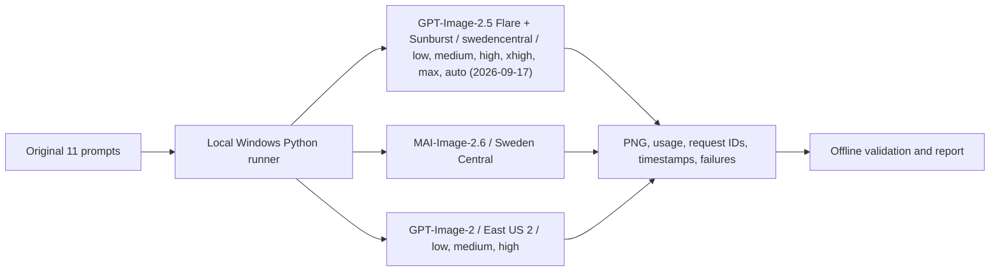

# MAI-Image-2.6 vs GPT-Image-2 / 2.5: All Quality Tiers

[](https://learn.microsoft.com/en-us/azure/foundry/foundry-models/how-to/use-foundry-models-mai-image) [](data/paired-all-quality-20260907/5way_v2_results.json)    [](https://azure.microsoft.com/support/legal/preview-supplemental-terms/) [](tests)

One client interleaved calls to MAI-Image-2.6 and GPT-Image-2 at low, medium and high across 11 text-to-image scenarios in two rounds, 88 formal samples in total, keeping every original PNG, per-attempt record and failed sample. Two capability tests are included: web grounding (`web_grounding`) and single-image editing. Image judgements are unblinded difference descriptions and produce no quality score or preference verdict. On 2026-09-17 the same client and prompt file also measured GPT-Image-2.5 Flare and Sunburst at all three tiers, 132 formal samples, merged into the same image, latency and token tables.

> **Author**: Xinyu Wei (魏新宇) — Microsoft AI GBB Senior System Engineer

[English](README.md) | [中文](README-CN.md)

[Side-by-side images](#side-by-side-image-comparison) · [Latency and requests](#performance-and-reliability) · [Web grounding](#web-grounding-test) · [Image edit](#test-12-headwear-swap-image-edit) · [Reproduction](#reproduction-how-to) · [Raw evidence](data/paired-all-quality-20260907)

---

## What This Run Shows About MAI-Image-2.6

All four items rest on the measurements in this repository. `MAI-Image-2.6` is in preview with no SLA.

1. **11 scenarios sit side by side with all three GPT-Image-2 tiers.** This run returned images for 87/88 formal samples, Both rounds plus the original PNGs are kept below so you can compare each scenario yourself. The per-image observations describe differences without ranking them, so this report does not claim MAI image quality beats or matches GPT-Image-2.

2. **Output tokens per 1024×1024 image: MAI-Image-2.6 is a constant 1,024, between GPT-Image-2 low (196) and medium (1,756), and 15% of high (7,024).** Every figure comes from returned usage and is identical across each group's successful samples. Tokens are not money: the two vendors bill different rates, this repository does not price them, and GPT tiers do not map to any MAI quality setting. GPT-Image-2.5 low / medium / high: GPT-Image-2.5 Flare 196 / 439 / 1,756; GPT-Image-2.5 Sunburst 196 / 439 / 1,756, from the 2026-09-17 supplement.

3. **Under the symmetric `size=auto` protocol, all four configurations complete the local edit.** Scenario 12 asks only for a graduation cap; MAI and all three GPT tiers add it in both rounds while keeping the face, robe, bystanders, title and aspect ratio present, in place and recognisable, for 5/5 on the checklist. Title glyph fidelity and output resolution still differ; Scenario 12 contains the per-image record and the correction to the first square-output protocol.

4. **`web_grounding=true` adds current web information at generation time.** The model retrieves current information from Bing Search as extra context, which moved the product text facts in two subjects from wrong to matching the official announcement. The cost is a lower first-attempt success rate and clearly higher latency. This is not the same thing as dense visual grounding.

### Vendor Performance Charts And How This Run Relates To Them

The charts below come from the Performance area of the vendor's MAI-Image-2.6 page (captured 2026-09-08). They are vendor claims measured under different conditions from this repository and do not validate our measurements.


The vendor annotates MAI-Image-2.6 as ranked #2 (1,336), behind GPT Image 2 Medium at #1 (1,381). This is an aggregate Arena score across prompt categories, not a per-scenario quality verdict, and this repository did not reproduce the score.

The same statistic measured in this run (client-side P50 of successful requests): MAI-Image-2.6 38.03 s; GPT-Image-2 low 31.19 s, medium 64.64 s, high 171.26 s. The vendor chart shows MAI 1.31x faster than GPT-Image-2-Medium; this run gives 1.70x: **the direction agrees, the multiple does not**.

<details>

<summary>Two further vendor charts (speed, quality versus price) and the full measurement notes</summary>

**Text-to-image speed comparison**


The vendor footnote states: internal load test, 100 RPM at 1024x1024, median response time with a band to P90. The only baseline is GPT-Image-2-Medium; the low and high tiers are absent.

**Quality versus price frontier for image editing**


The horizontal axis is a third-party published API reference price per 1,000 images and the vertical axis is image-edit Arena Elo. The vendor marks MAI-Image-2.6 (Elo 1324, $38.90) and MAI-Image-2.6-Flash (Elo 1311, $19.50) as sitting on the Pareto frontier, with GPT Image 2 high at Elo 1318 and $211. This measures image editing, a different task from the text-to-image leaderboard above. Prices are third-party reference figures, not a Microsoft quote and not any customer's contracted price.

Neither validates the other: the vendor measured a 100 RPM load test while this run used two requests per minute at concurrency 1. Here MAI ran in Sweden Central and GPT in East US 2 from the same workstation, so region and transport are part of any latency gap and cannot be separated from this run's data. Twenty-two samples per configuration is a descriptive sample, not a capacity or tail-latency result. This repository never called `MAI-Image-2.6-Flash` and did not reproduce the Arena or Artificial Analysis Elo scores. Two facts absent from the vendor charts: this run's GPT-Image-2 low P50 is 31.19 s, faster than MAI, and MAI is 4.50x faster than GPT-Image-2 high.

[Chart provenance and per-item readings](assets/official-microsoft-ai-20260908/provenance.json) | [Vendor page](https://microsoft.ai/models/mai-image-2-6/)

</details>

## Side-by-Side Image Comparison

Scenarios 1-11 are text-to-image. Each scenario and round has two image rows: the first is MAI-Image-2.6 with GPT-Image-2 low, medium and high measured on 2026-09-07; the second is GPT-Image-2.5 Flare and Sunburst at all three tiers, measured on 2026-09-17 with the same client and prompt file and deployed in swedencentral. The rows are not the same session, so read the latencies under the images together with their dates. Missing images retain their failure record. Click an image for the original 1024x1024 PNG. Scenario 12 is an image edit of one real photograph and has no 2.5 results.

### Test 1: Chrome Kimono Metallic Maiden

> **Prompt**: Chrome kimono, a maiden surrounded by metallic flowers, earrings, ornate, dark blue, exquisite realism, high exposure, Canon 5D, cinematic lighting, metallic luster, blurred foreground, depth of field, light

**Round 1:**

| MAI-Image-2.6 | GPT-Image-2 low | GPT-Image-2 medium | GPT-Image-2 high |
| --- | --- | --- | --- |
|  |  |  | No image returned |
| 38.82 s<br>1856 KiB | 51.44 s<br>1636 KiB | 78.13 s<br>1504 KiB | 3 attempts; logical duration 322.06 s |

| GPT-Image-2.5 Flare low | GPT-Image-2.5 Flare medium | GPT-Image-2.5 Flare high | GPT-Image-2.5 Sunburst low | GPT-Image-2.5 Sunburst medium | GPT-Image-2.5 Sunburst high |
| --- | --- | --- | --- | --- | --- |
|  |  |  |  |  |  |
| 21.93 s<br>1631 KiB | 21.65 s<br>1652 KiB | 39.92 s<br>1661 KiB | 33.75 s<br>1665 KiB | 39.18 s<br>1738 KiB | 79.29 s<br>1668 KiB |

**Round 2:**

| MAI-Image-2.6 | GPT-Image-2 low | GPT-Image-2 medium | GPT-Image-2 high |
| --- | --- | --- | --- |
|  |  |  |  |
| 33.96 s<br>1699 KiB | 26.25 s<br>1641 KiB | 63.52 s<br>1704 KiB | 182.78 s<br>1531 KiB |

| GPT-Image-2.5 Flare low | GPT-Image-2.5 Flare medium | GPT-Image-2.5 Flare high | GPT-Image-2.5 Sunburst low | GPT-Image-2.5 Sunburst medium | GPT-Image-2.5 Sunburst high |
| --- | --- | --- | --- | --- | --- |
|  |  |  |  |  |  |
| 17.66 s<br>1546 KiB | 22.85 s<br>1614 KiB | 30.23 s<br>1780 KiB | 30.74 s<br>1566 KiB | 40.55 s<br>1704 KiB | 75.43 s<br>1608 KiB |

### Test 2: Portal into Mythical Forest

> **Prompt**: a portal into a mythical forest on the wall of my small messy bedroom

**Round 1:**

| MAI-Image-2.6 | GPT-Image-2 low | GPT-Image-2 medium | GPT-Image-2 high |
| --- | --- | --- | --- |
|  |  |  |  |
| 65.12 s<br>1676 KiB | 41.67 s<br>1438 KiB | 74.93 s<br>1477 KiB | 176.78 s<br>1727 KiB |

| GPT-Image-2.5 Flare low | GPT-Image-2.5 Flare medium | GPT-Image-2.5 Flare high | GPT-Image-2.5 Sunburst low | GPT-Image-2.5 Sunburst medium | GPT-Image-2.5 Sunburst high |
| --- | --- | --- | --- | --- | --- |
|  |  |  |  |  |  |
| 20.45 s<br>1429 KiB | 20.34 s<br>1457 KiB | 32.41 s<br>1577 KiB | 34.85 s<br>1445 KiB | 37.45 s<br>1401 KiB | 79.97 s<br>1518 KiB |

**Round 2:**

| MAI-Image-2.6 | GPT-Image-2 low | GPT-Image-2 medium | GPT-Image-2 high |
| --- | --- | --- | --- |
|  |  |  |  |
| 37.43 s<br>1721 KiB | 28.50 s<br>1491 KiB | 60.23 s<br>1489 KiB | 170.60 s<br>1619 KiB |

| GPT-Image-2.5 Flare low | GPT-Image-2.5 Flare medium | GPT-Image-2.5 Flare high | GPT-Image-2.5 Sunburst low | GPT-Image-2.5 Sunburst medium | GPT-Image-2.5 Sunburst high |
| --- | --- | --- | --- | --- | --- |
|  |  |  |  |  |  |
| 22.78 s<br>1401 KiB | 27.23 s<br>1499 KiB | 34.63 s<br>1525 KiB | 30.09 s<br>1506 KiB | 40.22 s<br>1569 KiB | 72.24 s<br>1380 KiB |

### Test 3: Tiny Astronaut on Moon

> **Prompt**: a tiny astronaut hatching from an egg on the moon

**Round 1:**

| MAI-Image-2.6 | GPT-Image-2 low | GPT-Image-2 medium | GPT-Image-2 high |
| --- | --- | --- | --- |
|  |  |  |  |
| 32.29 s<br>1387 KiB | 82.39 s<br>1354 KiB | 68.42 s<br>1499 KiB | 170.29 s<br>1543 KiB |

| GPT-Image-2.5 Flare low | GPT-Image-2.5 Flare medium | GPT-Image-2.5 Flare high | GPT-Image-2.5 Sunburst low | GPT-Image-2.5 Sunburst medium | GPT-Image-2.5 Sunburst high |
| --- | --- | --- | --- | --- | --- |
|  |  |  |  |  |  |
| 48.27 s<br>1596 KiB | 21.54 s<br>1499 KiB | 32.30 s<br>1520 KiB | 28.35 s<br>1436 KiB | 36.46 s<br>1410 KiB | 70.93 s<br>1434 KiB |

**Round 2:**

| MAI-Image-2.6 | GPT-Image-2 low | GPT-Image-2 medium | GPT-Image-2 high |
| --- | --- | --- | --- |
|  |  |  |  |
| 32.19 s<br>1539 KiB | 23.61 s<br>1295 KiB | 59.58 s<br>1428 KiB | 152.75 s<br>1457 KiB |

| GPT-Image-2.5 Flare low | GPT-Image-2.5 Flare medium | GPT-Image-2.5 Flare high | GPT-Image-2.5 Sunburst low | GPT-Image-2.5 Sunburst medium | GPT-Image-2.5 Sunburst high |
| --- | --- | --- | --- | --- | --- |
|  |  |  |  |  |  |
| 20.04 s<br>1576 KiB | 22.78 s<br>1585 KiB | 33.99 s<br>1507 KiB | 33.48 s<br>1403 KiB | 36.23 s<br>1481 KiB | 74.38 s<br>1428 KiB |

### Test 4: LOTR Tiny Red Dragon

> **Prompt**: Photo realistic scene inspired by LOTR: [A tiny red dragon in a nest on a medieval wizard's table]. Shot with a macro lens (f/2.8, 50mm) and a Canon EOSR5, the soft focus captures [the cozy morning light filtering through a near by window]. The pastel colors and whimsical steam shapes enhance the serene atmosphere, evoking a DnD RPG setting. The image is rendered in 16K and 8K, highlighting [the intricate details and medieval charm].

**Round 1:**

| MAI-Image-2.6 | GPT-Image-2 low | GPT-Image-2 medium | GPT-Image-2 high |
| --- | --- | --- | --- |
|  |  |  |  |
| 38.63 s<br>1589 KiB | 47.05 s<br>1382 KiB | 65.18 s<br>1457 KiB | 192.56 s<br>1443 KiB |

| GPT-Image-2.5 Flare low | GPT-Image-2.5 Flare medium | GPT-Image-2.5 Flare high | GPT-Image-2.5 Sunburst low | GPT-Image-2.5 Sunburst medium | GPT-Image-2.5 Sunburst high |
| --- | --- | --- | --- | --- | --- |
|  |  |  |  |  |  |
| 22.31 s<br>1536 KiB | 18.22 s<br>1440 KiB | 31.36 s<br>1383 KiB | 26.78 s<br>1523 KiB | 43.88 s<br>1622 KiB | 81.83 s<br>1630 KiB |

**Round 2:**

| MAI-Image-2.6 | GPT-Image-2 low | GPT-Image-2 medium | GPT-Image-2 high |
| --- | --- | --- | --- |
|  |  |  |  |
| 34.69 s<br>1585 KiB | 23.98 s<br>1366 KiB | 59.51 s<br>1485 KiB | 171.26 s<br>1402 KiB |

| GPT-Image-2.5 Flare low | GPT-Image-2.5 Flare medium | GPT-Image-2.5 Flare high | GPT-Image-2.5 Sunburst low | GPT-Image-2.5 Sunburst medium | GPT-Image-2.5 Sunburst high |
| --- | --- | --- | --- | --- | --- |
|  |  |  |  |  |  |
| 18.24 s<br>1381 KiB | 26.90 s<br>1432 KiB | 27.99 s<br>1404 KiB | 36.29 s<br>1557 KiB | 38.24 s<br>1647 KiB | 71.88 s<br>1613 KiB |

### Test 5: Fluffy Fantasy Creature

> **Prompt**: Cute and adorable fluffy cute creature fantasy, dreamlike, surrealism, super cute, trending on artstation

**Round 1:**

| MAI-Image-2.6 | GPT-Image-2 low | GPT-Image-2 medium | GPT-Image-2 high |
| --- | --- | --- | --- |
|  |  |  |  |
| 60.09 s<br>1435 KiB | 29.09 s<br>1673 KiB | 69.86 s<br>1450 KiB | 187.57 s<br>1526 KiB |

| GPT-Image-2.5 Flare low | GPT-Image-2.5 Flare medium | GPT-Image-2.5 Flare high | GPT-Image-2.5 Sunburst low | GPT-Image-2.5 Sunburst medium | GPT-Image-2.5 Sunburst high |
| --- | --- | --- | --- | --- | --- |
|  |  |  |  |  |  |
| 22.87 s<br>1484 KiB | 24.71 s<br>1635 KiB | 35.22 s<br>1601 KiB | 35.94 s<br>1676 KiB | 40.73 s<br>1685 KiB | 82.79 s<br>1768 KiB |

**Round 2:**

| MAI-Image-2.6 | GPT-Image-2 low | GPT-Image-2 medium | GPT-Image-2 high |
| --- | --- | --- | --- |
|  |  |  |  |
| 38.42 s<br>1417 KiB | 24.80 s<br>1622 KiB | 63.22 s<br>1437 KiB | 163.33 s<br>1586 KiB |

| GPT-Image-2.5 Flare low | GPT-Image-2.5 Flare medium | GPT-Image-2.5 Flare high | GPT-Image-2.5 Sunburst low | GPT-Image-2.5 Sunburst medium | GPT-Image-2.5 Sunburst high |
| --- | --- | --- | --- | --- | --- |
|  |  |  |  |  |  |
| 26.37 s<br>1693 KiB | 25.03 s<br>1708 KiB | 30.08 s<br>1650 KiB | 33.82 s<br>1671 KiB | 48.76 s<br>1730 KiB | 78.02 s<br>1723 KiB |

### Test 6: Hidden Jungle Cenote

> **Prompt**: A hidden cenote in the heart of a lush jungle beckons with crystalline turquoise waters. Vibrant emerald vines cascade down weathered limestone walls, their tendrils barely kissing the water's surface. Shafts of golden sunlight pierce through a natural skylight above, creating a mystical interplay of light and shadow on the cavern walls. Iridescent butterflies flit between exotic orchids clinging to rocky outcrops. A partially submerged Mayan ruin, its intricate carvings softened by time, stand

**Round 1:**

| MAI-Image-2.6 | GPT-Image-2 low | GPT-Image-2 medium | GPT-Image-2 high |
| --- | --- | --- | --- |
|  |  |  |  |
| 80.54 s<br>2149 KiB | 62.70 s<br>2088 KiB | 71.35 s<br>2110 KiB | 190.79 s<br>2024 KiB |

| GPT-Image-2.5 Flare low | GPT-Image-2.5 Flare medium | GPT-Image-2.5 Flare high | GPT-Image-2.5 Sunburst low | GPT-Image-2.5 Sunburst medium | GPT-Image-2.5 Sunburst high |
| --- | --- | --- | --- | --- | --- |
|  |  |  |  |  |  |
| 20.62 s<br>2095 KiB | 23.65 s<br>2199 KiB | 29.70 s<br>2186 KiB | 31.22 s<br>2178 KiB | 41.48 s<br>2142 KiB | 72.25 s<br>2116 KiB |

**Round 2:**

| MAI-Image-2.6 | GPT-Image-2 low | GPT-Image-2 medium | GPT-Image-2 high |
| --- | --- | --- | --- |
|  |  |  |  |
| 32.25 s<br>2131 KiB | 35.88 s<br>2042 KiB | 65.19 s<br>2151 KiB | 185.09 s<br>1979 KiB |

| GPT-Image-2.5 Flare low | GPT-Image-2.5 Flare medium | GPT-Image-2.5 Flare high | GPT-Image-2.5 Sunburst low | GPT-Image-2.5 Sunburst medium | GPT-Image-2.5 Sunburst high |
| --- | --- | --- | --- | --- | --- |
|  |  |  |  |  |  |
| 24.02 s<br>2151 KiB | 24.58 s<br>2188 KiB | 30.02 s<br>2193 KiB | 29.72 s<br>2084 KiB | 39.82 s<br>2205 KiB | 72.77 s<br>2163 KiB |

### Test 7: Tech-Savvy Girl with Holographic UI

> **Prompt**: A charming, tech-savvy [girl with short, silver pixie-cut] hair and vibrant [blue] eyes, wearing a casual yet futuristic outfit. She's focused on a holographic interface while working in a sleek, high-tech workshop.

**Round 1:**

| MAI-Image-2.6 | GPT-Image-2 low | GPT-Image-2 medium | GPT-Image-2 high |
| --- | --- | --- | --- |
|  |  |  |  |
| 54.92 s<br>1556 KiB | 33.29 s<br>1543 KiB | 67.74 s<br>1520 KiB | 177.19 s<br>1538 KiB |

| GPT-Image-2.5 Flare low | GPT-Image-2.5 Flare medium | GPT-Image-2.5 Flare high | GPT-Image-2.5 Sunburst low | GPT-Image-2.5 Sunburst medium | GPT-Image-2.5 Sunburst high |
| --- | --- | --- | --- | --- | --- |
|  |  |  |  |  |  |
| 24.69 s<br>1587 KiB | 30.05 s<br>1572 KiB | 39.26 s<br>1578 KiB | 47.64 s<br>1567 KiB | 44.40 s<br>1529 KiB | 83.86 s<br>1448 KiB |

**Round 2:**

| MAI-Image-2.6 | GPT-Image-2 low | GPT-Image-2 medium | GPT-Image-2 high |
| --- | --- | --- | --- |
|  |  |  |  |
| 37.63 s<br>1495 KiB | 35.08 s<br>1548 KiB | 66.85 s<br>1529 KiB | 170.62 s<br>1648 KiB |

| GPT-Image-2.5 Flare low | GPT-Image-2.5 Flare medium | GPT-Image-2.5 Flare high | GPT-Image-2.5 Sunburst low | GPT-Image-2.5 Sunburst medium | GPT-Image-2.5 Sunburst high |
| --- | --- | --- | --- | --- | --- |
|  |  |  |  |  |  |
| 23.76 s<br>1542 KiB | 26.14 s<br>1555 KiB | 36.52 s<br>1544 KiB | 42.77 s<br>1660 KiB | 47.67 s<br>1509 KiB | 89.34 s<br>1530 KiB |

### Test 8: Universe Fractal Worlds

> **Prompt**: Universe, LSD, Fractal Worlds, Giant Eyes

**Round 1:**

| MAI-Image-2.6 | GPT-Image-2 low | GPT-Image-2 medium | GPT-Image-2 high |
| --- | --- | --- | --- |
|  |  |  |  |
| 36.49 s<br>2305 KiB | 35.03 s<br>2175 KiB | 68.73 s<br>2270 KiB | 174.50 s<br>2250 KiB |

| GPT-Image-2.5 Flare low | GPT-Image-2.5 Flare medium | GPT-Image-2.5 Flare high | GPT-Image-2.5 Sunburst low | GPT-Image-2.5 Sunburst medium | GPT-Image-2.5 Sunburst high |
| --- | --- | --- | --- | --- | --- |
|  |  |  |  |  |  |
| 21.65 s<br>2262 KiB | 23.34 s<br>2217 KiB | 30.04 s<br>2280 KiB | 37.12 s<br>2159 KiB | 43.32 s<br>2346 KiB | 78.61 s<br>2363 KiB |

**Round 2:**

| MAI-Image-2.6 | GPT-Image-2 low | GPT-Image-2 medium | GPT-Image-2 high |
| --- | --- | --- | --- |
|  |  |  |  |
| 106.81 s<br>2356 KiB | 99.08 s<br>2441 KiB | 72.83 s<br>2337 KiB | 215.09 s<br>2270 KiB |

| GPT-Image-2.5 Flare low | GPT-Image-2.5 Flare medium | GPT-Image-2.5 Flare high | GPT-Image-2.5 Sunburst low | GPT-Image-2.5 Sunburst medium | GPT-Image-2.5 Sunburst high |
| --- | --- | --- | --- | --- | --- |
|  |  |  |  |  |  |
| 25.37 s<br>2217 KiB | 26.48 s<br>2253 KiB | 32.88 s<br>2246 KiB | 32.81 s<br>2265 KiB | 45.98 s<br>2401 KiB | 75.23 s<br>2334 KiB |

### Test 9: Fractal Mythical Creature

> **Prompt**: close up dof render of a mythical creature made of detailed spiraling fractals and tendrils, detailed recursive skin texture

**Round 1:**

| MAI-Image-2.6 | GPT-Image-2 low | GPT-Image-2 medium | GPT-Image-2 high |
| --- | --- | --- | --- |
|  |  |  |  |
| 49.96 s<br>1767 KiB | 37.29 s<br>1871 KiB | 61.67 s<br>1731 KiB | 169.84 s<br>1686 KiB |

| GPT-Image-2.5 Flare low | GPT-Image-2.5 Flare medium | GPT-Image-2.5 Flare high | GPT-Image-2.5 Sunburst low | GPT-Image-2.5 Sunburst medium | GPT-Image-2.5 Sunburst high |
| --- | --- | --- | --- | --- | --- |
|  |  |  |  |  |  |
| 21.77 s<br>1581 KiB | 23.08 s<br>1833 KiB | 29.63 s<br>1805 KiB | 26.27 s<br>1637 KiB | 51.02 s<br>1797 KiB | 76.49 s<br>1646 KiB |

**Round 2:**

| MAI-Image-2.6 | GPT-Image-2 low | GPT-Image-2 medium | GPT-Image-2 high |
| --- | --- | --- | --- |
|  |  |  |  |
| 41.92 s<br>1737 KiB | 25.10 s<br>1840 KiB | 60.62 s<br>1747 KiB | 241.38 s<br>1666 KiB |

| GPT-Image-2.5 Flare low | GPT-Image-2.5 Flare medium | GPT-Image-2.5 Flare high | GPT-Image-2.5 Sunburst low | GPT-Image-2.5 Sunburst medium | GPT-Image-2.5 Sunburst high |
| --- | --- | --- | --- | --- | --- |
|  |  |  |  |  |  |
| 16.93 s<br>1761 KiB | 23.64 s<br>1689 KiB | 29.72 s<br>1622 KiB | 31.72 s<br>1763 KiB | 34.80 s<br>1551 KiB | 73.62 s<br>1526 KiB |

### Test 10: Angry Cat Playing Drums

> **Prompt**: an angry cat playing drums

**Round 1:**

| MAI-Image-2.6 | GPT-Image-2 low | GPT-Image-2 medium | GPT-Image-2 high |
| --- | --- | --- | --- |
|  |  |  |  |
| 32.92 s<br>1606 KiB | 28.74 s<br>1460 KiB | 57.93 s<br>1603 KiB | 139.24 s<br>1511 KiB |

| GPT-Image-2.5 Flare low | GPT-Image-2.5 Flare medium | GPT-Image-2.5 Flare high | GPT-Image-2.5 Sunburst low | GPT-Image-2.5 Sunburst medium | GPT-Image-2.5 Sunburst high |
| --- | --- | --- | --- | --- | --- |
|  |  |  |  |  |  |
| 19.46 s<br>1587 KiB | 22.89 s<br>1490 KiB | 44.71 s<br>1399 KiB | 32.57 s<br>1519 KiB | 38.38 s<br>1511 KiB | 75.67 s<br>1486 KiB |

**Round 2:**

| MAI-Image-2.6 | GPT-Image-2 low | GPT-Image-2 medium | GPT-Image-2 high |
| --- | --- | --- | --- |
|  |  |  |  |
| 42.97 s<br>1652 KiB | 25.43 s<br>1611 KiB | 64.09 s<br>1581 KiB | 153.85 s<br>1592 KiB |

| GPT-Image-2.5 Flare low | GPT-Image-2.5 Flare medium | GPT-Image-2.5 Flare high | GPT-Image-2.5 Sunburst low | GPT-Image-2.5 Sunburst medium | GPT-Image-2.5 Sunburst high |
| --- | --- | --- | --- | --- | --- |
|  |  |  |  |  |  |
| 24.01 s<br>1482 KiB | 28.90 s<br>1394 KiB | 39.20 s<br>1401 KiB | 31.10 s<br>1432 KiB | 42.36 s<br>1501 KiB | 70.54 s<br>1434 KiB |

### Test 11: Monkey Playing Music

> **Prompt**: A monkey playing music

**Round 1:**

| MAI-Image-2.6 | GPT-Image-2 low | GPT-Image-2 medium | GPT-Image-2 high |
| --- | --- | --- | --- |
|  |  |  |  |
| 33.49 s<br>1833 KiB | 27.58 s<br>1671 KiB | 56.04 s<br>1612 KiB | 140.32 s<br>1632 KiB |

| GPT-Image-2.5 Flare low | GPT-Image-2.5 Flare medium | GPT-Image-2.5 Flare high | GPT-Image-2.5 Sunburst low | GPT-Image-2.5 Sunburst medium | GPT-Image-2.5 Sunburst high |
| --- | --- | --- | --- | --- | --- |
|  |  |  |  |  |  |
| 20.30 s<br>1682 KiB | 21.21 s<br>1654 KiB | 34.86 s<br>1531 KiB | 32.52 s<br>1670 KiB | 45.18 s<br>1715 KiB | 80.64 s<br>1563 KiB |

**Round 2:**

| MAI-Image-2.6 | GPT-Image-2 low | GPT-Image-2 medium | GPT-Image-2 high |
| --- | --- | --- | --- |
|  |  |  |  |
| 35.77 s<br>1725 KiB | 27.29 s<br>1615 KiB | 56.27 s<br>1541 KiB | 152.77 s<br>1715 KiB |

| GPT-Image-2.5 Flare low | GPT-Image-2.5 Flare medium | GPT-Image-2.5 Flare high | GPT-Image-2.5 Sunburst low | GPT-Image-2.5 Sunburst medium | GPT-Image-2.5 Sunburst high |
| --- | --- | --- | --- | --- | --- |
|  |  |  |  |  |  |
| 17.81 s<br>1624 KiB | 23.97 s<br>1538 KiB | 38.62 s<br>1549 KiB | 30.58 s<br>1545 KiB | 38.63 s<br>1728 KiB | 81.37 s<br>1609 KiB |

### Test 12: Headwear Swap (Image Edit)

The first eleven scenarios are pure text-to-image. Scenario 12 switches to image editing: the same real photograph goes to each configuration's edit endpoint with a prompt that asks for exactly one change and lists what must stay the same, so every output can be checked item by item without an aesthetic score. As in the first eleven scenarios it runs 2 rounds, with the configuration order reversed in round 2.

The input is one 553x311 JPEG photograph (39,539 bytes, SHA-256 `2f15a826dbc5d0e9…`): a foreground figure in a crown and embroidered robe, spear-bearing guards on the left, a purple-robed figure and gallery on the right, and a title with a seal in the top-left.

The identical prompt sent to all four configurations:

> Replace only the headwear worn by the man in the foreground with a black academic graduation cap with a tassel. Keep his face, beard, expression and pose exactly as they are. Keep his embroidered robe, the courtyard and every other person unchanged.

**Controlled variables**

MAI uses `/mai/v1/images/edits` and GPT uses `/openai/deployments/gpt-image-2/images/edits`. The three GPT tiers differ only in `quality` and pass `size=auto`, so the service chooses the output dimensions; the MAI edit endpoint has no size parameter and the service likewise chooses. Both sides are therefore under the same contract: neither was told to produce a fixed size. Each configuration was called once per round, over 2 rounds.

**Protocol correction**

The first run passed `size=1024x1024` to the three GPT tiers, forcing the 16:9 input into a square. MAI's edit endpoint has no size parameter and was never under that constraint, so this was a one-sided constraint and the two baselines were not comparable. Those outputs reflect a parameter this test filled in wrongly rather than model behaviour; their 0/5, 1/5, 0/5, 0/5, 0/5, 0/5 preservation counts across six calls are superseded in full and are kept out of the model comparison. This run sets GPT to `size=auto`, matching MAI's service-chosen sizing, which is the only symmetric contract. The original run remains archived as the record of that parameter mistake.


The figure below summarises this scenario under `size=auto`: the input, the prompt, how the size parameter was set, and each configuration's output with its real resolution and count on the five preservation items. The superseded square outputs are not shown — they were produced by this test's own parameter rather than by the models, so placing them in a model comparison would attribute our mistake to GPT; the original run remains in the archive.

| Input photograph |
| --- |
|  |

**Round 1:**

| MAI-Image-2.6 | GPT-Image-2 low | GPT-Image-2 medium | GPT-Image-2 high |
| --- | --- | --- | --- |
|  |  |  |  |
| 34.94 s<br>1585 KiB<br>1360x768 | 32.89 s<br>2411 KiB<br>1672x941 | 44.77 s<br>2373 KiB<br>1672x941 | 109.48 s<br>2167 KiB<br>1672x941 |

| Checklist | MAI-Image-2.6 | GPT-Image-2 low | GPT-Image-2 medium | GPT-Image-2 high |
| --- | --- | --- | --- | --- |
| Preservation items kept | 5/5 | 5/5 | 5/5 | 5/5 |
| Headwear became a graduation cap | yes | yes | yes | yes |
| Face and beard preserved | yes | yes | yes | yes |
| Robe embroidery preserved | yes | yes | yes | yes |
| Bystanders and background unchanged | yes | yes | yes | yes |
| Title and seal preserved | yes | yes | yes | yes |
| Input aspect ratio kept | yes | yes | yes | yes |

| Configuration | Observation |
| --- | --- |
| MAI-Image-2.6 | The crown becomes a black graduation cap with a tassel. Face, beard, expression, robe embroidery, the spear-bearing guards on the left, the purple-robed figure on the right and the gallery are all in place; the output keeps 16:9 (1360×768). The title and seal sit in the top-left; THE ADVISORS ALLIANCE is legible but its strokes are softened and the four Chinese characters are distorted. Record and PNG carried over unchanged from the 2026-09-08 round 1. |
| GPT-Image-2 low | Graduation cap present. Face, beard, robe embroidery, the guard column on the left, the purple-robed figure and gallery on the right are all in place; output 1672×941, same aspect ratio as the input. THE ADVISORS ALLIANCE reads letter-for-letter, the four Chinese characters are close to the input, and the seal is in place. |
| GPT-Image-2 medium | Graduation cap present. Subject, robe, guards, right-side figures and architecture all in place; output 1672×941. The Latin title is reproduced letter-for-letter, the Chinese characters are close to the input, and the seal is in place. |
| GPT-Image-2 high | Graduation cap present. Subject, robe, guards, right-side figures and architecture all in place; output 1672×941. The Latin title is reproduced letter-for-letter, the Chinese characters are close to the input, and the seal is in place. The gold embroidery is sharper than the input, which is a consequence of upscaled regeneration. |

**Round 2:**

| MAI-Image-2.6 | GPT-Image-2 low | GPT-Image-2 medium | GPT-Image-2 high |
| --- | --- | --- | --- |
|  |  |  |  |
| 36.91 s<br>1618 KiB<br>1360x768 | 27.91 s<br>2406 KiB<br>1672x940 | 46.36 s<br>2388 KiB<br>1672x940 | 110.84 s<br>2119 KiB<br>1672x941 |

| Checklist | MAI-Image-2.6 | GPT-Image-2 low | GPT-Image-2 medium | GPT-Image-2 high |
| --- | --- | --- | --- | --- |
| Preservation items kept | 5/5 | 5/5 | 5/5 | 5/5 |
| Headwear became a graduation cap | yes | yes | yes | yes |
| Face and beard preserved | yes | yes | yes | yes |
| Robe embroidery preserved | yes | yes | yes | yes |
| Bystanders and background unchanged | yes | yes | yes | yes |
| Title and seal preserved | yes | yes | yes | yes |
| Input aspect ratio kept | yes | yes | yes | yes |

| Configuration | Observation |
| --- | --- |
| MAI-Image-2.6 | The crown becomes a black graduation cap with a tassel. Face, beard, robe embroidery, guards, right-side figures and gallery are all in place; the output keeps 16:9 (1360×768). Title and seal in place; the word ALLIANCE has visibly softened, near-merged strokes and the four Chinese characters are distorted. Record and PNG carried over unchanged from the 2026-09-08 round 2. |
| GPT-Image-2 low | Graduation cap present. Subject, robe, guards, right-side figures and architecture all in place; output 1672×940, with slightly greyer temples. The title renders ADVISORS as ASVISORS, the Chinese characters are slightly distorted, and the seal is in place. |
| GPT-Image-2 medium | Graduation cap present. Subject, robe, guards, right-side figures and architecture all in place; output 1672×940. The title gains an apostrophe and reads THE ADVISOR'S ALLIANCE; the Chinese characters are close to the input and the seal is in place. |
| GPT-Image-2 high | Graduation cap present. Subject, robe, guards, right-side figures and architecture all in place; output 1672×941. Latin title letter-for-letter, Chinese characters close to the input, seal in place. Consistent with round-1 high. |

| Across rounds | MAI-Image-2.6 | GPT-Image-2 low | GPT-Image-2 medium | GPT-Image-2 high |
| --- | --- | --- | --- | --- |
| Items kept (per round) | 5/5 / 5/5 | 5/5 / 5/5 | 5/5 / 5/5 | 5/5 / 5/5 |
| Latency per round | 34.94 s / 36.91 s | 32.89 s / 27.91 s | 44.77 s / 46.36 s | 109.48 s / 110.84 s |
| Graduation cap present | 2/2 | 2/2 | 2/2 | 2/2 |

All four configurations produced the graduation cap in both rounds and kept every one of the five preservation items — face, robe, bystanders and background, title and seal, input aspect ratio — so all eight outputs score 5/5. Three differences remain. Output resolution: the GPT tiers chose 1672×941 (about 1.57 MP) while MAI returned 1360×768 (1.04 MP, the endpoint's 1,048,576-pixel ceiling). Title glyphs: GPT medium and high reproduce the Latin title letter-for-letter in both rounds; GPT low round 2 renders ADVISORS as ASVISORS and GPT medium round 2 adds an apostrophe; MAI keeps the Latin text legible but softens the strokes and visibly distorts the four Chinese characters in both rounds. Latency: MAI about 35 s; GPT low 28–33 s, medium 45–46 s, high 109–111 s. The prompt asked to preserve the input, and on the five-item checklist the eight outputs do not differ; title glyph fidelity is outside the checklist and is reported as an observation only.

2 rounds with one call per configuration per round; two rounds show whether the outcome repeats and are not a statistical sample. Observations are unblinded and describe departures from the input, not image quality. Latency is client-side `requests.post` round-trip time; GPT ran in East US 2 and MAI in Sweden Central from the same workstation, so region is not separated out. No output PNG carries an alpha channel.

[Request records round 1](data/edit-hat-swap-20260909-auto/edit-results.json) | [Per-image checklist round 1](data/edit-hat-swap-20260909-auto/edit-review.json) | [Request records round 2](data/edit-hat-swap-20260909-auto/r2/edit-results.json) | [Per-image checklist round 2](data/edit-hat-swap-20260909-auto/r2/edit-review.json) | [Title-region contact sheet](data/edit-hat-swap-20260909-auto/title-corner-contact-sheet.png) | [Public reproduction runner](scripts/run_edit_hat_swap.py)

## Current Run: Both Models and All Quality Tiers

[中文](README-CN.md) | [Side-by-side images](#side-by-side-image-comparison) | [Measurements](data/paired-all-quality-20260907/5way_v2_results.json) | [Metrics](data/paired-all-quality-20260907/summary.json) | [Attempts](data/paired-all-quality-20260907/attempts.jsonl)

**This run returned images for 87/88 formal samples; 1 returned no image. The 4 warmups are excluded from the formal denominator. The GPT-Image-2.5 supplement returned images for 132/132 formal samples; 0 returned no image, and its 7 warmups are likewise excluded.** Requests were interleaved on the same client with identical prompts, dimensions and repetitions. Deployment regions differ, so end-to-end latency differences cannot be attributed solely to the models. Quality observations are unblinded, not an official benchmark score, human-preference win rate or production reliability claim. The six GPT-Image-2.5 Flare and Sunburst columns come from a separate run on 2026-09-17 with the same client, prompt file and runner, deployed in swedencentral (the MAI region). They are not the same session as the first four columns, so read latency across them together with date and region; token counts are computed server-side and are unaffected.

### Test Contract

| Configuration | Model version | Quality field | Dimensions | Resource region | Formal samples | Measured on |
| --- | --- | --- | --- | --- | --- | --- |
| MAI-Image-2.6 | 2026-07-31 | omitted | 1024x1024 | swedencentral | 22 | 2026-09-07 |
| GPT-Image-2 low | 2026-04-21 | low | 1024x1024 | eastus2 | 22 | 2026-09-07 |
| GPT-Image-2 medium | 2026-04-21 | medium | 1024x1024 | eastus2 | 22 | 2026-09-07 |
| GPT-Image-2 high | 2026-04-21 | high | 1024x1024 | eastus2 | 22 | 2026-09-07 |
| GPT-Image-2.5 Flare low | 2026-09-08 | low | 1024x1024 | swedencentral | 22 | 2026-09-17 |
| GPT-Image-2.5 Flare medium | 2026-09-08 | medium | 1024x1024 | swedencentral | 22 | 2026-09-17 |
| GPT-Image-2.5 Flare high | 2026-09-08 | high | 1024x1024 | swedencentral | 22 | 2026-09-17 |
| GPT-Image-2.5 Sunburst low | 2026-09-08 | low | 1024x1024 | swedencentral | 22 | 2026-09-17 |
| GPT-Image-2.5 Sunburst medium | 2026-09-08 | medium | 1024x1024 | swedencentral | 22 | 2026-09-17 |
| GPT-Image-2.5 Sunburst high | 2026-09-08 | high | 1024x1024 | swedencentral | 22 | 2026-09-17 |

The original eleven-prompt CSV is unchanged. Each configuration receives one `blue circle` warmup. Each prompt runs MAI, GPT low, medium, high in round 1, with reversed configuration order in round 2. Concurrency is 1, with 5 seconds after each logical call and at most 3 attempts under the original retry backoff. Each GlobalStandard deployment is configured for 2 requests/minute; GPT tiers share one deployment and limit. Request timeouts are 180 seconds for MAI and 300 for GPT. The GPT-Image-2.5 supplement is its own run: Flare and Sunburst each have one GlobalStandard deployment, every prompt calls Flare low, medium, high, then Sunburst low, medium, high, with the order reversed in round 2; concurrency, spacing, retries and timeouts are unchanged. Because 2.5 low and medium return in roughly 15-20 seconds, three consecutive tiers would issue a third request to one deployment inside 60 seconds and trip this project's own quota, so this run adds client-side pacing outside the timed region: at most 2 request starts per 60 seconds per deployment, with the wait recorded per sample as `pacing_wait_seconds` and excluded from request latency.

Client: Windows-11-10.0.26200-SP0, ARM64, Python 3.13.15, requests 2.34.2.

Formal interval (UTC): `2026-09-07T12:32:56.332837+00:00` to `2026-09-07T16:24:46.795573+00:00`. Formal window including waits: **13,910.46 s**. Observed mixed-workload completion rate: **0.38 images/min** (not per-model or maximum throughput).

GPT-Image-2.5 supplement formal interval (UTC): `2026-09-17T12:55:11.090492+00:00` to `2026-09-17T15:20:19.735788+00:00`. Formal window including waits: **8,708.65 s**.

### Architecture and Measurement Boundary



Original explanatory diagram of this project's client/service calls, not model internals. [MAI API](https://learn.microsoft.com/en-us/azure/foundry/foundry-models/how-to/use-foundry-models-mai-image) | [GPT image API](https://learn.microsoft.com/en-us/azure/foundry/openai/how-to/dall-e).

### Performance and Reliability

| Metric | MAI-Image-2.6 | GPT-Image-2 low | GPT-Image-2 medium | GPT-Image-2 high | GPT-Image-2.5 Flare low | GPT-Image-2.5 Flare medium | GPT-Image-2.5 Flare high | GPT-Image-2.5 Sunburst low | GPT-Image-2.5 Sunburst medium | GPT-Image-2.5 Sunburst high |
| --- | --- | --- | --- | --- | --- | --- | --- | --- | --- | --- |
| Successful / planned samples | 22 / 22 | 22 / 22 | 22 / 22 | 21 / 22 | 22 / 22 | 22 / 22 | 22 / 22 | 22 / 22 | 22 / 22 | 22 / 22 |
| First-attempt successes / planned | 20 / 22 | 20 / 22 | 20 / 22 | 20 / 22 | 21 / 22 | 22 / 22 | 20 / 22 | 22 / 22 | 22 / 22 | 22 / 22 |
| HTTP attempts / 429 responses | 24 / 0 | 24 / 0 | 24 / 0 | 25 / 0 | 23 / 0 | 22 / 0 | 24 / 2 | 22 / 0 | 22 / 0 | 22 / 0 |
| Unsuccessful HTTP attempts | 2 | 2 | 2 | 4 | 1 | 0 | 2 | 0 | 0 | 0 |
| Total unsuccessful attempt duration (s) | 192.56 | 329.49 | 5,291.35 | 604.30 | 2,829.85 | 0.00 | 6.57 | 0.00 | 0.00 | 0.00 |
| Mean request latency (s) | 45.33 | 38.69 | 65.09 | 175.17 | 22.79 | 24.05 | 33.79 | 33.19 | 41.58 | 77.14 |
| P50 / descriptive P95 (s) | 38.03 / 79.77 | 31.19 / 81.41 | 64.64 / 74.82 | 171.26 / 215.09 | 21.85 / 26.32 | 23.64 / 28.82 | 32.64 / 39.89 | 32.54 / 42.49 | 40.64 / 48.71 | 76.08 / 83.81 |
| Sample standard deviation (s) | 18.56 | 19.69 | 6.01 | 23.51 | 6.25 | 2.79 | 4.37 | 4.86 | 4.30 | 4.88 |
| Minimum / maximum request latency (s) | 32.19 / 106.81 | 23.61 / 99.08 | 56.04 / 78.13 | 139.24 / 241.38 | 16.93 / 48.27 | 18.22 / 30.05 | 27.99 / 44.71 | 26.27 / 47.64 | 34.80 / 51.02 | 70.54 / 89.34 |
| Round 1 / round 2 mean (s) | 47.57 / 43.09 | 43.30 / 34.09 | 67.27 / 62.90 | 171.91 / 178.14 | 24.03 / 21.54 | 22.79 / 25.32 | 34.49 / 33.08 | 33.36 / 33.01 | 41.95 / 41.21 | 78.39 / 75.89 |
| Mean logical duration, all samples (s) | 55.06 | 54.65 | 306.58 | 196.12 | 151.93 | 24.13 | 34.72 | 33.24 | 41.63 | 77.19 |
| Mean successful PNG size (KiB) | 1,737 | 1,673 | 1,666 | 1,683 | 1,675 | 1,687 | 1,679 | 1,678 | 1,724 | 1,681 |

Request latency measures `requests.post` through receipt of the complete HTTP response, before JSON/base64 processing and file writes, for successful image-producing attempts only. Logical duration includes failed attempts, retry waits and response processing across all planned samples. Failures are not averaged as zero-second responses or removed from the success-rate denominator. P95 is descriptive linear interpolation over at most 22 observations per group, not a production tail guarantee.

### Exceptions and Waiting

The longest unsuccessful attempt was `gpt-image-2-medium-r1-p09` at 4,968.72 client-observed seconds. This is elapsed client request time, not server-side GPU inference duration; these logs do not establish the underlying cause. Exceptions remain in logical durations, attempt counts and observed completion rate, and missing-image samples remain in the planned denominator.

| Sample | Attempt | HTTP / exception | Client duration (s) | Started (UTC) | Finished (UTC) |
| --- | --- | --- | --- | --- | --- |
| gpt-image-2-high-r1-p01 | 1 | ReadTimeout | 301.99 | 2026-09-07T12:35:59.924543+00:00 | 2026-09-07T12:41:11.917183+00:00 |
| gpt-image-2-high-r1-p01 | 2 | ConnectionError | 0.01 | 2026-09-07T12:41:11.921034+00:00 | 2026-09-07T12:41:21.934816+00:00 |
| gpt-image-2-high-r1-p01 | 3 | ConnectionError | 0.00 | 2026-09-07T12:41:21.937598+00:00 | 2026-09-07T12:41:21.941635+00:00 |
| mai-image-2.6-r1-p02 | 1 | ConnectionError | 0.00 | 2026-09-07T12:41:26.958872+00:00 | 2026-09-07T12:41:36.998889+00:00 |
| gpt-image-2-medium-r1-p09 | 1 | ConnectionError | 4,968.72 | 2026-09-07T13:26:31.695448+00:00 | 2026-09-07T14:49:30.415316+00:00 |
| gpt-image-2-low-r1-p11 | 1 | 400 | 20.50 | 2026-09-07T14:58:49.988889+00:00 | 2026-09-07T14:59:20.487114+00:00 |
| gpt-image-2-high-r2-p08 | 1 | ReadTimeout | 302.29 | 2026-09-07T15:40:22.017096+00:00 | 2026-09-07T15:45:34.310843+00:00 |
| mai-image-2.6-r2-p08 | 1 | ReadTimeout | 192.56 | 2026-09-07T15:52:16.770891+00:00 | 2026-09-07T15:55:39.334382+00:00 |
| gpt-image-2-medium-r2-p09 | 1 | ReadTimeout | 322.63 | 2026-09-07T16:01:37.758367+00:00 | 2026-09-07T16:07:10.387228+00:00 |
| gpt-image-2-low-r2-p09 | 1 | ReadTimeout | 309.00 | 2026-09-07T16:08:16.133855+00:00 | 2026-09-07T16:13:35.129678+00:00 |
| gpt-image-2.5-flare-low-r1-p03 | 1 | ConnectionError | 2,829.85 | 2026-09-17T13:04:10.443459+00:00 | 2026-09-17T13:51:30.305674+00:00 |
| gpt-image-2.5-flare-high-r1-p03 | 1 | 429 | 3.28 | 2026-09-17T13:52:50.417450+00:00 | 2026-09-17T13:53:00.695202+00:00 |
| gpt-image-2.5-flare-high-r1-p09 | 1 | 429 | 3.29 | 2026-09-17T14:19:57.895521+00:00 | 2026-09-17T14:20:07.190937+00:00 |

### Token Usage

| Configuration | Returned output tokens | Successful / planned samples |
| --- | --- | --- |
| MAI-Image-2.6 | 1024 | 22/22 |
| GPT-Image-2 low | 196 | 22/22 |
| GPT-Image-2 medium | 1756 | 22/22 |
| GPT-Image-2 high | 7024 | 21/22 |
| GPT-Image-2.5 Flare low | 196 | 22/22 |
| GPT-Image-2.5 Flare medium | 439 | 22/22 |
| GPT-Image-2.5 Flare high | 1756 | 22/22 |
| GPT-Image-2.5 Sunburst low | 196 | 22/22 |
| GPT-Image-2.5 Sunburst medium | 439 | 22/22 |
| GPT-Image-2.5 Sunburst high | 1756 | 22/22 |

Token counts come from returned usage, not assumptions about the model or tier. Missing values are not replaced with zero. Output-token counts and PNG byte sizes do not independently establish image quality.

### Every Scenario, Both Rounds

Seconds; failed cells remain tied to their original requests and are not replaced by another round.

| Scenario / round | MAI-Image-2.6 | GPT-Image-2 low | GPT-Image-2 medium | GPT-Image-2 high | GPT-Image-2.5 Flare low | GPT-Image-2.5 Flare medium | GPT-Image-2.5 Flare high | GPT-Image-2.5 Sunburst low | GPT-Image-2.5 Sunburst medium | GPT-Image-2.5 Sunburst high |
| --- | --- | --- | --- | --- | --- | --- | --- | --- | --- | --- |
| 01 / R1 | 38.82 | 51.44 | 78.13 | Failed | 21.93 | 21.65 | 39.92 | 33.75 | 39.18 | 79.29 |
| 01 / R2 | 33.96 | 26.25 | 63.52 | 182.78 | 17.66 | 22.85 | 30.23 | 30.74 | 40.55 | 75.43 |
| 02 / R1 | 65.12 | 41.67 | 74.93 | 176.78 | 20.45 | 20.34 | 32.41 | 34.85 | 37.45 | 79.97 |
| 02 / R2 | 37.43 | 28.50 | 60.23 | 170.60 | 22.78 | 27.23 | 34.63 | 30.09 | 40.22 | 72.24 |
| 03 / R1 | 32.29 | 82.39 | 68.42 | 170.29 | 48.27 | 21.54 | 32.30 | 28.35 | 36.46 | 70.93 |
| 03 / R2 | 32.19 | 23.61 | 59.58 | 152.75 | 20.04 | 22.78 | 33.99 | 33.48 | 36.23 | 74.38 |
| 04 / R1 | 38.63 | 47.05 | 65.18 | 192.56 | 22.31 | 18.22 | 31.36 | 26.78 | 43.88 | 81.83 |
| 04 / R2 | 34.69 | 23.98 | 59.51 | 171.26 | 18.24 | 26.90 | 27.99 | 36.29 | 38.24 | 71.88 |
| 05 / R1 | 60.09 | 29.09 | 69.86 | 187.57 | 22.87 | 24.71 | 35.22 | 35.94 | 40.73 | 82.79 |
| 05 / R2 | 38.42 | 24.80 | 63.22 | 163.33 | 26.37 | 25.03 | 30.08 | 33.82 | 48.76 | 78.02 |
| 06 / R1 | 80.54 | 62.70 | 71.35 | 190.79 | 20.62 | 23.65 | 29.70 | 31.22 | 41.48 | 72.25 |
| 06 / R2 | 32.25 | 35.88 | 65.19 | 185.09 | 24.02 | 24.58 | 30.02 | 29.72 | 39.82 | 72.77 |
| 07 / R1 | 54.92 | 33.29 | 67.74 | 177.19 | 24.69 | 30.05 | 39.26 | 47.64 | 44.40 | 83.86 |
| 07 / R2 | 37.63 | 35.08 | 66.85 | 170.62 | 23.76 | 26.14 | 36.52 | 42.77 | 47.67 | 89.34 |
| 08 / R1 | 36.49 | 35.03 | 68.73 | 174.50 | 21.65 | 23.34 | 30.04 | 37.12 | 43.32 | 78.61 |
| 08 / R2 | 106.81 | 99.08 | 72.83 | 215.09 | 25.37 | 26.48 | 32.88 | 32.81 | 45.98 | 75.23 |
| 09 / R1 | 49.96 | 37.29 | 61.67 | 169.84 | 21.77 | 23.08 | 29.63 | 26.27 | 51.02 | 76.49 |
| 09 / R2 | 41.92 | 25.10 | 60.62 | 241.38 | 16.93 | 23.64 | 29.72 | 31.72 | 34.80 | 73.62 |
| 10 / R1 | 32.92 | 28.74 | 57.93 | 139.24 | 19.46 | 22.89 | 44.71 | 32.57 | 38.38 | 75.67 |
| 10 / R2 | 42.97 | 25.43 | 64.09 | 153.85 | 24.01 | 28.90 | 39.20 | 31.10 | 42.36 | 70.54 |
| 11 / R1 | 33.49 | 27.58 | 56.04 | 140.32 | 20.30 | 21.21 | 34.86 | 32.52 | 45.18 | 80.64 |
| 11 / R2 | 35.77 | 27.29 | 56.27 | 152.77 | 17.81 | 23.97 | 38.62 | 30.58 | 38.63 | 81.37 |

### Quality Observations

Countable outcomes first, then the per-scenario prose. The table counts how many scenarios mention each kind of issue in this review, which is a tally of this unblinded inspection rather than a defect rate or a quality score. GPT-Image-2.5 images are shown side by side above but are not part of this section's observation tally; the tables below still cover only the first four configurations.

| Observed outcome | MAI-Image-2.6 | GPT-Image-2 low | GPT-Image-2 medium | GPT-Image-2 high |
| --- | --- | --- | --- | --- |
| Images returned / planned | 22/22 | 22/22 | 22/22 | 21/22 |
| Cropped or clipped subject | 1/11 | 3/11 | 2/11 | 3/11 |
| Unrequested text added | 5/11 | 4/11 | 5/11 | 4/11 |
| Illegible or blurred detail | 2/11 | 2/11 | 2/11 | 0/11 |

| Scenario | MAI-Image-2.6 | GPT-Image-2 low | GPT-Image-2 medium | GPT-Image-2 high |
| --- | --- | --- | --- | --- |
| 1 | Both rounds include blue metallic clothing, flowers and foreground blur; R1 has a bright background, R2 is dark, with no visible added text. | Both use tightly framed portraits and metallic flowers in dark scenes; R2 clothing resembles wrinkled silver foil, with little sense of high exposure. | Metallic flowers and blue-silver clothing are clear in both dark-toned images; R2 has a smoothed face and shell-like fabric. | R1 returned no image. R2 shows a backward-looking portrait and silver metallic flowers, with cropped upper hair ornaments and no visible added text. |
| 2 | Both retain the messy bedroom and portal; castles and waterfalls dominate R1's forest, and both add numerous unrequested English slogans. | Both depict stone portals, forest paths and scattered clothing with deep room shadows; R2 adds poster lettering and frame glyphs. | Both show vine-covered stone portals and bedroom clutter; R1 adds glowing frame symbols, R2 includes a deer, and some poster lettering is indistinct. | Both show clear forest depth through the portal; R1 adds green stone-ring symbols, while R2's woody portal ends above floor level. |
| 3 | Both clearly depict the tiny astronaut, lunar ground and eggshell; R1 uses a doll-like face, while R2 has a floating upper shell and small suit markings. | The astronaut waves in R1 and emerges from a speckled shell in R2; lunar ground and visor reflections are clear, without obvious limb anomalies. | Both astronauts grip the broken shell rim against detailed lunar terrain; the suits add NASA or NASA-like badges. | R1 emphasizes a tall rear shell wall, while R2 waves above grounded shell fragments; no prominent text or obvious structural anomalies are visible. |
| 4 | Both include the red dragon, nest, table, window light and steam, but add extensive readable English on books and pages. | The dragon reclines in its nest in both tabletop close-ups, with blurred objects behind; the palette is dark warm brown and page lettering is indistinct. | Both show a sleeping curled dragon, book, twig nest and cup steam; R2 has washed-out window highlights and dense page lettering. | Scales, nests and tabletop objects are clear in both close-ups; R1's curled body hides limbs, R2's cup overlaps the nest rim, and scrolls contain small writing. |
| 5 | Both use white long-eared fluffy subjects, islands and castles matching the fantasy theme; R2 adds an unrequested English slogan at upper right. | R1 shows an antlered pink creature holding a glowing orb, R2 a white horned creature on moss; neither has visible added text. | Both feature large-eyed fluffy subjects on clouds amid small companions and dreamlike decoration, without visible added text. | R1 has another face-like form above the subject, creating hood-versus-second-face ambiguity; R2 clearly shows large ears, flowers and mushrooms, with no text in either. |
| 6 | Both include water, sunbeams, vines, orchids and ruins; R1's underwater textures are busy, and partial submersion is less clear in R2. | Waterside temples, orchids and sunbeams follow the prompt in both rounds; R1 has deep cave-wall shadows, with no added typography visible. | Both clearly depict foreground pillars, carvings and submerged structures, with architecture occupying much of the scene and no visible added typography. | Both clearly depict light shafts, water, vines and right-hand ruins; R1 has washed-out opening highlights, while R2 includes a partly submerged foreground pillar. |
| 7 | Both show silver hair, blue eyes and a holographic workshop; R1 uses an anime style with irregular small lettering, while R2 adds NEXA branding and slogans. | Both show a silver-pixie-haired character touching a hologram with clear skin and jacket textures; both add PROJECT: AURORA, and R2 adds a mug slogan. | Both show a character interacting with mechanical holograms; R1 crops the right panel edge, and both add project names, branding or slogans. | Hair, fabric and metal reflections are distinct in both; panels add project names, R2 adds slogans, and tiny interface lettering remains hard to distinguish. |
| 8 | Both form cosmic landscapes from giant eyes, galaxies and dense curling motifs, adding a meditating figure without visible text. | Both fill the sky with multiple eyes, planets and repeated curls above dense landscapes; R1 has granular fine detail, with no visible text in either. | Both emphasize giant eyes, spheres, spiral galaxies and dense textures; R1 has deep shadows, while R2 centers a glowing geometric sphere. | R1 merges eyes with bridge-like terrain and adds a walker; R2 uses near-symmetric blue-orange eyes and a meditating figure, with no text in either. |
| 9 | Both show silver-gray dragon profiles covered in spirals with carved or porcelain-like surfaces and blurred backgrounds; R2 adds moonlit castles. | Both use blue-gold openwork dragon close-ups with clear eyes and tendrils; R1 crops the upper horn, and some dense ornamental connections are hard to distinguish. | Both blue-gold dragon heads carry differently sized spirals in shallow focus; the skin resembles metallic filigree, with no visible text. | R1 uses a round-eyed blue-purple creature with beaded spiral skin and ambiguous tendril overlaps; R2 has a clear orange eye and multiscale spirals, without visible text. |
| 10 | Both cats bare their teeth and drum with human-like two-stick grips; drums and posters add English text, with R2 cropping the bass drum and lower lettering. | Both cats bare their teeth and raise sticks, with some paw motion blur; shirts and drums add English, and R2 crops the bass drum's lower edge. | Both center the drummer with clear fur and chrome highlights, adding slogans such as I HATE MONDAYS or PAWS OF FURY and some blurred paw/stick edges. | Both clearly depict snarling faces and two-stick poses, with cropped foreground drums and added wording such as HISS OFF or BAD KITTY. |
| 11 | R1's monkey plays a pear-shaped string instrument, R2's plays guitar on stone paving; fur and wood are clear, with unrequested text on a book or tip bowl. | Both subjects play guitar with added performance lettering; R1 looks young-ape-like and R2 crops the headstock. R1's image followed an output-moderation rejection and retry. | Both straw-hatted monkeys play guitar against added performance lettering; R2 has a blurred strumming hand and a cropped right-hand headstock. | R1's monkey plays beside a vintage microphone, R2's sits cross-legged with closed eyes; materials are distinct, with added English signage in both. |

Per-scenario descriptions come from [the inspection record](data/paired-all-quality-20260907/quality-review.json).

### Measured API Settings

| API item | MAI-Image-2.6 | GPT-Image-2 / 2.5 |
| --- | --- | --- |
| POST | `/mai/v1/images/generations` | `/openai/deployments/{deployment}/images/generations?api-version=2025-04-01-preview` |
| Payload | `model`, `prompt`, `width=1024`, `height=1024` | `prompt`, `n=1`, `size=1024x1024`, `quality=low/medium/high` |
| Auth | `api-key` | `api-key` |
| Output | `data[0].b64_json`, PNG | `data[0].b64_json`, PNG |
| Usage | `usage.num_input_text_tokens`, `usage.num_output_tokens` | `usage.input_tokens_details`, `usage.output_tokens_details` |

<a id="reproduction-how-to"></a>
## Reproduction How-to and Tests

| Goal | Entry | Credentials / billing | Done when |
| --- | --- | --- | --- |
| Verify published evidence | Step 4 | None / no | summaries and regressions return `PASS` |
| Rerun 11 text-to-image scenarios | Step 3 | MAI + GPT / yes | all 88 formal samples are recorded |
| Rerun web-grounding comparison | Step 5 | MAI / yes | new directory contains both rounds, off and on |
| Rerun headwear-swap edit | Step 6 | MAI + GPT / yes | eight PNGs across two rounds pass hash checks |
| Rerun the GPT-Image-2.5 six-tier supplement | Step 7 | two GPT-2.5 deployments / yes | all 132 formal samples are recorded |

### 1. Clone and install dependencies

Supply accessible MAI-Image-2.6 and GPT-Image-2 deployments. Verify their underlying model versions; deployment names alone are not model identity. Clone the repository, fetch this project's Git LFS inputs, and install requests in your Python environment:

```powershell
git clone https://github.com/david-xinyuwei/david-share.git
cd david-share/Multimodal-Models/MAI-Image-2-vs-GPT-Image-Benchmark
git lfs install
git lfs pull --include="Multimodal-Models/MAI-Image-2-vs-GPT-Image-Benchmark/**"
python -m pip install requests==2.34.2
```

### 2. Configure your deployments

Replace the two resource origins and GPT deployment name below. Supply `AZURE_API_KEY` (MAI) and `AZURE_OPENAI_API_KEY` (GPT) in the process through your secret-management mechanism, never source control. Model version, region, SKU and rate-limit metadata must match your verified deployments; the values below describe this measurement, not your resources.

```powershell
$env:MAI_ENDPOINT = 'https://<mai-resource>.services.ai.azure.com'
$env:GPT_ENDPOINT = 'https://<openai-resource>.openai.azure.com'
$env:GPT_DEPLOYMENT = '<gpt-image-2-deployment>'
$env:GPT_API_VERSION = '2025-04-01-preview'
$env:MAI_MODEL_VERSION = '2026-07-31'
$env:GPT_MODEL_VERSION = '2026-04-21'
$env:MAI_DEPLOYMENT_SKU = 'GlobalStandard'
$env:GPT_DEPLOYMENT_SKU = 'GlobalStandard'
$env:MAI_DEPLOYMENT_REGION = 'swedencentral'
$env:GPT_DEPLOYMENT_REGION = 'eastus2'
$env:MAI_RATE_LIMIT_RPM = '2.0'
$env:GPT_RATE_LIMIT_RPM = '2.0'
$env:BENCHMARK_CLIENT_LOCATION = 'Describe your actual client location'
python scripts/benchmark_5way_v2.py --mai-model MAI-Image-2.6 --gpt-model gpt-image-2 --gpt-quality all --dry-run
```

### 3. Rerun the 11 text-to-image scenarios

The first model command runs four warmups; the second continues the same output directory through the formal matrix. Both consume Azure service usage. Existing results are not overwritten and recorded samples are not rerun. Resume requires unchanged script, prompts, endpoints and configuration. An interrupted in-flight request may already have reached the service. Save the script and CSV before each new run and keep them unchanged during execution.

```powershell
$run = 'runs/paired-all-quality-new-run'
New-Item -ItemType Directory -Path "$run/source" -ErrorAction Stop
Copy-Item -LiteralPath scripts/benchmark_5way_v2.py -Destination "$run/source/benchmark_5way_v2.py"
Copy-Item -LiteralPath prompts.csv -Destination "$run/source/prompts.csv"
python -u scripts/benchmark_5way_v2.py --mai-model MAI-Image-2.6 --gpt-model gpt-image-2 --gpt-quality all --output $run --warmup-only
python -u scripts/benchmark_5way_v2.py --mai-model MAI-Image-2.6 --gpt-model gpt-image-2 --gpt-quality all --output $run --resume
python scripts/summarize_paired_run.py $run
```

### 4. Verify published evidence without model calls

These commands validate saved evidence without model calls. Regressions cover request tiers, failure denominators, original usage, image ownership and report coverage. HTTP mocks exist only in offline tests and do not establish image quality. A new run cannot produce its final summary until every planned sample is recorded.

```powershell
python scripts/summarize_paired_run.py data/paired-all-quality-20260907
python scripts/render_paired_report.py data/paired-all-quality-20260907 --check
python -m unittest discover -s tests -v
```

### 5. Rerun the web-grounding comparison

The web-grounding test needs only the MAI deployment. The first command verifies the existing archive without writing; the second checks parameters without network calls; only the third reruns all three subjects into a new directory, leaving published data unchanged.

```powershell
python scripts/summarize_web_grounding.py data/lenovo-web-grounding-20260908 --require-complete --check
python data/lenovo-web-grounding-20260908/source/benchmark_5way_v2.py --mai-model MAI-Image-2.6 --mai-web-grounding both --prompts-csv data/lenovo-web-grounding-20260908/source/prompts.csv --output runs/web-grounding-reproduction --dry-run
python data/lenovo-web-grounding-20260908/source/benchmark_5way_v2.py --mai-model MAI-Image-2.6 --mai-web-grounding both --prompts-csv data/lenovo-web-grounding-20260908/source/prompts.csv --output runs/web-grounding-reproduction
```

### 6. Rerun the headwear-swap image edit

Scenario 12 needs both deployments. The first command verifies the eight published outputs across two rounds. The second is a credential-free, network-free, write-free dry run. The third and fourth perform the two live rounds into a new directory; the fifth checks order, `size=auto`, input and output hashes. This does not create a subjective review automatically; quality conclusions still require inspection under the published review method.

```powershell
python scripts/summarize_edit_hat_swap.py data/edit-hat-swap-20260909-auto --check
python scripts/run_edit_hat_swap.py --input data/edit-hat-swap-20260909-auto/input.jpg --output runs/edit-hat-swap-reproduction --round 1 --gpt-size auto --dry-run
python scripts/run_edit_hat_swap.py --input data/edit-hat-swap-20260909-auto/input.jpg --output runs/edit-hat-swap-reproduction --round 1 --gpt-size auto
python scripts/run_edit_hat_swap.py --input data/edit-hat-swap-20260909-auto/input.jpg --output runs/edit-hat-swap-reproduction --round 2 --gpt-size auto
python scripts/run_edit_hat_swap.py --output runs/edit-hat-swap-reproduction --check
```

### 7. Rerun the GPT-Image-2.5 six-tier supplement

This step needs the `gpt-image-2.5-flare` and `gpt-image-2.5-sunburst` deployments, named after their models; `--gpt-model` may be repeated and each deployment expands to low, medium and high. The runner starts at most 2 requests per 60 seconds per deployment to match the 2 RPM deployment quota; raise `RATE_PACING` if your quota is higher. The first command verifies the published archive without model calls; the next two call the models and write a new directory.

```powershell
python scripts/summarize_paired_run.py data/gpt25-paired-20260917
$run = 'runs/gpt25-paired-new-run'
New-Item -ItemType Directory -Path "$run/source" -ErrorAction Stop
Copy-Item -LiteralPath scripts/benchmark_5way_v2.py -Destination "$run/source/benchmark_5way_v2.py"
Copy-Item -LiteralPath prompts.csv -Destination "$run/source/prompts.csv"
python -u scripts/benchmark_5way_v2.py --gpt-model gpt-image-2.5-flare --gpt-model gpt-image-2.5-sunburst --gpt-quality all --output $run --warmup-only
python -u scripts/benchmark_5way_v2.py --gpt-model gpt-image-2.5-flare --gpt-model gpt-image-2.5-sunburst --gpt-quality all --output $run --resume
```

Text-to-image runner: [benchmark_5way_v2.py](scripts/benchmark_5way_v2.py); Edit runner: [run_edit_hat_swap.py](scripts/run_edit_hat_swap.py); offline summary: [summarize_paired_run.py](scripts/summarize_paired_run.py); report rendering: [render_paired_report.py](scripts/render_paired_report.py); regressions: [tests](tests).


### Limits

This report compares MAI-Image-2.6, the three GPT-Image-2 tiers, and GPT-Image-2.5 Flare and Sunburst at low, medium, high, xhigh, max, auto. The aggregate metrics come from eleven 1024x1024 text-to-image scenarios; Scenario 12 is a separately reported `size=auto` image-edit test, excluded from the first eleven scenarios' latency and quality counts, and it has no GPT-Image-2.5 results. The report does not cover 2K, multiple reference images, exact-text accuracy, concurrency capacity or other authentication modes. MAI sends no quality parameter and is not labeled as equivalent to any GPT tier.

Evidence directory: [data/paired-all-quality-20260907](data/paired-all-quality-20260907). Contains original images, measurement records, attempts, response metadata and a redacted public source copy. Non-financial measurement fields and image bytes are unchanged; original execution hashes and published-file hashes are recorded separately in [provenance](data/paired-all-quality-20260907/provenance.json). Prompt SHA-256: `be3d628c66a1e4d535d06bcc84246a04aad11f35a48f3133d451fe86283782ce`.

## The Six GPT-Image-2.5 Quality Tiers

`gpt-image-2.5-flare` and `gpt-image-2.5-sunburst` accept six quality tiers; `gpt-image-2` accepts only the first three. low, medium and high come from the 2026-09-17 run and xhigh, max and auto from the 2026-09-18 run, both using the same client, prompt file and deployments. When a tier is requested explicitly its output-token count is constant and identical across the two deployments; `auto` behaves differently, as noted below the table.

| Configuration | Successful / planned | Returned output tokens | Mean latency (s) | P50 (s) | Descriptive P95 (s) | Mean PNG (KiB) |
| --- | --- | --- | --- | --- | --- | --- |
| GPT-Image-2.5 Flare low | 22 / 22 | 196 | 22.79 | 21.85 | 26.32 | 1,675 |
| GPT-Image-2.5 Flare medium | 22 / 22 | 439 | 24.05 | 23.64 | 28.82 | 1,687 |
| GPT-Image-2.5 Flare high | 22 / 22 | 1756 | 33.79 | 32.64 | 39.89 | 1,679 |
| GPT-Image-2.5 Flare xhigh | 22 / 22 | 3122 | 44.33 | 43.40 | 56.88 | 1,654 |
| GPT-Image-2.5 Flare max | 22 / 22 | 7024 | 72.23 | 73.47 | 79.51 | 1,602 |
| GPT-Image-2.5 Flare auto | 22 / 22 | 196–781 (low x12, medium x10 [439/781]) | 23.84 | 22.25 | 30.22 | 1,680 |
| GPT-Image-2.5 Sunburst low | 22 / 22 | 196 | 33.19 | 32.54 | 42.49 | 1,678 |
| GPT-Image-2.5 Sunburst medium | 22 / 22 | 439 | 41.58 | 40.64 | 48.71 | 1,724 |
| GPT-Image-2.5 Sunburst high | 22 / 22 | 1756 | 77.14 | 76.08 | 83.81 | 1,681 |
| GPT-Image-2.5 Sunburst xhigh | 22 / 22 | 3122 | 112.68 | 111.55 | 120.37 | 1,681 |
| GPT-Image-2.5 Sunburst max | 22 / 22 | 7024 | 223.41 | 223.51 | 229.90 | 1,671 |
| GPT-Image-2.5 Sunburst auto | 22 / 22 | 196–781 (low x12, medium x10 [439/781]) | 37.28 | 33.74 | 52.61 | 1,675 |

`auto` is not a fixed tier. The service chooses per request and echoes the tier it used. The `auto` rows above list, in parentheses, the tiers the service reported and how often, taken from the response field rather than requested by us. Moreover, when `auto` reports a tier, the returned output-token count is not necessarily the fixed value that tier returns when requested explicitly: this run produced 781, while every explicitly requested tier returned one constant across all 22 of its samples. `auto` is therefore not equivalent to selecting that tier, and its cost cannot be derived from the tier it reports. Their latency and token figures therefore describe the service's selection behaviour, not one quality level.

## Actual Cost per Image, from This Account's Invoice

**Question**: is MAI-Image-2.6 expensive? The answer depends on which GPT quality tier it is compared against, and the tiers differ by 36x in billed compute.

**Source**: an Azure Cost Management ActualCost query against the account that ran every test in this repository (Sweden Central), period 2026-09-04..2026-09-20, field `PreTaxCost`. Each model's output-image tokens are metered separately; dividing cost by billed tokens gives the effective rate. GPT-Image-2's billed rate equals its published list price of $30 per 1M tokens, which confirms the invoice reading. GPT-Image-2.5 has no published price yet; the invoice is the only official figure available.

| Model | Billed USD per 1M output-image tokens |
| --- | --- |
| gpt-image-2.5-flare | $30.00 |
| gpt-image-2 | $30.00 |
| gpt-image-2.5-sunburst | $30.00 |
| MAI-Image-2.6 | $38.00 |

| Configuration | Tokens / image | USD / 1,000 images | vs MAI |
| --- | --- | --- | --- |
| gpt-image-2 low | 196 | $5.88 | 0.15x |
| gpt-image-2.5 low | 196 | $5.88 | 0.15x |
| gpt-image-2.5 medium | 439 | $13.17 | 0.34x |
| MAI-Image-2.6 **(MAI)** | 1,024 | $38.91 | 1.00x |
| gpt-image-2 medium | 1,756 | $52.68 | 1.35x |
| gpt-image-2.5 high | 1,756 | $52.68 | 1.35x |
| gpt-image-2.5 xhigh | 3,122 | $93.66 | 2.41x |
| gpt-image-2 high | 7,024 | $210.72 | 5.42x |
| gpt-image-2.5 max | 7,024 | $210.72 | 5.42x |

**How to read this**: per token, MAI costs 27% more than the GPT family ($38 vs $30). But MAI is a constant 1,024 tokens per image while GPT compute varies by tier. MAI therefore costs $38.91 per 1,000 images: 3.0x GPT-2.5 medium ($13.17), 26% less than GPT-2.5 high and GPT-2 medium ($52.68), and 82% less than GPT-2 high ($210.72). "Expensive" is meaningless until the comparison tier is named. Which tier matches MAI in quality is answered by this report's side-by-side images and human review, not by price.

**Boundary**: rates are this account's GlobalStandard pay-as-you-go actuals with no negotiated discount; token counts are the measured constants each configuration returned across every run here; input text tokens (under $0.001 per image) are excluded. This is cost per token, not cost per unit of quality.

Evidence: [data/billing-20260920](data/billing-20260920) (raw Cost Management response and the derivation).

## MAI-Image-2.6 vs GPT-Image-2.5: Same-Session Head-to-Head

**Question**: with MAI-Image-2.6 and the current mainstream GPT-Image-2.5 in one run, called alternately, what are the latency and cost of each? flare medium and high are chosen because they are the tiers immediately below (439 tokens) and above (1,756) MAI on the token ladder.

**Controlled variables**: one client, one account, one region (Sweden Central), the same eleven prompts, 1024x1024, two rounds, the three configurations interleaved in fixed order, completed in one session on 2026-09-20. This removes the different-date caveat every other 2.5 figure in this report carries.

| Configuration | Successful / planned | Output tokens | Mean latency (s) | P50 (s) | Descriptive P95 (s) | USD / 1,000 images |
| --- | --- | --- | --- | --- | --- | --- |
| MAI-Image-2.6 | 22 / 22 | 1024 | 34.66 | 31.61 | 48.38 | $38.91 |
| GPT-Image-2.5 Flare medium | 22 / 22 | 439 | 24.24 | 22.24 | 38.71 | $13.17 |
| GPT-Image-2.5 Flare high | 22 / 22 | 1756 | 32.03 | 32.11 | 35.78 | $52.68 |

**How to read this**: in the same session, MAI's P50 is 31.61 s, 2.5 medium's 22.24 s (MAI 1.42x slower), 2.5 high's 32.11 s (level). On speed and cost per image, 2.5 medium beats MAI; against 2.5 high, MAI is level on speed and 26% cheaper per image. MAI's position depends on image quality: if medium's output is good enough, MAI has no advantage; if high's quality is needed, MAI is the cheaper option. The three images for every scenario are side by side below; readers judge for themselves.

**Scenario 1** — Chrome kimono, a maiden surrounded by metallic flowers, earrings, ornate, dark blue, exqui…

| MAI-Image-2.6 | GPT-Image-2.5 Flare medium | GPT-Image-2.5 Flare high |
| --- | --- | --- |
|  |  |  |
| 46.69 s<br>1687 KiB | 20.50 s<br>1715 KiB | 31.45 s<br>1783 KiB |

| MAI-Image-2.6 | GPT-Image-2.5 Flare medium | GPT-Image-2.5 Flare high |
| --- | --- | --- |
|  |  |  |
| 31.04 s<br>1644 KiB | 25.36 s<br>1801 KiB | 28.44 s<br>1693 KiB |

**Scenario 2** — a portal into a mythical forest on the wall of my small messy bedroom

| MAI-Image-2.6 | GPT-Image-2.5 Flare medium | GPT-Image-2.5 Flare high |
| --- | --- | --- |
|  |  |  |
| 36.52 s<br>1740 KiB | 20.86 s<br>1397 KiB | 30.36 s<br>1488 KiB |

| MAI-Image-2.6 | GPT-Image-2.5 Flare medium | GPT-Image-2.5 Flare high |
| --- | --- | --- |
|  |  |  |
| 32.08 s<br>1723 KiB | 20.92 s<br>1570 KiB | 30.67 s<br>1446 KiB |

**Scenario 3** — a tiny astronaut hatching from an egg on the moon

| MAI-Image-2.6 | GPT-Image-2.5 Flare medium | GPT-Image-2.5 Flare high |
| --- | --- | --- |
|  |  |  |
| 30.92 s<br>1593 KiB | 27.00 s<br>1531 KiB | 33.09 s<br>1482 KiB |

| MAI-Image-2.6 | GPT-Image-2.5 Flare medium | GPT-Image-2.5 Flare high |
| --- | --- | --- |
|  |  |  |
| 29.44 s<br>1586 KiB | 22.24 s<br>1573 KiB | 33.76 s<br>1483 KiB |

**Scenario 4** — Photo realistic scene inspired by LOTR: [A tiny red dragon in a nest on a medieval wizard'…

| MAI-Image-2.6 | GPT-Image-2.5 Flare medium | GPT-Image-2.5 Flare high |
| --- | --- | --- |
|  |  |  |
| 48.47 s<br>1581 KiB | 21.39 s<br>1451 KiB | 31.54 s<br>1447 KiB |

| MAI-Image-2.6 | GPT-Image-2.5 Flare medium | GPT-Image-2.5 Flare high |
| --- | --- | --- |
|  |  |  |
| 34.71 s<br>1622 KiB | 17.74 s<br>1405 KiB | 30.32 s<br>1363 KiB |

**Scenario 5** — Cute and adorable fluffy cute creature fantasy, dreamlike, surrealism, super cute, trendin…

| MAI-Image-2.6 | GPT-Image-2.5 Flare medium | GPT-Image-2.5 Flare high |
| --- | --- | --- |
|  |  |  |
| 52.27 s<br>1651 KiB | 24.92 s<br>1613 KiB | 32.86 s<br>1669 KiB |

| MAI-Image-2.6 | GPT-Image-2.5 Flare medium | GPT-Image-2.5 Flare high |
| --- | --- | --- |
|  |  |  |
| 33.10 s<br>1499 KiB | 21.48 s<br>1567 KiB | 33.54 s<br>1714 KiB |

**Scenario 6** — A hidden cenote in the heart of a lush jungle beckons with crystalline turquoise waters. V…

| MAI-Image-2.6 | GPT-Image-2.5 Flare medium | GPT-Image-2.5 Flare high |
| --- | --- | --- |
|  |  |  |
| 30.25 s<br>2116 KiB | 23.38 s<br>2179 KiB | 36.32 s<br>2224 KiB |

| MAI-Image-2.6 | GPT-Image-2.5 Flare medium | GPT-Image-2.5 Flare high |
| --- | --- | --- |
|  |  |  |
| 30.44 s<br>2205 KiB | 27.87 s<br>2142 KiB | 32.69 s<br>2263 KiB |

**Scenario 7** — A charming, tech-savvy [girl with short, silver pixie-cut] hair and vibrant [blue] eyes, w…

| MAI-Image-2.6 | GPT-Image-2.5 Flare medium | GPT-Image-2.5 Flare high |
| --- | --- | --- |
|  |  |  |
| 35.10 s<br>1555 KiB | 24.40 s<br>1487 KiB | 35.81 s<br>1494 KiB |

| MAI-Image-2.6 | GPT-Image-2.5 Flare medium | GPT-Image-2.5 Flare high |
| --- | --- | --- |
|  |  |  |
| 35.41 s<br>1534 KiB | 39.28 s<br>1548 KiB | 35.26 s<br>1525 KiB |

**Scenario 8** — Universe, LSD, Fractal Worlds, Giant Eyes

| MAI-Image-2.6 | GPT-Image-2.5 Flare medium | GPT-Image-2.5 Flare high |
| --- | --- | --- |
|  |  |  |
| 40.90 s<br>2298 KiB | 22.24 s<br>2288 KiB | 32.68 s<br>2283 KiB |

| MAI-Image-2.6 | GPT-Image-2.5 Flare medium | GPT-Image-2.5 Flare high |
| --- | --- | --- |
|  |  |  |
| 31.14 s<br>2310 KiB | 22.63 s<br>2339 KiB | 29.75 s<br>2216 KiB |

**Scenario 9** — close up dof render of a mythical creature made of detailed spiraling fractals and tendril…

| MAI-Image-2.6 | GPT-Image-2.5 Flare medium | GPT-Image-2.5 Flare high |
| --- | --- | --- |
|  |  |  |
| 31.08 s<br>1693 KiB | 20.36 s<br>1747 KiB | 29.97 s<br>1676 KiB |

| MAI-Image-2.6 | GPT-Image-2.5 Flare medium | GPT-Image-2.5 Flare high |
| --- | --- | --- |
|  |  |  |
| 30.97 s<br>1729 KiB | 19.52 s<br>1852 KiB | 35.19 s<br>1605 KiB |

**Scenario 10** — an angry cat playing drums

| MAI-Image-2.6 | GPT-Image-2.5 Flare medium | GPT-Image-2.5 Flare high |
| --- | --- | --- |
|  |  |  |
| 30.62 s<br>1655 KiB | 24.75 s<br>1458 KiB | 29.98 s<br>1440 KiB |

| MAI-Image-2.6 | GPT-Image-2.5 Flare medium | GPT-Image-2.5 Flare high |
| --- | --- | --- |
|  |  |  |
| 32.59 s<br>1673 KiB | 20.83 s<br>1478 KiB | 28.20 s<br>1377 KiB |

**Scenario 11** — A monkey playing music

| MAI-Image-2.6 | GPT-Image-2.5 Flare medium | GPT-Image-2.5 Flare high |
| --- | --- | --- |
|  |  |  |
| 28.70 s<br>1796 KiB | 44.42 s<br>1626 KiB | 29.81 s<br>1631 KiB |

| MAI-Image-2.6 | GPT-Image-2.5 Flare medium | GPT-Image-2.5 Flare high |
| --- | --- | --- |
|  |  |  |
| 30.08 s<br>1717 KiB | 21.21 s<br>1619 KiB | 33.07 s<br>1501 KiB |

**Boundary**: a direct measurement of three configurations in one session. Image quality has no numeric score here: the side-by-side images are the evidence and the reader's judgement is the conclusion. 2.5 pricing is this account's billed rate (previous section); no list price is published.

Evidence directory: [data/mai-vs-gpt25-20260920](data/mai-vs-gpt25-20260920).

## Chinese and English Text Rendering

**Question**: for the same scene, with only the language of the required text changed, how much does the share of correctly rendered characters differ?

**Actual input**: five scenes, each written in English and Chinese, identical apart from the text to be rendered. The two P1 prompts, verbatim:

> A photograph of a small bakery storefront at dusk. The sign above the door reads exactly "GOLDEN CRUST".
>
> 黄昏时一家小面包店的门面照片，门上方的招牌上准确写着"金麦坊"。

Denominators are fixed per round: 79 English characters and 34 Chinese characters. Chinese expresses the same content in fewer characters, so each language is scored against its own denominator and the two are never pooled.

| Pair | Scene | English target | Chinese target |
| --- | --- | --- | --- |
| P1 | storefront sign | `GOLDEN CRUST` | `金麦坊` |
| P2 | product label | `JASMINE GREEN TEA` | `茉莉绿茶` |
| P3 | poster headline | `ANNUAL DESIGN SUMMIT 2026` | `2026年度设计峰会` |
| P4 | handwritten note | `Meeting at 3 PM` | `下午三点开会` |
| P5 | multi-line menu | `COFFEE 25 / TEA 18 / CAKE 32` | `咖啡 25 / 茶 18 / 蛋糕 32` |

**Controlled variables**: one client, one account, one region (Sweden Central), the same GlobalStandard quota, 1024x1024, two rounds. Within a pair, only the language of the text changes.

| Configuration | English character accuracy | English exact segments | Chinese character accuracy | Chinese exact segments |
| --- | --- | --- | --- | --- |
| gpt-image-2-high | 158/158 = 100% | 14/14 = 100% | 68/68 = 100% | 14/14 = 100% |
| gpt-image-2.5-flare-high | 158/158 = 100% | 14/14 = 100% | 68/68 = 100% | 14/14 = 100% |
| gpt-image-2.5-flare-max | 158/158 = 100% | 14/14 = 100% | 67/68 = 99% | 13/14 = 93% |
| gpt-image-2.5-sunburst-high | 158/158 = 100% | 14/14 = 100% | 67/68 = 99% | 13/14 = 93% |
| gpt-image-2.5-sunburst-max | 158/158 = 100% | 14/14 = 100% | 68/68 = 100% | 14/14 = 100% |
| mai-image-2.6 | 158/158 = 100% | 14/14 = 100% | 68/68 = 100% | 14/14 = 100% |

**How it was judged**: each image is transcribed by `gpt-5.6-terra` and compared with the target string programmatically, ignoring all whitespace. Two denominators are reported: character accuracy scores the best-matching window of equal length anywhere in the transcription, character by character; exact segments requires the target to appear verbatim as a substring, with no partial credit. This is model-judged, not a blind human study. The judge is an OpenAI-family model and some of the judged images come from OpenAI image models; the calibration below rules out an inability to read Chinese, not a lenience toward one vendor's style, which is why every group has a contact sheet for human review.

**Scoring correction**: the first pass matched each target against a **single transcribed line**. The judge emits one line per visual text block, so a model that wrapped a phrase onto two lines was scored as misspelling it; the penalty grew with target length, and the English targets are two to four times longer than the Chinese ones, so English was systematically understated in exactly the direction this test was meant to examine. 61 samples were affected. The corrected rule ignores whitespace and matches anywhere in the transcription; the first-pass scores are kept as [`text-scoring-line-anchored.json`](data/text-rendering-20260918/text-scoring-line-anchored.json) rather than deleted.

**The judge's own error floor**: rendering the same targets with Microsoft YaHei and asking the judge to read them back scores 100% for both scripts (calibration counted raw characters: 91/91 English, 37/37 Chinese). The judge therefore has no systematic bias against Chinese, and the gaps above are attributable to the image models. Boundary: this only establishes that the judge reads clean renders; distorted or stylised text in generated images is harder, so the table may understate accuracy and will not overstate it. Per-group contact sheets in the evidence directory allow every image to be checked by eye.

**Boundary**: 120 successful samples across 5 scenes and 2 rounds. This measures spelling accuracy for a specified string, not typographic quality, font choice or design appeal. MAI-Image-2.6 takes no quality parameter and therefore has a single row. **Declared support**: the Foundry model documentation lists MAI-Image-2.6 Languages as `en`; Chinese is outside its declared scope. The Chinese results here are observed behaviour outside that scope, not a product commitment, and should not be cited as a supported capability.

Evidence directory: [data/text-rendering-20260918](data/text-rendering-20260918). Prompt SHA-256: `51585dcf118fec7b6164eea9fc1115cfd44718035f82c4e9a2252fb45ee4d3a4`.

## Chinese and English Text Rendering: Hard Set, All 16 Configurations

**Question**: the short targets in the previous section scored near 100% for every model and had no discriminating power. With scenes built around known Chinese failure modes (long strings, simplified-vs-traditional traps, digits mixed with script, vertical layout, multi-line, handwriting) and every deployment measured at every tier, where do gaps appear?

**Actual input**: six scenes, each written in English and Chinese, identical apart from the text to be rendered. The two H1 prompts, verbatim:

> A bookstore banner photo. The banner reads exactly "READING LIGHTS THE ROAD AHEAD".
>
> 书店横幅照片，横幅上准确写着"阅读照亮前行的道路"。

Denominators are fixed per round: 131 English characters and 43 Chinese characters. Chinese expresses the same content in fewer characters, so each language is scored against its own denominator and the two are never pooled.

| Pair | Scene | Tests | English target | Chinese target |
| --- | --- | --- | --- | --- |
| H1 | bookstore banner | long string | `READING LIGHTS THE ROAD AHEAD` | `阅读照亮前行的道路` |
| H2 | tea packaging | simplified vs traditional | `GREEN TEA FROM YUNNAN CLOUDS` | `云南绿茶发源地` |
| H3 | street plaque | digits mixed with script | `EAST GATE No. 18 THIRD FLOOR` | `东门大街18号三楼` |
| H4 | calligraphy scroll | vertical layout | `STILL WATERS RUN DEEP` | `宁静致远` |
| H5 | conference badge | multi-line | `ZHANG WEI / SENIOR ARCHITECT` | `张伟 / 高级架构师` |
| H6 | handwritten whiteboard | handwriting | `SHIP IT BY FRIDAY NOON` | `周五中午前发布` |

**Controlled variables**: one client, one account, one region (Sweden Central), the same GlobalStandard quota, 1024x1024, two rounds. Within a pair, only the language of the text changes.

| Configuration | English character accuracy | English exact segments | Chinese character accuracy | Chinese exact segments |
| --- | --- | --- | --- | --- |
| gpt-image-2-high | 262/262 = 100% | 14/14 = 100% | 86/86 = 100% | 14/14 = 100% |
| gpt-image-2-low | 262/262 = 100% | 14/14 = 100% | 86/86 = 100% | 14/14 = 100% |
| gpt-image-2-medium | 262/262 = 100% | 14/14 = 100% | 86/86 = 100% | 14/14 = 100% |
| gpt-image-2.5-flare-auto | 262/262 = 100% | 14/14 = 100% | 85/86 = 99% | 13/14 = 93% |
| gpt-image-2.5-flare-high | 262/262 = 100% | 14/14 = 100% | 86/86 = 100% | 14/14 = 100% |
| gpt-image-2.5-flare-low | 262/262 = 100% | 14/14 = 100% | 86/86 = 100% | 14/14 = 100% |
| gpt-image-2.5-flare-max | 237/239 = 99% | 12/13 = 92% | 82/82 = 100% | 13/13 = 100% |
| gpt-image-2.5-flare-medium | 262/262 = 100% | 14/14 = 100% | 86/86 = 100% | 14/14 = 100% |
| gpt-image-2.5-flare-xhigh | 260/262 = 99% | 13/14 = 93% | 86/86 = 100% | 14/14 = 100% |
| gpt-image-2.5-sunburst-auto | 262/262 = 100% | 14/14 = 100% | 86/86 = 100% | 14/14 = 100% |
| gpt-image-2.5-sunburst-high | 262/262 = 100% | 14/14 = 100% | 86/86 = 100% | 14/14 = 100% |
| gpt-image-2.5-sunburst-low | 262/262 = 100% | 14/14 = 100% | 86/86 = 100% | 14/14 = 100% |
| gpt-image-2.5-sunburst-max | 262/262 = 100% | 14/14 = 100% | 86/86 = 100% | 14/14 = 100% |
| gpt-image-2.5-sunburst-medium | 262/262 = 100% | 14/14 = 100% | 86/86 = 100% | 14/14 = 100% |
| gpt-image-2.5-sunburst-xhigh | 262/262 = 100% | 14/14 = 100% | 86/86 = 100% | 14/14 = 100% |
| mai-image-2.6 | 262/262 = 100% | 14/14 = 100% | 86/86 = 100% | 14/14 = 100% |

**How it was judged**: each image is transcribed by `gpt-5.6-terra` and compared with the target string programmatically, ignoring all whitespace. Two denominators are reported: character accuracy scores the best-matching window of equal length anywhere in the transcription, character by character; exact segments requires the target to appear verbatim as a substring, with no partial credit. This is model-judged, not a blind human study. The judge is an OpenAI-family model and some of the judged images come from OpenAI image models; the calibration below rules out an inability to read Chinese, not a lenience toward one vendor's style, which is why every group has a contact sheet for human review.

**The judge's own error floor**: rendering the same targets with Microsoft YaHei and asking the judge to read them back scores 100% for both scripts (calibration counted raw characters: 91/91 English, 37/37 Chinese). The judge therefore has no systematic bias against Chinese, and the gaps above are attributable to the image models. Boundary: this only establishes that the judge reads clean renders; distorted or stylised text in generated images is harder, so the table may understate accuracy and will not overstate it. Per-group contact sheets in the evidence directory allow every image to be checked by eye.

**Boundary**: 382 successful samples across 6 scenes and 2 rounds. This measures spelling accuracy for a specified string, not typographic quality, font choice or design appeal. MAI-Image-2.6 takes no quality parameter and therefore has a single row. **Declared support**: the Foundry model documentation lists MAI-Image-2.6 Languages as `en`; Chinese is outside its declared scope. The Chinese results here are observed behaviour outside that scope, not a product commitment, and should not be cited as a supported capability.

Evidence directory: [data/text-hard-20260919](data/text-hard-20260919). Prompt SHA-256: `ccc4d655f4df2c664f261bb5d42277d7ecfb1f351cf0bf23c7a74bd77790d48b`.

## Web Grounding Test

This section tests web grounding as a general image-generation capability: identical prompts are sent to MAI-Image-2.6 with `web_grounding=false/true` to compare text factual accuracy and latency. Public product announcements supply the test subjects; this is not a customer project or adoption case.

**What we asked the model**

Both subjects ask the model to put real product information into a poster. Subject 1 asks for every officially announced colour name and the screen-size options; subject 2 asks for the product name, screen size, computing platform, the officially named convertible modes and which surfaces accept pen input. The prompts only instruct the model to follow the official announcement; no correct answer is supplied in the prompt itself.

The exact prompt sent for subject 1 (New-product colours and sizes):

> Create a polished square English-language launch poster for the Lenovo IdeaPad Vibe series announced at Lenovo Innovation World in September 2026. Present the official launch colour lineup as clearly separated colour swatches, each with its exact official colour name, and include the official screen-size options. Use a restrained stylized laptop silhouette and prioritize readable product information. Base factual claims on Lenovo's announcement; do not substitute colours or models from older IdeaPad products. Do not include prices, purchase links or unsupported specifications.

The exact prompt sent for subject 2 (Product specifications and usage modes):

> Create a polished square English-language creator poster for the Lenovo Yoga 9n 2-in-1 announced at Lenovo Innovation World in September 2026. Include its exact product name, screen size and computing platform. Illustrate and label its officially named convertible usage modes, and describe which surfaces support pen input. Use a simple stylized device illustration with clear readable labels and generous spacing. Base the facts on Lenovo's announcement rather than specifications from older Yoga 9i products. Preserve qualifiers for optional features. Do not include prices or invented specifications.

**Controlled variable**

The only thing that changes is the `web_grounding` switch. Prompt, dimensions, model version, deployment and round count are identical.

The complete supplement contains 12 formal samples and 2 excluded warmups. Two subjects were selected after observing improved text facts; all off/on results from both rounds are shown, 8 original images and 4 samples per setting. The table covers only these examples, not an overall improvement rate. No GPT comparison was performed in this section, so it does not establish superiority over GPT-Image-2.

**Text-fact findings**

| Test subject | Grounding off | Grounding on |
| --- | --- | --- |
| New-product colours and sizes | Both rounds used unofficial colour names and incorrect screen options | Both matched all seven official colour names and the 14/15-inch options |
| Product specifications and usage modes | Screen size and computing platform were wrong; Canvas mode was missing | Both matched 16 inches, NVIDIA RTX Spark, five mode names and the pen-input surfaces |

**Latency and request outcomes**

| Metric | Grounding off | Grounding on |
| --- | --- | --- |
| Images returned / displayed samples | 4/4 | 4/4 |
| First-attempt successes / displayed samples | 4/4 | 1/4 |
| HTTP attempts | 4 | 7 |
| HTTP 408 responses | 0 | 3 |
| Mean successful request | 35.75 s | 68.91 s |
| Successful request P50 | 34.57 s | 67.23 s |
| Mean logical call including retries | 35.77 s | 168.21 s |

Both settings used 1024x1024, `auto_aspect_ratio=false`, model version 2026-07-31 and the same Sweden Central GlobalStandard deployment. Round 2 reversed request order. Only the grounding switch differed; reference answers were not included in prompts. Successful request time excludes JSON/base64 processing; logical call time includes failures, backoff and response processing, but excludes the outer five-second interval and final PNG write. All HTTP 408 responses and retries are retained. The internal timeout stage was not returned, so the additional time cannot all be attributed to search.

Improved text facts do not establish better aesthetics or product fidelity. In subject 2, round 2, the grounding-on `Tablet Mode` illustration still has an upright screen. Inspection was AI-assisted and unblinded, with few repetitions, not human preference voting or a statistically significant result. Responses included no search queries, source URLs or retrieval traces; usage changes do not identify retrieval sources.

#### New-product colours and sizes / Round 1

| `web_grounding=false` | `web_grounding=true` |
| --- | --- |
|  |  |

#### New-product colours and sizes / Round 2

| `web_grounding=false` | `web_grounding=true` |
| --- | --- |
|  |  |

#### Product specifications and usage modes / Round 1

| `web_grounding=false` | `web_grounding=true` |
| --- | --- |
|  |  |

#### Product specifications and usage modes / Round 2

| `web_grounding=false` | `web_grounding=true` |
| --- | --- |
|  |  |

Full original evidence is retained without rewriting previous runs. This section is measured separately from the two-model test above; its commands appear in the reproduction section below.

[Raw results](data/lenovo-web-grounding-20260908/5way_v2_results.json) | [All attempts](data/lenovo-web-grounding-20260908/attempts.jsonl) | [Visual observations](data/lenovo-web-grounding-20260908/visual-review.json) | [Full 12-sample statistics](data/lenovo-web-grounding-20260908/web-grounding-summary.json) | [Provenance and hashes](data/lenovo-web-grounding-20260908/provenance.json)

Result SHA-256: `669617dd5d59d0748a0fc398d98ec4c59cb4b26cc9655138edf9b6c9622f3c1b`.

Official references: [IdeaPad Vibe](https://news.lenovo.com/pressroom/press-releases/colorful-ideapad-vibe-series-all-in-one-ai-pcs/) | [Yoga](https://news.lenovo.com/pressroom/press-releases/yoga-portfolio-new-ai-pcs-and-tablets/) | [MAI API](https://learn.microsoft.com/en-us/azure/foundry/foundry-models/how-to/use-foundry-models-mai-image#request-parameters)
